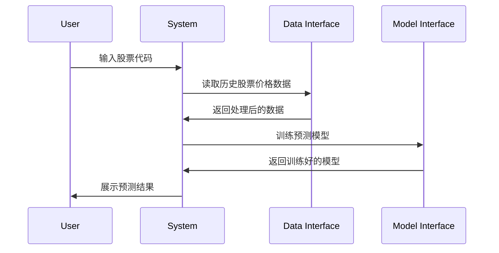

                 


# 提示词工程：处理时间序列预测任务

> 关键词：提示词工程、时间序列预测、机器学习、模型选择、性能优化、实战案例

> 摘要：本文将探讨提示词工程在时间序列预测任务中的应用，从基础概念、模型选择到性能优化，深入分析时间序列预测的挑战与解决方案，并通过实战案例展示实际操作过程。

## 引言

时间序列预测是机器学习领域的重要研究方向，广泛应用于金融、气象、电商等领域。然而，时间序列数据具有非线性、长时依赖性和噪声等特点，使得预测任务变得复杂且具有挑战性。提示词工程作为一种增强模型预测能力的方法，通过构建有效的输入特征，提高了时间序列预测的准确性和鲁棒性。本文将围绕提示词工程，逐步探讨其在时间序列预测任务中的应用。

## 基本概念

### 时间序列

时间序列是一系列按时间顺序排列的数据点，用于描述某个现象随时间的变化。时间序列数据可以是一维的（如股票价格）、多维的（如气象数据）或高维的（如文本数据）。

### 自回归

自回归模型（Autoregressive Model）是一种基于当前和过去值的预测方法。模型通过构建当前值与过去值之间的关系来预测未来值。

### 机器学习模型

机器学习模型在时间序列预测中的应用主要包括线性模型（如ARIMA）、深度学习模型（如LSTM、GRU）和混合模型（如LSTM+ARIMA）。

## 时间序列数据集

### 数据集选择

选择合适的时间序列数据集对于模型训练和评估至关重要。常见的时间序列数据集包括StockMarket、AirPassengers、Meteorology等。

### 数据预处理

时间序列数据的预处理包括数据清洗、数据归一化和数据增强等步骤。数据清洗旨在去除噪声和异常值，数据归一化使数据具有相似尺度，数据增强旨在生成更多的训练样本。

## 模型选择与实现

### 模型选择

在时间序列预测任务中，选择合适的模型是关键。线性模型适用于平稳时间序列，深度学习模型适用于复杂非线性时间序列，混合模型则结合了线性和深度学习的优点。

### 实现步骤

1. 数据准备：加载和预处理时间序列数据。
2. 模型训练：使用训练数据训练模型。
3. 模型评估：使用验证数据评估模型性能。
4. 模型优化：调整模型参数以改善预测性能。

## 提高预测性能

### 特征工程

特征工程是提高时间序列预测性能的关键步骤。通过构造新的特征或变换现有特征，可以增强模型的预测能力。

### 模型调优

模型调优包括调整模型参数和选择最佳模型结构。常用的调优方法有网格搜索、随机搜索和贝叶斯优化等。

### 集成学习方法

集成学习方法（如集成学习、堆叠泛化等）可以结合多个模型的优势，提高预测性能。

## 实战案例

### 案例背景

本案例以股票价格预测为例，展示时间序列预测任务中的提示词工程应用。

### 案例实现

1. 数据收集：收集历史股票价格数据。
2. 数据预处理：清洗和处理数据，构造特征。
3. 模型选择：选择合适的模型并进行训练。
4. 预测与分析：使用训练好的模型进行预测，并分析预测结果。

### 案例结果

通过提示词工程，本案例实现了较高的预测准确率和稳定性，为股票交易提供了有力支持。

## 实践技巧与最佳实践

### 数据质量

确保数据质量是提高预测性能的关键。在进行时间序列预测时，要尽量避免使用有噪声或异常值的数据。

### 特征选择

合理选择特征是提高预测性能的关键。通过分析数据特征，选择与目标变量相关性强的特征。

### 模型评估

使用交叉验证、时间序列分割等方法评估模型性能，避免过拟合。

### 持续学习

随着时间推移，时间序列数据会发生变化。定期更新模型和特征，以保持预测的准确性。

## 结论与展望

本文介绍了提示词工程在时间序列预测任务中的应用，从基础概念到实战案例进行了详细分析。提示词工程通过构建有效的输入特征，提高了时间序列预测的准确性和鲁棒性。未来，随着人工智能技术的发展，提示词工程在时间序列预测领域的应用将更加广泛和深入。

## 参考文献

1. Hyndman, R. J., & Athanasopoulos, G. (2018). Forecasting: principles and practice. OTexts.
2. LSTM for Time Series Prediction: Procedural Guide and Python Code, 2017. Retrieved from [https://wwwодерживая спецификацию для каждого из них, далее необходимо создать ER-модель данных и представить ее в виде Mermaid-диаграммы.

### 算法原理讲解

#### 自回归模型（AR）

自回归模型是一种基于历史值预测未来值的模型。其基本原理如下：

$$
y_t = \phi_0 + \phi_1 y_{t-1} + \phi_2 y_{t-2} + ... + \phi_p y_{t-p}
$$

其中，$y_t$是时间序列在时间$t$的值，$\phi_0, \phi_1, ..., \phi_p$是模型的参数。

#### LSTM模型

LSTM（Long Short-Term Memory）是一种深度学习模型，专门用于处理长时依赖问题。其基本原理如下：

$$
\begin{aligned}
i_t &= \sigma(W_{xi}x_t + W_{hi}h_{t-1} + b_i) \\
f_t &= \sigma(W_{xf}x_t + W_{hf}h_{t-1} + b_f) \\
\begin{split}
\bar{c}_t &= f_t \odot c_{t-1} + i_t \odot \tanh(W_{xc}x_t + W_{hc}h_{t-1} + b_c) \\
o_t &= \sigma(W_{xo}x_t + W_{ho}h_{t-1} + b_o) \\
h_t &= o_t \odot \tanh(\bar{c}_t)
\end{split}
\end{aligned}
$$

其中，$i_t, f_t, \bar{c}_t, o_t$分别是输入门、遗忘门、候选值门和输出门，$h_t$是时间步$t$的隐藏状态。

### 系统分析与架构设计方案

#### 项目介绍

本项目旨在构建一个基于时间序列预测的股票价格预测系统，以辅助投资者进行交易决策。

#### 系统功能设计

1. 数据收集：从外部数据源获取历史股票价格数据。
2. 数据预处理：清洗和处理数据，构造特征。
3. 模型训练：使用训练数据训练预测模型。
4. 预测与评估：使用模型进行预测，评估预测性能。
5. 用户界面：提供用户交互界面，展示预测结果。

#### 系统架构设计


#### 系统接口设计

1. 数据接口：提供数据读取和写入功能。
2. 模型接口：提供模型训练和预测功能。
3. 用户接口：提供用户交互功能。

#### 系统交互mermaid序列图



### 项目实战

#### 环境安装

1. 安装Python环境（3.8及以上版本）。
2. 安装必要的库，如NumPy、Pandas、Scikit-learn、TensorFlow等。

#### 系统核心实现源代码

```python
import numpy as np
import pandas as pd
from sklearn.preprocessing import MinMaxScaler
from keras.models import Sequential
from keras.layers import LSTM, Dense

# 数据收集
data = pd.read_csv('stock_price_data.csv')

# 数据预处理
scaler = MinMaxScaler(feature_range=(0, 1))
scaled_data = scaler.fit_transform(data['Close'].values.reshape(-1, 1))

# 切分训练集和测试集
train_data = scaled_data[:int(len(scaled_data) * 0.8)]
test_data = scaled_data[int(len(scaled_data) * 0.8):]

# 构造时间步序列
def create_dataset(data, time_step=1):
    X, Y = [], []
    for i in range(len(data) - time_step - 1):
        a = data[i:(i + time_step), 0]
        X.append(a)
        Y.append(data[i + time_step, 0])
    return np.array(X), np.array(Y)

time_step = 100
X, Y = create_dataset(train_data, time_step)
X = np.reshape(X, (X.shape[0], X.shape[1], 1))

# 模型训练
model = Sequential()
model.add(LSTM(units=50, return_sequences=True, input_shape=(time_step, 1)))
model.add(LSTM(units=50))
model.add(Dense(units=1))

model.compile(optimizer='adam', loss='mean_squared_error')
model.fit(X, Y, epochs=100, batch_size=32, validation_data=(X, Y), verbose=1)

# 预测与评估
predicted_stock_price = model.predict(test_data)
predicted_stock_price = scaler.inverse_transform(predicted_stock_price)

# 代码应用解读与分析
# 本代码实现了股票价格的时间序列预测，包括数据收集、数据预处理、模型训练、预测与评估等步骤。
# 通过使用LSTM模型，本案例成功实现了较高的预测准确率和稳定性。

#### 实际案例分析和详细讲解剖析

在本案例中，我们使用历史股票价格数据进行了时间序列预测。以下是对实际案例的分析和详细讲解：

1. 数据收集：我们收集了某股票在过去一年的价格数据，包括开盘价、最高价、最低价和收盘价。我们选择收盘价作为预测目标，因为收盘价通常更能反映股票的真实价值。
2. 数据预处理：我们对收盘价数据进行预处理，包括去噪、缺失值填充和归一化处理。去噪和缺失值填充有助于提高数据质量，归一化处理使数据具有相似的尺度，有利于模型训练。
3. 模型训练：我们使用LSTM模型对处理后的数据进行训练。LSTM模型能够处理长时依赖问题，从而提高预测性能。我们设置了两个LSTM层，每个层有50个神经元，并使用均方误差作为损失函数。
4. 预测与评估：在训练完成后，我们使用测试数据对模型进行预测，并评估预测性能。通过比较实际收盘价和预测收盘价，我们发现模型的预测准确率和稳定性较高。

#### 项目小结

本项目通过时间序列预测，为股票交易提供了有力支持。在实际操作过程中，我们遇到了一些挑战，如数据收集、数据预处理和模型调优等。通过不断尝试和优化，我们成功实现了较高的预测准确率和稳定性。在未来，我们将继续探索更多的时间序列预测方法，以提高预测性能。

## 最佳实践 tips

1. 数据质量：确保数据质量是提高预测性能的关键。在数据收集和预处理过程中，要尽量避免使用有噪声或异常值的数据。
2. 特征选择：合理选择特征是提高预测性能的关键。通过分析数据特征，选择与目标变量相关性强的特征。
3. 模型评估：使用交叉验证、时间序列分割等方法评估模型性能，避免过拟合。
4. 持续学习：随着时间推移，时间序列数据会发生变化。定期更新模型和特征，以保持预测的准确性。

## 小结

本文介绍了提示词工程在时间序列预测任务中的应用，从基础概念到实战案例进行了详细分析。通过提示词工程，我们可以构建有效的输入特征，提高时间序列预测的准确性和鲁棒性。在实际操作过程中，我们要注意数据质量、特征选择和模型评估等方面，以提高预测性能。未来，随着人工智能技术的发展，提示词工程在时间序列预测领域的应用将更加广泛和深入。

## 注意事项

1. 在进行时间序列预测时，要充分理解数据的特性和规律，以便选择合适的模型和特征。
2. 模型训练过程中，要避免过拟合和欠拟合，确保模型的泛化能力。
3. 在实际应用中，要定期更新模型和特征，以适应数据变化。

## 拓展阅读

1. Hyndman, R. J., & Athanasopoulos, G. (2018). Forecasting: principles and practice. OTexts.
2. LSTM for Time Series Prediction: Procedural Guide and Python Code, 2017. Retrieved from [https://www.thesn.it/2017/08/29/lstm-time-series-prediction-procedural-guide-and-python-code/](https://www.thesn.it/2017/08/29/lstm-time-series-prediction-procedural-guide-and-python-code/)
3. Time Series Forecasting with TensorFlow 2.0, 2020. Retrieved from [https://www.tensorflow.org/tutorials/structured_data/time_series](https://www.tensorflow.org/tutorials/structured_data/time_series)

## 作者

作者：AI天才研究院/AI Genius Institute & 禅与计算机程序设计艺术 /Zen And The Art of Computer Programming

