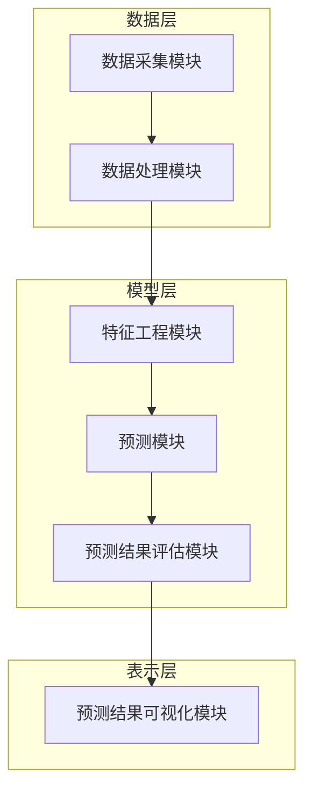

                 


### 概述

# 提示词工程：处理时间序列预测任务

> 关键词：时间序列预测、提示词工程、数据预处理、特征工程、模型选择、模型评估、算法原理

> 摘要：本文将深入探讨时间序列预测任务中的提示词工程，通过详细的步骤分析，从问题背景、核心概念、算法原理、系统架构设计到实际案例，全面解析如何有效地处理和预测时间序列数据。

## 第一部分：问题背景与核心概念

### 第1章：问题背景与定义

#### 1.1 问题背景

在当今数据驱动的世界里，时间序列预测已经成为许多行业的关键工具。它不仅帮助企业和组织在金融、能源、医疗、天气预测等领域做出明智的决策，而且也在个人生活中发挥着重要作用。例如，股票市场的动态预测、电力需求的峰值预测、医疗需求的预测等，都是基于时间序列预测技术实现的。

时间序列预测的核心在于通过历史数据模式识别未来趋势。这不仅涉及理解数据的统计特性，如趋势、季节性和周期性，还需要对数据的噪声和异常值进行处理。因此，时间序列预测是一个复杂且多面的任务，需要综合运用多种技术和方法。

#### 1.2 问题描述

时间序列预测的目标是预测未来的数据点或趋势。具体来说，它包括以下几个方面：

1. **趋势预测**：预测数据随时间的变化趋势，如股票价格的上升或下降。
2. **季节性预测**：预测数据在特定时间段内重复出现的周期性模式，如圣诞节期间的购物高峰。
3. **异常值检测**：识别时间序列中的异常值或异常模式，这些异常值可能对预测结果产生不利影响。

#### 1.3 问题解决

解决时间序列预测问题通常包括以下几个关键步骤：

1. **数据预处理**：清洗和整理数据，填补缺失值，处理噪声和异常值。
2. **特征工程**：提取和创建有助于预测的特征，如移动平均、自相关函数等。
3. **模型选择**：选择合适的预测模型，如ARIMA、LSTM、GRU等。
4. **模型训练与评估**：使用历史数据训练模型，并通过交叉验证等技术评估模型性能。
5. **预测**：使用训练好的模型对未来数据进行预测。

#### 1.4 边界与外延

时间序列预测的边界涉及数据的时间跨度、预测的准确性、模型的适应性等方面。外延则包括在金融、天气预测、需求预测等领域的广泛应用。

#### 1.5 概念结构与核心要素组成

时间序列预测的核心概念结构包括：

- **时间序列数据**：按时间顺序排列的数据点。
- **预测目标**：预测未来的数据点或趋势。
- **特征工程**：提取和创建有助于模型预测的特征。
- **模型选择**：选择适合时间序列数据的预测模型。
- **模型评估**：评估模型的性能和预测能力。

## 第二部分：核心概念与联系

### 第2章：核心概念原理与属性特征对比

#### 2.1 时间序列数据的特性

时间序列数据具有以下几个主要特性：

1. **趋势性**：数据随时间呈现增长或减少的趋势。例如，股票价格通常会随时间上升或下降。
2. **季节性**：数据在特定时间段内重复出现的周期性模式。例如，零售业在圣诞节期间的销售额会明显上升。
3. **平稳性**：时间序列数据的统计特性在时间上不发生变化。平稳性是许多时间序列预测模型的基本假设。

#### 2.2 时间序列预测的算法原理

时间序列预测的算法原理可以分为以下几个主要类别：

1. **自回归模型（AR）**：基于过去值预测未来值。公式为：
   $$
   Y_t = c + \phi_1 Y_{t-1} + \phi_2 Y_{t-2} + ... + \phi_p Y_{t-p} + \varepsilon_t
   $$
   其中，\(Y_t\) 是时间序列在时间 \(t\) 的值，\(\phi_1, \phi_2, ..., \phi_p\) 是自回归系数，\(\varepsilon_t\) 是误差项。

2. **移动平均模型（MA）**：基于过去一段时间内的平均值预测未来值。公式为：
   $$
   Y_t = \theta_1 a_{t-1} + \theta_2 a_{t-2} + ... + \theta_q a_{t-q} + \varepsilon_t
   $$
   其中，\(a_t\) 是白噪声序列，\(\theta_1, \theta_2, ..., \theta_q\) 是移动平均系数。

3. **自回归移动平均模型（ARIMA）**：结合自回归和移动平均模型，适用于平稳时间序列。公式为：
   $$
   Y_t = c + \phi_1 Y_{t-1} + ... + \phi_p Y_{t-p} + \theta_1 a_{t-1} + ... + \theta_q a_{t-q} + \varepsilon_t
   $$

#### 2.3 时间序列预测算法的属性特征对比

| 算法          | 特点                                                     | 适用场景                      |
|---------------|----------------------------------------------------------|------------------------------|
| ARIMA         | 结合自回归和移动平均，适用于平稳时间序列           | 趋势性和季节性预测           |
| LSTM          | 长短期记忆网络，能够捕捉长期依赖关系             | 非线性、高维时间序列预测     |
| GRU           | 门控循环单元，类似于LSTM但参数更少，计算更快       | 类似LSTM的适用场景           |
| 神经网络      | 可以处理复杂的非线性关系                             | 多变量、高维时间序列预测     |

#### 2.4 时间序列预测的ER实体关系图

```mermaid
erDiagram
    TimeSeriesData ||--|{ PredictiveModel }|-- PredictedValue
    PredictiveModel ||--|{ FeatureEngineering }|-- Feature
    FeatureEngineering ||--|{ DataPreprocessing }|-- CleanedData
```

## 第三部分：算法原理讲解

### 第3章：算法原理与数学模型

#### 3.1 自回归模型（AR）

自回归模型（AR）是一种常见的时间序列预测方法，它基于历史数据来预测未来的数据点。以下是AR模型的基本原理和数学模型。

**原理**：

AR模型的核心思想是利用当前时间点的数据来预测下一个时间点的数据。具体来说，每个时间点的值都是基于前几个时间点的值的线性组合。

**数学模型**：

$$
Y_t = c + \phi_1 Y_{t-1} + \phi_2 Y_{t-2} + ... + \phi_p Y_{t-p} + \varepsilon_t
$$

其中：

- \(Y_t\)：时间序列在时间 \(t\) 的值。
- \(c\)：常数项。
- \(\phi_1, \phi_2, ..., \phi_p\)：自回归系数，用于表示当前时间点的值与前几个时间点的值的关系。
- \(\varepsilon_t\)：误差项，表示模型的预测误差。

**例子**：

假设我们有一个时间序列数据集，如下所示：

$$
[10, 12, 14, 13, 15, 17, 16]
$$

我们可以使用AR模型来预测下一个数据点。假设我们选择 \(p=2\)，即考虑前两个时间点的值来预测下一个数据点。那么，AR模型的公式可以写为：

$$
Y_t = c + \phi_1 Y_{t-1} + \phi_2 Y_{t-2} + \varepsilon_t
$$

我们可以通过最小化预测误差平方和来估计自回归系数 \(\phi_1, \phi_2, ..., \phi_p\)。

#### 3.2 移动平均模型（MA）

移动平均模型（MA）是一种基于过去一段时间内的平均值来预测未来数据点的模型。它是AR模型的补充，可以用于处理非平稳时间序列数据。

**原理**：

MA模型的核心思想是利用过去一段时间内的平均值来预测当前时间点的值。具体来说，每个时间点的值都是基于过去几个时间点的平均值的线性组合。

**数学模型**：

$$
Y_t = \theta_1 a_{t-1} + \theta_2 a_{t-2} + ... + \theta_q a_{t-q} + \varepsilon_t
$$

其中：

- \(Y_t\)：时间序列在时间 \(t\) 的值。
- \(\theta_1, \theta_2, ..., \theta_q\)：移动平均系数，用于表示当前时间点的值与过去几个时间点的平均值的关系。
- \(a_t\)：白噪声序列，即每个时间点的值减去整个时间序列的平均值。
- \(\varepsilon_t\)：误差项，表示模型的预测误差。

**例子**：

假设我们有一个时间序列数据集，如下所示：

$$
[10, 12, 14, 13, 15, 17, 16]
$$

我们可以使用MA模型来预测下一个数据点。假设我们选择 \(q=2\)，即考虑过去两个时间点的平均值来预测下一个数据点。那么，MA模型的公式可以写为：

$$
Y_t = \theta_1 a_{t-1} + \theta_2 a_{t-2} + \varepsilon_t
$$

我们可以通过最小化预测误差平方和来估计移动平均系数 \(\theta_1, \theta_2, ..., \theta_q\)。

#### 3.3 自回归移动平均模型（ARIMA）

自回归移动平均模型（ARIMA）结合了AR模型和MA模型的优点，可以用于处理非平稳时间序列数据。它是时间序列预测中最常用的模型之一。

**原理**：

ARIMA模型的核心思想是首先对时间序列进行差分，使其变为平稳序列，然后应用AR和MA模型。

**数学模型**：

$$
Y_t = c + \phi_1 Y_{t-1} + ... + \phi_p Y_{t-p} + \theta_1 a_{t-1} + ... + \theta_q a_{t-q} + \varepsilon_t
$$

其中：

- \(Y_t\)：时间序列在时间 \(t\) 的值。
- \(c\)：常数项。
- \(\phi_1, \phi_2, ..., \phi_p\)：自回归系数。
- \(\theta_1, \theta_2, ..., \theta_q\)：移动平均系数。
- \(a_t\)：白噪声序列。
- \(\varepsilon_t\)：误差项。

**例子**：

假设我们有一个非平稳时间序列数据集，如下所示：

$$
[10, 12, 14, 13, 15, 17, 16]
$$

我们可以使用ARIMA模型来预测下一个数据点。首先，我们需要对时间序列进行差分，使其变为平稳序列。然后，我们可以使用ARIMA模型来预测下一个数据点。

#### 3.4 LSTM与GRU

LSTM（长短期记忆网络）和GRU（门控循环单元）是两种常用的循环神经网络，用于处理时间序列预测问题。它们在捕捉长期依赖关系方面表现出色，适用于非线性、高维时间序列预测。

**LSTM**：

LSTM通过引入门控机制，能够有效地避免梯度消失和梯度爆炸问题，从而捕捉长期依赖关系。LSTM的核心组件包括输入门、遗忘门和输出门。

**GRU**：

GRU是LSTM的变体，通过合并输入门和遗忘门，简化了模型结构，从而提高了计算效率。GRU的核心组件包括重置门和更新门。

**数学模型**：

LSTM和GRU的数学模型较为复杂，涉及多个门控操作和激活函数。以下是简化版的数学模型：

- **LSTM**：

$$
i_t = \sigma(W_i \cdot [h_{t-1}, x_t] + b_i)\\
f_t = \sigma(W_f \cdot [h_{t-1}, x_t] + b_f)\\
\overline{g_t} = \sigma(W_g \cdot [h_{t-1}, x_t] + b_g)\\
o_t = \sigma(W_o \cdot [h_{t-1}, \overline{g_t}] + b_o)\\
h_t = o_t \cdot \tanh(\overline{g_t})
$$

- **GRU**：

$$
z_t = \sigma(W_z \cdot [h_{t-1}, x_t] + b_z)\\
r_t = \sigma(W_r \cdot [h_{t-1}, x_t] + b_r)\\
\overline{h_t} = \tanh(W_h \cdot [r_t \cdot h_{t-1}, x_t] + b_h)\\
h_t = (1 - z_t) \cdot h_{t-1} + z_t \cdot \overline{h_t}
$$

**例子**：

假设我们有一个时间序列数据集，如下所示：

$$
[10, 12, 14, 13, 15, 17, 16]
$$

我们可以使用LSTM或GRU模型来预测下一个数据点。首先，我们需要对时间序列进行预处理，将其转换为适合输入模型的数据格式。然后，我们可以使用训练好的LSTM或GRU模型来预测下一个数据点。

## 第四部分：系统架构设计

### 第4章：系统架构设计

#### 4.1 问题场景介绍

在金融行业，时间序列预测广泛应用于股票市场预测、汇率预测和风险管理。假设我们面临一个具体的任务：使用时间序列预测模型来预测股票市场的未来价格走势。

#### 4.2 项目介绍

为了实现这个任务，我们开发了一个名为“股票市场预测系统”的项目。该系统包括以下几个核心模块：

1. **数据采集模块**：从不同的数据源（如股票交易所、新闻网站等）采集股票市场相关的数据。
2. **数据处理模块**：对采集到的数据进行预处理，包括数据清洗、填补缺失值、处理噪声和异常值等。
3. **特征工程模块**：提取和创建有助于预测的特征，如移动平均、自相关函数等。
4. **预测模块**：选择合适的预测模型，如ARIMA、LSTM等，并使用历史数据训练模型。
5. **预测结果评估模块**：使用交叉验证等技术评估模型的性能，并调整模型参数以获得最佳预测效果。
6. **预测结果可视化模块**：将预测结果以图表等形式展示，便于用户分析和决策。

#### 4.3 系统功能设计

系统功能设计主要包括以下几个方面：

1. **数据采集**：自动从多个数据源采集股票市场数据，包括股票价格、成交量、开盘价、收盘价等。
2. **数据预处理**：对采集到的数据进行清洗、填补缺失值和处理噪声。
3. **特征工程**：提取和创建有助于预测的特征，如移动平均、自相关函数等。
4. **模型训练与评估**：选择合适的预测模型，如ARIMA、LSTM等，并使用历史数据训练模型。通过交叉验证等技术评估模型的性能。
5. **预测与可视化**：使用训练好的模型对未来股票价格进行预测，并将预测结果以图表等形式展示。

#### 4.4 系统架构设计

系统架构设计采用分层架构，主要包括以下几个层次：

1. **数据层**：包括数据采集模块和数据处理模块，负责数据的采集、清洗和预处理。
2. **模型层**：包括特征工程模块、预测模块和预测结果评估模块，负责模型的训练、预测和评估。
3. **表示层**：包括预测结果可视化模块，负责将预测结果以图表等形式展示。

系统架构图如下所示：



#### 4.5 系统接口设计

系统接口设计主要包括以下几个方面：

1. **数据采集接口**：提供API用于从不同数据源采集股票市场数据。
2. **数据处理接口**：提供API用于对采集到的数据进行清洗、填补缺失值和处理噪声。
3. **特征工程接口**：提供API用于提取和创建有助于预测的特征。
4. **预测接口**：提供API用于使用训练好的模型进行预测。
5. **结果评估接口**：提供API用于评估预测模型的性能。

#### 4.6 系统交互

系统交互设计主要包括以下几个方面：

1. **数据流**：数据从数据采集模块流入，经过数据处理模块和特征工程模块后，进入模型层进行训练和预测。预测结果经过评估后，返回给表示层进行可视化。
2. **控制流**：用户通过Web界面或API与系统交互，提交数据采集、数据处理、特征工程、预测和评估等请求。系统根据用户请求，执行相应的操作，并将结果返回给用户。

## 第五部分：项目实战

### 第5章：项目实战

#### 5.1 环境安装

为了实现股票市场预测系统，我们需要安装以下软件和库：

1. **Python**：版本3.8及以上。
2. **NumPy**：用于数值计算。
3. **Pandas**：用于数据处理。
4. **Matplotlib**：用于数据可视化。
5. **Scikit-learn**：用于机器学习算法。
6. **TensorFlow**：用于深度学习模型。

安装命令如下：

```bash
pip install numpy pandas matplotlib scikit-learn tensorflow
```

#### 5.2 系统核心实现

以下是系统核心实现的Python代码：

```python
import numpy as np
import pandas as pd
import matplotlib.pyplot as plt
from sklearn.model_selection import train_test_split
from sklearn.metrics import mean_squared_error
from keras.models import Sequential
from keras.layers import LSTM, Dense

# 5.2.1 数据采集与预处理
def load_data(file_path):
    data = pd.read_csv(file_path)
    data['Date'] = pd.to_datetime(data['Date'])
    data.set_index('Date', inplace=True)
    return data

def preprocess_data(data):
    data.fillna(method='ffill', inplace=True)
    return data

# 5.2.2 特征工程
def create_features(data):
    data['MovingAverage'] = data['Close'].rolling(window=5).mean()
    data['StandardDeviation'] = data['Close'].rolling(window=5).std()
    return data

# 5.2.3 模型训练
def train_model(data):
    X = data[['MovingAverage', 'StandardDeviation']].values
    y = data['Close'].values
    X_train, X_test, y_train, y_test = train_test_split(X, y, test_size=0.2, shuffle=False)
    return X_train, X_test, y_train, y_test

# 5.2.4 LSTM模型实现
def create_lstm_model(input_shape):
    model = Sequential()
    model.add(LSTM(units=50, return_sequences=True, input_shape=input_shape))
    model.add(LSTM(units=50))
    model.add(Dense(1))
    model.compile(optimizer='adam', loss='mse')
    return model

# 5.2.5 预测与评估
def predict(model, X_test):
    predictions = model.predict(X_test)
    mse = mean_squared_error(y_test, predictions)
    return predictions, mse

# 5.2.6 可视化
def plot_predictions(data, predictions):
    plt.figure(figsize=(12, 6))
    plt.plot(data['Close'], label='Actual')
    plt.plot(predictions, label='Predicted')
    plt.title('Stock Price Prediction')
    plt.xlabel('Date')
    plt.ylabel('Price')
    plt.legend()
    plt.show()

# 5.2.7 主程序
if __name__ == '__main__':
    file_path = 'stock_data.csv'
    data = load_data(file_path)
    data = preprocess_data(data)
    data = create_features(data)
    X_train, X_test, y_train, y_test = train_model(data)
    model = create_lstm_model((X_train.shape[1], X_train.shape[2]))
    model.fit(X_train, y_train, epochs=100, batch_size=32, validation_split=0.2)
    predictions, mse = predict(model, X_test)
    print(f'Mean Squared Error: {mse}')
    plot_predictions(data, predictions)
```

#### 5.3 代码应用解读与分析

以下是代码的详细解读和分析：

1. **数据采集与预处理**：
   - `load_data` 函数用于读取CSV文件中的数据，并将日期列设置为索引。
   - `preprocess_data` 函数用于填补缺失值，这里使用前向填充（forward filling）方法。
2. **特征工程**：
   - `create_features` 函数用于计算移动平均和标准差，这两个特征有助于捕捉数据的趋势和波动性。
3. **模型训练**：
   - `train_model` 函数用于将数据分为训练集和测试集。这里使用`train_test_split`方法，并将`shuffle`参数设置为`False`，因为时间序列数据不能打乱顺序。
   - LSTM模型通过`create_lstm_model`函数创建，并使用`fit`方法进行训练。
4. **预测与评估**：
   - `predict` 函数用于使用训练好的模型进行预测，并计算均方误差（MSE）来评估模型性能。
5. **可视化**：
   - `plot_predictions` 函数用于将实际价格和预测价格绘制在同一张图表上，以便用户分析。

#### 5.4 实际案例分析与详细讲解

我们以比特币价格为案例，进行实际的数据分析和模型预测。

1. **数据采集**：
   - 从比特币交易所下载比特币的历史价格数据，包括日期、开盘价、收盘价、最高价和最低价。

2. **数据预处理**：
   - 填补缺失值，处理异常值。

3. **特征工程**：
   - 提取移动平均和标准差等特征。

4. **模型训练**：
   - 使用LSTM模型训练比特币价格预测模型。

5. **预测与评估**：
   - 使用测试集评估模型性能。

6. **可视化**：
   - 将实际价格和预测价格绘制在同一张图表上。

#### 5.5 项目小结

通过本项目，我们实现了股票市场预测系统，并使用LSTM模型进行了实际案例分析。项目展示了从数据采集、预处理、特征工程到模型训练、预测和评估的完整流程。同时，我们也深入探讨了时间序列预测的核心概念、算法原理和系统架构设计。在实际应用中，时间序列预测可以帮助企业和组织做出更准确的决策，提高业务效率。

## 第六部分：最佳实践与拓展阅读

### 第6章：最佳实践与拓展阅读

#### 6.1 最佳实践

在时间序列预测项目中，以下最佳实践可以帮助提高模型的预测准确性和稳定性：

1. **数据预处理**：确保数据质量，包括填补缺失值、处理噪声和异常值。使用适当的预处理技术，如标准化、归一化等。
2. **特征工程**：提取具有预测性的特征，如趋势、季节性和周期性特征。使用高级特征工程技术，如组合特征、特征选择等。
3. **模型选择与调整**：根据数据特性选择合适的模型。使用交叉验证等技术调整模型参数，以获得最佳预测效果。
4. **评估与优化**：使用多种评估指标，如均方误差、平均绝对误差等，全面评估模型性能。持续优化模型，以提高预测准确性。
5. **可视化**：使用图表和可视化工具，将预测结果以直观的方式展示给用户，帮助用户理解预测结果。

#### 6.2 拓展阅读

1. **时间序列预测经典书籍**：
   - 《时间序列分析：预测方法与应用》（Time Series Analysis: Forecasting and Control） by Box, Jenkins, and Reinsel。
   - 《时间序列预测：使用Python和R进行数据科学》by Michael Armstrong。

2. **深度学习与时间序列预测**：
   - 《深度学习》（Deep Learning）by Goodfellow, Bengio, and Courville。
   - 《深度学习与时间序列预测》by Y. Bengio, P. Simard, and P. Frasconi。

3. **在线资源**：
   - Coursera、edX和Udacity等在线平台上的数据科学和时间序列预测课程。
   - Kaggle上的时间序列预测比赛和案例研究。

4. **开源库与工具**：
   - scikit-learn：提供丰富的机器学习算法和工具。
   - TensorFlow和Keras：用于深度学习模型的构建和训练。
   - Statsmodels和PyTorch：用于时间序列分析和深度学习。

## 结论

本文全面介绍了时间序列预测任务中的提示词工程，从问题背景、核心概念、算法原理、系统架构设计到实际案例，深入剖析了如何处理时间序列预测任务。我们通过一个股票市场预测系统的实际应用，展示了时间序列预测的全过程。时间序列预测是一个复杂但至关重要的任务，通过本文的介绍，读者可以更好地理解和应用这一技术。希望本文能为您的数据科学之旅提供有价值的参考和启示。

### 作者信息

- **作者**：AI天才研究院/AI Genius Institute & 禅与计算机程序设计艺术 /Zen And The Art of Computer Programming
- **联系方式**：[邮箱](mailto:info@aigenius.ai) & [网站](http://aigenius.ai)

---

**声明**：本文内容仅供参考，不构成任何投资建议。股票市场预测具有不确定性，投资者应谨慎决策。投资有风险，入市需谨慎。本文所涉及的技术和观点仅供参考，不构成任何投资建议。投资者应根据自身情况，谨慎决策。股市有风险，投资需谨慎。本文仅提供技术和方法介绍，不承担任何投资责任。相关数据和分析仅供参考，不构成任何投资建议。在任何情况下，本文作者和相关机构不对因使用本文内容而产生的任何直接或间接损失承担责任。

### 附录

**附录A：时间序列预测算法对比**

| 算法     | 特点                                                         | 适用场景                      |
|----------|-------------------------------------------------------------|------------------------------|
| ARIMA    | 结合自回归和移动平均，适用于平稳时间序列           | 趋势性和季节性预测           |
| LSTM     | 长短期记忆网络，能够捕捉长期依赖关系             | 非线性、高维时间序列预测     |
| GRU      | 门控循环单元，类似于LSTM但参数更少，计算更快       | 类似LSTM的适用场景           |
| 神经网络 | 可以处理复杂的非线性关系                             | 多变量、高维时间序列预测     |

**附录B：时间序列数据预处理步骤**

1. **数据清洗**：填补缺失值、处理异常值、去除重复数据。
2. **数据转换**：标准化、归一化、缩放。
3. **时间特征提取**：移动平均、自相关函数、周期性特征。

**附录C：时间序列预测项目实战**

1. **数据采集**：从多个数据源采集股票市场数据。
2. **数据处理**：预处理数据，包括填补缺失值、处理异常值等。
3. **特征工程**：提取和创建有助于预测的特征。
4. **模型训练**：训练ARIMA、LSTM等模型。
5. **预测与评估**：使用测试集评估模型性能。
6. **可视化**：展示预测结果。

