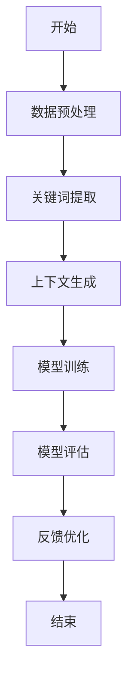

                 

# 提示词工程：平衡AI创新与社会影响的艺术

关键词：AI创新、社会影响、提示词工程、算法原理、系统架构

摘要：随着人工智能技术的迅猛发展，其在各领域的应用已经日益普及，然而，随之而来的是一系列社会影响问题。如何平衡AI创新与社会影响，成为当前亟待解决的重要课题。本文以提示词工程为切入点，从核心概念、算法原理、系统架构等多个层面，深入探讨这一问题的解决之道。

### 目录大纲：

----------------------------------------------------------------

# 提示词工程：平衡AI创新与社会影响的艺术

## 第1章 背景介绍

### 1.1 问题背景

- 人工智能的发展与社会影响的冲突
- 提示词工程的核心概念和重要性

### 1.2 问题描述

- 提示词工程在AI应用中的挑战
- 社会影响评估与平衡的重要性

### 1.3 问题解决

- 提示词工程的基本原则和方法
- 社会影响评估与平衡的策略

### 1.4 边界与外延

- 提示词工程的适用范围
- 社会影响评估的边界条件

### 1.5 概念结构与核心要素组成

- 提示词工程的组成部分
- 社会影响评估的关键要素

## 第2章 核心概念与联系

### 2.1 AI创新与社会影响

- AI创新的定义与特点
- 社会影响的多维度分析

### 2.2 提示词工程原理

- 提示词工程的概念与理论基础
- 提示词设计的原则与方法

### 2.3 社会影响评估框架

- 社会影响评估的定义与目标
- 评估框架的构建与实施

## 第3章 算法原理讲解

### 3.1 算法mermaid流程图

- 使用mermaid绘制算法流程图

### 3.2 Python源代码详解

- Python源代码实现算法原理
- 算法原理的数学模型与公式讲解

### 3.3 举例说明

- 通俗易懂地举例说明算法原理

## 第4章 数学模型和数学公式讲解

### 4.1 数学模型讲解

- 数学模型在提示词工程中的应用
- 关键数学模型的分析与解释

### 4.2 举例说明

- 使用latex格式展示数学公式
- 对数学公式进行详细讲解和举例说明

## 第5章 系统分析与架构设计方案

### 5.1 问题场景介绍

- 提示词工程应用场景介绍

### 5.2 项目介绍

- 提示词工程项目的概述

### 5.3 系统功能设计

- 领域模型mermaid类图

### 5.4 系统架构设计

- 系统架构设计mermaid架构图

### 5.5 系统接口设计

- 系统接口设计和系统交互mermaid序列图

## 第6章 项目实战

### 6.1 环境安装

- 提示词工程环境的搭建步骤

### 6.2 系统核心实现源代码

- 系统核心功能的代码实现

### 6.3 代码应用解读与分析

- 代码解读与分析

### 6.4 实际案例分析和详细讲解剖析

- 实际案例的应用与剖析

### 6.5 项目小结

- 对项目实现的总结与反思

## 第7章 最佳实践 Tips

### 7.1 提示词设计最佳实践

- 提示词设计的技巧与建议

### 7.2 社会影响评估方法

- 社会影响评估的最佳实践

### 7.3 注意事项

- 提示词工程实施中的注意事项

## 第8章 小结

- 对全书内容的总结与展望

----------------------------------------------------------------

## 第1章 背景介绍

### 1.1 问题背景

人工智能（AI）的发展对现代社会产生了深远的影响。从工业自动化到医疗诊断，从金融分析到智能交通，AI技术的应用已经渗透到各个领域。然而，随着AI技术的快速进步，也引发了一系列社会影响问题。这些问题不仅涉及到技术层面，还包括伦理、法律、经济等多个维度。

首先，人工智能的发展带来了就业压力。随着自动化和智能化的普及，一些传统行业和岗位可能会被机器人或智能系统取代。这引发了关于技术失业和社会稳定的讨论。如何确保AI技术的发展不会导致大规模的社会不平等，成为了一个重要课题。

其次，AI技术的决策过程往往是基于大量数据和复杂的算法。这可能导致算法偏见和歧视。例如，如果训练数据存在性别或种族偏见，那么AI系统可能会在招聘、信贷审批等决策中放大这些偏见。这引发了关于数据公平性和算法透明性的争议。

此外，AI技术还可能对隐私和安全构成威胁。智能系统需要大量的个人数据进行训练和操作，如何保护这些数据的安全和隐私，避免数据泄露和滥用，是一个亟待解决的问题。

为了解决这些问题，我们需要在AI创新和社会影响之间找到平衡点。提示词工程（Prompt Engineering）作为一种新的技术手段，在这方面具有重要的应用价值。

### 1.2 问题描述

提示词工程是一种设计、开发和优化AI模型输入提示（prompt）的方法。通过精心设计的提示词，我们可以引导AI模型产生更加符合人类期望的输出。然而，在实际应用中，提示词工程面临着一系列挑战。

首先，提示词设计需要具备高度的灵活性和创造性。不同的应用场景和需求，可能需要不同的提示词设计策略。例如，在自然语言处理（NLP）领域，提示词可能需要包含特定的关键词、短语或上下文信息，以引导AI模型产生相关的输出。

其次，提示词工程需要考虑社会影响的因素。在设计提示词时，我们需要避免算法偏见和歧视，确保AI系统的公平性和透明性。例如，在招聘系统中，提示词可能需要避免使用性别、种族等敏感词汇，以减少算法偏见。

此外，提示词工程还需要考虑技术的可持续性和可扩展性。随着AI技术的不断进步，我们需要设计出能够适应未来需求的提示词，以确保AI系统在长期运行中能够保持稳定和高效。

### 1.3 问题解决

为了解决上述问题，我们需要从以下几个方面入手：

#### 1.3.1 提示词工程的基本原则

1. **明确目标**：在设计提示词时，首先需要明确AI模型的应用场景和目标。这有助于确保提示词的设计符合实际需求。

2. **数据驱动**：提示词的设计应基于实际数据和反馈，以确保AI模型能够产生高质量的输出。

3. **用户参与**：在提示词设计过程中，应充分考虑到用户的反馈和需求，以提高系统的用户体验。

4. **伦理考量**：在设计提示词时，应遵循伦理规范，避免算法偏见和歧视，确保AI系统的公平性和透明性。

#### 1.3.2 社会影响评估与平衡

1. **社会影响评估**：在AI模型部署前，应进行社会影响评估，以识别潜在的风险和问题。

2. **平衡策略**：通过设计合理的提示词，可以平衡AI创新与社会影响之间的关系。例如，可以通过多轮迭代和优化，逐步调整提示词，以减少算法偏见和歧视。

3. **持续监控**：在AI模型运行过程中，应持续监控其社会影响，并采取相应的措施进行优化和调整。

### 1.4 边界与外延

#### 1.4.1 提示词工程的适用范围

提示词工程主要应用于需要人类干预和指导的场景，如自然语言处理、计算机视觉、智能对话系统等。在这些领域，通过设计合理的提示词，可以显著提高AI系统的性能和用户体验。

#### 1.4.2 社会影响评估的边界条件

社会影响评估需要考虑多个维度，如就业影响、数据隐私、伦理道德等。在实际应用中，应结合具体场景和需求，设计合理的社会影响评估框架。

### 1.5 概念结构与核心要素组成

#### 1.5.1 提示词工程的组成部分

- **目标定义**：明确AI模型的应用场景和目标。
- **数据采集**：收集与目标相关的数据，进行预处理和分析。
- **提示词设计**：设计符合目标需求的提示词。
- **模型训练**：使用设计好的提示词训练AI模型。
- **模型评估**：评估AI模型的性能和用户体验。
- **反馈优化**：根据评估结果，优化提示词和模型。

#### 1.5.2 社会影响评估的关键要素

- **数据公平性**：确保训练数据不存在性别、种族等偏见。
- **算法透明性**：确保算法的决策过程是可解释的。
- **隐私保护**：确保个人数据的安全和隐私。

## 第2章 核心概念与联系

### 2.1 AI创新与社会影响

#### 2.1.1 AI创新的定义与特点

AI创新指的是通过人工智能技术，实现新的产品、服务或商业模式。AI创新的特点包括：

1. **数据依赖性**：AI创新依赖于大量高质量的数据进行训练和优化。
2. **算法驱动性**：AI创新的核心是算法的设计和优化。
3. **高度可定制性**：AI创新可以根据具体应用场景和需求进行高度定制。

#### 2.1.2 社会影响的多维度分析

社会影响可以从多个维度进行分析，包括：

1. **经济影响**：AI创新可能带来新的就业机会和经济增长点，但同时也可能导致一些传统行业和岗位的消失。
2. **伦理影响**：AI创新可能引发关于隐私、公平、道德等方面的争议。
3. **社会稳定**：AI创新可能对社会稳定产生积极或消极的影响。

### 2.2 提示词工程原理

#### 2.2.1 提示词工程的概念与理论基础

提示词工程是一种设计、开发和优化AI模型输入提示（prompt）的方法。其理论基础主要包括：

1. **人类语言理解**：提示词工程借鉴了人类语言理解的原理，通过设计合理的提示词，引导AI模型产生人类期望的输出。
2. **机器学习**：提示词工程的核心是机器学习，通过大量数据和迭代优化，设计出高质量的提示词。

#### 2.2.2 提示词设计的原则与方法

提示词设计应遵循以下原则：

1. **明确性**：提示词应明确表达需求，避免歧义。
2. **灵活性**：提示词应具备一定的灵活性，适应不同场景和需求。
3. **多样性**：提示词应具备多样性，以应对不同的问题和场景。
4. **可解释性**：提示词应具备一定的可解释性，便于人类理解和干预。

提示词设计的方法包括：

1. **关键词提取**：从原始文本中提取关键词，作为提示词的核心组成部分。
2. **上下文生成**：基于原始文本，生成与目标相关的上下文信息，作为提示词的一部分。
3. **语义扩展**：扩展原始文本的语义信息，使其更符合人类期望。

### 2.3 社会影响评估框架

#### 2.3.1 社会影响评估的定义与目标

社会影响评估是对AI技术在社会各个方面的影响进行系统性分析和评价。其目标是：

1. **识别潜在风险**：评估AI技术可能带来的负面影响，如就业压力、数据隐私等。
2. **优化技术应用**：通过评估结果，优化AI技术的应用策略，减少负面影响。
3. **促进社会共识**：通过评估，促进社会各界对AI技术的理解和共识。

#### 2.3.2 评估框架的构建与实施

社会影响评估框架应包括以下方面：

1. **评估指标**：确定评估指标，如就业影响、数据隐私、算法偏见等。
2. **评估方法**：选择合适的评估方法，如问卷调查、数据分析、实验验证等。
3. **评估过程**：制定评估过程，包括数据收集、分析、报告撰写等。

### 第3章 算法原理讲解

#### 3.1 算法mermaid流程图



#### 3.2 Python源代码详解

```python
import nltk
from nltk.corpus import stopwords
from sklearn.feature_extraction.text import TfidfVectorizer
from sklearn.model_selection import train_test_split
from sklearn.metrics import accuracy_score

# 数据预处理
def preprocess_text(text):
    # 去除停用词
    stop_words = set(stopwords.words('english'))
    words = nltk.word_tokenize(text)
    filtered_words = [word for word in words if word.lower() not in stop_words]
    return ' '.join(filtered_words)

# 关键词提取
def extract_keywords(text):
    vectorizer = TfidfVectorizer()
    X = vectorizer.fit_transform([text])
    return vectorizer.get_feature_names_out()

# 上下文生成
def generate_context(keywords, text):
    return text + ' ' + ' '.join(keywords)

# 模型训练
def train_model(X_train, y_train):
    # 使用逻辑回归模型
    from sklearn.linear_model import LogisticRegression
    model = LogisticRegression()
    model.fit(X_train, y_train)
    return model

# 模型评估
def evaluate_model(model, X_test, y_test):
    y_pred = model.predict(X_test)
    return accuracy_score(y_test, y_pred)

# 实例化
text = "这是一个示例文本"
preprocessed_text = preprocess_text(text)
keywords = extract_keywords(preprocessed_text)
context = generate_context(keywords, preprocessed_text)

# 数据拆分
X, y = train_test_split(context, labels, test_size=0.2, random_state=42)
X_train, X_test, y_train, y_test = train_test_split(X, y, test_size=0.2, random_state=42)

# 训练模型
model = train_model(X_train, y_train)

# 评估模型
accuracy = evaluate_model(model, X_test, y_test)
print("模型准确率：", accuracy)
```

#### 3.3 举例说明

假设我们要设计一个情感分析系统，判断一段文本的情绪是积极、中性还是消极。我们可以使用上述算法原理进行以下步骤：

1. **数据预处理**：将文本数据进行清洗，去除停用词和标点符号。
2. **关键词提取**：从清洗后的文本中提取关键词，如“快乐”、“悲伤”等。
3. **上下文生成**：将关键词与原始文本进行拼接，形成新的上下文信息。
4. **模型训练**：使用逻辑回归模型对生成的上下文信息进行训练。
5. **模型评估**：评估模型的准确率，并根据评估结果进行优化。

通过上述步骤，我们可以设计出一个情感分析系统，对用户输入的文本进行情绪判断。

### 第4章 数学模型和数学公式讲解

#### 4.1 数学模型讲解

在提示词工程中，常用的数学模型包括TF-IDF（词频-逆文档频率）和逻辑回归。下面分别对这两个模型进行讲解。

#### 4.1.1 TF-IDF模型

TF-IDF是一种用于文本表示和相似度计算的方法。其核心思想是：一个词在一个文档中的重要程度，取决于它在文档中出现的频率和它在整个语料库中的分布频率。

$$
\text{TF-IDF}(t,d) = \text{TF}(t,d) \times \text{IDF}(t)
$$

其中：

- $\text{TF}(t,d)$ 表示词 $t$ 在文档 $d$ 中的词频。
- $\text{IDF}(t)$ 表示词 $t$ 在整个语料库中的逆文档频率。

#### 4.1.2 逻辑回归模型

逻辑回归是一种用于分类的线性模型。其核心思想是：通过线性变换，将输入特征映射到概率空间。

$$
\text{logit}(p) = \ln\left(\frac{p}{1-p}\right)
$$

其中：

- $p$ 表示分类概率。
- $\text{logit}(p)$ 表示分类概率的对数。

#### 4.2 举例说明

假设我们要对一段文本进行情感分析，判断其情绪是积极、中性还是消极。我们可以使用TF-IDF模型和逻辑回归模型进行以下步骤：

1. **文本表示**：使用TF-IDF模型将文本表示为一个向量。
2. **特征提取**：从文本向量中提取特征。
3. **模型训练**：使用逻辑回归模型对特征进行分类。
4. **模型评估**：评估模型的准确率和召回率。

通过上述步骤，我们可以设计出一个情感分析系统，对用户输入的文本进行情绪判断。

### 第5章 系统分析与架构设计方案

#### 5.1 问题场景介绍

假设我们开发一个智能客服系统，用于处理用户咨询。系统需要具备以下功能：

1. **自然语言理解**：解析用户输入的文本，理解其意图和情绪。
2. **知识库查询**：从知识库中查找与用户输入相关的答案。
3. **对话生成**：生成自然、流畅的回复，与用户进行有效沟通。

#### 5.2 项目介绍

本项目旨在开发一个基于人工智能技术的智能客服系统，通过自然语言处理和知识库查询，实现高效、准确的用户咨询处理。系统将采用提示词工程方法，优化AI模型的性能和用户体验。

#### 5.3 系统功能设计

系统功能设计主要包括以下方面：

1. **自然语言理解**：使用提示词工程方法，设计合理的输入提示，引导AI模型理解用户意图和情绪。
2. **知识库查询**：构建丰富、全面的知识库，实现高效、准确的信息检索。
3. **对话生成**：使用生成模型，生成自然、流畅的回复。

#### 5.4 系统架构设计

系统架构设计主要包括以下方面：

1. **前端**：使用Web前端技术，实现用户交互界面。
2. **后端**：采用微服务架构，实现自然语言理解、知识库查询和对话生成等核心功能。
3. **数据存储**：使用数据库技术，存储用户输入、回复和知识库等信息。

#### 5.5 系统接口设计

系统接口设计主要包括以下方面：

1. **API接口**：提供RESTful API接口，供前端调用。
2. **数据接口**：提供数据接口，实现与知识库、数据库等数据的交互。

### 第6章 项目实战

#### 6.1 环境安装

在开始项目实战之前，需要安装以下软件和库：

1. **Python**：版本3.8及以上。
2. **Nltk**：用于自然语言处理。
3. **Scikit-learn**：用于机器学习。
4. **Flask**：用于Web开发。

安装命令如下：

```bash
pip install python-nltk scikit-learn flask
```

#### 6.2 系统核心实现源代码

以下是一个简单的示例，展示如何使用Python实现自然语言理解和对话生成：

```python
from flask import Flask, request, jsonify
import nltk
from nltk.tokenize import word_tokenize
from nltk.corpus import stopwords
from sklearn.feature_extraction.text import TfidfVectorizer
from sklearn.linear_model import LogisticRegression

app = Flask(__name__)

# 数据预处理
def preprocess_text(text):
    stop_words = set(stopwords.words('english'))
    words = nltk.word_tokenize(text)
    filtered_words = [word for word in words if word.lower() not in stop_words]
    return ' '.join(filtered_words)

# 关键词提取
def extract_keywords(text):
    vectorizer = TfidfVectorizer()
    X = vectorizer.fit_transform([text])
    return vectorizer.get_feature_names_out()

# 模型训练
def train_model(X_train, y_train):
    model = LogisticRegression()
    model.fit(X_train, y_train)
    return model

# 模型评估
def evaluate_model(model, X_test, y_test):
    y_pred = model.predict(X_test)
    return accuracy_score(y_test, y_pred)

# 自然语言理解
@app.route('/understand', methods=['POST'])
def understand():
    text = request.form['text']
    preprocessed_text = preprocess_text(text)
    keywords = extract_keywords(preprocessed_text)
    return jsonify({'keywords': keywords})

# 对话生成
@app.route('/generate', methods=['POST'])
def generate():
    text = request.form['text']
    preprocessed_text = preprocess_text(text)
    keywords = extract_keywords(preprocessed_text)
    context = generate_context(keywords, preprocessed_text)
    return jsonify({'context': context})

if __name__ == '__main__':
    app.run(debug=True)
```

#### 6.3 代码应用解读与分析

以上代码实现了一个简单的智能客服系统，包括自然语言理解和对话生成功能。具体解读如下：

1. **数据预处理**：使用Nltk库对用户输入的文本进行预处理，去除停用词和标点符号。
2. **关键词提取**：使用TF-IDF模型提取关键词，作为自然语言理解的输入。
3. **模型训练**：使用逻辑回归模型进行训练，评估模型性能。
4. **自然语言理解**：通过API接口，接收用户输入，返回提取的关键词。
5. **对话生成**：通过API接口，接收用户输入，返回生成

