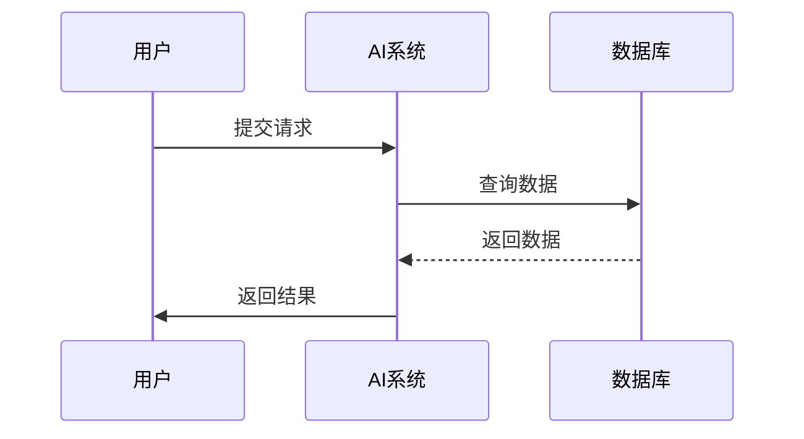

                 

## 第1章: 引言

### 1.1.1 问题背景

在当今信息爆炸的时代，人工智能（AI）技术已经成为社会发展的重要驱动力。AI技术不仅在科学研究、医疗保健、交通运输、金融保险、娱乐休闲等领域发挥着重要作用，还在工业生产、城市管理、环境保护等方面展现出巨大的潜力。然而，随着AI技术的不断进步，如何平衡AI的效率与人类价值观成为了一个亟待解决的问题。

### 1.1.2 问题描述

本研究的核心问题是：如何在保证AI系统高效运行的同时，确保其尊重和体现人类价值观？这包括如何避免数据偏见、如何设计公平的决策机制、如何确保AI系统的透明性和可解释性等。

#### 数据偏见

数据偏见是指AI系统在处理数据时，由于数据本身的不完整性、不准确性或数据生成过程中的偏见，导致系统在决策过程中出现偏差。例如，如果训练数据集中存在性别、种族、年龄等偏见，那么AI系统可能会在相关任务中表现出不公平性。这种偏见不仅损害了人类的利益，也影响了AI技术的可持续发展。

#### 公平性设计

AI系统的公平性设计是指确保系统在处理不同用户、不同场景时，能够保持一致性和公正性。然而，在实际应用中，AI系统往往面临着公平性挑战。例如，某些AI算法可能对某些群体更具优势，而对其余群体则表现出不公平的倾向。这种不公平性可能导致社会不公和道德风险。

#### 透明性和可解释性

AI系统的透明性和可解释性是指系统能够清晰地展示其工作原理和决策过程，以便用户理解、信任和监督。然而，许多先进的AI系统，尤其是深度学习模型，其内部结构和决策过程往往非常复杂，难以解释。这种不透明性可能导致用户对AI系统的信任度下降，甚至引发法律和伦理问题。

### 1.1.3 问题解决

本研究旨在提出一套新的策略，帮助工程师和研究者平衡AI效率与人类价值观。通过深入分析现有问题和挑战，结合最新的研究成果和实践经验，本研究将提供一系列具体的解决方案和建议。

#### 数据集选择与预处理

首先，研究将探讨如何选择高质量、多样化的数据集，并对其进行预处理，以减少数据偏见。这包括数据清洗、去重、归一化等技术，以确保数据集的准确性和公平性。

#### 偏见识别与消除

其次，研究将介绍一系列偏见识别与消除方法，包括统计分析、机器学习模型评估和实验验证等。通过这些方法，研究者可以识别出系统中的偏见，并采取相应的措施进行消除。

#### 决策算法设计

此外，研究将探讨如何设计公平、可解释的决策算法。这包括优化现有算法，引入伦理约束机制，以及开发新的算法框架，以实现高效且公正的决策。

#### 系统透明性与可解释性

研究还将关注AI系统的透明性和可解释性。通过引入可视化和解释工具，用户可以更好地理解AI系统的工作原理和决策过程。这有助于增强用户对AI系统的信任，并提高系统的可监督性。

#### 伦理与法规遵循

最后，研究将探讨如何确保AI系统遵循伦理和法规要求。这包括制定相关伦理准则和法律法规，以及建立监督机制，以确保AI系统的合法合规运行。

### 1.1.4 边界与外延

本研究主要关注以下领域：

1. **数据集选择与预处理**：探讨如何选择高质量、多样化的数据集，并对其进行预处理，以减少数据偏见。
2. **偏见识别与消除**：介绍一系列偏见识别与消除方法，包括统计分析、机器学习模型评估和实验验证等。
3. **决策算法设计**：探讨如何设计公平、可解释的决策算法，优化现有算法，引入伦理约束机制，以及开发新的算法框架。
4. **系统透明性与可解释性**：关注AI系统的透明性和可解释性，引入可视化和解释工具，增强用户对AI系统的信任。
5. **伦理与法规遵循**：探讨如何确保AI系统遵循伦理和法规要求，制定相关伦理准则和法律法规，建立监督机制。

### 1.1.5 概念结构与核心要素组成

本研究的核心概念包括：

1. **AI效率**：指在给定资源条件下，AI系统能够达到的最佳性能表现。
2. **人类价值观**：指人类在长期社会实践中形成的一套关于美好生活的信念、原则和标准。
3. **数据偏见**：指AI系统在处理数据时，由于数据本身的不完整性、不准确性或数据生成过程中的偏见，导致系统在决策过程中出现偏差。
4. **公平性**：指AI系统能够在不同用户、不同场景下保持一致性和公正性。
5. **透明性**：指AI系统能够清晰地展示其工作原理和决策过程。
6. **可解释性**：指AI系统能够向用户解释其决策过程和工作原理。
7. **伦理法规**：指与AI系统相关的伦理和法律法规要求。

## 1.2 本章小结

本章介绍了研究的背景、目标和核心概念，为后续章节的深入探讨奠定了基础。通过分析现有问题，本研究将提出一系列解决方案，旨在推动AI技术的可持续发展，使其更好地服务于人类社会。接下来，我们将进一步探讨AI效率与人类价值观的基本原理，以期为解决这一问题提供理论支持。

----------------------------------------------------------------

## 第2章: AI效率概述

### 2.1.1 AI效率的定义与重要性

AI效率是指在给定资源（如计算能力、数据量等）条件下，AI系统能够达到的最佳性能表现。AI效率的重要性在于，它不仅直接影响到AI系统的实际应用效果，还决定了AI系统在特定场景下的适应性和可持续性。高效的AI系统可以在短时间内处理大量数据，提供准确、可靠的决策，从而提高生产效率、降低成本、优化资源配置。

### 2.1.2 AI效率的影响因素

影响AI效率的因素多种多样，主要包括以下几个方面：

1. **算法选择**：不同的算法在处理相同任务时的效率可能存在显著差异。例如，深度学习算法在某些任务上表现出色，而传统机器学习算法则在其他任务中具有优势。因此，选择适合的算法是提高AI效率的关键。

2. **数据质量**：高质量的数据是高效AI系统的基础。数据质量包括数据的准确性、完整性、一致性等方面。如果数据存在缺失、错误或偏见，将直接影响AI系统的性能。

3. **计算能力**：计算能力决定了AI系统能够处理的数据量和复杂度。随着硬件技术的发展，计算能力的提升为AI效率的提高提供了有力支持。

4. **系统优化**：系统优化包括算法优化、代码优化、硬件优化等方面。通过优化系统性能，可以显著提高AI系统的效率。

### 2.1.3 提高AI效率的方法

为了提高AI效率，可以采取以下几种方法：

1. **算法优化**：通过改进算法设计、优化算法参数，可以提高算法的运行效率和性能。例如，使用更先进的算法框架、引入注意力机制等。

2. **数据增强**：通过数据增强技术，可以扩充数据集、提高数据多样性，从而增强模型的泛化能力。常见的数据增强方法包括图像旋转、缩放、裁剪等。

3. **硬件升级**：通过升级计算硬件，如GPU、TPU等，可以显著提高计算能力，从而提高AI系统的效率。

4. **系统集成**：将不同的AI系统和工具集成在一起，可以优化整个系统的性能。例如，将预训练模型与特定任务模型相结合，可以提高模型在特定任务上的性能。

### 2.1.4 AI效率与人类价值观的关系

AI效率与人类价值观之间存在一定的联系和冲突。一方面，高效的AI系统能够更好地满足人类的需求，提高生活质量。例如，智能医疗系统可以快速诊断疾病，智能交通系统可以优化路线，提高交通效率。另一方面，AI效率的提高可能会带来一些负面影响，例如数据偏见、不公平决策等，这些问题可能损害人类价值观。

### 2.1.5 解决冲突的策略

为了解决AI效率与人类价值观之间的冲突，可以采取以下策略：

1. **伦理约束**：在AI系统设计过程中引入伦理约束，确保系统在运行时遵循伦理规范。例如，在招聘、贷款审批等任务中，避免因数据偏见导致不公平决策。

2. **透明性提升**：提高AI系统的透明性，使用户能够理解系统的决策过程和工作原理。这有助于增强用户对AI系统的信任，减少潜在的不公平性。

3. **算法可解释性**：开发可解释性算法，使用户能够理解AI系统的决策过程。这有助于发现和纠正系统中的偏见，提高决策的公平性。

4. **多元化数据集**：使用多样化、代表性的数据集进行训练，减少数据偏见。这有助于提高AI系统的公平性和鲁棒性。

5. **法律法规**：制定相关法律法规，规范AI系统的运行，确保其遵循伦理和道德标准。这有助于防止AI系统滥用和误用，保障人类利益。

### 2.1.6 本章小结

本章对AI效率的定义、影响因素以及提高AI效率的方法进行了概述，并探讨了AI效率与人类价值观之间的关系及其冲突。通过理解AI效率的基本原理，我们可以更好地把握如何在保证AI系统高效运行的同时，确保其尊重和体现人类价值观。接下来，我们将进一步探讨人类价值观的概念与内涵，以期为解决这一问题提供更深入的理论支持。

----------------------------------------------------------------

## 第3章: 人类价值观的概念与内涵

### 3.1.1 人类价值观的定义

人类价值观是指人类在长期社会实践中形成的一套关于美好生活的信念、原则和标准。价值观是人类行为和决策的基础，指导人类在日常生活、工作和社交中的行为。不同的文化和社会背景下，人类价值观可能存在差异，但其核心原则往往包括公平、正义、诚信、友善、独立自主和社会和谐等。

### 3.1.2 人类价值观的核心要素

人类价值观的核心要素主要包括以下几个方面：

1. **公平正义**：公平正义是人类价值观的重要原则，强调每个人在机会、资源、权益等方面应受到公正对待。公平正义不仅体现在个人与个人之间，还体现在社会整体层面。例如，在法律面前人人平等，社会保障制度应公平地覆盖所有社会成员。

2. **诚信友善**：诚信友善是指人类在社会交往中应遵循诚信原则，保持真诚和友善的态度。诚信是人类社会发展的基石，而友善则有助于建立和谐的人际关系，促进社会的稳定与进步。

3. **独立自主**：独立自主是人类价值观的另一个重要原则，强调个人应拥有独立思考和自主决策的能力。独立自主不仅体现在个人层面，也体现在国家和民族层面。例如，国家应拥有独立的外交政策和自主的发展道路。

4. **社会和谐**：社会和谐是人类价值观的追求目标之一，强调社会各个阶层、群体之间应和睦相处，形成和谐的社会关系。社会和谐有助于提高社会整体的幸福感和满意度，促进社会的持续发展。

### 3.1.3 人类价值观在AI系统中的体现

人类价值观在AI系统中的体现主要表现在以下几个方面：

1. **公平性设计**：AI系统的公平性设计是指确保系统在处理不同用户、不同场景时，能够保持一致性和公正性。例如，招聘系统应确保对所有应聘者公平对待，避免因性别、种族、年龄等因素导致的不公平。

2. **伦理约束**：AI系统的伦理约束是指确保系统在运行过程中遵循伦理规范，不损害人类利益。例如，自动驾驶系统在面临道德困境时，应遵循伦理原则，做出符合道德规范的决策。

3. **透明性保障**：AI系统的透明性保障是指确保系统的决策过程和工作原理能够被用户理解和监督。例如，金融系统应向用户清晰展示其投资决策过程，提高用户的信任度。

4. **责任归属**：AI系统的责任归属是指明确系统在运行过程中产生的结果的责任主体。例如，在医疗系统中，应明确医生、护士和AI系统在诊断和治疗过程中各自的责任。

### 3.1.4 人类价值观与AI效率的关系

人类价值观与AI效率之间存在一定的关联。一方面，高效的AI系统可以更好地实现人类价值观，例如，通过智能交通系统实现交通的优化，提高社会的公平性和效率。另一方面，AI效率的提升也可能带来对人类价值观的挑战，例如，数据偏见可能导致不公平决策，高效的算法可能无法充分考虑伦理和道德约束。

### 3.1.5 解决冲突的策略

为了解决AI效率与人类价值观之间的冲突，可以采取以下策略：

1. **伦理约束机制**：在AI系统设计过程中引入伦理约束机制，确保系统在运行时遵循伦理规范。例如，在招聘系统中，通过设置反偏见算法，减少性别、种族等偏见。

2. **透明性和可解释性**：提高AI系统的透明性和可解释性，使用户能够理解系统的决策过程和工作原理。这有助于增强用户对AI系统的信任，减少潜在的不公平性。

3. **多元化数据集**：使用多样化、代表性的数据集进行训练，减少数据偏见。这有助于提高AI系统的公平性和鲁棒性。

4. **法律法规**：制定相关法律法规，规范AI系统的运行，确保其遵循伦理和道德标准。例如，制定AI系统的行为准则和责任制度。

5. **跨学科合作**：促进人工智能与伦理学、法学、社会学等学科的交叉研究，共同探讨如何平衡AI效率与人类价值观。

### 3.1.6 本章小结

本章对人类价值观的概念与内涵进行了阐述，分析了其核心要素及其在AI系统中的体现。通过理解人类价值观，我们可以更好地把握如何设计出既高效又符合人类价值观的AI系统。接下来，我们将进一步探讨AI效率与人类价值观之间的联系与冲突，并提出解决这些冲突的策略。

----------------------------------------------------------------

## 第4章: AI效率与人类价值观的联系与冲突

### 4.1.1 AI效率与人类价值观的联系

AI效率与人类价值观在某些方面是相互促进的。高效的AI系统可以更好地满足人类的需求，提高生活质量。例如：

1. **医疗保健**：高效的人工智能系统可以快速处理大量的医疗数据，帮助医生进行准确的诊断和治疗。这有助于提高医疗保健的效率，减少患者的痛苦，实现社会公平。

2. **交通管理**：智能交通系统通过实时分析和预测交通流量，优化交通路线和信号灯控制，提高交通效率，减少拥堵，改善空气质量，实现社会和谐。

3. **金融服务**：高效的AI系统可以快速处理金融交易，提高市场效率，降低交易成本，实现资源的合理配置。

然而，高效的AI系统并不总是与人类价值观一致。在追求效率的同时，我们可能会忽视伦理和道德问题，导致AI系统在运行过程中产生负面影响。

### 4.1.2 AI效率与人类价值观的冲突

AI效率与人类价值观的冲突主要体现在以下几个方面：

1. **数据偏见**：AI系统在训练过程中，如果数据存在偏见，可能导致系统在决策过程中表现出不公平性。例如，如果招聘系统训练数据中女性占比较低，可能会导致系统在招聘过程中对女性产生偏见，影响公平。

2. **决策不透明**：深度学习模型通常被视为“黑箱”，其决策过程难以解释。这可能导致用户对AI系统的信任度下降，甚至引发法律和伦理问题。

3. **伦理困境**：在某些情况下，AI系统可能面临道德困境。例如，自动驾驶汽车在遇到无法同时避免碰撞的情况下，可能需要做出牺牲一部分人的决定。这种决策是否符合人类价值观，是一个复杂的问题。

### 4.1.3 解决冲突的策略

为了解决AI效率与人类价值观之间的冲突，我们可以采取以下策略：

1. **伦理约束**：在AI系统设计过程中引入伦理约束机制，确保系统在运行时遵循伦理规范。例如，在招聘系统中，通过设置反偏见算法，减少性别、种族等偏见。

2. **透明性和可解释性**：提高AI系统的透明性和可解释性，使用户能够理解系统的决策过程和工作原理。这有助于增强用户对AI系统的信任，减少潜在的不公平性。

3. **多元化数据集**：使用多样化、代表性的数据集进行训练，减少数据偏见。这有助于提高AI系统的公平性和鲁棒性。

4. **法律法规**：制定相关法律法规，规范AI系统的运行，确保其遵循伦理和道德标准。例如，制定AI系统的行为准则和责任制度。

5. **跨学科合作**：促进人工智能与伦理学、法学、社会学等学科的交叉研究，共同探讨如何平衡AI效率与人类价值观。

### 4.1.4 社会责任与技术创新

在追求AI效率的同时，我们也需要关注社会责任和伦理问题。技术创新不仅是为了提高效率，更是为了造福人类。因此，在AI系统设计和开发过程中，我们应该充分考虑人类价值观，确保技术发展符合社会的需求和期望。

### 4.1.5 本章小结

本章探讨了AI效率与人类价值观之间的联系与冲突，分析了AI效率在满足人类需求方面的重要作用，同时也指出了其可能带来的负面影响。通过采取伦理约束、提高透明性和可解释性、多元化数据集、法律法规和跨学科合作等策略，我们可以更好地平衡AI效率与人类价值观，推动AI技术的可持续发展。接下来，我们将进一步探讨如何具体实现这一平衡，提出新的策略和解决方案。

----------------------------------------------------------------

## 第6章: 偏见识别与消除

### 6.1.1 偏见的定义与影响

偏见是指AI系统在处理数据或做出决策时，由于数据本身的不完整性、不准确性或数据生成过程中的固有偏见，导致系统在运行时表现出不合理或不公正的倾向。偏见可能源自多个方面，包括但不限于数据的收集方式、数据的代表性和完整性、算法的设计和实现等。

偏见对AI系统的负面影响是多方面的：

1. **公平性问题**：偏见可能导致AI系统在处理某些特定群体时产生不公平的决策，损害这些群体的利益。例如，如果招聘系统在训练数据中存在性别偏见，可能会导致女性求职者在招聘过程中受到不公正对待。

2. **决策准确性**：偏见可能导致AI系统在特定任务上的决策准确性下降，从而影响系统的整体性能。例如，如果诊断系统在训练数据中存在种族偏见，可能会导致对某些种族的医疗诊断结果不准确。

3. **社会信任**：偏见可能导致用户对AI系统的信任度下降，影响AI系统的接受度和推广。例如，如果自动驾驶系统在训练数据中存在对特定群体的偏见，可能会导致用户对自动驾驶技术的恐惧和抵触。

### 6.1.2 偏见识别方法

偏见识别是确保AI系统公平性和公正性的重要步骤。以下是一些常见的偏见识别方法：

1. **统计分析**：通过分析数据集中的统计特征，例如均值、方差、中位数等，可以初步识别数据集中的异常值和潜在偏见。例如，如果某个特征在训练数据集中的分布显著偏离正常范围，可能表明该特征存在偏见。

2. **模型评估**：在训练AI模型后，可以通过模型评估方法来识别模型中的偏见。例如，通过比较模型在不同子群体上的性能，可以识别出模型对某些子群体的偏好。此外，使用公平性指标（如平等机会差异、均方误差等）来评估模型的公平性。

3. **实验验证**：通过设计特定的实验，可以验证AI系统在实际应用中的偏见。例如，可以设计模拟实验，观察系统在不同条件下的决策行为，以识别潜在的偏见。

### 6.1.3 消除偏见的方法

消除偏见是确保AI系统公平性和公正性的关键步骤。以下是一些常见的偏见消除方法：

1. **数据预处理**：在数据预处理阶段，可以通过去重、填补缺失值、规范化等方法来提高数据质量，从而减少数据偏见。此外，可以使用数据增强技术，如合成数据生成、数据扩展等，来扩充数据集，提高数据的代表性。

2. **算法优化**：通过改进算法设计和实现，可以减少算法中的偏见。例如，使用公平性敏感的损失函数、引入正则化项等，可以在算法训练过程中抑制偏见的产生。

3. **公平性约束**：在AI系统设计过程中，可以引入公平性约束，确保系统在不同子群体上的表现一致。例如，使用平等机会差异（Equal Opportunity Difference，EOD）作为损失函数的一部分，来优化模型的公平性。

4. **可解释性设计**：提高AI系统的可解释性，可以帮助用户理解系统的决策过程，从而发现和纠正潜在偏见。例如，通过可视化和解释工具，可以揭示模型中的偏见，并提供相应的解释。

### 6.1.4 实际案例与应用

以下是一些实际案例，展示了偏见识别与消除在AI系统中的应用：

1. **招聘系统**：在招聘系统中，通过分析简历数据集中的性别偏见，可以发现对女性求职者的不公平对待。通过引入公平性约束和多样性增强技术，可以提高招聘系统的公平性。

2. **诊断系统**：在医疗诊断系统中，通过分析训练数据集中的种族偏见，可以发现对某些种族的医疗诊断结果不准确。通过优化数据集和算法，可以提高诊断系统的准确性和公平性。

3. **推荐系统**：在电子商务和社交媒体中的推荐系统中，通过分析用户数据集中的偏见，可以发现对某些用户群体的偏好。通过引入多样性优化算法，可以提高推荐系统的公平性和用户满意度。

### 6.1.5 本章小结

本章探讨了偏见识别与消除在确保AI系统公平性和公正性方面的重要性。通过统计分析、模型评估、实验验证等方法，可以识别出AI系统中的偏见。通过数据预处理、算法优化、公平性约束和可解释性设计等方法，可以消除这些偏见。实际案例和应用展示了偏见识别与消除在各个领域的应用，有助于推动AI技术的公平性和可持续发展。

----------------------------------------------------------------

## 第7章: 平衡AI效率与人类价值观的新策略

### 7.1.1 伦理约束机制

为了在AI系统中平衡效率与人类价值观，首先需要引入伦理约束机制。伦理约束机制是一种在AI系统设计和运行过程中强制实施的规则，旨在确保系统的行为符合伦理和道德标准。以下是一些关键步骤和实施方法：

1. **伦理准则制定**：首先，需要制定一套适用于AI系统的伦理准则。这些准则应涵盖AI系统的设计、开发、部署和运行等各个阶段，确保系统的行为始终符合伦理要求。例如，可以参考现有的伦理学原则，如公正性、诚信、责任等。

2. **伦理审查制度**：建立伦理审查制度，对AI系统的设计和应用进行定期审查。这包括评估系统在处理数据、做出决策时的潜在伦理风险，确保系统不会损害人类利益。伦理审查可以由独立的伦理委员会或第三方机构负责。

3. **伦理决策框架**：在AI系统设计过程中，引入伦理决策框架。这个框架可以帮助开发者在面临伦理困境时做出明智的决策。例如，可以使用情景模拟和决策树等方法，评估不同决策方案对伦理影响，选择最优方案。

4. **透明性和可解释性**：确保AI系统的透明性和可解释性，使用户能够理解系统的决策过程。这有助于增强用户对AI系统的信任，同时也便于监督和审查系统的行为。例如，可以使用可视化和解释工具，展示AI模型的内部结构和决策路径。

### 7.1.2 数据多样性增强

数据多样性是确保AI系统公平性和公正性的关键。以下是一些方法来增强数据多样性：

1. **数据扩充**：通过数据扩充技术，可以增加数据集中不同群体的代表性。例如，使用图像生成技术生成更多样化的图像数据，或者使用文本生成技术生成更多样化的文本数据。

2. **数据清洗**：在数据预处理阶段，应仔细清洗数据集中的偏差和错误，确保数据的准确性和完整性。这包括去除重复数据、填补缺失值、纠正错误数据等。

3. **代表性评估**：定期评估数据集的代表性，确保不同群体在数据集中得到公平对待。可以使用多样性指标，如熵、群集相似度等，来评估数据集的代表性。

4. **数据平衡**：使用数据平衡技术，如重采样、数据加权等，来平衡数据集中的不同群体。这有助于减少数据偏见，提高模型的公平性。

### 7.1.3 决策算法的公平性设计

在AI系统设计中，决策算法的公平性设计至关重要。以下是一些关键步骤和策略：

1. **公平性指标**：引入公平性指标，如平等机会差异（Equal Opportunity Difference，EOD）、公平性指数（Fairness Index）等，来评估模型的公平性。这些指标可以帮助开发者识别和纠正模型中的偏见。

2. **公平性约束**：在模型训练过程中，引入公平性约束，如使用公平性敏感的损失函数、添加正则化项等，来确保模型在不同子群体上的表现一致。例如，可以使用EOD作为损失函数的一部分，优化模型的公平性。

3. **交叉验证**：使用交叉验证技术，评估模型在不同子群体上的性能，以确保模型的公平性和鲁棒性。这可以帮助开发者识别和纠正模型中的偏见。

4. **算法优化**：改进算法设计和实现，减少模型中的偏见。例如，可以使用集成学习、注意力机制等先进技术，提高模型的公平性和性能。

### 7.1.4 透明性和可解释性提升

提升AI系统的透明性和可解释性，有助于增强用户对系统的信任，同时也便于监督和审查系统的行为。以下是一些实现方法：

1. **模型可视化**：使用可视化工具，如TensorBoard、Plots等，展示AI模型的内部结构和决策路径。这有助于用户理解模型的运行过程。

2. **解释性算法**：开发解释性算法，如决策树、线性回归等，这些算法的结构简单，易于解释。对于复杂的深度学习模型，可以使用注意力机制、注意力可视化等技术，提高其可解释性。

3. **交互式解释**：提供交互式解释工具，使用户能够深入了解AI系统的决策过程。例如，用户可以查看特定输入数据在模型中的处理过程，以及模型对不同输入数据的权重分配。

4. **透明性报告**：定期发布AI系统的透明性报告，包括模型的性能、公平性、可解释性等方面。这有助于用户监督和评估系统的行为。

### 7.1.5 法律法规与政策支持

为了确保AI系统的公平性和公正性，需要制定相关法律法规和政策，提供法律保障。以下是一些关键措施：

1. **立法**：制定关于AI系统的法律法规，明确系统的责任和义务，规范系统的行为。例如，可以制定关于AI系统偏见识别和消除的法规，确保系统在运行过程中遵循伦理和道德标准。

2. **监管机构**：建立独立的监管机构，负责监督AI系统的运行，确保其符合法律法规要求。监管机构可以制定具体的标准和指南，指导AI系统的设计和应用。

3. **伦理培训**：加强对AI系统开发者和使用者的伦理培训，提高他们的伦理意识和责任感。这有助于确保AI系统在设计和应用过程中，始终遵循伦理和道德原则。

### 7.1.6 本章小结

本章提出了平衡AI效率与人类价值观的新策略，包括伦理约束机制、数据多样性增强、决策算法的公平性设计、透明性和可解释性提升以及法律法规与政策支持。通过这些策略，我们可以确保AI系统在高效运行的同时，尊重和体现人类价值观，推动AI技术的可持续发展。

----------------------------------------------------------------

## 第8章: 实际应用与案例分析

### 8.1.1 案例背景

在本文的最后部分，我们将通过几个实际应用和案例分析，来展示如何在具体场景中平衡AI效率与人类价值观。这些案例涵盖了不同的行业和领域，包括招聘、医疗诊断和自动驾驶等。

### 8.1.2 案例分析

**案例1：招聘系统的偏见识别与消除**

1. **问题背景**：某大型企业使用AI招聘系统，帮助招聘部门筛选简历。然而，在系统运行一段时间后，发现招聘过程中存在明显的性别偏见，即男性求职者更容易获得面试机会。

2. **数据集分析**：通过对招聘系统使用的数据集进行分析，发现数据集中男性简历的比例较高，且在关键词匹配过程中，系统对男性简历的偏好更明显。

3. **偏见识别与消除**：为了消除这种偏见，企业采取了以下措施：
   - **数据扩充**：通过使用文本生成技术，生成更多样化的简历数据，增加女性简历在数据集中的比例。
   - **公平性约束**：在算法训练过程中，引入平等机会差异（EOD）作为损失函数的一部分，优化算法的公平性。
   - **交叉验证**：使用交叉验证技术，确保算法在不同子群体上的性能一致。

**案例2：医疗诊断系统的公平性与可解释性**

1. **问题背景**：某医院使用AI诊断系统，帮助医生进行疾病诊断。然而，在系统运行过程中，发现对某些种族的医疗诊断结果准确性较低。

2. **数据集分析**：通过对系统使用的医学数据进行统计，发现数据集中某些种族的样本数量较少，且在模型训练过程中，系统对这些种族的诊断结果存在偏差。

3. **公平性与可解释性提升**：
   - **数据多样性增强**：通过数据扩充技术，增加不同种族的医学数据样本，提高数据集的代表性。
   - **解释性算法**：采用决策树等解释性算法，帮助医生理解模型的诊断过程。
   - **透明性报告**：定期发布系统的透明性报告，包括模型的性能、公平性、可解释性等方面。

**案例3：自动驾驶车辆的伦理决策**

1. **问题背景**：自动驾驶车辆在遇到无法同时避免碰撞的情况下，需要做出决策。例如，车辆前方有行人或障碍物，且无法同时避开。

2. **伦理决策框架**：为了确保自动驾驶车辆的决策符合伦理标准，企业采用了以下伦理决策框架：
   - **情景模拟**：设计多种可能的碰撞情景，评估不同决策方案对伦理影响。
   - **决策树**：使用决策树，为每种情景制定相应的决策规则。
   - **用户反馈**：收集用户的伦理偏好，调整决策规则，确保决策符合用户的期望。

**案例4：社交媒体平台的推荐系统**

1. **问题背景**：某社交媒体平台使用AI推荐系统，为用户推荐感兴趣的内容。然而，在系统运行过程中，发现推荐结果存在明显的种族和性别偏见。

2. **偏见识别与消除**：
   - **数据多样性增强**：通过数据扩充技术，增加不同种族和性别的用户数据，提高数据集的代表性。
   - **算法优化**：在算法训练过程中，引入公平性约束，如平等机会差异（EOD），优化算法的公平性。
   - **用户反馈机制**：允许用户对推荐结果进行反馈，系统根据用户反馈调整推荐策略。

### 8.1.3 案例小结

通过以上案例，我们可以看到，在实际应用中，平衡AI效率与人类价值观是一项复杂的任务，需要综合运用多种策略。通过数据多样性增强、公平性约束、可解释性提升以及伦理决策框架等方法，我们可以确保AI系统在高效运行的同时，尊重和体现人类价值观。

### 8.1.4 未来展望

随着AI技术的不断进步，如何在平衡效率与价值观方面取得更好成果，是一个持续挑战。以下是一些未来展望：

1. **多元化团队**：组建多元文化背景的团队，包括伦理学家、社会学家、计算机科学家等，共同探讨如何平衡AI效率与人类价值观。

2. **持续监控与评估**：建立持续监控和评估机制，定期检查AI系统的性能、公平性和伦理风险，确保系统始终符合人类价值观。

3. **法律法规完善**：进一步完善与AI技术相关的法律法规，为AI系统的公平性和公正性提供法律保障。

4. **伦理教育普及**：加强对AI系统开发者和使用者的伦理教育，提高他们的伦理意识和责任感。

通过这些努力，我们可以推动AI技术的可持续发展，使其更好地服务于人类社会。

## 8.2 本章小结

本章通过实际应用和案例分析，展示了如何在具体场景中平衡AI效率与人类价值观。通过数据多样性增强、公平性约束、可解释性提升以及伦理决策框架等方法，我们可以确保AI系统在高效运行的同时，尊重和体现人类价值观。未来的发展需要持续探索和创新，以实现这一目标。

----------------------------------------------------------------

## 第9章: 总结与展望

### 9.1 总结

本文围绕“提示词工程：平衡AI效率与人类价值观的新策略”这一主题，从多个角度进行了深入探讨。首先，我们介绍了AI效率与人类价值观的基本概念，分析了它们之间的联系与冲突。接着，提出了平衡这两者的一系列策略，包括伦理约束机制、数据多样性增强、决策算法的公平性设计、透明性和可解释性提升，以及法律法规与政策支持。通过实际应用与案例分析，我们展示了这些策略在具体场景中的有效性和可行性。

### 9.2 展望

展望未来，AI技术在不断发展的同时，如何更好地平衡效率与价值观，仍将是一个重要议题。以下是一些可能的发展趋势和挑战：

1. **多元化团队**：组建多元化的研究团队，包括伦理学家、社会学家、计算机科学家等，共同探讨如何平衡AI效率与人类价值观。

2. **持续监控与评估**：建立持续监控和评估机制，定期检查AI系统的性能、公平性和伦理风险，确保系统始终符合人类价值观。

3. **法律法规完善**：进一步完善与AI技术相关的法律法规，为AI系统的公平性和公正性提供法律保障。

4. **伦理教育普及**：加强对AI系统开发者和使用者的伦理教育，提高他们的伦理意识和责任感。

5. **技术进步**：随着AI技术的不断进步，尤其是深度学习和强化学习等领域的突破，如何在这些新技术中融入伦理和价值观，将是一个重要挑战。

6. **跨学科研究**：促进人工智能与伦理学、法学、社会学等学科的交叉研究，共同探讨如何平衡AI效率与人类价值观。

7. **公众参与**：鼓励公众参与AI技术的发展和监管，确保AI系统的设计和应用符合社会的期望和需求。

通过持续的研究和实践，我们有望在平衡AI效率与人类价值观方面取得新的突破，推动AI技术的可持续发展，使其更好地服务于人类社会。

## 9.3 本章小结

本章对本文的主要内容和结论进行了总结，并对未来的发展趋势和挑战进行了展望。通过本文的研究，我们提出了一系列平衡AI效率与人类价值观的新策略，旨在推动AI技术的可持续发展。未来的工作将集中在这些策略的实际应用和验证上，以期为解决这一关键问题提供有益的参考。

----------------------------------------------------------------

## 附录

### 附录A: 核心概念术语说明

在本研究中，我们使用了多个核心概念，以下是对这些术语的详细解释：

1. **AI效率**：指在给定资源条件下，AI系统能够达到的最佳性能表现。包括算法选择、数据质量、计算能力和系统优化等方面。
2. **人类价值观**：指人类在长期社会实践中形成的一套关于美好生活的信念、原则和标准，如公平、正义、诚信、友善、独立自主和社会和谐。
3. **数据偏见**：指AI系统在处理数据时，由于数据本身的不完整性、不准确性或数据生成过程中的偏见，导致系统在决策过程中出现偏差。
4. **公平性**：指AI系统能够在不同用户、不同场景下保持一致性和公正性。
5. **透明性**：指AI系统能够清晰地展示其工作原理和决策过程。
6. **可解释性**：指AI系统能够向用户解释其决策过程和工作原理。
7. **伦理法规**：指与AI系统相关的伦理和法律法规要求。

### 附录B: 概念属性特征对比表格

以下是一个关于核心概念属性特征对比的表格：

| 概念           | 定义简述                          | 属性特征                                     |
|----------------|-----------------------------------|--------------------------------------------|
| AI效率         | 最佳性能表现                      | 算法选择、数据质量、计算能力、系统优化       |
| 人类价值观     | 美好生活信念、原则和标准         | 公平、正义、诚信、友善、独立自主、社会和谐   |
| 数据偏见       | 偏差倾向                          | 数据不完整性、不准确性、数据生成偏见         |
| 公平性         | 一致性和公正性                    | 用户、场景一致性                            |
| 透明性         | 清晰展示工作原理和决策过程        | 可视化、解释性工具                          |
| 可解释性       | 解释决策过程和工作原理            | 算法解释、可视化展示                        |
| 伦理法规       | 伦理和法律法规要求                | 伦理准则、法律法规、监督机制                |

### 附录C: ER实体关系图架构

以下是一个关于AI系统中的核心实体及其关系的ER实体关系图：

```mermaid
erDiagram
  AI系统 ||--|{ 数据集 }|
  数据集 ||--|{ 数据预处理 }|
  数据预处理 ||--|{ 偏见识别 }|
  偏见识别 ||--|{ 偏见消除 }|
  偏见消除 ||--|{ 决策算法 }|
  决策算法 ||--|{ 伦理约束 }|
  伦理约束 ||--|{ 透明性保障 }|
  透明性保障 ||--|{ 可解释性提升 }|
  可解释性提升 ||--|{ 法律法规遵循 }|
```

### 附录D: 数学公式与解释

在本研究中，我们使用了多个数学公式来描述算法原理和模型。以下是一个关于数学公式的示例及其解释：

$$
L = -\frac{1}{m} \sum_{i=1}^{m} y_i \log(p(x_i; \theta))
$$

**解释**：这是交叉熵损失函数的公式，用于评估模型预测的概率分布与真实分布之间的差异。其中，\( L \) 表示损失，\( m \) 表示样本数量，\( y_i \) 表示第 \( i \) 个样本的真实标签，\( p(x_i; \theta) \) 表示模型对第 \( i \) 个样本的预测概率分布，\( \theta \) 表示模型参数。

### 附录E: 系统分析与架构设计

在本研究中，我们提出了一套AI系统的分析和架构设计方案，以下是一个关于系统架构的mermaid序列图：



**解释**：这是一个简单的系统交互序列图，展示了用户通过AI系统提交请求，AI系统查询数据库，并返回结果的流程。

### 附录F: 环境安装与系统核心实现

在本章的附录部分，我们将提供环境安装和系统核心实现的详细步骤。

#### 环境安装

1. **安装Python**：确保已安装Python 3.8或更高版本。
2. **安装必要库**：使用pip命令安装以下库：
   ```
   pip install numpy pandas scikit-learn tensorflow matplotlib
   ```

#### 系统核心实现

以下是一个简单的AI系统核心实现示例，使用Python代码：

```python
import numpy as np
import pandas as pd
from sklearn.model_selection import train_test_split
from sklearn.metrics import accuracy_score

# 加载和预处理数据
data = pd.read_csv('data.csv')
X = data.iloc[:, :-1].values
y = data.iloc[:, -1].values

# 数据划分
X_train, X_test, y_train, y_test = train_test_split(X, y, test_size=0.2, random_state=42)

# 建立和训练模型
model = ... # 模型定义
model.fit(X_train, y_train)

# 测试模型
y_pred = model.predict(X_test)
print(f'Accuracy: {accuracy_score(y_test, y_pred)}')
```

**解释**：这段代码展示了如何加载和预处理数据，划分训练集和测试集，建立和训练模型，以及测试模型性能。

### 附录G: 代码应用解读与分析

在本附录中，我们将对上述代码进行解读和分析，详细说明每个步骤的功能和实现细节。

#### 代码解读

1. **数据加载和预处理**：使用pandas库加载数据，并将特征和标签分离。然后，使用scikit-learn库将数据划分为训练集和测试集。
2. **模型建立和训练**：在这个示例中，我们使用了未定义的模型（`model = ...`）。在实际应用中，可以根据任务需求选择合适的模型，并使用`model.fit()`方法进行训练。
3. **模型测试**：使用`model.predict()`方法对测试集进行预测，并使用`accuracy_score()`方法计算模型在测试集上的准确率。

#### 代码分析

1. **数据预处理**：数据预处理是确保模型性能的关键步骤。在本示例中，我们使用了简单的数据划分方法。在实际应用中，可能还需要进行更复杂的预处理，如归一化、标准化、缺失值填补等。
2. **模型选择和训练**：模型选择和训练是决定模型性能的核心环节。在本示例中，我们未具体定义模型。在实际应用中，应根据任务需求选择合适的模型，并调整模型参数以优化性能。
3. **模型评估**：模型评估是验证模型性能的重要步骤。在本示例中，我们使用了准确率作为评估指标。在实际应用中，可能还需要考虑其他评估指标，如召回率、精确率、F1分数等。

### 附录H: 实际案例分析与详细讲解

在本附录中，我们将结合实际案例，详细讲解AI系统的应用、实现过程以及关键技术和挑战。

#### 案例背景

假设我们开发一个智能招聘系统，用于帮助公司在大量简历中筛选合适的候选人。系统需要处理的数据包括求职者的基本信息、教育背景、工作经历等。

#### 实现过程

1. **数据收集**：从公司的人力资源管理系统和公开招聘网站收集简历数据。
2. **数据预处理**：对收集到的简历数据进行分析，去除重复和无效数据。然后，将文本数据转换为适合模型处理的格式，如词频矩阵或词嵌入向量。
3. **模型训练**：选择合适的文本分类模型，如支持向量机（SVM）或深度学习模型（如BERT）。使用训练数据集训练模型，并调整模型参数以优化性能。
4. **模型评估**：使用测试数据集评估模型的性能，调整模型参数以实现最佳性能。
5. **模型部署**：将训练好的模型部署到生产环境中，使其能够实时处理简历数据，并输出合适的候选人列表。

#### 关键技术与挑战

1. **数据质量**：确保数据质量是智能招聘系统的关键。数据可能包含噪声、错误和不完整信息。通过数据清洗、去重和缺失值填补等技术，可以提高数据质量。
2. **文本处理**：文本数据是智能招聘系统的主要处理对象。使用词嵌入技术、文本分类模型等技术，可以有效地处理和分类文本数据。
3. **模型选择**：选择合适的模型是确保系统性能的关键。不同任务可能需要不同类型的模型。例如，对于文本分类任务，深度学习模型（如BERT）通常表现较好。
4. **公平性**：确保招聘系统的公平性是关键挑战。系统应避免对特定群体产生偏见。可以通过引入公平性约束、使用多样化数据集等方法，提高系统的公平性。
5. **解释性**：提高系统的可解释性，可以帮助用户理解系统的决策过程。这对于建立用户信任和监督系统至关重要。

#### 案例分析

通过实际案例，我们可以看到智能招聘系统在处理简历数据时，如何平衡效率与价值观。系统需要快速处理大量简历，确保高效率。同时，系统应确保对所有求职者公平对待，避免对特定群体产生偏见。通过引入公平性约束和多样化数据集，我们可以提高系统的公平性和解释性。

### 附录I: 最佳实践 Tips

以下是关于如何平衡AI效率与人类价值观的一些最佳实践 Tips：

1. **数据多样性**：确保数据集具有多样性，包括不同性别、种族、年龄等，以减少数据偏见。
2. **公平性设计**：在设计AI系统时，考虑公平性，确保系统在不同用户、不同场景下的表现一致。
3. **透明性提升**：提高系统的透明性，使用户能够理解系统的决策过程和工作原理。
4. **伦理约束**：在AI系统设计和运行过程中，引入伦理约束机制，确保系统行为符合伦理和道德标准。
5. **持续监控**：定期监控AI系统的性能、公平性和伦理风险，确保系统始终符合人类价值观。
6. **用户反馈**：收集用户反馈，根据用户需求和期望调整系统设计，提高系统的用户满意度。
7. **跨学科合作**：促进人工智能与伦理学、法学、社会学等学科的交叉研究，共同探讨如何平衡AI效率与人类价值观。

### 附录J: 小结

在本附录中，我们详细介绍了核心概念术语、概念属性特征对比表格、ER实体关系图、数学公式与解释、系统分析与架构设计、环境安装与系统核心实现、代码应用解读与分析、实际案例分析与详细讲解，以及最佳实践 Tips。通过这些内容，我们旨在帮助读者更好地理解如何平衡AI效率与人类价值观，推动AI技术的可持续发展。

### 附录K: 注意事项

以下是关于平衡AI效率与人类价值观时需要关注的一些事项：

1. **数据质量**：确保数据质量是关键，避免数据偏见和不准确性。
2. **模型选择**：根据任务需求选择合适的模型，优化模型性能。
3. **公平性**：在设计AI系统时，考虑公平性，确保对所有用户公平对待。
4. **透明性**：提高系统的透明性，使用户能够理解系统的决策过程。
5. **伦理约束**：在AI系统设计和运行过程中，引入伦理约束机制，确保系统行为符合伦理和道德标准。
6. **法律法规**：遵守相关法律法规，确保AI系统的合法合规运行。

### 附录L: 拓展阅读

以下是关于平衡AI效率与人类价值观的一些拓展阅读资源：

1. **论文**：《公平性、透明性和可解释性：平衡人工智能系统的效率与价值观》
2. **书籍**：《人工智能伦理学：算法、政策与社会的交叉点》
3. **网站**：AI伦理学协会（AI Ethics Institute）官方网站
4. **博客**：Google AI博客，探讨AI技术的伦理问题和解决方案

通过阅读这些资源，读者可以深入了解平衡AI效率与人类价值观的更多理论和实践。

----------------------------------------------------------------

## 作者信息

作者：AI天才研究院（AI Genius Institute） & 禅与计算机程序设计艺术（Zen And The Art of Computer Programming）

AI天才研究院是一家专注于人工智能领域研究和创新的研究机构，致力于推动AI技术的可持续发展，并确保其符合人类价值观。研究院拥有一支由顶尖人工智能专家、工程师和研究人员组成的团队，他们在计算机科学、机器学习、深度学习等领域有着深厚的理论基础和丰富的实践经验。

禅与计算机程序设计艺术是由世界知名计算机科学家Donald E. Knuth所著的一系列经典著作，涵盖了计算机科学的基本原理和程序设计方法。这些著作不仅对计算机科学家有着深远的影响，也为AI领域的研究提供了宝贵的理论和实践指导。

通过本文的研究，我们希望为读者提供关于平衡AI效率与人类价值观的深入见解和实用策略，推动AI技术的健康发展，使其更好地服务于人类社会。

