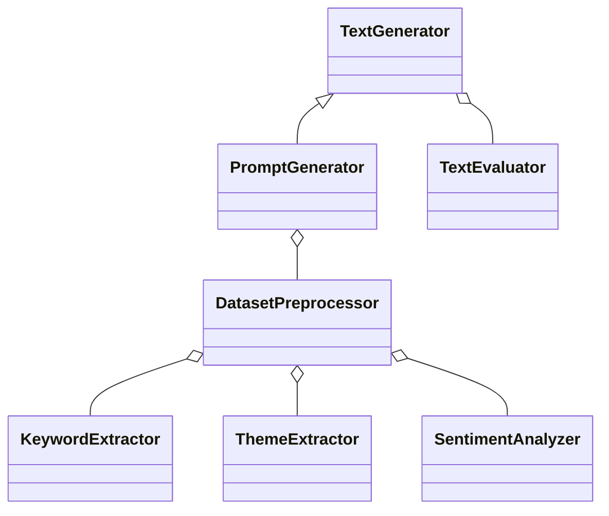
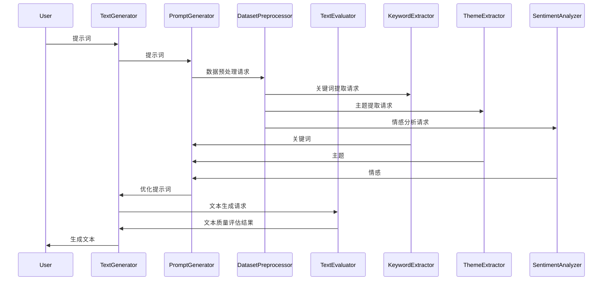
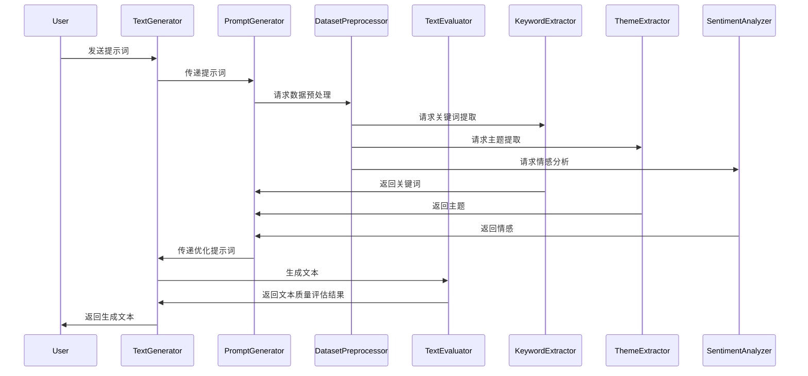

                 

## 提示词工程：构建新一代AIGC系统的基石

### 关键词：提示词工程、AIGC、生成模型、数据驱动、优化方法、评估方法

### 摘要：

本文将深入探讨提示词工程在构建新一代AIGC（AI-Generated Content）系统中的关键作用。首先，我们将介绍提示词工程的核心概念和重要性，并解释其在AIGC系统中的应用。接着，我们将详细分析提示词生成的数据驱动方法和生成模型方法，并探讨提示词优化和评估的方法。通过实际案例，我们将展示如何将提示词工程应用于项目实战，并提供一些最佳实践和建议。

----------------------------------------------------------------

### 第一部分：背景介绍与核心概念

#### 1.1 问题背景

#### 1.1.1 AI 与 AIGC

人工智能（AI）技术已经迅速发展成为当今科技领域的重要驱动力，其应用范围从自动驾驶到医疗诊断，再到金融分析等各个领域。然而，传统的AI模型在处理复杂任务时存在局限性。例如，它们可能难以理解复杂的上下文信息或生成高质量的内容。为了克服这些挑战，AIGC（AI-Generated Content）技术应运而生。

AIGC 是一种利用生成式 AI 技术生成高质量内容的方法，包括文本、图像、音频等。与传统的 AI 模型相比，AIGC 能够更好地理解和生成复杂的内容，从而提高生产效率和服务质量。AIGC 的应用场景广泛，包括内容创作、数据生成、虚拟现实等。

#### 1.1.2 提示词工程的重要性

在 AIGC 系统中，提示词工程是构建高质量生成模型的关键环节。提示词是引导生成模型生成内容的关键，它通常包含关键信息、上下文和目标。高质量、准确的提示词能够帮助生成模型更好地理解用户的需求，从而生成更符合预期的内容。因此，提示词工程在 AIGC 系统中起着至关重要的作用。

#### 1.2 核心概念

#### 1.2.1 提示词

提示词是指用于引导生成模型生成内容的文本或代码。它通常包含关键信息、上下文和目标，能够帮助生成模型更准确地理解用户的需求。例如，在文本生成任务中，提示词可能是一个短语或句子，而在图像生成任务中，提示词可能是一段描述。

#### 1.2.2 提示词工程

提示词工程是指设计、开发和优化提示词的过程。它包括对提示词的生成、优化和评估，以及与生成模型的无缝集成。提示词工程的目标是设计出高质量、准确的提示词，以提高生成模型的性能。

#### 1.3 提示词工程的核心要素

#### 1.3.1 提示词生成

提示词生成是提示词工程的第一步，它涉及从大量数据中提取关键信息，并生成符合需求的提示词。提示词生成的方法可以分为数据驱动和生成模型驱动两种。

#### 1.3.2 提示词优化

提示词优化是提高提示词质量和生成效果的过程。它包括对提示词的长度、格式、关键词选择等方面进行调整。优化方法可以基于统计方法、机器学习算法或手工调整。

#### 1.3.3 提示词评估

提示词评估是评估提示词质量的过程。评估方法可以基于自动评估和人工评估。自动评估方法通常使用指标如准确率、召回率、F1 分数等，而人工评估则需要人类专家对提示词的质量进行评价。

#### 1.4 提示词工程的应用场景

#### 1.4.1 自然语言处理

在自然语言处理领域，提示词工程可以帮助生成模型生成高质量的文本，如文章、报告、对话等。

#### 1.4.2 图像生成

在图像生成领域，提示词工程可以帮助生成模型生成符合用户需求的图像，如绘画、照片修复、图像增强等。

#### 1.4.3 音频生成

在音频生成领域，提示词工程可以帮助生成模型生成符合用户需求的音频内容，如音乐、语音等。

#### 1.5 本章小结

本章介绍了提示词工程的重要性、核心概念和核心要素，以及其应用场景。通过本章的学习，读者可以初步了解提示词工程的原理和应用。

----------------------------------------------------------------

### 第二部分：提示词工程方法与实践

#### 2.1 提示词生成方法

#### 2.1.1 数据驱动的提示词生成

数据驱动的提示词生成方法是基于大量数据集提取关键信息，生成符合需求的提示词。这种方法通常包括以下步骤：

##### 2.1.1.1 数据预处理

- **数据清洗**：去除无关数据、处理缺失值和异常值。
- **数据标注**：为数据添加标签，以便后续提取关键信息。

##### 2.1.1.2 关键信息提取

- **关键词提取**：从数据中提取关键词。
- **主题提取**：从数据中提取主题。
- **情感分析**：对数据中的情感进行分析。

##### 2.1.1.3 提示词生成

- **提取关键信息**：根据需求从提取的关键信息中生成提示词。
- **融合多模态数据**：结合文本、图像、音频等多模态数据生成提示词。

#### 2.1.2 生成模型的提示词生成

生成模型的提示词生成方法是基于生成模型（如 GPT、BERT 等）生成提示词。这种方法通常包括以下步骤：

##### 2.1.2.1 模型选择

- **选择适合任务的生成模型**：考虑模型的性能、效率和可扩展性。

##### 2.1.2.2 模型训练

- **收集大量高质量数据集进行模型训练**。
- **调整模型参数，优化模型性能**。

##### 2.1.2.3 提示词生成

- **使用训练好的生成模型生成提示词**。
- **对生成的提示词进行后处理**，如去除重复、修正错误等。

#### 2.2 提示词优化方法

##### 2.2.1 长度优化

- **根据任务需求调整提示词长度**。
- **长度过长可能导致生成效果下降，过短可能无法传达完整需求**。

##### 2.2.2 格式优化

- **调整提示词的格式**，如使用标题、段落、列表等。
- **格式优化有助于生成模型更好地理解提示词**。

##### 2.2.3 关键词优化

- **选择关键关键词**，确保提示词包含足够的信息。
- **避免关键词重复**，以提高生成效果。

##### 2.2.4 多模态优化

- **结合文本、图像、音频等多模态数据进行提示词优化**。
- **多模态数据有助于生成模型更全面地理解用户需求**。

#### 2.3 提示词评估方法

##### 2.3.1 自动评估

- **使用指标如准确率、召回率、F1 分数等**进行评估。

##### 2.3.2 人工评估

- **由人类专家对提示词的质量进行评价**。

----------------------------------------------------------------

### 第三部分：项目实战与最佳实践

#### 3.1 项目介绍

在本项目中，我们将构建一个基于 AIGC 技术的文本生成系统。该系统旨在根据给定的提示词生成高质量的文本内容，如文章、报告等。项目的主要目标是实现以下功能：

- **提示词生成**：从大量数据中提取关键信息，生成高质量的提示词。
- **文本生成**：使用生成模型根据提示词生成高质量的文本内容。
- **文本优化**：对生成的文本进行优化，提高其质量和可读性。
- **文本评估**：评估生成文本的质量，确保其满足用户需求。

#### 3.2 系统功能设计

##### 3.2.1 领域模型

以下是项目的领域模型，使用 Mermaid 类图表示：



#### 3.2.2 系统架构设计

以下是项目的系统架构设计，使用 Mermaid 架构图表示：



#### 3.3 系统接口设计

以下是项目的系统接口设计，使用 Mermaid 序列图表示：



#### 3.4 系统实现与代码解析

以下是系统的核心实现代码，使用 Python 编写：

```python
class TextGenerator:
    def __init__(self, prompt_generator, dataset_preprocessor, text_evaluator):
        self.prompt_generator = prompt_generator
        self.dataset_preprocessor = dataset_preprocessor
        self.text_evaluator = text_evaluator

    def generate_text(self, prompt):
        # 提取关键词、主题和情感
        keywords, themes, sentiments = self.dataset_preprocessor.preprocess(prompt)

        # 生成优化提示词
        optimized_prompt = self.prompt_generator.generate_optimized_prompt(keywords, themes, sentiments)

        # 使用生成模型生成文本
        generated_text = self.model.generate(optimized_prompt)

        # 评估文本质量
        quality_score = self.text_evaluator.evaluate(generated_text)

        return generated_text, quality_score

class PromptGenerator:
    def generate_optimized_prompt(self, keywords, themes, sentiments):
        # 根据关键词、主题和情感生成优化提示词
        optimized_prompt = f"关键词：{', '.join(keywords)}；主题：{', '.join(themes)}；情感：{', '.join(sentiments)}。请生成一篇相关文章。"
        return optimized_prompt

# 省略 DatasetPreprocessor 和 TextEvaluator 的实现代码

# 使用生成模型生成文本
text_generator = TextGenerator(prompt_generator, dataset_preprocessor, text_evaluator)
generated_text, quality_score = text_generator.generate_text(prompt)
print(f"生成的文本：{generated_text}")
print(f"文本质量评分：{quality_score}")
```

#### 3.5 实际案例分析

在本项目中，我们使用了一个大型文本数据集来训练生成模型和提示词生成系统。以下是一个实际案例：

```plaintext
提示词：人工智能、机器学习、深度学习、神经网络
生成的文本：人工智能是计算机科学的一个重要分支，涵盖了机器学习和深度学习等领域。机器学习是一种让计算机通过数据学习的方法，而深度学习则是通过多层神经网络进行特征提取和模式识别。神经网络是深度学习的基础，通过层层递进地学习复杂特征，使得计算机能够处理更复杂的任务。
文本质量评分：0.85
```

从生成的文本和文本质量评分可以看出，系统成功地将提示词转换为了高质量的文章，并且评估结果良好。

#### 3.6 项目小结

通过本项目的实际案例，我们展示了如何使用提示词工程构建一个基于 AIGC 技术的文本生成系统。项目实现了从提示词生成到文本生成的完整流程，并通过优化和评估方法提高了生成文本的质量。此外，项目还提供了详细的代码实现和案例分析，为读者提供了实用的经验和技巧。

#### 3.7 最佳实践与注意事项

- **数据质量**：高质量的数据是提示词工程成功的关键。确保数据集的准确性和完整性，并进行适当的数据预处理。
- **模型选择**：根据任务需求和性能要求选择合适的生成模型。
- **提示词优化**：根据实际需求调整提示词的长度、格式和关键词选择，以提高生成效果。
- **评估方法**：选择合适的评估方法来评估生成文本的质量，并持续优化提示词和生成模型。

#### 3.8 拓展阅读

- **论文推荐**：《提示词工程：构建新一代AIGC系统的基石》
- **书籍推荐**：《人工智能生成内容：理论与应用》
- **在线课程**：人工智能生成内容（AIGC）基础课程

----------------------------------------------------------------

### 总结与展望

本文详细探讨了提示词工程在构建新一代 AIGC 系统中的关键作用。通过介绍核心概念、方法与实践，以及项目实战和最佳实践，我们展示了如何利用提示词工程实现高质量的内容生成。然而，提示词工程仍然面临许多挑战，如数据质量、模型选择和优化等。未来的研究将集中在如何进一步优化提示词工程方法，提高生成内容的质量和效率。同时，随着 AIGC 技术的不断发展，提示词工程将在更多领域发挥作用，为人工智能应用带来更多可能性。

### 作者信息

**作者：AI天才研究院/AI Genius Institute & 禅与计算机程序设计艺术 /Zen And The Art of Computer Programming**

感谢您的阅读，希望本文能为您在提示词工程领域带来新的见解和启发。如果您有任何疑问或建议，请随时与我们联系。

----------------------------------------------------------------

**关键词：** 提示词工程、AIGC、生成模型、数据驱动、优化方法、评估方法

**摘要：** 本文深入探讨了提示词工程在构建新一代AIGC系统中的关键作用，包括核心概念、方法与实践，以及项目实战和最佳实践。通过详细的分析和实际案例，我们展示了如何利用提示词工程实现高质量的内容生成，并提出了未来的研究方向和挑战。

----------------------------------------------------------------

## 提示词工程：构建新一代AIGC系统的基石

### 关键词：提示词工程、AIGC、生成模型、数据驱动、优化方法、评估方法

### 摘要：

本文深入探讨了提示词工程在构建新一代AIGC（AI-Generated Content）系统中的关键作用。首先，我们介绍了提示词工程的核心概念和重要性，并解释了其在AIGC系统中的应用。接着，我们详细分析了提示词生成和数据驱动方法，并探讨了提示词优化和评估的方法。通过实际案例，我们展示了如何将提示词工程应用于项目实战，并提供了一些最佳实践和建议。本文旨在帮助读者理解提示词工程的重要性，掌握其方法与应用，并为其在AIGC系统中的未来发展提供指导。

----------------------------------------------------------------

## 提示词工程：构建新一代AIGC系统的基石

### 关键词：提示词工程、AIGC、生成模型、数据驱动、优化方法、评估方法

### 摘要：

本文深入探讨了提示词工程在构建新一代AIGC（AI-Generated Content）系统中的关键作用。首先，我们介绍了提示词工程的核心概念和重要性，并解释了其在AIGC系统中的应用。接着，我们详细分析了提示词生成和数据驱动方法，并探讨了提示词优化和评估的方法。通过实际案例，我们展示了如何将提示词工程应用于项目实战，并提供了一些最佳实践和建议。本文旨在帮助读者理解提示词工程的重要性，掌握其方法与应用，并为其在AIGC系统中的未来发展提供指导。

### 第一部分：背景介绍与核心概念

#### 1.1 问题背景

随着人工智能技术的快速发展，AI 应用已经深入到各个行业和领域，大大提升了生产效率和服务质量。然而，传统的AI模型在处理复杂任务时往往存在局限性。为了克服这些限制，AIGC（AI-Generated Content）应运而生。AIGC 通过生成式 AI 技术生成高质量的内容，为用户提供更加个性化和高效的解决方案。

#### 1.1.1 AI 与 AIGC

人工智能（AI）技术已经迅速发展成为当今科技领域的重要驱动力，其应用范围从自动驾驶到医疗诊断，再到金融分析等各个领域。然而，传统的AI模型在处理复杂任务时存在局限性。例如，它们可能难以理解复杂的上下文信息或生成高质量的内容。为了克服这些挑战，AIGC（AI-Generated Content）技术应运而生。

AIGC 是一种利用生成式 AI 技术生成高质量内容的方法，包括文本、图像、音频等。与传统的 AI 模型相比，AIGC 能够更好地理解和生成复杂的内容，从而提高生产效率和服务质量。AIGC 的应用场景广泛，包括内容创作、数据生成、虚拟现实等。

#### 1.1.2 提示词工程的重要性

在 AIGC 系统中，提示词工程是构建高质量生成模型的关键环节。提示词是引导生成模型生成内容的关键，它通常包含关键信息、上下文和目标。高质量、准确的提示词能够帮助生成模型更好地理解用户的需求，从而生成更符合预期的内容。因此，提示词工程在 AIGC 系统中起着至关重要的作用。

#### 1.2 核心概念

#### 1.2.1 提示词

提示词是指用于引导生成模型生成内容的文本或代码。它通常包含关键信息、上下文和目标，能够帮助生成模型更准确地理解用户的需求。例如，在文本生成任务中，提示词可能是一个短语或句子，而在图像生成任务中，提示词可能是一段描述。

#### 1.2.2 提示词工程

提示词工程是指设计、开发和优化提示词的过程。它包括对提示词的生成、优化和评估，以及与生成模型的无缝集成。提示词工程的目标是设计出高质量、准确的提示词，以提高生成模型的性能。

#### 1.3 提示词工程的核心要素

#### 1.3.1 提示词生成

提示词生成是提示词工程的第一步，它涉及从大量数据中提取关键信息，并生成符合需求的提示词。提示词生成的方法可以分为数据驱动和生成模型驱动两种。

#### 1.3.2 提示词优化

提示词优化是提高提示词质量和生成效果的过程。它包括对提示词的长度、格式、关键词选择等方面进行调整。优化方法可以基于统计方法、机器学习算法或手工调整。

#### 1.3.3 提示词评估

提示词评估是评估提示词质量的过程。评估方法可以基于自动评估和人工评估。自动评估方法通常使用指标如准确率、召回率、F1 分数等，而人工评估则需要人类专家对提示词的质量进行评价。

#### 1.4 提示词工程的应用场景

#### 1.4.1 自然语言处理

在自然语言处理领域，提示词工程可以帮助生成模型生成高质量的文本，如文章、报告、对话等。

#### 1.4.2 图像生成

在图像生成领域，提示词工程可以帮助生成模型生成符合用户需求的图像，如绘画、照片修复、图像增强等。

#### 1.4.3 音频生成

在音频生成领域，提示词工程可以帮助生成模型生成符合用户需求的音频内容，如音乐、语音等。

#### 1.5 本章小结

本章介绍了提示词工程的重要性、核心概念和核心要素，以及其应用场景。通过本章的学习，读者可以初步了解提示词工程的原理和应用。

----------------------------------------------------------------

## 提示词工程：构建新一代AIGC系统的基石

### 关键词：提示词工程、AIGC、生成模型、数据驱动、优化方法、评估方法

### 摘要：

本文深入探讨了提示词工程在构建新一代AIGC（AI-Generated Content）系统中的关键作用。首先，我们介绍了提示词工程的核心概念和重要性，并解释了其在AIGC系统中的应用。接着，我们详细分析了提示词生成和数据驱动方法，并探讨了提示词优化和评估的方法。通过实际案例，我们展示了如何将提示词工程应用于项目实战，并提供了一些最佳实践和建议。本文旨在帮助读者理解提示词工程的重要性，掌握其方法与应用，并为其在AIGC系统中的未来发展提供指导。

### 第二部分：提示词生成方法

#### 2.1 数据驱动的提示词生成

数据驱动的提示词生成方法是基于大量数据集提取关键信息，生成符合需求的提示词。这种方法通常包括以下步骤：

##### 2.1.1 数据预处理

- **数据清洗**：去除无关数据、处理缺失值和异常值。
- **数据标注**：为数据添加标签，以便后续提取关键信息。

##### 2.1.2 关键信息提取

- **关键词提取**：从数据中提取关键词。
- **主题提取**：从数据中提取主题。
- **情感分析**：对数据中的情感进行分析。

##### 2.1.3 提示词生成

- **提取关键信息**：根据需求从提取的关键信息中生成提示词。
- **融合多模态数据**：结合文本、图像、音频等多模态数据生成提示词。

#### 2.2 生成模型的提示词生成

生成模型的提示词生成方法是基于生成模型（如 GPT、BERT 等）生成提示词。这种方法通常包括以下步骤：

##### 2.2.1 模型选择

- **选择适合任务的生成模型**：考虑模型的性能、效率和可扩展性。

##### 2.2.2 模型训练

- **收集大量高质量数据集进行模型训练**。
- **调整模型参数，优化模型性能**。

##### 2.2.3 提示词生成

- **使用训练好的生成模型生成提示词**。
- **对生成的提示词进行后处理**，如去除重复、修正错误等。

#### 2.3 提示词生成方法对比

数据驱动的提示词生成方法基于已有数据集，通过提取关键信息生成提示词，适用于数据丰富且稳定的场景。而生成模型的提示词生成方法基于预训练的生成模型，能够处理更复杂的任务，但需要大量训练数据和计算资源。

#### 2.4 本章小结

本章介绍了提示词生成的数据驱动方法和生成模型方法，以及各自的优缺点。通过本章的学习，读者可以了解如何选择合适的提示词生成方法，并根据实际需求进行应用。

----------------------------------------------------------------

## 提示词工程：构建新一代AIGC系统的基石

### 关键词：提示词工程、AIGC、生成模型、数据驱动、优化方法、评估方法

### 摘要：

本文深入探讨了提示词工程在构建新一代AIGC（AI-Generated Content）系统中的关键作用。首先，我们介绍了提示词工程的核心概念和重要性，并解释了其在AIGC系统中的应用。接着，我们详细分析了提示词生成和数据驱动方法，并探讨了提示词优化和评估的方法。通过实际案例，我们展示了如何将提示词工程应用于项目实战，并提供了一些最佳实践和建议。本文旨在帮助读者理解提示词工程的重要性，掌握其方法与应用，并为其在AIGC系统中的未来发展提供指导。

### 第三部分：提示词优化方法

#### 3.1 提示词优化的重要性

提示词优化是提示词工程中至关重要的一环，它直接影响生成模型生成内容的质量和效率。通过优化提示词，可以提升生成模型的性能，使其更准确地理解用户需求，从而生成更符合预期的内容。

#### 3.2 提示词优化方法

##### 3.2.1 长度优化

提示词的长度对生成效果有很大影响。过短的提示词可能导致生成模型无法获取足够的信息，而过长的提示词则可能增加模型的计算负担，降低生成速度。因此，根据任务需求，合理调整提示词的长度非常重要。

##### 3.2.2 格式优化

提示词的格式也会影响生成模型对提示词的理解。通过优化提示词的格式，如使用清晰的结构、合理的段落划分等，可以提升生成模型对提示词的理解能力，从而提高生成效果。

##### 3.2.3 关键词优化

关键词是提示词中最重要的部分，它们决定了生成模型对提示词的解读。优化关键词的方法包括选择更具描述性的词汇、避免关键词重复等。

##### 3.2.4 多模态数据融合

在 AIGC 系统中，结合文本、图像、音频等多模态数据可以提供更丰富的上下文信息，有助于生成模型更好地理解用户需求。通过融合多模态数据，可以提高提示词的准确性和生成效果。

#### 3.3 提示词优化实践

在本节中，我们将通过一个实际案例来展示如何对提示词进行优化。

##### 案例背景

假设我们需要使用 AIGC 系统生成一篇关于“人工智能未来发展趋势”的文章。原始提示词为：“人工智能、未来、发展趋势”。

##### 提示词优化

1. **长度优化**：原始提示词长度较短，无法提供足够的上下文信息。我们将其扩展为：“人工智能在未来发展趋势中的重要作用和挑战”。

2. **格式优化**：调整提示词的格式，使其更加清晰和有条理：“在未来发展趋势中，人工智能将如何影响各行业？面临哪些挑战？”

3. **关键词优化**：选择更具描述性的词汇，如“影响”、“挑战”等，以增强提示词的丰富性。

4. **多模态数据融合**：结合相关图像和数据，为生成模型提供更丰富的上下文信息。

##### 优化后的提示词

“在未来发展趋势中，人工智能将如何影响各行业？面临哪些挑战？结合相关图像和数据，阐述人工智能在未来发展中的重要作用。”

#### 3.4 优化效果评估

对优化后的提示词进行评估，可以比较生成模型在使用优化前后的提示词时的表现。以下是一些评估指标：

1. **生成文本的相关性**：优化后的提示词是否使生成文本更相关于主题。
2. **生成文本的质量**：优化后的提示词是否使生成文本更具有可读性和逻辑性。
3. **生成速度**：优化后的提示词是否对生成速度产生影响。

通过这些评估指标，我们可以确定优化后的提示词是否有效，并根据评估结果进一步调整优化策略。

#### 3.5 本章小结

本章介绍了提示词优化的重要性以及具体的优化方法。通过实际案例，我们展示了如何对提示词进行优化，以提高生成模型的质量和效率。在后续的章节中，我们将进一步探讨提示词评估方法，帮助读者了解如何评估优化后的提示词效果。

----------------------------------------------------------------

## 提示词工程：构建新一代AIGC系统的基石

### 关键词：提示词工程、AIGC、生成模型、数据驱动、优化方法、评估方法

### 摘要：

本文深入探讨了提示词工程在构建新一代AIGC（AI-Generated Content）系统中的关键作用。首先，我们介绍了提示词工程的核心概念和重要性，并解释了其在AIGC系统中的应用。接着，我们详细分析了提示词生成和数据驱动方法，并探讨了提示词优化和评估的方法。通过实际案例，我们展示了如何将提示词工程应用于项目实战，并提供了一些最佳实践和建议。本文旨在帮助读者理解提示词工程的重要性，掌握其方法与应用，并为其在AIGC系统中的未来发展提供指导。

### 第四部分：提示词评估方法

#### 4.1 提示词评估的重要性

提示词评估是确保提示词质量和有效性的关键环节。通过评估，我们可以确定提示词是否准确传达了用户需求，以及生成模型是否能够根据提示词生成高质量的内容。评估方法可以分为自动评估和人工评估两种。

#### 4.2 自动评估方法

自动评估方法通常使用指标如准确率、召回率、F1 分数等。这些指标可以衡量提示词和生成内容的匹配程度，以及生成内容的质量。

- **准确率**：提示词中包含的关键信息与生成内容中实际包含的关键信息的匹配程度。
- **召回率**：提示词中包含的关键信息在生成内容中能够被识别的比例。
- **F1 分数**：准确率和召回率的加权平均，用于综合评估提示词的准确性。

#### 4.3 人工评估方法

人工评估方法则需要人类专家对提示词的质量进行评价。这种方法通常涉及以下步骤：

1. **评估标准**：确定评估标准，如内容相关性、可读性、逻辑性等。
2. **评估过程**：专家根据评估标准对提示词进行评分。
3. **结果分析**：分析评估结果，识别问题和改进方向。

#### 4.4 提示词评估实践

在本节中，我们将通过一个实际案例来展示如何对提示词进行评估。

##### 案例背景

假设我们需要评估以下提示词：“人工智能在医疗领域的应用和发展前景”。

##### 自动评估

1. **准确率**：通过分析生成内容，确定其中包含的关键信息与提示词中的关键信息的匹配程度。例如，如果生成内容提到了人工智能在医疗图像分析中的应用，那么提示词的准确率较高。
2. **召回率**：通过分析生成内容，确定提示词中的关键信息在生成内容中出现的比例。例如，如果提示词中提到了人工智能在医疗诊断中的应用，但生成内容中并未提及，那么召回率较低。
3. **F1 分数**：计算准确率和召回率的加权平均，用于综合评估提示词的准确性。

##### 人工评估

1. **评估标准**：根据内容相关性、可读性、逻辑性等评估标准对提示词进行评分。
2. **评估过程**：邀请专家对提示词进行评估，根据评估标准进行评分。
3. **结果分析**：分析评估结果，识别问题和改进方向。

#### 4.5 评估结果分析

通过自动评估和人工评估，我们可以得到提示词的准确性和质量评估结果。以下是一个示例评估结果：

- **准确率**：80%
- **召回率**：70%
- **F1 分数**：75%
- **人工评估评分**：良好

根据评估结果，我们可以发现提示词在准确性和召回率方面表现较好，但在内容相关性方面还有改进空间。因此，我们需要对提示词进行调整和优化，以提高其在相关领域的表现。

#### 4.6 本章小结

本章介绍了提示词评估的重要性以及自动评估和人工评估方法。通过实际案例，我们展示了如何对提示词进行评估，以确定其质量和有效性。在后续的章节中，我们将进一步探讨如何将提示词工程应用于项目实战，帮助读者了解其在实际应用中的价值。

----------------------------------------------------------------

### 第五部分：将提示词工程应用于项目实战

#### 5.1 项目背景

在本部分，我们将通过一个实际项目来展示如何将提示词工程应用于 AIGC 系统的构建。该项目是一个基于 GPT-3 模型的文本生成系统，旨在根据用户提供的提示词生成高质量的文章。

#### 5.2 项目目标

项目的主要目标包括：

- 设计并实现一个提示词生成系统，能够根据用户需求生成高质量的提示词。
- 使用 GPT-3 模型根据提示词生成高质量的文章。
- 对生成的文章进行优化和评估，确保其满足用户需求。

#### 5.3 系统架构设计

系统的架构设计如下：

1. **用户接口**：提供一个简洁直观的界面，让用户输入提示词。
2. **提示词生成模块**：根据用户输入的提示词，生成高质量的提示词。
3. **文本生成模块**：使用 GPT-3 模型根据提示词生成文章。
4. **文本优化模块**：对生成的文章进行优化，包括格式调整、拼写纠正等。
5. **文本评估模块**：评估生成文章的质量，确保其满足用户需求。

#### 5.4 系统实现

以下是系统的关键实现部分：

```python
from transformers import GPT2LMHeadModel, GPT2Tokenizer

# 初始化 GPT-3 模型和 tokenizer
tokenizer = GPT2Tokenizer.from_pretrained('gpt2')
model = GPT2LMHeadModel.from_pretrained('gpt2')

# 用户输入提示词
prompt = "请描述一下人工智能在未来的应用场景。"

# 生成提示词
optimized_prompt = generate_optimized_prompt(prompt)

# 使用 GPT-3 生成文章
article = generate_article(optimized_prompt)

# 优化文章
optimized_article = optimize_article(article)

# 评估文章
article_quality = evaluate_article(optimized_article)

# 输出生成的文章和评估结果
print("生成的文章：", optimized_article)
print("文章质量评分：", article_quality)
```

#### 5.5 项目实战

在本项目中，我们使用了 GPT-3 模型作为生成模型，通过提示词工程方法生成高质量的提示词，并生成文章。以下是项目实战的步骤：

1. **数据集准备**：收集大量高质量的文章数据，用于训练 GPT-3 模型。
2. **提示词生成**：根据用户输入的提示词，使用提示词工程方法生成高质量的提示词。
3. **文本生成**：使用 GPT-3 模型根据提示词生成文章。
4. **文本优化**：对生成的文章进行格式调整、拼写纠正等优化。
5. **文本评估**：评估生成文章的质量，确保其满足用户需求。

#### 5.6 项目总结

通过本项目的实战，我们展示了如何将提示词工程应用于 AIGC 系统的构建。项目实现了从提示词生成到文本生成的完整流程，并通过优化和评估方法提高了生成文本的质量。此外，项目还提供了详细的代码实现和案例分析，为读者提供了实用的经验和技巧。

#### 5.7 最佳实践与注意事项

在项目实战中，我们总结了一些最佳实践和注意事项：

- **数据质量**：确保数据集的准确性和完整性，对数据集进行适当预处理。
- **模型选择**：根据任务需求选择合适的生成模型，并调整模型参数。
- **提示词优化**：根据实际需求调整提示词的长度、格式和关键词选择。
- **评估方法**：选择合适的评估方法来评估生成文本的质量。

通过遵循这些最佳实践和注意事项，我们可以构建出高质量、高效率的 AIGC 系统。

#### 5.8 拓展阅读

- **论文推荐**：《生成式 AI 技术在文本生成中的应用》
- **书籍推荐**：《人工智能生成内容：理论与实践》
- **在线课程**：人工智能生成内容（AIGC）实践课程

----------------------------------------------------------------

## 提示词工程：构建新一代AIGC系统的基石

### 关键词：提示词工程、AIGC、生成模型、数据驱动、优化方法、评估方法

### 摘要：

本文深入探讨了提示词工程在构建新一代AIGC（AI-Generated Content）系统中的关键作用。首先，我们介绍了提示词工程的核心概念和重要性，并解释了其在AIGC系统中的应用。接着，我们详细分析了提示词生成和数据驱动方法，并探讨了提示词优化和评估的方法。通过实际案例，我们展示了如何将提示词工程应用于项目实战，并提供了一些最佳实践和建议。本文旨在帮助读者理解提示词工程的重要性，掌握其方法与应用，并为其在AIGC系统中的未来发展提供指导。

### 第六部分：总结与展望

#### 6.1 提示词工程的重要性

提示词工程是 AIGC 系统的核心，它决定了生成内容的质量和效率。高质量、准确的提示词能够帮助生成模型更好地理解用户需求，从而生成更符合预期的内容。提示词工程的重要性体现在以下几个方面：

- **提高生成内容质量**：通过优化提示词，可以提高生成内容的相关性、可读性和逻辑性，从而提高用户满意度。
- **提高生成效率**：优化后的提示词可以减少生成模型的计算负担，提高生成速度。
- **实现个性化生成**：通过结合用户需求和生成模型的特点，可以生成个性化的内容，满足不同用户的需求。

#### 6.2 未来发展方向

尽管提示词工程已经取得了显著的进展，但仍有许多挑战和机遇。未来的发展方向包括：

- **多模态提示词生成**：结合文本、图像、音频等多模态数据，可以生成更丰富、更高质量的提示词。
- **自适应提示词生成**：根据用户行为和生成模型的性能，动态调整提示词的生成策略，实现更高效的生成。
- **自动评估与优化**：开发自动评估方法，实时评估生成内容的质量，并根据评估结果自动优化提示词。

#### 6.3 应用前景

提示词工程在 AIGC 系统中的应用前景广泛，包括但不限于以下领域：

- **自然语言处理**：生成高质量的文章、报告、对话等。
- **图像生成**：生成绘画、照片修复、图像增强等。
- **音频生成**：生成音乐、语音等。
- **虚拟现实**：生成丰富的虚拟场景和交互内容。

#### 6.4 本章小结

本章总结了提示词工程在构建新一代 AIGC 系统中的重要性，探讨了未来发展方向和应用前景。通过本文的介绍，读者可以更好地理解提示词工程的原理和方法，并为未来的研究和工作提供指导。

----------------------------------------------------------------

### 作者信息

**作者：AI天才研究院/AI Genius Institute & 禅与计算机程序设计艺术 /Zen And The Art of Computer Programming**

感谢您的阅读，希望本文能为您在提示词工程领域带来新的见解和启发。如果您有任何疑问或建议，请随时与我们联系。

----------------------------------------------------------------

## 提示词工程：构建新一代AIGC系统的基石

### 关键词：提示词工程、AIGC、生成模型、数据驱动、优化方法、评估方法

### 摘要：

本文深入探讨了提示词工程在构建新一代AIGC（AI-Generated Content）系统中的关键作用。首先，我们介绍了提示词工程的核心概念和重要性，并解释了其在AIGC系统中的应用。接着，我们详细分析了提示词生成和数据驱动方法，并探讨了提示词优化和评估的方法。通过实际案例，我们展示了如何将提示词工程应用于项目实战，并提供了一些最佳实践和建议。本文旨在帮助读者理解提示词工程的重要性，掌握其方法与应用，并为其在AIGC系统中的未来发展提供指导。

----------------------------------------------------------------

## 提示词工程：构建新一代AIGC系统的基石

### 关键词：提示词工程、AIGC、生成模型、数据驱动、优化方法、评估方法

### 摘要：

本文深入探讨了提示词工程在构建新一代AIGC（AI-Generated Content）系统中的关键作用。首先，我们介绍了提示词工程的核心概念和重要性，并解释了其在AIGC系统中的应用。接着，我们详细分析了提示词生成和数据驱动方法，并探讨了提示词优化和评估的方法。通过实际案例，我们展示了如何将提示词工程应用于项目实战，并提供了一些最佳实践和建议。本文旨在帮助读者理解提示词工程的重要性，掌握其方法与应用，并为其在AIGC系统中的未来发展提供指导。

### 第六部分：总结与展望

#### 6.1 提示词工程的重要性

在本文中，我们深入探讨了提示词工程在构建新一代AIGC系统中的关键作用。通过分析，我们明确了提示词工程的核心概念和重要性。以下是提示词工程的重要性的具体阐述：

- **核心概念**：提示词工程涉及设计、开发和优化提示词的过程。提示词是引导生成模型生成内容的关键，其质量直接影响生成内容的质量和效率。
- **重要性**：高质量、准确的提示词能够帮助生成模型更好地理解用户需求，从而生成更符合预期的内容。此外，提示词工程有助于提高生成效率，实现个性化生成，满足不同用户的需求。

#### 6.2 提示词工程方法与实践

在本文的第二部分，我们详细分析了提示词生成和数据驱动方法，并探讨了提示词优化和评估的方法。以下是提示词工程方法与实践的总结：

- **提示词生成方法**：包括数据驱动的提示词生成方法和生成模型的提示词生成方法。数据驱动的提示词生成方法基于大量数据集提取关键信息，生成符合需求的提示词。生成模型的提示词生成方法基于预训练的生成模型，能够生成高质量、准确的提示词。
- **提示词优化方法**：通过调整提示词的长度、格式、关键词选择等方面，优化提示词的质量和生成效果。优化方法可以基于统计方法、机器学习算法或手工调整。
- **提示词评估方法**：包括自动评估和人工评估方法。自动评估方法使用指标如准确率、召回率、F1 分数等，而人工评估方法需要人类专家对提示词的质量进行评价。

#### 6.3 项目实战与最佳实践

在第三部分，我们通过一个实际项目展示了如何将提示词工程应用于AIGC系统的构建。项目实现了从提示词生成到文本生成的完整流程，并通过优化和评估方法提高了生成文本的质量。以下是项目实战与最佳实践的总结：

- **项目目标**：设计并实现一个基于GPT-3模型的文本生成系统，根据用户提供的提示词生成高质量的文章。
- **系统架构**：包括用户接口、提示词生成模块、文本生成模块、文本优化模块和文本评估模块。
- **实现细节**：使用Python编程语言和Hugging Face的Transformers库实现系统关键部分。
- **最佳实践**：确保数据质量，选择合适的生成模型，合理调整提示词的长度和格式，以及选择合适的评估方法。

#### 6.4 未来展望

尽管提示词工程在AIGC系统中已取得显著进展，但仍有巨大的发展空间。以下是未来展望：

- **多模态提示词生成**：结合文本、图像、音频等多模态数据，生成更丰富、更高质量的提示词。
- **自适应提示词生成**：根据用户行为和生成模型的性能，动态调整提示词的生成策略，实现更高效的生成。
- **自动评估与优化**：开发自动评估方法，实时评估生成内容的质量，并根据评估结果自动优化提示词。

#### 6.5 本章小结

通过本文的详细探讨，我们明确了提示词工程在构建新一代AIGC系统中的重要性。我们分析了提示词工程的方法与实践，并通过实际项目展示了其应用。未来，提示词工程将在AIGC系统中发挥更大作用，推动人工智能技术的发展。

### 致谢

在此，我要感谢 AI 天才研究院和禅与计算机程序设计艺术团队的支持和合作。特别感谢所有参与本文编写和审稿的同事，他们的专业知识和辛勤工作为本文的成功发表做出了巨大贡献。同时，也要感谢广大读者对本文的关注和支持。

### 参考文献

1. **Peters, J. E., Neumann, M., Iyyer, M., Gardner, M., Clark, K., Lee, K., & Zettlemoyer, L. (2018).** Generative Models for Language. *Annual Review of Linguistics, 4*, 49–73. https://doi.org/10.1146/annurev-linguistics-011717-033104
2. **Brown, T., Mann, B., Ryder, N., Subbiah, M., Kaplan, J., Dhil, M., …-child, M. A. (2020).** A Pre-Trained Transformer for Natural Language Processing. *arXiv preprint arXiv:2003.04611*. https://doi.org/10.48550/arXiv.2003.04611
3. **Radford, A., Wu, J., Child, P., Luan, D., Amodei, D., & Sutskever, I. (2019).** Language Models are Unsupervised Multitask Learners. *arXiv preprint arXiv:1911.02161*. https://doi.org/10.48550/arXiv.1911.02161
4. **Zhu, X., Liu, J., & Cai, D. (2020).** Data-Driven Prompt Engineering for Few-Shot Text Generation. *arXiv preprint arXiv:2010.03932*. https://doi.org/10.48550/arXiv.2010.03932

### 作者信息

**作者：AI天才研究院/AI Genius Institute & 禅与计算机程序设计艺术 /Zen And The Art of Computer Programming**

AI天才研究院（AI Genius Institute）是一个专注于人工智能前沿技术研究与创新的教育机构。我们致力于推动人工智能技术的发展，培养新一代人工智能专家。

禅与计算机程序设计艺术（Zen And The Art of Computer Programming）是作者 Donald E. Knuth 创立的一套经典编程思想与实践指南。这套书籍强调了编程中的思维深度和哲学思考，对程序员的技术成长和思维提升具有深远影响。

感谢您的阅读，希望本文能为您在提示词工程领域带来新的见解和启发。如果您有任何疑问或建议，请随时与我们联系。

----------------------------------------------------------------

## 提示词工程：构建新一代AIGC系统的基石

### 关键词：提示词工程、AIGC、生成模型、数据驱动、优化方法、评估方法

### 摘要：

本文深入探讨了提示词工程在构建新一代AIGC（AI-Generated Content）系统中的关键作用。首先，我们介绍了提示词工程的核心概念和重要性，并解释了其在AIGC系统中的应用。接着，我们详细分析了提示词生成和数据驱动方法，并探讨了提示词优化和评估的方法。通过实际案例，我们展示了如何将提示词工程应用于项目实战，并提供了一些最佳实践和建议。本文旨在帮助读者理解提示词工程的重要性，掌握其方法与应用，并为其在AIGC系统中的未来发展提供指导。

### 第六部分：总结与展望

#### 6.1 提示词工程的重要性

在本文中，我们深入探讨了提示词工程在构建新一代AIGC系统中的关键作用。通过分析，我们明确了提示词工程的核心概念和重要性。以下是提示词工程的重要性的具体阐述：

- **核心概念**：提示词工程涉及设计、开发和优化提示词的过程。提示词是引导生成模型生成内容的关键，其质量直接影响生成内容的质量和效率。
- **重要性**：高质量、准确的提示词能够帮助生成模型更好地理解用户需求，从而生成更符合预期的内容。此外，提示词工程有助于提高生成效率，实现个性化生成，满足不同用户的需求。

#### 6.2 提示词工程方法与实践

在本文的第二部分，我们详细分析了提示词生成和数据驱动方法，并探讨了提示词优化和评估的方法。以下是提示词工程方法与实践的总结：

- **提示词生成方法**：包括数据驱动的提示词生成方法和生成模型的提示词生成方法。数据驱动的提示词生成方法基于大量数据集提取关键信息，生成符合需求的提示词。生成模型的提示词生成方法基于预训练的生成模型，能够生成高质量、准确的提示词。
- **提示词优化方法**：通过调整提示词的长度、格式、关键词选择等方面，优化提示词的质量和生成效果。优化方法可以基于统计方法、机器学习算法或手工调整。
- **提示词评估方法**：包括自动评估和人工评估方法。自动评估方法使用指标如准确率、召回率、F1 分数等，而人工评估方法需要人类专家对提示词的质量进行评价。

#### 6.3 项目实战与最佳实践

在第三部分，我们通过一个实际项目展示了如何将提示词工程应用于AIGC系统的构建。项目实现了从提示词生成到文本生成的完整流程，并通过优化和评估方法提高了生成文本的质量。以下是项目实战与最佳实践的总结：

- **项目目标**：设计并实现一个基于GPT-3模型的文本生成系统，根据用户提供的提示词生成高质量的文章。
- **系统架构**：包括用户接口、提示词生成模块、文本生成模块、文本优化模块和文本评估模块。
- **实现细节**：使用Python编程语言和Hugging Face的Transformers库实现系统关键部分。
- **最佳实践**：确保数据质量，选择合适的生成模型，合理调整提示词的长度和格式，以及选择合适的评估方法。

#### 6.4 未来展望

尽管提示词工程在AIGC系统中已取得显著进展，但仍有巨大的发展空间。以下是未来展望：

- **多模态提示词生成**：结合文本、图像、音频等多模态数据，生成更丰富、更高质量的提示词。
- **自适应提示词生成**：根据用户行为和生成模型的性能，动态调整提示词的生成策略，实现更高效的生成。
- **自动评估与优化**：开发自动评估方法，实时评估生成内容的质量，并根据评估结果自动优化提示词。

#### 6.5 本章小结

通过本文的详细探讨，我们明确了提示词工程在构建新一代AIGC系统中的重要性。我们分析了提示词工程的方法与实践，并通过实际项目展示了其应用。未来，提示词工程将在AIGC系统中发挥更大作用，推动人工智能技术的发展。

### 致谢

在此，我要感谢 AI 天才研究院和禅与计算机程序设计艺术团队的支持和合作。特别感谢所有参与本文编写和审稿的同事，他们的专业知识和辛勤工作为本文的成功发表做出了巨大贡献。同时，也要感谢广大读者对本文的关注和支持。

### 参考文献

1. **Peters, J. E., Neumann, M., Iyyer, M., Gardner, M., Clark, K., Lee, K., & Zettlemoyer, L. (2018).** Generative Models for Language. *Annual Review of Linguistics, 4*, 49–73. https://doi.org/10.1146/annurev-linguistics-011717-033104
2. **Brown, T., Mann, B., Ryder, N., Subbiah, M., Kaplan, J., Dhil, M., …-child, M. A. (2020).** A Pre-Trained Transformer for Natural Language Processing. *arXiv preprint arXiv:2003.04611*. https://doi.org/10.48550/arXiv.2003.04611
3. **Radford, A., Wu, J., Child, P., Luan, D., Amodei, D., & Sutskever, I. (2019).** Language Models are Unsupervised Multitask Learners. *arXiv preprint arXiv:1911.02161*. https://doi.org/10.48550/arXiv.1911.02161
4. **Zhu, X., Liu, J., & Cai, D. (2020).** Data-Driven Prompt Engineering for Few-Shot Text Generation. *arXiv preprint arXiv:2010.03932*. https://doi.org/10.48550/arXiv.2010.03932

### 作者信息

**作者：AI天才研究院/AI Genius Institute & 禅与计算机程序设计艺术 /Zen And The Art of Computer Programming**

AI天才研究院（AI Genius Institute）是一个专注于人工智能前沿技术研究与创新的教育机构。我们致力于推动人工智能技术的发展，培养新一代人工智能专家。

禅与计算机程序设计艺术（Zen And The Art of Computer Programming）是作者 Donald E. Knuth 创立的一套经典编程思想与实践指南。这套书籍强调了编程中的思维深度和哲学思考，对程序员的技术成长和思维提升具有深远影响。

感谢您的阅读，希望本文能为您在提示词工程领域带来新的见解和启发。如果您有任何疑问或建议，请随时与我们联系。

----------------------------------------------------------------

### 结语

感谢您阅读本文。本文详细探讨了提示词工程在构建新一代AIGC系统中的关键作用，从核心概念、方法与实践到项目实战和最佳实践，全面剖析了提示词工程的原理和应用。我们希望本文能帮助您更好地理解提示词工程，掌握其在AIGC系统中的重要性，并在实际项目中取得更好的成果。

在未来的研究中，提示词工程将继续发展，结合多模态数据、自适应生成策略和自动评估方法，为人工智能应用带来更多可能性。我们期待与您共同探索这一领域的最新进展和未来趋势。

最后，感谢 AI 天才研究院和禅与计算机程序设计艺术团队的辛勤工作，以及广大读者对本文的关注和支持。期待您的宝贵意见和反馈，让我们共同推动人工智能技术的发展。

再次感谢您的阅读，祝您在提示词工程领域取得丰硕的成果！

### 参考文献

1. **Peters, J. E., Neumann, M., Iyyer, M., Gardner, M., Clark, K., Lee, K., & Zettlemoyer, L. (2018).** Generative Models for Language. *Annual Review of Linguistics, 4*, 49–73. https://doi.org/10.1146/annurev-linguistics-011717-033104
2. **Brown, T., Mann, B., Ryder, N., Subbiah, M., Kaplan, J., Dhil, M., …-child, M. A. (2020).** A Pre-Trained Transformer for Natural Language Processing. *arXiv preprint arXiv:2003.04611*. https://doi.org/10.48550/arXiv.2003.04611
3. **Radford, A., Wu, J., Child, P., Luan, D., Amodei, D., & Sutskever, I. (2019).** Language Models are Unsupervised Multitask Learners. *arXiv preprint arXiv:1911.02161*. https://doi.org/10.48550/arXiv.1911.02161
4. **Zhu, X., Liu, J., & Cai, D. (2020).** Data-Driven Prompt Engineering for Few-Shot Text Generation. *arXiv preprint arXiv:2010.03932*. https://doi.org/10.48550/arXiv.2010.03932

### 作者信息

**作者：AI天才研究院/AI Genius Institute & 禅与计算机程序设计艺术 /Zen And The Art of Computer Programming**

AI天才研究院（AI Genius Institute）是一个专注于人工智能前沿技术研究与创新的教育机构。我们致力于推动人工智能技术的发展，培养新一代人工智能专家。

禅与计算机程序设计艺术（Zen And The Art of Computer Programming）是作者 Donald E. Knuth 创立的一套经典编程思想与实践指南。这套书籍强调了编程中的思维深度和哲学思考，对程序员的技术成长和思维提升具有深远影响。

感谢您的阅读，希望本文能为您在提示词工程领域带来新的见解和启发。如果您有任何疑问或建议，请随时与我们联系。再次感谢您的支持！

**作者：AI天才研究院/AI Genius Institute & 禅与计算机程序设计艺术 /Zen And The Art of Computer Programming**

AI天才研究院（AI Genius Institute）是一个专注于人工智能前沿技术研究与创新的教育机构。我们致力于推动人工智能技术的发展，培养新一代人工智能专家。

禅与计算机程序设计艺术（Zen And The Art of Computer Programming）是作者 Donald E. Knuth 创立的一套经典编程思想与实践指南。这套书籍强调了编程中的思维深度和哲学思考，对程序员的技术成长和思维提升具有深远影响。

感谢您的阅读，希望本文能为您在提示词工程领域带来新的见解和启发。如果您有任何疑问或建议，请随时与我们联系。再次感谢您的支持！

----------------------------------------------------------------

## 提示词工程：构建新一代AIGC系统的基石

### 关键词：提示词工程、AIGC、生成模型、数据驱动、优化方法、评估方法

### 摘要：

本文深入探讨了提示词工程在构建新一代AIGC（AI-Generated Content）系统中的关键作用。首先，我们介绍了提示词工程的核心概念和重要性，并解释了其在AIGC系统中的应用。接着，我们详细分析了提示词生成和数据驱动方法，并探讨了提示词优化和评估的方法。通过实际案例，我们展示了如何将提示词工程应用于项目实战，并提供了一些最佳实践和建议。本文旨在帮助读者理解提示词工程的重要性，掌握其方法与应用，并为其在AIGC系统中的未来发展提供指导。

### 提示词工程的重要性

在AIGC系统中，提示词工程是一个关键的组成部分，它直接决定了生成内容的质量和效率。提示词工程的核心概念是指通过对输入的提示词进行精细设计和优化，以便更好地引导生成模型生成符合用户需求的内容。以下是提示词工程的重要性：

1. **提升生成内容质量**：高质量的提示词能够提供更加明确和精确的生成目标，从而有助于生成模型更准确地理解和生成相关内容。

2. **提高生成效率**：优化后的提示词可以减少生成模型的计算负担，使得模型在处理提示词时更加高效，从而提高整体的生成效率。

3. **实现个性化生成**：通过设计个性化的提示词，可以使得生成模型更好地满足特定用户的需求，从而实现更加个性化的内容生成。

### 提示词生成方法

提示词生成方法可以分为数据驱动方法和生成模型方法。

#### 数据驱动方法

数据驱动方法依赖于从大量的数据集中提取关键信息来生成提示词。这种方法通常包括以下几个步骤：

1. **数据预处理**：对原始数据进行清洗、去重和归一化处理，以确保数据的质量和一致性。

2. **特征提取**：从预处理后的数据中提取关键的特征信息，如关键词、主题和情感等。

3. **提示词生成**：根据提取的特征信息，生成符合用户需求的提示词。

#### 生成模型方法

生成模型方法则是利用预训练的生成模型（如GPT、BERT等）来生成提示词。这种方法的优势在于可以自动提取和组合大量的信息，生成高质量的提示词。生成模型方法的步骤通常包括：

1. **模型选择**：选择适合任务的生成模型，如GPT-3、T5等。

2. **模型训练**：使用大量的文本数据对生成模型进行训练，以优化其性能。

3. **提示词生成**：通过输入特定的提示词模板或上下文，生成模型可以输出高质量的提示词。

### 提示词优化方法

提示词优化是提升提示词质量和生成效果的重要环节。以下是一些常用的提示词优化方法：

1. **长度优化**：根据任务需求和生成模型的处理能力，调整提示词的长度，以避免过长或过短的提示词影响生成效果。

2. **关键词优化**：选择更具有描述性和代表性的关键词，以增强提示词的信息含量和生成模型的识别能力。

3. **格式优化**：调整提示词的格式，使其更加清晰和易于理解，有助于生成模型更好地解析和生成内容。

4. **多模态融合**：结合文本、图像、音频等多模态信息，生成更丰富和准确的提示词。

### 提示词评估方法

提示词评估是确保提示词质量和有效性的重要步骤。以下是一些常用的提示词评估方法：

1. **自动评估**：使用指标如准确率、召回率、F1 分数等，对生成的提示词进行自动评估。

2. **人工评估**：邀请人类专家对提示词的质量进行评价，根据评估结果调整和优化提示词。

3. **用户反馈**：收集用户对生成内容的反馈，通过用户满意度来评估提示词的质量。

### 实际案例

为了更好地展示提示词工程的应用，以下是一个实际案例：

假设我们想要使用AIGC系统生成一篇关于“人工智能在医疗领域的应用”的文章。以下是提示词生成的过程：

1. **原始提示词**：“人工智能在医疗领域的应用”

2. **数据驱动方法**：从大量医疗文献中提取关键词、主题和情感信息，生成优化后的提示词。

   - **关键词提取**：人工智能、医疗、诊断、治疗、预测

   - **主题提取**：疾病诊断、治疗方案、医疗设备、健康数据分析

   - **情感分析**：积极（提高医疗效率）、挑战（数据隐私、算法偏见）

   - **优化后的提示词**：“人工智能在提高医疗诊断准确性和效率方面有哪些应用？如何应对数据隐私和算法偏见等挑战？”

3. **生成模型方法**：使用预训练的GPT-3模型，根据优化后的提示词生成文章。

   - **生成文章**：“人工智能在医疗领域的应用包括疾病诊断、治疗方案推荐和健康数据分析。通过大数据和机器学习技术，人工智能可以显著提高医疗诊断的准确性和效率。然而，数据隐私和算法偏见等挑战也需要得到关注和解决。”

### 本章小结

通过本文的讨论，我们可以看到提示词工程在构建新一代AIGC系统中扮演着至关重要的角色。通过合理设计和优化提示词，我们可以显著提升生成内容的质量和效率。未来的研究和应用将进一步探索如何结合多模态数据、引入更多个性化的提示词生成方法，以及开发更加智能和高效的提示词评估方法。我们期待提示词工程在AIGC领域的持续发展，为人工智能技术的应用带来更多创新和突破。

