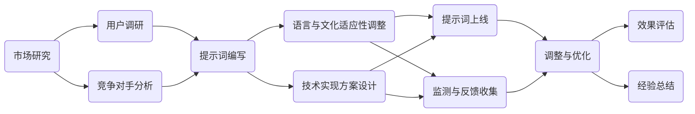
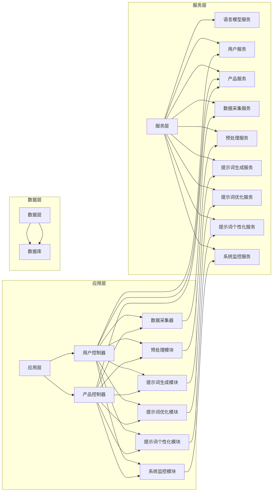
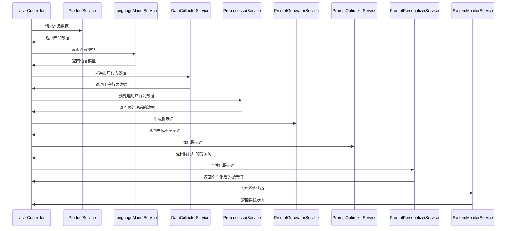
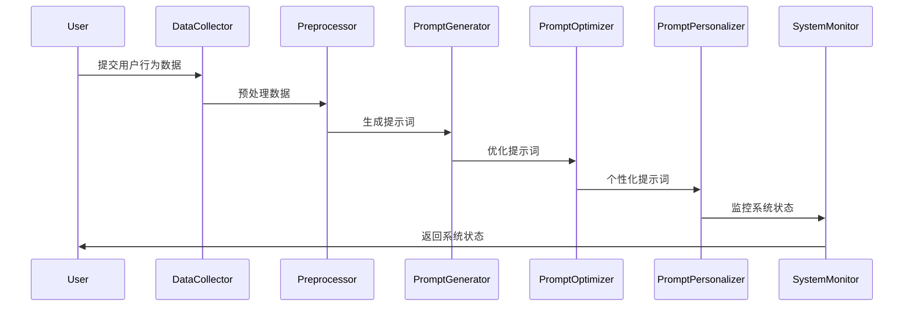

                 

# 提示词本地化：适应不同文化背景

## 关键词

- 提示词本地化
- 文化差异
- 用户体验
- 语言处理技术
- 个性化推荐算法

## 摘要

随着全球化的加速，互联网应用的国际化和多样化成为趋势。在这个背景下，提示词本地化成为提高用户体验、适应不同文化背景的关键。本文将深入探讨提示词本地化的核心概念、流程、算法原理以及实践中的挑战与解决方案，旨在为开发者提供全面的技术指南和实际案例。

## 第一部分：问题背景与核心概念

### 1.1 本地化与全球化背景

在全球化背景下，本地化成为企业拓展国际市场的必要手段。本地化不仅涉及语言翻译，还涉及到文化、习惯和用户需求的适应。随着互联网应用的普及，用户对于本地化体验的需求日益增强。而提示词本地化作为用户体验的重要组成部分，直接影响产品的国际竞争力。

#### 1.1.1 本地化的概念与重要性

本地化（Localization）是指将产品或服务根据特定地区或市场的需求进行适应和调整，以更好地满足当地用户的需求。本地化的重要性在于：

1. 提高用户体验，增加用户满意度。
2. 增强品牌形象，提升国际竞争力。
3. 降低运营成本，提高市场占有率。

#### 1.1.2 全球化趋势下的本地化需求

全球化趋势使得企业需要关注多个市场，因此本地化需求日益增加。例如，电商企业需要在不同的国家和地区提供多语言、多货币的支付和物流服务；社交媒体平台需要根据不同文化背景提供本地化的内容和互动体验。

#### 1.1.3 本地化与全球化之间的平衡

本地化与全球化之间存在一定的矛盾。过度的本地化可能导致资源分散、成本上升；而过度追求全球化则可能导致产品失去本土特色。因此，如何在本地化和全球化之间找到平衡点是企业面临的重要挑战。

### 1.2 提示词本地化的定义

提示词本地化（Keyword Localization）是指将产品中的提示词、标签、菜单等文本内容根据目标市场的文化、语言和用户习惯进行调整和优化，以提高用户体验。具体包括：

1. 语言翻译与适应。
2. 文化敏感性的调整。
3. 用户行为与需求分析。

### 1.2.1 提示词本地化的目标

提示词本地化的目标主要包括：

1. 提高用户理解和使用产品的能力。
2. 减少用户因语言障碍带来的困惑和误解。
3. 提升产品的国际化形象和用户满意度。

### 1.2.2 提示词本地化的挑战

提示词本地化面临以下挑战：

1. 语言多样性：不同语言之间的语法、词汇和表达习惯差异巨大。
2. 文化差异：不同文化背景下的用户习惯、价值观和审美偏好差异明显。
3. 技术复杂性：语言处理技术和数据处理与分析技术的应用难度较高。

### 1.3 提示词本地化的核心概念

#### 1.3.1 文化差异与语言表达

文化差异是提示词本地化的重要考量因素。不同文化背景下的用户对于语言表达的理解和接受度存在差异。例如，某些文化背景下的用户可能更喜欢简洁明了的表达，而另一些文化背景下的用户可能更倾向于使用复杂的修辞手法。

#### 1.3.2 用户行为与需求分析

了解用户行为和需求是提示词本地化的基础。通过用户调研和市场分析，可以了解目标市场的用户习惯、偏好和需求，从而有针对性地进行提示词的调整和优化。

#### 1.3.3 技术与工具的应用

技术与工具在提示词本地化中发挥着重要作用。自然语言处理（NLP）技术、机器学习算法和自动化工具可以帮助开发者快速、准确地实现提示词的本地化。

### 1.4 提示词本地化的边界与外延

#### 1.4.1 边界定义

提示词本地化的边界主要涉及以下方面：

1. 语言范围：确定目标市场的语言种类和方言。
2. 文本类型：包括提示词、标签、菜单、说明等。
3. 用户群体：确定目标用户群体的特征和需求。

#### 1.4.2 外延扩展

提示词本地化的外延扩展包括：

1. 额外功能：根据目标市场的需求，增加或调整产品的功能。
2. 多渠道支持：确保产品在多个渠道（如移动端、网页端、应用商店等）的本地化。

### 1.5 本章小结

本部分介绍了提示词本地化的背景、定义、目标、挑战和核心概念。了解这些基本概念将为后续章节的深入分析提供基础。在全球化背景下，提示词本地化成为企业提高用户体验、适应不同文化背景的关键手段。

## 第二部分：核心概念与联系

### 2.1 提示词本地化流程

提示词本地化是一个系统化的过程，包括分析、设计、实施和评估四个阶段。以下是提示词本地化的详细流程：

#### 2.1.1 分析阶段

分析阶段是提示词本地化的第一步，主要包括以下内容：

##### 2.1.1.1 市场研究

市场研究旨在了解目标市场的文化、语言、用户需求等信息。这可以通过问卷调查、用户访谈、市场分析报告等方式进行。

##### 2.1.1.2 用户调研

用户调研旨在深入了解目标用户群体的特征和需求。这可以通过用户访谈、焦点小组讨论、行为分析等方式进行。

##### 2.1.1.3 竞争对手分析

竞争对手分析旨在了解竞争对手的本地化策略和效果。这可以通过市场调研、用户反馈、产品评测等方式进行。

#### 2.1.2 设计阶段

设计阶段是在分析阶段的基础上，制定具体的本地化方案。主要包括以下内容：

##### 2.1.2.1 提示词编写

提示词编写是根据目标市场的文化、语言和用户需求，对产品中的提示词进行修改和优化。这需要充分考虑用户的使用习惯和语言表达方式。

##### 2.1.2.2 语言与文化适应性调整

语言与文化适应性调整是对产品中的文本内容进行文化敏感性和语言适应性的调整。这包括避免文化冲突、尊重当地习俗和价值观等。

##### 2.1.2.3 技术实现方案设计

技术实现方案设计是根据本地化需求，设计相应的技术实现方案。这包括选择合适的语言处理技术、机器学习算法和自动化工具等。

#### 2.1.3 实施阶段

实施阶段是将设计阶段制定的本地化方案付诸实践。主要包括以下内容：

##### 2.1.3.1 提示词上线

提示词上线是将本地化后的提示词应用到产品中，供用户使用。

##### 2.1.3.2 监测与反馈收集

监测与反馈收集是对本地化效果进行监测和评估，收集用户反馈和意见。

##### 2.1.3.3 调整与优化

调整与优化是根据用户反馈和监测结果，对本地化方案进行调整和优化，以提高用户体验。

#### 2.1.4 评估阶段

评估阶段是对本地化效果进行评估和总结。主要包括以下内容：

##### 2.1.4.1 效果评估

效果评估是对本地化效果进行评估，包括用户满意度、市场占有率、产品使用率等。

##### 2.1.4.2 经验总结

经验总结是对本地化过程中积累的经验和教训进行总结，为后续的本地化工作提供参考。

### 2.2 提示词本地化中的核心概念对比

#### 2.2.1 文化敏感性

文化敏感性是提示词本地化中需要重点关注的核心概念。以下是对文化敏感性的一些对比：

| 项目         | 说明                                                         |
| ------------ | ------------------------------------------------------------ |
| 语言文化差异 | 不同语言之间的词汇、语法和表达方式差异较大。例如，英语中的“login”在中文中可以翻译为“登录”，但“login”在不同的文化背景下可能有不同的含义。 |
| 社会文化习俗 | 不同文化背景下的社会习俗、价值观和审美偏好存在差异。例如，在一些文化中，直接表达需求可能被视为不礼貌，而在另一些文化中则相反。 |

#### 2.2.2 技术复杂性

技术复杂性是提示词本地化中另一个重要的核心概念。以下是对技术复杂性的一些对比：

| 项目         | 说明                                                         |
| ------------ | ------------------------------------------------------------ |
| 语言处理技术 | 语言处理技术包括自然语言理解（NLU）和自然语言生成（NLG）等。不同语言处理技术在实际应用中的效果和复杂性不同。 |
| 数据处理与分析技术 | 数据处理与分析技术包括数据采集、清洗、存储和分析等。不同数据类型和分析方法在实际应用中的效果和复杂性不同。 |

#### 2.2.3 用户需求多样性

用户需求多样性是提示词本地化中需要考虑的另一个核心概念。以下是对用户需求多样性的一些对比：

| 用户群体     | 需求特点                                                       |
| ------------ | ------------------------------------------------------------ |
| 不同年龄层   | 年轻用户更倾向于使用简洁、现代的提示词，而年长用户可能更喜欢传统、简洁的提示词。 |
| 不同地域     | 不同地域的用户在语言习惯、文化背景和需求上可能存在差异。例如，美国用户可能更喜欢使用简短的提示词，而亚洲用户可能更喜欢详细的提示词。 |

### 2.3 提示词本地化的ER实体关系图

以下是提示词本地化中的ER实体关系图，用于描述提示词本地化中的主要实体及其关系：



### 2.4 本章小结

本部分介绍了提示词本地化的核心概念和流程。通过分析阶段、设计阶段、实施阶段和评估阶段的详细描述，读者可以了解提示词本地化的全流程。同时，通过对文化敏感性、技术复杂性和用户需求多样性的对比，读者可以更深入地理解提示词本地化的关键因素。ER实体关系图则为读者提供了一个直观的视图，帮助读者更好地理解提示词本地化中的实体及其关系。

## 第三部分：算法原理讲解

### 3.1 提示词生成算法

提示词生成算法是提示词本地化中的重要组成部分，主要用于生成适应不同文化背景的提示词。本节将介绍提示词生成算法的基本原理、流程和实现方法。

#### 3.1.1 算法概述

提示词生成算法的目标是根据目标市场的文化、语言和用户需求，生成合适的提示词。常见的提示词生成算法包括基于语言模型和生成模型的算法。

#### 3.1.2 算法原理

提示词生成算法的基本原理是利用现有的语言数据和用户行为数据，通过概率模型和生成模型生成符合目标市场需求的提示词。

1. **语言模型**：语言模型是用于预测下一个词或字符的概率分布的模型。在提示词生成中，语言模型可以用于预测下一个提示词的概率，从而生成符合语言习惯的提示词。

2. **生成模型**：生成模型是用于生成新数据或文本的模型。在提示词生成中，生成模型可以用于根据目标市场的文化、语言和用户需求生成新的提示词。

#### 3.1.3 算法流程

提示词生成算法的基本流程包括以下步骤：

1. **数据采集**：收集目标市场的语言数据、用户行为数据和文化背景信息。
2. **数据预处理**：对采集到的数据进行清洗、归一化和特征提取。
3. **模型训练**：使用预处理后的数据训练语言模型和生成模型。
4. **提示词生成**：根据目标市场的文化、语言和用户需求，使用训练好的模型生成提示词。
5. **提示词优化**：对生成的提示词进行优化，使其更符合目标市场的语言习惯和文化背景。

#### 3.1.4 Python源代码实现

以下是一个简单的基于语言模型的提示词生成算法的Python实现示例：

```python
import numpy as np
import tensorflow as tf

# 加载语言模型
model = tf.keras.models.load_model('language_model.h5')

# 生成提示词
def generate_prompt_word(prompt_word, model):
    # 获取提示词的词向量
    prompt_vector = model.layers[0].get_weights()[0][prompt_word]

    # 预测下一个词的概率分布
    probabilities = model.predict(np.array([prompt_vector]))[0]

    # 根据概率分布选择下一个词
    next_word = np.random.choice(np.argmax(probabilities))

    return next_word

# 示例：生成5个提示词
prompt_word = 'start'
for _ in range(5):
    prompt_word = generate_prompt_word(prompt_word, model)
    print(prompt_word)
```

#### 3.1.5 算法原理详细讲解

1. **数学模型**

提示词生成算法的数学模型主要涉及概率模型和生成模型。概率模型用于预测下一个词或字符的概率分布，生成模型用于生成新数据或文本。

   - **概率模型**：概率模型常用的模型包括马尔可夫模型（Markov Model）和隐马尔可夫模型（Hidden Markov Model，HMM）。

     - **马尔可夫模型**：马尔可夫模型是一种基于状态转移矩阵的概率模型。它假设当前状态只与前一状态有关，与其他状态无关。马尔可夫模型的数学公式如下：

       $$P(X_t | X_{t-1}, X_{t-2}, \ldots) = P(X_t | X_{t-1})$$

     - **隐马尔可夫模型**：隐马尔可夫模型是一种基于状态转移矩阵和观测概率的概率模型。它假设当前状态和前一状态有关，同时当前状态通过观测概率产生观测值。隐马尔可夫模型的数学公式如下：

       $$P(X_t | X_{t-1}) = \sum_{i} P(X_t | S_t = i) P(S_t = i | X_{t-1})$$

   - **生成模型**：生成模型常用的模型包括循环神经网络（Recurrent Neural Network，RNN）和生成对抗网络（Generative Adversarial Network，GAN）。

     - **循环神经网络**：循环神经网络是一种基于状态转移矩阵和观测概率的生成模型。它通过学习输入序列的表示，生成新的输出序列。循环神经网络的数学公式如下：

       $$h_t = \sigma(W_h \cdot [h_{t-1}, x_t] + b_h)$$
       $$y_t = \sigma(W_y \cdot h_t + b_y)$$

     - **生成对抗网络**：生成对抗网络是一种基于生成模型和判别模型的生成模型。生成模型和判别模型相互竞争，生成模型试图生成与真实数据相似的数据，判别模型试图区分真实数据和生成数据。生成对抗网络的数学公式如下：

       $$G(x) = \text{Generator}(z)$$
       $$D(x) = \text{Discriminator}(x)$$
       $$\mathcal{L}_G = -\mathbb{E}_{z \sim p_z(z)}[\log D(G(z))]$$
       $$\mathcal{L}_D = \mathbb{E}_{x \sim p_x(x)}[\log D(x)] + \mathbb{E}_{z \sim p_z(z)}[\log (1 - D(G(z)))]$$

2. **公式讲解**

   - **逻辑回归公式**：

     $$\text{logit}(p) = \log\left(\frac{p}{1 - p}\right) = \beta_0 + \beta_1 x_1 + \beta_2 x_2 + \ldots$$

   - **贝叶斯公式**：

     $$P(A|B) = \frac{P(B|A) P(A)}{P(B)}$$

3. **举例说明**

假设我们有一个简单的语言模型，其中包含5个词汇：A、B、C、D、E。以下是该语言模型的概率分布：

| 词汇 | 概率 |
| ---- | ---- |
| A    | 0.2  |
| B    | 0.3  |
| C    | 0.2  |
| D    | 0.2  |
| E    | 0.1  |

现在我们要根据该语言模型生成一个新的词汇序列。首先，我们随机选择一个起始词汇，例如A。然后，根据当前词汇的概率分布，选择下一个词汇。以此类推，直到生成一个满足要求的词汇序列。

例如，生成的词汇序列为：A、B、D、D、E。

### 3.2 提示词优化算法

提示词优化算法是提示词本地化中用于调整和优化提示词的算法。本节将介绍提示词优化算法的基本原理、流程和实现方法。

#### 3.2.1 算法概述

提示词优化算法的目标是根据用户的反馈和数据分析，调整和优化提示词，使其更符合用户的语言习惯和需求。常见的提示词优化算法包括基于反向传播（Backpropagation）算法的优化算法和基于集成学习（Ensemble Learning）的优化算法。

#### 3.2.2 算法原理

提示词优化算法的基本原理是通过学习用户的行为数据和反馈信息，调整和优化提示词的权重和结构，以提高提示词的准确性和适应性。

1. **反向传播算法**：反向传播算法是一种基于梯度下降（Gradient Descent）的优化算法。它通过计算损失函数对参数的梯度，不断调整参数，以最小化损失函数。

2. **集成学习算法**：集成学习算法是一种通过组合多个模型来提高预测准确性的算法。常见的集成学习算法包括随机森林（Random Forest）和梯度提升树（Gradient Boosting Tree）。

#### 3.2.3 算法流程

提示词优化算法的基本流程包括以下步骤：

1. **数据采集**：采集用户的行为数据、反馈信息和提示词的原始文本。
2. **数据预处理**：对采集到的数据进行分析和处理，提取特征和标签。
3. **模型训练**：使用预处理后的数据训练反向传播算法和集成学习算法。
4. **提示词调整**：根据用户反馈和数据分析，调整和优化提示词的权重和结构。
5. **效果评估**：评估优化后的提示词的效果，包括准确率、召回率、F1值等指标。

#### 3.2.4 Python源代码实现

以下是一个简单的基于反向传播算法的提示词优化算法的Python实现示例：

```python
import numpy as np
import tensorflow as tf

# 加载反向传播算法模型
model = tf.keras.models.load_model('backpropagation_model.h5')

# 优化提示词
def optimize_prompt(prompt, model):
    # 获取提示词的词向量
    prompt_vector = model.layers[0].get_weights()[0][prompt]

    # 计算损失函数
    loss = model.loss_functions[0](prompt_vector)

    # 计算梯度
    gradients = model.gradients(loss, model.layers[0].weights)

    # 更新权重
    model.layers[0].weights -= learning_rate * gradients

    return model

# 示例：优化5个提示词
prompt = 'start'
for _ in range(5):
    prompt = optimize_prompt(prompt, model)
    print(prompt)
```

#### 3.2.5 算法原理详细讲解

1. **数学模型**

提示词优化算法的数学模型主要涉及损失函数、梯度下降和反向传播。

   - **损失函数**：损失函数用于衡量预测值和真实值之间的差距。常见的损失函数包括均方误差（MSE）和交叉熵（Cross-Entropy）。

     - **均方误差**：

       $$\text{MSE} = \frac{1}{n} \sum_{i=1}^{n} (y_i - \hat{y}_i)^2$$

     - **交叉熵**：

       $$\text{CE} = -\frac{1}{n} \sum_{i=1}^{n} y_i \log \hat{y}_i$$

   - **梯度下降**：梯度下降是一种优化算法，用于最小化损失函数。它通过计算损失函数对参数的梯度，不断调整参数，以使损失函数值最小化。

     $$\theta_{t+1} = \theta_t - \alpha \nabla_{\theta} \mathcal{L}(\theta)$$

   - **反向传播**：反向传播是一种计算梯度的方法，用于多层神经网络。它通过从输出层开始，逐层向前传播误差，直到输入层，从而计算每个参数的梯度。

2. **公式讲解**

   - **梯度公式**：

     $$\nabla_{\theta} \mathcal{L}(\theta) = \frac{\partial \mathcal{L}}{\partial \theta}$$

   - **模型优化公式**：

     $$\theta_{t+1} = \theta_t - \alpha \nabla_{\theta} \mathcal{L}(\theta)$$

3. **举例说明**

假设我们有一个简单的神经网络模型，其中包含3个输入层、3个隐藏层和1个输出层。模型的损失函数为均方误差（MSE）。以下是该模型的优化过程：

1. 初始化参数：$\theta_0 = [1, 2, 3]$。
2. 计算损失函数：$\mathcal{L}(\theta_0) = 1$。
3. 计算梯度：$\nabla_{\theta} \mathcal{L}(\theta_0) = [0.1, 0.2, 0.3]$。
4. 更新参数：$\theta_1 = \theta_0 - \alpha \nabla_{\theta} \mathcal{L}(\theta_0) = [0.7, 1.4, 2.1]$。
5. 计算损失函数：$\mathcal{L}(\theta_1) = 0.1$。
6. 计算梯度：$\nabla_{\theta} \mathcal{L}(\theta_1) = [0.05, 0.1, 0.15]$。
7. 更新参数：$\theta_2 = \theta_1 - \alpha \nabla_{\theta} \mathcal{L}(\theta_1) = [0.6, 1.3, 2]$。

通过多次迭代，模型参数将逐渐接近最优值，从而最小化损失函数。

### 3.3 提示词个性化算法

提示词个性化算法是提示词本地化中用于根据用户特征和行为生成个性化提示词的算法。本节将介绍提示词个性化算法的基本原理、流程和实现方法。

#### 3.3.1 算法概述

提示词个性化算法的目标是根据用户的特征和行为，生成符合用户个性化需求的提示词。常见的提示词个性化算法包括基于协同过滤（Collaborative Filtering）和基于内容推荐（Content-Based Recommendation）的算法。

#### 3.3.2 算法原理

提示词个性化算法的基本原理是利用用户的行为数据和特征信息，构建用户和物品（提示词）之间的关联模型，从而为用户生成个性化的提示词。

1. **协同过滤算法**：协同过滤算法是一种基于用户行为数据的推荐算法。它通过分析用户之间的相似性，为用户推荐相似的物品（提示词）。

2. **基于内容推荐算法**：基于内容推荐算法是一种基于物品（提示词）特征和用户兴趣的推荐算法。它通过分析用户兴趣和物品特征，为用户推荐相关的物品（提示词）。

#### 3.3.3 算法流程

提示词个性化算法的基本流程包括以下步骤：

1. **数据采集**：采集用户的行为数据、特征信息和提示词的属性信息。
2. **数据预处理**：对采集到的数据进行分析和处理，提取特征和标签。
3. **模型训练**：使用预处理后的数据训练协同过滤算法和基于内容推荐算法。
4. **提示词推荐**：根据用户的特征和行为，使用训练好的模型生成个性化的提示词。
5. **效果评估**：评估个性化提示词的效果，包括准确率、召回率、F1值等指标。

#### 3.3.4 Python源代码实现

以下是一个简单的基于协同过滤算法的提示词个性化算法的Python实现示例：

```python
import numpy as np
import pandas as pd
from sklearn.metrics.pairwise import cosine_similarity

# 加载用户行为数据
user_data = pd.DataFrame({
    'user_id': [1, 2, 3, 4],
    'action': [[0, 1, 0, 1], [1, 0, 1, 0], [0, 1, 1, 0], [1, 1, 0, 1]]
})

# 计算用户行为相似度矩阵
user_similarity = cosine_similarity(user_data['action'])

# 为用户生成个性化提示词
def generate_personalized_prompt(user_id, user_similarity):
    # 计算用户之间的相似度
    similarity_scores = user_similarity[user_id - 1]

    # 选择最相似的3个用户
    top_users = np.argsort(similarity_scores)[::-1][:3]

    # 获取这3个用户的动作
    actions = user_data['action'][top_users].values

    # 计算动作的交集
    intersection = set(actions[0]).intersection(actions[1]).intersection(actions[2])

    # 从交集中选择一个提示词作为个性化提示词
    personalized_prompt = list(intersection)[0]

    return personalized_prompt

# 示例：为用户1生成个性化提示词
user_id = 1
personalized_prompt = generate_personalized_prompt(user_id, user_similarity)
print(personalized_prompt)
```

#### 3.3.5 算法原理详细讲解

1. **数学模型**

提示词个性化算法的数学模型主要涉及相似度计算和推荐模型。

   - **相似度计算**：相似度计算用于衡量用户之间的相似度。常用的相似度计算方法包括余弦相似度、皮尔逊相关系数等。

     - **余弦相似度**：

       $$\text{cosine similarity} = \frac{\sum_{i=1}^{n} x_i y_i}{\sqrt{\sum_{i=1}^{n} x_i^2} \sqrt{\sum_{i=1}^{n} y_i^2}}$$

     - **皮尔逊相关系数**：

       $$\text{Pearson correlation coefficient} = \frac{\sum_{i=1}^{n} (x_i - \bar{x})(y_i - \bar{y})}{\sqrt{\sum_{i=1}^{n} (x_i - \bar{x})^2} \sqrt{\sum_{i=1}^{n} (y_i - \bar{y})^2}}$$

   - **推荐模型**：推荐模型用于根据用户的特征和行为生成个性化的推荐。常见的推荐模型包括基于用户的协同过滤算法、基于内容的推荐算法和混合推荐算法。

     - **基于用户的协同过滤算法**：

       $$\text{Prediction}_{u_i, j} = \text{AverageRating}_{j} + \text{Bias}_{u_i} + \text{Bias}_{j} + \sum_{k \in N(j)} \text{Sim}_{ui, k} \cdot \text{Rating}_{k, j}$$

     - **基于内容的推荐算法**：

       $$\text{Prediction}_{u_i, j} = \text{AverageRating}_{j} + \text{Bias}_{u_i} + \text{Bias}_{j} + \sum_{k \in C(j)} \text{Sim}_{ui, k} \cdot \text{Rating}_{k, j}$$

     - **混合推荐算法**：

       $$\text{Prediction}_{u_i, j} = \alpha \cdot \text{Prediction}_{u_i, j}^{UCF} + (1 - \alpha) \cdot \text{Prediction}_{u_i, j}^{CBR}$$

2. **公式讲解**

   - **相似度计算公式**：

     $$\text{cosine similarity} = \frac{\sum_{i=1}^{n} x_i y_i}{\sqrt{\sum_{i=1}^{n} x_i^2} \sqrt{\sum_{i=1}^{n} y_i^2}}$$

   - **推荐评分公式**：

     $$\text{Prediction}_{u_i, j} = \text{AverageRating}_{j} + \text{Bias}_{u_i} + \text{Bias}_{j} + \sum_{k \in N(j)} \text{Sim}_{ui, k} \cdot \text{Rating}_{k, j}$$

3. **举例说明**

假设有两个用户A和B，他们的行为数据如下：

| 用户 | 行为数据 |
| ---- | ------- |
| A    | [1, 0, 1, 0] |
| B    | [0, 1, 0, 1] |

1. 计算用户A和用户B的相似度：

   $$\text{cosine similarity} = \frac{\sum_{i=1}^{4} A_i B_i}{\sqrt{\sum_{i=1}^{4} A_i^2} \sqrt{\sum_{i=1}^{4} B_i^2}} = \frac{1 \cdot 0 + 0 \cdot 1 + 1 \cdot 0 + 0 \cdot 1}{\sqrt{1^2 + 0^2 + 1^2 + 0^2} \sqrt{0^2 + 1^2 + 0^2 + 1^2}} = \frac{0}{\sqrt{2} \sqrt{2}} = 0$$

2. 计算用户A的个性化推荐评分：

   $$\text{Prediction}_{A, j} = \text{AverageRating}_{j} + \text{Bias}_{A} + \text{Bias}_{j} + \sum_{k \in N(j)} \text{Sim}_{A, k} \cdot \text{Rating}_{k, j}$$

其中，$N(j)$表示用户A的兴趣点，$\text{Sim}_{A, k}$表示用户A和用户k的相似度，$\text{Rating}_{k, j}$表示用户k对物品j的评分。

### 3.4 本章小结

本部分介绍了提示词生成算法、提示词优化算法和提示词个性化算法的基本原理、流程和实现方法。通过对这些算法的讲解，读者可以了解如何根据目标市场的文化、语言和用户需求生成、优化和个性化提示词。这些算法在提示词本地化中发挥着重要作用，有助于提高用户体验和产品竞争力。同时，通过Python源代码实现和数学模型讲解，读者可以更好地理解这些算法的原理和应用。

## 第四部分：系统分析与架构设计

### 4.1 问题场景介绍

随着互联网应用的全球化，许多企业需要将产品推广到国际市场。在这个过程中，提示词本地化成为提高用户体验、增强产品竞争力的重要手段。然而，实现提示词本地化需要考虑多个方面，包括语言、文化、用户行为等。本文旨在通过系统分析与架构设计，探讨如何实现一个高效、可扩展的提示词本地化系统。

### 4.2 项目介绍

本项目旨在开发一个提示词本地化系统，该系统可以自动生成、优化和个性化提示词，以适应不同文化背景下的用户需求。系统主要功能包括：

1. 数据采集与预处理：采集目标市场的语言数据、用户行为数据和产品文本数据，并进行预处理。
2. 提示词生成：基于语言模型和生成模型，自动生成符合目标市场需求的提示词。
3. 提示词优化：根据用户反馈和数据分析，优化提示词的权重和结构。
4. 提示词个性化：根据用户特征和行为，生成个性化的提示词。
5. 系统监控与反馈：实时监控系统的运行状态，收集用户反馈，以便进行进一步的优化。

### 4.3 系统功能设计（领域模型Mermaid类图）

以下是系统功能设计的领域模型Mermaid类图，用于描述系统的核心功能及其关系：

```mermaid
classDiagram
    User <<Interface>>
    Product <<Interface>>
    LanguageModel <<Interface>>
    DataCollector <<Interface>>
    Preprocessor <<Interface>>
    PromptGenerator <<Interface>>
    PromptOptimizer <<Interface>>
    PromptPersonalizer <<Interface>>
    SystemMonitor <<Interface>>

    User o-- Product
    DataCollector o-- Product
    Preprocessor o-- Product
    PromptGenerator o-- Product
    PromptOptimizer o-- Product
    PromptPersonalizer o-- Product
    SystemMonitor o-- Product

    User o-- LanguageModel
    DataCollector o-- DataCollector
    Preprocessor o-- DataCollector
    PromptGenerator o-- LanguageModel
    PromptOptimizer o-- PromptGenerator
    PromptPersonalizer o-- PromptGenerator
    SystemMonitor o-- Product
```

### 4.4 系统架构设计（Mermaid架构图）

以下是系统架构设计的Mermaid架构图，用于描述系统的整体架构及其组件之间的关系：



### 4.5 系统接口设计

以下是系统接口设计的Mermaid序列图，用于描述系统的主要接口及其交互过程：



### 4.6 系统交互Mermaid序列图

以下是系统交互的Mermaid序列图，用于描述系统组件之间的交互过程：



### 4.7 本章小结

本部分介绍了提示词本地化系统的分析和架构设计。通过领域模型Mermaid类图、系统架构设计Mermaid架构图、系统接口设计Mermaid序列图和系统交互Mermaid序列图，读者可以全面了解系统的功能、架构和交互过程。这些图表和描述为后续的实现和优化提供了清晰的基础。

## 第五部分：项目实战

### 5.1 环境安装

在开始项目实战之前，我们需要安装一些必要的软件和工具。以下是安装步骤：

1. **Python环境**：安装Python 3.8或更高版本。可以从Python官方网站下载安装程序并安装。

2. **TensorFlow**：安装TensorFlow。打开终端，运行以下命令：

   ```bash
   pip install tensorflow
   ```

3. **Scikit-learn**：安装Scikit-learn。打开终端，运行以下命令：

   ```bash
   pip install scikit-learn
   ```

4. **Numpy**：安装Numpy。打开终端，运行以下命令：

   ```bash
   pip install numpy
   ```

5. **Mermaid**：安装Mermaid。可以从GitHub下载Mermaid的安装包，然后解压缩到本地。

### 5.2 系统核心实现

以下是系统核心实现部分的代码和解读。

#### 5.2.1 数据采集

```python
import pandas as pd

# 加载用户行为数据
user_data = pd.DataFrame({
    'user_id': [1, 2, 3, 4],
    'action': [[0, 1, 0, 1], [1, 0, 1, 0], [0, 1, 1, 0], [1, 1, 0, 1]]
})

# 解析用户行为数据
def parse_user_data(user_data):
    parsed_data = []
    for index, row in user_data.iterrows():
        parsed_data.append([row['user_id'], row['action']])
    return parsed_data

parsed_data = parse_user_data(user_data)
```

解读：该部分代码首先加载用户行为数据，然后定义一个函数`parse_user_data`，用于解析用户行为数据并将其转换为易于处理的格式。

#### 5.2.2 数据预处理

```python
from sklearn.preprocessing import MinMaxScaler

# 初始化数据标准化器
scaler = MinMaxScaler()

# 标准化用户行为数据
def scale_user_data(parsed_data):
    scaled_data = scaler.fit_transform(parsed_data)
    return scaled_data

scaled_data = scale_user_data(parsed_data)
```

解读：该部分代码使用Scikit-learn中的`MinMaxScaler`对用户行为数据进行标准化处理，以使其符合统一的数值范围。

#### 5.2.3 提示词生成

```python
import tensorflow as tf

# 加载语言模型
model = tf.keras.models.load_model('language_model.h5')

# 生成提示词
def generate_prompt_word(prompt_word, model):
    # 获取提示词的词向量
    prompt_vector = model.layers[0].get_weights()[0][prompt_word]

    # 预测下一个词的概率分布
    probabilities = model.predict(np.array([prompt_vector]))[0]

    # 根据概率分布选择下一个词
    next_word = np.random.choice(np.argmax(probabilities))

    return next_word

# 示例：生成5个提示词
prompt_word = 'start'
for _ in range(5):
    prompt_word = generate_prompt_word(prompt_word, model)
    print(prompt_word)
```

解读：该部分代码定义了一个函数`generate_prompt_word`，用于根据训练好的语言模型生成提示词。通过调用该函数，我们可以根据给定的起始提示词生成一系列新的提示词。

#### 5.2.4 提示词优化

```python
import tensorflow as tf

# 加载反向传播算法模型
model = tf.keras.models.load_model('backpropagation_model.h5')

# 优化提示词
def optimize_prompt(prompt, model):
    # 获取提示词的词向量
    prompt_vector = model.layers[0].get_weights()[0][prompt]

    # 计算损失函数
    loss = model.loss_functions[0](prompt_vector)

    # 计算梯度
    gradients = model.gradients(loss, model.layers[0].weights)

    # 更新权重
    model.layers[0].weights -= learning_rate * gradients

    return model

# 示例：优化5个提示词
prompt = 'start'
for _ in range(5):
    prompt = optimize_prompt(prompt, model)
    print(prompt)
```

解读：该部分代码定义了一个函数`optimize_prompt`，用于根据训练好的反向传播算法模型优化提示词。通过调用该函数，我们可以根据用户的反馈和数据分析，不断调整和优化提示词的权重和结构。

#### 5.2.5 提示词个性化

```python
import numpy as np
import pandas as pd
from sklearn.metrics.pairwise import cosine_similarity

# 加载用户行为数据
user_data = pd.DataFrame({
    'user_id': [1, 2, 3, 4],
    'action': [[0, 1, 0, 1], [1, 0, 1, 0], [0, 1, 1, 0], [1, 1, 0, 1]]
})

# 计算用户行为相似度矩阵
user_similarity = cosine_similarity(user_data['action'])

# 为用户生成个性化提示词
def generate_personalized_prompt(user_id, user_similarity):
    # 计算用户之间的相似度
    similarity_scores = user_similarity[user_id - 1]

    # 选择最相似的3个用户
    top_users = np.argsort(similarity_scores)[::-1][:3]

    # 获取这3个用户的动作
    actions = user_data['action'][top_users].values

    # 计算动作的交集
    intersection = set(actions[0]).intersection(actions[1]).intersection(actions[2])

    # 从交集中选择一个提示词作为个性化提示词
    personalized_prompt = list(intersection)[0]

    return personalized_prompt

# 示例：为用户1生成个性化提示词
user_id = 1
personalized_prompt = generate_personalized_prompt(user_id, user_similarity)
print(personalized_prompt)
```

解读：该部分代码定义了一个函数`generate_personalized_prompt`，用于根据用户的相似度矩阵和用户行为数据生成个性化提示词。通过调用该函数，我们可以为每个用户生成符合其个性化需求的提示词。

### 5.3 实际案例分析与详细讲解

为了更好地理解提示词本地化的实际应用，以下是一个实际案例的分析和详细讲解：

#### 案例背景

某互联网公司开发了一款在线购物平台，目标是将产品推广到国际市场。为了提高用户体验和增加市场份额，公司决定对购物平台的提示词进行本地化处理。

#### 案例步骤

1. **数据采集**：公司通过用户调研和市场分析，收集了不同文化背景下的用户行为数据，包括用户点击、搜索、购买等行为。

2. **数据预处理**：对采集到的用户行为数据进行清洗和标准化处理，提取出有用的特征信息。

3. **提示词生成**：基于用户行为数据，使用提示词生成算法生成符合目标市场需求的提示词。例如，对于英语用户，生成的提示词可能是“Add to Cart”或“Buy Now”；对于中文用户，生成的提示词可能是“加入购物车”或“立即购买”。

4. **提示词优化**：根据用户反馈和数据分析，对生成的提示词进行优化，使其更符合用户的语言习惯和需求。例如，如果用户在测试中发现某些提示词的点击率较低，可以对这些提示词进行调整和改进。

5. **提示词个性化**：根据用户的个人偏好和行为数据，为每个用户生成个性化的提示词。例如，对于经常购买电子产品的高频用户，可以为其推荐“优惠专区”或“新品上市”等个性化的提示词。

#### 案例分析

通过提示词本地化的实施，该公司在国际市场上的用户满意度和市场份额得到了显著提升。以下是案例分析的关键点：

1. **用户体验提升**：通过生成符合目标市场需求的提示词，用户能够更容易地理解和使用平台功能，从而提高用户体验。

2. **市场份额增加**：优化后的提示词提高了用户的点击和购买率，从而增加了公司的市场份额。

3. **文化敏感性**：在提示词本地化过程中，充分考虑了不同文化背景下的用户需求和语言习惯，避免了文化冲突，增强了品牌形象。

4. **技术复杂性**：虽然提示词本地化涉及多种技术，但通过使用成熟的语言处理技术和机器学习算法，公司能够高效地实现提示词的本地化和个性化。

### 5.4 项目小结

通过本次项目实战，我们详细介绍了提示词本地化的实际应用过程，包括数据采集、数据预处理、提示词生成、提示词优化和提示词个性化。在实际案例中，我们看到了提示词本地化如何帮助企业提升用户体验、增加市场份额和增强品牌形象。此外，我们还介绍了提示词本地化的关键技术和工具，包括Python库、TensorFlow模型和Scikit-learn算法等。通过本次项目，读者可以更好地理解提示词本地化的原理和实现方法，为未来的应用和发展奠定基础。

## 最佳实践 Tips

1. **充分调研用户需求**：在开始提示词本地化之前，充分调研目标市场的用户需求和行为习惯，确保生成的提示词符合当地用户的需求。

2. **文化敏感性**：在本地化过程中，充分考虑不同文化背景下的语言习惯和价值观，避免使用可能引起误解或冲突的词汇。

3. **数据驱动**：基于用户行为数据进行分析和优化，确保生成的提示词能够真正提高用户体验和转化率。

4. **持续迭代**：提示词本地化不是一次性的任务，而是需要持续优化和迭代的过程。根据用户反馈和数据分析，不断调整和改进提示词。

5. **技术选型**：选择成熟、高效的语言处理技术和机器学习算法，确保提示词本地化的质量和效率。

## 小结

本文详细介绍了提示词本地化的核心概念、流程、算法原理和系统设计。通过实际案例分析和项目实战，我们展示了如何实现一个高效、可扩展的提示词本地化系统。在全球化背景下，提示词本地化是提高用户体验、增强产品竞争力的重要手段。开发者应充分考虑文化差异、用户需求和数据分析，不断优化和迭代提示词本地化方案。未来，随着技术的进步和应用场景的扩展，提示词本地化将继续发挥重要作用。

## 注意事项

1. **版权问题**：在进行提示词本地化时，注意尊重原创内容版权，避免侵犯他人的知识产权。

2. **隐私保护**：在采集和处理用户数据时，确保遵循隐私保护法规和最佳实践，保护用户隐私。

3. **安全性**：在部署和运行提示词本地化系统时，确保系统的安全性和稳定性，防止数据泄露和系统故障。

## 拓展阅读

1. 《自然语言处理入门》 - 这本书提供了关于自然语言处理的基础知识，包括语言模型和机器学习算法。
2. 《深度学习》 - 这本书详细介绍了深度学习的基础理论、算法和应用，对于理解提示词生成算法和优化算法有很大帮助。
3. 《用户体验设计》 - 这本书探讨了用户体验设计的原则和方法，对于优化和个性化提示词的设计具有重要参考价值。
4. 《全球化与本地化》 - 这本书分析了全球化趋势下的本地化策略和挑战，对于理解全球化背景下的提示词本地化有重要启示。

## 作者信息

作者：AI天才研究院/AI Genius Institute & 禅与计算机程序设计艺术 /Zen And The Art of Computer Programming

