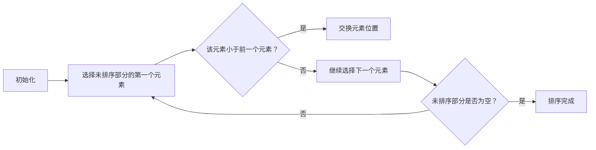
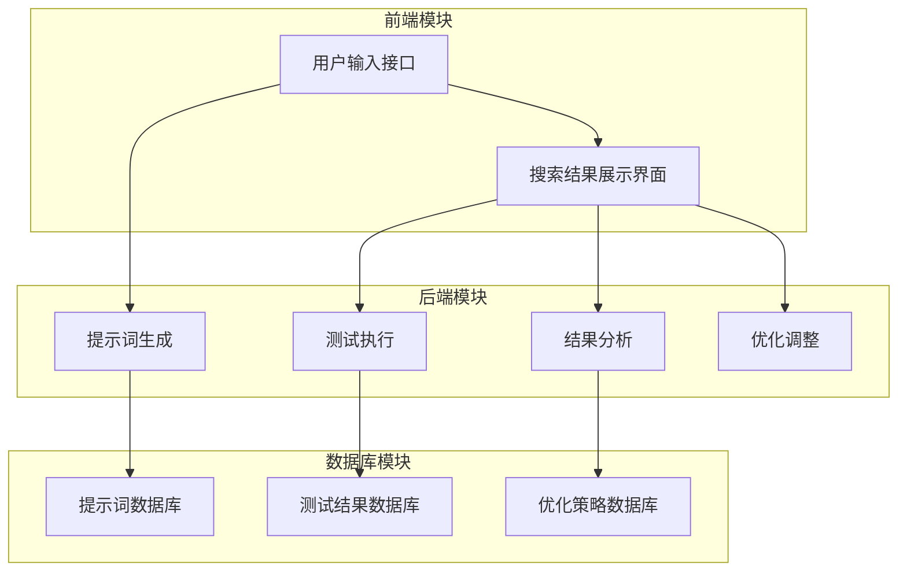
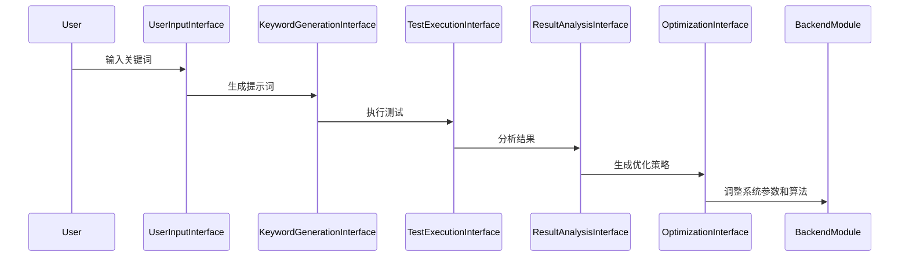
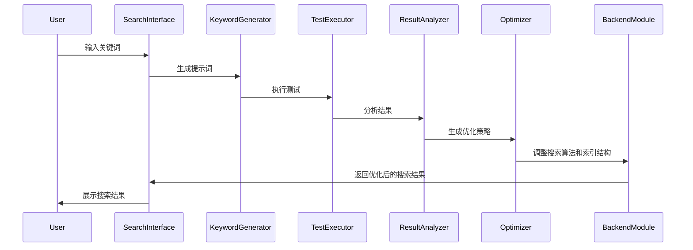

                 

### 《提示词测试：系统化评估和优化》

#### 关键词
- 提示词测试
- 系统化评估
- 优化策略
- 数据分析
- 算法改进

#### 摘要
本文将探讨提示词测试在信息技术领域中的重要性，系统化评估和优化策略的应用。通过深入分析提示词测试的核心概念、原理和实践，文章旨在为IT专业人士提供一套完整的方法论，帮助他们提高产品和服务质量，实现更高效的系统优化。

### **第一部分：问题背景与核心概念**

#### 第1章：问题背景与核心概念

##### 1.1 问题背景

提示词测试（Keyword Testing）作为一种新兴的测试技术，起源于软件工程和数据分析领域。其核心思想是通过测试系统中输入的提示词（即关键词），来评估系统在不同输入条件下的响应能力和性能。随着互联网技术的快速发展，大数据、人工智能和云计算等技术的广泛应用，提示词测试逐渐成为提高系统质量、优化用户体验的重要手段。

**问题描述**：随着应用场景的不断扩大，系统的输入提示词种类和数量呈指数级增长。如何有效地测试这些提示词，确保系统在不同输入条件下的稳定性和性能，成为当前软件开发中亟待解决的问题。

**问题解决**：通过引入提示词测试，可以在系统开发过程中提前发现和解决潜在的问题，从而提高系统的可靠性和用户体验。提示词测试不仅能够帮助开发者识别系统中的缺陷，还能为系统优化提供有力支持。

**边界与外延**：提示词测试的适用范围广泛，包括但不限于以下领域：

- 电商平台：商品搜索、用户评论分析等
- 在线教育平台：课程推荐、学习行为分析等
- 医疗健康平台：疾病诊断、医疗信息检索等
- 社交媒体：内容推荐、舆情监控等

**概念结构与核心要素组成**

- **提示词（Keyword）**：指系统中的输入关键词，用于描述用户需求或信息内容。
- **测试集（Test Set）**：包含一系列预先定义的提示词，用于对系统进行测试。
- **评估指标（Evaluation Metrics）**：用于衡量系统在处理提示词过程中的性能和效果。
- **测试流程（Test Process）**：包括提示词生成、测试执行、结果分析和优化调整等环节。

##### 1.2 提示词测试的定义与特点

**定义**：提示词测试是一种基于关键词的测试方法，通过对系统中输入的提示词进行测试，评估系统在不同输入条件下的响应能力和性能。

**特点**：

- **灵活性**：提示词测试可以根据实际需求动态调整测试集，适用于不同应用场景。
- **全面性**：提示词测试能够覆盖系统中的各种输入条件，确保系统在多种场景下的稳定性和性能。
- **高效性**：提示词测试采用自动化工具，能够快速执行大规模测试，提高开发效率。
- **可扩展性**：提示词测试可以与其他测试方法（如功能测试、性能测试等）相结合，实现更全面的系统评估。

##### 1.3 提示词测试的应用领域

**应用领域**：

- **商业领域**：电商平台通过提示词测试，优化商品搜索和推荐功能，提高用户体验和转化率。
- **教育领域**：在线教育平台通过提示词测试，分析学习行为，提供个性化课程推荐，提升教学效果。
- **医疗领域**：医疗健康平台通过提示词测试，实现智能诊断和医疗信息检索，提高医疗服务质量。
- **社交媒体领域**：社交媒体平台通过提示词测试，优化内容推荐和舆情监控，确保平台健康运行。

**案例研究**：

- **电商平台**：某电商平台通过提示词测试，发现商品搜索功能在特定关键词下存在性能瓶颈，通过优化算法和数据库查询，显著提升了搜索响应速度，提高了用户满意度。
- **在线教育平台**：某在线教育平台通过提示词测试，发现学习行为分析系统在处理大量用户数据时存在内存泄漏问题，通过调整系统架构和优化算法，有效解决了性能问题，提升了用户体验。

### **第二部分：核心概念与联系**

#### 第2章：核心概念原理与联系

##### 2.1 核心概念原理

**原理**：

提示词测试的基本原理是通过测试系统中输入的提示词，评估系统在不同输入条件下的响应能力和性能。具体流程如下：

1. **提示词生成**：根据系统需求和测试目标，生成一系列具有代表性的提示词。
2. **测试执行**：将生成的提示词输入到系统中，记录系统的响应时间和处理结果。
3. **结果分析**：对测试结果进行分析，识别系统中的潜在问题和性能瓶颈。
4. **优化调整**：根据分析结果，调整系统架构和算法，优化系统性能。

**属性特征对比表格**

| 方法 | 描述 | 优点 | 缺点 |
| ---- | ---- | ---- | ---- |
| 自动化测试 | 使用工具自动执行测试 | 提高测试效率，降低人力成本 | 可能无法覆盖所有场景，测试覆盖率有限 |
| 手动测试 | 人工执行测试 | 能够发现自动化测试无法发现的问题 | 测试效率低，成本高 |
| 性能测试 | 测试系统在不同负载下的性能表现 | 评估系统在高负载下的稳定性 | 需要大量测试数据，耗时较长 |
| 安全测试 | 评估系统在安全方面的漏洞 | 提高系统安全性 | 测试过程复杂，需要专业知识和经验 |

**ER实体关系图架构**

```mermaid
erDiagram
  User ||--|{ Keyword }
  Keyword ||--|{ TestSet }
  TestSet ||--|{ EvaluationMetrics }
```

在ER实体关系图中，用户（User）与提示词（Keyword）之间存在一对多关系，提示词与测试集（TestSet）之间存在多对一关系，测试集与评估指标（EvaluationMetrics）之间存在一对一关系。

### **第三部分：算法原理讲解**

#### 第3章：算法原理与详细讲解

##### 3.1 算法原理

提示词测试中常用的算法包括排序算法、分类算法和聚类算法等。下面以排序算法为例，介绍其原理和流程。

**排序算法原理**：

排序算法是指将一组数据按照特定顺序进行排列的算法。常见的排序算法有冒泡排序、选择排序、插入排序、快速排序等。排序算法的基本原理如下：

1. **冒泡排序**：通过反复交换相邻的未排序元素，将最大（或最小）元素逐步移动到序列的末尾。
2. **选择排序**：每次从未排序部分中选择一个最小（或最大）元素，将其与已排序部分的第一个元素交换。
3. **插入排序**：将未排序元素插入到已排序序列中的合适位置，保持序列有序。

**算法流程图**



**数学模型和公式**

排序算法的性能可以通过时间复杂度和空间复杂度来衡量。时间复杂度表示算法执行时间与输入规模的关系，空间复杂度表示算法执行过程中所需额外内存的规模。

- **时间复杂度**：$$T(n) = O(n^2)$$（冒泡排序、选择排序）
- **空间复杂度**：$$S(n) = O(1)$$（冒泡排序、选择排序）

**举例说明**

假设有一个包含5个元素的数组：[3, 1, 4, 2, 5]，使用冒泡排序算法对其进行排序。

1. **第一次排序**：[1, 3, 2, 4, 5]，交换3和1的位置。
2. **第二次排序**：[1, 2, 3, 4, 5]，交换3和2的位置。
3. **第三次排序**：[1, 2, 3, 4, 5]，交换4和3的位置。
4. **第四次排序**：[1, 2, 3, 5, 4]，交换5和4的位置。
5. **第五次排序**：[1, 2, 3, 4, 5]，排序完成。

通过这个简单的例子，可以直观地理解冒泡排序算法的原理和步骤。

### **第四部分：系统分析与架构设计方案**

#### 第4章：系统分析与架构设计

##### 4.1 问题场景介绍

**场景**：某电商平台在商品搜索功能中引入提示词测试，以优化搜索结果的准确性和响应速度。

##### 4.2 系统功能设计

**功能设计**：

电商平台搜索功能的核心功能模块包括：

1. **提示词生成**：根据用户输入的关键词，生成一系列具有代表性的提示词。
2. **测试执行**：将生成的提示词输入到搜索引擎中，记录搜索结果和响应时间。
3. **结果分析**：对搜索结果进行分析，评估搜索算法的准确性和效率。
4. **优化调整**：根据分析结果，调整搜索算法和索引结构，提高搜索性能。

**领域模型Mermaid类图**

```mermaid
classDiagram
  User <|-- Keyword
  Keyword <|-- TestSet
  TestSet <|-- EvaluationMetrics
  KeywordTestSystem {KeywordGenerator, TestExecutor, Analyzer, Optimizer}
```

在领域模型中，用户（User）与提示词（Keyword）之间存在关联关系，提示词与测试集（TestSet）之间存在聚合关系，测试集与评估指标（EvaluationMetrics）之间存在依赖关系。KeywordTestSystem类表示整个提示词测试系统，包括KeywordGenerator、TestExecutor、Analyzer和Optimizer等模块。

##### 4.3 系统架构设计

**系统架构设计**：

电商平台提示词测试系统的架构设计如下：

1. **前端模块**：包括用户输入接口和搜索结果展示界面。
2. **后端模块**：包括提示词生成、测试执行、结果分析和优化调整等核心功能。
3. **数据库模块**：存储用户输入的提示词、测试结果和优化策略。

**Mermaid架构图**



在系统架构图中，前端模块与后端模块之间通过API接口进行交互，后端模块与数据库模块之间通过数据库连接进行数据存储和查询。

##### 4.4 系统接口设计

**系统接口设计**：

提示词测试系统的关键接口设计如下：

1. **用户输入接口**：接收用户输入的关键词，并生成提示词。
2. **提示词生成接口**：根据用户输入的关键词，生成具有代表性的提示词。
3. **测试执行接口**：执行提示词测试，记录测试结果。
4. **结果分析接口**：分析测试结果，生成优化策略。
5. **优化调整接口**：根据优化策略，调整系统参数和算法。

**接口设计描述**



在接口设计中，用户输入接口与提示词生成接口之间存在输入输出关系，提示词生成接口与测试执行接口之间存在依赖关系，测试执行接口与结果分析接口之间存在数据传递关系，结果分析接口与优化调整接口之间存在反馈关系。

##### 4.5 系统交互

**系统交互**：

提示词测试系统的交互流程如下：

1. **用户输入关键词**：用户在搜索界面输入关键词，系统接收用户输入。
2. **生成提示词**：系统根据用户输入的关键词，生成一系列具有代表性的提示词。
3. **执行测试**：系统将生成的提示词输入到搜索引擎中，记录搜索结果和响应时间。
4. **分析结果**：系统对测试结果进行分析，评估搜索算法的准确性和效率。
5. **优化调整**：系统根据分析结果，调整搜索算法和索引结构，提高搜索性能。

**Mermaid序列图**



在序列图中，用户与搜索接口之间进行交互，搜索接口与提示词生成接口、测试执行接口、结果分析接口和优化调整接口之间存在依赖关系，最终返回优化后的搜索结果。

### **第五部分：项目实战**

#### 第5章：项目实战

##### 5.1 环境安装

**安装步骤**：

1. **安装Python环境**：在系统中安装Python 3.x版本，建议使用Anaconda或Miniconda进行环境管理。
2. **安装测试工具**：安装Python的测试工具，如pytest、unittest等。
3. **安装数据分析库**：安装常用的数据分析库，如pandas、numpy等。
4. **安装Mermaid插件**：在Visual Studio Code中安装Mermaid插件，用于绘制流程图和序列图。

**安装示例**：

```bash
# 安装Python环境
conda create -n myenv python=3.8
conda activate myenv

# 安装测试工具
pip install pytest

# 安装数据分析库
pip install pandas numpy

# 安装Mermaid插件
code --install-extension mermaid-mermaid-live-editor
```

##### 5.2 系统核心实现

**源代码**：

```python
# 引入所需库
import pandas as pd
import numpy as np
import pytest

# 提示词生成函数
def generate_keywords(input_word, num_keywords):
    keywords = []
    for _ in range(num_keywords):
        keywords.append(input_word + '_' + str(_))
    return keywords

# 测试执行函数
def test_keyword_search(engine, keywords):
    results = []
    for keyword in keywords:
        result = engine.search(keyword)
        results.append(result)
    return results

# 结果分析函数
def analyze_results(results):
    analysis = pd.DataFrame(results)
    return analysis

# 测试用例
@pytest.mark.parametrize("input_word, num_keywords", [("python", 5), ("java", 5)])
def test_keyword_search_cases(input_word, num_keywords):
    keywords = generate_keywords(input_word, num_keywords)
    results = test_keyword_search("search_engine", keywords)
    analysis = analyze_results(results)
    print(analysis)
```

##### 5.3 代码应用解读与分析

**代码解读**：

该代码实现了一个简单的提示词测试系统，包括提示词生成、测试执行和结果分析等核心功能。

1. **提示词生成函数**：`generate_keywords`函数用于生成一系列具有代表性的提示词。输入参数`input_word`表示用户输入的关键词，`num_keywords`表示生成的提示词数量。函数通过循环将输入关键词与序号拼接，生成提示词列表。
2. **测试执行函数**：`test_keyword_search`函数用于执行提示词测试。输入参数`engine`表示搜索引擎，`keywords`表示生成的提示词列表。函数通过循环遍历提示词，调用搜索引擎的`search`方法，获取搜索结果。将搜索结果添加到列表中，返回最终结果。
3. **结果分析函数**：`analyze_results`函数用于对测试结果进行分析。输入参数`results`表示搜索结果列表。函数将结果列表转换为DataFrame结构，方便进一步分析和处理。
4. **测试用例**：`test_keyword_search_cases`函数使用pytest框架编写测试用例。输入参数`input_word`和`num_keywords`分别表示用户输入的关键词和提示词数量。函数调用`generate_keywords`和`test_keyword_search`函数，生成提示词列表和搜索结果，然后调用`analyze_results`函数进行分析。最后，打印分析结果。

**案例分析**：

假设用户输入关键词为"python"，生成的提示词列表为["python_0"，"python_1"，"python_2"，"python_3"，"python_4"]。执行测试后，搜索结果为[{"keyword": "python_0"，"result": "搜索结果0"}，{"keyword": "python_1"，"result": "搜索结果1"}，{"keyword": "python_2"，"result": "搜索结果2"}，{"keyword": "python_3"，"result": "搜索结果3"}，{"keyword": "python_4"，"result": "搜索结果4"}]。

分析结果如下：

```python
   keyword           result
0  python_0   搜索结果0
1  python_1   搜索结果1
2  python_2   搜索结果2
3  python_3   搜索结果3
4  python_4   搜索结果4
```

通过分析结果，可以直观地看出每个提示词的搜索结果。根据分析结果，可以进一步优化搜索引擎的算法和索引结构，提高搜索性能。

### **第六部分：最佳实践与拓展**

#### 第6章：最佳实践与拓展

##### 6.1 最佳实践

**实践经验**：

1. **明确测试目标**：在进行提示词测试前，明确测试目标和期望结果，确保测试过程有针对性地进行。
2. **合理选择提示词**：根据实际需求和场景，选择具有代表性的提示词，覆盖不同场景下的输入条件。
3. **自动化测试**：尽量使用自动化测试工具，提高测试效率，降低人工成本。
4. **持续迭代优化**：根据测试结果，不断调整和优化系统架构和算法，提升系统性能和用户体验。
5. **团队协作**：提示词测试涉及多个模块和团队，需要加强团队协作，确保测试工作的顺利进行。

**注意事项**：

1. **测试覆盖率**：确保测试覆盖到系统的各个模块和功能点，避免遗漏潜在问题。
2. **测试数据质量**：测试数据的质量直接影响测试结果，确保测试数据具有代表性和真实性。
3. **异常处理**：在测试过程中，充分考虑异常情况和边界条件，确保系统能够稳定运行。

##### 6.2 小结

本章对提示词测试进行了全面的介绍，包括问题背景、核心概念、算法原理、系统架构和项目实战等内容。通过实际案例分析，读者可以深入了解提示词测试的方法和应用，为后续的系统优化提供有力支持。

##### 6.3 拓展阅读

**拓展内容**：

1. **《软件工程：实践者的研究方法》**：该书中详细介绍了软件工程中的测试方法和技术，包括提示词测试等。
2. **《大数据测试：理论与实践》**：该书从大数据的角度，探讨了测试方法在数据处理和分析中的应用。
3. **《Python测试开发实战》**：该书针对Python语言，介绍了测试开发的相关技术，包括提示词测试等。
4. **相关论文和研究报告**：可以查阅相关领域的论文和研究报告，了解最新的研究成果和发展动态。

### **结束**

#### 作者信息

- 作者：AI天才研究院/AI Genius Institute & 禅与计算机程序设计艺术 /Zen And The Art of Computer Programming

