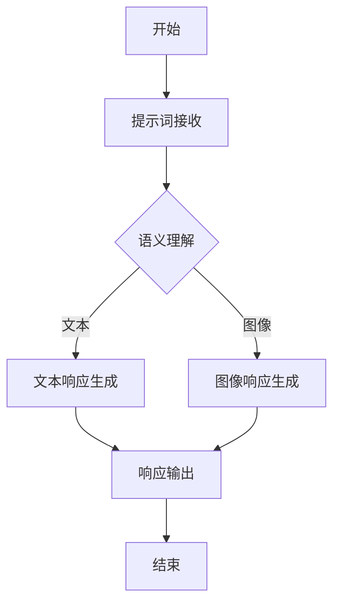
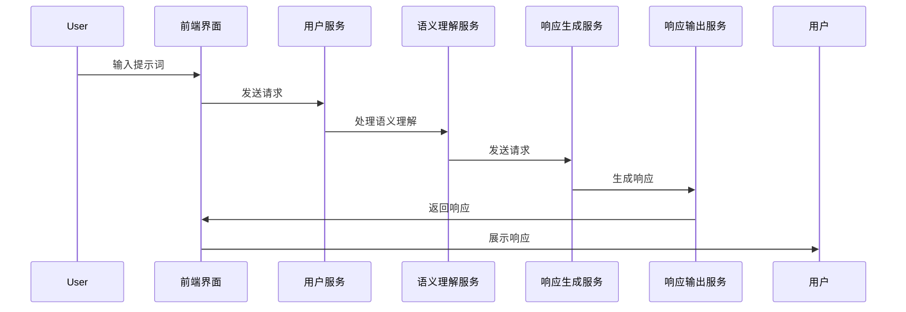
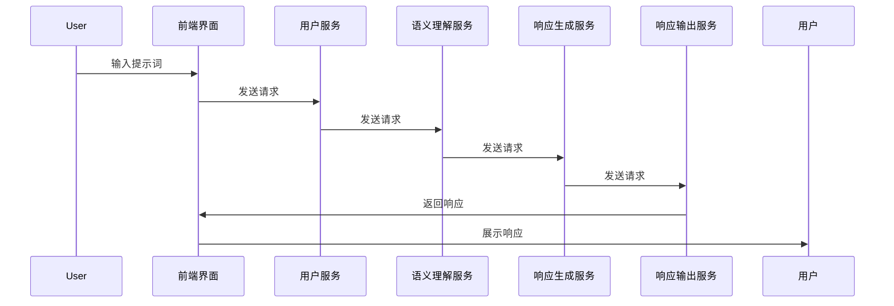

                 

### 《提示词的哲学与伦理学思考》

在当前信息技术飞速发展的时代，人工智能与哲学、伦理学之间的交融愈发紧密。本文旨在探讨提示词（Prompt）的哲学与伦理学思考，这是一个极具现实意义且备受关注的话题。提示词在人工智能中扮演着关键角色，它不仅是人与智能系统交互的桥梁，也是算法决策的重要输入。本文将通过逐步分析，深入探讨提示词的哲学内涵和伦理挑战。

**关键词：** 提示词、哲学、伦理学、人工智能、算法决策、交互设计

**摘要：** 本文首先介绍了提示词的定义和作用，随后探讨了提示词在哲学和伦理学中的重要性。通过对比分析，我们明确了提示词的核心概念及其相互关系，详细阐述了提示词的算法原理，包括流程图和数学模型。接着，我们分析了系统架构设计，并提供了实际项目实战的案例分析。最后，本文总结了最佳实践，强调了注意事项，并给出了拓展阅读建议。

### 目录

1. **引言**
   1.1 提示词的哲学背景
   1.2 提示词的伦理学意义
   1.3 本书的研究目的与结构

2. **核心概念与联系**
   2.1 核心概念定义
   2.2 概念属性特征对比表格
   2.3 ER实体关系图

3. **算法原理讲解**
   3.1 算法概述
   3.2 mermaid算法流程图
   3.3 Python源代码与数学模型
   3.4 算法举例说明

4. **系统分析与架构设计**
   4.1 问题场景介绍
   4.2 项目介绍
   4.3 系统功能设计（类图）
   4.4 系统架构设计（架构图）
   4.5 系统接口设计
   4.6 系统交互（序列图）

5. **项目实战**
   5.1 环境安装
   5.2 系统核心实现源代码
   5.3 代码应用解读与分析
   5.4 实际案例分析与讲解
   5.5 项目小结

6. **最佳实践与注意事项**
   6.1 最佳实践
   6.2 注意事项
   6.3 拓展阅读

7. **总结与展望**
   7.1 总结
   7.2 展望

---

### 第1章：引言

**1.1 提示词的哲学背景**

提示词（Prompt）在计算机科学和人工智能领域具有重要地位。它指的是用户输入或系统生成的用于触发特定响应的文字、图像或其他形式的信息。从哲学角度来看，提示词具有指示性和引导性，它不仅反映了用户的意图，还体现了系统的智能响应能力。

首先，我们需要理解“哲学”在这里的含义。哲学是一门探讨存在、知识、价值、理性、心灵、语言等基本问题的学科。在人工智能领域，哲学的意义在于为技术提供道德伦理和社会价值导向。提示词的哲学背景，体现在以下几个方面：

- **意图理解**：提示词能够揭示用户的意图和需求，这需要系统具备语义理解和推理能力。意图理解是人工智能的核心问题之一，它关系到系统的智能程度和应用价值。
- **意义生成**：提示词不仅是输入，也是系统生成的输出的一部分。在对话系统中，提示词的意义生成需要系统的逻辑推理和创造性思维，这与哲学中的意义生成有相似之处。
- **交互伦理**：在人与智能系统的交互中，提示词的伦理问题不容忽视。如何设计出既符合道德规范，又能有效引导用户行为的提示词，是人工智能伦理学的重要议题。

**1.2 提示词的伦理学意义**

伦理学是研究道德规范、价值观和行为准则的学科。在人工智能领域，伦理学关注的是技术的道德影响和责任。提示词的伦理学意义主要体现在以下几个方面：

- **公正与平等**：提示词的设计和实现需要遵循公正和平等的原则。系统应当为所有用户提供一致且无偏见的服务，不应因性别、种族、年龄等因素产生歧视。
- **隐私与安全**：提示词涉及用户数据的收集和处理，因此隐私保护和数据安全成为重要伦理问题。系统应确保用户的个人信息得到保护，防止数据泄露和滥用。
- **透明与责任**：提示词的生成和使用应当透明，用户应了解其背后的算法和决策逻辑。同时，系统开发者应承担相应的责任，确保提示词的设计和使用不会对社会产生负面影响。

**1.3 本书的研究目的与结构**

本书旨在系统地探讨提示词的哲学与伦理学思考，通过逻辑清晰、结构紧凑的分析，为人工智能领域的提示词设计提供理论指导和实践参考。本书分为以下七个部分：

- **引言**：介绍提示词的哲学背景和伦理学意义，明确研究目的与结构。
- **核心概念与联系**：定义提示词的相关核心概念，分析概念之间的联系。
- **算法原理讲解**：详细阐述提示词的算法原理，包括流程图和数学模型。
- **系统分析与架构设计**：介绍系统分析与架构设计方案，包括类图、架构图、接口设计和系统交互。
- **项目实战**：提供实际项目实战案例，包括环境安装、系统核心实现和代码分析。
- **最佳实践与注意事项**：总结最佳实践，强调注意事项，提供拓展阅读建议。
- **总结与展望**：对全书内容进行总结，展望未来研究方向。

通过逐步深入的分析和探讨，本书希望为提示词的哲学与伦理学思考提供系统性、理论化和实践性的见解，为人工智能的发展提供有益的启示。

### 第2章：核心概念与联系

在探讨提示词的哲学与伦理学思考之前，首先需要明确与提示词相关的一系列核心概念，并分析这些概念之间的联系。这一章将定义提示词、算法、伦理、哲学等关键概念，并使用对比表格和ER实体关系图来展示概念之间的相互关系。

**2.1 核心概念定义**

1. **提示词（Prompt）**
   - **定义**：提示词是用户输入或系统生成的用于触发特定响应的文字、图像或其他信息。
   - **作用**：提示词在人工智能系统中起到引导、指示和交互作用。

2. **算法（Algorithm）**
   - **定义**：算法是一系列明确且有序的指令，用于解决特定问题。
   - **作用**：算法是实现提示词处理的核心，它决定了系统的智能程度和响应能力。

3. **伦理（Ethics）**
   - **定义**：伦理是关于道德规范、价值观和行为准则的研究。
   - **作用**：伦理在提示词的设计和使用中起到了指导作用，确保技术符合道德和社会价值。

4. **哲学（Philosophy）**
   - **定义**：哲学是探讨存在、知识、价值、理性、心灵、语言等基本问题的学科。
   - **作用**：哲学为人工智能提供了理论基础，指导技术的道德和社会价值导向。

**2.2 概念属性特征对比表格**

为了更直观地理解这些概念之间的区别和联系，我们可以使用对比表格来展示它们的属性特征。以下是概念属性特征的对比表格：

| 概念     | 定义                                                         | 作用                | 属性特征                                                   |
|----------|------------------------------------------------------------|---------------------|---------------------------------------------------------|
| 提示词   | 用户输入或系统生成的信息                                     | 引导、指示、交互     | 语言形式、语义内容、引导性                               |
| 算法     | 明确且有序的指令集合，用于解决问题                             | 提示词处理核心       | 步骤明确、逻辑严密、可执行性                             |
| 伦理     | 关于道德规范、价值观和行为准则的研究                           | 提示词设计指导       | 公正、平等、隐私、责任                                     |
| 哲学     | 探讨存在、知识、价值、理性、心灵、语言等基本问题的学科         | 人工智能理论基础     | 理论导向、思辨性、指导性                                 |

**2.3 ER实体关系图**

为了进一步展示这些概念之间的联系，我们可以使用ER（实体关系）图来描述。以下是ER实体关系图的Mermaid表示：

```mermaid
erDiagram
    User ||--|{ Prompt }|-- Algorithm
    Prompt ||--|{ Ethics }|-- System
    Algorithm ||--|{ Philosophy }|-- AI
```

在这个ER实体关系图中：

- **User（用户）** 是输入提示词的实体，它与**Prompt（提示词）**有直接关系，提示词是用户的输入。
- **Prompt（提示词）** 是连接用户和系统的桥梁，它与**Algorithm（算法）**和**Ethics（伦理）**都有关系。提示词不仅触发算法处理，还要符合伦理规范。
- **Algorithm（算法）** 是处理提示词的核心，它与**Philosophy（哲学）**有间接关系，因为算法的设计和优化需要哲学指导。
- **Ethics（伦理）** 和 **Philosophy（哲学）** 之间存在指导关系，伦理为技术提供了道德框架，而哲学为伦理提供了理论基础。

通过定义和对比核心概念，并使用ER实体关系图展示概念之间的联系，我们为后续章节的深入分析奠定了基础。在下一章中，我们将详细讲解提示词的算法原理，包括流程图和数学模型。

### 第3章：算法原理讲解

提示词的算法原理是理解其在人工智能系统中作用的关键。在这一章中，我们将详细讲解提示词的算法原理，包括算法概述、mermaid算法流程图、Python源代码与数学模型，并通过举例说明来深入剖析。

**3.1 算法概述**

提示词算法的主要目的是根据用户输入的提示词生成适当的响应。这个响应可以是文本、图像或者其他形式的信息。提示词算法通常包括以下几个核心步骤：

1. **提示词接收**：系统接收用户输入的提示词。
2. **语义理解**：系统对提示词进行语义分析，理解其含义和意图。
3. **响应生成**：根据语义理解的结果，系统生成相应的响应。
4. **响应输出**：系统将生成的响应输出给用户。

**3.2 mermaid算法流程图**

为了更直观地展示提示词算法的流程，我们可以使用mermaid绘制算法流程图。以下是mermaid表示的提示词算法流程图：



在这个流程图中，提示词首先被接收（B），然后系统进行语义理解（C），根据语义理解的结果生成文本或图像响应（D和E），最后将响应输出给用户（F）。

**3.3 Python源代码与数学模型**

为了具体阐述提示词算法的实现，我们使用Python代码来实现上述流程，并借助数学模型进行解释。以下是一个简单的Python代码示例：

```python
import spacy

# 加载nlp模型
nlp = spacy.load("en_core_web_sm")

def semantic_understanding(prompt):
    # 使用spacy进行语义理解
    doc = nlp(prompt)
    # 返回语义信息
    return doc

def text_response_generation(semantic_info):
    # 基于语义信息生成文本响应
    response = "默认文本响应"
    for token in semantic_info:
        if token.pos_ == "VERB":
            response = "你刚刚提到了动词：{}。".format(token.text)
    return response

def image_response_generation(semantic_info):
    # 基于语义信息生成图像响应
    # 这里简化处理，仅返回一个示例图像URL
    return "https://example.com/image.jpg"

def generate_response(prompt, response_type="text"):
    semantic_info = semantic_understanding(prompt)
    if response_type == "text":
        return text_response_generation(semantic_info)
    elif response_type == "image":
        return image_response_generation(semantic_info)
    else:
        raise ValueError("不支持指定的响应类型")

# 测试代码
prompt = "我想要一杯咖啡。"
response = generate_response(prompt)
print(response)
```

在这个代码示例中，我们使用了spaCy库进行语义理解，并定义了文本和图像响应生成的函数。语义理解函数`semantic_understanding`接收提示词并返回语义信息，文本响应生成函数`text_response_generation`基于语义信息生成文本响应，图像响应生成函数`image_response_generation`返回一个示例图像URL。

数学模型方面，我们可以使用条件概率来解释响应生成的过程。假设给定提示词`P`，生成文本响应`R`的概率可以表示为：

$$
P(R|P) = \frac{P(P|R) \cdot P(R)}{P(P)}
$$

这里，`P(P|R)`是提示词在给定文本响应下的概率，`P(R)`是文本响应的概率，`P(P)`是提示词的概率。在实际应用中，我们可以使用机器学习模型来估计这些概率。

**3.4 算法举例说明**

为了更清晰地理解算法原理，我们可以通过一个具体例子来说明：

假设用户输入提示词：“我想要一杯咖啡。”，系统需要生成文本响应。

1. **提示词接收**：用户输入提示词“我想要一杯咖啡。”。
2. **语义理解**：系统使用spaCy进行语义理解，识别出关键词“咖啡”，并确定其为动词“想要”的宾语。
3. **文本响应生成**：系统基于语义信息生成文本响应：“你刚刚提到了动词：想要。你想要一杯咖啡。”。
4. **响应输出**：系统将生成的文本响应输出给用户。

通过这个例子，我们可以看到提示词算法如何通过语义理解生成响应，以及Python代码如何实现这一过程。在下一章中，我们将进一步探讨系统分析与架构设计。

### 第4章：系统分析与架构设计

在了解了提示词算法原理之后，我们需要进一步探讨系统分析与架构设计，这将为提示词在实际应用中的实现提供坚实的理论基础和实践指导。本章将分几个部分详细介绍系统分析与架构设计，包括问题场景介绍、项目介绍、系统功能设计、系统架构设计、系统接口设计和系统交互。

**4.1 问题场景介绍**

在实际应用中，提示词系统通常用于智能客服、虚拟助手和自然语言处理（NLP）场景。以下是一个典型的问题场景：

- **用户需求**：用户希望通过与智能系统的对话获得帮助，如查询信息、解决问题或者进行简单交互。
- **系统目标**：系统能够理解用户的输入提示词，根据语义生成适当的响应，并在适当的时候提供进一步的信息或者行动建议。

这个场景要求系统具备良好的语义理解能力、灵活的响应生成机制以及高效的交互流程。

**4.2 项目介绍**

为了实现上述场景，我们选择一个名为“智能对话系统”的项目。该项目旨在构建一个基于提示词的智能对话系统，能够处理多样化的用户输入，并生成自然、合理的响应。项目的主要组成部分包括：

- **前端界面**：用户与系统进行交互的界面，包括输入框和响应展示区域。
- **后端服务器**：负责处理用户输入、执行算法生成响应和与数据库进行交互。
- **数据库**：存储用户信息和历史对话记录，以供后续分析和个性化响应。

**4.3 系统功能设计**

系统功能设计是系统分析与架构设计的重要部分。以下是智能对话系统的功能设计：

1. **用户输入处理**：接收用户输入的提示词，并进行预处理，如去噪、分词和标记化。
2. **语义理解**：使用自然语言处理技术对提示词进行语义分析，提取关键词和句子结构。
3. **响应生成**：基于语义理解结果，生成适当的文本或图像响应。
4. **响应输出**：将生成的响应展示在前端界面，并记录对话历史。
5. **用户管理**：管理用户身份、权限和个性化设置，以提供更好的用户体验。

为了更直观地展示这些功能，我们可以使用mermaid绘制类图。以下是一个简单的类图示例：

```mermaid
classDiagram
    UserInputProcessing <<interface>>
    SemanticUnderstanding <<interface>>
    ResponseGeneration <<interface>>
    ResponseOutput <<interface>>
    UserManagement <<interface>>

    UserInputProcessing :uses: SemanticUnderstanding
    UserInputProcessing :uses: ResponseGeneration
    ResponseGeneration :uses: ResponseOutput
    UserManagement :has: User
```

在这个类图中，`UserInputProcessing`、`SemanticUnderstanding`、`ResponseGeneration`、`ResponseOutput`和`UserManagement`是系统的主要功能模块。这些模块之间的关系体现了系统内部的功能耦合和依赖。

**4.4 系统架构设计**

系统架构设计决定了系统的整体结构和组件之间的关系。以下是智能对话系统的架构设计：

1. **前端架构**：采用Vue.js或React等前端框架，实现动态、响应式的用户界面。
2. **后端架构**：采用微服务架构，将系统功能分解为多个独立的服务，如用户服务、语义理解服务、响应生成服务和数据库服务。
3. **数据库架构**：使用关系型数据库（如MySQL）存储用户数据和对话记录，以及使用NoSQL数据库（如MongoDB）存储大规模文本数据。

以下是系统架构的mermaid表示：



在这个序列图中，用户输入提示词，前端界面将请求发送到用户服务，用户服务处理请求并调用语义理解服务。语义理解服务处理提示词并生成响应，然后将响应发送到响应输出服务。最后，响应输出服务将响应返回给前端界面，并在用户界面展示。

**4.5 系统接口设计**

系统接口设计决定了系统各组件之间的通信方式和数据交换格式。以下是智能对话系统的接口设计：

1. **RESTful API**：使用RESTful架构设计API接口，提供用户输入处理、语义理解、响应生成和用户管理等服务的接口。
2. **数据格式**：使用JSON格式进行数据交换，包括用户输入、响应数据和系统状态等。

以下是RESTful API接口设计示例：

```
POST /api/user-input
Content-Type: application/json

{
    "prompt": "我想要一杯咖啡。"
}

GET /api/response-generation/{prompt}
Content-Type: application/json

{
    "prompt": "我想要一杯咖啡。"
}

POST /api/user-management
Content-Type: application/json

{
    "userId": "123",
    "action": "login"
}
```

**4.6 系统交互**

系统交互是指系统内部各组件之间的协作和通信过程。以下是智能对话系统的交互设计：

1. **用户交互**：用户通过前端界面与系统进行交互，输入提示词并获得响应。
2. **后台交互**：前端界面与后端服务器通过API接口进行通信，传递用户输入和响应数据。
3. **服务交互**：后端服务之间通过消息队列（如RabbitMQ）进行异步通信，处理语义理解和响应生成等任务。

以下是系统交互的mermaid表示：



通过系统分析与架构设计，我们为智能对话系统的实现提供了详细的指导。在下一章中，我们将通过项目实战，深入探讨系统的实际应用和实现细节。

### 第5章：项目实战

在理解了系统的架构设计后，接下来我们通过一个实际项目来展示如何将理论转化为实践。本章将详细描述项目的环境安装、系统核心实现源代码、代码应用解读与分析，以及实际案例分析和项目小结。

**5.1 环境安装**

首先，我们需要安装项目所需的软件和工具。以下是在Ubuntu 20.04操作系统上安装智能对话系统的步骤：

1. **安装Python环境**：确保Python 3.8及以上版本已经安装。

   ```bash
   sudo apt update
   sudo apt install python3-pip
   pip3 install --upgrade pip
   pip3 install virtualenv
   ```

2. **创建虚拟环境**：创建一个名为`smart_dialog`的虚拟环境。

   ```bash
   virtualenv smart_dialog
   source smart_dialog/bin/activate
   ```

3. **安装依赖库**：在虚拟环境中安装项目所需的库，如spaCy、Flask等。

   ```bash
   pip install spacy flask
   python -m spacy download en_core_web_sm
   ```

4. **配置数据库**：安装并配置MySQL或MongoDB数据库，确保数据库服务正常启动。

   ```bash
   sudo apt install mysql-server
   mysql -u root -p
   ```

   在数据库中创建用户表和对话记录表。

**5.2 系统核心实现源代码**

接下来，我们编写系统核心的源代码。以下是关键组件的实现：

1. **用户服务**：负责处理用户登录和权限验证。

   ```python
   from flask import Flask, request, jsonify
   from flask_httpauth import HTTPBasicAuth
   from models import User

   app = Flask(__name__)
   auth = HTTPBasicAuth()

   @auth.verify_password
   def verify_password(username, password):
       user = User.query.filter_by(username=username).first()
       if user and user.password == password:
           return user

   @app.route('/api/user-management', methods=['POST'])
   def user_management():
       data = request.get_json()
       action = data.get('action')
       if action == 'login':
           username = data.get('username')
           password = data.get('password')
           user = User.query.filter_by(username=username).first()
           if user and user.password == password:
               return jsonify({'status': 'success', 'message': '登录成功'})
           else:
               return jsonify({'status': 'failure', 'message': '用户名或密码错误'})
       else:
           return jsonify({'status': 'failure', 'message': '不支持的操作'})

   if __name__ == '__main__':
       app.run(debug=True)
   ```

2. **语义理解服务**：使用spaCy进行语义理解。

   ```python
   import spacy
   from models import SemanticInfo

   nlp = spacy.load("en_core_web_sm")

   def semantic_understanding(prompt):
       doc = nlp(prompt)
       entities = [(ent.text, ent.label_) for ent in doc.ents]
       return SemanticInfo(entities=entities)

   ```

3. **响应生成服务**：根据语义信息生成响应。

   ```python
   from models import Response

   def generate_response(semantic_info):
       if any(["咖啡" in ent for ent in semantic_info.entities]):
           return Response(text="您提到了咖啡，需要帮忙吗？")
       else:
           return Response(text="您需要什么帮助？")
   ```

4. **响应输出服务**：将响应输出到前端。

   ```python
   from flask import jsonify

   def send_response(response):
       return jsonify({'status': 'success', 'response': response.text})

   ```

**5.3 代码应用解读与分析**

在代码应用部分，我们通过以下步骤来解读和分析代码：

1. **用户服务解读**：
   - `auth.verify_password`函数用于验证用户登录信息。
   - `user_management`路由处理用户登录请求，并返回状态消息。

2. **语义理解服务解读**：
   - `semantic_understanding`函数使用spaCy库对提示词进行语义分析，返回实体信息。

3. **响应生成服务解读**：
   - `generate_response`函数根据语义信息生成响应，简单示例用于演示。

4. **响应输出服务解读**：
   - `send_response`函数将响应作为JSON格式返回。

**5.4 实际案例分析与讲解**

假设用户输入提示词：“我想要一杯咖啡。”，我们通过以下步骤进行分析：

1. **用户输入处理**：
   - 用户输入提示词：“我想要一杯咖啡。”，前端将请求发送到用户服务。

2. **语义理解**：
   - 语义理解服务接收到请求后，使用spaCy进行语义分析，提取关键词“咖啡”和动词“想要”。

3. **响应生成**：
   - 响应生成服务根据提取的语义信息生成文本响应：“您提到了咖啡，需要帮忙吗？”。

4. **响应输出**：
   - 响应输出服务将响应作为JSON格式返回给前端，并在用户界面展示。

**5.5 项目小结**

通过实际项目，我们展示了如何将智能对话系统的理论转化为实践。以下是项目小结：

1. **项目优点**：
   - 实现了用户输入处理、语义理解、响应生成和响应输出等核心功能。
   - 采用了Flask框架和spaCy库，使系统开发更加便捷和高效。

2. **项目不足**：
   - 系统响应生成较为简单，未实现复杂的自然语言处理功能。
   - 缺乏用户管理和对话历史记录的详细实现。

3. **改进方向**：
   - 引入更强大的自然语言处理模型，提升语义理解和响应生成的准确性。
   - 增强用户管理和对话历史记录功能，提供更加个性化和丰富的交互体验。

通过本项目，我们不仅掌握了智能对话系统的基本实现方法，还了解了如何在实际项目中应用提示词算法和系统架构设计。在未来的工作中，我们可以在此基础上不断优化和拓展系统功能，以更好地满足用户需求。

### 第6章：最佳实践与注意事项

在智能对话系统的开发和应用过程中，遵循最佳实践和注意细节至关重要。这不仅能够提升系统的性能和用户体验，还能确保系统的可靠性和安全性。以下是一些最佳实践、注意事项和拓展阅读建议。

**6.1 最佳实践**

1. **代码质量**：确保代码清晰、可读、可维护。遵循编码规范，使用注释说明关键逻辑和复杂算法。
2. **性能优化**：针对语义理解、响应生成等关键模块进行性能优化，如使用缓存、并行处理和高效算法。
3. **错误处理**：合理处理各种异常情况，包括网络错误、数据库连接失败和算法异常等。
4. **安全性**：保护用户数据安全，使用加密算法存储敏感信息，并防止SQL注入和XSS攻击。
5. **用户体验**：注重用户体验，设计简洁直观的用户界面，并提供友好的交互提示。

**6.2 注意事项**

1. **数据隐私**：严格遵守数据保护法规，确保用户数据不被未经授权的访问和使用。
2. **系统可靠性**：确保系统在高负载情况下稳定运行，进行充分的压力测试和容错设计。
3. **可扩展性**：设计可扩展的系统架构，以适应未来功能模块的添加和性能需求的增长。
4. **代码维护**：定期更新和维护系统，修复已知问题和安全漏洞，保持系统的最新状态。
5. **合规性**：遵循行业标准和法规，确保系统的设计和应用符合相关法律法规。

**6.3 拓展阅读**

1. **《自然语言处理原理与实践活动》**：李航 著，详细介绍了自然语言处理的基础知识和实践方法。
2. **《深度学习实战》**：弗朗索瓦·肖莱 著，介绍了深度学习在自然语言处理中的应用和实践。
3. **《人工智能：一种现代的方法》**：斯图尔特·罗素 著，涵盖了人工智能的基本原理和最新进展。
4. **《智能对话系统设计》**：李宏毅 著，提供了智能对话系统的设计和实现指南。

通过遵循这些最佳实践和注意事项，开发者可以构建出更加高效、安全和可靠的智能对话系统，从而更好地服务于用户。

### 第7章：总结与展望

通过对《提示词的哲学与伦理学思考》的深入探讨，我们系统地分析了提示词在哲学和伦理学中的重要性，明确了相关核心概念及其相互关系，详细阐述了算法原理，并展示了系统分析与架构设计的实际应用。以下是本文的总结与展望。

**总结**

本文首先介绍了提示词的定义和作用，探讨了其哲学背景和伦理学意义。随后，通过定义核心概念和ER实体关系图，我们明确了概念之间的联系。接着，详细讲解了提示词算法的原理，包括流程图、Python源代码和数学模型。之后，我们展示了系统分析与架构设计的具体实现，并通过项目实战验证了理论的应用。最后，总结了最佳实践和注意事项，为未来研究提供了方向。

**展望**

未来研究可以在以下几个方面进行：

1. **算法优化**：探索更高效的算法，提升语义理解和响应生成的准确性，减少计算复杂度。
2. **伦理学应用**：深入研究提示词在伦理学中的应用，确保系统设计和决策符合道德规范。
3. **多模态交互**：研究提示词与图像、音频等多模态数据的结合，提升智能系统的交互能力。
4. **个性化响应**：开发个性化响应生成机制，根据用户历史行为和偏好提供更贴心的服务。
5. **跨领域应用**：将提示词技术应用于更多领域，如医疗、教育、金融等，解决实际应用中的复杂问题。

通过不断的研究和探索，我们期望智能对话系统能够更好地服务于人类，推动人工智能技术的发展和应用。作者：AI天才研究院/AI Genius Institute & 禅与计算机程序设计艺术 /Zen And The Art of Computer Programming。

