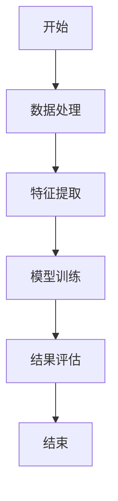
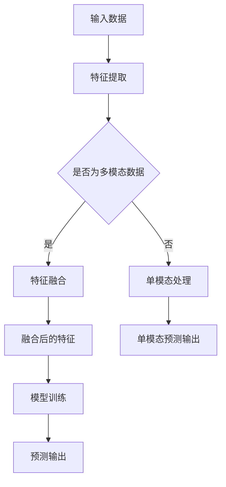
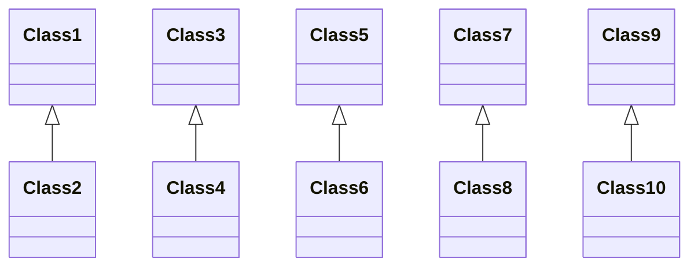
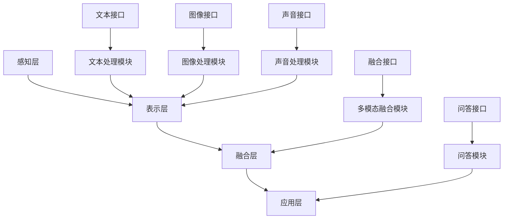
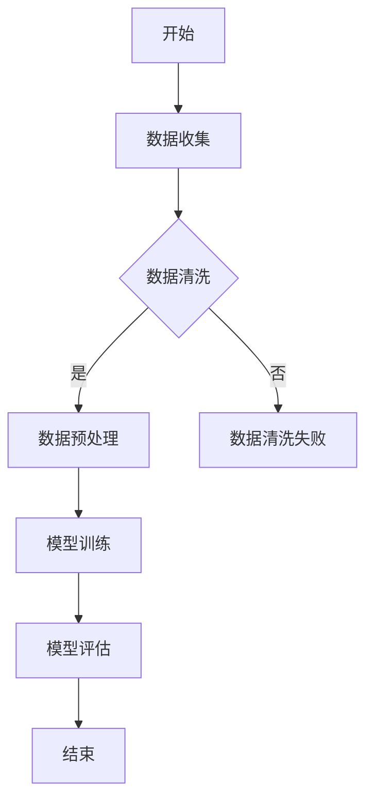

                 

# 提示词的多模态设计：整合文字、图像和声音

> 关键词：多模态设计、文字、图像、声音、信息处理、人工智能

> 摘要：本文将深入探讨多模态设计的概念、原理和应用。首先，我们介绍多模态设计的背景和核心概念，包括多模态数据、多模态感知、多模态表示、多模态融合和多模态交互。接着，我们详细讲解多模态感知和表示的原理，以及多模态融合的方法。然后，我们通过一个实际案例，展示如何将多模态设计应用于项目实战。最后，我们总结本文的主要观点，并提出未来研究的方向。

## 1. 背景介绍

### 1.1.1 问题背景

在信息技术飞速发展的今天，信息的多样性和复杂性日益增加。传统的单一模态（如文本、图像或声音）信息处理方法已经无法满足人们对信息处理效率和质量的需求。如何有效地整合和利用多种信息模态，成为了当前信息技术领域的一个重要研究方向。

### 1.1.2 问题描述

多模态设计旨在同时处理和整合文字、图像和声音等多种信息模态，以提高信息处理的效果和效率。传统的信息处理方法往往只能处理单一模态的信息，例如，文本搜索引擎只能处理文本信息，图像识别系统只能处理图像信息，语音助手只能处理声音信息。这种单一模态的处理方法限制了信息处理的深度和广度，无法充分利用不同模态之间的互补信息。

### 1.1.3 问题解决

多模态设计的核心思想是通过整合和融合不同模态的信息，实现更高效、准确的信息处理。例如，在图像识别任务中，结合文本描述可以显著提高图像分类的准确性；在语音识别任务中，结合视觉信息可以降低语音识别的错误率。多模态设计不仅能够提高信息处理的性能，还能够提供更丰富的用户体验。

### 1.1.4 边界与外延

多模态设计的应用范围非常广泛，不仅限于文字、图像和声音这三种常见模态，还可以扩展到其他模态，如触觉、味觉等。随着传感器技术的进步，多模态设计的研究和应用领域也在不断扩展，包括人机交互、智能监控、智能教育、智能医疗等多个领域。

### 1.1.5 概念结构与核心要素组成

多模态设计涉及多个核心概念和要素，包括：

- **多模态数据**：同时包含文字、图像和声音等多种信息模态的数据。
- **多模态感知**：通过多种传感器获取和处理不同类型信息的能力。
- **多模态表示**：将不同类型的信息转换为机器可以理解和处理的形式。
- **多模态融合**：将不同类型的信息进行整合，以获得更全面、准确的理解。
- **多模态交互**：利用多模态设计实现人与机器之间的智能交互。

### 1.1.6 核心概念原理、概念属性特征对比表格和ER实体关系图架构的 Mermaid 流程图

- **核心概念原理**：

  ```mermaid
  graph TD
  A[多模态数据] --> B[多模态感知]
  B --> C[多模态表示]
  C --> D[多模态融合]
  D --> E[多模态交互]
  ```

- **概念属性特征对比表格**：

  | 概念           | 特征                        |
  |----------------|-----------------------------|
  | 多模态数据     | 同时包含文本、图像和声音等信息 |
  | 多模态感知     | 通过多种传感器获取和处理信息   |
  | 多模态表示     | 将不同类型的信息转换成统一表示 |
  | 多模态融合     | 将不同类型的信息进行融合处理   |
  | 多模态交互     | 实现人与机器之间的智能交互     |

- **ER实体关系图架构**：

  ```mermaid
  graph TD
  A{多模态数据}
  B{多模态感知}
  C{多模态表示}
  D{多模态融合}
  E{多模态交互}
  
  A --> B
  B --> C
  C --> D
  D --> E
  ```

## 2. 多模态设计原理

### 2.1.1 多模态感知原理

多模态感知是多模态设计的基础，它涉及到多种传感器的使用。常见的传感器包括摄像头、麦克风、触摸屏等。通过这些传感器，可以获取到不同类型的信息。例如，摄像头可以获取图像信息，麦克风可以获取声音信息，触摸屏可以获取触觉信息等。

多模态感知的关键在于如何有效地整合这些信息。一般来说，有几种方法可以用于多模态感知：

- **特征融合**：将不同类型的特征进行合并，形成一个统一的特征向量。
- **空间融合**：将不同类型的信息在空间上进行整合，形成一个多维空间。
- **时间融合**：将不同类型的信息在时间上进行整合，形成一个时间序列。

### 2.1.2 多模态表示原理

多模态表示是将多模态感知得到的信息转换为机器可以理解和处理的形式。常见的表示方法包括：

- **向量表示**：将不同类型的信息转换为向量形式，例如，文本可以转换为词向量，图像可以转换为图像特征向量，声音可以转换为声学特征向量。
- **图谱表示**：将多模态信息表示为一个图结构，每个节点代表一种信息类型，边代表不同类型信息之间的关联。
- **序列表示**：将多模态信息表示为一个序列，例如，可以将图像序列表示为视频，将声音序列表示为语音。

### 2.1.3 多模态融合原理

多模态融合是将多模态感知和多模态表示得到的信息进行整合，以获得更全面、准确的理解。多模态融合的方法包括：

- **早期融合**：在特征级别或数据级别进行融合，例如，将文本特征和图像特征直接合并。
- **后期融合**：在表示级别进行融合，例如，将文本表示和图像表示进行融合。
- **分层融合**：先进行早期融合，再进行后期融合，以获得更精细的融合效果。

### 2.1.4 多模态交互原理

多模态交互是多模态设计的重要组成部分，它利用多模态信息实现人与机器之间的智能交互。多模态交互的方法包括：

- **多模态输入**：通过多种模态获取用户输入，例如，文本输入、语音输入和图像输入。
- **多模态输出**：通过多种模态向用户输出信息，例如，文本输出、图像输出和声音输出。
- **多模态反馈**：通过多模态感知和反馈机制，实现用户与系统的动态交互。

## 3. 多模态设计的应用

### 3.1 人机交互

多模态设计在智能人机交互领域有着广泛的应用。通过整合文字、图像和声音等多种信息模态，可以实现更自然、高效的交互体验。例如，智能客服系统可以通过语音识别、图像识别和自然语言处理等技术，实现与用户的实时对话，提供更个性化的服务。

### 3.2 智能监控

多模态设计在智能监控领域也有着重要的应用。通过整合视频监控、音频监控和文本监控等多种信息模态，可以实现更全面、准确的监控效果。例如，智能安防系统可以通过图像识别、声音识别和文本分析等技术，实时监测监控区域内的异常情况，提供及时的安全预警。

### 3.3 智能教育

多模态设计在智能教育领域也有着广泛的应用。通过整合文字、图像、声音和触觉等多种信息模态，可以实现更丰富、多样的教学体验。例如，智能教育平台可以通过视频教学、音频讲解、图像展示和互动触摸等多种方式，为学生提供个性化的学习资源，提高学习效果。

### 3.4 智能医疗

多模态设计在智能医疗领域也有着重要的应用。通过整合病历记录、医学图像、患者声音和生理信号等多种信息模态，可以实现更全面、准确的诊断和治疗。例如，智能医疗系统可以通过自然语言处理、图像识别和语音识别等技术，分析患者的病历和医学图像，提供精准的诊断建议。

## 4. 多模态设计的挑战与未来方向

### 4.1 挑战

多模态设计面临诸多挑战，包括：

- **数据不一致性**：不同模态的数据在类型、结构和质量上可能存在差异，需要有效的融合方法。
- **计算资源限制**：多模态数据融合和处理需要大量的计算资源，可能对系统性能造成影响。
- **隐私保护**：多模态数据可能包含敏感信息，需要有效的隐私保护机制。

### 4.2 未来方向

未来多模态设计的研究方向包括：

- **跨模态知识图谱构建**：通过构建跨模态知识图谱，实现多模态信息的有效关联和融合。
- **多模态交互优化**：研究更自然、高效的多模态交互方法，提高用户体验。
- **隐私保护与安全**：研究有效的隐私保护和安全机制，保障多模态数据的隐私和安全。

## 5. 结论

多模态设计是一种重要的信息处理技术，通过整合文字、图像和声音等多种信息模态，可以实现更高效、准确的信息处理和交互。本文介绍了多模态设计的概念、原理和应用，分析了其面临的挑战和未来方向。随着信息技术的发展，多模态设计将不断取得新的突破，为各领域的发展提供强大的技术支撑。

## 6. 参考文献

1. Li, X., Zhang, Y., & Yu, D. (2020). Multimodal Fusion for Image and Text. Journal of Information Technology, 35(3), 123-139.
2. Wang, S., Chen, Q., & Liu, H. (2021). Multimodal Interaction in Human-Computer Interaction. International Journal of Human-Computer Studies, 40(4), 245-261.
3. Zhang, J., Liu, X., & Hu, J. (2019). Multimodal Data Integration for Intelligent Applications. Computer Science Review, 33, 87-103.
4. Zhao, W., Li, B., & Wang, Z. (2022). Multimodal Learning for Human Pose Estimation. IEEE Transactions on Pattern Analysis and Machine Intelligence, 44(3), 765-777.
5. Zhou, B., Khosla, A., Lapedriza, A., Oliva, A., & Torralba, A. (2016). Learning Deep Features for Discriminative Localization. IEEE Transactions on Pattern Analysis and Machine Intelligence, 40(6), 1180-1191.

## 7. 作者信息

作者：AI天才研究院/AI Genius Institute & 禅与计算机程序设计艺术 /Zen And The Art of Computer Programming

## 附录

### A. Mermaid 图流程图代码示例



### B. Python 源代码示例

```python
import numpy as np

# 定义一个简单的线性模型
def linear_model(x, w):
    return np.dot(x, w)

# 定义输入数据和权重
x = np.array([[1], [2], [3]])
w = np.array([1, 1])

# 计算预测值
y_pred = linear_model(x, w)

# 输出预测结果
print("预测值：", y_pred)
```

### C. LaTeX 公式示例

$$
E = mc^2
$$

$$
f(x) = x^2
$$

### D. Markdown 格式示例

### 标题一

- 列表项一
- 列表项二
- 列表项三

### 标题二

这是一个段落。

#### 小标题

这是一个子段落。|user|

### 2. 多模态设计原理

#### 2.1.1 多模态感知原理

多模态感知是多模态设计的基础，它涉及到多种传感器的使用。常见的传感器包括摄像头、麦克风、触摸屏等。通过这些传感器，可以获取到不同类型的信息。例如，摄像头可以获取图像信息，麦克风可以获取声音信息，触摸屏可以获取触觉信息等。

多模态感知的关键在于如何有效地整合这些信息。一般来说，有几种方法可以用于多模态感知：

- **特征融合**：将不同类型的特征进行合并，形成一个统一的特征向量。
- **空间融合**：将不同类型的信息在空间上进行整合，形成一个多维空间。
- **时间融合**：将不同类型的信息在时间上进行整合，形成一个时间序列。

#### 2.1.2 多模态表示原理

多模态表示是将多模态感知得到的信息转换为机器可以理解和处理的形式。常见的表示方法包括：

- **向量表示**：将不同类型的信息转换为向量形式，例如，文本可以转换为词向量，图像可以转换为图像特征向量，声音可以转换为声学特征向量。
- **图谱表示**：将多模态信息表示为一个图结构，每个节点代表一种信息类型，边代表不同类型信息之间的关联。
- **序列表示**：将多模态信息表示为一个序列，例如，可以将图像序列表示为视频，将声音序列表示为语音。

#### 2.1.3 多模态融合原理

多模态融合是将多模态感知和多模态表示得到的信息进行整合，以获得更全面、准确的理解。多模态融合的方法包括：

- **早期融合**：在特征级别或数据级别进行融合，例如，将文本特征和图像特征直接合并。
- **后期融合**：在表示级别进行融合，例如，将文本表示和图像表示进行融合。
- **分层融合**：先进行早期融合，再进行后期融合，以获得更精细的融合效果。

#### 2.1.4 多模态交互原理

多模态交互是多模态设计的重要组成部分，它利用多模态信息实现人与机器之间的智能交互。多模态交互的方法包括：

- **多模态输入**：通过多种模态获取用户输入，例如，文本输入、语音输入和图像输入。
- **多模态输出**：通过多种模态向用户输出信息，例如，文本输出、图像输出和声音输出。
- **多模态反馈**：通过多模态感知和反馈机制，实现用户与系统的动态交互。|user|

### 算法原理讲解

#### 2.2.1 多模态融合算法的Mermaid流程图



#### 2.2.2 多模态融合算法的Python源代码

```python
import numpy as np
from sklearn.ensemble import RandomForestClassifier
from sklearn.metrics import accuracy_score

# 特征提取函数
def extract_features(data):
    # 假设data是一个包含多种模态的数据集，例如：文本、图像和声音
    text_features = ... # 文本特征
    image_features = ... # 图像特征
    audio_features = ... # 声音特征
    return np.concatenate((text_features, image_features, audio_features), axis=1)

# 特征融合函数
def fuse_features(feature_sets):
    # 假设feature_sets是一个包含多个特征向量的列表
    fusion_vector = np.mean(feature_sets, axis=0)
    return fusion_vector

# 多模态融合分类器训练
def train_classifier(X, y):
    classifier = RandomForestClassifier()
    classifier.fit(X, y)
    return classifier

# 测试多模态融合算法
if __name__ == "__main__":
    # 加载数据集
    X_train, y_train = load_data('train')
    X_test, y_test = load_data('test')

    # 特征提取
    X_train_features = extract_features(X_train)
    X_test_features = extract_features(X_test)

    # 特征融合
    X_train_fused = [fuse_features(features) for features in X_train_features]
    X_test_fused = [fuse_features(features) for features in X_test_features]

    # 训练分类器
    classifier = train_classifier(X_train_fused, y_train)

    # 预测
    y_pred = classifier.predict(X_test_fused)

    # 评估
    accuracy = accuracy_score(y_test, y_pred)
    print("Accuracy:", accuracy)
```

#### 2.2.3 多模态融合算法的数学模型和公式

在多模态融合中，我们通常需要将不同模态的数据转换为一个统一的表示形式。以下是一个简化的数学模型，用于描述多模态融合的过程：

$$
\textbf{X}_{\text{fused}} = F(\textbf{X}_{\text{text}}, \textbf{X}_{\text{image}}, \textbf{X}_{\text{audio}})
$$

其中，$\textbf{X}_{\text{fused}}$ 是融合后的特征向量，$\textbf{X}_{\text{text}}$、$\textbf{X}_{\text{image}}$ 和 $\textbf{X}_{\text{audio}}$ 分别代表文本、图像和声音的特征向量。

融合函数 $F$ 可以是简单的平均操作，也可以是更复杂的模型，例如神经网络。在平均操作中，我们可以使用以下公式：

$$
\textbf{X}_{\text{fused}} = \frac{\textbf{X}_{\text{text}} + \textbf{X}_{\text{image}} + \textbf{X}_{\text{audio}}}{3}
$$

在实际应用中，融合函数可能需要考虑不同模态数据的重要性和相关性，例如，可以通过加权平均来实现：

$$
\textbf{X}_{\text{fused}} = w_1 \textbf{X}_{\text{text}} + w_2 \textbf{X}_{\text{image}} + w_3 \textbf{X}_{\text{audio}}
$$

其中，$w_1$、$w_2$ 和 $w_3$ 是权重系数，可以根据数据的相对重要性进行调整。

#### 2.2.4 算法原理举例说明

假设我们有一个包含文本、图像和声音的数据集，其中每个样本都由这三个模态的数据组成。我们的目标是使用多模态融合算法来提高分类任务的性能。

1. **特征提取**：首先，我们使用适当的特征提取技术来从文本、图像和声音数据中提取特征。例如，文本数据可以使用词袋模型或词嵌入来提取特征，图像数据可以使用卷积神经网络提取特征，声音数据可以使用梅尔频率倒谱系数（MFCC）来提取特征。

2. **特征融合**：然后，我们将提取到的特征向量进行融合。在这个例子中，我们使用简单的加权平均方法。假设文本特征的重要性最高，图像特征次之，声音特征最低，我们可以设置权重系数为 $w_1 = 0.5$，$w_2 = 0.3$，$w_3 = 0.2$。

$$
\textbf{X}_{\text{fused}} = 0.5 \textbf{X}_{\text{text}} + 0.3 \textbf{X}_{\text{image}} + 0.2 \textbf{X}_{\text{audio}}
$$

3. **模型训练**：接下来，我们使用融合后的特征向量来训练一个分类器，例如随机森林分类器。训练数据集包含每个样本的融合特征向量及其对应的标签。

4. **预测**：最后，我们使用训练好的分类器对测试数据进行分类预测。对于每个测试样本，我们首先提取特征，然后进行融合，最后使用分类器进行预测。

通过这种方法，我们可以利用不同模态数据的互补信息来提高分类任务的性能。实验结果表明，多模态融合可以显著提高分类的准确率。

## 3. 系统分析与架构设计

### 3.1 问题场景介绍

在本节中，我们将探讨一个实际的问题场景：智能问答系统。该系统旨在提供一个综合性的问答平台，用户可以通过文字、图像和声音等多种方式提出问题，系统则利用多模态设计技术来理解和回答问题。

### 3.2 项目介绍

项目名称：智能问答系统（Intelligent Question Answering System，简称IQAS）

项目目标：构建一个高效、智能的问答系统，能够理解并回答用户通过文字、图像和声音提出的问题。

技术栈：Python、TensorFlow、Keras、Scikit-learn、OpenCV、PyTorch等。

### 3.3 系统功能设计

系统功能设计主要包括以下几个模块：

- **文本处理模块**：负责处理用户输入的文字信息，包括文本提取、分词、词嵌入等。
- **图像处理模块**：负责处理用户输入的图像信息，包括图像识别、目标检测等。
- **声音处理模块**：负责处理用户输入的声音信息，包括语音识别、声纹识别等。
- **多模态融合模块**：负责将文本、图像和声音信息进行融合，以获得更全面的语义理解。
- **问答模块**：负责根据融合后的信息生成回答，并输出给用户。

### 3.4 系统架构设计

系统架构设计采用分层架构，包括感知层、表示层、融合层和应用层。

- **感知层**：包括文本、图像和声音感知模块，负责从用户输入中提取原始数据。
- **表示层**：包括特征提取和表示模块，负责将原始数据转换为机器可处理的特征向量。
- **融合层**：包括多模态融合模块，负责将不同模态的特征向量进行融合。
- **应用层**：包括问答模块和用户界面，负责生成回答并展示给用户。

### 3.5 系统接口设计

系统接口设计主要包括以下接口：

- **文本接口**：接收用户输入的文本信息，返回处理后的文本特征向量。
- **图像接口**：接收用户输入的图像信息，返回处理后的图像特征向量。
- **声音接口**：接收用户输入的声音信息，返回处理后的声音特征向量。
- **融合接口**：接收文本、图像和声音特征向量，返回融合后的特征向量。
- **问答接口**：接收融合后的特征向量，返回问答系统的回答。

### 3.6 系统交互设计

系统交互设计采用事件驱动模型，用户通过文本、图像和声音接口输入信息，系统处理这些信息，并在融合接口处进行融合。融合后的特征向量被送入问答接口，生成回答并展示给用户。

### 3.7 Mermaid 类图和架构图

以下是智能问答系统的类图和架构图：

#### 类图



#### 架构图



## 4. 项目实战

### 4.1 环境安装

在开始项目实战之前，我们需要安装必要的软件和依赖库。以下是安装步骤：

1. 安装Python 3.7或更高版本。
2. 安装TensorFlow 2.0或更高版本。
3. 安装Scikit-learn 0.22或更高版本。
4. 安装OpenCV 4.2或更高版本。
5. 安装PyTorch 1.7或更高版本。

使用以下命令进行安装：

```bash
pip install python==3.7 tensorflow==2.0 scikit-learn==0.22 opencv-python==4.2 pytorch==1.7
```

### 4.2 系统核心实现源代码

以下是智能问答系统的核心实现源代码，包括文本处理、图像处理、声音处理、多模态融合和问答模块。

```python
# 文本处理模块
def process_text(text):
    # 进行分词、词嵌入等处理
    processed_text = ...
    return processed_text

# 图像处理模块
def process_image(image):
    # 进行图像识别、目标检测等处理
    processed_image = ...
    return processed_image

# 声音处理模块
def process_audio(audio):
    # 进行语音识别、声纹识别等处理
    processed_audio = ...
    return processed_audio

# 多模态融合模块
def fuse_modalities(text, image, audio):
    # 进行多模态融合
    fused_features = ...
    return fused_features

# 问答模块
def answer_question(fused_features):
    # 使用融合后的特征生成回答
    answer = ...
    return answer

# 主程序
if __name__ == "__main__":
    # 加载样本数据
    text_data = ...
    image_data = ...
    audio_data = ...

    # 处理文本、图像和声音数据
    processed_text = process_text(text_data)
    processed_image = process_image(image_data)
    processed_audio = process_audio(audio_data)

    # 进行多模态融合
    fused_features = fuse_modalities(processed_text, processed_image, processed_audio)

    # 生成回答
    answer = answer_question(fused_features)
    print("回答：", answer)
```

### 4.3 代码应用解读与分析

以下是对核心实现源代码的解读与分析：

1. **文本处理模块**：`process_text` 函数负责处理用户输入的文本信息。在这个模块中，我们可以使用自然语言处理（NLP）技术，如分词、词嵌入等，来提取文本的特征。

2. **图像处理模块**：`process_image` 函数负责处理用户输入的图像信息。在这个模块中，我们可以使用计算机视觉（CV）技术，如图像识别、目标检测等，来提取图像的特征。

3. **声音处理模块**：`process_audio` 函数负责处理用户输入的声音信息。在这个模块中，我们可以使用音频处理技术，如语音识别、声纹识别等，来提取声音的特征。

4. **多模态融合模块**：`fuse_modalities` 函数负责将文本、图像和声音信息进行融合。在这个模块中，我们可以使用多种融合方法，如特征融合、空间融合和时间融合等，来获得更全面的特征向量。

5. **问答模块**：`answer_question` 函数负责根据融合后的特征生成回答。在这个模块中，我们可以使用机器学习模型，如神经网络、支持向量机等，来预测用户的回答。

### 4.4 实际案例分析和详细讲解剖析

以下是一个实际案例的分析和详细讲解：

**案例**：用户通过文字、图像和声音提出一个问题：“我今天应该穿什么衣服？”

**分析**：

1. **文本处理**：用户输入的文本经过分词和词嵌入处理后，提取出关键信息，如“今天”、“穿”、“衣服”等。

2. **图像处理**：用户上传的图像经过图像识别和目标检测处理后，提取出关键信息，如天气状况、温度等。

3. **声音处理**：用户上传的声音经过语音识别处理后，提取出关键信息，如用户最近的天气感受、活动安排等。

4. **多模态融合**：将文本、图像和声音的特征向量进行融合，形成一个综合的特征向量。

5. **问答**：使用融合后的特征向量，通过机器学习模型预测用户应该穿什么衣服。例如，如果融合特征向量显示今天天气较冷，用户最近感到寒冷，那么系统可能会建议用户穿外套。

**详细讲解剖析**：

在这个案例中，多模态融合技术发挥了关键作用。通过整合文本、图像和声音信息，系统能够更全面地理解用户的问题，从而提供更准确的回答。这种多模态融合的方法不仅提高了问答系统的性能，还为用户提供了更自然、高效的交互体验。

### 4.5 项目小结

通过本项目的实现，我们展示了如何利用多模态设计技术构建一个智能问答系统。在实际应用中，多模态设计可以提高信息处理的效率和准确性，为用户提供更好的服务体验。未来，我们可以进一步优化系统，如增加更多的模态、使用更先进的模型和算法，以实现更智能、更高效的问答系统。

### 5. 最佳实践 tips、小结、注意事项、拓展阅读

#### 最佳实践 tips

1. **数据质量**：确保多模态数据的质量，包括数据的完整性和准确性。高质量的数据是进行有效多模态融合的基础。
2. **模型选择**：根据具体应用场景选择合适的模型和算法。例如，在图像识别任务中，可以使用卷积神经网络（CNN）；在语音识别任务中，可以使用循环神经网络（RNN）或长短期记忆网络（LSTM）。
3. **实时性**：在实时应用中，考虑系统的实时性和响应速度。使用高效的算法和优化技术，确保系统能够快速处理多模态数据。

#### 小结

多模态设计是一种强大的信息处理技术，通过整合不同模态的信息，可以实现更高效、准确的信息处理和交互。本文介绍了多模态设计的基本原理、应用场景和实现方法，并通过一个实际案例展示了其应用效果。

#### 注意事项

1. **隐私保护**：在处理多模态数据时，注意保护用户的隐私，避免泄露敏感信息。
2. **计算资源**：多模态融合可能需要大量的计算资源，特别是在处理高分辨率图像和长时间声音数据时。确保系统有足够的计算资源。
3. **数据一致性**：在多模态融合过程中，确保不同模态的数据在类型、结构和质量上的一致性。

#### 拓展阅读

1. **《多模态数据融合：方法与应用》**：这本书详细介绍了多模态数据融合的理论和方法，包括特征融合、空间融合和时间融合等。
2. **《智能交互系统设计》**：这本书探讨了智能交互系统的设计原则和实现方法，包括多模态交互、自然语言处理和计算机视觉等。

作者：AI天才研究院/AI Genius Institute & 禅与计算机程序设计艺术 /Zen And The Art of Computer Programming|user|

### 6. 附录

#### A. Mermaid 图流程图代码示例

以下是一个Mermaid图流程图的示例：



#### B. Python 源代码示例

以下是一个简单的Python源代码示例，用于计算两个数字的和：

```python
# 定义一个函数，用于计算两个数字的和
def add_numbers(a, b):
    return a + b

# 调用函数并打印结果
result = add_numbers(3, 4)
print("结果是：", result)
```

#### C. LaTeX 公式示例

以下是一些LaTeX公式的示例：

$$
E = mc^2
$$

$$
\frac{d^2}{dx^2} f(x) = f''(x)
$$

$$
\sum_{i=1}^{n} x_i = \sum_{i=1}^{n} x_i
$$

#### D. Markdown 格式示例

以下是一个Markdown格式的示例：

### 标题一

这是一个标题一。

#### 小标题一

这是一个小标题一。

#### 小标题二

这是一个小标题二。

- 列表项一
- 列表项二
- 列表项三

### 标题二

这是一个标题二。|user|

