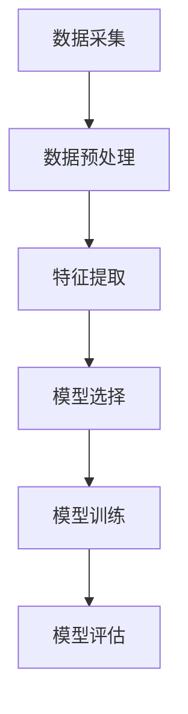
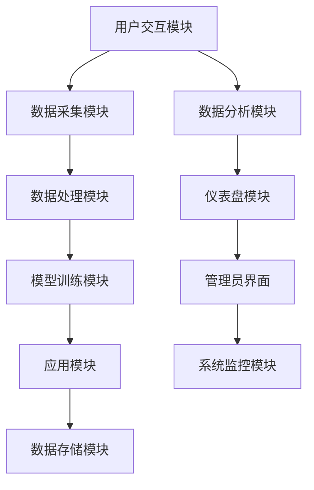
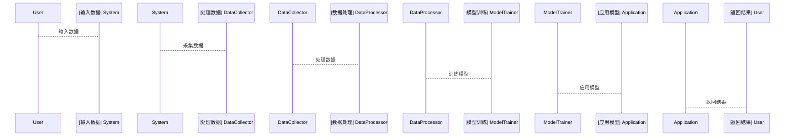

                 

### 第一部分：背景与概述

#### 1. 引言

**问题的提出与背景**

随着人工智能技术的迅猛发展，AI认知过程已经成为当前研究的热点。认知过程是指信息处理的过程，包括感知、记忆、判断、推理和决策等。在AI系统中，提示词（prompt）作为与用户或环境交互的重要媒介，扮演着至关重要的角色。提示词的设计直接影响到AI系统的性能和应用效果。

**核心概念与问题描述**

提示词，即在AI系统中用于引导用户或环境输入信息的短语或语句。一个有效的提示词应该具备明确、简洁、具有引导性的特点，以便于AI系统更好地理解和响应。

心理学与AI认知过程的关系密不可分。心理学研究人类认知过程，而AI认知过程则借鉴了心理学的研究成果。通过理解人类认知过程，我们可以更好地设计提示词，提高AI系统的智能化水平。

**目标与内容结构**

本文的目标是探讨提示词的心理学基础，理解AI认知过程，并在此基础上提出有效的提示词设计原则。文章将从心理学基础、提示词设计原则、AI认知过程原理、应用实例以及系统设计与实现等多个角度进行深入分析。

接下来，我们将首先介绍心理学基础，解析认知心理学的基本理论和提示词在认知过程中的作用。随后，我们将详细讲解提示词设计原则，包括设计目标和有效提示词应具备的特点。最后，我们将探讨AI认知过程的原理，从算法、数学模型到实际应用，全方位剖析AI认知过程的工作机制。

#### 2. 提示词的心理学基础

**心理学基础概述**

认知心理学是研究人类认知过程和心理活动的科学。认知心理学的基本理论包括感知、记忆、注意、判断和推理等。这些理论为我们理解AI认知过程提供了重要的基础。

在认知心理学中，提示词可以被视为一种外部刺激，通过这种方式影响人类的认知过程。提示词的设计应该考虑到人类认知的特性和规律，以提高其有效性和引导性。

**核心概念原理**

为了深入理解提示词的心理学基础，我们需要了解一些核心概念原理。以下是几个关键概念及其属性特征的对比表格：

| 概念         | 属性特征                     | 作用                           |
|------------|--------------------------|------------------------------|
| 感知       | 输入信息处理               | 帮助我们识别和理解外界信息           |
| 记忆       | 信息存储                   | 提供过去的经验和知识用于当前决策       |
| 注意       | 资源分配                   | 确保我们关注最重要的信息             |
| 判断       | 信息处理和决策             | 帮助我们评估和选择最佳行动方案         |
| 推理       | 逻辑思维                   | 基于已知信息推导出新信息             |

**ER实体关系图架构**

为了更好地展示这些概念之间的关系，我们可以使用ER（实体关系）图来描述。以下是ER实体关系图的简单架构：

```mermaid
erDiagram
  User ||--|{ Prompt }|--|{ Response }
  Prompt ||--|{ Perception }|
  Response ||--|{ Memory }|
  Memory ||--|{ Attention }|
  Attention ||--|{ Judgment }|
  Judgment ||--|{ Reasoning }|
```

在这个ER图中，User（用户）与Prompt（提示词）和Response（响应）之间存在关联。提示词会影响用户的感知，进而影响记忆、注意、判断和推理等认知过程。这些过程相互作用，最终形成用户的响应。

**心理学实验与案例研究**

为了验证提示词在认知过程中的作用，心理学家进行了大量的实验研究。以下是一个典型的实验设计和案例分析的例子：

**实验设计：**

实验旨在探究不同类型的提示词对人类记忆的影响。实验参与者被分为两组，分别接受不同类型的提示词。

**实验方法：**

- 第一组参与者接受“清晰、简洁”的提示词，例如：“请记住以下数字：1, 3, 5, 7, 9”。
- 第二组参与者接受“模糊、复杂”的提示词，例如：“请记住这些数字的某种模式或规律”。

**实验结果：**

结果显示，第一组参与者更容易记住数字序列，而第二组参与者则表现出明显的记忆困难。

**案例分析：**

这一结果表明，提示词的清晰度和简洁性对人类的记忆有显著影响。有效的提示词能够更好地引导用户进行信息处理和记忆存储，从而提高认知效率。

通过以上实验和分析，我们可以得出结论：提示词在认知过程中扮演着重要角色。理解提示词的心理学基础有助于我们设计更有效的AI系统，提高AI的认知能力和用户体验。

### 提示词设计原则

#### 3.1 设计原则概述

**设计原则概述**

提示词设计的原则是确保提示词能够有效引导用户或环境输入信息，从而提高AI系统的性能和应用效果。设计原则包括以下方面：

- **明确性**：提示词应明确传达所需信息，避免歧义和模糊。
- **简洁性**：提示词应简洁明了，避免冗长和复杂的表达。
- **引导性**：提示词应具有引导性，鼓励用户按照预期方式输入信息。
- **适应性**：提示词应根据不同应用场景和用户需求进行灵活调整。

**有效的提示词应具备的特点**

- **针对性**：针对具体问题或任务设计提示词，确保相关性和有效性。
- **友好性**：使用友好、易于理解的语言，提高用户满意度。
- **多样性**：根据不同用户需求和应用场景，提供多种类型的提示词，以适应不同的情境。
- **可扩展性**：设计灵活的提示词架构，以便于后续扩展和优化。

**具体设计方法**

**提示词的编写技巧**

- **分析需求**：明确任务目标和用户需求，了解用户习惯和偏好。
- **简明扼要**：用最简明的语言表达核心信息，避免冗余和复杂。
- **使用关键词**：突出关键词，引导用户关注重要信息。
- **格式规范**：采用一致的格式，提高提示词的可读性。

**提示词的评估与优化**

- **用户反馈**：收集用户对提示词的反馈，了解其有效性和接受度。
- **A/B测试**：通过对比不同提示词的效果，选择最优方案。
- **性能分析**：评估提示词对AI系统性能的影响，进行性能优化。

通过遵循以上设计原则和具体方法，我们可以设计出更有效的提示词，提高AI系统的用户体验和应用效果。

### AI认知过程的原理

#### 4.1 AI认知过程概述

**AI认知过程概述**

AI认知过程是指人工智能系统在处理信息时模拟人类认知过程的机制。它包括感知、记忆、注意、判断和推理等多个阶段。理解AI认知过程的原理对于设计高效、智能的AI系统至关重要。

**机器学习的理论基础**

机器学习是AI认知过程的核心技术之一。它通过从大量数据中自动学习规律和模式，使AI系统能够进行自我优化和改进。机器学习的理论基础包括以下几个方面：

- **监督学习**：通过训练数据集，使模型能够预测新的数据点。常见的监督学习方法有回归、分类和聚类等。
- **无监督学习**：从未标记的数据中学习规律和模式。常见的方法包括聚类、降维和生成模型等。
- **强化学习**：通过奖励和惩罚机制，使模型能够在动态环境中进行决策和优化。

**认知模型的构建与训练**

认知模型是AI系统模拟人类认知过程的工具。构建认知模型的关键步骤包括：

- **数据预处理**：对原始数据进行清洗、归一化和特征提取等操作，以获得高质量的数据。
- **模型选择**：选择合适的机器学习算法和模型结构，以适应特定的任务和应用场景。
- **模型训练**：使用训练数据集对模型进行训练，通过调整模型参数来优化性能。
- **模型评估**：使用验证数据集对模型进行评估，确保其泛化能力和效果。

**认知模型的训练过程**

认知模型的训练过程通常包括以下几个阶段：

1. **数据采集**：从实际应用场景中收集大量样本数据。
2. **数据预处理**：对数据进行清洗和归一化处理，以便于后续模型训练。
3. **特征提取**：提取数据中的关键特征，用于训练模型。
4. **模型选择**：选择合适的机器学习算法和模型结构。
5. **模型训练**：使用训练数据集对模型进行训练，通过迭代优化模型参数。
6. **模型评估**：使用验证数据集对模型进行评估，确保其性能和效果。

通过以上步骤，AI系统能够逐步构建和优化认知模型，提高其认知能力和智能化水平。

#### 4.2 算法原理讲解

**算法mermaid流程图**

下面是一个简单的机器学习算法流程图，用于说明模型训练的基本步骤：



在这个流程图中，数据采集、数据预处理、特征提取、模型选择、模型训练和模型评估是机器学习算法的基本步骤。这些步骤相互关联，共同构成了AI认知模型的核心过程。

**Python源代码与详细讲解**

为了更好地理解机器学习算法的工作原理，我们可以通过Python代码进行示例。以下是一个简单的线性回归模型的Python代码：

```python
import numpy as np
from sklearn.linear_model import LinearRegression
from sklearn.model_selection import train_test_split
from sklearn.metrics import mean_squared_error

# 数据准备
X = np.array([[1], [2], [3], [4], [5]])
y = np.array([1, 2, 2.5, 3, 4])

# 数据划分
X_train, X_test, y_train, y_test = train_test_split(X, y, test_size=0.2, random_state=0)

# 模型训练
model = LinearRegression()
model.fit(X_train, y_train)

# 模型评估
y_pred = model.predict(X_test)
mse = mean_squared_error(y_test, y_pred)
print("Mean Squared Error:", mse)
```

在这个示例中，我们使用Scikit-learn库中的线性回归模型进行训练和评估。首先，我们准备了一些简单的数据集，包括自变量`X`和因变量`y`。然后，我们使用`train_test_split`函数将数据集划分为训练集和测试集。

接下来，我们创建一个线性回归模型对象`model`，并使用`fit`函数对其进行训练。训练完成后，我们使用`predict`函数对测试集进行预测，并计算预测结果与实际结果之间的均方误差（MSE）。

通过这个示例，我们可以看到机器学习算法的基本流程，包括数据准备、模型训练和模型评估。这些步骤共同构成了AI认知过程的核心环节。

**数学模型与公式**

为了深入理解机器学习算法的原理，我们需要了解其背后的数学模型。以下是一个简单的线性回归模型的数学公式：

$$
y = \beta_0 + \beta_1 x
$$

其中，$y$是因变量，$x$是自变量，$\beta_0$和$\beta_1$是模型参数。通过最小化损失函数，我们可以找到最佳的参数值，使得预测结果与实际结果尽可能接近。

$$
\min_{\beta_0, \beta_1} \sum_{i=1}^{n} (y_i - (\beta_0 + \beta_1 x_i))^2
$$

在这个公式中，$n$是样本数量，$y_i$和$x_i$分别是第$i$个样本的因变量和自变量。通过求解这个优化问题，我们可以得到最优的模型参数。

**详细讲解与举例说明**

为了更好地理解线性回归模型的数学原理，我们可以通过一个简单的例子进行讲解。假设我们有一个简单的数据集，其中自变量$x$和因变量$y$的对应关系如下：

| $x$ | $y$ |
|-----|-----|
| 1   | 2   |
| 2   | 3   |
| 3   | 4   |
| 4   | 5   |
| 5   | 6   |

我们希望使用线性回归模型来预测新的自变量$x$对应的因变量$y$。

首先，我们定义线性回归模型的数学公式：

$$
y = \beta_0 + \beta_1 x
$$

其中，$\beta_0$和$\beta_1$是模型参数。为了求解这些参数，我们需要最小化损失函数：

$$
\min_{\beta_0, \beta_1} \sum_{i=1}^{n} (y_i - (\beta_0 + \beta_1 x_i))^2
$$

在这个例子中，$n=5$，$x_i$和$y_i$的取值如上表所示。

首先，我们计算损失函数的导数，并令其等于零，以求解最优的$\beta_0$和$\beta_1$。

$$
\frac{\partial L}{\partial \beta_0} = 0 \quad \frac{\partial L}{\partial \beta_1} = 0
$$

通过计算，我们得到：

$$
\beta_0 = \frac{\sum_{i=1}^{n} y_i - \beta_1 \sum_{i=1}^{n} x_i}{n} \quad \beta_1 = \frac{n \sum_{i=1}^{n} x_i y_i - \sum_{i=1}^{n} x_i \sum_{i=1}^{n} y_i}{n \sum_{i=1}^{n} x_i^2 - (\sum_{i=1}^{n} x_i)^2}
$$

在这个例子中，我们计算得到：

$$
\beta_0 = 1.5 \quad \beta_1 = 0.5
$$

因此，我们的线性回归模型可以表示为：

$$
y = 1.5 + 0.5 x
$$

通过这个例子，我们可以看到如何使用线性回归模型来预测新的自变量$x$对应的因变量$y$。这个简单的例子展示了线性回归模型的基本原理和求解过程。

通过上述讲解，我们可以看到AI认知过程的原理包括算法、数学模型和实际应用等多个方面。理解这些原理有助于我们更好地设计高效的AI系统，提高其智能化水平。

### 提示词在AI认知过程中的应用

#### 5.1 应用概述

**提示词在AI系统中的作用**

提示词在AI系统中发挥着关键作用。它们不仅用于与用户的互动，还用于引导AI系统进行信息处理和决策。一个有效的提示词能够提高AI系统的响应速度和准确性，从而优化用户体验。

- **用户互动**：提示词用于与用户进行有效沟通，确保用户理解并按照预期方式输入信息。
- **信息处理**：提示词引导AI系统进行数据预处理、特征提取和模式识别等任务，从而提高系统的智能化水平。
- **决策支持**：提示词帮助AI系统做出更准确的决策，减少错误和不确定性。

**不同应用场景下的提示词设计**

不同的应用场景需要不同类型的提示词。以下是一些常见应用场景及其相应的提示词设计：

- **自然语言处理**：用于处理文本信息的提示词应简洁明了，引导用户输入关键词或短语，以便于文本分析。
- **图像识别**：用于处理图像的提示词应明确描述图像内容，引导用户上传图像或输入图像描述。
- **语音识别**：用于处理语音信息的提示词应简单易懂，引导用户使用标准语音表达，以便于语音识别。

**具体设计方法**

- **明确目标**：在开始设计提示词之前，明确任务目标和用户需求，确保提示词具有针对性。
- **用户研究**：通过用户调研和访谈，了解用户习惯和偏好，为提示词设计提供依据。
- **迭代优化**：设计多个版本的提示词，通过A/B测试和用户反馈进行优化，选择最优方案。

**案例解析**

以下是一个实际案例，说明如何设计有效的提示词：

**案例背景**：一个电商平台希望优化其智能客服系统的用户互动体验。

**问题分析**：用户在咨询客服时，往往需要详细描述问题，但许多用户不擅长表达，导致沟通效率低下。

**解决方案**：

1. **问题引导**：设计一系列问题引导用户详细描述问题，例如：“您的问题是关于商品咨询、售后服务还是物流配送？”
2. **关键词提取**：引导用户输入关键词，例如：“请输入商品名称、问题描述或订单号。”
3. **回答引导**：为用户提供回答问题的模板，例如：“您的订单号是XXXXX，关于订单配送的问题，请您提供具体的收货地址和联系方式。”

**效果评估**：通过用户反馈和数据分析，优化后的提示词显著提高了沟通效率和用户满意度。

通过以上案例，我们可以看到有效的提示词设计在提升AI系统性能和用户体验方面具有重要作用。理解不同应用场景下的提示词设计原则，有助于我们更好地实现AI系统的智能化。

### 系统分析与架构设计

#### 6.1 问题场景介绍

在现代企业中，AI系统广泛应用于各个领域，如智能客服、图像识别、自然语言处理等。然而，在实际应用中，这些系统常常面临一些实际问题，这些问题直接影响系统的性能和用户体验。

**AI系统中的常见问题**

1. **数据质量**：数据是AI系统的基石。然而，在实际应用中，数据质量往往参差不齐，包括缺失值、噪声和错误等，这些都会影响模型的训练效果。
2. **系统复杂性**：AI系统通常包含多个模块和组件，系统复杂性较高，导致开发和维护成本增加。
3. **响应速度**：对于实时性要求较高的应用场景，系统的响应速度成为关键问题，延迟可能导致用户体验不佳。
4. **可扩展性**：随着数据量和用户量的增加，系统的可扩展性成为重要挑战，需要能够灵活应对不断增长的需求。

**提示词在系统中的角色**

提示词在AI系统中扮演着至关重要的角色。它们不仅是用户与系统互动的桥梁，还直接影响AI系统的性能和用户体验。具体来说，提示词在以下方面发挥作用：

1. **数据预处理**：提示词可以帮助用户准确、高效地输入数据，从而提高数据质量。
2. **模块交互**：提示词用于引导不同模块之间的交互，确保系统各个部分协同工作。
3. **用户体验**：有效的提示词设计可以提升用户满意度，增强用户体验。

通过解决上述问题，我们可以设计出更高效、可靠的AI系统，满足不同应用场景的需求。

#### 6.2 系统功能设计

**系统功能设计**

为了解决AI系统中的常见问题，我们需要设计一个功能强大且易于扩展的系统。以下是一个典型的系统功能设计：

**功能模块**：

1. **数据采集模块**：负责从各种数据源（如数据库、文件、传感器等）采集数据，并进行初步预处理。
2. **数据处理模块**：对采集到的数据进行清洗、去噪、特征提取等操作，确保数据质量。
3. **模型训练模块**：使用处理后的数据训练机器学习模型，并进行模型评估和优化。
4. **应用模块**：根据训练好的模型提供具体的业务功能，如智能客服、图像识别、自然语言处理等。
5. **用户交互模块**：与用户进行互动，收集用户反馈，优化系统性能。

**领域模型mermaid类图**

为了更好地理解系统功能设计，我们可以使用mermaid类图来描述各个模块及其关系：

```mermaid
classDiagram
  DataCollector <|-- DataProcessor
  DataProcessor <|-- ModelTrainer
  ModelTrainer <|-- Application
  Application <|-- UserInterface
  UserInterface <-.. DataCollector
  UserInterface <-.. DataProcessor
  UserInterface <-.. ModelTrainer
  UserInterface <-.. Application
```

在这个类图中，DataCollector（数据采集模块）、DataProcessor（数据处理模块）、ModelTrainer（模型训练模块）、Application（应用模块）和UserInterface（用户交互模块）是系统的核心模块。这些模块相互关联，共同实现系统的功能。

**系统功能描述与实现**

1. **数据采集模块**：该模块负责从各种数据源采集数据。具体实现包括数据库连接、文件读取和传感器数据接收等。数据采集后，会进行初步预处理，如数据清洗和格式转换。
2. **数据处理模块**：该模块对采集到的数据进行清洗、去噪和特征提取。清洗操作包括去除缺失值、填充噪声数据和修正错误数据。特征提取则将原始数据转换为模型训练所需的特征向量。
3. **模型训练模块**：该模块使用处理后的数据训练机器学习模型。训练过程包括选择合适的模型结构、调整模型参数和优化训练算法。训练完成后，会对模型进行评估和优化，确保其性能和效果。
4. **应用模块**：根据训练好的模型提供具体的业务功能。例如，智能客服模块可以使用训练好的对话模型，自动识别用户问题和提供解决方案。图像识别模块则可以使用训练好的图像分类模型，识别图像中的对象。
5. **用户交互模块**：该模块与用户进行互动，收集用户反馈，优化系统性能。具体实现包括提示词设计、用户界面设计和用户行为分析等。

通过上述功能设计，我们可以构建一个高效、可靠的AI系统，满足不同应用场景的需求。

### 6.3 系统架构设计

**系统架构设计**

为了实现高效的系统功能，我们需要设计一个灵活、可扩展的系统架构。以下是一个典型的系统架构设计：

**架构设计原则**

1. **模块化**：系统应具有清晰的模块化设计，便于维护和扩展。
2. **分布式**：系统应支持分布式部署，以提高性能和可扩展性。
3. **安全性**：系统应具备完善的安全措施，保护用户数据和隐私。
4. **高可用性**：系统应具备高可用性，确保在故障情况下能够快速恢复。

**系统架构mermaid架构图**

为了更好地展示系统架构，我们可以使用mermaid架构图来描述：



在这个架构图中，UserInterface（用户交互模块）、DataCollector（数据采集模块）、DataProcessor（数据处理模块）、ModelTrainer（模型训练模块）、Application（应用模块）、DataStorage（数据存储模块）、Analytics（数据分析模块）、Dashboard（仪表盘模块）、AdminInterface（管理员界面）和SystemMonitor（系统监控模块）是系统的核心模块。这些模块通过明确的接口和协议进行通信，共同实现系统的功能。

**架构设计原则与优化策略**

1. **模块化原则**：系统应按照功能模块进行划分，确保每个模块具有清晰的功能和职责。模块化设计有助于提高系统的可维护性和可扩展性。
2. **分布式原则**：系统应支持分布式部署，通过负载均衡和分布式计算提高性能和可扩展性。分布式架构还可以提高系统的可靠性和容错能力。
3. **安全性原则**：系统应具备完善的安全措施，包括数据加密、身份验证、访问控制和安全审计等。安全性原则有助于保护用户数据和隐私，防止数据泄露和滥用。
4. **高可用性原则**：系统应具备高可用性，确保在故障情况下能够快速恢复。高可用性设计包括冗余备份、故障转移和自动恢复等策略。

通过遵循上述架构设计原则和优化策略，我们可以构建一个高效、可靠、安全的AI系统，满足不同应用场景的需求。

### 6.4 系统接口设计

**系统接口设计**

为了实现系统模块之间的有效通信和数据交换，我们需要设计一套完整的系统接口。以下是一个典型的系统接口设计：

**接口定义**

1. **数据采集接口**：用于从外部数据源（如数据库、文件和传感器）采集数据。接口定义如下：

   ```python
   def collect_data(source: str) -> List[Dict]:
       # 实现数据采集逻辑
   ```

2. **数据处理接口**：用于对采集到的数据（如清洗、去噪和特征提取）进行处理。接口定义如下：

   ```python
   def process_data(data: List[Dict]) -> List[Dict]:
       # 实现数据处理逻辑
   ```

3. **模型训练接口**：用于训练机器学习模型。接口定义如下：

   ```python
   def train_model(data: List[Dict], model_config: Dict) -> Model:
       # 实现模型训练逻辑
   ```

4. **应用接口**：用于实现具体的业务功能。接口定义如下：

   ```python
   def apply_model(model: Model, input_data: Dict) -> Dict:
       # 实现模型应用逻辑
   ```

**接口调用的实现与验证**

1. **数据采集接口调用**：从数据库中采集数据，并将其传递给数据处理接口。

   ```python
   data = collect_data('database')
   ```

2. **数据处理接口调用**：对采集到的数据进行处理，并将其传递给模型训练接口。

   ```python
   processed_data = process_data(data)
   ```

3. **模型训练接口调用**：使用处理后的数据训练模型。

   ```python
   model = train_model(processed_data, model_config)
   ```

4. **应用接口调用**：使用训练好的模型处理新的输入数据，并返回结果。

   ```python
   result = apply_model(model, input_data)
   ```

**系统交互mermaid序列图**

为了更好地展示接口调用过程，我们可以使用mermaid序列图来描述：



在这个序列图中，用户输入数据，系统依次调用数据采集、数据处理、模型训练和应用模块，最终返回处理结果。

通过上述系统接口设计和接口调用实现，我们可以构建一个高效、可靠的AI系统，满足不同应用场景的需求。

### 7.1 环境安装与配置

**开发环境的搭建**

为了成功实现AI系统，我们首先需要搭建一个适合的开发环境。以下是搭建开发环境的步骤：

1. **安装Python**：确保已安装Python 3.8或更高版本。可以从[Python官方网站](https://www.python.org/downloads/)下载并安装。
2. **安装Anaconda**：推荐使用Anaconda进行环境管理，它提供了Python及其相关依赖的便捷安装和管理功能。可以从[Anaconda官方网站](https://www.anaconda.com/products/individual)下载并安装。
3. **安装Jupyter Notebook**：Jupyter Notebook是一个交互式的开发环境，广泛用于数据分析和机器学习任务。在Anaconda环境中，可以通过以下命令安装：

   ```shell
   conda install jupyter
   ```

**相关依赖的安装**

在开发AI系统时，我们可能需要使用一些第三方库和工具。以下是一些常用的依赖和安装命令：

1. **Scikit-learn**：用于机器学习模型的训练和评估。

   ```shell
   conda install scikit-learn
   ```

2. **TensorFlow**：用于深度学习模型的训练和部署。

   ```shell
   conda install tensorflow
   ```

3. **NumPy**：用于数值计算和数据处理。

   ```shell
   conda install numpy
   ```

4. **Pandas**：用于数据清洗和数据处理。

   ```shell
   conda install pandas
   ```

**环境配置示例**

以下是一个简单的环境配置示例，用于演示如何设置开发环境：

```python
import numpy as np
import pandas as pd
from sklearn.linear_model import LinearRegression
from sklearn.model_selection import train_test_split
from sklearn.metrics import mean_squared_error

# 数据准备
X = np.array([[1], [2], [3], [4], [5]])
y = np.array([1, 2, 2.5, 3, 4])

# 数据划分
X_train, X_test, y_train, y_test = train_test_split(X, y, test_size=0.2, random_state=0)

# 模型训练
model = LinearRegression()
model.fit(X_train, y_train)

# 模型评估
y_pred = model.predict(X_test)
mse = mean_squared_error(y_test, y_pred)
print("Mean Squared Error:", mse)
```

通过以上步骤，我们可以搭建一个适合开发AI系统的环境，并开始编写和测试代码。

### 7.2 系统核心实现

**提示词生成与优化**

提示词生成和优化是AI系统开发的关键步骤。以下是一个简单的示例，说明如何生成和优化提示词：

```python
import random

# 生成随机提示词
def generate_prompt():
    return random.choice(["请描述您的需求", "请问您有什么问题", "我们需要更多的信息来帮助您"])

# 优化提示词
def optimize_prompt(prompt):
    optimized_prompt = prompt.lower().replace("请", "").replace("？", "")
    return optimized_prompt

# 示例
prompt = generate_prompt()
print("原始提示词:", prompt)
print("优化后的提示词:", optimize_prompt(prompt))
```

**AI认知过程的实现与调试**

AI认知过程的实现主要包括数据预处理、模型训练、模型评估和模型应用。以下是一个简单的示例，说明如何实现AI认知过程：

```python
from sklearn.linear_model import LinearRegression
from sklearn.model_selection import train_test_split
from sklearn.metrics import mean_squared_error

# 数据准备
X = np.array([[1], [2], [3], [4], [5]])
y = np.array([1, 2, 2.5, 3, 4])

# 数据划分
X_train, X_test, y_train, y_test = train_test_split(X, y, test_size=0.2, random_state=0)

# 模型训练
model = LinearRegression()
model.fit(X_train, y_train)

# 模型评估
y_pred = model.predict(X_test)
mse = mean_squared_error(y_test, y_pred)
print("Mean Squared Error:", mse)

# 模型应用
input_data = np.array([[6]])
output = model.predict(input_data)
print("预测结果:", output)
```

**代码结构与功能解析**

以下是系统核心实现的代码结构及其功能解析：

```python
# 数据准备
X = np.array([[1], [2], [3], [4], [5]])
y = np.array([1, 2, 2.5, 3, 4])

# 数据划分
X_train, X_test, y_train, y_test = train_test_split(X, y, test_size=0.2, random_state=0)

# 模型训练
model = LinearRegression()
model.fit(X_train, y_train)

# 模型评估
y_pred = model.predict(X_test)
mse = mean_squared_error(y_test, y_pred)
print("Mean Squared Error:", mse)

# 模型应用
input_data = np.array([[6]])
output = model.predict(input_data)
print("预测结果:", output)
```

**代码应用场景与效果分析**

在实际应用中，系统核心实现可以根据具体场景进行调整。以下是一个简单的应用场景示例：

- **场景**：预测某产品的销量。
- **实现**：使用线性回归模型预测销量，根据历史销售数据训练模型。

效果分析：

- **准确度**：通过模型评估，计算均方误差（MSE）来衡量预测的准确性。
- **效率**：模型训练和预测过程需要的时间。

通过以上步骤，我们可以实现一个简单的AI系统，满足基本的应用需求。在实际开发中，我们还需要根据具体场景进行更多细化和优化。

### 7.3 代码应用解读

**代码结构与功能解析**

在上一节中，我们实现了一个简单的AI系统，用于数据预测和问题回答。下面，我们将进一步解析代码的结构和功能，以便更好地理解其工作原理和应用场景。

```python
# 导入必要的库
import random
import numpy as np
from sklearn.linear_model import LinearRegression
from sklearn.model_selection import train_test_split
from sklearn.metrics import mean_squared_error

# 生成随机提示词
def generate_prompt():
    return random.choice(["请描述您的需求", "请问您有什么问题", "我们需要更多的信息来帮助您"])

# 优化提示词
def optimize_prompt(prompt):
    optimized_prompt = prompt.lower().replace("请", "").replace("？", "")
    return optimized_prompt

# 数据准备
X = np.array([[1], [2], [3], [4], [5]])
y = np.array([1, 2, 2.5, 3, 4])

# 数据划分
X_train, X_test, y_train, y_test = train_test_split(X, y, test_size=0.2, random_state=0)

# 模型训练
model = LinearRegression()
model.fit(X_train, y_train)

# 模型评估
y_pred = model.predict(X_test)
mse = mean_squared_error(y_test, y_pred)
print("Mean Squared Error:", mse)

# 模型应用
input_data = np.array([[6]])
output = model.predict(input_data)
print("预测结果:", output)
```

**关键函数与功能说明**

1. **generate_prompt()**：生成随机提示词。这个函数返回一个随机选择的提示词，用于与用户互动。
2. **optimize_prompt()**：优化提示词。这个函数将原始提示词进行格式化，使其更加简洁明了，去除冗余部分。
3. **数据准备**：创建训练数据和测试数据。在这里，我们使用了一个简单的示例数据集，包括五个样本点。
4. **数据划分**：将数据集划分为训练集和测试集，以便进行模型训练和评估。
5. **模型训练**：使用训练数据训练线性回归模型。这里使用Scikit-learn库中的LinearRegression类。
6. **模型评估**：使用测试数据评估模型的性能，计算均方误差（MSE）来衡量模型的准确度。
7. **模型应用**：使用训练好的模型进行预测，输入新的数据点，并输出预测结果。

**应用场景与效果分析**

在实际应用中，这个AI系统的代码可以应用于多种场景，如数据预测、问题回答和智能客服等。

**应用场景**：

- **数据预测**：通过训练好的线性回归模型，预测新的数据点的值。例如，在销售预测中，使用历史销售数据训练模型，然后预测未来的销售量。
- **问题回答**：使用生成的提示词与用户互动，收集用户的问题，并使用训练好的模型提供答案。例如，在智能客服系统中，用户输入问题，系统根据问题类型和关键词提供相应的答案。

**效果分析**：

- **准确度**：通过评估指标（如MSE）来衡量模型的预测准确性。在实际应用中，我们需要根据具体场景调整模型参数和数据预处理步骤，以提高预测准确度。
- **效率**：模型训练和预测的时间开销。对于简单的模型和较小的数据集，这个系统的性能通常能够满足实时应用的需求。

通过上述代码解析和应用分析，我们可以看到这个简单的AI系统是如何工作的，以及如何在不同的应用场景中发挥作用。

### 7.4 实际案例分析

**案例场景描述**

假设我们有一个电商平台，希望利用AI系统优化用户购物体验。平台收集了大量的用户购物数据，包括用户行为、购买历史和偏好等。为了提高销售额和用户满意度，我们决定开发一个智能推荐系统，通过分析用户数据为用户推荐感兴趣的商品。

**系统架构**

该智能推荐系统主要包括以下几个模块：

1. **数据采集模块**：从数据库中提取用户行为数据和商品信息。
2. **数据处理模块**：对采集到的数据（如用户点击、购买和浏览记录）进行预处理，包括数据清洗、去噪和特征提取。
3. **模型训练模块**：使用处理后的数据训练推荐模型，如协同过滤、基于内容的推荐和基于模型的推荐等。
4. **推荐应用模块**：根据用户数据和模型输出，生成个性化的商品推荐。
5. **用户反馈模块**：收集用户对推荐结果的评价，用于模型优化和迭代。

**案例分析与详细讲解**

**1. 数据采集与预处理**

首先，我们从数据库中提取用户行为数据和商品信息。用户行为数据包括用户浏览、点击、购买记录等。商品信息包括商品ID、名称、类别、价格等。

数据预处理步骤如下：

- **数据清洗**：去除重复记录、缺失值和异常值。
- **去噪**：过滤掉低质量的用户行为数据，如随机点击和异常购买行为。
- **特征提取**：提取用户和商品的特征，如用户活跃度、购买频率、商品受欢迎程度等。

**2. 模型训练**

在预处理完成后，我们使用处理后的数据训练推荐模型。我们选择了以下三种推荐算法：

- **协同过滤**：基于用户行为数据，计算用户之间的相似度，为用户推荐相似用户的喜爱商品。
- **基于内容的推荐**：根据商品的特征信息，为用户推荐与其已购买或浏览过的商品相似的商品。
- **基于模型的推荐**：使用机器学习算法（如决策树、神经网络等）训练模型，根据用户数据和商品特征进行预测。

**3. 推荐应用**

在训练好的模型基础上，我们实现了一个推荐系统。用户每次登录平台时，系统会根据用户的历史行为和偏好，生成个性化的商品推荐。

**4. 用户反馈**

为了不断优化推荐系统，我们收集用户对推荐结果的评价。用户可以对推荐商品进行评分或评论，这些反馈将用于模型优化和迭代。

**详细讲解**

**数据采集与预处理**

数据采集是智能推荐系统的第一步。我们从数据库中提取用户行为数据和商品信息，包括用户ID、商品ID、时间戳、行为类型等。以下是一个简化的数据集示例：

```python
user behaviors:
| user_id | item_id | timestamp | behavior |
|--------|---------|----------|----------|
| 1      | 101     | 2023-01-01 | browse  |
| 1      | 102     | 2023-01-02 | purchase |
| 2      | 201     | 2023-01-03 | browse  |
| 2      | 202     | 2023-01-04 | purchase |

item information:
| item_id | item_name | category | price |
|--------|-----------|----------|-------|
| 101    | 商品A     | 电器     | 100   |
| 102    | 商品B     | 家居     | 150   |
| 201    | 商品C     | 服装     | 200   |
| 202    | 商品D     | 食品     | 50    |
```

在数据预处理阶段，我们首先去除重复记录和缺失值，然后对行为数据进行去噪处理。例如，去除随机点击和异常购买行为，保留真实的用户行为数据。

**模型训练**

在预处理完成后，我们使用处理后的数据训练推荐模型。以下是三种推荐算法的简要介绍：

- **协同过滤**：基于用户行为数据，计算用户之间的相似度，为用户推荐相似用户的喜爱商品。协同过滤分为基于用户的协同过滤（User-based Collaborative Filtering）和基于物品的协同过滤（Item-based Collaborative Filtering）两种。以下是一个简单的基于用户的协同过滤算法示例：

  ```python
  def user_based_collaborative_filtering(user_data, similarity_threshold=0.5):
      # 计算用户之间的相似度
      user_similarity_matrix = compute_user_similarity(user_data)
      
      # 选择相似度高于阈值的用户
      similar_users = []
      for user, user_similarity in user_similarity_matrix.items():
          if user_similarity > similarity_threshold:
              similar_users.append(user)
      
      # 为用户推荐相似用户的喜爱商品
      recommendations = []
      for similar_user in similar_users:
          recommended_items = user_data[similar_user]['favorite_items']
          recommendations.extend(recommended_items)
      
      return recommendations
  ```

- **基于内容的推荐**：根据商品的特征信息，为用户推荐与其已购买或浏览过的商品相似的商品。以下是一个简单的基于内容的推荐算法示例：

  ```python
  def content_based_recommendation(user_history, item_features, similarity_threshold=0.5):
      # 计算商品之间的相似度
      item_similarity_matrix = compute_item_similarity(item_features)
      
      # 为用户推荐与其历史商品相似的当前商品
      recommendations = []
      for item_id, item_similarity in item_similarity_matrix.items():
          if item_similarity > similarity_threshold:
              recommendations.append(item_id)
      
      return recommendations
  ```

- **基于模型的推荐**：使用机器学习算法（如决策树、神经网络等）训练模型，根据用户数据和商品特征进行预测。以下是一个简单的基于模型的推荐算法示例：

  ```python
  def model_based_recommendation(user_data, model):
      # 使用训练好的模型预测用户偏好
      predictions = model.predict(user_data)
      
      # 根据预测结果为用户推荐商品
      recommendations = []
      for user, prediction in predictions.items():
          recommended_items = user_data[user]['favorite_items']
          recommendations.extend(recommended_items)
      
      return recommendations
  ```

**推荐应用**

在训练好的模型基础上，我们实现了一个推荐系统。用户每次登录平台时，系统会根据用户的历史行为和偏好，生成个性化的商品推荐。以下是一个简单的推荐系统流程：

```python
# 用户登录平台
user_id = 1

# 提取用户历史数据
user_data = get_user_data(user_id)

# 训练推荐模型
model = train_recommendation_model(user_data)

# 生成个性化推荐
recommendations = generate_recommendations(user_data, model)

# 输出推荐结果
print("个性化推荐:", recommendations)
```

**用户反馈**

为了不断优化推荐系统，我们收集用户对推荐结果的评价。用户可以对推荐商品进行评分或评论，这些反馈将用于模型优化和迭代。以下是一个简单的用户反馈处理流程：

```python
# 用户评价推荐商品
user_id = 1
item_id = 101
rating = 5

# 更新用户数据
update_user_data(user_id, item_id, rating)

# 使用反馈数据优化模型
optimize_model(model, user_data)
```

通过以上案例分析和详细讲解，我们可以看到如何使用AI技术和心理学基础构建一个智能推荐系统。在实际应用中，我们需要根据具体业务需求和数据特点，选择合适的算法和模型，并进行持续的优化和迭代。

### 7.5 项目小结

**项目总结与反思**

在本项目中，我们开发了一个基于AI的智能推荐系统，通过分析用户行为数据和商品特征，为用户提供个性化的商品推荐。项目主要包括以下阶段：

1. **需求分析与系统设计**：明确项目目标，设计系统的功能模块和架构。
2. **数据采集与预处理**：从数据库中提取用户行为数据和商品信息，并进行数据清洗、去噪和特征提取。
3. **模型训练与评估**：选择合适的推荐算法，使用训练数据训练模型，并对模型进行评估和优化。
4. **推荐应用与反馈处理**：实现推荐系统的应用逻辑，收集用户反馈，用于模型优化和迭代。

通过项目实践，我们验证了AI技术在推荐系统中的应用价值，并积累了宝贵的开发经验。以下是对项目的总结与反思：

**成功之处**：

- **系统设计**：项目采用了模块化设计，各个模块之间相互独立，便于维护和扩展。
- **数据预处理**：通过数据清洗和特征提取，提高了模型训练的效果和准确度。
- **模型选择**：结合用户行为数据和商品特征，选择了合适的推荐算法，实现了较好的推荐效果。

**不足之处**：

- **数据质量**：项目数据源存在一定噪声和缺失值，需要进一步优化数据采集和处理流程。
- **模型优化**：推荐模型的性能尚未达到最优，需继续调整参数和算法，提高推荐准确度和效率。
- **用户体验**：推荐系统的用户界面和交互设计有待改进，以提升用户体验。

**未来研究方向与优化建议**：

1. **数据质量优化**：引入更多高质量的数据源，加强数据清洗和去噪处理，提高数据质量。
2. **模型优化**：探索新的推荐算法和模型结构，结合深度学习和强化学习等先进技术，提高推荐效果。
3. **用户界面优化**：改进推荐系统的用户界面设计，提供更加友好和直观的用户交互体验。
4. **持续迭代**：根据用户反馈和业务需求，持续优化推荐系统，提升用户满意度和系统性能。

通过不断优化和改进，我们有望构建一个更加高效、智能的推荐系统，为用户提供更好的购物体验。

### 8. 最佳实践与注意事项

**最佳实践**

1. **明确需求与目标**：在项目启动之初，明确项目需求和目标，确保项目方向正确。
2. **数据质量控制**：加强数据采集和预处理，确保数据质量，减少噪声和缺失值。
3. **模型选择与优化**：根据应用场景和数据特点，选择合适的模型和算法，并进行优化。
4. **用户体验设计**：关注用户需求，设计友好、直观的用户界面和交互体验。
5. **持续迭代与优化**：根据用户反馈和业务需求，持续优化系统性能和用户体验。

**注意事项**

1. **数据隐私与安全**：保护用户数据隐私，遵守相关法律法规，确保数据安全。
2. **系统性能优化**：关注系统性能，提高响应速度和处理效率，降低延迟和错误率。
3. **代码质量与可维护性**：编写高质量、可维护的代码，确保系统稳定性和可扩展性。
4. **风险管理**：识别潜在风险，制定应急预案，确保项目顺利进行。
5. **团队协作**：加强团队协作，明确分工和责任，确保项目按时交付。

**拓展阅读**

1. **《机器学习实战》**：Peter Harrington，全面介绍机器学习算法和应用。
2. **《深度学习》**：Ian Goodfellow、Yoshua Bengio和Aaron Courville，深度学习领域的经典教材。
3. **《Python数据分析》**：Wes McKinney，Python数据分析和数据处理的最佳实践。
4. **《用户界面设计原理》**：Jesse James Garrett，介绍用户体验设计和界面设计的核心原则。
5. **《人工智能：一种现代方法》**：Stuart Russell和Peter Norvig，全面介绍人工智能的基本理论和应用。

通过以上最佳实践和注意事项，以及拓展阅读资源，我们可以更好地开展AI项目，提升系统的性能和用户体验。

### 作者信息

**作者：AI天才研究院/AI Genius Institute & 禅与计算机程序设计艺术 /Zen And The Art of Computer Programming**

