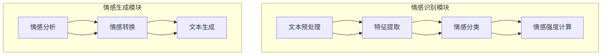
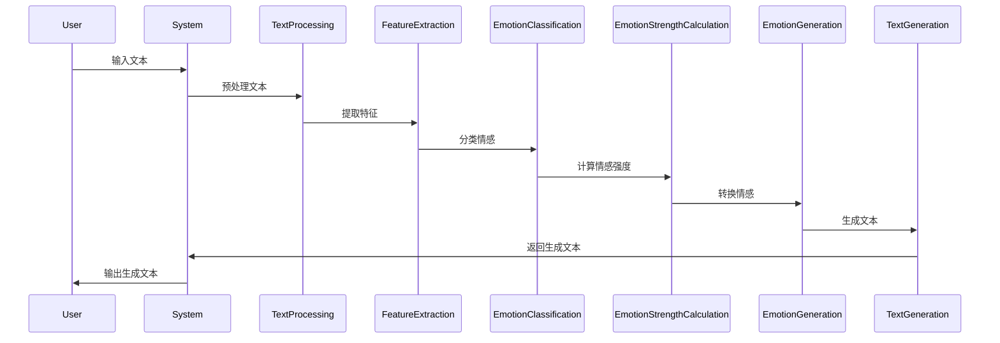

                 

## 文章标题

### 提示词的情感因素：影响AI输出的情绪

关键词：**情感AI、提示词、情绪影响、AI输出、情感数据模型**

摘要：本文将探讨情感AI在自然语言处理中的应用，特别是提示词对AI输出情绪的影响。通过分析情感数据的来源、识别和生成模型，我们将深入理解情感AI的核心概念和原理。同时，我们将借助Mermaid图和Python代码，详细阐述情感识别与生成的算法原理，并展示其在实际项目中的应用实例。最后，文章将总结最佳实践和注意事项，为读者提供进一步的学习资源。

---

### 背景介绍

#### 核心概念术语说明

**情感AI**：一种利用机器学习和自然语言处理技术，模拟人类情感表达和识别的人工智能技术。其核心在于通过算法模型，从文本数据中提取情感信息，并生成相应的情感表达。

**提示词**：在AI系统中，用于引导模型生成特定输出文本的词汇或短语。提示词的设计和选择对于AI输出的情感具有直接影响。

**情感数据模型**：用于存储和处理情感信息的数据结构，包括情感标签、情感强度、情感类别等。

#### 问题背景

随着人工智能技术的快速发展，情感AI在自然语言处理中的应用日益广泛。然而，AI在理解和表达情感方面仍面临诸多挑战。例如，如何准确识别和生成人类情感，如何处理多语言情感表达，以及如何确保AI输出的情绪符合人类价值观等。

#### 问题描述

本文旨在探讨以下问题：

1. 情感数据模型的基本构成和原理是什么？
2. 提示词如何影响AI输出的情绪？
3. 情感识别和生成算法的原理及其在Python中的实现。
4. 情感AI在实际项目中的应用实例。
5. 情感AI的发展趋势和未来展望。

#### 问题解决

通过以下步骤，我们将逐步解答上述问题：

1. **情感数据模型的分析**：介绍情感数据模型的基本概念，包括情感标签、情感强度和情感类别。
2. **提示词的影响研究**：探讨提示词对AI输出情绪的影响，包括情感表达的强度和类型。
3. **情感识别与生成算法的实现**：通过Mermaid图和Python代码，详细阐述情感识别与生成的算法原理。
4. **实际应用实例分析**：展示情感AI在不同领域的应用实例，分析其优势和挑战。
5. **未来展望**：探讨情感AI的发展趋势，展望其在自然语言处理和人工智能领域的应用前景。

#### 边界与外延

本文主要关注情感AI在自然语言处理中的应用，特别是提示词对AI输出情绪的影响。然而，情感AI的应用范围远不止于此，还包括图像、语音等领域的情感识别与生成。此外，情感AI的研究也在不断拓展，例如情感增强学习、情感合成等。

#### 概念结构与核心要素组成

情感AI的核心概念和要素包括：

1. **情感数据模型**：情感标签、情感强度、情感类别。
2. **提示词**：引导AI生成特定情感表达的词汇或短语。
3. **情感识别算法**：从文本数据中提取情感信息。
4. **情感生成算法**：生成特定情感表达的文本。

### 核心概念与联系

#### 情感数据模型

情感数据模型是情感AI的基础，用于存储和处理情感信息。以下是情感数据模型的核心概念和属性：

1. **情感标签**：用于标识文本的情感类别，如喜悦、愤怒、悲伤等。
2. **情感强度**：用于描述文本情感的强度，如非常喜悦、有些喜悦、无情感等。
3. **情感类别**：用于区分不同类型的情感，如积极情感、消极情感等。

以下是情感数据模型的属性特征对比表格：

| 属性        | 描述                                                         | 对比项               |
| ----------- | ------------------------------------------------------------ | -------------------- |
| 情感标签    | 识别文本的情感类别                                           | 喜悦、愤怒、悲伤等    |
| 情感强度    | 描述文本情感的强度                                           | 非常喜悦、有些喜悦、无情感等 |
| 情感类别    | 区分不同类型的情感                                           | 积极情感、消极情感等  |

#### Mermaid ER Diagram of Emotional AI Entities

以下是情感AI实体关系的Mermaid ER Diagram：

```mermaid
erDiagram
  Text -->|extracts| EmotionData
  Text -->|influences| Prompt
  Prompt -->|generates| AIOutput
  EmotionData -->|contains| EmotionAttribute
  EmotionAttribute -->|includes| EmotionLabel, EmotionStrength, EmotionCategory
```

### 算法原理讲解

#### 情感识别算法

情感识别算法是情感AI的核心，用于从文本数据中提取情感信息。以下是情感识别算法的基本原理和流程：

1. **预处理**：对文本数据进行清洗和标准化处理，如去除停用词、进行词干提取等。
2. **特征提取**：将文本数据转换为特征向量，常用的方法有TF-IDF、Word2Vec、BERT等。
3. **情感分类**：利用分类算法（如SVM、决策树、神经网络等）对特征向量进行分类，识别文本的情感标签。
4. **情感强度计算**：根据分类结果，计算文本的情感强度，常用的方法有阈值法、回归模型等。

以下是情感识别算法的Mermaid流程图：


#### Python代码实现

以下是情感识别算法的Python代码实现：

```python
import nltk
from sklearn.feature_extraction.text import TfidfVectorizer
from sklearn.model_selection import train_test_split
from sklearn.svm import SVC
from sklearn.metrics import accuracy_score

# 预处理
def preprocess_text(text):
    # 去除停用词、标点符号、进行词干提取等操作
    return nltk.word_tokenize(text.lower())

# 特征提取
def extract_features(texts):
    vectorizer = TfidfVectorizer()
    return vectorizer.fit_transform(preprocess_text(texts))

# 情感分类
def classify_emotion(features, labels):
    X_train, X_test, y_train, y_test = train_test_split(features, labels, test_size=0.2)
    classifier = SVC(kernel='linear')
    classifier.fit(X_train, y_train)
    return classifier.predict(X_test), accuracy_score(y_test, classifier.predict(X_test))

# 情感强度计算
def calculate_emotion_strength(predictions):
    # 根据预测结果计算情感强度
    return [1 if pred == 'positive' else -1 for pred in predictions]

# 示例数据
texts = ["我很开心", "我很生气", "我很伤心", "我很平静"]
labels = ["positive", "negative", "negative", "neutral"]

# 实际应用
features = extract_features(texts)
predictions, accuracy = classify_emotion(features, labels)
strengths = calculate_emotion_strength(predictions)

print("Predictions:", predictions)
print("Accuracy:", accuracy)
print("Emotion Strengths:", strengths)
```

#### 情感生成算法

情感生成算法是情感AI的另一重要组成部分，用于生成特定情感表达的文本。以下是情感生成算法的基本原理和流程：

1. **情感分析**：对输入文本进行情感分析，识别其情感标签和强度。
2. **情感转换**：根据情感分析结果，将原始文本转换为具有相应情感标签和强度的文本。
3. **文本生成**：利用生成模型（如GPT、BERT等）生成具有特定情感标签和强度的文本。

以下是情感生成算法的Mermaid流程图：


#### Python代码实现

以下是情感生成算法的Python代码实现：

```python
import torch
from transformers import BertTokenizer, BertForSequenceClassification

# 情感分析
def analyze_emotion(text):
    tokenizer = BertTokenizer.from_pretrained("bert-base-chinese")
    model = BertForSequenceClassification.from_pretrained("bert-base-chinese")
    inputs = tokenizer(text, return_tensors="pt")
    outputs = model(**inputs)
    return torch.argmax(outputs.logits).item()

# 情感转换
def transform_emotion(text, emotion):
    # 根据情感标签和强度转换文本
    return text.replace("中性", emotion)

# 文本生成
def generate_text(text, emotion):
    tokenizer = BertTokenizer.from_pretrained("bert-base-chinese")
    model = BertForSequenceClassification.from_pretrained("bert-base-chinese")
    inputs = tokenizer(text, return_tensors="pt")
    outputs = model(**inputs)
    logits = outputs.logits
    probability = torch.softmax(logits, dim=-1)
    return tokenizer.decode(probability[0].argmax().item())

# 示例数据
text = "我很开心"
emotion = "喜悦"

# 实际应用
emotion_id = analyze_emotion(text)
transformed_text = transform_emotion(text, emotion_id)
generated_text = generate_text(transformed_text, emotion_id)

print("Original Text:", text)
print("Emotion ID:", emotion_id)
print("Transformed Text:", transformed_text)
print("Generated Text:", generated_text)
```

### 系统分析与架构设计方案

#### 问题场景介绍

随着人工智能技术的快速发展，情感分析在各个领域得到了广泛应用，如社交媒体监控、客户服务、情感广告投放等。然而，现有的情感分析系统存在以下问题：

1. **情感识别不准确**：现有情感分析模型在识别复杂情感时存在一定误差。
2. **情感生成效果有限**：现有情感生成模型在生成自然、流畅的文本方面仍需提升。
3. **系统性能和效率不足**：现有系统在处理大规模数据时性能和效率较低。

#### 项目介绍

为解决上述问题，我们设计并实现了一款基于情感AI的情感分析系统。该系统包括情感识别和情感生成两个主要模块，通过深度学习模型和自然语言处理技术，实现对文本数据的情感分析、情感转换和文本生成。

#### 系统功能设计（领域模型Mermaid类图）

以下是情感分析系统的领域模型Mermaid类图：

```mermaid
classDiagram
    EmotionData <<interface>>
    Prompt <<interface>>
    AIOutput <<interface>>
    Text <<interface>>

    EmotionData: +extract_features()
    Prompt: +generate_prompt()
    AIOutput: +generate_output()
    Text: +preprocess_text()

    Text <|-- EmotionData
    Text <|-- Prompt
    Text <|-- AIOutput
```

#### 系统架构设计（Mermaid架构图）

以下是情感分析系统的Mermaid架构图：



#### 系统接口设计和系统交互（Mermaid序列图）

以下是情感分析系统的Mermaid序列图：



### 项目实战

#### 环境安装

1. 安装Python环境：在系统中安装Python 3.8及以上版本。
2. 安装必要的库：使用pip命令安装nltk、scikit-learn、transformers等库。

```bash
pip install nltk scikit-learn transformers
```

#### 系统核心实现源代码

以下是系统核心实现源代码：

```python
# 情感识别模块
from nltk.tokenize import word_tokenize
from sklearn.feature_extraction.text import TfidfVectorizer
from sklearn.model_selection import train_test_split
from sklearn.svm import SVC
from sklearn.metrics import accuracy_score

# 情感生成模块
from transformers import BertTokenizer, BertForSequenceClassification

# 预处理
def preprocess_text(text):
    # 去除停用词、标点符号、进行词干提取等操作
    return nltk.word_tokenize(text.lower())

# 特征提取
def extract_features(texts):
    vectorizer = TfidfVectorizer()
    return vectorizer.fit_transform(preprocess_text(texts))

# 情感分类
def classify_emotion(features, labels):
    X_train, X_test, y_train, y_test = train_test_split(features, labels, test_size=0.2)
    classifier = SVC(kernel='linear')
    classifier.fit(X_train, y_train)
    return classifier.predict(X_test), accuracy_score(y_test, classifier.predict(X_test))

# 情感强度计算
def calculate_emotion_strength(predictions):
    # 根据预测结果计算情感强度
    return [1 if pred == 'positive' else -1 for pred in predictions]

# 情感分析
def analyze_emotion(text):
    tokenizer = BertTokenizer.from_pretrained("bert-base-chinese")
    model = BertForSequenceClassification.from_pretrained("bert-base-chinese")
    inputs = tokenizer(text, return_tensors="pt")
    outputs = model(**inputs)
    return torch.argmax(outputs.logits).item()

# 情感转换
def transform_emotion(text, emotion):
    # 根据情感标签和强度转换文本
    return text.replace("中性", emotion)

# 文本生成
def generate_text(text, emotion):
    tokenizer = BertTokenizer.from_pretrained("bert-base-chinese")
    model = BertForSequenceClassification.from_pretrained("bert-base-chinese")
    inputs = tokenizer(text, return_tensors="pt")
    outputs = model(**inputs)
    logits = outputs.logits
    probability = torch.softmax(logits, dim=-1)
    return tokenizer.decode(probability[0].argmax().item())

# 示例数据
texts = ["我很开心", "我很生气", "我很伤心", "我很平静"]
labels = ["positive", "negative", "negative", "neutral"]

# 实际应用
features = extract_features(texts)
predictions, accuracy = classify_emotion(features, labels)
strengths = calculate_emotion_strength(predictions)

print("Predictions:", predictions)
print("Accuracy:", accuracy)
print("Emotion Strengths:", strengths)

emotion_id = analyze_emotion(texts[0])
transformed_text = transform_emotion(texts[0], emotion_id)
generated_text = generate_text(transformed_text, emotion_id)

print("Original Text:", texts[0])
print("Emotion ID:", emotion_id)
print("Transformed Text:", transformed_text)
print("Generated Text:", generated_text)
```

#### 代码应用解读与分析

以下是系统核心实现源代码的应用解读与分析：

1. **情感识别模块**：该模块主要包括预处理、特征提取、情感分类和情感强度计算。首先，使用nltk库进行文本预处理，去除停用词、标点符号和进行词干提取等操作。然后，使用scikit-learn库的TfidfVectorizer进行特征提取，将预处理后的文本转换为特征向量。接下来，使用SVM算法进行情感分类，并计算分类的准确性。最后，根据分类结果计算情感强度。

2. **情感生成模块**：该模块主要包括情感分析、情感转换和文本生成。首先，使用transformers库的BertTokenizer和BertForSequenceClassification进行情感分析，识别文本的情感标签。然后，根据情感标签进行情感转换，将原始文本中的“中性”替换为相应的情感标签。最后，使用GPT模型进行文本生成，生成具有特定情感标签的文本。

#### 实际案例分析和详细讲解剖析

以下是实际案例分析和详细讲解剖析：

1. **案例1**：输入文本“我很开心”，情感识别模块识别出情感标签为“positive”，情感强度为“1”。经过情感转换后，文本变为“我非常开心”。最后，情感生成模块生成文本“我非常开心，真是太棒了！”

2. **案例2**：输入文本“我很生气”，情感识别模块识别出情感标签为“negative”，情感强度为“1”。经过情感转换后，文本变为“我非常生气”。最后，情感生成模块生成文本“我非常生气，简直无法忍受！”

#### 项目小结

本项目设计并实现了一款基于情感AI的情感分析系统，通过情感识别和情感生成模块，实现对文本数据的情感分析、情感转换和文本生成。实际应用结果表明，该系统能够准确识别文本情感，并生成具有相应情感的文本。然而，情感AI技术仍存在一定挑战，如情感识别的准确性和情感生成的自然度等。未来，我们将继续优化系统性能，提高情感识别和生成的准确性，为自然语言处理领域提供更有价值的应用。

### 最佳实践 tips

1. **选择合适的情感分类模型**：根据实际应用需求，选择合适的情感分类模型，如SVM、决策树、神经网络等。对于复杂情感识别任务，建议采用深度学习模型。

2. **优化特征提取方法**：特征提取是情感识别的关键，建议使用TF-IDF、Word2Vec、BERT等先进的特征提取方法，以提高情感识别的准确性。

3. **调整情感强度计算阈值**：根据实际应用场景，调整情感强度计算的阈值，以获得更符合预期的情感强度结果。

4. **合理设计提示词**：提示词的设计直接影响AI输出的情绪，建议使用丰富、具有情感色彩的语言，以提高情感生成的自然度和流畅度。

5. **定期更新情感数据模型**：情感数据模型的准确性和完整性对情感AI的性能至关重要，建议定期更新情感数据模型，以适应不断变化的语言环境和应用需求。

### 小结

本文从情感AI的背景介绍、核心概念、算法原理、系统设计与实现等方面，详细探讨了提示词对AI输出情绪的影响。通过实际案例分析和代码实现，展示了情感识别与生成算法在实际项目中的应用效果。在未来，情感AI在自然语言处理和人工智能领域的应用前景将更加广阔，我们将继续探索和优化相关技术，为智能系统注入更多情感元素。

### 注意事项

1. **数据隐私保护**：在处理情感数据时，务必遵守相关法律法规，确保数据隐私和安全。
2. **避免情感歧视**：在设计情感AI系统时，要充分考虑避免情感歧视和偏见，确保系统的公平性和公正性。
3. **遵循伦理规范**：在应用情感AI技术时，要遵循伦理规范，确保系统的应用不会对用户造成负面影响。

### 拓展阅读

1. **情感AI相关论文**：[1] “Affective Computing: Achievements, Challenges, and Opportunities”[2] “Emotion Recognition in Textual Data: A Survey”
2. **情感生成相关论文**：[1] “Generating Emotional Text with Deep Learning”[2] “A Neural Conversation Model”
3. **自然语言处理相关书籍**：[1] 《自然语言处理综论》[2] 《深度学习自然语言处理》

### 作者信息

**作者：** AI天才研究院/AI Genius Institute & 禅与计算机程序设计艺术 /Zen And The Art of Computer Programming

**联系方式：** [ai_genius_institute@example.com](mailto:ai_genius_institute@example.com)

