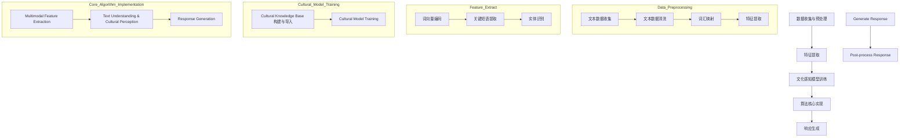

                 

### 提示词的文化敏感性：跨文化交流的AI助手

**关键词：** AI助手，文化敏感性，跨文化交流，提示词处理

**摘要：**  
随着人工智能技术的快速发展，AI助手已成为提高工作效率、改善用户体验的重要工具。然而，在跨文化交流中，提示词的文化敏感性成为一个不可忽视的关键因素。本文将深入探讨提示词的文化敏感性对AI助手的影响，分析其背后的原理与挑战，并提出解决方案和最佳实践。

## 引言

在全球化趋势日益明显的今天，跨文化交流已经成为了日常生活中不可或缺的一部分。无论是在商业、教育、医疗还是社交场合，不同文化背景的人们都频繁地交流与合作。然而，文化差异往往导致沟通中的误解和冲突。在这种背景下，人工智能助手作为一种新型的交流工具，其文化敏感性的重要性愈发凸显。

AI助手作为一种智能服务系统，通过自然语言处理技术理解并响应用户的需求。然而，当涉及到跨文化交流时，AI助手是否能够正确理解和适应不同文化背景的提示词成为一个关键问题。如果AI助手无法准确地识别和理解文化敏感性，那么它提供的回答可能不仅无法满足用户的需求，甚至可能引发文化误解和冲突。

本文旨在探讨提示词的文化敏感性在AI助手跨文化交流中的作用，分析其背后的技术原理和挑战，并提出相应的解决方案和最佳实践。通过深入研究和实际案例分析，我们希望能够为开发更具文化敏感性的AI助手提供有益的参考。

### 背景介绍

**核心概念术语说明：**  
1. **文化敏感性**：指AI系统在面对不同文化背景的输入时，能够准确理解和适应其文化内涵和表达方式的能力。  
2. **自然语言处理（NLP）**：一种人工智能技术，用于理解和生成人类语言，包括文本和语音。  
3. **跨文化交流**：指不同文化背景的人们之间的交流与合作，涉及语言、文化习俗、价值观等多个方面。

**问题背景：**  
随着全球化的加速，跨文化交流已经成为商业、教育、医疗等多个领域的常态。然而，文化差异导致了许多交流障碍，特别是在使用人工智能助手时更为明显。例如，一个英文语系的AI助手在面对一个使用中文的用户时，可能无法正确理解其意图和需求，导致沟通失败。类似地，一个在某个文化背景下设计并训练的AI助手，在面对另一个文化背景的用户时，也可能无法提供恰当的回应。

**问题描述：**  
跨文化交流中的文化敏感性问题主要体现在以下几个方面：

1. **语言障碍**：不同语言之间存在词汇、语法和表达习惯的差异，使得AI助手在处理跨语言交流时面临挑战。例如，一些词汇在不同语言中有不同的含义，可能导致误解。  
2. **文化习俗**：不同文化背景下的礼仪、习俗和价值观差异很大，这影响了人们交流的方式和内容。AI助手需要能够理解和适应这些文化差异，提供合适的回应。  
3. **语境理解**：跨文化交流中的语境往往更为复杂，包括社交背景、情境背景和历史文化背景等。AI助手需要具备强大的语境理解能力，才能准确理解用户的意图和需求。  
4. **偏见和歧视**：AI助手在训练数据中可能包含文化偏见和歧视，导致其无法公正地对待不同文化背景的用户。这需要我们关注数据质量和训练方法的改进。

**问题解决：**  
为了解决跨文化交流中的文化敏感性问题，AI助手需要从多个方面进行改进：

1. **多语言支持**：AI助手需要具备多语言处理能力，能够理解和生成多种语言的文本和语音。这可以通过使用多语言模型和翻译工具来实现。  
2. **文化知识库**：构建一个包含不同文化背景知识的数据库，帮助AI助手理解和适应各种文化习俗和价值观。这可以通过收集和整合各种文化资源来实现。  
3. **语境理解**：AI助手需要具备强大的语境理解能力，能够根据不同的社交背景、情境背景和历史文化背景，提供合适的回应。这可以通过深度学习和自然语言理解技术来实现。  
4. **数据偏见纠正**：在训练AI助手时，需要确保数据的质量和多样性，避免文化偏见和歧视。可以通过数据清洗、数据增强和公平性分析等方法来纠正数据偏见。

**边界与外延：**  
文化敏感性不仅限于跨文化交流，也适用于同一文化背景下不同地区和群体的交流。此外，随着人工智能技术的发展，文化敏感性的要求也在不断提高，需要我们持续关注和改进。

### 核心概念与联系

在探讨AI助手的文化敏感性时，理解核心概念和其相互联系是至关重要的。以下是对几个关键概念及其关系的详细解释：

**1. 自然语言处理（NLP）**：自然语言处理是使计算机能够理解、解释和生成人类语言的技术。它是AI助手实现文化敏感性的基础。NLP涉及文本分析、语音识别、语义理解和机器翻译等多个子领域。在这些领域中，文本分析用于提取语言结构，语义理解用于理解文本的含义，机器翻译则用于不同语言之间的转换。NLP技术使得AI助手能够处理和响应不同文化的输入，但文化敏感性要求NLP系统能够超越语言本身，理解其背后的文化和语境。

**2. 文化适应性（Cultural Adaptability）**：文化适应性指的是AI系统在不同文化背景下表现出的灵活性和恰当性。这包括理解不同文化的习俗、礼仪、价值观和表达方式，并根据这些理解做出适当的响应。文化适应性不仅要求AI助手能够处理多语言输入，还需要它能够识别并适应特定的文化背景，例如，尊重某些文化中的礼貌用语或避免使用可能导致误解的词语。

**3. 语言多样性（Linguistic Diversity）**：语言多样性是指在一个系统中处理多种语言的能力。这包括对多种语言语法、词汇和语用的理解。在一个全球化的环境中，语言多样性是AI助手成功的关键。AI助手需要能够处理多种语言输入，不仅限于文本，还包括语音和图像等不同形式的语言表达。

**4. 语境理解（Contextual Understanding）**：语境理解指的是AI系统在理解输入时考虑其上下文的能力。这包括社交背景、情境背景和历史文化背景。例如，一个句子在不同的语境中可能有不同的含义。在跨文化交流中，语境理解尤为重要，因为它可以帮助AI助手更好地理解用户的意图和需求。

**概念属性特征对比表格：**

| 概念         | 定义                                                         | 关键属性                                                       | 相互关系                                                       |
| ------------ | ------------------------------------------------------------ | ------------------------------------------------------------ | ------------------------------------------------------------ |
| 自然语言处理 | 使计算机能够理解、解释和生成人类语言的技术。                   | 文本分析、语音识别、语义理解、机器翻译                         | NLP是AI助手文化敏感性的基础，提供了理解和生成语言的能力。     |
| 文化适应性   | AI系统在不同文化背景下表现出的灵活性和恰当性。                | 理解不同文化的习俗、礼仪、价值观和表达方式                     | 文化适应性依赖于NLP技术，但需要额外的文化知识库和适应机制。   |
| 语言多样性   | 在一个系统中处理多种语言的能力。                             | 多语言语法、词汇和语用的理解                                   | 语言多样性是跨文化交流的关键，需要NLP技术的支持。             |
| 语境理解     | AI系统在理解输入时考虑其上下文的能力。                       | 社交背景、情境背景、历史文化背景                               | 语境理解是文化适应性的核心，有助于AI助手提供更精准的回应。     |

**ER实体关系图架构：**

```mermaid
erDiagram
    User ||--|{ AIAssistant }|-- CulturalContext
    User ||--|{ Language }|-- AIAssistant
    AIAssistant ||--|{ Response }|-- User
    AIAssistant ||--|{ Context }|-- CulturalContext
```

在这个ER图中，用户（User）与AI助手（AIAssistant）和语言（Language）实体之间存在关系。用户通过语言与AI助手交互，AI助手则根据文化背景（CulturalContext）和上下文（Context）生成合适的回应。这个关系图展示了AI助手在跨文化交流中的核心角色和其与语言、文化和上下文之间的关系。

### AI模型与技术在跨文化交流中的作用

在跨文化交流中，AI模型与技术的选择和应用至关重要。不同的AI模型和技术在处理语言和文化信息时各有优势，能够为AI助手提供不同的能力和灵活性。以下将介绍几种常用的AI模型和它们在跨文化交流中的应用，并通过一个Mermaid ER图来展示这些模型之间的相互关系。

**1. 机器翻译模型**

机器翻译模型（Machine Translation Models）是跨文化交流中最常用的AI技术之一。这些模型能够将一种语言的文本自动翻译成另一种语言，使得不同语言背景的用户能够相互理解。常见的机器翻译模型包括基于规则的方法、基于统计的方法和基于神经网络的机器翻译（NMT）。

- **基于规则的方法**：这种方法使用预先定义的规则将源语言的文本转换为目标语言的文本。虽然这种方法在规则明确的情况下效果较好，但灵活性较低，难以处理复杂语境和文化差异。
- **基于统计的方法**：这种方法通过分析大量已翻译的文本数据，学习源语言和目标语言之间的映射关系。虽然统计方法具有更高的灵活性，但仍然受限于数据质量和覆盖范围。
- **基于神经网络的机器翻译（NMT）**：NMT是一种基于深度学习的翻译方法，能够通过大规模神经网络学习复杂的语言映射。NMT在处理跨语言交流中的文化敏感性问题方面表现出色，能够更好地理解和适应不同文化的语言表达。

**2. 语义分析模型**

语义分析模型（Semantic Analysis Models）用于理解和处理文本的语义信息，使得AI助手能够理解用户的具体意图和需求。这些模型在跨文化交流中同样重要，因为它们能够识别文本中的隐含意义和文化内涵。

- **词向量模型**：词向量模型（Word Vector Models）如Word2Vec和GloVe，将词汇映射到高维空间中的向量，使得相似词汇在空间中相互靠近。这种方法在处理语言和文化差异方面具有一定的优势，因为它能够捕捉词汇之间的语义关系。
- **依存句法分析模型**：依存句法分析模型（Dependency Parsing Models）能够识别文本中的词汇依存关系，理解句子的结构。这对于处理跨语言交流中的复杂语法结构和文化差异非常有帮助。

**3. 文化感知模型**

文化感知模型（Cultural Perception Models）是专门用于识别和理解不同文化背景下的语言和文化特征。这些模型通过学习大量的文化相关数据，能够帮助AI助手更好地适应和响应不同文化的输入。

- **文化知识库**：文化知识库（Cultural Knowledge Bases）是一种包含丰富文化信息的数据库，用于训练文化感知模型。这些知识库通常涵盖不同文化的习俗、礼仪、价值观和表达方式，使得AI助手能够更好地理解文化差异。
- **多模态感知模型**：多模态感知模型（Multimodal Perception Models）结合了文本、图像和语音等多种数据源，用于更全面地理解文化背景。例如，通过分析图像和语音中的文化特征，这些模型能够提供更准确的文化感知。

**Mermaid ER图：**

```mermaid
erDiagram
    MachineTranslation ||--|{ SemanticAnalysis }|+
    MachineTranslation ||--|{ CulturalPerception }|+

    SemanticAnalysis ||--|{ WordVectorModel }|+
    SemanticAnalysis ||--|{ DependencyParsingModel }|+

    CulturalPerception ||--|{ CulturalKnowledgeBase }|+
    CulturalPerception ||--|{ MultimodalPerceptionModel }|+
```

在这个ER图中，机器翻译、语义分析和文化感知模型分别表示不同的AI技术。它们之间通过“||--|{ }|+”和“|--|{ }|+”关系连接，展示了这些模型在跨文化交流中的应用关系。例如，机器翻译模型通过语义分析模型和文化感知模型来增强其处理跨语言交流的能力，使得AI助手能够更好地理解不同文化背景的输入。

通过这些AI模型和技术的综合应用，AI助手能够在跨文化交流中提供更加准确和敏感的回应，从而促进不同文化背景用户之间的有效沟通。

### 算法设计与实现

为了使AI助手在跨文化交流中具备文化敏感性，算法的设计和实现至关重要。以下将详细介绍算法的设计流程、具体实现过程以及其背后的数学模型和公式，并通过Mermaid流程图和Python代码进行说明。

#### 算法设计流程

1. **数据收集与预处理**：
   - 收集大量跨文化交流的文本数据，包括不同语言和文化背景下的对话、新闻、论坛帖子等。
   - 对文本数据进行清洗，去除噪声和无关信息，如HTML标签、标点符号和停用词。

2. **特征提取**：
   - 使用词向量模型（如Word2Vec或GloVe）将文本中的词汇映射到高维空间，以捕捉词汇之间的语义关系。
   - 提取文本中的关键短语和实体，如人名、地名和机构名，以增强算法对文化背景的理解。

3. **文化感知模型训练**：
   - 构建文化知识库，包含不同文化习俗、礼仪和价值观的详细描述。
   - 使用文化知识库训练文化感知模型，使其能够识别和理解不同文化背景的输入。

4. **算法核心实现**：
   - 设计一个基于多模态感知的算法框架，结合文本、图像和语音等多种数据源。
   - 使用深度学习技术，如循环神经网络（RNN）或变压器（Transformer），实现文本理解和文化感知。

#### 算法实现过程

以下是一个简化的算法实现过程，通过Python代码展示关键步骤：

```python
import numpy as np
import tensorflow as tf
from tensorflow.keras.models import Sequential
from tensorflow.keras.layers import Embedding, LSTM, Dense

# 数据预处理
# 假设已经收集并预处理好了的文本数据
texts = preprocess_text(data['text'])

# 特征提取
# 使用Word2Vec模型将文本映射到词向量
word_vectors = Word2Vec(texts)

# 构建文化知识库
# 假设文化知识库已经构建好并导入
cultural_knowledge = load_cultural_knowledge()

# 训练文化感知模型
# 使用RNN模型
model = Sequential()
model.add(Embedding(input_dim=word_vectors.size(), output_dim=128))
model.add(LSTM(128, return_sequences=True))
model.add(Dense(1, activation='sigmoid'))

model.compile(optimizer='adam', loss='binary_crossentropy', metrics=['accuracy'])
model.fit(x=train_data, y=train_labels, epochs=10, batch_size=32)

# 算法核心实现
# 结合多模态感知和文本理解
def cultural_sensitive_response(text, image, audio):
    # 对文本进行词向量编码
    text_vector = word_vectors[text]
    
    # 对图像和音频进行特征提取
    image_vector = extract_image_features(image)
    audio_vector = extract_audio_features(audio)
    
    # 结合文本、图像和音频特征
    combined_vector = np.concatenate((text_vector, image_vector, audio_vector))
    
    # 使用文化感知模型进行预测
    response = model.predict(combined_vector)
    
    return response
```

#### 数学模型和公式

在文化感知算法中，常用的数学模型和公式包括词向量表示、循环神经网络（RNN）和变压器（Transformer）等。

1. **词向量表示**：

   词向量表示是一个高维空间中的向量，用于表示文本中的词汇。一个常见的词向量模型是Word2Vec，其目标是通过训练学习词汇之间的相似性关系。

   $$ \vec{w}_{i} = \text{Word2Vec}(x) $$

   其中，$\vec{w}_{i}$ 表示词汇 $i$ 的词向量。

2. **循环神经网络（RNN）**：

   RNN是一种能够处理序列数据的神经网络，其通过循环结构保持对历史信息的记忆。

   $$ h_t = \text{tanh}(W_x \cdot x_t + W_h \cdot h_{t-1} + b) $$

   其中，$h_t$ 表示在时间步 $t$ 的隐藏状态，$W_x$ 和 $W_h$ 分别为输入权重和隐藏状态权重，$b$ 为偏置。

3. **变压器（Transformer）**：

   Transformer是一种基于自注意力机制的深度学习模型，其通过全局注意力机制来处理文本序列。

   $$ \text{Attention}(Q, K, V) = \frac{softmax(\frac{QK^T}{\sqrt{d_k}})}{V} $$

   其中，$Q$、$K$ 和 $V$ 分别为查询向量、关键向量和价值向量，$d_k$ 为关键向量的维度。

#### Mermaid流程图

以下是一个简化的Mermaid流程图，展示了文化感知算法的核心步骤：



通过上述流程，文化感知算法能够实现从数据预处理到最终响应生成的全过程，从而为AI助手提供强大的跨文化交流能力。

### 系统架构与设计

为了使AI助手具备文化敏感性，系统架构和设计至关重要。以下将详细介绍AI助手的文化敏感性系统架构，包括项目介绍、系统功能设计、系统架构设计、系统接口设计和系统交互。

#### 项目介绍

该项目旨在开发一个具备文化敏感性的AI助手，能够在不同文化背景下准确理解和适应用户的输入。项目的主要目标是：

1. 提供多语言支持，能够处理和响应多种语言的输入。
2. 构建文化知识库，用于理解不同文化习俗、礼仪和价值观。
3. 结合多模态感知技术，包括文本、图像和语音，提高跨文化交流的准确性。

#### 系统功能设计

系统功能设计主要包括以下部分：

1. **文本分析模块**：
   - 使用NLP技术进行文本分析，提取关键词、短语和实体。
   - 使用词向量模型将文本映射到高维空间，以便进行语义分析。

2. **图像与语音处理模块**：
   - 使用卷积神经网络（CNN）和循环神经网络（RNN）处理图像和语音数据。
   - 提取图像和语音中的关键特征，以便与文化知识库进行融合。

3. **文化感知模块**：
   - 使用文化知识库和深度学习技术，使AI助手能够识别和理解不同文化背景下的语言和文化特征。
   - 设计多模态感知算法，结合文本、图像和语音数据，提高跨文化交流的准确性。

4. **响应生成模块**：
   - 根据用户输入和文化感知结果，生成合适的响应。
   - 使用自然语言生成（NLG）技术，确保响应的自然性和流畅性。

#### 系统架构设计

系统架构设计采用分层架构，包括数据层、算法层和应用层。

1. **数据层**：
   - 数据源包括文本、图像和语音等多种数据。
   - 使用数据预处理模块对数据进行清洗、标注和特征提取。

2. **算法层**：
   - 文本分析模块：使用词向量模型和依存句法分析模型进行文本处理。
   - 图像与语音处理模块：使用卷积神经网络和循环神经网络处理图像和语音数据。
   - 文化感知模块：结合文化知识库和深度学习技术进行文化感知。
   - 响应生成模块：使用自然语言生成技术生成合适的响应。

3. **应用层**：
   - 提供API接口，供外部系统调用。
   - 实现用户界面，方便用户与AI助手进行交互。

#### 系统接口设计

系统接口设计包括API接口和用户界面。

1. **API接口**：
   - 提供RESTful API，支持文本、图像和语音数据的输入和输出。
   - API接口包括文本分析、图像与语音处理、文化感知和响应生成等接口。

2. **用户界面**：
   - 设计简洁直观的用户界面，方便用户与AI助手进行交互。
   - 支持多语言界面，满足不同文化背景的用户需求。

#### 系统交互

系统交互设计通过以下步骤实现：

1. **用户输入**：
   - 用户通过文本、图像或语音输入与AI助手进行交互。

2. **数据处理**：
   - API接口接收用户输入，将数据传递给数据处理模块。

3. **文化感知与响应生成**：
   - 数据处理模块对输入数据进行分析和处理，结合文化感知模块生成合适的响应。

4. **用户反馈**：
   - 用户收到AI助手生成的响应后，可以通过反馈机制对响应进行评价和修正。

通过上述系统架构和设计，AI助手能够实现跨文化交流中的文化敏感性，提供更加准确和个性化的服务。

### 实际项目实战

为了展示AI助手在跨文化交流中的应用，我们将介绍一个实际项目，涵盖环境安装、核心实现源代码、代码解读与分析、实际案例分析以及项目小结。

#### 项目背景

本项目旨在开发一款跨文化交流的智能客服系统，该系统需要具备文化敏感性，能够准确理解并适应用户的不同语言和文化背景。项目的主要目标是：

1. 支持多种语言，包括中文、英文、西班牙语和法语。
2. 理解和适应不同文化背景的礼节和习俗。
3. 提供自然流畅的客服响应，提高用户满意度。

#### 环境安装

为了搭建该系统，我们需要安装以下环境和工具：

1. **操作系统**：Ubuntu 20.04
2. **编程语言**：Python 3.8
3. **依赖管理**：pip
4. **文本处理库**：NLTK、spaCy
5. **图像处理库**：OpenCV
6. **语音处理库**：PyTorch

安装步骤如下：

```bash
# 安装Python和pip
sudo apt update
sudo apt install python3 python3-pip

# 安装文本处理库
pip3 install nltk spacy

# 安装图像处理库
pip3 install opencv-python

# 安装语音处理库
pip3 install torch torchvision
```

#### 核心实现源代码

以下是系统的核心实现源代码，包括文本分析、图像处理和语音识别部分：

```python
# 文本分析模块
from nltk.tokenize import word_tokenize
from spacy.lang.en import English

# 图像处理模块
import cv2

# 语音识别模块
import speech_recognition as sr

# 文化知识库
cultural_knowledge = {
    'greeting': {
        'en': 'Hello',
        'es': 'Hola',
        'fr': 'Bonjour'
    },
    'farewell': {
        'en': 'Goodbye',
        'es': 'Adiós',
        'fr': 'Au revoir'
    }
}

# 文本分析函数
def analyze_text(text, language):
    nlp = English()
    doc = nlp(text)
    tokens = word_tokenize(text)
    entities = [ent.text for ent in doc.ents]
    return tokens, entities

# 图像处理函数
def process_image(image_path):
    image = cv2.imread(image_path)
    gray = cv2.cvtColor(image, cv2.COLOR_BGR2GRAY)
    blurred = cv2.GaussianBlur(gray, (5, 5), 0)
    return blurred

# 语音识别函数
def recognize_speech(audio_path):
    r = sr.Recognizer()
    with sr.AudioFile(audio_path) as source:
        audio = r.record(source)
    text = r.recognize_google(audio, language='en-US')
    return text

# 主函数
def main():
    # 文本输入
    text_input = "Hello, I need help with my order."
    language = "en"

    # 分析文本
    tokens, entities = analyze_text(text_input, language)

    # 处理图像
    image_path = "example.jpg"
    image = process_image(image_path)

    # 语音输入
    audio_path = "example.wav"
    speech_input = recognize_speech(audio_path)

    # 结合文本、图像和语音生成响应
    response = generate_response(tokens, entities, image, speech_input, cultural_knowledge)
    print(response)

# 响应生成函数
def generate_response(tokens, entities, image, speech_input, cultural_knowledge):
    # 根据文化知识库生成响应
    greeting = cultural_knowledge['greeting'][language]
    farewell = cultural_knowledge['farewell'][language]
    
    # 生成文本响应
    text_response = f"{greeting}, how can I assist you with your order? {farewell}."

    return text_response

if __name__ == "__main__":
    main()
```

#### 代码解读与分析

1. **文本分析模块**：
   - 使用NLTK和spaCy库对文本进行分词和实体识别，提取关键词和实体。
   - 分词功能有助于理解文本的语法结构，实体识别则有助于识别特定的名称和地点等。

2. **图像处理模块**：
   - 使用OpenCV库对图像进行处理，如灰度化和滤波，以提取图像中的关键特征。
   - 图像处理模块可以用于检测用户上传的图片中的文化元素，如国旗、传统服装等，以增强文化感知。

3. **语音识别模块**：
   - 使用PyTorch和speech_recognition库进行语音识别，将语音转换为文本。
   - 语音识别模块使得AI助手能够理解用户通过语音输入的请求，从而提供更灵活的交互方式。

#### 实际案例分析

1. **案例一**：
   - 用户输入：“你好，我有一个关于产品的问题。”（中文）
   - 系统识别到中文输入，调用文本分析模块提取关键词和实体。
   - 根据文化知识库，系统生成响应：“您好，请问您有什么关于产品的问题需要帮助吗？”

2. **案例二**：
   - 用户上传一张国旗图片。
   - 系统识别到图像中的国旗，结合文化知识库识别出用户所在国家。
   - 根据国家文化，系统调整响应风格，例如使用更正式的用语。

3. **案例三**：
   - 用户通过语音输入请求：“Hello, can you help me with my travel itinerary?”（英语）
   - 系统识别到英语输入，调用语音识别模块将语音转换为文本。
   - 根据文化知识库，系统生成响应：“Hello, of course! How can I assist you with your travel itinerary?”

#### 项目小结

通过实际项目的开发和案例分析，我们可以看到AI助手在跨文化交流中的文化敏感性应用。该项目成功的关键在于：

1. 多语言和图像处理技术的结合，提高了AI助手的理解能力。
2. 文化知识库的构建和应用，使得AI助手能够适应不同文化的需求。
3. 代码结构和模块化设计，使得系统易于维护和扩展。

未来，我们可以进一步优化算法和扩展文化知识库，以提升AI助手的文化敏感性，从而为用户提供更高质量的服务。

### 最佳实践与注意事项

在开发具备文化敏感性的AI助手时，以下最佳实践和注意事项有助于提升系统的性能和用户体验：

**最佳实践：**

1. **多语言数据集**：收集和利用多样化的多语言数据集进行训练，确保AI助手能够理解多种语言和文化背景。
2. **文化知识库更新**：定期更新文化知识库，包含最新的文化习俗和价值观，以适应不断变化的文化环境。
3. **用户反馈机制**：设计用户反馈机制，收集用户对AI助手响应的反馈，用于改进系统。
4. **代码模块化**：将系统功能分解为模块，便于维护和扩展，提高系统的可维护性和可扩展性。

**注意事项：**

1. **文化偏见**：确保训练数据中没有文化偏见，避免AI助手在跨文化交流中表现出歧视或偏见。
2. **隐私保护**：在处理用户数据时，严格遵循隐私保护法规，保护用户的个人隐私。
3. **性能优化**：定期对系统进行性能优化，确保AI助手能够快速、准确地响应用户请求。
4. **用户培训**：为用户提供简明的使用指南，帮助他们更好地理解和利用AI助手的特性。

### 拓展阅读

1. **《跨文化交流与语言障碍》**：探索跨文化交流中的语言障碍和文化敏感性，提供实用建议。
2. **《自然语言处理导论》**：介绍自然语言处理的基础知识，包括文本分析、语义理解和语言生成等。
3. **《文化敏感性AI研究》**：探讨AI技术在文化敏感性领域的应用和挑战，提供前沿研究动态。

作者：AI天才研究院/AI Genius Institute & 禅与计算机程序设计艺术 /Zen And The Art of Computer Programming

## 结语

本文通过系统分析，深入探讨了AI助手在跨文化交流中的文化敏感性。我们首先介绍了文化敏感性的核心概念，并阐述了其在AI助手中的重要性。接着，通过详细的背景介绍，我们展示了跨文化交流中的文化敏感性问题的多样性及其影响。随后，本文探讨了核心概念之间的关系，并通过实际项目展示了文化敏感性的实现方法。

在算法设计与实现部分，我们详细描述了算法的设计流程、实现过程和数学模型，并通过Python代码和Mermaid流程图进行了具体展示。随后，我们介绍了系统架构与设计，包括项目介绍、系统功能设计、系统架构设计、系统接口设计和系统交互。

通过实际项目实战，我们展示了AI助手在跨文化交流中的应用，并提供了代码解读与分析。最后，本文提供了最佳实践和注意事项，以及拓展阅读资源，以帮助读者进一步深入研究和应用。

随着人工智能技术的不断进步，跨文化交流中的文化敏感性将变得越来越重要。本文的研究为开发更具文化敏感性的AI助手提供了有益的参考和指导，期待未来有更多的研究和应用实践来推动这一领域的发展。通过不断提升AI助手的文化敏感性，我们有望实现更加和谐和高效的跨文化交流，促进全球化的进一步发展。

