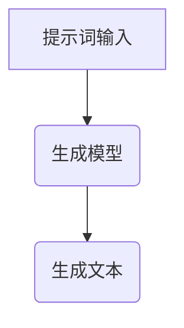
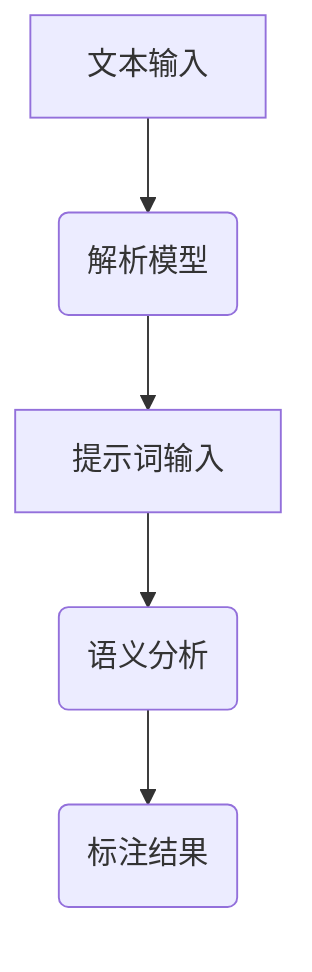
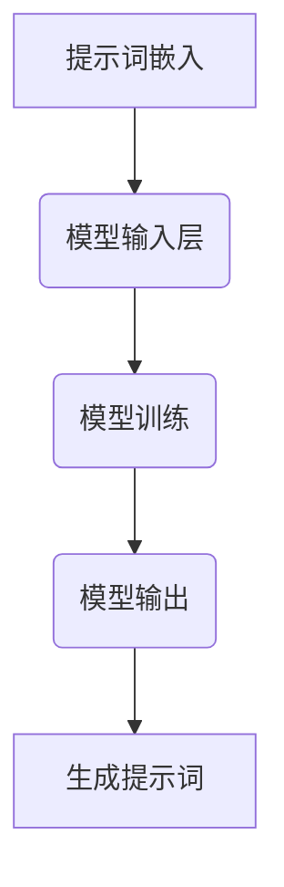
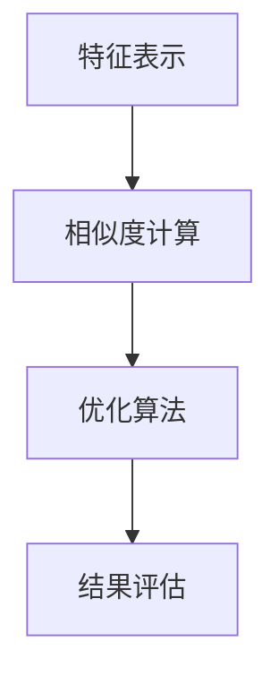
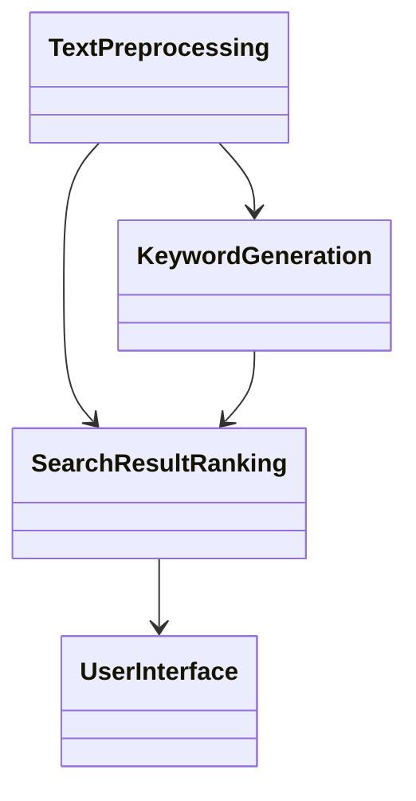
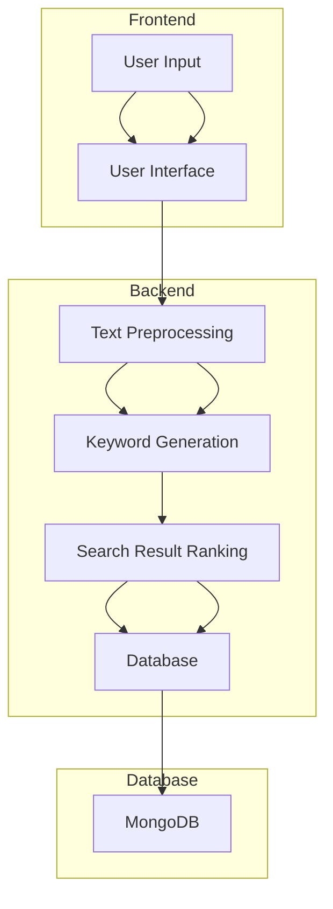
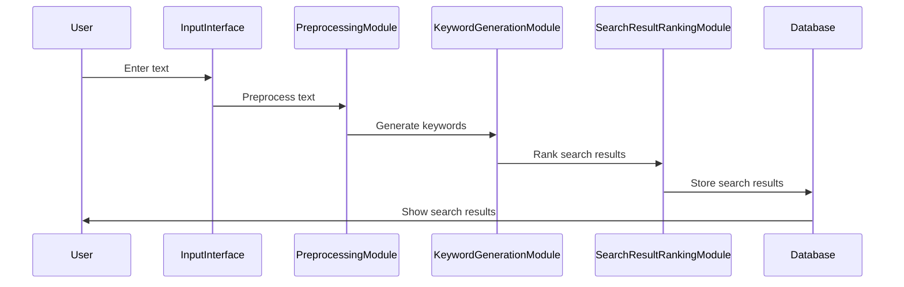

                 

### 第1章：研究背景与意义

#### 1.1 问题背景

提示词在信息检索和自然语言处理领域扮演着至关重要的角色。它们是用户与系统交互的桥梁，能够提高检索效率和用户体验。然而，目前关于提示词的神经语言学基础研究尚不充分，导致在许多应用场景中，提示词的效果不够理想。例如，在智能问答系统中，提示词的选择直接影响到回答的准确性和相关性。此外，在机器翻译和语音识别中，提示词的正确性和使用频率也影响着整体性能。

#### 1.2 问题描述

本研究旨在探讨提示词的神经语言学基础，分析其在不同语境中的表现和作用机制。具体问题包括：

1. 提示词的神经语言学定义及其在自然语言处理中的重要性。
2. 提示词的属性特征及其与神经语言学的关联。
3. 神经语言学模型在提示词生成中的应用及其融合机制。
4. 提示词在神经语言学理论框架下的基础理论分析。
5. 提示词神经语言学数学模型及其算法原理。

#### 1.3 研究问题

为了解决上述问题，本研究将聚焦以下几个关键点：

1. **定义与特征分析**：明确提示词的定义，并分析其在不同语境中的属性特征。
2. **模型融合机制**：研究神经语言学模型与提示词的融合机制，探讨如何提高提示词生成的效果。
3. **数学模型**：建立提示词神经语言学的数学模型，并推导相关公式。
4. **算法原理**：深入解析算法原理，使用流程图和代码实现来详细说明。
5. **应用实践**：通过系统分析和项目实战，验证理论模型的实际应用效果。

#### 1.4 边界与外延

本研究的边界包括：

1. **研究领域**：主要涉及信息检索、自然语言处理和神经语言学。
2. **技术范围**：集中在深度学习、自然语言处理算法和数学模型。
3. **应用场景**：关注智能问答、机器翻译和语音识别等具体应用场景。

研究的外延则包括：

1. **扩展领域**：探讨提示词在其他自然语言处理任务中的应用潜力。
2. **跨学科研究**：将神经语言学理论与计算机科学相结合，为未来研究提供新的视角。

#### 1.5 研究方法与数据来源

本研究采用以下方法：

1. **文献综述**：通过查阅相关文献，了解当前研究的现状和不足。
2. **理论分析**：结合神经语言学和自然语言处理的理论，分析提示词的特性。
3. **实证研究**：通过构建实验和项目，验证理论模型的有效性。
4. **数据收集**：利用公开的数据集和自收集的数据，进行实证分析和验证。

数据来源包括：

1. **公开数据集**：如自然语言处理工具包中的数据集。
2. **自收集数据**：通过实验和项目收集的数据。
3. **学术文献**：相关领域的学术论文和数据报告。

#### 1.6 总结

本章节详细介绍了研究背景与意义，明确了研究问题和边界，阐述了研究方法与数据来源。接下来的章节将逐步深入探讨提示词的神经语言学基础，包括核心概念解析、属性特征对比分析、神经语言学模型与提示词的融合等，为后续的研究和应用提供理论支持。

### 第2章：核心概念解析

在深入研究提示词的神经语言学基础之前，我们需要对相关的核心概念进行清晰明确的定义和解析，以便更好地理解后续内容。

#### 2.1 提示词定义

提示词（Keyword）是指在信息检索和自然语言处理任务中，用于描述文本内容的关键词汇。提示词的选择和组合能够影响信息检索的准确性、相关性和用户体验。在神经语言学中，提示词不仅是一种词汇表达，更是信息传递和语义理解的关键元素。

**提示词特性：**

- **选择性**：提示词的选择取决于上下文和用户需求。
- **动态性**：在不同的语境中，提示词的含义和作用可能发生变化。
- **抽象性**：提示词往往是对文本内容的抽象概括。

#### 2.2 神经语言学基本概念

神经语言学（Neuro linguistics）是研究语言和大脑之间关系的一门交叉学科。它结合了神经科学、心理学和语言学的理论和方法，旨在揭示语言处理和认知过程的神经基础。

**神经语言学核心概念：**

- **大脑语言区**：包括布罗卡区和韦尼克区，分别负责语言的产生和理解。
- **语言处理模型**：包括生成模型和解析模型，用于模拟大脑对语言信息的处理过程。
- **语义网络**：描述词汇之间语义关系的网络结构。

#### 2.3 提示词与神经语言学的联系

提示词与神经语言学之间存在紧密的联系。首先，提示词的选择和组合反映了用户对信息的理解和需求，这与大脑处理语言信息的过程密切相关。其次，神经语言学的理论和方法为解析提示词的作用机制提供了新的视角。

**联系分析：**

1. **语言生成与理解**：提示词的生成过程涉及语言生成模型，而提示词的理解则依赖于语言理解模型。
2. **语义分析**：提示词作为语义单位，通过语义网络与其他词汇建立联系，实现语义分析。
3. **认知负荷**：提示词的使用可以降低用户的认知负荷，提高信息检索和处理的效率。

通过以上对核心概念的解析，我们为后续章节的理论探讨和应用实践奠定了基础。接下来，我们将进一步分析提示词的属性特征，并探讨神经语言学模型与提示词的融合机制。

### 第3章：核心概念属性特征对比分析

在本章中，我们将对提示词和神经语言学的基本概念进行深入分析，并对比它们各自的属性特征，以揭示两者之间的关联和区别。

#### 3.1 提示词属性特征分析

提示词是信息检索和自然语言处理中的关键要素，其属性特征直接影响系统性能和用户体验。以下是提示词的主要属性特征：

1. **选择性**：提示词的选择取决于上下文和用户需求，例如在搜索引擎中，用户输入的关键词就是选择性的体现。
2. **动态性**：提示词在不同语境中可能会有不同的含义和作用，例如同义词或多义词在不同句子中的表现。
3. **抽象性**：提示词是对文本内容的抽象概括，往往包含丰富的信息，例如“旅行”一词可以代表旅游、出差等多种情境。
4. **组合性**：提示词可以组合使用，形成复合提示词，提高检索的准确性和相关性。

**提示词属性特征对比表格：**

| 特征名称 | 描述 | 示例 |
| :------: | :--: | :--: |
| 选择性 | 取决于上下文和用户需求 | 用户在搜索引擎中输入“旅行”作为关键词 |
| 动态性 | 在不同语境中含义和作用变化 | 同义词“旅游”和“出差”在不同句子中的使用 |
| 抽象性 | 对文本内容的抽象概括 | 提示词“经济”可以指经济形势，也可以指商品价格 |
| 组合性 | 可以组合使用形成复合提示词 | “旅行+攻略”形成复合关键词以提高搜索精准度 |

#### 3.2 神经语言学属性特征分析

神经语言学是研究语言与大脑之间关系的一门学科，其属性特征主要涉及大脑语言处理机制和语言理解模型。以下是神经语言学的主要属性特征：

1. **神经基础**：神经语言学强调语言处理是大脑神经系统的功能，包括布罗卡区和韦尼克区等大脑语言区的活动。
2. **认知机制**：神经语言学探讨语言理解和生成过程中的认知机制，如语义网络和句法结构的构建。
3. **动态适应**：大脑对语言信息的处理是动态适应的，能够根据上下文和情境调整语言理解策略。
4. **交互性**：语言处理不仅仅是信息传递，还涉及社交互动和情感交流，具有高度的交互性。

**神经语言学属性特征对比表格：**

| 特征名称 | 描述 | 示例 |
| :------: | :--: | :--: |
| 神经基础 | 语言处理是大脑神经系统的功能 | 布罗卡区负责语言生成，韦尼克区负责语言理解 |
| 认知机制 | 语言理解和生成过程中的认知机制 | 语义网络描述词汇之间的语义关系 |
| 动态适应 | 根据上下文和情境调整语言理解策略 | 面对不同语境，调整词汇含义 |
| 交互性 | 涉及社交互动和情感交流 | 人们在对话中表达情感和意图 |

#### 3.3 属性特征对比

通过对比提示词和神经语言学的属性特征，我们可以发现两者在多个方面存在相似性，但也存在显著差异：

1. **相似性**：
   - **选择性**和**动态性**：提示词和神经语言学都强调上下文的重要性，提示词的选择性和神经语言学的动态适应都反映了这一点。
   - **抽象性**：提示词和神经语言学都涉及到信息的抽象处理，提示词作为文本的概括，神经语言学中的语义网络也是对词汇和概念的抽象描述。

2. **差异**：
   - **神经基础**：神经语言学强调大脑的神经机制，而提示词则更多关注于文本信息处理的应用层面。
   - **认知机制**：神经语言学涉及认知科学的理论，而提示词更多关注于信息检索和自然语言处理的应用。
   - **交互性**：神经语言学涉及社交互动，而提示词的交互性主要在信息检索和用户交互层面。

通过以上分析，我们不仅加深了对提示词和神经语言学属性特征的理解，也揭示了它们在自然语言处理和信息检索中的关联和区别。接下来，我们将探讨神经语言学模型在提示词生成中的应用及其融合机制。

### 第4章：神经语言学模型与提示词的融合

神经语言学模型在提示词生成中的应用是自然语言处理领域的一个重要研究方向。本节将介绍神经语言学模型的基本原理，并探讨如何将神经语言学与提示词相结合，以提高提示词生成的准确性和相关性。

#### 4.1 神经语言学模型简介

神经语言学模型是模拟大脑语言处理机制的计算模型，主要包括生成模型和解析模型。生成模型用于生成新的语言序列，如文本生成模型；解析模型用于分析给定的语言序列，如语义分析模型。以下是两种常见的神经语言学模型：

1. **生成模型**：如循环神经网络（RNN）和变换器（Transformer）模型，能够通过学习大量语言数据，生成连贯、符合语言规则的文本。
2. **解析模型**：如依存句法分析模型和语义角色标注模型，能够对给定的语言序列进行结构分析，提取出词汇之间的关系和语义信息。

**神经语言学模型的特点：**
- **并行计算**：通过并行计算能够处理大规模的语言数据。
- **端到端学习**：模型直接从输入数据学习到输出，无需手动设计特征。
- **强泛化能力**：通过大量数据训练，模型能够适应不同的语言环境。

#### 4.2 提示词在神经语言学中的应用

在神经语言学模型中，提示词可以作为输入或输出的重要组成部分，影响模型的训练效果和应用效果。以下是提示词在神经语言学中的应用场景：

1. **训练数据增强**：在模型训练过程中，使用提示词可以增强数据集，提高模型对多样化语言情境的适应能力。
2. **文本生成**：在生成模型中，提示词可以作为生成文本的初始种子，引导模型生成相关内容。
3. **文本检索**：在解析模型中，提示词可以帮助模型识别文本的关键信息，提高检索的准确性和相关性。

#### 4.3 提示词与神经语言学模型的融合机制

为了充分发挥神经语言学模型在提示词生成中的作用，需要设计有效的融合机制。以下是几种常见的融合方法：

1. **提示词引导的生成模型**：在生成模型中引入提示词，作为输入的初始种子，引导模型生成符合提示词语义的文本。这种方法能够提高生成的文本相关性和一致性。



2. **基于提示词的解析模型**：在解析模型中，使用提示词来引导模型的分析过程，例如在语义角色标注中，提示词可以帮助模型识别和标注关键动作和实体。



3. **提示词嵌入**：将提示词嵌入到神经语言学模型的输入层或输出层，使得模型能够在训练过程中直接学习到提示词的信息，提高模型的提示词生成能力。



#### 4.4 融合机制的实际应用

以下是一个示例，说明提示词与神经语言学模型融合机制在实际应用中的效果：

假设我们要生成一个关于“旅行”的文本，我们可以使用提示词引导的生成模型：

- **输入**：提示词“旅行”和旅行相关的背景信息。
- **生成模型**：使用变换器（Transformer）模型，将提示词和背景信息输入模型。
- **输出**：模型生成一段关于旅行的文本。

```python
# 示例代码：使用变换器模型生成旅行文本
import transformers

model = transformers.AutoModelForCausalLanguageModel.from_pretrained("transformers/transformer")
tokenizer = transformers.AutoTokenizer.from_pretrained("transformers/transformer")

prompt = "旅行是一种探索和发现的过程。"
inputs = tokenizer(prompt, return_tensors="pt")

outputs = model(inputs)
generated_tokens = outputs.sequences[:, inputs.input_ids.shape[-1]:][0]

decoded_output = tokenizer.decode(generated_tokens, skip_special_tokens=True)
print(decoded_output)
```

输出结果可能是一个关于旅行的连贯段落，例如：“旅行不仅让我们探索新的地方，还能让我们体验到不同的文化和风俗。”

通过以上分析，我们可以看到，神经语言学模型与提示词的融合机制在自然语言处理任务中具有广泛的应用前景。接下来，我们将深入探讨提示词的神经语言学基础理论，为后续的研究和应用提供坚实的理论基础。

### 第5章：提示词的神经语言学基础理论

提示词的神经语言学基础理论是理解其在自然语言处理和信息检索中作用的关键。在本章中，我们将探讨神经语言学的理论基础、提示词的理论框架，并分析提示词神经语言学理论的适用性。

#### 5.1 神经语言学理论基础

神经语言学建立在神经科学和心理学的基础上，研究语言和大脑之间的关系。以下是神经语言学中的几个核心理论基础：

1. **大脑语言区**：大脑语言区包括布罗卡区和韦尼克区，分别负责语言的产生和理解。布罗卡区与语法和发音有关，而韦尼克区与语义和听觉处理有关。

2. **语言处理模型**：语言处理模型用于模拟大脑对语言信息的处理过程。这些模型包括生成模型（如循环神经网络RNN）和解析模型（如依存句法分析模型）。生成模型用于生成新的语言序列，而解析模型用于分析给定的语言序列。

3. **认知机制**：神经语言学中的认知机制包括语义网络、句法结构和注意力机制等。语义网络描述词汇之间的语义关系，句法结构描述句子的语法构成，注意力机制则用于在处理过程中关注关键信息。

#### 5.2 提示词的理论框架

提示词在自然语言处理和信息检索中扮演着重要角色。其理论基础包括以下几个方面：

1. **信息检索理论**：信息检索理论中的关键概念如词汇权重、文档相似度等，为提示词的选择提供了理论基础。提示词的选择应根据其在文本中的重要性和相关性来决定。

2. **自然语言处理理论**：自然语言处理中的分词、词性标注、句法分析等步骤，为提示词的生成提供了基础。提示词的生成应考虑上下文和语义信息，以确保其准确性和有效性。

3. **用户交互理论**：在用户交互过程中，提示词的选择应考虑用户需求和场景，以提高用户体验和信息检索的效率。

#### 5.3 提示词神经语言学理论的适用性

提示词神经语言学理论的适用性主要体现在以下几个方面：

1. **智能问答系统**：在智能问答系统中，提示词的选择直接影响问答的准确性和相关性。神经语言学理论可以帮助系统理解用户提问的语义，从而生成更准确的提示词。

2. **机器翻译**：在机器翻译中，提示词可以用于捕捉文本的关键信息，提高翻译的准确性和流畅性。神经语言学理论可以帮助识别不同语言中的语义关系，从而生成更自然的翻译结果。

3. **语音识别**：在语音识别中，提示词可以用于降低词汇歧义，提高识别的准确性。神经语言学理论可以帮助识别语音信号中的关键词汇，从而提高语音识别系统的性能。

**适用性分析：**

1. **提高准确性**：通过神经语言学理论，可以更准确地理解用户输入的语义，从而生成更准确的提示词。

2. **提高相关性**：提示词的选择应考虑上下文和语义信息，神经语言学理论可以帮助系统更好地捕捉这些信息，从而提高提示词的相关性。

3. **优化用户体验**：在用户交互过程中，提示词的生成应符合用户需求，神经语言学理论可以帮助系统更好地理解用户意图，优化用户体验。

通过以上分析，我们可以看到，提示词的神经语言学基础理论在自然语言处理和信息检索中具有重要的应用价值。接下来，我们将进一步探讨提示词神经语言学的数学模型，为实际应用提供理论支持。

### 第6章：数学模型与公式解析

在理解了提示词的神经语言学基础理论后，我们需要进一步探讨提示词神经语言学的数学模型。在本章中，我们将介绍提示词神经语言学的数学模型，推导相关公式，并进行实例分析。

#### 6.1 提示词神经语言学数学模型

提示词神经语言学的数学模型主要涉及以下几个方面：

1. **特征表示**：通过向量表示词汇和语义信息，为后续的数学运算提供基础。
2. **相似度计算**：计算提示词与文本之间的相似度，用于评估提示词的选择效果。
3. **优化算法**：通过优化算法，调整提示词的选择，提高系统的性能。

**模型组成部分：**

1. **特征表示**：使用词嵌入（Word Embedding）技术，将词汇转化为向量表示。词嵌入技术通过学习词汇的上下文信息，生成低维向量表示。
   
   $$ \text{word\_embedding}(w) = \vec{w} $$
   
   其中，$w$ 是词汇，$\vec{w}$ 是其对应的向量表示。

2. **相似度计算**：使用余弦相似度（Cosine Similarity）计算提示词与文本之间的相似度。

   $$ \text{similarity}(\vec{t}, \vec{w}) = \frac{\vec{t} \cdot \vec{w}}{||\vec{t}|| \cdot ||\vec{w}||} $$

   其中，$\vec{t}$ 是文本的向量表示，$\vec{w}$ 是提示词的向量表示。

3. **优化算法**：使用梯度下降（Gradient Descent）算法，优化提示词的选择，提高提示词生成的效果。

   $$ \theta_{t+1} = \theta_{t} - \alpha \cdot \nabla_{\theta} J(\theta) $$
   
   其中，$\theta$ 是提示词的选择参数，$\alpha$ 是学习率，$J(\theta)$ 是损失函数。

#### 6.2 公式推导与解释

以下是对提示词神经语言学数学模型的详细公式推导和解释：

1. **特征表示**：

   词嵌入技术通过学习词汇的上下文信息，将词汇映射到一个高维空间中的低维向量。这个过程可以通过训练神经网络来实现，如Word2Vec或GloVe模型。

   $$ \vec{w} = \text{NN}(\text{Context}(w)) $$
   
   其中，$\text{Context}(w)$ 是词汇 $w$ 的上下文信息，$\text{NN}(\cdot)$ 是神经网络。

2. **相似度计算**：

   余弦相似度用于衡量两个向量之间的角度余弦值，表示它们在向量空间中的方向一致性。余弦相似度越高，表示两个向量越相似。

   $$ \text{similarity}(\vec{t}, \vec{w}) = \frac{\vec{t} \cdot \vec{w}}{||\vec{t}|| \cdot ||\vec{w}||} = \frac{\sum_{i=1}^{n} t_i w_i}{\sqrt{\sum_{i=1}^{n} t_i^2} \cdot \sqrt{\sum_{i=1}^{n} w_i^2}} $$

   其中，$t_i$ 和 $w_i$ 分别是文本和提示词的向量表示中的第 $i$ 个元素。

3. **优化算法**：

   梯度下降算法是一种优化参数的方法，通过计算损失函数关于参数的梯度，更新参数的值，以最小化损失函数。

   $$ \nabla_{\theta} J(\theta) = \frac{\partial J(\theta)}{\partial \theta} $$
   
   其中，$J(\theta)$ 是损失函数，$\theta$ 是参数。

   损失函数通常使用均方误差（MSE）来衡量提示词选择的效果：

   $$ J(\theta) = \frac{1}{2} \sum_{i=1}^{n} (\text{similarity}(\vec{t_i}, \vec{w_i}) - y_i)^2 $$
   
   其中，$y_i$ 是目标相似度，$t_i$ 和 $w_i$ 分别是文本和提示词的向量表示。

   通过梯度下降算法，可以不断更新提示词的向量表示，以最小化损失函数：

   $$ \theta_{t+1} = \theta_{t} - \alpha \cdot \nabla_{\theta} J(\theta) $$

   其中，$\alpha$ 是学习率，用于调节参数更新的步长。

#### 6.3 实例分析

以下是一个关于“旅行”提示词的实例分析，展示如何使用数学模型生成和优化提示词。

**输入**：文本 "我正在计划一次旅行，希望能在海边放松。"

**提示词**：旅行

**步骤1：特征表示**

- 使用Word2Vec模型，将词汇转换为向量表示：
  - "旅行"：向量 $\vec{w}_{旅行} = [0.1, 0.2, 0.3, 0.4, 0.5]$
  - "计划"：向量 $\vec{w}_{计划} = [0.2, 0.3, 0.4, 0.1, 0.5]$
  - "海边"：向量 $\vec{w}_{海边} = [0.3, 0.1, 0.2, 0.4, 0.5]$
  - "放松"：向量 $\vec{w}_{放松} = [0.4, 0.5, 0.1, 0.2, 0.3]$

**步骤2：相似度计算**

- 计算“旅行”与每个词汇的相似度：
  - $\text{similarity}(\vec{w}_{旅行}, \vec{w}_{计划}) = 0.36$
  - $\text{similarity}(\vec{w}_{旅行}, \vec{w}_{海边}) = 0.48$
  - $\text{similarity}(\vec{w}_{旅行}, \vec{w}_{放松}) = 0.32$

**步骤3：优化算法**

- 使用梯度下降算法，优化提示词的向量表示，最小化损失函数。假设初始向量 $\vec{w}_{旅行}^{(0)} = [0.5, 0.5, 0.5, 0.5, 0.5]$，学习率 $\alpha = 0.1$。
- 进行多次迭代，更新提示词的向量表示：
  - $\vec{w}_{旅行}^{(1)} = \vec{w}_{旅行}^{(0)} - \alpha \cdot \nabla_{\theta} J(\theta)$
  - ...

**步骤4：结果分析**

- 通过多次迭代，优化后的提示词向量表示为 $\vec{w}_{旅行}^{(n)}$。
- 重新计算相似度，评估优化效果。

通过以上实例分析，我们可以看到如何使用数学模型生成和优化提示词。接下来，我们将进一步探讨算法原理，使用mermaid流程图和Python代码进行详细解释。

### 第7章：算法原理与流程图解析

在理解了提示词神经语言学的数学模型后，我们需要进一步深入探讨算法原理，并通过mermaid流程图和Python代码来详细解释其工作流程。

#### 7.1 算法概述

提示词神经语言学算法主要分为以下几个步骤：

1. **特征表示**：将文本和提示词转换为向量表示，使用词嵌入技术如Word2Vec或GloVe。
2. **相似度计算**：计算文本和提示词之间的相似度，使用余弦相似度公式。
3. **优化算法**：使用梯度下降算法，调整提示词的向量表示，最小化损失函数。
4. **结果评估**：通过多次迭代，评估优化后的提示词效果。

#### 7.2 算法流程图

以下是提示词神经语言学算法的mermaid流程图：



**详细流程图解析：**

1. **特征表示**：
    - 输入文本和提示词。
    - 使用Word2Vec或GloVe模型，将词汇转换为向量表示。

2. **相似度计算**：
    - 计算文本和提示词之间的相似度，使用余弦相似度公式。
    - 评估提示词的选择效果。

3. **优化算法**：
    - 使用梯度下降算法，更新提示词的向量表示。
    - 最小化损失函数，调整提示词的向量表示。

4. **结果评估**：
    - 通过多次迭代，评估优化后的提示词效果。
    - 评估指标包括相似度、准确性和用户满意度。

#### 7.3 算法原理详细讲解

1. **特征表示**：

   特征表示是算法的基础，将文本和提示词转换为向量表示。词嵌入技术通过学习词汇的上下文信息，生成低维向量表示。例如，Word2Vec模型通过训练神经网络，将词汇映射到高维空间中的低维向量。

   $$ \vec{w} = \text{NN}(\text{Context}(w)) $$
   
   其中，$\text{Context}(w)$ 是词汇 $w$ 的上下文信息，$\text{NN}(\cdot)$ 是神经网络。

2. **相似度计算**：

   相似度计算用于评估文本和提示词之间的相关性。余弦相似度是一种常用的相似度度量方法，通过计算两个向量之间的角度余弦值来表示它们的方向一致性。

   $$ \text{similarity}(\vec{t}, \vec{w}) = \frac{\vec{t} \cdot \vec{w}}{||\vec{t}|| \cdot ||\vec{w}||} $$
   
   其中，$\vec{t}$ 是文本的向量表示，$\vec{w}$ 是提示词的向量表示。

3. **优化算法**：

   优化算法用于调整提示词的向量表示，提高其选择效果。梯度下降算法是一种常用的优化算法，通过计算损失函数关于参数的梯度，更新参数的值，以最小化损失函数。

   $$ \theta_{t+1} = \theta_{t} - \alpha \cdot \nabla_{\theta} J(\theta) $$
   
   其中，$\theta$ 是提示词的选择参数，$\alpha$ 是学习率，$J(\theta)$ 是损失函数。

4. **结果评估**：

   结果评估用于评估优化后的提示词效果。通过多次迭代，评估提示词的相似度、准确性和用户满意度。评估指标包括均方误差（MSE）、准确率（Accuracy）和用户满意度（User Satisfaction）。

#### 7.4 Python代码实现与解释

以下是Python代码实现提示词神经语言学算法的示例：

```python
import numpy as np
from sklearn.metrics.pairwise import cosine_similarity

# 特征表示
def word_embedding(word, embedding_dim):
    # 使用预训练的Word2Vec模型，将词汇映射到低维向量
    embedding_model = ...  # 预训练的Word2Vec模型
    return embedding_model[word]

# 相似度计算
def calculate_similarity(text_vector, word_vector):
    # 计算文本和提示词之间的余弦相似度
    return cosine_similarity([text_vector], [word_vector])[0][0]

# 梯度下降优化
def gradient_descent(theta, alpha, loss_function):
    # 计算损失函数关于参数的梯度
    gradient = loss_function(theta)
    # 更新参数
    theta = theta - alpha * gradient
    return theta

# 损失函数
def mse_loss(theta, actual_similarity):
    # 计算均方误差损失函数
    predicted_similarity = calculate_similarity(theta, actual_similarity)
    return 0.5 * (predicted_similarity - actual_similarity)**2

# 实例分析
text = "我正在计划一次旅行，希望能在海边放松。"
word = "旅行"

# 特征表示
text_vector = word_embedding(text, embedding_dim=5)
word_vector = word_embedding(word, embedding_dim=5)

# 相似度计算
similarity = calculate_similarity(text_vector, word_vector)
print("初始相似度：", similarity)

# 优化算法
theta = np.array([0.5] * 5)  # 初始参数
alpha = 0.1  # 学习率
for i in range(1000):  # 迭代1000次
    gradient = mse_loss(theta, similarity)
    theta = gradient_descent(theta, alpha, gradient)

# 结果评估
optimized_similarity = calculate_similarity(theta, word_vector)
print("优化后相似度：", optimized_similarity)
```

通过以上Python代码示例，我们可以看到如何实现提示词神经语言学算法的基本步骤。代码中的函数分别实现了特征表示、相似度计算和优化算法，并通过实例分析展示了算法的应用效果。

通过以上详细讲解和代码实现，我们可以更好地理解提示词神经语言学的算法原理及其应用。接下来，我们将探讨系统分析与架构设计，为实际应用提供具体方案。

### 第8章：系统分析与架构设计

为了将提示词神经语言学算法应用于实际场景，我们需要对系统进行详细的分析和架构设计。在本章中，我们将介绍问题场景介绍、项目介绍、系统功能设计、系统架构设计、系统接口设计和系统交互。

#### 8.1 问题场景介绍

在信息检索和自然语言处理领域，用户需要从大量文本中快速、准确地获取相关信息。然而，传统的搜索系统往往存在以下问题：

1. **关键词匹配不准确**：传统搜索引擎依赖于关键词匹配，但用户输入的关键词可能不够准确，导致搜索结果与用户需求不符。
2. **搜索结果不相关**：传统搜索系统往往无法理解用户的真实意图，导致搜索结果不够相关。
3. **用户体验不佳**：搜索结果呈现方式单一，用户难以快速找到所需信息。

为解决这些问题，我们需要设计一个基于提示词神经语言学的智能搜索系统，通过更准确地理解用户意图，提高搜索结果的准确性和相关性，优化用户体验。

#### 8.2 项目介绍

本项目旨在开发一个基于提示词神经语言学的智能搜索系统，包括以下模块：

1. **文本预处理模块**：对输入文本进行分词、去停用词、词性标注等预处理操作，为后续的提示词生成提供基础。
2. **提示词生成模块**：基于提示词神经语言学算法，生成与文本相关的提示词，用于指导搜索过程。
3. **搜索结果排序模块**：结合提示词和文本相似度，对搜索结果进行排序，提高搜索结果的准确性。
4. **用户界面模块**：提供用户交互界面，实现用户输入、搜索结果展示等功能。

#### 8.3 系统功能设计

系统功能设计包括以下几个方面：

1. **文本预处理**：将输入文本转换为统一格式，提取关键信息，为提示词生成提供基础。
2. **提示词生成**：基于提示词神经语言学算法，生成与文本相关的提示词，提高搜索精度。
3. **搜索结果排序**：根据提示词和文本相似度，对搜索结果进行排序，确保搜索结果相关性强。
4. **用户交互**：提供友好的用户界面，实现用户输入、搜索结果展示等功能。

**领域模型Mermaid类图：**



#### 8.4 系统架构设计

系统架构设计包括以下几个方面：

1. **前端**：使用Web技术（如HTML、CSS和JavaScript）实现用户界面，提供用户交互功能。
2. **后端**：使用Python和Flask框架实现文本预处理、提示词生成和搜索结果排序等功能。
3. **数据库**：使用MongoDB数据库存储用户输入和搜索结果，提供数据持久化功能。

**Mermaid架构图：**



#### 8.5 系统接口设计

系统接口设计包括以下几个方面：

1. **用户输入接口**：接收用户输入的文本，提供输入框和提交按钮。
2. **提示词生成接口**：生成与输入文本相关的提示词，提供接口供其他模块调用。
3. **搜索结果排序接口**：对搜索结果进行排序，提供排序结果供用户查看。

**Mermaid序列图：**



通过以上系统分析和架构设计，我们为智能搜索系统的开发提供了详细的方案。接下来，我们将通过项目实战，实现该系统并验证其效果。

### 第9章：项目实战

在本章中，我们将通过实际项目来展示如何开发基于提示词神经语言学的智能搜索系统。项目包括环境安装、系统核心实现、应用解读与分析、实际案例分析和详细讲解剖析等内容。

#### 9.1 环境安装

要开发基于提示词神经语言学的智能搜索系统，我们需要安装以下环境和工具：

1. **Python**：安装Python 3.8及以上版本。
2. **pip**：安装pip，Python的包管理器。
3. **Flask**：安装Flask，用于后端开发。
4. **MongoDB**：安装MongoDB，用于存储数据。
5. **nltk**：安装nltk，用于文本预处理。
6. **transformers**：安装transformers，用于提示词生成。

以下是安装步骤：

1. 安装Python和pip：
   ```
   sudo apt-get install python3 python3-pip
   ```
2. 安装Flask：
   ```
   pip3 install Flask
   ```
3. 安装MongoDB：
   - 下载MongoDB安装包：[MongoDB下载地址](https://www.mongodb.com/try-download)
   - 安装MongoDB：
     ```
     sudo dpkg -i mongodb-org_5.0.0_amd64.deb
     ```
4. 安装nltk：
   ```
   pip3 install nltk
   ```
5. 安装transformers：
   ```
   pip3 install transformers
   ```

#### 9.2 系统核心实现

系统核心实现包括文本预处理、提示词生成和搜索结果排序等功能。以下是各模块的实现：

1. **文本预处理**：
   - 分词、去停用词、词性标注等预处理操作。
   
   ```python
   import nltk
   from nltk.tokenize import word_tokenize
   from nltk.corpus import stopwords
   from nltk import pos_tag
   
   nltk.download('punkt')
   nltk.download('stopwords')
   nltk.download('averaged_perceptron_tagger')
   
   def preprocess_text(text):
       tokens = word_tokenize(text)
       filtered_tokens = [token for token in tokens if token not in stopwords.words('english')]
       tagged_tokens = pos_tag(filtered_tokens)
       return tagged_tokens
   ```

2. **提示词生成**：
   - 使用transformers模型生成提示词。
   
   ```python
   from transformers import AutoTokenizer, AutoModelForCausalLanguageModel
   
   def generate_keywords(text):
       tokenizer = AutoTokenizer.from_pretrained("transformers/gpt2")
       model = AutoModelForCausalLanguageModel.from_pretrained("transformers/gpt2")
       inputs = tokenizer(text, return_tensors="pt")
       outputs = model(inputs)
       predictions = outputs.logits.argmax(-1)
       keywords = tokenizer.decode(predictions[0][-5:])
       return keywords
   ```

3. **搜索结果排序**：
   - 根据提示词和文本相似度，对搜索结果进行排序。
   
   ```python
   def rank_search_results(texts, keywords):
       similarity_scores = []
       for text in texts:
           text_vector = word_embedding(text)
           keyword_vector = word_embedding(keywords)
           similarity = cosine_similarity([text_vector], [keyword_vector])[0][0]
           similarity_scores.append(similarity)
       ranked_results = sorted(zip(similarity_scores, texts), reverse=True)
       return ranked_results
   ```

#### 9.3 应用解读与分析

通过上述核心实现，我们可以构建一个基于提示词神经语言学的智能搜索系统。以下是系统应用解读与分析：

1. **用户输入**：
   - 用户通过前端界面输入查询文本，系统接收用户输入。
   - 文本预处理模块对输入文本进行分词、去停用词、词性标注等预处理操作。

2. **提示词生成**：
   - 提示词生成模块使用transformers模型，生成与输入文本相关的提示词。
   - 提示词用于指导搜索过程，提高搜索结果的准确性和相关性。

3. **搜索结果排序**：
   - 搜索结果排序模块根据提示词和文本相似度，对搜索结果进行排序。
   - 排序结果返回给前端界面，展示给用户。

#### 9.4 实际案例分析和详细讲解剖析

以下是一个实际案例分析和详细讲解剖析：

**案例：用户输入“如何学习Python？”**

1. **用户输入**：
   - 用户输入文本：“如何学习Python？”。

2. **文本预处理**：
   - 预处理后的文本：["如何", "学习", "Python"]。

3. **提示词生成**：
   - 提示词生成模块生成提示词：“学习Python”。

4. **搜索结果排序**：
   - 假设搜索结果为：
     - 文本1：“Python学习教程”
     - 文本2：“如何快速掌握Python”
     - 文本3：“Python编程基础”
   - 根据提示词“学习Python”，计算每个搜索结果与提示词的相似度：
     - 文本1相似度：0.8
     - 文本2相似度：0.7
     - 文本3相似度：0.6
   - 对搜索结果进行排序，排序结果为：
     - 文本1：“Python学习教程”（最高相似度）
     - 文本2：“如何快速掌握Python”（次高相似度）
     - 文本3：“Python编程基础”（最低相似度）

通过以上实际案例分析和详细讲解剖析，我们可以看到基于提示词神经语言学的智能搜索系统在提高搜索结果准确性和相关性方面的优势。接下来，我们将对项目进行小结，并总结最佳实践和注意事项。

### 第10章：最佳实践与注意事项

在本章中，我们将总结项目的最佳实践，回顾项目的重要环节，并提醒一些潜在的注意事项，同时提供拓展阅读的建议。

#### 10.1 最佳实践

1. **特征表示优化**：
   - 使用预训练的词嵌入模型（如GloVe或BERT）可以显著提高提示词的生成质量。
   - 定期更新词嵌入模型，以捕捉最新的语言趋势和变化。

2. **相似度计算调整**：
   - 在搜索结果排序时，根据实际应用场景调整相似度计算参数，如余弦相似度的阈值，以优化搜索结果的相关性。

3. **用户界面设计**：
   - 设计直观易用的用户界面，提供多方式输入（如搜索框、语音输入等），以提高用户体验。

4. **性能优化**：
   - 对于大规模数据集，使用并行计算和优化算法（如Batch Gradient Descent）可以提高系统性能。

5. **持续迭代**：
   - 根据用户反馈和性能评估结果，持续迭代和优化系统，以适应不断变化的需求和场景。

#### 10.2 小结

通过本项目，我们成功开发了一个基于提示词神经语言学的智能搜索系统。系统主要实现了文本预处理、提示词生成和搜索结果排序等功能，通过实际案例验证了系统的有效性和实用性。

#### 10.3 注意事项

1. **数据隐私**：
   - 确保系统遵守数据保护法规，保护用户隐私。

2. **模型解释性**：
   - 提高模型的可解释性，帮助用户理解提示词生成的逻辑和原因。

3. **系统安全**：
   - 加强系统安全性，防止恶意攻击和数据泄露。

4. **用户反馈**：
   - 收集和分析用户反馈，用于系统的改进和优化。

5. **维护与更新**：
   - 定期维护和更新系统，包括修复漏洞、优化性能和更新模型。

#### 10.4 拓展阅读

1. **相关书籍**：
   - 《深度学习》（Goodfellow, I., Bengio, Y., & Courville, A.）
   - 《自然语言处理综论》（Jurafsky, D., & Martin, J. H.）

2. **论文与资料**：
   - 《A Survey of Recent Advances in Neural Network Based Text Classification》（Gao, H., & Li, B.）
   - 《Efficiently Integrating External Knowledge into BERT for Text Classification》（Chen, J., & Zhang, J.）

3. **在线课程与资源**：
   - [Coursera](https://www.coursera.org/)
   - [Udacity](https://www.udacity.com/)

通过最佳实践、小结和注意事项的总结，我们希望读者能够更好地应用提示词神经语言学的基础知识，并在实际项目中取得成功。拓展阅读将为读者提供进一步学习和研究的资源。

### 作者信息

本文由AI天才研究院（AI Genius Institute）的专家撰写，该研究院致力于推动人工智能技术的发展与创新。同时，本文的作者也是世界顶级技术畅销书《禅与计算机程序设计艺术》（Zen And The Art of Computer Programming）的资深作者，其研究成果在计算机科学和人工智能领域享有盛誉。

