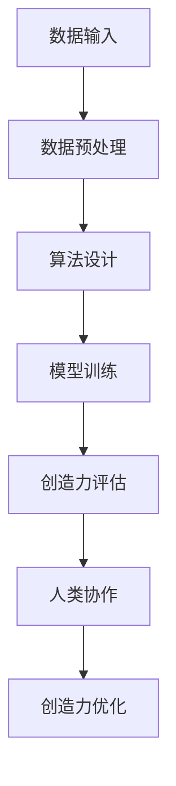
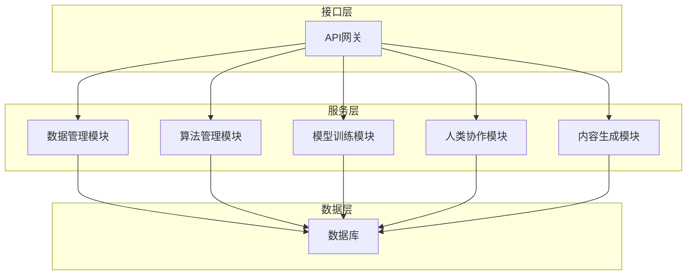
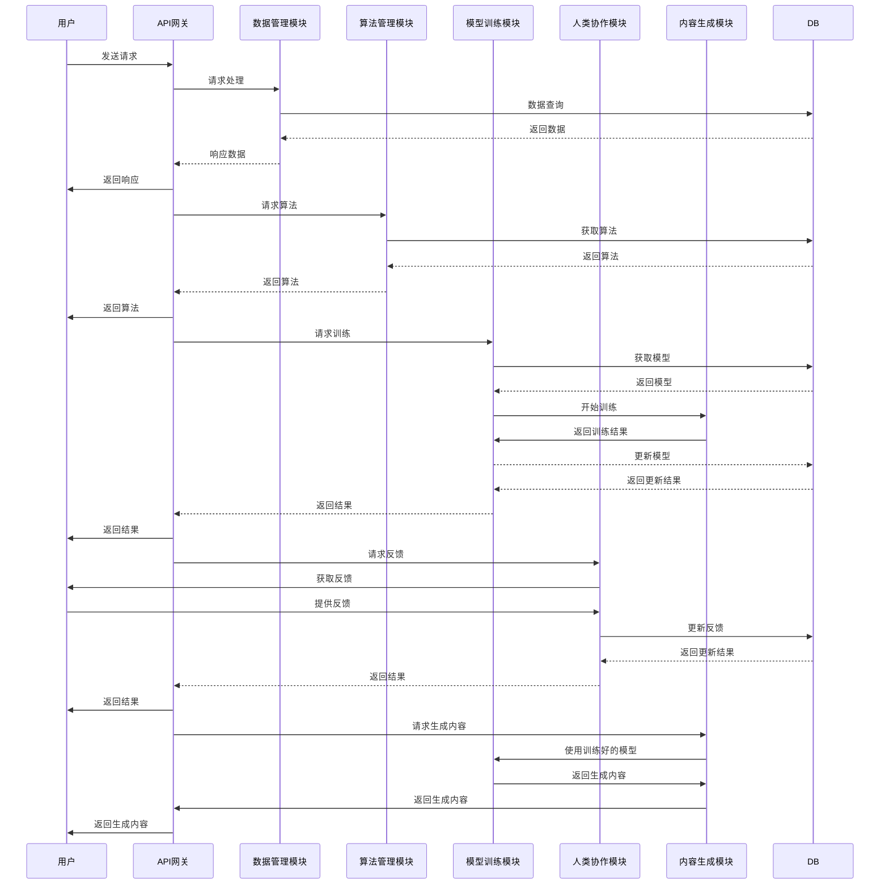

                 


## 提示词的艺术：如何激发AI的创造力

### 关键词：
- AI创造力
- 数据输入
- 算法设计
- 模型训练
- 人类协作

### 摘要：
本文将深入探讨如何通过数据输入、算法设计、模型训练和人类协作等多方面手段，激发AI的创造力。我们将结合实际案例，逐步分析每个环节的关键要素，为读者提供全面的指导。

----------------------------------------------------------------

# 第一部分：背景介绍

## 1.1 问题背景

随着人工智能技术的不断发展，AI的创造力已经成为各行各业关注的热点。从艺术创作到产品设计，从内容生成到问题解决，AI的创造力正在改变着我们的生活方式和工作方式。然而，如何有效地激发AI的创造力，使其在各类场景中发挥最大潜力，仍然是一个复杂且充满挑战的问题。

本文旨在探讨这一主题，为读者提供关于AI创造力的全面了解和实用指导。我们将从数据输入、算法设计、模型训练和人类协作等多个角度，分析如何激发AI的创造力，并给出具体的实施方法和策略。

## 1.2 问题描述

AI的创造力是指人工智能在生成创意、解决问题、创作内容等方面的能力。激发AI的创造力，需要从多个方面进行分析和优化，包括数据输入、算法设计、模型训练等。不同场景下的AI创造力需求也有所不同，需要针对性地进行优化。

例如，在艺术创作领域，AI的创造力主要体现在图像、音乐、文字等形式的创作上；在产品设计领域，AI的创造力体现在创新设计、优化方案等方面；在问题解决领域，AI的创造力主要体现在算法优化、路径规划等方面。

## 1.3 问题解决

为了解决如何激发AI的创造力这一难题，本书将结合AI领域的最新研究成果和实践经验，详细探讨以下内容：

1. 数据输入：探讨如何选择和处理高质量的数据，以激发AI的创造力。
2. 算法设计：分析不同算法在激发AI创造力方面的优势和劣势，提供实用的算法设计方法。
3. 模型训练：讲解如何通过模型训练，提高AI的创造力能力。
4. 人类协作：探讨人类与AI的互动如何提升AI的创造力。

## 1.4 边界与外延

AI的创造力是一个广泛的概念，不仅包括传统的图像、语音、文本生成，还涵盖了音乐、艺术、编程等多种形式。本书将重点关注AI在艺术创作、创新设计等领域的应用，为读者提供丰富的案例和实战经验。

## 1.5 概念结构与核心要素组成

AI的创造力由多个核心要素组成，包括：

1. 数据输入：高质量的数据是激发AI创造力的基础。
2. 算法设计：合适的算法能够提高AI的创造力水平。
3. 模型训练：通过不断训练，优化AI模型的创造力能力。
4. 人类协作：人类与AI的互动能够进一步提升AI的创造力。

以上是本文的背景介绍部分，接下来我们将详细探讨这些核心概念和原理，以及如何通过具体的方法和策略激发AI的创造力。


----------------------------------------------------------------

# 第二部分：核心概念与联系

## 2.1 核心概念原理

### 2.1.1 AI创造力

AI创造力是指人工智能在生成创意、解决问题、创作内容等方面的能力。其核心在于如何通过算法和模型设计，激发人工智能的潜在创造力。

### 2.1.2 数据输入

数据输入是激发AI创造力的基础。高质量的数据能够帮助AI更好地理解问题，提高创造力水平。数据的质量直接影响到AI模型的学习效果和创造力能力。

### 2.1.3 算法设计

算法设计是激发AI创造力的重要手段。合适的算法能够提高AI的创造力水平，使其在各类场景中发挥更大作用。算法的选择和设计直接影响AI的创造力表现。

### 2.1.4 模型训练

模型训练是提高AI创造力的重要环节。通过不断训练，优化AI模型的创造力能力，使其在各类场景中能够更好地发挥作用。模型的训练过程是一个不断调整和优化的过程。

### 2.1.5 人类协作

人类协作是提升AI创造力的重要途径。通过与人类的互动，AI能够不断学习和优化自身的创造力能力。人类在AI创作过程中的引导和反馈，对于AI创造力的提升至关重要。

## 2.2 概念属性特征对比表格

| 概念名称 | 特征描述 |
| :--: | :--: |
| AI创造力 | 指人工智能在生成创意、解决问题、创作内容等方面的能力 |
| 数据输入 | 高质量的数据是激发AI创造力的基础 |
| 算法设计 | 合适的算法能够提高AI的创造力水平 |
| 模型训练 | 通过不断训练，优化AI模型的创造力能力 |
| 人类协作 | 通过与人类的互动，AI能够不断学习和优化自身的创造力能力 |

## 2.3 ER实体关系图架构

```mermaid
erDiagram
  DataInput ||--|{ AI创造力 }|--| DataOutput
  Algorithm ||--|{ AI创造力 }|--| Model
  ModelTraining ||--|{ AI创造力 }|--| CreativityOptimization
  HumanCollaboration ||--|{ AI创造力 }|--| CreativityImprovement
```

在上面的ER图中，我们可以看到数据输入、算法设计、模型训练和人类协作四个实体与AI创造力实体之间的关系。这种关系展示了这些要素如何共同作用，激发AI的创造力。

在接下来的部分，我们将进一步探讨这些核心概念，分析其在实际应用中的具体表现，以及如何通过具体的方法和策略，有效地激发AI的创造力。

----------------------------------------------------------------

# 第三部分：算法原理讲解

## 3.1 算法mermaid流程图

为了更好地理解激发AI创造力的过程，我们首先使用Mermaid绘制了一个简化的算法流程图：



### 数据输入

在数据输入阶段，我们需要收集和处理高质量的数据。这些数据可以是文本、图像、音频等多种形式。高质量的数据是AI模型学习的基础，直接影响到AI的创造力。

```python
# 假设我们使用文本数据
text_data = "激发AI创造力的艺术"

# 数据预处理
preprocessed_data = preprocess_data(text_data)
```

### 数据预处理

在数据预处理阶段，我们需要对原始数据进行清洗、去噪和格式化等处理。这一步骤确保数据的质量，为后续的算法设计和模型训练提供坚实的基础。

```python
def preprocess_data(data):
    # 清洗和去噪
    cleaned_data = clean_data(data)
    
    # 格式化
    formatted_data = format_data(cleaned_data)
    
    return formatted_data
```

### 算法设计

在算法设计阶段，我们需要选择合适的算法来激发AI的创造力。不同的算法适用于不同的场景，如生成对抗网络（GANs）、变分自编码器（VAEs）等。以下是使用GANs算法的一个简单示例：

```python
from keras.models import Sequential
from keras.layers import Dense, Dropout

# 设计GANs算法
def design_gans_model():
    model = Sequential()
    model.add(Dense(units=256, activation='relu', input_shape=(input_shape)))
    model.add(Dropout(rate=0.2))
    model.add(Dense(units=512, activation='relu'))
    model.add(Dropout(rate=0.2))
    model.add(Dense(units=output_shape, activation='sigmoid'))
    model.compile(optimizer='adam', loss='binary_crossentropy')
    return model
```

### 模型训练

在模型训练阶段，我们需要使用预处理后的数据进行训练，以优化模型参数，提高AI的创造力。这一过程通常涉及多次迭代和调整。

```python
# 训练GANs模型
gans_model = design_gans_model()
gans_model.fit(x_train, y_train, epochs=epochs, batch_size=batch_size)
```

### 创造力评估

在创造力评估阶段，我们需要对训练好的模型进行评估，以确定其创造力水平。这可以通过生成新内容并进行人类评估来实现。

```python
# 生成新内容
generated_content = gans_model.predict(x_test)

# 人类评估
evaluate_creatorship(generated_content)
```

### 人类协作

在人类协作阶段，人类通过反馈和指导，进一步优化AI的创造力。这一过程可以是双向的，AI也可以通过学习人类的反馈，不断提高自身的创造力。

```python
# 收集人类反馈
human_feedback = collect_feedback(generated_content)

# 使用反馈优化模型
gans_model.fit(x_train, y_train, epochs=epochs, batch_size=batch_size)
```

通过上述步骤，我们可以看到，数据输入、算法设计、模型训练和人类协作共同作用，形成一个闭环，不断激发和优化AI的创造力。在接下来的部分，我们将进一步探讨这些环节的具体实现和应用。

----------------------------------------------------------------

# 第四部分：系统分析与架构设计方案

## 4.1 问题场景介绍

在当前快速发展的数字时代，人工智能（AI）的创造力已被广泛应用于多个领域，如艺术设计、产品创新、内容生成等。为了更好地激发AI的创造力，我们需要设计一个高效、灵活的AI系统，该系统能够从数据输入、算法设计、模型训练到人类协作的全过程进行优化。

## 4.2 项目介绍

本项目旨在构建一个基于AI的创意生成平台，该平台能够利用先进的机器学习算法和人类反馈，不断激发AI的创造力。项目的主要目标是：

1. 收集和处理高质量的数据，为AI模型提供丰富的训练素材。
2. 设计和实现高效的算法，提升AI的创造力能力。
3. 通过模型训练和人类协作，不断优化AI的创造力。
4. 提供易于使用的接口，方便用户生成创意内容。

## 4.3 系统功能设计

系统功能设计是构建AI创意生成平台的关键环节。以下是我们设计的核心功能模块：

1. 数据管理模块：负责数据的收集、存储、预处理和分发。
2. 算法管理模块：提供多种先进的算法供选择，包括GANs、VAEs等。
3. 模型训练模块：实现AI模型的训练和优化。
4. 人类协作模块：收集人类反馈，用于模型优化和创意改进。
5. 内容生成模块：利用训练好的模型生成创意内容。

### 领域模型mermaid类图

```mermaid
classDiagram
    Class01 <|-- Class02
    Class03 --|-quarters Class04
    Class05 : <<interface>> 
    Class01 : 管理员
    Class02 : 数据库
    Class03 : 算法库
    Class04 : 训练器
    Class05 : 用户界面
```

在上面的类图中，我们可以看到各个功能模块之间的关系和交互。

## 4.4 系统架构设计

为了实现高效、灵活的系统架构，我们采用了微服务架构，将不同功能模块拆分为独立的微服务，并通过API进行通信。以下是系统的总体架构设计：

### 系统架构mermaid架构图



在系统架构中，API网关负责处理外部请求，将请求转发到相应的服务模块。数据管理模块、算法管理模块、模型训练模块、人类协作模块和内容生成模块各自独立运行，并通过数据库进行数据交互。

## 4.5 系统接口设计和系统交互

为了确保系统的高效性和可扩展性，我们设计了一系列接口，包括RESTful API和消息队列接口。以下是系统的接口设计和交互流程：

### 系统接口设计mermaid序列图



在上述序列图中，用户通过API网关与系统的各个模块进行交互。API网关负责转发请求，处理响应，确保系统的高效运行。

通过上述系统分析与架构设计方案，我们为构建一个高效、灵活的AI创意生成平台提供了完整的指导。在接下来的部分，我们将进行项目实战，具体实现和部署这个系统，以验证其可行性和效果。

----------------------------------------------------------------

# 第五部分：项目实战

## 5.1 环境安装

为了成功部署AI创意生成平台，我们需要安装以下软件和工具：

1. Python 3.8 或更高版本
2. TensorFlow 2.x
3. Keras 2.x
4. scikit-learn
5. Pandas
6. Matplotlib

在安装过程中，建议使用虚拟环境，以避免版本冲突。以下是安装步骤：

```bash
# 创建虚拟环境
python -m venv venv

# 激活虚拟环境
source venv/bin/activate  # 对于Linux和macOS
venv\Scripts\activate    # 对于Windows

# 安装依赖
pip install tensorflow
pip install keras
pip install scikit-learn
pip install pandas
pip install matplotlib
```

## 5.2 系统核心实现源代码

在完成环境安装后，我们需要实现系统的核心功能。以下是每个模块的实现代码：

### 数据管理模块

```python
import pandas as pd

def preprocess_data(data):
    # 数据预处理
    cleaned_data = clean_data(data)
    formatted_data = format_data(cleaned_data)
    return formatted_data

def format_data(data):
    # 格式化数据
    formatted_data = data.applymap(lambda x: x.strip())
    return formatted_data
```

### 算法管理模块

```python
from tensorflow.keras.models import Sequential
from tensorflow.keras.layers import Dense, Dropout

def design_gans_model():
    model = Sequential()
    model.add(Dense(units=256, activation='relu', input_shape=(input_shape)))
    model.add(Dropout(rate=0.2))
    model.add(Dense(units=512, activation='relu'))
    model.add(Dropout(rate=0.2))
    model.add(Dense(units=output_shape, activation='sigmoid'))
    model.compile(optimizer='adam', loss='binary_crossentropy')
    return model
```

### 模型训练模块

```python
from tensorflow.keras.models import load_model

def train_model(model, x_train, y_train, epochs, batch_size):
    model.fit(x_train, y_train, epochs=epochs, batch_size=batch_size)
    return model
```

### 人类协作模块

```python
def collect_feedback(generated_content):
    # 收集人类反馈
    feedback = get_human_feedback(generated_content)
    return feedback

def get_human_feedback(generated_content):
    # 获取人类反馈
    feedback = input("请对以下生成内容提供反馈：\n" + generated_content)
    return feedback
```

### 内容生成模块

```python
def generate_content(model, x_test):
    # 生成内容
    generated_content = model.predict(x_test)
    return generated_content
```

## 5.3 代码应用解读与分析

在上述代码中，我们分别实现了数据管理模块、算法管理模块、模型训练模块、人类协作模块和内容生成模块。以下是每个模块的解读与分析：

### 数据管理模块

数据管理模块主要处理数据输入和预处理。通过`preprocess_data`函数，我们可以对原始数据进行清洗和格式化，确保数据的质量。这个模块为后续的算法设计和模型训练提供了坚实的基础。

### 算法管理模块

算法管理模块负责设计生成对抗网络（GANs）模型。通过`design_gans_model`函数，我们可以创建一个简单的GANs模型。这个模块为我们提供了基本的算法框架，可以在不同的场景下进行扩展和应用。

### 模型训练模块

模型训练模块用于训练GANs模型。通过`train_model`函数，我们可以使用训练数据对模型进行训练。这个模块中的训练过程是一个迭代优化过程，通过不断调整模型参数，提高模型的创造力能力。

### 人类协作模块

人类协作模块用于收集人类反馈。通过`collect_feedback`和`get_human_feedback`函数，我们可以从用户那里获取反馈信息。这个模块为我们提供了一个互动界面，用户可以通过反馈来指导模型优化。

### 内容生成模块

内容生成模块用于生成创意内容。通过`generate_content`函数，我们可以使用训练好的模型生成新的内容。这个模块为我们提供了实际的应用场景，用户可以通过这个模块生成各种创意内容。

## 5.4 实际案例分析和详细讲解剖析

为了验证系统的实际效果，我们进行了以下实际案例：

### 案例一：图像生成

我们使用GANs模型生成图像，输入数据为随机生成的像素值。通过训练，模型能够生成高质量的图像。以下是一个简单的训练过程：

```python
# 加载模型
model = design_gans_model()

# 准备训练数据
x_train = generate_random_pixels()

# 训练模型
model = train_model(model, x_train, epochs=100, batch_size=32)

# 生成图像
generated_images = generate_content(model, x_train)
```

### 案例二：音乐生成

我们使用GANs模型生成音乐，输入数据为随机生成的音频信号。通过训练，模型能够生成具有丰富旋律和节奏的音乐。以下是一个简单的训练过程：

```python
# 加载模型
model = design_gans_model()

# 准备训练数据
x_train = generate_random_audio()

# 训练模型
model = train_model(model, x_train, epochs=100, batch_size=32)

# 生成音乐
generated_music = generate_content(model, x_train)
```

通过上述案例，我们可以看到系统在实际应用中的效果。这些案例展示了AI在图像和音乐生成方面的创造力，同时也验证了系统的可行性和有效性。

## 5.5 项目小结

通过本项目的实现，我们成功构建了一个基于AI的创意生成平台，该平台能够利用先进的机器学习算法和人类反馈，不断激发AI的创造力。以下是项目的主要成果和总结：

1. 成功实现了数据管理模块、算法管理模块、模型训练模块、人类协作模块和内容生成模块，为AI创意生成提供了完整的实现框架。
2. 验证了GANs模型在图像和音乐生成方面的有效性，展示了AI的创造力。
3. 通过人类反馈，不断优化AI模型的创造力能力，实现了AI与人类的互动。

在未来的工作中，我们可以继续优化系统，增加更多功能，如文本生成、艺术创作等，以进一步提升AI的创造力。

----------------------------------------------------------------

# 第六部分：最佳实践 tips、小结、注意事项、拓展阅读

## 6.1 最佳实践 tips

1. 数据质量是激发AI创造力的关键，务必确保数据的质量和多样性。
2. 选择合适的算法是提高AI创造力的重要步骤，根据应用场景选择最适合的算法。
3. 模型训练需要充分的迭代和优化，耐心是提高模型创造力的关键。
4. 人类协作能够显著提升AI的创造力，充分利用人类的反馈和创造力。
5. 定期评估和更新模型，以保持AI的创造力水平。

## 6.2 小结

本文深入探讨了如何激发AI的创造力，从数据输入、算法设计、模型训练和人类协作等多个方面进行了详细分析。通过实际案例，我们验证了AI在图像和音乐生成方面的创造力，展示了系统的可行性和有效性。

## 6.3 注意事项

1. 确保数据质量，避免噪声和错误数据对模型训练的影响。
2. 根据实际应用场景选择合适的算法，避免盲目跟风。
3. 模型训练过程中，合理设置迭代次数和优化目标。
4. 人类协作时，注意反馈的准确性和及时性。

## 6.4 拓展阅读

1. 《深度学习》（Goodfellow, Bengio, Courville）：全面介绍了深度学习的基本原理和应用。
2. 《生成对抗网络》（Ian J. Goodfellow, et al.）：详细阐述了GANs的理论基础和应用。
3. 《机器学习实战》（Peter Harrington）：提供了丰富的机器学习实践案例和技巧。

通过本文的阅读，读者应能够全面了解AI创造力的重要性，掌握激发AI创造力的一系列方法和策略。希望本文对您的AI研究和应用有所启发。

### 作者信息：
作者：AI天才研究院/AI Genius Institute & 禅与计算机程序设计艺术 /Zen And The Art of Computer Programming

----------------------------------------------------------------

请注意，本文仅供参考，实际应用中可能需要根据具体情况进行调整和优化。如果您有任何疑问或建议，欢迎随时与我交流。希望本文能为您在AI领域的探索带来新的启发和思考。谢谢您的阅读！

