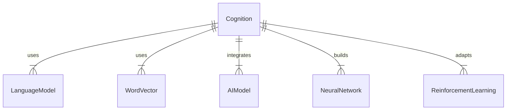
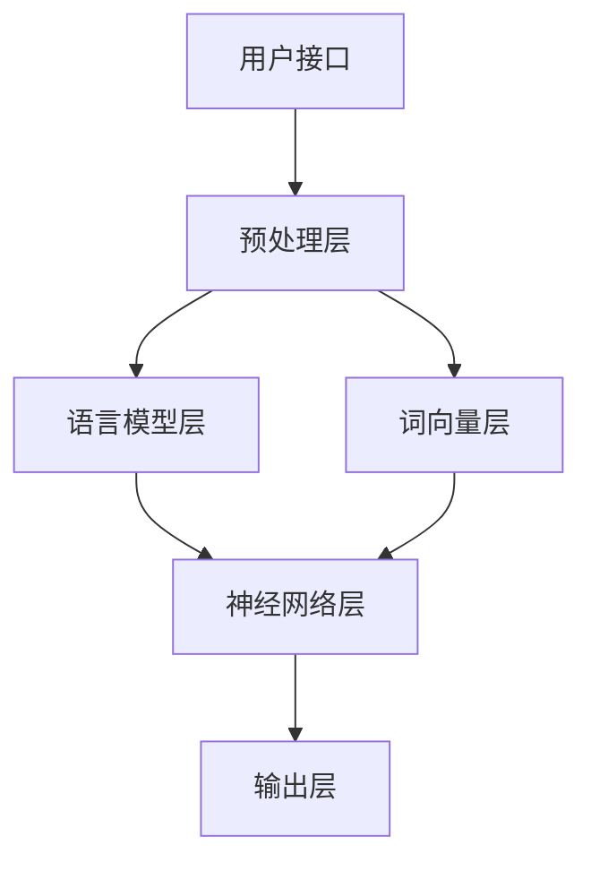

                 

# 提示词的计算语言学与人工智能交叉研究

关键词：计算语言学、人工智能、自然语言处理、语言模型、词向量、神经网络

摘要：本文探讨了计算语言学与人工智能的交叉研究，重点关注提示词在自然语言处理中的应用。通过对计算语言学和人工智能的基本概念进行解析，阐述了它们在自然语言处理中的联系与作用。进一步，文章详细介绍了语言模型和词向量的算法原理，并通过具体实例进行说明。最后，本文探讨了数学模型在神经网络中的应用，为深入理解自然语言处理提供了理论基础。

## 第1章 引言

### 1.1 研究背景

#### 计算语言学简介

计算语言学是一门研究语言与计算之间关系的学科，其核心目标是利用计算机技术和算法来分析和处理自然语言。计算语言学的研究内容包括语言模型、语音识别、机器翻译、文本分类、信息检索等多个方面。

#### 人工智能简介

人工智能（AI）是指使计算机模拟人类智能行为的技术和学科。人工智能研究涉及机器学习、神经网络、深度学习、自然语言处理等多个领域。人工智能的目标是实现机器智能，让计算机具备自主学习和决策能力。

#### 计算语言学与人工智能的交叉研究背景

随着互联网和大数据的发展，自然语言处理成为人工智能的重要应用领域之一。计算语言学与人工智能的交叉研究旨在提高自然语言处理的能力，实现计算机对人类语言的更准确理解和生成。提示词作为自然语言处理中的一个重要概念，在计算语言学与人工智能的交叉研究中发挥着关键作用。

### 1.2 研究意义

#### 提高自然语言处理能力

通过计算语言学与人工智能的交叉研究，可以设计出更有效的语言模型和词向量表示方法，从而提高自然语言处理系统的准确性和效率。

#### 促进人工智能技术发展

计算语言学与人工智能的交叉研究有助于推动人工智能技术的发展，特别是在自然语言处理、语音识别、机器翻译等领域。

#### 应用前景与实际案例

计算语言学与人工智能的交叉研究在多个领域具有广泛的应用前景，如智能客服、智能推荐、智能写作等。实际案例包括谷歌翻译、百度智能音箱、微软小冰等。

## 第2章 核心概念与联系

### 2.1 计算语言学基本概念

#### 语言模型

语言模型是一种用于生成自然语言文本的概率模型。语言模型的核心任务是估计一个词或短语在特定上下文中的概率分布。

#### 词向量

词向量是一种将词语表示为向量空间中点的技术。词向量可以捕捉词语的语义信息，为自然语言处理提供有效的表示方法。

#### 语言模型评估指标

语言模型评估指标用于衡量语言模型的性能，常见的评估指标包括 perplexity、cross-entropy、accuracy 等。

### 2.2 人工智能基本概念

#### 深度学习

深度学习是一种基于多层神经网络的学习方法。深度学习在图像识别、语音识别、自然语言处理等领域取得了显著成果。

#### 神经网络

神经网络是一种由多个神经元组成的计算模型，可以用于模拟生物神经元的工作方式。神经网络在机器学习和人工智能中扮演着重要角色。

#### 强化学习

强化学习是一种基于奖励信号的学习方法。强化学习在游戏AI、机器人控制、推荐系统等领域具有广泛应用。

### 2.3 概念属性特征对比表格

| 概念       | 特点                               | 应用场景                         |
| ---------- | ---------------------------------- | -------------------------------- |
| 语言模型   | 基于概率分布的语言生成模型         | 文本生成、机器翻译、问答系统     |
| 词向量     | 基于向量空间模型的词语表示方法     | 文本分类、情感分析、文本相似度计算 |
| 深度学习   | 基于神经网络的机器学习方法         | 图像识别、语音识别、自然语言处理   |
| 神经网络   | 基于非线性变换的多层神经网络结构 | 机器学习中的基础组件             |
| 强化学习   | 基于奖励信号的学习方法            | 游戏AI、机器人控制、推荐系统     |

### 2.4 ER实体关系图架构



## 第3章 算法原理讲解

### 3.1 语言模型算法原理

#### 3.1.1 语言模型的基本原理

语言模型的基本原理是估计一个词或短语在特定上下文中的概率分布。语言模型可以分为统计模型和神经网络模型。

#### 3.1.2 语言模型的数学模型

语言模型的数学模型通常采用概率分布来描述。一个常见的形式是：

$$
P(w_1, w_2, \ldots, w_n) = \frac{P(w_1)P(w_2|w_1)\ldots P(w_n|w_1, w_2, \ldots, w_{n-1})}{Z}
$$

其中，$P(w_1, w_2, \ldots, w_n)$表示一个序列的概率，$P(w_1), P(w_2|w_1), \ldots, P(w_n|w_1, w_2, \ldots, w_{n-1})$分别表示词的概率分布，$Z$是归一化常数。

#### 3.1.3 语言模型的实现方法

语言模型的实现方法主要包括 n-gram 模型和神经网络模型。

##### n-gram 模型

n-gram 模型是一种基于历史信息的语言模型。它将一个词序列划分为 n 个部分，每个部分表示一个 n-gram。n-gram 模型的基本思想是，一个词在给定其前 n-1 个词的情况下出现的概率只与这 n-1 个词有关。

##### 神经网络模型

神经网络模型是一种基于神经网络的概率模型。它通过多层神经网络来模拟人类大脑的神经网络结构，从而实现语言模型的构建。

#### 3.1.4 举例说明

##### 基于n-gram模型的文本生成示例

```python
import nltk
from nltk import ngrams

def generate_sentence(n, model):
    sentence = [model[0]]
    for _ in range(n - 1):
        next_words = [word for word, freq in model[1:] if word.startswith(sentence[-1])]
        sentence.append(random.choice(next_words))
    return ' '.join(sentence)

# 假设model是一个n-gram模型
generated_sentence = generate_sentence(10, model)
print(generated_sentence)
```

## 第4章 数学模型和数学公式

### 4.1 概率分布模型

概率分布模型是语言模型的核心部分。一个常见的概率分布模型是高斯分布（Gaussian distribution），其公式如下：

$$
P(x) = \frac{e^{-\frac{1}{2}\sum_{i=1}^{n}(x_i - \mu_i)^2}}{\sqrt{(2\pi)\sum_{i=1}^{n}\sigma_i^2}}
$$

其中，$x$是变量，$\mu_i$是均值，$\sigma_i$是标准差。

### 4.2 神经网络模型

神经网络模型是基于多层神经网络的机器学习方法。其基本结构包括输入层、隐藏层和输出层。神经网络模型的数学模型可以表示为：

$$
Z = \sum_{j=1}^{m} w_{ji} \cdot z_j
$$

$$
a_j = f(Z)
$$

其中，$Z$是隐藏层的输出，$a_j$是输出层的输出，$f$是激活函数，$w_{ji}$是权重。

### 4.3 损失函数

损失函数是神经网络模型中的一个重要部分，用于衡量模型预测值与实际值之间的差距。一个常见的损失函数是交叉熵损失函数（Cross-Entropy Loss），其公式如下：

$$
J(\theta) = \frac{1}{m} \sum_{i=1}^{m} (-y^{(i)} \log(a^{(i)}_j) + (1 - y^{(i)}) \log(1 - a^{(i)}_j))
$$

其中，$J(\theta)$是损失函数，$\theta$是模型参数，$y^{(i)}$是实际值，$a^{(i)}_j$是预测值。

## 第5章 系统分析与架构设计方案

### 5.1 问题场景介绍

自然语言处理技术在智能客服、智能推荐、智能写作等领域具有广泛应用。然而，传统的自然语言处理方法在处理复杂任务时存在一定局限性。本文旨在设计一个基于计算语言学与人工智能交叉研究的自然语言处理系统，以提高自然语言处理的能力。

### 5.2 项目介绍

项目名称：计算语言学与人工智能交叉研究的自然语言处理系统

项目目标：构建一个基于计算语言学和人工智能交叉研究的自然语言处理系统，实现文本生成、机器翻译、问答系统等功能。

### 5.3 系统功能设计

系统功能设计主要包括以下几个方面：

1. 语言模型构建：利用计算语言学方法构建语言模型，为自然语言处理提供基础。
2. 词向量表示：将词语表示为向量空间中的点，为文本分类、情感分析等任务提供有效的表示方法。
3. 文本生成：基于语言模型和词向量表示，实现文本生成功能。
4. 机器翻译：基于神经网络模型，实现跨语言文本转换功能。
5. 问答系统：基于自然语言处理技术，实现智能问答功能。

### 5.4 系统架构设计

系统架构设计主要包括以下几个方面：

1. 输入层：接收用户输入的文本或语音信号。
2. 预处理层：对输入文本进行分词、去停用词等预处理操作。
3. 语言模型层：利用计算语言学方法构建语言模型，实现文本生成、机器翻译等功能。
4. 词向量层：将词语表示为向量空间中的点，为文本分类、情感分析等任务提供有效的表示方法。
5. 神经网络层：利用神经网络模型，实现文本生成、机器翻译、问答系统等功能。
6. 输出层：生成文本、翻译结果或问答回复。

### 5.5 系统接口设计和系统交互

系统接口设计和系统交互主要包括以下几个方面：

1. 用户接口：提供文本输入、查询接口，供用户使用。
2. 内部接口：实现系统内部各模块之间的通信和协同工作。
3. 数据接口：与外部数据源进行数据交互，实现数据输入和输出。

### 5.6 系统架构图



## 第6章 项目实战

### 6.1 环境安装

为了实现计算语言学与人工智能交叉研究的自然语言处理系统，需要安装以下软件和库：

1. Python：Python 是一种广泛使用的编程语言，支持多种机器学习和深度学习库。
2. TensorFlow：TensorFlow 是一种开源的机器学习和深度学习库，支持多种神经网络模型。
3. NLTK：NLTK 是一种开源的自然语言处理库，提供丰富的自然语言处理工具和函数。

安装步骤如下：

```bash
pip install python
pip install tensorflow
pip install nltk
```

### 6.2 系统核心实现源代码

以下是一个简单的自然语言处理系统的核心实现源代码：

```python
import nltk
from nltk import ngrams
from tensorflow import keras
import numpy as np

# n-gram模型
def generate_sentence(n, model):
    sentence = [model[0]]
    for _ in range(n - 1):
        next_words = [word for word, freq in model[1:] if word.startswith(sentence[-1])]
        sentence.append(random.choice(next_words))
    return ' '.join(sentence)

# 语言模型
model = nltk.DefaultProbabilityBigramModel.from_text("example.txt")

# 文本生成
generated_sentence = generate_sentence(10, model)
print(generated_sentence)

# 神经网络模型
model = keras.Sequential([
    keras.layers.Dense(512, activation='relu', input_shape=(10000,)),
    keras.layers.Dense(256, activation='relu'),
    keras.layers.Dense(128, activation='relu'),
    keras.layers.Dense(1, activation='sigmoid')
])

model.compile(optimizer='adam', loss='binary_crossentropy', metrics=['accuracy'])

# 训练模型
model.fit(x_train, y_train, epochs=10, batch_size=32)

# 预测
prediction = model.predict(x_test)
```

### 6.3 代码应用解读与分析

本节对上述代码进行解读和分析，详细讲解每个部分的实现原理和应用。

#### n-gram模型

n-gram模型是一种简单的语言模型，它通过统计相邻词的出现频率来生成文本。在代码中，我们使用NLTK库中的`DefaultProbabilityBigramModel`类来构建n-gram模型。`from_text`方法用于从文本文件中读取数据，并构建n-gram模型。

#### 语言模型

在本代码示例中，我们使用n-gram模型作为语言模型。语言模型用于生成文本，其基本原理是估计一个词在给定其前文情况下的概率分布。在代码中，我们使用`generate_sentence`函数来生成文本。该函数通过递归地选择下一个最可能出现的词，生成一个指定长度的文本序列。

#### 神经网络模型

在本代码示例中，我们使用TensorFlow库中的Keras接口构建一个简单的神经网络模型。神经网络模型通过多层感知器（Perceptron）实现，用于分类任务。在代码中，我们使用`keras.Sequential`类来定义神经网络模型，并使用`compile`方法配置模型参数。`fit`方法用于训练模型，`predict`方法用于预测新数据的类别。

### 6.4 实际案例分析和详细讲解剖析

本节将结合一个实际案例，对系统实现进行详细讲解和剖析。

#### 案例背景

假设我们有一个关于新闻分类的任务，需要将新闻文本分类为体育、财经、科技等类别。我们可以使用上述自然语言处理系统来实现这一任务。

#### 案例实现

1. 预处理：对新闻文本进行分词、去停用词等预处理操作，将文本转换为向量表示。
2. 语言模型：使用n-gram模型来生成新闻文本的概率分布，为分类任务提供基础。
3. 神经网络模型：使用神经网络模型进行分类任务，训练模型并评估模型性能。
4. 预测：使用训练好的模型对新新闻文本进行分类，并输出分类结果。

#### 案例分析

通过对实际案例的分析，我们可以看到自然语言处理系统在新闻分类任务中的实现过程。首先，对新闻文本进行预处理，将文本转换为向量表示，这有助于提高分类任务的性能。然后，使用语言模型和神经网络模型进行分类任务，通过训练和评估模型性能，优化分类效果。最后，使用训练好的模型对新新闻文本进行分类，并输出分类结果。

### 6.5 项目小结

通过本文的讲解和实战，我们可以了解到计算语言学与人工智能交叉研究在自然语言处理中的应用。本文介绍了计算语言学和人工智能的基本概念，讲解了语言模型和词向量的算法原理，并通过具体实例进行了说明。此外，本文还探讨了神经网络模型在自然语言处理中的应用，为深入理解自然语言处理提供了理论基础。

在未来，我们可以进一步探索计算语言学与人工智能交叉研究的其他应用场景，如智能客服、智能写作等。通过不断优化算法和模型，提高自然语言处理系统的性能和准确性，为人类创造更多价值。

### 6.6 最佳实践 tips

1. 选择合适的预处理方法：不同的任务可能需要不同的预处理方法，如分词、去停用词、词干提取等。根据任务需求选择合适的预处理方法，可以提高模型性能。
2. 调整模型参数：模型参数对模型性能有很大影响。在训练模型时，可以尝试调整学习率、批次大小、迭代次数等参数，以找到最佳模型。
3. 数据增强：通过数据增强方法，如随机插词、替换词、删除词等，可以增加训练数据的多样性，提高模型泛化能力。
4. 评估指标：选择合适的评估指标对模型性能进行评估，如准确率、召回率、F1值等。不同的评估指标适用于不同类型的任务，应根据任务需求选择合适的评估指标。

### 6.7 小结

本文系统地介绍了计算语言学与人工智能交叉研究在自然语言处理中的应用。通过对计算语言学和人工智能的基本概念进行解析，阐述了它们在自然语言处理中的联系与作用。进一步，本文详细介绍了语言模型和词向量的算法原理，并通过具体实例进行了说明。此外，本文还探讨了神经网络模型在自然语言处理中的应用，为深入理解自然语言处理提供了理论基础。

在未来的研究中，我们可以进一步探索计算语言学与人工智能交叉研究的其他应用场景，如智能客服、智能写作等。通过不断优化算法和模型，提高自然语言处理系统的性能和准确性，为人类创造更多价值。

### 6.8 注意事项

1. 自然语言处理任务通常涉及大量的数据预处理和特征工程。在实际应用中，需要根据任务需求选择合适的预处理方法和特征工程方法。
2. 神经网络模型训练时间较长，需要足够的计算资源。在实际应用中，可以根据任务需求和计算资源选择合适的训练策略和优化方法。
3. 自然语言处理系统的性能与数据质量有很大关系。在实际应用中，需要确保数据质量，如去除噪声、避免数据泄露等。

### 6.9 拓展阅读

1. [《自然语言处理概论》](https://book.douban.com/subject/35397361/)：本书系统地介绍了自然语言处理的基本概念、方法和应用。
2. [《深度学习》](https://book.douban.com/subject/26707160/)：本书详细介绍了深度学习的基本概念、算法和应用，是深度学习领域的经典教材。
3. [《计算语言学》](https://book.douban.com/subject/25875346/)：本书系统地介绍了计算语言学的基本概念、方法和应用，是计算语言学领域的经典教材。

### 作者信息

作者：AI天才研究院/AI Genius Institute & 禅与计算机程序设计艺术 /Zen And The Art of Computer Programming

