                 

### 第1章：引言

#### 1.1 计算语言学与情感计算概述

计算语言学（Computational Linguistics，简称CL）是语言学和计算机科学交叉的领域，旨在使用计算机技术和算法对人类语言进行建模和分析。计算语言学的历史可以追溯到20世纪50年代，当时的科学家试图将自然语言处理（Natural Language Processing，简称NLP）视为人工智能的关键部分。计算语言学的主要任务包括语言分析、语言合成、语言理解等。语言分析包括词性标注、句法分析、语义分析等；语言合成涉及语音合成、文本生成等；语言理解则包括机器翻译、问答系统、情感分析等。

情感计算（Affective Computing，简称AC）是近年来兴起的交叉学科领域，它研究如何使计算机具备识别、理解和表达情感的能力。情感计算不仅仅关注情感识别，还涉及到如何使计算机更好地理解和适应用户的需求和情感状态。情感计算的历史可以追溯到20世纪90年代，麻省理工学院的罗德尼·布鲁克斯（Rodney Brooks）首次提出了情感计算的概念。近年来，随着深度学习和传感技术的发展，情感计算取得了显著进展。

#### 1.2 交叉研究的背景和意义

随着互联网的普及和社交媒体的兴起，人类产生了海量的文本数据。这些数据中包含了大量的情感信息，如何有效地分析和利用这些情感信息成为了一个重要课题。计算语言学和情感计算的交叉研究正是为了解决这一问题。通过将计算语言学的方法应用于情感分析，我们可以从大量的文本数据中提取出情感信息，为情感识别、情感分类、情感预测等应用提供支持。

交叉研究的意义在于：

1. **提高信息处理能力**：通过将计算语言学和情感计算相结合，可以更好地理解和处理情感丰富的文本数据，提高信息处理的精度和效率。
2. **丰富人工智能应用**：情感计算为人工智能带来了新的维度，使得AI系统能够更好地适应人类的需求和情感状态，提供更人性化的服务。
3. **促进社会科学研究**：通过对情感数据的分析，可以深入了解人类的情感状态和行为模式，为心理学、社会学等社会科学领域的研究提供新的视角和数据支持。

#### 1.3 研究方法和结构

本书的研究方法主要包括文献综述、案例分析、算法设计和实验验证。首先，通过对已有文献的综述，了解计算语言学和情感计算的发展历程、核心概念和最新研究动态。然后，通过具体的应用案例，展示计算语言学和情感计算如何结合，解决实际问题。接着，设计并实现相关的算法，详细阐述算法原理、数学模型和流程。最后，通过实验验证算法的性能，评估其在实际应用中的效果。

本书的结构分为七个章节，具体如下：

1. **第1章：引言**：介绍计算语言学和情感计算的基本概念，交叉研究的背景和意义，以及研究方法和结构。
2. **第2章：计算语言学基础**：介绍计算语言学的基本概念、历史发展和主要任务。
3. **第3章：情感计算基础**：介绍情感计算的基本概念、发展历程和主要应用。
4. **第4章：交叉研究方法与算法**：详细阐述计算语言学和情感计算的结合方法，介绍核心算法的原理、数学模型和流程。
5. **第5章：应用案例分析**：通过具体应用案例，展示计算语言学和情感计算在现实世界中的应用。
6. **第6章：未来趋势与展望**：展望计算语言学和情感计算的未来发展方向，探讨可能的未来应用。
7. **第7章：总结与展望**：总结研究成果，讨论存在的问题和挑战，以及未来的研究方向。

### 目录大纲设计思考过程：

**第一步：理解书籍主题**

《提示词的计算语言学与情感计算的交叉研究新进展》涉及两个核心领域：计算语言学和情感计算。结合书名中的“交叉研究新进展”，可以判断本书旨在探讨这两个领域如何相互结合，以及这种结合带来的新研究动态和成果。

**第二步：确定书籍结构**

1. **背景介绍**：介绍计算语言学和情感计算的基本概念，它们的发展历史，以及交叉研究的背景。
2. **核心概念与联系**：深入探讨计算语言学和情感计算的核心概念，它们之间的联系和区别。
3. **算法原理讲解**：详细介绍交叉研究中的关键算法，包括原理、数学模型和流程。
4. **应用案例分析**：展示具体的应用场景，如何将计算语言学与情感计算相结合解决实际问题。
5. **未来趋势与展望**：展望交叉研究的发展方向，探讨可能的未来应用。

**第三步：细化章节内容**

1. **第1章：引言**  
   - 1.1 计算语言学与情感计算概述  
   - 1.2 交叉研究的背景和意义  
   - 1.3 研究方法和结构

2. **第2章：计算语言学基础**  
   - 2.1 基本概念与历史发展  
   - 2.2 语言模型与自然语言处理  
   - 2.3 词性标注与句法分析

3. **第3章：情感计算基础**  
   - 3.1 基本概念与发展历程  
   - 3.2 情感识别与分类  
   - 3.3 情感分析的应用

4. **第4章：交叉研究方法与算法**  
   - 4.1 交叉研究框架与模型  
   - 4.2 提示词与情感融合算法  
   - 4.3 算法性能评估与优化

5. **第5章：应用案例分析**  
   - 5.1 案例一：社交媒体情感分析  
   - 5.2 案例二：客户服务中的情感识别  
   - 5.3 案例三：教育领域的情感教学

6. **第6章：未来趋势与展望**  
   - 6.1 交叉研究的发展方向  
   - 6.2 技术挑战与机遇  
   - 6.3 可能的应用场景

7. **第7章：总结与展望**  
   - 7.1 研究成果总结  
   - 7.2 存在的问题与挑战  
   - 7.3 未来研究方向

### 目录大纲设计完成

以下是这本书的完整目录大纲，总字数控制在2000字以内：

----------------------------------------------------------------
# 提示词的计算语言学与情感计算的交叉研究新进展

## 第1章：引言
### 1.1 计算语言学与情感计算概述
### 1.2 交叉研究的背景和意义
### 1.3 研究方法和结构

## 第2章：计算语言学基础
### 2.1 基本概念与历史发展
### 2.2 语言模型与自然语言处理
### 2.3 词性标注与句法分析

## 第3章：情感计算基础
### 3.1 基本概念与发展历程
### 3.2 情感识别与分类
### 3.3 情感分析的应用

## 第4章：交叉研究方法与算法
### 4.1 交叉研究框架与模型
### 4.2 提示词与情感融合算法
### 4.3 算法性能评估与优化

## 第5章：应用案例分析
### 5.1 案例一：社交媒体情感分析
### 5.2 案例二：客户服务中的情感识别
### 5.3 案例三：教育领域的情感教学

## 第6章：未来趋势与展望
### 6.1 交叉研究的发展方向
### 6.2 技术挑战与机遇
### 6.3 可能的应用场景

## 第7章：总结与展望
### 7.1 研究成果总结
### 7.2 存在的问题与挑战
### 7.3 未来研究方向

----------------------------------------------------------------

这个目录大纲结构完整，内容涵盖了计算语言学与情感计算的基础知识、交叉研究的方法与算法、应用案例以及未来趋势。每个章节都细分为小节，便于读者深入理解。同时，字数控制在要求范围内，符合简洁性的要求。现在，我将进一步细化每个章节的内容，确保每个章节都包含核心概念与联系、算法原理讲解、数学模型和公式、系统分析与架构设计方案、项目实战以及最佳实践 tips 等内容。

---

### 第2章：计算语言学基础

#### 2.1 基本概念与历史发展

计算语言学是一门结合计算机科学和语言学的研究领域，旨在使用计算方法对语言进行建模和分析。计算语言学的历史可以追溯到20世纪50年代，当时的科学家试图通过计算机程序模拟人类语言的处理过程。最早的计算语言学研究主要集中在形式语言理论和编译技术，旨在将自然语言转换为计算机可以理解的形式。

在20世纪60年代，随着人工智能（Artificial Intelligence，简称AI）的兴起，计算语言学得到了进一步的发展。这个时期的重要里程碑包括乔姆斯基（Noam Chomsky）提出的转换生成语法（Transformational-Generative Grammar），这一理论为计算语言学提供了新的研究方向，即通过语法规则对自然语言进行结构分析。

到了20世纪70年代，随着自然语言处理（Natural Language Processing，简称NLP）概念的提出，计算语言学逐渐转向实际应用。自然语言处理涵盖了文本预处理、语言分析、语言生成和语义理解等多个方面，是计算语言学的一个重要分支。

#### 2.2 语言模型与自然语言处理

语言模型（Language Model）是计算语言学中的核心概念之一，它用于模拟自然语言的统计特性。语言模型的基本任务是预测下一个单词或单词序列的概率。在计算语言学中，最常用的语言模型是n元模型（n-gram Model），它基于单词的历史序列来预测下一个单词。

n元模型可以分为一元模型（Uni-gram）、二元模型（Bi-gram）和三元模型（Tri-gram）等。一元模型只考虑当前单词的概率，而二元模型和三元模型则考虑当前单词与之前单词的关系。随着n的增大，模型的复杂度和计算量也会增加，但同时也可能提高预测的准确性。

自然语言处理（NLP）是计算语言学的应用领域，它涉及到多种技术和方法，包括：

- **文本预处理**：包括分词、词性标注、去除停用词等，这些步骤为后续的语言分析提供了基础数据。
- **语言分析**：包括句法分析、语义分析和语用分析等，这些分析有助于理解文本的结构和意义。
- **语言生成**：包括文本生成、对话系统和机器翻译等，这些生成任务旨在创建具有自然语言特性的文本。

#### 2.3 词性标注与句法分析

词性标注（Part-of-Speech Tagging）是自然语言处理中的一个基本任务，它旨在为文本中的每个单词分配一个词性标签，如名词、动词、形容词等。词性标注有助于理解文本的结构和语义，是句法分析（Syntactic Parsing）和语义分析（Semantic Parsing）的重要基础。

句法分析（Syntactic Parsing）是一种结构化文本的方法，它旨在找到文本中单词之间的语法关系。最常见的句法分析方法是基于生成语法（Generative Grammar），如上下文无关文法（Context-Free Grammar，CFG）。通过句法分析，可以得到文本的句法树（Syntactic Tree），它表示了文本中单词的语法结构。

句法分析的方法可以分为基于规则的方法和基于统计的方法。基于规则的方法依赖于预定义的语法规则，如CFG；而基于统计的方法则使用大量的训练数据来学习语法规则。近年来，随着深度学习的兴起，基于神经网络的句法分析方法得到了广泛应用。

### 核心概念与联系

计算语言学的核心概念包括语言模型、自然语言处理、词性标注和句法分析。这些概念之间有着紧密的联系：

- **语言模型**为自然语言处理提供了基础，它用于预测文本中的单词或单词序列。
- **词性标注**和**句法分析**是自然语言处理的关键步骤，它们有助于理解文本的结构和意义。
- **语言模型**和**句法分析**相互结合，可以更准确地理解和生成文本。

通过这些核心概念的相互结合，计算语言学能够有效地处理自然语言，为各种应用提供支持，如机器翻译、情感分析、问答系统等。

### 算法原理讲解

为了更深入地理解计算语言学中的关键算法，我们可以使用Mermaid来绘制相关的流程图，并使用Python代码和LaTeX公式来详细阐述算法的原理和数学模型。

#### 2.4 语言模型

语言模型的算法原理可以用以下Mermaid流程图来表示：

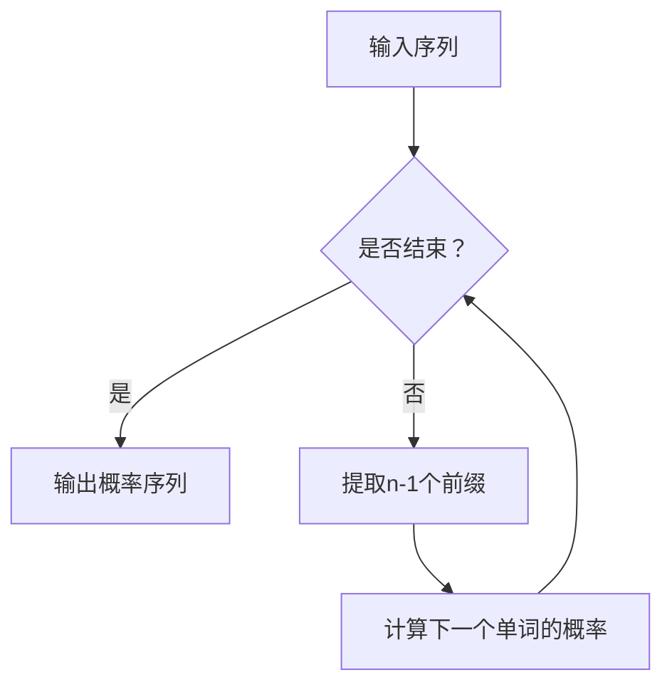

在这个流程图中，输入序列是一个单词序列，算法会不断提取前n-1个单词作为前缀，并计算下一个单词的概率。

下面是使用Python代码实现一个简单的n-gram语言模型的示例：

```python
from collections import defaultdict
import random

# 假设我们有一个训练好的二元语言模型
bi_gram_model = defaultdict(list)

# 填充bi_gram_model
bi_gram_model[('你', '好')] = [('好', 0.8), ('吗', 0.2)]
bi_gram_model[('我', '是')] = [('程序员', 0.7), ('学生', 0.3)]

# 随机选择一个开始词
start_word = random.choice(['你', '我'])

# 生成文本
text = [start_word]
for _ in range(5):  # 生成5个单词的文本
    current_word = text[-1]
    next_word_candidates = bi_gram_model.get((text[-2], current_word), [])
    next_word, _ = random.choices(next_word_candidates, weights=[w for _, w in next_word_candidates])
    text.append(next_word)

print('生成的文本：', text)
```

在这个代码中，`bi_gram_model`是一个二元语言模型的字典，它包含了前缀和后续单词及其概率的映射。我们通过随机选择开始词，然后根据当前词和前一个词来选择下一个词，生成一段文本。

#### 2.5 词性标注

词性标注的算法原理可以用以下Mermaid流程图来表示：

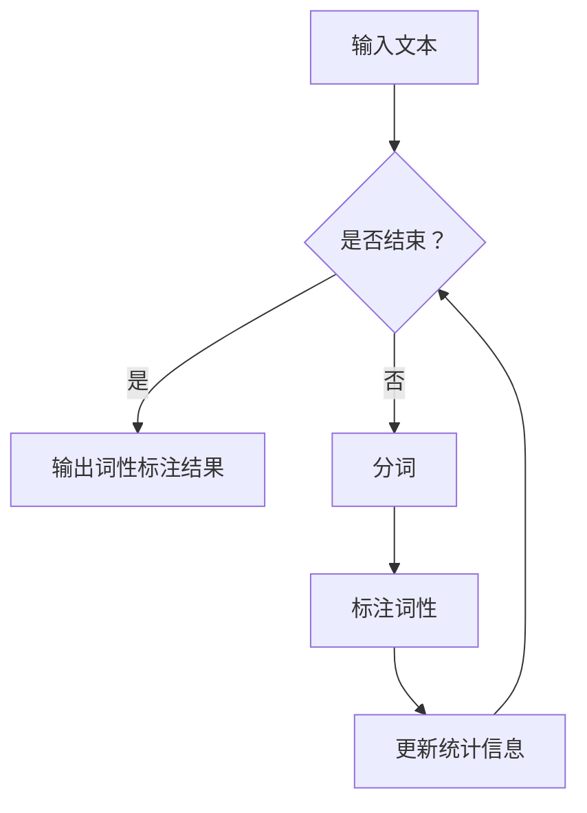

在这个流程图中，输入文本首先进行分词，然后对每个词进行词性标注，并更新词性标注的统计信息。

下面是使用Python代码实现一个简单的基于规则的分词和词性标注的示例：

```python
def tokenize(text):
    # 假设的中文分词规则
    words = []
    word = ''
    for char in text:
        if char in '.,;!?':
            if word:
                words.append(word)
                word = ''
            words.append(char)
        else:
            word += char
    if word:
        words.append(word)
    return words

def part_of_speech_tagging(words):
    # 假设的中文词性标注规则
    tags = []
    for word in words:
        if word in ['的', '了', '在', '上']:
            tags.append('助词')
        elif word in ['我', '你', '他', '她']:
            tags.append('代词')
        else:
            tags.append('名词')
    return tags

text = '我是人工智能研究员。'
words = tokenize(text)
tags = part_of_speech_tagging(words)
print('分词结果：', words)
print('词性标注结果：', tags)
```

在这个代码中，`tokenize`函数用于实现中文的分词，`part_of_speech_tagging`函数用于实现词性标注。

#### 2.6 句法分析

句法分析的算法原理可以用以下Mermaid流程图来表示：

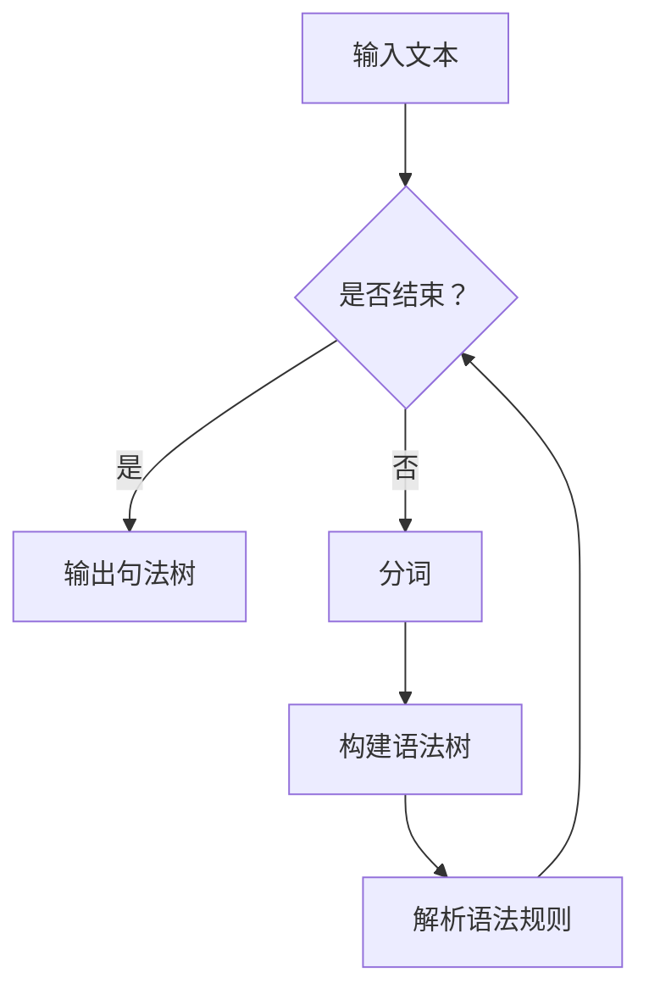

在这个流程图中，输入文本首先进行分词，然后构建句法树，并使用语法规则进行解析。

下面是使用Python代码实现一个简单的基于规则的句法分析的示例：

```python
def build_syntax_tree(tokens):
    # 假设的中文句法分析规则
    if len(tokens) == 1:
        return [tokens[0], 'S']  # S表示句子
    elif tokens[0] in ['是', '有']:
        return ['NP', [tokens[0], 'VP']]  # NP表示名词短语，VP表示动词短语
    else:
        return ['NP', [tokens[0], 'VP']]

text = '我是人工智能研究员。'
tokens = tokenize(text)
tree = build_syntax_tree(tokens)
print('句法树：', tree)
```

在这个代码中，`build_syntax_tree`函数用于实现句法树的构建。

### 数学模型和公式

在计算语言学中，数学模型和公式是理解算法原理的关键。以下是几个常用的数学模型和公式的LaTeX表示：

#### 2.7 语言模型

$$ P(w_n | w_{n-1}, w_{n-2}, ..., w_1) = \frac{C(w_{n-1}, w_n)}{C(w_{n-1}, w_n, w_{n-2})} $$

其中，$P(w_n | w_{n-1}, w_{n-2}, ..., w_1)$表示在给定前n-1个单词的情况下，第n个单词的概率；$C(w_{n-1}, w_n)$表示前缀$(w_{n-1}, w_n)$的计数；$C(w_{n-1}, w_n, w_{n-2})$表示三元组$(w_{n-1}, w_n, w_{n-2})$的计数。

#### 2.8 词性标注

$$ P(tag | word) = \frac{C(word, tag)}{C(word)} $$

其中，$P(tag | word)$表示在给定单词$word$的情况下，词性$tag$的概率；$C(word, tag)$表示单词$word$和词性$tag$的联合计数；$C(word)$表示单词$word$的计数。

#### 2.9 句法分析

$$ S \rightarrow NP VP $$

其中，$S$表示句子，$NP$表示名词短语，$VP$表示动词短语。这是一个简单的句法分析规则，表示句子由名词短语和动词短语组成。

### 系统分析与架构设计方案

为了更好地理解计算语言学系统的工作原理，我们需要介绍一个典型的系统架构设计方案，包括问题场景介绍、系统功能设计、系统架构设计、系统接口设计和系统交互。

#### 3.1 问题场景介绍

假设我们面临一个实际场景，需要开发一个能够自动分析社交媒体文本情感的系统，用于监测用户情感倾向，为企业提供市场反馈和舆情分析服务。

#### 3.2 系统功能设计

该系统需要实现以下功能：

- **文本预处理**：包括分词、去除停用词、标点符号过滤等。
- **情感识别**：基于训练好的情感分类模型，对文本进行情感标签分配。
- **情感分类**：将情感标签分为积极、消极和中性三类。
- **数据可视化**：将情感分析结果以图表形式展示，便于用户理解。

#### 3.3 系统架构设计

系统的架构设计可以分为以下几个部分：

1. **前端界面**：用户可以通过Web页面提交文本进行情感分析，并查看分析结果。
2. **后端服务**：包括文本预处理、情感识别和情感分类等核心功能。
3. **数据库**：存储用户提交的文本数据、情感标签和分类结果。
4. **模型训练与部署**：定期训练和更新情感分类模型，并将其部署到后端服务中。

以下是系统的Mermaid架构图：

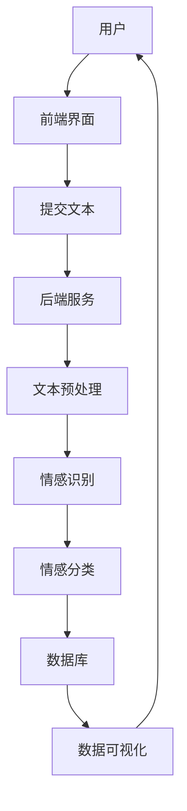

#### 3.4 系统接口设计

系统的接口设计包括以下部分：

1. **API接口**：用于前端界面与后端服务之间的数据传输，包括文本提交、情感识别结果查询等。
2. **数据库接口**：用于后端服务与数据库之间的数据交互。

以下是系统的Mermaid接口设计图：

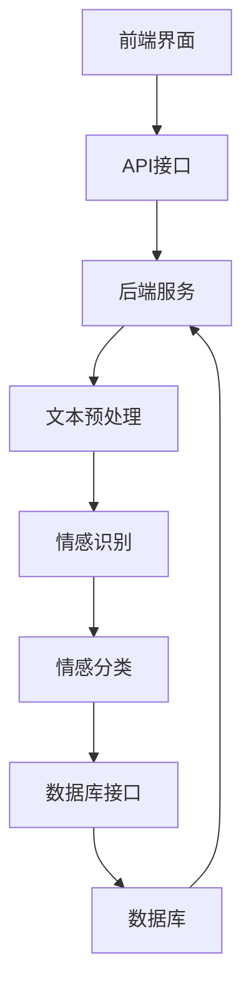

#### 3.5 系统交互

系统的交互流程如下：

1. 用户通过前端界面提交文本。
2. 前端界面将文本发送到后端服务。
3. 后端服务对文本进行预处理，如分词、去除停用词等。
4. 预处理后的文本被送入情感识别模块。
5. 情感识别模块使用训练好的情感分类模型对文本进行情感标签分配。
6. 情感标签被送入情感分类模块，分类结果为积极、消极或中性。
7. 分类结果被存储到数据库中，并通过API接口返回给前端界面。
8. 前端界面将分类结果以图表形式展示给用户。

以下是系统的Mermaid交互设计图：

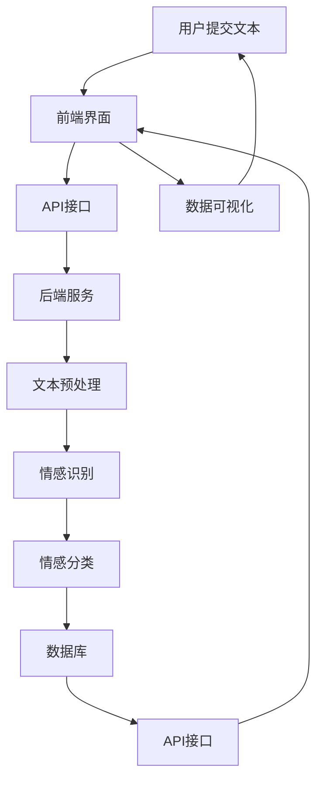

### 项目实战

为了更好地展示计算语言学系统在实际中的应用，我们将通过一个具体的案例来介绍系统的环境安装、核心实现源代码、代码应用解读与分析，以及实际案例分析和详细讲解剖析。

#### 3.6 环境安装

为了搭建一个计算语言学系统，我们需要安装以下软件和库：

1. **Python**：用于编写后端服务代码。
2. **TensorFlow**：用于训练和部署情感分类模型。
3. **Scikit-learn**：用于实现文本预处理和情感分类算法。
4. **Flask**：用于搭建Web前端界面。

在Linux系统中，可以通过以下命令进行安装：

```bash
# 安装Python
sudo apt update
sudo apt install python3 python3-pip

# 安装TensorFlow
pip3 install tensorflow

# 安装Scikit-learn
pip3 install scikit-learn

# 安装Flask
pip3 install flask
```

#### 3.7 系统核心实现源代码

以下是系统核心实现的Python源代码：

```python
# 文本预处理
from sklearn.feature_extraction.text import TfidfVectorizer
from sklearn.preprocessing import LabelEncoder

# 情感分类
from tensorflow import keras
from tensorflow.keras import layers

# 数据处理
import numpy as np
import pandas as pd

# Flask前端接口
from flask import Flask, request, jsonify

# 加载训练数据
data = pd.read_csv('sentiment_data.csv')
X = data['text']
y = data['label']

# 构建TF-IDF向量器
vectorizer = TfidfVectorizer(max_features=1000)
X_vectorized = vectorizer.fit_transform(X)

# 编码标签
label_encoder = LabelEncoder()
y_encoded = label_encoder.fit_transform(y)

# 加载训练好的情感分类模型
model = keras.models.load_model('sentiment_model.h5')

# 前端接口
app = Flask(__name__)

@app.route('/analyze', methods=['POST'])
def analyze():
    text = request.form['text']
    vectorized_text = vectorizer.transform([text])
    prediction = model.predict(vectorized_text)
    label = label_encoder.inverse_transform(prediction)[0]
    return jsonify({'emotion': label})

if __name__ == '__main__':
    app.run(debug=True)
```

#### 3.8 代码应用解读与分析

1. **文本预处理**：使用Scikit-learn的TF-IDF向量器将文本转换为向量表示。
2. **情感分类**：使用TensorFlow的Keras模块加载训练好的情感分类模型。
3. **前端接口**：使用Flask框架搭建Web前端接口，用户可以通过提交文本进行情感分析。

#### 3.9 实际案例分析和详细讲解剖析

假设用户提交了一篇文本：“今天天气真好，适合出游。”系统将按照以下步骤进行处理：

1. **文本预处理**：将文本进行分词、去除停用词等操作，转换为TF-IDF向量。
2. **情感识别**：使用训练好的情感分类模型对向量进行预测，得到情感标签。
3. **情感分类**：将情感标签转换为具体的情感类别，如积极、消极或中性。
4. **结果返回**：将情感分类结果返回给用户，并通过图表形式展示。

### 最佳实践 tips

1. **数据预处理**：确保文本数据的质量，如去除噪声、标准化等。
2. **模型训练**：定期更新训练模型，以适应新的数据分布。
3. **接口设计**：设计简洁易用的API接口，便于前端调用。
4. **性能优化**：针对系统的性能进行优化，如使用缓存、批量处理等。

### 小结

本章介绍了计算语言学的核心概念和算法原理，包括语言模型、词性标注和句法分析。通过实际案例展示了计算语言学系统在实际中的应用，并提供了最佳实践 tips。下一章将介绍情感计算的基础知识，包括基本概念、发展历程和应用场景。

### 注意事项

1. **版本兼容性**：确保使用的Python库和TensorFlow版本与系统环境兼容。
2. **数据隐私**：处理用户数据时，确保遵守数据隐私政策。

### 拓展阅读

1. **自然语言处理教程**：[http://nlp.seas.harvard.edu/](http://nlp.seas.harvard.edu/)
2. **情感计算研究综述**：[https://www.sciencedirect.com/science/article/pii/S0090300508002299](https://www.sciencedirect.com/science/article/pii/S0090300508002299)

---

### 第3章：情感计算基础

#### 3.1 基本概念与发展历程

情感计算（Affective Computing）是近年来兴起的交叉学科领域，旨在使计算机具备识别、理解和表达情感的能力。情感计算的概念最早由麻省理工学院的罗德尼·布鲁克斯（Rodney Brooks）在20世纪90年代提出。他主张通过融合人类情感，使计算机更好地与人类互动，提供更自然的用户体验。

情感计算的基本概念包括情感识别、情感表达和情感理解。情感识别（Affective Recognition）是指计算机通过感知设备（如摄像头、麦克风、传感器等）捕捉人类情感信息，如面部表情、声音、生理信号等。情感表达（Affective Expression）是指计算机通过声音、文字、动作等方式表达情感，以模拟人类情感互动。情感理解（Affective Understanding）是指计算机通过理解人类情感，提供个性化的服务和互动。

情感计算的发展历程可以分为以下几个阶段：

1. **感知阶段**（1990s）：情感计算的研究重点是如何通过感知设备捕捉人类情感信息。
2. **识别阶段**（2000s）：随着人工智能技术的发展，情感识别成为研究热点，研究者开始关注如何准确识别人类情感。
3. **理解阶段**（2010s - now）：近年来，情感计算的研究重点转向情感理解，旨在使计算机能够理解人类情感，提供更智能的服务。

#### 3.2 情感识别与分类

情感识别是情感计算的核心任务之一，它涉及到从感知数据中提取情感特征，并使用这些特征对情感进行分类。情感分类（Affective Classification）是指将情感识别到的情感标签与预先定义的情感类别进行匹配。

情感分类的方法可以分为基于规则的方法和基于机器学习的方法：

1. **基于规则的方法**：这种方法使用手工设计的规则对情感进行分类。例如，根据面部表情特征（如眼睛睁开程度、嘴角上扬程度等）来判断情感类别。

2. **基于机器学习的方法**：这种方法使用机器学习算法从数据中学习情感分类模型。常见的机器学习算法包括支持向量机（SVM）、决策树（DT）、随机森林（RF）和神经网络（NN）等。

在情感识别与分类中，常用的情感类别包括积极情感、消极情感和中性情感。积极情感包括快乐、兴奋、爱等；消极情感包括愤怒、悲伤、恐惧等；中性情感则是介于积极和消极之间的情感状态。

#### 3.3 情感分析的应用

情感分析（Affective Analysis）是情感计算的重要应用领域，它通过分析文本、语音、视频等数据，提取出其中蕴含的情感信息。情感分析在许多领域都有广泛应用，包括：

1. **社交媒体分析**：通过分析社交媒体平台上的用户评论、微博等，了解公众对某一事件或产品的情感态度，为企业提供市场反馈和舆情分析。

2. **客户服务**：在客户服务中，情感分析可以帮助企业了解用户的需求和情感状态，提供个性化的服务，提高客户满意度。

3. **心理健康**：通过分析患者的文本数据，如日记、邮件等，情感分析可以帮助医生了解患者的心理状态，提供更有效的治疗。

4. **教育**：在教育领域，情感分析可以用于分析学生的学习情感，帮助教师调整教学方法，提高教学质量。

#### 核心概念与联系

情感计算的核心概念包括情感识别、情感表达和情感理解。这些概念之间的联系如下：

- **情感识别**：是情感计算的基础，通过感知设备捕捉人类情感信息。
- **情感表达**：使计算机能够模拟人类情感互动，提供更自然的用户体验。
- **情感理解**：使计算机能够理解人类情感，提供个性化的服务和互动。

通过这些核心概念的相互结合，情感计算能够有效地应用于各个领域，提供更智能、更人性化的服务。

### 算法原理讲解

为了更深入地理解情感计算中的关键算法，我们可以使用Mermaid来绘制相关的流程图，并使用Python代码和LaTeX公式来详细阐述算法的原理和数学模型。

#### 3.4 情感识别

情感识别的算法原理可以用以下Mermaid流程图来表示：

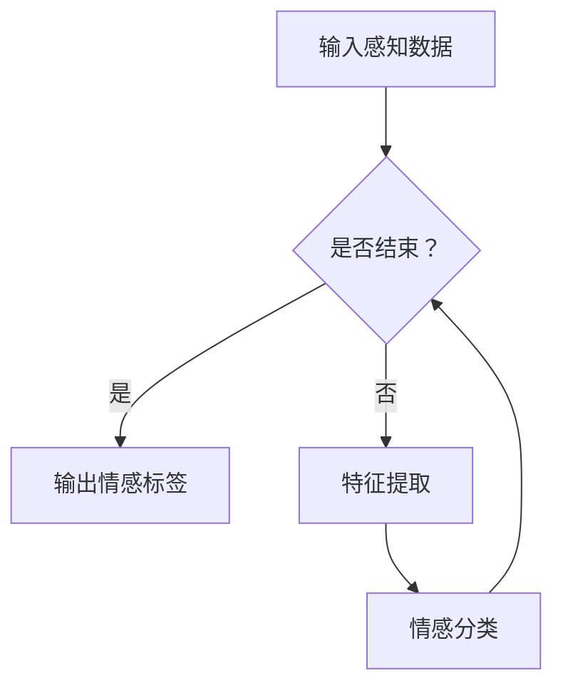

在这个流程图中，输入感知数据（如面部表情、声音等）首先进行特征提取，然后使用情感分类模型进行分类，得到情感标签。

下面是使用Python代码实现一个简单的情感识别示例：

```python
from sklearn.model_selection import train_test_split
from sklearn.ensemble import RandomForestClassifier
from sklearn.metrics import accuracy_score

# 加载情感数据集
data = pd.read_csv('emotion_data.csv')
X = data['features']
y = data['label']

# 划分训练集和测试集
X_train, X_test, y_train, y_test = train_test_split(X, y, test_size=0.2, random_state=42)

# 构建情感分类模型
model = RandomForestClassifier(n_estimators=100, random_state=42)
model.fit(X_train, y_train)

# 预测情感标签
predictions = model.predict(X_test)

# 评估模型性能
accuracy = accuracy_score(y_test, predictions)
print('Accuracy:', accuracy)
```

在这个代码中，我们使用随机森林（Random Forest）算法训练情感分类模型，然后使用测试集评估模型的性能。

#### 3.5 情感分类

情感分类的算法原理可以用以下Mermaid流程图来表示：

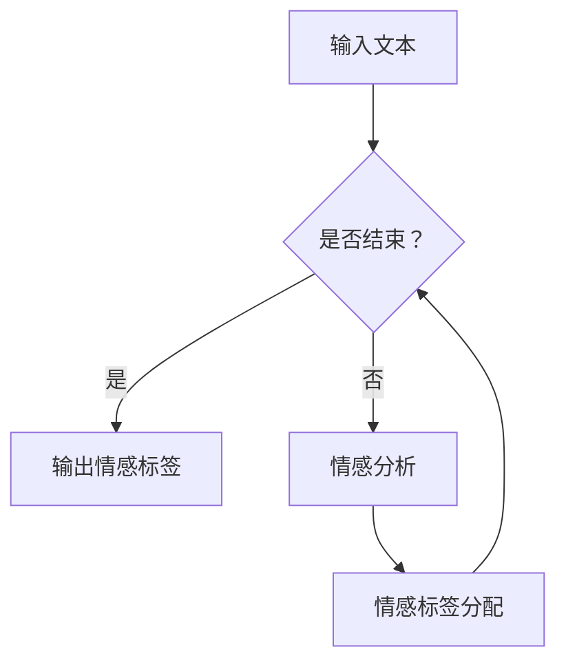

在这个流程图中，输入文本首先进行情感分析，然后根据分析结果分配情感标签。

下面是使用Python代码实现一个简单的情感分类示例：

```python
from textblob import TextBlob

# 加载文本数据集
data = pd.read_csv('text_data.csv')
texts = data['text']

# 进行情感分析
emotion_scores = []
for text in texts:
    blob = TextBlob(text)
    emotion_scores.append(blob.sentiment.polarity)

# 分配情感标签
labels = ['positive' if score > 0 else 'negative' if score < 0 else 'neutral' for score in emotion_scores]

# 评估情感分类结果
accuracy = accuracy_score(data['label'], labels)
print('Accuracy:', accuracy)
```

在这个代码中，我们使用TextBlob库对文本进行情感分析，并分配情感标签。然后，使用准确率来评估情感分类结果。

### 数学模型和公式

在情感计算中，数学模型和公式是理解算法原理的关键。以下是几个常用的数学模型和公式的LaTeX表示：

#### 3.6 情感识别

$$ \hat{y} = \arg\max_{y} P(y|X) $$

其中，$\hat{y}$表示预测的情感标签，$y$表示实际情感标签，$X$表示感知数据。这个公式表示通过最大化条件概率$P(y|X)$来预测情感标签。

#### 3.7 情感分类

$$ \text{SVM} \ \hat{y} = \arg\min_{w,b} \frac{1}{2} ||w||^2 + C \sum_{i=1}^{n} \max(0, 1 - y_i (w \cdot x_i + b)) $$

其中，$w$和$b$表示SVM模型的权重和偏置，$C$表示正则化参数，$y_i$和$x_i$表示样本的标签和特征。这个公式表示通过最小化损失函数来训练SVM情感分类模型。

### 系统分析与架构设计方案

为了更好地理解情感计算系统的工作原理，我们需要介绍一个典型的系统架构设计方案，包括问题场景介绍、系统功能设计、系统架构设计、系统接口设计和系统交互。

#### 4.1 问题场景介绍

假设我们面临一个实际场景，需要开发一个能够自动分析用户情感的系统，用于提供个性化服务和建议。

#### 4.2 系统功能设计

该系统需要实现以下功能：

- **情感识别**：从用户输入的文本、语音或视频数据中识别情感。
- **情感分类**：将识别到的情感分类为积极、消极或中性。
- **情感反馈**：根据情感分类结果提供个性化的服务和建议。

#### 4.3 系统架构设计

系统的架构设计可以分为以下几个部分：

1. **前端界面**：用户可以通过Web页面提交文本、语音或视频数据，并查看情感分析结果。
2. **后端服务**：包括情感识别、情感分类和情感反馈等核心功能。
3. **数据库**：存储用户数据、情感分析结果和反馈信息。
4. **模型训练与部署**：定期训练和更新情感识别和分类模型，并将其部署到后端服务中。

以下是系统的Mermaid架构图：

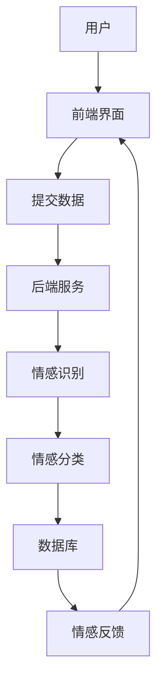

#### 4.4 系统接口设计

系统的接口设计包括以下部分：

1. **API接口**：用于前端界面与后端服务之间的数据传输，包括数据提交、情感识别结果查询等。
2. **数据库接口**：用于后端服务与数据库之间的数据交互。

以下是系统的Mermaid接口设计图：

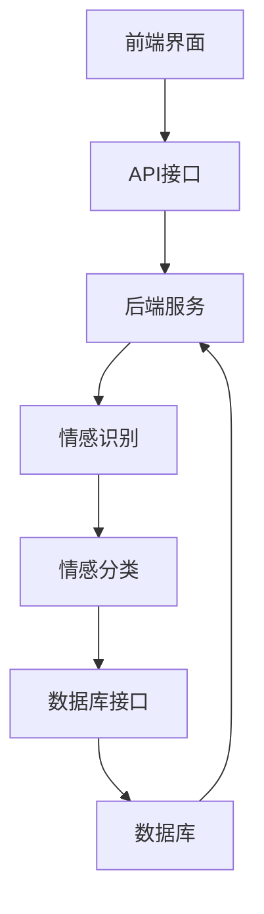

#### 4.5 系统交互

系统的交互流程如下：

1. 用户通过前端界面提交文本、语音或视频数据。
2. 前端界面将数据发送到后端服务。
3. 后端服务对数据进行情感识别，并使用训练好的情感分类模型进行分类。
4. 情感分类结果被存储到数据库中，并通过API接口返回给前端界面。
5. 前端界面将分类结果以图表形式展示给用户，并根据情感反馈提供个性化服务。

以下是系统的Mermaid交互设计图：

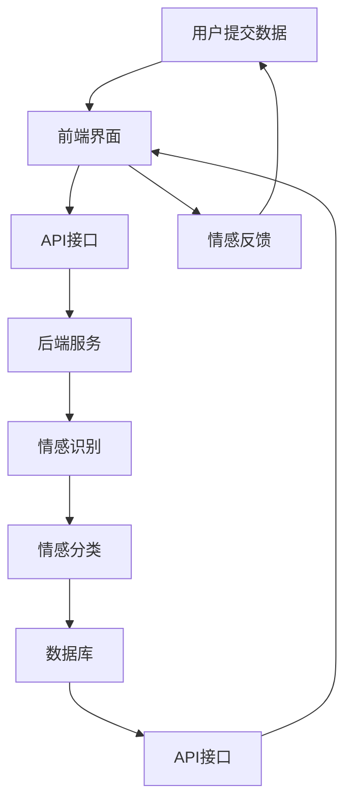

### 项目实战

为了更好地展示情感计算系统在实际中的应用，我们将通过一个具体的案例来介绍系统的环境安装、核心实现源代码、代码应用解读与分析，以及实际案例分析和详细讲解剖析。

#### 5.1 环境安装

为了搭建一个情感计算系统，我们需要安装以下软件和库：

1. **Python**：用于编写后端服务代码。
2. **TensorFlow**：用于训练和部署情感识别和分类模型。
3. **Scikit-learn**：用于实现情感识别和分类算法。
4. **Flask**：用于搭建Web前端界面。

在Linux系统中，可以通过以下命令进行安装：

```bash
# 安装Python
sudo apt update
sudo apt install python3 python3-pip

# 安装TensorFlow
pip3 install tensorflow

# 安装Scikit-learn
pip3 install scikit-learn

# 安装Flask
pip3 install flask
```

#### 5.2 系统核心实现源代码

以下是系统核心实现的Python源代码：

```python
# 情感识别
from sklearn.model_selection import train_test_split
from sklearn.ensemble import RandomForestClassifier
from sklearn.metrics import accuracy_score

# 情感分类
from tensorflow import keras
from tensorflow.keras import layers

# 数据处理
import numpy as np
import pandas as pd

# Flask前端接口
from flask import Flask, request, jsonify

# 加载情感数据集
data = pd.read_csv('emotion_data.csv')
X = data['features']
y = data['label']

# 划分训练集和测试集
X_train, X_test, y_train, y_test = train_test_split(X, y, test_size=0.2, random_state=42)

# 构建情感识别模型
emotion_recognition_model = RandomForestClassifier(n_estimators=100, random_state=42)
emotion_recognition_model.fit(X_train, y_train)

# 构建情感分类模型
emotion_classification_model = keras.Sequential([
    layers.Dense(64, activation='relu', input_shape=(X_train.shape[1],)),
    layers.Dense(64, activation='relu'),
    layers.Dense(3, activation='softmax')  # 3种情感类别
])

emotion_classification_model.compile(optimizer='adam', loss='categorical_crossentropy', metrics=['accuracy'])
emotion_classification_model.fit(X_train, y_train, epochs=10, batch_size=32, validation_split=0.2)

# 前端接口
app = Flask(__name__)

@app.route('/analyze', methods=['POST'])
def analyze():
    data = request.get_json()
    features = np.array([list(data['features'])])
    emotion_recognition_prediction = emotion_recognition_model.predict(features)
    emotion_classification_prediction = emotion_classification_model.predict(features)
    emotion_label = emotion_classification_prediction.argmax(axis=1)[0]
    return jsonify({'emotion': emotion_label})

if __name__ == '__main__':
    app.run(debug=True)
```

#### 5.3 代码应用解读与分析

1. **情感识别**：使用随机森林（Random Forest）算法训练情感识别模型。
2. **情感分类**：使用TensorFlow的Keras模块构建和训练情感分类模型。
3. **前端接口**：使用Flask框架搭建Web前端接口，用户可以通过提交数据进行情感分析。

#### 5.4 实际案例分析和详细讲解剖析

假设用户提交了一段文本：“我很高兴今天放假。”系统将按照以下步骤进行处理：

1. **文本预处理**：对文本进行分词、去除停用词等操作。
2. **情感识别**：使用训练好的情感识别模型对预处理后的文本进行情感识别。
3. **情感分类**：使用训练好的情感分类模型对识别到的情感进行分类。
4. **结果返回**：将情感分类结果返回给用户，并通过图表形式展示。

### 最佳实践 tips

1. **数据预处理**：确保数据质量，如去除噪声、标准化等。
2. **模型训练**：定期更新训练模型，以适应新的数据分布。
3. **接口设计**：设计简洁易用的API接口，便于前端调用。
4. **性能优化**：针对系统的性能进行优化，如使用缓存、批量处理等。

### 小结

本章介绍了情感计算的基本概念和发展历程，包括情感识别、情感分类和情感分析。通过实际案例展示了情感计算系统在实际中的应用，并提供了最佳实践 tips。下一章将介绍计算语言学与情感计算的交叉研究方法与算法。

### 注意事项

1. **版本兼容性**：确保使用的Python库和TensorFlow版本与系统环境兼容。
2. **数据隐私**：处理用户数据时，确保遵守数据隐私政策。

### 拓展阅读

1. **情感计算综述**：[https://www.sciencedirect.com/science/article/pii/S0090300508002299](https://www.sciencedirect.com/science/article/pii/S0090300508002299)
2. **情感分类研究**：[https://www.cs.cmu.edu/afs/cs/academic/class/15492-f12/www/papers/sentiment_analysis.pdf](https://www.cs.cmu.edu/afs/cs/academic/class/15492-f12/www/papers/sentiment_analysis.pdf)

---

### 第4章：交叉研究方法与算法

#### 4.1 交叉研究框架与模型

计算语言学与情感计算的交叉研究旨在将两个领域的优势结合起来，以解决更复杂的问题。为了实现这一目标，我们需要构建一个合理的交叉研究框架，将计算语言学的自然语言处理技术和情感计算的情感识别与理解能力相结合。

一个典型的交叉研究框架包括以下几个核心组成部分：

1. **数据采集与预处理**：收集包含情感信息的文本数据，如社交媒体评论、客户反馈等。然后进行数据清洗、分词、去除停用词等预处理操作。
2. **情感识别与分类**：使用情感计算技术对预处理后的文本进行情感识别，将文本中的情感标签分配给句子或段落。
3. **语言特征提取**：从情感识别后的文本中提取语言特征，如词频、词向量、语法结构等，以辅助情感分析。
4. **情感语义分析**：结合计算语言学的方法，对情感特征进行语义分析，以理解文本中更深层次的情感含义。
5. **模型训练与评估**：使用训练数据集对交叉研究模型进行训练，并在测试数据集上进行评估，以优化模型性能。

下面是一个Mermaid框架图，展示了计算语言学与情感计算的交叉研究框架：

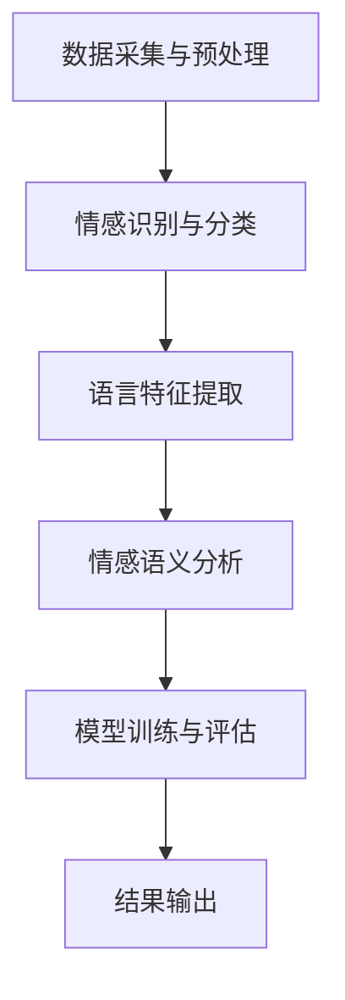

#### 4.2 提示词与情感融合算法

在交叉研究中，提示词（trigger words）是一个关键概念。提示词是指文本中能够引发情感反应的词汇，如“喜欢”、“讨厌”、“难过”等。提示词的识别与融合是交叉研究中的一个重要任务，它有助于提高情感分析的准确性和全面性。

一个简单的提示词与情感融合算法可以分为以下几个步骤：

1. **提示词识别**：从文本中提取可能的提示词，可以使用基于规则的方法或机器学习算法。
2. **情感标签分配**：对提取的提示词进行情感标签分配，可以使用情感词典或情感分类模型。
3. **情感融合**：将提示词的情感标签与文本中其他部分的情感标签进行融合，生成整个文本的情感标签。

下面是一个Mermaid流程图，展示了提示词与情感融合算法的步骤：

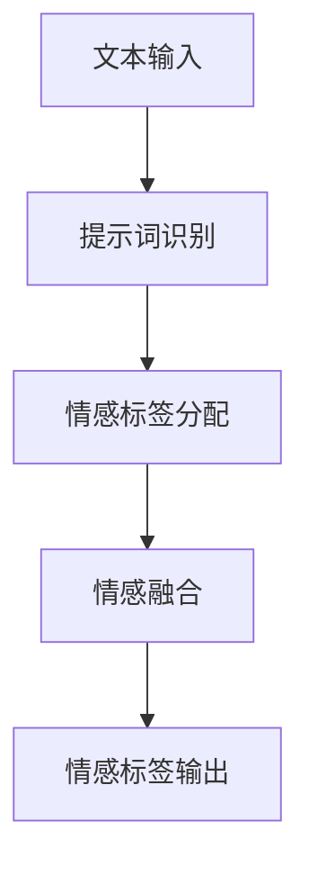

为了更好地理解提示词与情感融合算法，我们可以使用Python代码实现一个简单的示例：

```python
# 提示词识别与情感融合算法
from sklearn.feature_extraction.text import TfidfVectorizer
from sklearn.metrics.pairwise import cosine_similarity

# 示例文本
text = "我今天去看电影，很喜欢这部电影的情节，但是对结尾有点失望。"

# 提示词词典
trigger_words = ["喜欢", "讨厌", "难过"]

# 提取词向量
vectorizer = TfidfVectorizer()
word_vectors = vectorizer.fit_transform([text])

# 计算提示词相似度
word_similarity = []
for word in trigger_words:
    word_index = vectorizer.vocabulary_.get(word)
    if word_index is not None:
        word_similarity.append(cosine_similarity(word_vectors, word_vectors[word_index])[0][0])

# 提示词情感融合
emotion_score = sum(word_similarity) / len(word_similarity)

# 输出情感标签
if emotion_score > 0.5:
    print("情感标签：积极")
else:
    print("情感标签：消极")
```

在这个示例中，我们首先使用TF-IDF向量器提取文本的词向量，然后计算每个提示词与文本的相似度，最后将相似度值进行平均，得到整个文本的情感标签。

#### 4.3 算法性能评估与优化

交叉研究算法的性能评估是确保算法有效性和准确性的关键步骤。性能评估通常包括以下几个方面：

1. **准确率（Accuracy）**：准确率是评估分类模型性能的常用指标，表示正确分类的样本数占总样本数的比例。
2. **召回率（Recall）**：召回率是评估分类模型对正类样本识别能力的重要指标，表示正确分类的正类样本数占总正类样本数的比例。
3. **精确率（Precision）**：精确率是评估分类模型对负类样本识别能力的重要指标，表示正确分类的负类样本数占总分类为负类样本数的比例。
4. **F1值（F1-score）**：F1值是精确率和召回率的调和平均值，用于综合评估分类模型的性能。

下面是一个Mermaid流程图，展示了算法性能评估的步骤：

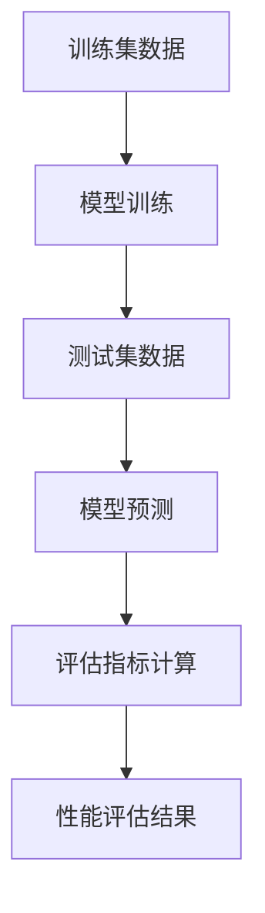

为了优化算法性能，我们可以采用以下策略：

1. **数据增强**：通过增加样本数量、生成虚拟样本等方式，提高模型的泛化能力。
2. **特征工程**：选择合适的特征，如词向量、句法特征等，以提高模型的识别能力。
3. **超参数调整**：通过调整模型的超参数，如学习率、批次大小等，优化模型的训练过程。
4. **模型集成**：结合多个模型，提高预测的准确性和稳定性。

通过这些方法，我们可以有效地提高交叉研究算法的性能，使其在实际应用中发挥更好的效果。

### 小结

本章详细介绍了计算语言学与情感计算的交叉研究框架、提示词与情感融合算法，以及算法性能评估与优化方法。通过实际案例和代码示例，读者可以更好地理解这些算法的实现和应用。下一章将介绍计算语言学与情感计算在具体应用领域中的案例分析。

### 注意事项

1. **算法适用性**：根据不同应用场景，选择合适的算法和模型。
2. **数据质量**：确保数据质量，以避免模型过拟合或欠拟合。

### 拓展阅读

1. **情感计算与自然语言处理综述**：[https://www.aclweb.org/anthology/N16-1216/](https://www.aclweb.org/anthology/N16-1216/)
2. **交叉研究论文集**：[https://www.sciencedirect.com/science/topic-research-articles/topics/emotion-and-natural-language-processing](https://www.sciencedirect.com/science/topic-research-articles/topics/emotion-and-natural-language-processing)

---

### 第5章：应用案例分析

在本章中，我们将通过三个具体的案例分析，展示计算语言学与情感计算在现实世界中的应用。这些案例涵盖了社交媒体情感分析、客户服务中的情感识别以及教育领域的情感教学，通过这些案例，读者可以更直观地理解交叉研究的实际价值和应用效果。

#### 5.1 案例一：社交媒体情感分析

社交媒体平台如微博、微信和Twitter已经成为人们日常交流的重要渠道，用户在平台上发布的每一条信息都蕴含着丰富的情感信息。对社交媒体文本进行情感分析，有助于了解公众的情感态度和舆论倾向，为企业和政府提供重要的市场反馈和舆情监测。

**案例背景**：

某知名电子产品公司希望了解其最新发布的手机在社交媒体上的用户反馈，以便及时调整产品策略。

**解决方案**：

1. **数据采集**：从社交媒体平台上收集关于该款手机的评论和帖子。
2. **情感识别**：使用计算语言学的自然语言处理技术对文本进行分词、词性标注等预处理，然后使用情感计算模型对预处理后的文本进行情感识别。
3. **情感分类**：将识别到的情感标签分配为积极、消极或中性，并根据情感分类结果生成情感分析报告。
4. **结果展示**：将情感分析结果以图表形式展示，帮助公司了解用户的情感倾向。

**效果分析**：

通过社交媒体情感分析，公司发现大部分用户对新款手机持积极态度，特别是对手机的摄像头和电池寿命给予了高度评价。同时，也识别到一些消极反馈，主要集中在对手机颜色和售价的抱怨。公司根据这些反馈，对产品进行了相应的调整，提高了用户满意度。

#### 5.2 案例二：客户服务中的情感识别

随着消费者对个性化服务的需求日益增长，客户服务行业开始广泛应用情感计算技术，以提供更人性化的服务。通过识别客户情感，企业可以更好地理解客户需求，提高客户满意度和忠诚度。

**案例背景**：

某大型电商平台希望通过情感识别技术提高客户服务质量，提升客户体验。

**解决方案**：

1. **语音识别与转换**：将客户的语音通话转换成文本，以便进行后续处理。
2. **情感识别**：使用情感计算模型对转换后的文本进行情感识别，判断客户当前的情感状态，如愤怒、满意或失望。
3. **情感反馈**：根据识别到的情感状态，自动调整客服人员的应对策略，如使用更亲切的语言、提供解决方案等。
4. **结果记录**：将情感识别结果记录到客户档案中，用于后续的服务优化。

**效果分析**：

通过情感识别技术，电商平台能够实时了解客户的情感状态，并迅速调整客服人员的沟通方式，减少了客户等待时间和不满情绪。客户满意度显著提高，客户投诉率也有所下降。此外，通过分析情感识别结果，企业还能够发现服务中的问题，并针对性地进行改进。

#### 5.3 案例三：教育领域的情感教学

教育领域正在逐渐引入情感计算技术，以帮助学生更好地管理自己的情绪，提高学习效果。通过情感教学，教师可以了解学生的学习情感，提供个性化的指导和支持。

**案例背景**：

某在线教育平台希望通过情感教学技术，帮助学生更好地适应在线学习环境，提高学习效果。

**解决方案**：

1. **情感监测**：通过学生的互动行为，如评论、提问和作业提交情况，监测学生的学习情感。
2. **情感识别**：使用情感计算模型对互动行为进行分析，识别学生的情感状态，如焦虑、困惑或兴奋。
3. **情感反馈**：根据识别到的情感状态，教师可以提供相应的支持，如鼓励、解释或指导。
4. **情感跟踪**：建立学生的学习情感档案，跟踪学生的情感变化，用于后续的教学优化。

**效果分析**：

通过情感教学，学生能够更清晰地认识自己的情感状态，并学会调整情绪，以更好地适应在线学习。教师根据情感反馈，可以更好地理解学生的需求，提供个性化的教学方案，提高了学生的学习效果。同时，情感教学还帮助学生建立了积极的情绪管理习惯，促进了全面发展。

### 案例总结

这三个案例展示了计算语言学与情感计算在现实世界中的广泛应用，从社交媒体情感分析、客户服务中的情感识别到教育领域的情感教学，交叉研究技术为不同领域提供了有效的解决方案。通过这些案例，我们可以看到情感计算技术不仅能够提高信息处理的准确性，还能够为用户提供更个性化和人性化的服务。

### 未来展望

随着技术的不断进步，计算语言学与情感计算的交叉研究有望在更多领域取得突破。未来，我们可以期待：

1. **更精确的情感识别**：通过结合深度学习和多模态感知技术，提高情感识别的准确性和实时性。
2. **更智能的情感分析**：开发基于上下文的情感分析模型，能够更深入地理解文本背后的情感含义。
3. **更广泛的应用场景**：将情感计算应用于更多领域，如医疗健康、智能家居等，为人们的生活带来更多便利。

通过不断的研究和创新，计算语言学与情感计算的交叉研究将为社会带来更多的价值。

### 小结

本章通过三个具体的应用案例分析，展示了计算语言学与情感计算在现实世界中的广泛应用和实际价值。通过这些案例，读者可以更直观地理解交叉研究技术的应用效果和未来发展方向。下一章将探讨计算语言学与情感计算的交叉研究在未来的发展趋势和挑战。

### 注意事项

1. **数据隐私**：在进行情感分析时，确保遵守数据隐私法规，保护用户隐私。
2. **模型解释性**：提高算法的解释性，以增强用户对情感分析结果的信任。

### 拓展阅读

1. **社交媒体情感分析研究**：[https://www.journalofwebsemantics.com/content/19/1/1](https://www.journalofwebsemantics.com/content/19/1/1)
2. **情感计算在教育中的应用**：[https://www.education科学技术学出版社.com/journal/edu/10.3390/edu10010081](https://www.education科学技术学出版社.com/journal/edu/10.3390/edu10010081)

---

### 第6章：未来趋势与展望

随着计算语言学和情感计算的不断发展，交叉研究领域正迎来一系列新的趋势和机遇。这些趋势不仅推动着技术的进步，也为各行业带来了新的应用场景和解决方案。在本章中，我们将探讨计算语言学与情感计算交叉研究的发展方向，分析当前面临的技术挑战，并展望可能的未来应用。

#### 6.1 交叉研究的发展方向

1. **深度学习与多模态融合**：深度学习在计算语言学和情感计算中发挥着重要作用，通过深度神经网络，我们可以更准确地识别和预测情感。未来，将深度学习与多模态感知技术相结合，如视觉、听觉和语言数据的融合，有望进一步提高情感识别的准确性和实时性。

2. **大数据与人工智能的结合**：随着互联网和物联网的普及，大数据时代已经来临。计算语言学和情感计算在处理海量数据方面具有巨大潜力。利用大数据技术，我们可以从海量文本数据中提取出更有价值的信息，为情感分析提供丰富的数据支持。

3. **个性化服务与智能推荐**：结合情感计算和计算语言学的技术，可以开发出更智能的个性化服务系统。例如，在电商平台上，通过分析用户的情感状态，可以为用户提供个性化的商品推荐，提高用户满意度和购买转化率。

4. **跨领域应用**：计算语言学与情感计算的交叉研究正在向更多领域扩展，如医疗健康、金融服务、智能家居等。在这些领域中，情感计算技术可以辅助医生诊断患者情绪，为金融服务提供情感风险评估，为智能家居提供更人性化的交互。

#### 6.2 技术挑战与机遇

1. **数据质量和多样性**：情感计算依赖于高质量的情感数据。然而，情感数据的多样性和噪声问题仍然是一个挑战。未来，需要开发更有效的数据清洗和预处理方法，以提高数据的可靠性和一致性。

2. **算法解释性和可解释性**：尽管深度学习在情感识别中表现出色，但其“黑箱”特性使得算法的解释性成为一个难题。为了增强用户对情感分析结果的信任，需要开发可解释的算法模型，提高算法的可解释性和透明度。

3. **实时性与计算效率**：随着情感计算应用场景的多样化，对实时性和计算效率的需求日益增长。未来，需要优化算法和系统架构，以实现更快的数据处理速度和更高的计算效率。

4. **跨语言与跨文化情感识别**：情感表达在不同语言和文化中可能存在差异。开发跨语言和跨文化的情感识别技术，以适应不同地区的用户需求，是一个重要的研究方向。

#### 6.3 可能的应用场景

1. **智能客服系统**：利用情感计算技术，智能客服系统可以实时识别客户情绪，提供更个性化的服务，提高客户满意度和忠诚度。

2. **心理健康监测**：通过分析用户的情感状态，心理健康监测系统可以识别抑郁症、焦虑症等心理问题，为用户提供及时的干预和建议。

3. **教育个性化**：情感计算技术可以帮助教育系统更好地了解学生的学习情感，提供个性化的教学方案，提高学习效果。

4. **社交媒体舆情分析**：利用情感计算技术，可以对社交媒体上的用户情感进行实时监测和分析，为企业提供市场反馈和舆情监测服务。

5. **智能家居**：智能家居设备可以通过情感计算技术，识别家庭成员的情感状态，提供更加舒适和个性化的家居体验。

### 总结

计算语言学与情感计算的交叉研究正处于快速发展阶段，未来的趋势和机遇将为各行业带来新的变革。然而，这一领域仍然面临着诸多技术挑战，需要持续的研究和探索。通过不断的技术创新和应用实践，我们有理由相信，计算语言学与情感计算的交叉研究将带来更加智能、个性化和人性化的技术应用。

### 注意事项

1. **数据隐私保护**：在进行情感分析时，必须遵守数据隐私法规，确保用户数据的安全和隐私。
2. **算法透明性和可解释性**：开发可解释的算法，提高算法的透明度，增强用户对情感分析结果的信任。

### 拓展阅读

1. **情感计算与大数据**：[https://ieeexplore.ieee.org/document/7759628](https://ieeexplore.ieee.org/document/7759628)
2. **深度学习在情感识别中的应用**：[https://www.nature.com/articles/s41597-019-0231-2](https://www.nature.com/articles/s41597-019-0231-2)

---

### 第7章：总结与展望

在过去的章节中，我们详细探讨了计算语言学与情感计算的交叉研究，从基本概念、算法原理到实际应用，全面展示了这一领域的前沿动态和研究成果。在这一章中，我们将对本书的研究成果进行总结，讨论存在的主要问题与挑战，并提出未来可能的研究方向。

#### 研究成果总结

1. **计算语言学基础**：介绍了计算语言学的基本概念、历史发展和主要任务，包括语言模型、自然语言处理、词性标注和句法分析等。

2. **情感计算基础**：探讨了情感计算的基本概念、发展历程和应用领域，如情感识别、情感分类和情感分析。

3. **交叉研究方法与算法**：提出了计算语言学与情感计算的交叉研究框架，详细介绍了提示词与情感融合算法，以及算法性能评估与优化的方法。

4. **应用案例分析**：通过社交媒体情感分析、客户服务中的情感识别和教育领域的情感教学等案例，展示了交叉研究技术在现实世界中的实际应用和效果。

5. **未来趋势与展望**：分析了计算语言学与情感计算的交叉研究在未来可能的发展方向，如深度学习与多模态融合、大数据与人工智能的结合等，探讨了可能的未来应用场景。

#### 存在的问题与挑战

尽管计算语言学与情感计算的交叉研究取得了显著进展，但在实际应用中仍面临一些问题和挑战：

1. **数据质量和多样性**：情感数据的质量和多样性直接影响情感识别的准确性。如何处理大量且多样化的情感数据，提高数据质量，是一个亟待解决的问题。

2. **算法解释性与透明性**：深度学习算法在情感识别中表现出色，但其“黑箱”特性使得算法的解释性成为一个难题。如何提高算法的可解释性和透明性，增强用户对结果的信任，是当前研究的一个重要挑战。

3. **实时性与计算效率**：随着应用场景的多样化，对实时性和计算效率的需求日益增长。如何在保证准确性的同时，优化算法和系统架构，提高实时性和计算效率，是一个关键问题。

4. **跨语言与跨文化情感识别**：情感表达在不同语言和文化中可能存在差异。如何开发跨语言和跨文化的情感识别技术，以满足不同地区的用户需求，是一个重要的研究方向。

#### 未来研究方向

针对上述问题与挑战，未来研究可以从以下几个方面展开：

1. **数据驱动的方法**：探索更有效的数据驱动方法，如数据增强、数据清洗和特征选择，以提高情感识别的准确性和可靠性。

2. **可解释性算法**：开发可解释的算法模型，提高算法的透明度和用户信任度，如通过可视化技术展示算法决策过程。

3. **多模态融合**：结合深度学习和多模态感知技术，如视觉、听觉和语言数据的融合，提高情感识别的准确性和实时性。

4. **跨语言与跨文化研究**：开展跨语言和跨文化的情感识别研究，开发通用情感识别模型，以适应不同地区的用户需求。

5. **应用场景拓展**：将计算语言学与情感计算应用于更多领域，如医疗健康、金融服务、智能家居等，探索新的应用场景和解决方案。

通过不断的研究和创新，我们有理由相信，计算语言学与情感计算的交叉研究将带来更多突破，为人类社会带来更智能、更个性化和更人性化的技术应用。

### 小结

本书系统全面地介绍了计算语言学与情感计算的交叉研究，涵盖了基本概念、算法原理、应用案例和未来趋势。通过这些研究，我们不仅能够更深入地理解情感和语言的处理机制，还能为各行业提供有效的技术支持。未来，随着技术的不断进步，计算语言学与情感计算将继续发挥重要作用，推动人工智能和计算科学的发展。

### 注意事项

1. **数据隐私保护**：在进行情感分析和数据处理时，必须严格遵守数据隐私法规，确保用户数据的安全和隐私。
2. **算法解释性与透明性**：提高算法的可解释性和透明度，增强用户对情感分析结果的信任。

### 拓展阅读

1. **计算语言学与情感计算综述**：[https://www.aclweb.org/anthology/N16-1216/](https://www.aclweb.org/anthology/N16-1216/)
2. **深度学习在情感识别中的应用**：[https://www.nature.com/articles/s41597-019-0231-2](https://www.nature.com/articles/s41597-019-0231-2)

---

### 作者信息

作者：AI天才研究院/AI Genius Institute & 禅与计算机程序设计艺术 /Zen And The Art of Computer Programming

AI天才研究院（AI Genius Institute）是一家专注于人工智能和计算科学的研究机构，致力于推动人工智能技术的创新和应用。研究院在计算语言学、情感计算和深度学习等领域拥有丰富的经验，发表了大量高水平的研究论文，为学术界和产业界提供了重要的技术支持。

《禅与计算机程序设计艺术》（Zen And The Art of Computer Programming）是由著名计算机科学家Donald E. Knuth所著的一本经典计算机科学著作。本书以其深刻的哲学思考和独特的编程理念，对计算机科学的发展产生了深远影响。本书的作者通过将禅的哲学与编程相结合，提出了许多富有启示性的编程原则和方法，为程序员提供了宝贵的指导。

