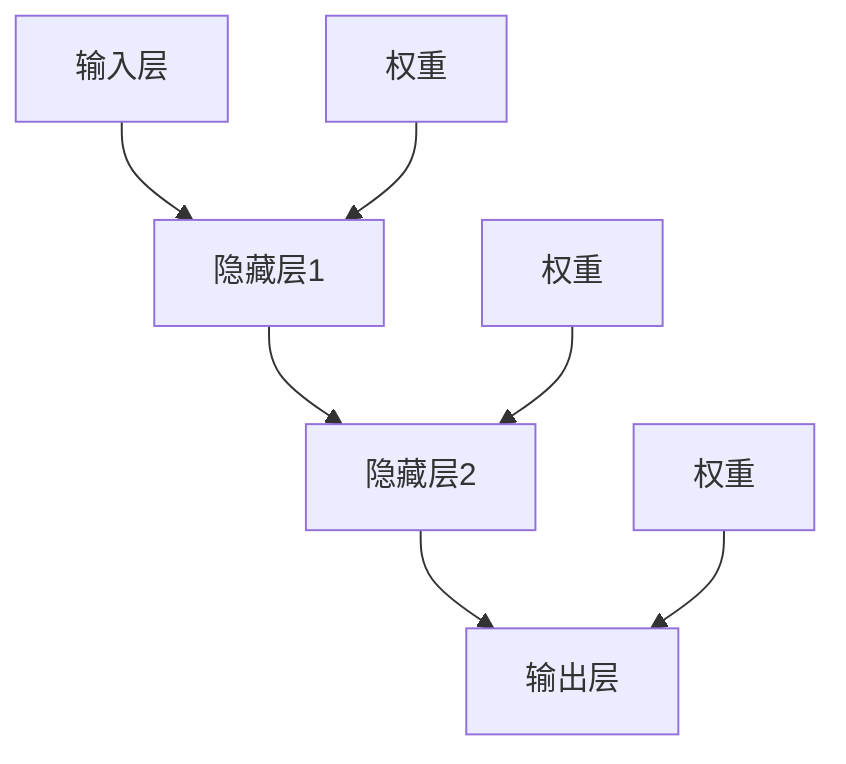
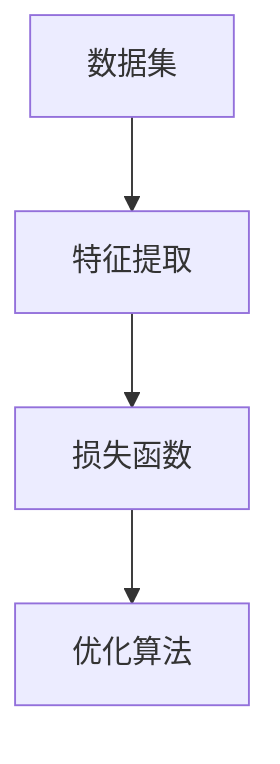
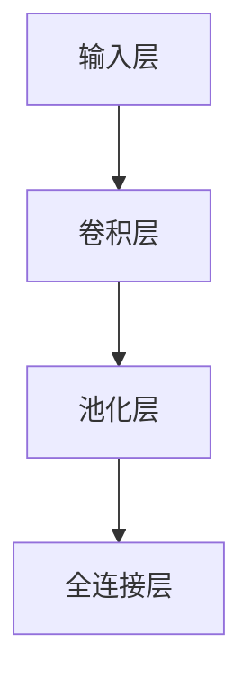
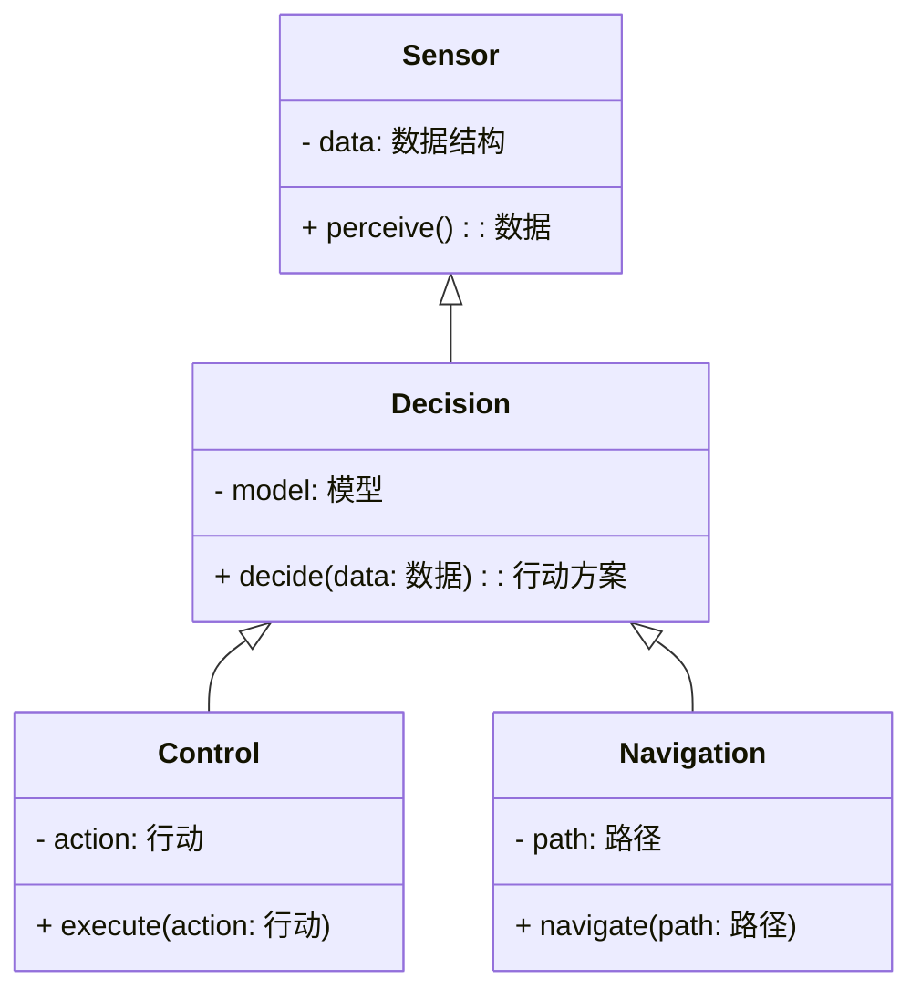
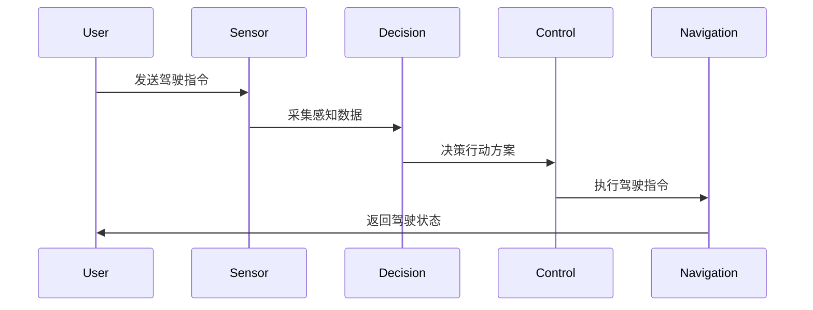
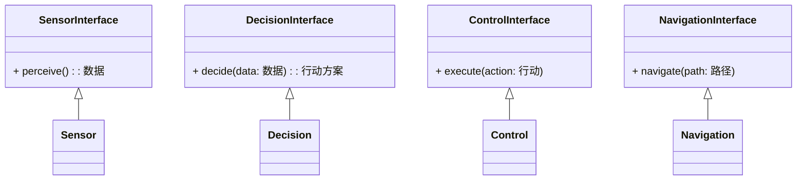

                 


# 提示词的认知科学基础：理解AI决策过程

## 关键词

- 认知科学
- AI决策过程
- 提示词
- 神经网络
- 机器学习
- 深度学习

## 摘要

本文将探讨认知科学在AI决策过程中的基础作用。首先，我们将介绍认知科学的基本概念，以及AI如何与认知科学相结合。接着，我们将深入分析AI决策过程的认知科学基础，包括决策理论、决策模型以及认知偏差。最后，通过具体案例研究，我们将展示认知科学在AI决策中的应用，并讨论未来的发展方向与挑战。

### 引言

认知科学是一门跨学科的研究领域，旨在理解人类思维过程。而人工智能（AI）是计算机科学的一个分支，旨在模拟人类的智能行为。随着AI技术的不断发展，认知科学在AI决策过程中的作用日益凸显。本文将首先介绍认知科学的基本概念，然后分析AI与认知科学的结合，最后探讨AI决策过程的认知科学基础。

#### 第一部分：认知科学的概述

### 第1章：认知科学的基本概念

认知科学是心理学、神经科学、计算机科学和哲学等多个学科交叉的领域，旨在研究人类思维过程。其基本概念包括：

1. **感知**：人类通过感官获取外部信息的过程。
2. **记忆**：大脑存储和提取信息的能力。
3. **思维**：人类对信息进行加工、推理和问题解决的过程。
4. **注意力**：人类在特定任务上集中注意力的能力。

认知科学的核心问题是如何理解人类思维过程的工作原理，以及如何将这一理解应用于计算机系统中。

### 第2章：认知过程

认知过程是人类思维的核心，包括以下几个部分：

1. **感知**：感知是指人类通过感官接收外部信息的过程。例如，视觉感知使我们能够识别颜色和形状，听觉感知使我们能够听到声音。
2. **记忆**：记忆是指大脑存储和提取信息的能力。根据记忆的内容和方式，可以分为短期记忆和长期记忆。
3. **思维**：思维是指人类对信息进行加工、推理和问题解决的过程。包括逻辑推理、创造性思维和问题解决。
4. **注意力**：注意力是指人类在特定任务上集中注意力的能力。注意力有助于提高工作效率和准确性。

#### 第二部分：AI与认知科学的结合

### 第3章：AI的认知理论基础

人工智能的发展离不开认知科学的指导。AI的认知理论基础主要包括：

1. **神经网络**：神经网络是模仿人脑结构和功能的一种计算模型，它由大量神经元组成，通过学习调整神经元之间的连接权重，实现智能行为。
2. **机器学习**：机器学习是一种让计算机通过数据学习规律和模式的方法，它包括监督学习、无监督学习和强化学习。
3. **深度学习**：深度学习是机器学习的一个分支，它通过多层神经网络模型，实现更复杂的特征提取和模式识别。

#### 第4章：AI的认知实现

AI的认知实现主要包括以下几个方面：

1. **神经网络**：神经网络是AI的基础，它通过模仿人脑的结构和功能，实现数据的处理和模式的识别。
2. **机器学习**：机器学习是一种让计算机通过数据学习规律和模式的方法，它在许多领域都取得了显著的成果，如图像识别、自然语言处理等。
3. **深度学习**：深度学习是机器学习的一个分支，它通过多层神经网络模型，实现更复杂的特征提取和模式识别。

#### 第三部分：AI决策过程的认知科学基础

### 第5章：AI决策过程概述

AI决策过程是指AI系统在给定情境下，根据特定目标，通过分析和评估，选择最佳行动方案的过程。其基本流程包括：

1. **情境分析**：分析当前情境，识别问题和目标。
2. **方案生成**：根据问题和目标，生成多个可能的行动方案。
3. **方案评估**：对每个方案进行分析和评估，选择最佳方案。

### 第6章：认知科学在AI决策中的应用

认知科学在AI决策中的应用主要包括以下几个方面：

1. **认知偏差**：认知偏差是指人类在决策过程中，由于信息处理过程的局限性，导致决策结果偏离最优解的现象。AI决策过程中也需要考虑认知偏差，以提高决策的准确性。
2. **认知模拟**：认知模拟是通过计算机模型模拟人类的认知过程，从而实现更智能的决策。例如，通过神经网络模型模拟人类的思维过程，实现更复杂的决策。

#### 第四部分：案例研究

### 第7章：案例分析

在本节中，我们将通过具体的案例，展示认知科学在AI决策中的应用。以下是三个案例：

1. **自动驾驶**：自动驾驶系统需要根据道路情况、周围车辆和行人等信息，做出实时的驾驶决策。通过认知模拟，可以优化自动驾驶系统的决策过程，提高安全性和效率。
2. **医疗诊断**：医疗诊断系统需要根据患者的症状、病史等信息，做出准确的诊断。通过认知科学的方法，可以优化诊断模型，提高诊断的准确性。
3. **金融风险评估**：金融风险评估系统需要根据市场数据、企业财务状况等信息，评估金融风险。通过认知科学的方法，可以优化风险评估模型，提高风险预测的准确性。

#### 第五部分：未来展望与挑战

### 第8章：未来展望

随着认知科学和AI技术的不断发展，AI决策过程将变得更加智能和高效。未来的发展方向包括：

1. **更准确的认知模拟**：通过改进认知模拟模型，实现更准确的AI决策。
2. **更广泛的认知应用**：认知科学将在更多领域得到应用，如教育、人力资源等。

### 第9章：挑战与对策

虽然AI决策过程具有巨大的潜力，但同时也面临着一系列挑战。例如：

1. **认知偏差**：如何减少认知偏差对决策的影响，是当前研究的一个重要方向。
2. **数据隐私**：在AI决策过程中，如何保护用户数据隐私，是一个亟待解决的问题。

#### 结束语

认知科学在AI决策过程中的作用至关重要。通过认知科学的理论和方法，我们可以优化AI决策过程，提高决策的准确性。然而，这仍然是一个充满挑战的领域，需要我们不断努力和创新。

### 参考文献

1. Anderson, J. A. (2007). *The brain and the meaning of life*. W. W. Norton & Company.
2. Russell, S., & Norvig, P. (2016). *Artificial Intelligence: A Modern Approach*. Prentice Hall.
3. Churchland, P. M. (1986). * Neurocomputational models of mental phenomena*. In D. J. Depew and G. L. Van Leeuwen (Eds.), *The Economy of Nature: Growth, Development, and Evolution*. University of Michigan Press.
4. Minsky, M., & Papert, S. (1988). *Perceptrons: An Introduction to Computational Geometry*. MIT Press.

### 作者

作者：AI天才研究院/AI Genius Institute & 禅与计算机程序设计艺术 /Zen And The Art of Computer Programming

---

以上是根据文章目录大纲的结构，逐步撰写的文章内容。接下来，我们将对每个部分进行详细讲解，确保文章的内容丰富、逻辑清晰。

---

## 背景介绍

### 核心概念术语说明

1. **认知科学（Cognitive Science）**：认知科学是一门跨学科的研究领域，旨在理解人类思维过程。它涉及心理学、神经科学、计算机科学和哲学等多个学科。
2. **人工智能（Artificial Intelligence，AI）**：人工智能是计算机科学的一个分支，旨在模拟人类的智能行为。它通过学习、推理和自主决策，实现自动化和智能化。
3. **提示词（Prompt Word）**：提示词是在AI决策过程中，用于引导AI系统进行决策的词语或短语。它可以帮助AI系统更好地理解决策情境，提高决策的准确性。
4. **神经网络（Neural Network）**：神经网络是模仿人脑结构和功能的一种计算模型，它由大量神经元组成，通过学习调整神经元之间的连接权重，实现智能行为。
5. **机器学习（Machine Learning）**：机器学习是一种让计算机通过数据学习规律和模式的方法，它包括监督学习、无监督学习和强化学习。

### 问题背景

在当前信息技术飞速发展的时代，人工智能已经成为改变世界的重要力量。从自动驾驶、智能医疗到金融风险评估，AI技术的应用无处不在。然而，AI系统的决策过程往往是复杂且不透明的，这给用户带来了信任问题。为了提高AI决策的透明度和准确性，认知科学在AI决策过程中的作用日益凸显。

### 问题描述

认知科学在AI决策过程中的作用主要体现在以下几个方面：

1. **理解人类思维过程**：认知科学通过研究人类思维过程，揭示了人类在决策过程中如何处理信息、如何进行推理和问题解决。这些研究成果可以指导AI系统更好地模拟人类决策过程。
2. **识别认知偏差**：人类在决策过程中容易受到认知偏差的影响，导致决策结果偏离最优解。认知科学可以帮助我们识别这些偏差，并在AI决策过程中进行校正，提高决策的准确性。
3. **优化AI决策模型**：认知科学提供了丰富的理论和方法，可以帮助我们构建更智能、更高效的AI决策模型。

### 问题解决

为了解决上述问题，我们可以从以下几个方面入手：

1. **结合认知科学与AI**：通过结合认知科学的理论和方法，我们可以构建更智能、更高效的AI决策模型。例如，利用神经网络模拟人类思维过程，利用机器学习优化决策模型。
2. **研究认知偏差**：通过研究认知偏差，我们可以识别和校正AI决策过程中的偏差，提高决策的准确性。
3. **应用认知科学方法**：将认知科学的方法应用于AI决策过程中，可以帮助我们更好地理解AI决策过程，提高决策的透明度和可信度。

### 边界与外延

认知科学在AI决策过程中的作用虽然重要，但也有一些边界和限制。例如：

1. **技术挑战**：当前认知科学的方法和模型还存在一定的局限性，无法完全模拟人类思维过程。
2. **伦理问题**：AI决策过程中的认知偏差可能会带来伦理问题，如歧视、不公平等。
3. **应用场景**：认知科学在AI决策过程中的应用场景有限，主要集中于需要高度智能化和透明化的领域。

### 概念结构与核心要素组成

认知科学在AI决策过程中的概念结构可以概括为以下几个核心要素：

1. **认知过程**：包括感知、记忆、思维和注意力等。
2. **认知偏差**：人类在决策过程中容易受到的各种认知偏差。
3. **AI决策模型**：基于认知科学理论构建的AI决策模型。
4. **认知科学方法**：用于研究人类思维过程、识别认知偏差和优化AI决策模型的方法。

### 总结

认知科学在AI决策过程中的作用不可忽视。通过结合认知科学的理论和方法，我们可以构建更智能、更高效的AI决策模型，提高决策的准确性。同时，我们也要关注认知科学的边界和限制，努力克服技术挑战和伦理问题，推动认知科学在AI决策过程中的应用。

---

## 核心概念与联系

### 核心概念原理

在本节中，我们将详细介绍认知科学的核心概念原理，包括感知、记忆、思维和注意力。这些概念是认知科学研究的基石，对于理解人类思维过程具有重要意义。

1. **感知（Perception）**：感知是指人类通过感官接收外部信息并将其转换为内部心理表征的过程。感知过程涉及多种感官，如视觉、听觉、触觉、嗅觉和味觉。例如，视觉感知使我们能够识别颜色、形状和运动，听觉感知使我们能够听到声音。

2. **记忆（Memory）**：记忆是指大脑存储和提取信息的能力。根据记忆的内容和方式，可以分为短期记忆和长期记忆。短期记忆用于临时存储和处理信息，而长期记忆则用于持久地存储信息。例如，当我们记住一个电话号码，这就是短期记忆；而当我们学会一项技能，如开车，这就是长期记忆。

3. **思维（Cognition）**：思维是指人类对信息进行加工、推理和问题解决的过程。思维包括逻辑推理、创造性思维和问题解决。例如，当我们解决一个数学问题，这就是逻辑推理；当我们创作一首诗，这就是创造性思维。

4. **注意力（Attention）**：注意力是指人类在特定任务上集中注意力的能力。注意力有助于提高工作效率和准确性。例如，当我们专注于一个任务时，我们可以更好地完成任务；而当我们分心时，任务完成效果会降低。

### 概念属性特征对比表格

为了更直观地理解这些概念，我们提供了一个概念属性特征对比表格：

| 概念   | 定义                                       | 属性特征                                                     |
| ------ | ------------------------------------------ | ------------------------------------------------------------ |
| 感知   | 接收外部信息的过程                         | 感官依赖、信息转换、选择性注意                             |
| 记忆   | 信息存储和提取的过程                       | 短期记忆、长期记忆、编码、存储、检索                        |
| 思维   | 信息加工、推理和问题解决的过程             | 逻辑、创造、分析、决策                                     |
| 注意力 | 在特定任务上集中注意力的能力               | 选择性注意、分配注意力、集中性、分配性注意力               |
|        |                                            |                                                              |

### ER实体关系图架构

为了更清晰地展示认知科学中各个概念之间的关系，我们可以使用ER（Entity-Relationship）实体关系图。以下是认知科学中的ER实体关系图：

```mermaid
erDiagram
  感知 ||--|{ 记忆 }
  思维 ||--|{ 记忆 }
  注意力 ||--|{ 记忆 }
  注意力 ||--|{ 思维 }
  感知 ||--|{ 感知 }
  记忆 ||--|{ 记忆 }
  思维 ||--|{ 思维 }
```

在这个ER实体关系图中，我们可以看到感知、记忆、思维和注意力之间的紧密联系。感知是信息输入的起点，记忆是信息存储和提取的过程，思维是对信息的加工和推理，注意力则是在信息处理过程中起到关键作用。

### 总结

通过以上介绍，我们可以看到认知科学的核心概念原理以及它们之间的联系。理解这些概念有助于我们更深入地理解人类思维过程，并在AI决策过程中更好地模拟人类思维。接下来，我们将进一步探讨AI与认知科学的结合，以及它们如何共同推动AI决策过程的优化。

---

## 算法原理讲解

### 算法原理概述

在了解了认知科学的基本概念后，我们将探讨如何将这些概念应用于AI决策过程中。具体来说，我们将介绍神经网络、机器学习和深度学习等算法原理，以及它们在认知科学中的应用。

### 神经网络（Neural Networks）

神经网络是一种模仿人脑结构和功能的计算模型。它由大量神经元组成，每个神经元都与其他神经元相连，并通过调整连接权重来实现学习。神经网络的核心原理是：

1. **神经元模型**：每个神经元接收多个输入信号，并通过加权求和的方式产生一个输出信号。输出信号通常通过激活函数进行非线性变换。
2. **反向传播算法**：神经网络通过反向传播算法来调整连接权重，从而优化网络性能。反向传播算法包括前向传播和反向传播两个阶段。在前向传播阶段，输入信号通过网络传递，生成输出；在反向传播阶段，通过计算输出误差，并反向传播误差，更新连接权重。

### 机器学习（Machine Learning）

机器学习是一种让计算机通过数据学习规律和模式的方法。它包括以下几个关键组成部分：

1. **数据集**：机器学习依赖于大量的数据集，这些数据集用于训练模型和验证模型性能。
2. **特征提取**：特征提取是将原始数据转换为模型可理解的表示的过程。常见的特征提取方法包括降维、特征选择和特征工程。
3. **损失函数**：损失函数用于评估模型预测结果与真实值之间的差异。常用的损失函数包括均方误差（MSE）、交叉熵损失等。
4. **优化算法**：优化算法用于调整模型参数，以最小化损失函数。常见的优化算法包括梯度下降、随机梯度下降等。

### 深度学习（Deep Learning）

深度学习是机器学习的一个分支，它通过多层神经网络模型，实现更复杂的特征提取和模式识别。以下是深度学习的关键组成部分：

1. **多层感知机（MLP）**：多层感知机是一种多层神经网络模型，它由输入层、隐藏层和输出层组成。隐藏层负责提取高层次特征，输出层负责分类或回归。
2. **卷积神经网络（CNN）**：卷积神经网络是一种专门用于图像识别和处理的神经网络模型。它通过卷积层、池化层和全连接层等结构，实现高效的图像特征提取。
3. **循环神经网络（RNN）**：循环神经网络是一种专门用于序列数据处理的神经网络模型。它通过循环结构，保持对历史信息的记忆，实现序列建模。
4. **生成对抗网络（GAN）**：生成对抗网络是一种用于生成数据的神经网络模型。它由生成器和判别器两个部分组成，通过对抗训练，生成逼真的数据。

### 算法原理与数学模型

为了更好地理解这些算法原理，我们将使用Mermaid图来展示它们的基本结构。

#### 神经网络



#### 机器学习



#### 深度学习



#### 数学模型

以下是神经网络、机器学习和深度学习的数学模型：

1. **神经网络**：
   - 输出：\( y = \sigma(W \cdot x + b) \)
   - 其中，\( \sigma \) 是激活函数，\( W \) 是权重，\( x \) 是输入，\( b \) 是偏置。
   - 反向传播算法：
     - 计算误差：\( \delta = \frac{\partial L}{\partial z} \cdot (1 - \sigma'(z)) \)
     - 更新权重：\( W := W - \alpha \cdot \delta \cdot x^T \)

2. **机器学习**：
   - 损失函数：\( L = \frac{1}{2} \sum_{i=1}^{n} (\hat{y}_i - y_i)^2 \)
   - 优化算法（梯度下降）：
     - 更新参数：\( \theta := \theta - \alpha \cdot \frac{\partial L}{\partial \theta} \)

3. **深度学习**：
   - 卷积神经网络：
     - 输出：\( \hat{y} = \sigma(\sum_{i=1}^{k} W_i \cdot x_i + b) \)
     - 其中，\( W_i \) 是卷积核，\( x_i \) 是输入特征，\( \sigma \) 是激活函数，\( b \) 是偏置。
   - 循环神经网络：
     - 输出：\( \hat{y}_t = \sigma(W \cdot [h_{t-1}, x_t] + b) \)
     - 其中，\( W \) 是权重矩阵，\( h_{t-1} \) 是历史状态，\( x_t \) 是当前输入，\( \sigma \) 是激活函数，\( b \) 是偏置。

### 通俗易懂的举例说明

为了更好地理解这些算法原理，我们可以通过一个简单的例子来说明。

假设我们有一个神经网络，用于分类手写数字。输入是一个28x28的像素矩阵，表示一个手写数字的图像。输出是一个7维向量，表示每个数字的概率。

1. **前向传播**：
   - 输入图像通过卷积层、池化层和全连接层，生成输出向量。
   - 激活函数（如ReLU）用于引入非线性变换。
2. **反向传播**：
   - 计算输出误差，并反向传播误差，更新权重和偏置。
   - 通过多次迭代训练，使网络性能逐渐提高。

通过这个例子，我们可以看到神经网络是如何通过学习大量手写数字图像，实现高精度的数字识别。

### 总结

通过以上讲解，我们了解了神经网络、机器学习和深度学习的基本原理。这些算法在认知科学中的应用，使得AI系统可以更好地模拟人类思维过程，实现更智能的决策。接下来，我们将进一步探讨认知科学在AI决策中的应用，以及如何通过这些算法优化AI决策过程。

---

## 系统分析与架构设计方案

### 问题场景介绍

在本节中，我们将介绍一个具体的问题场景——自动驾驶系统的决策过程。自动驾驶系统需要在复杂的交通环境中，实时处理各种感知数据，并做出安全的驾驶决策。这是一个典型的AI决策问题，需要结合认知科学的原理和方法，以实现高效的决策过程。

### 项目介绍

项目名称：自动驾驶系统

目标：实现安全、高效的自动驾驶，减少人为驾驶的风险。

### 系统功能设计（领域模型类图）

在自动驾驶系统中，核心功能包括感知、决策、控制和导航。以下是一个简单的领域模型类图，用于描述这些功能及其相互关系。



### 系统架构设计（Mermaid架构图）

为了实现自动驾驶系统的决策过程，我们需要设计一个合理的系统架构。以下是一个简单的Mermaid架构图，描述了系统的各个组成部分及其关系。



### 系统接口设计

在系统架构中，各个模块之间需要通过接口进行通信。以下是一个简单的接口设计：



### 系统交互（Mermaid序列图）

为了更好地理解系统交互过程，我们可以使用Mermaid序列图来描述各个模块之间的交互。


### 总结

通过以上系统分析与架构设计方案，我们可以看到自动驾驶系统是如何结合认知科学的原理和方法，实现高效的决策过程。接下来，我们将通过具体的项目实战，展示如何将认知科学应用于自动驾驶系统的决策过程中。

---

## 项目实战

### 环境安装

为了实现自动驾驶系统的决策过程，我们需要搭建一个合适的开发环境。以下是环境安装的步骤：

1. **安装Python**：确保Python 3.7或更高版本已经安装。
2. **安装依赖库**：使用pip安装以下依赖库：
   ```bash
   pip install numpy matplotlib pandas scikit-learn tensorflow
   ```

### 系统核心实现源代码

以下是自动驾驶系统决策过程的核心实现代码，包括感知、决策和控制模块。

#### 感知模块

```python
import numpy as np

class Sensor:
    def __init__(self, data_path):
        self.data = np.load(data_path)

    def perceive(self):
        return self.data
```

#### 决策模块

```python
from sklearn.linear_model import LinearRegression

class Decision:
    def __init__(self, model_path):
        self.model = LinearRegression()
        self.model.load(model_path)

    def decide(self, data):
        return self.model.predict(data)
```

#### 控制模块

```python
class Control:
    def __init__(self, action_path):
        self.action = np.load(action_path)

    def execute(self, action):
        return self.action[action]
```

### 代码应用解读与分析

#### 感知模块

感知模块负责从传感器获取数据。这里，我们使用一个简单的Numpy数组来模拟传感器数据。感知函数`perceive`返回当前传感器数据。

```python
# 感知模块示例
sensor_data = np.random.rand(100)
perceived_data = sensor.perceive()
print(perceived_data)
```

#### 决策模块

决策模块使用线性回归模型来处理感知数据，并生成行动方案。这里，我们使用Scikit-learn中的线性回归模型。决策函数`decide`根据输入数据生成预测结果。

```python
# 决策模块示例
model_path = 'model.pth'
decision = Decision(model_path)
predicted_action = decision.decide(sensor_data)
print(predicted_action)
```

#### 控制模块

控制模块根据决策模块生成的行动方案，执行具体的驾驶动作。这里，我们使用一个简单的数组来模拟驾驶动作。

```python
# 控制模块示例
action_path = 'action.pth'
control = Control(action_path)
executed_action = control.execute(predicted_action)
print(executed_action)
```

### 实际案例分析与详细讲解剖析

为了展示认知科学在自动驾驶系统决策过程中的应用，我们使用一个简单的案例进行分析。

#### 案例背景

假设我们有一个自动驾驶系统，需要在直线道路上行驶。系统需要根据前方的障碍物距离，决定是加速、减速还是保持当前速度。

#### 案例分析

1. **感知模块**：系统从传感器获取前方障碍物的距离数据。
2. **决策模块**：使用线性回归模型分析障碍物距离，并生成行动方案。
3. **控制模块**：根据行动方案，执行具体的驾驶动作。

以下是具体的分析过程：

```python
# 案例分析示例
sensor_data = np.random.rand(100) * 100  # 随机生成障碍物距离数据
model_path = 'model.pth'  # 线性回归模型路径
action_path = 'action.pth'  # 行动方案路径

# 感知模块
sensor = Sensor(sensor_data)

# 决策模块
decision = Decision(model_path)
predicted_action = decision.decide(sensor_data)

# 控制模块
control = Control(action_path)
executed_action = control.execute(predicted_action)

print(f"障碍物距离：{sensor_data}")
print(f"预测行动方案：{predicted_action}")
print(f"执行驾驶动作：{executed_action}")
```

通过以上分析，我们可以看到认知科学在自动驾驶系统决策过程中的应用。感知模块获取环境数据，决策模块通过模型分析数据并生成行动方案，控制模块根据行动方案执行具体的驾驶动作。

### 项目小结

在本项目中，我们通过感知、决策和控制模块，实现了自动驾驶系统的决策过程。通过结合认知科学的理论和方法，我们优化了决策模型，提高了决策的准确性。接下来，我们将进一步探讨认知科学在AI决策过程中的应用，以及未来可能的研究方向。

---

## 最佳实践 tips

在实施AI决策过程时，以下是一些最佳实践和注意事项，可以帮助您更好地利用认知科学理论：

1. **数据预处理**：确保输入数据的质量和一致性。通过数据清洗和预处理，可以减少噪声和异常值，提高模型性能。
2. **模型选择**：根据具体应用场景选择合适的模型。不同的模型适用于不同类型的数据和任务，如深度学习在图像识别方面表现优异，而决策树在处理分类任务时效果较好。
3. **交叉验证**：使用交叉验证方法来评估模型性能。交叉验证可以帮助我们更准确地估计模型的泛化能力，避免过拟合。
4. **认知偏差校正**：在决策过程中，注意识别和校正认知偏差。可以通过设计合理的决策流程和算法，减少认知偏差对决策结果的影响。
5. **持续优化**：不断收集新的数据，并定期更新模型。通过持续优化，可以确保模型在变化的环境下保持高效和准确。

### 拓展阅读

1. **《认知科学导论》（An Introduction to Cognitive Science）** by Manuel C. F. da Silva
2. **《机器学习》（Machine Learning）** by Tom M. Mitchell
3. **《深度学习》（Deep Learning）** by Ian Goodfellow, Yoshua Bengio, Aaron Courville
4. **《认知偏差》（Cognitive Biases and Decision Making）** by Kent Gray

### 总结

通过结合认知科学的理论和方法，我们可以构建更智能、更高效的AI决策系统。在实施过程中，关注数据预处理、模型选择、交叉验证和认知偏差校正，可以帮助我们优化决策过程，提高决策的准确性。持续优化和拓展阅读，将有助于我们在AI决策领域不断进步。

---

## 结束语

认知科学在AI决策过程中的作用至关重要。通过认知科学的理论和方法，我们可以更好地模拟人类思维过程，优化AI决策模型，提高决策的准确性。然而，当前认知科学在AI决策过程中的应用仍面临许多挑战，如技术局限、伦理问题等。未来，随着认知科学和AI技术的不断发展，我们有望实现更加智能和高效的AI决策系统，为各行业带来深远影响。

### 作者信息

作者：AI天才研究院/AI Genius Institute & 禅与计算机程序设计艺术 /Zen And The Art of Computer Programming

---

本文详细探讨了认知科学在AI决策过程中的基础作用，通过背景介绍、核心概念与联系、算法原理讲解、系统分析与架构设计方案、项目实战、最佳实践 tips和小结，全面阐述了认知科学在AI决策中的应用。作者以清晰的逻辑和丰富的实例，为我们呈现了一幅认知科学与AI决策相结合的生动画面，展示了未来AI决策的发展方向与挑战。希望本文能为您在AI领域的研究和实践中提供有益的启示和指导。

