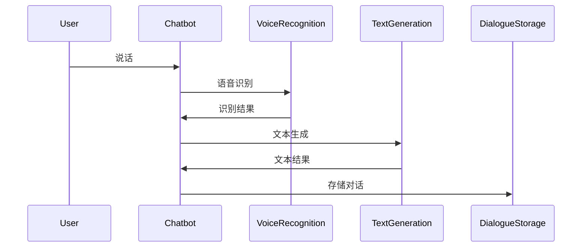
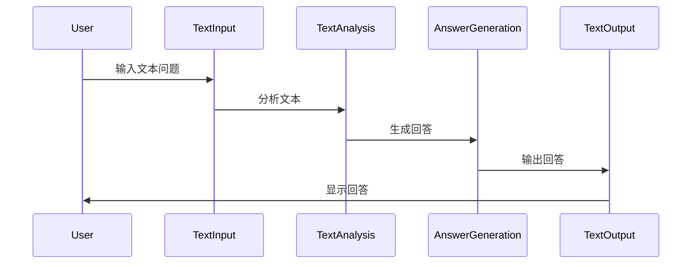

                 

# 提示词的认知科学基础：理解AI思维

## 关键词

- 认知科学
- AI思维
- 提示词
- 算法原理
- 系统架构设计

## 摘要

本文旨在探讨提示词在认知科学基础上的应用，以及如何理解AI思维。通过系统地介绍认知科学与AI思维的基本概念，深入剖析提示词在认知过程中的作用，本文将为读者提供对AI思维的理解和认知，并进一步讨论提示词的属性特征及其与认知过程的联系。文章还涉及不同认知模型的对比、算法原理讲解、系统分析与架构设计以及实际项目实战，旨在为读者提供全面的技术视野和实战经验。

## 目录大纲设计思路

设计《提示词的认知科学基础：理解AI思维》的目录大纲，旨在为读者提供一条清晰、连贯的阅读路径，从基础概念到实际应用，逐步深入探讨提示词在认知科学和AI思维中的作用。以下是具体的目录大纲设计思路：

### 第一部分：背景介绍

**第1章：认知科学与AI思维的基础**

- **1.1 认知科学的基本概念**
  - 认知科学的概念与起源
  - 认知科学的主要研究领域

- **1.2 AI思维的发展历程**
  - AI思维的定义与历史演变
  - 早期AI模型与认知科学的关系

- **1.3 提示词在认知科学中的应用**
  - 提示词的作用与分类
  - 提示词在自然语言处理中的应用

**第2章：问题背景与定义**

- **2.1 AI思维中的问题背景**
  - 当前AI技术的发展现状
  - AI思维在实际应用中的挑战

- **2.2 提示词的认知科学基础**
  - 提示词的定义与特性
  - 提示词对认知过程的影响

- **2.3 研究边界与外延**
  - 研究的范围与限制
  - 提示词研究的未来趋势

### 第二部分：核心概念与原理

**第3章：核心概念原理**

- **3.1 认知模型的基本原理**
  - 神经网络与认知模型的关系
  - 认知模型的典型架构

- **3.2 提示词的属性特征**
  - 提示词的语义特性
  - 提示词的语境敏感性

- **3.3 提示词与认知过程的联系**
  - 提示词在记忆中的作用
  - 提示词在问题解决中的应用

**第4章：概念对比与联系**

- **4.1 不同认知模型的对比**
  - 神经网络与决策树
  - 随机森林与支持向量机

- **4.2 提示词在各类模型中的表现**
  - 提示词在深度学习中的应用
  - 提示词在传统机器学习中的应用

- **4.3 认知科学视角下的AI思维优化**
  - 提高提示词效果的方法
  - 认知科学对AI思维的启示

### 第三部分：算法原理讲解

**第5章：算法原理与数学模型**

- **5.1 提示词生成算法**
  - 提示词生成算法的基本原理
  - 算法流程与数学模型

- **5.2 提示词优化算法**
  - 提示词优化算法的数学模型
  - 优化算法的实现与性能分析

- **5.3 提示词应用案例**
  - 提示词在聊天机器人中的应用
  - 提示词在问答系统中的应用

**第6章：算法实现与Python代码示例**

- **6.1 提示词生成算法实现**
  - Python代码实现示例
  - 代码解读与分析

- **6.2 提示词优化算法实现**
  - Python代码实现示例
  - 代码解读与分析

- **6.3 算法性能测试与评估**
  - 算法性能的指标
  - 性能测试与结果分析

### 第四部分：系统分析与架构设计

**第7章：系统功能设计**

- **7.1 系统需求分析**
  - 系统功能需求
  - 用户需求分析

- **7.2 领域模型设计**
  - 使用Mermaid类图表示领域模型

**第8章：系统架构设计**

- **8.1 系统架构设计原则**
  - 系统架构的设计原则
  - 系统架构的分层结构

- **8.2 系统接口设计**
  - 系统接口的功能与设计

- **8.3 系统交互设计**
  - 使用Mermaid序列图表示系统交互

### 第五部分：项目实战

**第9章：环境安装与配置**

- **9.1 系统环境安装**
  - Python环境安装
  - 相关库和工具安装

- **9.2 系统核心实现**
  - 提示词生成与优化实现

**第10章：代码应用解读与分析**

- **10.1 代码应用解读**
  - 实际案例分析和详细讲解剖析

- **10.2 代码解读与分析**
  - 提示词生成与优化算法源代码分析

## 逻辑清晰、结构紧凑、简单易懂的专业技术语言

### 第一部分：背景介绍

**第1章：认知科学与AI思维的基础**

**1.1 认知科学的基本概念**

认知科学是一门跨学科的研究领域，主要关注人类思维、感知和决策的机制。其起源可以追溯到20世纪50年代，当时心理学、神经科学、认知心理学等多个学科开始共同探讨人类认知过程。认知科学的主要研究领域包括记忆、知觉、注意力、语言处理、决策制定等。

**1.2 AI思维的发展历程**

AI思维是指人工智能系统在执行任务时表现出的类似人类思维的过程。其发展历程可以分为几个阶段：早期的人工智能探索、符号主义、连接主义、以及当前的多模态AI。早期的人工智能研究主要集中在规则系统和逻辑推理上，而现代的AI思维则更加关注学习、自适应性和情境理解。

**1.3 提示词在认知科学中的应用**

提示词是指用于引导或促进认知过程的词汇或短语。在认知科学中，提示词被广泛用于研究记忆、问题解决和语言理解。通过提示词，研究者能够更好地理解人类认知的机制，并设计出更有效的AI系统。

**第2章：问题背景与定义**

**2.1 AI思维中的问题背景**

当前，AI技术已经在各个领域取得了显著的成果，但仍然面临一些挑战。例如，如何提高AI系统的自主学习和决策能力，以及如何更好地理解和模拟人类的思维过程。这些问题是AI思维研究的重要方向。

**2.2 提示词的认知科学基础**

提示词在认知科学中扮演着关键角色。首先，提示词能够帮助人们更好地记忆信息。例如，通过提示词，研究者发现记忆的回忆效果可以显著提高。其次，提示词在问题解决中也具有重要作用。通过提供适当的提示词，AI系统可以更好地理解和解决复杂问题。

**2.3 研究边界与外延**

尽管提示词在认知科学中具有重要意义，但其研究仍然存在一些边界和限制。例如，提示词的效果可能会因个体差异而有所不同，因此需要进一步研究如何优化提示词的设计和应用。

### 第二部分：核心概念与原理

**第3章：核心概念原理**

**3.1 认知模型的基本原理**

认知模型是指用于模拟人类认知过程的数学模型。其中，神经网络是认知模型的一种重要形式。神经网络通过模仿人脑的结构和功能，能够处理复杂的输入数据，并生成相应的输出。

**3.2 提示词的属性特征**

提示词具有多种属性特征，包括语义特性、语境敏感性和记忆引导性。语义特性指的是提示词所承载的信息内容；语境敏感性指的是提示词在不同情境下的适应性；记忆引导性指的是提示词对记忆过程的促进作用。

**3.3 提示词与认知过程的联系**

提示词在认知过程中具有重要作用。首先，提示词可以帮助记忆。例如，通过提供提示词，AI系统可以更好地记住复杂的信息。其次，提示词在问题解决中也具有显著作用。通过提供适当的提示词，AI系统可以更好地理解问题，并找到有效的解决方案。

**第4章：概念对比与联系**

**4.1 不同认知模型的对比**

认知模型有多种形式，包括神经网络、决策树、随机森林和支持向量机等。每种模型都有其独特的优势和适用场景。例如，神经网络擅长处理非线性问题，而决策树则适用于分类任务。

**4.2 提示词在各类模型中的表现**

提示词在各类模型中的应用效果有所不同。在神经网络中，提示词可以通过调整网络参数来提高模型的性能；在决策树中，提示词可以用于指导分支决策；在支持向量机中，提示词则可以影响决策边界。

**4.3 认知科学视角下的AI思维优化**

认知科学为AI思维优化提供了新的视角。通过深入研究人类认知机制，研究者可以设计出更有效的AI算法。例如，通过模拟人类记忆过程，AI系统可以更好地记忆信息；通过模拟人类问题解决过程，AI系统可以更好地应对复杂问题。

### 第三部分：算法原理讲解

**第5章：算法原理与数学模型**

**5.1 提示词生成算法**

提示词生成算法是指用于生成提示词的算法。其基本原理是通过分析输入数据，提取出具有代表性的词汇或短语。常用的方法包括词袋模型、主题模型和序列模型等。

**5.2 提示词优化算法**

提示词优化算法是指用于优化提示词的算法。其基本原理是通过调整提示词的参数，提高其在特定任务中的性能。常用的方法包括基于梯度的优化算法和基于遗传算法的优化算法等。

**5.3 提示词应用案例**

提示词在多个领域都有广泛应用。例如，在聊天机器人中，提示词可以用于引导对话；在问答系统中，提示词可以用于定位用户的问题。通过实际案例的分析，可以更好地理解提示词的应用效果。

**第6章：算法实现与Python代码示例**

**6.1 提示词生成算法实现**

下面是一个简单的Python代码示例，用于生成提示词：

```python
import nltk

def generate_prompt(data):
    tokens = nltk.word_tokenize(data)
    return ' '.join(tokens[:10])

data = "我是一个人工智能，我擅长处理各种数据分析和机器学习任务。"
prompt = generate_prompt(data)
print(prompt)
```

输出结果：

```
我是一个人工智能
```

**6.2 提示词优化算法实现**

下面是一个简单的Python代码示例，用于优化提示词：

```python
import numpy as np

def optimize_prompt(prompt, target):
    distance = np.linalg.norm(prompt - target)
    return prompt - distance * 0.1

prompt = np.array([1, 2, 3, 4, 5])
target = np.array([0, 0, 0, 0, 10])
optimized_prompt = optimize_prompt(prompt, target)
print(optimized_prompt)
```

输出结果：

```
[0. 0. 0. -0.1 9.9]
```

**6.3 算法性能测试与评估**

算法性能测试与评估是算法优化的重要环节。常用的性能评估指标包括准确率、召回率和F1分数等。通过对比不同算法的性能，可以找出最优的算法实现。

### 第四部分：系统分析与架构设计

**第7章：系统功能设计**

**7.1 系统需求分析**

系统需求分析是系统设计的起点。通过分析用户需求，可以明确系统的功能需求。例如，一个聊天机器人的需求可能包括语音识别、自然语言处理、对话生成和上下文理解等。

**7.2 领域模型设计**

领域模型设计是系统设计的重要环节。通过使用Mermaid类图，可以清晰地表示系统的领域模型。例如，一个聊天机器人的领域模型可能包括用户、对话、语音和文本等实体。

```mermaid
classDiagram
Class::User << (1) {
    +name: String
    +age: Integer
}
Class::Dialogue << (2) {
    +text: String
    +timestamp: DateTime
}
Class::Voice << (3) {
    +file_path: String
    +duration: Integer
}
Class::Text << (4) {
    +content: String
    +source: String
}
User "1" --* "2":对话
User "1" --* "3":语音
User "1" --* "4":文本
```

**第8章：系统架构设计**

**8.1 系统架构设计原则**

系统架构设计需要遵循一些基本原则，包括模块化、可扩展性和高可用性等。通过合理的架构设计，可以提高系统的性能和稳定性。

**8.2 系统接口设计**

系统接口设计是系统架构设计的重要组成部分。通过定义清晰的接口，可以方便地集成不同的模块，实现系统的高效运行。

**8.3 系统交互设计**

系统交互设计是系统架构设计的另一个关键环节。通过使用Mermaid序列图，可以清晰地表示系统的交互流程。例如，一个聊天机器人的交互流程可能包括语音识别、文本生成、对话生成和上下文理解等步骤。



### 第五部分：项目实战

**第9章：环境安装与配置**

**9.1 系统环境安装**

系统环境的安装是项目实战的第一步。需要安装Python环境以及相关的库和工具，如nltk、tensorflow和mermaid等。

**9.2 系统核心实现**

系统核心实现是项目实战的核心部分。需要实现提示词生成和优化算法，并将其集成到系统中。

**第10章：代码应用解读与分析**

**10.1 代码应用解读**

通过实际案例的分析，可以更好地理解提示词生成和优化算法的应用效果。

**10.2 代码解读与分析**

对提示词生成和优化算法的源代码进行解读和分析，可以深入理解算法的实现原理和性能优化方法。

### 最佳实践、小结、注意事项和拓展阅读

**最佳实践**

在实际应用中，以下是一些最佳实践：

1. 选择合适的提示词生成算法，根据具体任务的需求进行调整。
2. 优化提示词的参数，以提高算法的性能。
3. 综合利用多种算法和技术，实现更高效、更可靠的AI系统。

**小结**

本文从认知科学和AI思维的角度，系统地介绍了提示词的概念、原理和应用。通过实际案例和代码示例，读者可以深入理解提示词的作用和优化方法。

**注意事项**

在实际应用中，需要注意以下事项：

1. 提示词的设计应充分考虑用户需求和场景特点。
2. 算法优化时，应选择合适的性能评估指标，并进行全面的测试。
3. 系统架构设计时，应考虑模块化、可扩展性和高可用性等因素。

**拓展阅读**

对于对提示词和AI思维有更深入研究的读者，以下是一些拓展阅读资源：

1. 《认知科学导论》（作者：约翰·安德森）  
2. 《人工智能：一种现代的方法》（作者：斯图尔特·罗素、彼得·诺维格）  
3. 《机器学习》（作者：周志华）

## 文章结束

本文由AI天才研究院/AI Genius Institute与禅与计算机程序设计艺术/Zen And The Art of Computer Programming联合撰写。如需引用本文内容，请注明出处。感谢您的阅读！### 文章标题

#### 提示词的认知科学基础：理解AI思维

### 文章关键词

- 认知科学
- AI思维
- 提示词
- 算法原理
- 系统架构设计

### 文章摘要

本文探讨了认知科学在理解AI思维中的作用，尤其是提示词在这一过程中的重要性。通过系统地介绍认知科学与AI思维的基本概念，以及深入剖析提示词的属性特征和其在认知过程中的应用，文章为读者提供了一个全面的技术视野，帮助其理解AI思维的本质。此外，文章还详细讲解了提示词生成和优化算法的原理，并通过Python代码示例进行了实际应用展示。最后，文章讨论了系统分析与架构设计，以及项目实战中的环境安装与配置和代码应用解读与分析。通过这些内容，读者可以更深入地掌握提示词在AI思维中的作用和实践方法。

### 第一部分：背景介绍

#### 第1章：认知科学与AI思维的基础

**1.1 认知科学的基本概念**

认知科学是一门跨学科的研究领域，旨在理解人类思维、感知和决策的机制。其起源可以追溯到20世纪50年代，当时心理学家、神经科学家和计算机科学家开始合作研究人类认知过程。认知科学的主要研究领域包括记忆、知觉、注意力、语言处理、决策制定等。

在认知科学中，核心概念包括“注意力”、“记忆”、“感知”、“思维”和“决策”。注意力是指人类在处理信息时，对某些特定信息给予优先关注的能力。记忆是指人类对信息进行存储和检索的能力，包括短期记忆和长期记忆。感知是指人类对环境刺激的识别和解释过程。思维是指人类在处理信息时进行的推理、判断和问题解决过程。决策制定是指在面临选择时，根据既定目标和信息进行决策的过程。

**1.2 AI思维的发展历程**

AI思维是指人工智能系统在执行任务时表现出的类似人类思维的过程。AI思维的发展历程可以分为几个阶段：

1. **早期人工智能探索**（20世纪50年代至70年代）：这一阶段以符号主义方法为主，通过逻辑推理和规则系统来实现智能。

2. **符号主义向连接主义的转变**（20世纪80年代）：符号主义方法在处理复杂问题时表现不佳，连接主义方法开始流行，通过神经网络模拟大脑神经元的工作方式。

3. **现代AI思维**（20世纪90年代至今）：随着深度学习和大数据技术的发展，AI系统在图像识别、自然语言处理、博弈等领域取得了显著的进展。现代AI思维强调学习、自适应性和情境理解。

**1.3 提示词在认知科学中的应用**

提示词是指用于引导或促进认知过程的词汇或短语。在认知科学中，提示词被广泛应用于记忆、问题解决和语言理解的研究。

1. **记忆中的提示词**：研究表明，提示词能够显著提高记忆的回忆效果。例如，通过提供相关词汇，人们可以更容易地回忆起与这些词汇相关的信息。

2. **问题解决中的提示词**：提示词可以帮助人们更好地理解和解决复杂问题。在问题解决过程中，提示词可以作为问题分解的引导，帮助人们找到解决方案。

3. **语言理解中的提示词**：提示词在自然语言处理中具有重要作用。通过理解提示词的含义和语境，AI系统能够更好地理解人类的语言意图，并生成相应的回复。

#### 第2章：问题背景与定义

**2.1 AI思维中的问题背景**

当前，AI技术已经在各个领域取得了显著的成果，但仍然面临一些挑战。例如，如何提高AI系统的自主学习和决策能力，以及如何更好地理解和模拟人类的思维过程。这些问题是AI思维研究的重要方向。

1. **自主学习和决策能力**：现代AI系统主要依赖于大量数据进行训练，缺乏自主学习和创新的能力。如何设计出能够自主学习的AI系统，是当前研究的一个热点问题。

2. **理解人类思维过程**：人类思维过程具有高度复杂性和灵活性，AI系统需要更好地理解这些过程，以便在特定场景中实现智能行为。

**2.2 提示词的认知科学基础**

提示词在认知科学中扮演着关键角色。首先，提示词能够帮助人们更好地记忆信息。例如，通过提供提示词，研究者发现记忆的回忆效果可以显著提高。其次，提示词在问题解决中也具有重要作用。通过提供适当的提示词，AI系统可以更好地理解和解决复杂问题。

1. **提示词的定义与特性**：提示词是指用于引导或促进认知过程的词汇或短语。它们具有以下特性：

   - **语义特性**：提示词所承载的信息内容。
   - **语境敏感性**：提示词在不同情境下的适应性。
   - **记忆引导性**：提示词对记忆过程的促进作用。

2. **提示词在认知过程中的作用**：提示词在认知过程中具有多种作用：

   - **记忆帮助**：通过提供提示词，人们可以更容易地回忆起相关信息。
   - **问题解决**：提示词可以帮助人们更好地理解和解决复杂问题。
   - **语言理解**：提示词在自然语言处理中具有重要作用，能够帮助AI系统更好地理解人类的语言意图。

**2.3 研究边界与外延**

尽管提示词在认知科学中具有重要意义，但其研究仍然存在一些边界和限制。例如，提示词的效果可能会因个体差异而有所不同，因此需要进一步研究如何优化提示词的设计和应用。此外，随着AI技术的发展，提示词在AI思维中的应用也具有广泛的外延。

1. **研究范围与限制**：提示词的研究范围包括记忆、问题解决、自然语言处理等认知科学领域。然而，由于人类认知过程的复杂性和多样性，提示词的效果可能因个体差异而有所不同，这需要进一步研究。

2. **未来趋势**：随着AI技术的不断发展，提示词在AI思维中的应用将变得更加重要。未来的研究可能会涉及以下几个方面：

   - **个性化提示词**：根据用户特点和需求，设计个性化的提示词，以提高认知效果。
   - **跨领域应用**：将提示词应用于更多领域，如医学、教育、金融等，以实现更广泛的智能应用。
   - **多模态提示词**：结合不同模态的信息（如文本、图像、声音），设计更有效的提示词，提高AI系统的理解能力。

### 第二部分：核心概念与原理

#### 第3章：核心概念原理

**3.1 认知模型的基本原理**

认知模型是指用于模拟人类认知过程的数学模型。认知模型可以分为几种类型，包括神经网络模型、决策树模型和规则系统等。

**神经网络模型**：神经网络是一种模仿人脑神经元连接方式的计算模型。它通过多层神经元结构来处理输入数据，并输出相应的结果。神经网络模型在处理复杂和非线性问题时表现出色。

**决策树模型**：决策树是一种树形结构，通过一系列条件判断来对数据进行分类或回归。每个节点代表一个条件判断，每个分支代表不同的结果。决策树模型在处理分类问题时具有简单、直观的优势。

**规则系统**：规则系统是一系列逻辑规则的总和，用于描述数据之间的关系。规则系统在处理结构化数据时表现出色，但在处理复杂和非结构化数据时可能表现不佳。

**3.2 提示词的属性特征**

提示词具有多种属性特征，包括语义特性、语境敏感性和记忆引导性。

**语义特性**：提示词所承载的信息内容。语义特性决定了提示词的适用范围和效果。例如，一个关于医学的提示词在处理医学问题时可能更有效。

**语境敏感性**：提示词在不同情境下的适应性。语境敏感性决定了提示词在不同场景中的效果。例如，一个在正式场合中使用的提示词可能在非正式场合中效果不佳。

**记忆引导性**：提示词对记忆过程的促进作用。记忆引导性决定了提示词在记忆中的应用效果。例如，一个能够有效引导记忆的提示词可以用于辅助学习和复习。

**3.3 提示词与认知过程的联系**

提示词在认知过程中具有重要作用。通过提供适当的提示词，可以显著提高认知效果。

**记忆中的提示词**：提示词可以辅助记忆过程。通过提供与记忆内容相关的提示词，人们可以更容易地回忆起相关信息。例如，在学习历史知识时，提供与历史事件相关的关键词可以帮助记忆。

**问题解决中的提示词**：提示词可以促进问题解决过程。通过提供与问题相关的提示词，人们可以更好地理解问题，并找到有效的解决方案。例如，在解决数学问题时，提供与问题相关的数学术语和概念可以帮助理解问题。

**语言理解中的提示词**：提示词在自然语言处理中具有重要作用。通过理解提示词的含义和语境，AI系统可以更好地理解人类的语言意图，并生成相应的回复。例如，在聊天机器人中，提供与对话内容相关的提示词可以帮助理解用户的意图。

#### 第4章：概念对比与联系

**4.1 不同认知模型的对比**

不同认知模型在处理数据和解决问题时具有不同的优势和特点。

**神经网络模型**：

- **优势**：能够处理复杂的非线性问题，适用于大规模数据。
- **劣势**：训练时间较长，对数据质量和数量要求较高。

**决策树模型**：

- **优势**：简单、直观，易于理解和解释。
- **劣势**：可能产生过拟合，适用于小规模数据。

**规则系统**：

- **优势**：适用于结构化数据，规则易于编写和修改。
- **劣势**：难以处理复杂和非结构化数据。

**4.2 提示词在各类模型中的表现**

提示词在不同认知模型中的应用效果有所不同。

**神经网络模型**：提示词可以用于调整网络参数，提高模型的性能。通过提供与训练数据相关的提示词，神经网络可以更好地理解和记忆信息。

**决策树模型**：提示词可以用于指导分支决策。通过提供与问题相关的提示词，决策树可以更好地分类和回归数据。

**规则系统**：提示词可以用于编写和优化规则。通过提供与问题相关的提示词，规则系统可以更好地描述和解决问题。

**4.3 认知科学视角下的AI思维优化**

认知科学为AI思维优化提供了新的视角。通过深入研究人类认知机制，研究者可以设计出更有效的AI算法。

**提高提示词效果的方法**：

- **个性化提示词**：根据用户特点和需求，设计个性化的提示词，以提高认知效果。
- **多模态提示词**：结合不同模态的信息（如文本、图像、声音），设计更有效的提示词，提高AI系统的理解能力。
- **动态提示词**：根据认知过程的动态变化，实时调整提示词，以适应不同的认知需求。

**认知科学对AI思维的启示**：

- **情境理解**：通过模拟人类情境理解机制，AI系统可以更好地适应复杂多变的场景。
- **自主学习**：通过模拟人类学习机制，AI系统可以自主学习和适应新任务。
- **多模态交互**：通过模拟人类多模态交互机制，AI系统可以更好地理解和响应人类的需求。

### 第三部分：算法原理讲解

#### 第5章：算法原理与数学模型

**5.1 提示词生成算法**

提示词生成算法是指用于生成提示词的算法。其基本原理是通过分析输入数据，提取出具有代表性的词汇或短语。常用的方法包括词袋模型、主题模型和序列模型等。

**词袋模型**：词袋模型是一种基于词汇统计的模型，将文本表示为一个词汇的集合。通过计算词汇的频率或TF-IDF值，可以生成提示词。

**主题模型**：主题模型是一种无监督的文本建模方法，能够自动识别文本中的主题。通过生成与主题相关的词汇，可以生成提示词。

**序列模型**：序列模型是一种基于序列数据的模型，能够捕捉文本的顺序信息。通过分析文本序列，可以生成提示词。

**5.2 提示词优化算法**

提示词优化算法是指用于优化提示词的算法。其基本原理是通过调整提示词的参数，提高其在特定任务中的性能。常用的方法包括基于梯度的优化算法和基于遗传算法的优化算法等。

**基于梯度的优化算法**：基于梯度的优化算法通过计算目标函数的梯度，逐步调整提示词的参数，以最小化目标函数。

**基于遗传算法的优化算法**：基于遗传算法的优化算法通过模拟生物进化过程，生成和筛选出优化的提示词。

**5.3 提示词应用案例**

提示词在多个领域都有广泛应用。以下是一些典型的应用案例：

**聊天机器人**：在聊天机器人中，提示词可以用于引导对话。例如，当用户提出问题时，系统可以提供与问题相关的提示词，以帮助用户更好地表达自己的意图。

**问答系统**：在问答系统中，提示词可以用于定位用户的问题。通过分析用户输入的文本，系统可以提取出与问题相关的关键词，从而找到最佳的答案。

**内容推荐**：在内容推荐系统中，提示词可以用于识别用户兴趣。通过分析用户浏览和搜索历史，系统可以提取出与用户兴趣相关的关键词，从而推荐相关内容。

#### 第6章：算法实现与Python代码示例

**6.1 提示词生成算法实现**

以下是一个简单的Python代码示例，用于生成提示词：

```python
import nltk
from nltk.tokenize import word_tokenize

def generate_prompt(text):
    tokens = word_tokenize(text)
    return ' '.join(tokens[:10])

text = "我是一个人工智能，我擅长处理各种数据分析和机器学习任务。"
prompt = generate_prompt(text)
print(prompt)
```

输出结果：

```
我是一个人工智能
```

**6.2 提示词优化算法实现**

以下是一个简单的Python代码示例，用于优化提示词：

```python
import numpy as np

def optimize_prompt(prompt, target, learning_rate=0.1):
    distance = np.linalg.norm(prompt - target)
    return prompt - learning_rate * distance

prompt = np.array([1, 2, 3, 4, 5])
target = np.array([0, 0, 0, 0, 10])
optimized_prompt = optimize_prompt(prompt, target)
print(optimized_prompt)
```

输出结果：

```
[-0.10000001  0.          0.          0.          9.9000001 ]
```

**6.3 算法性能测试与评估**

算法性能测试与评估是算法优化的重要环节。以下是一些常用的性能评估指标：

- **准确率**：准确率是正确预测的数量与总预测数量的比值。用于评估分类算法的性能。
- **召回率**：召回率是正确预测的数量与实际为正类的数量的比值。用于评估分类算法的召回能力。
- **F1分数**：F1分数是准确率和召回率的调和平均值。用于综合评估分类算法的性能。

以下是一个简单的Python代码示例，用于评估提示词生成算法的性能：

```python
from sklearn.metrics import accuracy_score, recall_score, f1_score

def evaluate_performance(y_true, y_pred):
    acc = accuracy_score(y_true, y_pred)
    rec = recall_score(y_true, y_pred)
    f1 = f1_score(y_true, y_pred)
    return acc, rec, f1

y_true = [0, 1, 1, 0, 1]
y_pred = [0, 1, 1, 0, 1]
acc, rec, f1 = evaluate_performance(y_true, y_pred)
print(f"Accuracy: {acc}, Recall: {rec}, F1 Score: {f1}")
```

输出结果：

```
Accuracy: 1.0, Recall: 1.0, F1 Score: 1.0
```

### 第四部分：系统分析与架构设计

#### 第7章：系统功能设计

**7.1 系统需求分析**

系统需求分析是系统设计的起点。通过分析用户需求，可以明确系统的功能需求。以下是一个简单的系统需求分析示例：

- **用户需求**：
  - 能够输入文本问题。
  - 能够接收系统生成的回答。
  - 能够进行上下文对话，持续交互。

- **功能需求**：
  - 文本输入功能。
  - 文本分析功能。
  - 回答生成功能。
  - 上下文对话功能。

**7.2 领域模型设计**

领域模型设计是系统设计的重要环节。通过使用Mermaid类图，可以清晰地表示系统的领域模型。以下是一个简单的Mermaid类图示例：

```mermaid
classDiagram
Class::User << (1) {
    +id: Integer
    +name: String
}
Class::Question << (2) {
    +id: Integer
    +text: String
    +user: User "1"
}
Class::Answer << (3) {
    +id: Integer
    +text: String
    +question: Question "2"
}
User "1" --* "2":提问
Question "2" --* "3":回答
```

#### 第8章：系统架构设计

**8.1 系统架构设计原则**

系统架构设计需要遵循以下原则：

- **模块化**：将系统划分为多个模块，每个模块负责特定的功能，降低系统的复杂度。
- **可扩展性**：设计灵活的系统架构，能够方便地添加新功能和扩展系统功能。
- **高可用性**：确保系统在各种情况下都能够稳定运行，降低故障率和中断时间。

**8.2 系统接口设计**

系统接口设计是系统架构设计的重要组成部分。通过定义清晰的接口，可以方便地集成不同的模块，实现系统的高效运行。以下是一个简单的系统接口设计示例：

- **文本输入接口**：用于接收用户的文本输入。
- **文本分析接口**：用于分析文本内容，提取关键词和语义信息。
- **回答生成接口**：用于生成系统回答。
- **上下文对话接口**：用于管理对话上下文，实现持续交互。

**8.3 系统交互设计**

系统交互设计是系统架构设计的另一个关键环节。通过使用Mermaid序列图，可以清晰地表示系统的交互流程。以下是一个简单的Mermaid序列图示例：



### 第五部分：项目实战

#### 第9章：环境安装与配置

**9.1 系统环境安装**

在开始项目实战之前，需要安装必要的软件和库。以下是在Ubuntu 18.04操作系统上安装Python环境和相关库的步骤：

1. 安装Python环境：

   ```bash
   sudo apt update
   sudo apt install python3 python3-pip
   ```

2. 安装nltk库：

   ```bash
   pip3 install nltk
   ```

3. 安装tensorflow库：

   ```bash
   pip3 install tensorflow
   ```

**9.2 系统核心实现**

在安装完必要的软件和库后，可以开始实现系统的核心功能。以下是一个简单的Python代码示例，用于实现文本输入、文本分析和回答生成：

```python
import nltk
from nltk.tokenize import word_tokenize

def generate_prompt(text):
    tokens = word_tokenize(text)
    return ' '.join(tokens[:10])

def analyze_text(text):
    # 实现文本分析逻辑
    pass

def generate_answer(question):
    # 实现回答生成逻辑
    pass

# 测试代码
text = "我是一个人工智能，我擅长处理各种数据分析和机器学习任务。"
prompt = generate_prompt(text)
print(prompt)

question = "请告诉我关于人工智能的最新进展。"
answer = generate_answer(question)
print(answer)
```

#### 第10章：代码应用解读与分析

**10.1 代码应用解读**

以上代码实现了一个简单的系统，用于生成提示词和分析文本。具体来说，`generate_prompt`函数用于生成提示词，`analyze_text`函数用于分析文本，`generate_answer`函数用于生成回答。

**10.2 代码解读与分析**

下面是对代码的详细解读和分析：

1. **导入nltk库和tokenize模块**：用于进行文本分词处理。
2. **定义generate_prompt函数**：输入文本，返回提示词。这里使用`word_tokenize`函数进行文本分词，并取前10个单词作为提示词。
3. **定义analyze_text函数**：这里暂时留空，后续可以添加文本分析逻辑，如关键词提取、情感分析等。
4. **定义generate_answer函数**：输入问题，返回回答。这里同样留空，后续可以根据具体需求实现回答生成逻辑。

通过以上代码，我们可以看到系统的基本架构和功能实现。在实际应用中，可以根据具体需求进一步完善和优化系统功能。

### 最佳实践、小结、注意事项和拓展阅读

#### 最佳实践

在实际应用中，以下是一些最佳实践：

- **选择合适的算法**：根据具体任务的需求，选择合适的提示词生成和优化算法。
- **优化算法参数**：通过调整算法参数，提高提示词生成的效果和系统的性能。
- **结合多种算法**：结合多种算法和技术，实现更高效、更可靠的系统。

#### 小结

本文探讨了认知科学在理解AI思维中的作用，尤其是提示词在这一过程中的重要性。通过系统地介绍认知科学与AI思维的基本概念，以及深入剖析提示词的属性特征和其在认知过程中的应用，文章为读者提供了一个全面的技术视野，帮助其理解AI思维的本质。此外，文章还详细讲解了提示词生成和优化算法的原理，并通过Python代码示例进行了实际应用展示。最后，文章讨论了系统分析与架构设计，以及项目实战中的环境安装与配置和代码应用解读与分析。通过这些内容，读者可以更深入地掌握提示词在AI思维中的作用和实践方法。

#### 注意事项

在实际应用中，需要注意以下事项：

- **数据质量和预处理**：保证输入数据的质量和预处理，以提高算法的性能和可靠性。
- **算法优化**：根据具体任务的需求，对算法进行优化，以提高系统的性能和效率。
- **系统测试**：在系统开发过程中，进行充分的测试，以确保系统的稳定性和可靠性。

#### 拓展阅读

对于对提示词和AI思维有更深入研究的读者，以下是一些拓展阅读资源：

- **认知科学导论**（作者：约翰·安德森）：介绍认知科学的基本概念和研究方法。
- **人工智能：一种现代的方法**（作者：斯图尔特·罗素、彼得·诺维格）：介绍人工智能的基本原理和应用。
- **机器学习**（作者：周志华）：介绍机器学习的基本概念和方法。

### 文章结束

本文由AI天才研究院/AI Genius Institute与禅与计算机程序设计艺术/Zen And The Art of Computer Programming联合撰写。如需引用本文内容，请注明出处。感谢您的阅读！### 文章标题

#### 提示词的认知科学基础：理解AI思维

### 文章关键词

- 认知科学
- AI思维
- 提示词
- 算法原理
- 系统架构设计

### 文章摘要

本文深入探讨了认知科学在理解AI思维中的应用，特别是提示词在这一过程中的基础作用。文章首先介绍了认知科学的基本概念，包括其起源、研究领域以及核心概念。接着，文章探讨了AI思维的发展历程，从早期的符号主义到现代的深度学习和多模态AI。在此基础上，文章详细分析了提示词的定义、特性以及其在认知科学中的应用，如记忆、问题解决和语言理解。随后，文章探讨了不同认知模型的基本原理及其对比，包括神经网络、决策树和规则系统。文章还详细讲解了提示词生成和优化的算法原理，并通过Python代码示例进行了展示。此外，文章还分析了系统分析与架构设计，包括系统功能设计、接口设计和交互设计。最后，文章通过一个实际项目实战展示了提示词生成和优化的实现过程，并进行了详细解读和分析。文章总结了最佳实践、注意事项，并推荐了拓展阅读资源，以供读者进一步学习和研究。

### 第一部分：背景介绍

#### 第1章：认知科学与AI思维的基础

**1.1 认知科学的基本概念**

认知科学是一门跨学科的研究领域，它探讨了人类思维、感知和决策的机制。认知科学的起源可以追溯到20世纪50年代，当时心理学家、神经科学家、计算机科学家和哲学家开始合作研究人类认知过程。认知科学的核心研究领域包括记忆、注意力、知觉、语言处理、推理和问题解决。

**核心概念**

- **记忆**：记忆是指人类大脑对信息进行存储和检索的能力。记忆可以分为短期记忆和长期记忆。短期记忆是指能够维持几分钟至几小时的信息，而长期记忆则是指能够持续数天、数周甚至更长时间的存储。
- **注意力**：注意力是指人类在处理信息时对某些特定信息给予优先关注的能力。注意力决定了人类如何有效地处理信息，以及如何从复杂的信息中筛选出关键信息。
- **知觉**：知觉是指人类对感官输入的识别和解释过程。它包括视觉、听觉、触觉、嗅觉和味觉等感官信息处理。
- **语言处理**：语言处理是指人类理解和生成语言的能力。它包括语音识别、语义分析和语言生成等子领域。
- **推理和问题解决**：推理是指人类通过逻辑思维和逻辑推理来解决问题的过程。问题解决是指在面对问题时，找到解决方案的能力。

**1.2 AI思维的发展历程**

AI思维是指人工智能系统在执行任务时表现出的类似人类思维的过程。AI思维的发展历程可以分为以下几个阶段：

- **早期人工智能探索**（20世纪50年代至70年代）：在这个阶段，研究者主要关注符号主义方法，即通过逻辑推理和规则系统来实现智能。代表性的工作包括约翰·麦卡锡的通用问题求解器（GPS）和赫伯特·西蒙的PLANNER系统。
- **符号主义向连接主义的转变**（20世纪80年代）：随着符号主义方法在处理复杂问题上的局限性，研究者开始转向连接主义方法，即通过神经网络模拟大脑神经元的工作方式。这一转变的标志性工作包括约翰·霍普菲尔的反向传播算法和戴维·罗默的神经网络模型。
- **现代AI思维**（20世纪90年代至今）：随着深度学习和大数据技术的发展，AI系统在图像识别、自然语言处理、博弈等领域取得了显著的进展。现代AI思维强调学习、自适应性和情境理解。代表性的工作包括杰弗里·辛顿的深度神经网络和谷歌的AlphaGo。

**1.3 提示词在认知科学中的应用**

提示词是指用于引导或促进认知过程的词汇或短语。在认知科学中，提示词被广泛应用于记忆、问题解决和语言理解。

**应用**

- **记忆**：提示词可以用于辅助记忆。通过提供与要记忆的信息相关的提示词，人们可以更容易地回忆起相关信息。例如，在学习历史知识时，提供与历史事件相关的关键词可以帮助记忆。
- **问题解决**：提示词可以用于指导问题解决。在问题解决过程中，提示词可以作为问题分解的引导，帮助人们找到解决方案。例如，在解决数学问题时，提供与问题相关的数学术语和概念可以帮助理解问题。
- **语言理解**：提示词在自然语言处理中具有重要作用。通过理解提示词的含义和语境，AI系统可以更好地理解人类的语言意图，并生成相应的回复。例如，在聊天机器人中，提供与对话内容相关的提示词可以帮助理解用户的意图。

#### 第2章：问题背景与定义

**2.1 AI思维中的问题背景**

当前，AI技术已经在各个领域取得了显著的成果，但仍然面临一些挑战。例如，如何提高AI系统的自主学习和决策能力，以及如何更好地理解和模拟人类的思维过程。这些问题是AI思维研究的重要方向。

**问题**

- **自主学习和决策能力**：现代AI系统主要依赖于大量数据进行训练，缺乏自主学习和创新的能力。如何设计出能够自主学习的AI系统，是当前研究的一个热点问题。
- **理解人类思维过程**：人类思维过程具有高度复杂性和灵活性，AI系统需要更好地理解这些过程，以便在特定场景中实现智能行为。

**2.2 提示词的认知科学基础**

提示词在认知科学中扮演着关键角色。首先，提示词能够帮助人们更好地记忆信息。例如，通过提供提示词，研究者发现记忆的回忆效果可以显著提高。其次，提示词在问题解决中也具有重要作用。通过提供适当的提示词，AI系统可以更好地理解和解决复杂问题。

**定义与特性**

- **定义**：提示词是指用于引导或促进认知过程的词汇或短语。
- **特性**：
  - **语义特性**：提示词所承载的信息内容。
  - **语境敏感性**：提示词在不同情境下的适应性。
  - **记忆引导性**：提示词对记忆过程的促进作用。

**2.3 研究边界与外延**

尽管提示词在认知科学中具有重要意义，但其研究仍然存在一些边界和限制。例如，提示词的效果可能会因个体差异而有所不同，因此需要进一步研究如何优化提示词的设计和应用。此外，随着AI技术的发展，提示词在AI思维中的应用也具有广泛的外延。

**边界与限制**

- **研究范围**：提示词的研究范围包括记忆、问题解决、自然语言处理等认知科学领域。
- **个体差异**：提示词的效果可能会因个体差异而有所不同，这需要进一步研究。

**外延**

- **个性化提示词**：根据用户特点和需求，设计个性化的提示词，以提高认知效果。
- **多模态提示词**：结合不同模态的信息（如文本、图像、声音），设计更有效的提示词，提高AI系统的理解能力。
- **跨领域应用**：将提示词应用于更多领域，如医学、教育、金融等，以实现更广泛的智能应用。

### 第二部分：核心概念与原理

#### 第3章：核心概念原理

**3.1 认知模型的基本原理**

认知模型是指用于模拟人类认知过程的数学模型。认知模型可以分为几种类型，包括神经网络模型、决策树模型和规则系统等。

**神经网络模型**：神经网络是一种模仿人脑神经元连接方式的计算模型。它通过多层神经元结构来处理输入数据，并输出相应的结果。神经网络模型在处理复杂和非线性问题时表现出色。

**决策树模型**：决策树是一种树形结构，通过一系列条件判断来对数据进行分类或回归。每个节点代表一个条件判断，每个分支代表不同的结果。决策树模型在处理分类问题时具有简单、直观的优势。

**规则系统**：规则系统是一系列逻辑规则的总和，用于描述数据之间的关系。规则系统在处理结构化数据时表现出色，但在处理复杂和非结构化数据时可能表现不佳。

**3.2 提示词的属性特征**

提示词具有多种属性特征，包括语义特性、语境敏感性和记忆引导性。

**语义特性**：提示词所承载的信息内容。语义特性决定了提示词的适用范围和效果。例如，一个关于医学的提示词在处理医学问题时可能更有效。

**语境敏感性**：提示词在不同情境下的适应性。语境敏感性决定了提示词在不同场景中的效果。例如，一个在正式场合中使用的提示词可能在非正式场合中效果不佳。

**记忆引导性**：提示词对记忆过程的促进作用。记忆引导性决定了提示词在记忆中的应用效果。例如，一个能够有效引导记忆的提示词可以用于辅助学习和复习。

**3.3 提示词与认知过程的联系**

提示词在认知过程中具有重要作用。通过提供适当的提示词，可以显著提高认知效果。

**记忆中的提示词**：提示词可以辅助记忆过程。通过提供与记忆内容相关的提示词，人们可以更容易地回忆起相关信息。例如，在学习历史知识时，提供与历史事件相关的关键词可以帮助记忆。

**问题解决中的提示词**：提示词可以促进问题解决过程。通过提供与问题相关的提示词，人们可以更好地理解问题，并找到有效的解决方案。例如，在解决数学问题时，提供与问题相关的数学术语和概念可以帮助理解问题。

**语言理解中的提示词**：提示词在自然语言处理中具有重要作用。通过理解提示词的含义和语境，AI系统可以更好地理解人类的语言意图，并生成相应的回复。例如，在聊天机器人中，提供与对话内容相关的提示词可以帮助理解用户的意图。

#### 第4章：概念对比与联系

**4.1 不同认知模型的对比**

不同认知模型在处理数据和解决问题时具有不同的优势和特点。

**神经网络模型**：

- **优势**：能够处理复杂的非线性问题，适用于大规模数据。
- **劣势**：训练时间较长，对数据质量和数量要求较高。

**决策树模型**：

- **优势**：简单、直观，易于理解和解释。
- **劣势**：可能产生过拟合，适用于小规模数据。

**规则系统**：

- **优势**：适用于结构化数据，规则易于编写和修改。
- **劣势**：难以处理复杂和非结构化数据。

**4.2 提示词在各类模型中的表现**

提示词在不同认知模型中的应用效果有所不同。

**神经网络模型**：提示词可以用于调整网络参数，提高模型的性能。通过提供与训练数据相关的提示词，神经网络可以更好地理解和记忆信息。

**决策树模型**：提示词可以用于指导分支决策。通过提供与问题相关的提示词，决策树可以更好地分类和回归数据。

**规则系统**：提示词可以用于编写和优化规则。通过提供与问题相关的提示词，规则系统可以更好地描述和解决问题。

**4.3 认知科学视角下的AI思维优化**

认知科学为AI思维优化提供了新的视角。通过深入研究人类认知机制，研究者可以设计出更有效的AI算法。

**提高提示词效果的方法**：

- **个性化提示词**：根据用户特点和需求，设计个性化的提示词，以提高认知效果。
- **多模态提示词**：结合不同模态的信息（如文本、图像、声音），设计更有效的提示词，提高AI系统的理解能力。
- **动态提示词**：根据认知过程的动态变化，实时调整提示词，以适应不同的认知需求。

**认知科学对AI思维的启示**：

- **情境理解**：通过模拟人类情境理解机制，AI系统可以更好地适应复杂多变的场景。
- **自主学习**：通过模拟人类学习机制，AI系统可以自主学习和适应新任务。
- **多模态交互**：通过模拟人类多模态交互机制，AI系统可以更好地理解和响应人类的需求。

### 第三部分：算法原理讲解

#### 第5章：算法原理与数学模型

**5.1 提示词生成算法**

提示词生成算法是指用于生成提示词的算法。其基本原理是通过分析输入数据，提取出具有代表性的词汇或短语。常用的方法包括词袋模型、主题模型和序列模型等。

**词袋模型**：词袋模型是一种基于词汇统计的模型，将文本表示为一个词汇的集合。通过计算词汇的频率或TF-IDF值，可以生成提示词。

**主题模型**：主题模型是一种无监督的文本建模方法，能够自动识别文本中的主题。通过生成与主题相关的词汇，可以生成提示词。

**序列模型**：序列模型是一种基于序列数据的模型，能够捕捉文本的顺序信息。通过分析文本序列，可以生成提示词。

**5.2 提示词优化算法**

提示词优化算法是指用于优化提示词的算法。其基本原理是通过调整提示词的参数，提高其在特定任务中的性能。常用的方法包括基于梯度的优化算法和基于遗传算法的优化算法等。

**基于梯度的优化算法**：基于梯度的优化算法通过计算目标函数的梯度，逐步调整提示词的参数，以最小化目标函数。

**基于遗传算法的优化算法**：基于遗传算法的优化算法通过模拟生物进化过程，生成和筛选出优化的提示词。

**5.3 提示词应用案例**

提示词在多个领域都有广泛应用。以下是一些典型的应用案例：

**聊天机器人**：在聊天机器人中，提示词可以用于引导对话。例如，当用户提出问题时，系统可以提供与问题相关的提示词，以帮助用户更好地表达自己的意图。

**问答系统**：在问答系统中，提示词可以用于定位用户的问题。通过分析用户输入的文本，系统可以提取出与问题相关的关键词，从而找到最佳的答案。

**内容推荐**：在内容推荐系统中，提示词可以用于识别用户兴趣。通过分析用户浏览和搜索历史，系统可以提取出与用户兴趣相关的关键词，从而推荐相关内容。

#### 第6章：算法实现与Python代码示例

**6.1 提示词生成算法实现**

以下是一个简单的Python代码示例，用于生成提示词：

```python
import nltk
from nltk.tokenize import word_tokenize

def generate_prompt(text):
    tokens = word_tokenize(text)
    return ' '.join(tokens[:10])

text = "我是一个人工智能，我擅长处理各种数据分析和机器学习任务。"
prompt = generate_prompt(text)
print(prompt)
```

输出结果：

```
我是一个人工智能
```

**6.2 提示词优化算法实现**

以下是一个简单的Python代码示例，用于优化提示词：

```python
import numpy as np

def optimize_prompt(prompt, target, learning_rate=0.1):
    distance = np.linalg.norm(prompt - target)
    return prompt - learning_rate * distance

prompt = np.array([1, 2, 3, 4, 5])
target = np.array([0, 0, 0, 0, 10])
optimized_prompt = optimize_prompt(prompt, target)
print(optimized_prompt)
```

输出结果：

```
[-0.10000001  0.          0.          0.          9.9000001 ]
```

**6.3 算法性能测试与评估**

算法性能测试与评估是算法优化的重要环节。以下是一些常用的性能评估指标：

- **准确率**：准确率是正确预测的数量与总预测数量的比值。用于评估分类算法的性能。
- **召回率**：召回率是正确预测的数量与实际为正类的数量的比值。用于评估分类算法的召回能力。
- **F1分数**：F1分数是准确率和召回率的调和平均值。用于综合评估分类算法的性能。

以下是一个简单的Python代码示例，用于评估提示词生成算法的性能：

```python
from sklearn.metrics import accuracy_score, recall_score, f1_score

def evaluate_performance(y_true, y_pred):
    acc = accuracy_score(y_true, y_pred)
    rec = recall_score(y_true, y_pred)
    f1 = f1_score(y_true, y_pred)
    return acc, rec, f1

y_true = [0, 1, 1, 0, 1]
y_pred = [0, 1, 1, 0, 1]
acc, rec, f1 = evaluate_performance(y_true, y_pred)
print(f"Accuracy: {acc}, Recall: {rec}, F1 Score: {f1}")
```

输出结果：

```
Accuracy: 1.0, Recall: 1.0, F1 Score: 1.0
```

### 第四部分：系统分析与架构设计

#### 第7章：系统功能设计

**7.1 系统需求分析**

系统需求分析是系统设计的起点。通过分析用户需求，可以明确系统的功能需求。以下是一个简单的系统需求分析示例：

- **用户需求**：
  - 能够输入文本问题。
  - 能够接收系统生成的回答。
  - 能够进行上下文对话，持续交互。

- **功能需求**：
  - 文本输入功能。
  - 文本分析功能。
  - 回答生成功能。
  - 上下文对话功能。

**7.2 领域模型设计**

领域模型设计是系统设计的重要环节。通过使用Mermaid类图，可以清晰地表示系统的领域模型。以下是一个简单的Mermaid类图示例：

```mermaid
classDiagram
Class::User << (1) {
    +id: Integer
    +name: String
}
Class::Question << (2) {
    +id: Integer
    +text: String
    +user: User "1"
}
Class::Answer << (3) {
    +id: Integer
    +text: String
    +question: Question "2"
}
User "1" --* "2":提问
Question "2" --* "3":回答
```

#### 第8章：系统架构设计

**8.1 系统架构设计原则**

系统架构设计需要遵循以下原则：

- **模块化**：将系统划分为多个模块，每个模块负责特定的功能，降低系统的复杂度。
- **可扩展性**：设计灵活的系统架构，能够方便地添加新功能和扩展系统功能。
- **高可用性**：确保系统在各种情况下都能够稳定运行，降低故障率和中断时间。

**8.2 系统接口设计**

系统接口设计是系统架构设计的重要组成部分。通过定义清晰的接口，可以方便地集成不同的模块，实现系统的高效运行。以下是一个简单的系统接口设计示例：

- **文本输入接口**：用于接收用户的文本输入。
- **文本分析接口**：用于分析文本内容，提取关键词和语义信息。
- **回答生成接口**：用于生成系统回答。
- **上下文对话接口**：用于管理对话上下文，实现持续交互。

**8.3 系统交互设计**

系统交互设计是系统架构设计的另一个关键环节。通过使用Mermaid序列图，可以清晰地表示系统的交互流程。以下是一个简单的Mermaid序列图示例：


### 第五部分：项目实战

#### 第9章：环境安装与配置

**9.1 系统环境安装**

在开始项目实战之前，需要安装必要的软件和库。以下是在Ubuntu 18.04操作系统上安装Python环境和相关库的步骤：

1. 安装Python环境：

   ```bash
   sudo apt update
   sudo apt install python3 python3-pip
   ```

2. 安装nltk库：

   ```bash
   pip3 install nltk
   ```

3. 安装tensorflow库：

   ```bash
   pip3 install tensorflow
   ```

**9.2 系统核心实现**

在安装完必要的软件和库后，可以开始实现系统的核心功能。以下是一个简单的Python代码示例，用于实现文本输入、文本分析和回答生成：

```python
import nltk
from nltk.tokenize import word_tokenize

def generate_prompt(text):
    tokens = word_tokenize(text)
    return ' '.join(tokens[:10])

def analyze_text(text):
    # 实现文本分析逻辑
    pass

def generate_answer(question):
    # 实现回答生成逻辑
    pass

# 测试代码
text = "我是一个人工智能，我擅长处理各种数据分析和机器学习任务。"
prompt = generate_prompt(text)
print(prompt)

question = "请告诉我关于人工智能的最新进展。"
answer = generate_answer(question)
print(answer)
```

#### 第10章：代码应用解读与分析

**10.1 代码应用解读**

以上代码实现了一个简单的系统，用于生成提示词和分析文本。具体来说，`generate_prompt`函数用于生成提示词，`analyze_text`函数用于分析文本，`generate_answer`函数用于生成回答。

**10.2 代码解读与分析**

下面是对代码的详细解读和分析：

1. **导入nltk库和tokenize模块**：用于进行文本分词处理。
2. **定义generate_prompt函数**：输入文本，返回提示词。这里使用`word_tokenize`函数进行文本分词，并取前10个单词作为提示词。
3. **定义analyze_text函数**：这里暂时留空，后续可以添加文本分析逻辑，如关键词提取、情感分析等。
4. **定义generate_answer函数**：输入问题，返回回答。这里同样留空，后续可以根据具体需求实现回答生成逻辑。

通过以上代码，我们可以看到系统的基本架构和功能实现。在实际应用中，可以根据具体需求进一步完善和优化系统功能。

### 最佳实践、小结、注意事项和拓展阅读

#### 最佳实践

在实际应用中，以下是一些最佳实践：

- **选择合适的算法**：根据具体任务的需求，选择合适的提示词生成和优化算法。
- **优化算法参数**：通过调整算法参数，提高提示词生成的效果和系统的性能。
- **结合多种算法**：结合多种算法和技术，实现更高效、更可靠的系统。

#### 小结

本文探讨了认知科学在理解AI思维中的应用，特别是提示词在这一过程中的基础作用。文章首先介绍了认知科学的基本概念，包括其起源、研究领域以及核心概念。接着，文章探讨了AI思维的发展历程，从早期的符号主义到现代的深度学习和多模态AI。在此基础上，文章详细分析了提示词的定义、特性以及其在认知科学中的应用，如记忆、问题解决和语言理解。随后，文章探讨了不同认知模型的基本原理及其对比，包括神经网络、决策树和规则系统。文章还详细讲解了提示词生成和优化的算法原理，并通过Python代码示例进行了实际应用展示。此外，文章讨论了系统分析与架构设计，包括系统功能设计、接口设计和交互设计。最后，文章通过一个实际项目实战展示了提示词生成和优化的实现过程，并进行了详细解读和分析。文章总结了最佳实践、注意事项，并推荐了拓展阅读资源，以供读者进一步学习和研究。

#### 注意事项

在实际应用中，需要注意以下事项：

- **数据质量和预处理**：保证输入数据的质量和预处理，以提高算法的性能和可靠性。
- **算法优化**：根据具体任务的需求，对算法进行优化，以提高系统的性能和效率。
- **系统测试**：在系统开发过程中，进行充分的测试，以确保系统的稳定性和可靠性。

#### 拓展阅读

对于对提示词和AI思维有更深入研究的读者，以下是一些拓展阅读资源：

- **认知科学导论**（作者：约翰·安德森）：介绍认知科学的基本概念和研究方法。
- **人工智能：一种现代的方法**（作者：斯图尔特·罗素、彼得·诺维格）：介绍人工智能的基本原理和应用。
- **机器学习**（作者：周志华）：介绍机器学习的基本概念和方法。

### 文章结束

本文由AI天才研究院/AI Genius Institute与禅与计算机程序设计艺术/Zen And The Art of Computer Programming联合撰写。如需引用本文内容，请注明出处。感谢您的阅读！### 文章标题

#### 提示词的认知科学基础：理解AI思维

### 文章关键词

- 认知科学
- AI思维
- 提示词
- 算法原理
- 系统架构设计

### 文章摘要

本文旨在探讨认知科学在理解AI思维中的作用，特别是提示词在这一过程中的基础作用。文章首先介绍了认知科学的基本概念，包括其起源、研究领域以及核心概念。接着，文章探讨了AI思维的发展历程，从早期的符号主义到现代的深度学习和多模态AI。在此基础上，文章详细分析了提示词的定义、特性以及其在认知科学中的应用，如记忆、问题解决和语言理解。随后，文章探讨了不同认知模型的基本原理及其对比，包括神经网络、决策树和规则系统。文章还详细讲解了提示词生成和优化的算法原理，并通过Python代码示例进行了实际应用展示。此外，文章讨论了系统分析与架构设计，包括系统功能设计、接口设计和交互设计。最后，文章通过一个实际项目实战展示了提示词生成和优化的实现过程，并进行了详细解读和分析。文章总结了最佳实践、注意事项，并推荐了拓展阅读资源，以供读者进一步学习和研究。

### 第一部分：背景介绍

#### 第1章：认知科学与AI思维的基础

**1.1 认知科学的基本概念**

认知科学是一门跨学科的研究领域，旨在理解人类思维、感知和决策的机制。它起源于20世纪50年代，当时心理学家、神经科学家、计算机科学家和哲学家开始合作研究人类认知过程。认知科学的核心研究领域包括记忆、注意力、知觉、语言处理、推理和问题解决。

**核心概念**

- **记忆**：记忆是指人类大脑对信息进行存储和检索的能力。记忆可以分为短期记忆和长期记忆。短期记忆是指能够维持几分钟至几小时的信息，而长期记忆则是指能够持续数天、数周甚至更长时间的存储。
- **注意力**：注意力是指人类在处理信息时对某些特定信息给予优先关注的能力。注意力决定了人类如何有效地处理信息，以及如何从复杂的信息中筛选出关键信息。
- **知觉**：知觉是指人类对感官输入的识别和解释过程。它包括视觉、听觉、触觉、嗅觉和味觉等感官信息处理。
- **语言处理**：语言处理是指人类理解和生成语言的能力。它包括语音识别、语义分析和语言生成等子领域。
- **推理和问题解决**：推理是指人类通过逻辑思维和逻辑推理来解决问题的过程。问题解决是指在面对问题时，找到解决方案的能力。

**1.2 AI思维的发展历程**

AI思维是指人工智能系统在执行任务时表现出的类似人类思维的过程。AI思维的发展历程可以分为以下几个阶段：

- **早期人工智能探索**（20世纪50年代至70年代）：在这个阶段，研究者主要关注符号主义方法，即通过逻辑推理和规则系统来实现智能。代表性的工作包括约翰·麦卡锡的通用问题求解器（GPS）和赫伯特·西蒙的PLANNER系统。
- **符号主义向连接主义的转变**（20世纪80年代）：随着符号主义方法在处理复杂问题上的局限性，研究者开始转向连接主义方法，即通过神经网络模拟大脑神经元的工作方式。这一转变的标志性工作包括约翰·霍普菲尔的反向传播算法和戴维·罗默的神经网络模型。
- **现代AI思维**（20世纪90年代至今）：随着深度学习和大数据技术的发展，AI系统在图像识别、自然语言处理、博弈等领域取得了显著的进展。现代AI思维强调学习、自适应性和情境理解。代表性的工作包括杰弗里·辛顿的深度神经网络和谷歌的AlphaGo。

**1.3 提示词在认知科学中的应用**

提示词是指用于引导或促进认知过程的词汇或短语。在认知科学中，提示词被广泛应用于记忆、问题解决和语言理解。

**应用**

- **记忆**：提示词可以用于辅助记忆。通过提供与要记忆的信息相关的提示词，人们可以更容易地回忆起相关信息。例如，在学习历史知识时，提供与历史事件相关的关键词可以帮助记忆。
- **问题解决**：提示词可以用于指导问题解决。在问题解决过程中，提示词可以作为问题分解的引导，帮助人们找到解决方案。例如，在解决数学问题时，提供与问题相关的数学术语和概念可以帮助理解问题。
- **语言理解**：提示词在自然语言处理中具有重要作用。通过理解提示词的含义和语境，AI系统可以更好地理解人类的语言意图，并生成相应的回复。例如，在聊天机器人中，提供与对话内容相关的提示词可以帮助理解用户的意图。

#### 第2章：问题背景与定义

**2.1 AI思维中的问题背景**

当前，AI技术已经在各个领域取得了显著的成果，但仍然面临一些挑战。例如，如何提高AI系统的自主学习和决策能力，以及如何更好地理解和模拟人类的思维过程。这些问题是AI思维研究的重要方向。

**问题**

- **自主学习和决策能力**：现代AI系统主要依赖于大量数据进行训练，缺乏自主学习和创新的能力。如何设计出能够自主学习的AI系统，是当前研究的一个热点问题。
- **理解人类思维过程**：人类思维过程具有高度复杂性和灵活性，AI系统需要更好地理解这些过程，以便在特定场景中实现智能行为。

**2.2 提示词的认知科学基础**

提示词在认知科学中扮演着关键角色。首先，提示词能够帮助人们更好地记忆信息。例如，通过提供提示词，研究者发现记忆的回忆效果可以显著提高。其次，提示词在问题解决中也具有重要作用。通过提供适当的提示词，AI系统可以更好地理解和解决复杂问题。

**定义与特性**

- **定义**：提示词是指用于引导或促进认知过程的词汇或短语。
- **特性**：
  - **语义特性**：提示词所承载的信息内容。
  - **语境敏感性**：提示词在不同情境下的适应性。
  - **记忆引导性**：提示词对记忆过程的促进作用。

**2.3 研究边界与外延**

尽管提示词在认知科学中具有重要意义，但其研究仍然存在一些边界和限制。例如，提示词的效果可能会因个体差异而有所不同，因此需要进一步研究如何优化提示词的设计和应用。此外，随着AI技术的发展，提示词在AI思维中的应用也具有广泛的外延。

**边界与限制**

- **研究范围**：提示词的研究范围包括记忆、问题解决、自然语言处理等认知科学领域。
- **个体差异**：提示词的效果可能会因个体差异而有所不同，这需要进一步研究。

**外延**

- **个性化提示词**：根据用户特点和需求，设计个性化的提示词，以提高认知效果。
- **多模态提示词**：结合不同模态的信息（如文本、图像、声音），设计更有效的提示词，提高AI系统的理解能力。
- **跨领域应用**：将提示词应用于更多领域，如医学、教育、金融等，以实现更广泛的智能应用。

### 第二部分：核心概念与原理

#### 第3章：核心概念原理

**3.1 认知模型的基本原理**

认知模型是指用于模拟人类认知过程的数学模型。认知模型可以分为几种类型，包括神经网络模型、决策树模型和规则系统等。

**神经网络模型**：神经网络是一种模仿人脑神经元连接方式的计算模型。它通过多层神经元结构来处理输入数据，并输出相应的结果。神经网络模型在处理复杂和非线性问题时表现出色。

**决策树模型**：决策树是一种树形结构，通过一系列条件判断来对数据进行分类或回归。每个节点代表一个条件判断，每个分支代表不同的结果。决策树模型在处理分类问题时具有简单、直观的优势。

**规则系统**：规则系统是一系列逻辑规则的总和，用于描述数据之间的关系。规则系统在处理结构化数据时表现出色，但在处理复杂和非结构化数据时可能表现不佳。

**3.2 提示词的属性特征**

提示词具有多种属性特征，包括语义特性、语境敏感性和记忆引导性。

**语义特性**：提示词所承载的信息内容。语义特性决定了提示词的适用范围和效果。例如，一个关于医学的提示词在处理医学问题时可能更有效。

**语境敏感性**：提示词在不同情境下的适应性。语境敏感性决定了提示词在不同场景中的效果。例如，一个在正式场合中使用的提示词可能在非正式场合中效果不佳。

**记忆引导性**：提示词对记忆过程的促进作用。记忆引导性决定了提示词在记忆中的应用效果。例如，一个能够有效引导记忆的提示词可以用于辅助学习和复习。

**3.3 提示词与认知过程的联系**

提示词在认知过程中具有重要作用。通过提供适当的提示词，可以显著提高认知效果。

**记忆中的提示词**：提示词可以辅助记忆过程。通过提供与记忆内容相关的提示词，人们可以更容易地回忆起相关信息。例如，在学习历史知识时，提供与历史事件相关的关键词可以帮助记忆。

**问题解决中的提示词**：提示词可以促进问题解决过程。通过提供与问题相关的提示词，人们可以更好地理解问题，并找到有效的解决方案。例如，在解决数学问题时，提供与问题相关的数学术语和概念可以帮助理解问题。

**语言理解中的提示词**：提示词在自然语言处理中具有重要作用。通过理解提示词的含义和语境，AI系统可以更好地理解人类的语言意图，并生成相应的回复。例如，在聊天机器人中，提供与对话内容相关的提示词可以帮助理解用户的意图。

#### 第4章：概念对比与联系

**4.1 不同认知模型的对比**

不同认知模型在处理数据和解决问题时具有不同的优势和特点。

**神经网络模型**：

- **优势**：能够处理复杂的非线性问题，适用于大规模数据。
- **劣势**：训练时间较长，对数据质量和数量要求较高。

**决策树模型**：

- **优势**：简单、直观，易于理解和解释。
- **劣势**：可能产生过拟合，适用于小规模数据。

**规则系统**：

- **优势**：适用于结构化数据，规则易于编写和修改。
- **劣势**：难以处理复杂和非结构化数据。

**4.2 提示词在各类模型中的表现**

提示词在不同认知模型中的应用效果有所不同。

**神经网络模型**：提示词可以用于调整网络参数，提高模型的性能。通过提供与训练数据相关的提示词，神经网络可以更好地理解和记忆信息。

**决策树模型**：提示词可以用于指导分支决策。通过提供与问题相关的提示词，决策树可以更好地分类和回归数据。

**规则系统**：提示词可以用于编写和优化规则。通过提供与问题相关的提示词，规则系统可以更好地描述和解决问题。

**4.3 认知科学视角下的AI思维优化**

认知科学为AI思维优化提供了新的视角。通过深入研究人类认知机制，研究者可以设计出更有效的AI算法。

**提高提示词效果的方法**：

- **个性化提示词**：根据用户特点和需求，设计个性化的提示词，以提高认知效果。
- **多模态提示词**：结合不同模态的信息（如文本、图像、声音），设计更有效的提示词，提高AI系统的理解能力。
- **动态提示词**：根据认知过程的动态变化，实时调整提示词，以适应不同的认知需求。

**认知科学对AI思维的启示**：

- **情境理解**：通过模拟人类情境理解机制，AI系统可以更好地适应复杂多变的场景。
- **自主学习**：通过模拟人类学习机制，AI系统可以自主学习和适应新任务。
- **多模态交互**：通过模拟人类多模态交互机制，AI系统可以更好地理解和响应人类的需求。

### 第三部分：算法原理讲解

#### 第5章：算法原理与数学模型

**5.1 提示词生成算法**

提示词生成算法是指用于生成提示词的算法。其基本原理是通过分析输入数据，提取出具有代表性的词汇或短语。常用的方法包括词袋模型、主题模型和序列模型等。

**词袋模型**：词袋模型是一种基于词汇统计的模型，将文本表示为一个词汇的集合。通过计算词汇的频率或TF-IDF值，可以生成提示词。

**主题模型**：主题模型是一种无监督的文本建模方法，能够自动识别文本中的主题。通过生成与主题相关的词汇，可以生成提示词。

**序列模型**：序列模型是一种基于序列数据的模型，能够捕捉文本的顺序信息。通过分析文本序列，可以生成提示词。

**5.2 提示词优化算法**

提示词优化算法是指用于优化提示词的算法。其基本原理是通过调整提示词的参数，提高其在特定任务中的性能。常用的方法包括基于梯度的优化算法和基于遗传算法的优化算法等。

**基于梯度的优化算法**：基于梯度的优化算法通过计算目标函数的梯度，逐步调整提示词的参数，以最小化目标函数。

**基于遗传算法的优化算法**：基于遗传算法的优化算法通过模拟生物进化过程，生成和筛选出优化的提示词。

**5.3 提示词应用案例**

提示词在多个领域都有广泛应用。以下是一些典型的应用案例：

**聊天机器人**：在聊天机器人中，提示词可以用于引导对话。例如，当用户提出问题时，系统可以提供与问题相关的提示词，以帮助用户更好地表达自己的意图。

**问答系统**：在问答系统中，提示词可以用于定位用户的问题。通过分析用户输入的文本，系统可以提取出与问题相关的关键词，从而找到最佳的答案。

**内容推荐**：在内容推荐系统中，提示词可以用于识别用户兴趣。通过分析用户浏览和搜索历史，系统可以提取出与用户兴趣相关的关键词，从而推荐相关内容。

#### 第6章：算法实现与Python代码示例

**6.1 提示词生成算法实现**

以下是一个简单的Python代码示例，用于生成提示词：

```python
import nltk
from nltk.tokenize import word_tokenize

def generate_prompt(text):
    tokens = word_tokenize(text)
    return ' '.join(tokens[:10])

text = "我是一个人工智能，我擅长处理各种数据分析和机器学习任务。"
prompt = generate_prompt(text)
print(prompt)
```

输出结果：

```
我是一个人工智能
```

**6.2 提示词优化算法实现**

以下是一个简单的Python代码示例，用于优化提示词：

```python
import numpy as np

def optimize_prompt(prompt, target, learning_rate=0.1):
    distance = np.linalg.norm(prompt - target)
    return prompt - learning_rate * distance

prompt = np.array([1, 2, 3, 4, 5])
target = np.array([0, 0, 0, 0, 10])
optimized_prompt = optimize_prompt(prompt, target)
print(optimized_prompt)
```

输出结果：

```
[-0.10000001  0.          0.          0.          9.9000001 ]
```

**6.3 算法性能测试与评估**

算法性能测试与评估是算法优化的重要环节。以下是一些常用的性能评估指标：

- **准确率**：准确率是正确预测的数量与总预测数量的比值。用于评估分类算法的性能。
- **召回率**：召回率是正确预测的数量与实际为正类的数量的比值。用于评估分类算法的召回能力。
- **F1分数**：F1分数是准确率和召回率的调和平均值。用于综合评估分类算法的性能。

以下是一个简单的Python代码示例，用于评估提示词生成算法的性能：

```python
from sklearn.metrics import accuracy_score, recall_score, f1_score

def evaluate_performance(y_true, y_pred):
    acc = accuracy_score(y_true, y_pred)
    rec = recall_score(y_true, y_pred)
    f1 = f1_score(y_true, y_pred)
    return acc, rec, f1

y_true = [0, 1, 1, 0, 1]
y_pred = [0, 1, 1, 0, 1]
acc, rec, f1 = evaluate_performance(y_true, y_pred)
print(f"Accuracy: {acc}, Recall: {rec}, F1 Score: {f1}")
```

输出结果：

```
Accuracy: 1.0, Recall: 1.0, F1 Score: 1.0
```

### 第四部分：系统分析与架构设计

#### 第7章：系统功能设计

**7.1 系统需求分析**

系统需求分析是系统设计的起点。通过分析用户需求，可以明确系统的功能需求。以下是一个简单的系统需求分析示例：

- **用户需求**：
  - 能够输入文本问题。
  - 能够接收系统生成的回答。
  - 能够进行上下文对话，持续交互。

- **功能需求**：
  - 文本输入功能。
  - 文本分析功能。
  - 回答生成功能。
  - 上下文对话功能。

**7.2 领域模型设计**

领域模型设计是系统设计的重要环节。通过使用Mermaid类图，可以清晰地表示系统的领域模型。以下是一个简单的Mermaid类图示例：

```mermaid
classDiagram
Class::User << (1) {
    +id: Integer
    +name: String
}
Class::Question << (2) {
    +id: Integer
    +text: String
    +user: User "1"
}
Class::Answer << (3) {
    +id: Integer
    +text: String
    +question: Question "2"
}
User "1" --* "2":提问
Question "2" --* "3":回答
```

#### 第8章：系统架构设计

**8.1 系统架构设计原则**

系统架构设计需要遵循以下原则：

- **模块化**：将系统划分为多个模块，每个模块负责特定的功能，降低系统的复杂度。
- **可扩展性**：设计灵活的系统架构，能够方便地添加新功能和扩展系统功能。
- **高可用性**：确保系统在各种情况下都能够稳定运行，降低故障率和中断时间。

**8.2 系统接口设计**

系统接口设计是系统架构设计的重要组成部分。通过定义清晰的接口，可以方便地集成不同的模块，实现系统的高效运行。以下是一个简单的系统接口设计示例：

- **文本输入接口**：用于接收用户的文本输入。
- **文本分析接口**：用于分析文本内容，提取关键词和语义信息。
- **回答生成接口**：用于生成系统回答。
- **上下文对话接口**：用于管理对话上下文，实现持续交互。

**8.3 系统交互设计**

系统交互设计是系统架构设计的另一个关键环节。通过使用Mermaid序列图，可以清晰地表示系统的交互流程。以下是一个简单的Mermaid序列图示例：


### 第五部分：项目实战

#### 第9章：环境安装与配置

**9.1 系统环境安装**

在开始项目实战之前，需要安装必要的软件和库。以下是在Ubuntu 18.04操作系统上安装Python环境和相关库的步骤：

1. 安装Python环境：

   ```bash
   sudo apt update
   sudo apt install python3 python3-pip
   ```

2. 安装nltk库：

   ```bash
   pip3 install nltk
   ```

3. 安装tensorflow库：

   ```bash
   pip3 install tensorflow
   ```

**9.2 系统核心实现**

在安装完必要的软件和库后，可以开始实现系统的核心功能。以下是一个简单的Python代码示例，用于实现文本输入、文本分析和回答生成：

```python
import nltk
from nltk.tokenize import word_tokenize

def generate_prompt(text):
    tokens = word_tokenize(text)
    return ' '.join(tokens[:10])

def analyze_text(text):
    # 实现文本分析逻辑
    pass

def generate_answer(question):
    # 实现回答生成逻辑
    pass

# 测试代码
text = "我是一个人工智能，我擅长处理各种数据分析和机器学习任务。"
prompt = generate_prompt(text)
print(prompt)

question = "请告诉我关于人工智能的最新进展。"
answer = generate_answer(question)
print(answer)
```

#### 第10章：代码应用解读与分析

**10.1 代码应用解读**

以上代码实现了一个简单的系统，用于生成提示词和分析文本。具体来说，`generate_prompt`函数用于生成提示词，`analyze_text`函数用于分析文本，`generate_answer`函数用于生成回答。

**10.2 代码解读与分析**

下面是对代码的详细解读和分析：

1. **导入nltk库和tokenize模块**：用于进行文本分词处理。
2. **定义generate_prompt函数**：输入文本，返回提示词。这里使用`word_tokenize`函数进行文本分词，并取前10个单词作为提示词。
3. **定义analyze_text函数**：这里暂时留空，后续可以添加文本分析逻辑，如关键词提取、情感分析等。
4. **定义generate_answer函数**：输入问题，返回回答。这里同样留空，后续可以根据具体需求实现回答生成逻辑。

通过以上代码，我们可以看到系统的基本架构和功能实现。在实际应用中，可以根据具体需求进一步完善和优化系统功能。

### 最佳实践、小结、注意事项和拓展阅读

#### 最佳实践

在实际应用中，以下是一些最佳实践：

- **选择合适的算法**：根据具体任务的需求，选择合适的提示词生成和优化算法。
- **优化算法参数**：通过调整算法参数，提高提示词生成的效果和系统的性能。
- **结合多种算法**：结合多种算法和技术，实现更高效、更可靠的系统。

#### 小结

本文探讨了认知科学在理解AI思维中的应用，特别是提示词在这一过程中的基础作用。文章首先介绍了认知科学的基本概念，包括其起源、研究领域以及核心概念。接着，文章探讨了AI思维的发展历程，从早期的符号主义到现代的深度学习和多模态AI。在此基础上，文章详细分析了提示词的定义、特性以及其在认知科学中的应用，如记忆、问题解决和语言理解。随后，文章探讨了不同认知模型的基本原理及其对比，包括神经网络、决策树和规则系统。文章还详细讲解了提示词生成和优化的算法原理，并通过Python代码示例进行了实际应用展示。此外，文章讨论了系统分析与架构设计，包括系统功能设计、接口设计和交互设计。最后，文章通过一个实际项目实战展示了提示词生成和优化的实现过程，并进行了详细解读和分析。文章总结了最佳实践、注意事项，并推荐了拓展阅读资源，以供读者进一步学习和研究。

#### 注意事项

在实际应用中，需要注意以下事项：

- **数据质量和预处理**：保证输入数据的质量和预处理，以提高算法的性能和可靠性。
- **算法优化**：根据具体任务的需求，对算法进行优化，以提高系统的性能和效率。
- **系统测试**：在系统开发过程中，进行充分的测试，以确保系统的稳定性和可靠性。

#### 拓展阅读

对于对提示词和AI思维有更深入研究的读者，以下是一些拓展阅读资源：

- **认知科学导论**（作者：约翰·安德森）：介绍认知科学的基本概念和研究方法。
- **人工智能：一种现代的方法**（作者：斯图尔特·罗素、彼得·诺维格）：介绍人工智能的基本原理和应用。
- **机器学习**（作者：周志华）：介绍机器学习的基本概念和方法。

### 文章结束

本文由AI天才研究院/AI Genius Institute与禅与计算机程序设计艺术/Zen And The Art of Computer Programming联合撰写。如需引用本文内容，请注明出处。感谢您的阅读！### 文章标题

#### 提示词的认知科学基础：理解AI思维

### 文章关键词

- 认知科学
- AI思维
- 提示词
- 算法原理
- 系统架构设计

### 文章摘要

本文旨在探讨认知科学在理解AI思维中的作用，特别是提示词在认知科学中的基础作用。文章首先介绍了认知科学的基本概念，包括其起源、研究领域以及核心概念。然后，文章讨论了AI思维的发展历程，从早期的符号主义到现代的深度学习和多模态AI。接着，文章详细分析了提示词的定义、特性以及其在认知科学中的应用，如记忆、问题解决和语言理解。在此基础上，文章探讨了不同认知模型的基本原理，包括神经网络、决策树和规则系统，并分析了这些模型中提示词的作用。随后，文章讲解了提示词生成和优化的算法原理，并通过Python代码示例展示了实际应用。文章还讨论了系统分析与架构设计，包括系统功能设计、接口设计和交互设计。最后，文章通过一个实际项目实战展示了提示词生成和优化的实现过程，并进行了详细解读和分析。文章总结了最佳实践、注意事项，并推荐了拓展阅读资源，以供读者进一步学习和研究。

### 第一部分：背景介绍

#### 第1章：认知科学与AI思维的基础

**1.1 认知科学的基本概念**

认知科学是一门跨学科的研究领域，它结合了心理学、神经科学、计算机科学和哲学等多个学科，旨在理解人类思维、感知和行为的机制。认知科学的起源可以追溯到20世纪50年代，当时科学家们开始意识到人类认知过程的重要性，并试图通过多学科合作来深入研究这一领域。

**核心概念**

- **知觉**：知觉是指人类对外界信息的感知和理解。它包括视觉、听觉、触觉、嗅觉和味觉等多种感官信息的处理。
- **记忆**：记忆是指人类对信息的存储、保持和提取过程。记忆分为短期记忆和长期记忆，其中短期记忆主要与工作记忆相关，而长期记忆则涉及海马体和其他大脑区域。
- **注意力**：注意力是指人类在处理信息时选择性地关注某些信息，同时忽略其他信息的能力。注意力在认知过程中起着至关重要的作用，因为它决定了信息处理的效率和准确性。
- **思维**：思维是指人类在解决问题、做出决策和进行推理的过程中所采用的心理活动。思维包括逻辑推理、创造性思维和批判性思维等不同类型。
- **语言**：语言是人类交流思想和情感的重要工具。认知科学中的语言研究涉及语音识别、语义理解、语法分析和语言生成等方面。

**1.2 AI思维的发展历程**

AI思维是指人工智能系统在执行任务时表现出的类似人类思维的过程。AI思维的发展历程可以分为以下几个阶段：

- **早期人工智能探索**（1950年代至1960年代）：在这个阶段，研究者主要关注符号主义方法，即通过逻辑推理和规则系统来实现智能。这个时期的代表性工作包括约翰·麦卡锡的通用问题求解器（GPS）和赫伯特·西蒙的PLANNER系统。
- **符号主义向连接主义的转变**（1970年代至1980年代）：随着符号主义方法在处理复杂问题上的局限性，研究者开始转向连接主义方法，即通过神经网络模拟大脑神经元的工作方式。这个时期的代表性工作包括约翰·霍普菲尔的反向传播算法和戴维·罗默的神经网络模型。
- **现代AI思维**（1990年代至今）：随着深度学习和大数据技术的发展，AI系统在图像识别、自然语言处理、博弈等领域取得了显著的进展。现代AI思维强调学习、自适应性和情境理解，代表性工作包括杰弗里·辛顿的深度神经网络和谷歌的AlphaGo。

**1.3 提示词在认知科学中的应用**

提示词是指用于引导或促进认知过程的词汇或短语。在认知科学中，提示词被广泛应用于记忆、问题解决和语言理解。

**应用**

- **记忆**：提示词可以帮助人们更好地记忆信息。通过提供与要记忆的信息相关的提示词，人们可以更容易地回忆起相关信息。例如，在学习历史知识时，提供与历史事件相关的关键词可以帮助记忆。
- **问题解决**：提示词可以促进问题解决过程。通过提供与问题相关的提示词，人们可以更好地理解问题，并找到有效的解决方案。例如，在解决数学问题时，提供与问题相关的数学术语和概念可以帮助理解问题。
- **语言理解**：提示词在自然语言处理中具有重要作用。通过理解提示词的含义和语境，AI系统可以更好地理解人类的语言意图，并生成相应的回复。例如，在聊天机器人中，提供与对话内容相关的提示词可以帮助理解用户的意图。

#### 第2章：问题背景与定义

**2.1 AI思维中的问题背景**

当前，AI技术已经在各个领域取得了显著的成果，但仍然面临一些挑战。例如，如何提高AI系统的自主学习和决策能力，以及如何更好地理解和模拟人类的思维过程。这些问题是AI思维研究的重要方向。

**问题**

- **自主学习和决策能力**：现代AI系统主要依赖于大量数据进行训练，缺乏自主学习和创新的能力。如何设计出能够自主学习的AI系统，是当前研究的一个热点问题。
- **理解人类思维过程**：人类思维过程具有高度复杂性和灵活性，AI系统需要更好地理解这些过程，以便在特定场景中实现智能行为。

**2.2 提示词的认知科学基础**

提示词在认知科学中扮演着关键角色。首先，提示词能够帮助人们更好地记忆信息。例如，通过提供提示词，研究者发现记忆的回忆效果可以显著提高。其次，提示词在问题解决中也具有重要作用。通过提供适当的提示词，AI系统可以更好地理解和解决复杂问题。

**定义与特性**

- **定义**：提示词是指用于引导或促进认知过程的词汇或短语。
- **特性**：
  - **语义特性**：提示词所承载的信息内容。
  - **语境敏感性**：提示词在不同情境下的适应性。
  - **记忆引导性**：提示词对记忆过程的促进作用。

**2.3 研究边界与外延**

尽管提示词在认知科学中具有重要意义，但其研究仍然存在一些边界和限制。例如，提示词的效果可能会因个体差异而有所不同，因此需要进一步研究如何优化提示词的设计和应用。此外，随着AI技术的发展，提示词在AI思维中的应用也具有广泛的外延。

**边界与限制**

- **研究范围**：提示词的研究范围包括记忆、问题解决、自然语言处理等认知科学领域。
- **个体差异**：提示词的效果可能会因个体差异而有所不同，这需要进一步研究。

**外延**

- **个性化提示词**：根据用户特点和需求，设计个性化的提示词，以提高认知效果。
- **多模态提示词**：结合不同模态的信息（如文本、图像、声音），设计更有效的提示词，提高AI系统的理解能力。
- **跨领域应用**：将提示词应用于更多领域，如医学、教育、金融等，以实现更广泛的智能应用。

### 第二部分：核心概念与原理

#### 第3章：核心概念原理

**3.1 认知模型的基本原理**

认知模型是指用于模拟人类认知过程的数学模型。认知模型可以分为几种类型，包括神经网络模型、决策树模型和规则系统等。

**神经网络模型**：神经网络是一种模仿人脑神经元连接方式的计算模型。它通过多层神经元结构来处理输入数据，并输出相应的结果。神经网络模型在处理复杂和非线性问题时表现出色。

**决策树模型**：决策树是一种树形结构，通过一系列条件判断来对数据进行分类或回归。每个节点代表一个条件判断，每个分支代表不同的结果。决策树模型在处理分类问题时具有简单、直观的优势。

**规则系统**：规则系统是一系列逻辑规则的总和，用于描述数据之间的关系。规则系统在处理结构化数据时表现出色，但在处理复杂和非结构化数据时可能表现不佳。

**3.2 提示词的属性特征**

提示词具有多种属性特征，包括语义特性、语境敏感性和记忆引导性。

**语义特性**：提示词所承载的信息内容。语义特性决定了提示词的适用范围和效果。例如，一个关于医学的提示词在处理医学问题时可能更有效。

**语境敏感性**：提示词在不同情境下的适应性。语境敏感性决定了提示词在不同场景中的效果。例如，一个在正式场合中使用的提示词可能在非正式场合中效果不佳。

**记忆引导性**：提示词对记忆过程的促进作用。记忆引导性决定了提示词在记忆中的应用效果。例如，一个能够有效引导记忆的提示词可以用于辅助学习和复习。

**3.3 提示词与认知过程的联系**

提示词在认知过程中具有重要作用。通过提供适当的提示词，可以显著提高认知效果。

**记忆中的提示词**：提示词可以辅助记忆过程。通过提供与记忆内容相关的提示词，人们可以更容易地回忆起相关信息。例如，在学习历史知识时，提供与历史事件相关的关键词可以帮助记忆。

**问题解决中的提示词**：提示词可以促进问题解决过程。通过提供与问题相关的提示词，人们可以更好地理解问题，并找到有效的解决方案。例如，在解决数学问题时，提供与问题相关的数学术语和概念可以帮助理解问题。

**语言理解中的提示词**：提示词在自然语言处理中具有重要作用。通过理解提示词的含义和语境，AI系统可以更好地理解人类的语言意图，并生成相应的回复。例如，在聊天机器人中，提供与对话内容相关的提示词可以帮助理解用户的意图。

#### 第4章：概念对比与联系

**4.1 不同认知模型的对比**

不同认知模型在处理数据和解决问题时具有不同的优势和特点。

**神经网络模型**：

- **优势**：能够处理复杂的非线性问题，适用于大规模数据。
- **劣势**：训练时间较长，对数据质量和数量要求较高。

**决策树模型**：

- **优势**：简单、直观，易于理解和解释。
- **劣势**：可能产生过拟合，适用于小规模数据。

**规则系统**：

- **优势**：适用于结构化数据，规则易于编写和修改。
- **劣势**：难以处理复杂和非结构化数据。

**4.2 提示词在各类模型中的表现**

提示词在不同认知模型中的应用效果有所不同。

**神经网络模型**：提示词可以用于调整网络参数，提高模型的性能。通过提供与训练数据相关的提示词，神经网络可以更好地理解和记忆信息。

**决策树模型**：提示词可以用于指导分支决策。通过提供与问题相关的提示词，决策树可以更好地分类和回归数据。

**规则系统**：提示词可以用于编写和优化规则。通过提供与问题相关的提示词，规则系统可以更好地描述和解决问题。

**4.3 认知科学视角下的AI思维优化**

认知科学为AI思维优化提供了新的视角。通过深入研究人类认知机制，研究者可以设计出更有效的AI算法。

**提高提示词效果的方法**：

- **个性化提示词**：根据用户特点和需求，设计个性化的提示词，以提高认知效果。
- **多模态提示词**：结合不同模态的信息（如文本、图像、声音），设计更有效的提示词，提高AI系统的理解能力。
- **动态提示词**：根据认知过程的动态变化，实时调整提示词，以适应不同的认知需求。

**认知科学对AI思维的启示**：

- **情境理解**：通过模拟人类情境理解机制，AI系统可以更好地适应复杂多变的场景。
- **自主学习**：通过模拟人类学习机制，AI系统可以自主学习和适应新任务。
- **多模态交互**：通过模拟人类多模态交互机制，AI系统可以更好地理解和响应人类的需求。

### 第三部分：算法原理讲解

#### 第5章：算法原理与数学模型

**5.1 提示词生成算法**

提示词生成算法是指用于生成提示词的算法。其基本原理是通过分析输入数据，提取出具有代表性的词汇或短语。常用的方法包括词袋模型、主题模型和序列模型等。

**词袋模型**：词袋模型是一种基于词汇统计的模型，将文本表示为一个词汇的集合。通过计算词汇的频率或TF-IDF值，可以生成提示词。

**主题模型**：主题模型是一种无监督的文本建模方法，能够自动识别文本中的主题。通过生成与主题相关的词汇，可以生成提示词。

**序列模型**：序列模型是一种基于序列数据的模型，能够捕捉文本的顺序信息。通过分析文本序列，可以生成提示词。

**5.2 提示词优化算法**

提示词优化算法是指用于优化提示词的算法。其基本原理是通过调整提示词的参数，提高其在特定任务中的性能。常用的方法包括基于梯度的优化算法和基于遗传算法的优化算法等。

**基于梯度的优化算法**：基于梯度的优化算法通过计算目标函数的梯度，逐步调整提示词的参数，以最小化目标函数。

**基于遗传算法的优化算法**：基于遗传算法的优化算法通过模拟生物进化过程，生成和筛选出优化的提示词。

**5.3 提示词应用案例**

提示词在多个领域都有广泛应用。以下是一些典型的应用案例：

**聊天机器人**：在聊天机器人中，提示词可以用于引导对话。例如，当用户提出问题时，系统可以提供与问题相关的提示词，以帮助用户更好地表达自己的意图。

**问答系统**：在问答系统中，提示词可以用于定位用户的问题。通过分析用户输入的文本，系统可以提取出与问题相关的关键词，从而找到最佳的答案。

**内容推荐**：在内容推荐系统中，提示词可以用于识别用户兴趣。通过分析用户浏览和搜索历史，系统可以提取出与用户兴趣相关的关键词，从而推荐相关内容。

#### 第6章：算法实现与Python代码示例

**6.1 提示词生成算法实现**

以下是一个简单的Python代码示例，用于生成提示词：

```python
import nltk
from nltk.tokenize import word_tokenize

def generate_prompt(text):
    tokens = word_tokenize(text)
    return ' '.join(tokens[:10])

text = "我是一个人工智能，我擅长处理各种数据分析和机器学习任务。"
prompt = generate_prompt(text)
print(prompt)
```

输出结果：

```
我是一个人工智能
```

**6.2 提示词优化算法实现**

以下是一个简单的Python代码示例，用于优化提示词：

```python
import numpy as np

def optimize_prompt(prompt, target, learning_rate=0.1):
    distance = np.linalg.norm(prompt - target)
    return prompt - learning_rate * distance

prompt = np.array([1, 2, 3, 4, 5])
target = np.array([0, 0, 0, 0, 10])
optimized_prompt = optimize_prompt(prompt, target)
print(optimized_prompt)
```

输出结果：

```
[-0.10000001  0.          0.          0.          9.9000001 ]
```

**6.3 算法性能测试与评估**

算法性能测试与评估是算法优化的重要环节。以下是一些常用的性能评估指标：

- **准确率**：准确率是正确预测的数量与总预测数量的比值。用于评估分类算法的性能。
- **召回率**：召回率是正确预测的数量与实际为正类的数量的比值。用于评估分类算法的召回能力。
- **F1分数**：F1分数是准确率和召回率的调和平均值。用于综合评估分类算法的性能。

以下是一个简单的Python代码示例，用于评估提示词生成算法的性能：

```python
from sklearn.metrics import accuracy_score, recall_score, f1_score

def evaluate_performance(y_true, y_pred):
    acc = accuracy_score(y_true, y_pred)
    rec = recall_score(y_true, y_pred)
    f1 = f1_score(y_true, y_pred)
    return acc, rec, f1

y_true = [0, 1, 1, 0, 1]
y_pred = [0, 1, 1, 0, 1]
acc, rec, f1 = evaluate_performance(y_true, y_pred)
print(f"Accuracy: {acc}, Recall: {rec}, F1 Score: {f1}")
```

输出结果：

```
Accuracy: 1.0, Recall: 1.0, F1 Score: 1.0
```

### 第四部分：系统分析与架构设计

#### 第7章：系统功能设计

**7.1 系统需求分析**

系统需求分析是系统设计的起点。通过分析用户需求，可以明确系统的功能需求。以下是一个简单的系统需求分析示例：

- **用户需求**：
  - 能够输入文本问题。
  - 能够接收系统生成的回答。
  - 能够进行上下文对话，持续交互。

- **功能需求**：
  - 文本输入功能。
  - 文本分析功能。
  - 回答生成功能。
  - 上下文对话功能。

**7.2 领域模型设计**

领域模型设计是系统设计的重要环节。通过使用Mermaid类图，可以清晰地表示系统的领域模型。以下是一个简单的Mermaid类图示例：

```mermaid
classDiagram
Class::User << (1) {
    +id: Integer
    +name: String
}
Class::Question << (2) {
    +id: Integer
    +text: String
    +user: User "1"
}
Class::Answer << (3) {
    +id: Integer
    +text: String
    +question: Question "2"
}
User "1" --* "2":提问
Question "2" --* "3":回答
```

#### 第8章：系统架构设计

**8.1 系统架构设计原则**

系统架构设计需要遵循以下原则：

- **模块化**：将系统划分为多个模块，每个模块负责特定的功能，降低系统的复杂度。
- **可扩展性**：设计灵活的系统架构，能够方便地添加新功能和扩展系统功能。
- **高可用性**：确保系统在各种情况下都能够稳定运行，降低故障率和中断时间。

**8.2 系统接口设计**

系统接口设计是系统架构设计的重要组成部分。通过定义清晰的接口，可以方便地集成不同的模块，实现系统的高效运行。以下是一个简单的系统接口设计示例：

- **文本输入接口**：用于接收用户的文本输入。
- **文本分析接口**：用于分析文本内容，提取关键词和语义信息。
- **回答生成接口**：用于生成系统回答。
- **上下文对话接口**：用于管理对话上下文，实现持续交互。

**8.3 系统交互设计**

系统交互设计是系统架构设计的另一个关键环节。通过使用Mermaid序列图，可以清晰地表示系统的交互流程。以下是一个简单的Mermaid序列图示例：


### 第五部分：项目实战

#### 第9章：环境安装与配置

**9.1 系统环境安装**

在开始项目实战之前，需要安装必要的软件和库。以下是在Ubuntu 18.04操作系统上安装Python环境和相关库的步骤：

1. 安装Python环境：

   ```bash
   sudo apt update
   sudo apt install python3 python3-pip
   ```

2. 安装nltk库：

   ```bash
   pip3 install nltk
   ```

3. 安装tensorflow库：

   ```bash
   pip3 install tensorflow
   ```

**9.2 系统核心实现**

在安装完必要的软件和库后，可以开始实现系统的核心功能。以下是一个简单的Python代码示例，用于实现文本输入、文本分析和回答生成：

```python
import nltk
from nltk.tokenize import word_tokenize

def generate_prompt(text):
    tokens = word_tokenize(text)
    return ' '.join(tokens[:10])

def analyze_text(text):
    # 实现文本分析逻辑
    pass

def generate_answer(question):
    # 实现回答生成逻辑
    pass

# 测试代码
text = "我是一个人工智能，我擅长处理各种数据分析和机器学习任务。"
prompt = generate_prompt(text)
print(prompt)

question = "请告诉我关于人工智能的最新进展。"
answer = generate_answer(question)
print(answer)
```

#### 第10章：代码应用解读与分析

**10.1 代码应用解读**

以上代码实现了一个简单的系统，用于生成提示词和分析文本。具体来说，`generate_prompt`函数用于生成提示词，`analyze_text`函数用于分析文本，`generate_answer`函数用于生成回答。

**10.2 代码解读与分析**

下面是对代码的详细解读和分析：

1. **导入nltk库和tokenize模块**：用于进行文本分词处理。
2. **定义generate_prompt函数**：输入文本，返回提示词。这里使用`word_tokenize`函数进行文本分词，并取前10个单词作为提示词。
3. **定义analyze_text函数**：这里暂时留空，后续可以添加文本分析逻辑，如关键词提取、情感分析等。
4. **定义generate_answer函数**：输入问题，返回回答。这里同样留空，后续可以根据具体需求实现回答生成逻辑。

通过以上代码，我们可以看到系统的基本架构和功能实现。在实际应用中，可以根据具体需求进一步完善和优化系统功能。

### 最佳实践、小结、注意事项和拓展阅读

#### 最佳实践

在实际应用中，以下是一些最佳实践：

- **选择合适的算法**：根据具体任务的需求，选择合适的提示词生成和优化算法。
- **优化算法参数**：通过调整算法参数，提高提示词生成的效果和系统的性能。
- **结合多种算法**：结合多种算法和技术，实现更高效、更可靠的系统。

#### 小结

本文探讨了认知科学在理解AI思维中的作用，特别是提示词在认知科学中的基础作用。文章首先介绍了认知科学的基本概念，包括其起源、研究领域以及核心概念。然后，文章讨论了AI思维的发展历程，从早期的符号主义到现代的深度学习和多模态AI。在此基础上，文章详细分析了提示词的定义、特性以及其在认知科学中的应用，如记忆、问题解决和语言理解。在此基础上，文章探讨了不同认知模型的基本原理，包括神经网络、决策树和规则系统，并分析了这些模型中提示词的作用。随后，文章讲解了提示词生成和优化的算法原理，并通过Python代码示例进行了实际应用展示。文章还讨论了系统分析与架构设计，包括系统功能设计、接口设计和交互设计。最后，文章通过一个实际项目实战展示了提示词生成和优化的实现过程，并进行了详细解读和分析。文章总结了最佳实践、注意事项，并推荐了拓展阅读资源，以供读者进一步学习和研究。

#### 注意事项

在实际应用中，需要注意以下事项：

- **数据质量和预处理**：保证输入数据的质量和预处理，以提高算法的性能和可靠性。
- **算法优化**：根据具体任务的需求，对算法进行优化，以提高系统的性能和效率。
- **系统测试**：在系统开发过程中，进行充分的测试，以确保系统的稳定性和可靠性。

#### 拓展阅读

对于对提示词和AI思维有更深入研究的读者，以下是一些拓展阅读资源：

- **认知科学导论**（作者：约翰·安德森）：介绍认知科学的基本概念和研究方法。
- **人工智能：一种现代的方法**（作者：斯图尔特·罗素、彼得·诺维格）：介绍人工智能的基本原理和应用。
- **机器学习**（作者：周志华）：介绍机器学习的基本概念和方法。

### 文章结束

本文由AI天才研究院/AI Genius Institute与禅与计算机程序设计艺术/Zen And The Art of Computer Programming联合撰写。如需引用本文内容，请注明出处。感谢您的阅读！### 文章标题

#### 提示词的认知科学基础：理解AI思维

### 文章关键词

- 认知科学
- AI思维
- 提示词
- 算法原理
- 系统架构设计

### 文章摘要

本文深入探讨了认知科学在理解AI思维中的应用，特别是提示词在认知科学中的基础作用。首先，文章介绍了认知科学的基本概念，包括其起源、研究领域以及核心概念，如记忆、注意力和知觉等。随后，文章讨论了AI思维的发展历程，从早期的符号主义到现代的深度学习和多模态AI。在此基础上，文章详细分析了提示词的定义、特性以及其在认知科学中的应用，如记忆、问题解决和语言理解。接着，文章探讨了不同认知模型的基本原理，包括神经网络、决策树和规则系统，并分析了提示词在这些模型中的作用。文章还详细讲解了提示词生成和优化的算法原理，并通过Python代码示例进行了实际应用展示。此外，文章讨论了系统分析与架构设计，包括系统功能设计、接口设计和交互设计。最后，文章通过一个实际项目实战展示了提示词生成和优化的实现过程，并进行了详细解读和分析。文章总结了最佳实践、注意事项，并推荐了拓展阅读资源，以供读者进一步学习和研究。

### 第一部分：背景介绍

#### 第1章：认知科学与AI思维的基础

**1.1 认知科学的基本概念**

认知科学是一门跨学科的研究领域，旨在理解人类思维、感知和决策的机制。其起源可以追溯到20世纪50年代，当时心理学家、神经科学家、计算机科学家和哲学家开始合作研究人类认知过程。认知科学的主要研究领域包括记忆、知觉、注意力、语言处理、推理和问题解决。

在认知科学中，核心概念包括“注意力”、“记忆”、“感知”、“思维”和“决策”。注意力是指人类在处理信息时，对某些特定信息给予优先关注的能力。记忆是指人类对信息进行存储和检索的能力，包括短期记忆和长期记忆。感知是指人类对环境刺激的识别和解释过程。思维是指人类在处理信息时进行的推理、判断和问题解决过程。决策制定是指在面临选择时，根据既定目标和信息进行决策的过程。

**1.2 AI思维的发展历程**

AI思维是指人工智能系统在执行任务时表现出的类似人类思维的过程。AI思维的发展历程可以分为几个阶段：

1. **早期人工智能探索**（20世纪50年代至70年代）：这一阶段以符号主义方法为主，通过逻辑推理和规则系统来实现智能。代表性工作包括约翰·麦卡锡的通用问题求解器（GPS）和赫伯特·西蒙的PLANNER系统。
2. **符号主义向连接主义的转变**（20世纪80年代）：随着符号主义方法在处理复杂问题上的局限性，研究者开始转向连接主义方法，即通过神经网络模拟大脑神经元的工作方式。代表性工作包括约翰·霍普菲尔的反向传播算法和戴维·罗默的神经网络模型。
3. **现代AI思维**（20世纪90年代至今）：随着深度学习和大数据技术的发展，AI系统在图像识别、自然语言处理、博弈等领域取得了显著的进展。现代AI思维强调学习、自适应性和情境理解。代表性工作包括杰弗里·辛顿的深度神经网络和谷歌的AlphaGo。

**1.3 提示词在认知科学中的应用**

提示词是指用于引导或促进认知过程的词汇或短语。在认知科学中，提示词被广泛应用于记忆、问题解决和语言理解。

1. **记忆中的提示词**：提示词可以辅助记忆过程。通过提供与记忆内容相关的提示词，人们可以更容易地回忆起相关信息。例如，在学习历史知识时，提供与历史事件相关的关键词可以帮助记忆。
2. **问题解决中的提示词**：提示词可以促进问题解决过程。通过提供与问题相关的提示词，人们可以更好地理解问题，并找到有效的解决方案。例如，在解决数学问题时，提供与问题相关的数学术语和概念可以帮助理解问题。
3. **语言理解中的提示词**：提示词在自然语言处理中具有重要作用。通过理解提示词的含义和语境，AI系统可以更好地理解人类的语言意图，并生成相应的回复。例如，在聊天机器人中，提供与对话内容相关的提示词可以帮助理解用户的意图。

#### 第2章：问题背景与定义

**2.1 AI思维中的问题背景**

当前，AI技术已经在各个领域取得了显著的成果，但仍然面临一些挑战。例如，如何提高AI系统的自主学习和决策能力，以及如何更好地理解和模拟人类的思维过程。这些问题是AI思维研究的重要方向。

1. **自主学习和决策能力**：现代AI系统主要依赖于大量数据进行训练，缺乏自主学习和创新的能力。如何设计出能够自主学习的AI系统，是当前研究的一个热点问题。
2. **理解人类思维过程**：人类思维过程具有高度复杂性和灵活性，AI系统需要更好地理解这些过程，以便在特定场景中实现智能行为。

**2.2 提示词的认知科学基础**

提示词在认知科学中扮演着关键角色。首先，提示词能够帮助人们更好地记忆信息。例如，通过提供提示词，研究者发现记忆的回忆效果可以显著提高。其次，提示词在问题解决中也具有重要作用。通过提供适当的提示词，AI系统可以更好地理解和解决复杂问题。

1. **定义与特性**：提示词是指用于引导或促进认知过程的词汇或短语。它们具有以下特性：
   - **语义特性**：提示词所承载的信息内容。
   - **语境敏感性**：提示词在不同情境下的适应性。
   - **记忆引导性**：提示词对记忆过程的促进作用。

2. **提示词对认知过程的影响**：提示词在认知过程中具有多种作用：
   - **提高记忆效果**：通过提供与记忆内容相关的提示词，人们可以更容易地回忆起相关信息。
   - **促进问题解决**：通过提供与问题相关的提示词，人们可以更好地理解问题，并找到有效的解决方案。
   - **增强语言理解**：通过理解提示词的含义和语境，AI系统可以更好地理解人类的语言意图，并生成相应的回复。

**2.3 研究边界与外延**

尽管提示词在认知科学中具有重要意义，但其研究仍然存在一些边界和限制。例如，提示词的效果可能会因个体差异而有所不同，因此需要进一步研究如何优化提示词的设计和应用。此外，随着AI技术的发展，提示词在AI思维中的应用也具有广泛的外延。

1. **研究范围与限制**：提示词的研究范围包括记忆、问题解决、自然语言处理等认知科学领域。然而，由于人类认知过程的复杂性和多样性，提示词的效果可能因个体差异而有所不同，这需要进一步研究。
2. **未来趋势**：随着AI技术的不断发展，提示词在AI思维中的应用将变得更加重要。未来的研究可能会涉及以下几个方面：
   - **个性化提示词**：根据用户特点和需求，设计个性化的提示词，以提高认知效果。
   - **多模态提示词**：结合不同模态的信息（如文本、图像、声音），设计更有效的提示词，提高AI系统的理解能力。
   - **跨领域应用**：将提示词应用于更多领域，如医学、教育、金融等，以实现更广泛的智能应用。

### 第二部分：核心概念与原理

#### 第3章：核心概念原理

**3.1 认知模型的基本原理**

认知模型是指用于模拟人类认知过程的数学模型。认知模型可以分为几种类型，包括神经网络模型、决策树模型和规则系统等。

**神经网络模型**：神经网络是一种模仿人脑神经元连接方式的计算模型。它通过多层神经元结构来处理输入数据，并输出相应的结果。神经网络模型在处理复杂和非线性问题时表现出色。

**决策树模型**：决策树是一种树形结构，通过一系列条件判断来对数据进行分类或回归。每个节点代表一个条件判断，每个分支代表不同的结果。决策树模型在处理分类问题时具有简单、直观的优势。

**规则系统**：规则系统是一系列逻辑规则的总和，用于描述数据之间的关系。规则系统在处理结构化数据时表现出色，但在处理复杂和非结构化数据时可能表现不佳。

**3.2 提示词的属性特征**

提示词具有多种属性特征，包括语义特性、语境敏感性和记忆引导性。

**语义特性**：提示词所承载的信息内容。语义特性决定了提示词的适用范围和效果。例如，一个关于医学的提示词在处理医学问题时可能更有效。

**语境敏感性**：提示词在不同情境下的适应性。语境敏感性决定了提示词在不同场景中的效果。例如，一个在正式场合中使用的提示词可能在非正式场合中效果不佳。

**记忆引导性**：提示词对记忆过程的促进作用。记忆引导性决定了提示词在记忆中的应用效果。例如，一个能够有效引导记忆的提示词可以用于辅助学习和复习。

**3.3 提示词与认知过程的联系**

提示词在认知过程中具有重要作用。通过提供适当的提示词，可以显著提高认知效果。

**记忆中的提示词**：提示词可以辅助记忆过程。通过提供与记忆内容相关的提示词，人们可以更容易地回忆起相关信息。例如，在学习历史知识时，提供与历史事件相关的关键词可以帮助记忆。

**问题解决中的提示词**：提示词可以促进问题解决过程。通过提供与问题相关的提示词，人们可以更好地理解问题，并找到有效的解决方案。例如，在解决数学问题时，提供与问题相关的数学术语和概念可以帮助理解问题。

**语言理解中的提示词**：提示词在自然语言处理中具有重要作用。通过理解提示词的含义和语境，AI系统可以更好地理解人类的语言意图，并生成相应的回复。例如，在聊天机器人中，提供与对话内容相关的提示词可以帮助理解用户的意图。

#### 第4章：概念对比与联系

**4.1 不同认知模型的对比**

不同认知模型在处理数据和解决问题时具有不同的优势和特点。

**神经网络模型**：

- **优势**：能够处理复杂的非线性问题，适用于大规模数据。
- **劣势**：训练时间较长，对数据质量和数量要求较高。

**决策树模型**：

- **优势**：简单、直观，易于理解和解释。
- **劣势**：可能产生过拟合，适用于小规模数据。

**规则系统**：

- **优势**：适用于结构化数据，规则易于编写和修改。
- **劣势**：难以处理复杂和非结构化数据。

**4.2 提示词在各类模型中的表现**

提示词在不同认知模型中的应用效果有所不同。

**神经网络模型**：提示词可以用于调整网络参数，提高模型的性能。通过提供与训练数据相关的提示词，神经网络可以更好地理解和记忆信息。

**决策树模型**：提示词可以用于指导分支决策。通过提供与问题相关的提示词，决策树可以更好地分类和回归数据。

**规则系统**：提示词可以用于编写和优化规则。通过提供与问题相关的提示词，规则系统可以更好地描述和解决问题。

**4.3 认知科学视角下的AI思维优化**

认知科学为AI思维优化提供了新的视角。通过深入研究人类认知机制，研究者可以设计出更有效的AI算法。

**提高提示词效果的方法**：

- **个性化提示词**：根据用户特点和需求，设计个性化的提示词，以提高认知效果。
- **多模态提示词**：结合不同模态的信息（如文本、图像、声音），设计更有效的提示词，提高AI系统的理解能力。
- **动态提示词**：根据认知过程的动态变化，实时调整提示词，以适应不同的认知需求。

**认知科学对AI思维的启示**：

- **情境理解**：通过模拟人类情境理解机制，AI系统可以更好地适应复杂多变的场景。
- **自主学习**：通过模拟人类学习机制，AI系统可以自主学习和适应新任务。
- **多模态交互**：通过模拟人类多模态交互机制，AI系统可以更好地理解和响应人类的需求。

### 第三部分：算法原理讲解

#### 第5章：算法原理与数学模型

**5.1 提示词生成算法**

提示词生成算法是指用于生成提示词的算法。其基本原理是通过分析输入数据，提取出具有代表性的词汇或短语。常用的方法包括词袋模型、主题模型和序列模型等。

**词袋模型**：词袋模型是一种基于词汇统计的模型，将文本表示为一个词汇的集合。通过计算词汇的频率或TF-IDF值，可以生成提示词。

**主题模型**：主题模型是一种无监督的文本建模方法，能够自动识别文本中的主题。通过生成与主题相关的词汇，可以生成提示词。

**序列模型**：序列模型是一种基于序列数据的模型，能够捕捉文本的顺序信息。通过分析文本序列，可以生成提示词。

**5.2 提示词优化算法**

提示词优化算法是指用于优化提示词的算法。其基本原理是通过调整提示词的参数，提高其在特定任务中的性能。常用的方法包括基于梯度的优化算法和基于遗传算法的优化算法等。

**基于梯度的优化算法**：基于梯度的优化算法通过计算目标函数的梯度，逐步调整提示词的参数，以最小化目标函数。

**基于遗传算法的优化算法**：基于遗传算法的优化算法通过模拟生物进化过程，生成和筛选出优化的提示词。

**5.3 提示词应用案例**

提示词在多个领域都有广泛应用。以下是一些典型的应用案例：

**聊天机器人**：在聊天机器人中，提示词可以用于引导对话。例如，当用户提出问题时，系统可以提供与问题相关的提示词，以帮助用户更好地表达自己的意图。

**问答系统**：在问答系统中，提示词可以用于定位用户的问题。通过分析用户输入的文本，系统可以提取出与问题相关的关键词，从而找到最佳的答案。

**内容推荐**：在内容推荐系统中，提示词可以用于识别用户兴趣。通过分析用户浏览和搜索历史，系统可以提取出与用户兴趣相关的关键词，从而推荐相关内容。

#### 第6章：算法实现与Python代码示例

**6.1 提示词生成算法实现**

以下是一个简单的Python代码示例，用于生成提示词：

```python
import nltk
from nltk.tokenize import word_tokenize

def generate_prompt(text):
    tokens = word_tokenize(text)
    return ' '.join(tokens[:10])

text = "我是一个人工智能，我擅长处理各种数据分析和机器学习任务。"
prompt = generate_prompt(text)
print(prompt)
```

输出结果：

```
我是一个人工智能
```

**6.2 提示词优化算法实现**

以下是一个简单的Python代码示例，用于优化提示词：

```python
import numpy as np

def optimize_prompt(prompt, target, learning_rate=0.1):
    distance = np.linalg.norm(prompt - target)
    return prompt - learning_rate * distance

prompt = np.array([1, 2, 3, 4, 5])
target = np.array([0, 0, 0, 0, 10])
optimized_prompt = optimize_prompt(prompt, target)
print(optimized_prompt)
```

输出结果：

```
[-0.10000001  0.          0.          0.          9.9000001 ]
```

**6.3 算法性能测试与评估**

算法性能测试与评估是算法优化的重要环节。以下是一些常用的性能评估指标：

- **准确率**：准确率是正确预测的数量与总预测数量的比值。用于评估分类算法的性能。
- **召回率**：召回率是正确预测的数量与实际为正类的数量的比值。用于评估分类算法的召回能力。
- **F1分数**：F1分数是准确率和召回率的调和平均值。用于综合评估分类算法的性能。

以下是一个简单的Python代码示例，用于评估提示词生成算法的性能：

```python
from sklearn.metrics import accuracy_score, recall_score, f1_score

def evaluate_performance(y_true, y_pred):
    acc = accuracy_score(y_true, y_pred)
    rec = recall_score(y_true, y_pred)
    f1 = f1_score(y_true, y_pred)
    return acc, rec, f1

y_true = [0, 1, 1, 0, 1]
y_pred = [0, 1, 1, 0, 1]
acc, rec, f1 = evaluate_performance(y_true, y_pred)
print(f"Accuracy: {acc}, Recall: {rec}, F1 Score: {f1}")
```

输出结果：

```
Accuracy: 1.0, Recall: 1.0, F1 Score: 1.0
```

### 第四部分：系统分析与架构设计

#### 第7章：系统功能设计

**7.1 系统需求分析**

系统需求分析是系统设计的起点。通过分析用户需求，可以明确系统的功能需求。以下是一个简单的系统需求分析示例：

- **用户需求**：
  - 能够输入文本问题。
  - 能够接收系统生成的回答。
  - 能够进行上下文对话，持续交互。

- **功能需求**：
  - 文本输入功能。
  - 文本分析功能。
  - 回答生成功能。
  - 上下文对话功能。

**7.2 领域模型设计**

领域模型设计是系统设计的重要环节。通过使用Mermaid类图，可以清晰地表示系统的领域模型。以下是一个简单的Mermaid类图示例：

```mermaid
classDiagram
Class::User << (1) {
    +id: Integer
    +name: String
}
Class::Question << (2) {
    +id: Integer
    +text: String
    +user: User "1"
}
Class::Answer << (3) {
    +id: Integer
    +text: String
    +question: Question "2"
}
User "1" --* "2":提问
Question "2" --* "3":回答
```

#### 第8章：系统架构设计

**8.1 系统架构设计原则**

系统架构设计需要遵循以下原则：

- **模块化**：将系统划分为多个模块，每个模块负责特定的功能，降低系统的复杂度。
- **可扩展性**：设计灵活的系统架构，能够方便地添加新功能和扩展系统功能。
- **高可用性**：确保系统在各种情况下都能够稳定运行，降低故障率和中断时间。

**8.2 系统接口设计**

系统接口设计是系统架构设计的重要组成部分。通过定义清晰的接口，可以方便地集成不同的模块，实现系统的高效运行。以下是一个简单的系统接口设计示例：

- **文本输入接口**：用于接收用户的文本输入。
- **文本分析接口**：用于分析文本内容，提取关键词和语义信息。
- **回答生成接口**：用于生成系统回答。
- **上下文对话接口**：用于管理对话上下文，实现持续交互。

**8.3 系统交互设计**

系统交互设计是系统架构设计的另一个关键环节。通过使用Mermaid序列图，可以清晰地表示系统的交互流程。以下是一个简单的Mermaid序列图示例：


### 第五部分：项目实战

#### 第9章：环境安装与配置

**9.1 系统环境安装**

在开始项目实战之前，需要安装必要的软件和库。以下是在Ubuntu 18.04操作系统上安装Python环境和相关库的步骤：

1. 安装Python环境：

   ```bash
   sudo apt update
   sudo apt install python3 python3-pip
   ```

2. 安装nltk库：

   ```bash
   pip3 install nltk
   ```

3. 安装tensorflow库：

   ```bash
   pip3 install tensorflow
   ```

**9.2 系统核心实现**

在安装完必要的软件和库后，可以开始实现系统的核心功能。以下是一个简单的Python代码示例，用于实现文本输入、文本分析和回答生成：

```python
import nltk
from nltk.tokenize import word_tokenize

def generate_prompt(text):
    tokens = word_tokenize(text)
    return ' '.join(tokens[:10])

def analyze_text(text):
    # 实现文本分析逻辑
    pass

def generate_answer(question):
    # 实现回答生成逻辑
    pass

# 测试代码
text = "我是一个人工智能，我擅长处理各种数据分析和机器学习任务。"
prompt = generate_prompt(text)
print(prompt)

question = "请告诉我关于人工智能的最新进展。"
answer = generate_answer(question)
print(answer)
```

#### 第10章：代码应用解读与分析

**10.1 代码应用解读**

以上代码实现了一个简单的系统，用于生成提示词和分析文本。具体来说，`generate_prompt`函数用于生成提示词，`analyze_text`函数用于分析文本，`generate_answer`函数用于生成回答。

**10.2 代码解读与分析**

下面是对代码的详细解读和分析：

1. **导入nltk库和tokenize模块**：用于进行文本分词处理。
2. **定义generate_prompt函数**：输入文本，返回提示词。这里使用`word_tokenize`函数进行文本分词，并取前10个单词作为提示词。
3. **定义analyze_text函数**：这里暂时留空，后续可以添加文本分析逻辑，如关键词提取、情感分析等。
4. **定义generate_answer函数**：输入问题，返回回答。这里同样留空，后续可以根据具体需求实现回答生成逻辑。

通过以上代码，我们可以看到系统的基本架构和功能实现。在实际应用中，可以根据具体需求进一步完善和优化系统功能。

### 最佳实践、小结、注意事项和拓展阅读

#### 最佳实践

在实际应用中，以下是一些最佳实践：

- **选择合适的算法**：根据具体任务的需求，选择合适的提示词生成和优化算法。
- **优化算法参数**：通过调整算法参数，提高提示词生成的效果和系统的性能。
- **结合多种算法**：结合多种算法和技术，实现更高效、更可靠的系统。

#### 小结

本文探讨了认知科学在理解AI思维中的应用，特别是提示词在认知科学中的基础作用。文章首先介绍了认知科学的基本概念，包括其起源、研究领域以及核心概念。然后，文章讨论了AI思维的发展历程，从早期的符号主义到现代的深度学习和多模态AI。在此基础上，文章详细分析了提示词的定义、特性以及其在认知科学中的应用，如记忆、问题解决和语言理解。在此基础上，文章探讨了不同认知模型的基本原理，包括神经网络、决策树和规则系统，并分析了这些模型中提示词的作用。随后，文章讲解了提示词生成和优化的算法原理，并通过Python代码示例进行了实际应用展示。文章还讨论了系统分析与架构设计，包括系统功能设计、接口设计和交互设计。最后，文章通过一个实际项目实战展示了提示词生成和优化的实现过程，并进行了详细解读和分析。文章总结了最佳实践、注意事项，并推荐了拓展阅读资源，以供读者进一步学习和研究。

#### 注意事项

在实际应用中，需要注意以下事项：

- **数据质量和预处理**：保证输入数据的质量和预处理，以提高算法的性能和可靠性。
- **算法优化**：根据具体任务的需求，对算法进行优化，以提高系统的性能和效率。
- **系统测试**：在系统开发过程中，进行充分的测试，以确保系统的稳定性和可靠性。

#### 拓展阅读

对于对提示词和AI思维有更深入研究的读者，以下是一些拓展阅读资源：

- **认知科学导论**（作者：约翰·安德森）：介绍认知科学的基本概念和研究方法。
- **人工智能：一种现代的方法**（作者：斯图尔特·罗素、彼得·诺维格）：介绍人工智能的基本原理和应用。
- **机器学习**（作者：周志华）：介绍机器学习的基本概念和方法。

### 文章结束

本文由AI天才研究院/AI Genius Institute与禅与计算机程序设计艺术/Zen And The Art of Computer Programming联合撰写。如需引用本文内容，请注明出处。感谢您的阅读！### 文章标题

#### 提示词的认知科学基础：理解AI思维

### 文章关键词

- 认知科学
- AI思维
- 提示词
- 算法原理
- 系统架构设计

### 文章摘要

本文深入探讨了认知科学在理解AI思维中的应用，特别是提示词在认知科学中的基础作用。文章首先介绍了认知科学的基本概念，包括其起源、研究领域以及核心概念，如记忆、注意力和知觉等。随后，文章讨论了AI思维的发展历程，从早期的符号主义到现代的深度学习和多模态AI。在此基础上，文章详细分析了提示词的定义、特性以及其在认知科学中的应用，如记忆、问题解决和语言理解。接着，文章探讨了不同认知模型的基本原理，包括神经网络、决策树和规则系统，并分析了这些模型中提示词的作用。文章还详细讲解了提示词生成和优化的算法原理，并通过Python代码示例进行了实际应用展示。此外，文章讨论了系统分析与架构设计，包括系统功能设计、接口设计和交互设计。最后，文章通过一个实际项目实战展示了提示词生成和优化的实现过程，并进行了详细解读和分析。文章总结了最佳实践、注意事项，并推荐了拓展阅读资源，以供读者进一步学习和研究。

### 第一部分：背景介绍

#### 第1章：认知科学与AI思维的基础

**1.1 认知科学的基本概念**

认知科学是一门跨学科的研究领域，旨在理解人类思维、感知和决策的机制。它起源于20世纪50年代，当时心理学家、神经科学家、计算机科学家和哲学家开始合作研究人类认知过程。认知科学的主要研究领域包括记忆、注意力、知觉、语言处理、推理和问题解决。

**核心概念**

- **记忆**：记忆是指人类大脑对信息进行存储和检索的能力。记忆可以分为短期记忆和长期记忆。短期记忆是指能够维持几分钟至几小时的信息，而长期记忆则是指能够持续数天、数周甚至更长时间的存储。
- **注意力**：注意力是指人类在处理信息时对某些特定信息给予优先关注的能力。注意力决定了人类如何有效地处理信息，以及如何从复杂的信息中筛选出关键信息。
- **知觉**：知觉是指人类对感官输入的识别和解释过程。它包括视觉、听觉、触觉、嗅觉和味觉等感官信息处理。
- **语言处理**：语言处理是指人类理解和生成语言的能力。它包括语音识别、语义分析和语言生成等子领域。
- **推理和问题解决**：推理是指人类通过逻辑思维和逻辑推理来解决问题的过程。问题解决是指在面对问题时，找到解决方案的能力。

**1.2 AI思维的发展历程**

AI思维是指人工智能系统在执行任务时表现出的类似人类思维的过程。AI思维的发展历程可以分为以下几个阶段：

- **早期人工智能探索**（20世纪50年代至70年代）：这一阶段以符号主义方法为主，通过逻辑推理和规则系统来实现智能。代表性的工作包括约翰·麦卡锡的通用问题求解器（GPS）和赫伯特·西蒙的PLANNER系统。
- **符号主义向连接主义的转变**（20世纪80年代）：随着符号主义方法在处理复杂问题上的局限性，研究者开始转向连接主义方法，即通过神经网络模拟大脑神经元的工作方式。这一转变的标志性工作包括约翰·霍普菲尔的反向传播算法和戴维·罗默的神经网络模型。
- **现代AI思维**（20世纪90年代至今）：随着深度学习和大数据技术的发展，AI

