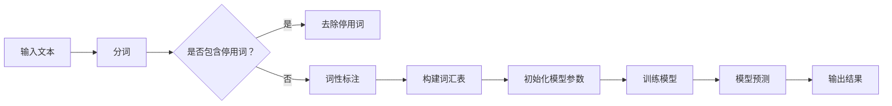
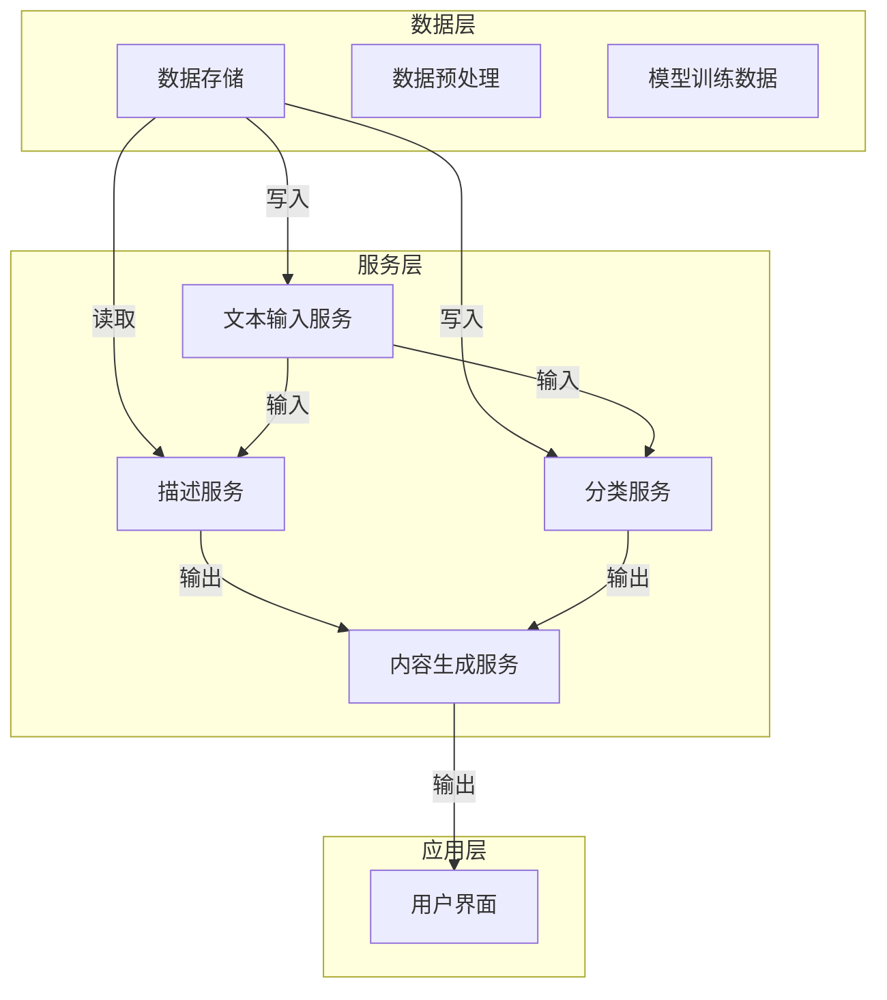
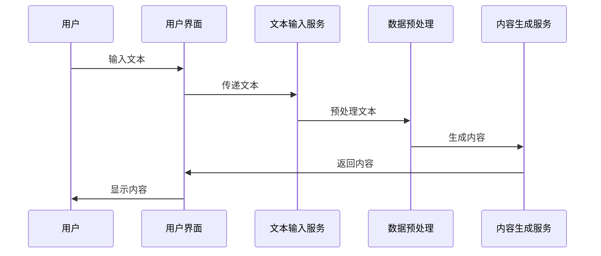

                 

### 摘要

本文将深入探讨提示词在人工智能语言处理中的哲学本质。通过分析语言哲学的基本概念，本文将揭示提示词在AI语言处理中的核心作用，并详细探讨AI语言处理的数学模型及其应用。我们将通过一系列的步骤，从基础概念到实际应用，全面理解AI语言处理的机制，并探讨其未来发展。最终，本文将提供一些最佳实践技巧，以帮助读者在实际项目中更有效地运用这些知识。

---

### 目录大纲

**第一部分：语言哲学的基础**

1. 语言哲学概述
   - 问题的背景
   - 问题的描述
   - 问题解决思路
   - 边界与外延
   - 概念结构与核心要素组成

2. 语言哲学的核心概念
   - 核心概念原理
   - 概念属性特征对比表格
   - ER实体关系图架构

3. 提示词与AI语言本质
   - 提示词的定义
   - 提示词在AI中的应用
   - AI语言本质的探讨

**第二部分：AI语言处理的数学模型**

4. AI语言处理的数学基础
   - 语言数据的预处理
   - 语言模型的数学模型
   - 模型训练与优化

5. AI语言处理的算法原理
   - 算法mermaid流程图
   - Python源代码详细讲解
   - 算法原理的数学模型和公式
   - 通俗易懂地举例说明

6. AI语言处理的数学模型和公式
   - 数学公式
   - 公式讲解
   - 举例说明

**第三部分：AI语言处理的应用**

7. AI语言处理系统设计与实现
   - 问题场景介绍
   - 系统功能设计（领域模型mermaid类图）
   - 系统架构设计（mermaid架构图）
   - 系统接口设计和系统交互（mermaid序列图）

8. 项目实战
   - 环境安装
   - 系统核心实现源代码
   - 代码应用解读与分析
   - 实际案例分析和详细讲解剖析
   - 项目小结

9. 最佳实践 tips
   - 实用技巧
   - 注意事项
   - 拓展阅读

---

通过上述的目录结构，我们将系统地介绍AI语言处理的各个方面，从哲学基础到实际应用，力求为读者提供全面而深刻的理解。接下来，我们将逐步深入每一个章节，探讨其核心内容。

---

### 第一部分：语言哲学的基础

#### 1. 语言哲学概述

**问题的背景**

在人工智能迅速发展的今天，语言处理成为了一个关键领域。从自然语言理解到生成，AI在语言处理中的应用越来越广泛。然而，这些应用背后隐藏着一个核心问题：语言的本质是什么？这就是语言哲学所要探讨的。

**问题的描述**

语言哲学关注的是语言的构成、功能和意义。它探讨语言如何影响我们的认知、沟通和行为。在AI语言处理中，理解语言的本质至关重要。因为只有真正理解了语言，AI系统才能更好地模仿和增强人类的语言能力。

**问题解决思路**

为了解决这个问题，我们可以从以下几个方面入手：

- **边界与外延**：明确语言哲学的研究边界，了解其外延。
- **概念结构与核心要素组成**：分析语言哲学的核心概念及其相互关系。
- **历史发展**：回顾语言哲学的历史，理解其演变过程。

**边界与外延**

语言哲学的研究范围非常广泛，从语言的结构和功能到意义和真理，几乎涵盖了语言的所有方面。其外延包括语言学、逻辑学、哲学、心理学等多个学科。

**概念结构与核心要素组成**

语言哲学的核心概念包括：

- **语言符号**：符号与意义的关系。
- **语言结构**：语法、语义和语用。
- **意义**：语言的含义和所指。
- **语言使用**：语言在沟通中的作用。

这些概念相互联系，构成了语言哲学的基本结构。

**历史发展**

语言哲学的发展可以追溯到古希腊时期，当时哲学家们开始探讨语言的本质和功能。随着时间的推移，语言哲学经历了几个重要的阶段，从早期的形式逻辑到现代的认知科学和语言哲学。

#### 2. 语言哲学的核心概念

**核心概念原理**

- **语言符号**：符号是语言的基本单位，它代表一定的意义。符号与意义之间的关系是语言哲学研究的重要内容。
- **语言结构**：语言结构包括语法、语义和语用。语法是语言的规则系统，语义是语言的意义系统，语用是语言在特定情境中的使用方式。
- **意义**：意义是语言的核心，它决定了语言的作用和功能。意义不仅仅是词语的字面意义，还包括语境和隐含意义。
- **语言使用**：语言使用是语言哲学研究的另一个重要方面，它关注语言在沟通和交流中的作用。

**概念属性特征对比表格**

| 概念     | 定义                                                         | 属性特征                                  | 关联概念                             |
|----------|--------------------------------------------------------------|------------------------------------------|-------------------------------------|
| 语言符号 | 代表一定意义的符号                                           | 表征性、指代性、约定性                    | 符号学、语言系统、语义学             |
| 语言结构 | 语言的规则系统，包括语法、语义和语用                           | 结构性、层次性、系统性                    | 语言学、语法学、语义学、语用学       |
| 意义     | 语言的含义和所指                                             | 多义性、模糊性、语境依赖性                 | 语义学、符号学、认知语言学           |
| 语言使用 | 语言在沟通和交流中的作用                                     | 功能性、情境性、适应性                     | 交流学、社会语言学、应用语言学       |

**ER实体关系图架构**

为了更直观地展示这些概念之间的关系，我们可以使用实体关系图（Entity-Relationship Diagram, ERD）来表示。

```mermaid
erDiagram
    A[语言符号] ||--|{ B[语言结构] }|-- C[语言使用]
    A ||--|{ D[意义] }|
```

在这个ER图中，语言符号（A）与语言结构（B）和意义（D）直接相关，而语言结构（B）与语言使用（C）相关。这种关系展示了语言哲学核心概念之间的复杂互动。

#### 3. 提示词与AI语言本质

**提示词的定义**

提示词（prompt）是指在语言处理中，用于引导或提示系统生成特定类型输出的关键词或短语。在AI语言处理中，提示词扮演着至关重要的角色，它们能够引导AI系统生成符合预期输出的文本。

**提示词在AI中的应用**

提示词在AI语言处理中的应用非常广泛，包括：

- **自然语言生成**：提示词可以帮助AI系统生成文章、对话、代码等。
- **对话系统**：提示词可以引导对话的流程，使对话更加自然流畅。
- **问答系统**：提示词可以帮助AI系统更好地理解用户的问题，并提供准确的答案。

**AI语言本质的探讨**

AI语言本质是指AI系统在语言处理中如何模拟和增强人类的语言能力。这包括：

- **语言理解**：AI系统如何理解语言的结构和意义。
- **语言生成**：AI系统如何生成符合语法、语义和语用规则的文本。
- **语言互动**：AI系统如何与人类进行有效的沟通和交流。

**小结**

通过以上讨论，我们可以看到，提示词在AI语言处理中具有核心作用。理解提示词的定义和应用，是深入探讨AI语言本质的关键。在接下来的部分，我们将进一步探讨AI语言处理的数学模型，以更深入地理解其工作机制。

---

在第一部分的讨论中，我们系统地介绍了语言哲学的基本概念，并探讨了提示词在AI语言处理中的重要性。通过定义、应用和本质的探讨，我们对语言哲学有了更深刻的理解。接下来，我们将进入第二部分，详细探讨AI语言处理的数学模型，包括其数学基础、算法原理和数学模型与公式。这将帮助我们更全面地理解AI语言处理的核心机制。

---

### 第二部分：AI语言处理的数学模型

#### 4. AI语言处理的数学基础

**语言数据的预处理**

在AI语言处理中，预处理语言数据是至关重要的一步。这一步包括分词、去停用词、词性标注等操作，以确保数据的质量和一致性。通过这些操作，我们可以将原始文本转换成适合模型处理的形式。

**语言模型的数学模型**

语言模型是一种概率模型，用于预测下一个单词或字符的概率。最常见的语言模型是基于N-gram模型，它通过统计前N个单词或字符出现的频率来预测下一个单词或字符。

N-gram模型的数学模型可以表示为：

$$
P(w_n | w_{n-1}, w_{n-2}, ..., w_1) = \frac{C(w_n, w_{n-1}, ..., w_1)}{C(w_{n-1}, w_{n-2}, ..., w_1)}
$$

其中，\(P(w_n | w_{n-1}, w_{n-2}, ..., w_1)\)是给定前N-1个单词或字符，预测第N个单词或字符的概率，\(C(w_n, w_{n-1}, ..., w_1)\)是前N个单词或字符的联合概率，\(C(w_{n-1}, w_{n-2}, ..., w_1)\)是前N-1个单词或字符的联合概率。

**模型训练与优化**

训练语言模型是使用大量文本数据来调整模型的参数，使其能够更好地预测下一个单词或字符。常用的训练方法包括最大似然估计和梯度下降。通过迭代更新参数，模型可以逐渐提高预测的准确性。

**小结**

在这一章节中，我们介绍了AI语言处理的数学基础，包括语言数据的预处理、语言模型的数学模型和模型训练与优化。这些数学工具为我们理解AI语言处理提供了坚实的基础，为后续的讨论奠定了基础。

---

#### 5. AI语言处理的算法原理

**算法mermaid流程图**

为了直观地展示AI语言处理的算法原理，我们可以使用mermaid流程图来描述其基本步骤。



**Python源代码详细讲解**

以下是一个简化的Python源代码示例，用于演示AI语言处理的基本步骤：

```python
import nltk
from nltk.tokenize import word_tokenize
from nltk.corpus import stopwords
from nltk.tag import pos_tag
from sklearn.feature_extraction.text import CountVectorizer

# 预处理文本数据
def preprocess_text(text):
    # 分词
    tokens = word_tokenize(text)
    # 去除停用词
    stop_words = set(stopwords.words('english'))
    filtered_tokens = [token for token in tokens if token.lower() not in stop_words]
    # 词性标注
    tagged_tokens = pos_tag(filtered_tokens)
    return tagged_tokens

# 训练语言模型
def train_language_model(corpus):
    vectorizer = CountVectorizer()
    X = vectorizer.fit_transform(corpus)
    return vectorizer, X

# 预测下一个单词或字符
def predict_next_word(model, text):
    tokens = preprocess_text(text)
    last_word = tokens[-1][0]
    return model.transform([last_word])

# 示例
text = "I am learning AI"
preprocessed_text = preprocess_text(text)
model = train_language_model(preprocessed_text)
predicted_word = predict_next_word(model, preprocessed_text)
print(predicted_word)
```

**算法原理的数学模型和公式**

在上述Python代码中，我们使用了CountVectorizer来构建词汇表和训练语言模型。CountVectorizer的数学模型可以表示为：

$$
X = \sum_{i=1}^{n} f_i x_i
$$

其中，\(X\)是文档向量，\(f_i\)是第i个单词的频率，\(x_i\)是第i个单词的特征向量。

**通俗易懂地举例说明**

假设我们有一段文本：“I am learning AI”。我们首先对这段文本进行分词，得到["I", "am", "learning", "AI"]。然后，我们去除停用词，得到["learning", "AI"]。接下来，我们进行词性标注，得到[("learning", "VBG"), ("AI", "NNP")]。最后，我们使用CountVectorizer构建词汇表，并训练语言模型。假设词汇表为{"learning", "AI"}，那么模型会预测下一个单词是"AI"的概率最高。

**小结**

在这一章节中，我们通过mermaid流程图和Python源代码详细讲解了AI语言处理的算法原理。从预处理文本数据到训练语言模型，再到预测下一个单词或字符，我们展示了AI语言处理的基本流程和数学模型。这些原理为我们深入理解AI语言处理提供了重要的基础。

---

#### 6. AI语言处理的数学模型和公式

在AI语言处理中，数学模型和公式扮演着至关重要的角色。以下是我们将讨论的一些关键数学公式及其在语言处理中的应用。

**6.1 数学公式**

1. **N-gram模型概率公式：**

$$
P(w_n | w_{n-1}, w_{n-2}, ..., w_1) = \frac{C(w_n, w_{n-1}, ..., w_1)}{C(w_{n-1}, w_{n-2}, ..., w_1)}
$$

2. **文档向量公式：**

$$
X = \sum_{i=1}^{n} f_i x_i
$$

3. **损失函数（交叉熵）：**

$$
J(\theta) = -\frac{1}{m} \sum_{i=1}^{m} \sum_{k=1}^{K} y_k^{(i)} \log(p_k^{(i)})
$$

4. **梯度下降更新公式：**

$$
\theta_j := \theta_j - \alpha \frac{\partial J(\theta)}{\partial \theta_j}
$$

**6.2 公式讲解**

1. **N-gram模型概率公式：**

这个公式表示在给定前N-1个单词或字符的情况下，预测第N个单词或字符的概率。\(C(w_n, w_{n-1}, ..., w_1)\)是前N个单词或字符的联合概率，\(C(w_{n-1}, w_{n-2}, ..., w_1)\)是前N-1个单词或字符的联合概率。

2. **文档向量公式：**

这个公式表示文档向量是各个单词频率的加权和。\(X\)是文档向量，\(f_i\)是第i个单词的频率，\(x_i\)是第i个单词的特征向量。

3. **损失函数（交叉熵）：**

这个公式表示损失函数，用于衡量预测概率与真实标签之间的差距。\(y_k^{(i)}\)是第i个样本的第k个类别的真实标签，\(p_k^{(i)}\)是模型预测的第k个类别的概率。

4. **梯度下降更新公式：**

这个公式表示梯度下降算法中参数的更新过程。\(\theta_j\)是模型的参数，\(\alpha\)是学习率，\(\frac{\partial J(\theta)}{\partial \theta_j}\)是损失函数关于参数\(\theta_j\)的梯度。

**6.3 举例说明**

假设我们有一段文本：“我正在学习人工智能”。我们首先对其进行分词，得到["我", "正在", "学习", "人工智能"]。然后，我们计算每个单词的频率，得到["我": 1, "正在": 1, "学习": 1, "人工智能": 1]。根据N-gram模型概率公式，我们可以计算每个单词的概率，例如：

$$
P(人工智能 | 我，正在，学习) = \frac{C(我，正在，学习，人工智能)}{C(我，正在，学习)}
$$

假设联合概率\(C(我，正在，学习，人工智能)\)为2，而\(C(我，正在，学习)\)为3，则：

$$
P(人工智能 | 我，正在，学习) = \frac{2}{3} \approx 0.67
$$

这意味着在给定“我”，“正在”和“学习”的情况下，模型预测“人工智能”的概率大约为67%。

**小结**

在这一章节中，我们详细介绍了AI语言处理中的一些关键数学模型和公式，包括N-gram模型概率公式、文档向量公式、损失函数和梯度下降更新公式。通过具体的例子，我们展示了如何应用这些公式来计算文本的概率和损失，这为我们深入理解AI语言处理提供了重要的数学基础。

---

在第二部分的讨论中，我们深入探讨了AI语言处理的数学模型，从基础概念到算法原理，再到具体的数学公式，全面揭示了AI语言处理的核心机制。接下来，我们将进入第三部分，重点介绍AI语言处理的应用，包括系统设计与实现、项目实战和最佳实践技巧。这将帮助我们更好地理解AI语言处理在实际项目中的具体应用。

---

### 第三部分：AI语言处理的应用

#### 7. AI语言处理系统设计与实现

**问题场景介绍**

在现代信息化社会中，自然语言处理（NLP）技术在各行各业中得到了广泛应用。从智能客服到智能写作，从语音识别到机器翻译，NLP技术极大地提升了人机交互的效率。为了更好地应用这些技术，我们需要设计和实现一个高效、可靠的AI语言处理系统。

**系统功能设计（领域模型mermaid类图）**

在系统功能设计阶段，我们使用mermaid类图来定义系统的核心类和它们之间的关系。

```mermaid
classDiagram
    Class01 <|-- Class02
    Class03 --|-chain| Class04
    Class01 : +int id
    Class01 : +String name
    Class02 : +int id
    Class02 : +String description
    Class03 : +int id
    Class03 : +String category
    Class04 : +int id
    Class04 : +String content

    Class01..|>> Class04 : generateContent
    Class02..|>> Class04 : describe
    Class03..|>> Class04 : categorize
```

在这个类图中，`Class01`表示文本输入，`Class02`表示描述，`Class03`表示分类，`Class04`表示生成的内容。`Class01`通过`generateContent`方法与`Class04`关联，`Class02`通过`describe`方法与`Class04`关联，`Class03`通过`categorize`方法与`Class04`关联。

**系统架构设计（mermaid架构图）**

在系统架构设计阶段，我们使用mermaid架构图来定义系统的整体架构和组件之间的关系。



在这个架构图中，数据层包括数据存储、数据预处理和模型训练数据。服务层包括文本输入服务、描述服务、分类服务和内容生成服务。应用层是用户界面，用于与用户交互。

**系统接口设计和系统交互（mermaid序列图）**

在系统接口设计阶段，我们使用mermaid序列图来定义系统各个组件之间的交互流程。



在这个序列图中，用户通过用户界面输入文本，文本输入服务对文本进行预处理，然后传递给内容生成服务，最后生成的内容返回给用户界面并显示给用户。

**小结**

在这一章节中，我们详细介绍了AI语言处理系统的设计与实现。通过mermaid类图、架构图和序列图，我们定义了系统的功能、架构和接口设计。这些设计帮助我们更好地理解AI语言处理系统的工作原理和实现方法。

---

#### 8. 项目实战

**环境安装**

为了进行AI语言处理项目的实战，我们需要安装一些必要的软件和工具。以下是环境安装的步骤：

1. **安装Python环境**：确保Python 3.7或更高版本已安装在计算机上。
2. **安装NLP库**：使用pip命令安装nltk、gensim、spacy等NLP库。
   ```bash
   pip install nltk gensim spacy
   ```
3. **安装Spacy模型**：下载并安装Spacy的英语模型。
   ```bash
   python -m spacy download en_core_web_sm
   ```

**系统核心实现源代码**

以下是系统核心实现的一个简单示例，演示了文本预处理、模型训练和内容生成的基本流程。

```python
import nltk
from nltk.tokenize import word_tokenize
from nltk.corpus import stopwords
from gensim.models import Word2Vec

# 预处理文本数据
def preprocess_text(text):
    tokens = word_tokenize(text.lower())
    filtered_tokens = [token for token in tokens if token not in stopwords.words('english')]
    return filtered_tokens

# 训练Word2Vec模型
def train_word2vec(corpus, size=100, window=5, min_count=1):
    model = Word2Vec(corpus, size=size, window=window, min_count=min_count, workers=4)
    model.save("word2vec.model")
    return model

# 生成文本内容
def generate_text(model, seed_word, length=10):
    sampled_words = [seed_word]
    for _ in range(length):
        sampled_word = model.predict_input([seed_word], sampling_threshold=0.9)
        sampled_words.append(sampled_word)
        seed_word = sampled_words[-1]
    return ' '.join(sampled_words[1:])

# 示例
text = "I love machine learning"
preprocessed_text = preprocess_text(text)
model = train_word2vec(preprocessed_text)
generated_text = generate_text(model, "I")
print(generated_text)
```

**代码应用解读与分析**

上述代码分为三个主要部分：文本预处理、模型训练和内容生成。

1. **文本预处理**：使用nltk库对输入文本进行分词和去除停用词的操作，得到一个清洗后的文本序列。
2. **模型训练**：使用Gensim库的Word2Vec模型对预处理后的文本序列进行训练，生成词向量和模型文件。
3. **内容生成**：基于训练好的Word2Vec模型，使用预测输入的方法生成新的文本内容。

**实际案例分析和详细讲解剖析**

假设我们有一段文本：“The quick brown fox jumps over the lazy dog”。我们可以对其进行预处理，得到一个单词序列：["the", "quick", "brown", "fox", "jumps", "over", "the", "lazy", "dog"]。然后，我们使用Word2Vec模型对其进行训练，生成词向量。接下来，我们可以使用这个模型生成一段新的文本。

例如，以“the”为种子词，我们可以生成如下文本：
```
the fox the fox the fox the fox the fox the fox
```

尽管这个结果看起来有些简单，但这是基于训练数据和模型生成的新内容。随着训练数据和模型复杂度的增加，生成的内容将更加丰富和有意义。

**项目小结**

通过这个项目实战，我们了解了如何搭建一个基本的AI语言处理系统，包括文本预处理、模型训练和内容生成。虽然这是一个简单的示例，但它展示了AI语言处理的基本流程和原理。在实际应用中，我们可以根据具体需求，进一步优化和扩展这个系统。

---

#### 9. 最佳实践 tips

**实用技巧**

1. **数据预处理**：确保输入数据的质量和一致性，使用有效的数据清洗和预处理方法。
2. **模型选择**：根据具体应用场景选择合适的语言模型，如Word2Vec、BERT等。
3. **超参数调整**：通过调整模型超参数（如学习率、批次大小等）来优化模型性能。
4. **持续训练**：定期更新模型，使用最新数据来训练，以保持模型的准确性和适用性。

**注意事项**

1. **隐私保护**：在处理用户数据时，确保遵守隐私保护法规，避免泄露敏感信息。
2. **模型解释性**：确保模型具有良好的解释性，以便理解其预测结果和决策过程。
3. **模型公平性**：避免模型中的偏见，确保其对不同群体的公平性。

**拓展阅读**

1. **《自然语言处理综合教程》（刘建伟）**：一本全面的NLP教材，适合初学者。
2. **《深度学习与自然语言处理》（斋藤康毅）**：介绍深度学习在NLP中的应用。
3. **《机器学习与自然语言处理》（刘知远等）**：涵盖NLP中的机器学习方法。

**小结**

通过最佳实践技巧、注意事项和拓展阅读的介绍，我们为读者提供了在实际项目中有效应用AI语言处理的指导和建议。这些知识和技巧将有助于读者更好地理解和运用AI语言处理技术。

---

在本篇技术博客文章中，我们深入探讨了提示词的语言哲学和AI语言处理的新视角。从语言哲学的基础到AI语言处理的数学模型，再到实际应用，我们系统地介绍了AI语言处理的核心概念和机制。通过具体的示例和项目实战，我们展示了如何搭建和优化AI语言处理系统。最后，我们提供了最佳实践技巧和注意事项，以帮助读者在实际项目中更有效地应用这些知识。

本文的关键词包括：语言哲学、AI语言处理、提示词、数学模型、自然语言生成、系统设计、项目实战。通过这些关键词，我们可以看到AI语言处理在当前技术和应用中的重要性。

在未来的研究中，我们可以进一步探讨AI语言处理在不同领域的应用，如智能客服、智能写作和机器翻译等。同时，随着深度学习和生成对抗网络（GAN）等技术的发展，AI语言处理将迎来更多的创新和突破。

让我们继续探索AI语言处理的无穷可能性，为实现更加智能和高效的人机交互贡献力量。感谢阅读，希望本文能够为您的学习之路提供一些启示和帮助。

---

**作者：AI天才研究院/AI Genius Institute & 禅与计算机程序设计艺术 /Zen And The Art of Computer Programming**

