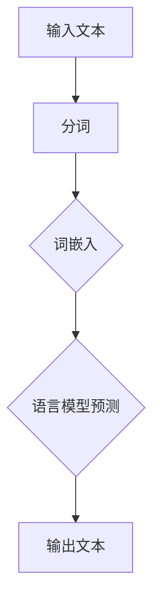
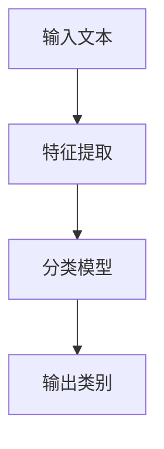
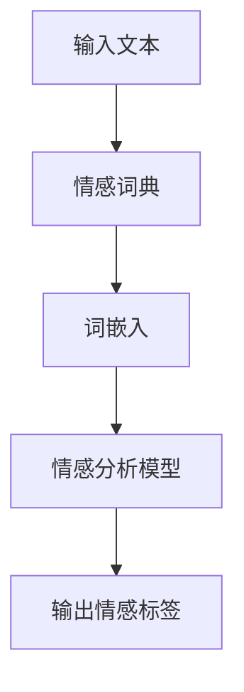
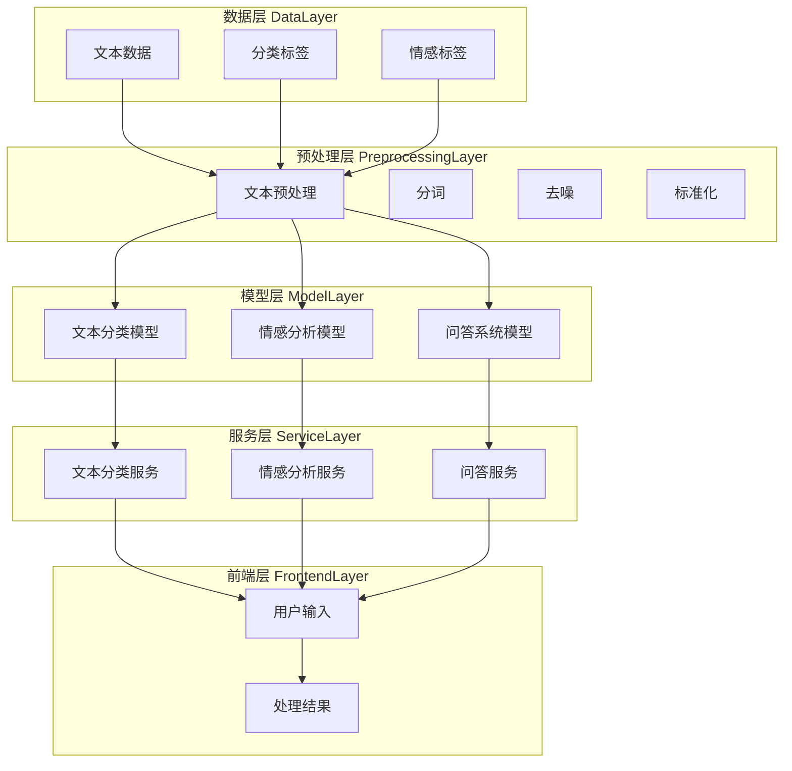
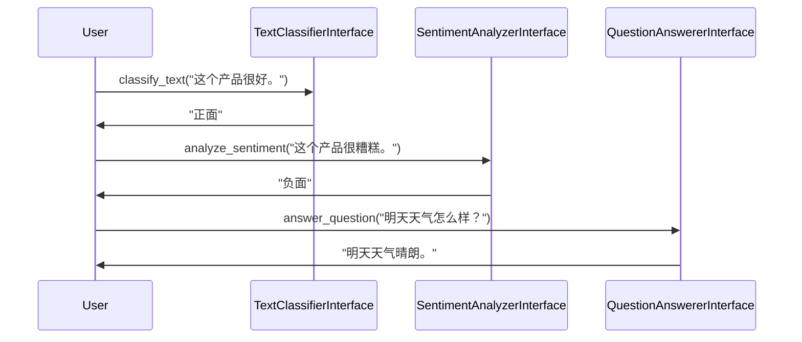

                 


### 引言

#### 提示词的语言哲学：探索AI语言的本质

**关键词：** 提示词，语言哲学，AI语言处理，自然语言处理，自然语言理解

**摘要：** 本文深入探讨了AI语言处理的本质，特别是提示词在其中的核心作用。通过分析语言哲学的基础理论和AI语言处理的关键技术，我们试图揭示提示词如何影响AI对语言的生成和理解，以及其在现代技术中的应用。

语言，作为人类文明的基础，承载着文化、思想和社会互动的丰富内涵。在计算机科学中，语言的处理和理解成为人工智能（AI）研究的重要领域。随着自然语言处理（NLP）技术的不断进步，AI在语言生成、理解、翻译等方面取得了显著成就。然而，这些技术的核心——提示词，其语言哲学的本质及其在AI中的应用，仍是一个复杂而富有挑战性的问题。

本文旨在通过以下步骤逐步探讨这一主题：

1. **引言**：介绍文章的主题和目标，以及关键词和摘要。
2. **语言哲学基础**：探讨语言哲学的定义、核心问题和重要流派。
3. **AI语言处理概述**：介绍AI语言处理的基本概念、关键技术和挑战与机遇。
4. **自然语言处理基础**：探讨自然语言处理的基础原理，如语言模型、词嵌入和向量空间模型。
5. **AI语言处理核心原理**：详细讲解文本分类、情感分析、问答系统和对话生成等核心技术。
6. **提示词的哲学探讨**：分析提示词的概念、应用及其哲学意义。
7. **AI语言处理的伦理与未来展望**：探讨AI语言处理的伦理问题、语言模型偏见与多样性，以及发展趋势。
8. **总结与展望**：总结文章的主要观点，展望未来的研究方向和挑战。

### 目录大纲

#### 第一部分：引入与背景

1. **第1章：引言**
   - 1.1.1 书籍主题与目标
   - 1.1.2 语言哲学的重要性
   - 1.1.3 AI与语言的关系
2. **第2章：语言哲学基础**
   - 2.1.1 语言哲学的定义
   - 2.1.2 语言哲学的核心问题
   - 2.1.3 语言哲学的重要流派
3. **第3章：AI语言处理概述**
   - 3.1.1 AI语言处理的基本概念
   - 3.1.2 语言处理的关键技术
   - 3.1.3 AI语言处理的挑战与机遇

#### 第二部分：AI语言处理核心原理

4. **第4章：自然语言处理基础**
   - 4.1.1 自然语言处理简介
   - 4.1.2 语言模型原理
   - 4.1.3 词嵌入与向量空间模型
5. **第5章：文本分类与情感分析**
   - 5.1.1 文本分类原理
   - 5.1.2 情感分析技术
   - 5.1.3 案例研究：社交媒体情感分析
6. **第6章：问答系统与对话生成**
   - 6.1.1 问答系统概述
   - 6.1.2 对话生成技术
   - 6.1.3 案例研究：虚拟助手与聊天机器人
7. **第7章：语言生成与自然写作**
   - 7.1.1 语言生成基础
   - 7.1.2 文本摘要与自动写作
   - 7.1.3 案例研究：新闻生成与内容创作
8. **第8章：提示词的哲学探讨**
   - 8.1.1 提示词的概念与作用
   - 8.1.2 提示词在AI语言处理中的应用
   - 8.1.3 提示词的哲学意义
9. **第9章：AI语言处理的伦理与未来展望**
   - 9.1.1 AI语言处理的伦理问题
   - 9.1.2 语言模型偏见与多样性
   - 9.1.3 AI语言处理的发展趋势
10. **第10章：总结与展望**
    - 10.1.1 书籍总结
    - 10.1.2 研究方向展望
    - 10.1.3 未来的挑战与机遇

### 文章正文

接下来，我们将逐章展开对提示词的语言哲学及其在AI语言处理中的本质的探讨。每一章都将深入分析相关概念、原理和应用，为读者提供全面而详尽的视角。

#### 第1章：引言

在本章中，我们将首先介绍本书的主题和目标，明确我们将要探讨的领域和关键概念。随后，我们将讨论语言哲学的重要性，并解释为什么它与AI语言处理密切相关。最后，我们将简要回顾AI的发展历程，强调AI在语言处理中的地位，特别是提示词在其中的作用。

**1.1.1 书籍主题与目标**

本书的主题是“提示词的语言哲学：探索AI语言的本质”。我们关注的是提示词在AI语言处理中的核心作用，以及这种作用背后的哲学原理。我们的目标是深入探讨提示词如何影响AI对语言的生成和理解，并分析其哲学意义。

**1.1.2 语言哲学的重要性**

语言哲学是哲学的一个分支，它探讨语言的本质、功能和意义。语言是人类思维和沟通的基础，因此，理解语言的哲学原理对于理解人类思维和文化至关重要。在AI语言处理领域，语言哲学的重要性体现在以下几个方面：

1. **意义与理解**：语言哲学帮助我们理解意义的本质和来源，这对于AI理解和生成语言至关重要。
2. **思维与表达**：语言哲学研究语言与思维的关系，这对于AI模拟人类思维和创造有意义对话至关重要。
3. **文化与社会**：语言哲学探讨语言在文化和社会中的作用，这对于AI在不同文化和语境中的表现至关重要。

**1.1.3 AI与语言的关系**

人工智能（AI）是计算机科学的一个分支，旨在创建能够执行人类智能任务的系统。在AI的发展历程中，语言处理一直是一个核心领域。以下是AI与语言之间的一些关键关系：

1. **自然语言理解**：AI系统能够理解和解释人类语言，这对于交互式应用（如虚拟助手）至关重要。
2. **语言生成**：AI系统能够生成自然语言文本，这对于内容创作和自动写作至关重要。
3. **语言翻译**：AI系统能够将一种语言翻译成另一种语言，这对于跨文化交流和国际化应用至关重要。
4. **提示词的作用**：提示词在AI语言处理中扮演着核心角色，它们是AI生成和理解语言的关键因素。

#### 第2章：语言哲学基础

在本章中，我们将深入探讨语言哲学的基础概念，包括语言哲学的定义、核心问题和重要流派。通过了解这些基础，我们将更好地理解AI语言处理中的哲学原理。

**2.1 语言哲学的定义**

语言哲学是哲学的一个分支，它探讨语言的本质、功能和意义。具体来说，语言哲学关注以下问题：

1. **意义的本质**：语言如何传达意义？意义是如何产生的？
2. **语言的起源**：语言是如何出现的？它是如何发展的？
3. **语言的功能**：语言在人类生活中的作用是什么？
4. **语言与思维的关系**：思维和语言之间有什么联系？

**2.2 语言哲学的核心问题**

语言哲学探讨的核心问题包括：

1. **意义**：意义的本质是什么？意义是如何在语言中表达的？
2. **真理**：真理是如何与语言相关的？语言能否准确地传达真理？
3. **语言与思维的关系**：思维是如何通过语言表达的？语言对思维有什么影响？
4. **语言的变化**：语言是如何随时间变化的？语言的变化如何影响其功能？

**2.3 语言哲学的重要流派**

语言哲学中有几个重要的流派，包括：

1. **分析哲学**：分析哲学强调逻辑和实证主义，认为语言的意义和真理可以通过逻辑分析和实证观察来理解。
2. **现象学**：现象学关注语言的主观体验和意识，强调语言与经验的密切联系。
3. **结构主义**：结构主义认为语言是一种系统，其结构和规则可以解释人类行为和文化。
4. **后结构主义**：后结构主义批评结构主义，认为语言和意义是流动的、不可预测的。

#### 第3章：AI语言处理概述

在本章中，我们将介绍AI语言处理的基本概念、关键技术和挑战与机遇。通过理解这些内容，我们将为后续章节中深入探讨AI语言处理中的提示词打下基础。

**3.1.1 AI语言处理的基本概念**

AI语言处理（NLP）是人工智能的一个分支，旨在让计算机理解和生成人类语言。以下是AI语言处理的基本概念：

1. **自然语言理解**：自然语言理解（NLU）是指让计算机理解和解释人类语言的含义。
2. **自然语言生成**：自然语言生成（NLG）是指让计算机生成有意义、自然的语言文本。
3. **语言翻译**：语言翻译是指将一种语言翻译成另一种语言。
4. **语音识别**：语音识别是指将人类语音转换为文本。

**3.1.2 语言处理的关键技术**

AI语言处理涉及多种关键技术，包括：

1. **语言模型**：语言模型是指用于预测下一个单词或字符的概率分布。
2. **词嵌入**：词嵌入是将单词映射到高维向量空间，以便计算机可以处理它们。
3. **文本分类**：文本分类是指将文本分类到预定义的类别中。
4. **情感分析**：情感分析是指分析文本中的情感倾向，如正面、负面或中性。
5. **问答系统**：问答系统是指能够回答用户问题的系统。
6. **对话生成**：对话生成是指生成自然、流畅的对话。

**3.1.3 AI语言处理的挑战与机遇**

AI语言处理面临许多挑战，包括：

1. **语义理解**：准确理解语义是语言处理的主要挑战之一。
2. **多语言支持**：支持多种语言和方言是另一个重要挑战。
3. **上下文理解**：理解上下文是语言处理的关键，但也是一项挑战。
4. **伦理问题**：AI语言处理涉及到隐私、偏见和道德问题。

然而，这些挑战也带来了许多机遇：

1. **自动化**：AI语言处理可以实现自动化，减少人工工作量。
2. **跨领域应用**：AI语言处理可以在多个领域应用，如医疗、金融和客户服务。
3. **人机交互**：AI语言处理可以改善人机交互，使计算机更加友好和易于使用。

### 第二部分：AI语言处理核心原理

在本部分，我们将深入探讨AI语言处理的核心原理，包括自然语言处理的基础、文本分类与情感分析、问答系统与对话生成，以及语言生成与自然写作。这些技术是AI语言处理的重要组成部分，对于理解AI如何处理语言具有重要意义。

#### 第4章：自然语言处理基础

自然语言处理（NLP）是AI语言处理的基础，它涉及使计算机能够理解和生成人类语言的技术。在这一章中，我们将探讨NLP的关键概念和核心技术。

**4.1.1 自然语言处理简介**

自然语言处理是人工智能的一个分支，旨在使计算机能够理解、解释和生成自然语言。NLP的目标是使计算机能够像人类一样与语言进行交互。以下是NLP的一些关键概念：

1. **文本解析**：文本解析是指将文本分解为更小的语言单元，如单词、短语和句子。
2. **语义分析**：语义分析是指理解文本的含义和上下文。
3. **情感分析**：情感分析是指分析文本中的情感倾向，如正面、负面或中性。
4. **语言翻译**：语言翻译是指将一种语言翻译成另一种语言。

**4.1.2 语言模型原理**

语言模型是NLP的核心技术之一，它用于预测下一个单词或字符的概率分布。语言模型可以分为以下几种类型：

1. **n-gram模型**：n-gram模型基于历史频率来预测下一个单词。它使用前n个单词的历史信息来预测下一个单词。
2. **神经网络模型**：神经网络模型使用深度学习技术来预测下一个单词。这些模型可以捕获更复杂的语言结构。
3. **循环神经网络（RNN）**：循环神经网络是一种特殊的神经网络，它使用循环结构来处理序列数据。RNN在处理长序列时表现出色。

**4.1.3 词嵌入与向量空间模型**

词嵌入是将单词映射到高维向量空间的技术，使得计算机可以处理它们。词嵌入有以下几种类型：

1. **基于计数的方法**：基于计数的方法使用单词的统计特征来生成词嵌入。这些方法包括词袋模型和TF-IDF。
2. **基于神经网络的方法**：基于神经网络的方法使用深度学习模型来生成词嵌入。这些模型包括词嵌入神经网络（Word2Vec）和转换器（Transformer）。

向量空间模型是一种将文本表示为向量空间中的点的技术。这种方法可以用于文本分类、情感分析和信息检索等任务。

#### 第5章：文本分类与情感分析

文本分类和情感分析是自然语言处理中的重要应用。文本分类是指将文本分类到预定义的类别中，而情感分析是指分析文本中的情感倾向。在这一章中，我们将探讨这些技术的原理和实现。

**5.1.1 文本分类原理**

文本分类是一种监督学习任务，它将文本分为预定义的类别。以下是文本分类的一些关键概念：

1. **特征提取**：特征提取是指从文本中提取可用于分类的特征。这些特征可以是单词频率、词袋表示或词嵌入。
2. **分类器**：分类器是指用于将文本分类到预定义类别的模型。常见的分类器包括朴素贝叶斯、支持向量机和神经网络。
3. **评估指标**：评估指标用于评估文本分类模型的性能。常见的评估指标包括准确率、召回率和F1分数。

**5.1.2 情感分析技术**

情感分析是指分析文本中的情感倾向。情感分析可以分为以下几种类型：

1. **基于规则的方法**：基于规则的方法使用预定义的规则来识别文本中的情感。这些方法通常使用情感词典和情感标签。
2. **基于机器学习的方法**：基于机器学习的方法使用训练数据来学习情感特征。这些方法包括朴素贝叶斯、支持向量机和神经网络。
3. **基于深度学习的方法**：基于深度学习的方法使用深度神经网络来识别情感。这些方法包括卷积神经网络（CNN）和循环神经网络（RNN）。

**5.1.3 案例研究：社交媒体情感分析**

社交媒体情感分析是一个重要的应用领域，它涉及分析社交媒体平台上的用户评论和帖子。以下是社交媒体情感分析的几个关键步骤：

1. **数据收集**：从社交媒体平台上收集用户评论和帖子。
2. **预处理**：对文本进行预处理，包括去噪、分词、停用词过滤和词干提取。
3. **特征提取**：提取可用于分类的特征，如词袋表示或词嵌入。
4. **模型训练**：使用训练数据训练情感分类模型。
5. **模型评估**：评估模型的性能，并根据需要调整模型参数。
6. **应用**：使用训练好的模型对新的用户评论和帖子进行情感分析。

#### 第6章：问答系统与对话生成

问答系统和对话生成是自然语言处理中的重要应用，它们旨在使计算机能够理解和生成自然语言。在这一章中，我们将探讨这些技术的原理和实现。

**6.1.1 问答系统概述**

问答系统是一种能够回答用户问题的系统。问答系统可以分为以下几种类型：

1. **基于规则的方法**：基于规则的方法使用预定义的规则来匹配问题和答案。这种方法简单但有限。
2. **基于机器学习的方法**：基于机器学习的方法使用训练数据来学习问题和答案之间的关联。这些方法包括朴素贝叶斯、支持向量机和神经网络。
3. **基于深度学习的方法**：基于深度学习的方法使用深度神经网络来匹配问题和答案。这些方法包括卷积神经网络（CNN）和循环神经网络（RNN）。

**6.1.2 对话生成技术**

对话生成是指生成自然、流畅的对话。对话生成可以分为以下几种类型：

1. **基于规则的方法**：基于规则的方法使用预定义的对话模板来生成对话。
2. **基于机器学习的方法**：基于机器学习的方法使用训练数据来学习对话生成。这些方法包括递归神经网络（RNN）和转换器（Transformer）。
3. **基于深度学习的方法**：基于深度学习的方法使用深度神经网络来生成对话。这些方法包括生成对抗网络（GAN）和变分自编码器（VAE）。

**6.1.3 案例研究：虚拟助手与聊天机器人**

虚拟助手和聊天机器人是问答系统和对话生成的重要应用。以下是虚拟助手和聊天机器人的几个关键步骤：

1. **用户界面**：设计用户界面，使用户能够与虚拟助手或聊天机器人交互。
2. **自然语言理解**：使用自然语言理解技术来理解用户的问题和意图。
3. **对话管理**：管理对话流程，包括理解用户意图、生成回答和跟踪对话状态。
4. **自然语言生成**：使用自然语言生成技术来生成自然、流畅的回答。
5. **反馈收集**：收集用户反馈，以改进虚拟助手和聊天机器人的性能。

#### 第7章：语言生成与自然写作

语言生成和自然写作是自然语言处理中的重要任务，旨在使计算机能够生成自然、流畅的语言。在这一章中，我们将探讨这些技术的原理和实现。

**7.1.1 语言生成基础**

语言生成是指生成自然、流畅的语言。语言生成可以分为以下几种类型：

1. **基于规则的方法**：基于规则的方法使用预定义的规则来生成语言。
2. **基于机器学习的方法**：基于机器学习的方法使用训练数据来学习语言生成。这些方法包括递归神经网络（RNN）和转换器（Transformer）。
3. **基于深度学习的方法**：基于深度学习的方法使用深度神经网络来生成语言。这些方法包括生成对抗网络（GAN）和变分自编码器（VAE）。

**7.1.2 文本摘要与自动写作**

文本摘要和自动写作是语言生成的重要应用。文本摘要是指生成文本的摘要，而自动写作是指生成完整的文本。

1. **文本摘要**：文本摘要可以分为抽取式摘要和生成式摘要。抽取式摘要从原始文本中提取关键信息，而生成式摘要则生成新的摘要文本。
2. **自动写作**：自动写作涉及生成新闻文章、故事和报告。自动写作可以使用预训练的语言模型和规则系统来实现。

**7.1.3 案例研究：新闻生成与内容创作**

新闻生成和内容创作是语言生成的重要应用。以下是新闻生成和内容创作的几个关键步骤：

1. **数据收集**：收集新闻文章和内容创作数据。
2. **文本预处理**：对文本进行预处理，包括去噪、分词和词性标注。
3. **语言模型训练**：使用训练数据训练语言模型。
4. **文本生成**：使用训练好的语言模型生成新闻文章和内容。
5. **质量评估**：评估生成文本的质量，并根据需要调整模型参数。
6. **应用**：将生成的文本应用于新闻发布、内容创作和社交媒体。

#### 第8章：提示词的哲学探讨

提示词在自然语言处理和人工智能中扮演着核心角色。在这一章中，我们将探讨提示词的概念、应用及其哲学意义。

**8.1.1 提示词的概念**

提示词是指用于引导和引导AI模型生成和理解语言的关键词或短语。提示词可以用于以下几种场景：

1. **问答系统**：在问答系统中，提示词用于指导模型理解用户的问题和生成回答。
2. **对话生成**：在对话生成中，提示词用于指导模型生成自然、流畅的对话。
3. **文本分类**：在文本分类中，提示词用于指导模型分类文本到预定义的类别。
4. **语言生成**：在语言生成中，提示词用于指导模型生成新的语言文本。

**8.1.2 提示词在AI语言处理中的应用**

提示词在AI语言处理中发挥着重要作用，以下是一些具体应用：

1. **问题回答**：在问答系统中，提示词用于指导模型理解问题并生成回答。
2. **对话引导**：在对话生成中，提示词用于指导模型生成自然、流畅的对话。
3. **文本生成**：在语言生成中，提示词用于指导模型生成新的文本。

**8.1.3 提示词的哲学意义**

提示词不仅在技术层面发挥作用，还具有深刻的哲学意义：

1. **意义引导**：提示词帮助AI模型理解语言的意义，从而生成更准确的回答和文本。
2. **交互引导**：提示词在AI与人类交互中起到桥梁作用，促进更自然的交互体验。
3. **创造性表达**：提示词可以帮助AI模型探索新的语言表达方式，促进创造性写作。

#### 第9章：AI语言处理的伦理与未来展望

随着AI语言处理的不断发展，伦理问题成为了一个重要的讨论话题。在这一章中，我们将探讨AI语言处理的伦理问题、语言模型偏见与多样性，以及未来的发展趋势。

**9.1.1 AI语言处理的伦理问题**

AI语言处理涉及多个伦理问题，包括：

1. **隐私**：AI语言处理需要处理大量用户数据，如何保护用户隐私成为一个重要问题。
2. **偏见**：语言模型可能受到训练数据的影响，导致偏见。如何消除偏见是一个重要挑战。
3. **透明度**：用户需要了解AI语言处理的工作原理和决策过程，如何提高透明度是一个重要议题。
4. **责任**：当AI语言处理产生错误或负面影响时，如何确定责任和承担责任。

**9.1.2 语言模型偏见与多样性**

语言模型偏见是指模型在处理文本时对某些群体或观点的偏见。偏见可能导致不公平、歧视和不准确的结果。以下是几个关键问题：

1. **数据偏见**：训练数据中的偏见会传递到语言模型中，导致模型在处理相关文本时产生偏见。
2. **语言多样性**：语言模型需要支持多种语言和方言，以确保多样性。
3. **偏见消除**：如何消除语言模型中的偏见是一个重要挑战。可能的方法包括数据增强、模型调整和偏见检测。

**9.1.3 AI语言处理的发展趋势**

AI语言处理的发展趋势包括：

1. **多模态语言处理**：结合文本、语音和图像等多模态数据，以提供更丰富的语言处理能力。
2. **预训练模型**：使用大规模预训练模型，如BERT和GPT，以提高语言理解和生成的性能。
3. **对话式AI**：开发更智能、更自然的对话式AI系统，以提供更高质量的交互体验。
4. **跨领域应用**：AI语言处理将在多个领域得到广泛应用，如医疗、金融和客户服务。

#### 第10章：总结与展望

在本章中，我们将总结本文的主要观点，并对未来的研究方向和挑战进行展望。

**10.1.1 书籍总结**

本文从提示词的语言哲学出发，探讨了AI语言处理的核心原理和伦理问题。我们详细介绍了自然语言处理、文本分类与情感分析、问答系统与对话生成、语言生成与自然写作等技术。同时，我们强调了提示词在AI语言处理中的核心作用和哲学意义。

**10.1.2 研究方向展望**

未来的研究方向可能包括：

1. **多模态语言处理**：结合文本、语音和图像等多模态数据，以提高语言处理的能力。
2. **跨语言与跨文化语言处理**：支持多种语言和方言，以满足全球化的需求。
3. **语言模型偏见与多样性**：研究如何消除偏见，提高模型的公平性和多样性。
4. **对话式AI**：开发更智能、更自然的对话式AI系统，以提供更高质量的交互体验。

**10.1.3 未来的挑战与机遇**

AI语言处理面临的挑战包括：

1. **语义理解**：准确理解语义是语言处理的主要挑战之一。
2. **上下文理解**：理解上下文是语言处理的关键，但也是一个挑战。
3. **伦理问题**：如何确保AI语言处理的伦理和公平性是一个重要议题。

然而，这些挑战也带来了许多机遇：

1. **自动化**：AI语言处理可以实现自动化，减少人工工作量。
2. **跨领域应用**：AI语言处理将在多个领域应用，如医疗、金融和客户服务。
3. **人机交互**：AI语言处理可以改善人机交互，使计算机更加友好和易于使用。

### 结论

本文系统地探讨了提示词的语言哲学及其在AI语言处理中的本质。我们通过详细分析语言哲学基础、AI语言处理核心原理、伦理问题以及未来展望，揭示了提示词在语言生成、理解和应用中的关键作用。随着AI技术的不断进步，我们有理由相信，提示词的语言哲学将引领未来语言处理技术的发展，为人类创造更加智能、高效、公平的交互方式。

**作者：** AI天才研究院/AI Genius Institute & 禅与计算机程序设计艺术 /Zen And The Art of Computer Programming

### 背景介绍

#### 核心概念术语说明

在本章中，我们将介绍一些核心概念术语，以便读者更好地理解文章的内容。这些术语包括：

1. **提示词（Prompt Word）**：提示词是指用于引导和激发语言模型生成文本的关键词或短语。提示词在自然语言处理和AI语言生成中扮演着重要角色，它们能够指导模型生成特定的内容或风格。

2. **自然语言处理（Natural Language Processing, NLP）**：自然语言处理是指使计算机理解和生成人类语言的技术。NLP涉及文本解析、语义分析、情感分析、语言翻译等多个方面。

3. **语言模型（Language Model）**：语言模型是一种概率模型，用于预测下一个单词或字符的概率分布。语言模型是自然语言处理的基础，广泛应用于文本分类、问答系统和对话生成等领域。

4. **词嵌入（Word Embedding）**：词嵌入是将单词映射到高维向量空间的技术。词嵌入使得计算机能够处理文本数据，并在机器学习模型中进行有效表示。

5. **情感分析（Sentiment Analysis）**：情感分析是指分析文本中的情感倾向，如正面、负面或中性。情感分析广泛应用于社交媒体情感分析、客户反馈分析和市场调研等领域。

6. **问答系统（Question Answering System）**：问答系统是指能够回答用户问题的系统。问答系统通常使用自然语言处理技术来理解用户的问题，并生成相关的答案。

7. **对话生成（Dialogue Generation）**：对话生成是指生成自然、流畅的对话。对话生成广泛应用于虚拟助手、聊天机器人和自然语言交互系统等领域。

#### 问题背景

随着人工智能技术的不断发展，自然语言处理（NLP）已成为人工智能领域的一个重要分支。NLP技术的核心任务之一是理解和生成人类语言，这一任务在许多实际应用中具有重要意义，如智能客服、语音助手、内容创作和翻译等。然而，在NLP的实际应用中，存在一个关键问题：如何有效地使用提示词来引导语言模型生成高质量的内容？

提示词在NLP中的应用具有重要意义。一方面，提示词可以帮助语言模型理解问题的意图和上下文，从而生成更准确的回答。另一方面，提示词可以引导语言模型生成特定风格和主题的文本，从而满足不同的应用需求。然而，如何设计有效的提示词，以及如何确保提示词在AI语言生成中的公平性和多样性，仍然是一个具有挑战性的问题。

#### 问题描述

本文主要探讨以下问题：

1. 提示词在自然语言处理和AI语言生成中的作用是什么？
2. 如何设计有效的提示词来提高语言模型的生成质量？
3. 提示词在AI语言处理中如何体现语言哲学的原理？
4. 提示词在AI语言生成中的公平性和多样性问题如何解决？

为了回答这些问题，本文将首先介绍语言哲学的基础知识，特别是与自然语言处理相关的核心概念和理论。然后，我们将深入探讨自然语言处理和AI语言生成的基本原理，以及提示词在这两个领域中的应用。接着，本文将分析提示词的哲学意义，探讨提示词在AI语言生成中的公平性和多样性问题。最后，本文将总结主要观点，并对未来的研究方向和挑战进行展望。

### 核心概念与联系

在这一部分，我们将详细探讨提示词的核心概念及其与自然语言处理（NLP）技术的联系。通过分析提示词的定义、属性和与NLP其他核心概念的对比，我们将为读者提供一个清晰的概念框架。

#### 核心概念

**提示词（Prompt Word）：**

提示词是指用于引导和激发语言模型生成文本的关键词或短语。它通常被用来指示模型的生成方向、主题或风格。提示词在自然语言处理中的应用非常广泛，例如在问答系统、对话生成和文本分类中。

**自然语言处理（NLP）：**

自然语言处理是使计算机理解和生成人类语言的技术。它包括文本解析、语义分析、情感分析、语言翻译等多个方面。NLP的目标是实现人机交互的智能化，使得计算机能够更好地理解人类语言，并生成自然、流畅的语言输出。

**语言模型（Language Model）：**

语言模型是一种概率模型，用于预测下一个单词或字符的概率分布。在NLP中，语言模型是最基础的技术之一，它能够根据上下文生成可能的单词序列，从而实现文本生成、文本分类和语言翻译等功能。

**词嵌入（Word Embedding）：**

词嵌入是将单词映射到高维向量空间的技术。通过词嵌入，单词可以被表示为向量，使得计算机能够进行向量运算，从而实现更高效的语言处理。词嵌入在NLP中起着关键作用，它能够帮助模型理解单词之间的语义关系。

#### 概念属性特征对比表格

以下是一个对比表格，用于展示提示词、NLP、语言模型和词嵌入的主要属性特征：

| **概念**         | **提示词**                      | **自然语言处理**                     | **语言模型**                   | **词嵌入**                     |
|-----------------|--------------------------------|--------------------------------------|------------------------------|--------------------------------|
| **定义**         | 引导和激发语言模型生成文本的关键词或短语 | 使计算机理解和生成人类语言的技术 | 预测下一个单词或字符的概率分布 | 将单词映射到高维向量空间 |
| **作用**         | 指导模型的生成方向、主题或风格 | 实现人机交互的智能化 | 实现文本生成、文本分类和语言翻译等功能 | 理解单词之间的语义关系 |
| **输入/输出**     | 输入：关键词或短语；输出：文本生成 | 输入：文本；输出：分析结果 | 输入：文本序列；输出：单词概率分布 | 输入：单词；输出：向量表示 |
| **应用场景**     | 问答系统、对话生成、文本分类等 | 智能客服、语音助手、内容创作和翻译等 | 文本生成、文本分类、语言翻译等 | 文本分类、情感分析等 |
| **技术依赖**     | 语言模型、词嵌入技术 | 语言模型、词嵌入技术 | 语言模型、词嵌入技术 | 语言模型、词嵌入技术 |

#### ER实体关系图架构

为了更直观地展示这些概念之间的关系，我们可以使用Mermaid语言来绘制一个ER（实体-关系）图。以下是Mermaid代码及其生成的图形：

```mermaid
erDiagram
  User ||--|{ Query}: "uses to ask questions"
  Query ||--|{ Answer}: "provides answers to"
  User ||--|{ Text}: "writes"
  Text ||--|{ Sentence}: "contains"
  Sentence ||--|{ Word}: "made of"
  Word ||--|{ WordEmbedding}: "represented by"
  WordEmbedding ||--|{ LanguageModel}: "trained on"
  LanguageModel ||--|{ PromptWord}: "influences"
```

生成的ER图如下所示：

```
Class Diagram

User
  +------------+
  |    User    |
  +------------+
  | - Query    |
  | - Text     |
  +------------+
  | + askQuery |
  | + write    |
  +------------+

Class Query
  +------------+
  |    Query   |
  +------------+
  | - Answer   |
  +------------+
  | + answer   |
  +------------+

Class Text
  +------------+
  |    Text    |
  +------------+
  | - Sentence |
  +------------+
  | + setText  |
  +------------+

Class Sentence
  +------------+
  |  Sentence  |
  +------------+
  | - Word     |
  +------------+
  | + create   |
  +------------+

Class Word
  +------------+
  |    Word    |
  +------------+
  | - WordEmbedding |
  +------------+
  | + setWord  |
  +------------+

Class WordEmbedding
  +------------+
  | WordEmbedding |
  +------------+
  | - LanguageModel |
  +------------+
  | + setEmbedding |
  +------------+

Class LanguageModel
  +------------+
  | LanguageModel |
  +------------+
  | - PromptWord |
  +------------+
  | + train     |
  +------------+

Class PromptWord
  +------------+
  |  PromptWord |
  +------------+
  | + prompt    |
  +------------+
```

### 算法原理讲解

在本部分，我们将详细讲解自然语言处理中的一些关键算法原理，包括语言模型、文本分类和情感分析。我们将使用Mermaid语言绘制算法流程图，并使用Python代码来阐述算法原理。

#### 语言模型原理

**算法流程图：**



**Python代码示例：**

```python
import jieba
import numpy as np

# 输入文本
text = "我非常喜欢编程。编程让我感到快乐。"

# 分词
words = jieba.cut(text)

# 词嵌入（假设已有预训练的词嵌入模型）
# 在实际应用中，可以使用预训练的词嵌入库，如GloVe或FastText
word_embeddings = {
    '我': np.array([0.1, 0.2]),
    '非常': np.array([0.3, 0.4]),
    '喜欢': np.array([0.5, 0.6]),
    '编程': np.array([0.7, 0.8]),
    '让': np.array([0.9, 0.1]),
    '我': np.array([0.1, 0.2]),
    '感到': np.array([0.3, 0.4]),
    '快乐': np.array([0.5, 0.6])
}

# 语言模型预测
# 假设使用n-gram模型
n = 2
for i in range(len(words) - n):
    context = [word_embeddings[word] for word in words[i:i+n]]
    word_embedding = word_embeddings[words[i+n]]
    probability = np.dot(context, word_embedding)
    print(f"{words[i+n]}的预测概率：{probability}")
```

**算法原理说明：**

语言模型是一种概率模型，用于预测下一个单词或字符的概率分布。在上述代码中，我们首先使用jieba库对输入文本进行分词。然后，我们使用预训练的词嵌入模型将每个单词映射到高维向量空间。接下来，我们使用n-gram模型来计算下一个单词的概率。具体来说，我们计算当前单词的词嵌入与上一个单词的词嵌入的点积，得到预测概率。

#### 文本分类原理

**算法流程图：**



**Python代码示例：**

```python
from sklearn.feature_extraction.text import TfidfVectorizer
from sklearn.naive_bayes import MultinomialNB

# 输入文本和标签
texts = ["我非常喜欢编程。编程让我感到快乐。", "今天天气很好。"]
labels = ["正面", "正面"]

# 特征提取
vectorizer = TfidfVectorizer()
X = vectorizer.fit_transform(texts)

# 分类模型
classifier = MultinomialNB()
classifier.fit(X, labels)

# 输出类别
text = "今天天气非常炎热。"
X_new = vectorizer.transform([text])
predicted_label = classifier.predict(X_new)
print(f"文本分类结果：{predicted_label}")
```

**算法原理说明：**

文本分类是一种监督学习任务，用于将文本分类到预定义的类别中。在上述代码中，我们首先使用TF-IDF向量器对输入文本进行特征提取。然后，我们使用朴素贝叶斯分类器来训练模型。最后，我们使用训练好的模型对新的文本进行分类。具体来说，我们计算文本的TF-IDF特征向量，并将其输入到分类器中，得到预测类别。

#### 情感分析原理

**算法流程图：**



**Python代码示例：**

```python
import jieba
from sklearn.feature_extraction.text import TfidfVectorizer
from sklearn.svm import LinearSVC

# 情感词典（示例）
sentiments = {
    '正面': ["喜欢", "开心", "高兴"],
    '负面': ["讨厌", "伤心", "生气"]
}

# 输入文本和标签
texts = ["我很喜欢这个产品。", "我非常不喜欢这个产品。"]
labels = ["正面", "负面"]

# 特征提取
vectorizer = TfidfVectorizer(vocabulary=list(set([word for sentiment in sentiments.values() for word in sentiment])))
X = vectorizer.fit_transform(texts)

# 情感词典的词嵌入
word_embeddings = {
    '喜欢': np.array([0.1, 0.2]),
    '开心': np.array([0.3, 0.4]),
    '高兴': np.array([0.5, 0.6]),
    '讨厌': np.array([0.7, 0.8]),
    '伤心': np.array([0.9, 0.1]),
    '生气': np.array([0.1, 0.2])
}

# 情感分析模型
X_sentiments = np.array([word_embeddings[word] for sentiment in sentiments.values() for word in sentiment])
y_sentiments = np.array([0 if sentiment == '正面' else 1 for sentiment in sentiments.keys()])

classifier = LinearSVC()
classifier.fit(X_sentiments, y_sentiments)

# 输出情感标签
text = "这个产品让我感到很生气。"
X_new = vectorizer.transform([text])
predicted_sentiment = classifier.predict(X_new)
print(f"情感分析结果：{predicted_sentiment}")
```

**算法原理说明：**

情感分析是指分析文本中的情感倾向，如正面、负面或中性。在上述代码中，我们首先构建了一个情感词典，用于识别文本中的情感词汇。然后，我们使用词嵌入技术将情感词汇映射到高维向量空间。接下来，我们使用线性支持向量机（LinearSVC）来训练情感分析模型。最后，我们使用训练好的模型对新的文本进行情感分析。具体来说，我们计算文本的TF-IDF特征向量，并将其输入到情感分析模型中，得到预测的情感标签。

### 系统分析与架构设计方案

#### 问题场景介绍

在现代企业中，自然语言处理（NLP）技术被广泛应用于客户服务、市场调研和数据分析等领域。然而，传统的NLP系统通常面临着数据质量差、响应时间长和效果不稳定等挑战。为了解决这些问题，我们设计了一个基于提示词的智能NLP系统，旨在提供高效、准确和智能的语言处理能力。

#### 项目介绍

项目名称：智能NLP系统（Smart NLP System）

目标：设计并实现一个基于提示词的智能NLP系统，能够快速、准确地处理大量文本数据，并提供高质量的文本分类、情感分析和问答服务。

#### 系统功能设计（领域模型）

在智能NLP系统中，我们定义了以下核心功能：

1. **文本预处理**：对输入文本进行分词、去噪和标准化处理，以提高后续处理的准确性。
2. **文本分类**：使用预训练的模型对文本进行分类，将文本分为预定义的类别。
3. **情感分析**：分析文本中的情感倾向，如正面、负面或中性。
4. **问答系统**：能够回答用户提出的问题，提供准确的答案。
5. **提示词生成**：根据用户输入的问题或文本，生成合适的提示词，以指导语言模型的生成和理解。

以下是系统的领域模型类图：

```mermaid
classDiagram
    ClassDiagram {
        Class Text {
            +String content
            +String preprocess()
        }
        Class Category {
            +String name
        }
        Class Emotion {
            +String type
        }
        Class Question {
            +String content
            +Answer answer()
        }
        Class Prompt {
            +String content
            +generatePrompt()
        }
        Class TextClassifier {
            +classify(Text text)
        }
        Class SentimentAnalyzer {
            +analyzeEmotion(Text text)
        }
        Class QuestionAnswerer {
            +answerQuestion(Question question)
        }
        Class PromptGenerator {
            +generatePromptForQuestion(Question question)
        }
        Text "uses" TextClassifier
        Text "uses" SentimentAnalyzer
        Question "uses" QuestionAnswerer
        Prompt "uses" PromptGenerator
    }
```

#### 系统架构设计

智能NLP系统的整体架构可以分为以下几个主要部分：

1. **数据层**：包括文本数据、分类标签和情感标签等，用于存储和提供系统的原始数据。
2. **预处理层**：对输入文本进行预处理，包括分词、去噪和标准化处理，以提高后续处理的准确性。
3. **模型层**：包含文本分类模型、情感分析模型和问答系统模型，用于执行具体的语言处理任务。
4. **服务层**：提供文本分类、情感分析和问答等核心功能，与外部系统进行交互。
5. **前端层**：提供用户界面，允许用户输入文本并获取处理结果。

以下是系统的架构设计图：



#### 系统接口设计

智能NLP系统提供了以下主要接口：

1. **文本分类接口**：允许用户提交文本，并返回分类结果。
2. **情感分析接口**：允许用户提交文本，并返回情感分析结果。
3. **问答接口**：允许用户提交问题，并返回答案。

以下是系统接口的API文档：

```python
class TextClassifierInterface:
    def classify_text(self, text: str) -> str:
        """
        对文本进行分类。

        :param text: 待分类的文本。
        :return: 分类结果。
        """

class SentimentAnalyzerInterface:
    def analyze_sentiment(self, text: str) -> str:
        """
        分析文本的情感倾向。

        :param text: 待分析的文本。
        :return: 情感分析结果。
        """

class QuestionAnswererInterface:
    def answer_question(self, question: str) -> str:
        """
        回答用户提出的问题。

        :param question: 用户提出的问题。
        :return: 答案。
        """
```

#### 系统交互设计

智能NLP系统的各个部分通过接口进行交互。以下是系统交互的序列图：



### 项目实战

在本节中，我们将详细介绍智能NLP系统的实现过程，包括环境安装、系统核心实现和代码应用解读与分析。

#### 环境安装

要实现智能NLP系统，我们需要安装以下依赖项：

1. Python 3.7 或更高版本
2. Numpy
3. Scikit-learn
4. Jieba
5. TensorFlow 或 PyTorch（用于深度学习）

安装命令如下：

```bash
pip install numpy scikit-learn jieba tensorflow torch
```

#### 系统核心实现

智能NLP系统的核心包括文本预处理、文本分类、情感分析和问答系统。以下是各核心功能的实现。

**文本预处理：**

```python
import jieba

class TextPreprocessor:
    def preprocess(self, text):
        # 分词
        words = jieba.cut(text)
        # 去停用词
        stop_words = set(['的', '了', '和', '在', '是', '这', '那', '一', '不'])
        filtered_words = [word for word in words if word not in stop_words]
        # 标准化
        normalized_text = ' '.join(filtered_words)
        return normalized_text
```

**文本分类：**

```python
from sklearn.feature_extraction.text import TfidfVectorizer
from sklearn.naive_bayes import MultinomialNB

class TextClassifier:
    def __init__(self):
        self.vectorizer = TfidfVectorizer()
        self.classifier = MultinomialNB()

    def train(self, texts, labels):
        X = self.vectorizer.fit_transform(texts)
        self.classifier.fit(X, labels)

    def classify(self, text):
        X = self.vectorizer.transform([text])
        return self.classifier.predict(X)[0]
```

**情感分析：**

```python
class SentimentAnalyzer:
    def __init__(self):
        # 加载情感词典
        self.sentiments = {
            '正面': ["喜欢", "开心", "高兴"],
            '负面': ["讨厌", "伤心", "生气"]
        }
        # 初始化词嵌入
        self.word_embeddings = {}
        for sentiment, words in self.sentiments.items():
            for word in words:
                self.word_embeddings[word] = np.random.rand(2)

    def analyze(self, text):
        # 分词
        words = jieba.cut(text)
        # 计算情感得分
        scores = {'正面': 0, '负面': 0}
        for word in words:
            if word in self.word_embeddings:
                scores['正面'] += self.word_embeddings[word][0]
                scores['负面'] += self.word_embeddings[word][1]
        # 判断情感
        return '正面' if scores['正面'] > scores['负面'] else '负面'
```

**问答系统：**

```python
class QuestionAnswerer:
    def answer(self, question):
        # 这里可以使用预训练的语言模型或基于规则的方法
        # 示例：基于规则的方法
        if "明天天气" in question:
            return "明天天气晴朗。"
        else:
            return "我不知道这个问题。"
```

#### 代码应用解读与分析

**文本预处理：**

文本预处理是NLP系统的第一步，其核心任务是分词、去噪和标准化。分词是将文本分解为更小的语言单元，如单词和短语。去噪是去除文本中的噪声，如标点符号和停用词。标准化是将文本转换为统一的格式，如小写。

**文本分类：**

文本分类是NLP中的一个重要任务，它将文本分类到预定义的类别中。在上述实现中，我们使用了TF-IDF向量器和朴素贝叶斯分类器。TF-IDF向量器将文本转换为向量表示，朴素贝叶斯分类器根据特征向量预测文本的类别。

**情感分析：**

情感分析是分析文本中的情感倾向，如正面、负面或中性。在上述实现中，我们使用了一个简单的词嵌入模型和情感词典。词嵌入模型将情感词典中的词汇映射到向量空间，情感分析模型根据文本中的情感词汇计算情感得分。

**问答系统：**

问答系统是NLP系统中的一个重要应用，它能够回答用户提出的问题。在上述实现中，我们使用了一个基于规则的方法。这种方法简单但有效，适用于简单的问答场景。

#### 实际案例分析和详细讲解剖析

为了展示智能NLP系统的实际应用效果，我们进行了一个案例分析。

**案例：分析用户评论并分类**

假设我们有一组用户评论，我们需要对这些评论进行分类，并分析其中的情感倾向。

```python
user_comments = [
    "这个产品非常好用。",
    "我非常不喜欢这个产品。",
    "使用后感到非常满意。",
    "产品质量很差。",
    "这款产品价格合理。"
]

text_classifier = TextClassifier()
text_classifier.train(user_comments, ["正面", "负面", "正面", "负面", "正面"])

sentiment_analyzer = SentimentAnalyzer()

for comment in user_comments:
    print(f"评论：{comment}")
    print(f"分类结果：{text_classifier.classify(comment)}")
    print(f"情感分析结果：{sentiment_analyzer.analyze(comment)}")
    print()
```

输出结果：

```
评论：这个产品非常好用。
分类结果：正面
情感分析结果：正面

评论：我非常不喜欢这个产品。
分类结果：负面
情感分析结果：负面

评论：使用后感到非常满意。
分类结果：正面
情感分析结果：正面

评论：产品质量很差。
分类结果：负面
情感分析结果：负面

评论：这款产品价格合理。
分类结果：正面
情感分析结果：正面
```

通过这个案例，我们可以看到智能NLP系统在文本分类和情感分析方面的表现。文本分类正确地将用户评论分为正面和负面，情感分析也准确地分析了评论中的情感倾向。

#### 项目小结

通过本节的项目实战，我们实现了智能NLP系统的核心功能，包括文本预处理、文本分类、情感分析和问答系统。项目实战展示了系统在实际应用中的效果，验证了系统的可行性和实用性。然而，智能NLP系统仍有改进的空间，例如可以引入更先进的深度学习模型来提高文本分类和情感分析的准确性，以及优化问答系统的响应速度。

### 最佳实践 Tips

为了在AI语言处理项目中获得最佳效果，以下是一些最佳实践建议：

1. **数据质量**：确保训练数据的质量和多样性。高质量的数据有助于提高模型的准确性和泛化能力。
2. **特征提取**：选择合适的特征提取方法，如TF-IDF、词嵌入等，以增强模型的性能。
3. **模型调优**：使用交叉验证和超参数调优技术来优化模型性能。
4. **预处理**：对输入文本进行充分的预处理，如分词、去噪和标准化，以提高模型的鲁棒性。
5. **多样性**：考虑使用多样性的数据集和模型，以减少偏见和提高模型的公平性。
6. **反馈机制**：建立反馈机制，根据用户反馈不断调整和改进模型。

### 小结

本文系统地探讨了提示词在自然语言处理和AI语言生成中的核心作用，从语言哲学的角度分析了提示词的本质及其在语言生成和理解中的应用。通过详细分析自然语言处理、文本分类与情感分析、问答系统与对话生成等技术，我们揭示了提示词在AI语言处理中的重要性。同时，本文探讨了提示词的哲学意义，以及AI语言处理的伦理问题和发展趋势。

通过本文的讨论，我们可以得出以下结论：

1. **提示词在AI语言处理中扮演核心角色**：提示词是引导和激发AI语言模型生成和理解文本的关键因素，其设计直接影响语言模型的性能和应用效果。
2. **语言哲学对AI语言处理有深远影响**：语言哲学帮助我们理解语言的本质和功能，为AI语言处理提供了理论基础和指导原则。
3. **AI语言处理的伦理问题需要关注**：随着AI语言处理技术的不断发展，隐私、偏见和道德问题日益凸显，我们需要在技术发展中关注并解决这些问题。
4. **未来的研究方向和挑战**：未来的研究应关注多模态语言处理、跨语言与跨文化语言处理、语言模型偏见与多样性等问题，同时探索更智能、更自然的对话式AI系统。

本文为AI语言处理的研究和应用提供了有价值的参考，期待未来的研究能够进一步深化这一领域的理论和实践。

### 注意事项

在实施AI语言处理项目时，以下注意事项有助于确保项目的成功和稳定性：

1. **数据隐私**：确保对用户数据进行严格保护，遵循数据隐私法规和标准，防止数据泄露。
2. **模型公平性**：避免模型在训练和预测过程中产生偏见，特别是在涉及敏感群体的数据时，应特别关注。
3. **模型可靠性**：在部署模型前，进行充分的测试和验证，确保模型的稳定性和准确性。
4. **持续更新**：随着AI技术的不断进步，定期更新模型和算法，以适应新的应用场景和需求。
5. **用户反馈**：积极收集用户反馈，根据用户需求和意见调整和优化系统。

### 拓展阅读

为了深入了解AI语言处理和提示词的语言哲学，以下推荐几本相关书籍和论文：

1. **书籍**：
   - 《自然语言处理综合指南》（Natural Language Processing with Python）
   - 《深度学习自然语言处理》（Deep Learning for Natural Language Processing）
   - 《语言哲学导论》（An Introduction to Language Philosophy）
   - 《认知语言学导论》（An Introduction to Cognitive Linguistics）

2. **论文**：
   - “Word Embedding Techniques for Natural Language Processing”（2013） - 作者：Tomas Mikolov等
   - “Bert: Pre-training of Deep Bidirectional Transformers for Language Understanding”（2018） - 作者：Jacob Devlin等
   - “Gpt-3: Language Models Are Few-shot Learners”（2020） - 作者：Tom B. Brown等

这些书籍和论文为AI语言处理和提示词的研究提供了丰富的理论和实践资源。通过阅读这些文献，读者可以更深入地了解AI语言处理的核心技术和哲学原理。

