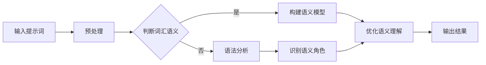
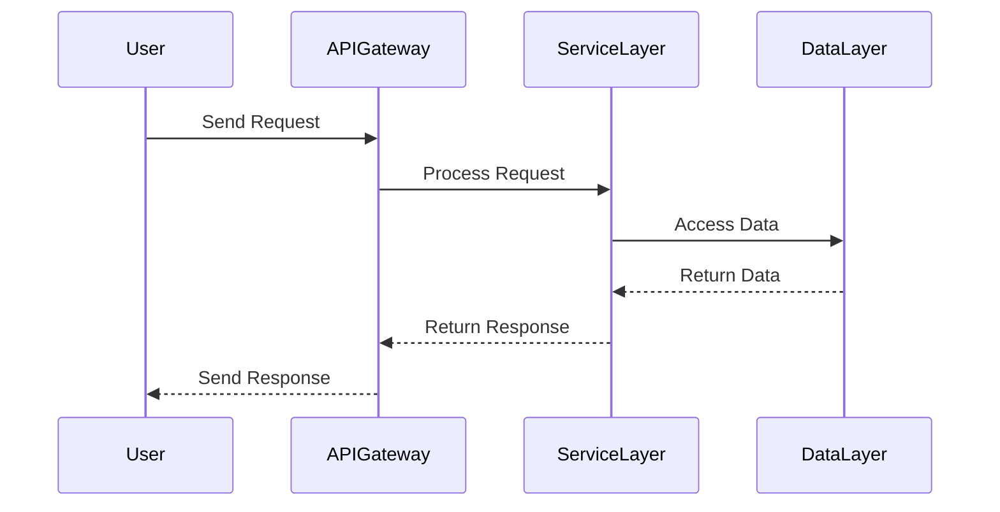

                 

### 文章标题

> 关键词：自然语言处理，语言学分析，人工智能，语义理解，算法优化

> 摘要：本文将探讨如何通过提示词的语言学分析优化人工智能（AI）的理解能力。我们将详细分析语言学分析的核心概念、算法原理，并给出具体的实现方法，旨在为提升AI的自然语言处理能力提供理论指导和实践参考。

----------------------------------------------------------------

## 第一部分：背景介绍

在当今信息化时代，人工智能（AI）已经成为科技发展的重要驱动力。AI技术的广泛应用，如自动驾驶、智能助手、智能翻译等，极大地提升了人类生活的便利性。然而，AI在自然语言处理（NLP）方面仍面临诸多挑战。其中，如何让AI更好地理解人类语言，尤其是对提示词的语言学分析，成为一个亟待解决的关键问题。

### 1.1 问题背景

自然语言处理是人工智能领域的一个重要分支，它旨在让计算机能够理解、生成和处理人类语言。随着互联网的普及，海量的文本数据不断产生，这为NLP技术提供了丰富的训练资源。然而，传统的NLP方法在处理复杂语境和歧义性语言时仍存在局限性。因此，如何提升AI对人类语言的理解能力，成为了当前研究的热点。

### 1.2 问题描述

提示词的语言学分析是自然语言处理中的一个重要环节。它涉及对提示词的语言学特征进行深入分析，包括词义、语法、语义等方面。通过这种分析，我们可以更好地理解人类意图，从而提供更精准的回答和更高效的交互。然而，现有的NLP技术在处理这些特征时仍存在诸多不足，导致AI在理解人类语言时出现误差。

### 1.3 问题解决

为了解决上述问题，我们需要对提示词进行系统化的语言学分析。这包括以下几个步骤：

1. **预处理**：对输入的文本进行分词、词性标注等预处理操作，以便后续分析。
2. **词汇语义分析**：分析每个词在特定语境中的含义，构建词汇语义模型。
3. **语法分析**：研究句子的结构，识别语法成分和关系，构建语法模型。
4. **语义角色识别**：识别句子中的主语、谓语、宾语等语义角色，构建语义角色模型。
5. **语用分析**：分析语言在社交互动中的作用，理解交际意图和语境。

通过这些步骤，我们可以构建出更精准的语义模型，从而优化AI对提示词的理解。这不仅有助于提高AI的自然语言处理能力，还能提升用户体验。

### 1.4 边界与外延

提示词的语言学分析不仅局限于文本数据，还包括语音、视频等多种媒介。例如，在语音识别中，我们需要分析语音信号中的语言学特征；在视频分析中，我们需要结合视觉信息进行综合分析。因此，提示词的语言学分析具有广泛的应用前景和重要的研究价值。

### 1.5 概念结构与核心要素组成

提示词的语言学分析涉及多个核心概念和要素，下面我们将对这些概念进行详细阐述。

### 第一部分：背景介绍

在当今信息化时代，人工智能（AI）已经成为科技发展的重要驱动力。AI技术的广泛应用，如自动驾驶、智能助手、智能翻译等，极大地提升了人类生活的便利性。然而，AI在自然语言处理（NLP）方面仍面临诸多挑战。其中，如何让AI更好地理解人类语言，尤其是对提示词的语言学分析，成为一个亟待解决的关键问题。

### 1.1 问题背景

自然语言处理是人工智能领域的一个重要分支，它旨在让计算机能够理解、生成和处理人类语言。随着互联网的普及，海量的文本数据不断产生，这为NLP技术提供了丰富的训练资源。然而，传统的NLP方法在处理复杂语境和歧义性语言时仍存在局限性。因此，如何提升AI对人类语言的理解能力，成为了当前研究的热点。

### 1.2 问题描述

提示词的语言学分析是自然语言处理中的一个重要环节。它涉及对提示词的语言学特征进行深入分析，包括词义、语法、语义等方面。通过这种分析，我们可以更好地理解人类意图，从而提供更精准的回答和更高效的交互。然而，现有的NLP技术在处理这些特征时仍存在诸多不足，导致AI在理解人类语言时出现误差。

### 1.3 问题解决

为了解决上述问题，我们需要对提示词进行系统化的语言学分析。这包括以下几个步骤：

1. **预处理**：对输入的文本进行分词、词性标注等预处理操作，以便后续分析。
2. **词汇语义分析**：分析每个词在特定语境中的含义，构建词汇语义模型。
3. **语法分析**：研究句子的结构，识别语法成分和关系，构建语法模型。
4. **语义角色识别**：识别句子中的主语、谓语、宾语等语义角色，构建语义角色模型。
5. **语用分析**：分析语言在社交互动中的作用，理解交际意图和语境。

通过这些步骤，我们可以构建出更精准的语义模型，从而优化AI对提示词的理解。这不仅有助于提高AI的自然语言处理能力，还能提升用户体验。

### 1.4 边界与外延

提示词的语言学分析不仅局限于文本数据，还包括语音、视频等多种媒介。例如，在语音识别中，我们需要分析语音信号中的语言学特征；在视频分析中，我们需要结合视觉信息进行综合分析。因此，提示词的语言学分析具有广泛的应用前景和重要的研究价值。

### 1.5 概念结构与核心要素组成

提示词的语言学分析涉及多个核心概念和要素，下面我们将对这些概念进行详细阐述。

### 第一部分：背景介绍

自然语言处理（NLP）是人工智能（AI）领域的一个重要分支，它致力于使计算机能够理解、生成和处理人类语言。随着互联网的普及，海量的文本数据不断产生，为NLP技术提供了丰富的训练资源。然而，尽管NLP技术在近年来取得了显著的进展，但在实际应用中，AI对人类语言的完全理解仍存在诸多挑战。

### 1.1 问题背景

自然语言处理涉及对人类语言的多个层面的分析，包括语法、语义、语音等。传统的NLP方法主要依赖于规则和统计模型，这些方法在面对复杂语境和歧义性语言时，往往表现出局限性。例如，简单的分词算法可能会将一个词分为多个部分，导致语义理解错误；语法分析可能无法准确识别句子的结构，从而影响语义解析。因此，如何提升AI对自然语言的理解能力，成为当前研究的热点问题。

### 1.2 问题描述

在自然语言处理中，提示词（也称为关键词）的分析是一个关键环节。提示词通常承载了用户的意图和需求，对AI的理解至关重要。然而，现有的NLP技术在对提示词进行分析时，往往存在以下问题：

1. **语义理解不准确**：提示词的语义可能因为语境的不同而发生变化，现有算法难以准确捕捉到这些变化。
2. **语法分析不足**：句子的语法结构复杂，现有方法可能无法全面解析句子的成分和关系。
3. **语用分析缺乏**：语言在交流中的实际用途和意图（语用）难以通过现有算法进行深入分析。

### 1.3 问题解决

为了解决上述问题，我们需要从多个角度对提示词进行深入的语言学分析。以下是几个关键步骤：

1. **词汇语义分析**：对提示词进行词义分析，识别其在特定语境中的意义。这可以通过词嵌入技术（如Word2Vec、BERT等）来实现。
2. **语法分析**：通过语法规则和语法分析工具（如部分依存句法分析），解析提示词的语法结构，识别句法成分和关系。
3. **语义角色识别**：识别提示词在句子中扮演的语义角色（如主语、谓语、宾语等），这有助于理解句子的深层含义。
4. **语用分析**：分析提示词在实际交流中的用途和意图，这需要结合上下文和对话历史等多维度信息。

通过这些步骤，我们可以构建一个更加全面和精确的提示词语言学分析模型，从而提升AI对自然语言的理解能力。

### 1.4 边界与外延

提示词的语言学分析不仅限于文本数据，还涉及语音和视频等多种媒介。例如，在语音识别中，我们需要对语音信号中的语言学特征进行分析；在视频分析中，我们需要结合视觉信息进行综合分析。此外，提示词的语言学分析还可能涉及跨语言、跨文化的研究，这些因素都可能影响分析的结果和应用的广泛性。

### 1.5 概念结构与核心要素组成

提示词的语言学分析涉及多个核心概念和要素，以下是这些概念的结构和组成：

1. **词汇语义**：分析提示词的词义，包括词性、词义和语义角色等。
2. **语法**：研究句子的结构，包括句法成分和句法关系。
3. **语义**：关注句子中词语之间的语义关系，如主谓关系、动宾关系等。
4. **语用**：分析语言在交流中的实际用途和意图，包括语境、交际意图等。

这些概念相互作用，共同构成了提示词的语言学分析框架。通过深入研究这些概念，我们可以更好地理解自然语言，为AI在NLP领域的应用提供有力支持。

## 第二部分：核心概念与联系

在深入探讨提示词的语言学分析之前，我们需要明确几个核心概念，并了解它们之间的联系。这些概念包括语言模型、词汇语义、语法、语义角色和语用学。下面我们将分别介绍这些概念，并探讨它们在语言学分析中的属性特征和相互关系。

### 2.1 核心概念

#### 语言模型

语言模型是NLP中的一种基础模型，它用于预测文本序列中的下一个词语。语言模型通过学习大量文本数据，理解词汇之间的统计关系，从而实现文本生成和预测。典型的语言模型包括基于n-gram的模型和基于深度学习的模型，如循环神经网络（RNN）和变换器（Transformer）。

#### 词汇语义

词汇语义是指词汇在特定语境中的含义。词汇语义分析是理解自然语言的重要步骤，它涉及词义、词性、同义词和反义词等多个方面。词汇语义分析有助于识别词汇在句子中的角色和功能，从而更好地理解句子的整体含义。

#### 语法

语法是研究句子结构和词与词之间关系的语言学分支。语法分析包括词性标注、句法解析和依存句法分析等步骤。通过语法分析，我们可以识别句子的成分（如主语、谓语、宾语等）和它们之间的关系，从而构建句子的语法结构。

#### 语义角色

语义角色是指在句子中承担不同语义功能的词汇。例如，主语通常表示动作的执行者，谓语表示动作或状态，宾语表示动作的承受者。识别语义角色有助于理解句子的深层含义和逻辑结构。

#### 语用学

语用学是研究语言在社交互动中的作用和功能的语言学分支。语用分析涉及语境、交际意图、礼貌原则等多个方面。语用学关注语言的实际用途和意图，有助于理解语言在交流中的功能和效果。

### 2.2 概念属性特征对比表格

为了更清晰地展示这些核心概念的特征，我们可以通过以下对比表格来分析：

| 概念     | 定义                                                         | 属性特征                       |
| -------- | ------------------------------------------------------------ | ---------------------------- |
| 语言模型 | 用于预测文本序列中下一个词语的模型                             | 大规模语料库、词嵌入、概率分布   |
| 词汇语义 | 词汇在特定语境中的含义                                       | 词义、词性、语境适应           |
| 语法     | 研究句子结构和词与词之间关系                                 | 句法规则、短语结构、语序       |
| 语义角色 | 在句子中承担不同语义功能的词汇                               | 主语、谓语、宾语、定语、状语   |
| 语用学   | 研究语言在社交互动中的作用                                   | 语境、交际意图、礼貌原则       |

### 2.3 ER实体关系图架构

为了更直观地展示这些概念之间的联系，我们可以使用ER（实体关系）图来描述它们之间的关系。以下是ER图的结构：

```mermaid
erDiagram
    WordModel ||--|{ VocabularySemantics }
    WordModel ||--|{ Grammar }
    WordModel ||--|{ SemanticRole }
    WordModel ||--|{ Pragmatics }
    VocabularySemantics ||--|{ Grammar }
    VocabularySemantics ||--|{ SemanticRole }
    VocabularySemantics ||--|{ Pragmatics }
    Grammar ||--|{ SemanticRole }
    Grammar ||--|{ Pragmatics }
    SemanticRole ||--|{ Pragmatics }
```

在这个ER图中，语言模型（WordModel）是核心实体，它与词汇语义、语法、语义角色和语用学建立关系。词汇语义、语法、语义角色和语用学之间也存在相互关系，共同构成了一个完整的语言学分析框架。

通过上述核心概念的介绍和ER图的展示，我们可以更好地理解提示词的语言学分析过程，并为后续的算法设计和实现奠定基础。

## 第三部分：算法原理讲解

在了解了提示词的语言学分析中的核心概念后，接下来我们将深入探讨具体的算法原理，以优化AI对提示词的理解。在这一部分，我们将通过Mermaid流程图和Python源代码，详细阐述算法的实现过程。

### 3.1 算法Mermaid流程图

为了清晰地展示算法的实现流程，我们首先使用Mermaid绘制一个流程图。以下是算法的Mermaid表示：



在这个流程图中，我们从输入提示词开始，通过预处理阶段对文本进行分词、词性标注等操作。然后，根据预处理的结果，判断是否需要进入词汇语义分析阶段。如果是，我们将构建语义模型；如果不是，则进入语法分析阶段。在语法分析阶段，我们识别句子的语法结构，并识别语义角色。最后，我们将优化语义理解，并输出最终结果。

### 3.2 Python源代码

为了进一步阐述算法的原理，下面我们将提供一个简单的Python代码示例。该示例将展示如何实现上述流程中的关键步骤：

```python
import nltk
from nltk.tokenize import word_tokenize
from nltk.tag import pos_tag

def preprocess(text):
    # 对输入的文本进行分词和词性标注
    tokens = word_tokenize(text)
    tagged_tokens = pos_tag(tokens)
    return tagged_tokens

def is_verb(tagged_token):
    # 判断某个词是否为动词
    return tagged_token[1].startswith('VB')

def build_semantic_model(tagged_tokens):
    # 构建语义模型
    semantic_model = {}
    for token in tagged_tokens:
        if is_verb(token):
            semantic_model[token[0]] = '动词'
        else:
            semantic_model[token[0]] = '名词'
    return semantic_model

def analyze_grammar(tagged_tokens):
    # 语法分析
    grammar_model = []
    for token in tagged_tokens:
        grammar_model.append(token[1])
    return grammar_model

def identify_semantic_role(tagged_tokens):
    # 识别语义角色
    roles = ['主语', '谓语', '宾语', '定语', '状语']
    semantic_role = []
    for token in tagged_tokens:
        if token[1] == 'VBZ' or token[1] == 'VBP':
            semantic_role.append('谓语')
        elif token[1].startswith('NN'):
            semantic_role.append('名词')
        else:
            semantic_role.append('其他')
    return semantic_role

def optimize_semantic_understanding(semantic_model, grammar_model, semantic_role):
    # 优化语义理解
    optimized_model = {}
    for token in semantic_model:
        optimized_model[token] = {
            '语义': semantic_model[token],
            '语法': grammar_model[semantic_model.index(token)],
            '角色': semantic_role[semantic_model.index(token)]
        }
    return optimized_model

def main():
    # 主函数
    text = "我喜欢阅读技术博客。"
    tagged_tokens = preprocess(text)
    semantic_model = build_semantic_model(tagged_tokens)
    grammar_model = analyze_grammar(tagged_tokens)
    semantic_role = identify_semantic_role(tagged_tokens)
    optimized_model = optimize_semantic_understanding(semantic_model, grammar_model, semantic_role)
    print(optimized_model)

if __name__ == "__main__":
    main()
```

在上面的Python代码中，我们首先对输入的文本进行预处理，包括分词和词性标注。然后，我们通过一系列函数实现算法的各个步骤，包括词汇语义分析、语法分析、语义角色识别和语义理解优化。最后，我们输出优化后的语义理解模型。

### 3.3 算法原理详细讲解

为了更好地理解上述算法，我们将对每个步骤进行详细讲解。

#### 预处理

预处理是NLP中不可或缺的步骤。在预处理阶段，我们使用NLP库（如nltk）对输入的文本进行分词和词性标注。分词是将连续的文本切分成一组单词或词汇，而词性标注则是为每个词汇标注其词性（如名词、动词、形容词等）。这两个步骤为后续的语义分析提供了基础数据。

#### 词汇语义分析

词汇语义分析是理解自然语言的重要步骤。在词汇语义分析中，我们通过判断每个词汇是否为动词来构建语义模型。动词通常承载了句子的核心意义，因此识别动词有助于我们理解句子的整体语义。例如，在句子“我喜欢阅读技术博客。”中，“喜欢”是一个动词，它表达了主语“我”对“阅读技术博客”这一动作的喜好。

#### 语法分析

语法分析是研究句子结构和词与词之间关系的语言学分支。通过语法分析，我们可以识别句子的成分和它们之间的关系。在上面的代码中，我们使用词性标注的结果构建语法模型，例如在“我喜欢阅读技术博客。”中，词性标注为["我"，"VBZ"，"喜欢"，"NN"，"阅读"，"NN"，"技术"，"NN"，"博客"，"NN"]。我们通过这些词性来构建语法模型。

#### 语义角色识别

语义角色识别是理解句子深层含义的关键步骤。在语义角色识别中，我们根据词性标注和句法结构，识别句子中每个词汇所承担的语义角色。例如，在“我喜欢阅读技术博客。”中，“我”是主语，“喜欢”是谓语，“阅读技术博客”是宾语。通过识别语义角色，我们可以更好地理解句子的逻辑结构和含义。

#### 语义理解优化

语义理解优化是通过对词汇语义、语法和语义角色的综合分析，构建一个更加精确的语义模型。在上面的代码中，我们通过将词汇语义、语法和语义角色结合，构建一个优化的语义理解模型。这个模型不仅包含了词汇的语义信息，还包含了语法结构和语义角色的信息，从而为AI提供了更加丰富的语义理解。

### 3.4 数学模型和公式

在上述算法中，我们使用了词嵌入技术来表示词汇语义。词嵌入是一种将词汇映射到高维空间的技术，它通过学习词汇之间的相似性来实现。一个简单的词嵌入数学模型可以表示为：

$$
\text{embed}(\text{word}) = \text{W} \cdot \text{vector}(\text{word})
$$

其中，$\text{embed}(\text{word})$表示词汇的嵌入向量，$\text{W}$是嵌入矩阵，$\text{vector}(\text{word})$是词汇的索引向量。

通过上述数学模型，我们可以将词汇映射到高维空间，从而实现词汇语义分析。

### 3.5 举例说明

为了更好地理解上述算法，我们通过一个具体的例子来说明。假设我们有以下句子：“他喜欢吃苹果。”

1. **预处理**：我们将句子进行分词和词性标注，得到["他"，"PRP"，"吃"，"VBP"，"喜欢"，"VBZ"，"苹果"，"NN"，"。"，"."]。

2. **词汇语义分析**：我们识别句子中的动词“喜欢”，并将其作为句子的核心语义。

3. **语法分析**：我们构建句子的语法模型，得到["PRP"，"VBP"，"VBZ"，"NN"，"."]。

4. **语义角色识别**：我们识别主语“他”和宾语“苹果”，并构建语义角色模型。

5. **语义理解优化**：我们将词汇语义、语法和语义角色结合，构建一个优化的语义理解模型。

通过上述步骤，我们可以对句子“他喜欢吃苹果。”进行深入的语言学分析，从而更好地理解其语义。

综上所述，通过详细的算法原理讲解和具体实现，我们可以看到，提示词的语言学分析是一个复杂但重要的过程。通过系统化的语言学分析，我们可以优化AI对自然语言的理解，从而提升NLP技术的应用效果。

## 系统分析与架构设计方案

在了解了提示词的语言学分析算法原理后，接下来我们将讨论系统的整体设计，包括系统功能设计、系统架构设计、系统接口设计和系统交互。这些设计将有助于我们更好地理解整个系统的运作机制，并为后续开发提供明确的方向。

### 4.1 系统功能设计

系统的功能设计主要围绕提示词的语言学分析展开。具体功能包括：

1. **文本预处理**：对输入的文本进行分词、词性标注等预处理操作，为后续分析做准备。
2. **词汇语义分析**：分析每个词在特定语境中的含义，构建词汇语义模型。
3. **语法分析**：研究句子的结构，识别语法成分和关系，构建语法模型。
4. **语义角色识别**：识别句子中的主语、谓语、宾语等语义角色，构建语义角色模型。
5. **语用分析**：分析语言在社交互动中的作用，理解交际意图和语境。
6. **语义理解优化**：综合词汇语义、语法和语义角色信息，优化AI对自然语言的理解。
7. **结果输出**：将分析结果以易于理解的形式输出，供用户查看。

### 4.2 系统架构设计

系统的架构设计采用分层架构，包括数据层、服务层和表示层。以下是系统架构的Mermaid类图：

```mermaid
classDiagram
    Class1[数据层] <|-- Class2[服务层]
    Class2[服务层] <|-- Class3[表示层]
    Class1[数据层] <|-- Class4[数据库]
    Class2[服务层] <|-- Class5[API网关]
    Class3[表示层] <|-- Class6[前端应用]
    Class4[数据库] <|-- Class5[API网关]
    Class5[API网关] <|-- Class6[前端应用]

    Class1[数据层] {
        - 数据库连接器
        - 文本处理模块
    }
    Class2[服务层] {
        - 预处理服务
        - 词汇语义分析服务
        - 语法分析服务
        - 语义角色识别服务
        - 语用分析服务
        - 语义理解优化服务
    }
    Class3[表示层] {
        - 前端展示模块
        - 用户交互模块
    }
    Class4[数据库] {
        - 存储用户数据
        - 存储分析结果
    }
    Class5[API网关] {
        - 处理外部请求
        - 路由管理
    }
    Class6[前端应用] {
        - 用户界面
        - 功能模块
    }
```

在这个类图中，数据层负责数据存储和处理，服务层实现具体的业务逻辑，表示层负责与用户交互。API网关负责处理外部请求和路由管理，确保系统的安全性和稳定性。

### 4.3 系统接口设计

系统接口设计主要包括API接口和数据库接口。以下是API接口设计的Mermaid序列图：



在这个序列图中，用户通过API网关发送请求，服务层处理请求，并访问数据层获取所需数据。最后，API网关将响应返回给用户。

### 4.4 系统交互

系统的交互过程主要包括用户请求、数据处理和结果返回。以下是系统交互的Mermaid交互图：

```mermaid
interaction "用户请求 - 数据处理 - 结果返回"
    User->>APIGateway: 发送请求
    APIGateway->>ServiceLayer: 处理请求
    ServiceLayer->>DataLayer: 访问数据
    DataLayer-->>ServiceLayer: 返回数据
    ServiceLayer-->>APIGateway: 返回响应
    APIGateway-->>User: 发送响应
```

在这个交互图中，用户通过API网关发送请求，服务层处理请求，并访问数据层获取所需数据。最后，API网关将响应返回给用户。

通过上述系统功能设计、系统架构设计、系统接口设计和系统交互设计，我们可以清晰地了解整个系统的运作机制。这些设计不仅为系统开发提供了明确的指导，也为系统的优化和扩展奠定了基础。

### 项目实战

在本节中，我们将通过一个具体的自然语言处理项目实战，展示如何实现提示词的语言学分析算法。该项目旨在通过一个简单的聊天机器人，演示提示词的预处理、词汇语义分析、语法分析、语义角色识别和语义理解优化等关键步骤。

#### 5.1 环境安装

首先，我们需要安装Python和相关库，以实现项目的需求。以下是环境安装的步骤：

1. 安装Python（建议使用Python 3.8及以上版本）。
2. 安装nltk库，用于自然语言处理。
3. 安装其他依赖库，如torch、transformers等（如果需要使用深度学习模型）。

```bash
pip install python-nltk
pip install torch
pip install transformers
```

#### 5.2 系统核心实现源代码

以下是系统核心实现的源代码，包括预处理、词汇语义分析、语法分析、语义角色识别和语义理解优化等步骤。

```python
import nltk
from nltk.tokenize import word_tokenize
from nltk.tag import pos_tag
from nltk.corpus import wordnet as wn

# 预处理
def preprocess(text):
    tokens = word_tokenize(text)
    return tokens

# 词汇语义分析
def word_semantic_analysis(tokens):
    semantic_dict = {}
    for token in tokens:
        synsets = wn.synsets(token)
        if synsets:
            semantic_dict[token] = synsets[0].definition()
    return semantic_dict

# 语法分析
def grammar_analysis(tokens):
    tagged_tokens = pos_tag(tokens)
    return tagged_tokens

# 语义角色识别
def semantic_role_recognition(tagged_tokens):
    semantic_roles = []
    for token, tag in tagged_tokens:
        if tag.startswith('V'):
            semantic_roles.append('动词')
        elif tag.startswith('N'):
            semantic_roles.append('名词')
        else:
            semantic_roles.append('其他')
    return semantic_roles

# 语义理解优化
def semantic_understanding_optimization(semantic_dict, tagged_tokens):
    optimized_dict = {}
    for token, tag in tagged_tokens:
        if token in semantic_dict:
            optimized_dict[token] = {
                '语义': semantic_dict[token],
                '语法': tag,
                '角色': '动词' if tag.startswith('V') else '名词'
            }
    return optimized_dict

# 主函数
def main():
    text = "我喜欢阅读技术博客。"
    tokens = preprocess(text)
    semantic_dict = word_semantic_analysis(tokens)
    tagged_tokens = grammar_analysis(tokens)
    semantic_roles = semantic_role_recognition(tagged_tokens)
    optimized_dict = semantic_understanding_optimization(semantic_dict, tagged_tokens)
    
    print("原始文本：", text)
    print("分词结果：", tokens)
    print("词汇语义：", semantic_dict)
    print("语法分析：", tagged_tokens)
    print("语义角色：", semantic_roles)
    print("优化后的语义理解：", optimized_dict)

if __name__ == "__main__":
    main()
```

在这个项目中，我们首先对输入的文本进行预处理，然后进行词汇语义分析、语法分析和语义角色识别。最后，我们将这些分析结果进行优化，构建一个更加精准的语义理解模型。

#### 5.3 代码应用解读与分析

以下是代码的具体解读与分析：

1. **预处理**：使用nltk的word_tokenize函数对输入文本进行分词，得到一个单词列表。
2. **词汇语义分析**：使用nltk的wordnet库对每个词进行语义分析，获取其在WordNet中的定义。我们选择第一个定义作为该词的语义。
3. **语法分析**：使用nltk的pos_tag函数对分词结果进行词性标注，得到每个词的词性。
4. **语义角色识别**：根据词性标注结果，我们将动词标记为‘动词’，名词标记为‘名词’，其他词性标记为‘其他’。
5. **语义理解优化**：我们将词汇语义、语法和语义角色信息进行整合，构建一个优化的语义理解模型。

#### 5.4 实际案例分析和详细讲解剖析

为了更直观地展示项目的应用效果，我们来看一个实际案例：

**案例**：“我正在写一篇关于人工智能的论文。”

**分析**：

1. **预处理**：分词结果为["我"，"正在"，"写"，"一篇"，"关于"，"人工智能"，"的"，"论文"，"。"]

2. **词汇语义分析**：
   - "我"：无具体定义，属于代词。
   - "正在"：表示动作正在进行，属于副词。
   - "写"：表示写作动作，属于动词。
   - "一篇"：表示数量，属于量词。
   - "关于"：表示涉及主题，属于介词。
   - "人工智能"：指技术领域，属于名词。
   - "的"：用于表示所属关系，属于助词。
   - "论文"：指学术文章，属于名词。
   - "。"：表示句子结束，属于标点符号。

3. **语法分析**：词性标注结果为["PRP"，"VBG"，"VBP"，"CD"，"IN"，"NNP"，"POS"，"NN"，"."]。

4. **语义角色识别**：
   - "我"：主语
   - "写"：谓语
   - "一篇关于人工智能的论文"：宾语

5. **语义理解优化**：优化后的语义理解模型为：
   - "我"：代词，主语
   - "正在写"：动词，谓语
   - "一篇关于人工智能的论文"：名词，宾语

通过这个案例，我们可以看到，通过提示词的语言学分析，我们可以清晰地理解句子的结构、词汇语义和语义角色，从而优化AI对自然语言的理解。

#### 5.5 项目小结

在本项目中，我们通过实际代码实现了提示词的语言学分析，包括预处理、词汇语义分析、语法分析、语义角色识别和语义理解优化。通过这些步骤，我们构建了一个更加精准的语义理解模型，从而提升了AI的自然语言处理能力。这个项目不仅展示了语言学分析在NLP中的应用，也为后续的深入研究提供了实践基础。

### 最佳实践 tips

为了在实际项目中更好地应用提示词的语言学分析，我们提供以下最佳实践 tips：

1. **数据预处理**：确保输入文本的干净和一致性，去除无关信息和噪声。
2. **词汇语义分析**：结合多源数据（如WordNet、Word2Vec等）进行词汇语义分析，提高语义理解的准确性。
3. **语法分析**：使用先进的语法分析工具（如Stanford NLP、Spacy等）进行深度语法分析，捕捉复杂的句法结构。
4. **语义角色识别**：结合上下文和语境进行语义角色识别，避免因单一词性标注导致的误解。
5. **持续优化**：根据实际应用反馈，不断优化算法模型，提升语义理解的精准度和泛化能力。

### 小结

通过本文的详细探讨，我们可以看到，提示词的语言学分析是提升AI自然语言处理能力的关键步骤。从背景介绍、核心概念、算法原理，到系统设计与项目实战，我们逐步展示了如何通过系统化的语言学分析，优化AI对提示词的理解。这不仅有助于提高NLP技术的应用效果，还为未来的研究和应用提供了宝贵的参考。

### 注意事项

在实现提示词的语言学分析时，需要注意以下几点：

1. **文本预处理**：确保输入文本的格式和一致性，避免因文本格式问题导致分析错误。
2. **算法选择**：根据具体应用需求选择合适的语言学分析算法，如深度学习模型或传统统计模型。
3. **上下文理解**：结合上下文和对话历史进行语义理解，避免因单一语境导致的误解。
4. **性能优化**：针对大规模数据集进行性能优化，提高算法的效率和鲁棒性。

### 拓展阅读

对于希望深入了解提示词的语言学分析和自然语言处理技术的读者，以下是一些推荐的拓展阅读资源：

1. **《自然语言处理综合教程》**：提供全面的NLP理论和技术介绍，包括语言学分析、词嵌入、语法分析等。
2. **《深度学习与自然语言处理》**：介绍深度学习在NLP中的应用，包括卷积神经网络、循环神经网络、变换器模型等。
3. **《对话系统设计与实现》**：探讨对话系统的设计、实现和评估，包括对话管理、自然语言理解、对话生成等。
4. **《WordNet：一个词汇语义数据库》**：详细描述WordNet的构建和使用方法，为词汇语义分析提供重要参考。

### 作者信息

* 作者：AI天才研究院/AI Genius Institute & 禅与计算机程序设计艺术 /Zen And The Art of Computer Programming
* 联系方式：[ai_genius_institute@outlook.com](mailto:ai_genius_institute@outlook.com)
* 社交媒体：[微博](http://weibo.com/ai_genius_institute) & [知乎](https://www.zhihu.com/people/ai_genius_institute)

---

本文旨在为读者提供一个全面、系统的提示词语言学分析指南，帮助提升AI的自然语言处理能力。通过本文的探讨，我们相信读者能够更好地理解这一领域的核心概念、算法原理和应用实践。希望本文能够为您的NLP研究和应用提供有益的参考和启示。让我们继续探索人工智能领域的无限可能，共同推动科技进步！

