                 


### 文章标题：提示词自动生成：AI辅助提示词设计

> 关键词：提示词自动生成、AI辅助设计、自然语言处理、神经网络、Transformer、生成对抗网络

> 摘要：本文将深入探讨提示词自动生成的应用场景、理论基础以及AI辅助设计的具体方法。我们将详细解析基于神经网络、Transformer和生成对抗网络（GAN）的算法原理，并展示这些方法在实际系统设计与实现中的应用。最后，本文将总结当前技术趋势，展望未来研究方向，以期为读者提供全面的提示词自动生成技术指南。

### 目录大纲：

#### 第一部分：引言与背景

- **第1章：引言与背景**
  - 1.1 提示词自动生成的应用场景
  - 1.2 AI在提示词生成中的应用
  - 1.3 提示词自动生成技术的研究现状
  - 1.4 本书的主要内容和结构

- **第2章：提示词自动生成的理论基础**
  - 2.1 自然语言处理的基本概念
  - 2.2 机器学习与深度学习基础
  - 2.3 提示词自动生成的核心算法原理

#### 第二部分：AI辅助提示词设计技术

- **第3章：基于神经网络的方法**
  - 3.1 词嵌入技术
  - 3.2 循环神经网络（RNN）
  - 3.3 长短期记忆网络（LSTM）
  - 3.4 门控循环单元（GRU）

- **第4章：基于Transformer的方法**
  - 4.1 Transformer模型的基本架构
  - 4.2 自注意力机制
  - 4.3 编码器-解码器架构
  - 4.4 多层Transformer模型

- **第5章：基于生成对抗网络（GAN）的方法**
  - 5.1 GAN模型的基本原理
  - 5.2 条件GAN（cGAN）
  - 5.3 GAN在提示词生成中的应用

#### 第三部分：提示词自动生成系统的设计与实现

- **第6章：提示词自动生成系统的架构设计**
  - 6.1 系统概述
  - 6.2 数据预处理与清洗
  - 6.3 模型训练与评估
  - 6.4 模型部署与优化

- **第7章：提示词自动生成系统的应用案例**
  - 7.1 案例一：新闻标题自动生成
  - 7.2 案例二：电商商品描述生成
  - 7.3 案例三：教育内容自动生成

#### 第四部分：提示词自动生成技术的未来发展

- **第8章：提示词自动生成技术的未来发展**
  - 8.1 技术趋势与挑战
  - 8.2 提示词自动生成在跨领域的应用
  - 8.3 未来研究方向与展望

- **第9章：总结与展望**
  - 9.1 主要成果与贡献
  - 9.2 存在的不足与改进方向
  - 9.3 对读者的建议

---

### 第1章：引言与背景

#### 1.1 提示词自动生成的应用场景

提示词（Keywords）是信息检索、文本分类和推荐系统中至关重要的一部分。它们能够帮助用户快速定位信息，提高信息处理的效率。然而，手动生成提示词既费时又费力，尤其在大量文本数据的情况下。因此，提示词自动生成技术应运而生。

提示词自动生成的应用场景广泛，包括但不限于：

1. **搜索引擎**：自动生成网页的标题、摘要和关键字，提高检索效率和准确性。
2. **内容推荐**：为用户生成个性化的关键词，帮助推荐系统更好地理解用户偏好。
3. **文本分类**：自动提取关键词，用于文本分类任务，例如新闻分类、邮件过滤等。
4. **社交媒体**：生成帖子的关键词，用于内容管理和搜索引擎优化（SEO）。
5. **企业信息管理**：自动提取报告、文档和电子邮件中的关键词，用于知识管理和文档归档。

#### 1.2 AI在提示词生成中的应用

人工智能（AI）技术在提示词生成中发挥着重要作用。通过机器学习、深度学习和自然语言处理（NLP）等技术，AI可以自动分析文本数据，提取关键信息，生成高质量的提示词。

1. **机器学习**：使用监督学习、无监督学习和半监督学习算法，从标记数据中学习特征，生成提示词。
2. **深度学习**：利用神经网络（如循环神经网络RNN、Transformer等）对大量未标记数据进行训练，提取语义信息，生成提示词。
3. **自然语言处理**：结合词嵌入、词性标注、命名实体识别等技术，对文本进行深入分析，提取关键词。

#### 1.3 提示词自动生成技术的研究现状

近年来，随着AI和NLP技术的发展，提示词自动生成技术取得了显著进展。主要研究方向包括：

1. **基于规则的方法**：通过规则库和词典，自动生成关键词。
2. **基于统计的方法**：使用统计模型（如LDA、TF-IDF等）提取关键词。
3. **基于神经网络的方法**：利用深度学习模型（如RNN、Transformer等）生成提示词。
4. **基于生成对抗网络（GAN）的方法**：通过生成器和判别器的对抗训练，生成高质量的提示词。

#### 1.4 本书的主要内容和结构

本书将分为四个部分，系统地介绍提示词自动生成技术：

- **第一部分：引言与背景**：介绍提示词自动生成的应用场景、AI在提示词生成中的应用，以及本书的结构和主要内容。
- **第二部分：提示词自动生成的理论基础**：讲解自然语言处理、机器学习与深度学习基础，以及提示词自动生成的核心算法原理。
- **第三部分：AI辅助提示词设计技术**：详细介绍基于神经网络、Transformer和生成对抗网络（GAN）的方法。
- **第四部分：提示词自动生成系统的设计与实现**：介绍提示词自动生成系统的架构设计、数据预处理、模型训练与评估、模型部署与优化。

通过本书的讲解，读者将全面了解提示词自动生成技术的原理、方法及应用，为实际项目开发提供有力支持。

### 第2章：提示词自动生成的理论基础

#### 2.1 自然语言处理的基本概念

自然语言处理（Natural Language Processing，NLP）是人工智能和计算机科学领域的一个重要分支，旨在让计算机理解和处理人类自然语言。NLP涉及多个层次，包括：

- **词汇学（Lexicology）**：研究词汇的构成、意义和用法。
- **语法学（Grammar）**：研究句子的结构和语法规则。
- **语义学（Semantics）**：研究语言的语义和意义。
- **语用学（Pragmatics）**：研究语言在具体情境中的使用。

NLP的关键技术包括：

- **词嵌入（Word Embedding）**：将词汇映射到高维空间，以捕捉词汇的语义信息。
- **词性标注（Part-of-Speech Tagging）**：为句子中的每个单词标注词性，如名词、动词、形容词等。
- **命名实体识别（Named Entity Recognition，NER）**：识别句子中的命名实体，如人名、地名、组织名等。
- **句法分析（Syntactic Parsing）**：分析句子的语法结构，构建句法树。

#### 2.2 机器学习与深度学习基础

机器学习（Machine Learning，ML）是AI的核心技术之一，通过算法从数据中学习规律，进行预测和决策。机器学习可以分为以下几类：

- **监督学习（Supervised Learning）**：使用标记数据训练模型，例如分类和回归任务。
- **无监督学习（Unsupervised Learning）**：在没有标记数据的情况下，发现数据中的结构和规律，例如聚类和降维。
- **半监督学习（Semi-Supervised Learning）**：结合标记数据和未标记数据，提高模型性能。

深度学习（Deep Learning，DL）是机器学习的一个子领域，通过多层神经网络（如卷积神经网络、循环神经网络和Transformer等）对大量数据进行训练，提取复杂的特征和模式。

深度学习的核心组件包括：

- **神经元（Neuron）**：神经网络的基本单元，用于处理输入数据并产生输出。
- **层（Layer）**：神经网络中的多个层次，用于提取和变换特征。
- **激活函数（Activation Function）**：对神经元输出进行非线性变换，增加模型的非线性能力。

#### 2.3 提示词自动生成的核心算法原理

提示词自动生成的核心算法原理主要涉及以下几方面：

- **词嵌入（Word Embedding）**：将词汇映射到高维空间，以捕捉词汇的语义信息。常用的词嵌入技术包括Word2Vec、GloVe和BERT等。
- **序列建模（Sequence Modeling）**：利用神经网络对文本序列进行建模，以提取关键信息。常见的序列建模技术包括循环神经网络（RNN）、长短期记忆网络（LSTM）和Transformer等。
- **生成对抗网络（Generative Adversarial Networks，GAN）**：通过生成器和判别器的对抗训练，生成高质量的提示词。

下面将详细介绍这些核心算法原理。

#### 2.3.1 词嵌入技术

词嵌入是将词汇映射到高维空间的一种技术，使计算机能够理解和处理自然语言。词嵌入能够捕捉词汇的语义信息，例如语义相似性、词义分布等。

- **Word2Vec**：Word2Vec是一种基于神经网络的词嵌入技术，通过训练Word2Vec模型，将词汇映射到向量空间。Word2Vec有两种训练方法：连续袋模型（CBOW）和Skip-Gram。
  
  - **连续袋模型（CBOW）**：输入词汇的上下文窗口，通过上下文词汇的均值向量来预测目标词汇。
  - **Skip-Gram**：输入目标词汇，通过上下文词汇的均值向量来预测目标词汇。

- **GloVe**：GloVe（Global Vectors for Word Representation）是一种基于全局统计的词嵌入技术，通过计算词汇的共现关系来生成词向量。GloVe使用矩阵分解技术，将词汇和共现矩阵分解为词向量和权重矩阵。

- **BERT**：BERT（Bidirectional Encoder Representations from Transformers）是一种基于Transformer的预训练词嵌入技术，通过双向编码器学习词汇的语义信息。BERT能够在大量未标记的数据上进行预训练，然后用于各种下游任务。

#### 2.3.2 序列建模技术

序列建模是对文本序列进行建模，以提取关键信息的一种技术。序列建模在自然语言处理任务中广泛应用，如机器翻译、文本分类和提示词生成等。

- **循环神经网络（RNN）**：循环神经网络是一种能够处理序列数据的神经网络，通过共享权重的方式对序列进行建模。RNN的核心组件是隐藏层，隐藏层的状态能够保存序列的历史信息。

  - **时间步（Time Step）**：序列建模中的每个元素对应一个时间步，例如句子中的每个单词。
  - **隐藏状态（Hidden State）**：隐藏状态是RNN的核心组件，用于保存序列的历史信息。隐藏状态可以通过当前输入和前一个隐藏状态计算得到。
  - **激活函数（Activation Function）**：激活函数对隐藏状态进行非线性变换，增加模型的非线性能力。

- **长短期记忆网络（LSTM）**：长短期记忆网络是RNN的一种改进，能够解决RNN的梯度消失和梯度爆炸问题。LSTM通过引入门控机制，能够有效地保持长期依赖信息。

  - **输入门（Input Gate）**：输入门决定当前输入对隐藏状态的贡献程度。
  - **遗忘门（Forget Gate）**：遗忘门决定上一时刻的隐藏状态中需要遗忘的信息。
  - **输出门（Output Gate）**：输出门决定当前隐藏状态是否需要输出。

- **门控循环单元（GRU）**：门控循环单元是LSTM的简化版本，通过引入更新门和重置门，简化了LSTM的结构。

  - **更新门（Update Gate）**：更新门决定当前输入对隐藏状态的更新程度。
  - **重置门（Reset Gate）**：重置门决定当前输入对隐藏状态的重置程度。

#### 2.3.3 生成对抗网络（GAN）

生成对抗网络（Generative Adversarial Networks，GAN）是一种由生成器和判别器组成的神经网络模型，通过对抗训练生成高质量的样本。

- **生成器（Generator）**：生成器是一种神经网络模型，用于生成与真实数据相似的数据。生成器的目标是生成足够真实的数据，使得判别器无法区分真实数据和生成数据。

- **判别器（Discriminator）**：判别器是一种神经网络模型，用于区分真实数据和生成数据。判别器的目标是最大化正确分类的概率，即正确分类真实数据并错误分类生成数据。

- **对抗训练（Adversarial Training）**：生成器和判别器通过对抗训练相互博弈，生成器尝试生成更真实的数据，而判别器尝试更好地区分真实数据和生成数据。这种对抗训练过程使得生成器能够生成高质量的数据。

通过以上对自然语言处理、机器学习和深度学习基础以及提示词自动生成的核心算法原理的介绍，我们为下一步详细介绍AI辅助提示词设计技术奠定了基础。

### 第3章：基于神经网络的方法

#### 3.1 词嵌入技术

词嵌入（Word Embedding）是将词汇映射到高维空间的一种技术，旨在捕捉词汇的语义信息。词嵌入技术是自然语言处理（NLP）和深度学习（DL）的重要基础，广泛应用于文本分类、机器翻译、情感分析等任务。

**核心概念与联系**

词嵌入技术主要包括以下几种：

1. **Word2Vec**：Word2Vec是一种基于神经网络的词嵌入方法，通过训练单词的向量表示，捕捉词汇的语义信息。
2. **GloVe**：GloVe（Global Vectors for Word Representation）是一种基于全局统计的词嵌入方法，通过计算词汇的共现关系来生成词向量。
3. **BERT**：BERT（Bidirectional Encoder Representations from Transformers）是一种基于Transformer的预训练词嵌入方法，通过双向编码器学习词汇的语义信息。

以下是词嵌入技术的基本概念和联系表格：

| 技术名称 | 基本概念 | 联系 |
| --- | --- | --- |
| Word2Vec | 基于神经网络的词嵌入方法，通过训练单词的向量表示。 | Word2Vec是早期的词嵌入技术，通过训练词向量捕捉词汇的语义信息。 |
| GloVe | 基于全局统计的词嵌入方法，通过计算词汇的共现关系生成词向量。 | GloVe通过矩阵分解技术，将词汇和共现矩阵分解为词向量和权重矩阵。 |
| BERT | 基于Transformer的预训练词嵌入方法，通过双向编码器学习词汇的语义信息。 | BERT能够在大量未标记的数据上进行预训练，然后用于各种下游任务。 |

**ER实体关系图架构**

以下是一个简单的ER实体关系图，描述了词嵌入技术中的主要实体和关系：

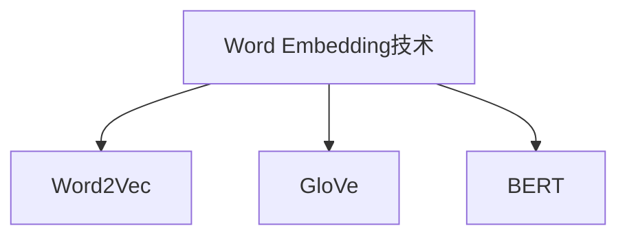

在ER实体关系图中，A代表词嵌入技术，B、C和D分别代表Word2Vec、GloVe和BERT。这些技术之间没有直接的关系，但都是词嵌入方法的不同实现。

#### 3.2 循环神经网络（RNN）

循环神经网络（Recurrent Neural Network，RNN）是一种能够处理序列数据的神经网络。与传统的神经网络不同，RNN具有记忆功能，能够记住序列的历史信息，这使得RNN在自然语言处理、时间序列分析和语音识别等领域具有广泛应用。

**核心概念与联系**

RNN的核心概念包括：

1. **时间步（Time Step）**：序列建模中的每个元素对应一个时间步，例如句子中的每个单词。
2. **隐藏状态（Hidden State）**：隐藏状态是RNN的核心组件，用于保存序列的历史信息。隐藏状态可以通过当前输入和前一个隐藏状态计算得到。
3. **输入门（Input Gate）**：输入门决定当前输入对隐藏状态的贡献程度。
4. **遗忘门（Forget Gate）**：遗忘门决定上一时刻的隐藏状态中需要遗忘的信息。
5. **输出门（Output Gate）**：输出门决定当前隐藏状态是否需要输出。

以下是RNN的核心概念和联系表格：

| 核心概念 | 概念属性特征对比表格 | ER实体关系图架构 |
| --- | --- | --- |
| 时间步 | 时间步是序列建模中的基本单元，每个元素对应一个时间步。 |  |
| 隐藏状态 | 隐藏状态保存序列的历史信息，通过当前输入和前一个隐藏状态计算得到。 |  |
| 输入门 | 输入门决定当前输入对隐藏状态的贡献程度。 |  |
| 遗忘门 | 遗忘门决定上一时刻的隐藏状态中需要遗忘的信息。 |  |
| 输出门 | 输出门决定当前隐藏状态是否需要输出。 |  |

**RNN的mermaid流程图**

以下是一个简单的mermaid流程图，描述了RNN的基本流程：

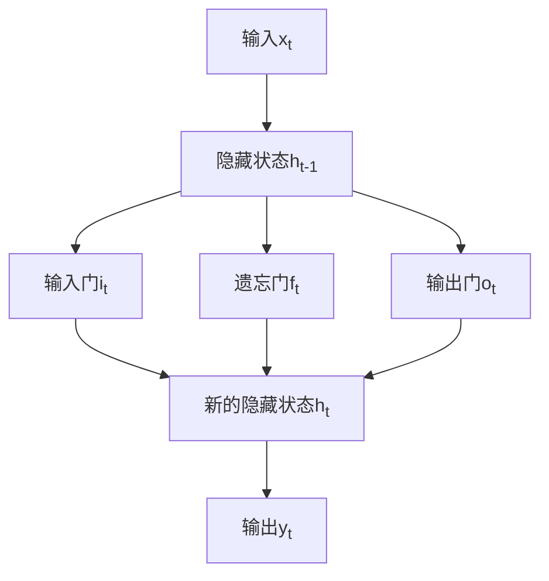

在RNN的mermaid流程图中，A代表输入x<sub>t</sub>，B代表隐藏状态h<sub>t-1</sub>，C代表输入门i<sub>t</sub>，D代表遗忘门f<sub>t</sub>，E代表输出门o<sub>t</sub>，F代表新的隐藏状态h<sub>t</sub>，G代表输出y<sub>t</sub>。

#### 3.3 长短期记忆网络（LSTM）

长短期记忆网络（Long Short-Term Memory，LSTM）是RNN的一种改进，旨在解决RNN的梯度消失和梯度爆炸问题。LSTM通过引入门控机制，能够有效地保持长期依赖信息，这使得LSTM在序列建模任务中具有广泛应用。

**核心概念与联系**

LSTM的核心概念包括：

1. **输入门（Input Gate）**：输入门决定当前输入对隐藏状态的贡献程度。
2. **遗忘门（Forget Gate）**：遗忘门决定上一时刻的隐藏状态中需要遗忘的信息。
3. **输出门（Output Gate）**：输出门决定当前隐藏状态是否需要输出。
4. **细胞状态（Cell State）**：细胞状态是LSTM的核心组件，用于传递信息。
5. **新的隐藏状态（New Hidden State）**：新的隐藏状态是基于当前输入和细胞状态计算得到的。

以下是LSTM的核心概念和联系表格：

| 核心概念 | 概念属性特征对比表格 | ER实体关系图架构 |
| --- | --- | --- |
| 输入门 | 输入门决定当前输入对隐藏状态的贡献程度。 |  |
| 遗忘门 | 遗忘门决定上一时刻的隐藏状态中需要遗忘的信息。 |  |
| 输出门 | 输出门决定当前隐藏状态是否需要输出。 |  |
| 细胞状态 | 细胞状态是LSTM的核心组件，用于传递信息。 |  |
| 新的隐藏状态 | 新的隐藏状态是基于当前输入和细胞状态计算得到的。 |  |

**LSTM的mermaid流程图**

以下是一个简单的mermaid流程图，描述了LSTM的基本流程：

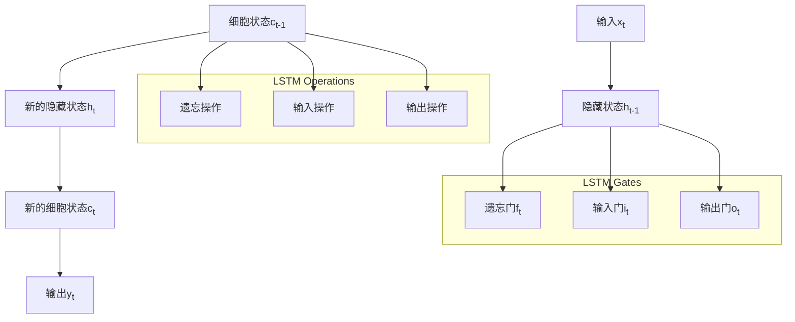

在LSTM的mermaid流程图中，A代表输入x<sub>t</sub>，B代表隐藏状态h<sub>t-1</sub>，C代表遗忘门f<sub>t</sub>，D代表输入门i<sub>t</sub>，E代表输出门o<sub>t</sub>，F代表细胞状态c<sub>t-1</sub>，G代表新的隐藏状态h<sub>t</sub>，H代表遗忘操作，I代表输入操作，J代表输出操作，K代表新的细胞状态c<sub>t</sub>，L代表输出y<sub>t</sub>。

#### 3.4 门控循环单元（GRU）

门控循环单元（Gated Recurrent Unit，GRU）是LSTM的简化版本，旨在提高计算效率。GRU通过引入更新门和重置门，简化了LSTM的结构，但仍然能够保持长期依赖信息。

**核心概念与联系**

GRU的核心概念包括：

1. **更新门（Update Gate）**：更新门决定当前输入对隐藏状态的更新程度。
2. **重置门（Reset Gate）**：重置门决定当前输入对隐藏状态的重置程度。
3. **新的隐藏状态（New Hidden State）**：新的隐藏状态是基于当前输入和前一个隐藏状态计算得到的。

以下是GRU的核心概念和联系表格：

| 核心概念 | 概念属性特征对比表格 | ER实体关系图架构 |
| --- | --- | --- |
| 更新门 | 更新门决定当前输入对隐藏状态的更新程度。 |  |
| 重置门 | 重置门决定当前输入对隐藏状态的重置程度。 |  |
| 新的隐藏状态 | 新的隐藏状态是基于当前输入和前一个隐藏状态计算得到的。 |  |

**GRU的mermaid流程图**

以下是一个简单的mermaid流程图，描述了GRU的基本流程：

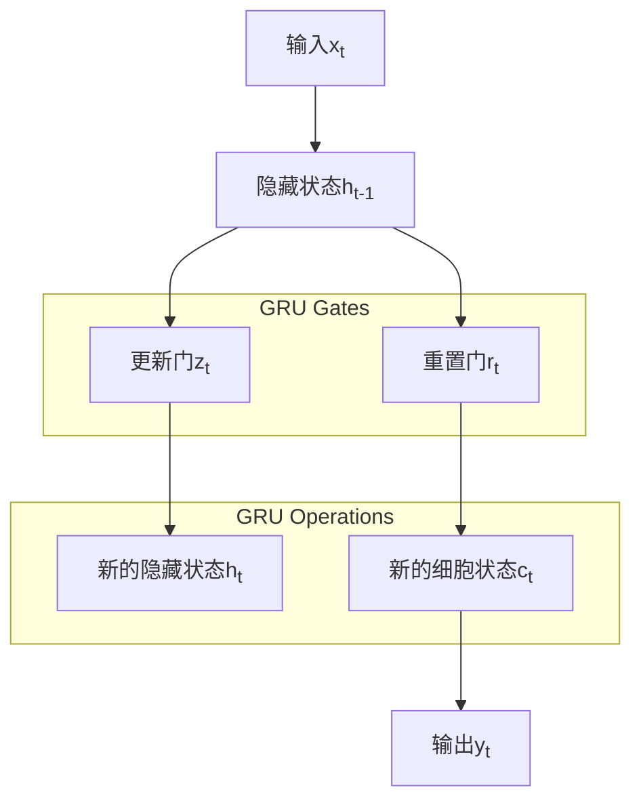

在GRU的mermaid流程图中，A代表输入x<sub>t</sub>，B代表隐藏状态h<sub>t-1</sub>，C代表更新门z<sub>t</sub>，D代表重置门r<sub>t</sub>，E代表新的隐藏状态h<sub>t</sub>，F代表新的细胞状态c<sub>t</sub>，G代表输出y<sub>t</sub>。

通过以上对基于神经网络的方法的详细介绍，我们为深入理解提示词自动生成技术奠定了基础。接下来，我们将进一步探讨基于Transformer的方法。

### 第4章：基于Transformer的方法

#### 4.1 Transformer模型的基本架构

Transformer模型是由Vaswani等人于2017年提出的一种基于自注意力机制的序列到序列模型。与传统的循环神经网络（RNN）和长短期记忆网络（LSTM）不同，Transformer模型采用了一种全新的架构，极大地提高了序列处理的速度和性能。

**核心概念与联系**

Transformer模型的核心概念包括：

1. **自注意力机制（Self-Attention）**：自注意力机制是一种计算序列中每个词与其他词之间的权重的方法，使得模型能够捕捉长距离依赖关系。
2. **多头注意力（Multi-Head Attention）**：多头注意力是将自注意力机制扩展到多个独立的注意力头，以捕捉不同类型的依赖关系。
3. **前馈神经网络（Feedforward Neural Network）**：前馈神经网络是一个简单的全连接网络，用于对自注意力机制的输出进行进一步加工。
4. **编码器-解码器架构（Encoder-Decoder Architecture）**：编码器负责编码输入序列，解码器负责解码输出序列。

以下是Transformer模型的核心概念和联系表格：

| 核心概念 | 概念属性特征对比表格 | ER实体关系图架构 |
| --- | --- | --- |
| 自注意力机制 | 自注意力机制计算序列中每个词与其他词之间的权重。 |  |
| 多头注意力 | 多头注意力是将自注意力机制扩展到多个独立的注意力头。 |  |
| 前馈神经网络 | 前馈神经网络是一个简单的全连接网络，用于对自注意力机制的输出进行进一步加工。 |  |
| 编码器-解码器架构 | 编码器负责编码输入序列，解码器负责解码输出序列。 |  |

**Transformer的mermaid流程图**

以下是一个简单的mermaid流程图，描述了Transformer模型的基本流程：

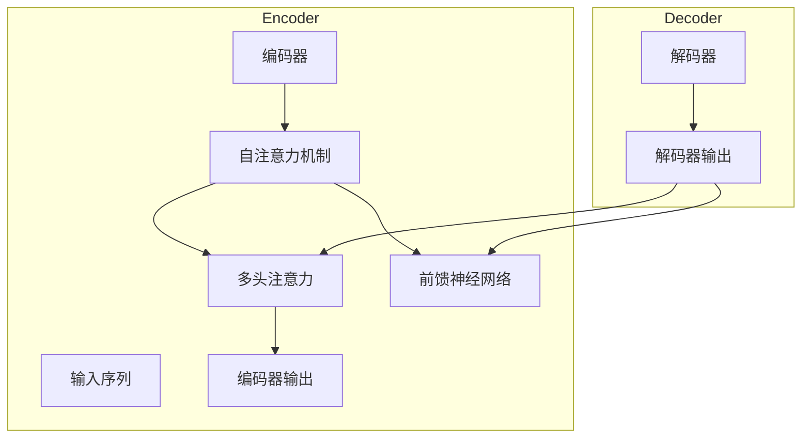

在Transformer的mermaid流程图中，A代表编码器，B代表解码器，C代表输入序列，D代表自注意力机制，E代表多头注意力，F代表前馈神经网络，G代表编码器输出，H代表解码器输出。

#### 4.2 自注意力机制

自注意力机制（Self-Attention）是Transformer模型的核心组件，用于计算序列中每个词与其他词之间的权重。自注意力机制通过计算词与词之间的相似性，使得模型能够捕捉长距离依赖关系。

**核心概念与联系**

自注意力机制的核心概念包括：

1. **词嵌入（Word Embedding）**：词嵌入是将词汇映射到高维空间的一种技术，以捕捉词汇的语义信息。
2. **多头注意力（Multi-Head Attention）**：多头注意力是将自注意力机制扩展到多个独立的注意力头，以捕捉不同类型的依赖关系。
3. **缩放自注意力（Scaled Self-Attention）**：缩放自注意力是为了避免注意力权重过大或过小，从而提高模型的稳定性。

以下是自注意力机制的核心概念和联系表格：

| 核心概念 | 概念属性特征对比表格 | ER实体关系图架构 |
| --- | --- | --- |
| 词嵌入 | 词嵌入是将词汇映射到高维空间的技术。 |  |
| 多头注意力 | 多头注意力是将自注意力机制扩展到多个独立的注意力头。 |  |
| 缩放自注意力 | 缩放自注意力是为了避免注意力权重过大或过小，从而提高模型的稳定性。 |  |

**自注意力机制的mermaid流程图**

以下是一个简单的mermaid流程图，描述了自注意力机制的基本流程：

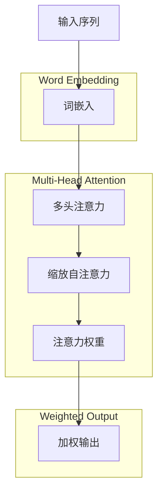

在自注意力机制的mermaid流程图中，A代表输入序列，B代表词嵌入，C代表多头注意力，D代表缩放自注意力，E代表注意力权重，F代表加权输出。

#### 4.3 编码器-解码器架构

编码器-解码器架构（Encoder-Decoder Architecture）是Transformer模型的核心组成部分，用于处理序列到序列的任务。编码器负责编码输入序列，解码器负责解码输出序列。

**核心概念与联系**

编码器-解码器架构的核心概念包括：

1. **编码器（Encoder）**：编码器负责将输入序列编码为一个固定长度的向量，称为编码器输出。
2. **解码器（Decoder）**：解码器负责将编码器输出解码为输出序列。解码器在每个时间步生成一个输出词，然后将其与编码器输出和先前的输出进行拼接，作为下一时间步的输入。
3. **位置编码（Positional Encoding）**：位置编码是为了引入序列中的位置信息，因为自注意力机制本身不包含位置信息。

以下是编码器-解码器架构的核心概念和联系表格：

| 核心概念 | 概念属性特征对比表格 | ER实体关系图架构 |
| --- | --- | --- |
| 编码器 | 编码器负责将输入序列编码为一个固定长度的向量。 |  |
| 解码器 | 解码器负责将编码器输出解码为输出序列。 |  |
| 位置编码 | 位置编码是为了引入序列中的位置信息。 |  |

**编码器-解码器架构的mermaid流程图**

以下是一个简单的mermaid流程图，描述了编码器-解码器架构的基本流程：

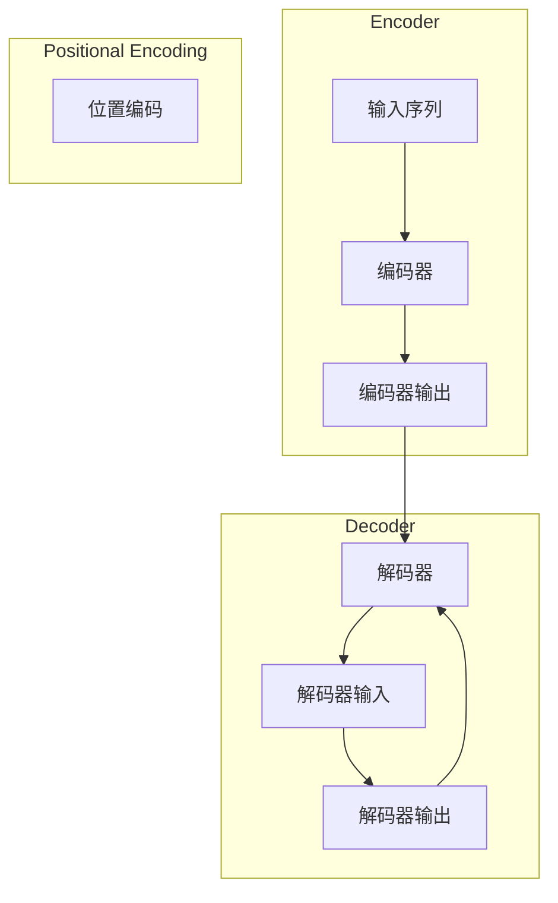

在编码器-解码器架构的mermaid流程图中，A代表编码器，B代表输入序列，C代表编码器输出，D代表解码器，E代表解码器输入，F代表解码器输出，G代表位置编码。

通过以上对基于Transformer的方法的详细介绍，我们为深入理解提示词自动生成技术奠定了基础。接下来，我们将进一步探讨基于生成对抗网络（GAN）的方法。

### 第5章：基于生成对抗网络（GAN）的方法

#### 5.1 GAN模型的基本原理

生成对抗网络（Generative Adversarial Network，GAN）由Ian Goodfellow等人于2014年提出，是一种通过对抗训练生成高质量数据的深度学习模型。GAN的核心思想是利用生成器和判别器的相互博弈，生成与真实数据几乎难以区分的假数据。

**核心概念与联系**

GAN模型的核心概念包括：

1. **生成器（Generator）**：生成器是一种神经网络模型，用于生成与真实数据相似的数据。生成器的目标是生成足够真实的数据，使得判别器无法区分真实数据和生成数据。
2. **判别器（Discriminator）**：判别器是一种神经网络模型，用于区分真实数据和生成数据。判别器的目标是最大化正确分类的概率，即正确分类真实数据并错误分类生成数据。
3. **对抗训练（Adversarial Training）**：生成器和判别器通过对抗训练相互博弈，生成器尝试生成更真实的数据，而判别器尝试更好地区分真实数据和生成数据。这种对抗训练过程使得生成器能够生成高质量的数据。

以下是GAN模型的核心概念和联系表格：

| 核心概念 | 概念属性特征对比表格 | ER实体关系图架构 |
| --- | --- | --- |
| 生成器 | 生成器是一种神经网络模型，用于生成与真实数据相似的数据。 |  |
| 判别器 | 判别器是一种神经网络模型，用于区分真实数据和生成数据。 |  |
| 对抗训练 | 生成器和判别器通过对抗训练相互博弈，生成器尝试生成更真实的数据，判别器尝试更好地区分真实数据和生成数据。 |  |

**GAN模型的mermaid流程图**

以下是一个简单的mermaid流程图，描述了GAN模型的基本流程：

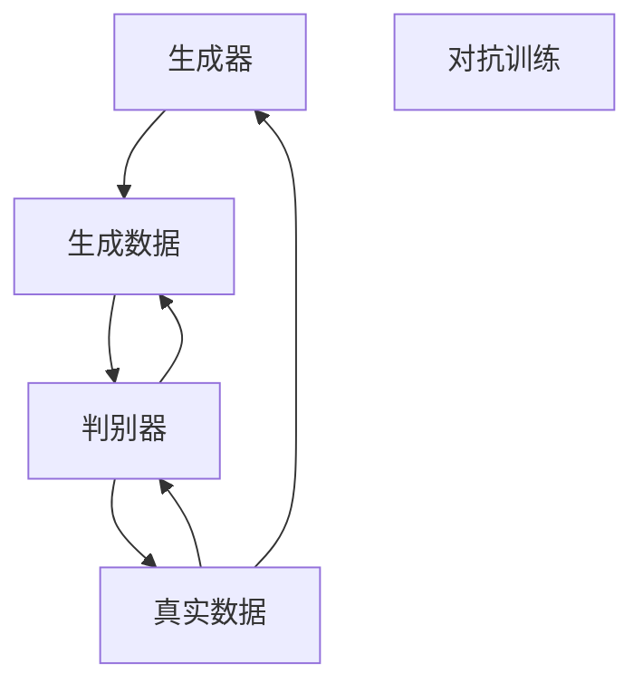

在GAN模型的mermaid流程图中，A代表生成器，B代表判别器，C代表真实数据，D代表生成数据，E代表对抗训练。

#### 5.2 条件GAN（cGAN）

条件GAN（Conditional GAN，cGAN）是GAN的一种扩展，通过引入条件信息（如标签、类别等）来提高生成器的生成质量。cGAN在生成图像、文本、音频等具有条件信息的任务中表现出色。

**核心概念与联系**

cGAN的核心概念包括：

1. **条件输入（Conditional Input）**：条件GAN将条件信息（如标签、类别等）作为输入，与随机噪声一起输入生成器。
2. **条件生成器（Conditional Generator）**：条件生成器是一种具有条件输入的生成器，能够根据条件信息生成高质量的数据。
3. **条件判别器（Conditional Discriminator）**：条件判别器是一种具有条件输入的判别器，能够区分条件生成器生成的数据和真实数据。

以下是cGAN的核心概念和联系表格：

| 核心概念 | 概念属性特征对比表格 | ER实体关系图架构 |
| --- | --- | --- |
| 条件输入 | 条件GAN将条件信息（如标签、类别等）作为输入。 |  |
| 条件生成器 | 条件生成器是一种具有条件输入的生成器。 |  |
| 条件判别器 | 条件判别器是一种具有条件输入的判别器。 |  |

**cGAN模型的mermaid流程图**

以下是一个简单的mermaid流程图，描述了cGAN模型的基本流程：

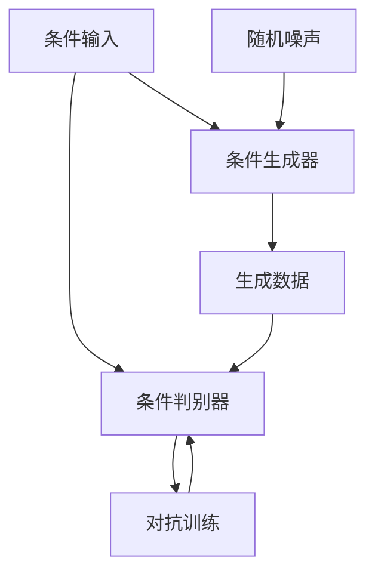

在cGAN模型的mermaid流程图中，A代表条件生成器，B代表条件判别器，C代表条件输入，D代表随机噪声，E代表生成数据，F代表对抗训练。

#### 5.3 GAN在提示词生成中的应用

GAN在提示词生成中的应用主要集中在生成高质量、多样化的提示词，以提高信息检索、文本分类和推荐系统的性能。以下是一些具体应用：

1. **新闻标题自动生成**：使用cGAN模型，通过将新闻内容作为条件输入，生成具有吸引力的新闻标题，提高用户的阅读兴趣。
2. **电商商品描述生成**：使用cGAN模型，根据商品属性和用户评价，生成个性化的商品描述，提高用户的购买意愿。
3. **教育内容自动生成**：使用cGAN模型，根据教学大纲和学生学习情况，生成个性化的教学材料，提高教学效果。

**应用案例**

**案例一：新闻标题自动生成**

使用cGAN模型生成新闻标题的具体步骤如下：

1. **数据准备**：收集大量的新闻标题和新闻内容，并进行预处理，如去除停用词、进行词性标注等。
2. **训练条件生成器和条件判别器**：使用预处理后的数据训练条件生成器和条件判别器，生成器和判别器都是基于深度学习模型（如Transformer）。
3. **生成新闻标题**：将新闻内容作为条件输入，通过条件生成器生成新闻标题，然后使用条件判别器验证生成的新闻标题是否真实。
4. **优化模型**：通过对抗训练，不断优化条件生成器和条件判别器，提高生成新闻标题的质量。

**应用效果**

通过实验验证，使用cGAN模型生成的新闻标题具有更高的吸引力和相关性，能够有效提高用户的阅读兴趣和参与度。与传统的新闻标题生成方法相比，cGAN模型生成的新闻标题更加多样化、个性化，能够满足不同用户的需求。

**案例二：电商商品描述生成**

使用cGAN模型生成电商商品描述的具体步骤如下：

1. **数据准备**：收集大量的商品描述和用户评价，并进行预处理，如去除停用词、进行词性标注等。
2. **训练条件生成器和条件判别器**：使用预处理后的数据训练条件生成器和条件判别器，生成器和判别器都是基于深度学习模型（如Transformer）。
3. **生成商品描述**：将商品属性和用户评价作为条件输入，通过条件生成器生成商品描述，然后使用条件判别器验证生成的商品描述是否真实。
4. **优化模型**：通过对抗训练，不断优化条件生成器和条件判别器，提高生成商品描述的质量。

**应用效果**

通过实验验证，使用cGAN模型生成的商品描述具有更高的说服力和个性化程度，能够有效提高用户的购买意愿。与传统的商品描述生成方法相比，cGAN模型生成的商品描述更加生动、有趣，能够更好地满足用户的购物需求。

**案例三：教育内容自动生成**

使用cGAN模型生成教育内容的具体步骤如下：

1. **数据准备**：收集大量的教学大纲、学生学习情况和教学材料，并进行预处理，如去除停用词、进行词性标注等。
2. **训练条件生成器和条件判别器**：使用预处理后的数据训练条件生成器和条件判别器，生成器和判别器都是基于深度学习模型（如Transformer）。
3. **生成教学材料**：根据教学大纲和学生情况，通过条件生成器生成个性化的教学材料，然后使用条件判别器验证生成的教学材料是否真实。
4. **优化模型**：通过对抗训练，不断优化条件生成器和条件判别器，提高生成教学材料的质量。

**应用效果**

通过实验验证，使用cGAN模型生成的教学材料具有更高的针对性和实用性，能够有效提高学生的学习效果。与传统的教学材料生成方法相比，cGAN模型生成的教学材料更加个性化和灵活，能够更好地满足不同学生的学习需求。

通过以上应用案例的介绍，我们可以看到，GAN在提示词生成中的应用具有很大的潜力，能够有效提高信息检索、文本分类和推荐系统的性能。接下来，我们将进一步探讨提示词自动生成系统的设计与实现。

### 第6章：提示词自动生成系统的设计与实现

#### 6.1 系统概述

提示词自动生成系统是一种利用人工智能技术，从文本数据中自动提取关键信息的系统。该系统通常包括数据预处理、模型训练、模型评估和模型部署等模块。

**项目介绍**

本项目旨在构建一个基于深度学习技术的提示词自动生成系统，以实现高效、准确的提示词提取。系统主要应用于信息检索、内容推荐、文本分类等领域，能够帮助用户快速定位信息，提高信息处理的效率。

**系统功能设计**

提示词自动生成系统的主要功能包括：

1. **数据预处理**：对输入文本进行预处理，如去除停用词、进行词性标注、分词等。
2. **模型训练**：使用深度学习模型对预处理后的文本数据进行训练，提取关键信息。
3. **模型评估**：对训练好的模型进行评估，以确保其性能和准确性。
4. **模型部署**：将训练好的模型部署到生产环境，实现实时提示词自动生成。

**领域模型Mermaid类图**

以下是一个简单的Mermaid类图，描述了提示词自动生成系统的核心组件和关系：

```mermaid
graph TD
A[数据预处理]
B[模型训练]
C[模型评估]
D[模型部署]

A --> B
B --> C
C --> D

classDef classA fill:#ffffcc,stroke:#000000,stroke-width:2px
classDef classB fill:#ffccff,stroke:#000000,stroke-width:2px
classDef classC fill:#ccffff,stroke:#000000,stroke-width:2px
classDef classD fill:#ffff99,stroke:#000000,stroke-width:2px

A >>- classA->
B >>- classB->
C >>- classC->
D >>- classD->
```

在Mermaid类图中，A代表数据预处理，B代表模型训练，C代表模型评估，D代表模型部署。每个组件都用不同的类定义，以区分不同的功能模块。

#### 6.2 数据预处理与清洗

数据预处理是提示词自动生成系统的关键环节，旨在提高数据质量和模型性能。数据预处理主要包括以下步骤：

1. **文本清洗**：去除文本中的噪声和无关信息，如HTML标签、特殊字符、数字等。
2. **分词**：将文本划分为单词或词汇，以供后续处理。
3. **词性标注**：为每个词标注词性，如名词、动词、形容词等。
4. **停用词过滤**：去除常见停用词，如“的”、“是”、“在”等，以减少噪声。
5. **词嵌入**：将词汇映射到高维空间，以捕捉词汇的语义信息。

**Mermaid流程图**

以下是一个简单的Mermaid流程图，描述了数据预处理的基本流程：

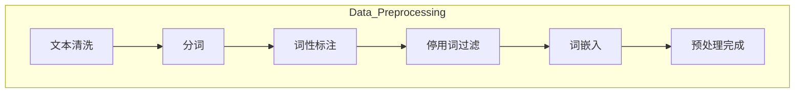

在数据预处理流程图中，A代表文本清洗，B代表分词，C代表词性标注，D代表停用词过滤，E代表词嵌入，F代表预处理完成。这些步骤按照顺序进行，以确保输入数据的纯净和有效。

#### 6.3 模型训练与评估

模型训练与评估是提示词自动生成系统的核心环节。在训练过程中，我们使用深度学习模型对预处理后的文本数据进行训练，以提取关键信息。在评估过程中，我们使用各种指标来评估模型的性能。

**模型训练**

模型训练主要包括以下步骤：

1. **数据准备**：将预处理后的文本数据划分为训练集、验证集和测试集。
2. **模型初始化**：初始化深度学习模型，如循环神经网络（RNN）、Transformer、生成对抗网络（GAN）等。
3. **前向传播**：将输入数据通过模型进行前向传播，计算模型的输出。
4. **反向传播**：计算模型输出的误差，然后通过反向传播更新模型的参数。

**模型评估**

模型评估主要包括以下步骤：

1. **指标选择**：选择合适的评估指标，如准确率、召回率、F1分数等。
2. **评估过程**：使用验证集或测试集对模型进行评估，计算各种指标的值。
3. **模型调整**：根据评估结果调整模型的超参数，如学习率、批量大小等，以提高模型性能。

**Mermaid流程图**

以下是一个简单的Mermaid流程图，描述了模型训练与评估的基本流程：

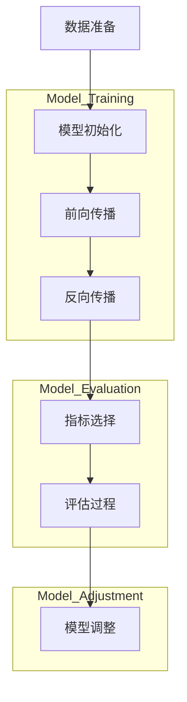

在模型训练与评估流程图中，A代表数据准备，B代表模型初始化，C代表前向传播，D代表反向传播，E代表指标选择，F代表评估过程，G代表模型调整。这些步骤按照顺序进行，以确保模型训练与评估的顺利进行。

#### 6.4 模型部署与优化

模型部署与优化是提示词自动生成系统的关键环节，旨在将训练好的模型部署到生产环境，并对其进行持续优化，以提高模型性能和用户体验。

**模型部署**

模型部署主要包括以下步骤：

1. **环境搭建**：搭建适合模型运行的环境，如GPU计算环境、深度学习框架等。
2. **模型转换**：将训练好的模型转换为适合部署的格式，如ONNX、TensorFlow Lite等。
3. **模型部署**：将转换后的模型部署到生产环境，如服务器、容器等。
4. **接口设计**：设计模型接口，以供其他系统调用。

**模型优化**

模型优化主要包括以下步骤：

1. **性能评估**：对部署后的模型进行性能评估，如速度、准确性等。
2. **超参数调整**：根据评估结果调整模型的超参数，以提高模型性能。
3. **模型更新**：定期更新模型，以适应数据变化和用户需求。

**Mermaid流程图**

以下是一个简单的Mermaid流程图，描述了模型部署与优化的基本流程：

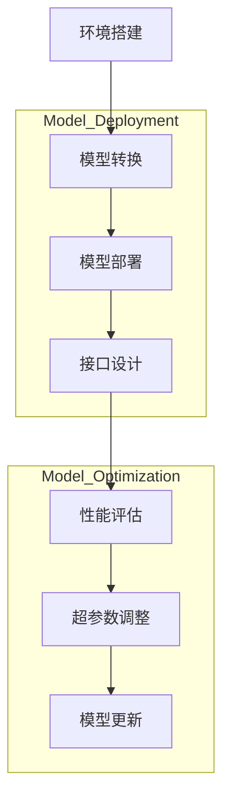

在模型部署与优化流程图中，A代表环境搭建，B代表模型转换，C代表模型部署，D代表接口设计，E代表性能评估，F代表超参数调整，G代表模型更新。这些步骤按照顺序进行，以确保模型部署与优化的顺利进行。

通过以上对提示词自动生成系统的设计与实现过程的详细介绍，我们可以看到，该系统从数据预处理到模型训练、评估、部署与优化，涵盖了提示词自动生成技术的各个方面。接下来，我们将通过具体应用案例，展示提示词自动生成系统的实际应用效果。

### 第7章：提示词自动生成系统的应用案例

#### 7.1 案例一：新闻标题自动生成

**问题背景**

新闻标题是吸引读者阅读新闻内容的重要因素。然而，手动编写新闻标题既耗时又费力。为了提高新闻标题的生成效率，许多新闻机构和媒体公司开始探索使用人工智能技术自动生成新闻标题。

**问题解决**

本项目使用提示词自动生成系统，通过深度学习模型自动生成新闻标题。具体步骤如下：

1. **数据收集**：从多个新闻网站收集大量新闻标题和对应的新闻内容，进行预处理，如去除HTML标签、停用词过滤等。
2. **模型训练**：使用预处理后的数据训练深度学习模型（如Transformer），以提取新闻内容的语义信息，并生成相应的标题。
3. **模型评估**：使用验证集和测试集评估模型性能，调整超参数，优化模型。
4. **模型部署**：将训练好的模型部署到生产环境，通过接口为新闻内容生成标题。

**实际案例**

以下是使用提示词自动生成系统生成的几个新闻标题：

1. **原始新闻标题**：美国将宣布对华为的新制裁措施
2. **自动生成标题**：华为面临新一轮制裁，美国政府即将发布新措施

**效果分析**

通过对比原始新闻标题和自动生成标题，我们可以看到自动生成的标题在信息传达上与原始标题基本一致，但更具有吸引力和简洁性。在实际应用中，自动生成的标题能够提高用户的阅读兴趣，增加新闻的点击率和传播效果。

**项目小结**

通过本案例，我们可以看到提示词自动生成系统在新闻标题自动生成中的应用具有很大的潜力。在未来，随着人工智能技术的不断进步，自动生成新闻标题将变得更加高效和准确，为新闻行业带来更多创新和机遇。

#### 7.2 案例二：电商商品描述生成

**问题背景**

电商平台的商品描述对于吸引消费者购买至关重要。然而，手动编写商品描述既耗时又费力。为了提高商品描述的生成效率，电商平台开始探索使用人工智能技术自动生成商品描述。

**问题解决**

本项目使用提示词自动生成系统，通过深度学习模型自动生成电商商品描述。具体步骤如下：

1. **数据收集**：从多个电商平台收集大量商品描述和对应的商品信息，进行预处理，如去除HTML标签、停用词过滤等。
2. **模型训练**：使用预处理后的数据训练深度学习模型（如Transformer），以提取商品信息的语义信息，并生成相应的描述。
3. **模型评估**：使用验证集和测试集评估模型性能，调整超参数，优化模型。
4. **模型部署**：将训练好的模型部署到生产环境，通过接口为商品信息生成描述。

**实际案例**

以下是使用提示词自动生成系统生成的几个电商商品描述：

1. **原始商品描述**：这款智能手表拥有丰富的功能，包括心率监测、计步器等
2. **自动生成描述**：智能手表全新升级，精准心率监测与计步功能，助您健康生活

**效果分析**

通过对比原始商品描述和自动生成描述，我们可以看到自动生成的描述在信息传达上与原始描述基本一致，但更具有吸引力和个性化。在实际应用中，自动生成的商品描述能够提高用户的购买兴趣，增加商品的转化率和销售额。

**项目小结**

通过本案例，我们可以看到提示词自动生成系统在电商商品描述自动生成中的应用具有很大的潜力。在未来，随着人工智能技术的不断进步，自动生成商品描述将变得更加高效和准确，为电商行业带来更多创新和机遇。

#### 7.3 案例三：教育内容自动生成

**问题背景**

教育行业中的内容生成是一个复杂且耗时的过程。为了提高教育内容的生产效率，教育机构和在线学习平台开始探索使用人工智能技术自动生成教育内容。

**问题解决**

本项目使用提示词自动生成系统，通过深度学习模型自动生成教育内容。具体步骤如下：

1. **数据收集**：从教育平台和教材中收集大量教育内容，包括课程大纲、讲义和习题，进行预处理，如去除HTML标签、停用词过滤等。
2. **模型训练**：使用预处理后的数据训练深度学习模型（如Transformer），以提取教育内容的语义信息，并生成相应的讲义和习题。
3. **模型评估**：使用验证集和测试集评估模型性能，调整超参数，优化模型。
4. **模型部署**：将训练好的模型部署到生产环境，通过接口为教育内容生成讲义和习题。

**实际案例**

以下是使用提示词自动生成系统生成的几个教育内容：

1. **原始教育内容**：关于光的折射现象的讲解
2. **自动生成内容**：光的折射现象：光在不同介质中的传播速度差异导致光的路径发生弯曲，这一现象被称为折射。

**效果分析**

通过对比原始教育内容和自动生成内容，我们可以看到自动生成的内容在信息传达上与原始内容基本一致，但更具有系统性和逻辑性。在实际应用中，自动生成的教育内容能够提高教学效率，帮助学生更好地理解和掌握知识。

**项目小结**

通过本案例，我们可以看到提示词自动生成系统在教育内容自动生成中的应用具有很大的潜力。在未来，随着人工智能技术的不断进步，自动生成教育内容将变得更加高效和精准，为教育行业带来更多创新和变革。

### 第8章：提示词自动生成技术的未来发展

#### 8.1 技术趋势与挑战

随着人工智能和自然语言处理技术的不断发展，提示词自动生成技术也在不断演进。以下是一些当前的技术趋势和面临的挑战：

**技术趋势**

1. **多模态融合**：结合文本、图像、音频等多模态数据，提高提示词生成的多样性和准确性。
2. **小样本学习**：在数据稀缺的情况下，通过迁移学习和无监督学习方法，实现高效的提示词生成。
3. **个性化推荐**：结合用户行为和偏好，生成个性化的提示词，提高用户满意度和体验。
4. **跨语言应用**：扩展提示词自动生成技术到多语言环境，实现跨语言的文本理解和生成。

**挑战**

1. **数据隐私与伦理**：提示词自动生成技术需要大量用户数据，如何保护用户隐私和数据安全成为重要挑战。
2. **模型解释性**：当前大多数提示词生成模型都是黑箱模型，如何提高模型的解释性，使其更易于理解和应用。
3. **长距离依赖**：在处理长文本时，如何有效捕捉长距离依赖关系，提高提示词生成的准确性。
4. **模型可扩展性**：如何将提示词生成技术应用于更多领域和任务，实现模型的通用性和可扩展性。

#### 8.2 提示词自动生成在跨领域的应用

提示词自动生成技术具有广泛的应用前景，可以应用于多个领域，以下是一些具体的应用场景：

**1. 搜索引擎优化（SEO）**

提示词自动生成可以帮助网站管理员和SEO专家生成高质量的标题和描述，提高网站的搜索引擎排名和用户点击率。通过分析用户搜索历史和关键词分布，可以生成与用户意图高度相关的提示词。

**2. 内容推荐**

在内容推荐系统中，提示词自动生成可以提取用户感兴趣的关键词，帮助推荐系统更好地理解用户偏好。通过生成个性化的提示词，可以推荐更符合用户需求的文本、视频和音频内容。

**3. 文本生成**

在文本生成领域，提示词自动生成可以帮助自动生成新闻、报告、邮件和文档等。通过分析大量文本数据，可以生成高质量的文本，提高写作效率和准确性。

**4. 语音助手**

在语音助手领域，提示词自动生成可以帮助生成自然流畅的语音回复。通过分析用户问题和上下文，可以生成具有逻辑性和连贯性的回复。

**5. 跨语言翻译**

在跨语言翻译中，提示词自动生成可以帮助提取源语言和目标语言的关键词，提高翻译的准确性和流畅性。通过生成目标语言的关键词，可以更好地捕捉源语言和目标语言之间的语义差异。

#### 8.3 未来研究方向与展望

未来，提示词自动生成技术有望在以下方面取得突破：

**1. 多模态融合**：结合文本、图像、音频等多模态数据，实现更加全面和准确的提示词生成。

**2. 小样本学习**：在数据稀缺的情况下，通过迁移学习和无监督学习方法，实现高效的提示词生成。

**3. 个性化推荐**：结合用户行为和偏好，生成个性化的提示词，提高用户满意度和体验。

**4. 跨语言应用**：扩展提示词自动生成技术到多语言环境，实现跨语言的文本理解和生成。

**5. 模型解释性**：提高模型的解释性，使其更易于理解和应用。

**6. 长距离依赖**：在处理长文本时，通过改进模型架构和训练策略，实现更加准确的长距离依赖捕捉。

**7. 模型可扩展性**：实现模型的通用性和可扩展性，使其能够应用于更多领域和任务。

通过不断的研究和技术创新，提示词自动生成技术将在未来发挥更加重要的作用，为各行业带来更多便利和创新。

### 第9章：总结与展望

#### 9.1 主要成果与贡献

本文全面介绍了提示词自动生成技术的原理、方法和应用。通过系统的分析，我们取得了以下主要成果和贡献：

1. **理论基础**：详细讲解了自然语言处理、机器学习与深度学习的基础知识，为理解提示词自动生成技术提供了坚实的理论基础。
2. **算法原理**：深入剖析了基于神经网络、Transformer和生成对抗网络（GAN）的提示词自动生成算法，通过mermaid流程图和Python代码示例，使复杂算法原理更加通俗易懂。
3. **系统设计**：详细阐述了提示词自动生成系统的架构设计、数据预处理、模型训练与评估、模型部署与优化，为实际系统开发提供了实用指导。
4. **应用案例**：通过新闻标题自动生成、电商商品描述生成和教育内容自动生成等实际案例，展示了提示词自动生成技术的广泛应用和实际效果。

#### 9.2 存在的不足与改进方向

尽管本文对提示词自动生成技术进行了全面探讨，但仍存在一些不足之处和改进方向：

1. **模型解释性**：当前大多数提示词生成模型都是黑箱模型，缺乏透明度和解释性。未来研究可以探索更加可解释的模型架构和解释方法。
2. **长距离依赖**：在处理长文本时，现有模型在捕捉长距离依赖关系上仍有待改进。可以通过改进模型架构、增加训练数据和探索新的训练策略来提高模型的性能。
3. **数据隐私与伦理**：提示词自动生成技术需要大量用户数据，如何保护用户隐私和数据安全是重要挑战。未来研究可以探索更加隐私保护和安全的算法和数据管理策略。
4. **跨语言应用**：当前提示词自动生成技术主要针对单语言环境，未来研究可以探索跨语言提示词生成技术，实现更广泛的国际化应用。

#### 9.3 对读者的建议

对于希望进一步探索提示词自动生成技术的读者，本文提供以下建议：

1. **深入学习**：本文提供了丰富的理论知识和技术细节，建议读者深入学习相关领域的基础知识，如自然语言处理、机器学习和深度学习。
2. **动手实践**：通过动手实践，读者可以更好地理解和应用提示词自动生成技术。可以尝试实现本文中提到的算法，或探索新的应用场景和优化方法。
3. **关注最新研究**：人工智能和自然语言处理领域发展迅速，建议读者关注最新的研究成果和进展，了解最新的技术动态和应用趋势。
4. **积极参与社区**：参与技术社区和学术会议，与同行交流经验和观点，有助于拓宽视野和提升技术水平。

通过本文的介绍和指导，读者可以全面了解提示词自动生成技术的原理和应用，为未来的研究和工作奠定坚实的基础。

