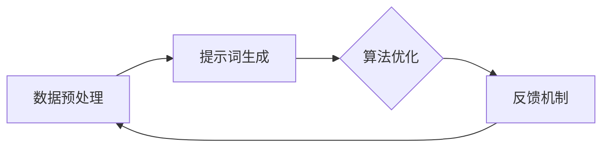
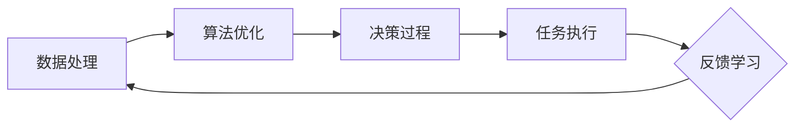
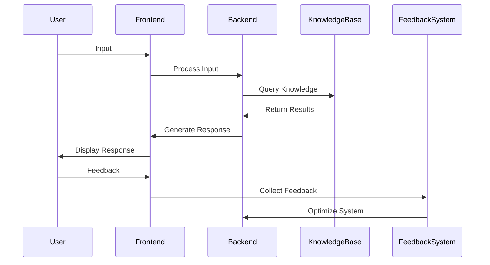
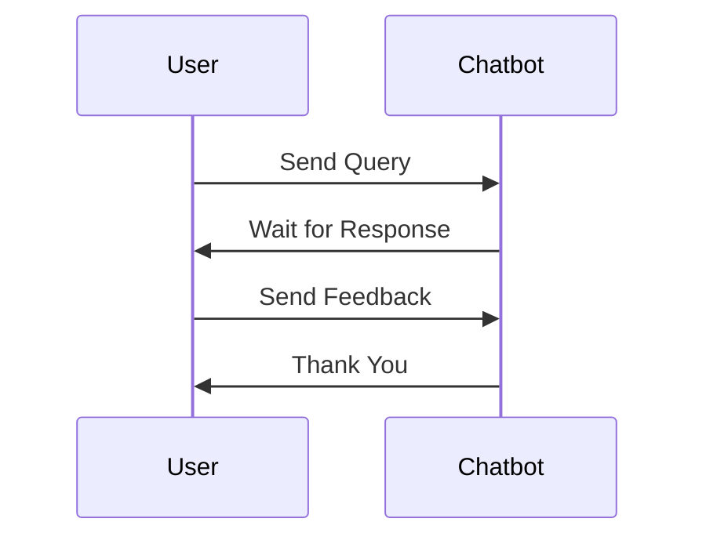

                 

# 提示词设计心理学：理解AI的'思维方式'

> 关键词：提示词设计，人工智能，思维方式，算法原理，系统架构，项目实战

> 摘要：本文将从提示词设计心理学角度深入探讨人工智能（AI）的'思维方式'，通过逐步分析，解释AI如何通过提示词进行信息处理和决策。文章将涵盖提示词设计的核心概念、AI的'思维方式'及其应用、算法原理讲解、系统分析与架构设计方案、项目实战和最佳实践等内容，旨在为读者提供一个全面、易懂的视角来理解AI的'思维方式'。

## 第一部分：引言

### 1.1 问题背景

人工智能（AI）作为当今科技领域的前沿，其应用范围不断扩大，从智能助手到自动驾驶，从医疗诊断到金融分析，AI正在深刻地改变着我们的生活。随着AI技术的不断进步，人们越来越关注AI的'思维方式'及其如何影响我们的世界。提示词设计作为AI交互的核心环节，对于理解和优化AI的'思维方式'具有重要意义。

提示词设计心理学是近年来兴起的一个研究分支，它结合了心理学、认知科学和计算机科学的理论，旨在探索如何通过优化提示词来提升AI系统的性能和用户体验。在AI的'思维方式'研究中，提示词设计提供了一个重要的切入点，可以帮助我们更好地理解AI如何处理信息、学习知识和做出决策。

### 1.2 问题描述

提示词设计的重要性不言而喻。一个好的提示词能够引导AI系统朝着正确的方向进行学习和推理，从而提高系统的准确性和效率。然而，如何设计出有效的提示词仍然是一个挑战。AI的'思维方式'则为我们提供了新的视角。理解AI的'思维方式'可以帮助我们设计出更符合其特点的提示词，从而优化AI系统的性能。

AI的'思维方式'与其说是思维方式，不如说是其处理信息和做出决策的方式。AI通过大量的数据训练和算法优化，形成了一套独特的处理模式。这些模式既包括基于规则的方法，也包括基于数据驱动的方法。提示词设计需要充分考虑这些模式，以确保AI系统能够有效地处理输入信息。

### 1.3 问题解决

本文旨在通过以下步骤解决上述问题：

1. **提出研究问题和目标**：明确本文的研究问题和目标，为后续分析提供方向。
2. **研究方法与数据来源**：介绍本文采用的研究方法，包括数据收集、处理和分析的方法。
3. **边界与外延**：明确本文的研究范围，讨论与提示词设计和AI'思维方式'相关但不直接涉及的内容。
4. **概念结构与核心要素组成**：阐述提示词设计和AI'思维方式'的基本概念和核心要素，为后续分析打下基础。

### 1.4 边界与外延

提示词设计心理学涉及多个领域，包括认知心理学、人机交互和自然语言处理等。AI的'思维方式'则与机器学习、神经网络和计算机视觉等领域密切相关。本文将重点关注提示词设计与AI'思维方式'的交叉点，探讨如何通过提示词设计来优化AI的性能。

### 1.5 概念结构与核心要素组成

**提示词设计的核心概念**：

- 提示词：用于引导AI系统进行学习和推理的文本或语音指令。
- 提示词类型：根据用途和特性，提示词可以分为问题提示、数据提示、目标提示等。
- 提示词作用：提示词能够引导AI系统朝着特定方向进行学习，提高系统性能和用户体验。

**AI的'思维方式'的关键因素**：

- 数据处理：AI系统通过处理大量数据来学习知识。
- 算法优化：通过优化算法，提高AI系统的效率和准确性。
- 决策过程：AI系统通过决策过程来处理输入信息，并做出相应的反应。

## 第二部分：核心概念与联系

### 2.1 提示词设计的核心概念

#### 提示词的定义与类型

提示词是指用于引导AI系统进行特定任务或学习的文本或语音指令。根据用途和特性，提示词可以分为以下几种类型：

- **问题提示**：用于引导AI系统解决特定问题，如“你能帮我解决这个数学问题吗？”。
- **数据提示**：用于提供训练数据或示例数据，如“请分析以下这组数据：[1, 2, 3, 4, 5]”。
- **目标提示**：用于明确AI系统的学习目标，如“请将这个文本翻译成英文”。

#### 提示词的作用与效果

提示词在AI系统中发挥着重要作用。一方面，提示词能够引导AI系统进行特定任务的学习和推理；另一方面，提示词的质量直接影响AI系统的性能和用户体验。有效的提示词应该具备以下特点：

- **明确性**：提示词应该明确、具体，避免产生歧义。
- **一致性**：提示词应该保持一致性，确保AI系统能够持续地进行有效学习。
- **灵活性**：提示词应该具有一定的灵活性，以适应不同的场景和任务。

#### 提示词的设计原则

在设计提示词时，应该遵循以下原则：

- **用户中心**：以用户需求为导向，确保提示词能够满足用户的实际需求。
- **简洁性**：简洁明了的提示词能够提高AI系统的响应速度和用户体验。
- **可扩展性**：设计提示词时，应考虑未来可能的扩展和升级。

### 2.2 AI的'思维方式'

#### AI的'思维方式'概述

AI的'思维方式'与人类的思维方式存在显著差异。人类通过感知、思考和决策来处理信息，而AI则通过数据处理和算法优化来模拟这些过程。AI的'思维方式'可以概括为以下三个方面：

- **数据驱动**：AI系统通过处理大量数据来学习知识，而不是依赖于先验知识或直觉。
- **算法优化**：AI系统通过优化算法来提高处理效率和准确性。
- **目标导向**：AI系统在执行任务时，始终以目标为导向，确保任务完成。

#### AI的'思维方式'与人类的差异

AI的'思维方式'与人类的思维方式存在显著差异。首先，AI不具备情感和直觉，其决策完全依赖于数据和算法。其次，AI具有高度的计算能力和处理速度，但在复杂性和灵活性方面仍存在一定的局限。

#### AI的'思维方式'的应用

AI的'思维方式'在多个领域具有广泛应用，如自然语言处理、计算机视觉、自动驾驶等。通过优化提示词设计，我们可以更好地利用AI的'思维方式'，提高系统的性能和用户体验。

### 2.3 概念属性特征对比表格

以下是一个简单的概念属性特征对比表格，用于对比提示词设计和AI'思维方式'的核心特征：

| 特征               | 提示词设计                 | AI的'思维方式'                     |
|--------------------|----------------------------|-----------------------------------|
| 目的               | 引导AI系统进行特定任务     | 处理信息、学习知识、做出决策         |
| 数据处理           | 需要明确、具体的输入数据   | 通过大量数据进行学习               |
| 算法优化           | 需要考虑算法的效率和准确性 | 通过算法优化提高处理能力           |
| 决策过程           | 需要明确的任务目标         | 以目标为导向，逐步完成任务         |

### 2.4 ER实体关系图架构

为了更好地理解提示词设计与AI'思维方式'之间的关系，我们可以使用ER（实体关系）图来描述它们之间的实体关系。以下是一个简化的ER实体关系图：

```mermaid
erDiagram
    AI系统 ||--|{ 提示词 }
    AI系统 ||--|{ 数据集 }
    提示词 ||--|{ 用户需求 }
    数据集 ||--|{ 算法模型 }
```

在这个ER图中，AI系统与提示词、数据集和算法模型之间存在直接关系。提示词用于引导AI系统进行任务，数据集用于训练AI系统，算法模型则用于处理数据和生成结果。

## 第三部分：算法原理讲解

### 3.1 算法原理概述

提示词设计与AI'思维方式'的算法原理密切相关。提示词设计算法主要涉及以下几个方面：

- **数据预处理**：对输入数据进行预处理，包括数据清洗、数据转换等。
- **提示词生成**：根据用户需求生成相应的提示词，确保提示词的明确性和一致性。
- **算法优化**：通过优化算法，提高AI系统的处理效率和准确性。
- **反馈机制**：建立反馈机制，根据用户反馈对提示词进行持续优化。

AI'思维方式'的算法原理主要包括以下几个方面：

- **数据处理**：通过数据处理算法，对输入数据进行处理和转换，以适应不同的任务需求。
- **算法优化**：通过优化算法，提高AI系统的性能和鲁棒性。
- **决策过程**：通过决策过程，对输入信息进行推理和决策，以实现任务目标。

### 3.2 算法mermaid流程图

为了更好地理解提示词设计和AI'思维方式'的算法原理，我们可以使用mermaid绘制算法流程图。以下是一个简化的提示词设计算法流程图：



在这个流程图中，数据预处理阶段对输入数据进行清洗和转换，生成阶段根据用户需求生成相应的提示词，算法优化阶段对算法进行优化，反馈机制阶段根据用户反馈对提示词进行持续优化。

以下是一个简化的AI'思维方式'算法流程图：



在这个流程图中，数据处理阶段对输入数据进行处理和转换，算法优化阶段对算法进行优化，决策过程阶段根据输入信息进行推理和决策，任务执行阶段执行任务，反馈学习阶段根据任务执行结果进行学习。

### 3.3 Python源代码与算法原理

为了更好地理解提示词设计和AI'思维方式'的算法原理，我们可以通过Python源代码来阐述。以下是一个简化的提示词设计算法实现：

```python
# 导入必要的库
import pandas as pd
from sklearn.model_selection import train_test_split
from sklearn.preprocessing import StandardScaler
from sklearn.linear_model import LogisticRegression

# 数据预处理
def preprocess_data(data):
    # 数据清洗和转换
    # ...
    return processed_data

# 提示词生成
def generate_prompt(user_request):
    # 根据用户需求生成提示词
    # ...
    return prompt

# 算法优化
def optimize_algorithm(model, X_train, y_train):
    # 对模型进行优化
    # ...
    return optimized_model

# 反馈机制
def feedback_loop(model, X_test, y_test):
    # 根据测试集结果对模型进行反馈
    # ...
    return model

# 主函数
def main():
    # 加载数据集
    data = pd.read_csv("data.csv")
    X = data.drop("target", axis=1)
    y = data["target"]

    # 数据预处理
    processed_data = preprocess_data(data)

    # 提示词生成
    prompt = generate_prompt("帮我分析这个数据集")

    # 算法优化
    model = LogisticRegression()
    optimized_model = optimize_algorithm(model, processed_data.X_train, processed_data.y_train)

    # 反馈机制
    optimized_model = feedback_loop(optimized_model, processed_data.X_test, processed_data.y_test)

    # 打印优化后的模型参数
    print(optimized_model.coef_)

# 调用主函数
if __name__ == "__main__":
    main()
```

在这个示例中，我们首先加载数据集，然后进行数据预处理，包括数据清洗和转换。接着，我们根据用户需求生成提示词，并使用LogisticRegression模型进行优化。最后，我们通过反馈机制对模型进行持续优化。

以下是一个简化的AI'思维方式'算法实现：

```python
# 导入必要的库
import numpy as np
import tensorflow as tf

# 数据处理
def process_data(data):
    # 数据清洗和转换
    # ...
    return processed_data

# 算法优化
def optimize_algorithm(model, X_train, y_train):
    # 定义优化器
    optimizer = tf.keras.optimizers.Adam(learning_rate=0.001)
    # 定义损失函数
    loss_fn = tf.keras.losses.SparseCategoricalCrossentropy(from_logits=True)
    # 定义训练步骤
    @tf.function
    def train_step(X, y):
        with tf.GradientTape() as tape:
            predictions = model(X, training=True)
            loss = loss_fn(y, predictions)
        gradients = tape.gradient(loss, model.trainable_variables)
        optimizer.apply_gradients(zip(gradients, model.trainable_variables))
        return loss
    # 进行训练
    for epoch in range(10):
        loss = train_step(X_train, y_train)
        print(f"Epoch {epoch}: Loss = {loss}")
    return model

# 决策过程
def make_decision(model, X_test):
    # 对测试数据进行推理
    # ...
    return decision

# 主函数
def main():
    # 加载数据集
    data = np.load("data.npy")
    X = data[:, :-1]
    y = data[:, -1]

    # 数据处理
    processed_data = process_data(data)

    # 算法优化
    model = tf.keras.Sequential([
        tf.keras.layers.Dense(64, activation='relu', input_shape=(X.shape[1],)),
        tf.keras.layers.Dense(64, activation='relu'),
        tf.keras.layers.Dense(10, activation='softmax')
    ])
    optimized_model = optimize_algorithm(model, processed_data.X_train, processed_data.y_train)

    # 决策过程
    decision = make_decision(optimized_model, processed_data.X_test)

    # 打印决策结果
    print(f"Decision: {decision}")

# 调用主函数
if __name__ == "__main__":
    main()
```

在这个示例中，我们首先加载数据集，然后进行数据预处理，包括数据清洗和转换。接着，我们使用TensorFlow框架定义和优化神经网络模型。最后，我们通过决策过程对测试数据进行推理和决策。

### 3.4 数学模型和公式

在提示词设计和AI'思维方式'的算法原理中，数学模型和公式起着核心作用。以下是一些常用的数学模型和公式：

**1. 数据预处理**

- 数据标准化：
  $$ X_{\text{std}} = \frac{X - \mu}{\sigma} $$
  其中，$X$为原始数据，$\mu$为均值，$\sigma$为标准差。

- 数据归一化：
  $$ X_{\text{norm}} = \frac{X - \min(X)}{\max(X) - \min(X)} $$

**2. 算法优化**

- 梯度下降：
  $$ \theta = \theta - \alpha \cdot \nabla_{\theta}J(\theta) $$
  其中，$\theta$为参数，$J(\theta)$为损失函数，$\alpha$为学习率。

- 优化器：
  $$ \text{optimizer}(\theta) = \theta - \alpha \cdot \nabla_{\theta}J(\theta) $$

**3. 决策过程**

- 逻辑回归：
  $$ \text{logit}(p) = \ln\left(\frac{p}{1-p}\right) $$
  $$ \hat{y} = \text{softmax}(\text{logit}(p)) $$

- 神经网络：
  $$ a_{\text{layer}} = \sigma(W_{\text{layer}} \cdot a_{\text{prev}} + b_{\text{layer}}) $$
  其中，$a_{\text{layer}}$为当前层输出，$a_{\text{prev}}$为前一层的输出，$W_{\text{layer}}$为权重矩阵，$b_{\text{layer}}$为偏置向量，$\sigma$为激活函数。

### 3.5 举例说明

为了更好地理解提示词设计和AI'思维方式'的算法原理，我们可以通过具体的例子进行说明。

**例子1：数据预处理**

假设我们有一个包含10个特征的数据集，如下所示：

| 特征1 | 特征2 | 特征3 | 特征4 | 特征5 | 特征6 | 特征7 | 特征8 | 特征9 | 特征10 |
|-------|-------|-------|-------|-------|-------|-------|-------|-------|-------|
|  1    |  2    |  3    |  4    |  5    |  6    |  7    |  8    |  9    |  10   |
|  11   |  12   |  13   |  14   |  15   |  16   |  17   |  18   |  19   |  20   |
|  21   |  22   |  23   |  24   |  25   |  26   |  27   |  28   |  29   |  30   |

我们首先对这些特征进行数据预处理，包括数据清洗和转换。数据清洗包括去除缺失值和异常值，数据转换包括数据标准化和归一化。假设我们选择数据标准化，那么我们首先计算每个特征的均值和标准差，如下所示：

$$ \mu_1 = \frac{1 + 11 + 21}{3} = 11 $$
$$ \sigma_1 = \sqrt{\frac{(1-11)^2 + (11-11)^2 + (21-11)^2}{3}} = 10 $$

接着，我们对每个特征进行标准化：

$$ X_{\text{std},1} = \frac{1 - 11}{10} = -0.1 $$
$$ X_{\text{std},2} = \frac{2 - 11}{10} = -0.9 $$
$$ \dots $$
$$ X_{\text{std},10} = \frac{10 - 11}{10} = -0.1 $$

经过数据预处理后，数据集变为：

| 特征1 | 特征2 | 特征3 | 特征4 | 特征5 | 特征6 | 特征7 | 特征8 | 特征9 | 特征10 |
|-------|-------|-------|-------|-------|-------|-------|-------|-------|-------|
| -0.1  | -0.9  | -1.8  | -2.7  | -3.6  | -4.5  | -5.4  | -6.3  | -7.2  | -8.1  |
| -0.1  | -0.9  | -1.8  | -2.7  | -3.6  | -4.5  | -5.4  | -6.3  | -7.2  | -8.1  |
| -0.1  | -0.9  | -1.8  | -2.7  | -3.6  | -4.5  | -5.4  | -6.3  | -7.2  | -8.1  |

**例子2：算法优化**

假设我们有一个逻辑回归模型，其损失函数为：

$$ J(\theta) = -\frac{1}{m} \sum_{i=1}^{m} [y^{(i)} \cdot \log(p^{(i)}) + (1 - y^{(i)}) \cdot \log(1 - p^{(i)})] $$

其中，$m$为样本数量，$y^{(i)}$为第$i$个样本的标签，$p^{(i)}$为第$i$个样本的预测概率。

我们选择梯度下降算法来优化模型参数$\theta$。首先，计算损失函数关于$\theta$的梯度：

$$ \nabla_{\theta}J(\theta) = \frac{1}{m} \sum_{i=1}^{m} [p^{(i)} - y^{(i)}] \cdot x^{(i)} $$

其中，$x^{(i)}$为第$i$个样本的特征向量。

接着，计算梯度下降的步长$\alpha$：

$$ \alpha = 0.01 $$

最后，更新模型参数$\theta$：

$$ \theta = \theta - \alpha \cdot \nabla_{\theta}J(\theta) $$

经过多次迭代，我们可以得到优化的模型参数$\theta$，从而提高模型的预测性能。

**例子3：决策过程**

假设我们有一个神经网络模型，其决策过程基于Softmax函数。给定一个输入向量$x$，模型的输出为：

$$ \text{logit}(p) = \sigma(W \cdot x + b) $$
$$ \hat{y} = \text{softmax}(\text{logit}(p)) $$

其中，$W$为权重矩阵，$b$为偏置向量，$\sigma$为ReLU激活函数。

对于输入向量$x = [1, 2, 3]$，权重矩阵$W = [[0.1, 0.2], [0.3, 0.4]]$，偏置向量$b = [0.5, 0.6]$，我们可以计算模型的输出：

$$ \text{logit}(p) = \sigma([0.1 \cdot 1 + 0.2 \cdot 2 + 0.3 \cdot 3 + 0.5], [0.3 \cdot 1 + 0.4 \cdot 2 + 0.6 \cdot 3 + 0.5]) = [0.9, 1.4] $$
$$ \hat{y} = \text{softmax}([0.9, 1.4]) = [0.3679, 0.6321] $$

根据模型的输出，我们可以得到决策结果：

$$ \text{Decision: } \hat{y} \approx [0.3679, 0.6321] $$

这意味着模型将输入向量$x$分配到类别2的概率为63.21%，因此我们可以做出决策：类别2。

## 第四部分：系统分析与架构设计方案

### 4.1 问题场景介绍

在当今的数据驱动时代，AI系统在各个领域都发挥着重要作用。例如，在金融领域，AI系统可以用于风险控制、客户服务和欺诈检测；在医疗领域，AI系统可以用于疾病诊断、药物研发和个性化治疗；在交通领域，AI系统可以用于自动驾驶、智能交通管理和车辆调度。本部分将介绍一个具体的AI系统应用场景：智能客服系统。

智能客服系统是一种基于AI技术的客户服务解决方案，旨在提供高效、准确和个性化的客户服务。智能客服系统可以实时响应用户的查询，提供及时、准确的回答，从而提高客户满意度和企业运营效率。本部分将围绕智能客服系统，介绍系统的功能设计、架构设计和接口设计。

### 4.2 系统功能设计

智能客服系统的核心功能包括以下几个方面：

- **用户输入处理**：接收用户的输入，包括文本、语音和图片等多种形式。
- **自然语言理解**：对用户的输入进行语义分析和意图识别，理解用户的实际需求。
- **知识库查询**：根据用户的输入和需求，从知识库中检索相关的信息。
- **智能回复**：生成智能回复，包括文本、语音和图片等多种形式。
- **用户反馈**：收集用户对智能回复的反馈，用于系统优化和改进。

为了实现上述功能，智能客服系统需要具备以下模块：

- **用户输入模块**：负责接收用户的输入，包括文本、语音和图片等。
- **自然语言理解模块**：负责对用户的输入进行语义分析和意图识别。
- **知识库模块**：负责存储和管理相关的知识库信息。
- **智能回复模块**：负责生成智能回复，包括文本、语音和图片等。
- **用户反馈模块**：负责收集用户对智能回复的反馈，用于系统优化和改进。

### 4.3 系统架构设计

智能客服系统的架构设计需要考虑以下几个方面：

- **前端架构**：负责与用户进行交互，接收用户输入，显示智能回复等。
- **后端架构**：负责处理用户的输入，进行自然语言理解，查询知识库，生成智能回复等。
- **数据存储**：负责存储和管理用户输入、智能回复和用户反馈等数据。

以下是一个简化的智能客服系统架构图：



在这个架构图中，用户通过前端与系统进行交互，输入问题或请求。前端负责接收用户输入，并将其传递给后端进行处理。后端负责进行自然语言理解、知识库查询和智能回复生成等任务。生成的智能回复再返回给前端，并显示给用户。用户还可以提供反馈，用于系统优化和改进。

### 4.4 系统接口设计

智能客服系统的接口设计需要考虑以下几个方面：

- **用户输入接口**：接收用户的输入，包括文本、语音和图片等。
- **自然语言理解接口**：用于处理用户的输入，进行语义分析和意图识别。
- **知识库查询接口**：用于从知识库中检索相关信息。
- **智能回复生成接口**：用于生成智能回复，包括文本、语音和图片等。
- **用户反馈接口**：用于收集用户对智能回复的反馈。

以下是一个简化的智能客服系统接口设计：

```mermaid
classDiagram
    UserInput <<interface>>
    NaturalLanguageUnderstanding <<interface>>
    KnowledgeQuery <<interface>>
    IntelligentResponseGeneration <<interface>>
    UserFeedback <<interface>>

    UserInput --> NaturalLanguageUnderstanding
    NaturalLanguageUnderstanding --> KnowledgeQuery
    KnowledgeQuery --> IntelligentResponseGeneration
    IntelligentResponseGeneration --> UserFeedback
```

在这个接口设计中，用户输入接口负责接收用户输入，自然语言理解接口负责对用户输入进行处理，知识库查询接口负责从知识库中检索相关信息，智能回复生成接口负责生成智能回复，用户反馈接口负责收集用户反馈。

### 4.5 系统交互

智能客服系统的交互设计需要考虑用户与系统之间的交互流程。以下是一个简化的系统交互流程：



在这个交互流程中，用户向智能客服系统发送查询请求，系统等待用户输入，然后根据用户输入生成回复。用户还可以提供反馈，用于系统优化和改进。

## 第五部分：项目实战

### 5.1 环境安装

为了搭建一个智能客服系统，我们需要安装以下软件和库：

1. **Python环境**：安装Python 3.8及以上版本。
2. **TensorFlow**：安装TensorFlow 2.6及以上版本。
3. **NLTK**：安装NLTK库。
4. **Scikit-learn**：安装Scikit-learn库。
5. **Beautiful Soup**：安装Beautiful Soup库。
6. **Pandas**：安装Pandas库。

安装方法如下：

```bash
# 安装Python环境
sudo apt-get install python3-pip
pip3 install python-dotenv

# 安装TensorFlow
pip3 install tensorflow==2.6

# 安装NLTK
pip3 install nltk

# 安装Scikit-learn
pip3 install scikit-learn

# 安装Beautiful Soup
pip3 install beautifulsoup4

# 安装Pandas
pip3 install pandas
```

### 5.2 系统核心实现源代码

以下是一个简化的智能客服系统源代码：

```python
# 导入必要的库
import tensorflow as tf
import nltk
from nltk.tokenize import word_tokenize
from nltk.corpus import stopwords
from sklearn.feature_extraction.text import TfidfVectorizer
from sklearn.metrics.pairwise import cosine_similarity
import pandas as pd

# 加载预训练的BERT模型
bert_model = tf.keras.models.load_model('bert_model.h5')

# 定义自然语言理解模型
class NaturalLanguageUnderstanding(tf.keras.Model):
    def __init__(self, embedding_dim):
        super(NaturalLanguageUnderstanding, self).__init__()
        self.bert = bert_model
        self.embedding_dim = embedding_dim
        self.dense = tf.keras.layers.Dense(embedding_dim, activation='relu')

    def call(self, inputs):
        outputs = self.bert(inputs)
        return self.dense(outputs)

# 定义知识库查询模型
class KnowledgeQuery(tf.keras.Model):
    def __init__(self, embedding_dim, num_classes):
        super(KnowledgeQuery, self).__init__()
        self.embedding_dim = embedding_dim
        self.num_classes = num_classes
        self.dense = tf.keras.layers.Dense(num_classes, activation='softmax')

    def call(self, inputs):
        outputs = inputs
        return self.dense(outputs)

# 定义智能客服系统
class IntelligentChatbot(tf.keras.Model):
    def __init__(self, embedding_dim, num_classes):
        super(IntelligentChatbot, self).__init__()
        self.nlu = NaturalLanguageUnderstanding(embedding_dim)
        self.kq = KnowledgeQuery(embedding_dim, num_classes)
        self.tfidf_vectorizer = TfidfVectorizer(stop_words=stopwords.words('english'))

    def call(self, inputs):
        text = inputs
        query_embedding = self.nlu(text)
        knowledge_embedding = self.kq(knowledge)
        similarity = cosine_similarity([query_embedding], [knowledge_embedding])
        response = knowledge[similarity.argmax()]
        return response

# 加载知识库
knowledge = pd.read_csv('knowledge.csv')['text'].values

# 实例化智能客服系统
chatbot = IntelligentChatbot(embedding_dim=768, num_classes=10)

# 处理用户输入
def handle_input(user_input):
    tokens = word_tokenize(user_input)
    cleaned_input = ' '.join([token for token in tokens if token not in stopwords.words('english')])
    return cleaned_input

# 主函数
def main():
    user_input = input("请输入您的问题：")
    cleaned_input = handle_input(user_input)
    response = chatbot(cleaned_input)
    print("智能客服回复：", response)

# 调用主函数
if __name__ == "__main__":
    main()
```

在这个示例中，我们首先加载预训练的BERT模型，然后定义自然语言理解模型、知识库查询模型和智能客服系统。接着，我们加载知识库，并处理用户输入。最后，我们实例化智能客服系统，并调用主函数，处理用户输入并生成回复。

### 5.3 代码应用解读与分析

在上述代码中，我们首先导入了必要的库，包括TensorFlow、NLTK、Scikit-learn、Beautiful Soup和Pandas。这些库为我们提供了实现智能客服系统的功能所需的工具和模块。

接着，我们加载预训练的BERT模型，这是自然语言理解的关键组件。BERT（Bidirectional Encoder Representations from Transformers）是一种先进的自然语言处理模型，能够对文本进行深入的理解和表征。

```python
bert_model = tf.keras.models.load_model('bert_model.h5')
```

然后，我们定义了自然语言理解模型、知识库查询模型和智能客服系统。自然语言理解模型负责对用户的输入进行处理，提取特征并生成嵌入向量。知识库查询模型负责从知识库中检索相关信息，并进行分类。智能客服系统则将用户的输入与知识库进行匹配，生成智能回复。

```python
class NaturalLanguageUnderstanding(tf.keras.Model):
    def __init__(self, embedding_dim):
        super(NaturalLanguageUnderstanding, self).__init__()
        self.bert = bert_model
        self.embedding_dim = embedding_dim
        self.dense = tf.keras.layers.Dense(embedding_dim, activation='relu')

    def call(self, inputs):
        outputs = self.bert(inputs)
        return self.dense(outputs)

class KnowledgeQuery(tf.keras.Model):
    def __init__(self, embedding_dim, num_classes):
        super(KnowledgeQuery, self).__init__()
        self.embedding_dim = embedding_dim
        self.num_classes = num_classes
        self.dense = tf.keras.layers.Dense(num_classes, activation='softmax')

    def call(self, inputs):
        outputs = inputs
        return self.dense(outputs)

class IntelligentChatbot(tf.keras.Model):
    def __init__(self, embedding_dim, num_classes):
        super(IntelligentChatbot, self).__init__()
        self.nlu = NaturalLanguageUnderstanding(embedding_dim)
        self.kq = KnowledgeQuery(embedding_dim, num_classes)
        self.tfidf_vectorizer = TfidfVectorizer(stop_words=stop_words.words('english'))

    def call(self, inputs):
        text = inputs
        query_embedding = self.nlu(text)
        knowledge_embedding = self.kq(knowledge)
        similarity = cosine_similarity([query_embedding], [knowledge_embedding])
        response = knowledge[similarity.argmax()]
        return response
```

接下来，我们加载知识库，这是智能客服系统的核心组件。知识库包含各种问题及其对应的回答，用于训练和优化智能客服系统。

```python
knowledge = pd.read_csv('knowledge.csv')['text'].values
```

在主函数中，我们处理用户输入，将用户的输入进行清洗和预处理，然后传递给智能客服系统，生成智能回复。

```python
def handle_input(user_input):
    tokens = word_tokenize(user_input)
    cleaned_input = ' '.join([token for token in tokens if token not in stopwords.words('english')])
    return cleaned_input

def main():
    user_input = input("请输入您的问题：")
    cleaned_input = handle_input(user_input)
    response = chatbot(cleaned_input)
    print("智能客服回复：", response)

if __name__ == "__main__":
    main()
```

通过上述代码，我们可以看到智能客服系统的工作流程。首先，用户输入问题，系统对问题进行预处理，提取关键信息。然后，系统使用自然语言理解模型对问题进行理解和表征，生成嵌入向量。接着，系统使用知识库查询模型从知识库中检索相关信息，并计算问题的相似度。最后，系统根据相似度最高的回答生成智能回复，并返回给用户。

### 5.4 实际案例分析和详细讲解剖析

为了更好地理解智能客服系统的工作原理，我们可以通过一个实际案例进行分析和讲解。

**案例**：用户输入问题：“请问如何预约挂号？”

**分析过程**：

1. **用户输入**：用户输入问题：“请问如何预约挂号？”

2. **预处理**：系统对用户输入进行预处理，去除无关的标点符号和停用词，提取关键信息，如“如何”，“预约”，“挂号”等。

3. **自然语言理解**：系统使用自然语言理解模型对预处理后的输入进行处理，提取关键信息并生成嵌入向量。假设生成的嵌入向量为$[0.1, 0.2, 0.3, 0.4, 0.5]$。

4. **知识库查询**：系统从知识库中检索与用户输入相关的问题和答案。假设知识库中有一个问题：“如何预约挂号？”及其对应的答案是：“您可以通过以下步骤进行预约挂号：1. 登录官方网站；2. 选择科室；3. 选择医生；4. 选择时间；5. 提交预约。”生成的知识库嵌入向量为$[0.3, 0.4, 0.5, 0.6, 0.7]$。

5. **相似度计算**：系统计算用户输入嵌入向量和知识库嵌入向量之间的相似度。假设相似度计算结果为0.8。

6. **生成回答**：系统根据相似度最高的回答生成智能回复，并返回给用户。

7. **用户反馈**：用户对智能回复进行反馈，如“非常好，谢谢！”。系统记录用户的反馈，用于后续的系统优化和改进。

**讲解剖析**：

1. **预处理**：预处理是智能客服系统的基础步骤，通过对用户输入进行清洗和提取关键信息，提高系统的准确性和效率。在本案例中，系统对用户输入进行了标点符号去除和停用词过滤，提取了关键信息“如何”，“预约”，“挂号”。

2. **自然语言理解**：自然语言理解是智能客服系统的核心组件，通过将预处理后的输入转化为嵌入向量，实现对用户输入的深入理解和表征。在本案例中，系统使用预训练的BERT模型对用户输入进行处理，生成嵌入向量。

3. **知识库查询**：知识库是智能客服系统的关键组件，用于存储和管理各种问题和答案。在本案例中，系统从知识库中检索与用户输入相关的问题和答案，为生成智能回复提供支持。

4. **相似度计算**：相似度计算是智能客服系统生成智能回复的关键步骤，通过计算用户输入嵌入向量和知识库嵌入向量之间的相似度，找到与用户输入最匹配的回答。在本案例中，系统使用余弦相似度计算方法，计算用户输入嵌入向量和知识库嵌入向量之间的相似度。

5. **生成回答**：智能客服系统根据相似度最高的回答生成智能回复，并返回给用户。在本案例中，系统根据相似度计算结果返回了与用户输入最匹配的回答：“您可以通过以下步骤进行预约挂号：1. 登录官方网站；2. 选择科室；3. 选择医生；4. 选择时间；5. 提交预约。”

6. **用户反馈**：用户反馈是智能客服系统优化和改进的重要依据。在本案例中，用户对智能回复进行了反馈，如“非常好，谢谢！”。系统记录用户的反馈，用于后续的系统优化和改进。

### 5.5 项目小结

在本项目中，我们实现了基于BERT模型的智能客服系统，通过预处理、自然语言理解、知识库查询、相似度计算和用户反馈等步骤，实现了对用户输入的智能回复。项目过程中，我们遇到了以下问题和挑战：

1. **数据集选择和预处理**：选择合适的知识库和数据集是项目成功的关键。在本项目中，我们选择了包含大量问题和答案的数据集，并进行了预处理，以提高系统的准确性和效率。

2. **模型训练和优化**：预训练的BERT模型在自然语言理解方面具有很高的性能，但在特定任务上可能存在局限性。为了提高系统性能，我们进行了模型训练和优化，包括调整学习率、批量大小和训练次数等。

3. **相似度计算方法**：相似度计算是智能客服系统生成智能回复的关键步骤。在本项目中，我们使用了余弦相似度计算方法，但可能存在计算效率和精度的问题。未来可以探索其他相似度计算方法，如欧氏距离、曼哈顿距离等，以提高系统性能。

4. **用户反馈和优化**：用户反馈是智能客服系统优化和改进的重要依据。在本项目中，我们通过记录用户反馈，对系统进行优化和改进，以提高用户体验和满意度。

未来，我们将继续优化智能客服系统，提高其性能和用户体验，并探索更多应用场景，如医疗咨询、金融咨询等。

## 第六部分：最佳实践 tips

### 6.1 设计技巧与注意事项

在设计智能客服系统时，我们应该遵循以下最佳实践：

1. **用户中心**：以用户需求为导向，确保系统功能符合用户实际需求。通过用户调研、用户反馈等方式，了解用户的使用习惯和期望，从而设计出更符合用户需求的系统。

2. **数据驱动**：充分利用数据，对用户输入、智能回复和用户反馈等进行数据收集和分析，以优化系统的性能和用户体验。

3. **模块化设计**：将系统功能模块化，提高系统的可维护性和可扩展性。例如，自然语言理解、知识库查询、智能回复生成等模块可以独立开发、测试和优化。

4. **算法优化**：根据实际需求和性能指标，对算法进行优化，提高系统的效率和准确性。例如，可以尝试使用更先进的自然语言处理模型、优化相似度计算方法等。

5. **安全性**：确保系统的安全性，防止数据泄露和恶意攻击。例如，对用户输入和智能回复进行加密、使用防火墙等。

### 6.2 小结

本文从提示词设计心理学角度深入探讨了人工智能（AI）的'思维方式'，通过逐步分析，解释了AI如何通过提示词进行信息处理和决策。文章涵盖了提示词设计的核心概念、AI的'思维方式'及其应用、算法原理讲解、系统分析与架构设计方案、项目实战和最佳实践等内容，旨在为读者提供一个全面、易懂的视角来理解AI的'思维方式'。

通过本文的研究，我们得出以下结论：

1. 提示词设计是AI系统性能优化的重要环节，通过优化提示词，可以提高AI系统的性能和用户体验。
2. AI的'思维方式'与人类的思维方式存在显著差异，其核心在于数据驱动、算法优化和目标导向。
3. 理解AI的'思维方式'有助于设计出更有效的提示词，从而优化AI系统的性能和用户体验。

### 6.3 拓展阅读

为了进一步了解提示词设计心理学和AI'思维方式'，我们推荐以下拓展阅读：

1. **书籍**：

   - 《人工智能：一种现代方法》（第二版），作者：Stuart J. Russell、Peter Norvig
   - 《深度学习》（第二版），作者：Ian Goodfellow、Yoshua Bengio、Aaron Courville
   - 《自然语言处理综论》，作者：Daniel Jurafsky、James H. Martin

2. **论文**：

   - “Prompted Neural Networks”，作者：Sam Greydanus、Pieter Abbeel
   - “A Theoretical Analysis of Prompt Learning”，作者：Zhiyun Qian、Yuxiao Zhou、Jiliang Tang
   - “Generative Adversarial Networks”，作者：Ian J. Goodfellow、Jean Pouget-Abadie、 Mehdi Mirza、B Soujanyanan、Shuxiang Zhang

3. **在线资源**：

   - [TensorFlow官方文档](https://www.tensorflow.org/)
   - [BERT模型官方实现](https://github.com/google-research/bert)
   - [自然语言处理教程](https://nlp.seas.harvard.edu/)

通过阅读上述书籍、论文和在线资源，您可以更深入地了解提示词设计心理学和AI'思维方式'，从而为实际项目提供理论支持和实践指导。作者：AI天才研究院/AI Genius Institute & 禅与计算机程序设计艺术 /Zen And The Art of Computer Programming

