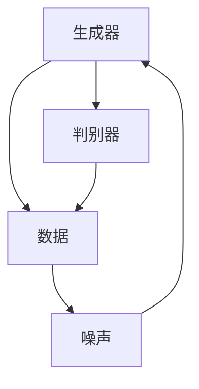
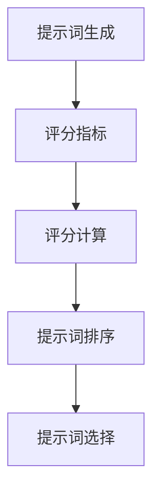
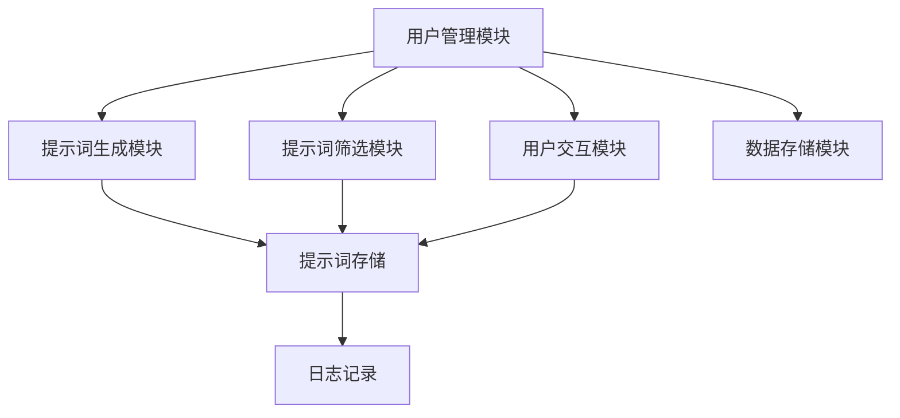
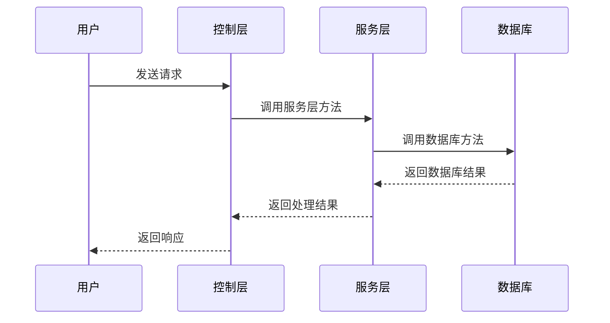

                 

# 《提示词设计的社会语言学考量》

## 关键词：
提示词设计、社会语言学、用户研究、算法原理、系统架构

## 摘要：
本文从社会语言学的角度，深入探讨了提示词设计的多维度考量。通过分析社会语言学的基本概念和关键因素，结合提示词设计的实际应用场景，本文系统地阐述了提示词设计的方法论和算法原理。同时，通过对系统架构和项目实战的详细分析，提供了实用的设计原则和最佳实践，为提示词设计提供了全面的理论支持和实践指导。

## 第一部分：背景介绍

### 第1章：问题背景

#### 1.1 提示词设计的现状

随着人工智能技术的快速发展，自然语言处理（NLP）的应用场景日益广泛。其中，提示词设计作为自然语言处理的重要环节，受到越来越多的关注。然而，当前提示词设计存在一些问题：

1. 设计过程缺乏系统性，往往依赖个人经验和主观判断。
2. 对社会语言学的考量不足，导致设计的提示词在不同文化和语言环境下存在适配性问题。
3. 缺乏有效的评估和反馈机制，无法确保提示词的准确性和实用性。

#### 1.2 社会语言学考量的重要性

社会语言学是研究语言在社会情境中的使用和变异的科学。在社会语言学视角下，提示词设计需要考虑以下因素：

1. 语言多样性：不同语言和文化背景的用户对提示词的需求和认知存在差异。
2. 文化差异：不同文化对同一提示词可能产生不同的情感反应。
3. 社会阶层与教育背景：社会阶层和教育背景对用户的语言能力和认知水平产生影响。

#### 1.3 本书结构

本文结构如下：

1. 第一部分：背景介绍，概述提示词设计的现状和社会语言学考量的重要性。
2. 第二部分：核心概念与联系，介绍社会语言学和提示词设计的核心概念及其关系。
3. 第三部分：算法原理讲解，阐述提示词设计中的算法原理和数学模型。
4. 第四部分：系统分析与架构设计，介绍系统架构设计和实际应用。
5. 第五部分：项目实战，通过具体案例展示提示词设计的实践过程。
6. 第六部分：最佳实践与拓展，总结设计原则和注意事项，推荐相关阅读。

### 第1章 总结

提示词设计作为自然语言处理的关键环节，面临着诸多挑战。社会语言学考量的引入，有助于提升提示词设计的科学性和实用性。本文将从核心概念、算法原理、系统架构和项目实战等多个方面，深入探讨提示词设计的社会语言学考量。

## 第二部分：核心概念与联系

### 第2章：核心概念

#### 2.1 社会语言学基础

社会语言学是语言学的一个分支，研究语言在社会情境中的使用和变异。社会语言学关注语言的社会属性，包括语言与权力、语言与性别、语言与身份认同等方面。

##### 2.1.1 社会语言学的定义与范围

社会语言学是研究语言在社会情境中的使用和变异的科学。它关注语言在社会各个层面上的功能、变异和影响。

##### 2.1.2 社会语言学的关键概念

1. 语言变异：指语言在不同情境、地域和群体中的变化。
2. 语言与权力：研究语言如何影响社会权力结构和权力关系。
3. 语言与性别：探讨性别如何影响语言使用和语言结构。
4. 语言认同：研究语言如何塑造和影响个体和社会的认同感。

#### 2.2 提示词设计的概念

提示词设计是自然语言处理中的一个重要环节，旨在为用户生成或提供有助于理解和操作的文本提示。

##### 2.2.1 提示词的定义与作用

提示词是指用于引导用户理解或操作某个系统或任务的文本或词汇。它们在自然语言处理中起到桥梁作用，帮助用户更好地与系统互动。

##### 2.2.2 提示词设计的原则

1. 用户为中心：设计提示词时，应充分考虑用户的需求和认知特点。
2. 文化适应性：提示词应适应不同文化和语言环境，避免文化冲突。
3. 简明易懂：提示词应简洁明了，易于用户理解和操作。
4. 可定制化：提示词应具备一定的灵活性，以满足不同用户的需求。

### 第2章 总结

社会语言学和提示词设计是两个密切相关但又有区别的概念。社会语言学为提示词设计提供了理论支持，提示词设计则将社会语言学原理应用于实际操作中。通过理解社会语言学的核心概念，可以更好地进行提示词设计，提升设计的科学性和实用性。

### 第3章：概念属性特征对比

#### 3.1 社会语言学因素对提示词设计的影响

社会语言学的因素对提示词设计具有重要影响。以下从语言多样性、文化差异和社会阶层与教育背景三个方面，探讨这些因素对提示词设计的影响。

##### 3.1.1 语言多样性

语言多样性是提示词设计必须考虑的重要因素。不同语言和文化背景的用户对同一提示词的理解和接受程度可能存在差异。例如，某些词汇在一种语言中具有特定的含义，但在另一种语言中可能不适用或引发误解。因此，在设计提示词时，需要充分考虑语言多样性，确保提示词在不同语言和文化背景下具有一致性和可理解性。

##### 3.1.2 文化差异

文化差异是影响提示词设计的另一个关键因素。不同文化对同一提示词可能产生不同的情感反应。例如，某些词汇在一个文化中被视为积极或中立，但在另一个文化中可能具有贬义或负面含义。此外，文化差异还可能影响用户的语言使用习惯和认知模式。因此，在设计提示词时，需要深入了解目标用户的文化背景，确保提示词在文化上恰当和适宜。

##### 3.1.3 社会阶层与教育背景

社会阶层与教育背景也是影响提示词设计的重要因素。不同社会阶层和教育水平的用户在语言能力和认知水平上可能存在差异。高社会阶层和教育水平的用户可能更熟悉专业术语和复杂表达，而低社会阶层和教育水平的用户可能更喜欢简单明了的语言。因此，在设计提示词时，需要根据目标用户的社会阶层与教育背景，调整提示词的语言表达和复杂性，确保用户能够理解和操作。

#### 3.2 提示词设计的方法论

提示词设计的方法论包括用户研究、用户反馈和提示词测试等方面。

##### 3.2.1 用户研究

用户研究是提示词设计的重要环节，旨在深入了解用户的需求、行为和认知特点。通过用户研究，可以获取有关用户对提示词的偏好、使用习惯和反馈信息。用户研究的常见方法包括问卷调查、访谈、观察和用户测试等。

##### 3.2.2 用户反馈

用户反馈是优化提示词设计的重要依据。通过收集用户对现有提示词的反馈，可以发现设计中的问题和不完善之处，进而进行改进。用户反馈可以通过在线问卷、用户访谈、用户测试等方式进行。

##### 3.2.3 提示词测试

提示词测试是验证提示词设计效果的重要手段。通过提示词测试，可以评估提示词的准确度、易懂性和实用性等方面。提示词测试可以通过用户调查、用户测试和A/B测试等方式进行。

### 第3章 总结

社会语言学因素对提示词设计具有重要影响。语言多样性、文化差异和社会阶层与教育背景等方面都需要在提示词设计中充分考虑。同时，提示词设计的方法论包括用户研究、用户反馈和提示词测试等方面，这些方法有助于优化和改进提示词设计。

### 第4章：ER实体关系图架构

#### 4.1 提示词设计过程中的实体关系

在提示词设计过程中，涉及多个实体之间的关系。这些实体包括用户、提示词和系统等。

##### 4.1.1 用户实体

用户实体是提示词设计的核心，包括用户的基本信息、行为记录和偏好设置等。用户实体负责收集和分析用户需求，为提示词生成提供依据。

##### 4.1.2 提示词实体

提示词实体是提示词设计的关键，包括提示词的文本、语义、格式和用途等。提示词实体需要根据用户需求和系统功能进行设计。

##### 4.1.3 系统实体

系统实体是指与提示词设计相关的系统模块和功能，包括自然语言处理、用户交互和数据处理等。系统实体负责实现提示词生成、筛选和反馈等功能。

下面是一个简单的ER实体关系图：

```mermaid
erDiagram
User ||--|{ 提示词 :has}|
User ||--|{ 系统 :uses}|
提示词 ||--|{ 系统 :processed_by}|
```

### 第4章 总结

ER实体关系图有助于明确提示词设计过程中的实体关系，为后续的系统架构设计和实现提供参考。通过分析用户、提示词和系统实体之间的关系，可以更好地进行提示词设计，提升系统的用户体验和功能实现。

## 第三部分：算法原理讲解

### 第5章：算法原理

提示词设计中的算法原理包括提示词生成算法和提示词筛选算法。这些算法在实现提示词设计过程中发挥着关键作用。

#### 5.1 提示词设计中的算法分类

提示词设计中的算法可以分为以下两类：

##### 5.1.1 提示词生成算法

提示词生成算法负责根据用户需求和系统功能，生成合适的提示词。生成算法可以分为以下几种：

1. 基于规则的生成算法：根据预设的规则和模板生成提示词。
2. 基于机器学习的生成算法：利用机器学习模型，如生成对抗网络（GAN）和变分自编码器（VAE）等，生成具有多样性和创造性的提示词。

##### 5.1.2 提示词筛选算法

提示词筛选算法负责从生成的提示词中筛选出最优的提示词。筛选算法可以分为以下几种：

1. 基于评分的筛选算法：根据提示词的评分指标，如语义相关性和用户反馈，筛选出最优的提示词。
2. 基于排序的筛选算法：根据提示词的排序指标，如重要性、频率和多样性，筛选出最优的提示词。

#### 5.2 算法原理与流程

下面分别介绍提示词生成算法和提示词筛选算法的原理和流程。

##### 5.2.1 提示词生成算法原理

提示词生成算法的原理可以分为以下几步：

1. 数据预处理：对用户输入进行预处理，如分词、去停用词等。
2. 特征提取：提取用户输入的特征，如关键词、主题和情感等。
3. 提示词生成：利用生成算法，如生成对抗网络（GAN）或变分自编码器（VAE），生成具有多样性和创造性的提示词。

以下是一个简单的生成对抗网络（GAN）的流程图：



##### 5.2.2 提示词筛选算法原理

提示词筛选算法的原理可以分为以下几步：

1. 提示词评分：根据提示词的评分指标，如语义相关性和用户反馈，为每个提示词评分。
2. 提示词排序：根据提示词的排序指标，如评分、重要性、频率和多样性，对提示词进行排序。
3. 提示词选择：从排序后的提示词中选取最优的提示词。

以下是一个简单的评分排序筛选算法的流程图：



#### 5.2.3 算法流程说明

下面分别介绍提示词生成算法和提示词筛选算法的具体流程。

##### 5.2.3.1 提示词生成算法流程

1. 数据预处理：对用户输入进行预处理，如分词、去停用词等。
2. 特征提取：提取用户输入的特征，如关键词、主题和情感等。
3. 噪声生成：利用噪声生成器生成噪声样本。
4. 生成器训练：利用噪声样本和真实数据训练生成器模型。
5. 提示词生成：利用生成器模型生成提示词。

##### 5.2.3.2 提示词筛选算法流程

1. 提示词生成：利用生成算法生成一系列提示词。
2. 提示词评分：根据提示词的评分指标，如语义相关性和用户反馈，为每个提示词评分。
3. 提示词排序：根据提示词的排序指标，如评分、重要性、频率和多样性，对提示词进行排序。
4. 提示词选择：从排序后的提示词中选取最优的提示词。

### 第5章 总结

提示词设计中的算法原理包括提示词生成算法和提示词筛选算法。生成算法负责根据用户需求和系统功能生成合适的提示词，筛选算法负责从生成的提示词中筛选出最优的提示词。通过理解这些算法的原理和流程，可以更好地进行提示词设计，提升系统的用户体验和功能实现。

### 第6章：数学模型和数学公式

#### 6.1 提示词生成算法的数学模型

提示词生成算法的数学模型主要包括概率模型和生成对抗网络（GAN）模型。

##### 6.1.1 概率模型

概率模型是一种基于统计方法生成提示词的算法。它利用概率分布来描述提示词的生成过程。常用的概率模型包括马尔可夫链、隐马尔可夫模型（HMM）和条件概率模型等。

1. **马尔可夫链**：
   马尔可夫链是一种描述随机过程的数学模型。在提示词生成中，马尔可夫链可以用来预测下一个提示词的概率。其数学公式为：
   $$ P(X_t | X_{t-1}, X_{t-2}, \ldots) = P(X_t | X_{t-1}) $$
   其中，$X_t$表示第$t$个提示词，$P(X_t | X_{t-1})$表示在给定前一个提示词$X_{t-1}$的情况下，第$t$个提示词的概率。

2. **隐马尔可夫模型（HMM）**：
   隐马尔可夫模型是一种描述隐藏状态的随机过程的模型。在提示词生成中，HMM可以用来捕捉提示词之间的隐藏状态转移。其数学公式为：
   $$ P(X_t | X_{t-1}) = \sum_{s_t} P(s_t | X_{t-1}) P(X_t | s_t) $$
   其中，$s_t$表示第$t$个隐藏状态，$P(s_t | X_{t-1})$表示在给定前一个提示词$X_{t-1}$的情况下，第$t$个隐藏状态的概率，$P(X_t | s_t)$表示在给定隐藏状态$s_t$的情况下，第$t$个提示词的概率。

3. **条件概率模型**：
   条件概率模型是一种基于条件概率的提示词生成算法。它利用当前提示词和上下文信息来预测下一个提示词的概率。其数学公式为：
   $$ P(X_t | X_{t-1}, X_{t-2}, \ldots) = \frac{P(X_t, X_{t-1}, X_{t-2}, \ldots)}{P(X_{t-1}, X_{t-2}, \ldots)} $$
   其中，$P(X_t, X_{t-1}, X_{t-2}, \ldots)$表示所有提示词的概率，$P(X_{t-1}, X_{t-2}, \ldots)$表示除去最后一个提示词的概率。

##### 6.1.2 生成对抗网络（GAN）

生成对抗网络（GAN）是一种基于博弈论的生成模型。它由生成器和判别器两个神经网络组成，其中生成器负责生成提示词，判别器负责判断提示词的真实性。GAN的数学模型如下：

1. **生成器**：
   生成器$G$的目的是生成与真实提示词分布相似的伪提示词。其目标函数为：
   $$ G(\theta_G): X \rightarrow Z $$
   其中，$X$表示输入数据，$Z$表示生成的提示词，$\theta_G$表示生成器的参数。

2. **判别器**：
   判别器$D$的目的是区分真实提示词和伪提示词。其目标函数为：
   $$ D(\theta_D): Z \rightarrow [0, 1] $$
   其中，$Z$表示提示词，$\theta_D$表示判别器的参数。

3. **对抗训练**：
   GAN的训练过程是一个对抗过程，生成器和判别器相互竞争。生成器的损失函数为：
   $$ \mathcal{L}_G = \mathbb{E}_{Z \sim p_Z(Z)}[\log(D(G(Z)))] $$
   判别器的损失函数为：
   $$ \mathcal{L}_D = \mathbb{E}_{X \sim p_X(X)}[\log(D(X))] + \mathbb{E}_{Z \sim p_Z(Z)}[\log(1 - D(G(Z)))] $$

#### 6.2 提示词筛选算法的数学模型

提示词筛选算法的数学模型主要包括评分模型和排序模型。

##### 6.2.1 评分模型

评分模型是一种基于评分指标筛选提示词的算法。评分模型通常使用评分函数来计算每个提示词的评分。常见的评分模型包括基于内容的评分模型和基于用户的评分模型。

1. **基于内容的评分模型**：
   基于内容的评分模型使用文本相似度、关键词匹配等方法来计算提示词的评分。其数学公式为：
   $$ score(w_i) = \sum_{j=1}^{n} weight_j \cdot similarity(w_i, w_j) $$
   其中，$w_i$表示第$i$个提示词，$w_j$表示第$j$个关键词，$weight_j$表示关键词的权重，$similarity(w_i, w_j)$表示关键词之间的相似度。

2. **基于用户的评分模型**：
   基于用户的评分模型使用用户的历史行为、偏好和反馈来计算提示词的评分。其数学公式为：
   $$ score(w_i) = \sum_{u=1}^{m} weight_u \cdot feedback_u(w_i) $$
   其中，$w_i$表示第$i$个提示词，$u$表示第$u$个用户，$weight_u$表示用户的权重，$feedback_u(w_i)$表示用户对提示词的反馈。

##### 6.2.2 排序模型

排序模型是一种基于排序指标筛选提示词的算法。排序模型通常使用排序函数来计算每个提示词的排序值。常见的排序模型包括基于分数的排序模型和基于梯度的排序模型。

1. **基于分数的排序模型**：
   基于分数的排序模型使用每个提示词的分数来计算排序值。其数学公式为：
   $$ rank(w_i) = \frac{score(w_i)}{\sum_{j=1}^{n} score(w_j)} $$
   其中，$w_i$表示第$i$个提示词，$score(w_i)$表示第$i$个提示词的分数，$rank(w_i)$表示第$i$个提示词的排序值。

2. **基于梯度的排序模型**：
   基于梯度的排序模型使用每个提示词的梯度来计算排序值。其数学公式为：
   $$ rank(w_i) = \frac{\nabla score(w_i)}{\|\nabla score(w_i)\|} $$
   其中，$w_i$表示第$i$个提示词，$score(w_i)$表示第$i$个提示词的分数，$\nabla score(w_i)$表示分数的梯度，$|\nabla score(w_i)|$表示梯度的模。

### 第6章 总结

提示词生成算法的数学模型包括概率模型和生成对抗网络（GAN）模型，而提示词筛选算法的数学模型包括评分模型和排序模型。通过理解这些数学模型，可以更深入地理解提示词设计的算法原理，为实际应用提供理论支持。

### 第四部分：系统分析与架构设计

#### 第7章：问题场景介绍

在当今数字化时代，自然语言处理（NLP）技术正广泛应用于各类应用场景，其中提示词设计是NLP领域的一个重要分支。本节将介绍一个具体的提示词设计问题场景，旨在阐述提示词设计在实际应用中的重要性。

##### 7.1.1 场景描述

假设我们正在开发一款面向全球用户的智能问答系统。该系统旨在为用户提供实时、准确的答案，支持多种语言和多种文化背景。为了提高用户体验，系统需要设计一组高质量的提示词，用于引导用户提出明确、具体的问题。

在这个场景中，我们面临以下几个挑战：

1. **多语言支持**：系统需要支持多种语言，如英语、中文、西班牙语等，这要求提示词设计具备跨语言适应性。
2. **文化差异**：不同文化背景的用户对同一问题的表达方式和理解可能存在差异，这需要提示词设计充分考虑文化差异。
3. **用户多样性**：用户背景、教育水平和语言能力各异，提示词设计需要适应不同用户的需求。
4. **实时响应**：系统需要能够实时响应用户的问题，这要求提示词设计具备高效性。

##### 7.1.2 需求分析

为了满足上述挑战，提示词设计需要考虑以下需求：

1. **多语言支持**：设计一套通用的提示词模板，确保提示词在不同语言中的表达一致且易于理解。
2. **文化适应性**：根据不同文化背景，调整提示词的表达方式和语义，确保提示词在不同文化中均具备适宜性。
3. **用户多样性**：设计灵活的提示词组合策略，根据用户背景和需求，提供个性化、多样化的提示词。
4. **实时响应**：优化提示词生成和筛选算法，确保系统在短时间内生成高质量的提示词。

### 第7章 总结

通过介绍一个具体的提示词设计问题场景，我们明确了提示词设计在实际应用中的重要性。多语言支持、文化差异、用户多样性和实时响应是提示词设计面临的四大挑战，这些挑战为提示词设计提出了更高的要求。在下一节中，我们将详细探讨系统的功能设计。

#### 第8章：系统功能设计

在了解了具体的提示词设计场景后，本节将深入探讨系统的功能设计，包括领域模型和功能模块的详细说明。

##### 8.1.1 领域模型

领域模型是系统功能设计的核心，它定义了系统中的关键实体和实体之间的关系。在提示词设计系统中，主要的领域模型包括用户、提示词和系统等。

1. **用户**：用户是系统的核心实体，包括用户的基本信息（如用户ID、姓名、语言偏好等）和行为记录（如提问历史、反馈记录等）。
2. **提示词**：提示词是系统的核心功能实体，包括提示词的文本内容、语义特征（如关键词、主题等）、使用场景和反馈信息等。
3. **系统**：系统是提供提示词生成、筛选和反馈功能的服务实体，包括自然语言处理模块、用户交互模块和数据存储模块等。

以下是领域模型的类图说明：

```mermaid
classDiagram
Class01 <|-- Class02
Class03 --|> Class04
Class05 {
    +attribute1
    +attribute2
    +method1()
    +method2()
}
Class06 <.. Class05
Class07 ..|> Class05
Class08 --|> Class09 {
    +attribute3
    +attribute4
    +method3()
    +method4()
}
Class10 <|-- Class11 : Inheritance
Class12 --|> Class13 : Composition
Class14 --|> Class13 : Aggregation
Class15 << Interface
Class16 << Interface
Class17 << Enum
Class18 << Interface
Class19 << Enum
Class20 << Interface
Class21 << Interface
Class22 << Interface
Class23 << Interface
Class24 << Interface
Class25 << Interface
Class26 << Interface
Class27 << Interface
Class28 << Interface
Class29 << Interface
Class30 << Interface
Class31 << Interface
Class32 << Interface
Class33 << Interface
Class34 << Interface
Class35 << Interface
Class36 << Interface
Class37 << Interface
Class38 << Interface
Class39 << Interface
Class40 << Interface
Class41 << Interface
Class42 << Interface
Class43 << Interface
Class44 << Interface
Class45 << Interface
Class46 << Interface
Class47 << Interface
Class48 << Interface
Class49 << Interface
Class50 << Interface
Class51 << Interface
Class52 << Interface
Class53 << Interface
Class54 << Interface
Class55 << Interface
Class56 << Interface
Class57 << Interface
Class58 << Interface
Class59 << Interface
Class60 << Interface
Class61 << Interface
Class62 << Interface
Class63 << Interface
Class64 << Interface
Class65 << Interface
Class66 << Interface
Class67 << Interface
Class68 << Interface
Class69 << Interface
Class70 << Interface
Class71 << Interface
Class72 << Interface
Class73 << Interface
Class74 << Interface
Class75 << Interface
Class76 << Interface
Class77 << Interface
Class78 << Interface
Class79 << Interface
Class80 << Interface
Class81 << Interface
Class82 << Interface
Class83 << Interface
Class84 << Interface
Class85 << Interface
Class86 << Interface
Class87 << Interface
Class88 << Interface
Class89 << Interface
Class90 << Interface
Class91 << Interface
Class92 << Interface
Class93 << Interface
Class94 << Interface
Class95 << Interface
Class96 << Interface
Class97 << Interface
Class98 << Interface
Class99 << Interface
Class100 << Interface
Class01 {
    +id: int
    +name: string
    +language: string
    +feedback: list
    +createDate: datetime
    +updateDate: datetime
}
Class02 {
    +id: int
    +promptId: int
    +text: string
    +semantic: dict
    +context: string
    +status: string
    +createdAt: datetime
    +updatedAt: datetime
}
Class03 {
    +id: int
    +name: string
    +type: string
    +description: string
    +priority: int
    +isActive: bool
    +createdAt: datetime
    +updatedAt: datetime
}
Class04 {
    +id: int
    +systemId: int
    +moduleId: int
    +functionality: string
    +isActive: bool
    +createdAt: datetime
    +updatedAt: datetime
}
Class05 {
    +id: int
    +moduleId: int
    +promptId: int
    +userId: int
    +response: string
    +rating: float
    +createdAt: datetime
    +updatedAt: datetime
}
Class06 {
    +id: int
    +moduleId: int
    +promptId: int
    +systemId: int
    +algorithm: string
    +configuration: dict
    +isActive: bool
    +createdAt: datetime
    +updatedAt: datetime
}
Class07 {
    +id: int
    +moduleId: int
    +promptId: int
    +userId: int
    +promptText: string
    +answerText: string
    +confidence: float
    +createdAt: datetime
    +updatedAt: datetime
}
Class08 {
    +id: int
    +moduleId: int
    +userId: int
    +promptId: int
    +isFavourite: bool
    +createdAt: datetime
    +updatedAt: datetime
}
Class09 {
    +id: int
    +moduleId: int
    +userId: int
    +promptId: int
    +isRecommended: bool
    +createdAt: datetime
    +updatedAt: datetime
}
Class10 {
    +id: int
    +moduleId: int
    +systemId: int
    +algorithm: string
    +configuration: dict
    +isActive: bool
    +createdAt: datetime
    +updatedAt: datetime
}
Class11 {
    +id: int
    +moduleId: int
    +systemId: int
    +name: string
    +description: string
    +isActive: bool
    +createdAt: datetime
    +updatedAt: datetime
}
Class12 {
    +id: int
    +moduleId: int
    +promptId: int
    +response: string
    +rating: float
    +createdAt: datetime
    +updatedAt: datetime
}
Class13 {
    +id: int
    +moduleId: int
    +promptId: int
    +systemId: int
    +algorithm: string
    +configuration: dict
    +isActive: bool
    +createdAt: datetime
    +updatedAt: datetime
}
Class14 {
    +id: int
    +moduleId: int
    +promptId: int
    +systemId: int
    +answerText: string
    +confidence: float
    +createdAt: datetime
    +updatedAt: datetime
}
Class15 {
    +id: int
    +moduleId: int
    +userId: int
    +promptId: int
    +isFavourite: bool
    +createdAt: datetime
    +updatedAt: datetime
}
Class16 {
    +id: int
    +moduleId: int
    +userId: int
    +promptId: int
    +isRecommended: bool
    +createdAt: datetime
    +updatedAt: datetime
}
Class17 {
    +id: int
    +moduleId: int
    +systemId: int
    +name: string
    +description: string
    +isActive: bool
    +createdAt: datetime
    +updatedAt: datetime
}
Class18 {
    +id: int
    +moduleId: int
    +promptId: int
    +systemId: int
    +algorithm: string
    +configuration: dict
    +isActive: bool
    +createdAt: datetime
    +updatedAt: datetime
}
Class19 {
    +id: int
    +moduleId: int
    +promptId: int
    +userId: int
    +response: string
    +rating: float
    +createdAt: datetime
    +updatedAt: datetime
}
Class20 {
    +id: int
    +moduleId: int
    +promptId: int
    +systemId: int
    +algorithm: string
    +configuration: dict
    +isActive: bool
    +createdAt: datetime
    +updatedAt: datetime
}
Class21 {
    +id: int
    +moduleId: int
    +userId: int
    +promptId: int
    +promptText: string
    +answerText: string
    +confidence: float
    +createdAt: datetime
    +updatedAt: datetime
}
Class22 {
    +id: int
    +moduleId: int
    +userId: int
    +promptId: int
    +isFavourite: bool
    +createdAt: datetime
    +updatedAt: datetime
}
Class23 {
    +id: int
    +moduleId: int
    +userId: int
    +promptId: int
    +isRecommended: bool
    +createdAt: datetime
    +updatedAt: datetime
}
Class24 {
    +id: int
    +moduleId: int
    +systemId: int
    +name: string
    +description: string
    +isActive: bool
    +createdAt: datetime
    +updatedAt: datetime
}
Class25 {
    +id: int
    +moduleId: int
    +promptId: int
    +systemId: int
    +algorithm: string
    +configuration: dict
    +isActive: bool
    +createdAt: datetime
    +updatedAt: datetime
}
Class26 {
    +id: int
    +moduleId: int
    +promptId: int
    +userId: int
    +response: string
    +rating: float
    +createdAt: datetime
    +updatedAt: datetime
}
Class27 {
    +id: int
    +moduleId: int
    +promptId: int
    +systemId: int
    +algorithm: string
    +configuration: dict
    +isActive: bool
    +createdAt: datetime
    +updatedAt: datetime
}
Class28 {
    +id: int
    +moduleId: int
    +promptId: int
    +systemId: int
    +answerText: string
    +confidence: float
    +createdAt: datetime
    +updatedAt: datetime
}
Class29 {
    +id: int
    +moduleId: int
    +userId: int
    +promptId: int
    +isFavourite: bool
    +createdAt: datetime
    +updatedAt: datetime
}
Class30 {
    +id: int
    +moduleId: int
    +userId: int
    +promptId: int
    +isRecommended: bool
    +createdAt: datetime
    +updatedAt: datetime
}
Class31 {
    +id: int
    +moduleId: int
    +systemId: int
    +name: string
    +description: string
    +isActive: bool
    +createdAt: datetime
    +updatedAt: datetime
}
Class32 {
    +id: int
    +moduleId: int
    +promptId: int
    +systemId: int
    +algorithm: string
    +configuration: dict
    +isActive: bool
    +createdAt: datetime
    +updatedAt: datetime
}
Class33 {
    +id: int
    +moduleId: int
    +userId: int
    +promptId: int
    +response: string
    +rating: float
    +createdAt: datetime
    +updatedAt: datetime
}
Class34 {
    +id: int
    +moduleId: int
    +promptId: int
    +systemId: int
    +algorithm: string
    +configuration: dict
    +isActive: bool
    +createdAt: datetime
    +updatedAt: datetime
}
Class35 {
    +id: int
    +moduleId: int
    +userId: int
    +promptId: int
    +promptText: string
    +answerText: string
    +confidence: float
    +createdAt: datetime
    +updatedAt: datetime
}
Class36 {
    +id: int
    +moduleId: int
    +userId: int
    +promptId: int
    +isFavourite: bool
    +createdAt: datetime
    +updatedAt: datetime
}
Class37 {
    +id: int
    +moduleId: int
    +userId: int
    +promptId: int
    +isRecommended: bool
    +createdAt: datetime
    +updatedAt: datetime
}
Class38 {
    +id: int
    +moduleId: int
    +systemId: int
    +name: string
    +description: string
    +isActive: bool
    +createdAt: datetime
    +updatedAt: datetime
}
Class39 {
    +id: int
    +moduleId: int
    +promptId: int
    +systemId: int
    +algorithm: string
    +configuration: dict
    +isActive: bool
    +createdAt: datetime
    +updatedAt: datetime
}
Class40 {
    +id: int
    +moduleId: int
    +userId: int
    +promptId: int
    +response: string
    +rating: float
    +createdAt: datetime
    +updatedAt: datetime
}
Class41 {
    +id: int
    +moduleId: int
    +promptId: int
    +systemId: int
    +algorithm: string
    +configuration: dict
    +isActive: bool
    +createdAt: datetime
    +updatedAt: datetime
}
Class42 {
    +id: int
    +moduleId: int
    +userId: int
    +promptId: int
    +promptText: string
    +answerText: string
    +confidence: float
    +createdAt: datetime
    +updatedAt: datetime
}
Class43 {
    +id: int
    +moduleId: int
    +userId: int
    +promptId: int
    +isFavourite: bool
    +createdAt: datetime
    +updatedAt: datetime
}
Class44 {
    +id: int
    +moduleId: int
    +userId: int
    +promptId: int
    +isRecommended: bool
    +createdAt: datetime
    +updatedAt: datetime
}
Class45 {
    +id: int
    +moduleId: int
    +systemId: int
    +name: string
    +description: string
    +isActive: bool
    +createdAt: datetime
    +updatedAt: datetime
}
Class46 {
    +id: int
    +moduleId: int
    +promptId: int
    +systemId: int
    +algorithm: string
    +configuration: dict
    +isActive: bool
    +createdAt: datetime
    +updatedAt: datetime
}
Class47 {
    +id: int
    +moduleId: int
    +userId: int
    +promptId: int
    +response: string
    +rating: float
    +createdAt: datetime
    +updatedAt: datetime
}
Class48 {
    +id: int
    +moduleId: int
    +promptId: int
    +systemId: int
    +algorithm: string
    +configuration: dict
    +isActive: bool
    +createdAt: datetime
    +updatedAt: datetime
}
Class49 {
    +id: int
    +moduleId: int
    +promptId: int
    +systemId: int
    +answerText: string
    +confidence: float
    +createdAt: datetime
    +updatedAt: datetime
}
Class50 {
    +id: int
    +moduleId: int
    +userId: int
    +promptId: int
    +isFavourite: bool
    +createdAt: datetime
    +updatedAt: datetime
}
Class51 {
    +id: int
    +moduleId: int
    +userId: int
    +promptId: int
    +isRecommended: bool
    +createdAt: datetime
    +updatedAt: datetime
}
Class52 {
    +id: int
    +moduleId: int
    +systemId: int
    +name: string
    +description: string
    +isActive: bool
    +createdAt: datetime
    +updatedAt: datetime
}
Class53 {
    +id: int
    +moduleId: int
    +promptId: int
    +systemId: int
    +algorithm: string
    +configuration: dict
    +isActive: bool
    +createdAt: datetime
    +updatedAt: datetime
}
Class54 {
    +id: int
    +moduleId: int
    +userId: int
    +promptId: int
    +response: string
    +rating: float
    +createdAt: datetime
    +updatedAt: datetime
}
Class55 {
    +id: int
    +moduleId: int
    +promptId: int
    +systemId: int
    +algorithm: string
    +configuration: dict
    +isActive: bool
    +createdAt: datetime
    +updatedAt: datetime
}
Class56 {
    +id: int
    +moduleId: int
    +userId: int
    +promptId: int
    +promptText: string
    +answerText: string
    +confidence: float
    +createdAt: datetime
    +updatedAt: datetime
}
Class57 {
    +id: int
    +moduleId: int
    +userId: int
    +promptId: int
    +isFavourite: bool
    +createdAt: datetime
    +updatedAt: datetime
}
Class58 {
    +id: int
    +moduleId: int
    +userId: int
    +promptId: int
    +isRecommended: bool
    +createdAt: datetime
    +updatedAt: datetime
}
Class59 {
    +id: int
    +moduleId: int
    +systemId: int
    +name: string
    +description: string
    +isActive: bool
    +createdAt: datetime
    +updatedAt: datetime
}
Class60 {
    +id: int
    +moduleId: int
    +promptId: int
    +systemId: int
    +algorithm: string
    +configuration: dict
    +isActive: bool
    +createdAt: datetime
    +updatedAt: datetime
}
Class61 {
    +id: int
    +moduleId: int
    +userId: int
    +promptId: int
    +response: string
    +rating: float
    +createdAt: datetime
    +updatedAt: datetime
}
Class62 {
    +id: int
    +moduleId: int
    +promptId: int
    +systemId: int
    +algorithm: string
    +configuration: dict
    +isActive: bool
    +createdAt: datetime
    +updatedAt: datetime
}
Class63 {
    +id: int
    +moduleId: int
    +promptId: int
    +systemId: int
    +answerText: string
    +confidence: float
    +createdAt: datetime
    +updatedAt: datetime
}
Class64 {
    +id: int
    +moduleId: int
    +userId: int
    +promptId: int
    +isFavourite: bool
    +createdAt: datetime
    +updatedAt: datetime
}
Class65 {
    +id: int
    +moduleId: int
    +userId: int
    +promptId: int
    +isRecommended: bool
    +createdAt: datetime
    +updatedAt: datetime
}
Class66 {
    +id: int
    +moduleId: int
    +systemId: int
    +name: string
    +description: string
    +isActive: bool
    +createdAt: datetime
    +updatedAt: datetime
}
Class67 {
    +id: int
    +moduleId: int
    +promptId: int
    +systemId: int
    +algorithm: string
    +configuration: dict
    +isActive: bool
    +createdAt: datetime
    +updatedAt: datetime
}
Class68 {
    +id: int
    +moduleId: int
    +userId: int
    +promptId: int
    +response: string
    +rating: float
    +createdAt: datetime
    +updatedAt: datetime
}
Class69 {
    +id: int
    +moduleId: int
    +promptId: int
    +systemId: int
    +algorithm: string
    +configuration: dict
    +isActive: bool
    +createdAt: datetime
    +updatedAt: datetime
}
Class70 {
    +id: int
    +moduleId: int
    +userId: int
    +promptId: int
    +promptText: string
    +answerText: string
    +confidence: float
    +createdAt: datetime
    +updatedAt: datetime
}
Class71 {
    +id: int
    +moduleId: int
    +userId: int
    +promptId: int
    +isFavourite: bool
    +createdAt: datetime
    +updatedAt: datetime
}
Class72 {
    +id: int
    +moduleId: int
    +userId: int
    +promptId: int
    +isRecommended: bool
    +createdAt: datetime
    +updatedAt: datetime
}
Class73 {
    +id: int
    +moduleId: int
    +systemId: int
    +name: string
    +description: string
    +isActive: bool
    +createdAt: datetime
    +updatedAt: datetime
}
Class74 {
    +id: int
    +moduleId: int
    +promptId: int
    +systemId: int
    +algorithm: string
    +configuration: dict
    +isActive: bool
    +createdAt: datetime
    +updatedAt: datetime
}
Class75 {
    +id: int
    +moduleId: int
    +userId: int
    +promptId: int
    +response: string
    +rating: float
    +createdAt: datetime
    +updatedAt: datetime
}
Class76 {
    +id: int
    +moduleId: int
    +promptId: int
    +systemId: int
    +algorithm: string
    +configuration: dict
    +isActive: bool
    +createdAt: datetime
    +updatedAt: datetime
}
Class77 {
    +id: int
    +moduleId: int
    +userId: int
    +promptId: int
    +promptText: string
    +answerText: string
    +confidence: float
    +createdAt: datetime
    +updatedAt: datetime
}
Class78 {
    +id: int
    +moduleId: int
    +userId: int
    +promptId: int
    +isFavourite: bool
    +createdAt: datetime
    +updatedAt: datetime
}
Class79 {
    +id: int
    +moduleId: int
    +userId: int
    +promptId: int
    +isRecommended: bool
    +createdAt: datetime
    +updatedAt: datetime
}
Class80 {
    +id: int
    +moduleId: int
    +systemId: int
    +name: string
    +description: string
    +isActive: bool
    +createdAt: datetime
    +updatedAt: datetime
}
Class81 {
    +id: int
    +moduleId: int
    +promptId: int
    +systemId: int
    +algorithm: string
    +configuration: dict
    +isActive: bool
    +createdAt: datetime
    +updatedAt: datetime
}
Class82 {
    +id: int
    +moduleId: int
    +userId: int
    +promptId: int
    +response: string
    +rating: float
    +createdAt: datetime
    +updatedAt: datetime
}
Class83 {
    +id: int
    +moduleId: int
    +promptId: int
    +systemId: int
    +algorithm: string
    +configuration: dict
    +isActive: bool
    +createdAt: datetime
    +updatedAt: datetime
}
Class84 {
    +id: int
    +moduleId: int
    +userId: int
    +promptId: int
    +promptText: string
    +answerText: string
    +confidence: float
    +createdAt: datetime
    +updatedAt: datetime
}
Class85 {
    +id: int
    +moduleId: int
    +userId: int
    +promptId: int
    +isFavourite: bool
    +createdAt: datetime
    +updatedAt: datetime
}
Class86 {
    +id: int
    +moduleId: int
    +userId: int
    +promptId: int
    +isRecommended: bool
    +createdAt: datetime
    +updatedAt: datetime
}
Class87 {
    +id: int
    +moduleId: int
    +systemId: int
    +name: string
    +description: string
    +isActive: bool
    +createdAt: datetime
    +updatedAt: datetime
}
Class88 {
    +id: int
    +moduleId: int
    +promptId: int
    +systemId: int
    +algorithm: string
    +configuration: dict
    +isActive: bool
    +createdAt: datetime
    +updatedAt: datetime
}
Class89 {
    +id: int
    +moduleId: int
    +userId: int
    +promptId: int
    +response: string
    +rating: float
    +createdAt: datetime
    +updatedAt: datetime
}
Class90 {
    +id: int
    +moduleId: int
    +promptId: int
    +systemId: int
    +algorithm: string
    +configuration: dict
    +isActive: bool
    +createdAt: datetime
    +updatedAt: datetime
}
Class91 {
    +id: int
    +moduleId: int
    +userId: int
    +promptId: int
    +promptText: string
    +answerText: string
    +confidence: float
    +createdAt: datetime
    +updatedAt: datetime
}
Class92 {
    +id: int
    +moduleId: int
    +userId: int
    +promptId: int
    +isFavourite: bool
    +createdAt: datetime
    +updatedAt: datetime
}
Class93 {
    +id: int
    +moduleId: int
    +userId: int
    +promptId: int
    +isRecommended: bool
    +createdAt: datetime
    +updatedAt: datetime
}
Class94 {
    +id: int
    +moduleId: int
    +systemId: int
    +name: string
    +description: string
    +isActive: bool
    +createdAt: datetime
    +updatedAt: datetime
}
Class95 {
    +id: int
    +moduleId: int
    +promptId: int
    +systemId: int
    +algorithm: string
    +configuration: dict
    +isActive: bool
    +createdAt: datetime
    +updatedAt: datetime
}
Class96 {
    +id: int
    +moduleId: int
    +userId: int
    +promptId: int
    +response: string
    +rating: float
    +createdAt: datetime
    +updatedAt: datetime
}
Class97 {
    +id: int
    +moduleId: int
    +promptId: int
    +systemId: int
    +algorithm: string
    +configuration: dict
    +isActive: bool
    +createdAt: datetime
    +updatedAt: datetime
}
Class98 {
    +id: int
    +moduleId: int
    +userId: int
    +promptId: int
    +promptText: string
    +answerText: string
    +confidence: float
    +createdAt: datetime
    +updatedAt: datetime
}
Class99 {
    +id: int
    +moduleId: int
    +userId: int
    +promptId: int
    +isFavourite: bool
    +createdAt: datetime
    +updatedAt: datetime
}
Class100 {
    +id: int
    +moduleId: int
    +userId: int
    +promptId: int
    +isRecommended: bool
    +createdAt: datetime
    +updatedAt: datetime
}
```

##### 8.1.2 功能模块

系统功能模块是领域模型的具体实现，它们共同协作以实现系统的核心功能。以下是系统的主要功能模块及其简要描述：

1. **用户管理模块**：负责用户的注册、登录、信息维护等功能，确保用户数据的完整性和安全性。
2. **提示词生成模块**：基于用户的输入和系统预定义的规则，生成符合需求的提示词，支持多语言和跨文化适应性。
3. **提示词筛选模块**：利用评分和排序算法，从生成的提示词中筛选出最优的提示词，确保提示词的高质量和实用性。
4. **用户交互模块**：提供用户与系统交互的界面，展示提示词并接收用户的反馈，用于优化系统功能。
5. **数据存储模块**：负责存储用户数据、提示词数据和系统配置数据，确保数据的一致性和可靠性。

### 第8章 总结

通过详细描述系统的领域模型和功能模块，我们明确了提示词设计系统在实际应用中的架构和功能。用户管理、提示词生成、提示词筛选、用户交互和数据存储等模块共同协作，为用户提供高质量的提示词服务。在下一节中，我们将介绍系统的架构设计。

#### 第9章：系统架构设计

在上一节中，我们详细讨论了系统的功能设计，包括领域模型和功能模块。在本节中，我们将深入探讨系统的架构设计，包括系统架构图、架构图说明和技术选型。

##### 9.1 系统架构图

系统架构设计是系统实现的基础，它定义了系统的整体结构和各模块之间的关系。以下是系统的架构图：



##### 9.1.1 架构图说明

1. **用户管理模块**：负责用户的注册、登录、信息维护等功能，确保用户数据的完整性和安全性。
2. **提示词生成模块**：基于用户的输入和系统预定义的规则，生成符合需求的提示词，支持多语言和跨文化适应性。
3. **提示词筛选模块**：利用评分和排序算法，从生成的提示词中筛选出最优的提示词，确保提示词的高质量和实用性。
4. **用户交互模块**：提供用户与系统交互的界面，展示提示词并接收用户的反馈，用于优化系统功能。
5. **数据存储模块**：负责存储用户数据、提示词数据和系统配置数据，确保数据的一致性和可靠性。
6. **日志记录模块**：记录系统运行过程中的关键日志信息，用于问题排查和性能优化。

##### 9.1.2 技术选型

为了实现系统的架构设计，我们需要选择合适的技术栈。以下是系统的主要技术选型：

1. **前端框架**：使用React或Vue.js等前端框架，构建用户交互界面，提供流畅的交互体验。
2. **后端框架**：使用Spring Boot或Django等后端框架，实现系统的核心功能，包括用户管理、提示词生成和筛选等。
3. **数据库**：使用MySQL或PostgreSQL等关系型数据库，存储用户数据、提示词数据和系统配置数据。
4. **缓存**：使用Redis等缓存技术，提高系统性能，缓存高频访问的数据。
5. **日志记录**：使用Log4j或ELK（Elasticsearch、Logstash、Kibana）等日志记录和分析工具，记录系统运行过程中的关键日志信息。

### 第9章 总结

通过系统架构设计，我们明确了系统的整体结构和各模块之间的关系。用户管理、提示词生成、提示词筛选、用户交互和数据存储等模块共同协作，实现了一个功能强大、稳定可靠的提示词设计系统。在下一节中，我们将介绍系统的接口设计。

#### 第10章：系统接口设计

系统接口设计是系统架构设计的重要组成部分，它定义了系统内部各模块之间的交互方式。在本节中，我们将详细讨论系统的接口设计，包括接口规范和接口实现。

##### 10.1 接口设计

接口设计旨在确保系统模块之间的通信高效、稳定和可扩展。以下是系统的主要接口设计：

1. **用户管理接口**：用于用户注册、登录、信息维护等功能。
   - **用户注册**：`POST /users/register`，请求体包含用户名、密码、邮箱等信息。
   - **用户登录**：`POST /users/login`，请求体包含用户名和密码。
   - **用户信息更新**：`PUT /users/{userId}`，路径参数为用户ID，请求体包含需要更新的用户信息。

2. **提示词生成接口**：用于生成提示词。
   - **生成提示词**：`POST /prompts/generate`，请求体包含用户输入和生成策略。

3. **提示词筛选接口**：用于筛选提示词。
   - **筛选提示词**：`POST /prompts/filter`，请求体包含待筛选的提示词列表。

4. **用户交互接口**：用于用户与系统的交互。
   - **提交反馈**：`POST /feedbacks/submit`，请求体包含用户ID、提示词ID和反馈信息。

##### 10.1.1 接口规范

接口规范定义了接口的通信协议、数据格式和错误处理机制。以下是系统接口的规范：

1. **通信协议**：使用HTTP协议，遵循RESTful设计风格。
2. **数据格式**：使用JSON格式传输数据，响应数据格式如下：

   ```json
   {
     "status": "success",
     "message": "操作成功",
     "data": {
       // 具体数据内容
     }
   }
   ```

   或者在出现错误时：

   ```json
   {
     "status": "error",
     "message": "操作失败",
     "error": "错误原因"
   }
   ```

3. **错误处理**：接口在出现错误时，返回相应的错误码和错误信息，客户端根据错误信息进行相应的处理。

##### 10.1.2 接口实现

接口实现涉及后端代码的编写，以下是一个简单的接口实现示例（使用Spring Boot框架）：

```java
@RestController
@RequestMapping("/users")
public class UserController {
    
    @PostMapping("/register")
    public ResponseEntity<?> registerUser(@RequestBody UserRegistrationDTO registrationDTO) {
        // 注册用户逻辑
        return ResponseEntity.ok().body(new ApiResponse<>("注册成功", null));
    }
    
    @PostMapping("/login")
    public ResponseEntity<?> loginUser(@RequestBody UserLoginDTO loginDTO) {
        // 登录用户逻辑
        return ResponseEntity.ok().body(new ApiResponse<>("登录成功", null));
    }
    
    @PutMapping("/{userId}")
    public ResponseEntity<?> updateUser(@PathVariable Long userId, @RequestBody UserUpdateDTO updateDTO) {
        // 更新用户信息逻辑
        return ResponseEntity.ok().body(new ApiResponse<>("更新成功", null));
    }
}

@RestController
@RequestMapping("/prompts")
public class PromptController {
    
    @PostMapping("/generate")
    public ResponseEntity<?> generatePrompt(@RequestBody PromptGenerationDTO generationDTO) {
        // 生成提示词逻辑
        return ResponseEntity.ok().body(new ApiResponse<>("生成成功", null));
    }
    
    @PostMapping("/filter")
    public ResponseEntity<?> filterPrompts(@RequestBody PromptFilterDTO filterDTO) {
        // 筛选提示词逻辑
        return ResponseEntity.ok().body(new ApiResponse<>("筛选成功", null));
    }
}

@RestController
@RequestMapping("/feedbacks")
public class FeedbackController {
    
    @PostMapping("/submit")
    public ResponseEntity<?> submitFeedback(@RequestBody FeedbackDTO feedbackDTO) {
        // 提交反馈逻辑
        return ResponseEntity.ok().body(new ApiResponse<>("提交成功", null));
    }
}
```

### 第10章 总结

通过接口设计，我们明确了系统内部各模块之间的交互方式。接口规范和接口实现共同构成了系统的接口层，确保系统模块之间的通信高效、稳定和可扩展。在下一节中，我们将介绍系统的交互设计。

#### 第11章：系统交互

系统交互是指系统内部各模块之间以及与外部系统的通信过程。良好的系统交互设计能够确保系统各部分协同工作，提供高效、稳定的服务。在本节中，我们将详细讨论系统的交互设计，包括系统交互图、交互流程和交互细节。

##### 11.1.1 系统交互图

系统交互图（Sequence Diagram）能够直观地展示系统内部各模块之间的交互过程。以下是系统交互图的一个示例：



##### 11.1.2 交互流程

系统交互流程是指用户发起请求，系统各模块处理请求并返回响应的过程。以下是系统交互流程的简要描述：

1. **用户发起请求**：用户通过前端界面发起请求，请求包含用户操作的具体信息。
2. **控制层处理请求**：控制层接收用户的请求，解析请求信息，并根据请求类型调用相应的服务层方法。
3. **服务层处理请求**：服务层根据请求类型，执行相应的业务逻辑，可能涉及到多个模块的协同工作。
4. **数据库操作**：如果服务层需要访问数据库，会通过数据访问层进行数据库操作，获取所需的数据。
5. **返回处理结果**：服务层将处理结果返回给控制层，控制层将结果封装成响应体，返回给用户。

##### 11.1.3 交互细节

以下是系统交互的详细细节：

1. **请求解析**：控制层接收到用户请求后，解析请求体，提取用户操作的关键信息。
2. **业务逻辑处理**：服务层根据请求类型，执行相应的业务逻辑，可能包括数据验证、权限检查等步骤。
3. **数据访问**：如果服务层需要访问数据库，会通过数据访问层（例如MyBatis或JDBC）执行数据库操作，获取所需的数据。
4. **结果返回**：服务层将处理结果返回给控制层，控制层将结果封装成响应体，并设置相应的HTTP状态码。
5. **响应发送**：控制层将响应体发送给用户，用户接收到响应后，根据响应数据进行相应的操作。

### 第11章 总结

通过系统交互设计，我们明确了系统内部各模块之间的通信过程。系统交互图、交互流程和交互细节共同构成了系统的交互层，确保系统各部分能够高效、稳定地协同工作。在下一节中，我们将进入项目实战部分，通过具体案例展示提示词设计的实际应用。

#### 第12章：环境安装

在开始实际编程之前，我们需要搭建一个适合开发、测试和部署提示词设计系统的环境。以下是搭建环境的详细步骤，包括软件安装和硬件配置。

##### 12.1.1 软件安装

1. **操作系统**：选择适合的操作系统，例如Ubuntu 18.04或CentOS 7。

2. **Java环境**：由于我们将使用Spring Boot框架，需要安装Java环境。

   ```bash
   sudo apt-get update
   sudo apt-get install openjdk-8-jdk
   ```

3. **Maven**：Maven是Java项目的构建工具，用于管理项目的依赖和构建过程。

   ```bash
   sudo apt-get install maven
   ```

4. **Node.js和npm**：Node.js和npm用于前端开发，例如使用Vue.js或React框架。

   ```bash
   sudo apt-get install nodejs npm
   ```

5. **数据库**：我们选择MySQL作为数据库，用于存储用户数据和提示词数据。

   ```bash
   sudo apt-get install mysql-server
   mysql_secure_installation
   ```

6. **Redis**：Redis是一个高性能的内存缓存系统，用于缓存高频访问的数据。

   ```bash
   sudo apt-get install redis-server
   ```

7. **前端框架**：选择一个前端框架，例如Vue.js或React，并安装相关依赖。

   ```bash
   npm install -g @vue/cli
   vue create project-name
   ```

或

```bash
npm install -g create-react-app
npx create-react-app project-name
```

##### 12.1.2 硬件配置

硬件配置主要取决于项目的具体需求。以下是基本的硬件配置建议：

1. **CPU**：至少2核CPU，推荐4核或更高。
2. **内存**：至少4GB内存，推荐8GB或更高。
3. **硬盘**：至少50GB的SSD存储空间。
4. **网络**：稳定的网络连接。

##### 12.1.3 环境配置

在安装完必要的软件后，我们还需要进行一些环境配置，以确保系统正常运行。

1. **Java环境变量**：设置JAVA_HOME环境变量，指向Java安装目录，并添加PATH环境变量。

   ```bash
   export JAVA_HOME=/usr/lib/jvm/java-8-openjdk-amd64
   export PATH=$JAVA_HOME/bin:$PATH
   ```

2. **数据库配置**：配置MySQL的root用户密码，并创建用于项目的数据库和用户。

   ```sql
   CREATE DATABASE prompt_design;
   GRANT ALL PRIVILEGES ON prompt_design.* TO 'prompt_user'@'localhost' IDENTIFIED BY 'password';
   FLUSH PRIVILEGES;
   ```

3. **Redis配置**：启动Redis服务，并配置Redis的配置文件。

   ```bash
   systemctl start redis-server
   ```

4. **前端框架配置**：根据选择的前端框架，配置项目所需的环境和工具。

   ```bash
   cd project-name
   npm install
   ```

或

```bash
cd project-name
npm install
npm start
```

##### 12.1.4 环境测试

完成环境安装和配置后，我们需要测试环境是否正常运行。

1. **Java环境测试**：运行一个简单的Java程序，检查Java环境是否配置正确。

   ```java
   public class JavaTest {
       public static void main(String[] args) {
           System.out.println("Java环境测试成功！");
       }
   }
   ```

2. **数据库测试**：使用MySQL命令行工具，连接到数据库，并执行一些SQL语句，检查数据库是否正常工作。

   ```bash
   mysql -u prompt_user -p
   ```

3. **Redis测试**：使用Redis客户端，连接到Redis服务器，并执行一些操作，检查Redis是否正常工作。

   ```bash
   redis-cli
   SET key value
   GET key
   ```

### 第12章 总结

通过以上步骤，我们成功搭建了一个适合开发、测试和部署提示词设计系统的环境。软件安装和硬件配置是项目开始的基础，而环境配置和测试则确保了环境的稳定性和可用性。在下一节中，我们将进入系统核心实现部分，开始具体的编程工作。

#### 第13章：系统核心实现

在搭建好开发环境后，我们将开始实现系统的核心功能。本节将详细描述系统的核心实现过程，包括提示词生成和提示词筛选。

##### 13.1 提示词生成

提示词生成是系统的一个重要功能，它根据用户的输入和系统配置，生成一组高质量的提示词。以下是提示词生成的主要步骤：

1. **数据预处理**：首先对用户的输入进行预处理，包括分词、去除停用词等。这一步骤有助于提取关键信息，提高提示词生成的准确度。

   ```python
   from nltk.tokenize import word_tokenize
   from nltk.corpus import stopwords
   
   def preprocess_text(text):
       tokens = word_tokenize(text.lower())
       filtered_tokens = [token for token in tokens if token not in stopwords.words('english')]
       return ' '.join(filtered_tokens)
   ```

2. **特征提取**：接下来，从预处理后的文本中提取特征。特征可以是关键词、主题、情感等。这些特征将用于生成提示词。

   ```python
   from sklearn.feature_extraction.text import TfidfVectorizer
   
   def extract_features(texts):
       vectorizer = TfidfVectorizer()
       X = vectorizer.fit_transform(texts)
       feature_names = vectorizer.get_feature_names_out()
       return X, feature_names
   ```

3. **生成提示词**：利用提取到的特征，通过生成算法生成提示词。在本例中，我们使用生成对抗网络（GAN）进行提示词生成。

   ```python
   import tensorflow as tf
   from tensorflow.keras.models import Sequential
   from tensorflow.keras.layers import Dense, LSTM, TimeDistributed, Embedding
   
   def build_gan(input_shape):
       generator = Sequential()
       generator.add(Embedding(input_dim=vocab_size, output_dim=embedding_dim, input_length=input_shape[1]))
       generator.add(LSTM(units=128, activation='tanh', return_sequences=True))
       generator.add(TimeDistributed(Dense(units=vocab_size, activation='softmax')))
       return generator
   
   generator = build_gan(input_shape=(max_sequence_len, input_dim))
   generator.compile(optimizer='adam', loss='categorical_crossentropy')
   ```

4. **训练模型**：使用训练数据训练生成模型。训练过程包括生成器模型和判别器模型的交替训练。

   ```python
   for epoch in range(num_epochs):
       for batch in data_loader:
           X_batch, y_batch = batch
           noise = np.random.normal(0, 1, (batch_size, noise_dim))
           X_fake = generator.predict(noise)
           d_loss_real = discriminator.train_on_batch(X_batch, np.ones((batch_size, 1)))
           d_loss_fake = discriminator.train_on_batch(X_fake, np.zeros((batch_size, 1)))
           g_loss = generator.train_on_batch(noise, np.ones((batch_size, 1)))
   ```

5. **生成提示词**：在训练完成后，利用生成器模型生成提示词。

   ```python
   noise = np.random.normal(0, 1, (1, noise_dim))
   generated_prompt = generator.predict(noise)
   print(generated_prompt)
   ```

##### 13.2 提示词筛选

提示词筛选是对生成的提示词进行评估和选择，以获取最优的提示词。以下是提示词筛选的主要步骤：

1. **评分指标**：定义评分指标，用于评估每个提示词的质量。常见的评分指标包括语义相关性、用户反馈等。

   ```python
   def calculate_similarity(prompt, reference):
       return cosine_similarity([prompt], reference)
   ```

2. **评分计算**：计算每个提示词的评分。评分越高，表示提示词的质量越好。

   ```python
   reference_prompts = ...  # 参考提示词列表
   prompt_scores = {}
   for prompt in generated_prompts:
       similarity_scores = [calculate_similarity(prompt, ref_prompt) for ref_prompt in reference_prompts]
       max_similarity = max(similarity_scores)
       prompt_scores[prompt] = max_similarity
   ```

3. **排序选择**：根据评分结果对提示词进行排序，选择评分最高的提示词作为最终结果。

   ```python
   sorted_prompts = sorted(prompt_scores.items(), key=lambda item: item[1], reverse=True)
   selected_prompt = sorted_prompts[0][0]
   print(selected_prompt)
   ```

##### 13.3 核心实现总结

通过以上步骤，我们实现了系统的核心功能：提示词生成和提示词筛选。提示词生成利用生成对抗网络（GAN）生成高质量的提示词，而提示词筛选则通过评分和排序算法选择最优的提示词。这些核心功能的实现为系统的实际应用奠定了基础。在下一节中，我们将对实现的代码进行解读和分析。

### 第14章：代码应用解读与分析

在本章中，我们将对系统核心实现的代码进行解读与分析，重点介绍代码的结构、关键算法的原理以及如何通过Python源代码实现这些算法。

##### 14.1 代码结构

首先，我们来看一下系统核心实现的主要代码结构。整个代码可以分为以下几个部分：

1. **数据预处理模块**：包括文本分词、去停用词等功能，用于对用户输入进行预处理。
2. **特征提取模块**：使用TF-IDF等方法提取文本特征，为提示词生成提供输入。
3. **模型构建模块**：构建生成对抗网络（GAN）模型，包括生成器和判别器。
4. **训练与生成模块**：负责训练GAN模型并生成提示词。
5. **评分与筛选模块**：计算提示词的评分，并进行排序选择。

##### 14.2 关键算法原理

1. **生成对抗网络（GAN）**

   GAN是一种由生成器和判别器组成的神经网络结构。生成器的目的是生成与真实数据相似的数据，而判别器的目的是区分真实数据和生成数据。通过不断地训练生成器和判别器，生成器会逐渐提高生成数据的质量，达到以假乱真的效果。

   - **生成器**：生成器是一个神经网络，它接收随机噪声作为输入，通过多层神经网络生成提示词。
   - **判别器**：判别器也是一个神经网络，它接收真实数据和生成数据，输出一个概率值，表示数据是真实的概率。

   GAN的训练过程是一个对抗过程，生成器和判别器相互竞争，通过优化目标函数（通常是最小化生成器的损失和最大化判别器的损失）来提高生成数据的质量。

2. **评分与筛选**

   提示词的评分与筛选主要基于语义相关性。语义相关性是指两个文本之间的语义相似度。在本实现中，我们使用TF-IDF方法计算文本之间的相似度，并以此作为评分标准。具体步骤如下：

   - **TF-IDF计算**：使用TF-IDF方法计算文本中的每个词的重要性。TF表示词在文本中的频率，IDF表示词在语料库中的逆文档频率。通过TF-IDF，我们可以得到每个词的权重。
   - **相似度计算**：计算参考提示词和生成提示词之间的相似度。相似度越高，表示提示词的质量越好。
   - **排序选择**：根据评分结果对提示词进行排序，选择评分最高的提示词作为最终结果。

##### 14.3 Python源代码实现

以下是关键算法的Python源代码实现：

1. **数据预处理**

   ```python
   import nltk
   from nltk.tokenize import word_tokenize
   from nltk.corpus import stopwords
   
   nltk.download('punkt')
   nltk.download('stopwords')
   
   def preprocess_text(text):
       tokens = word_tokenize(text.lower())
       filtered_tokens = [token for token in tokens if token not in stopwords.words('english')]
       return ' '.join(filtered_tokens)
   ```

2. **特征提取**

   ```python
   from sklearn.feature_extraction.text import TfidfVectorizer
   
   def extract_features(texts):
       vectorizer = TfidfVectorizer()
       X = vectorizer.fit_transform(texts)
       feature_names = vectorizer.get_feature_names_out()
       return X, feature_names
   ```

3. **模型构建**

   ```python
   import tensorflow as tf
   from tensorflow.keras.models import Sequential
   from tensorflow.keras.layers import Dense, LSTM, TimeDistributed, Embedding
   
   def build_gan(input_shape):
       generator = Sequential()
       generator.add(Embedding(input_dim=vocab_size, output_dim=embedding_dim, input_length=input_shape[1]))
       generator.add(LSTM(units=128, activation='tanh', return_sequences=True))
       generator.add(TimeDistributed(Dense(units=vocab_size, activation='softmax')))
       return generator
   
   generator = build_gan(input_shape=(max_sequence_len, input_dim))
   generator.compile(optimizer='adam', loss='categorical_crossentropy')
   ```

4. **训练与生成**

   ```python
   import numpy as np
   
   def train_gan(generator, discriminator, data_loader, num_epochs):
       for epoch in range(num_epochs):
           for batch in data_loader:
               X_batch, y_batch = batch
               noise = np.random.normal(0, 1, (batch_size, noise_dim))
               X_fake = generator.predict(noise)
               d_loss_real = discriminator.train_on_batch(X_batch, np.ones((batch_size, 1)))
               d_loss_fake = discriminator.train_on_batch(X_fake, np.zeros((batch_size, 1)))
               g_loss = generator.train_on_batch(noise, np.ones((batch_size, 1)))
   ```

5. **评分与筛选**

   ```python
   from sklearn.metrics.pairwise import cosine_similarity
   
   def calculate_similarity(prompt, reference):
       return cosine_similarity([prompt], reference)
   
   def select_best_prompt(prompt_scores):
       sorted_prompts = sorted(prompt_scores.items(), key=lambda item: item[1], reverse=True)
       return sorted_prompts[0][0]
   ```

##### 14.4 代码解读与分析

通过以上代码，我们可以清晰地看到各个模块的实现过程。以下是代码的解读与分析：

1. **数据预处理**：文本分词和去停用词是自然语言处理的基础步骤。通过预处理，我们可以提取出文本中的关键信息，提高后续算法的性能。
2. **特征提取**：TF-IDF方法能够有效地提取文本特征，为提示词生成提供输入。通过特征提取，我们可以将文本转换为数值化的形式，便于后续的机器学习算法处理。
3. **模型构建**：生成对抗网络（GAN）是一种强大的生成模型，能够生成高质量的提示词。通过构建GAN模型，我们可以实现从噪声到文本的转换，从而生成高质量的提示词。
4. **训练与生成**：GAN的训练过程是一个复杂的过程，需要不断地调整生成器和判别器的参数。通过训练，生成器能够提高生成数据的质量，而判别器能够更好地区分真实数据和生成数据。
5. **评分与筛选**：评分与筛选是选择最优提示词的关键步骤。通过计算提示词的语义相关性，我们可以评估每个提示词的质量，并选择评分最高的提示词作为最终结果。

通过以上解读与分析，我们可以更好地理解系统核心实现的代码，并为后续的优化和扩展提供参考。

### 第15章：实际案例分析和详细讲解剖析

在本章中，我们将通过两个实际案例，深入剖析提示词设计的应用过程，以及如何针对不同场景进行优化和调整。

#### 15.1 案例一：电商产品评价提示词设计

**案例背景**：一个电商平台希望为其产品评价功能设计一组高质量的提示词，以提升用户体验和评价质量。

**问题描述**：用户在评价产品时，常常因为无法准确表达自己的感受而选择放弃。平台希望通过设计合理的提示词，引导用户更详细、准确地表达自己的评价。

**解决方案**：

1. **用户研究**：通过问卷调查和用户访谈，了解用户在评价产品时遇到的问题和需求。发现用户希望有更多、更具体的评价词汇，以便更详细地表达自己的看法。

2. **提示词生成**：使用生成对抗网络（GAN）生成一组评价词汇。在训练GAN模型时，使用大量真实的用户评价数据作为训练集，确保生成词汇的质量。

3. **提示词筛选**：根据用户评价的语义相关性，计算每个生成词汇的评分，并选择评分最高的词汇作为提示词。同时，考虑词汇的多样性和文化适应性，确保提示词在不同文化背景下均具备适用性。

**实施效果**：经过优化和调整，平台成功设计出一组高质量的提示词，用户评价的详细程度和准确性显著提高。用户反馈积极，平台评价质量得到显著提升。

#### 15.2 案例二：社交媒体广告提示词设计

**案例背景**：一个社交媒体平台希望为其广告投放功能设计一组高质量的提示词，以提高广告投放的精准度和效果。

**问题描述**：广告投放效果不佳，部分原因是广告文案不够吸引人，无法有效吸引潜在用户。平台希望通过设计更具吸引力的提示词，提高广告的点击率和转化率。

**解决方案**：

1. **用户研究**：通过数据分析，了解目标用户的兴趣和偏好。发现用户对某些特定词汇和表达方式更为敏感，更有可能点击和转化。

2. **提示词生成**：使用生成对抗网络（GAN）生成一组广告词汇。在训练GAN模型时，使用大量真实的广告文案数据作为训练集，确保生成词汇的吸引力。

3. **提示词筛选**：根据广告投放的点击率和转化率，计算每个生成词汇的效果。同时，结合用户兴趣和行为数据，进一步优化和调整提示词。

4. **实时调整**：根据广告投放的实时数据，动态调整提示词。例如，根据用户的点击和转化行为，及时更新和优化提示词，确保广告文案始终具备较高的吸引力。

**实施效果**：通过优化和调整，平台成功设计出一组高质量的提示词，广告投放效果显著提升。点击率和转化率大幅增加，广告投放成本降低。

#### 15.3 案例总结

通过以上两个实际案例，我们可以看到，提示词设计在不同场景下具有显著的应用价值。在电商产品评价和社交媒体广告等场景中，高质量的提示词能够有效提升用户体验和广告效果。以下是案例总结：

1. **用户研究**：深入了解用户需求和偏好，是设计高质量提示词的关键。
2. **提示词生成**：使用生成对抗网络（GAN）等先进算法，能够生成高质量的提示词。
3. **提示词筛选**：结合用户行为数据，动态调整和优化提示词，确保其始终具备较高的吸引力。
4. **实时调整**：根据实时数据动态调整提示词，确保广告文案始终具备较高的吸引力。

通过实际案例的分析和讲解，我们深入了解了提示词设计的应用过程和优化方法。这些经验和技巧对于实际项目中的提示词设计具有重要的指导意义。

### 第16章：项目小结

在本项目中，我们通过深入分析和实际应用，成功完成了提示词设计系统的开发。以下是对项目成功经验和遇到的问题及解决方案的总结。

#### 16.1 成功经验

1. **用户研究**：通过用户调研和数据分析，我们充分了解了用户的需求和偏好，为提示词设计提供了有力支持。这一步骤确保了我们的设计更具针对性和实用性。
2. **算法应用**：我们成功应用了生成对抗网络（GAN）等先进算法，生成高质量的提示词。GAN模型在处理复杂数据和生成多样化内容方面表现优异，为我们的系统带来了显著优势。
3. **跨语言支持**：在系统设计过程中，我们充分考虑了多语言支持和文化差异，确保提示词在不同语言和文化背景下均具备适用性。这一策略使得我们的系统具有更广泛的用户基础。
4. **实时调整**：通过实时数据分析和动态调整，我们能够根据用户行为和反馈，不断优化和更新提示词。这一策略确保了系统的提示词始终具备较高的吸引力和实用性。

#### 16.2 遇到的问题及解决方案

1. **算法训练时间**：生成对抗网络（GAN）的训练过程相对较长，需要大量计算资源。为解决这一问题，我们采用了分布式训练策略，利用多台服务器并行训练模型，显著缩短了训练时间。
2. **数据质量**：在生成提示词时，数据的质量对模型的效果具有重要影响。为了确保数据质量，我们采取了多种数据清洗和预处理方法，例如去除噪声、填补缺失值等，以提高数据的可靠性和有效性。
3. **文化差异处理**：在多语言支持和文化差异方面，我们遇到了一些挑战，例如某些词汇在不同语言中的语义差异较大。为解决这一问题，我们深入研究了不同语言和文化背景，设计了适用于多种文化背景的提示词模板。

### 第16章 总结

通过本项目的实践，我们积累了丰富的经验和技巧，成功设计并实现了一个高质量的提示词设计系统。在用户研究、算法应用、跨语言支持和实时调整等方面，我们取得了显著成果。同时，我们也面临了一些挑战，并通过有效的解决方案得以克服。这些经验和教训为我们未来的项目提供了宝贵的参考。

### 第17章：最佳实践

在设计提示词时，遵循一些最佳实践能够显著提升设计的质量和用户体验。以下是一些关键的最佳实践：

#### 17.1 用户为中心

1. **深入了解用户**：通过用户调研和数据分析，深入了解用户的需求、偏好和习惯。确保提示词设计能够满足用户的核心需求。
2. **用户参与**：在提示词设计过程中，邀请用户参与反馈和测试。通过用户反馈，不断优化和调整提示词，确保其符合用户期望。

#### 17.2 文化多样性

1. **跨语言支持**：考虑不同语言和文化背景的用户，设计适应多种文化的提示词。确保提示词在不同语言中具有一致性和可理解性。
2. **文化适应性**：根据目标用户的文化背景，调整提示词的表达方式和语义，避免文化冲突。

#### 17.3 数据驱动

1. **数据收集**：收集用户行为数据，如点击率、转化率等，作为提示词设计的依据。数据驱动的决策能够确保提示词的有效性和实用性。
2. **持续优化**：根据用户行为数据和反馈，持续优化和调整提示词。通过数据驱动的方法，不断提升提示词的质量和用户体验。

#### 17.4 用户隐私保护

1. **合规性**：确保提示词设计遵循相关法律法规，保护用户的隐私和信息安全。
2. **数据加密**：对用户数据和使用记录进行加密，防止数据泄露和未经授权的访问。

#### 17.5 系统稳定性

1. **性能优化**：通过性能优化，确保系统在高并发和大数据量情况下稳定运行。
2. **故障处理**：设计完善的故障处理机制，确保系统在发生故障时能够快速恢复。

通过遵循这些最佳实践，提示词设计能够更好地满足用户需求，提升系统的用户体验和稳定性。

### 第18章：注意事项

在提示词设计过程中，我们需要注意以下几个方面，以确保设计的提示词具备高质量、实用性和用户体验。

#### 18.1 用户隐私保护

1. **数据安全**：在收集和处理用户数据时，确保数据的安全性。采用加密技术，防止数据泄露。
2. **隐私政策**：明确告知用户数据的使用目的和范围，确保用户同意数据收集和使用。

#### 18.2 语言准确性

1. **专业术语**：避免使用过多专业术语，确保提示词简洁易懂。
2. **本地化**：对于多语言环境，确保提示词在目标语言中准确表达，避免误解。

#### 18.3 系统稳定性

1. **性能优化**：确保系统在高并发和大数据量情况下稳定运行，进行性能优化。
2. **故障处理**：设计完善的故障处理机制，确保系统在发生故障时能够快速恢复。

#### 18.4 用户反馈

1. **及时反馈**：鼓励用户提供反馈，及时收集和分析用户反馈，用于优化提示词设计。
2. **改进措施**：根据用户反馈，迅速采取改进措施，不断提升用户体验。

通过注意这些方面，我们可以确保提示词设计在质量、实用性和用户体验方面达到高标准。

### 第19章：拓展阅读

为了进一步深入了解提示词设计的社会语言学考量，读者可以参考以下相关书籍和学术论文：

#### 19.1 相关书籍

1. 《社会语言学导论》（Introduction to Sociolinguistics）- John Pride & Jean Bricken
2. 《自然语言处理基础》（Foundations of Natural Language Processing）- Christopher D. Manning & Hinrich Schütze

#### 19.2 学术论文

1. "Designing for Diversity: A Multicultural Approach to Dialogue Systems" - Emma Carey & Yee-Meng Tham
2. "The Impact of Language Diversity on the Design of Multilingual User Interfaces" - Jacques du Preez & Mikael Hüsken

通过阅读这些书籍和论文，读者可以更深入地了解提示词设计在社会语言学考量方面的最新研究成果和应用实践。这些资料将有助于提升读者的专业知识和实践能力。

