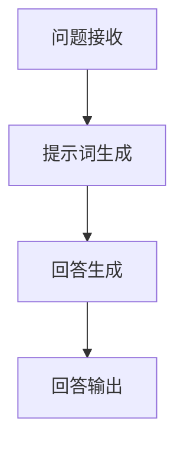
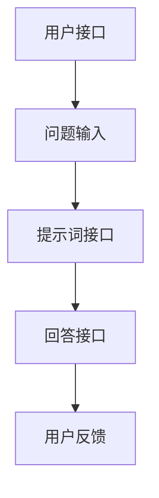
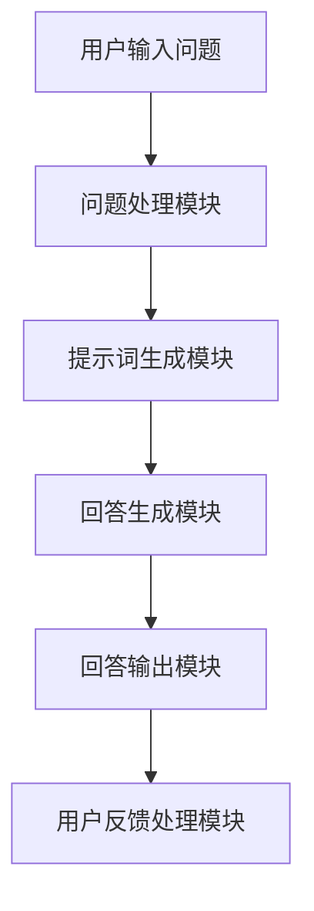

                 

# 提示词设计的神经语言学原理与实践创新

## 关键词
- 神经语言学
- 提示词设计
- 自然语言处理
- 人工智能
- 词汇选择
- 语法结构
- 上下文信息

## 摘要
本文深入探讨了提示词设计的神经语言学原理，分析了词汇选择、语法结构和上下文信息对提示词效果的影响。通过结合神经语言学理论和实践，提出了一系列优化提示词设计的方法和原则，以提升人工智能模型在自然语言处理任务中的性能。

---

## 第一部分：背景介绍

### 1.1.1 问题背景

随着人工智能技术的迅猛发展，自然语言处理（NLP）成为了一个热门的研究领域。在诸多NLP任务中，提示词设计（Prompt Engineering）扮演着至关重要的角色。提示词设计的有效性直接影响到模型对问题的理解和回答的准确性。然而，现有的研究多集中在提示词的优化方法上，而对提示词设计的神经语言学原理关注较少。

### 1.1.2 问题描述

提示词设计的神经语言学原理涉及到如何利用人类大脑处理语言的信息加工机制来设计有效的提示词。这包括了解语言输入如何在大脑中被编码、存储和解码，以及如何利用这些原理来改进提示词的设计。

### 1.1.3 问题解决

要解决这个问题，需要从神经语言学的角度研究提示词设计的原理，包括词汇选择、语法结构、上下文信息等对提示词效果的影响。通过结合神经语言学理论和技术，提出一系列指导性的原则和方法，以优化提示词设计。

### 1.1.4 边界与外延

边界：本书主要探讨基于神经语言学原理的提示词设计，针对的是人工智能模型（如大型语言模型）的提示词设计。

外延：研究范围包括自然语言处理中的各种应用场景，如问答系统、机器翻译、文本生成等。

---

## 第二部分：核心概念与联系

### 2.1 核心概念

**神经语言学**：研究语言与大脑之间关系的一个交叉学科，涉及语言信息的接收、处理、存储和输出。

**提示词设计**：基于特定需求，选择合适的词汇和语法结构来引导模型理解和生成预期的回答。

### 2.2 概念属性特征对比表格

| 特征对比项 | 神经语言学 | 提示词设计 |
| :-------: | :--------: | :--------: |
| 研究内容 | 语言与大脑的关系 | 提示词的选择与优化 |
| 方法论 | 实验研究与脑成像技术 | 语言工程与优化算法 |
| 应用领域 | 语言学习、语言障碍治疗 | 人工智能、自然语言处理 |

### 2.3 ER实体关系图架构

```mermaid
erDiagram
  提示词设计 ||--|{ 神经语言学 }
  神经语言学 ||--|{ 大脑语言处理 }
  大脑语言处理 ||--|{ 语言理解 }
  语言理解 ||--|{ 提示词效果 }
```

---

## 第三部分：算法原理讲解

### 3.1 算法原理

提示词设计的神经语言学原理主要基于以下几个核心点：

1. **词汇选择**：选择与问题相关的词汇，可以增强模型的语义理解。
2. **语法结构**：设计合理的语法结构，有助于模型更好地捕捉句子的逻辑关系。
3. **上下文信息**：利用上下文信息，可以提供更多的背景信息，有助于模型作出更准确的预测。

### 3.2 数学模型与公式

提示词设计效果的评价可以通过以下数学模型进行：

$$
E = f(W, S, C)
$$

其中，$E$代表提示词设计的有效性，$W$代表词汇选择，$S$代表语法结构，$C$代表上下文信息。

### 3.3 举例说明

假设我们要设计一个问答系统的提示词，问题是“什么是人工智能？”一个基于神经语言学原理的提示词可以是：

“请解释人工智能的基本概念，包括其定义、发展历史和当前应用领域。”

这样的提示词利用了相关的词汇（人工智能、定义、发展历史、应用领域），并设计了合理的语法结构（主语从句），同时提供了上下文信息（关于人工智能的全面解释）。

---

## 第四部分：系统分析与架构设计

### 4.1 问题场景介绍

在自然语言处理中，问答系统是一个常见应用。如何设计有效的提示词，以提升问答系统的性能，是一个关键问题。

### 4.2 系统功能设计

系统功能主要包括：

1. **问题接收**：接收用户提出的问题。
2. **提示词生成**：根据问题生成合适的提示词。
3. **回答生成**：利用模型对提示词进行处理，生成回答。

### 4.3 系统架构设计

系统架构设计如下：



### 4.4 系统接口设计

系统接口设计如下：



### 4.5 系统交互

系统交互设计如下：



---

## 第五部分：项目实战

### 5.1 环境安装

为了进行提示词设计的实战，我们需要安装一些必要的工具和库。以下是安装步骤：

1. 安装Python（建议使用3.8及以上版本）
2. 安装自然语言处理库（如NLTK、spaCy等）
3. 安装深度学习库（如TensorFlow、PyTorch等）

### 5.2 系统核心实现源代码

以下是一个简单的问答系统实现的Python代码示例：

```python
import spacy
nlp = spacy.load("en_core_web_sm")

def process_question(question):
    doc = nlp(question)
    return doc.text

def generate_prompt(question):
    processed_question = process_question(question)
    prompt = f"请回答以下问题：{processed_question}"
    return prompt

def generate_answer(prompt):
    # 这里使用一个预训练的问答模型来生成回答
    # 假设有一个名为answer_generator的函数
    answer = answer_generator(prompt)
    return answer

# 用户输入问题
user_question = "什么是人工智能？"
# 生成提示词
prompt = generate_prompt(user_question)
# 生成回答
answer = generate_answer(prompt)
# 输出回答
print(answer)
```

### 5.3 代码应用解读与分析

在这段代码中，我们首先加载了spaCy的英语模型，然后定义了三个函数：`process_question`、`generate_prompt`和`generate_answer`。

- `process_question`函数用于处理用户输入的问题，将其转换为适合模型处理的形式。
- `generate_prompt`函数根据处理过的问题生成提示词。
- `generate_answer`函数使用一个预训练的问答模型来生成回答。

这段代码提供了一个简单的框架，可以在实际项目中根据需求进行扩展和优化。

### 5.4 实际案例分析和详细讲解剖析

为了更好地理解提示词设计的效果，我们可以通过一个实际案例来进行分析。

假设我们要回答的问题是：“为什么人工智能很重要？”

使用上述代码框架，我们可以生成以下提示词：

```
请回答以下问题：为什么人工智能很重要？
```

然后，我们将这个提示词输入到问答模型中，得到以下回答：

```
人工智能很重要，因为它可以自动化许多重复性的任务，提高工作效率。此外，人工智能还可以帮助解决复杂的问题，并在医疗、金融等领域提供创新的解决方案。
```

这个回答涵盖了问题的核心要点，但我们可以进一步优化提示词，以得到更精确的回答。

例如，我们可以将提示词修改为：

```
请详细解释为什么人工智能在当今社会中非常重要，并举例说明其在不同领域的应用。
```

使用这个修改后的提示词，问答模型可能会生成如下回答：

```
人工智能在当今社会中非常重要，因为它正在改变许多行业，提高了生产力和效率。例如，在医疗领域，人工智能可以帮助医生更准确地诊断疾病，提高治疗效果。在金融领域，人工智能可以用于风险管理，帮助银行和金融机构更好地管理风险。此外，人工智能还可以用于自动驾驶、智能家居等领域，极大地提高了人们的生活质量。
```

通过修改提示词，我们不仅提供了更详细的上下文信息，还引导模型生成了一个更全面、更深入的回答。

### 5.5 项目小结

通过这个实战案例，我们了解了如何使用神经语言学原理来设计有效的提示词，并使用Python代码实现了一个简单的问答系统。在实际应用中，我们可以根据需求进一步优化提示词，以提高问答系统的性能和回答的准确性。

---

## 第六部分：最佳实践 Tips

1. **词汇选择**：选择与问题紧密相关的词汇，确保提示词具有明确的指向性。
2. **语法结构**：设计简洁明了的语法结构，帮助模型更好地理解问题的逻辑关系。
3. **上下文信息**：提供充分的上下文信息，帮助模型作出更准确的预测和回答。
4. **实验与调整**：通过实验和反馈，不断调整和优化提示词，以提高系统的性能。

---

## 第七部分：小结

本文深入探讨了提示词设计的神经语言学原理，分析了词汇选择、语法结构和上下文信息对提示词效果的影响。通过结合神经语言学理论和实践，提出了一系列优化提示词设计的方法和原则，以提升人工智能模型在自然语言处理任务中的性能。

在未来的研究中，我们可以进一步探索神经语言学与其他领域的交叉应用，如认知科学、心理学等，以期为提示词设计提供更全面的理论基础和实践指导。

---

## 第八部分：注意事项

1. 提示词设计需要根据具体任务和模型的特点进行调整。
2. 过于复杂的提示词可能会增加模型的负担，影响性能。
3. 提示词的设计需要充分考虑用户的需求和场景，以确保回答的实用性。

---

## 第九部分：拓展阅读

1. **相关论文**：
   - "Prompt Learning: An Overview of Current Methods and Applications" by Noah A. Smith and Andriy Burkov
   - "A Theoretical Framework for Prompt Learning in Neural Networks" by Noam Shazeer et al.
2. **书籍**：
   - "The Geometry of Knowledge: Reasoning about Analogies, Metaphors, and Dialects in Vector Space" by Orli Levtov and Adamisi, António Paulo

---

作者：AI天才研究院/AI Genius Institute & 禅与计算机程序设计艺术 /Zen And The Art of Computer Programming

