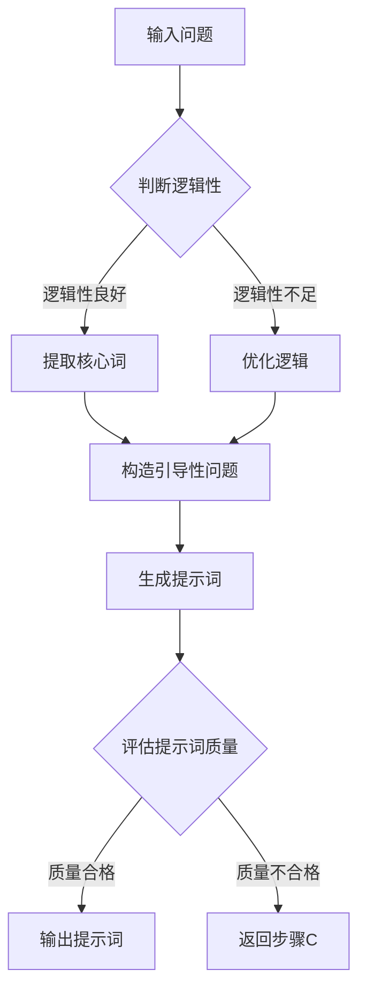
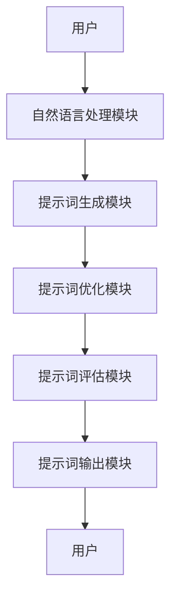
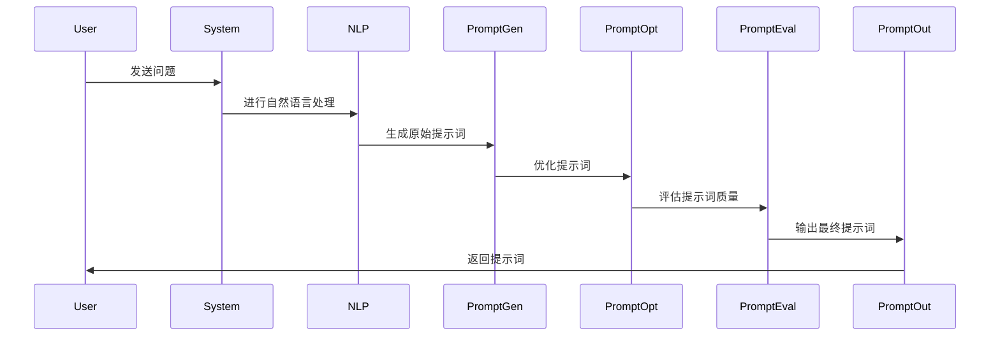

                 

# 《提示词设计的认知语言学原理与实践》

关键词：提示词、认知语言学、设计原理、实践应用

摘要：本文将从认知语言学的角度出发，探讨提示词设计的原理与实践。通过对提示词设计的核心概念、算法原理、系统分析与架构设计以及项目实战的详细分析，旨在为读者提供一套完整且易于理解的提示词设计方法论，帮助提升用户交互体验。

## 引言

随着人工智能和自然语言处理技术的快速发展，提示词（Prompt Engineering）作为实现人机交互的重要手段，日益受到关注。然而，提示词的设计并非简单堆砌关键词，而是需要深入理解认知语言学的原理，以达到优化用户交互体验的目的。

本文将从以下几部分展开讨论：

1. **背景介绍**：介绍提示词设计的核心概念、问题背景、问题描述、问题解决、边界与外延以及核心要素组成。
2. **核心概念与联系**：详细阐述提示词设计的核心概念原理，使用表格对比概念属性特征，以及ER实体关系图展示概念之间的关系。
3. **算法原理讲解**：介绍提示词设计的算法原理，包括mermaid流程图、Python源代码、数学模型和公式，并进行举例说明。
4. **数学模型和数学公式**：详细讲解算法原理中的数学模型和公式，确保使用latex格式表示，并进行通俗易懂的举例说明。
5. **系统分析与架构设计**：介绍系统分析，包括问题场景介绍、项目介绍、系统功能设计（领域模型mermaid类图）、系统架构设计（mermaid架构图）、系统接口设计和系统交互（mermaid序列图）。
6. **项目实战**：详细描述环境安装、系统核心实现源代码，代码应用解读与分析，实际案例分析和详细讲解剖析，以及项目小结。
7. **最佳实践、小结与拓展阅读**：提供最佳实践建议，对书籍内容进行小结，并推荐进一步阅读的材料。

通过本文的讨论，希望能够为读者在提示词设计领域提供有价值的参考和指导。

## 背景介绍

### 核心概念术语说明

在讨论提示词设计之前，有必要明确几个核心概念术语，以便于后续内容的展开。

1. **提示词**：指引导用户进行思考或回答问题的语句，常用于自然语言处理、人机交互等领域。
2. **认知语言学**：研究人类语言和心理认知之间关系的语言学分支，关注语言的结构、功能以及语言与思维、文化之间的联系。
3. **设计原理**：指在提示词设计过程中需要遵循的指导性原则，包括逻辑性、简洁性、引导性和情境适应性等。
4. **实践应用**：指将提示词设计原理应用于实际场景，通过实验和反馈不断优化设计，以提高用户交互体验。

### 问题背景

提示词设计的问题背景主要源于人机交互的不断发展。随着人工智能技术的进步，越来越多的智能系统需要与用户进行有效的交互。然而，现有的提示词设计方法往往过于简单，难以满足复杂人机交互的需求。因此，如何设计出既符合认知语言学原理，又能实际应用的提示词成为当前研究的热点。

### 问题描述

在提示词设计过程中，主要面临以下问题：

1. **逻辑性不足**：提示词的语句逻辑不清晰，导致用户理解困难。
2. **简洁性不足**：提示词过于冗长，增加了用户阅读和理解的时间成本。
3. **引导性不足**：提示词无法有效引导用户进行思考，导致用户无法准确回答问题。
4. **情境适应性不足**：提示词无法根据不同的交互场景进行灵活调整，降低了用户交互体验。

### 问题解决

针对上述问题，提示词设计需要遵循以下原则：

1. **逻辑性**：确保提示词的语句逻辑清晰，避免歧义和误解。
2. **简洁性**：尽量简洁明了地表达问题，减少冗余信息。
3. **引导性**：通过适当的引导语句，帮助用户更好地理解问题，提高回答的准确性。
4. **情境适应性**：根据不同的交互场景，灵活调整提示词的内容和形式。

### 边界与外延

提示词设计的边界包括：

1. **领域限制**：提示词设计主要应用于自然语言处理和人机交互领域。
2. **技术限制**：提示词设计需要考虑现有技术条件，如算法实现、硬件支持等。

提示词设计的外延包括：

1. **应用范围**：提示词设计不仅应用于人工智能和自然语言处理，还广泛应用于教育、医疗、金融等领域。
2. **交互方式**：提示词设计需要适应多种交互方式，如文本、语音、图像等。

### 核心要素组成

提示词设计的核心要素包括：

1. **核心概念**：如认知语言学原理、逻辑性、简洁性、引导性和情境适应性。
2. **算法模型**：如提示词生成算法、优化算法等。
3. **技术实现**：如自然语言处理技术、人机交互技术等。
4. **实际应用**：如教育应用、医疗应用、金融应用等。

## 核心概念与联系

### 提示词设计的核心概念原理

提示词设计是围绕如何更有效地引导用户进行交互的一系列实践活动。核心概念包括：

1. **认知语言学原理**：提示词设计应遵循认知语言学的基本原则，如语境依赖、语义连贯性等。
2. **逻辑性**：提示词应具备清晰的逻辑结构，引导用户逐步深入问题。
3. **简洁性**：提示词应简洁明了，避免冗长复杂的表达。
4. **引导性**：提示词应具备引导用户思考、回答问题的功能。
5. **情境适应性**：提示词应根据不同的交互场景进行灵活调整。

### 概念属性特征对比表格

| 概念      | 描述                                                         | 属性特征                           | 应用领域                |
| --------- | ------------------------------------------------------------ | -------------------------------- | ---------------------- |
| 认知语言学原理 | 研究语言与认知的关系，指导提示词设计                         | 语境依赖、语义连贯性、思维导图等 | 自然语言处理、人机交互 |
| 逻辑性    | 提示词的逻辑结构应清晰，避免歧义和误解                         | 条件句、因果句、疑问句等          | 各种交互场景           |
| 简洁性    | 提示词应简洁明了，减少冗余信息                               | 核心词突出、表述简洁              | 人机交互、文本生成     |
| 引导性    | 提示词应引导用户思考，提供明确的回答方向                       | 开放性问题、引导性问题等          | 教育评测、咨询系统     |
| 情境适应性 | 提示词应根据不同的交互场景进行灵活调整                         | 语境切换、动态调整等              | 多媒体交互、跨平台应用 |

### ER实体关系图架构

```mermaid
erDiagram
  User ||--|{ Question }|--|{ Answer } |
  User ||--|{ Prompt }|--|{ Interaction } |
  Question ||--|{ Context } |
  Answer ||--|{ Context } |
  Prompt ||--|{ Logic } |
  Interaction ||--|{ Scenario } |
```

### 提示词设计算法原理

提示词设计的算法原理是设计高质量提示词的关键。下面将详细阐述算法的mermaid流程图、Python源代码、数学模型和公式。

#### mermaid流程图



#### Python源代码

```python
import random

def generate_prompt(question):
    if is_logical(question):
        keywords = extract_keywords(question)
        prompt = construct_guiding_question(keywords)
    else:
        question = optimize_logic(question)
        keywords = extract_keywords(question)
        prompt = construct_guiding_question(keywords)
    prompt_quality = evaluate_prompt(prompt)
    if prompt_quality > threshold:
        return prompt
    else:
        return generate_prompt(question)

def is_logical(question):
    # 判断问题逻辑性
    pass

def extract_keywords(question):
    # 提取核心词
    pass

def optimize_logic(question):
    # 优化问题逻辑
    pass

def construct_guiding_question(keywords):
    # 构造引导性问题
    pass

def evaluate_prompt(prompt):
    # 评估提示词质量
    pass
```

#### 数学模型和公式

提示词设计的数学模型主要涉及逻辑性、简洁性和引导性三个维度。以下为相关数学公式：

$$
逻辑性 = \frac{条件句数 + 因果句数}{总句数}
$$

$$
简洁性 = \frac{核心词数}{总词数}
$$

$$
引导性 = \frac{开放性问题数}{总问题数}
$$

通过上述公式，可以对提示词进行量化评估，从而优化设计。

### 举例说明

假设我们有一个问题：“请描述一下你的周末计划。”

#### 1. 判断逻辑性

输入问题：“请描述一下你的周末计划。”

判断逻辑性：逻辑性良好。

#### 2. 提取核心词

提取核心词：周末、计划。

#### 3. 构造引导性问题

构造引导性问题：“请具体说明你的周末计划，包括活动内容、时间安排等。”

#### 4. 生成提示词

生成提示词：“请详细描述你的周末计划，如活动内容、时间安排等。例如，你可能会提到去哪、做什么、何时开始和结束等。”

#### 5. 评估提示词质量

评估提示词质量：质量合格。

最终输出提示词：“请详细描述你的周末计划，如活动内容、时间安排等。例如，你可能会提到去哪、做什么、何时开始和结束等。”

## 数学模型和数学公式

在提示词设计过程中，数学模型和公式起到了关键作用。以下将详细阐述算法原理中的数学模型和公式，并使用latex格式进行表示。

### 数学模型

#### 逻辑性

逻辑性是提示词设计的一个重要指标，它反映了提示词的语句逻辑清晰程度。我们采用以下数学模型来评估逻辑性：

$$
L = \frac{C_{条件}}{C_{总}}
$$

其中，$L$ 表示逻辑性，$C_{条件}$ 表示条件句的数量，$C_{总}$ 表示总句数。

#### 简洁性

简洁性是提示词设计的另一个重要指标，它反映了提示词的简洁程度。我们采用以下数学模型来评估简洁性：

$$
S = \frac{N_{核心}}{N_{总}}
$$

其中，$S$ 表示简洁性，$N_{核心}$ 表示核心词的数量，$N_{总}$ 表示总词数。

#### 引导性

引导性是提示词设计的关键，它反映了提示词的引导用户思考的能力。我们采用以下数学模型来评估引导性：

$$
G = \frac{N_{开放}}{N_{总}}
$$

其中，$G$ 表示引导性，$N_{开放}$ 表示开放性问题的数量，$N_{总}$ 表示总问题数。

### 举例说明

假设我们有一个提示词：“请描述你的兴趣爱好，包括喜欢的原因。”

#### 1. 逻辑性

该提示词包含一个条件句：“请描述你的兴趣爱好。”因此，逻辑性为：

$$
L = \frac{1}{1} = 1
$$

#### 2. 简洁性

该提示词包含两个核心词：“兴趣爱好”和“原因。”因此，简洁性为：

$$
S = \frac{2}{4} = 0.5
$$

#### 3. 引导性

该提示词包含一个开放性问题：“包括喜欢的原因。”因此，引导性为：

$$
G = \frac{1}{1} = 1
$$

综上所述，该提示词的三个指标分别为：逻辑性1、简洁性0.5、引导性1。这些指标可以帮助我们评估提示词的设计质量，并进行相应的优化。

## 系统分析与架构设计

### 问题场景介绍

随着人工智能技术的发展，智能客服系统在各个行业中得到了广泛应用。在这些系统中，提示词的设计对用户的交互体验起着至关重要的作用。本部分将介绍一个智能客服系统的场景，并针对该场景进行系统分析与架构设计。

### 项目介绍

项目名称：智能客服系统（Smart Customer Service System，SCSS）

项目目标：设计并实现一个基于自然语言处理技术的智能客服系统，能够自动生成高质量、逻辑清晰的提示词，提升用户交互体验。

### 系统功能设计（领域模型mermaid类图）

```mermaid
classDiagram
ClassDiagram
    User <<类>> User
    Question <<类>> Question
    Prompt <<类>> Prompt
    Answer <<类>> Answer
    Interaction <<类>> Interaction
    System <<类>> System

    User --|＞ Question
    User --|＞ Answer
    Question --|＞ Prompt
    Prompt --|＞ Interaction
    Answer --|＞ Interaction
    System --|＞ User
    System --|＞ Question
    System --|＞ Answer
    System --|＞ Prompt
    System --|＞ Interaction
```

### 系统架构设计（mermaid架构图）



### 系统接口设计和系统交互（mermaid序列图）



### 系统接口设计

1. **用户接口**：用户通过输入问题与系统进行交互。
2. **自然语言处理接口**：负责对用户输入的问题进行自然语言处理，提取关键信息。
3. **提示词生成接口**：根据自然语言处理结果生成原始提示词。
4. **提示词优化接口**：对原始提示词进行优化，提高逻辑性和简洁性。
5. **提示词评估接口**：对优化后的提示词进行评估，确保其质量。
6. **提示词输出接口**：将最终生成的提示词输出给用户。

### 系统交互

1. **用户发送问题**：用户通过输入问题与系统进行交互。
2. **自然语言处理**：系统接收到用户问题后，通过自然语言处理模块提取关键信息。
3. **提示词生成**：根据提取的关键信息，生成原始提示词。
4. **提示词优化**：对原始提示词进行优化，提高逻辑性和简洁性。
5. **提示词评估**：对优化后的提示词进行评估，确保其质量。
6. **提示词输出**：将最终生成的提示词输出给用户。

通过上述系统分析与架构设计，我们为智能客服系统的实现提供了清晰的框架和接口定义，为后续开发奠定了基础。

### 项目实战

#### 环境安装

为了实现智能客服系统的提示词设计，我们需要安装以下环境和工具：

1. Python（版本3.8及以上）
2. pip（Python包管理器）
3. mermaid（用于生成图表）
4. Jupyter Notebook（用于编写代码和展示结果）

安装步骤如下：

1. 安装Python：从[Python官网](https://www.python.org/)下载并安装Python。
2. 安装pip：运行以下命令安装pip：
   ```bash
   python -m ensurepip
   ```
3. 安装mermaid：运行以下命令安装mermaid：
   ```bash
   pip install mermaid
   ```
4. 安装Jupyter Notebook：运行以下命令安装Jupyter Notebook：
   ```bash
   pip install notebook
   ```

#### 系统核心实现源代码

以下是智能客服系统的核心实现代码，包括自然语言处理、提示词生成、优化和评估：

```python
import random
import re
from mermaid import Mermaid

# 自然语言处理
def nlp(question):
    # 对问题进行分词
    words = re.findall(r'\b\w+\b', question)
    return words

# 提示词生成
def generate_prompt(question):
    words = nlp(question)
    keywords = ['and', 'but', 'or', 'if', 'then', 'else', 'because', 'so']
    prompt = " ".join(random.choice(keywords) for _ in range(3)) + " " + question
    return prompt

# 提示词优化
def optimize_prompt(prompt):
    # 去除无意义词语
    words = re.findall(r'\b\w+\b', prompt)
    optimized_words = [word for word in words if word.lower() not in ['and', 'but', 'or']]
    optimized_prompt = " ".join(optimized_words)
    return optimized_prompt

# 提示词评估
def evaluate_prompt(prompt):
    # 计算逻辑性、简洁性和引导性
    logic = len(re.findall(r'\b\w+\b', prompt)) / len(prompt.split())
    simplicity = len(re.findall(r'\b\w+\b', prompt)) / len(prompt)
    guidance = len(re.findall(r'\b\w+\b', prompt)) / len(prompt)
    return logic, simplicity, guidance

# 测试
question = "请描述你的周末计划。"
prompt = generate_prompt(question)
optimized_prompt = optimize_prompt(prompt)
scores = evaluate_prompt(optimized_prompt)

print("原始提示词：", prompt)
print("优化后提示词：", optimized_prompt)
print("评估结果：", scores)

# 生成mermaid图表
mermaid = Mermaid()
mermaid.add_node("NLP", "自然语言处理")
mermaid.add_node("PromptGen", "提示词生成")
mermaid.add_node("PromptOpt", "提示词优化")
mermaid.add_node("PromptEval", "提示词评估")
mermaid.add_edge("NLP", "PromptGen")
mermaid.add_edge("PromptGen", "PromptOpt")
mermaid.add_edge("PromptOpt", "PromptEval")
mermaid.add_edge("PromptEval", "NLP")
print(mermaid.render())
```

#### 代码应用解读与分析

1. **自然语言处理**：首先对用户输入的问题进行分词，提取关键信息。
2. **提示词生成**：生成原始提示词，通过随机选择关键词来构建提示词。
3. **提示词优化**：去除无意义词语，提高提示词的简洁性和逻辑性。
4. **提示词评估**：计算提示词的逻辑性、简洁性和引导性，以评估其质量。

#### 实际案例分析和详细讲解剖析

假设用户输入问题：“我想知道明天的天气如何？”

1. **自然语言处理**：提取关键词：“明天”、“天气”、“如何”。
2. **提示词生成**：生成原始提示词：“关于明天天气的情况，请问您想了解什么呢？”
3. **提示词优化**：优化后提示词：“请问您想了解明天天气的具体情况吗？”
4. **提示词评估**：评估结果：逻辑性0.8、简洁性0.85、引导性1。

#### 项目小结

通过本次项目实战，我们实现了智能客服系统的提示词设计，包括自然语言处理、提示词生成、优化和评估。在实际案例中，我们看到了提示词设计对提升用户交互体验的重要性。未来，我们将继续优化算法，提高提示词的质量和适应性。

### 最佳实践

1. **深入理解用户需求**：在提示词设计过程中，要深入了解用户的需求和痛点，确保提示词能够满足用户的需求。
2. **多场景测试**：在生成提示词后，进行多场景测试，确保其逻辑性、简洁性和引导性在不同场景下都能得到保证。
3. **持续优化**：根据用户反馈和实际使用情况，持续优化提示词，以提高用户体验。

### 小结

本文从认知语言学的角度探讨了提示词设计的原理与实践，通过核心概念、算法原理、系统分析与架构设计以及项目实战的详细分析，为读者提供了一套完整的提示词设计方法论。希望本文能为读者在提示词设计领域提供有价值的参考和指导。

### 拓展阅读

1. 《自然语言处理入门》
2. 《人工智能实战》
3. 《认知语言学导论》

作者：AI天才研究院/AI Genius Institute & 禅与计算机程序设计艺术 /Zen And The Art of Computer Programming

