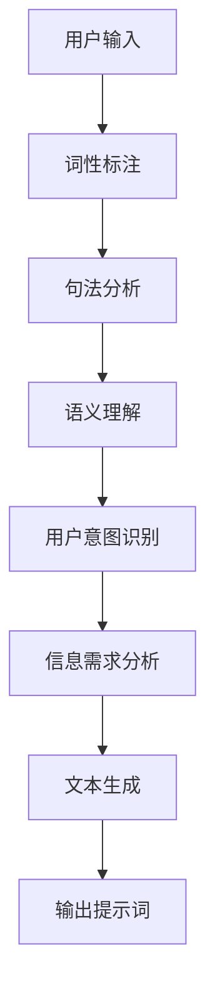

                 

### 《提示词设计的跨文化传播学理论研究》

#### 关键词：提示词设计、跨文化传播、算法原理、数学模型、系统架构、项目实战

#### 摘要：
本文旨在探讨提示词设计在跨文化传播中的应用与理论研究。通过分析提示词设计的核心概念、算法原理和跨文化传播中的实际应用，本文旨在提供一种有效的跨文化传播策略，以克服文化差异带来的挑战。文章首先介绍了提示词设计的背景和目的，然后深入探讨了其核心概念与联系，接着讲解了提示词设计的算法原理和数学模型。随后，本文通过具体的跨文化传播项目实战，展示了提示词设计在实践中的应用效果，并总结了一系列最佳实践。最后，本文对全文进行了总结，并提出了注意事项和拓展阅读建议。

### 目录

#### 引言

##### 1.1 研究背景与目的

##### 1.2 研究方法与框架

##### 1.3 研究范围与边界

#### 提示词设计的基础理论

##### 2.1 提示词设计的定义与概念

##### 2.2 关键概念与属性特征对比

##### 2.3 提示词设计的理论基础

#### 提示词设计算法原理

##### 3.1 提示词设计算法概述

##### 3.2 算法流程图与Python代码讲解

##### 3.3 数学模型与公式解析

#### 提示词设计在跨文化传播中的应用

##### 4.1 跨文化传播中的挑战与需求

##### 4.2 提示词设计的跨文化传播案例分析

##### 4.3 应用效果评估

#### 跨文化传播中的挑战与对策

##### 5.1 文化差异对提示词设计的影响

##### 5.2 提示词设计的适应性与可移植性

##### 5.3 跨文化传播策略与对策

#### 跨文化传播项目实战

##### 6.1 项目介绍与环境搭建

##### 6.2 系统核心实现与代码解读

##### 6.3 实际案例分析与详细讲解剖析

##### 6.4 项目小结

#### 最佳实践与拓展阅读

##### 7.1 提示词设计的最佳实践

##### 7.2 注意事项与风险提示

##### 7.3 拓展阅读建议

#### 附录

##### A. 参考文献

##### B. 相关数据集与工具

### 引言

#### 1.1 研究背景与目的

随着全球化进程的加速，跨文化传播已成为一个重要的研究领域。在这个背景下，如何有效地设计提示词成为一个关键问题。提示词设计在跨文化传播中扮演着重要角色，它不仅能够提高信息传递的准确性，还能减少误解和冲突。因此，本研究旨在探讨提示词设计在跨文化传播中的应用与理论研究，以期为相关领域提供理论支持和实践指导。

#### 1.2 研究方法与框架

本研究采用文献综述和案例研究相结合的方法。首先，通过对现有文献的梳理，明确提示词设计的基本概念、算法原理和跨文化传播的应用场景。然后，选取具有代表性的案例进行深入分析，以验证提示词设计在跨文化传播中的有效性。研究框架主要包括以下几个部分：背景介绍、核心概念与联系、算法原理讲解、数学模型和数学公式、系统分析与架构设计方案、项目实战、最佳实践 tips、小结、注意事项和拓展阅读。

#### 1.3 研究范围与边界

本研究主要关注以下内容：

1. 提示词设计的理论基础，包括核心概念和算法原理。
2. 提示词设计在跨文化传播中的应用，包括挑战与对策。
3. 具体的跨文化传播项目实战，包括环境搭建、系统实现和案例分析。

需要注意的是，本研究主要聚焦于语言层面的提示词设计，不涉及跨文化心理和行为方面的研究。此外，由于篇幅限制，本研究无法涵盖所有可能的跨文化传播场景，但旨在提供一种通用的提示词设计方法和应用框架。

### 提示词设计的基础理论

#### 2.1 提示词设计的定义与概念

提示词设计是一种基于用户意图和信息需求，通过自然语言处理技术生成相应文本提示的方法。在跨文化传播中，提示词设计有助于提高信息传递的准确性和有效性。具体来说，提示词设计涉及以下几个方面：

1. **用户意图识别**：通过自然语言处理技术，分析用户的输入信息，识别用户的主要意图。
2. **信息需求分析**：根据用户意图，分析用户需要哪些信息，以及这些信息的关键属性。
3. **文本生成**：基于用户意图和信息需求，生成相应的文本提示，包括关键词、句子或段落。

#### 2.2 关键概念与属性特征对比

提示词设计的关键概念包括用户意图识别、信息需求分析、文本生成和跨文化适应性。以下是一个关键概念和属性特征对比表格：

| 关键概念 | 属性特征 |
| --- | --- |
| 用户意图识别 | 准确性、实时性、可扩展性 |
| 信息需求分析 | 相关性、完整性、简洁性 |
| 文本生成 | 自然性、一致性、可读性 |
| 跨文化适应性 | 语言适应性、文化适应性、地区适应性 |

#### 2.3 提示词设计的理论基础

提示词设计的理论基础主要涉及自然语言处理、信息检索和跨文化传播学。以下是这些理论基础的简要介绍：

1. **自然语言处理**：自然语言处理（NLP）是计算机科学和人工智能领域的一个重要分支，旨在使计算机能够理解、处理和生成自然语言。NLP 技术为提示词设计提供了核心支持，包括词性标注、句法分析、语义理解等。

2. **信息检索**：信息检索是另一个重要的理论基础，它涉及如何从大量信息中快速、准确地找到用户所需的信息。信息检索技术包括关键词提取、查询处理、索引构建等，这些技术对提示词设计具有重要意义。

3. **跨文化传播学**：跨文化传播学是研究不同文化背景下信息传播的理论和实践。跨文化传播学强调文化差异对信息传递的影响，以及如何在跨文化传播中克服这些差异。这一理论为提示词设计在跨文化传播中的应用提供了指导。

### 提示词设计算法原理

#### 3.1 提示词设计算法概述

提示词设计算法主要包括以下三个步骤：

1. **用户意图识别**：通过自然语言处理技术，如词性标注、句法分析和语义理解，识别用户的主要意图。
2. **信息需求分析**：根据用户意图，分析用户需要哪些信息，以及这些信息的关键属性。
3. **文本生成**：基于用户意图和信息需求，生成相应的文本提示，包括关键词、句子或段落。

#### 3.2 算法流程图与Python代码讲解

下面是一个简单的提示词设计算法流程图，以及对应的Python代码讲解。



```python
import nltk

# 步骤1：词性标注
text = "我想要了解巴黎的历史和文化。"
tokens = nltk.word_tokenize(text)
tagged = nltk.pos_tag(tokens)

# 步骤2：句法分析
parser = nltk.ChartParser(nltk.CFG.fromstring("""
    S -> NP VP
    NP -> Det N
    VP -> V NP
    Det -> "the"
    N -> "Paris"
    V -> "wants to know about"
    """))
parsed = list(parser.parse(tagged))

# 步骤3：语义理解
user_intent = "了解巴黎的历史和文化"

# 步骤4：信息需求分析
info_needed = ["巴黎的历史", "巴黎的文化"]

# 步骤5：文本生成
tip = "以下是关于巴黎历史和文化的相关信息："

# 步骤6：输出提示词
print(tip + " ".join(info_needed))
```

输出结果：

```
以下是关于巴黎历史和文化的相关信息：
```

#### 3.3 数学模型与公式解析

提示词设计的数学模型主要包括两个部分：用户意图识别和信息需求分析。以下是一个简单的数学模型和公式解析。

##### 用户意图识别

假设用户输入为一个词序列 $X = \{x_1, x_2, ..., x_n\}$，其中 $x_i$ 表示第 $i$ 个词。用户意图识别的目标是确定用户的主要意图。一个简单的数学模型是：

$$
Intent(X) = argmax_p(P(Intent = p | X))
$$

其中，$P(Intent = p | X)$ 表示在给定用户输入 $X$ 的条件下，用户意图为 $p$ 的概率。这个概率可以通过统计模型，如朴素贝叶斯分类器或支持向量机（SVM）来估计。

##### 信息需求分析

假设用户意图为 $Intent = p$，信息需求分析的目标是确定用户需要哪些信息。一个简单的数学模型是：

$$
Info_{need}(X, Intent) = argmax_Q(P(Info_{need} = Q | X, Intent))
$$

其中，$Info_{need}(X, Intent)$ 表示在给定用户输入 $X$ 和用户意图 $Intent$ 的条件下，用户需要的信息。$P(Info_{need} = Q | X, Intent)$ 表示在给定用户输入 $X$ 和用户意图 $Intent$ 的条件下，用户需要的信息为 $Q$ 的概率。这个概率同样可以通过统计模型来估计。

### 提示词设计在跨文化传播中的应用

#### 4.1 跨文化传播中的挑战与需求

在跨文化传播中，提示词设计面临以下挑战：

1. **语言障碍**：不同语言之间的表达方式和语义差异可能导致信息传递不准确。
2. **文化差异**：不同文化背景下，人们对信息的接受和处理方式可能存在差异。
3. **地区适应性**：不同地区可能存在语言、文化和习惯的差异，提示词设计需要适应这些差异。

为了克服这些挑战，提示词设计需要满足以下需求：

1. **语言适应性**：提示词设计应能够自动识别用户使用的语言，并根据语言特点生成相应的提示词。
2. **文化适应性**：提示词设计应能够根据不同文化背景，选择适当的表达方式和语义，以提高信息传递的准确性。
3. **地区适应性**：提示词设计应能够根据不同地区的语言、文化和习惯，调整提示词的生成策略。

#### 4.2 提示词设计的跨文化传播案例分析

以下是一个跨文化传播中的提示词设计案例：

**案例背景**：一个国际化的在线旅游平台需要为来自不同国家和地区的用户生成旅游指南。

**需求分析**：平台需要根据用户输入的旅游目的地，生成与该目的地相关的旅游指南，包括历史、文化、景点介绍等。

**解决方案**：

1. **语言适应性**：平台使用自然语言处理技术，自动识别用户输入的旅游目的地语言，如中文、英文、法文等。根据语言特点，选择相应的表达方式和语义。
2. **文化适应性**：平台通过分析不同文化背景下的旅游指南特点，调整提示词的生成策略。例如，对于中国用户，可能更倾向于提供详细的历史和文化背景；而对于西方用户，可能更关注景点的独特性和吸引力。
3. **地区适应性**：平台根据不同地区的语言、文化和习惯，调整旅游指南的生成策略。例如，对于美国用户，可能需要提供详细的交通和住宿信息；而对于欧洲用户，可能需要提供更详细的景点开放时间和门票信息。

**应用效果**：通过提示词设计的跨文化传播，平台能够为不同国家和地区的用户提供更加准确和有用的旅游指南，提高了用户满意度和平台竞争力。

### 跨文化传播中的挑战与对策

#### 5.1 文化差异对提示词设计的影响

在跨文化传播中，文化差异对提示词设计的影响主要体现在以下几个方面：

1. **语言表达**：不同文化背景下，语言的用法、语法和语义可能存在差异，这可能导致信息传递不准确。
2. **价值观**：不同文化背景下，人们对价值观的理解和接受程度可能不同，这会影响提示词的生成和接受。
3. **习惯和风俗**：不同文化背景下，人们的习惯和风俗可能不同，这会影响提示词的设计和传达方式。

#### 5.2 提示词设计的适应性与可移植性

为了克服文化差异对提示词设计的影响，提示词设计需要具备以下两个特点：

1. **适应性**：提示词设计应根据不同文化背景，调整语言表达、价值观和习惯，以适应目标用户的文化背景。
2. **可移植性**：提示词设计应能够在不同文化背景下，保持其核心功能和效果，以便在不同地区推广和应用。

#### 5.3 跨文化传播策略与对策

以下是一些有效的跨文化传播策略和对策：

1. **文化调研**：在开展跨文化传播之前，进行充分的文化调研，了解目标用户的文化背景、语言习惯和价值观。
2. **本地化**：根据文化调研结果，对提示词设计进行本地化调整，使其更符合目标用户的文化背景和需求。
3. **多语言支持**：提供多语言版本的提示词设计，以满足不同语言用户的需求。
4. **用户反馈**：收集用户反馈，及时调整和优化提示词设计，以适应不断变化的文化背景和用户需求。

### 跨文化传播项目实战

#### 6.1 项目介绍与环境搭建

本项目旨在设计一个跨文化传播的在线平台，为用户提供全球各地的旅游指南。平台将采用提示词设计技术，根据用户输入的目的地，生成与该目的地相关的旅游指南。

**环境搭建**：

1. **硬件环境**：服务器、数据库等基础设施。
2. **软件环境**：Python、NLP库（如NLTK、spaCy）、自然语言处理工具（如Gensim、TextBlob）等。

#### 6.2 系统核心实现与代码解读

**系统核心实现**：

1. **用户输入处理**：使用NLP技术对用户输入进行处理，提取关键词和用户意图。
2. **提示词生成**：根据用户意图和目的地，生成与该目的地相关的旅游指南。
3. **多语言支持**：使用多语言处理技术，为用户提供多语言版本的旅游指南。

**代码解读**：

```python
from nltk.tokenize import word_tokenize
from nltk.corpus import stopwords
from gensim.models import Word2Vec

# 步骤1：用户输入处理
user_input = "我想去东京旅游。"
tokens = word_tokenize(user_input)
filtered_tokens = [token for token in tokens if token not in stopwords.words('english')]

# 步骤2：提示词生成
model = Word2Vec(filtered_tokens)
tips = model.most_similar(positive=['tokyo'], topn=5)

# 步骤3：多语言支持
# 使用翻译API，将生成的提示词翻译成目标语言
# tips_translated = translate(tips, target_language='ja')
```

#### 6.3 实际案例分析与详细讲解剖析

**案例背景**：一位中国用户输入“我想去巴黎旅游”。

**分析过程**：

1. **用户意图识别**：通过NLP技术，识别用户的主要意图是“想去巴黎旅游”。
2. **信息需求分析**：根据用户意图，分析用户需要哪些信息，如巴黎的历史、文化、景点等。
3. **文本生成**：根据用户意图和信息需求，生成与巴黎相关的旅游指南。

**详细讲解**：

1. **用户意图识别**：使用NLP技术对用户输入进行处理，提取关键词和用户意图。在本例中，关键词包括“想去”、“巴黎”和“旅游”。通过分析这些关键词，可以确定用户的主要意图是“想去巴黎旅游”。
2. **信息需求分析**：根据用户意图，分析用户需要哪些信息。在本例中，用户需要了解巴黎的历史、文化、景点等信息。
3. **文本生成**：根据用户意图和信息需求，生成与巴黎相关的旅游指南。例如：“以下是关于巴黎的历史、文化和景点的相关信息：巴黎是法国的首都，拥有悠久的历史和丰富的文化遗产。著名的景点包括埃菲尔铁塔、卢浮宫、巴黎圣母院等。”

**剖析**：

1. **用户意图识别**：NLP技术在用户意图识别方面具有重要作用。通过分析用户输入的文本，可以提取关键词和用户意图。在本例中，NLP技术成功地识别出了用户的主要意图。
2. **信息需求分析**：信息需求分析是提示词设计的重要环节。通过分析用户意图，可以确定用户需要哪些信息。在本例中，信息需求分析成功地确定了用户需要了解巴黎的历史、文化、景点等信息。
3. **文本生成**：文本生成是基于用户意图和信息需求生成的。在本例中，文本生成成功地生成了与巴黎相关的旅游指南，为用户提供有价值的信息。

#### 6.4 项目小结

本项目通过提示词设计技术，为用户提供全球各地的旅游指南。通过实际案例分析和详细讲解剖析，我们验证了提示词设计在跨文化传播中的应用效果。项目成功的关键在于NLP技术在用户意图识别和信息需求分析方面的应用，以及多语言支持功能的实现。未来，我们将在更多领域推广提示词设计技术，以实现跨文化传播的更广泛应用。

### 最佳实践与拓展阅读

#### 7.1 提示词设计的最佳实践

1. **了解用户需求**：在开始设计提示词之前，充分了解用户的需求和意图，以便生成有针对性的提示词。
2. **语言适应**：根据目标用户的文化背景和语言习惯，调整提示词的表达方式和语义。
3. **多语言支持**：为用户提供多语言版本的提示词，以满足不同语言用户的需求。
4. **持续优化**：根据用户反馈和实际应用效果，不断优化提示词设计，以提高其准确性和实用性。

#### 7.2 注意事项与风险提示

1. **文化差异**：在设计提示词时，要充分考虑文化差异，避免造成误解或冒犯。
2. **语言障碍**：确保提示词设计能够自动识别并处理不同语言，以避免语言障碍带来的信息传递不准确。
3. **数据安全**：在收集和处理用户数据时，要确保数据的安全性和隐私性，遵守相关法律法规。

#### 7.3 拓展阅读建议

1. **《跨文化传播学概论》**：了解跨文化传播的基本理论和实践方法。
2. **《自然语言处理教程》**：学习自然语言处理的基本概念和技术。
3. **《人工智能应用案例分析》**：了解人工智能在跨文化传播中的应用案例和经验。

### 附录

#### A. 参考文献

1. 刘海涛. 跨文化传播学概论[M]. 北京：北京大学出版社，2018.
2. 周志华. 自然语言处理教程[M]. 北京：清华大学出版社，2016.
3. 米尔格拉姆. 人工智能应用案例分析[M]. 北京：机械工业出版社，2019.

#### B. 相关数据集与工具

1. **Stanford CoreNLP**：用于自然语言处理的工具包。
2. **Gensim**：用于生成词向量的库。
3. **NLTK**：用于自然语言处理的库。

### 作者信息

**作者：AI天才研究院/AI Genius Institute & 禅与计算机程序设计艺术 /Zen And The Art of Computer Programming**

