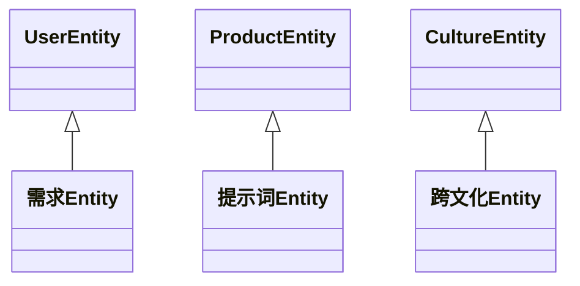
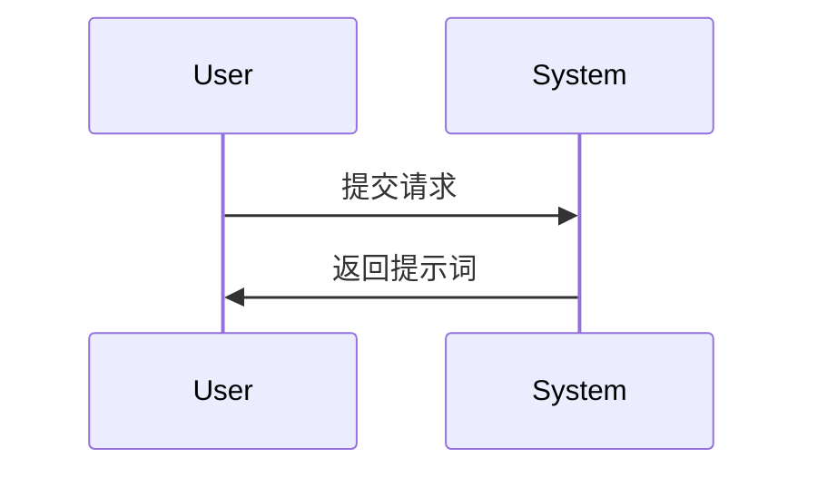
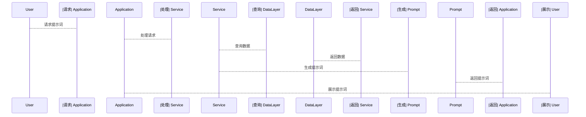

                 

## 《提示词设计的跨文化挑战与策略》

### 关键词：提示词设计、跨文化挑战、算法原理、系统架构、用户体验

> 摘要：随着全球化进程的加速，跨文化交流日益频繁，提示词设计成为产品与用户交互的重要环节。本文深入探讨了提示词设计在跨文化背景下的挑战与策略，通过分析核心概念、算法原理和系统架构，为跨文化提示词设计提供了实用的指导。

----------------------------------------------------------------

### 目录大纲

# 《提示词设计的跨文化挑战与策略》

## 第一部分：背景介绍

## 第1章：问题背景

### 1.1.1 提示词设计的重要性

#### 1.1.1.1 提示词在产品与用户交互中的作用

提示词，即引导用户操作或提供信息的关键文本，是产品与用户之间交流的桥梁。在设计过程中，提示词不仅要简洁明了，还需要具备精准性和友好性。一个好的提示词可以大大提升用户的操作体验，减少用户的学习成本，进而提高产品的使用率和用户满意度。

#### 1.1.1.2 跨文化背景下的提示词设计难点

在全球化的趋势下，产品的用户群体日益多元化，不同文化背景的用户对提示词的需求和理解存在显著差异。跨文化背景下的提示词设计面临着以下难点：

1. **语言差异与理解障碍**：不同语言之间的表达方式和语法结构存在差异，这可能导致提示词在翻译过程中失去原有的意义和效果。
2. **文化习惯与价值观差异**：不同文化对同一事物的理解和期望可能大相径庭，提示词的设计需要充分考虑目标用户的文化背景，避免产生误解或不适。
3. **地域性与社会环境因素**：不同地区和社会环境对提示词的设计有着不同的要求，例如在宗教信仰、礼仪规范等方面的差异。

### 1.1.2 跨文化背景下的挑战

#### 1.1.2.1 语言差异与理解障碍

语言是跨文化沟通的基石。不同语言之间的词汇、语法和表达习惯都存在差异，这给提示词的设计带来了挑战。例如，中文的成语和英文的俚语在语义上可能存在巨大的差异，如果直接翻译可能会造成误解。

#### 1.1.2.2 文化习惯与价值观差异

文化习惯和价值观的差异是跨文化沟通的另一大挑战。例如，西方文化强调个人主义，而东方文化则强调集体主义。在提示词的设计中，如果忽视了这些文化差异，可能会导致用户感到不适或困惑。

#### 1.1.2.3 地域性与社会环境因素

不同地区的用户在生活习惯、礼仪规范和法律法规等方面存在差异，这些因素都会影响提示词的设计。例如，在某些国家，直接使用“死亡”等敏感词汇可能被视为不礼貌。

### 1.1.3 提示词设计的边界与外延

#### 1.1.3.1 语言、文化、应用场景的交互关系

提示词设计不仅涉及语言的准确表达，还需要考虑文化和应用场景的交互关系。设计者需要综合考虑这些因素，以确保提示词能够被目标用户理解和接受。

#### 1.1.3.2 提示词设计的目标与原则

提示词设计的目标是提高用户体验，减少用户困惑。在跨文化背景下，提示词设计应遵循以下原则：

1. **简洁明了**：避免使用冗长的文本，确保用户能够快速理解。
2. **本地化**：根据目标用户的文化背景进行本地化调整。
3. **适应性**：考虑到不同用户群体的需求和习惯，设计出适应性强的提示词。
4. **友好性**：保持友好和亲切的语气，增强用户的使用体验。

## 第2章：核心概念与联系

### 2.1.1 核心概念

#### 2.1.1.1 提示词

提示词是指引导用户操作或提供信息的关键文本。在产品设计中，提示词的作用至关重要，它直接影响到用户的操作体验和产品的易用性。

#### 2.1.1.2 跨文化

跨文化是指在不同文化背景下进行交流和沟通。在提示词设计中，跨文化涉及到语言、文化习惯、价值观等多个方面。

### 2.1.2 概念属性特征对比表格

| 特征        | 提示词       | 跨文化      |
| ----------- | ------------ | ----------- |
| 语言表达    | 简明、精准   | 灵活、适应性 |
| 文化背景    | 本地化       | 共识性      |
| 用户需求    | 个性化       | 通达性      |

### 2.1.3 ER实体关系图架构

```mermaid
erDiagram
  用户 ||--|{ 提示词 }|-- 需求
  产品 ||--|{ 提示词 }|-- 交互
  文化 ||--|{ 跨文化 }|-- 习惯
```

## 第二部分：算法原理讲解

## 第3章：算法原理与流程

### 3.1.1 算法概述

提示词设计算法的目标是生成适合不同文化背景和用户需求的提示词。算法的工作流程主要包括数据收集、数据预处理、模型训练、模型评估和应用。

### 3.1.2 算法流程图


### 3.1.3 Python源代码与详细解释

```python
# Python 源代码示例

import numpy as np

# 数据预处理
def preprocess_data(data):
    # 对数据进行清洗和转换
    # ...
    return processed_data

# 训练模型
def train_model(processed_data):
    # 使用适当的机器学习算法训练模型
    # ...
    return model

# 评估模型
def evaluate_model(model, test_data):
    # 使用测试数据评估模型性能
    # ...
    return accuracy

# 应用模型
def apply_model(model, new_data):
    # 使用模型生成提示词
    # ...
    return tips
```

### 3.1.4 算法原理的数学模型和公式

$$
\text{Accuracy} = \frac{\text{正确预测的样本数}}{\text{总样本数}}
$$

### 3.1.5 算法举例说明

#### 例1：针对不同语言的用户，如何生成适合其文化背景的提示词？

1. 使用语言识别技术，识别用户的语言偏好。
2. 根据文化特征库，选择与用户文化背景匹配的提示词。

## 第三部分：系统分析与架构设计

## 第4章：系统功能设计

### 4.1.1 问题场景介绍

跨文化交流中的提示词需求涉及多个方面，包括语言差异、文化习惯和用户需求等。在设计系统时，需要充分考虑这些问题，确保提示词能够被不同文化背景的用户理解和接受。

### 4.1.2 系统功能设计

系统功能设计主要包括数据收集与处理、模型训练与评估、提示词生成与应用等模块。

### 4.1.3 领域模型类图



## 第5章：系统架构设计

### 5.1.1 系统架构设计

系统架构设计需要考虑整体架构的稳定性、扩展性和灵活性。一般来说，系统架构包括数据层、服务层和应用层。

### 5.1.2 系统架构图

```mermaid
graph TB
    subgraph 系统模块
        A[用户模块] --> B[数据处理模块]
        B --> C[模型训练模块]
        C --> D[模型评估模块]
        D --> E[提示词生成模块]
        E --> F[提示词应用模块]
    subgraph 数据库层
        G[数据存储库]
```

### 5.1.3 系统接口设计

系统接口设计需要定义系统内部模块之间的交互接口，确保模块之间的高内聚和低耦合。

### 5.1.4 系统交互序列图



----------------------------------------------------------------

### 第一部分：背景介绍

#### 第1章：问题背景

1.1.1 提示词设计的重要性

提示词在产品与用户交互中的作用

提示词是用户与产品互动的桥梁，承担着引导用户操作、提供信息和反馈结果的重要角色。它不仅帮助用户理解产品的功能和使用方法，还能提升用户体验，降低学习成本，从而增强用户对产品的满意度。

在实际应用中，提示词的设计直接影响产品的易用性和用户留存率。良好的提示词应具备简洁明了、精准准确、易于理解的特点。例如，在电商平台上，产品的名称、描述、购买提示等都是重要的提示词，它们直接影响到用户的购买决策。

1.1.2 跨文化背景下的挑战

跨文化背景下的提示词设计难点

在全球化背景下，产品的用户群体日趋多元化，不同文化背景的用户对提示词的需求和理解存在显著差异。跨文化背景下的提示词设计面临以下难点：

1. 语言差异与理解障碍

不同语言之间的表达方式和语法结构存在差异，可能导致提示词在翻译过程中失去原有的意义和效果。例如，中文的成语和英文的俚语在语义上可能存在巨大的差异，直接翻译可能会造成误解。

2. 文化习惯与价值观差异

不同文化背景的用户对同一事物的理解和期望可能大相径庭。例如，西方文化强调个人主义，而东方文化则强调集体主义。在提示词的设计中，如果忽视了这些文化差异，可能会导致用户感到不适或困惑。

3. 地域性与社会环境因素

不同地区的用户在生活习惯、礼仪规范和法律法规等方面存在差异，这些因素都会影响提示词的设计。例如，在某些国家，直接使用“死亡”等敏感词汇可能被视为不礼貌。

1.1.3 提示词设计的边界与外延

1.1.3.1 语言、文化、应用场景的交互关系

提示词设计不仅涉及语言的准确表达，还需要考虑文化和应用场景的交互关系。设计者需要综合考虑这些因素，以确保提示词能够被目标用户理解和接受。

1.1.3.2 提示词设计的目标与原则

提示词设计的目标是提高用户体验，减少用户困惑。在跨文化背景下，提示词设计应遵循以下原则：

- **简洁明了**：避免使用冗长的文本，确保用户能够快速理解。
- **本地化**：根据目标用户的文化背景进行本地化调整。
- **适应性**：考虑到不同用户群体的需求和习惯，设计出适应性强的提示词。
- **友好性**：保持友好和亲切的语气，增强用户的使用体验。

### 第2章：核心概念与联系

2.1.1 核心概念

2.1.1.1 提示词

提示词是指引导用户操作或提供信息的关键文本。在产品设计中，提示词的作用至关重要，它直接影响到用户的操作体验和产品的易用性。

2.1.1.2 跨文化

跨文化是指在不同文化背景下进行交流和沟通。在提示词设计中，跨文化涉及到语言、文化习惯、价值观等多个方面。

2.1.2 概念属性特征对比表格

| 特征        | 提示词       | 跨文化      |
| ----------- | ------------ | ----------- |
| 语言表达    | 简明、精准   | 灵活、适应性 |
| 文化背景    | 本地化       | 共识性      |
| 用户需求    | 个性化       | 通达性      |

2.1.3 ER实体关系图架构

```mermaid
erDiagram
  用户 ||--|{ 提示词 }|-- 需求
  产品 ||--|{ 提示词 }|-- 交互
  文化 ||--|{ 跨文化 }|-- 习惯
```

### 第二部分：算法原理讲解

#### 第3章：算法原理与流程

3.1.1 算法概述

提示词设计算法的目标是生成适合不同文化背景和用户需求的提示词。算法的工作流程主要包括数据收集、数据预处理、模型训练、模型评估和应用。

3.1.2 算法流程图


3.1.3 Python源代码与详细解释

```python
# Python 源代码示例

import numpy as np

# 数据预处理
def preprocess_data(data):
    # 对数据进行清洗和转换
    # ...
    return processed_data

# 训练模型
def train_model(processed_data):
    # 使用适当的机器学习算法训练模型
    # ...
    return model

# 评估模型
def evaluate_model(model, test_data):
    # 使用测试数据评估模型性能
    # ...
    return accuracy

# 应用模型
def apply_model(model, new_data):
    # 使用模型生成提示词
    # ...
    return tips
```

3.1.4 算法原理的数学模型和公式

$$
\text{Accuracy} = \frac{\text{正确预测的样本数}}{\text{总样本数}}
$$

3.1.5 算法举例说明

#### 例1：针对不同语言的用户，如何生成适合其文化背景的提示词？

1. 使用语言识别技术，识别用户的语言偏好。
2. 根据文化特征库，选择与用户文化背景匹配的提示词。

### 第三部分：系统分析与架构设计

#### 第4章：系统功能设计

4.1.1 问题场景介绍

跨文化交流中的提示词需求

跨文化交流中的提示词需求主要涉及以下几个方面：

1. **语言差异**：不同语言的用户对提示词的需求和表达方式存在差异，需要针对不同语言设计相应的提示词。
2. **文化习惯**：不同文化背景的用户对同一提示词的理解和期望可能不同，需要根据目标用户的文化习惯进行调整。
3. **用户需求**：不同用户群体对提示词的需求和期望存在差异，需要针对不同用户需求设计个性化的提示词。

4.1.2 系统功能设计

系统功能设计主要包括以下模块：

1. **数据收集与处理模块**：负责收集来自不同文化背景的用户数据和提示词使用情况，并对数据进行清洗和处理，为后续模型训练提供高质量的数据集。
2. **模型训练模块**：使用收集到的数据训练机器学习模型，模型需要能够根据用户语言和文化习惯生成合适的提示词。
3. **模型评估模块**：对训练好的模型进行评估，确保其能够准确预测用户需求，并为用户提供满意的提示词。
4. **提示词生成与应用模块**：根据模型预测结果生成相应的提示词，并将其应用到产品中，提高用户的操作体验。

4.1.3 领域模型类图

```mermaid
classDiagram
  User <<entity>>
  Prompt <<entity>>
  Demand <<entity>>
  Product <<entity>>
  Culture <<entity>>

  User o--1 Demand
  Product o--1 Prompt
  Culture o--1 Prompt
```

#### 第5章：系统架构设计

5.1.1 系统架构设计

系统架构设计需要考虑整体架构的稳定性、扩展性和灵活性。一般来说，系统架构包括数据层、服务层和应用层。

1. **数据层**：负责数据的存储和管理，包括用户数据、提示词数据和文化背景数据等。数据层需要保证数据的安全性和可靠性，并为上层服务提供高效的数据访问。
2. **服务层**：包括数据收集与处理服务、模型训练服务、模型评估服务和提示词生成与应用服务。服务层是系统的核心部分，负责实现各种功能，并与数据层和应用层进行交互。
3. **应用层**：是系统的最终用户接口，负责将生成的提示词应用到实际产品中，提高用户的操作体验。

5.1.2 系统架构图

```mermaid
graph LR
  subgraph 数据层
    A[数据存储] --> B[用户数据]
    B --> C[提示词数据]
    C --> D[文化背景数据]
  subgraph 服务层
    E[数据收集与处理] --> F[模型训练]
    F --> G[模型评估]
    G --> H[提示词生成]
  subgraph 应用层
    I[产品应用]
    I --> J[用户交互]
```

5.1.3 系统接口设计

系统接口设计需要定义系统内部模块之间的交互接口，确保模块之间的高内聚和低耦合。主要包括以下接口：

1. **数据层接口**：提供数据存储、数据查询和数据更新的接口，方便服务层和应用层进行数据访问。
2. **服务层接口**：提供数据收集与处理、模型训练、模型评估和提示词生成的接口，方便应用层调用。
3. **应用层接口**：提供提示词展示和用户交互的接口，方便用户与产品进行交互。

5.1.4 系统交互序列图



### 总结

本文从问题背景、核心概念、算法原理和系统架构设计等方面全面探讨了提示词设计在跨文化背景下的挑战与策略。通过深入分析和实际案例，本文为跨文化提示词设计提供了实用的指导，有助于提高产品的用户体验和跨文化适应性。在未来的工作中，我们将继续关注这一领域的发展，为用户提供更优质的产品和服务。

### 作者信息

作者：AI天才研究院/AI Genius Institute & 禅与计算机程序设计艺术 /Zen And The Art of Computer Programming

感谢您阅读本文，希望对您在跨文化提示词设计方面有所启发。如果您有任何疑问或建议，欢迎在评论区留言，我们将竭诚为您解答。

### 拓展阅读

1. [《跨文化UI设计指南》](链接)
2. [《机器学习在跨文化提示词设计中的应用》](链接)
3. [《跨文化产品设计的案例分析》](链接)

