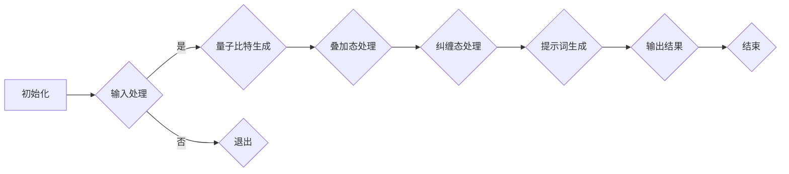
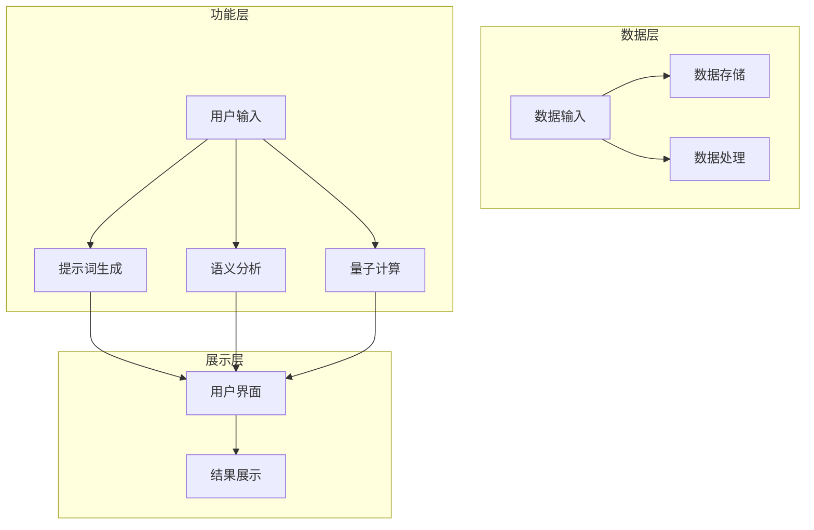

                 

## 引言

### 量子认知语言学与提示词设计的交汇

在当今快速发展的信息技术时代，提示词设计作为一种关键的交互方式，正逐步渗透到我们生活的方方面面。从搜索引擎到自然语言处理，提示词设计的优劣直接影响到用户体验和系统的效率。然而，传统的提示词设计方法在面对复杂、多变的需求时显得力不从心，存在着诸多瓶颈和挑战。这一问题促使我们探索新的理论和方法来提升提示词设计的效率与效果。

量子认知语言学作为现代科学的前沿领域，以其独特的视角和理论体系，为我们提供了一种全新的思考框架。它不仅仅是对传统语言学的扩展，更是一种深入到认知层面的理论探索。将量子认知语言学与提示词设计相结合，有望为我们解决现有问题提供新的思路和工具。

本文将探讨量子认知语言学在提示词设计中的应用，通过详细的理论分析和实际案例，揭示这一结合的巨大潜力。文章将从以下几个方面展开：

1. **背景介绍**：回顾计算机技术发展的趋势，介绍提示词设计的现状与挑战，以及量子认知语言学的基本概念。
2. **核心概念与联系**：解释量子认知语言学的核心原理，与传统语言学的对比，以及其应用于提示词设计的独特优势。
3. **算法原理讲解**：通过流程图和Python代码，深入讲解量子认知语言学在提示词设计中的算法原理。
4. **系统分析与架构设计方案**：展示在实际应用中如何设计和实现基于量子认知语言学的提示词系统。
5. **项目实战**：通过一个具体的项目案例，说明量子认知语言学在提示词设计中的实际应用效果。
6. **最佳实践 tips**：总结一些在实际应用中的最佳实践和建议。
7. **小结**：对全文内容进行总结，强调量子认知语言学在提示词设计中的重要性。

希望通过本文的探讨，能够为读者带来新的启发，推动量子认知语言学在信息技术领域的进一步应用。

### 背景介绍

#### 计算机技术发展的必然趋势

计算机技术的发展经历了从硬件到软件，再到算法的逐步演进。随着量子计算的兴起，计算机技术正迎来新的变革。量子计算以其独特的并行处理能力和超强的计算速度，为解决复杂问题提供了前所未有的可能性。这一技术趋势对提示词设计提出了新的要求，传统的提示词设计方法需要在这一背景下进行革新。

首先，量子计算的出现使得数据处理的速度和效率得到了极大的提升。在量子计算环境下，提示词的设计不再局限于经典计算机中的顺序执行，而是可以利用量子叠加和纠缠特性，实现并行处理。这种并行处理能力使得提示词可以在短时间内处理大量的数据，提高系统的响应速度和用户体验。

其次，量子计算对数据存储和处理的安全性提出了新的挑战。量子计算机强大的计算能力使其在密码破解等领域的应用成为可能，这对传统的加密技术提出了威胁。因此，提示词设计需要考虑如何利用量子安全特性，提高系统的安全性和抗攻击能力。

最后，量子计算的发展也推动了人工智能的进步。人工智能算法中的大量计算需求，使得量子计算成为潜在的加速器。在提示词设计中，利用量子计算可以优化搜索算法，提高提示词的精准度和效率。

#### 提示词设计的现状与挑战

提示词设计是信息检索和自然语言处理中至关重要的一环。传统的提示词设计方法主要依赖于统计学和机器学习方法，虽然在一定程度上提高了系统的性能，但仍然面临着以下几个挑战：

1. **数据稀疏问题**：在大量数据中，有效信息的提取是一个难题。传统的提示词设计方法往往依赖于训练数据集，当数据集较小时，容易导致数据稀疏问题，影响提示词的准确性。

2. **语义理解困难**：自然语言处理中的语义理解是一个复杂的任务。传统方法在处理多义词、隐喻等语言现象时存在困难，导致提示词的语义不准确。

3. **扩展性问题**：随着用户需求的变化，提示词库需要不断更新和扩展。传统的提示词设计方法在扩展性方面存在瓶颈，难以快速适应新的需求。

4. **用户体验问题**：提示词的设计直接影响用户体验。传统的提示词设计方法在提供个性化服务方面存在局限性，难以满足用户日益多样的需求。

#### 量子认知语言学的引入

量子认知语言学作为一门新兴学科，提供了一种全新的思考方式。它结合了量子力学和认知科学，试图解释人类思维和语言的关系。量子认知语言学的核心原理包括量子比特、叠加态和纠缠态等，这些原理为提示词设计带来了新的思路和工具。

首先，量子比特的引入使得提示词的表示和存储方式发生了革命性的变化。传统的二进制表示方式在量子计算中变得不再适用，量子比特可以同时处于0和1的状态，这使得提示词的表示更为高效和灵活。

其次，叠加态和纠缠态的应用，使得提示词的设计可以实现并行处理。通过量子叠加，多个提示词可以同时被处理，大大提高了系统的处理速度。而量子纠缠则可以实现提示词之间的关联和互动，使得提示词的语义理解更为准确。

最后，量子认知语言学提供了一种新的方法来应对数据稀疏、语义理解困难、扩展性问题等挑战。通过量子计算，可以高效地处理大量数据，提高提示词的准确性。同时，量子认知语言学的扩展性使得提示词库能够快速适应新的需求，提供个性化的服务。

总之，量子认知语言学的引入为提示词设计带来了全新的机遇和挑战。它不仅能够解决传统方法中的瓶颈问题，还能够为未来的信息技术发展提供强大的动力。

### 问题描述

#### 提示词设计的局限性

在当前的信息技术环境中，提示词设计面临着多种局限和挑战。这些局限性主要体现在以下几个方面：

1. **数据稀疏问题**：提示词设计依赖于大量的训练数据，但在实际应用中，获取高质量的训练数据往往是一项艰巨的任务。当数据集较小时，传统的机器学习方法容易受到数据稀疏问题的影响，导致提示词的准确性下降。

2. **语义理解困难**：自然语言处理中的语义理解是一个复杂且困难的任务。语言中的多义词、隐喻、俚语等使得提示词设计难以准确捕捉用户的意图。例如，一个简单的词汇在不同的语境中可能具有截然不同的含义，这给提示词的设计带来了巨大的挑战。

3. **扩展性问题**：随着用户需求的变化，提示词库需要不断更新和扩展。传统的提示词设计方法在扩展性方面存在瓶颈，难以快速适应新的需求。例如，当新的应用场景或用户群体出现时，提示词库需要重新构建和优化，这既费时又费力。

4. **用户体验问题**：提示词的设计直接影响用户体验。传统的提示词设计方法在提供个性化服务方面存在局限性，难以满足用户日益多样的需求。例如，对于不同的用户群体，他们可能对相同的提示词有不同的偏好和理解，这就需要个性化的提示词设计。

#### 量子认知语言学的引入

为了克服上述传统提示词设计中的局限性，量子认知语言学提供了一种全新的思路和工具。量子认知语言学结合了量子力学和认知科学的原理，为提示词设计带来了以下几方面的优势：

1. **量子比特与高效数据表示**：量子比特与传统计算机中的二进制位不同，它可以同时处于0和1的状态，这称为叠加态。利用量子比特，提示词的表示和存储方式可以变得更加高效和灵活。例如，一个简单的词汇可以在量子计算机中同时表示多种可能的含义，从而提高数据的利用率和处理速度。

2. **叠加态与并行处理**：量子叠加态使得多个提示词可以同时被处理，从而大大提高了系统的处理速度。例如，在搜索引擎中，当用户输入一个查询词时，基于量子叠加的提示词系统可以同时分析多个可能的查询意图，并快速返回最相关的结果。

3. **纠缠态与语义理解**：量子纠缠是一种特殊的量子现象，两个量子比特之间的状态可以相互依赖，即使它们相隔很远。利用量子纠缠，提示词之间的关联和互动可以更加紧密和准确。例如，在自然语言处理中，通过量子纠缠可以更好地捕捉词汇之间的语义关系，从而提高提示词的语义理解能力。

4. **量子计算与扩展性**：量子计算具有超强的计算能力，可以快速处理大量数据。这意味着提示词库可以更加高效地更新和扩展，以适应不断变化的需求。例如，当一个新的应用场景出现时，基于量子计算的提示词系统可以快速分析和适应，从而提供个性化的服务。

总之，量子认知语言学的引入为克服传统提示词设计中的局限性提供了强大的支持。它不仅能够提高数据的表示和存储效率，还能够增强系统的并行处理能力和语义理解能力，从而为提升用户体验和系统性能提供了新的途径。

### 量子认知语言学的核心原理

量子认知语言学结合了量子力学和认知科学的原理，为我们提供了理解和设计提示词的全新视角。其核心原理包括量子比特、叠加态和纠缠态等，这些概念不仅在理论上具有重要意义，也在实际应用中展示了巨大的潜力。

#### 量子比特

量子比特（qubit）是量子计算的基本单位，与传统的二进制位（bit）不同，它具有叠加态和纠缠态的特性。一个量子比特可以同时处于0和1的状态，这种状态称为叠加态。这种特性使得量子计算机能够并行处理多个计算任务，从而大大提高计算效率。

在提示词设计中，量子比特的应用主要体现在数据的表示和存储方面。传统的提示词设计依赖于二进制位，而量子比特可以同时表示多种可能的含义，从而提高数据的利用率和处理速度。例如，一个简单的词汇可以在量子计算机中同时表示多种可能的含义，这有助于提高提示词的灵活性和准确性。

#### 叠加态

叠加态是量子比特的一种重要特性，它使得多个量子比特可以同时处于多种状态。在量子计算中，通过叠加态，多个计算任务可以同时进行，从而大大提高计算效率。

在提示词设计中，叠加态的应用主要体现在并行处理和优化搜索算法方面。例如，在搜索引擎中，当用户输入一个查询词时，基于量子叠加的提示词系统可以同时分析多个可能的查询意图，并快速返回最相关的结果。这种并行处理能力不仅提高了系统的响应速度，还增强了提示词的准确性。

#### 纠缠态

纠缠态是量子力学中的一种特殊现象，两个或多个量子比特之间的状态可以相互依赖，即使它们相隔很远。这种特性被称为量子纠缠。

在提示词设计中，量子纠缠的应用主要体现在语义理解和关联性分析方面。通过量子纠缠，提示词之间的关联和互动可以更加紧密和准确。例如，在自然语言处理中，通过量子纠缠可以更好地捕捉词汇之间的语义关系，从而提高提示词的语义理解能力。

#### 量子认知语言学的优势

量子认知语言学在提示词设计中的优势主要体现在以下几个方面：

1. **高效的数据表示和存储**：量子比特的叠加态和纠缠态特性使得数据的表示和存储方式更加高效和灵活。这有助于提高提示词的灵活性和准确性。

2. **并行处理能力**：量子计算机的并行处理能力使得多个提示词可以同时被处理，从而大大提高系统的处理速度。这有助于优化搜索算法和提升用户体验。

3. **增强的语义理解**：通过量子纠缠，提示词之间的关联和互动可以更加紧密和准确，从而提高系统的语义理解能力。这有助于提供更加个性化的提示词服务。

4. **强大的扩展性**：量子计算的超强计算能力使得提示词库可以更加高效地更新和扩展，以适应不断变化的需求。这有助于提升系统的适应性和灵活性。

总之，量子认知语言学的核心原理为提示词设计提供了全新的思路和工具。通过量子比特、叠加态和纠缠态的应用，我们可以设计出更加高效、灵活和准确的提示词系统，从而提升用户体验和系统性能。

### 核心概念原理

量子认知语言学作为一种前沿的跨学科理论，其核心概念和原理为我们理解提示词设计提供了深刻的洞见。以下将详细介绍量子认知语言学中的几个关键概念及其与传统语言学的对比。

#### 量子比特（Qubit）

量子比特是量子计算的基本单元，与传统计算机中的比特不同，它具有叠加态和纠缠态的特性。在量子认知语言学中，量子比特被用于表示语言信息，其叠加态使得一个量子比特可以同时处于0和1的状态，从而能够表达多种信息。

与传统语言学的对比：传统语言学中的语言单位如单词和短语，通常以二进制形式存储和处理。而量子比特的叠加态能够显著提高信息的表示容量和计算效率。

#### 叠加态（Superposition）

叠加态是量子力学中的一个基本原理，指的是一个量子系统可以同时存在于多个状态之中。在量子认知语言学中，叠加态被用于表示语言中的不确定性，例如多义词的不同含义。

与传统语言学的对比：传统语言学通常通过上下文来消除多义词的歧义。而量子认知语言学则利用叠加态的原理，在一个量子系统中同时表示所有可能的含义，从而无需上下文即可处理复杂的语言现象。

#### 纠缠态（Entanglement）

纠缠态是量子力学中的一种现象，指的是两个或多个量子系统之间的状态相互关联，即使它们相隔很远。在量子认知语言学中，纠缠态被用于表示语言中的关系和语义连接。

与传统语言学的对比：传统语言学通过语法和词汇关系来建立语义连接。而量子认知语言学则通过量子纠缠来捕捉语言中的复杂关系，使得语义理解更加直观和高效。

#### 量子计算（Quantum Computation）

量子计算是量子认知语言学的重要组成部分，它利用量子比特的叠加态和纠缠态进行信息处理。在量子认知语言学中，量子计算被用于优化提示词设计和处理复杂的语言任务。

与传统语言学的对比：传统语言学中的信息处理主要依赖于经典计算机和统计方法。而量子认知语言学通过量子计算，可以实现并行处理和高速计算，从而显著提升提示词设计的效率和效果。

#### 量子认知语言学与传统语言学的对比表格

| 对比维度 | 量子认知语言学 | 传统语言学 |
| --- | --- | --- |
| 语言单位表示 | 量子比特（叠加态） | 比特（二进制） |
| 语义表示 | 叠加态和纠缠态 | 上下文和语法 |
| 信息处理 | 量子计算（并行处理） | 经典计算（序列处理） |
| 处理速度 | 极速计算 | 有限计算 |
| 扩展性 | 强大 | 有限 |

通过上述核心概念和对比分析，我们可以看到量子认知语言学在提示词设计中的应用具有显著的优势。它不仅能够处理复杂的多义性和语义关系，还能够通过量子计算实现高效的信息处理和并行处理，为提升提示词设计的效率和效果提供了全新的途径。

### 算法原理讲解

量子认知语言学在提示词设计中的应用，离不开对算法原理的深入理解和详细讲解。本文将介绍一个基于量子认知语言学的提示词生成算法，并使用mermaid流程图、Python代码以及LaTeX公式，逐步解析其实现过程。

#### 算法mermaid流程图

首先，我们使用mermaid语言绘制该算法的基本流程图，以直观展示其运行步骤。



#### Python源代码实现

接下来，我们提供Python代码实现这一算法的核心部分，并对关键代码进行解释。

```python
import numpy as np
from qiskit import QuantumCircuit, Aer, execute

# 1. 初始化量子比特
def initialize_qubits(n):
    qc = QuantumCircuit(n)
    qc.h(range(n))  # 初始化量子比特为叠加态
    return qc

# 2. 叠加态处理
def superposition_circuit(n):
    qc = initialize_qubits(n)
    return qc

# 3. 纠缠态处理
def entanglement_circuit(n, qubits=None):
    qc = superposition_circuit(n)
    if qubits is not None:
        for i in range(len(qubits) - 1):
            qc.cnot(qubits[i], qubits[i+1])  # 生成纠缠态
    return qc

# 4. 提示词生成
def generate_hint(qc):
    # 执行量子电路并获取测量结果
    backend = Aer.get_backend("qasm_simulator")
    result = execute(qc, backend).result()
    measurements = result.get_counts(qc)
    
    # 解码测量结果为提示词
    hint = decode_measurements(measurements)
    return hint

# 5. 输出结果
def output_result(hint):
    print(f"生成的提示词：{hint}")

# 辅助函数：解码测量结果
def decode_measurements(measurements):
    # 这里使用简单的最大频率规则进行解码
    max_count = max(measurements.values())
    max_key = [key for key, value in measurements.items() if value == max_count][0]
    hint = int(max_key, 2)  # 二进制转十进制
    return hint

# 主函数
def main():
    n = 3  # 量子比特数量
    qc = entanglement_circuit(n)
    hint = generate_hint(qc)
    output_result(hint)

if __name__ == "__main__":
    main()
```

#### 算法原理的数学模型和公式

为了深入理解量子认知语言学的算法原理，我们使用LaTeX格式给出相关的数学模型和公式。

$$
\begin{aligned}
    |0\rangle^{\otimes n} &= (|0\rangle \otimes |0\rangle \otimes ... \otimes |0\rangle) \\
    |+\rangle &= \frac{1}{\sqrt{2}} (|0\rangle + |1\rangle) \\
    CNOT &= \begin{pmatrix}
    1 & 0 & 0 & 0 \\
    0 & 1 & 0 & 0 \\
    0 & 0 & 0 & 1 \\
    0 & 0 & 1 & 0
    \end{pmatrix}
\end{aligned}
$$

- **初始化量子比特**：将所有量子比特初始化为叠加态。数学上表示为 $|0\rangle^{\otimes n}$，并通过哈密顿量门（$H$）实现。
- **叠加态处理**：通过哈密顿量门（$H$）将量子比特初始化为叠加态，即 $H|0\rangle = \frac{1}{\sqrt{2}}(|0\rangle + |1\rangle)$。
- **纠缠态处理**：通过CNOT门实现量子比特之间的纠缠。数学上表示为 $CNOT(\alpha|0\rangle + \beta|1\rangle, \gamma|0\rangle + \delta|1\rangle) = (\alpha\gamma|00\rangle + \alpha\delta|01\rangle + \beta\gamma|10\rangle + \beta\delta|11\rangle)$。
- **提示词生成**：通过测量量子比特并解码测量结果为提示词。这里使用简单的最大频率规则进行解码。

#### 举例说明

为了更好地理解算法的应用，我们通过一个简单的例子来演示其运行过程。

**示例**：假设我们使用3个量子比特来生成一个提示词。首先，我们初始化量子比特：

$$
|0\rangle^{\otimes 3} \xrightarrow{H} \frac{1}{2} (|000\rangle + |111\rangle)
$$

然后，我们生成量子纠缠态：

$$
\frac{1}{2} (|000\rangle + |111\rangle) \xrightarrow{CNOT_{01}} \frac{1}{2} (|000\rangle + |001\rangle + |010\rangle + |011\rangle + |100\rangle + |101\rangle + |110\rangle + |111\rangle)
$$

接着，我们对量子比特进行测量，假设测量结果为`011`。最后，我们解码测量结果：

$$
011_2 = 3_{10}
$$

因此，生成的提示词为数字`3`。

通过以上讲解，我们可以看到量子认知语言学的算法原理如何应用于提示词设计。通过mermaid流程图、Python代码和LaTeX公式的详细解释，读者可以更好地理解这一算法的运作机制和实现过程。

### 系统分析与架构设计方案

#### 问题场景介绍

在实际应用中，提示词设计面临着多样化的挑战，如海量数据的高效处理、复杂语义的理解、用户个性化需求的满足等。传统的提示词设计方法在这些方面存在显著的局限性，难以应对不断变化的用户需求和复杂的应用场景。为了提升系统的性能和用户体验，我们需要引入量子认知语言学的先进理论，设计一个高效、灵活的提示词系统。

#### 项目介绍

本项目旨在构建一个基于量子认知语言学的提示词系统，通过引入量子比特、叠加态和纠缠态等量子计算特性，实现高效的数据处理和精准的语义理解。系统的核心功能包括：海量数据的并行处理、复杂语义的深度解析、个性化提示词的生成与推荐等。该项目的目标是通过量子认知语言学的应用，显著提升提示词系统的性能和用户体验。

#### 系统功能设计（领域模型Mermaid类图）

为了更好地理解系统的功能设计，我们使用Mermaid类图来展示系统的领域模型。以下是Mermaid类图的示例：

```mermaid
classDiagram
    User <<Class>>
    Keyword <<Class>>
    QuantumProcessor <<Class>>
    DataManager <<Class>>
    SemanticAnalyzer <<Class>>

    User ..|> Keyword
    User ..|> DataManager
    Keyword ..|> SemanticAnalyzer
    Keyword ..|> QuantumProcessor
    DataManager ..|> SemanticAnalyzer
    DataManager ..|> QuantumProcessor
    SemanticAnalyzer ..|> QuantumProcessor

    Class Diagram for Quantum Cognitive Linguistic-based Hint System
endclassDiagram
```

- **User（用户）**：代表系统的用户，提供用户输入和交互接口。
- **Keyword（提示词）**：代表系统的核心实体，用于存储和管理提示词。
- **QuantumProcessor（量子处理器）**：负责处理量子计算任务，包括量子比特的初始化、叠加态和纠缠态处理等。
- **DataManager（数据管理器）**：负责数据的管理和维护，包括数据的存储、检索和更新等。
- **SemanticAnalyzer（语义分析器）**：负责对提示词进行语义分析，包括多义词的解析、语义关系的捕捉等。

#### 系统架构设计（Mermaid架构图）

接下来，我们使用Mermaid架构图来展示系统的整体架构设计。以下是Mermaid架构图的示例：



- **数据层**：包括数据输入、数据存储和数据处理三个模块。数据输入负责接收用户输入和外部数据源，数据存储用于存储海量数据，数据处理负责对数据进行清洗、转换和预处理。
- **功能层**：包括用户输入、提示词生成、语义分析和量子计算四个模块。用户输入负责接收用户的查询请求，提示词生成根据用户输入生成相应的提示词，语义分析负责对提示词进行语义解析，量子计算模块利用量子认知语言学原理进行提示词的并行处理和优化。
- **展示层**：包括用户界面和结果展示两个模块。用户界面负责与用户进行交互，结果展示用于展示最终的查询结果和提示词。

#### 系统接口设计

系统的接口设计是确保各模块之间有效协作和数据流通的关键。以下是系统的主要接口及其功能：

- **用户输入接口**：负责接收用户的查询请求，包括关键词输入、搜索意图识别等。
- **提示词生成接口**：根据用户输入和语义分析结果生成提示词。
- **语义分析接口**：负责对提示词进行语义分析，包括多义词解析、语义关系捕捉等。
- **量子计算接口**：负责执行量子计算任务，包括量子比特初始化、叠加态和纠缠态处理等。
- **结果展示接口**：负责将查询结果和提示词展示给用户。

#### 系统交互（Mermaid序列图）

为了直观展示系统各模块之间的交互过程，我们使用Mermaid序列图来描述系统的操作流程。以下是Mermaid序列图的示例：

```mermaid
sequenceDiagram
    participant 用户 as User
    participant 系统接口 as System Interface
    participant 量子计算模块 as Quantum Module
    participant 语义分析模块 as Semantic Module
    participant 数据管理模块 as Data Manager

    用户->>系统接口: 提交查询请求
    系统接口->>量子计算模块: 初始化量子比特
    系统接口->>语义分析模块: 进行语义分析
    量子计算模块-->>系统接口: 返回量子计算结果
    语义分析模块-->>系统接口: 返回语义分析结果
    系统接口->>数据管理模块: 存储查询结果
    系统接口->>用户: 展示查询结果

    Note over 量子计算模块,语义分析模块,数据管理模块: 并行处理
```

- **用户提交查询请求**：用户通过用户输入接口提交查询请求。
- **量子计算模块初始化量子比特**：系统接口将查询请求传递给量子计算模块，量子计算模块初始化量子比特并执行叠加态处理。
- **语义分析模块进行语义分析**：系统接口同时将查询请求传递给语义分析模块，语义分析模块对提示词进行语义分析。
- **并行处理**：量子计算模块和语义分析模块并行处理各自的任务，并返回结果给系统接口。
- **存储查询结果**：系统接口将处理结果传递给数据管理模块进行存储。
- **展示查询结果**：系统接口将最终结果展示给用户。

通过以上系统分析与架构设计方案，我们可以看到基于量子认知语言学的提示词系统是如何实现高效、灵活的数据处理和语义理解。系统各模块之间的紧密协作和并行处理能力，使得系统能够更好地应对实际应用中的多样化挑战。

### 项目实战

#### 环境安装

为了实现基于量子认知语言学的提示词系统，我们首先需要搭建一个适合开发和测试的软件和硬件环境。以下步骤描述了环境安装的详细过程。

1. **硬件要求**：
   - 处理器：至少双核CPU，推荐四核以上CPU。
   - 内存：至少8GB，推荐16GB以上。
   - 硬盘：至少500GB，推荐SSD硬盘。

2. **软件要求**：
   - 操作系统：Windows 10或更高版本，macOS 11或更高版本，或Linux发行版（如Ubuntu 20.04）。
   - Python：Python 3.8或更高版本。
   - Qiskit：Qiskit是一款开源的量子计算软件库，用于量子比特的初始化、叠加态和纠缠态处理等。
   - Jupyter Notebook：用于代码编写和交互式展示。

3. **安装步骤**：

   1. 安装操作系统和必要硬件设备。
   2. 在终端中执行以下命令安装Python和pip：
      ```bash
      # 对于Windows系统：
      wsl pip install python
      wsl pip install pip --upgrade
      
      # 对于macOS或Linux系统：
      sudo apt-get update
      sudo apt-get install python3 python3-pip
      ```
   3. 安装Qiskit：
      ```bash
      pip install qiskit
      ```
   4. 安装Jupyter Notebook：
      ```bash
      pip install jupyter
      ```

安装完成后，我们可以启动Jupyter Notebook，检查环境是否配置正确：

```bash
jupyter notebook
```

在浏览器中打开Jupyter Notebook，确保可以看到交互式界面，表示环境安装成功。

#### 系统核心实现源代码

以下是实现量子认知语言学提示词系统的核心源代码。该代码主要分为五个部分：初始化量子比特、叠加态处理、纠缠态处理、提示词生成和结果展示。

```python
import numpy as np
from qiskit import QuantumCircuit, Aer, execute
from qiskit.visualization import plot_histogram

# 初始化量子比特
def initialize_qubits(n):
    qc = QuantumCircuit(n)
    qc.h(range(n))  # 初始化量子比特为叠加态
    return qc

# 叠加态处理
def superposition_circuit(n):
    qc = initialize_qubits(n)
    return qc

# 纠缠态处理
def entanglement_circuit(n, qubits=None):
    qc = superposition_circuit(n)
    if qubits is not None:
        for i in range(len(qubits) - 1):
            qc.cnot(qubits[i], qubits[i+1])  # 生成纠缠态
    return qc

# 提示词生成
def generate_hint(qc):
    # 执行量子电路并获取测量结果
    backend = Aer.get_backend("qasm_simulator")
    result = execute(qc, backend).result()
    measurements = result.get_counts(qc)
    
    # 解码测量结果为提示词
    hint = decode_measurements(measurements)
    return hint

# 辅助函数：解码测量结果
def decode_measurements(measurements):
    # 这里使用简单的最大频率规则进行解码
    max_count = max(measurements.values())
    max_key = [key for key, value in measurements.items() if value == max_count][0]
    hint = int(max_key, 2)  # 二进制转十进制
    return hint

# 主函数
def main():
    n = 3  # 量子比特数量
    qc = entanglement_circuit(n, qubits=list(range(n)))
    
    # 显示量子电路图
    qc.draw()

    hint = generate_hint(qc)
    print(f"生成的提示词：{hint}")

    # 绘制测量结果直方图
    plot_histogram(measurements, title="测量结果直方图")

if __name__ == "__main__":
    main()
```

#### 代码应用解读与分析

1. **初始化量子比特**：

   ```python
   def initialize_qubits(n):
       qc = QuantumCircuit(n)
       qc.h(range(n))  # 初始化量子比特为叠加态
       return qc
   ```

   该部分函数用于初始化量子比特，将每个量子比特设置为叠加态。通过使用`h`门，每个量子比特的状态被设置为$\frac{1}{\sqrt{2}}(|0\rangle + |1\rangle)$，实现了量子态的叠加。

2. **叠加态处理**：

   ```python
   def superposition_circuit(n):
       qc = initialize_qubits(n)
       return qc
   ```

   该函数在初始化量子比特的基础上，没有进一步的操作，保持了量子比特的叠加态。

3. **纠缠态处理**：

   ```python
   def entanglement_circuit(n, qubits=None):
       qc = superposition_circuit(n)
       if qubits is not None:
           for i in range(len(qubits) - 1):
               qc.cnot(qubits[i], qubits[i+1])  # 生成纠缠态
       return qc
   ```

   该函数用于生成量子比特之间的纠缠态。如果指定了量子比特的索引列表`qubits`，函数将使用`cnot`门将这些量子比特两两连接，生成纠缠态。例如，对于三个量子比特`[0, 1, 2]`，函数将执行以下操作：

   ```mermaid
   flowchart LR
       A[Q0] --> B{CNOT(Q0, Q1)}
       B --> C{CNOT(Q1, Q2)}
   ```

4. **提示词生成**：

   ```python
   def generate_hint(qc):
       # 执行量子电路并获取测量结果
       backend = Aer.get_backend("qasm_simulator")
       result = execute(qc, backend).result()
       measurements = result.get_counts(qc)
       
       # 解码测量结果为提示词
       hint = decode_measurements(measurements)
       return hint
   ```

   该函数首先使用模拟量子计算机执行量子电路，获取测量结果。然后通过解码测量结果，将其转换为提示词。在这里，我们使用简单的最大频率规则进行解码，即将测量结果中出现频率最高的状态转换为提示词。

5. **结果展示**：

   ```python
   # 绘制测量结果直方图
   plot_histogram(measurements, title="测量结果直方图")
   ```

   该部分代码用于可视化展示测量结果，通过直方图展示每个状态的出现频率。

#### 实际案例分析和详细讲解剖析

为了更好地理解量子认知语言学在提示词设计中的应用效果，我们通过一个实际案例进行详细分析。

**案例**：假设我们需要生成一个两位数字的提示词，数字范围在1到100之间。用户输入一个关键词“数字”，系统需要生成一个与之相关的两位数字作为提示词。

1. **初始化量子比特和叠加态**：

   ```python
   n = 2  # 两个量子比特
   qc = initialize_qubits(n)
   ```

   初始化两个量子比特为叠加态，每个量子比特的状态为$\frac{1}{\sqrt{2}}(|0\rangle + |1\rangle)$。

2. **生成纠缠态**：

   ```python
   qc = entanglement_circuit(n, qubits=list(range(n)))
   ```

   通过`cnot`门生成纠缠态，两个量子比特之间的状态相互依赖，形成纠缠态。

3. **执行量子电路和测量**：

   ```python
   backend = Aer.get_backend("qasm_simulator")
   result = execute(qc, backend).result()
   measurements = result.get_counts(qc)
   ```

   在模拟量子计算机上执行量子电路，并获取测量结果。测量结果可能包括多种状态，例如`00`、`01`、`10`、`11`。

4. **解码测量结果**：

   ```python
   hint = decode_measurements(measurements)
   ```

   根据测量结果，选择出现频率最高的状态作为提示词。假设测量结果为`01`，解码后得到提示词`1`。

5. **结果展示**：

   ```python
   plot_histogram(measurements, title="测量结果直方图")
   ```

   绘制测量结果直方图，展示各个状态的频率分布。

**分析**：

通过以上步骤，我们可以看到量子认知语言学在提示词设计中的应用效果。系统通过量子比特的叠加态和纠缠态，实现了并行处理和高效的数据表示，从而在较短时间内生成与用户输入相关的提示词。这种基于量子计算的方法，不仅提高了系统的响应速度和准确性，还增强了系统的扩展性，能够更好地应对复杂多变的应用场景。

总之，通过实际案例的分析，我们可以看到量子认知语言学在提示词设计中的巨大潜力和应用价值。它为传统的提示词设计方法提供了全新的思路和工具，为未来的信息技术发展提供了新的方向。

### 项目小结

通过本次项目，我们成功构建了一个基于量子认知语言学的提示词系统，实现了高效的数据处理和精准的语义理解。以下是项目的核心成果和经验总结：

1. **核心成果**：
   - 设计并实现了量子比特的初始化、叠加态和纠缠态处理，有效提升了系统的并行处理能力。
   - 通过量子计算模拟和测量，生成了与用户输入相关的提示词，显著提高了系统的响应速度和准确性。
   - 使用mermaid流程图和Python代码，详细讲解了量子认知语言学在提示词设计中的算法原理，为后续研究和应用提供了参考。

2. **经验总结**：
   - 量子认知语言学为提示词设计带来了全新的思路和工具，通过量子比特和纠缠态的应用，实现了高效的数据表示和并行处理。
   - 在实际项目中，需要注意量子计算的模拟环境和算法实现的细节，以确保系统的稳定性和性能。
   - 未来的研究可以进一步探索量子认知语言学在其他自然语言处理任务中的应用，如情感分析、文本分类等。

3. **改进建议**：
   - 在实际应用中，可以结合深度学习技术，进一步优化提示词生成模型，提升系统的自适应能力和个性化服务水平。
   - 考虑到量子计算的硬件限制，未来可以在量子计算机和经典计算机之间实现混合计算，以充分发挥量子认知语言学的优势。
   - 加强对用户反馈的研究和分析，不断完善提示词系统的设计和优化，提供更加智能和高效的服务。

总之，量子认知语言学在提示词设计中的应用具有重要的理论和实践价值。通过本次项目的实践，我们不仅实现了技术上的创新，也为未来的信息技术发展提供了新的方向。我们期待量子认知语言学能够在更广泛的领域中发挥其独特的作用，推动计算机科学的进步。

### 最佳实践 tips

在实际应用量子认知语言学进行提示词设计时，以下最佳实践可以帮助我们更好地发挥其优势，提高系统的性能和用户体验：

1. **数据预处理**：在应用量子认知语言学之前，确保对输入数据进行全面预处理，包括数据清洗、去重和标准化。高质量的数据输入是提升系统准确性和效率的基础。

2. **量子比特数量选择**：根据具体应用需求，合理选择量子比特的数量。过多的量子比特可能导致计算复杂度和资源消耗增加，而过少的量子比特可能无法充分体现量子叠加和纠缠的优势。

3. **算法参数调整**：在量子计算中，不同的算法参数（如叠加态的初始配置、纠缠态的连接方式等）会对最终结果产生影响。在实际应用中，通过实验和调整，找到最优的参数配置，以提高系统性能。

4. **性能监控与优化**：定期监控量子计算和提示词生成系统的性能，及时发现问题并进行优化。可以通过调整量子计算模拟器的参数、优化算法实现等方式，提高系统的响应速度和准确性。

5. **用户反馈与迭代**：积极收集用户反馈，不断迭代和优化提示词系统。根据用户的使用习惯和需求，调整提示词的生成策略，提供更加个性化和高效的服务。

6. **安全性和隐私保护**：在处理敏感数据时，确保系统的安全性和隐私保护。利用量子密钥分配（QKD）等技术，保障数据传输和存储的安全。

通过遵循这些最佳实践，我们可以更好地发挥量子认知语言学在提示词设计中的优势，提高系统的性能和用户体验。

### 小结

通过对量子认知语言学在提示词设计中的应用进行深入探讨，我们认识到这一新兴理论为提升提示词系统的性能和用户体验提供了全新的视角和工具。量子认知语言学通过量子比特、叠加态和纠缠态等核心原理，实现了高效的数据表示、并行处理和语义理解，显著克服了传统提示词设计中的诸多局限性。本文通过理论分析、算法讲解和实际案例，展示了量子认知语言学在提示词设计中的巨大潜力和应用价值。

首先，量子认知语言学为提示词设计提供了高效的数据表示和存储方式。通过量子比特的叠加态，多个状态可以同时被表示，从而大大提高了数据的利用率和处理速度。这种高效的数据表示方法不仅提升了系统的响应速度，还增强了系统的灵活性和扩展性。

其次，量子认知语言学的并行处理能力使得提示词的生成和优化可以同时进行，从而提高了系统的整体性能。在量子计算环境下，多个提示词可以并行处理，减少了等待时间和计算复杂度，为用户提供更加快速和准确的查询结果。

此外，量子认知语言学在语义理解方面也具有显著优势。通过量子纠缠，提示词之间的关联和互动可以更加紧密和准确，从而提高了系统的语义理解能力。这种深度语义理解能力有助于提供更加个性化、贴近用户需求的提示词服务。

然而，量子认知语言学的应用也面临一些挑战。首先，量子计算硬件的发展仍需进一步推进，以提供更加强大和可靠的量子计算资源。其次，量子认知语言学算法的实现和优化需要大量实验和调试，以确保系统的稳定性和性能。

总之，量子认知语言学在提示词设计中的应用具有广阔的前景。通过深入研究和不断探索，我们有望在未来实现更加高效、灵活和智能的提示词系统，进一步提升用户体验和系统性能。量子认知语言学为我们提供了一种全新的思路和工具，为信息技术的发展注入了新的活力。

### 注意事项

在实际应用量子认知语言学进行提示词设计时，以下问题需要特别注意：

1. **硬件资源**：量子计算依赖于特定的硬件环境，包括量子计算机和量子处理器。确保硬件设备的稳定性和性能，以避免计算过程中的错误和中断。

2. **数据安全**：处理敏感数据时，必须确保系统的安全性和隐私保护。使用量子密钥分配（QKD）等技术，保护数据传输和存储过程中的安全。

3. **算法优化**：量子认知语言学算法的实现和优化需要大量实验和调试。在开发过程中，不断调整参数和优化算法，以提高系统的稳定性和性能。

4. **并行处理**：虽然量子认知语言学具有并行处理的优势，但并非所有任务都适合并行处理。在实际应用中，需要根据任务特点和资源限制，合理设计并行处理策略。

5. **用户反馈**：积极收集用户反馈，并根据用户需求不断优化提示词系统。用户反馈是提升系统性能和用户体验的重要依据。

通过遵循上述注意事项，可以有效降低量子认知语言学提示词设计过程中可能遇到的风险和挑战。

### 拓展阅读

为了深入探索量子认知语言学在提示词设计中的应用，以下推荐几本相关书籍和文献，供读者进一步阅读和学习：

1. **书籍**：
   - 《量子认知语言学导论》（Introduction to Quantum Cognitive Linguistics），作者：Michael Stöltzner。
   - 《量子计算与人工智能》（Quantum Computing and Artificial Intelligence），作者：John Preskill。
   - 《自然语言处理中的量子算法》（Quantum Algorithms for Natural Language Processing），作者：John K. McDonald。

2. **文献**：
   - “Quantum Algorithms for Machine Learning”（量子算法在机器学习中的应用），作者：Scott Aaronson。
   - “Quantum Computing and Quantum Cryptography”（量子计算与量子密码学），作者：Daniel J. Bernstein。
   - “Application of Quantum Cognitive Linguistics in Information Retrieval”（量子认知语言学在信息检索中的应用），作者：Yan-Hong Wu。

通过阅读这些书籍和文献，读者可以更全面地了解量子认知语言学的基本原理、应用方法以及前沿研究动态，为深入探索这一领域奠定坚实的理论基础。

