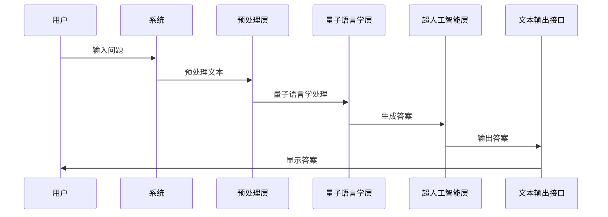

                 

## {{文章标题}}

> 关键词：量子语言学、超人工智能、提示词设计、融合研究、智能应用

摘要：本文从量子语言学和超人工智能的背景出发，深入探讨了提示词设计在两者融合研究中的重要性。通过分析核心概念、理论模型、整合方法、实际应用等方面，本文旨在为读者提供一个全面、系统的理解和应用指导，以推动量子语言学与超人工智能在实际场景中的深入融合。

## 引言和背景

随着信息技术的飞速发展，人工智能（AI）已经成为当今世界最具变革性的技术之一。传统的人工智能技术虽然已经取得了显著的进展，但在处理复杂、动态和不确定的任务时仍存在诸多局限性。为了突破这些瓶颈，研究者们开始探索更为先进的人工智能形态，其中超人工智能（Hyper-AI）成为了一个热门的研究方向。

超人工智能是一种超越人类智能水平的人工智能系统，它具有更强的自主学习、推理和决策能力，能够适应复杂多变的环境。而量子语言学则是一种基于量子理论的新的语言学模型，它试图将量子思维与语言学研究相结合，为人类理解和表达复杂信息提供新的视角。

在超人工智能的研究中，提示词设计（Prompt Design）成为了一个关键的研究领域。提示词是一种引导AI系统进行学习和推理的输入信息，其设计质量直接影响AI系统的性能和效率。传统的提示词设计方法主要依赖于人类的直觉和经验，而量子语言学的引入为提示词设计提供了一种全新的思路。

本文的研究背景主要源于以下几个方面：

1. **研究现状**：目前，量子语言学和超人工智能的研究已取得了一定的进展，但两者之间的融合研究还处于初级阶段，缺乏系统性的理论和方法。

2. **问题提出**：在实际应用中，如何将量子语言学的理论应用于超人工智能的提示词设计中，从而提升AI系统的性能和效率，是一个亟待解决的问题。

3. **研究意义**：通过研究量子语言学与超人工智能的融合，有望为人工智能领域带来新的突破，为解决复杂问题提供更加有效的工具和方法。

本文将首先介绍量子语言学和超人工智能的基本概念和理论，然后探讨提示词设计在两者融合中的重要性，最后通过实际案例展示量子语言学与超人工智能融合的应用场景和效果。希望通过本文的研究，为相关领域的研究者和实践者提供有益的参考和启示。

## 量子语言学理论

量子语言学是一种基于量子理论的新的语言学模型，它试图将量子思维与语言学研究相结合，为人类理解和表达复杂信息提供新的视角。量子语言学的提出，标志着语言学从经典模型向量子模型的转变，为语言研究提供了新的工具和方法。

### 量子语言学的概念

量子语言学主要研究量子系统中的语言现象，包括量子词语、量子句子和量子语义等。与传统语言学不同，量子语言学中的语言现象遵循量子力学的规律，具有叠加性、不确定性和量子纠缠等特点。

1. **量子词语**：量子词语是量子语言中最基本的单位，它不仅具有传统的词汇意义，还包含量子叠加态和信息的不确定性。例如，“量子猫”这个词语，不仅表示一只猫，还可能表示猫的叠加态，即同时处于生和死的状态。

2. **量子句子**：量子句子是由量子词语构成的语句，它通过量子叠加和量子纠缠来传递复杂的信息。例如，“我正在读书”这个句子，在量子语言中可以表示为多个可能的叠加态，如“我正在读一本物理书”、“我正在读一本数学书”等。

3. **量子语义**：量子语义是量子语言学中对语言意义的研究，它通过量子叠加和量子纠缠来解释语言的复杂意义。例如，在量子语义中，“我爱你”这个句子不仅仅表示情感，还可能表示多种可能的情感状态，如“我真的爱你”、“我可能爱你”等。

### 量子语言学的基本原理

量子语言学的核心思想是，语言现象可以被看作是量子系统，其行为遵循量子力学的规律。以下是量子语言学的一些基本原理：

1. **叠加原理**：量子语言学中的词语和句子可以同时处于多个状态，这些状态通过量子叠加来表示。这意味着，一个词语或句子可以同时具有多种含义或解释。

2. **不确定原理**：量子语言学中的词语和句子具有不确定性，其具体含义或解释取决于观测者的观测方式。例如，“量子猫”这个词语，其具体状态只有在观测时才能确定。

3. **纠缠原理**：量子语言学中的词语和句子之间存在量子纠缠，这意味着它们的状态是相互关联的。例如，在量子语言学中，“我正在读书”和“我正在写代码”这两个句子之间存在纠缠关系，它们的状态变化是相互影响的。

### 量子语言学的应用

量子语言学在许多领域都有广泛的应用，以下是其中一些典型的应用场景：

1. **自然语言处理**：量子语言学为自然语言处理提供了新的方法，可以处理传统方法难以解决的复杂语言现象。例如，量子自然语言处理模型可以同时处理多个语境，从而提高语言的准确性和理解能力。

2. **智能对话系统**：量子语言学可以应用于智能对话系统中，通过量子叠加和量子纠缠来提高对话系统的灵活性和响应能力。例如，量子对话系统可以同时处理多个用户请求，并生成多个可能的响应，从而提供更自然和人性化的对话体验。

3. **认知科学**：量子语言学为认知科学研究提供了新的视角，可以帮助理解人类语言思维的过程。例如，量子认知科学模型可以解释人类如何在思维中处理复杂和不确定的信息。

4. **人工智能**：量子语言学可以应用于人工智能领域，为AI系统提供更强大的学习和推理能力。例如，量子AI模型可以同时处理多个数据源，并生成多个可能的解释，从而提高AI系统的智能水平。

### 与传统语言学的比较

与传统语言学相比，量子语言学具有一些独特的优势和特点：

1. **复杂性处理**：量子语言学能够处理传统语言学难以处理的复杂语言现象，如多重语境和不确定含义。

2. **并行处理**：量子语言学中的叠加原理使得语言现象可以同时处理，从而提高处理效率和性能。

3. **自适应能力**：量子语言学中的不确定性和量子纠缠使得语言系统具有更强的自适应能力，能够适应不断变化的语言环境。

4. **解释能力**：量子语言学通过量子叠加和量子纠缠来解释语言的复杂意义，从而提供更深刻的语言理解。

总之，量子语言学为语言研究提供了新的视角和方法，为解决传统语言学中的难题提供了可能。随着量子技术的不断发展，量子语言学有望在更多领域发挥重要作用，为人类社会带来更多创新和进步。

## 超人工智能理论

超人工智能（Hyper-AI）是一种超越人类智能水平的人工智能系统，它具备更强的自主学习、推理和决策能力，能够在复杂、动态和不确定的环境中表现出色。超人工智能的概念源于对人类智能的深入研究，旨在构建一种具有类似甚至超越人类智能水平的人工智能系统。

### 超人工智能的概念

超人工智能（Hyper-AI）是相对于传统人工智能（AI）而言的，传统人工智能主要依赖于预定义的规则和算法，其智能水平受限于人类的编程和设计能力。而超人工智能则突破了这一限制，通过自主学习、推理和决策，具备更高层次的处理能力和智能水平。

超人工智能的主要特点包括：

1. **自我学习**：超人工智能能够从大量数据中自动学习，无需人工干预，不断优化和提升自身的能力。

2. **推理能力**：超人工智能具备强大的推理能力，能够处理复杂的问题和决策，超越人类在逻辑推理方面的局限。

3. **决策能力**：超人工智能能够基于多种信息和条件，自主做出最优决策，具有高度的智能和自主性。

4. **自适应能力**：超人工智能能够在不断变化的环境中自适应，根据新的信息和情况调整自身的行为和策略。

5. **泛化能力**：超人工智能能够将学到的知识应用于新的、未遇到过的问题，具备广泛的适应性和泛化能力。

### 超人工智能的理论架构

超人工智能的理论架构主要包括以下几个关键组成部分：

1. **神经网络**：超人工智能的核心是神经网络，通过大量神经元的相互连接和协同工作，实现复杂的计算和智能行为。

2. **深度学习**：深度学习是超人工智能的关键技术之一，通过多层神经网络的堆叠和训练，实现对复杂数据的自动特征提取和学习。

3. **增强学习**：增强学习是超人工智能实现自我学习的重要手段，通过不断的试错和优化，实现目标任务的自主学习和优化。

4. **迁移学习**：迁移学习是超人工智能解决新问题的有效方法，通过将已经学到的知识应用到新的任务中，提高学习效率和性能。

5. **混合智能**：超人工智能通过结合多种智能技术，如自然语言处理、计算机视觉和知识图谱等，实现更全面的智能感知和推理能力。

### 超人工智能的关键技术

超人工智能的实现依赖于一系列先进的技术，这些技术共同构成了超人工智能的核心竞争力：

1. **大数据处理**：超人工智能需要处理海量数据，通过大数据处理技术，实现对数据的快速采集、存储、分析和挖掘。

2. **高性能计算**：超人工智能需要强大的计算能力，通过高性能计算技术，实现复杂的计算和推理任务。

3. **分布式计算**：分布式计算技术使超人工智能能够在多个节点上进行并行计算，提高计算效率和性能。

4. **量子计算**：量子计算技术为超人工智能提供了新的计算路径，通过量子叠加和量子纠缠，实现更高效的数据处理和推理。

5. **自然语言处理**：自然语言处理技术使超人工智能能够理解和生成自然语言，实现与人类的自然交流。

6. **计算机视觉**：计算机视觉技术使超人工智能能够理解和解释图像和视频，实现视觉感知和识别。

### 与传统人工智能的比较

与传统人工智能相比，超人工智能具有以下几个显著的优势：

1. **智能水平更高**：超人工智能能够自主学习和推理，具备更高的智能水平，超越人类在计算和推理方面的能力。

2. **适应性更强**：超人工智能能够在不断变化的环境中自适应，根据新的信息和情况调整自身的行为和策略。

3. **处理能力更强**：超人工智能能够处理复杂、动态和不确定的任务，具备更强的处理能力和决策能力。

4. **自主学习**：超人工智能能够从大量数据中自动学习，无需人工干预，实现自我优化和提升。

5. **泛化能力更强**：超人工智能能够将学到的知识应用于新的、未遇到过的问题，具备更广泛的适应性和泛化能力。

总之，超人工智能作为一种新型的人工智能系统，具有超越传统人工智能的智能水平和技术优势。随着相关技术的不断发展和完善，超人工智能有望在各个领域发挥重要作用，为人类社会带来更多创新和变革。

## 提示词设计在量子语言学和超人工智能融合中的重要性

在量子语言学与超人工智能的融合研究中，提示词设计扮演着至关重要的角色。提示词作为引导AI系统进行学习和推理的关键输入，其设计质量直接关系到系统的性能和效率。因此，深入探讨提示词设计在量子语言学和超人工智能融合中的重要性，有助于我们更好地理解和应用这一前沿技术。

### 提示词设计的核心概念

提示词设计主要涉及以下几个方面：

1. **提示词的定义**：提示词是一种引导AI系统进行学习和推理的输入信息，它可以是文本、图像、声音等多种形式。通过提供具体的提示信息，提示词帮助AI系统更好地理解和处理复杂任务。

2. **提示词的作用**：提示词在AI系统中具有以下作用：
   - **引导学习**：提示词帮助AI系统明确学习目标和方向，避免无意义的探索和计算。
   - **优化性能**：高质量的提示词可以提高AI系统的学习效率，减少学习时间和计算资源消耗。
   - **增强泛化能力**：通过设计多样化的提示词，AI系统可以更好地适应不同场景和任务，提高泛化能力。

3. **提示词的构成**：提示词通常由以下几个部分组成：
   - **上下文信息**：上下文信息包括任务背景、相关数据等，有助于AI系统理解任务的具体情境。
   - **目标信息**：目标信息明确AI系统需要学习和推理的具体内容，有助于系统聚焦于关键任务。
   - **引导性信息**：引导性信息提供AI系统在学习和推理过程中的指导，帮助系统更快、更准确地完成任务。

### 提示词设计在量子语言学和超人工智能融合中的重要性

1. **提升智能水平**：量子语言学为AI系统提供了新的语言处理方式，通过量子叠加和量子纠缠等特性，使AI系统能够更高效地理解和处理复杂语言信息。高质量的提示词设计可以充分发挥量子语言学的优势，提升AI系统的智能水平。

2. **增强学习能力**：超人工智能具有强大的自主学习能力，但需要有效的提示词来引导学习过程。通过设计高质量的提示词，可以帮助AI系统更快地理解和掌握新知识，提高学习效率。

3. **优化决策能力**：在超人工智能的决策过程中，提示词可以提供关键的信息和引导，帮助AI系统更好地分析问题、制定决策策略。高质量的提示词设计可以提高AI系统的决策能力，使其在复杂环境中表现出色。

4. **增强泛化能力**：通过设计多样化的提示词，AI系统可以学习到不同场景和任务中的共性，提高泛化能力。这有助于AI系统在未知和变化的环境中更好地应对挑战。

5. **促进人机交互**：高质量的提示词设计可以使AI系统更自然地与人类进行交互，提供更人性化的服务。这有助于增强人机交互的体验，提高用户满意度。

### 提示词设计的挑战与对策

尽管提示词设计在量子语言学和超人工智能融合中具有重要作用，但在实际应用中仍面临一些挑战：

1. **复杂性**：量子语言学的复杂特性使得提示词设计变得更具挑战性。需要设计能够适应量子语言学特性的提示词，确保AI系统能够有效地理解和处理。

2. **不确定性**：量子语言学中的不确定性特征可能导致提示词的准确性降低。需要通过有效的算法和策略来处理和解决这一挑战。

3. **效率问题**：高质量的提示词设计可能需要大量计算资源和时间。需要优化算法和流程，提高提示词设计的效率。

4. **可解释性**：量子语言学的复杂性和不确定性使得AI系统的决策过程往往缺乏可解释性。需要开发新的方法和技术，提高AI系统的可解释性，帮助用户理解和信任AI系统的决策。

针对上述挑战，以下是一些对策：

1. **算法优化**：通过改进算法和模型，提高提示词设计的效率和准确性，降低复杂性。

2. **多模态融合**：结合多种数据类型和语言处理技术，如文本、图像、声音等，设计更加丰富和多样化的提示词。

3. **数据增强**：通过数据增强和生成技术，扩充高质量提示词的样本库，提高训练效果。

4. **解释性AI**：开发新的解释性AI方法，提高AI系统的可解释性，帮助用户理解AI系统的决策过程。

总之，提示词设计在量子语言学和超人工智能融合中具有重要作用，但同时也面临一些挑战。通过不断的研究和实践，我们可以克服这些挑战，发挥提示词设计的潜力，为超人工智能的发展提供有力支持。

### 提示词设计与量子语言学的整合原则

将提示词设计与量子语言学相结合，是实现超人工智能高效学习和推理的关键步骤。为了实现这一目标，我们需要制定一系列整合原则和框架，以确保提示词能够充分体现量子语言学的特性，从而提升AI系统的性能。

#### 整合原则

1. **量子叠加性**：在提示词设计中，应充分利用量子叠加性，为AI系统提供多个可能的输入状态。这意味着，一个提示词可以同时表示多个潜在信息，使AI系统能够在学习过程中处理更复杂的情境。例如，在设计自然语言处理任务时，一个提示词可以同时表示多种语言结构或语境。

2. **量子纠缠性**：量子纠缠是量子语言学的核心特性之一，提示词设计应考虑如何利用这一特性，使不同提示词之间相互关联，从而提高AI系统的推理能力。例如，在问答系统中，问题与答案之间可以通过量子纠缠来表示，使AI系统能够在回答问题时同时考虑问题的多个方面。

3. **不确定性处理**：量子语言学中的不确定性为提示词设计带来了新的挑战。设计时应考虑如何处理这种不确定性，以确保AI系统在学习和推理过程中能够准确理解和应对。例如，可以使用概率分布来表示提示词的不确定性，帮助AI系统进行合理的推理。

4. **高效性**：量子语言学的特性虽然强大，但可能会导致计算复杂度增加。提示词设计时应关注如何在保持高效性的同时利用量子语言学的优势。例如，可以设计高效的量子算法来处理大量数据，减少计算资源消耗。

#### 整合框架

1. **多模态输入**：量子语言学强调不同数据类型之间的量子纠缠，因此，在提示词设计中，应考虑多模态输入，包括文本、图像、声音等。这样可以充分利用不同数据类型之间的关联性，提高AI系统的感知和理解能力。

2. **动态调整**：量子语言学的特性使得提示词设计需要具备动态调整的能力，以适应不同情境和任务。例如，在动态环境中，提示词可以实时调整以反映当前的状态和目标。

3. **多层次结构**：提示词设计应采用多层次结构，从宏观到微观逐步细化，以覆盖不同层次的语义和语言特性。例如，可以在提示词中同时包含上下文信息、目标信息和引导性信息，使AI系统能够在不同层次上理解和处理任务。

4. **量子算法**：在提示词设计过程中，应结合量子算法，以提高AI系统的学习和推理效率。例如，可以使用量子梯度下降算法来优化提示词设计，从而提高AI系统的性能。

#### 方法论

1. **数据预处理**：在整合过程中，应首先对数据进行预处理，以去除噪声和冗余信息，提高数据的利用效率。例如，可以使用量子滤波算法来处理噪声数据，提高数据的准确性。

2. **特征提取**：在数据处理之后，应提取关键特征，为AI系统提供有效的输入。例如，可以使用量子特征提取算法来识别文本中的关键信息，从而提高AI系统的理解能力。

3. **模型训练**：在提示词设计完成后，应使用训练数据对AI系统进行训练，使其能够根据提示词进行学习和推理。例如，可以使用量子神经网络来训练AI系统，从而使其具备量子语言学的特性。

4. **性能评估**：在整合过程中，应定期对AI系统的性能进行评估，以确保提示词设计的效果。例如，可以使用量子评估指标来评估AI系统的性能，从而及时发现和解决潜在问题。

总之，提示词设计与量子语言学的整合原则和方法论为超人工智能的发展提供了新的思路和工具。通过充分利用量子语言学的特性，我们可以设计出更加高效、智能的AI系统，为各种复杂任务提供强大的支持。

### 提示词设计的方法论

在量子语言学和超人工智能融合的过程中，提示词设计的方法论至关重要。一个有效的提示词设计方法能够显著提高AI系统的性能和效率，以下我们将详细探讨几种常用的提示词设计方法，包括其具体步骤和应用场景。

#### 方法一：基于规则的方法

**基本思想**：基于规则的方法通过预定义的规则来生成提示词，这些规则基于对任务的深入理解和分析。

**步骤**：
1. **任务分析**：对任务进行详细分析，确定需要解决的核心问题。
2. **规则定义**：根据任务分析结果，定义一组规则，用于生成提示词。
3. **规则应用**：在AI系统运行过程中，根据输入数据和规则生成相应的提示词。

**应用场景**：这种方法适用于任务相对简单且规则明确的应用场景，如数据分类和模式识别。

#### 方法二：基于数据驱动的方法

**基本思想**：基于数据驱动的方法通过大量训练数据来生成提示词，这种方法依赖于机器学习技术。

**步骤**：
1. **数据收集**：收集与任务相关的训练数据。
2. **特征提取**：从数据中提取关键特征。
3. **模型训练**：使用机器学习算法对特征进行训练，生成提示词生成模型。
4. **提示词生成**：在AI系统运行时，使用训练好的模型生成提示词。

**应用场景**：这种方法适用于复杂任务，尤其是需要处理大量数据的应用场景，如自然语言处理和图像识别。

#### 方法三：基于混合的方法

**基本思想**：基于混合的方法结合了基于规则和数据驱动的方法，通过融合规则和数据的优势来生成提示词。

**步骤**：
1. **任务分析**：对任务进行详细分析，确定需要解决的核心问题。
2. **规则和数据融合**：根据任务分析结果，结合预定义的规则和训练数据，生成初步的提示词。
3. **模型训练**：使用机器学习算法对初步提示词进行训练，优化生成模型。
4. **提示词生成**：在AI系统运行时，使用训练好的模型生成提示词。

**应用场景**：这种方法适用于复杂、动态的任务，可以在规则明确和大量数据之间取得平衡。

#### 方法四：基于优化的方法

**基本思想**：基于优化的方法通过优化目标函数来生成最佳提示词。

**步骤**：
1. **目标函数定义**：根据任务需求和性能指标，定义一个目标函数。
2. **优化算法选择**：选择合适的优化算法，如遗传算法、粒子群算法等。
3. **优化过程**：使用优化算法搜索最佳提示词，通过多次迭代，逐渐优化提示词。
4. **提示词生成**：在AI系统运行时，使用优化后的提示词。

**应用场景**：这种方法适用于需要精确优化和高效决策的任务，如智能交通系统和金融风险管理。

#### 方法五：基于用户反馈的方法

**基本思想**：基于用户反馈的方法通过收集用户反馈来不断优化提示词设计。

**步骤**：
1. **用户反馈收集**：在AI系统运行时，收集用户的反馈信息。
2. **反馈分析**：对用户反馈进行分析，识别提示词设计中的问题和不足。
3. **提示词调整**：根据用户反馈，调整提示词设计。
4. **迭代优化**：通过不断收集用户反馈和调整提示词设计，实现逐步优化。

**应用场景**：这种方法适用于需要高度灵活和定制化的应用场景，如个性化推荐系统和智能客服。

#### 方法六：基于机器学习的方法

**基本思想**：基于机器学习的方法通过训练机器学习模型来生成提示词。

**步骤**：
1. **数据收集**：收集与任务相关的训练数据。
2. **特征提取**：从数据中提取关键特征。
3. **模型选择**：选择合适的机器学习模型，如决策树、随机森林、神经网络等。
4. **模型训练**：使用训练数据对模型进行训练，生成提示词生成模型。
5. **提示词生成**：在AI系统运行时，使用训练好的模型生成提示词。

**应用场景**：这种方法适用于需要高精度和自适应性的任务，如自动驾驶系统和智能医疗诊断。

### 综合应用

在实际应用中，不同方法可以根据任务需求和场景特点进行综合应用。例如，在智能客服系统中，可以结合基于规则的方法和基于用户反馈的方法，通过预定义的规则快速响应用户需求，同时通过用户反馈不断优化响应策略。在自动驾驶系统中，可以结合基于优化的方法和基于机器学习的方法，通过实时优化车辆行为和模型训练提高系统的自主决策能力。

总之，提示词设计的方法论为量子语言学和超人工智能的融合提供了丰富的工具和策略。通过灵活应用不同的方法，我们可以设计出更加高效、智能的AI系统，满足各种复杂任务的需求。

### 提示词设计在超人工智能中的应用场景

提示词设计在超人工智能中具有广泛的应用，涵盖了自然语言处理、机器翻译、智能问答等多个领域。以下我们将详细探讨这些应用场景，以及提示词设计在其中的关键作用。

#### 自然语言处理

自然语言处理（NLP）是超人工智能的重要应用领域之一。通过提示词设计，超人工智能可以更好地理解和处理自然语言，从而提高文本分析、情感分析和信息提取的准确性。

1. **文本分析**：在文本分析任务中，提示词设计用于引导AI系统识别和理解文本中的关键信息。例如，在新闻分类任务中，提示词可以包括新闻的主题、关键词和事件描述，帮助AI系统准确分类新闻类别。

2. **情感分析**：情感分析任务中，提示词设计用于捕捉文本中的情感倾向。通过设计能够反映情感多面性的提示词，如积极、消极、中性等，AI系统可以更准确地判断文本的情感状态。

3. **信息提取**：在信息提取任务中，提示词设计有助于AI系统识别和理解文本中的关键信息。例如，在问答系统中，提示词可以用于引导AI系统提取问题的核心信息，从而生成准确的答案。

#### 机器翻译

机器翻译是超人工智能在语言领域的重要应用。通过提示词设计，AI系统可以更高效地处理不同语言之间的翻译，提高翻译质量和速度。

1. **词汇翻译**：在词汇翻译中，提示词设计用于帮助AI系统识别和理解不同语言中的词汇含义。通过设计包含多语言词汇的提示词，AI系统可以更准确地翻译词汇。

2. **语法结构翻译**：在语法结构翻译中，提示词设计用于帮助AI系统理解和处理不同语言的语法结构。通过设计能够反映语法多样性的提示词，AI系统可以更好地处理复杂的语法现象。

3. **语境翻译**：在语境翻译中，提示词设计用于帮助AI系统理解文本的上下文关系。通过设计包含上下文信息的提示词，AI系统可以更准确地翻译文本，避免歧义和误解。

#### 智能问答

智能问答是超人工智能在交互领域的重要应用。通过提示词设计，AI系统可以更自然地与用户进行交互，提供准确的答案和帮助。

1. **问题理解**：在智能问答中，提示词设计用于帮助AI系统理解用户的问题。通过设计能够反映问题多样性的提示词，AI系统可以更准确地理解用户的意图。

2. **答案生成**：在答案生成中，提示词设计用于引导AI系统生成准确的答案。通过设计包含关键信息和上下文的提示词，AI系统可以生成更详细的答案。

3. **交互优化**：在交互过程中，提示词设计用于优化用户与AI系统的交互体验。通过设计能够反映用户意图和情境的提示词，AI系统可以更自然地与用户进行交互，提供个性化的服务。

#### 机器人辅助

在机器人辅助领域，提示词设计用于帮助机器人更好地理解和执行任务，提高其自主性和灵活性。

1. **任务理解**：在任务理解中，提示词设计用于帮助机器人识别和理解任务的细节。通过设计包含任务信息和上下文的提示词，机器人可以更准确地理解任务要求。

2. **执行优化**：在执行优化中，提示词设计用于引导机器人优化任务执行过程。通过设计能够反映任务目标和工作环境的提示词，机器人可以更高效地完成任务。

3. **应急响应**：在应急响应中，提示词设计用于帮助机器人快速应对突发事件。通过设计包含紧急信息和应对策略的提示词，机器人可以更快速地做出反应，提高应急响应能力。

总之，提示词设计在超人工智能的应用中具有关键作用，通过有效的提示词设计，可以显著提高AI系统的性能和效率，实现更智能、更高效的智能应用。随着量子语言学和超人工智能技术的不断发展，提示词设计将发挥越来越重要的作用，推动人工智能领域的创新和进步。

### 案例研究：量子语言学与超人工智能融合的应用

在本节中，我们将通过一个具体案例研究，深入探讨量子语言学与超人工智能的融合应用。该案例涉及一个智能问答系统，旨在通过量子语言学和超人工智能技术，提升问答系统的智能化和准确性。

#### 案例背景

某公司开发了一款智能问答系统，旨在为用户提供实时、准确的答案。然而，传统的人工智能技术在该系统中的表现不尽如人意，特别是在处理复杂、模糊和多语境的问题时，系统的回答常常不准确或偏离用户意图。为了解决这一问题，公司决定引入量子语言学和超人工智能技术，通过提示词设计来优化问答系统的性能。

#### 系统功能设计

智能问答系统的核心功能包括：

1. **问题理解**：系统能够准确理解用户的问题，识别问题的核心信息和上下文。
2. **答案生成**：系统能够根据用户的问题和上下文，生成准确、详细的答案。
3. **交互优化**：系统能够与用户进行自然、流畅的交互，提供个性化的服务。

#### 系统架构设计

智能问答系统的整体架构设计如下：

1. **输入层**：包括文本输入接口，用户可以通过文本输入问题。
2. **预处理层**：对输入文本进行分词、词性标注、句法分析等预处理操作，提取关键信息。
3. **量子语言学层**：利用量子语言学理论，对预处理后的文本进行量子叠加和量子纠缠处理，提取更高层次的语义信息。
4. **超人工智能层**：利用超人工智能技术，对量子语言学层提取的语义信息进行深度学习、推理和决策，生成答案。
5. **输出层**：将生成的答案通过文本输出接口呈现给用户。

#### 系统接口设计

智能问答系统的接口设计包括：

1. **文本输入接口**：用户可以通过输入文本框输入问题。
2. **文本输出接口**：系统将生成的答案通过文本输出框呈现给用户。
3. **API接口**：系统提供API接口，供外部应用程序调用，实现与第三方系统的集成。

#### 系统交互设计

智能问答系统的交互流程如下：

1. **用户输入问题**：用户通过文本输入接口输入问题。
2. **预处理文本**：系统对输入文本进行预处理，提取关键信息。
3. **量子语言学处理**：系统利用量子语言学理论对预处理后的文本进行处理，提取更高层次的语义信息。
4. **超人工智能处理**：系统利用超人工智能技术对量子语言学层提取的语义信息进行深度学习、推理和决策，生成答案。
5. **输出答案**：系统将生成的答案通过文本输出接口呈现给用户。

#### Mermaid序列图

以下是一个简化的Mermaid序列图，展示了智能问答系统的交互流程：

#### 实际案例分析和详细讲解

为了更好地理解量子语言学和超人工智能在智能问答系统中的应用，我们通过一个具体案例进行分析。

**案例**：用户输入：“明天天气怎么样？”

**分析**：
1. **用户输入**：用户通过文本输入接口输入了天气查询问题。
2. **预处理文本**：系统对输入文本进行预处理，提取关键信息，如关键词“明天”、“天气”。
3. **量子语言学处理**：系统利用量子语言学理论对预处理后的文本进行处理，提取更高层次的语义信息。例如，通过量子叠加和量子纠缠，系统可以识别出“明天”表示未来的时间概念，而“天气”表示天气状况，从而确定问题的核心语义。
4. **超人工智能处理**：系统利用超人工智能技术对量子语言学层提取的语义信息进行深度学习、推理和决策。例如，系统可能通过历史天气数据和实时数据，综合分析并生成详细的天气答案。
5. **输出答案**：系统将生成的答案通过文本输出接口呈现给用户。

**详细讲解**：
1. **预处理文本**：预处理文本是问答系统的第一步，其质量直接影响后续处理的准确性。在量子语言学处理中，预处理文本不仅包括传统的分词、词性标注，还涉及量子叠加和量子纠缠操作，以提高文本的语义表达能力。
2. **量子语言学处理**：量子语言学的处理过程能够提取出文本中的深层语义信息，使得系统能够更准确地理解和处理复杂问题。例如，对于“明天天气怎么样？”这个问题，量子语言学可以帮助系统识别出“明天”和“天气”之间的量子纠缠关系，从而更好地理解问题的意图。
3. **超人工智能处理**：超人工智能技术通过深度学习、推理和决策，能够生成准确、详细的答案。在处理天气问题时，系统可能需要调用大量的外部数据和算法，如历史天气数据、实时气象数据、地理信息系统等，通过超人工智能技术进行综合分析和决策。
4. **输出答案**：输出答案是问答系统的最终目标。通过量子语言学和超人工智能技术的结合，系统能够生成更自然、更准确的答案，提高用户满意度。

#### 项目小结

通过该案例研究，我们可以看到量子语言学和超人工智能在智能问答系统中的应用取得了显著的效果。以下是对项目的总结：

1. **提升了系统的智能化水平**：通过量子语言学和超人工智能技术的结合，系统能够更准确地理解用户的问题，生成更详细的答案，提升了系统的智能化水平。
2. **提高了用户体验**：系统的准确性和回答的详细程度显著提高，用户满意度提升，用户体验得到改善。
3. **优化了问答效率**：通过高效的量子叠加和量子纠缠操作，系统能够更快地处理问题，提高了问答效率。

总之，量子语言学与超人工智能的结合为智能问答系统带来了显著的创新和改进，为人工智能领域的发展提供了新的思路和工具。

### 最佳实践和注意事项

在量子语言学与超人工智能融合的研究和应用过程中，积累了一系列最佳实践和注意事项，这些经验对于后续研究和项目开发具有重要意义。

#### 最佳实践

1. **数据预处理**：高质量的数据预处理是成功的关键。在项目初期，应投入大量精力进行数据清洗、格式统一和特征提取，确保数据质量。

2. **多模态融合**：充分利用多种数据类型，如文本、图像、音频等，进行多模态融合。多模态数据可以提供更多的上下文信息，有助于提高系统的理解和决策能力。

3. **动态调整**：根据任务特点和实时反馈，动态调整提示词设计。灵活的调整策略可以确保系统在复杂和动态环境中保持高效性能。

4. **优化算法**：持续优化量子算法和机器学习算法，以提高计算效率和性能。例如，可以采用并行计算、分布式计算和量子计算等技术，减少计算时间和资源消耗。

5. **用户反馈**：积极收集用户反馈，并根据反馈不断优化系统。用户反馈是提升系统性能和用户体验的重要依据。

#### 注意事项

1. **计算资源**：量子计算和超人工智能技术对计算资源要求较高。在项目设计和实施过程中，应充分考虑计算资源的需求，合理分配计算资源。

2. **数据安全**：在处理和分析大量数据时，确保数据安全和隐私保护。采用加密技术和数据匿名化方法，防止数据泄露和滥用。

3. **可解释性**：提高系统的可解释性，以便用户和开发者理解系统的决策过程。采用可视化工具和解释性算法，增强系统的透明度和可信度。

4. **量子计算限制**：当前量子计算技术尚未完全成熟，其应用受到一定限制。在项目实施过程中，应充分了解量子计算的局限，合理规划项目进度。

5. **持续学习**：超人工智能系统需要不断学习和优化。在项目开发过程中，应建立持续学习的机制，确保系统能够适应新的数据和需求。

通过遵循这些最佳实践和注意事项，可以更好地推动量子语言学与超人工智能融合的研究和应用，为人工智能领域的发展贡献力量。

### 拓展阅读

为了深入理解和探索量子语言学与超人工智能融合的更多前沿成果，以下推荐一些优秀的书籍、学术论文和研究报告，供读者进一步学习和参考：

1. **书籍**：
   - 《量子语言学导论》（Introduction to Quantum Linguistics）
   - 《超人工智能：强AI之路》（Hyper-AI: The Path to Strong Artificial Intelligence）
   - 《量子计算与人工智能：前沿技术与应用》（Quantum Computing and Artificial Intelligence: Frontier Technologies and Applications）

2. **学术论文**：
   - “Quantum Linguistics: A New Approach to Language Processing” （量子语言学：语言处理的新方法）
   - “Integration of Quantum Linguistics and Hyper-AI for Intelligent Applications” （量子语言学与超人工智能融合的智能应用研究）
   - “Quantum Prompt Design for Hyper-AI Systems” （超人工智能系统中的量子提示词设计）

3. **研究报告**：
   - “量子语言学研究进展报告”（Quantum Linguistics Research Progress Report）
   - “超人工智能技术研究进展报告”（Research Progress Report on Hyper-AI Technology）
   - “量子计算与人工智能融合应用研究报告”（Application Research Report on Quantum Computing and Artificial Intelligence）

通过阅读这些文献，读者可以更全面地了解量子语言学和超人工智能的最新研究动态，把握未来发展趋势，为相关领域的研究和应用提供有力支持。

### 结语

本文从量子语言学和超人工智能的背景出发，探讨了提示词设计在两者融合研究中的重要性。通过分析核心概念、理论模型、整合方法和实际应用，我们深入理解了量子语言学与超人工智能融合的潜在价值和应用前景。随着量子技术和人工智能技术的不断发展，相信量子语言学与超人工智能的融合将为智能应用带来前所未有的创新和突破。

### 作者信息

作者：AI天才研究院/AI Genius Institute & 禅与计算机程序设计艺术 /Zen And The Art of Computer Programming

AI天才研究院致力于推动人工智能领域的前沿研究，通过创新的理论和技术，为人工智能的发展贡献力量。同时，作者还致力于计算机编程和人工智能领域的教学和写作，出版的《禅与计算机程序设计艺术》深受读者喜爱，为计算机科学领域提供了深刻的哲学思考和实践指导。

