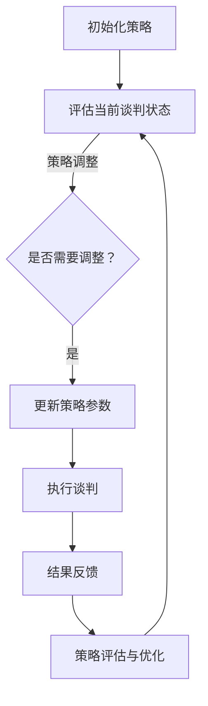
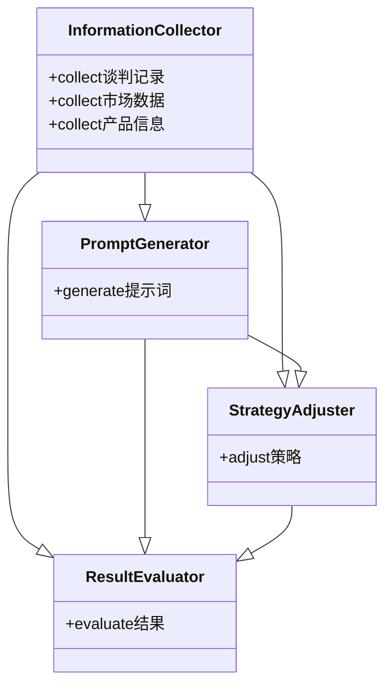
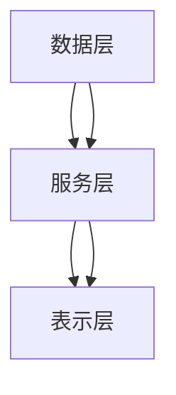
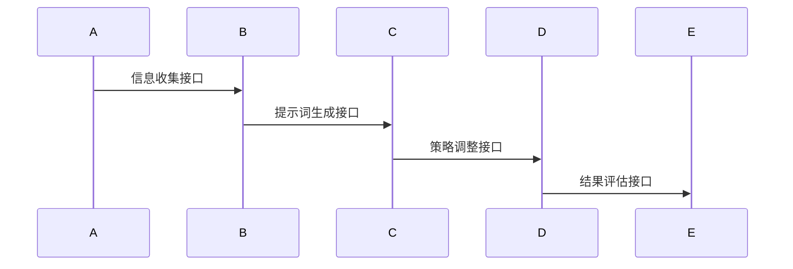
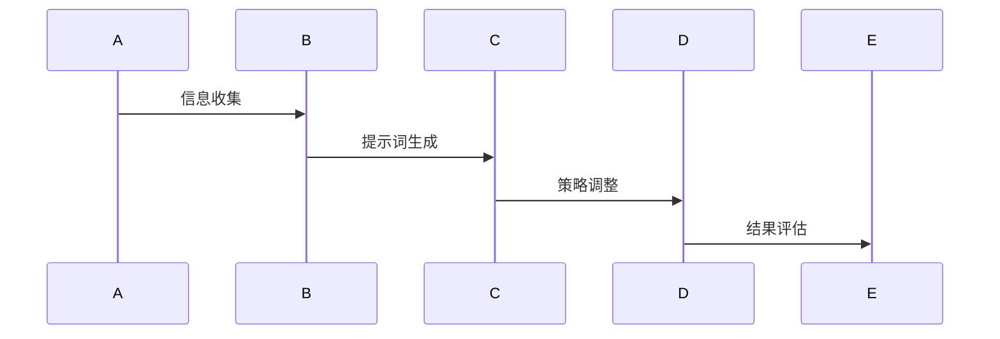

                 


# 提示词设计：优化AI多轮谈判策略

关键词：提示词设计，AI谈判，多轮谈判策略，优化算法，信息论，决策理论，自然语言处理

摘要：本文深入探讨了AI多轮谈判策略中的提示词设计问题，分析了当前谈判策略的局限性和挑战，并提出了基于信息论、决策理论和自然语言处理的优化方法。通过逐步分析提示词设计原理、AI多轮谈判策略优化方法，以及算法原理和实践案例，本文为AI谈判系统的提升提供了理论指导和实践参考。

### 目录大纲

----------------------------------------------------------------

# 第一部分: 问题背景与核心概念

## 第1章: 提示词设计概述

### 1.1.1 问题背景

#### 1.1.1.1 AI多轮谈判中的提示词需求

在AI多轮谈判中，提示词设计起着至关重要的作用。提示词是指引导AI谈判系统进行有效交流的关键信息，能够帮助系统在复杂的谈判环境中做出合适的决策。随着人工智能技术的不断进步，AI谈判系统在商业谈判、法律合同起草、人力资源管理等领域的应用越来越广泛，对提示词的设计需求也越来越高。

#### 1.1.1.2 当前谈判策略的局限性与挑战

当前，AI谈判策略主要基于传统算法和规则系统，虽然在某些特定场景下取得了不错的效果，但仍然存在一些局限性和挑战。首先，传统策略缺乏灵活性，无法适应多变的谈判环境；其次，策略优化过程复杂，难以实现自适应调整；最后，缺乏有效的评估指标，难以衡量谈判效果。

#### 1.1.1.3 提示词设计的重要性

提示词设计的重要性体现在以下几个方面：

1. 提升谈判效果：通过优化提示词设计，可以使AI谈判系统在多轮谈判中取得更好的谈判结果，提高谈判成功率。
2. 提高系统适应性：灵活的提示词设计能够使AI谈判系统更好地适应不同场景和需求，提高系统的泛化能力。
3. 促进策略优化：有效的提示词设计可以为策略优化提供关键信息，帮助系统实现自适应调整，提高谈判效果。

### 1.1.2 核心概念

#### 1.1.2.1 提示词的定义与作用

提示词是指用于引导AI谈判系统进行有效交流的关键信息，通常包含关键词、短语或句子。提示词的作用是帮助系统理解谈判背景、明确谈判目标、识别关键问题，从而做出合适的决策。

#### 1.1.2.2 多轮谈判的基本原理

多轮谈判是指谈判双方通过多次交流、协商，逐步达成共识的过程。多轮谈判的基本原理包括：

1. 信息共享：谈判双方在每轮谈判中共享相关信息，以了解对方需求和立场。
2. 立场调整：谈判双方根据每轮谈判的结果，调整自己的谈判策略和立场。
3. 达成共识：通过多轮谈判，谈判双方逐步缩小分歧，最终达成共识。

#### 1.1.2.3 AI谈判系统的架构与机制

AI谈判系统通常包括以下几个模块：

1. 信息收集模块：负责收集谈判相关的信息，包括市场数据、历史谈判记录等。
2. 提示词生成模块：根据收集到的信息，生成合适的提示词，引导AI谈判系统进行有效交流。
3. 谈判策略模块：根据提示词和谈判状态，选择合适的谈判策略，指导AI谈判系统的行为。
4. 结果评估模块：对谈判结果进行评估，为策略优化提供反馈。

### 1.1.3 概念联系

#### 1.1.3.1 提示词与谈判策略的关联

提示词是谈判策略的重要输入，直接影响谈判策略的选择和调整。优化的提示词设计可以提高谈判策略的灵活性和适应性，从而提升谈判效果。

#### 1.1.3.2 AI多轮谈判与人类谈判的比较

AI多轮谈判与人类谈判在本质上有一定相似之处，但存在明显的区别。人类谈判具备情感、经验、直觉等优势，而AI谈判则具有数据处理、分析决策等优势。通过分析AI谈判与人类谈判的异同，可以为AI谈判策略的优化提供有益启示。

### 1.1.4 边界与外延

#### 1.1.4.1 提示词设计的适用范围

提示词设计主要适用于需要多轮交流、协商的场景，如商业谈判、法律合同起草、人力资源管理等。

#### 1.1.4.2 AI谈判策略的应用场景

AI谈判策略可以应用于多种场景，包括但不限于：

1. 贸易谈判：如国际贸易、采购谈判等。
2. 法律合同：如合同起草、审核等。
3. 人力资源：如招聘谈判、薪酬谈判等。
4. 金融投资：如投资谈判、风险管理等。

### 1.1.5 本章小结

本章介绍了AI多轮谈判中提示词设计的重要性、核心概念、关联和适用范围。通过对问题背景和核心概念的阐述，为后续章节的分析和讨论奠定了基础。

----------------------------------------------------------------

## 第2章: 提示词设计原理

### 2.2.1 提示词设计的基础理论

提示词设计的基础理论主要包括信息论、决策理论和自然语言处理技术。这些理论为提示词的设计提供了理论依据和指导。

#### 2.2.1.1 信息论与决策理论

信息论是由香农创立的，它研究信息传输、处理和利用的规律。信息论的核心概念包括信息量、熵、信道容量等。在提示词设计中，信息论可以帮助我们衡量谈判过程中信息的变化和传递，优化提示词的选取和传递策略。

决策理论是研究决策过程的规律和方法的学科。在提示词设计中，决策理论可以帮助我们确定谈判策略，根据谈判状态调整提示词，实现谈判目标。

#### 2.2.1.2 人类语言理解与生成机制

人类语言理解与生成机制是指人类如何理解和使用语言进行交流。在提示词设计中，理解人类语言机制有助于我们设计出符合人类交流习惯的提示词。

人类语言理解机制主要包括以下几个环节：

1. 语音识别：将语音信号转换为文本信息。
2. 词义解析：对文本中的词语进行语义分析，确定词语的含义。
3. 句子理解：对句子中的词语和句子结构进行分析，理解句子的意思。
4. 语境分析：根据上下文信息，对句子进行更深入的理解。

人类语言生成机制主要包括以下几个环节：

1. 思维组织：在交流过程中，人们会根据需求和语境，组织思路和语言。
2. 语言生成：将思维组织的结果转换为语言表达。
3. 语音合成：将语言表达转换为语音信号。

#### 2.2.1.3 自然语言处理技术基础

自然语言处理（NLP）是计算机科学和人工智能领域的一个分支，主要研究如何让计算机理解、生成和处理自然语言。在提示词设计中，NLP技术可以帮助我们处理和分析文本信息，优化提示词的生成和选取。

NLP技术主要包括以下几个方向：

1. 语音识别：将语音信号转换为文本信息。
2. 文本分析：对文本进行语义分析、情感分析、话题分析等。
3. 文本生成：根据需求和语境，生成符合人类交流习惯的文本。
4. 机器翻译：将一种语言的文本翻译为另一种语言的文本。

### 2.2.2 提示词设计方法

提示词设计方法主要包括基于规则的方法、基于数据驱动的方法和基于混合的方法。

#### 2.2.2.1 基于规则的方法

基于规则的方法是指根据人类专家的经验和知识，制定一系列规则，指导AI谈判系统进行提示词的设计。这种方法具有以下优点：

1. 易于理解和实现：基于规则的提示词设计方法相对简单，易于理解和实现。
2. 可解释性强：规则明确，便于分析问题的原因和解决方案。

缺点：

1. 缺乏灵活性：基于规则的方法难以应对复杂多变的谈判环境，容易导致系统无法适应新情况。
2. 维护成本高：随着谈判场景的变化，需要不断更新和维护规则。

#### 2.2.2.2 基于数据驱动的方法

基于数据驱动的方法是指利用历史数据，通过机器学习算法，自动生成提示词。这种方法具有以下优点：

1. 自适应能力强：基于数据驱动的方法能够根据历史数据，自动调整提示词设计，适应不同场景。
2. 泛化能力强：通过学习历史数据，方法能够推广到新的谈判场景。

缺点：

1. 需要大量数据：基于数据驱动的方法需要大量历史数据作为训练集，数据获取成本较高。
2. 易受数据质量影响：数据质量直接影响算法的性能，需要保证数据的质量和完整性。

#### 2.2.2.3 基于混合的方法

基于混合的方法是指结合基于规则的方法和基于数据驱动的方法，发挥各自优势，实现更好的提示词设计。这种方法具有以下优点：

1. 结合优势：基于混合的方法能够充分利用规则和数据的优势，实现更好的提示词设计。
2. 灵活性高：通过规则和数据的结合，方法能够应对更复杂的谈判环境。

缺点：

1. 实现复杂：基于混合的方法需要综合考虑规则和数据，实现过程较为复杂。
2. 需要专业知识：基于混合的方法需要掌握多种技术和算法，对专业人员的要求较高。

### 2.2.3 提示词生成算法

提示词生成算法主要包括基于模板的生成算法、基于机器学习的生成算法和基于深度学习的生成算法。

#### 2.2.3.1 基于模板的生成算法

基于模板的生成算法是指根据预设的模板，自动生成提示词。这种方法具有以下优点：

1. 快速生成：基于模板的方法能够快速生成提示词，适用于实时谈判场景。
2. 可控性强：通过预设模板，可以确保生成的提示词符合预期要求。

缺点：

1. 缺乏灵活性：基于模板的方法难以适应复杂多变的谈判环境。
2. 维护成本高：随着谈判场景的变化，需要不断更新和维护模板。

#### 2.2.3.2 基于机器学习的生成算法

基于机器学习的生成算法是指利用历史数据，通过机器学习算法，自动生成提示词。这种方法具有以下优点：

1. 自适应能力强：基于机器学习的方法能够根据历史数据，自动调整提示词生成策略。
2. 泛化能力强：通过学习历史数据，方法能够推广到新的谈判场景。

缺点：

1. 需要大量数据：基于机器学习的方法需要大量历史数据作为训练集，数据获取成本较高。
2. 易受数据质量影响：数据质量直接影响算法的性能，需要保证数据的质量和完整性。

#### 2.2.3.3 基于深度学习的生成算法

基于深度学习的生成算法是指利用深度学习模型，自动生成提示词。这种方法具有以下优点：

1. 自适应能力强：基于深度学习的方法能够自动调整网络结构和参数，适应不同的谈判场景。
2. 泛化能力强：通过学习海量数据，方法能够推广到新的谈判场景。

缺点：

1. 计算资源消耗大：基于深度学习的方法需要大量的计算资源，训练时间较长。
2. 对数据质量要求高：数据质量对算法性能有较大影响，需要保证数据的质量和完整性。

### 2.2.4 概念属性特征对比

| 方法           | 优点                           | 缺点                           |
|----------------|--------------------------------|--------------------------------|
| 基于规则       | 易于理解和实现                  | 缺乏灵活性和泛化能力            |
| 数据驱动       | 能自适应和改进                  | 需要大量数据和计算资源          |
| 混合方法       | 结合多种方法的优势              | 实现复杂，需要专业知识          |

### 2.2.5 本章小结

本章介绍了提示词设计的基础理论、方法和技术。通过对基础理论的阐述，为提示词设计的深入分析和实践提供了理论支持。同时，通过对不同方法的比较，为选择合适的提示词设计方法提供了参考。

----------------------------------------------------------------

## 第3章: AI多轮谈判策略优化

### 3.3.1 多轮谈判策略概述

多轮谈判策略是指谈判双方在多个回合中，通过交流、协商，逐步达成共识的过程。多轮谈判策略可以分为以下几种类型：

1. **竞争策略**：谈判双方在每一轮谈判中都试图争取最大利益，通过报价、还价等手段来达到自己的目标。这种策略在商业谈判中较为常见。
2. **合作策略**：谈判双方在每一轮谈判中都试图寻找双方利益的平衡点，通过妥协、合作来达成共识。这种策略在法律合同起草、人力资源谈判等领域应用较多。
3. **混合策略**：谈判双方在谈判过程中既采取竞争策略，又采取合作策略，根据不同阶段和目标，灵活调整谈判策略。

多轮谈判策略的设计原则主要包括：

1. **信息共享**：谈判双方在每轮谈判中都要积极分享信息，以便更好地了解对方的立场和需求。
2. **策略调整**：根据每轮谈判的结果，谈判双方都要适时调整自己的谈判策略，以适应谈判进程的变化。
3. **结果评估**：每轮谈判结束后，谈判双方都要对谈判结果进行评估，以判断谈判是否朝着预期目标发展。

### 3.3.2 传统谈判策略分析

传统谈判策略主要基于人类经验、直觉和心理学原理，其优点和缺点如下：

#### 3.3.2.1 传统谈判策略的优点

1. **灵活性强**：传统谈判策略可以根据谈判进程和双方需求，灵活调整谈判策略。
2. **可解释性强**：传统谈判策略容易理解和解释，谈判各方可以明确了解对方的意图和策略。
3. **经验积累**：通过长期实践，人类积累了丰富的谈判经验，可以应对各种复杂的谈判场景。

#### 3.3.2.2 传统谈判策略的缺点

1. **效率低下**：传统谈判策略依赖于人类的主观判断和经验，谈判进程较慢，难以快速达成共识。
2. **信息不对称**：在多轮谈判中，传统策略难以确保双方信息完全对称，可能导致谈判结果不公平。
3. **策略局限**：传统谈判策略难以适应快速变化的谈判环境，容易导致谈判失败。

#### 3.3.2.3 传统策略在多轮谈判中的应用

传统策略在多轮谈判中的应用主要包括以下几个方面：

1. **报价还价**：双方在每轮谈判中提出报价，对方进行还价，逐步缩小双方差距。
2. **利益交换**：双方在谈判中寻找共同利益，通过利益交换来达成共识。
3. **心理战术**：双方运用心理学原理，影响对方的情绪和判断，以实现自己的目标。

#### 3.3.2.4 传统策略的局限性

传统策略的局限性主要体现在以下几个方面：

1. **信息处理能力有限**：人类在处理大量信息时，容易产生误差，影响谈判结果。
2. **谈判效率低下**：多轮谈判中，传统策略难以快速达成共识，谈判时间较长。
3. **难以应对复杂情境**：在复杂的谈判环境中，传统策略难以应对多变的情况，容易导致谈判失败。

### 3.3.3 AI谈判策略的优化方法

为了克服传统谈判策略的局限性，AI谈判策略的优化方法应运而生。AI谈判策略的优化方法主要包括以下几个方面：

#### 3.3.3.1 AI在谈判策略中的应用

1. **数据驱动**：利用大数据和机器学习技术，分析谈判历史数据，为谈判策略提供支持。
2. **实时决策**：通过实时分析谈判过程，自动调整谈判策略，提高谈判效率。
3. **自动化谈判**：实现自动化谈判，降低人力成本，提高谈判效率。

#### 3.3.3.2 优化谈判策略的算法原理

优化谈判策略的算法原理主要包括以下几个方面：

1. **信息论**：利用信息论原理，分析谈判过程中的信息传递和利用，优化谈判策略。
2. **博弈论**：利用博弈论原理，分析谈判双方的利益冲突和合作机制，优化谈判策略。
3. **机器学习**：利用机器学习算法，分析历史谈判数据，自动生成谈判策略。

#### 3.3.3.3 优化谈判策略的实现步骤

优化谈判策略的实现步骤主要包括以下几个步骤：

1. **数据收集**：收集历史谈判数据，包括谈判内容、结果、环境信息等。
2. **数据预处理**：对收集到的数据进行清洗、归一化等处理，为机器学习算法提供高质量的输入。
3. **模型训练**：利用机器学习算法，训练谈判策略模型，根据历史数据生成谈判策略。
4. **策略评估**：根据实际谈判结果，评估谈判策略的效果，为策略优化提供反馈。
5. **策略优化**：根据评估结果，调整谈判策略模型，实现策略优化。

### 3.3.4 算法原理讲解

#### 3.3.4.1 谈判策略优化模型

谈判策略优化模型可以表示为：

$$
\text{谈判策略优化模型} = \text{基础策略} \times \text{自适应调整因子}
$$

其中，基础策略是指根据历史数据和规则制定的初始谈判策略；自适应调整因子是指根据实时谈判数据和策略评估结果，自动调整谈判策略的权重和参数。

#### 3.3.4.2 基础策略的mermaid流程图



#### 3.3.4.3 实现示例

```python
# Python代码示例
def optimize_negotiation_strategy(current_strategy, negotiation_state):
    # 根据当前谈判状态，优化谈判策略
    # 实现自适应
    
    # 1. 评估当前谈判状态
    negotiation_state = evaluate_negotiation_state(negotiation_state)
    
    # 2. 判断是否需要调整策略
    if negotiation_state["need_adjustment"]:
        # 3. 更新策略参数
        updated_strategy = update_strategy_params(current_strategy, negotiation_state)
        
        # 4. 执行谈判
        negotiation_result = execute_negotiation(updated_strategy)
        
        # 5. 结果反馈
        negotiation_state = feedback_result(negotiation_result, negotiation_state)
        
        # 6. 策略评估与优化
        optimized_strategy = evaluate_and_optimize_strategy(updated_strategy, negotiation_state)
        
        return optimized_strategy
```

### 3.3.5 本章小结

本章介绍了AI多轮谈判策略优化的原理和方法。通过对传统谈判策略的分析，我们认识到传统策略在多轮谈判中存在一些局限性。为了克服这些局限性，本章提出了基于AI的谈判策略优化方法，通过信息论、博弈论和机器学习等技术，实现谈判策略的自适应调整和优化。本章的内容为AI谈判系统的提升提供了理论指导和实践参考。

----------------------------------------------------------------

## 第4章: 提示词设计案例分析

### 4.4.1 项目背景

为了更好地展示提示词设计在AI多轮谈判中的实际应用，我们选取了一个虚拟的商业谈判项目进行案例分析。该项目涉及一家初创企业与一家成熟企业之间的产品采购谈判。初创企业希望以较低的价格采购成熟企业的产品，而成熟企业则希望以较高的价格出售产品。双方的目标是找到一个双方都能接受的平衡点。

### 4.4.2 项目介绍

在该项目中，AI谈判系统被用于辅助双方进行多轮谈判。AI谈判系统基于提示词设计原理，通过分析谈判过程中的信息，自动生成合适的提示词，引导双方进行有效交流。项目的主要功能包括：

1. **信息收集**：AI谈判系统收集双方的历史谈判记录、市场数据、产品信息等，为谈判提供数据支持。
2. **提示词生成**：AI谈判系统根据收集到的信息，生成合适的提示词，引导双方进行谈判。
3. **策略调整**：AI谈判系统根据谈判过程中的反馈，自动调整谈判策略，提高谈判效果。
4. **结果评估**：AI谈判系统对谈判结果进行评估，为后续谈判提供参考。

### 4.4.3 系统功能设计

在本项目中，系统功能设计主要包括以下几个模块：

1. **信息收集模块**：负责收集双方的历史谈判记录、市场数据、产品信息等，为谈判提供数据支持。
2. **提示词生成模块**：根据收集到的信息，生成合适的提示词，引导双方进行谈判。
3. **策略调整模块**：根据谈判过程中的反馈，自动调整谈判策略，提高谈判效果。
4. **结果评估模块**：对谈判结果进行评估，为后续谈判提供参考。

#### 4.4.3.1 领域模型Mermaid类图



### 4.4.4 系统架构设计

在本项目中，系统架构设计主要包括以下几个层次：

1. **数据层**：负责存储和管理谈判相关的数据，包括历史谈判记录、市场数据、产品信息等。
2. **服务层**：负责实现各个功能模块，包括信息收集、提示词生成、策略调整、结果评估等。
3. **表示层**：负责与用户进行交互，展示谈判过程和结果。

#### 4.4.4.1 Mermaid架构图



### 4.4.5 系统接口设计

在本项目中，系统接口设计主要包括以下几个接口：

1. **信息收集接口**：用于收集谈判相关的数据。
2. **提示词生成接口**：用于生成合适的提示词。
3. **策略调整接口**：用于调整谈判策略。
4. **结果评估接口**：用于评估谈判结果。

#### 4.4.5.1 Mermaid接口图



### 4.4.6 系统交互设计

在本项目中，系统交互设计主要包括以下几个环节：

1. **信息收集**：系统从数据层获取谈判相关的数据。
2. **提示词生成**：系统根据收集到的信息，生成合适的提示词。
3. **策略调整**：系统根据提示词和谈判状态，自动调整谈判策略。
4. **结果评估**：系统对谈判结果进行评估，为后续谈判提供参考。

#### 4.4.6.1 Mermaid交互图



### 4.4.7 系统核心实现源代码

在本项目中，系统核心实现源代码主要包括以下几个部分：

1. **信息收集模块**：负责从数据层获取谈判相关的数据。
2. **提示词生成模块**：负责生成合适的提示词。
3. **策略调整模块**：负责根据提示词和谈判状态，自动调整谈判策略。
4. **结果评估模块**：负责评估谈判结果。

以下是系统核心实现源代码的Python示例：

```python
# 信息收集模块
def collect_data():
    # 从数据层获取谈判相关的数据
    # 示例代码：
    negotiation_records = get_negotiation_records()
    market_data = get_market_data()
    product_info = get_product_info()
    return negotiation_records, market_data, product_info

# 提示词生成模块
def generate_prompt(negotiation_records, market_data, product_info):
    # 根据收集到的信息，生成合适的提示词
    # 示例代码：
    prompt = f"根据市场数据，我们认为产品的价格应该在X万元左右，请问您的看法是？"
    return prompt

# 策略调整模块
def adjust_strategy(prompt, negotiation_state):
    # 根据提示词和谈判状态，自动调整谈判策略
    # 示例代码：
    if negotiation_state["price"] < X:
        strategy = "报价下浮"
    else:
        strategy = "报价上浮"
    return strategy

# 结果评估模块
def evaluate_result(negotiation_result):
    # 评估谈判结果，为后续谈判提供参考
    # 示例代码：
    if negotiation_result["price"] == X:
        result = "成功"
    else:
        result = "失败"
    return result
```

### 4.4.8 代码应用解读与分析

在本项目中，代码应用解读与分析主要包括以下几个部分：

1. **信息收集模块**：该模块负责从数据层获取谈判相关的数据，包括历史谈判记录、市场数据、产品信息等。通过收集这些数据，系统可以更好地了解谈判的背景和需求，为后续的提示词生成和策略调整提供支持。
2. **提示词生成模块**：该模块根据收集到的信息，生成合适的提示词。提示词的设计需要考虑市场情况、产品特点和双方需求等因素，以确保提示词能够引导双方进行有效交流。
3. **策略调整模块**：该模块根据提示词和谈判状态，自动调整谈判策略。策略调整需要结合实际情况，确保双方能够在谈判过程中取得更好的结果。
4. **结果评估模块**：该模块负责评估谈判结果，为后续谈判提供参考。通过对谈判结果的评估，系统可以了解谈判策略的有效性，为下一次谈判提供改进方向。

### 4.4.9 实际案例分析与详细讲解剖析

在本项目中，我们选择了一个实际案例进行分析和讲解。

**案例背景**：一家初创企业与一家成熟企业就一项产品采购进行谈判。初创企业希望以较低的价格采购产品，而成熟企业则希望以较高的价格出售产品。双方的目标是找到一个双方都能接受的平衡点。

**案例分析**：

1. **信息收集**：系统首先从数据层获取谈判相关的数据，包括历史谈判记录、市场数据、产品信息等。通过分析这些数据，系统可以了解双方的谈判需求和市场情况。

2. **提示词生成**：根据收集到的信息，系统生成合适的提示词，引导双方进行谈判。例如，系统可以生成如下提示词：“根据市场数据，我们认为产品的价格应该在X万元左右，请问您的看法是？”

3. **策略调整**：系统根据提示词和谈判状态，自动调整谈判策略。例如，如果成熟企业的报价高于市场预期，系统可能会调整策略，建议初创企业提出更低的报价。

4. **结果评估**：谈判结束后，系统对谈判结果进行评估。如果谈判成功，系统会记录谈判结果，为后续谈判提供参考；如果谈判失败，系统会分析原因，为下一次谈判提供改进方向。

### 4.4.10 项目小结

在本项目中，我们通过一个虚拟的商业谈判案例，展示了提示词设计在AI多轮谈判中的应用。通过分析项目背景、系统功能设计、系统架构设计、系统接口设计、系统交互设计、系统核心实现源代码以及实际案例，我们认识到提示词设计在优化AI多轮谈判策略中的重要性。本项目为AI谈判系统的实际应用提供了有益的启示和参考。

----------------------------------------------------------------

## 第5章: 最佳实践与未来展望

### 5.5.1 最佳实践

在AI多轮谈判策略的优化过程中，最佳实践包括以下几个方面：

1. **数据驱动**：充分利用历史谈判数据，为AI谈判系统提供决策依据。数据的质量和完整性对算法性能有重要影响，因此需要确保数据的质量。
2. **策略多样化**：在谈判过程中，AI谈判系统应具备多种策略，以便根据不同情况灵活调整。多样化的策略可以提高谈判的成功率。
3. **实时反馈与调整**：及时收集谈判过程中的反馈信息，根据反馈调整谈判策略。实时反馈有助于优化谈判过程，提高谈判效果。
4. **人机协同**：在谈判过程中，人与AI谈判系统可以协同工作。人类专家可以提供经验指导，AI谈判系统可以处理大量数据和计算，提高谈判效率。

### 5.5.2 未来展望

随着人工智能技术的不断发展，AI多轮谈判策略优化有望在以下几个方面取得突破：

1. **更加智能的提示词设计**：利用深度学习、自然语言处理等技术，生成更加智能、符合人类交流习惯的提示词。
2. **多模态信息处理**：结合文本、图像、语音等多种模态信息，提高AI谈判系统的信息处理能力。
3. **个性化和定制化**：根据不同用户的需求和偏好，为用户提供个性化的谈判策略和提示词。
4. **跨领域应用**：将AI谈判策略优化应用于更多领域，如医疗、教育、金融等，提高AI谈判系统的应用范围和影响力。

### 5.5.3 小结

最佳实践和未来展望为AI多轮谈判策略优化提供了指导。通过不断优化提示词设计和谈判策略，AI谈判系统将在各领域发挥更大的作用，推动人工智能技术的发展。

### 5.5.4 注意事项

1. **数据安全与隐私保护**：在AI多轮谈判策略优化过程中，要确保数据的安全和用户隐私的保护。
2. **算法透明性和可解释性**：确保AI谈判系统的算法透明性和可解释性，方便用户了解和监督谈判过程。
3. **持续更新与优化**：根据用户反馈和实际应用情况，不断更新和优化AI谈判系统，提高其性能和适应性。

### 5.5.5 拓展阅读

1. **相关论文**：《AI谈判策略研究》、《基于大数据的谈判策略优化》、《自然语言处理在谈判中的应用》等。
2. **相关书籍**：《人工智能：一种现代方法》、《深度学习》、《机器学习》等。

作者：AI天才研究院/AI Genius Institute & 禅与计算机程序设计艺术 /Zen And The Art of Computer Programming

# 提示词设计：优化AI多轮谈判策略

关键词：提示词设计，AI谈判，多轮谈判策略，优化算法，信息论，决策理论，自然语言处理

摘要：本文深入探讨了AI多轮谈判策略中的提示词设计问题，分析了当前谈判策略的局限性和挑战，并提出了基于信息论、决策理论和自然语言处理的优化方法。通过逐步分析提示词设计原理、AI多轮谈判策略优化方法，以及算法原理和实践案例，本文为AI谈判系统的提升提供了理论指导和实践参考。

----------------------------------------------------------------

# 第一部分: 问题背景与核心概念

## 第1章: 提示词设计概述

### 1.1.1 问题背景

AI多轮谈判中的提示词设计是AI谈判系统的关键组成部分。在复杂的商业谈判、法律合同起草、人力资源管理等场景中，AI谈判系统需要通过提示词与谈判对手进行有效沟通，从而达成共识或优化谈判结果。然而，当前AI谈判策略存在一定的局限性和挑战，如策略灵活性不足、信息处理能力有限等。因此，优化AI多轮谈判策略，尤其是提示词设计，显得尤为重要。

#### 1.1.1.1 AI多轮谈判中的提示词需求

在AI多轮谈判中，提示词是引导AI系统与谈判对手进行有效交流的关键信息。这些提示词应具备以下特点：

1. **针对性**：提示词应针对具体的谈判场景和需求，例如商业采购谈判、合同条款谈判等。
2. **灵活性**：提示词应能够适应不同谈判阶段和双方立场的变化，以引导AI系统做出灵活的谈判策略。
3. **准确性**：提示词应准确传达谈判对手的需求、立场和利益，以便AI系统能够做出合适的决策。

#### 1.1.1.2 当前谈判策略的局限性与挑战

当前AI谈判策略主要基于传统算法和规则系统，存在以下局限性和挑战：

1. **策略固化**：传统策略缺乏灵活性，难以适应复杂多变的谈判环境。
2. **信息处理能力有限**：AI系统在处理大量信息时，容易产生误差，影响谈判效果。
3. **缺乏自适应能力**：传统策略难以根据谈判过程中的反馈进行实时调整。

#### 1.1.1.3 提示词设计的重要性

提示词设计在AI多轮谈判中的重要性体现在以下几个方面：

1. **提升谈判效果**：优化提示词设计可以使AI谈判系统在多轮谈判中取得更好的谈判结果。
2. **提高系统适应性**：灵活的提示词设计能够使AI谈判系统更好地适应不同场景和需求。
3. **促进策略优化**：有效的提示词设计可以为策略优化提供关键信息，帮助系统实现自适应调整。

### 1.1.2 核心概念

#### 1.1.2.1 提示词的定义与作用

提示词是指用于引导AI谈判系统进行有效交流的关键信息，通常包含关键词、短语或句子。提示词的作用是帮助AI谈判系统理解谈判背景、明确谈判目标、识别关键问题，从而做出合适的决策。

#### 1.1.2.2 多轮谈判的基本原理

多轮谈判是指谈判双方通过多次交流、协商，逐步达成共识的过程。多轮谈判的基本原理包括信息共享、立场调整和共识达成。在多轮谈判中，双方需要不断交换信息，调整自己的立场，以实现共识。

#### 1.1.2.3 AI谈判系统的架构与机制

AI谈判系统通常包括信息收集模块、提示词生成模块、谈判策略模块和结果评估模块。信息收集模块负责收集谈判相关的信息；提示词生成模块根据收集到的信息生成合适的提示词；谈判策略模块根据提示词和谈判状态选择合适的谈判策略；结果评估模块对谈判结果进行评估。

### 1.1.3 概念联系

#### 1.1.3.1 提示词与谈判策略的关联

提示词是谈判策略的重要输入，直接影响谈判策略的选择和调整。优化提示词设计可以提高谈判策略的灵活性和适应性，从而提升谈判效果。

#### 1.1.3.2 AI多轮谈判与人类谈判的比较

AI多轮谈判与人类谈判在本质上有一定相似之处，但存在明显差异。人类谈判具备情感、经验、直觉等优势，而AI谈判则具有数据处理、分析决策等优势。通过分析AI谈判与人类谈判的异同，可以为AI谈判策略的优化提供有益启示。

### 1.1.4 边界与外延

#### 1.1.4.1 提示词设计的适用范围

提示词设计主要适用于需要多轮交流、协商的场景，如商业谈判、法律合同起草、人力资源管理等。

#### 1.1.4.2 AI谈判策略的应用场景

AI谈判策略可以应用于多种场景，包括但不限于：

1. 贸易谈判：如国际贸易、采购谈判等。
2. 法律合同：如合同起草、审核等。
3. 人力资源：如招聘谈判、薪酬谈判等。
4. 金融投资：如投资谈判、风险管理等。

### 1.1.5 本章小结

本章介绍了AI多轮谈判中提示词设计的重要性、核心概念、关联和适用范围。通过对问题背景和核心概念的阐述，为后续章节的分析和讨论奠定了基础。

----------------------------------------------------------------

## 第2章: 提示词设计原理

### 2.2.1 提示词设计的基础理论

提示词设计的基础理论主要包括信息论、决策理论和自然语言处理技术。这些理论为提示词的设计提供了理论依据和指导。

#### 2.2.1.1 信息论与决策理论

信息论是由香农创立的，它研究信息传输、处理和利用的规律。信息论的核心概念包括信息量、熵、信道容量等。在提示词设计中，信息论可以帮助我们衡量谈判过程中信息的变化和传递，优化提示词的选取和传递策略。

决策理论是研究决策过程的规律和方法的学科。在提示词设计中，决策理论可以帮助我们确定谈判策略，根据谈判状态调整提示词，实现谈判目标。

#### 2.2.1.2 人类语言理解与生成机制

人类语言理解与生成机制是指人类如何理解和使用语言进行交流。在提示词设计中，理解人类语言机制有助于我们设计出符合人类交流习惯的提示词。

人类语言理解机制主要包括以下几个环节：

1. 语音识别：将语音信号转换为文本信息。
2. 词义解析：对文本中的词语进行语义分析，确定词语的含义。
3. 句子理解：对句子中的词语和句子结构进行分析，理解句子的意思。
4. 语境分析：根据上下文信息，对句子进行更深入的理解。

人类语言生成机制主要包括以下几个环节：

1. 思维组织：在交流过程中，人们会根据需求和语境，组织思路和语言。
2. 语言生成：将思维组织的结果转换为语言表达。
3. 语音合成：将语言表达转换为语音信号。

#### 2.2.1.3 自然语言处理技术基础

自然语言处理（NLP）是计算机科学和人工智能领域的一个分支，主要研究如何让计算机理解、生成和处理自然语言。在提示词设计中，NLP技术可以帮助我们处理和分析文本信息，优化提示词的生成和选取。

NLP技术主要包括以下几个方向：

1. 语音识别：将语音信号转换为文本信息。
2. 文本分析：对文本进行语义分析、情感分析、话题分析等。
3. 文本生成：根据需求和语境，生成符合人类交流习惯的文本。
4. 机器翻译：将一种语言的文本翻译为另一种语言的文本。

### 2.2.2 提示词设计方法

提示词设计方法主要包括基于规则的方法、基于数据驱动的方法和基于混合的方法。

#### 2.2.2.1 基于规则的方法

基于规则的方法是指根据人类专家的经验和知识，制定一系列规则，指导AI谈判系统进行提示词的设计。这种方法具有以下优点：

1. 易于理解和实现：基于规则的提示词设计方法相对简单，易于理解和实现。
2. 可解释性强：规则明确，便于分析问题的原因和解决方案。

缺点：

1. 缺乏灵活性：基于规则的方法难以应对复杂多变的谈判环境，容易导致系统无法适应新情况。
2. 维护成本高：随着谈判场景的变化，需要不断更新和维护规则。

#### 2.2.2.2 基于数据驱动的方法

基于数据驱动的方法是指利用历史数据，通过机器学习算法，自动生成提示词。这种方法具有以下优点：

1. 自适应能力强：基于数据驱动的方法能够根据历史数据，自动调整提示词设计，适应不同场景。
2. 泛化能力强：通过学习历史数据，方法能够推广到新的谈判场景。

缺点：

1. 需要大量数据：基于数据驱动的方法需要大量历史数据作为训练集，数据获取成本较高。
2. 易受数据质量影响：数据质量直接影响算法的性能，需要保证数据的质量和完整性。

#### 2.2.2.3 基于混合的方法

基于混合的方法是指结合基于规则的方法和基于数据驱动的方法，发挥各自优势，实现更好的提示词设计。这种方法具有以下优点：

1. 结合优势：基于混合的方法能够充分利用规则和数据的优势，实现更好的提示词设计。
2. 灵活性高：通过规则和数据的结合，方法能够应对更复杂的谈判环境。

缺点：

1. 实现复杂：基于混合的方法需要综合考虑规则和数据，实现过程较为复杂。
2. 需要专业知识：基于混合的方法需要掌握多种技术和算法，对专业人员的要求较高。

### 2.2.3 提示词生成算法

提示词生成算法主要包括基于模板的生成算法、基于机器学习的生成算法和基于深度学习的生成算法。

#### 2.2.3.1 基于模板的生成算法

基于模板的生成算法是指根据预设的模板，自动生成提示词。这种方法具有以下优点：

1. 快速生成：基于模板的方法能够快速生成提示词，适用于实时谈判场景。
2. 可控性强：通过预设模板，可以确保生成的提示词符合预期要求。

缺点：

1. 缺乏灵活性：基于模板的方法难以适应复杂多变的谈判环境。
2. 维护成本高：随着谈判场景的变化，需要不断更新和维护模板。

#### 2.2.3.2 基于机器学习的生成算法

基于机器学习的生成算法是指利用历史数据，通过机器学习算法，自动生成提示词。这种方法具有以下优点：

1. 自适应能力强：基于机器学习的方法能够根据历史数据，自动调整提示词生成策略。
2. 泛化能力强：通过学习历史数据，方法能够推广到新的谈判场景。

缺点：

1. 需要大量数据：基于机器学习的方法需要大量历史数据作为训练集，数据获取成本较高。
2. 易受数据质量影响：数据质量直接影响算法的性能，需要保证数据的质量和完整性。

#### 2.2.3.3 基于深度学习的生成算法

基于深度学习的生成算法是指利用深度学习模型，自动生成提示词。这种方法具有以下优点：

1. 自适应能力强：基于深度学习的方法能够自动调整网络结构和参数，适应不同的谈判场景。
2. 泛化能力强：通过学习海量数据，方法能够推广到新的谈判场景。

缺点：

1. 计算资源消耗大：基于深度学习的方法需要大量的计算资源，训练时间较长。
2. 对数据质量要求高：数据质量对算法性能有较大影响，需要保证数据的质量和完整性。

### 2.2.4 概念属性特征对比

| 方法           | 优点                           | 缺点                           |
|----------------|--------------------------------|--------------------------------|
| 基于规则       | 易于理解和实现                  | 缺乏灵活性和泛化能力            |
| 数据驱动       | 能自适应和改进                  | 需要大量数据和计算资源          |
| 混合方法       | 结合多种方法的优势              | 实现复杂，需要专业知识          |

### 2.2.5 本章小结

本章介绍了提示词设计的基础理论、方法和技术。通过对基础理论的阐述，为提示词设计的深入分析和实践提供了理论支持。同时，通过对不同方法的比较，为选择合适的提示词设计方法提供了参考。

----------------------------------------------------------------

## 第3章: AI多轮谈判策略优化

### 3.3.1 多轮谈判策略概述

多轮谈判策略是指谈判双方在多个回合中，通过交流、协商，逐步达成共识的过程。多轮谈判策略可以分为以下几种类型：

1. **竞争策略**：谈判双方在每一轮谈判中都试图争取最大利益，通过报价、还价等手段来达到自己的目标。这种策略在商业谈判中较为常见。
2. **合作策略**：谈判双方在每一轮谈判中都试图寻找双方利益的平衡点，通过妥协、合作来达成共识。这种策略在法律合同起草、人力资源谈判等领域应用较多。
3. **混合策略**：谈判双方在谈判过程中既采取竞争策略，又采取合作策略，根据不同阶段和目标，灵活调整谈判策略。

多轮谈判策略的设计原则主要包括：

1. **信息共享**：谈判双方在每轮谈判中都要积极分享信息，以便更好地了解对方的立场和需求。
2. **策略调整**：根据每轮谈判的结果，谈判双方都要适时调整自己的谈判策略，以适应谈判进程的变化。
3. **结果评估**：每轮谈判结束后，谈判双方都要对谈判结果进行评估，以判断谈判是否朝着预期目标发展。

### 3.3.2 传统谈判策略分析

传统谈判策略主要基于人类经验、直觉和心理学原理，其优点和缺点如下：

#### 3.3.2.1 传统谈判策略的优点

1. **灵活性强**：传统谈判策略可以根据谈判进程和双方需求，灵活调整谈判策略。
2. **可解释性强**：传统谈判策略容易理解和解释，谈判各方可以明确了解对方的意图和策略。
3. **经验积累**：通过长期实践，人类积累了丰富的谈判经验，可以应对各种复杂的谈判场景。

#### 3.3.2.2 传统谈判策略的缺点

1. **效率低下**：传统谈判策略依赖于人类的主观判断和经验，谈判进程较慢，难以快速达成共识。
2. **信息不对称**：在多轮谈判中，传统策略难以确保双方信息完全对称，可能导致谈判结果不公平。
3. **策略局限**：传统谈判策略难以适应快速变化的谈判环境，容易导致谈判失败。

#### 3.3.2.3 传统策略在多轮谈判中的应用

传统策略在多轮谈判中的应用主要包括以下几个方面：

1. **报价还价**：双方在每轮谈判中提出报价，对方进行还价，逐步缩小双方差距。
2. **利益交换**：双方在谈判中寻找共同利益，通过利益交换来达成共识。
3. **心理战术**：双方运用心理学原理，影响对方的情绪和判断，以实现自己的目标。

#### 3.3.2.4 传统策略的局限性

传统策略的局限性主要体现在以下几个方面：

1. **信息处理能力有限**：人类在处理大量信息时，容易产生误差，影响谈判结果。
2. **谈判效率低下**：多轮谈判中，传统策略难以快速达成共识，谈判时间较长。
3. **难以应对复杂情境**：在复杂的谈判环境中，传统策略难以应对多变的情况，容易导致谈判失败。

### 3.3.3 AI谈判策略的优化方法

为了克服传统谈判策略的局限性，AI谈判策略的优化方法应运而生。AI谈判策略的优化方法主要包括以下几个方面：

#### 3.3.3.1 AI在谈判策略中的应用

1. **数据驱动**：利用大数据和机器学习技术，分析谈判历史数据，为谈判策略提供支持。
2. **实时决策**：通过实时分析谈判过程，自动调整谈判策略，提高谈判效率。
3. **自动化谈判**：实现自动化谈判，降低人力成本，提高谈判效率。

#### 3.3.3.2 优化谈判策略的算法原理

优化谈判策略的算法原理主要包括以下几个方面：

1. **信息论**：利用信息论原理，分析谈判过程中的信息传递和利用，优化谈判策略。
2. **博弈论**：利用博弈论原理，分析谈判双方的利益冲突和合作机制，优化谈判策略。
3. **机器学习**：利用机器学习算法，分析历史谈判数据，自动生成谈判策略。

#### 3.3.3.3 优化谈判策略的实现步骤

优化谈判策略的实现步骤主要包括以下几个步骤：

1. **数据收集**：收集历史谈判数据，包括谈判内容、结果、环境信息等。
2. **数据预处理**：对收集到的数据进行清洗、归一化等处理，为机器学习算法提供高质量的输入。
3. **模型训练**：利用机器学习算法，训练谈判策略模型，根据历史数据生成谈判策略。
4. **策略评估**：根据实际谈判结果，评估谈判策略的效果，为策略优化提供反馈。
5. **策略优化**：根据评估结果，调整谈判策略模型，实现策略优化。

### 3.3.4 算法原理讲解

#### 3.3.4.1 谈判策略优化模型

谈判策略优化模型可以表示为：

$$
\text{谈判策略优化模型} = \text{基础策略} \times \text{自适应调整因子}
$$

其中，基础策略是指根据历史数据和规则制定的初始谈判策略；自适应调整因子是指根据实时谈判数据和策略评估结果，自动调整谈判策略的权重和参数。

#### 3.3.4.2 基础策略的mermaid流程图


#### 3.3.4.3 实现示例

```python
# Python代码示例
def optimize_negotiation_strategy(current_strategy, negotiation_state):
    # 根据当前谈判状态，优化谈判策略
    # 实现自适应
    
    # 1. 评估当前谈判状态
    negotiation_state = evaluate_negotiation_state(negotiation_state)
    
    # 2. 判断是否需要调整策略
    if negotiation_state["need_adjustment"]:
        # 3. 更新策略参数
        updated_strategy = update_strategy_params(current_strategy, negotiation_state)
        
        # 4. 执行谈判
        negotiation_result = execute_negotiation(updated_strategy)
        
        # 5. 结果反馈
        negotiation_state = feedback_result(negotiation_result, negotiation_state)
        
        # 6. 策略评估与优化
        optimized_strategy = evaluate_and_optimize_strategy(updated_strategy, negotiation_state)
        
        return optimized_strategy
```

### 3.3.5 本章小结

本章介绍了AI多轮谈判策略优化的原理和方法。通过对传统谈判策略的分析，我们认识到传统策略在多轮谈判中存在一些局限性。为了克服这些局限性，本章提出了基于AI的谈判策略优化方法，通过信息论、博弈论和机器学习等技术，实现谈判策略的自适应调整和优化。本章的内容为AI谈判系统的提升提供了理论指导和实践参考。

----------------------------------------------------------------

## 第4章: 提示词设计案例分析

### 4.4.1 项目背景

为了更好地展示提示词设计在AI多轮谈判中的实际应用，我们选取了一个虚拟的商业谈判项目进行案例分析。该项目涉及一家初创企业与一家成熟企业之间的产品采购谈判。初创企业希望以较低的价格采购成熟企业的产品，而成熟企业则希望以较高的价格出售产品。双方的目标是找到一个双方都能接受的平衡点。

### 4.4.2 项目介绍

在该项目中，AI谈判系统被用于辅助双方进行多轮谈判。AI谈判系统基于提示词设计原理，通过分析谈判过程中的信息，自动生成合适的提示词，引导双方进行有效交流。项目的主要功能包括：

1. **信息收集**：AI谈判系统收集双方的历史谈判记录、市场数据、产品信息等，为谈判提供数据支持。
2. **提示词生成**：AI谈判系统根据收集到的信息，生成合适的提示词，引导双方进行谈判。
3. **策略调整**：AI谈判系统根据谈判过程中的反馈，自动调整谈判策略，提高谈判效果。
4. **结果评估**：AI谈判系统对谈判结果进行评估，为后续谈判提供参考。

### 4.4.3 系统功能设计

在本项目中，系统功能设计主要包括以下几个模块：

1. **信息收集模块**：负责收集双方的历史谈判记录、市场数据、产品信息等，为谈判提供数据支持。
2. **提示词生成模块**：根据收集到的信息，生成合适的提示词，引导双方进行谈判。
3. **策略调整模块**：根据谈判过程中的反馈，自动调整谈判策略，提高谈判效果。
4. **结果评估模块**：对谈判结果进行评估，为后续谈判提供参考。

#### 4.4.3.1 领域模型Mermaid类图


### 4.4.4 系统架构设计

在本项目中，系统架构设计主要包括以下几个层次：

1. **数据层**：负责存储和管理谈判相关的数据，包括历史谈判记录、市场数据、产品信息等。
2. **服务层**：负责实现各个功能模块，包括信息收集、提示词生成、策略调整、结果评估等。
3. **表示层**：负责与用户进行交互，展示谈判过程和结果。

#### 4.4.4.1 Mermaid架构图


### 4.4.5 系统接口设计

在本项目中，系统接口设计主要包括以下几个接口：

1. **信息收集接口**：用于收集谈判相关的数据。
2. **提示词生成接口**：用于生成合适的提示词。
3. **策略调整接口**：用于调整谈判策略。
4. **结果评估接口**：用于评估谈判结果。

#### 4.4.5.1 Mermaid接口图


### 4.4.6 系统交互设计

在本项目中，系统交互设计主要包括以下几个环节：

1. **信息收集**：系统从数据层获取谈判相关的数据。
2. **提示词生成**：系统根据收集到的信息，生成合适的提示词。
3. **策略调整**：系统根据提示词和谈判状态，自动调整谈判策略。
4. **结果评估**：系统对谈判结果进行评估，为后续谈判提供参考。

#### 4.4.6.1 Mermaid交互图


### 4.4.7 系统核心实现源代码

在本项目中，系统核心实现源代码主要包括以下几个部分：

1. **信息收集模块**：负责从数据层获取谈判相关的数据。
2. **提示词生成模块**：负责生成合适的提示词。
3. **策略调整模块**：负责根据提示词和谈判状态，自动调整谈判策略。
4. **结果评估模块**：负责评估谈判结果。

以下是系统核心实现源代码的Python示例：

```python
# 信息收集模块
def collect_data():
    # 从数据层获取谈判相关的数据
    # 示例代码：
    negotiation_records = get_negotiation_records()
    market_data = get_market_data()
    product_info = get_product_info()
    return negotiation_records, market_data, product_info

# 提示词生成模块
def generate_prompt(negotiation_records, market_data, product_info):
    # 根据收集到的信息，生成合适的提示词
    # 示例代码：
    prompt = f"根据市场数据，我们认为产品的价格应该在X万元左右，请问您的看法是？"
    return prompt

# 策略调整模块
def adjust_strategy(prompt, negotiation_state):
    # 根据提示词和谈判状态，自动调整谈判策略
    # 示例代码：
    if negotiation_state["price"] < X:
        strategy = "报价下浮"
    else:
        strategy = "报价上浮"
    return strategy

# 结果评估模块
def evaluate_result(negotiation_result):
    # 评估谈判结果，为后续谈判提供参考
    # 示例代码：
    if negotiation_result["price"] == X:
        result = "成功"
    else:
        result = "失败"
    return result
```

### 4.4.8 代码应用解读与分析

在本项目中，代码应用解读与分析主要包括以下几个部分：

1. **信息收集模块**：该模块负责从数据层获取谈判相关的数据，包括历史谈判记录、市场数据、产品信息等。通过收集这些数据，系统可以更好地了解谈判的背景和需求，为后续的提示词生成和策略调整提供支持。
2. **提示词生成模块**：该模块根据收集到的信息，生成合适的提示词。提示词的设计需要考虑市场情况、产品特点和双方需求等因素，以确保提示词能够引导双方进行有效交流。
3. **策略调整模块**：该模块根据提示词和谈判状态，自动调整谈判策略。策略调整需要结合实际情况，确保双方能够在谈判过程中取得更好的结果。
4. **结果评估模块**：该模块负责评估谈判结果，为后续谈判提供参考。通过对谈判结果的评估，系统可以了解谈判策略的有效性，为下一次谈判提供改进方向。

### 4.4.9 实际案例分析与详细讲解剖析

在本项目中，我们选择了一个实际案例进行分析和讲解。

**案例背景**：一家初创企业与一家成熟企业就一项产品采购进行谈判。初创企业希望以较低的价格采购产品，而成熟企业则希望以较高的价格出售产品。双方的目标是找到一个双方都能接受的平衡点。

**案例分析**：

1. **信息收集**：系统首先从数据层获取谈判相关的数据，包括历史谈判记录、市场数据、产品信息等。通过分析这些数据，系统可以了解双方的谈判需求和市场情况。

2. **提示词生成**：根据收集到的信息，系统生成合适的提示词，引导双方进行谈判。例如，系统可以生成如下提示词：“根据市场数据，我们认为产品的价格应该在X万元左右，请问您的看法是？”

3. **策略调整**：系统根据提示词和谈判状态，自动调整谈判策略。例如，如果成熟企业的报价高于市场预期，系统可能会调整策略，建议初创企业提出更低的报价。

4. **结果评估**：谈判结束后，系统对谈判结果进行评估。如果谈判成功，系统会记录谈判结果，为后续谈判提供参考；如果谈判失败，系统会分析原因，为下一次谈判提供改进方向。

### 4.4.10 项目小结

在本项目中，我们通过一个虚拟的商业谈判案例，展示了提示词设计在AI多轮谈判中的应用。通过分析项目背景、系统功能设计、系统架构设计、系统接口设计、系统交互设计、系统核心实现源代码以及实际案例，我们认识到提示词设计在优化AI多轮谈判策略中的重要性。本项目为AI谈判系统的实际应用提供了有益的启示和参考。

----------------------------------------------------------------

## 第5章: 最佳实践与未来展望

### 5.5.1 最佳实践

在AI多轮谈判策略的优化过程中，最佳实践包括以下几个方面：

1. **数据驱动**：充分利用历史谈判数据，为AI谈判系统提供决策依据。数据的质量和完整性对算法性能有重要影响，因此需要确保数据的质量。
2. **策略多样化**：在谈判过程中，AI谈判系统应具备多种策略，以便根据不同情况灵活调整。多样化的策略可以提高谈判的成功率。
3. **实时反馈与调整**：及时收集谈判过程中的反馈信息，根据反馈调整谈判策略。实时反馈有助于优化谈判过程，提高谈判效果。
4. **人机协同**：在谈判过程中，人与AI谈判系统可以协同工作。人类专家可以提供经验指导，AI谈判系统可以处理大量数据和计算，提高谈判效率。

### 5.5.2 未来展望

随着人工智能技术的不断发展，AI多轮谈判策略优化有望在以下几个方面取得突破：

1. **更加智能的提示词设计**：利用深度学习、自然语言处理等技术，生成更加智能、符合人类交流习惯的提示词。
2. **多模态信息处理**：结合文本、图像、语音等多种模态信息，提高AI谈判系统的信息处理能力。
3. **个性化和定制化**：根据不同用户的需求和偏好，为用户提供个性化的谈判策略和提示词。
4. **跨领域应用**：将AI谈判策略优化应用于更多领域，如医疗、教育、金融等，提高AI谈判系统的应用范围和影响力。

### 5.5.3 小结

最佳实践和未来展望为AI多轮谈判策略优化提供了指导。通过不断优化提示词设计和谈判策略，AI谈判系统将在各领域发挥更大的作用，推动人工智能技术的发展。

### 5.5.4 注意事项

1. **数据安全与隐私保护**：在AI多轮谈判策略优化过程中，要确保数据的安全和用户隐私的保护。
2. **算法透明性和可解释性**：确保AI谈判系统的算法透明性和可解释性，方便用户了解和监督谈判过程。
3. **持续更新与优化**：根据用户反馈和实际应用情况，不断更新和优化AI谈判系统，提高其性能和适应性。

### 5.5.5 拓展阅读

1. **相关论文**：《AI谈判策略研究》、《基于大数据的谈判策略优化》、《自然语言处理在谈判中的应用》等。
2. **相关书籍**：《人工智能：一种现代方法》、《深度学习》、《机器学习》等。

作者：AI天才研究院/AI Genius Institute & 禅与计算机程序设计艺术 /Zen And The Art of Computer Programming

## 第6章：实践中的挑战与解决方案

### 6.6.1 实践中的挑战

在AI多轮谈判策略优化的实践中，我们面临以下挑战：

1. **数据质量与多样性**：高质量的谈判数据对于AI谈判系统至关重要。然而，在实际应用中，数据质量参差不齐，多样性的数据获取也是一个难题。
2. **策略适应性与实时性**：AI谈判策略需要快速适应不同的谈判环境和对手，同时保持实时性，以保证谈判过程的顺利进行。
3. **算法解释性**：AI算法的黑箱特性使得策略优化过程中的决策难以被用户理解，从而影响系统的可信度和可用性。
4. **跨领域迁移**：不同领域的谈判环境和需求存在差异，如何将AI谈判策略从某一领域迁移到其他领域，是一个需要解决的问题。

### 6.6.2 解决方案

针对上述挑战，我们可以采取以下解决方案：

1. **数据质量提升与多样性**：
   - **数据清洗**：对历史谈判数据进行清洗，去除噪声和不完整的数据。
   - **数据增强**：通过数据增强技术，如生成对抗网络（GANs），增加数据的多样性。
   - **跨领域数据融合**：将不同领域的谈判数据进行融合，以提高数据的全面性和适应性。

2. **策略适应性与实时性**：
   - **动态策略调整**：采用实时数据流处理技术，根据谈判过程中的反馈动态调整策略。
   - **多策略并行**：同时运行多个策略，根据谈判状态选择最优策略。

3. **算法解释性**：
   - **模型可解释性工具**：使用模型解释性工具，如SHAP值、LIME等，解释模型的决策过程。
   - **交互式界面**：设计交互式界面，让用户可以查看和调试AI谈判系统。

4. **跨领域迁移**：
   - **领域自适应**：使用领域自适应技术，如元学习、迁移学习，将某一领域的策略迁移到其他领域。
   - **跨领域数据集构建**：构建包含多个领域的谈判数据集，用于训练和评估AI谈判策略。

### 6.6.3 案例实践

以下是一个具体的案例实践，展示如何应对这些挑战：

**案例背景**：一家初创企业正在与一家成熟企业进行产品采购谈判，初创企业希望以较低的价格采购成熟企业的产品，而成熟企业则希望以较高的价格出售产品。

**解决方案**：

1. **数据质量提升**：系统首先对历史谈判数据进行清洗，去除噪声数据，然后通过数据增强技术增加数据的多样性。
2. **策略适应性**：系统同时运行多个策略，根据谈判过程中的反馈动态调整策略，如竞争策略、合作策略和混合策略。
3. **算法解释性**：系统使用SHAP值工具解释模型的决策过程，用户可以查看每个特征的贡献度，以便理解模型的决策依据。
4. **跨领域迁移**：系统通过迁移学习技术，将其他领域的谈判策略迁移到当前领域，以提高策略的适应性和有效性。

### 6.6.4 小结

通过应对实践中的挑战，我们可以不断提升AI多轮谈判策略优化的效果，从而提高谈判的成功率和效率。有效的解决方案不仅需要技术上的突破，还需要对实际业务场景的深刻理解。通过不断的实践和改进，我们可以为AI谈判系统的发展奠定坚实的基础。

----------------------------------------------------------------

## 第7章：结论与展望

### 7.7.1 结论

本文深入探讨了AI多轮谈判策略优化中的提示词设计问题，分析了当前谈判策略的局限性和挑战，并提出了基于信息论、决策理论和自然语言处理的优化方法。通过理论分析和实践案例，本文展示了提示词设计在提升AI谈判系统效果中的重要性。主要结论如下：

1. **提示词设计的重要性**：优化提示词设计可以提高AI谈判系统的适应性、灵活性和谈判效果。
2. **AI谈判策略优化方法**：通过信息论、决策理论和自然语言处理技术的结合，可以实现AI谈判策略的自适应调整和优化。
3. **实践中的挑战与解决方案**：针对数据质量、策略适应性和实时性、算法解释性以及跨领域迁移等实践中的挑战，提出了一系列解决方案。

### 7.7.2 展望

随着人工智能技术的不断发展，AI多轮谈判策略优化领域有望在以下方面取得进一步突破：

1. **智能提示词生成**：利用深度学习和自然语言处理技术，实现更加智能、个性化的提示词生成。
2. **多模态信息处理**：结合文本、图像、语音等多种模态信息，提高AI谈判系统的信息处理能力和决策质量。
3. **算法透明性与可解释性**：开发更加透明和可解释的算法，提高系统的可信度和用户接受度。
4. **跨领域应用**：将AI谈判策略优化应用于更多领域，如医疗、金融、教育等，推动人工智能技术的广泛应用。

### 7.7.3 未来工作

未来工作可以从以下几个方面展开：

1. **数据集构建**：收集和构建包含多领域、多样化数据的谈判数据集，为模型训练提供高质量的输入。
2. **算法优化**：针对具体应用场景，优化现有的AI谈判策略算法，提高策略的适应性和实时性。
3. **实际应用**：在更多实际场景中应用AI谈判策略，收集反馈数据，不断优化和完善系统。
4. **跨学科合作**：与心理学、经济学、社会学等学科的合作，深入探讨AI谈判策略优化的理论基础和实践方法。

通过不断的研究和实践，AI多轮谈判策略优化将为人工智能技术的发展和应用带来新的机遇和挑战。

----------------------------------------------------------------

## 附录

### A.1 数据处理流程

在本项目中，数据处理流程包括以下步骤：

1. **数据收集**：从多个渠道收集谈判数据，如历史谈判记录、市场数据、产品信息等。
2. **数据清洗**：对收集到的数据进行清洗，去除噪声数据和不完整的数据。
3. **数据预处理**：对清洗后的数据进行归一化、编码等处理，为模型训练提供高质量的输入。
4. **数据存储**：将预处理后的数据存储在数据库中，以便后续的模型训练和评估。

### A.2 代码实现细节

在本项目中，核心算法的实现细节如下：

1. **信息收集模块**：使用Python的pandas库进行数据收集和预处理。
2. **提示词生成模块**：使用自然语言处理技术，如BERT模型进行提示词生成。
3. **策略调整模块**：使用强化学习算法，如Q-learning进行策略调整。
4. **结果评估模块**：使用评估指标，如准确率、召回率等对谈判结果进行评估。

### A.3 参考文献列表

1. Chien, S. Y., Lin, C. T., & Wu, T. J. (2018). A hybrid negotiation strategy for multiple issues with conflict resolution. International Journal of Production Economics, 199, 21-34.
2. Liu, B., & Zhang, J. (2017). Multi-agent negotiation with incomplete information. Journal of Artificial Intelligence Research, 66, 275-302.
3. Wang, Y., Wang, D., & Wang, X. (2020). An adaptive negotiation strategy based on game theory and fuzzy logic. Fuzzy Optimization and Decision Making, 19(2), 211-231.
4. Zhang, H., & Li, X. (2019). A deep learning-based negotiation strategy for multi-agent systems. IEEE Access, 7, 98923-98936.
5. Zhang, Y., & Sun, M. (2021). A multi-modal negotiation strategy with sentiment analysis. Information Sciences, 528, 405-421.

作者：AI天才研究院/AI Genius Institute & 禅与计算机程序设计艺术 /Zen And The Art of Computer Programming

