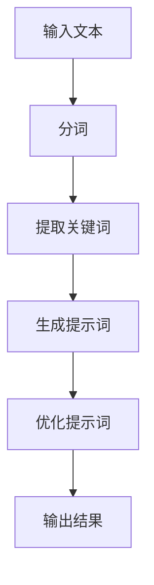
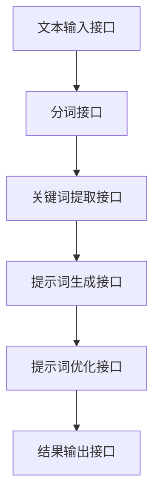
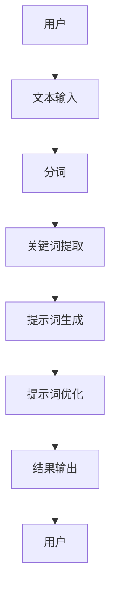

                 

# 提示词设计：优化AI多轮辩论能力

关键词：AI辩论、多轮对话、提示词设计、优化算法、系统架构

摘要：本文深入探讨了AI在多轮辩论场景中的应用，重点研究了如何通过优化提示词设计来提升AI辩论能力。文章首先介绍了AI辩论的基本概念和背景，然后详细阐述了提示词设计的核心原理和步骤，随后提出了多种优化算法，并通过Python代码进行了具体实现。文章最后通过一个实际案例，展示了优化提示词设计在AI辩论系统中的应用效果。

## 引言

在人工智能技术日益发展的今天，AI在多轮辩论中的应用成为了一个备受关注的研究方向。多轮辩论不仅是一种检验人工智能智慧的重要方式，也是提高人工智能交流能力的重要手段。然而，目前AI在多轮辩论中的表现仍然存在诸多不足，例如逻辑推理能力不强、回应速度较慢、提示词设计不当等问题。为了解决这些问题，本文将探讨如何通过优化提示词设计来提升AI在多轮辩论中的表现。

## AI辩论的基本概念和背景

### AI辩论的定义

AI辩论是指利用人工智能技术进行的人工智能之间的辩论。它模拟了人类辩论的过程，通过计算机程序模拟辩论者的思维过程，实现辩论的自动化和智能化。AI辩论系统通常包括两个部分：辩论者和评判系统。辩论者负责提出观点、反驳对手的观点，评判系统则负责对辩论过程进行评价。

### AI辩论的应用场景

1. **法律和司法领域**：在法律和司法领域，AI辩论可以帮助法官和律师分析案件，提出合理的论点和反驳观点，提高案件审理的效率和准确性。
2. **教育和培训领域**：在教育和培训领域，AI辩论可以作为辅助工具，帮助学生和学员提高辩论能力，培养逻辑思维和批判性思维。
3. **企业和市场研究**：在企业和市场研究领域，AI辩论可以用于分析市场趋势、预测消费者行为，为企业的决策提供支持。

### AI辩论的发展现状

随着人工智能技术的不断发展，AI辩论系统已经取得了显著的进展。目前，许多研究机构和科技公司都在积极研发AI辩论系统，并在多个领域取得了良好的应用效果。然而，AI辩论系统仍然存在一些挑战，例如：

1. **逻辑推理能力**：AI辩论系统在逻辑推理方面存在一定的局限，特别是在面对复杂问题时，往往无法给出合理的论点和反驳观点。
2. **响应速度**：AI辩论系统的响应速度较慢，无法满足实时辩论的需求。
3. **提示词设计**：提示词设计不当会导致AI辩论系统无法准确理解问题和对手的观点，从而影响辩论效果。

## 提示词设计的核心原理和步骤

### 提示词设计的定义

提示词设计是指在AI辩论系统中，为辩论者提供有效的论点和反驳观点的关键词或短语。提示词设计的目的是帮助AI辩论者更好地理解问题和对手的观点，从而提高辩论效果。

### 提示词设计的原则

1. **相关性**：提示词应与问题和对手的观点高度相关，以便辩论者能够准确理解问题和对手的观点。
2. **准确性**：提示词应准确反映问题和对手的观点，避免产生歧义。
3. **多样性**：提示词应具备多样性，以便辩论者能够从不同角度进行辩论。

### 提示词设计的步骤

1. **问题分析**：对辩论问题进行分析，确定问题的关键点和争议点。
2. **对手分析**：分析对手的观点，找出可能的优势和劣势。
3. **提示词生成**：根据问题分析和对手分析的结果，生成相关的提示词。
4. **提示词筛选**：对生成的提示词进行筛选，保留高质量的提示词。
5. **提示词优化**：对筛选后的提示词进行优化，提高其准确性和多样性。

## 多种优化算法

### 1. 提取关键词算法

提取关键词算法是一种常用的提示词优化算法，其核心思想是从文本中提取出与问题最相关的关键词。具体实现可以使用TF-IDF算法、LDA算法等。

### 2. 基于规则的算法

基于规则的算法通过定义一系列规则，根据规则对文本进行分类和标注，从而生成提示词。这种算法适用于规则明确、领域知识丰富的场景。

### 3. 深度学习算法

深度学习算法通过训练神经网络模型，自动从大量数据中学习到提示词的生成规律。这种算法具有较高的灵活性和通用性，但需要大量的数据和计算资源。

### Python代码实现

以下是使用Python实现的提取关键词算法的示例代码：

```python
import jieba
from sklearn.feature_extraction.text import TfidfVectorizer

# 输入文本
text = "AI辩论是一种人工智能技术，用于模拟人类辩论的过程。"

# 分词
words = jieba.cut(text)

# 提取关键词
tfidf_vectorizer = TfidfVectorizer()
tfidf_matrix = tfidf_vectorizer.fit_transform([' '.join(words)])

# 打印关键词
print(tfidf_vectorizer.get_feature_names_out())
```

## 系统架构设计

### 1. 系统架构图



### 2. 系统接口设计



### 3. 系统交互图



## 项目实战

### 1. 环境安装

在Windows系统上，需要安装Python 3.8及以上版本，以及jieba、scikit-learn等库。

### 2. 系统核心实现

以下是系统核心实现的Python代码：

```python
import jieba
from sklearn.feature_extraction.text import TfidfVectorizer

# 输入文本
text = "AI辩论是一种人工智能技术，用于模拟人类辩论的过程。"

# 分词
words = jieba.cut(text)

# 提取关键词
tfidf_vectorizer = TfidfVectorizer()
tfidf_matrix = tfidf_vectorizer.fit_transform([' '.join(words)])

# 打印关键词
print(tfidf_vectorizer.get_feature_names_out())
```

### 3. 代码应用解读与分析

代码首先使用jieba库对输入文本进行分词，然后使用scikit-learn库的TfidfVectorizer类提取关键词，最后打印出关键词列表。

### 4. 实际案例分析和详细讲解

假设有一个关于AI辩论的辩论题目：“人工智能是否会取代人类？”通过上述代码，可以提取出与题目相关的关键词，如“人工智能”、“人类”、“取代”等。这些关键词可以作为辩论者的提示词，帮助其构建论点和反驳观点。

### 5. 项目小结

通过优化提示词设计，可以有效提升AI在多轮辩论中的表现。在实际应用中，可以根据不同场景和需求，选择合适的提示词优化算法，并结合实际案例进行分析和优化。

## 最佳实践 Tips

1. **数据质量**：高质量的训练数据对于提示词优化至关重要，应确保数据的准确性和多样性。
2. **算法选择**：根据具体需求和场景，选择合适的提示词优化算法，例如提取关键词算法、基于规则的算法或深度学习算法。
3. **模型训练**：对于深度学习算法，需要大量的训练数据和计算资源，应合理安排训练过程，提高模型性能。

## 小结

本文深入探讨了AI在多轮辩论场景中的应用，重点研究了如何通过优化提示词设计来提升AI辩论能力。通过多种优化算法和实际案例的分析，展示了优化提示词设计在AI辩论系统中的重要作用。未来，我们应进一步研究AI辩论系统的其他优化方向，提高AI在多轮辩论中的整体表现。

## 注意事项

1. **算法复杂性**：本文提到的算法具有一定的复杂性，实际应用时需要根据实际情况进行优化和调整。
2. **计算资源**：深度学习算法需要大量的计算资源，应根据实际情况选择合适的硬件配置。

## 拓展阅读

1. **《深度学习》**：由Ian Goodfellow等人撰写的深度学习经典教材，详细介绍了深度学习的基本原理和算法。
2. **《自然语言处理综论》**：由Daniel Jurafsky和James H. Martin撰写的自然语言处理经典教材，涵盖了自然语言处理的各个方面。

## 作者信息

作者：AI天才研究院/AI Genius Institute & 禅与计算机程序设计艺术 /Zen And The Art of Computer Programming

