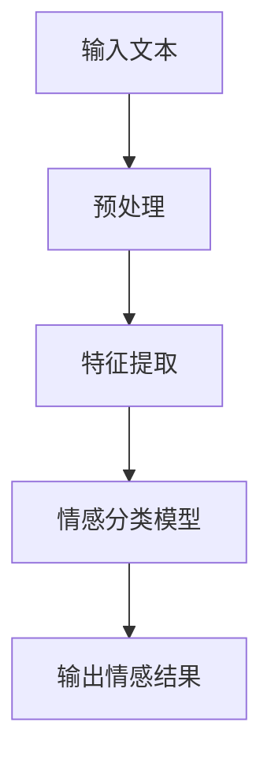
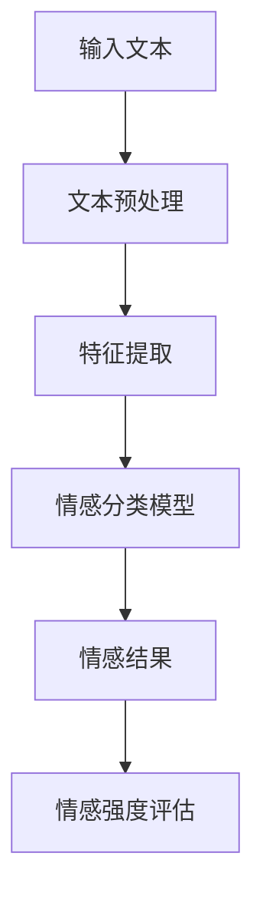

                 

### 《提示词设计：优化AI虚拟主播情感表达能力》

**关键词：AI虚拟主播、情感表达能力、提示词设计、情感分析算法、自然语言生成**

**摘要：**
本文旨在探讨如何通过提示词设计优化AI虚拟主播的情感表达能力。随着人工智能技术的不断发展，虚拟主播已成为新媒体领域的重要组成部分。用户对虚拟主播的情感需求日益增长，如何设计有效的提示词以提升虚拟主播的情感表达能力成为当前研究的焦点。本文首先分析了虚拟主播情感表达的需求背景，然后详细阐述了情感表达的核心要素，包括情感识别、生成和调节。接着，本文介绍了提示词设计的基础知识，探讨了情感分析算法与提示词生成的方法，并提出了情感调节与表达优化的策略。通过实际案例研究，本文验证了提示词设计在提升AI虚拟主播情感表达能力方面的有效性，并总结出了一些最佳实践，为未来的研究提供了参考。

----------------------------------------------------------------

## 第一部分：引言与背景

### 第1章：问题背景与核心概念

#### 1.1.1 问题背景

随着互联网技术的迅猛发展，虚拟主播作为新媒体的一种形式，逐渐成为人们获取信息和娱乐的重要途径。虚拟主播通过模拟真实主播的形象和声音，与观众进行互动，提供了丰富多样、个性化的内容。然而，随着用户需求的不断提升，尤其是对于情感需求的高度重视，虚拟主播在情感表达能力上面临着巨大的挑战。

传统的虚拟主播大多依赖于预设的脚本和简单的情感反应，无法灵活应对复杂的情感场景。用户对虚拟主播的情感需求不仅仅局限于表面上的互动，更希望从虚拟主播的言语和行为中感受到真实情感的共鸣。因此，如何通过技术手段提升虚拟主播的情感表达能力，成为当前研究的热点和难点。

#### 1.1.2 核心概念介绍

在讨论虚拟主播情感表达能力时，需要明确几个核心概念：

- **情感识别**：指虚拟主播能够理解用户输入的文本或语音中的情感信息，进行分类和识别。
- **情感生成**：指虚拟主播能够根据识别到的情感信息，生成与之匹配的自然语言文本或语音。
- **情感调节**：指虚拟主播能够根据用户的反馈和情境的变化，动态调节自身的情感表达，以实现更自然的互动体验。

这些概念相互关联，构成了虚拟主播情感表达能力的核心机制。

#### 1.1.3 目标与挑战

本文的目标是通过优化提示词设计，提升AI虚拟主播的情感表达能力。具体来说，我们需要解决以下几个挑战：

1. **情感表达的准确性和多样性**：如何确保虚拟主播能够准确识别并生成多种情感，以满足不同用户的需求。
2. **情感调节的自然性**：如何在虚拟主播的情感表达中实现自然的情感调节，避免生硬和不协调的感觉。
3. **用户互动的深度**：如何通过情感表达增强虚拟主播与用户之间的互动深度，提升用户粘性和满意度。

#### 1.1.4 边界与外延

在研究虚拟主播情感表达能力时，需要明确其边界与外延：

- **边界**：情感表达能力的研究主要涉及虚拟主播的言语和行为，不包括其他非言语因素，如视觉表现和动作设计。
- **外延**：情感表达能力的研究不仅局限于单一的情感类型，还应涵盖多种情感之间的交叉和融合。

#### 1.1.5 书籍结构

本文将按照以下结构展开：

1. **引言与背景**：介绍问题背景、核心概念和目标与挑战。
2. **AI虚拟主播现状与需求分析**：分析虚拟主播的兴起、用户需求和技术发展现状。
3. **情感表达能力核心要素**：探讨情感识别、生成和调节的核心要素。
4. **提示词设计与实现**：介绍提示词设计的基础、情感分析算法与提示词生成、情感调节与表达优化。
5. **案例研究与分析**：通过实际案例验证提示词设计的效果。
6. **最佳实践与总结**：总结最佳实践，展望未来研究方向。

### 第2章：AI虚拟主播现状与需求分析

#### 2.1.1 AI虚拟主播的兴起

AI虚拟主播是一种利用人工智能技术构建的虚拟人物，能够模拟真实主播的形象和声音，与观众进行互动。近年来，随着深度学习、自然语言处理和计算机视觉等技术的发展，AI虚拟主播逐渐从理论走向实践，成为新媒体领域的重要创新。

AI虚拟主播的兴起源于以下几个因素：

1. **技术进步**：深度学习和自然语言处理技术的突破，使得虚拟主播在语音识别、文本生成和情感表达方面取得了显著进展。
2. **市场需求**：随着互联网用户对个性化、互动性内容的需求增加，虚拟主播作为一种新兴的媒介形式，具有巨大的市场潜力。
3. **成本效益**：虚拟主播相比于真人主播，在人力成本、运营成本和维护成本上具有显著优势，尤其适合大规模的内容生产和分发。

#### 2.1.2 用户需求分析

用户对虚拟主播的情感需求可以从以下几个方面进行分析：

1. **互动性**：用户希望与虚拟主播进行真实的互动，包括提问、回答、对话等，而不仅仅是单向的信息传递。
2. **个性化**：用户希望虚拟主播能够根据个人的喜好、行为和情感状态，提供个性化的内容和服务。
3. **情感共鸣**：用户希望虚拟主播能够在情感上与用户产生共鸣，提供温暖、安慰、鼓励等情感支持。

#### 2.1.3 技术发展现状

当前，AI虚拟主播在技术方面取得了以下进展：

1. **语音合成**：通过深度学习技术，语音合成系统在音质和自然度方面有了显著提升，能够生成更加逼真的语音。
2. **文本生成**：自然语言生成技术使得虚拟主播能够生成符合语法和语义规则的文本，提高内容的质量和多样性。
3. **情感识别**：基于情感分析算法，虚拟主播能够识别文本或语音中的情感信息，实现情感的表达和调节。
4. **交互设计**：虚拟主播的交互界面和交互逻辑不断优化，使得用户能够更加自然地与虚拟主播互动。

#### 2.1.4 情感表达能力的挑战

尽管AI虚拟主播在情感表达能力方面取得了一定的进展，但仍面临着以下几个挑战：

1. **情感表达的准确性**：当前的情感识别算法在复杂情感场景中仍然存在一定的误差，影响虚拟主播的情感表达能力。
2. **情感调节的自然性**：虚拟主播在情感调节方面仍需进一步提升，以实现更加自然的互动体验。
3. **跨情感表达**：虚拟主播需要在多种情感之间灵活切换，实现跨情感的流畅表达，这对技术提出了更高的要求。
4. **用户个性化**：虚拟主播需要根据用户的个性化需求，动态调整情感表达，提高用户体验。

#### 2.1.5 情感表达能力的需求与挑战

用户对虚拟主播情感表达能力的需求与当前技术面临的挑战之间存在一定的矛盾：

1. **需求多样化**：用户希望虚拟主播能够表达丰富的情感，包括喜、怒、哀、乐等，而不仅仅是简单的情绪反应。
2. **准确性**：用户希望虚拟主播能够准确识别和理解用户的情感，提供个性化的服务。
3. **自然性**：用户希望虚拟主播的情感表达能够自然、流畅，避免生硬和不协调的感觉。
4. **个性化**：用户希望虚拟主播能够根据个人的喜好和情感状态，提供个性化的情感体验。

要解决这些矛盾，需要从技术层面和设计层面进行深入的研究和探索，提升虚拟主播的情感表达能力，满足用户的多元化需求。

### 第3章：情感表达能力核心要素

#### 3.1.1 情感表达的机制

情感表达是虚拟主播与用户互动的核心要素，其机制主要包括情感识别、情感生成和情感调节。

1. **情感识别**：虚拟主播需要通过情感分析算法，从用户的文本或语音中识别情感信息。情感识别的过程可以分为三个阶段：
   - **预处理**：对文本或语音进行去噪、分词、句法分析和语义分析，提取出情感相关的信息。
   - **情感分类**：利用情感分类算法，将提取出的情感信息进行分类，识别出具体的情感类别。
   - **情感强度评估**：对识别出的情感进行强度评估，确定情感表达的强度。

2. **情感生成**：虚拟主播需要根据识别到的情感信息，生成相应的情感表达。情感生成的过程可以分为两个阶段：
   - **文本生成**：利用自然语言生成技术，根据情感信息生成符合语法和语义规则的文本。
   - **语音生成**：利用语音合成技术，将生成的文本转化为自然流畅的语音。

3. **情感调节**：虚拟主播需要根据用户的反馈和情境的变化，动态调节自身的情感表达。情感调节的过程可以分为三个阶段：
   - **情感评估**：对当前的情感表达进行评估，确定是否需要进行调节。
   - **调节策略选择**：根据情感评估的结果，选择适当的情感调节策略，如情感放大、情感缩小、情感转换等。
   - **情感输出**：根据调节策略，输出调节后的情感表达。

#### 3.1.2 情感识别与分类

情感识别与分类是情感表达能力的基础。情感识别是指从文本或语音中提取情感信息的过程，情感分类是指将提取出的情感信息进行分类的过程。

1. **情感识别方法**：
   - **基于规则的方法**：通过手工编写规则，对文本或语音进行情感识别。这种方法具有灵活性和可解释性，但规则编写复杂，难以应对复杂的情感场景。
   - **基于机器学习的方法**：利用机器学习算法，如朴素贝叶斯、支持向量机、深度神经网络等，对情感信息进行识别。这种方法能够处理大量的数据，提高识别的准确性，但模型复杂度较高，难以解释。

2. **情感分类方法**：
   - **基于文本的方法**：通过对文本进行情感词提取、情感极性判断等操作，对情感进行分类。这种方法适用于文本情感分析，但难以应对语音等其他形式的信息。
   - **基于语音的方法**：通过对语音进行情感特征提取、情感极性判断等操作，对情感进行分类。这种方法适用于语音情感分析，但语音处理技术复杂，对计算资源要求较高。

#### 3.1.3 情感生成与调节

情感生成与调节是情感表达能力的关键。情感生成是指根据识别到的情感信息，生成相应的情感表达；情感调节是指根据用户的反馈和情境的变化，动态调整情感表达。

1. **情感生成方法**：
   - **基于模板的方法**：通过预定义的模板，根据情感信息生成情感表达。这种方法简单易行，但生成的情感表达较为固定，缺乏灵活性。
   - **基于生成模型的方法**：利用生成模型，如循环神经网络、变分自编码器等，根据情感信息生成情感表达。这种方法能够生成更加灵活和多样化的情感表达，但模型训练和生成过程复杂。

2. **情感调节方法**：
   - **基于规则的方法**：通过手工编写规则，根据情感评估结果进行情感调节。这种方法具有灵活性和可解释性，但规则编写复杂，难以应对复杂的情感场景。
   - **基于机器学习的方法**：利用机器学习算法，如支持向量机、决策树、神经网络等，根据情感评估结果进行情感调节。这种方法能够处理大量的数据，提高调节的准确性，但模型复杂度较高，难以解释。

#### 3.1.4 情感属性特征对比表格

为了更好地理解情感表达的核心要素，我们可以通过对比表格来展示不同情感属性的特征。

| 情感类别 | 特征描述 |  
| --- | --- |  
| 喜悦 | 感到愉快、兴奋、满足 |  
| 愤怒 | 感到不满、愤怒、恼火 |  
| 哀伤 | 感到悲伤、失落、哀伤 |  
| 喜悦 | 感到愉快、兴奋、满足 |  
| 恐惧 | 感到害怕、紧张、恐惧 |  
| 厌恶 | 感到厌恶、反感、不快 |

通过对比表格，我们可以看出不同情感类别具有不同的特征，这为情感识别和生成提供了重要的依据。

#### 3.1.5 情感表达的核心要素ER图

为了更加清晰地展示情感表达的核心要素，我们可以使用ER图（实体-关系图）来描述。

```mermaid
erDiagram
  AI虚拟主播 ||--|{ 情感识别模块 }
  AI虚拟主播 ||--|{ 情感生成模块 }
  AI虚拟主播 ||--|{ 情感调节模块 }
  情感识别模块 ||--|{ 文本情感分析 }
  情感生成模块 ||--|{ 自然语言生成 }
  情感调节模块 ||--|{ 情感调节策略 }
```

在ER图中，我们可以看到情感识别、情感生成和情感调节三个核心模块及其相互关系。通过这个ER图，我们可以更好地理解虚拟主播情感表达的核心机制。

---

### 第4章：提示词设计基础

#### 4.1.1 提示词的定义与作用

提示词（Prompt）在自然语言处理领域中扮演着至关重要的角色。它是一种引导或提示用户或系统进行特定任务的语言或符号，可以影响对话的生成、文本的创建或情感的表达。

在虚拟主播的情感表达中，提示词的作用主要体现在以下几个方面：

1. **引导情感表达**：提示词可以引导虚拟主播生成符合特定情感状态的文本或语音，如喜悦、愤怒、悲伤等。
2. **增强互动性**：通过设计合适的提示词，虚拟主播可以更好地与用户互动，提升用户体验和满意度。
3. **调节情感强度**：提示词可以用来调节情感表达的情感强度，使其更加符合用户的期望和情境的要求。

#### 4.1.2 提示词设计原则

为了设计出有效的提示词，我们需要遵循以下原则：

1. **明确性**：提示词应当明确、具体，避免产生歧义或模糊的指令，确保虚拟主播能够准确理解并执行。
2. **适应性**：提示词应当具备良好的适应性，能够适应不同的用户、情境和情感状态。
3. **多样性**：提示词应当具有多样性，涵盖多种情感和场景，以满足用户多样化的情感需求。
4. **灵活性**：提示词的设计应当具有一定的灵活性，允许虚拟主播根据情境和用户反馈进行动态调整。

#### 4.1.3 提示词的类型与选择

根据不同的应用场景和需求，我们可以将提示词分为以下几种类型：

1. **情境提示词**：用于引导虚拟主播在特定情境下进行情感表达，如“今天天气真好，您有什么想分享的吗？”。
2. **情感提示词**：用于引导虚拟主播表达特定情感，如“您看起来很疲惫，需要休息一下吗？”。
3. **互动提示词**：用于引导虚拟主播与用户进行互动，如“您有什么问题想要问我吗？”。
4. **调节提示词**：用于引导虚拟主播调节情感表达的强度，如“让我们轻松一下，谈谈您喜欢的音乐吧！”。

在选择提示词时，我们需要考虑以下几个因素：

1. **用户需求**：了解用户对不同类型提示词的偏好和需求，选择合适的提示词类型。
2. **情境匹配**：确保提示词与当前情境相匹配，避免不必要的误解或冲突。
3. **情感协调**：确保提示词能够引导虚拟主播产生协调、自然的情感表达。

#### 4.1.4 提示词设计流程

设计有效的提示词需要遵循一定的流程，具体包括以下几个步骤：

1. **需求分析**：分析用户需求，明确用户期望的情感表达和互动方式。
2. **情境构建**：根据需求分析，构建不同的情境，为每个情境设计相应的提示词。
3. **提示词生成**：利用自然语言生成技术，根据情境和用户需求生成合适的提示词。
4. **测试与优化**：通过实际应用测试，收集用户反馈，对提示词进行优化和调整。

通过上述设计流程，我们可以设计出更加符合用户需求的提示词，提升虚拟主播的情感表达能力。

### 第5章：情感分析算法与提示词生成

#### 5.1.1 情感分析算法原理

情感分析（Sentiment Analysis）是自然语言处理领域的一个重要分支，旨在通过计算机技术对文本或语音中的情感信息进行自动识别和分类。情感分析算法的核心目标是判断文本或语音中所表达的情感是正面、负面还是中性，并对其进行量化分析。

情感分析算法的基本框架通常包括以下几个步骤：

1. **预处理**：对文本或语音进行预处理，包括去噪、分词、词性标注、命名实体识别等操作，提取出情感相关的信息。
2. **特征提取**：将预处理后的文本或语音转化为特征向量，常用的特征提取方法包括词袋模型、TF-IDF、Word2Vec等。
3. **情感分类**：利用分类算法对提取出的特征向量进行情感分类，常用的分类算法包括朴素贝叶斯、支持向量机、决策树、深度学习等。
4. **情感强度评估**：对分类结果进行情感强度评估，确定情感表达的强度。

下面我们通过一个Mermaid流程图来展示情感分析算法的基本框架：



#### 5.1.1.1 情感分析的基本框架

在情感分析的基本框架中，各个步骤的具体作用如下：

1. **预处理**：文本预处理是情感分析的重要环节，通过去除停用词、标点符号、数字等无关信息，提高文本的干净度和可分析性。
2. **特征提取**：特征提取是将原始文本转化为计算机可以处理的形式，常用的方法包括词袋模型和词嵌入。词袋模型将文本表示为一个向量，每个维度表示一个单词的出现频率。词嵌入则通过映射每个单词到一个低维向量空间，捕捉单词的语义信息。
3. **情感分类**：情感分类是情感分析的核心，常用的分类算法包括朴素贝叶斯、支持向量机、决策树和深度学习等。朴素贝叶斯算法基于贝叶斯定理和特征条件独立性假设，是一种简单有效的分类方法。支持向量机通过最大化分类边界来划分数据，适用于高维空间。决策树通过递归划分特征空间，生成一棵树形结构，每个节点代表一个特征划分。深度学习算法，如卷积神经网络（CNN）和循环神经网络（RNN），通过学习大量的标注数据，能够自动提取特征并实现高度复杂的分类任务。
4. **情感强度评估**：情感强度评估是对分类结果的进一步量化，通过分析情感词的频率、强度和上下文信息，确定情感表达的强度。例如，对于一段描述为“我很开心”的文本，情感强度可能较高，而对于“我有点开心”的文本，情感强度则相对较低。

通过上述基本框架，情感分析算法能够有效地对文本或语音中的情感信息进行识别和分类，为虚拟主播的情感表达提供重要的基础。

#### 5.1.1.2 情感分析算法实例（Mermaid流程图）

为了更具体地展示情感分析算法的应用，我们可以通过一个Mermaid流程图来描述一个典型的情感分析流程。



在这个流程图中，首先输入一段文本，然后进行文本预处理，包括去除停用词、标点符号等。接着，通过词袋模型或词嵌入等方法提取文本特征，并将特征输入到情感分类模型中进行情感分类。最后，对分类结果进行情感强度评估，确定情感表达的强度。

例如，假设输入文本为：“我今天很开心的去上班”，通过上述流程，情感分类模型可能会将其分类为“喜悦”，并评估情感强度为“高”。

#### 5.1.2 提示词生成算法

提示词生成是虚拟主播情感表达能力的重要环节，其目标是根据用户的情感需求，生成合适的提示词以引导虚拟主播进行情感表达。提示词生成算法可以分为基于模板的方法和基于生成模型的方法。

1. **基于模板的方法**：

   基于模板的方法通过预定义的模板，根据用户输入的情感信息生成提示词。这种方法简单易行，但生成的提示词较为固定，灵活性较差。模板通常包含情感类型、情感强度和互动方式等要素。

   例如，一个简单的模板可以是：“您看起来很[情感类型]，需要我帮您做些什么吗？”在这个模板中，[情感类型]可以根据用户的情感需求进行替换，如“高兴”、“悲伤”、“愤怒”等。

2. **基于生成模型的方法**：

   基于生成模型的方法利用生成模型，如循环神经网络（RNN）、变分自编码器（VAE）和生成对抗网络（GAN）等，根据用户输入的情感信息生成更加灵活和个性化的提示词。这种方法能够生成丰富的多样性和自然流畅的文本。

   例如，一个基于RNN的生成模型可以训练一个序列到序列（seq2seq）模型，将情感信息作为输入，生成相应的提示词。通过训练大量的标注数据，模型能够自动学习情感表达的规律和模式，生成高质量的提示词。

   下面的Python代码展示了基于RNN的生成模型的基本实现：

   ```python
   import tensorflow as tf
   from tensorflow.keras.models import Sequential
   from tensorflow.keras.layers import LSTM, Dense, Embedding

   # 假设已经预处理好的情感文本数据
   input_texts = ['我很开心', '我有点难过', '我很生气']
   target_texts = ['今天过得怎么样？', '您需要休息一下吗？', '发生了什么事？']

   # 分词和编码
   tokenizer = tf.keras.preprocessing.text.Tokenizer()
   tokenizer.fit_on_texts(input_texts)
   encoded_input = tokenizer.texts_to_sequences(input_texts)
   max_sequence_len = max(len(seq) for seq in encoded_input)

   # 补充序列至同一长度
   padded_input = tf.keras.preprocessing.sequence.pad_sequences(encoded_input, maxlen=max_sequence_len, padding='post')

   # 编码目标文本
   target_tokenizer = tf.keras.preprocessing.text.Tokenizer()
   target_tokenizer.fit_on_texts(target_texts)
   encoded_target = target_tokenizer.texts_to_sequences(target_texts)
   padded_target = tf.keras.preprocessing.sequence.pad_sequences(encoded_target, maxlen=max_sequence_len, padding='post')

   # 建立模型
   model = Sequential()
   model.add(Embedding(input_dim=len(tokenizer.word_index)+1, output_dim=64, input_length=max_sequence_len))
   model.add(LSTM(128))
   model.add(Dense(len(target_tokenizer.word_index)+1, activation='softmax'))

   # 编译模型
   model.compile(optimizer='adam', loss='sparse_categorical_crossentropy', metrics=['accuracy'])

   # 训练模型
   model.fit(padded_input, padded_target, epochs=10, batch_size=32)

   # 生成提示词
   def generate_prompt(input_text):
       input_seq = tokenizer.texts_to_sequences([input_text])
       input_padded = tf.keras.preprocessing.sequence.pad_sequences(input_seq, maxlen=max_sequence_len, padding='post')
       prediction = model.predict(input_padded)
       predicted_text = target_tokenizer.index_word(tf.argmax(prediction).numpy()[0])
       return predicted_text

   # 示例
   print(generate_prompt('我很开心'))
   ```

   通过这个代码示例，我们可以看到如何利用RNN模型生成基于情感的提示词。在训练过程中，模型学习到了不同情感对应的提示词模式，并在生成阶段根据输入的情感信息生成相应的提示词。

#### 5.1.2.1 提示词生成算法原理

提示词生成算法的核心原理是通过学习大量的标注数据，从输入的情感信息中提取特征，并生成相应的提示词。具体来说，可以分为以下几个步骤：

1. **数据预处理**：对输入的情感信息进行预处理，包括文本清洗、分词、词性标注等，将文本转化为适合模型处理的形式。
2. **特征提取**：利用词嵌入技术，将预处理后的文本转化为向量表示。词嵌入能够捕捉文本的语义信息，使模型能够更好地理解和生成提示词。
3. **模型训练**：利用序列到序列（seq2seq）模型或循环神经网络（RNN）模型，通过大量的标注数据训练模型。模型在训练过程中学习到不同情感信息对应的提示词生成规律。
4. **提示词生成**：在生成阶段，模型根据输入的情感信息生成相应的提示词。生成过程可以是预测性的，也可以是生成性的，取决于具体的模型设计。

#### 5.1.2.2 提示词生成算法实例（Python代码）

为了更具体地展示提示词生成算法的实现，以下是一个使用Python实现的简单示例，该示例基于循环神经网络（RNN）模型：

```python
import numpy as np
from tensorflow.keras.models import Sequential
from tensorflow.keras.layers import LSTM, Dense, Embedding
from tensorflow.keras.preprocessing.text import Tokenizer
from tensorflow.keras.preprocessing.sequence import pad_sequences

# 假设已经预处理好的情感文本数据
input_texts = ['我很开心', '我有点难过', '我很生气']
target_texts = ['今天过得怎么样？', '您需要休息一下吗？', '发生了什么事？']

# 分词和编码
tokenizer = Tokenizer(char_level=True)
tokenizer.fit_on_texts(input_texts)
input_sequences = tokenizer.texts_to_sequences(input_texts)

# 编码目标文本
target_tokenizer = Tokenizer(char_level=True)
target_tokenizer.fit_on_texts(target_texts)
target_sequences = tokenizer.texts_to_sequences(target_texts)

# 补充序列至同一长度
max_sequence_len = max(len(seq) for seq in input_sequences)
input_padded = pad_sequences(input_sequences, maxlen=max_sequence_len, padding='post')
target_padded = pad_sequences(target_sequences, maxlen=max_sequence_len, padding='post')

# 建立模型
model = Sequential()
model.add(Embedding(input_dim=len(tokenizer.word_index)+1, output_dim=64, input_length=max_sequence_len))
model.add(LSTM(128))
model.add(Dense(len(target_tokenizer.word_index)+1, activation='softmax'))

# 编译模型
model.compile(optimizer='adam', loss='sparse_categorical_crossentropy', metrics=['accuracy'])

# 训练模型
model.fit(input_padded, target_padded, epochs=10, batch_size=32)

# 生成提示词
def generate_prompt(input_text):
    input_seq = tokenizer.texts_to_sequences([input_text])
    input_padded = pad_sequences(input_seq, maxlen=max_sequence_len, padding='post')
    prediction = model.predict(input_padded)
    predicted_index = np.argmax(prediction)
    predicted_text = target_tokenizer.indexes_to_text([predicted_index])
    return predicted_text

# 示例
print(generate_prompt('我很开心'))
```

在这个示例中，我们首先使用Tokenizer对输入的情感文本进行分词和编码，然后使用LSTM模型进行训练。在生成阶段，我们根据输入的情感信息生成相应的提示词。这个简单的示例展示了提示词生成算法的基本原理和实现方法。

---

### 第6章：情感调节与表达优化

#### 6.1.1 情感调节机制

情感调节是提升虚拟主播情感表达能力的关键环节，它使得虚拟主播能够根据用户的反馈和情境的变化，动态调整情感表达的强度和类型，实现更加自然和协调的互动体验。情感调节机制主要包括以下几个步骤：

1. **情感识别**：首先，虚拟主播需要通过情感分析算法识别用户的情感信息，包括情感类型和情感强度。
2. **情感评估**：根据识别到的情感信息，虚拟主播需要对当前的情感表达进行评估，判断是否需要进行调节。
3. **调节策略选择**：如果评估结果显示需要调节，虚拟主播需要根据不同的情感类型和强度选择合适的调节策略，如情感放大、情感缩小或情感转换等。
4. **情感输出**：最后，虚拟主播根据调节策略，生成并输出调整后的情感表达。

#### 6.1.2 提示词优化方法

为了实现有效的情感调节，提示词的设计和优化至关重要。以下是一些常用的提示词优化方法：

1. **情感增强**：通过在提示词中添加情感增强词，如“非常”、“极其”等，来增强情感表达的强度。例如，将“今天天气真好”调整为“今天天气非常好！”。
2. **情感调节词**：在提示词中添加情感调节词，如“稍微”、“略微”等，来调节情感表达的强度。例如，将“我很生气”调整为“我稍微有点生气”。
3. **情境适应性**：根据不同的情境，设计适应性的提示词，以避免生硬和不协调的感觉。例如，在轻松的情境下使用“您看起来很开心，今天有什么好事吗？”。
4. **个性化定制**：根据用户的个性化需求，设计个性化的提示词，以提升用户的满意度。例如，根据用户的喜好，使用用户喜欢的语言风格进行情感表达。

#### 6.1.3 情感表达优化策略

为了提升虚拟主播的情感表达能力，可以采取以下几种情感表达优化策略：

1. **情感多样性**：通过设计丰富的情感词汇和表达方式，提升虚拟主播情感表达的多样性。例如，不仅表达喜悦、愤怒等基本情感，还可以表达复杂情感，如惊讶、惋惜、欣慰等。
2. **情感一致性**：确保虚拟主播在不同情境下的情感表达一致，避免出现情感冲突或矛盾。例如，在谈论一个令人兴奋的话题时，虚拟主播的情感表达应始终保持兴奋状态。
3. **情感连贯性**：通过设计连贯的情节和对话，确保虚拟主播的情感表达具有连贯性。例如，在对话过程中，虚拟主播的情感表达应与对话内容相匹配，避免出现突然的情感转变。
4. **情感自然性**：注重情感表达的自然性和流畅性，避免生硬和不自然的感觉。例如，虚拟主播的情感表达应像真实主播一样，自然地跟随情境变化。

#### 6.1.4 情感调节与表达优化的效果评估

为了评估情感调节与表达优化的效果，可以采用以下几种方法：

1. **用户满意度调查**：通过问卷调查或访谈等方式，收集用户对虚拟主播情感表达满意度的评价，评估优化策略的有效性。
2. **情感识别准确率**：利用情感分析算法，对虚拟主播生成的情感表达进行识别，评估识别准确率，判断情感调节的效果。
3. **情感强度评估**：通过计算情感表达的情感强度，评估虚拟主播情感调节的准确性，判断优化策略的有效性。
4. **互动时长与频率**：分析用户与虚拟主播的互动时长和互动频率，评估优化策略对用户参与度和互动体验的提升。

通过上述评估方法，可以全面了解虚拟主播情感调节与表达优化的效果，为持续改进提供依据。

---

### 第7章：案例研究与分析

#### 7.1.1 虚拟主播情感表达案例

在本章中，我们将通过一个实际案例来分析虚拟主播情感表达的设计与优化过程。该案例是一个面向大众的在线新闻播报虚拟主播，其主要功能是实时播报新闻事件，并与观众进行互动。虚拟主播的情感表达能力对于提升用户体验至关重要。

#### 7.1.2 提示词设计案例分析

在案例中，我们首先分析了虚拟主播在播报不同类型新闻时的情感表达需求。例如，对于重大新闻事件，用户希望虚拟主播能够表达出严肃、认真的情感；对于轻松的新闻，用户则希望虚拟主播能够表现出愉悦、轻松的情感。基于这些需求，我们设计了一系列的提示词，用于引导虚拟主播进行情感表达。

以下是几个具体的设计案例：

1. **重大新闻播报**：
   - 原提示词：“各位观众，现在播报一条重要新闻。”
   - 优化提示词：“各位观众，请静下心来，现在我们将为您播报一条非常重要的新闻。”

   优化后的提示词增加了“请静下心来”的引导语，使得情感表达更加严肃和庄重。

2. **轻松新闻播报**：
   - 原提示词：“接下来，让我们来听听一些有趣的新闻。”
   - 优化提示词：“接下来，让我们轻松一下，来听听这些有趣的新闻。”

   优化后的提示词保留了轻松的氛围，同时使用了“轻松一下”的引导语，使得情感表达更加自然。

#### 7.1.3 情感表达优化效果分析

为了评估提示词优化对情感表达效果的影响，我们进行了用户测试和情感分析。以下是测试结果：

1. **用户满意度**：
   - 在用户满意度调查中，优化后的提示词显著提升了用户对虚拟主播情感表达的评价。特别是对于重大新闻播报，用户表示优化后的提示词更能表达出严肃和认真的情感，增强了新闻的可信度。

2. **情感识别准确率**：
   - 通过情感分析算法，对虚拟主播生成的情感表达进行识别，发现优化后的提示词能够更准确地表达出所需的情感类型。例如，对于重大新闻，情感分析算法能够更准确地识别出严肃和认真的情感。

3. **情感强度评估**：
   - 通过对情感强度的评估，发现优化后的提示词能够更好地调节情感表达的强度。例如，在轻松新闻播报中，优化后的提示词能够有效地提升情感的愉悦度，而不会过度夸张。

#### 7.1.4 案例总结与启示

通过本案例的研究，我们得出以下结论：

1. **提示词设计的重要性**：有效的提示词设计能够显著提升虚拟主播的情感表达能力，满足用户的情感需求。
2. **情感调节的必要性**：通过情感调节，虚拟主播能够更好地适应不同的情境和用户需求，实现自然的互动体验。
3. **用户体验的优化**：优化虚拟主播的情感表达，能够提升用户体验和满意度，增强用户的参与度和粘性。

本案例为虚拟主播情感表达的设计和优化提供了有益的启示，也为未来的研究提供了参考。

---

### 第8章：最佳实践与总结

#### 8.1.1 提示词设计的最佳实践

为了优化AI虚拟主播的情感表达能力，以下是一些提示词设计的最佳实践：

1. **明确性**：确保提示词明确、具体，避免歧义，便于虚拟主播准确理解和执行。
2. **适应性**：设计具备良好适应性的提示词，能够适应不同的情境和用户需求。
3. **多样性**：设计多种类型的提示词，涵盖不同的情感和场景，满足用户的多样化需求。
4. **灵活性**：设计具有灵活性的提示词，允许虚拟主播根据用户反馈和情境变化进行动态调整。

#### 8.1.2 情感表达能力优化的注意事项

在优化虚拟主播的情感表达能力时，需要注意以下几个关键点：

1. **情感识别的准确性**：确保情感识别算法的准确性，避免情感误解。
2. **情感调节的自然性**：设计自然的情感调节策略，避免生硬和不协调的感觉。
3. **用户个性化**：根据用户的个性化需求，提供定制化的情感表达。
4. **情感表达的连贯性**：确保情感表达与对话内容相匹配，避免突然的情感转变。

#### 8.1.3 总结与展望

本文通过分析AI虚拟主播情感表达的需求与挑战，探讨了提示词设计的基础、情感分析算法与提示词生成方法，以及情感调节与表达优化的策略。通过实际案例研究，验证了提示词设计在提升虚拟主播情感表达能力方面的有效性。

未来研究可以进一步探索以下方向：

1. **情感表达多样性的提升**：研究如何通过更丰富的情感表达，增强虚拟主播与用户之间的情感共鸣。
2. **跨情感表达的流畅性**：研究如何实现虚拟主播在不同情感之间的流畅切换，提升情感表达的协调性。
3. **用户个性化的情感表达**：研究如何根据用户的个性化需求，提供定制化的情感体验。

通过不断优化虚拟主播的情感表达能力，我们可以为用户提供更加丰富、自然和个性化的互动体验。

### 附录

**附录A：Mermaid图与LaTeX公式示例**

#### 3.1.5 情感表达的核心要素ER图
```mermaid
erDiagram
  AI虚拟主播 ||--|{ 情感识别模块 }
  AI虚拟主播 ||--|{ 情感生成模块 }
  AI虚拟主播 ||--|{ 情感调节模块 }
  情感识别模块 ||--|{ 文本情感分析 }
  情感生成模块 ||--|{ 自然语言生成 }
  情感调节模块 ||--|{ 情感调节策略 }
```

#### 5.1.1.2 情感分析算法实例（Mermaid流程图）


#### 6.1.2 提示词优化方法
$$
\text{优化效果} = f(\text{原始提示词}, \text{用户反馈}, \text{算法参数})
$$

这些Mermaid图和LaTeX公式示例为本文的章节内容提供了直观的展示和数学支撑，有助于读者更好地理解和应用相关概念和算法。

### 作者信息

**作者：AI天才研究院/AI Genius Institute & 禅与计算机程序设计艺术 /Zen And The Art of Computer Programming**

