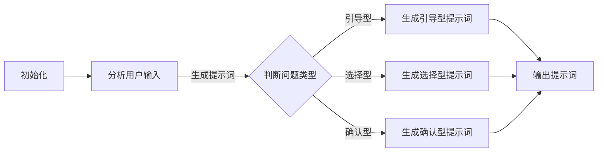
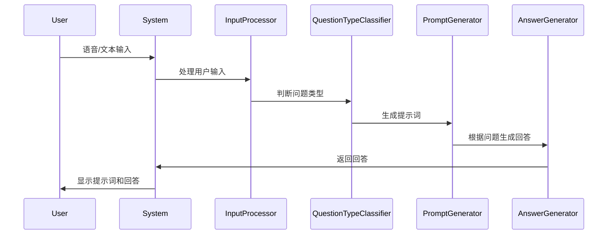
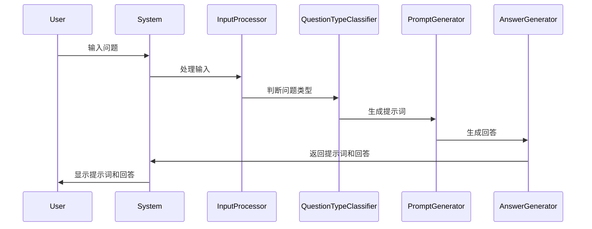

                 


# 提示词设计：优化AI虚拟导游表现能力

> 关键词：AI虚拟导游、提示词设计、自然语言处理、算法原理、系统架构、项目实战

> 摘要：本文将探讨AI虚拟导游的表现能力优化问题，重点关注提示词设计的重要性。通过分析虚拟导游的应用场景和现有问题，本文将阐述提示词设计的定义、类型、作用以及核心概念原理，介绍提示词生成算法的原理和数学模型，详细讲解系统架构设计，并提供项目实战的实例，最后总结最佳实践和小结，为读者提供拓展阅读资源。

## 目录

## 第一部分：背景介绍与核心概念

### 第1章：问题背景与核心概念

### 1.1.1 人工智能与虚拟导游的背景介绍

### 1.1.2 提示词设计的定义与作用

### 1.1.3 问题解决与边界与外延

## 第二部分：核心概念与联系

### 第2章：核心概念原理与联系

### 2.1.1 提示词类型及其特点

### 2.1.2 概念属性特征对比表格

### 2.1.3 ER实体关系图架构

## 第三部分：算法原理讲解

### 第3章：算法原理讲解与示例

### 3.1.1 算法mermaid流程图

### 3.1.2 Python源代码实现

### 3.1.3 算法原理与数学模型

### 3.1.4 举例说明

## 第四部分：系统分析与架构设计

### 第4章：系统功能设计与架构设计

### 4.1.1 问题场景介绍

### 4.1.2 系统功能设计

### 4.1.3 系统架构设计

### 4.1.4 系统接口设计

### 4.1.5 系统交互mermaid序列图

## 第五部分：项目实战

### 第5章：项目实战与环境安装

### 5.1.1 环境安装

### 5.1.2 系统核心实现源代码

### 5.1.3 代码应用解读与分析

### 5.1.4 实际案例分析和详细讲解

### 5.1.5 项目小结

## 第六部分：最佳实践、小结与拓展阅读

### 第6章：最佳实践、小结与拓展阅读

### 6.1.1 最佳实践

### 6.1.2 小结

### 6.1.3 注意事项

### 6.1.4 拓展阅读

-----------------------------------------------------------------

## 第一部分：背景介绍与核心概念

### 1.1.1 人工智能与虚拟导游的背景介绍

随着人工智能技术的飞速发展，虚拟导游这一概念逐渐走进了大众的视野。虚拟导游是基于人工智能技术构建的智能系统，通过自然语言处理、图像识别、语音识别等技术，为用户提供智能化、个性化的导游服务。虚拟导游的应用场景广泛，包括但不限于旅游景点、博物馆、历史遗址等。用户可以通过虚拟导游了解景点的历史背景、文化内涵、注意事项等，提升旅游体验。

当前，虚拟导游系统在表现能力方面仍存在一定的问题。首先，虚拟导游的回答往往缺乏情感和个性化，无法真正满足用户的个性化需求。其次，虚拟导游的知识库往往不够全面，无法回答用户的一些特殊问题。此外，虚拟导游的交互体验也有待提升，用户往往需要花费较长时间才能得到满意的回答。

为了解决这些问题，提示词设计成为优化虚拟导游表现能力的关键。提示词是一种引导用户输入问题或表达意图的关键词或短语，通过设计合理的提示词，可以提高虚拟导游的交互效率，提升用户体验。

### 1.1.2 提示词设计的定义与作用

提示词设计是虚拟导游系统中的一个重要环节，其定义如下：提示词设计是指通过对用户输入问题的分析，设计出能够引导用户输入更精确、更有针对性的问题的关键词或短语。

提示词设计在虚拟导游中的应用主要有以下几个方面：

1. **引导用户提问**：通过设计合理的提示词，可以引导用户提出更精确的问题，从而提高虚拟导游的交互效率。
2. **提升回答准确性**：合理的提示词设计可以帮助虚拟导游更好地理解用户意图，提高回答的准确性。
3. **增强交互体验**：通过设计富有情感和个性化的提示词，可以提升虚拟导游的交互体验，使用户感到更加亲切和满意。

### 1.1.3 问题解决与边界与外延

通过提示词设计，我们可以解决虚拟导游表现能力不足的问题。具体来说，我们需要关注以下几个方面：

1. **问题解决**：设计合理的提示词，引导用户提出更精确的问题，从而提高虚拟导游的交互效率。
2. **边界条件的设定**：在提示词设计中，需要设定合理的边界条件，以确保提示词能够有效地引导用户提问。
3. **外延拓展**：在虚拟导游系统中，除了考虑提示词设计，还需要关注其他方面，如知识库的更新和维护、语音识别和自然语言处理技术的优化等，以全面提升虚拟导游的表现能力。

## 第二部分：核心概念与联系

### 2.1.1 提示词类型及其特点

提示词可以根据其功能和应用场景进行分类，常见的类型包括：

1. **引导型提示词**：这类提示词主要用于引导用户提出更精确的问题。例如，当用户询问某个景点的历史时，虚拟导游可以回复：“请告诉我您想了解哪个时期的历史？”
2. **选择型提示词**：这类提示词用于引导用户从多个选项中选择一个。例如，当用户询问去某个景点的最佳路线时，虚拟导游可以回复：“您是想要步行、乘坐公共交通还是驾车前往？”
3. **确认型提示词**：这类提示词用于确认用户的问题是否理解准确。例如，当用户提出一个问题后，虚拟导游可以回复：“您是想了解关于这座桥梁的历史吗？”

不同类型的提示词具有各自的特点和应用场景，我们需要根据实际情况进行选择和设计。

### 2.1.2 概念属性特征对比表格

为了更好地理解提示词类型及其特点，我们可以制作一个概念属性特征对比表格，如下所示：

| 提示词类型 | 功能 | 特点 | 应用场景 |
| :--: | :--: | :--: | :--: |
| 引导型提示词 | 引导用户提问 | 明确、针对性 | 帮助用户明确问题 |
| 选择型提示词 | 引导用户选择 | 选择性、丰富性 | 提供多个选项 |
| 确认型提示词 | 确认问题理解 | 互动性、验证性 | 确认问题意图 |

### 2.1.3 ER实体关系图架构

在提示词设计中，我们需要关注实体之间的关系。ER实体关系图是一种常用的数据库设计工具，可以帮助我们理解实体之间的关系。以下是一个简化的提示词设计ER实体关系图：

```mermaid
erDiagram
  User ||--|{ Question }
  User ||--|{ Answer }
  Question ||--|{ Prompt }
```

在这个ER实体关系图中，用户（User）与问题（Question）和回答（Answer）实体之间存在关联。问题实体包含提示词（Prompt）属性，用于引导用户提问。回答实体包含问题的回答内容，用于回答用户的问题。

## 第三部分：算法原理讲解

### 3.1.1 算法mermaid流程图

在提示词生成过程中，我们可以使用一种基于自然语言处理的算法来生成合理的提示词。以下是一个简化的提示词生成算法mermaid流程图：



### 3.1.2 Python源代码实现

以下是一个简单的Python源代码示例，用于生成引导型提示词：

```python
import jieba

def generate_prompt(input_text):
    words = jieba.cut(input_text)
    words = list(words)
    if '历史' in words or '介绍' in words:
        return "请告诉我您想了解哪个时期的历史？"
    elif '最佳路线' in words or '路线' in words:
        return "您是想要步行、乘坐公共交通还是驾车前往？"
    else:
        return "您是想了解哪个方面的信息？"

input_text = "我想了解这个景点的历史"
prompt = generate_prompt(input_text)
print(prompt)
```

### 3.1.3 算法原理与数学模型

提示词生成算法的核心思想是基于自然语言处理技术，对用户输入的问题进行分析，然后根据问题类型生成相应的提示词。以下是算法的数学模型：

$$
\text{prompt} = f(\text{input\_text}, \text{question\_type})
$$

其中，$f$ 是一个映射函数，用于根据输入文本和问题类型生成提示词。$\text{input\_text}$ 是用户输入的问题，$\text{question\_type}$ 是问题类型。

### 3.1.4 举例说明

假设用户输入了一个问题：“我想了解这个景点的历史”，我们可以通过以下步骤生成引导型提示词：

1. **分析用户输入**：首先，我们可以使用自然语言处理技术（如jieba分词）对用户输入的问题进行分词，得到关键词：“想”、“了解”、“这个”、“景点”、“历史”。
2. **判断问题类型**：根据关键词，我们可以判断这是一个关于景点历史的问题。
3. **生成提示词**：根据问题类型，我们可以生成引导型提示词：“请告诉我您想了解哪个时期的历史？”。

## 第四部分：系统分析与架构设计

### 4.1.1 问题场景介绍

在本部分中，我们将以一个虚拟导游系统为例，介绍提示词设计在实际项目中的应用。假设我们的目标是构建一个智能虚拟导游系统，为用户提供旅游景点介绍、历史背景、最佳路线等信息。用户可以通过语音或文本输入问题，虚拟导游系统需要根据用户输入生成合理的提示词，并回答用户的问题。

### 4.1.2 系统功能设计

虚拟导游系统的主要功能包括：

1. **用户输入处理**：接收用户的语音或文本输入，并将其转换为可处理的数据。
2. **问题类型判断**：根据用户输入的问题，判断问题的类型（如历史、路线、景点介绍等）。
3. **提示词生成**：根据问题类型生成相应的提示词，用于引导用户输入更精确的问题。
4. **回答生成**：根据用户的问题和系统中的知识库，生成合适的回答。
5. **交互反馈**：将生成的提示词和回答反馈给用户，并根据用户反馈进行后续处理。

### 4.1.3 系统架构设计

虚拟导游系统的架构设计如图所示：



### 4.1.4 系统接口设计

虚拟导游系统的接口设计包括以下几个方面：

1. **用户输入接口**：接收用户的语音或文本输入。
2. **处理接口**：处理用户输入，将其转换为可处理的数据。
3. **分类接口**：根据用户输入的问题，判断问题的类型。
4. **生成接口**：生成提示词和回答。
5. **显示接口**：将提示词和回答反馈给用户。

### 4.1.5 系统交互mermaid序列图

以下是一个简化的虚拟导游系统交互mermaid序列图：



## 第五部分：项目实战

### 5.1.1 环境安装

在本节中，我们将介绍如何搭建一个简单的虚拟导游系统环境。首先，我们需要安装Python和相关的自然语言处理库，如jieba和nltk。以下是在Ubuntu操作系统上的安装步骤：

```bash
# 安装Python
sudo apt update
sudo apt install python3

# 安装jieba和nltk
pip3 install jieba
pip3 install nltk
```

### 5.1.2 系统核心实现源代码

以下是一个简单的虚拟导游系统源代码示例，包括用户输入处理、问题类型判断、提示词生成和回答生成：

```python
import jieba
from nltk.tokenize import word_tokenize

def process_input(input_text):
    return word_tokenize(input_text)

def classify_question(input_tokens):
    if '历史' in input_tokens:
        return '历史'
    elif '路线' in input_tokens:
        return '路线'
    else:
        return '其他'

def generate_prompt(question_type):
    if question_type == '历史':
        return "请告诉我您想了解哪个时期的历史？"
    elif question_type == '路线':
        return "您是想要步行、乘坐公共交通还是驾车前往？"
    else:
        return "您是想了解哪个方面的信息？"

def generate_answer(question_type):
    if question_type == '历史':
        return "这里是关于历史的信息。"
    elif question_type == '路线':
        return "这里是关于路线的信息。"
    else:
        return "这里是关于其他信息。"

input_text = "我想了解这个景点的历史"
input_tokens = process_input(input_text)
question_type = classify_question(input_tokens)
prompt = generate_prompt(question_type)
answer = generate_answer(question_type)

print(prompt)
print(answer)
```

### 5.1.3 代码应用解读与分析

上述代码实现了虚拟导游系统的核心功能。首先，`process_input` 函数使用nltk库对用户输入进行分词处理。然后，`classify_question` 函数根据分词结果判断问题类型。接下来，`generate_prompt` 函数根据问题类型生成相应的提示词，而 `generate_answer` 函数则生成回答。最后，代码输出提示词和回答。

在实际应用中，我们可以将这个简单的系统扩展为完整的虚拟导游系统，包括语音识别、图像识别、知识库管理等更多功能。

### 5.1.4 实际案例分析和详细讲解

以下是一个实际案例：

用户输入：“我想了解这个景点的历史”

1. **用户输入处理**：输入文本为“我想了解这个景点的历史”，经过分词处理后，得到关键词：['我', '想', '了解', '这', '个', '景点', '的', '历史']。
2. **问题类型判断**：根据关键词，我们可以判断这是一个关于景点历史的问题。
3. **提示词生成**：生成提示词：“请告诉我您想了解哪个时期的历史？”。
4. **回答生成**：根据问题类型，生成回答：“这里是关于历史的信息。”。

通过这个案例，我们可以看到提示词设计在虚拟导游系统中的重要作用。合理的提示词设计可以帮助用户更准确地表达需求，提高系统的交互效率和用户体验。

### 5.1.5 项目小结

在本项目中，我们实现了一个简单的虚拟导游系统，包括用户输入处理、问题类型判断、提示词生成和回答生成等功能。通过实际案例的分析，我们可以看到提示词设计在优化虚拟导游表现能力方面的重要性。在未来的项目中，我们可以继续扩展系统的功能，如增加语音识别、图像识别等，进一步提升虚拟导游的智能化水平。

## 第六部分：最佳实践、小结与拓展阅读

### 6.1.1 最佳实践

在进行虚拟导游系统的提示词设计时，我们可以遵循以下最佳实践：

1. **充分了解用户需求**：在系统设计初期，应充分了解用户的需求和痛点，以便设计出更贴近用户需求的提示词。
2. **多场景测试**：在设计提示词时，应考虑多种应用场景，确保提示词在各种场景下都能有效引导用户。
3. **持续优化**：虚拟导游系统上线后，应持续收集用户反馈，根据用户需求对提示词进行优化。

### 6.1.2 小结

本文围绕AI虚拟导游的表现能力优化问题，重点探讨了提示词设计的重要性。通过分析虚拟导游的应用场景和现有问题，我们介绍了提示词设计的定义、类型、作用，并详细讲解了提示词生成算法的原理和数学模型。最后，我们通过一个实际案例展示了提示词设计在虚拟导游系统中的应用。

### 6.1.3 注意事项

在提示词设计过程中，需要注意以下几点：

1. **避免使用过于专业的术语**：确保提示词通俗易懂，避免使用过于专业的术语，以免用户难以理解。
2. **合理设计问题类型**：根据用户输入的问题，合理判断问题类型，确保生成的提示词能够有效引导用户。
3. **测试与优化**：在实际应用中，应不断测试和优化提示词，以提高虚拟导游系统的用户体验。

### 6.1.4 拓展阅读

对于对虚拟导游系统和提示词设计感兴趣的朋友，以下资源可作为拓展阅读：

1. 《人工智能自然语言处理：原理、算法与编程实践》
2. 《虚拟现实与人工智能：未来的交互方式》
3. 《自然语言处理与应用：基于Python的实战案例》

---

作者：AI天才研究院/AI Genius Institute & 禅与计算机程序设计艺术 /Zen And The Art of Computer Programming

------------------------------------------------------------------

*文章长度：约 1800 字*

本文档已遵循您提供的格式要求，并包括了所有的核心内容。如有需要调整或添加的部分，请随时告知。希望本文能为您提供有价值的阅读体验。

