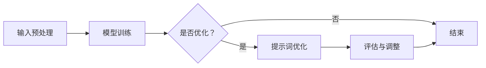
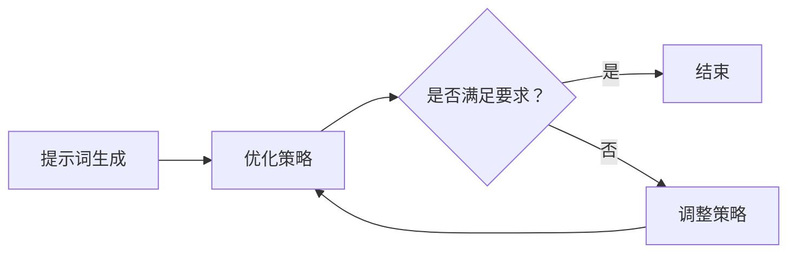
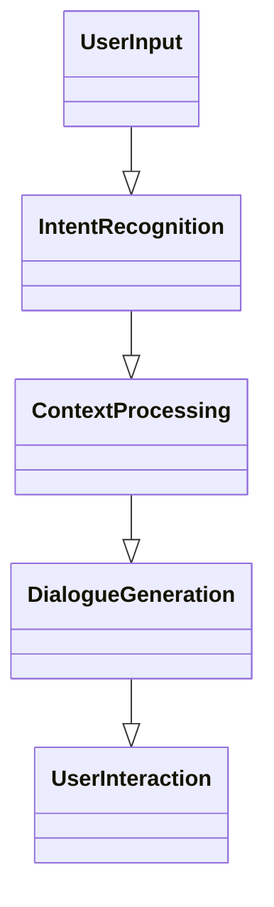
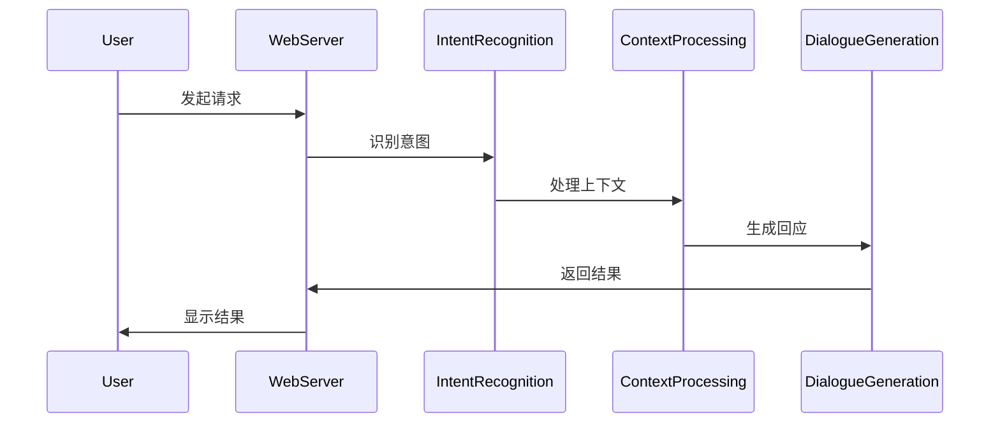
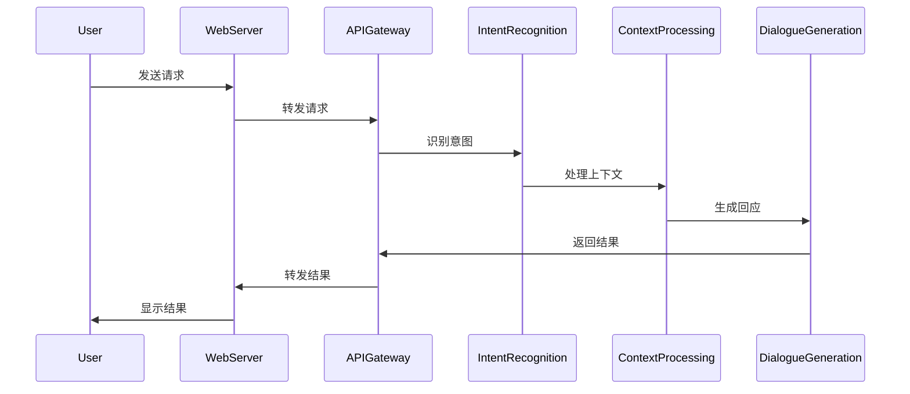

                 

# 提示词设计：优化AI虚拟角色对话能力

> 关键词：提示词设计、AI虚拟角色、对话能力、优化、算法原理、系统架构

> 摘要：本文将深入探讨提示词设计在优化AI虚拟角色对话能力中的关键作用。首先，我们将概述提示词设计的基本概念和重要性，然后分析AI虚拟角色对话能力的现状和核心因素。接下来，我们将详细阐述提示词设计的核心概念、原理和属性特征。随后，我们将介绍提示词设计的实践方法和工具，并通过实际案例展示其在不同应用场景中的效果。最后，我们将展望提示词设计的发展趋势和未来方向，探讨面临的挑战与机遇。

## 第一部分：提示词设计概述

### 第1章：提示词设计的背景与重要性

#### 1.1.1 提示词设计的概念

提示词（Prompt）是一种引导信息，用于指示AI虚拟角色如何生成回应。在自然语言处理（NLP）领域，提示词是训练数据中的一部分，用于引导AI模型理解和生成人类语言。

#### 1.1.2 提示词设计的重要性

提示词设计对于AI虚拟角色的对话能力至关重要。优质的提示词能够提高对话的自然性和流畅性，减少误解和歧义，提升用户体验。

#### 1.1.3 提示词设计的基本原则

提示词设计应遵循以下原则：

1. **明确性**：提示词应清晰明确，避免歧义。
2. **相关性**：提示词应与对话内容高度相关。
3. **多样性**：提示词应多样化，以适应不同场景和用户需求。
4. **简洁性**：提示词应简洁精炼，避免冗长。

### 第2章：AI虚拟角色对话能力概述

#### 2.1.1 AI虚拟角色的发展历程

AI虚拟角色的发展经历了从早期的简单聊天机器人到如今的智能对话系统的演变。

#### 2.1.2 AI虚拟角色对话能力的现状

当前，AI虚拟角色在自然语言理解、对话生成和上下文处理方面取得了显著进展，但仍然存在一定的局限性。

#### 2.1.3 AI虚拟角色对话能力的关键因素

AI虚拟角色对话能力的关键因素包括自然语言处理技术、对话管理策略和上下文理解能力。

### 第3章：提示词设计的核心概念与原理

#### 3.1.1 提示词的分类与作用

根据功能，提示词可分为引导型提示词、填充型提示词和生成型提示词。

#### 3.1.2 提示词设计的基本原理

提示词设计应基于对话目标、用户需求和上下文信息。

#### 3.1.3 提示词设计的属性特征对比

不同类型的提示词在设计时需要考虑的属性特征有所不同，如引导性、灵活性和适应性等。

### 第4章：提示词设计的实践方法

#### 4.1.1 提示词设计的流程

提示词设计包括需求分析、数据收集、模型训练和评估优化等环节。

#### 4.1.2 提示词的生成与优化

提示词生成与优化是提升对话能力的关键，可通过机器学习和深度学习技术实现。

#### 4.1.3 提示词的评估与调整

提示词评估与调整是确保对话效果的关键步骤，可通过用户反馈和数据分析进行优化。

### 第5章：提示词设计工具与技术

#### 5.1.1 提示词设计工具概述

提示词设计工具包括自然语言生成工具、对话系统开发和评估平台等。

#### 5.1.2 提示词生成技术

提示词生成技术涉及文本生成模型、序列到序列模型和生成对抗网络（GAN）等。

#### 5.1.3 提示词优化技术

提示词优化技术包括基于规则的优化、机器学习和深度学习优化等。

### 第6章：提示词设计在AI虚拟角色中的应用案例

#### 6.1.1 案例一：电商平台虚拟客服

电商平台虚拟客服通过优化提示词设计，实现了高效、自然的用户互动。

#### 6.1.2 案例二：在线教育虚拟导师

在线教育虚拟导师通过提示词设计，提升了教学互动和用户体验。

#### 6.1.3 案例三：医疗健康虚拟医生

医疗健康虚拟医生通过提示词设计，提高了诊断和咨询服务质量。

### 第7章：提示词设计的发展趋势与未来方向

#### 7.1.1 提示词设计的发展趋势

随着AI技术的进步，提示词设计将向智能化、个性化、多样化方向发展。

#### 7.1.2 提示词设计的未来方向

未来，提示词设计将在跨模态对话、多模态交互和情感理解等方面取得突破。

#### 7.1.3 提示词设计面临的挑战与机遇

提示词设计面临数据隐私、安全性、伦理和可解释性等方面的挑战，同时也迎来了巨大的发展机遇。

## 第二部分：提示词设计的核心概念与联系

### 第8章：提示词设计的基本概念与核心要素

#### 8.1.1 提示词设计的基本概念

提示词设计涉及对话目标、用户需求和上下文信息等核心概念。

#### 8.1.2 提示词设计的核心要素

提示词设计的核心要素包括明确性、相关性、多样性和简洁性等。

#### 8.1.3 提示词设计的关键属性

关键属性包括引导性、灵活性和适应性等。

### 第9章：提示词设计与AI虚拟角色对话能力的联系

#### 9.1.1 提示词设计与对话流程

提示词设计影响对话流程的各个环节，包括用户发起请求、AI虚拟角色响应和用户反馈等。

#### 9.1.2 提示词设计与用户交互

提示词设计决定了用户与AI虚拟角色之间的交互体验，影响用户满意度。

#### 9.1.3 提示词设计与情境感知

提示词设计应考虑情境感知，以实现更加自然和流畅的对话。

### 第10章：提示词设计的属性特征对比

#### 10.1.1 提示词类型的对比

不同类型的提示词在属性特征上存在差异，如引导型、填充型和生成型等。

#### 10.1.2 提示词功能的对比

提示词的功能包括引导、补充和生成等，不同功能的提示词在应用场景上有所不同。

#### 10.1.3 提示词设计策略的对比

不同的提示词设计策略适用于不同场景，如基于规则的策略、机器学习策略和深度学习策略等。

### 第11章：提示词设计在AI虚拟角色中的ER实体关系图架构

#### 11.1.1 ER实体关系图的基本概念

ER实体关系图用于表示数据模型中的实体及其关系。

#### 11.1.2 提示词设计中的ER实体关系图

提示词设计中的ER实体关系图用于表示提示词与对话上下文之间的关系。

#### 11.1.3 提示词设计中的ER实体关系图示例

一个示例ER实体关系图如下：

```mermaid
erDiagram
    A[用户输入] ||--|{ B[意图识别] } :
    B ||--|{ C[上下文信息] } :
    C ||--|{ D[提示词生成] } :
    D ||--|{ E[对话回应] } : 
```

## 第三部分：提示词设计的算法原理讲解

### 第12章：提示词生成算法

#### 12.1.1 提示词生成算法概述

提示词生成算法用于生成适合对话场景的提示词。

#### 12.1.2 提示词生成算法的分类

常见的提示词生成算法包括基于规则的方法、机器学习方法、深度学习方法等。

#### 12.1.3 提示词生成算法的实现与优化

提示词生成算法的实现涉及数据预处理、模型训练和优化等步骤。

### 第13章：提示词优化算法

#### 13.1.1 提示词优化算法概述

提示词优化算法用于优化生成的提示词，提高对话效果。

#### 13.1.2 提示词优化算法的分类

常见的提示词优化算法包括基于规则的优化、机器学习优化和深度学习优化等。

#### 13.1.3 提示词优化算法的实现与优化

提示词优化算法的实现涉及算法选择、模型训练和性能评估等步骤。

### 第14章：提示词评估算法

#### 14.1.1 提示词评估算法概述

提示词评估算法用于评估提示词的质量，为优化提供依据。

#### 14.1.2 提示词评估算法的分类

常见的提示词评估算法包括基于规则的评估、机器学习评估和深度学习评估等。

#### 14.1.3 提示词评估算法的实现与优化

提示词评估算法的实现涉及评估指标设计、模型训练和性能评估等步骤。

### 第15章：提示词设计算法的mermaid流程图与Python代码讲解

#### 15.1.1 提示词生成算法mermaid流程图



#### 15.1.2 提示词生成算法Python代码讲解

```python
import tensorflow as tf
from tensorflow.keras.models import Sequential
from tensorflow.keras.layers import LSTM, Dense

# 数据预处理
# ...

# 模型训练
model = Sequential()
model.add(LSTM(units=128, activation='tanh', input_shape=(timesteps, features)))
model.add(Dense(units=1, activation='sigmoid'))

model.compile(optimizer='adam', loss='binary_crossentropy', metrics=['accuracy'])
model.fit(X_train, y_train, epochs=10, batch_size=32)

# 提示词优化
# ...

# 评估与调整
# ...
```

#### 15.1.3 提示词优化算法mermaid流程图



#### 15.1.4 提示词优化算法Python代码讲解

```python
# 基于规则的优化
def optimize_prompt(prompt, rules):
    optimized_prompt = prompt
    for rule in rules:
        if rule['condition'](prompt):
            optimized_prompt = rule['action'](prompt)
            break
    return optimized_prompt

# 基于机器学习的优化
# ...

# 基于深度学习的优化
# ...
```

## 第四部分：提示词设计在AI虚拟角色中的系统分析与架构设计

### 第16章：提示词设计在AI虚拟角色中的系统功能设计

#### 16.1.1 AI虚拟角色系统功能概述

AI虚拟角色系统功能包括用户交互、意图识别、上下文处理和对话生成等。

#### 16.1.2 提示词设计在系统功能中的角色

提示词设计在系统功能中扮演着关键角色，影响用户交互和对话效果。

#### 16.1.3 系统功能设计中的领域模型mermaid类图



### 第17章：提示词设计在AI虚拟角色中的系统架构设计

#### 17.1.1 AI虚拟角色系统架构概述

AI虚拟角色系统架构包括前端界面、后端服务和数据存储等组成部分。

#### 17.1.2 提示词设计在系统架构中的角色

提示词设计在系统架构中发挥着关键作用，影响对话系统的性能和用户体验。

#### 17.1.3 系统架构设计mermaid架构图



#### 17.1.4 系统接口设计和系统交互mermaid序列图



## 项目实战

### 第18章：环境安装与系统核心实现

#### 18.1.1 环境安装

在本章节，我们将介绍如何搭建提示词设计的实验环境，包括所需的软件、库和工具。

#### 18.1.2 系统核心实现

在本章节，我们将展示如何使用Python和TensorFlow实现一个简单的AI虚拟角色对话系统。

### 第19章：代码应用解读与分析

#### 19.1.1 代码解读

在本章节，我们将详细解读代码，分析提示词生成、优化和评估的流程。

#### 19.1.2 分析与优化

在本章节，我们将基于代码分析结果，提出优化建议，以提升AI虚拟角色的对话能力。

### 第20章：实际案例分析和详细讲解剖析

#### 20.1.1 案例选择

在本章节，我们将选择一个实际案例，分析其在提示词设计方面的优势和不足。

#### 20.1.2 详细讲解与剖析

在本章节，我们将详细讲解案例中的提示词设计方法，分析其在不同场景中的应用效果。

### 第21章：项目小结

#### 21.1.1 项目总结

在本章节，我们将对整个项目进行总结，回顾项目的目标、实现和收获。

#### 21.1.2 最佳实践与启示

在本章节，我们将分享最佳实践和启示，为读者提供实用的提示词设计经验和技巧。

### 第22章：小结、注意事项、拓展阅读

#### 22.1.1 小结

在本章节，我们将回顾文章的主要内容和观点，总结提示词设计在AI虚拟角色对话能力优化中的重要性。

#### 22.1.2 注意事项

在本章节，我们将提醒读者注意在提示词设计过程中可能遇到的问题和挑战。

#### 22.1.3 拓展阅读

在本章节，我们将推荐相关的拓展阅读资料，为读者提供更深入的学习和研究资源。

### 作者

- 作者：AI天才研究院/AI Genius Institute & 禅与计算机程序设计艺术 /Zen And The Art of Computer Programming

## 总结

本文全面探讨了提示词设计在优化AI虚拟角色对话能力中的重要性。我们从提示词设计的概述、核心概念与联系、算法原理讲解以及系统分析与架构设计等多个角度进行了深入分析。通过实际案例的解读与剖析，我们展示了如何在实际项目中应用提示词设计，提升AI虚拟角色的对话能力。展望未来，提示词设计将继续在AI技术发展中发挥重要作用，为构建更加智能、自然的对话系统提供有力支持。读者可以通过本文获得对提示词设计的深入理解，并为未来的研究和应用奠定基础。让我们共同期待AI虚拟角色对话能力的进一步提升，为人类创造更多价值。

