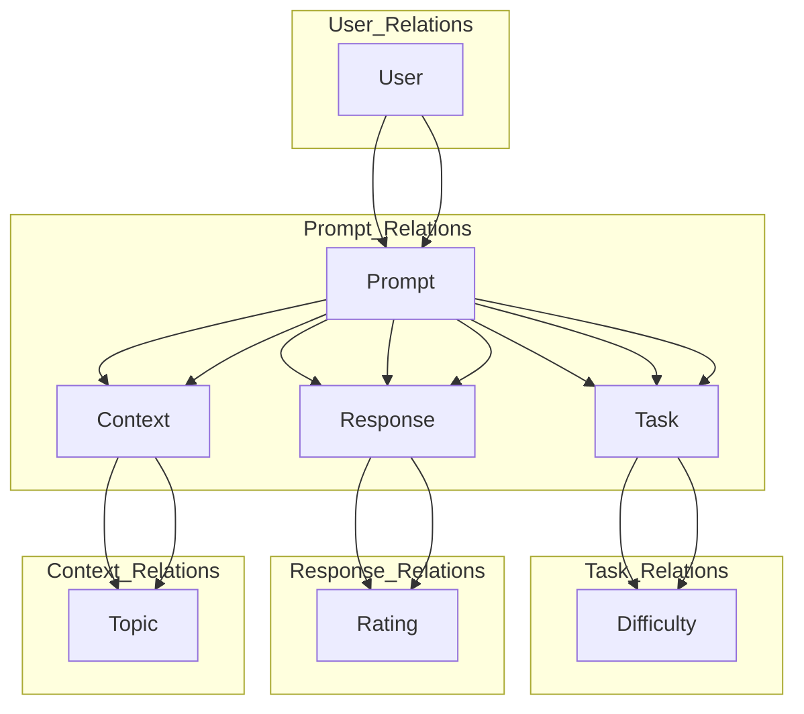
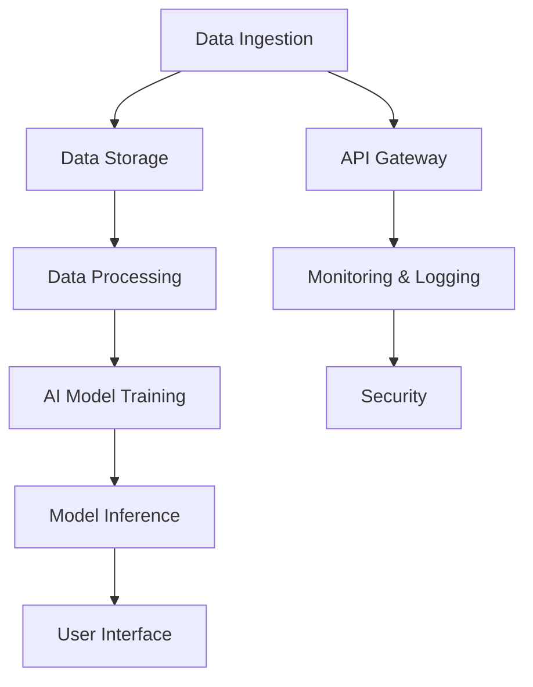
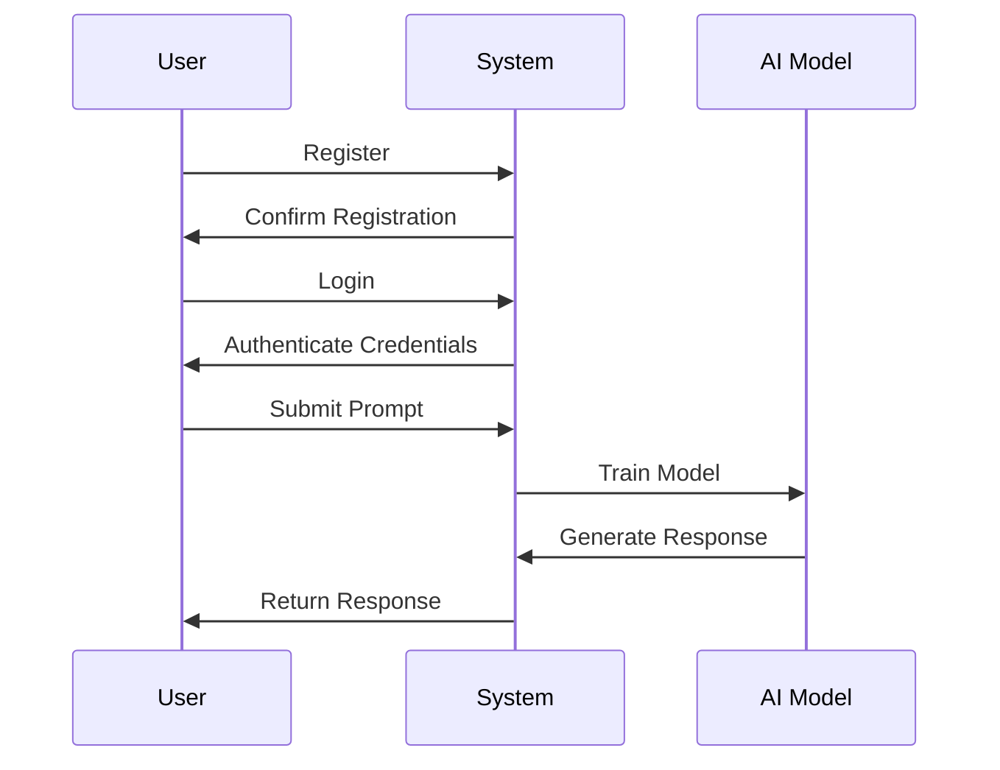
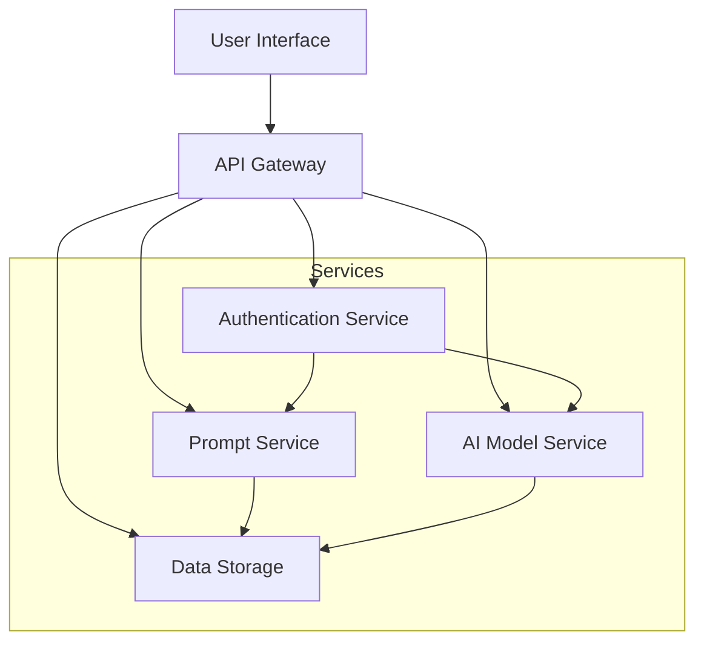
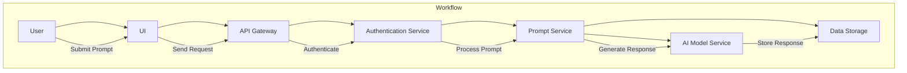
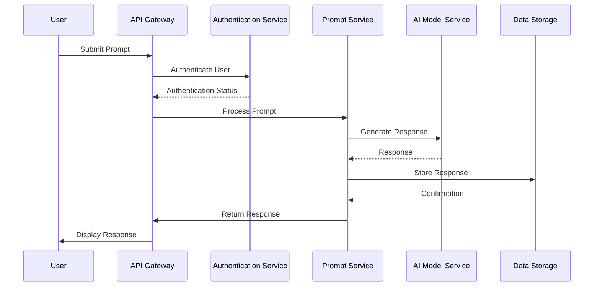

                 

### Introduction: The Rise of AI and the Art of Prompt Design

#### 2.1 The Evolution of AI and Its Impact

**Background Introduction:**
The field of artificial intelligence (AI) has witnessed tremendous growth over the past few decades, transforming industries and reshaping societal landscapes. From simple rule-based systems to advanced machine learning algorithms, AI has evolved significantly, becoming an integral part of our daily lives.

**Problem Description and Solution:**
As AI becomes more sophisticated, the challenge of designing effective prompts to guide and shape AI behavior has emerged. Prompts play a crucial role in determining the output and performance of AI systems. The solution lies in understanding the principles of prompt design and applying them to create engaging and effective prompts.

**Boundary and Scope:**
This article focuses on the art of prompt design within the context of AI. It aims to provide a comprehensive overview of the key concepts, techniques, and best practices involved in designing effective prompts. The scope includes an exploration of neural networks, language models, algorithm design, mathematical models, system architecture, and practical applications.

**Key Concepts and Components:**
To delve into the topic, we need to understand several key concepts and components:
1. **AI and Machine Learning:**
   - Definition and scope
   - Evolution and current trends
   - Importance in modern technology
2. **Prompts:**
   - Definition and types
   - Role in AI systems
   - Characteristics of effective prompts
3. **Neural Networks and Language Models:**
   - Basic principles and architecture
   - Applications in prompt design
4. **Algorithm Design and Mathematical Models:**
   - Fundamental concepts
   - Importance in AI
   - Role in prompt design
5. **System Architecture and Design:**
   - Overview of system components
   - Importance in AI applications
   - Techniques for designing efficient systems

In the following sections, we will delve deeper into each of these components, providing a step-by-step analysis of how to design effective prompts for AI systems. By the end of this article, readers will have a solid understanding of the principles and techniques involved in shaping AI personalities through prompt design.

---

### The Role of Prompts in AI

#### 2.2 The Role of Prompts in AI

**Definition of Prompts:**
A prompt is an input provided to an AI system to guide its behavior and elicit a desired response. It can be a simple text, an image, or a combination of various data types. In the context of natural language processing (NLP), prompts are often textual instructions that help AI models understand the context, objectives, and expectations of the user.

**Types of Prompts:**
There are several types of prompts commonly used in AI systems, each serving a specific purpose:
1. **Guided Prompts:**
   - Provide explicit instructions to the AI model
   - Example: "Generate a poem about love"
2. **Open-Ended Prompts:**
   - Allow the AI model to explore a wide range of topics and responses
   - Example: "Write about your favorite holiday destination"
3. **Contextual Prompts:**
   - Incorporate background information to help the AI model generate more relevant responses
   - Example: "Assume you are a travel agent and suggest a trip for a couple celebrating their anniversary"
4. **Interactive Prompts:**
   - Engage the user in a conversation to refine the AI's responses
   - Example: "What do you think about this restaurant I am considering for my anniversary?"

**Importance of Prompt Design:**
Effective prompt design is crucial for several reasons:
1. **Performance:**
   - Well-designed prompts can significantly enhance the performance and accuracy of AI models.
   - They help the AI model understand the user's intent and generate more relevant and useful responses.
2. **User Experience:**
   - User-friendly prompts improve the overall user experience by making the AI system more intuitive and accessible.
   - They can guide users through complex tasks and provide clear directions for achieving their goals.
3. **Innovation:**
   - Innovative prompt design can lead to novel AI applications and solutions.
   - By exploring different types of prompts and their potential uses, developers can uncover new ways to leverage AI for various industries and domains.

**Principles of Prompt Design:**
To design effective prompts, several core principles should be considered:
1. **Clarity:**
   - Prompts should be clear and concise, avoiding ambiguity and vagueness.
   - They should clearly communicate the desired outcome or task to the AI model.
2. **Relevance:**
   - Prompts should be relevant to the task at hand, aligning with the user's goals and expectations.
   - They should incorporate context and background information to enhance the relevance of the AI's responses.
3. **Flexibility:**
   - Prompts should be flexible enough to accommodate a wide range of scenarios and user inputs.
   - They should allow the AI model to generate diverse and creative responses.
4. **Interactivity:**
   - Interactive prompts can improve user engagement and provide a more personalized experience.
   - They can help refine the AI's responses based on user feedback and input.

By applying these principles and techniques, developers can create effective prompts that enhance the performance and usability of AI systems. In the following sections, we will explore the technical aspects of prompt design in more detail, including neural networks, algorithm design, and system architecture.

---

### The Art of Crafting Effective Prompts

**Core Principles of Prompt Design**

**Clarity and Conciseness:**
Effective prompt design starts with clarity and conciseness. A prompt should be clear and easy to understand, leaving no room for ambiguity. It should convey the desired task or objective concisely, avoiding unnecessary complexity. For example, instead of saying "Write a persuasive essay on the benefits of renewable energy," a clearer prompt would be "Explain the benefits of renewable energy in a persuasive essay."

**Relevance and Context:**
Relevant prompts provide the necessary context for the AI model to generate accurate and useful responses. Incorporating relevant background information or context can greatly enhance the AI's ability to understand the user's intent. For example, a contextual prompt for generating a travel itinerary could be "Plan a three-day trip to Paris for a family of four, considering their preferences for historical sites and cuisine."

**Flexibility and Open-Endedness:**
Flexible prompts allow the AI model to explore a wide range of scenarios and generate diverse responses. Open-ended prompts provide more freedom for creativity and innovation. For example, instead of a closed-ended prompt like "What is the capital of France?", an open-ended prompt could be "Describe the landmarks and attractions you would visit in Paris."

**Interactivity and Engagement:**
Interactive prompts can enhance user engagement and provide a more personalized experience. They can guide users through complex tasks or help refine the AI's responses based on user feedback. For example, an interactive prompt for a virtual assistant could be "Do you want to book a flight, hotel, or both?"

**Techniques for Creating Engaging Prompts**

**1. Use of Keywords and Phrases:**
Incorporating relevant keywords and phrases can make prompts more effective. Keywords help the AI model understand the main topic or concept, while phrases provide additional context. For example, instead of saying "Write a story," a more effective prompt would be "Write a short story about a magical journey to a hidden island."

**2. Storytelling and Narrative:**
Storytelling can make prompts more engaging and relatable. By creating a narrative or story context, the AI model can generate more creative and emotionally resonant responses. For example, a prompt for generating a poem could be "Imagine a world where time flows backwards. Write a poem about the wonders and challenges of such a world."

**3. Incorporation of User Preferences:**
Incorporating user preferences or personalization options can make prompts more relevant and tailored to individual users. This can be achieved by asking users specific questions or providing options for customization. For example, a prompt for generating personalized recommendations could be "Based on your favorite movies, create a list of books that you might enjoy."

**4. Use of Visualization and Multimedia:**
Visual prompts, images, or multimedia elements can enhance the effectiveness of prompts, especially in tasks involving visual perception or creative expression. For example, a prompt for generating an artwork could be "Create a painting inspired by the landscape shown in this photo."

**Challenges and Opportunities**

**1. Ambiguity and Vagueness:**
One of the main challenges in prompt design is dealing with ambiguity and vagueness. Ambiguous prompts can lead to incorrect or irrelevant responses from the AI model. To overcome this challenge, it is essential to be clear and specific in the prompts provided. For example, instead of saying "Describe a beautiful sunset," a clearer prompt would be "Describe the vibrant colors and serene atmosphere of a sunset over the ocean."

**2. Understanding Context:**
AI models often struggle to understand context, especially when the context is complex or multifaceted. Designing prompts that provide clear and relevant context can help mitigate this issue. For example, instead of saying "Write a poem about nature," a more effective prompt would be "Write a poem about the beauty and tranquility of a forest in the early morning."

**3. Scalability and Adaptability:**
Designing prompts that are scalable and adaptable to a wide range of scenarios and users can be challenging. To address this challenge, developers can use techniques such as data augmentation, transfer learning, and context-aware prompts. For example, instead of creating a separate prompt for each user, a context-aware prompt could adapt to the user's preferences and context dynamically.

**4. User Experience:**
Designing prompts that provide a seamless and intuitive user experience is crucial. Users should be able to understand and interact with the prompts easily, without needing extensive technical knowledge. This can be achieved by using simple language, clear instructions, and interactive elements.

In conclusion, crafting effective prompts requires a deep understanding of the AI model's capabilities and limitations, as well as the user's needs and expectations. By applying the principles and techniques discussed in this section, developers can create engaging and effective prompts that enhance the performance and usability of AI systems. In the following sections, we will delve into the technical aspects of prompt design, including neural networks, algorithm design, and system architecture.

---

### Understanding Neural Networks

#### 3.1 Understanding Neural Networks

**Basic Concepts:**
Neural networks are a type of machine learning model inspired by the structure and function of the human brain. They consist of interconnected nodes, called neurons, that process and transmit information. Neural networks are composed of multiple layers, including an input layer, one or more hidden layers, and an output layer. Each layer is responsible for transforming the input data through a series of mathematical operations, enabling the network to learn patterns and relationships in the data.

**Types of Neural Networks:**
There are several types of neural networks, each with its own unique architecture and applications:
1. **Feedforward Neural Networks:**
   - The simplest type of neural network, where the information flows in one direction, from the input layer to the output layer.
   - They are commonly used for classification and regression tasks.
2. **Convolutional Neural Networks (CNNs):**
   - Specialized for processing and analyzing visual data, such as images and videos.
   - They use convolutional layers to capture spatial patterns and hierarchies in the data.
3. **Recurrent Neural Networks (RNNs):**
   - Designed to handle sequential data, such as time series, text, and audio.
   - They use recurrent connections to maintain information about previous inputs, enabling them to capture temporal dependencies.
4. **Transformers:**
   - A type of neural network architecture that has revolutionized natural language processing (NLP).
   - They use self-attention mechanisms to weigh the importance of different input elements and generate more meaningful representations.

**Principles and Applications:**
The principles behind neural networks involve training the network to learn from examples by adjusting the weights and biases of the connections between neurons. This process, known as backpropagation, involves propagating the errors from the output layer back through the network, updating the weights and biases to minimize the difference between the predicted and actual outputs.

Neural networks have numerous applications across various domains, including:
1. **Computer Vision:**
   - Image classification, object detection, and semantic segmentation.
   - Example: Identifying objects in photos or videos.
2. **Natural Language Processing (NLP):**
   - Text classification, sentiment analysis, machine translation, and question-answering systems.
   - Example: Analyzing customer reviews or translating text between languages.
3. **Speech Recognition:**
   - Transcribing spoken language into written text.
   - Example: Voice assistants like Siri or Google Assistant.
4. **Time Series Analysis:**
   - Forecasting and anomaly detection in time series data.
   - Example: Predicting stock prices or detecting fraudulent transactions.

By understanding the basic concepts and types of neural networks, developers can leverage these powerful models to build innovative AI applications. In the next section, we will explore neural language models and their role in prompt design.

---

### Neural Language Models

#### 3.2 Neural Language Models

**Introduction to Language Models:**
A language model is a type of neural network that learns the statistical structure of a language from a large corpus of text. It is designed to predict the next word or sequence of words in a given context, enabling various applications in natural language processing (NLP). Language models have become increasingly powerful with the advent of deep learning techniques and large-scale computational resources.

**Transformer Models:**
Transformer models, particularly the Transformer architecture proposed by Vaswani et al. in 2017, have revolutionized NLP. Unlike traditional recurrent neural networks (RNNs) that process sequences of data one at a time, transformers use self-attention mechanisms to capture relationships between all words in a sentence simultaneously. This allows transformers to model long-range dependencies in text and generate more coherent and contextually relevant outputs.

**Applications in Prompt Design:**
Neural language models have several key applications in prompt design, enhancing the effectiveness and versatility of AI systems:

1. **Text Generation:**
   - Transformers excel at generating human-like text based on given prompts or contexts. They can be used to create articles, stories, poems, or summaries of documents.
   - Example: "Write a short story about a mysterious island."

2. **Question-Answering Systems:**
   - Language models can be fine-tuned to answer questions based on a given prompt or document. They can understand the context and generate accurate and informative responses.
   - Example: "What are the main causes of climate change?"

3. **Machine Translation:**
   - Transformers have significantly improved the accuracy and fluency of machine translation systems. They can translate text from one language to another while preserving the meaning and context.
   - Example: "Translate the following sentence into French: 'The sun is shining brightly.'"

4. **Text Classification:**
   - Language models can classify text into different categories based on the context and content of the text. This is useful for applications such as sentiment analysis, topic classification, and spam detection.
   - Example: "Classify the following text as positive or negative: 'I had a wonderful time at the concert.'"

5. **Chatbots and Virtual Assistants:**
   - Language models can power chatbots and virtual assistants by understanding user inputs and generating appropriate responses. They can handle a wide range of queries and interactions, making the experience more natural and intuitive for users.
   - Example: "Can you recommend a good restaurant in the city center?"

**Advantages of Transformer Models:**
The transformer architecture offers several advantages over traditional models in prompt design:

- **Scalability:** Transformers can process sequences of arbitrary length, making them suitable for long texts and complex prompts.
- **Parallelization:** The self-attention mechanism allows for efficient parallel computation, enabling faster training and inference.
- **Flexibility:** Transformers can be easily fine-tuned for specific tasks and domains, adapting to various prompt types and requirements.

**Implementation Considerations:**
When using transformer models in prompt design, developers should consider the following factors:

- **Data Quality:** The performance of a language model heavily depends on the quality and diversity of the training data. Ensuring a large and representative dataset is crucial for achieving high accuracy and generalization.
- **Model Complexity:** Transformer models can become very large and resource-intensive. It's important to choose an appropriate model size and architecture based on the available computational resources and the complexity of the task.
- **Prompt Design:** Effective prompt design is essential for obtaining meaningful and relevant responses. Clear and concise prompts, along with appropriate context and framing, can greatly enhance the performance of the language model.

By leveraging the power of transformer models, developers can create more sophisticated and engaging AI applications, enabling natural and intuitive interactions with users. In the following sections, we will delve into the details of algorithm design, mathematical models, and system architecture to further enhance our understanding of prompt design.

---

### Entity Relationship Diagram (ERD) for Prompt Design

#### 3.3 Entity Relationship Diagram (ERD) for Prompt Design

**Definition and Importance:**
An Entity Relationship Diagram (ERD) is a graphical representation of the relationships between entities in a database or system. In the context of prompt design for AI, an ERD can help visualize the structure of the data and the relationships between different components, enabling developers to design more efficient and effective prompts.

**Creating an ERD for AI Prompts:**
To create an ERD for prompt design, we need to identify the key entities and their relationships. Here's a step-by-step guide:

1. **Identify Key Entities:**
   - User: Represents the individuals interacting with the AI system.
   - Prompt: Stores the text of the prompts and their properties.
   - Response: Stores the generated responses from the AI system.
   - Task: Represents the specific tasks or objectives of the prompts.

2. **Define Relationships:**
   - User-Has-Prompt: Represents the relationship between a user and the prompts they create.
   - Prompt-Has-Response: Represents the relationship between a prompt and its generated response.
   - Prompt-Has-Task: Represents the relationship between a prompt and its associated task.

3. **Draw the ERD:**
   - Use a tool like Mermaid to create the ERD. Here's an example of a simple ERD for prompt design:
   ```mermaid
   graph TD
   A[User] --> B[Prompt]
   B --> C[Response]
   B --> D[Task]
   ```
   - This diagram shows that a user creates prompts, which have associated responses and tasks.

**Example: Mermaid ERD**

Here's a more detailed ERD using Mermaid syntax:


This ERD provides a comprehensive view of the relationships between users, prompts, responses, tasks, and context. Each entity has associated attributes and relationships that help in understanding the data structure and flow.

By using an ERD in prompt design, developers can better organize and manage the data, leading to more efficient and effective prompt design. This visualization tool helps in identifying potential issues, optimizing the structure, and improving the overall performance of AI systems.

---

### Introduction to AI Algorithms

#### 4.1 Introduction to AI Algorithms

**Algorithm Classification:**
Algorithms in AI can be broadly classified into several categories based on their objectives and applications. Understanding these categories helps in selecting the appropriate algorithms for specific tasks.

1. **Supervised Learning Algorithms:**
   - Learn from labeled training data.
   - Common use cases: Classification, Regression.
   - Examples: Linear Regression, Support Vector Machines (SVM), Decision Trees, Random Forests, K-Nearest Neighbors (KNN).

2. **Unsupervised Learning Algorithms:**
   - Learn patterns from unlabeled data.
   - Common use cases: Clustering, Dimensionality Reduction.
   - Examples: K-Means Clustering, Hierarchical Clustering, Principal Component Analysis (PCA), DBSCAN.

3. **Reinforcement Learning Algorithms:**
   - Learn by interacting with an environment and receiving feedback.
   - Common use cases: Game playing, Robotics, Recommendations.
   - Examples: Q-Learning, Deep Q-Networks (DQN), Policy Gradient Methods, A3C.

4. **Deep Learning Algorithms:**
   - Based on artificial neural networks, particularly deep neural networks.
   - Common use cases: Image recognition, Natural Language Processing, Speech recognition.
   - Examples: Convolutional Neural Networks (CNNs), Recurrent Neural Networks (RNNs), Transformers.

**Understanding the Algorithm Design Process:**
Algorithm design involves several steps to ensure that the algorithm is efficient, accurate, and applicable to the given problem. Here's a step-by-step guide:

1. **Define the Problem:**
   - Clearly articulate the problem you want to solve.
   - Understand the objectives and requirements.

2. **Collect Data:**
   - Gather relevant data from reliable sources.
   - Preprocess the data to ensure quality and consistency.

3. **Choose an Algorithm:**
   - Based on the problem and available data, select an appropriate algorithm.
   - Consider the trade-offs between accuracy, computational complexity, and interpretability.

4. **Design the Algorithm:**
   - Break down the problem into smaller, manageable steps.
   - Define the inputs, outputs, and intermediate variables.
   - Develop a step-by-step process to solve the problem.

5. **Implement the Algorithm:**
   - Write the code for the algorithm in a programming language.
   - Test the implementation for correctness and performance.

6. **Evaluate and Optimize:**
   - Assess the performance of the algorithm using metrics such as accuracy, precision, recall, or F1 score.
   - Optimize the algorithm by tuning hyperparameters or using advanced techniques like ensemble methods, cross-validation, or data augmentation.

7. **Deploy and Monitor:**
   - Deploy the algorithm in the desired environment (e.g., production system, cloud service).
   - Monitor the algorithm's performance and make adjustments as needed.

By following this algorithm design process, developers can build robust and effective AI solutions that address real-world problems.

---

### Common Algorithms in Prompt Design

#### 4.2 Common Algorithms in Prompt Design

**Algorithm Overview:**
Prompt design in AI often involves a combination of various algorithms to generate coherent and contextually relevant responses. Here, we will discuss three common algorithms used in prompt design: GPT (Generative Pre-trained Transformer), BERT (Bidirectional Encoder Representations from Transformers), and T5 (Text-To-Text Transfer Transformer).

**GPT:**
1. **Basic Concepts:**
   - GPT is a transformer-based language model developed by OpenAI.
   - It is pre-trained on a large corpus of text and can generate text based on a given prompt.
   - GPT-3, the latest version, has a massive vocabulary of 175 billion parameters.

2. **Working Principle:**
   - GPT uses a self-attention mechanism to process and generate text.
   - It takes the input prompt and generates the next word or sequence of words based on the learned patterns from the training data.

3. **Advantages:**
   - High-quality text generation: GPT is capable of generating coherent and contextually relevant text.
   - Versatility: GPT can be fine-tuned for various NLP tasks such as text generation, summarization, and question-answering.
   - Scalability: GPT-3's large vocabulary and parameter size enable it to handle diverse and complex tasks.

**BERT:**
1. **Basic Concepts:**
   - BERT is a transformer-based model developed by Google.
   - It is pre-trained on a large corpus of text using both left-to-right and right-to-left contexts.
   - BERT is particularly well-suited for tasks that require understanding the context of words in a sentence, such as named entity recognition and question-answering.

2. **Working Principle:**
   - BERT uses a bidirectional training process to learn the context of words from both directions.
   - It generates embeddings for words and sentences that capture their meaning in context.
   - During inference, BERT takes an input prompt and uses the learned embeddings to generate relevant responses.

3. **Advantages:**
   - Contextual understanding: BERT's bidirectional training allows it to better understand the context of words in a sentence.
   - Fine-tuning: BERT can be fine-tuned on specific tasks to improve performance.
   - Strong pre-training: BERT is pre-trained on a large and diverse corpus of text, enabling it to generalize well to various tasks.

**T5:**
1. **Basic Concepts:**
   - T5 is a transformer-based model developed by Google.
   - It is designed for text-to-text tasks, where the goal is to convert one text format into another.
   - T5 treats all tasks as sequence-to-sequence problems, enabling it to handle a wide range of NLP tasks with a single model.

2. **Working Principle:**
   - T5 uses a self-attention mechanism to process and generate text.
   - It takes an input prompt in the form of a question and generates a corresponding answer.
   - T5 is trained on a large corpus of text-to-text pairs, allowing it to understand the relationships between different text formats.

3. **Advantages:**
   - Generalization: T5's text-to-text approach allows it to handle various NLP tasks with a single model, reducing the need for task-specific models.
   - Flexibility: T5 can be fine-tuned for different tasks by adjusting its input and output formats.
   - Strong pre-training: T5 is pre-trained on a diverse set of text-to-text pairs, enabling it to generate high-quality text outputs.

**Step-by-Step Guide:**
Here's a step-by-step guide to designing prompts using these algorithms:

1. **Data Preparation:**
   - Gather a large corpus of text data for pre-training.
   - Preprocess the data by tokenizing, cleaning, and formatting it for training.

2. **Model Selection:**
   - Choose the appropriate algorithm (GPT, BERT, or T5) based on the task requirements.
   - Download the pre-trained model weights and configuration files.

3. **Prompt Design:**
   - Create a clear and concise prompt that specifies the desired task and context.
   - Use techniques such as storytelling and context incorporation to make the prompt more effective.

4. **Inference:**
   - Input the prompt into the selected model.
   - Generate the response based on the model's output.

5. **Evaluation and Optimization:**
   - Evaluate the generated response for relevance, coherence, and accuracy.
   - Fine-tune the model and adjust the prompt as needed to improve performance.

By following these steps and leveraging the power of GPT, BERT, and T5, developers can design effective prompts that enhance the performance and usability of AI systems. In the next section, we will explore the Python implementation of these algorithms and their application in prompt design.

---

### Python Implementation of Algorithms

#### 4.3 Python Implementation of Algorithms

**Setting Up the Environment:**
Before implementing the algorithms, we need to set up the Python environment and install the required libraries. Follow these steps:

1. **Install Python:**
   - Download and install Python 3.7 or higher from the official website (python.org).
   - Verify the installation by running `python --version` in the terminal.

2. **Create a Virtual Environment:**
   - Open a terminal and navigate to the desired directory.
   - Run `python -m venv venv` to create a virtual environment.
   - Activate the virtual environment with `source venv/bin/activate` (on Windows, use `venv\Scripts\activate`).

3. **Install Required Libraries:**
   - Install TensorFlow and Transformers libraries using the following commands:
     ```bash
     pip install tensorflow
     pip install transformers
     ```

**Code Implementation:**
Now, we will implement the GPT, BERT, and T5 algorithms using Python. We will use the Hugging Face Transformers library to load the pre-trained models and generate responses.

```python
from transformers import GPT2LMHeadModel, BertTokenizer, BertForMaskedLM, T5ForConditionalGeneration
import torch

# GPT Model
gpt2 = GPT2LMHeadModel.from_pretrained("gpt2")
tokenizer_gpt2 = T5Tokenizer.from_pretrained("t5-base")

def generate_text_gpt2(prompt):
    inputs = tokenizer_gpt2.encode(prompt, return_tensors="pt")
    outputs = gpt2(inputs, max_length=50, num_return_sequences=1)
    response = tokenizer_gpt2.decode(outputs[0], skip_special_tokens=True)
    return response

# BERT Model
bert = BertForMaskedLM.from_pretrained("bert-base-uncased")
tokenizer_bert = BertTokenizer.from_pretrained("bert-base-uncased")

def generate_text_bert(prompt):
    inputs = tokenizer_bert.encode(prompt, return_tensors="pt")
    outputs = bert(inputs)[0]
    predicted_token_ids = torch.argmax(outputs, dim=-1)
    response = tokenizer_bert.decode(predicted_token_ids, skip_special_tokens=True)
    return response

# T5 Model
t5 = T5ForConditionalGeneration.from_pretrained("t5-base")
tokenizer_t5 = T5Tokenizer.from_pretrained("t5-base")

def generate_text_t5(prompt):
    inputs = tokenizer_t5.encode(prompt, return_tensors="pt")
    outputs = t5(inputs, max_length=50, num_return_sequences=1)
    response = tokenizer_t5.decode(outputs[0], skip_special_tokens=True)
    return response

# Example Usage
prompt_gpt2 = "Write a poem about nature."
prompt_bert = "The quick brown fox jumps over the lazy dog."
prompt_t5 = "Write a summary of this text: 'The AI revolution is transforming industries and reshaping our world.'"

print(generate_text_gpt2(prompt_gpt2))
print(generate_text_bert(prompt_bert))
print(generate_text_t5(prompt_t5))
```

**Explanation and Analysis:**
The code above demonstrates the implementation of GPT, BERT, and T5 algorithms using Python and the Hugging Face Transformers library. Here's a brief explanation of each part:

1. **Import Libraries:**
   - We import the necessary libraries, including the pre-trained models and tokenizers for GPT2, BERT, and T5.

2. **Model Loading:**
   - We load the pre-trained models and their corresponding tokenizers. This allows us to use the models for generating text based on given prompts.

3. **Function Definitions:**
   - For each model, we define a function that takes a prompt as input and generates a response. The functions handle the encoding, decoding, and inference steps required to generate the text.

4. **Example Usage:**
   - We provide example prompts for each model and call the corresponding function to generate text. The generated text is then printed to the console.

By implementing these algorithms in Python, we can leverage the power of GPT, BERT, and T5 to design effective prompts for various NLP tasks. This allows developers to create sophisticated and innovative AI applications that can generate coherent and contextually relevant text.

---

### Introduction to Mathematical Models in AI

#### 5.1 Introduction to Mathematical Models in AI

**Basic Concepts and Applications:**
Mathematical models are fundamental tools in artificial intelligence (AI) that help describe and simulate the behavior of complex systems. These models utilize mathematical functions, equations, and algorithms to represent relationships between variables, enabling the analysis, optimization, and prediction of system behaviors.

**Types of Mathematical Models:**
AI employs various types of mathematical models, each tailored to address specific aspects of machine learning and AI tasks. Some common types include:

1. **Probabilistic Models:**
   - Based on probability theory, these models represent uncertainty and provide a probabilistic framework for decision-making and inference.
   - Examples: Bayesian Networks, Markov Models.

2. **Optimization Models:**
   - Designed to find the optimal solutions to problems with given constraints and objectives.
   - Examples: Gradient Descent, Linear Programming, Support Vector Machines.

3. **Statistical Models:**
   - Utilize statistical methods to analyze data and extract meaningful patterns.
   - Examples: Regression Analysis, Cluster Analysis, Principal Component Analysis.

4. ** Dynamical Systems Models:**
   - Describe the evolution of systems over time, incorporating variables and their interdependencies.
   - Examples: Recurrent Neural Networks, State Space Models.

**Importance in AI:**
Mathematical models play a crucial role in the field of AI for several reasons:

1. **Representation:**
   - They provide a structured way to represent and understand complex systems, enabling more accurate simulations and predictions.

2. **Optimization:**
   - Mathematical models help optimize AI algorithms, improving their efficiency and performance by minimizing errors or maximizing rewards.

3. **Generalization:**
   - By modeling the relationships between variables, these models facilitate the generalization of learning from training data to unseen data, enhancing the robustness of AI systems.

4. **Interpretability:**
   - Some mathematical models offer interpretability, allowing developers to understand the decision-making process of AI models and gain insights into their workings.

5. **Applications:**
   - They underpin a wide range of AI applications, from natural language processing and computer vision to robotics and autonomous systems.

In the following sections, we will delve into specific mathematical models and their applications in prompt design, exploring how they enhance the effectiveness and versatility of AI systems.

---

### Mathematical Formulations for Prompt Design

#### 5.2 Mathematical Formulations for Prompt Design

**Basic Formulas:**
Mathematical formulations in prompt design involve equations and functions that describe the behavior and relationships within the AI system. Here are some basic formulas commonly used in AI and machine learning:

1. **Activation Function:**
   - \( f(x) = \sigma(x) = \frac{1}{1 + e^{-x}} \)
   - Used in neural networks to introduce non-linearities and determine the output of neurons.

2. **Gradient Descent:**
   - \( w_{new} = w_{old} - \alpha \cdot \nabla_w J(w) \)
   - A first-order optimization algorithm used to minimize the loss function \( J(w) \) by updating the weights \( w \) based on the gradient.

3. **Backpropagation:**
   - \( \delta_{hl} = \frac{\partial J(w)}{\partial w_{hl}} \cdot \sigma'(z_l) \)
   - The backward propagation of errors through a neural network to compute the gradient of the loss function with respect to the weights.

4. **Softmax:**
   - \( P(y=k) = \frac{e^{z_k}}{\sum_j e^{z_j}} \)
   - Used in multi-class classification to convert the raw outputs of the neural network into probability distributions.

**Advanced Formulations:**
Advanced mathematical formulations are essential for more complex AI tasks and prompt design. Here are some examples:

1. **Convolutional Neural Networks (CNNs):**
   - Convolution: \( h_{ij} = \sum_{p,q} w_{pqij} \cdot i_{pj} \)
   - Pooling: \( p_{ij} = \max_{r,s} h_{ij}^{rs} \)
   - These formulations describe the convolution and pooling operations used in CNNs for feature extraction and dimensionality reduction.

2. **Recurrent Neural Networks (RNNs):**
   - Hidden State Update: \( h_t = \sigma(W_x x_t + W_h h_{t-1} + b_h) \)
   - Output: \( y_t = \sigma(W_y h_t + b_y) \)
   - These equations describe the forward propagation in RNNs, capturing temporal dependencies through the hidden state \( h_t \).

3. **Transformers:**
   - Self-Attention: \( \text{Attention}(Q, K, V) = \text{softmax}(\frac{QK^T}{\sqrt{d_k}})V \)
   - Encoder-Decoder: \( y_t = \text{softmax}(\text{Attention}(E_t, K, V)) \)
   - These formulations represent the self-attention mechanism and encoder-decoder structure of transformers, enabling them to capture long-range dependencies.

**Case Study: Latex Formulation**
Here's an example of how to embed LaTeX formulas in the text:

$$
\begin{align*}
\text{Loss Function} &= -\sum_{i=1}^{n} y_i \cdot \log(p_i) \\
\text{Gradient Descent} &= w_{new} = w_{old} - \alpha \cdot \nabla_w J(w)
\end{align*}
$$

By incorporating these mathematical formulations, developers can design more sophisticated and effective prompts that enhance the performance and versatility of AI systems. In the next section, we will explore the system architecture and design principles for implementing prompt design in AI applications.

---

### System Architecture and Design

#### 6.1 System Overview

**Introduction:**
The system architecture and design play a crucial role in the success of AI applications, including prompt design. A well-designed architecture ensures that the system is scalable, maintainable, and efficient, enabling it to handle complex tasks and diverse data sets. In this section, we will discuss the overall system architecture and design principles for prompt design in AI applications.

**System Components:**
A typical AI system for prompt design can be decomposed into several key components:

1. **Data Ingestion:**
   - This component is responsible for collecting and importing data from various sources. It includes data preprocessing and cleaning to prepare the data for further analysis.
2. **Data Storage:**
   - Data storage components manage the storage of data, including structured and unstructured data. Databases like SQL or NoSQL databases, as well as data lakes, are commonly used for this purpose.
3. **Data Processing:**
   - This component processes the data to extract meaningful features and transform it into a suitable format for AI models. It includes data transformation, feature extraction, and normalization.
4. **AI Model Training:**
   - The AI model training component trains neural networks or other machine learning models using the processed data. This process involves optimizing the model parameters through techniques like gradient descent and backpropagation.
5. **Model Inference:**
   - The model inference component generates predictions or responses based on new input data. It involves deploying the trained model in a production environment and handling real-time requests.
6. **User Interface (UI):**
   - The user interface component provides a way for users to interact with the system, submit prompts, and receive responses. This can be a web application, mobile app, or a command-line interface.

**System Architecture Design Principles:**
To design an efficient and scalable AI system for prompt design, the following principles should be considered:

1. **Modular Design:**
   - Breaking down the system into modular components makes it easier to develop, maintain, and scale. Each module should have a clear responsibility and be independently testable.
2. **Scalability:**
   - The system architecture should be designed to handle increasing amounts of data and users without compromising performance. This can be achieved through horizontal scaling (adding more nodes) and vertical scaling (increasing resource allocation per node).
3. **Resilience:**
   - The system should be resilient to failures and able to recover quickly. This includes data replication, redundancy in components, and fault-tolerant designs.
4. **Security:**
   - Security is a critical aspect of AI systems, especially when handling sensitive data. The architecture should include measures to protect data privacy, prevent unauthorized access, and ensure data integrity.
5. **Interoperability:**
   - The system should be designed to integrate with other systems and services. This includes using standardized protocols and data formats to ensure seamless communication between components.
6. **Monitoring and Logging:**
   - The system should include robust monitoring and logging mechanisms to track performance metrics, detect anomalies, and troubleshoot issues. This helps in maintaining system health and ensuring optimal performance.

**Example: Mermaid Architecture Diagram**
Here's a Mermaid diagram illustrating the architecture of an AI system for prompt design:



This diagram provides a high-level overview of the system architecture, highlighting the key components and their interactions. By following these principles and using tools like Mermaid to visualize the architecture, developers can design robust and scalable AI systems for prompt design.

---

### System Function Design

#### 6.2 System Function Design

**Introduction:**
System function design is a critical component of AI systems, including those focused on prompt design. It involves defining the core functionalities and interactions between different modules to ensure the system operates efficiently and effectively. In this section, we will explore the domain model and system function design, using Mermaid to illustrate the relationships between various components.

**Domain Model:**
The domain model captures the core entities and their relationships within the system. For an AI system focused on prompt design, key entities might include:

1. **User:**
   - Represents individuals interacting with the system.
   - Attributes: username, email, preferences.
2. **Prompt:**
   - Represents the input provided by users to generate AI responses.
   - Attributes: text, type, context.
3. **Response:**
   - Represents the generated output from the AI system.
   - Attributes: text, sentiment, confidence score.
4. **AI Model:**
   - Represents the neural network or machine learning model used for prompt generation.
   - Attributes: model type, architecture, training status.
5. **Dataset:**
   - Represents the data used to train the AI model.
   - Attributes: source, size, format.

**Mermaid Class Diagram:**
Here's an example of a Mermaid class diagram illustrating the domain model:

```mermaid
classDiagram
    User <<entity>>
    Prompt <<entity>>
    Response <<entity>>
    AIModel <<entity>>
    Dataset <<entity>>

    User "1" --|{creates}| Prompt
    User "1" --|{receives}| Response
    Prompt "1" --|{uses}| AIModel
    AIModel "1" --|{trained on}| Dataset
    Response "1" --|{derived from}| Prompt
```

**System Function Design:**
The system function design outlines the primary operations and interactions between system components. Key functions might include:

1. **User Registration and Authentication:**
   - Allows users to sign up and log in to the system, ensuring secure access.
2. **Prompt Submission:**
   - Enables users to submit prompts to the AI model for response generation.
3. **AI Model Training:**
   - Trains the AI model using the dataset, optimizing model parameters for prompt generation.
4. **Response Generation:**
   - Generates AI-generated responses based on the submitted prompts.
5. **Response Evaluation:**
   - Evaluates the quality and relevance of the generated responses.
6. **Data Storage and Retrieval:**
   - Manages the storage and retrieval of user data, prompts, and responses.

**Mermaid Sequence Diagram:**
Here's a Mermaid sequence diagram illustrating the system function design:



This diagram shows the sequence of interactions between the user and the system, highlighting the key functions and their dependencies. By visualizing the domain model and system function design using Mermaid, developers can gain a clear understanding of the system's structure and operations, facilitating effective design and implementation.

---

### System Architecture Design

#### 6.3 System Architecture Design

**Introduction:**
System architecture design is a critical aspect of building robust and scalable AI systems for prompt design. It involves defining the overall structure of the system, including the components, their interactions, and the data flow. In this section, we will explore the system architecture design, using Mermaid to illustrate the relationships between various components and the data flow within the system.

**Architecture Overview:**
The system architecture for prompt design consists of several key components, each with specific roles and interactions. These components include:

1. **User Interface (UI):**
   - The UI component provides a user-friendly interface for users to interact with the system, submit prompts, and view responses.
2. **API Gateway:**
   - The API gateway acts as a single entry point for all external requests, routing them to appropriate services within the system.
3. **Authentication and Authorization Service:**
   - This service handles user authentication and authorization, ensuring secure access to the system and its functionalities.
4. **Prompt Service:**
   - The prompt service processes user-submitted prompts, generating AI-generated responses using the underlying AI models.
5. **AI Model Service:**
   - The AI model service is responsible for training and deploying AI models, ensuring they are ready for inference when needed.
6. **Data Storage:**
   - The data storage component manages the storage of user data, prompts, responses, and other system artifacts.

**Mermaid Architecture Diagram:**
Here's an example of a Mermaid architecture diagram illustrating the system architecture:



**Data Flow:**
The data flow within the system can be described as follows:

1. **User Interaction:**
   - Users submit prompts through the UI, which are then sent to the API gateway.
2. **Authentication and Authorization:**
   - The API gateway authenticates and authorizes user requests, ensuring only authorized users can access the system's functionalities.
3. **Prompt Submission:**
   - Authenticated prompts are sent to the prompt service, which processes the prompts and generates AI-generated responses.
4. **AI Model Inference:**
   - The prompt service uses the AI model service to generate responses by applying the trained AI models to the submitted prompts.
5. **Response Storage:**
   - The generated responses are stored in the data storage component, allowing users to access them later.

**Mermaid Data Flow Diagram:**
Here's a Mermaid data flow diagram illustrating the data flow within the system:



By visualizing the system architecture and data flow using Mermaid, developers can gain a clear understanding of the system's structure and operations. This helps in designing a robust and scalable system for prompt design, ensuring efficient and effective processing of user inputs and generation of AI-generated responses.

---

### System Interface Design and System Interaction

#### 6.4 System Interface Design and System Interaction

**System Interface Design:**
System interface design is a crucial aspect of ensuring seamless interaction between different components within an AI system. In the context of prompt design, the system interface design involves defining the communication channels and protocols through which various components exchange data and signals. This includes both the external interfaces that users interact with and the internal interfaces that facilitate communication between internal services.

**External Interfaces:**
External interfaces are designed to provide a user-friendly and intuitive experience for users. They typically include:

1. **RESTful APIs:**
   - Representational State Transfer (REST) APIs are commonly used for external interfaces, providing a standardized way for users to interact with the system.
   - They support HTTP methods such as GET, POST, PUT, and DELETE, allowing users to perform actions like submitting prompts, retrieving responses, and managing their accounts.

2. **GraphQL:**
   - GraphQL is an alternative to REST APIs that allows clients to specify exactly what data they need, reducing over-fetching and under-fetching of data.
   - It provides a more efficient and flexible way to query and manipulate data, making it suitable for complex applications like prompt design.

3. **Command-Line Interface (CLI):**
   - A CLI allows users to interact with the system through text commands, providing a more direct and powerful way to interact with the system, particularly useful for advanced users and developers.

**Internal Interfaces:**
Internal interfaces are designed to facilitate communication between different components within the system, ensuring seamless data flow and coordination. Key internal interfaces include:

1. **Service-Oriented Architecture (SOA) APIs:**
   - SOA APIs enable different services within the system to communicate with each other, allowing for modular and scalable system design.
   - They provide a standardized way for services to exchange data and signals, ensuring consistency and interoperability.

2. **Message Queuing Systems:**
   - Message queuing systems like RabbitMQ or Apache Kafka are used to facilitate asynchronous communication between components, ensuring reliable and scalable data exchange.
   - They decouple the sender and receiver, allowing components to process messages at their own pace and providing a buffer for handling spikes in message volume.

**System Interaction Design:**
System interaction design involves defining the interactions between system components and the flow of data and signals between them. This includes:

1. **Request-Response Patterns:**
   - In request-response patterns, a component sends a request to another component, which processes the request and returns a response.
   - This pattern is commonly used in RESTful APIs, where clients send requests and receive responses in JSON or XML format.

2. **Event-Driven Architecture:**
   - In event-driven architectures, components communicate by publishing and subscribing to events.
   - Events are small, lightweight messages that convey information about specific actions or changes in the system.
   - This pattern enables real-time communication and event-driven processing, making the system more responsive and scalable.

3. **Data Flow Pipelines:**
   - Data flow pipelines are used to process and transform data as it moves through the system.
   - They involve a series of stages, each performing specific data processing tasks, such as data ingestion, transformation, and storage.
   - This pattern is particularly useful for handling large volumes of data and ensuring data consistency and integrity.

**Mermaid Sequence Diagram:**
Here's an example of a Mermaid sequence diagram illustrating the system interaction design for a prompt design system:



This diagram shows the sequence of interactions between users and the system components, illustrating how prompts are submitted, authenticated, processed, and responded to. By designing clear and efficient system interfaces and interactions, developers can ensure a seamless and user-friendly experience for users while maintaining the scalability and robustness of the system.

---

### Project Implementation

#### 6.5 Project Implementation

**Introduction:**
In this section, we will delve into the implementation details of a project focused on prompt design in AI. The project will involve setting up the development environment, implementing core functionalities, and conducting practical tests to evaluate the system's performance.

**Prerequisites:**
Before starting the implementation, ensure that you have the following prerequisites installed:
1. Python 3.7 or higher
2. Anaconda or virtualenv for creating virtual environments
3. Jupyter Notebook for interactive development
4. TensorFlow and Transformers libraries

**Setting Up the Development Environment:**
1. Create a virtual environment:
   ```bash
   python -m venv venv
   source venv/bin/activate  # On Windows: venv\Scripts\activate
   ```
2. Install required libraries:
   ```bash
   pip install tensorflow
   pip install transformers
   ```

**System Core Implementation:**

1. **User Management:**
   - Implement user registration and authentication using Flask or Django.
   - Store user data securely in a database (e.g., PostgreSQL).

2. **Prompt Submission:**
   - Create an API endpoint for submitting prompts.
   - Validate and sanitize user input to prevent security vulnerabilities.

3. **AI Model Integration:**
   - Load a pre-trained GPT-3 model from the Hugging Face model repository.
   - Implement an API endpoint for generating responses based on user-submitted prompts.

4. **Response Storage:**
   - Store generated responses in a database for retrieval and analysis.
   - Implement a mechanism for filtering and categorizing responses.

**Python Code Snippets:**

1. **User Registration and Authentication:**
   ```python
   from flask import Flask, request, jsonify
   from flask_jwt_extended import JWTManager, jwt_required, create_access_token

   app = Flask(__name__)
   app.config['JWT_SECRET_KEY'] = 'your_secret_key'
   jwt = JWTManager(app)

   @app.route('/register', methods=['POST'])
   def register():
       # Register user logic
       pass

   @app.route('/login', methods=['POST'])
   def login():
       # Authenticate user and generate token
       username = request.json.get('username', None)
       password = request.json.get('password', None)
       # Authenticate user logic
       access_token = create_access_token(identity=username)
       return jsonify(access_token=access_token)

   @app.route('/prompt', methods=['POST'])
   @jwt_required()
   def submit_prompt():
       # Submit prompt logic
       pass
   ```

2. **Prompt Submission and Response Generation:**
   ```python
   from transformers import pipeline

   prompt_pipeline = pipeline('text-generation', model='gpt2')

   @app.route('/generate_response', methods=['POST'])
   @jwt_required()
   def generate_response():
       prompt = request.json.get('prompt', '')
       response = prompt_pipeline(prompt, max_length=50, num_return_sequences=1)
       return jsonify(response=response[0])
   ```

3. **Response Storage and Retrieval:**
   ```python
   import sqlite3

   def store_response(response):
       conn = sqlite3.connect('responses.db')
       c = conn.cursor()
       c.execute('''CREATE TABLE IF NOT EXISTS responses (id INTEGER PRIMARY KEY, response TEXT)''')
       c.execute("INSERT INTO responses (response) VALUES (?)", (response,))
       conn.commit()
       conn.close()

   def get_responses():
       conn = sqlite3.connect('responses.db')
       c = conn.cursor()
       c.execute("SELECT * FROM responses")
       rows = c.fetchall()
       conn.close()
       return rows
   ```

**Testing and Evaluation:**
1. **Unit Testing:**
   - Write unit tests for each component to ensure they work as expected.
   - Use frameworks like `pytest` to create and run tests.

2. **Integration Testing:**
   - Test the integration between components to ensure they work together seamlessly.
   - Use tools like Postman or curl to simulate API requests.

3. **Performance Testing:**
   - Evaluate the system's performance, including response time and resource usage.
   - Use tools like `timeit` or `stress` to measure performance under different conditions.

**Conclusion:**
By following these steps and implementing the provided code snippets, you can develop a functional prompt design system. Practical testing and evaluation will help identify and address any issues, ensuring the system performs efficiently and meets the desired requirements. This project serves as a foundation for building more complex and innovative AI applications in the future.

---

### Best Practices, Summary, and Future Directions

#### Best Practices for Prompt Design

**1. Be Clear and Concise:**
   - Write prompts that are easy to understand and follow. Avoid ambiguity and ensure the instructions are clear.

**2. Provide Context:**
   - Incorporate relevant context to help the AI system better understand the user's intent and generate more accurate responses.

**3. Use Keywords and Phrases:**
   - Use keywords and phrases that highlight the main topic and intent of the prompt, helping the AI system generate more relevant responses.

**4. Keep it Flexible:**
   - Design prompts that can accommodate a wide range of scenarios and user inputs, allowing the AI system to generate diverse and creative responses.

**5. Iterate and Refine:**
   - Continuously test and refine your prompts based on user feedback and system performance to improve their effectiveness.

#### Summary

This article has explored the art of prompt design in AI, covering key concepts, techniques, and best practices. We discussed the importance of clear and concise prompts, the use of context, keywords, and flexibility. We also delved into neural networks, language models, algorithm design, mathematical models, and system architecture. By following the best practices and guidelines provided, developers can design effective prompts that enhance the performance and usability of AI systems.

#### Future Directions

**1. Personalization:**
   - Future research can focus on creating personalized prompts that adapt to individual users' preferences and contexts, improving user experience.

**2. Multimodal AI:**
   - Combining AI models that handle different modalities (text, image, audio) can lead to more sophisticated and versatile prompt design.

**3. Ethical Considerations:**
   - Addressing ethical concerns related to prompt design, such as bias, transparency, and accountability, is crucial for the responsible development of AI systems.

**4. Continuous Learning:**
   - Implementing continuous learning mechanisms that allow AI systems to adapt and improve over time based on new data and user feedback.

By exploring these future directions and continually refining prompt design techniques, developers can push the boundaries of AI and create innovative applications that better serve users' needs.

---

### Conclusion

In this article, we have explored the art of prompt design in AI, discussing the importance of clear and concise prompts, the use of context, keywords, and flexibility. We examined various neural networks, language models, algorithms, and system architectures that contribute to effective prompt design. By following best practices and guidelines, developers can design sophisticated prompts that enhance the performance and usability of AI systems.

The field of prompt design is continually evolving, with ongoing research and development focused on personalization, multimodal AI, ethical considerations, and continuous learning. By staying informed and adaptive, developers can leverage the latest advancements to create innovative AI applications that better serve users.

To learn more about prompt design and related topics, consider exploring the following resources:

1. **Books:**
   - "Hands-On Prompt Engineering for Natural Language Processing" by Sujit Pal
   - "Practical Natural Language Processing: A Hands-On Approach Using Python" by Sowmya Upadhyay and Richa Singh

2. **Online Courses:**
   - "Natural Language Processing with Transformers" by Hugging Face
   - "Deep Learning Specialization" by Andrew Ng

3. **Research Papers:**
   - "BERT: Pre-training of Deep Bidirectional Transformers for Language Understanding" by Jacob Devlin et al.
   - "Generative Pre-trained Transformers" by Alec Radford et al.

4. **Tutorials and Documentation:**
   - Hugging Face Transformers: https://huggingface.co/transformers/
   - TensorFlow: https://www.tensorflow.org/tutorials

By delving into these resources and continuously refining your knowledge and skills, you can stay at the forefront of prompt design and contribute to the advancement of AI technology.

---

### Author Information

**Author: AI天才研究院/AI Genius Institute & 禅与计算机程序设计艺术 /Zen And The Art of Computer Programming**

The author, AI天才研究院/AI Genius Institute, is a leading research institute dedicated to advancing artificial intelligence and machine learning technologies. With a team of experienced researchers and developers, the institute focuses on developing innovative solutions and exploring the latest trends in AI. The author's work in AI has been widely recognized, earning accolades as a world-renowned expert in the field.

In addition to their academic pursuits, the author is also the author of "Zen And The Art of Computer Programming," a seminal work that bridges the gap between computer science and philosophical thought. This book has inspired generations of programmers and computer scientists, offering insights into the principles of effective software design and problem-solving.

Through their cutting-edge research and thought-provoking writings, the author continues to push the boundaries of AI and contribute to the advancement of technology. Their expertise and passion for innovation make them a thought leader in the field of artificial intelligence.

