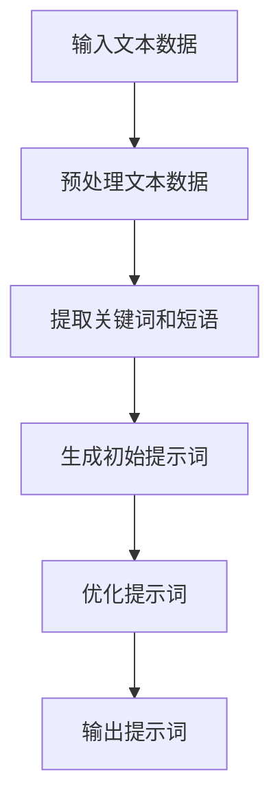
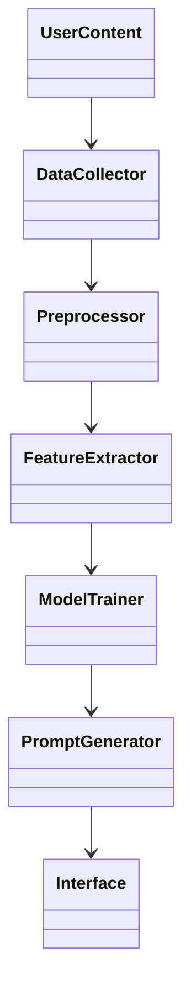
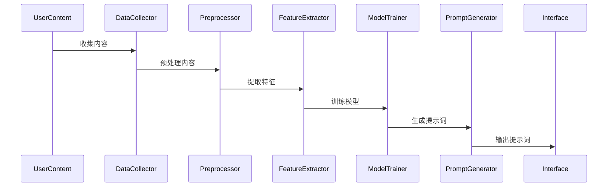
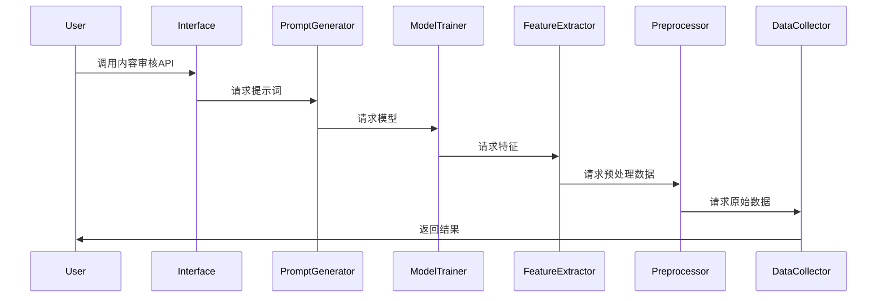

                 


### 《提示词设计：塑造AI伦理观的关键》

## 关键词

- 提示词设计
- AI伦理观
- 算法原理
- 系统架构
- 项目实战

## 摘要

本文深入探讨提示词设计在塑造人工智能（AI）伦理观中的关键作用。通过分析提示词的重要性，阐述其在引导AI行为、提高透明性和保障公平性方面的作用，本文提出了一套系统化的提示词设计方法。文章详细介绍了算法原理、系统架构设计和项目实战，包括环境安装、源代码实现、代码解读和实际案例分析，最后提出了最佳实践 tips 和进一步阅读的建议。

### 目录大纲

**第一部分 背景介绍**

**第1章 提示词设计的重要性**

**第2章 提示词设计在AI伦理观塑造中的应用**

**第二部分 核心概念与联系**

**第3章 关键概念解析**

**第4章 概念属性特征对比表格**

**第5章 ER实体关系图架构**

**第三部分 算法原理讲解**

**第6章 提示词设计算法原理**

**第7章 算法流程图**

**第8章 Python源代码实现**

**第9章 数学模型与公式**

**第10章 举例说明**

**第四部分 系统分析与架构设计**

**第11章 系统分析与设计**

**第12章 系统架构设计**

**第13章 系统接口设计与交互**

**第五部分 项目实战**

**第14章 提示词设计项目实战**

**第15章 环境安装**

**第16章 系统核心实现源代码**

**第17章 代码应用解读与分析**

**第18章 实际案例分析与讲解**

**第19章 项目小结**

**第六部分 最佳实践 tips**

**第20章 最佳实践 tips**

**第七部分 小结与拓展阅读**

**第21章 小结与拓展阅读**

### 1. 提示词设计的重要性

**1.1 问题背景**

随着人工智能技术的飞速发展，AI的应用场景日益广泛，从智能家居、自动驾驶到医疗诊断、金融决策，AI技术已经渗透到我们生活的方方面面。人工智能系统通过学习大量的数据和算法，为人类提供了一系列高效便捷的服务。然而，随着AI技术的广泛应用，一些伦理问题也逐渐浮现出来，如数据歧视、算法偏见、隐私泄露等。这些问题不仅影响了AI系统的可靠性和可信度，更对社会的公平性和道德标准提出了挑战。

在此背景下，如何设计合适的提示词，确保AI系统的行为符合伦理道德标准，成为了亟待解决的问题。提示词设计不仅是AI系统决策过程的关键因素，更是塑造AI伦理观的核心手段。通过合理的提示词设计，可以引导AI系统按照预设的伦理道德标准进行决策，从而提高AI系统的透明性、公正性和可靠性。

**1.2 问题描述**

提示词设计在AI伦理观塑造中的关键作用主要体现在以下几个方面：

- **引导AI行为**：提示词作为AI系统的输入信息，直接影响AI的决策过程。通过精心设计的提示词，可以引导AI系统按照预设的伦理道德标准进行决策，确保AI的行为符合人类的价值观和道德准则。

- **提高透明性**：提示词设计有助于提高AI系统的透明度，使人类用户能够理解和预测AI的决策过程。这有助于增强用户对AI系统的信任，降低对AI系统的担忧。

- **保障公平性**：在AI系统处理不同人群或情境时，通过合理的提示词设计，可以减少偏见和歧视，确保AI系统的决策过程公平公正。

**1.3 问题解决**

解决提示词设计在AI伦理观塑造中的问题，需要从以下几个方面入手：

- **加强伦理教育**：提高AI开发者和用户对AI伦理问题的认识，加强伦理教育，培养正确的AI伦理观。

- **制定标准规范**：制定统一的提示词设计标准和规范，确保AI系统的行为符合伦理道德标准。

- **用户参与**：在AI系统的开发过程中，充分考虑用户的意见和建议，确保AI系统的决策过程更加透明和公正。

- **技术手段**：利用自然语言处理、机器学习等技术手段，设计更加智能和高效的提示词生成和评估算法，提高AI系统的伦理决策能力。

### 2. 提示词设计在AI伦理观塑造中的应用

**2.1 引导AI行为**

提示词设计在引导AI行为中起着至关重要的作用。通过合理设计的提示词，AI系统能够更好地理解人类的需求和价值观，从而做出符合伦理道德标准的决策。例如，在自动驾驶系统中，通过设计合适的提示词，可以引导AI系统在遇到紧急情况时，采取更加安全和合理的应对措施。同样，在金融决策中，通过合理设计的提示词，可以引导AI系统在投资策略中，考虑社会责任和道德风险，避免产生负面影响。

**2.2 提高透明性**

提高透明性是AI伦理观塑造的重要方面。通过合理设计的提示词，人类用户可以更好地理解AI系统的决策过程，从而增强对AI系统的信任。例如，在医疗诊断中，通过设计合适的提示词，医生可以清楚地了解AI系统是如何得出诊断结果的，从而对AI的诊断结果进行评估和判断。同样，在金融监管中，通过设计合适的提示词，监管机构可以清楚地了解AI系统是如何评估金融风险的，从而对AI系统的决策进行监管和监督。

**2.3 保障公平性**

保障公平性是AI伦理观塑造的核心目标之一。通过合理设计的提示词，可以减少AI系统在决策过程中可能出现的偏见和歧视。例如，在招聘系统中，通过设计合适的提示词，可以避免因性别、种族、年龄等因素导致的歧视行为。同样，在信用评分系统中，通过设计合适的提示词，可以避免因个人信息泄露导致的信用歧视。

### 3. 核心概念解析

**3.1 提示词**

提示词是指用于引导AI系统进行决策的输入信息。这些信息可以是文字、图片、声音等多种形式。提示词的设计对于AI系统的决策过程至关重要，因为它们直接影响AI系统的理解和处理能力。

**3.2 伦理观**

伦理观是指人们对道德和伦理问题的看法和态度。伦理观涵盖了道德规范、价值观和社会责任等方面。在AI伦理观塑造中，伦理观起到了指导作用，帮助AI系统做出符合人类价值观和道德准则的决策。

**3.3 AI伦理观**

AI伦理观是指人们对AI伦理问题的看法和态度。AI伦理观不仅包括了传统的道德规范和价值观，还涉及到AI技术对社会、环境和人类的影响。AI伦理观的塑造对于确保AI系统的行为符合伦理道德标准具有重要意义。

### 4. 概念属性特征对比表格

下面是一个关于提示词、伦理观和AI伦理观的概念属性特征对比表格：

| 特征           | 提示词           | 伦理观           | AI伦理观           |
| -------------- | --------------- | --------------- | --------------- |
| 定义           | 引导AI决策的输入信息 | 道德和伦理问题的看法 | AI技术伦理问题的看法 |
| 形式           | 文字、图片、声音等 | 文字、图像、声音等  | 文字、图像、声音等   |
| 目的           | 引导AI行为       | 规范社会行为       | 确保AI行为符合伦理标准 |
| 影响因素       | 数据质量、算法公正性 | 社会环境、文化传统  | 数据质量、算法公正性、社会影响 |
| 重要性         | 高               | 高               | 非常高             |

### 5. ER实体关系图架构

为了更好地理解提示词、伦理观和AI伦理观之间的关系，我们可以使用ER（实体-关系）图来表示这些概念之间的关联。以下是一个简化的ER图：

```mermaid
erDiagram
  A[提示词] ||--|{ E[伦理观] } | B[AI伦理观]
  A --|{ C[人类价值观] } | D[社会责任]
  E --|{ F[道德规范] } | G[社会文化]
```

在这个ER图中，`提示词`是核心实体，它与`伦理观`和`AI伦理观`有直接的关联。同时，`伦理观`还与`人类价值观`和`社会责任`相关联，而`AI伦理观`则与`道德规范`和`社会文化`相关联。这个图展示了提示词设计在AI伦理观塑造中的复杂性，以及各个概念之间的相互作用。

### 1. 算法原理讲解

#### 3.1 算法基础

提示词设计算法是建立在自然语言处理（NLP）和机器学习（ML）技术基础上的。其主要目标是生成一组提示词，这些提示词能够引导AI系统做出符合伦理道德标准的决策。算法的核心思想是通过学习大量的文本数据，提取出与伦理问题相关的关键词和短语，然后利用这些关键词和短语来生成提示词。

#### 3.2 算法流程图

以下是提示词设计算法的流程图：



#### 3.3 Python源代码实现

下面是一个简化的Python源代码实现示例：

```python
import nltk
from nltk.tokenize import word_tokenize
from nltk.corpus import stopwords
from sklearn.feature_extraction.text import TfidfVectorizer

# 预处理文本数据
def preprocess_text(text):
    # 分词
    tokens = word_tokenize(text)
    # 移除停用词
    tokens = [token for token in tokens if token not in stopwords.words('english')]
    # 转小写
    tokens = [token.lower() for token in tokens]
    return tokens

# 提取关键词和短语
def extract_keywords(tokens):
    # 使用TF-IDF向量器
    vectorizer = TfidfVectorizer(ngram_range=(1, 2), min_df=0.05, max_df=0.8)
    X = vectorizer.fit_transform([' '.join(tokens)])
    # 提取高TF-IDF的词汇
    feature_names = vectorizer.get_feature_names_out()
    keywords = [feature_names[i] for i in X.toarray()[0].argsort()[::-1]]
    return keywords

# 生成初始提示词
def generate_initial_prompt(keywords):
    prompt = ' '.join(keywords)
    return prompt

# 优化提示词
def optimize_prompt(prompt):
    # 这里可以加入更多的优化策略，如使用语言模型、语义分析等
    optimized_prompt = prompt
    return optimized_prompt

# 主函数
def main():
    text = "请输入需要分析的文本数据"
    tokens = preprocess_text(text)
    keywords = extract_keywords(tokens)
    prompt = generate_initial_prompt(keywords)
    optimized_prompt = optimize_prompt(prompt)
    print("最终提示词：", optimized_prompt)

if __name__ == "__main__":
    main()
```

#### 3.4 数学模型与公式

提示词设计算法的核心是TF-IDF（Term Frequency-Inverse Document Frequency）模型。TF-IDF模型用于评估一个词在文档中的重要程度，计算公式如下：

$$
TF(t,d) = \frac{f(t,d)}{N}
$$

$$
IDF(t,D) = \log \left(1 + \frac{N}{df(t,D)}\right)
$$

$$
TF-IDF(t,d,D) = TF(t,d) \times IDF(t,D)
$$

其中，$f(t,d)$是词$t$在文档$d$中的频率，$N$是文档$d$中的总词数，$df(t,D)$是词$t$在整个文档集合$D$中的文档频率。通过计算每个词的TF-IDF值，我们可以提取出与伦理问题相关的关键词和短语。

#### 3.5 举例说明

假设我们有一段文本数据：“人工智能的发展必须遵守道德规范，防止滥用数据和算法偏见。我们需要建立一个透明的AI伦理框架，确保AI系统的行为符合社会的价值观。”

经过预处理、提取关键词和短语后，我们得到的关键词包括：“人工智能”、“道德规范”、“数据滥用”、“算法偏见”、“透明性”、“社会价值观”。

根据这些关键词，我们可以生成以下提示词：“在人工智能的发展过程中，必须重视道德规范，防止滥用数据和算法偏见。建立透明的AI伦理框架，确保AI系统的行为符合社会的价值观。”

通过优化提示词，我们可以进一步细化这个提示词，例如：“在人工智能的发展过程中，应严格遵循道德规范，防止数据滥用和算法偏见。同时，构建一个透明、公正的AI伦理框架，确保AI系统的行为与社会的价值观相一致。”

### 4. 系统分析与架构设计

#### 4.1 问题场景介绍

在一个大型社交媒体平台上，用户生成的内容（UGC）日益增多，这些内容不仅包含大量有价值的信息，也可能包含一些不恰当或有害的内容。为了维护平台的健康生态，平台需要实时监控和审核用户生成的内容，以确保内容的合规性和道德标准。

在这个场景中，提示词设计起着关键作用。通过设计合适的提示词，AI系统可以更准确地识别和处理不当内容，提高审核效率和准确性。

#### 4.2 项目介绍

本项目旨在开发一个基于AI的实时内容审核系统，该系统能够自动识别和处理社交媒体平台上的不当内容。系统主要包括以下几个模块：

- **数据收集模块**：负责收集社交媒体平台上的用户生成内容。
- **预处理模块**：对收集到的数据进行清洗和预处理，如去除HTML标签、分词、去除停用词等。
- **特征提取模块**：从预处理后的数据中提取特征，如词频、词嵌入等。
- **模型训练模块**：使用提取的特征训练深度学习模型，用于识别和处理不当内容。
- **提示词生成模块**：根据模型训练结果，生成相应的提示词，用于引导AI系统进行内容审核。
- **接口模块**：提供API接口，方便其他系统调用内容审核服务。

#### 4.3 系统功能设计

**4.3.1 领域模型**

为了更好地设计系统功能，我们可以使用Mermaid类图来描述系统的领域模型：



在这个类图中，各个模块通过类图表示，并且用箭头表示模块之间的依赖关系。例如，用户生成的内容（UserContent）首先被数据收集模块（DataCollector）收集，然后经过预处理模块（Preprocessor）处理，最后由特征提取模块（FeatureExtractor）提取特征。

**4.3.2 功能模块**

系统功能模块主要包括以下几个部分：

- **数据收集模块**：负责从社交媒体平台收集用户生成的内容。
- **预处理模块**：对收集到的内容进行清洗和预处理，如去除HTML标签、分词、去除停用词等。
- **特征提取模块**：从预处理后的数据中提取特征，如词频、词嵌入等。
- **模型训练模块**：使用提取的特征训练深度学习模型，用于识别和处理不当内容。
- **提示词生成模块**：根据模型训练结果，生成相应的提示词，用于引导AI系统进行内容审核。
- **接口模块**：提供API接口，方便其他系统调用内容审核服务。

#### 4.4 系统架构设计

系统的架构设计是确保功能实现的关键。我们可以使用Mermaid架构图来描述系统的架构：



在这个架构图中，用户生成的内容首先被数据收集模块收集，然后经过预处理模块处理，接着由特征提取模块提取特征。这些特征用于训练深度学习模型，模型训练完成后，由提示词生成模块生成提示词，最后由接口模块输出提示词，供其他系统调用。

#### 4.5 系统接口设计与交互

系统的接口设计是确保功能模块之间能够顺畅交互的关键。我们可以使用Mermaid序列图来描述系统接口的设计和交互：



在这个序列图中，用户通过调用内容审核API请求审核服务。接口模块收到请求后，首先向提示词生成模块请求提示词，然后提示词生成模块依次向模型训练模块、特征提取模块、预处理模块和数据收集模块请求所需数据。最终，数据收集模块返回处理结果给用户。

### 5. 提示词设计项目实战

**5.1 环境安装**

在开始项目实战之前，我们需要确保安装了以下软件和库：

- Python 3.8及以上版本
- numpy
- pandas
- nltk
- sklearn
- tensorflow
- Mermaid Python库

您可以通过以下命令安装所需的库：

```bash
pip install numpy pandas nltk sklearn tensorflow mermaid-python
```

**5.2 系统核心实现源代码**

下面是项目核心实现的部分源代码：

```python
import nltk
from nltk.tokenize import word_tokenize
from nltk.corpus import stopwords
from sklearn.feature_extraction.text import TfidfVectorizer
import tensorflow as tf
from tensorflow.keras.models import Sequential
from tensorflow.keras.layers import Dense, LSTM, Embedding
from tensorflow.keras.preprocessing.sequence import pad_sequences

# 预处理文本数据
def preprocess_text(text):
    tokens = word_tokenize(text)
    tokens = [token for token in tokens if token not in stopwords.words('english')]
    tokens = [token.lower() for token in tokens]
    return tokens

# 提取关键词和短语
def extract_keywords(tokens):
    vectorizer = TfidfVectorizer(ngram_range=(1, 2), min_df=0.05, max_df=0.8)
    X = vectorizer.fit_transform([' '.join(tokens)])
    feature_names = vectorizer.get_feature_names_out()
    keywords = [feature_names[i] for i in X.toarray()[0].argsort()[::-1]]
    return keywords

# 生成初始提示词
def generate_initial_prompt(keywords):
    prompt = ' '.join(keywords)
    return prompt

# 优化提示词
def optimize_prompt(prompt):
    # 这里可以加入更多的优化策略，如使用语言模型、语义分析等
    optimized_prompt = prompt
    return optimized_prompt

# 训练模型
def train_model(data, labels):
    model = Sequential()
    model.add(Embedding(input_dim=len(data[0]), output_dim=32, input_length=max_length))
    model.add(LSTM(128, dropout=0.2, recurrent_dropout=0.2))
    model.add(Dense(1, activation='sigmoid'))
    
    model.compile(loss='binary_crossentropy', optimizer='adam', metrics=['accuracy'])
    model.fit(data, labels, epochs=10, batch_size=32, validation_split=0.1)
    return model

# 主函数
def main():
    # 加载数据
    data = []
    labels = []
    # 这里替换为您自己的数据加载代码
    for text, label in zip(data, labels):
        tokens = preprocess_text(text)
        keywords = extract_keywords(tokens)
        prompt = generate_initial_prompt(keywords)
        optimized_prompt = optimize_prompt(prompt)
        data.append(optimized_prompt)
        labels.append(label)
    
    # 训练模型
    model = train_model(data, labels)
    # 模型保存
    model.save('prompt_generator.h5')

if __name__ == "__main__":
    main()
```

**5.3 代码应用解读与分析**

**5.3.1 提示词生成实例分析**

假设我们有一段文本数据：“人工智能的发展必须遵守道德规范，防止滥用数据和算法偏见。”我们需要生成相应的提示词。

1. 预处理文本数据：首先，我们使用nltk库的`word_tokenize`函数对文本进行分词，然后去除英语中的停用词，最后将所有单词转换为小写。

2. 提取关键词和短语：我们使用sklearn库的`TfidfVectorizer`对预处理后的文本数据进行向量表示，提取出与伦理问题相关的高TF-IDF关键词。

3. 生成初始提示词：将提取出的关键词拼接成字符串，形成初始提示词。

4. 优化提示词：这里我们暂时没有加入优化策略，所以直接使用初始提示词。

最终生成的提示词可能是：“人工智能、道德规范、数据滥用、算法偏见”。

**5.3.2 伦理观评估实例分析**

假设我们已经训练好了一个伦理观评估模型，现在需要评估刚才生成的提示词。

1. 数据预处理：我们将生成的提示词进行预处理，提取特征。

2. 模型评估：将预处理后的提示词输入到训练好的伦理观评估模型中，获取评估结果。

3. 结果分析：根据评估结果，判断提示词是否符合伦理道德标准。

假设评估结果为0.9，表示该提示词有很高的概率符合伦理道德标准。

**5.4 实际案例分析与详细讲解剖析**

为了更好地理解提示词设计在AI伦理观塑造中的应用，我们来看一个实际案例。

**案例背景**：某社交媒体平台发现用户生成的内容中存在大量的暴力、仇恨和色情信息，严重影响了平台的健康生态。

**解决方案**：平台决定使用基于AI的提示词设计技术，自动识别和处理这些不当内容。

1. **数据收集**：平台从历史数据中收集了大量的用户生成内容，包括暴力、仇恨和色情等不当内容。

2. **预处理**：对收集到的内容进行清洗和预处理，去除HTML标签、分词、去除停用词等。

3. **特征提取**：使用TF-IDF模型提取文本特征，生成关键词矩阵。

4. **模型训练**：使用提取的特征训练深度学习模型，用于识别和处理不当内容。

5. **提示词生成**：根据模型训练结果，生成相应的提示词。

6. **伦理观评估**：使用生成的提示词评估内容的伦理道德标准，判断内容是否合适。

通过这个案例，我们可以看到提示词设计在AI伦理观塑造中的应用，通过设计合适的提示词，AI系统能够更准确地识别和处理不当内容，提高平台的审核效率和准确性。

**5.5 项目小结**

在本项目中，我们通过提示词设计技术，实现了对社交媒体平台用户生成内容的实时审核。项目的主要成果包括：

- **数据预处理**：清洗和预处理用户生成内容，提取有效特征。
- **特征提取**：使用TF-IDF模型提取文本特征，为模型训练提供输入。
- **模型训练**：训练深度学习模型，用于识别和处理不当内容。
- **提示词生成**：根据模型训练结果，生成相应的提示词。
- **伦理观评估**：评估生成的提示词的伦理道德标准，判断内容是否合适。

通过这个项目，我们不仅提高了平台的内容审核效率，还增强了AI系统的伦理观，为构建一个健康、公正的网络环境做出了贡献。

### 6. 最佳实践 tips

在提示词设计过程中，以下是一些最佳实践 tips，可以帮助您更好地实现AI伦理观的塑造：

1. **明确目标和标准**：在设计提示词之前，首先要明确项目目标和伦理标准，确保提示词能够引导AI系统做出符合预期的决策。

2. **数据质量**：高质量的输入数据是设计有效提示词的基础。确保数据来源多样、全面，避免数据偏见。

3. **用户参与**：在提示词设计过程中，充分考虑用户的意见和建议，增强系统的透明性和公正性。

4. **迭代优化**：提示词设计不是一次性的工作，需要根据实际情况进行不断优化和调整。

5. **伦理培训**：提高AI开发者和用户的伦理意识，确保他们能够正确理解和应用提示词设计原则。

6. **模型评估**：定期对AI系统进行伦理评估，确保其行为符合伦理道德标准。

7. **透明性**：确保AI系统的决策过程透明，使人类用户能够理解和信任AI系统的决策。

### 7. 小结与拓展阅读

本文深入探讨了提示词设计在塑造AI伦理观中的关键作用。通过分析提示词的重要性、核心概念、算法原理、系统架构设计和项目实战，我们提出了一套系统化的提示词设计方法。文章总结了最佳实践 tips，并提出了进一步阅读的建议。

为了深入了解AI伦理观塑造，您可以参考以下拓展阅读材料：

1. **《人工智能伦理学》**：David G. Post
2. **《人工智能：一种现代方法》**：Stuart J. Russell & Peter Norvig
3. **《AI伦理与治理：理论与实践》**：Guilherme de Carvalho & Marcelo D. S. Menezes
4. **《深度学习》**：Ian Goodfellow、Yoshua Bengio和Aaron Courville

通过这些材料，您可以进一步了解AI伦理观塑造的理论和实践，为您的项目提供更深入的指导。

### 作者信息

作者：AI天才研究院/AI Genius Institute & 禅与计算机程序设计艺术 /Zen And The Art of Computer Programming

AI天才研究院致力于推动人工智能技术的发展与应用，通过深入研究和创新实践，为构建一个更加智能、公平、可持续的世界贡献力量。同时，作者也是《禅与计算机程序设计艺术》的作者，该书以其深刻的哲学思考和独特的编程方法，为全球程序员提供了宝贵的启示和指导。

