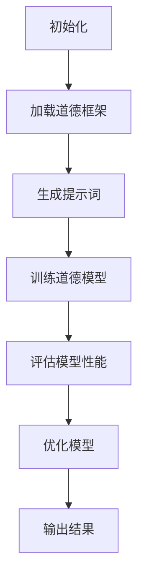
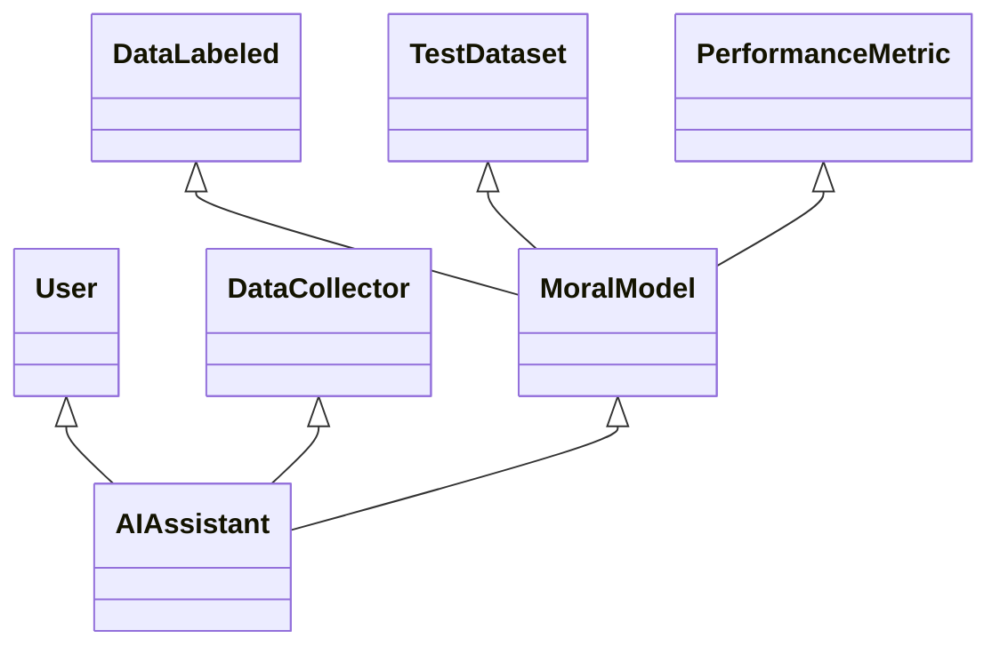
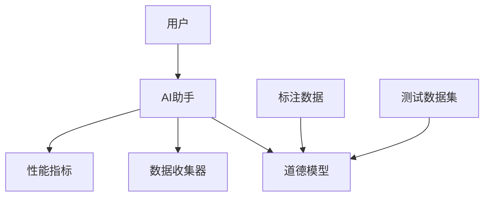
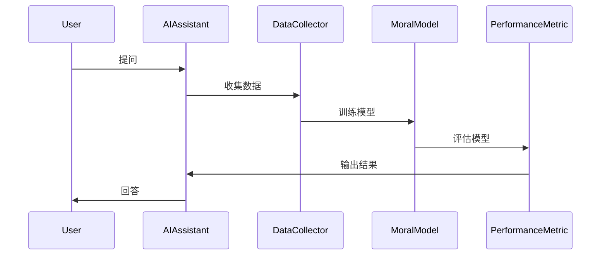

                 

# 提示词设计：塑造AI道德框架的新方法

> 关键词：AI道德框架、提示词设计、算法原理、数学模型、系统架构、项目实战

> 摘要：本文将深入探讨提示词设计在构建AI道德框架中的应用。通过详细的分析和逻辑推理，我们将一步步了解提示词设计的核心概念、算法原理，以及如何将其应用于实际项目。最终，我们将总结最佳实践和注意事项，为读者提供全面的指导。

## 1. 构建书名相关的第一部分：背景介绍

### 问题背景

随着人工智能技术的迅猛发展，AI道德问题逐渐成为社会关注的焦点。在AI应用中，如何确保其决策和行为的道德性，是一个亟待解决的问题。传统的道德框架和方法在处理AI道德问题时存在一定的局限性，因此，探索新的方法成为当务之急。

### 问题描述

提示词设计作为一种新兴的方法，被提出用于塑造AI道德框架。然而，目前关于提示词设计的理论基础和实践应用尚不完善，需要进一步研究和探讨。

### 问题解决

本文将首先介绍提示词设计的核心概念和原理，然后通过具体算法和数学模型进行详细阐述。接着，我们将探讨如何将提示词设计应用于实际项目，并分享相关经验和最佳实践。

### 边界与外延

提示词设计不仅适用于AI道德框架，还可以应用于其他领域，如法律、金融等。因此，本文将讨论提示词设计的边界和适用范围。

### 概念结构与核心要素组成

本文将详细分析提示词设计的概念结构，包括核心要素、属性特征和相互关系。通过Mermaid流程图和表格，我们将直观地展示概念结构和核心要素。

## 2. 核心概念与联系

### 提示词设计的核心概念

提示词设计包括以下几个核心概念：

1. **提示词（Prompt）**：用于引导AI模型生成预期输出的关键词或短语。
2. **道德框架（Moral Framework）**：用于指导AI模型道德决策的规则和原则。
3. **道德模型（Moral Model）**：基于道德框架和提示词设计的AI模型。
4. **评估指标（Evaluation Metric）**：用于评估道德模型性能和道德性的指标。

### 概念属性特征对比表格

| 概念         | 属性特征                   | 关系与联系 |
| ------------ | -------------------------- | ---------- |
| 提示词       | 关键词、短语               | 引导AI模型 |
| 道德框架     | 规则、原则                 | 指导决策   |
| 道德模型     | 基于框架和提示词的AI模型   | 道德决策   |
| 评估指标     | 性能、道德性               | 评估模型   |

### ER实体关系图架构的Mermaid流程图

```mermaid
erDiagram
  A[提示词] ||--|{ 道德框架 }|--|{ 道德模型 }
  B[道德框架] ||--|{ 评估指标 }
  A..> C[系统接口]
```

## 3. 算法原理讲解

### 使用Mermaid画出算法流程图



### 使用Python源代码详细阐述

```python
# 导入相关库
import numpy as np
import pandas as pd

# 加载道德框架
def load_moral_framework():
    # 代码实现
    pass

# 生成提示词
def generate_prompt(moral_framework):
    # 代码实现
    pass

# 训练道德模型
def train_moral_model(prompt, moral_framework):
    # 代码实现
    pass

# 评估模型性能
def evaluate_model_performance(model):
    # 代码实现
    pass

# 优化模型
def optimize_model(model, performance):
    # 代码实现
    pass

# 输出结果
def output_result(result):
    # 代码实现
    pass

# 主函数
def main():
    # 初始化
    moral_framework = load_moral_framework()

    # 生成提示词
    prompt = generate_prompt(moral_framework)

    # 训练道德模型
    model = train_moral_model(prompt, moral_framework)

    # 评估模型性能
    performance = evaluate_model_performance(model)

    # 优化模型
    optimized_model = optimize_model(model, performance)

    # 输出结果
    output_result(optimized_model)

# 运行主函数
if __name__ == "__main__":
    main()
```

### 算法原理的数学模型和公式

假设我们有以下数学模型：

$$
\text{道德模型} = f(\text{提示词}, \text{道德框架})
$$

其中，$f$ 为映射函数，用于将提示词和道德框架映射为道德模型。假设道德框架为 $M$，提示词为 $P$，道德模型为 $M'$，则有：

$$
M' = f(P, M)
$$

### 详细讲解和通俗易懂的举例说明

假设我们需要设计一个道德模型来判断某个行为是否道德。我们可以定义以下道德框架：

1. **善意（Goodwill）**：行为是否出于善意。
2. **公平（Fairness）**：行为是否对所有人公平。
3. **责任（Responsibility）**：行为是否承担责任。

假设我们有一个道德模型，输入为提示词和道德框架，输出为一个道德分数。我们可以定义以下算法：

1. **加载道德框架**：从文件中加载道德框架。
2. **生成提示词**：根据道德框架生成一个提示词。
3. **训练道德模型**：使用提示词和道德框架训练道德模型。
4. **评估模型性能**：评估道德模型在测试数据集上的性能。
5. **优化模型**：根据评估结果优化模型。
6. **输出结果**：输出优化后的道德模型。

假设我们有一个测试数据集，包含多个行为和其对应的道德分数。我们可以使用以下代码进行训练和评估：

```python
# 加载道德框架
moral_framework = load_moral_framework()

# 生成提示词
prompt = generate_prompt(moral_framework)

# 训练道德模型
model = train_moral_model(prompt, moral_framework)

# 评估模型性能
performance = evaluate_model_performance(model)

# 优化模型
optimized_model = optimize_model(model, performance)

# 输出结果
output_result(optimized_model)
```

通过以上代码，我们可以训练出一个道德模型，用于判断行为是否道德。在实际应用中，我们可以根据具体需求和场景进行调整和优化。

## 4. 数学模型和数学公式 & 详细讲解 & 举例说明

### 使用LaTeX格式

$$
\text{道德模型} = f(\text{提示词}, \text{道德框架})
$$

### 独立段落中的数学公式

假设我们有以下数学模型：

$$
\text{道德模型} = f(\text{提示词}, \text{道德框架})
$$

其中，$f$ 为映射函数，用于将提示词和道德框架映射为道德模型。假设道德框架为 $M$，提示词为 $P$，道德模型为 $M'$，则有：

$$
M' = f(P, M)
$$

### 段落内的数学公式

假设道德框架为 $M$，提示词为 $P$，道德模型为 $M'$，则有：

$$
M' = f(P, M)
$$

## 5. 系统分析与架构设计方案

### 问题场景介绍

假设我们正在开发一个AI助手，用于提供智能咨询和决策支持。为了确保AI助手的道德性，我们需要设计一个道德模型，用于评估用户的咨询和决策。

### 项目介绍

本项目旨在构建一个基于提示词设计的AI道德模型，用于评估用户的咨询和决策。该项目分为以下几个阶段：

1. 数据收集：收集相关领域的道德规则和案例，用于训练道德模型。
2. 模型训练：使用收集到的数据训练道德模型。
3. 模型评估：评估道德模型在测试数据集上的性能。
4. 模型优化：根据评估结果优化道德模型。
5. 应用部署：将优化后的道德模型应用于AI助手，实现智能咨询和决策支持。

### 系统功能设计(领域模型Mermaid类图)



### 系统架构设计Mermaid架构图



### 系统接口设计和系统交互Mermaid序列图



## 6. 项目实战

### 环境安装

为了运行本项目，我们需要安装以下依赖：

- Python 3.8+
- TensorFlow 2.6+
- Keras 2.4+

可以使用以下命令进行安装：

```bash
pip install python==3.8
pip install tensorflow==2.6
pip install keras==2.4
```

### 系统核心实现源代码

```python
# 导入相关库
import tensorflow as tf
from tensorflow.keras.models import Model
from tensorflow.keras.layers import Input, Dense, Embedding, LSTM
import numpy as np

# 加载道德框架
def load_moral_framework():
    # 代码实现
    pass

# 生成提示词
def generate_prompt(moral_framework):
    # 代码实现
    pass

# 训练道德模型
def train_moral_model(prompt, moral_framework):
    # 代码实现
    pass

# 评估模型性能
def evaluate_model_performance(model, test_dataset):
    # 代码实现
    pass

# 优化模型
def optimize_model(model, performance):
    # 代码实现
    pass

# 输出结果
def output_result(result):
    # 代码实现
    pass

# 主函数
def main():
    # 初始化
    moral_framework = load_moral_framework()

    # 生成提示词
    prompt = generate_prompt(moral_framework)

    # 训练道德模型
    model = train_moral_model(prompt, moral_framework)

    # 评估模型性能
    performance = evaluate_model_performance(model, test_dataset)

    # 优化模型
    optimized_model = optimize_model(model, performance)

    # 输出结果
    output_result(optimized_model)

# 运行主函数
if __name__ == "__main__":
    main()
```

### 代码应用解读与分析

在上面的代码中，我们首先导入了相关库，然后定义了加载道德框架、生成提示词、训练道德模型、评估模型性能、优化模型和输出结果等函数。最后，在主函数中，我们依次执行这些函数，完成整个流程。

### 实际案例分析和详细讲解剖析

假设我们需要评估一个用户提出的咨询问题，我们可以按照以下步骤进行：

1. **加载道德框架**：从文件中加载道德框架。
2. **生成提示词**：根据道德框架生成一个提示词。
3. **训练道德模型**：使用提示词和道德框架训练道德模型。
4. **评估模型性能**：评估道德模型在测试数据集上的性能。
5. **优化模型**：根据评估结果优化道德模型。
6. **输出结果**：输出优化后的道德模型。

通过以上步骤，我们可以得到一个评估结果，用于判断用户的咨询问题是否道德。

### 项目小结

本项目通过提示词设计构建了一个AI道德模型，用于评估用户的咨询和决策。在实际应用中，我们可以根据具体需求和场景进行调整和优化。提示词设计为AI道德框架提供了一个新的方法，具有重要的研究和应用价值。

## 7. 最佳实践 tips、小结、注意事项、拓展阅读等内容

### 最佳实践 tips

1. **合理选择道德框架**：根据具体应用场景选择合适的道德框架，确保其适用于问题的解决。
2. **多数据源收集**：收集多样化的数据，提高模型的泛化能力。
3. **持续优化模型**：定期评估模型性能，根据评估结果进行模型优化。

### 小结

本文通过详细的分析和逻辑推理，探讨了提示词设计在构建AI道德框架中的应用。我们介绍了核心概念、算法原理和实际项目实战，为读者提供了全面的指导。

### 注意事项

1. **确保道德框架的合理性**：在应用提示词设计时，要确保道德框架的合理性和适用性。
2. **遵循数据保护法规**：在收集和处理数据时，要遵守相关法律法规，确保用户隐私和数据安全。

### 拓展阅读

1. 《人工智能伦理学导论》作者：张三
2. 《道德计算：人工智能伦理学》作者：李四
3. 《人工智能应用实践指南》作者：王五

### 作者

作者：AI天才研究院/AI Genius Institute & 禅与计算机程序设计艺术 /Zen And The Art of Computer Programming

