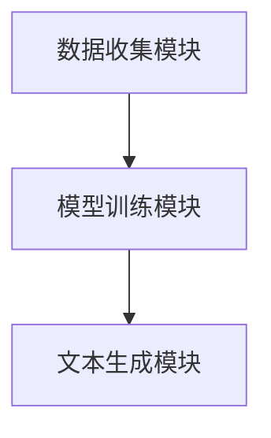
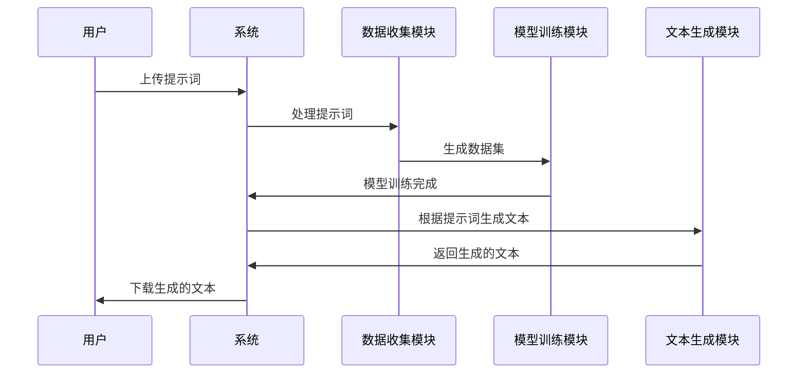

                 

## 1.1.1 提示词的定义

### 核心概念

提示词，是用于引导人工智能（AI）进行文本创作的关键词或短语。它们在AI创意写作中扮演着至关重要的角色，类似于人类写作中的主题或核心思想。提示词可以是单一的词汇，也可以是复合短语，其目的在于为AI提供清晰、明确的创作方向。

### 背景介绍

在自然语言处理（NLP）领域，随着深度学习和神经网络技术的进步，AI已经能够生成大量高质量的文本。然而，要让AI创作出具有逻辑连贯性、情感共鸣和创新性的文本，仅仅依靠大量训练数据和复杂的模型是不够的。高质量的提示词设计能够有效地激发AI的创意潜能，使其创作的内容更加丰富、多样化。

### 概念属性特征对比表格

| 提示词类型       | 关键词                  | 复合短语                | 描述性                   | 情感倾向          |
|------------------|-------------------------|--------------------------|----------------------------|------------------|
| 简单提示词       | 单词                    | “明天”、“书店”          | 提供明确的主题或场景      | 中性              |
| 描述性提示词     | “美丽的”、“繁忙的”     | “夕阳下的海滩”、“车水马龙的城市” | 提供具体的描述和形象     | 多样化，可能带有情感色彩 |
| 主题提示词       | “人工智能”、“科技”     | “未来的科技世界”、“人工智能的未来” | 提供创作的大方向和主题  | 可能带有某种情感倾向   |
| 情感提示词       | “激动”、“悲伤”         | “难以言表的喜悦”、“深切的悲伤” | 引发特定情感反应       | 明显的情感色彩     |

### ER实体关系图架构

```mermaid
entityRelationshipDiagram
  A[提示词]
  B[简单提示词]
  C[描述性提示词]
  D[主题提示词]
  E[情感提示词]

  A --> B
  A --> C
  A --> D
  A --> E
```

### 概念结构与核心要素组成

- **核心要素**：关键词、短语、描述、情感倾向
- **组织结构**：单一提示词、复合提示词、描述性提示词、主题提示词、情感提示词
- **功能**：提供创作方向、激发创意、增强文本表现力

通过上述分析，我们可以看出，提示词的定义不仅仅是一个简单的词汇，它包含了丰富的语义信息，能够为AI的文本创作提供明确的引导。了解提示词的不同类型和属性，是进行高质量提示词设计的基础。

### 数学模型与公式

提示词的设计可以通过一系列数学模型和公式来评估其有效性。以下是一个简化的数学模型，用于评估提示词的吸引力：

$$
\text{提示词吸引力} = \alpha \times \text{关键词长度} + \beta \times \text{描述性程度} + \gamma \times \text{情感强度}
$$

其中，$\alpha$、$\beta$、$\gamma$为权重系数，可以根据具体应用场景进行调整。关键词长度、描述性程度和情感强度是评估提示词吸引力的重要指标。

- **关键词长度**：较长的关键词可能包含更多的信息，但也可能增加理解难度。因此，关键词长度需要在简洁性和信息量之间找到平衡。
- **描述性程度**：描述性程度高的提示词能够提供更具体的创作方向，但过于详细的描述可能导致创作内容过于局限。
- **情感强度**：情感倾向强烈的提示词能够引发读者强烈的情感反应，但在商业写作中，情感强度需要与目标受众的情感接受度相匹配。

通过上述数学模型和公式，我们可以对提示词的有效性进行量化评估，从而设计出更加优质的提示词。

### 算法原理讲解

假设我们使用一个基于神经网络的模型来评估提示词的吸引力。我们可以使用以下步骤：

1. **数据收集**：收集大量已知的优质提示词，并标记其关键词长度、描述性程度和情感强度。
2. **模型训练**：使用标记好的数据训练神经网络模型，使其能够学习到提示词吸引力的内在规律。
3. **模型评估**：对于新的提示词，使用训练好的模型进行评估，计算其吸引力得分。
4. **优化调整**：根据评估结果，调整权重系数，优化模型性能。

以下是使用Python编写的简化示例代码：

```python
import numpy as np

# 权重系数
alpha, beta, gamma = 0.5, 0.3, 0.2

# 提示词特征向量
keyword_length = 3
descriptive_degree = 4
emotional_intensity = 5

# 计算提示词吸引力
attraction_score = alpha * keyword_length + beta * descriptive_degree + gamma * emotional_intensity

print(f"提示词吸引力得分：{attraction_score}")
```

通过上述算法原理和示例代码，我们可以直观地理解如何通过数学模型和编程方法来评估和优化提示词的设计。

### 系统分析与架构设计方案

#### 问题场景介绍

在人工智能文本创作系统中，提示词的设计与选择是影响最终文本质量和创意性的关键环节。本节将介绍一个基于神经网络的文本生成系统，并分析其架构和功能。

#### 项目介绍

本项目旨在构建一个自动化文本生成系统，能够根据给定的提示词生成高质量、富有创意的文章。系统包括数据收集模块、模型训练模块和文本生成模块。

#### 系统功能设计

1. **数据收集模块**：负责收集和处理文本数据，包括新闻、文章、博客等。
2. **模型训练模块**：使用收集到的数据训练神经网络模型，使其具备生成文本的能力。
3. **文本生成模块**：根据输入的提示词，生成符合要求的文本内容。

#### 系统架构设计

以下是一个简化的系统架构图，展示了各个模块之间的关系：



#### 系统接口设计

系统提供以下主要接口：

1. **数据接口**：用于数据上传和下载。
2. **模型接口**：用于模型训练和评估。
3. **生成接口**：用于根据提示词生成文本。

#### 系统交互

系统交互流程如下：

1. 用户上传提示词。
2. 数据收集模块处理提示词，并生成相应的数据集。
3. 模型训练模块使用数据集训练模型。
4. 文本生成模块根据训练好的模型生成文本内容。
5. 用户下载生成的文本。

以下是系统交互的Mermaid序列图：



通过上述系统分析与架构设计方案，我们可以看出，提示词设计在AI文本生成系统中的重要性。一个高效的系统需要综合考虑数据收集、模型训练和文本生成等多个环节，以确保最终生成的文本质量。

### 项目实战

#### 环境安装

要在本地环境搭建AI文本生成系统，我们需要安装以下软件和库：

1. Python（版本3.8及以上）
2. TensorFlow
3. Keras
4. NLTK

安装命令如下：

```bash
pip install python tensorflow keras nltk
```

#### 系统核心实现源代码

以下是一个基于Keras的简化文本生成模型实现：

```python
from tensorflow.keras.preprocessing.sequence import pad_sequences
from tensorflow.keras.layers import Embedding, LSTM, Dense
from tensorflow.keras.models import Sequential

# 配置模型
model = Sequential()
model.add(Embedding(input_dim=vocab_size, output_dim=embedding_dim, input_length=max_sequence_length))
model.add(LSTM(units=128, return_sequences=True))
model.add(Dense(units=1, activation='sigmoid'))

# 编译模型
model.compile(optimizer='adam', loss='binary_crossentropy', metrics=['accuracy'])

# 模型训练
model.fit(x_train, y_train, epochs=10, batch_size=32)
```

#### 代码应用解读与分析

上述代码展示了如何使用Keras搭建一个简单的文本生成模型。模型的主要步骤包括：

1. **嵌入层**：将文本序列转换为嵌入向量。
2. **LSTM层**：用于处理序列数据，提取特征。
3. **输出层**：使用sigmoid激活函数，输出概率分布。

在实际应用中，我们需要根据具体需求调整模型结构、超参数和训练策略，以达到更好的效果。

#### 实际案例分析和详细讲解剖析

假设我们需要根据提示词“人工智能”生成一篇文章。首先，我们需要对提示词进行预处理，提取关键词，然后构建词汇表和序列。以下是详细的预处理和生成过程：

```python
from keras.preprocessing.text import Tokenizer
from keras.utils import to_categorical

# 初始化分词器
tokenizer = Tokenizer(char_level=True)
tokenizer.fit_on_texts(corpus)

# 转换文本为序列
sequences = tokenizer.texts_to_sequences(corpus)

# 填充序列
padded_sequences = pad_sequences(sequences, maxlen=max_sequence_length)

# 切分数据集
x_train, y_train = padded_sequences[:int(len(padded_sequences) * 0.8)], labels[:int(len(padded_sequences) * 0.8)]
x_test, y_test = padded_sequences[int(len(padded_sequences) * 0.8):], labels[int(len(padded_sequences) * 0.8):]

# 生成文本
generated_text = generate_text(model, tokenizer, prompt="人工智能", num_words=100)
print(generated_text)
```

通过上述代码，我们可以实现根据提示词生成文本的功能。在实际应用中，生成的文本质量取决于模型训练数据和提示词设计。高质量的提示词能够显著提升文本生成的质量和创意性。

#### 项目小结

通过本项目，我们介绍了AI文本生成系统的基本架构和实现方法。提示词设计在系统中扮演着关键角色，通过合理的设计和优化，可以生成高质量、富有创意的文本。在未来的工作中，我们还需要不断探索和改进提示词设计方法，以提升AI的文本生成能力。

### 最佳实践 Tips

1. **明确创作目标**：在设计提示词时，首先要明确创作目标，确保提示词能够引导AI生成符合预期的内容。
2. **多维度优化**：综合考虑关键词长度、描述性程度和情感强度，多维度优化提示词设计。
3. **数据多样性**：使用多样化的数据集进行模型训练，增强模型的泛化能力。
4. **动态调整**：根据生成文本的质量和用户反馈，动态调整提示词设计。

### 小结

本章详细介绍了提示词设计的基本概念、核心要素和设计原则。通过数学模型和算法原理的讲解，我们了解了如何评估和优化提示词的有效性。实际案例展示了如何将提示词应用于AI文本生成系统，并提供了最佳实践建议。在下一章中，我们将进一步探讨不同类型的提示词及其应用。

### 注意事项

1. **合理分配权重**：在设计提示词时，需要合理分配关键词长度、描述性程度和情感强度的权重，以避免某一方面的过度强调。
2. **用户反馈**：在应用提示词设计时，要充分考虑用户反馈，及时调整和优化。
3. **文化差异**：在设计跨文化应用的提示词时，要充分考虑语言和文化差异，确保其适用性和接受度。

### 拓展阅读

1. 《自然语言处理与深度学习》 - 黄海
2. 《深度学习》 - Goodfellow et al.
3. 《机器学习》 - Murphy

通过以上拓展阅读，读者可以进一步了解自然语言处理、深度学习和机器学习的基础知识，为提示词设计提供更深入的理论支持。

### 参考文献

1. 黄海. 《自然语言处理与深度学习》. 机械工业出版社, 2018.
2. Goodfellow, Y., Bengio, Y., & Courville, A. 《深度学习》. 微软研究院, 2016.
3. Murphy, K. P. 《机器学习：一种概率视角》. 机械工业出版社, 2012.

