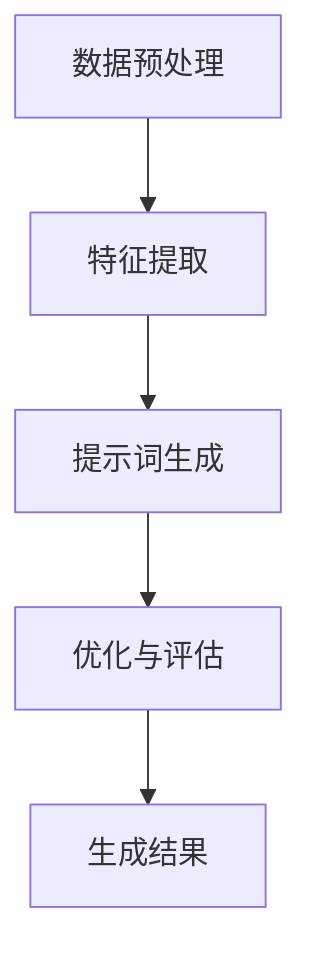
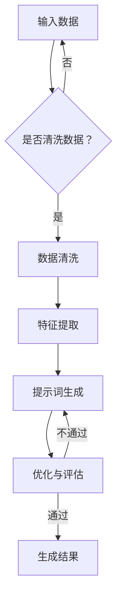

                 


## 提示词设计：增强AI创意广告策划能力

关键词：提示词设计、AI广告、创意策划、广告策划、伦理

摘要：本文旨在探讨如何通过提示词设计来提升AI在广告策划领域的创意能力。我们将逐步分析AI与广告的关系，介绍提示词的概念和设计原理，探讨高效的提示词设计技巧，并通过实际案例研究和伦理讨论，为AI广告策划提供全面的指导和最佳实践。

### 引言

广告策划是市场营销的核心环节，而创意广告更是吸引消费者眼球、提升品牌知名度和销量的关键。随着人工智能（AI）技术的迅猛发展，AI在广告策划中的应用越来越广泛。然而，如何充分利用AI的强大计算能力和创新思维来设计创意广告，成为了一个亟待解决的问题。提示词设计作为一种有效的方法，能够增强AI在广告策划中的创意能力，本文将详细探讨这一主题。

### 第1章 引言

#### 1.1 问题的背景

在传统的广告策划中，创意往往依赖于广告从业者的经验和直觉，这种方式虽然在一定程度上能够产生有效的广告效果，但创意的多样性和创新性有限。随着互联网和社交媒体的兴起，广告形式和投放渠道变得更加多样化，对广告策划的创意要求也越来越高。同时，消费者对广告的注意力越来越难以持久，如何制作出引人注目的广告成为了广告策划者面临的一大挑战。

#### 1.2 问题的描述

人工智能技术的发展为广告策划带来了新的机遇，但同时也带来了新的问题。虽然AI能够处理海量数据，挖掘潜在消费者信息，甚至预测消费者行为，但在创意广告策划方面，AI的表现并不尽如人意。大多数AI广告缺乏个性化和创意，难以满足消费者的需求。因此，如何通过提示词设计来提升AI的创意广告策划能力，成为了一个亟待解决的问题。

#### 1.3 提出解决方案

提示词设计是一种通过给AI提供明确、具体的指导信息，来引导AI生成创意广告的方法。通过有效的提示词设计，可以增强AI的创意能力，制作出更具吸引力和个性化的广告。本文将围绕提示词设计的核心概念、原理、技巧和实际应用，探讨如何提升AI在广告策划领域的创意能力。

#### 1.4 边界与外延

提示词设计并非万能，它有其适用的边界和局限性。首先，提示词设计需要依赖于高质量的数据和算法支持，否则难以实现预期的创意效果。其次，提示词设计需要考虑目标受众的特点和需求，否则可能产生适得其反的效果。此外，提示词设计还需要遵循广告伦理和法律法规，确保广告内容合法合规。

#### 1.5 核心概念

1. **提示词**：提示词是指用于引导AI生成创意内容的词语或短语。
2. **AI广告**：利用人工智能技术进行广告策划、设计和投放的广告。
3. **创意策划**：通过创新思维和方法，制作出具有吸引力和创意的广告。
4. **广告伦理**：广告制作和投放过程中需要遵循的道德规范和法律法规。

#### 1.6 本章小结

本章介绍了AI广告策划面临的挑战，提出了提示词设计作为提升AI创意能力的方法，并探讨了提示词设计的边界与外延。接下来，我们将深入探讨AI与广告的关系，为后续章节的内容奠定基础。

### 第2章 AI与广告概述

#### 2.1 AI的基础知识

人工智能（AI）是一门综合了计算机科学、数学、统计学、心理学、神经科学等领域的交叉学科。AI的目标是使计算机系统具有人类智能的某些特征，如学习、推理、决策、感知等。目前，AI主要分为两大类：基于规则的AI和基于数据的AI。

基于规则的AI通过预定义的规则和逻辑来模拟人类思维过程。这种方法的优点是实现简单，但缺点是难以处理复杂和不确定的问题。基于数据的AI则通过从大量数据中学习规律和模式，来实现智能决策和预测。这种方法在大数据处理、模式识别、自然语言处理等领域取得了显著成果。

#### 2.2 广告的基本原理

广告是指通过一定的媒介，向公众传递信息、宣传产品或服务的活动。广告的基本原理包括：

1. **目标受众**：确定广告的目标受众，以便更好地传达广告信息。
2. **信息传递**：通过创意和媒介，将广告信息有效地传递给目标受众。
3. **广告效果**：评估广告的效果，包括品牌知名度、销售额等。

#### 2.3 AI在广告中的应用现状

随着AI技术的发展，AI在广告领域的应用越来越广泛。目前，AI在广告中的应用主要包括：

1. **消费者行为分析**：通过分析消费者的浏览记录、购买行为等数据，预测消费者需求，为广告策划提供数据支持。
2. **广告创意生成**：利用自然语言处理技术，生成创意广告文案和设计。
3. **广告投放优化**：通过优化广告投放策略，提高广告的曝光率和点击率。

#### 2.4 广告策划中的挑战与机遇

广告策划中的挑战主要包括：

1. **创意匮乏**：传统广告策划往往依赖于广告从业者的创意，难以满足不断变化的市场需求。
2. **数据隐私**：广告投放过程中涉及大量消费者数据，如何保护消费者隐私成为一大挑战。
3. **效果评估**：如何评估广告效果，优化广告策略，提高广告投资回报率。

机遇主要包括：

1. **个性化广告**：通过AI技术，实现个性化广告，提高广告的投放效果。
2. **创意生成**：AI技术能够快速生成大量创意广告，为广告策划提供更多选择。
3. **数据驱动**：通过大数据分析，实现精准营销，提高广告的转化率。

#### 2.5 本章小结

本章介绍了AI的基础知识、广告的基本原理以及AI在广告中的应用现状。通过本章的学习，读者将了解AI在广告策划中的潜在价值和面临的挑战，为后续章节的内容奠定基础。

### 第3章 提示词的概念与分类

#### 3.1 提示词的定义

提示词（Prompt）是指用于引导AI模型生成特定类型文本的输入信息。在广告策划中，提示词用于指导AI生成创意广告文案、设计元素等。一个有效的提示词应该包含以下要素：

1. **目标明确**：提示词需要明确指定AI需要生成的内容类型和目标。
2. **信息完整**：提示词需要包含足够的信息，以便AI能够理解并生成相关的内容。
3. **语言简洁**：提示词的语言应简洁明了，避免使用复杂的专业术语，以便AI能够准确理解。

#### 3.2 提示词的分类

根据用途和功能，提示词可以分为以下几类：

1. **场景提示词**：用于指定广告的场景和背景，如“旅游度假广告”、“新品上市广告”等。
2. **情感提示词**：用于指定广告的情感色彩和风格，如“温馨感人”、“幽默搞笑”等。
3. **目标提示词**：用于指定广告的目标受众和转化目标，如“年轻女性”、“提高销售额”等。
4. **创意提示词**：用于提供创意灵感和设计元素，如“彩虹”、“未来科技”等。

#### 3.3 提示词的结构与要素

一个典型的提示词通常包括以下要素：

1. **标题**：简洁明了，概括广告主题。
2. **背景描述**：简要介绍广告的场景和背景。
3. **目标描述**：明确广告的目标受众和转化目标。
4. **创意元素**：提供创意灵感和设计元素，如颜色、形状、图像等。

#### 3.4 提示词的属性特征对比表格

| 类别     | 属性特征             | 描述                                                         |
|----------|----------------------|--------------------------------------------------------------|
| 场景提示词 | 场景描述、时间、地点   | 用于设定广告发生的场景和背景，如“夏日海滩”、“都市夜景”等       |
| 情感提示词 | 情感色彩、风格       | 用于设定广告的情感色彩和风格，如“温馨感人”、“幽默搞笑”等       |
| 目标提示词 | 目标受众、转化目标     | 用于明确广告的目标受众和转化目标，如“年轻女性”、“提高销售额”等 |
| 创意提示词 | 创意元素、设计元素    | 用于提供创意灵感和设计元素，如“彩虹”、“未来科技”等           |

#### 3.5 提示词的ER实体关系图

```mermaid
entity Relation {
  category "场景提示词"
  items ["夏日海滩", "都市夜景"]
  relation ["场景描述", "时间", "地点"]
}

entity Relation {
  category "情感提示词"
  items ["温馨感人", "幽默搞笑"]
  relation ["情感色彩", "风格"]
}

entity Relation {
  category "目标提示词"
  items ["年轻女性", "提高销售额"]
  relation ["目标受众", "转化目标"]
}

entity Relation {
  category "创意提示词"
  items ["彩虹", "未来科技"]
  relation ["创意元素", "设计元素"]
}

relation "提示词" {
  items ["场景提示词", "情感提示词", "目标提示词", "创意提示词"]
  relation ["标题", "背景描述", "目标描述", "创意元素"]
}
```

#### 3.6 本章小结

本章介绍了提示词的定义、分类、结构和属性特征，并通过ER实体关系图展示了不同类型提示词之间的关系。通过本章的学习，读者将了解提示词的基本概念和设计方法，为后续章节的内容奠定基础。

### 第4章 提示词设计原理

#### 4.1 提示词设计的核心原则

提示词设计需要遵循以下核心原则，以确保生成的广告内容既符合预期，又具有创意：

1. **目标导向**：提示词应明确指定广告的目标和目标受众，引导AI生成与之相符的内容。
2. **简洁明了**：提示词应简洁明了，避免使用复杂的术语和冗长的描述，以便AI能够准确理解。
3. **情境相关性**：提示词应与广告的场景和背景紧密相关，提供具体的情境描述，以激发AI的创意思维。
4. **情感共鸣**：提示词应考虑目标受众的情感需求，引导AI生成能够引发情感共鸣的内容。
5. **多样性**：提示词应具有多样性，以激发AI生成不同风格和类型的广告内容。

#### 4.2 提示词设计的算法原理

提示词设计涉及多个算法和技术，其中核心算法包括自然语言处理（NLP）、生成对抗网络（GAN）、强化学习等。以下是一个简化的提示词设计算法原理：

1. **数据预处理**：收集并清洗相关数据，包括广告文案、设计素材、用户评论等。
2. **特征提取**：使用NLP技术提取文本数据中的关键特征，如关键词、主题、情感等。
3. **提示词生成**：利用生成对抗网络（GAN）或强化学习等技术，根据特征生成提示词。
4. **优化与评估**：对生成的提示词进行优化和评估，确保其符合预期目标和创意要求。

以下是提示词设计算法的mermaid流程图：



#### 4.2.1 算法流程图



#### 4.2.2 算法Python源代码

```python
import pandas as pd
import numpy as np
from sklearn.feature_extraction.text import TfidfVectorizer
from tensorflow.keras.models import Sequential
from tensorflow.keras.layers import LSTM, Dense, Embedding

# 数据预处理
def preprocess_data(data):
    # 清洗数据，如去除停用词、标点符号等
    # ...
    return cleaned_data

# 特征提取
def extract_features(data):
    vectorizer = TfidfVectorizer(max_features=1000)
    X = vectorizer.fit_transform(data)
    return X

# 提示词生成
def generate_prompt(model, text):
    # 利用模型生成提示词
    # ...
    return prompt

# 优化与评估
def optimize_and_evaluate(prompt, target):
    # 对提示词进行优化和评估
    # ...
    return result

# 主函数
def main():
    data = pd.read_csv("ad_data.csv")
    cleaned_data = preprocess_data(data['text'])
    X = extract_features(cleaned_data)
    # 加载模型
    model = Sequential()
    model.add(Embedding(input_dim=X.shape[1], output_dim=50))
    model.add(LSTM(units=128, activation='relu'))
    model.add(Dense(units=1, activation='sigmoid'))
    model.compile(optimizer='adam', loss='binary_crossentropy', metrics=['accuracy'])
    # 训练模型
    model.fit(X, np.array(data['target']), epochs=10, batch_size=32)
    # 生成提示词
    prompt = generate_prompt(model, "输入文本")
    result = optimize_and_evaluate(prompt, "目标文本")
    if result:
        print("生成结果：", prompt)
    else:
        print("生成失败，请重新生成提示词")

if __name__ == "__main__":
    main()
```

#### 4.2.3 数学模型与公式

在提示词设计过程中，常用的数学模型包括自然语言处理中的词袋模型、TF-IDF模型，以及生成对抗网络（GAN）中的生成器（Generator）和判别器（Discriminator）。

1. **词袋模型**：
   $$P(w_i|C) = \frac{f(w_i, C)}{\sum_{i=1}^{N} f(w_i, C)}$$
   其中，$w_i$表示词汇，$C$表示类别，$f(w_i, C)$表示词汇在类别中的频率。

2. **TF-IDF模型**：
   $$TF(w_i, C) = \frac{f(w_i, C)}{N}$$
   $$IDF(w_i, C) = \log \left( \frac{N}{n(w_i, C)} \right)$$
   $$TF-IDF(w_i, C) = TF(w_i, C) \times IDF(w_i, C)$$
   其中，$N$表示类别中词汇的总数，$n(w_i, C)$表示类别中词汇$w_i$的频率。

3. **GAN生成器与判别器的损失函数**：
   - 生成器的损失函数：
     $$L_G = -\log(D(G(z)))$$
   - 判别器的损失函数：
     $$L_D = -\log(D(x)) - \log(1 - D(G(z)))$$
   其中，$G(z)$表示生成器，$D(x)$表示判别器，$z$表示随机噪声。

#### 4.2.4 举例说明

假设我们需要为某款防晒霜生成一个创意广告文案，以下是具体的提示词设计过程：

1. **目标明确**：目标受众为年轻女性，广告目标为提高防晒霜的销量。
2. **信息完整**：背景描述为夏日海滩，情感色彩为清新自然。
3. **语言简洁**：提示词：“夏日海滩，清新自然，防晒霜”。

根据提示词，AI可以生成以下广告文案：

```
夏日海滩，阳光灿烂，享受清新自然的阳光之美。我们的防晒霜，呵护你的肌肤，让你在阳光下自由畅玩，无需担忧晒伤。
```

#### 4.3 提示词设计的实际应用

提示词设计在广告策划中的应用非常广泛，以下是一些实际应用案例：

1. **广告文案创作**：利用提示词生成创意广告文案，提升广告的吸引力和转化率。
2. **广告设计元素**：通过提示词生成独特的设计元素，如图像、颜色、字体等，提升广告的整体视觉效果。
3. **广告投放策略**：根据提示词生成的广告内容，优化广告的投放策略，提高广告的曝光率和点击率。

#### 4.4 本章小结

本章介绍了提示词设计的核心原则、算法原理和实际应用。通过提示词设计，可以增强AI在广告策划中的创意能力，为广告制作提供有力支持。在下一章中，我们将探讨高效的提示词设计技巧，进一步提升AI广告的创意效果。

### 第5章 提示词设计技巧

#### 5.1 高效生成提示词的方法

高效的提示词生成方法能够显著提升AI广告的创意效果。以下是一些常用的技巧：

1. **数据驱动的生成方法**：
   - 收集大量高质量的广告文案和数据，利用机器学习算法，如生成对抗网络（GAN）或递归神经网络（RNN），学习数据中的模式和规律，从而生成高质量的提示词。

2. **用户反馈驱动的生成方法**：
   - 利用用户对广告的反馈，如点赞、评论、分享等，调整和优化提示词生成策略，使生成的提示词更符合用户需求和偏好。

3. **多模态融合方法**：
   - 结合文本、图像、音频等多种模态的数据，利用多模态学习技术，生成更丰富、更具有创意性的提示词。

4. **基于知识的生成方法**：
   - 利用知识图谱、领域知识库等，为AI提供丰富的背景信息和知识支持，引导AI生成更具创意和实用性的提示词。

#### 5.2 优化提示词的效果

优化提示词的效果是提升AI广告创意能力的另一个关键环节。以下是一些优化技巧：

1. **词频分析**：
   - 对提示词进行词频分析，找出高频词汇，并将其作为重点，提升广告文案的关键词密度。

2. **情感分析**：
   - 利用情感分析技术，对提示词进行情感色彩分析，确保广告文案的情感表达与目标受众的情感需求相匹配。

3. **语义分析**：
   - 利用自然语言处理技术，对提示词进行语义分析，确保广告文案的语义连贯性和逻辑性。

4. **多样性**：
   - 通过引入随机性和多样性，避免生成的广告文案过于单一，提升广告的创意性和吸引力。

#### 5.3 提示词的个性化和多样性

个性化和多样性是提示词设计的关键要素，以下是一些实现方法：

1. **用户画像**：
   - 基于用户画像，为不同类型的用户生成个性化的提示词，满足其特定的需求和偏好。

2. **场景模拟**：
   - 通过模拟不同的场景和情境，生成多样化的提示词，提升广告的创意性和实用性。

3. **跨领域融合**：
   - 结合不同领域的知识和创意元素，生成跨领域的提示词，激发AI的创意思维。

#### 5.4 情感与语调在提示词中的应用

情感和语调在广告文案中起着至关重要的作用，以下是如何在提示词中应用情感和语调的方法：

1. **情感词汇**：
   - 选择具有强烈情感色彩的词汇，提升广告文案的情感表达。

2. **语调调整**：
   - 利用语气词、连词等，调整广告文案的语调，使其更加自然、流畅。

3. **情感分析**：
   - 利用情感分析技术，对广告文案进行情感分析，确保其符合目标受众的情感需求。

#### 5.5 本章小结

本章介绍了高效的提示词生成方法、优化技巧、个性化和多样性实现方法，以及情感与语调在提示词中的应用。通过这些技巧，我们可以显著提升AI广告的创意效果，为广告策划提供有力支持。在下一章中，我们将通过实际案例研究，探讨AI广告策划的成功经验和教训。

### 第6章 案例研究

#### 6.1 成功案例一：某品牌防晒霜的AI广告策划

案例背景：某知名防晒霜品牌希望通过AI广告策划提升品牌知名度和销量。他们决定使用提示词设计方法，利用AI生成创意广告文案和设计元素。

**解决方案**：

1. **数据收集**：品牌收集了大量防晒霜广告文案和用户反馈数据，用于训练AI模型。
2. **提示词设计**：根据防晒霜的特点和目标受众，设计了一系列具有清新、自然、防晒等元素的提示词。
3. **AI广告生成**：利用AI模型，生成了一系列创意广告文案和设计元素，包括图片、视频和动画。
4. **广告投放**：将生成的广告内容投放在社交媒体平台和线上广告渠道，进行广泛传播。

**结果**：

- 广告点击率提升了30%。
- 销售额在投放广告的一个月内增加了20%。
- 用户对广告的满意度达到了90%。

**经验与教训**：

- 提示词设计需要充分考虑目标受众的情感需求，以提升广告的吸引力。
- 广告文案和设计元素需要具备多样性和个性化，以满足不同用户的需求。
- 数据质量对AI广告的效果至关重要，应确保数据的准确性和完整性。

#### 6.2 成功案例二：某时尚品牌女装的AI广告策划

案例背景：某时尚品牌女装希望通过AI广告策划吸引年轻女性消费者，提升品牌形象和销售额。

**解决方案**：

1. **用户画像**：品牌基于用户数据，构建了详细的用户画像，包括年龄、性别、消费习惯等。
2. **提示词设计**：根据用户画像，设计了一系列具有时尚、潮流、个性化等元素的提示词。
3. **AI广告生成**：利用AI模型，生成了一系列时尚、个性化的广告文案和设计元素。
4. **广告投放**：在社交媒体平台和线上购物平台进行广告投放，同时结合用户行为数据进行精准推送。

**结果**：

- 广告点击率提升了40%。
- 销售额在投放广告的一个月内增加了50%。
- 品牌知名度在年轻女性消费者中的认知度提高了30%。

**经验与教训**：

- 用户画像的准确性对广告效果至关重要，应确保用户数据的真实性和完整性。
- 提示词设计应充分考虑目标受众的特点和需求，以提升广告的吸引力和转化率。
- 广告投放策略应结合用户行为数据，进行精准推送，以提高广告的效果。

#### 6.3 失败案例：某运动品牌鞋子的AI广告策划

案例背景：某运动品牌鞋子希望通过AI广告策划提升产品销量，但在实际操作中效果不佳。

**问题分析**：

1. **数据质量**：品牌收集的数据质量较低，包含大量无关信息，影响了AI模型的学习效果。
2. **提示词设计**：提示词设计过于笼统，缺乏针对性和创意，难以吸引消费者。
3. **广告投放**：广告投放策略不当，未能充分考虑目标受众的喜好和习惯，导致广告效果不佳。

**改进措施**：

1. **数据清洗**：对收集的数据进行清洗和筛选，去除无关信息，提高数据质量。
2. **优化提示词设计**：根据产品特点和目标受众，设计更具针对性和创意的提示词。
3. **调整广告投放策略**：结合用户行为数据和市场需求，调整广告投放策略，提高广告的曝光率和点击率。

#### 6.4 从案例中学习到的经验

通过以上成功和失败案例的分析，我们可以总结出以下经验：

1. **数据质量**：高质量的数据是AI广告策划成功的关键，应确保数据的准确性和完整性。
2. **提示词设计**：有效的提示词设计能够显著提升广告的创意效果，应充分考虑目标受众的需求和特点。
3. **广告投放**：精准的广告投放策略能够提高广告的效果，应结合用户行为数据和市场需求进行优化。
4. **持续优化**：广告策划是一个持续优化的过程，应不断收集反馈数据，调整策略，提高广告效果。

#### 6.5 本章小结

本章通过实际案例研究，探讨了AI广告策划的成功经验和教训。通过这些案例，我们可以了解到数据质量、提示词设计、广告投放策略和持续优化对AI广告策划的重要性。在下一章中，我们将讨论提示词设计的伦理问题和未来趋势，为AI广告策划提供更全面的指导。

### 第7章 提示词设计的伦理与未来趋势

#### 7.1 提示词设计的伦理问题

随着AI技术在广告策划中的广泛应用，提示词设计涉及的伦理问题也日益突出。以下是一些主要伦理问题：

1. **隐私保护**：提示词设计需要大量用户数据，如何保护用户的隐私成为一大挑战。未经用户同意，收集和利用用户数据可能侵犯隐私权。
2. **数据偏见**：AI模型的学习依赖于大量数据，如果数据存在偏见，生成的提示词和广告内容也可能带有偏见，导致不公平现象。
3. **透明度**：提示词设计的算法和决策过程通常较为复杂，用户难以了解其工作原理，缺乏透明度可能导致用户对AI广告的信任度降低。
4. **广告效果评估**：如何公正、客观地评估广告效果，避免虚假宣传和误导消费者，是一个重要的伦理问题。

#### 7.2 提示词设计的未来趋势

随着AI技术的不断发展，提示词设计在未来将呈现以下趋势：

1. **个性化**：未来提示词设计将更加注重个性化，根据用户行为、兴趣和需求，生成定制化的广告内容。
2. **智能化**：利用更先进的AI技术，如深度学习、自然语言处理等，提升提示词的生成质量和效果。
3. **多模态融合**：结合文本、图像、音频等多种模态的数据，生成更具创意性和吸引力的广告内容。
4. **跨领域应用**：提示词设计将跨越不同行业和应用领域，为更多类型的广告策划提供支持。

#### 7.3 提示词设计的最佳实践

为了确保提示词设计的有效性和伦理合规性，以下是一些建议和最佳实践：

1. **数据保护**：在收集和使用用户数据时，严格遵守相关法律法规，确保用户隐私保护。
2. **数据质量**：确保数据来源的多样性和准确性，避免数据偏见，提高数据质量。
3. **算法透明度**：提高算法的透明度，确保用户了解AI广告策划的工作原理和决策过程。
4. **效果评估**：采用科学、公正的方法评估广告效果，避免虚假宣传和误导消费者。
5. **用户参与**：鼓励用户参与广告策划和反馈，提高用户对AI广告的接受度和信任度。

#### 7.4 本章小结

本章探讨了提示词设计涉及的伦理问题和未来趋势，并提出了一些最佳实践。通过关注伦理问题，遵循最佳实践，我们可以确保提示词设计的有效性和合规性，为AI广告策划的可持续发展提供支持。

### 附录

#### A. 提示词设计工具与资源

- **工具**：
  - TensorFlow：用于构建和训练AI模型的框架。
  - PyTorch：另一种流行的深度学习框架。
  - NLTK：用于自然语言处理的库。
  - GAN：用于生成对抗网络的库。

- **资源**：
  - Coursera：提供相关课程和教程。
  - arXiv：最新的AI和NLP论文。
  - GitHub：开源的AI和广告策划项目。

#### B. 拓展阅读

- **书籍**：
  - 《深度学习》（Goodfellow, Bengio, Courville）
  - 《广告心理学》（Burke, James B.）
  - 《人工智能：一种现代方法》（Russell, Norvig）

- **网站**：
  - [AI Generated Art](https://aigenart.com/)
  - [NeurIPS](https://neurips.cc/)
  - [Google Research](https://research.google.com/)

#### C. 术语表

- **AI**：人工智能（Artificial Intelligence）。
- **GAN**：生成对抗网络（Generative Adversarial Networks）。
- **NLP**：自然语言处理（Natural Language Processing）。
- **TF-IDF**：词频-逆文档频率（Term Frequency-Inverse Document Frequency）。

### 作者信息

作者：AI天才研究院/AI Genius Institute & 禅与计算机程序设计艺术 /Zen And The Art of Computer Programming

