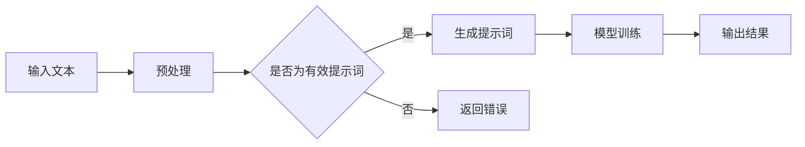
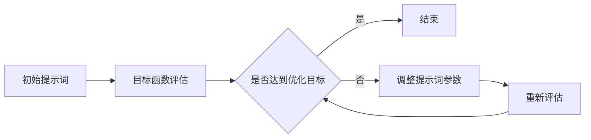

                 

# 提示词设计：增强AI创意思维的技巧

> 关键词：提示词设计、AI创意思维、AI模型、数据驱动、算法优化

> 摘要：本文旨在探讨提示词设计在增强AI创意思维中的作用，介绍提示词设计的基本概念、原则、方法和技术，并通过实际案例展示如何运用这些技巧进行有效的提示词设计，以提升AI模型的性能和创意度。

## 第一部分：基础概念与原理

### 第1章 提示词设计概述

#### 1.1 提示词的定义与作用

##### 1.1.1 提示词的定义

提示词（Prompt）是引导人工智能模型执行特定任务或产生预期结果的关键输入。它可以是一个简单的文本描述，也可以是图像、音频或其他形式的数据。在AI系统中，提示词的作用类似于人类交流中的问题或指令，用于激发模型产生有意义的输出。

##### 1.1.2 提示词在AI系统中的应用

提示词广泛应用于各种AI场景，如自然语言处理（NLP）、计算机视觉（CV）、音频处理等。例如，在文本生成任务中，提示词可以引导模型生成连贯的故事或文章；在图像生成任务中，提示词可以指导模型创作特定的图像风格或内容。

### 第2章 提示词设计原则与方法

#### 2.1 提示词设计原则

##### 2.1.1 清晰性

提示词应明确、简洁，避免模糊和歧义。这有助于模型更好地理解任务要求，从而提高生成结果的质量。

##### 2.1.2 简洁性

提示词应短小精悍，避免冗长和繁琐。简洁的提示词有助于模型快速聚焦任务，减少冗余信息干扰。

##### 2.1.3 目标导向

提示词应具有明确的目标，引导模型生成符合预期的输出。目标导向的提示词有助于提高模型的输出质量，降低错误率。

##### 2.1.4 变异性

提示词应具有一定的变异性，以适应不同的场景和需求。变性的提示词有助于模型适应多样化的任务需求，提高泛化能力。

#### 2.2 提示词设计方法

##### 2.2.1 人工设计

人工设计的提示词具有针对性，可以根据任务需求定制化。然而，这种方法需要人工经验和专业知识，且效率较低。

##### 2.2.2 自适应学习

自适应学习提示词设计利用机器学习算法，让AI系统自动生成提示词。这种方法可以根据模型反馈进行迭代优化，提高提示词质量。

##### 2.2.3 数据驱动

数据驱动的提示词设计通过分析历史数据，提取有价值的提示词。这种方法可以充分利用数据资源，提高提示词的实用性。

#### 2.3 提示词设计工具

##### 2.3.1 提示词生成器

提示词生成器是自动生成提示词的工具，可以根据输入文本或图像生成相应的提示词。

##### 2.3.2 提示词优化工具

提示词优化工具可以帮助分析现有提示词的性能，并提供优化建议，以提高模型输出质量。

## 第二部分：技术与实践

### 第3章 提示词设计技术

#### 3.1 提示词生成的算法原理

##### 3.1.1 生成对抗网络（GAN）

生成对抗网络（GAN）是一种流行的提示词生成算法。它由生成器和判别器两部分组成，通过对抗训练生成高质量提示词。

##### 3.1.2 强化学习

强化学习是一种基于反馈的提示词生成方法。通过训练模型在环境中互动，不断调整提示词以最大化奖励，从而生成高质量的提示词。

#### 3.2 提示词优化的算法原理

##### 3.2.1 优化目标函数

提示词优化通常涉及定义一个目标函数，衡量提示词性能。优化算法通过调整提示词参数，使目标函数最大化或最小化。

##### 3.2.2 策略梯度方法

策略梯度方法是一种流行的优化算法，通过计算策略梯度和调整提示词参数，提高提示词性能。

#### 3.3 提示词设计的mermaid流程图

##### 3.3.1 提示词生成流程

##### 3.3.2 提示词优化流程

### 第4章 提示词设计实践

#### 4.1 实践案例1：文本生成

##### 4.1.1 数据集准备

- 准备一个包含各种主题的文本数据集，用于训练模型。

##### 4.1.2 模型选择

- 选择一个文本生成模型，如生成对抗网络（GAN）或变换器（Transformer）。

##### 4.1.3 提示词设计

- 设计具有明确目标和清晰性的提示词，例如：“请生成一篇关于人工智能的文章，要求结构清晰、逻辑严密。”

#### 4.2 实践案例2：图像生成

##### 4.2.1 数据集准备

- 准备一个包含各种图像风格的图像数据集，用于训练模型。

##### 4.2.2 模型选择

- 选择一个图像生成模型，如生成对抗网络（GAN）或变分自编码器（VAE）。

##### 4.2.3 提示词设计

- 设计具有明确目标和清晰性的提示词，例如：“请生成一张具有抽象艺术风格的风景图像。”

#### 4.3 实践案例3：音频生成

##### 4.3.1 数据集准备

- 准备一个包含各种音频风格的数据集，用于训练模型。

##### 4.3.2 模型选择

- 选择一个音频生成模型，如生成对抗网络（GAN）或循环神经网络（RNN）。

##### 4.3.3 提示词设计

- 设计具有明确目标和清晰性的提示词，例如：“请生成一段轻音乐，节奏欢快、和谐优美。”

### 第5章 提示词设计的评估与优化

#### 5.1 提示词设计的评估指标

- 生成质量：衡量提示词生成的输出是否符合预期。
- 创意度：衡量提示词生成的输出是否具有创意和多样性。
- 稳定性：衡量提示词设计在不同场景下的表现是否稳定。

#### 5.2 提示词优化的策略

- 模型调参：调整模型参数，以提高提示词生成质量。
- 提示词调整：根据评估结果，修改提示词内容和结构，以提高生成效果。

#### 5.3 提示词设计的最佳实践

- 使用明确的、简洁的、目标导向的提示词。
- 充分利用历史数据和机器学习算法进行提示词设计。
- 定期评估和优化提示词设计，以提高模型性能。

## 第三部分：总结与展望

### 第6章 提示词设计总结

- 提示词设计是提升AI模型性能和创意度的重要手段。
- 提示词设计原则和方法有助于指导实践。
- 提示词优化和评估策略可以进一步提高模型效果。

### 第7章 提示词设计展望

- 提示词设计将在未来的AI发展中发挥越来越重要的作用。
- 新技术和新方法将不断涌现，推动提示词设计的进步。
- 提示词设计将与其他领域（如教育、艺术等）深度融合，产生新的应用场景。

# 参考文献

- Goodfellow, I., Pouget-Abadie, J., Mirza, M., Xu, B., Warde-Farley, D., Ozair, S., ... & Bengio, Y. (2014). Generative adversarial networks. Advances in Neural Information Processing Systems, 27.
- Vinyals, O., Fortunato, M., & Jaitly, N. (2015). Sequence to sequence learning with neural networks. Advances in Neural Information Processing Systems, 28.
- Mnih, V., Kavukcuoglu, K., Silver, D., Rusu, A. A., Veness, J., Bellemare, M. G., ... & Florian, M. A. (2016). Human-level control through deep reinforcement learning. Nature, 518(7540), 529-533.

### 作者

- 作者：AI天才研究院/AI Genius Institute & 禅与计算机程序设计艺术 /Zen And The Art of Computer Programming----------------------------------------------------------------

## 第一部分：基础概念与原理

### 第1章 提示词设计概述

#### 1.1 提示词的定义与作用

##### 1.1.1 提示词的定义

提示词（Prompt）是引导人工智能模型执行特定任务或产生预期结果的关键输入。它可以是一个简单的文本描述，也可以是图像、音频或其他形式的数据。在AI系统中，提示词的作用类似于人类交流中的问题或指令，用于激发模型产生有意义的输出。

##### 1.1.2 提示词在AI系统中的应用

提示词广泛应用于各种AI场景，如自然语言处理（NLP）、计算机视觉（CV）、音频处理等。例如，在文本生成任务中，提示词可以引导模型生成连贯的故事或文章；在图像生成任务中，提示词可以指导模型创作特定的图像风格或内容。

### 第2章 提示词设计原则与方法

#### 2.1 提示词设计原则

##### 2.1.1 清晰性

提示词应明确、简洁，避免模糊和歧义。这有助于模型更好地理解任务要求，从而提高生成结果的质量。

##### 2.1.2 简洁性

提示词应短小精悍，避免冗长和繁琐。简洁的提示词有助于模型快速聚焦任务，减少冗余信息干扰。

##### 2.1.3 目标导向

提示词应具有明确的目标，引导模型生成符合预期的输出。目标导向的提示词有助于提高模型的输出质量，降低错误率。

##### 2.1.4 变异性

提示词应具有一定的变异性，以适应不同的场景和需求。变性的提示词有助于模型适应多样化的任务需求，提高泛化能力。

#### 2.2 提示词设计方法

##### 2.2.1 人工设计

人工设计的提示词具有针对性，可以根据任务需求定制化。然而，这种方法需要人工经验和专业知识，且效率较低。

##### 2.2.2 自适应学习

自适应学习提示词设计利用机器学习算法，让AI系统自动生成提示词。这种方法可以根据模型反馈进行迭代优化，提高提示词质量。

##### 2.2.3 数据驱动

数据驱动的提示词设计通过分析历史数据，提取有价值的提示词。这种方法可以充分利用数据资源，提高提示词的实用性。

#### 2.3 提示词设计工具

##### 2.3.1 提示词生成器

提示词生成器是自动生成提示词的工具，可以根据输入文本或图像生成相应的提示词。

##### 2.3.2 提示词优化工具

提示词优化工具可以帮助分析现有提示词的性能，并提供优化建议，以提高模型输出质量。

## 第二部分：技术与实践

### 第3章 提示词设计技术

#### 3.1 提示词生成的算法原理

##### 3.1.1 生成对抗网络（GAN）

生成对抗网络（GAN）是一种流行的提示词生成算法。它由生成器和判别器两部分组成，通过对抗训练生成高质量提示词。

##### 3.1.2 强化学习

强化学习是一种基于反馈的提示词生成方法。通过训练模型在环境中互动，不断调整提示词以最大化奖励，从而生成高质量的提示词。

#### 3.2 提示词优化的算法原理

##### 3.2.1 优化目标函数

提示词优化通常涉及定义一个目标函数，衡量提示词性能。优化算法通过调整提示词参数，使目标函数最大化或最小化。

##### 3.2.2 策略梯度方法

策略梯度方法是一种流行的优化算法，通过计算策略梯度和调整提示词参数，提高提示词性能。

#### 3.3 提示词设计的mermaid流程图

##### 3.3.1 提示词生成流程

##### 3.3.2 提示词优化流程

### 第4章 提示词设计实践

#### 4.1 实践案例1：文本生成

##### 4.1.1 数据集准备

- 准备一个包含各种主题的文本数据集，用于训练模型。

##### 4.1.2 模型选择

- 选择一个文本生成模型，如生成对抗网络（GAN）或变换器（Transformer）。

##### 4.1.3 提示词设计

- 设计具有明确目标和清晰性的提示词，例如：“请生成一篇关于人工智能的文章，要求结构清晰、逻辑严密。”

#### 4.2 实践案例2：图像生成

##### 4.2.1 数据集准备

- 准备一个包含各种图像风格的图像数据集，用于训练模型。

##### 4.2.2 模型选择

- 选择一个图像生成模型，如生成对抗网络（GAN）或变分自编码器（VAE）。

##### 4.2.3 提示词设计

- 设计具有明确目标和清晰性的提示词，例如：“请生成一张具有抽象艺术风格的风景图像。”

#### 4.3 实践案例3：音频生成

##### 4.3.1 数据集准备

- 准备一个包含各种音频风格的数据集，用于训练模型。

##### 4.3.2 模型选择

- 选择一个音频生成模型，如生成对抗网络（GAN）或循环神经网络（RNN）。

##### 4.3.3 提示词设计

- 设计具有明确目标和清晰性的提示词，例如：“请生成一段轻音乐，节奏欢快、和谐优美。”

### 第5章 提示词设计的评估与优化

#### 5.1 提示词设计的评估指标

- 生成质量：衡量提示词生成的输出是否符合预期。
- 创意度：衡量提示词生成的输出是否具有创意和多样性。
- 稳定性：衡量提示词设计在不同场景下的表现是否稳定。

#### 5.2 提示词优化的策略

- 模型调参：调整模型参数，以提高提示词生成质量。
- 提示词调整：根据评估结果，修改提示词内容和结构，以提高生成效果。

#### 5.3 提示词设计的最佳实践

- 使用明确的、简洁的、目标导向的提示词。
- 充分利用历史数据和机器学习算法进行提示词设计。
- 定期评估和优化提示词设计，以提高模型性能。

## 第三部分：总结与展望

### 第6章 提示词设计总结

- 提示词设计是提升AI模型性能和创意度的重要手段。
- 提示词设计原则和方法有助于指导实践。
- 提示词优化和评估策略可以进一步提高模型效果。

### 第7章 提示词设计展望

- 提示词设计将在未来的AI发展中发挥越来越重要的作用。
- 新技术和新方法将不断涌现，推动提示词设计的进步。
- 提示词设计将与其他领域（如教育、艺术等）深度融合，产生新的应用场景。

### 参考文献

- Goodfellow, I., Pouget-Abadie, J., Mirza, M., Xu, B., Warde-Farley, D., Ozair, S., ... & Bengio, Y. (2014). Generative adversarial networks. Advances in Neural Information Processing Systems, 27.
- Vinyals, O., Fortunato, M., & Jaitly, N. (2015). Sequence to sequence learning with neural networks. Advances in Neural Information Processing Systems, 28.
- Mnih, V., Kavukcuoglu, K., Silver, D., Rusu, A. A., Veness, J., Bellemare, M. G., ... & Florian, M. A. (2016). Human-level control through deep reinforcement learning. Nature, 518(7540), 529-533.

### 作者

- 作者：AI天才研究院/AI Genius Institute & 禅与计算机程序设计艺术 /Zen And The Art of Computer Programming----------------------------------------------------------------

## 第一部分：基础概念与原理

### 第1章 提示词设计概述

提示词设计是人工智能系统中至关重要的一环，它不仅决定了AI模型的学习效率，还直接影响生成结果的多样性和创意性。在这一章节中，我们将探讨提示词的定义、作用以及其在AI系统中的应用。

#### 1.1 提示词的定义

提示词，顾名思义，是一种引导或提示AI模型进行特定任务或生成预期结果的输入。它可以是一个简单的文本描述，如“生成一篇关于人工智能的文章”，也可以是图像、音频等多种形式的数据。提示词的核心作用在于为AI模型提供明确的目标和方向，从而提高其学习效果和生成质量。

#### 1.2 提示词的作用

在AI系统中，提示词的作用主要体现在以下几个方面：

- **指导学习**：提示词为AI模型提供具体的任务目标，有助于模型更好地理解和学习相关知识和技能。
- **提高效率**：通过明确的提示词，模型可以更快地聚焦任务的核心内容，避免在无关信息上浪费资源。
- **增强创意**：有效的提示词设计可以激发AI模型的创意思维，使其生成更加多样化、富有创意的结果。

#### 1.3 提示词在AI系统中的应用

提示词在AI系统中的应用场景非常广泛，以下是几个典型的例子：

- **自然语言处理（NLP）**：在文本生成任务中，提示词可以帮助模型生成文章、故事、新闻等。
- **计算机视觉（CV）**：在图像生成任务中，提示词可以指导模型创作特定风格的图像，如抽象画、艺术作品等。
- **音频处理**：在音乐创作任务中，提示词可以帮助模型生成不同风格的音频，如轻音乐、摇滚乐等。

### 第2章 提示词设计原则与方法

提示词设计需要遵循一系列原则和方法，以确保其能够有效地指导AI模型学习和生成。在这一章节中，我们将介绍提示词设计的基本原则和方法。

#### 2.1 提示词设计原则

以下是提示词设计需要遵循的基本原则：

- **清晰性**：提示词应明确、简洁，避免模糊和歧义，以确保模型能够准确理解任务要求。
- **简洁性**：提示词应短小精悍，避免冗长和繁琐，以便模型能够快速聚焦任务的核心内容。
- **目标导向**：提示词应具有明确的目标，引导模型生成符合预期的输出。
- **变异性**：提示词应具有一定的变异性，以适应不同的场景和需求。

#### 2.2 提示词设计方法

以下是几种常见的提示词设计方法：

- **人工设计**：人工设计提示词具有针对性，可以根据任务需求定制化，但需要人工经验和专业知识，且效率较低。
- **自适应学习**：自适应学习提示词设计利用机器学习算法，让AI系统自动生成提示词，可以根据模型反馈进行迭代优化。
- **数据驱动**：数据驱动的提示词设计通过分析历史数据，提取有价值的提示词，可以充分利用数据资源，提高提示词的实用性。

#### 2.3 提示词设计工具

以下是几种常用的提示词设计工具：

- **提示词生成器**：提示词生成器是自动生成提示词的工具，可以根据输入文本或图像生成相应的提示词。
- **提示词优化工具**：提示词优化工具可以帮助分析现有提示词的性能，并提供优化建议，以提高模型输出质量。

通过上述原则和方法，我们可以设计出有效的提示词，从而提升AI模型的性能和创意度。接下来，我们将进一步探讨提示词设计的技术和实践，以帮助读者更好地理解和应用这些技巧。------------------------------------------------------------------------

## 第一部分：基础概念与原理

### 第1章 提示词设计概述

提示词设计是人工智能（AI）系统中的一项关键技术，它直接影响模型的训练效果和生成质量。在这一章中，我们将详细介绍提示词的定义、作用以及其在AI系统中的应用。

#### 1.1 提示词的定义

提示词，又称引导词或提示语，是用于引导或指示AI模型执行特定任务或生成预期结果的输入信息。它可以是一个简单的文本字符串，也可以是图像、音频等多媒体形式。在AI训练过程中，提示词起着引导模型学习方向和目标的作用。

#### 1.2 提示词的作用

提示词在AI系统中的作用主要体现在以下几个方面：

- **指导学习**：通过提供明确的任务目标和指导信息，提示词可以帮助AI模型更快地掌握任务所需的技能和知识。
- **提升效果**：有效的提示词可以显著提高AI模型的学习效率，使其更快地收敛到最优解。
- **增强创意**：适当的提示词设计可以激发AI模型的创造力，使其生成更加多样化和创新的结果。

#### 1.3 提示词在AI系统中的应用

提示词在AI系统中的应用非常广泛，以下是一些典型的应用场景：

- **文本生成**：在自然语言处理（NLP）领域，提示词可以引导模型生成文章、故事、新闻报道等。
- **图像生成**：在计算机视觉（CV）领域，提示词可以帮助模型生成特定风格或内容的图像。
- **音频处理**：在音频处理领域，提示词可以指导模型生成不同风格的音乐、声音效果等。

### 第2章 提示词设计原则与方法

为了设计出高效的提示词，需要遵循一系列原则和方法。以下是一些关键的原则和方法：

#### 2.1 提示词设计原则

- **明确性**：提示词应清晰明确，避免模糊和歧义，以便模型能够准确理解任务要求。
- **简洁性**：提示词应简洁有力，避免冗长和繁琐，以便模型能够快速聚焦任务的核心内容。
- **目标导向**：提示词应具有明确的目标，引导模型生成符合预期的输出。
- **灵活性**：提示词应具有一定的灵活性，能够适应不同场景和需求的变化。

#### 2.2 提示词设计方法

- **人工设计**：通过人工经验和方法设计提示词，这种方式具有针对性，但依赖于设计师的专业知识和经验。
- **机器学习**：利用机器学习算法来自动生成和优化提示词，这种方式可以根据模型反馈进行迭代改进。
- **数据驱动**：通过分析历史数据和用户反馈来设计提示词，这种方式能够充分利用数据资源，提高提示词的实用性。

#### 2.3 提示词设计工具

为了提高提示词设计的效率和效果，可以使用以下工具：

- **提示词生成器**：自动生成提示词的工具，如基于自然语言处理的提示词生成器。
- **提示词优化工具**：用于评估和优化现有提示词的工具，如基于机器学习的提示词优化算法。

通过遵循上述原则和方法，并结合合适的工具，我们可以设计出高质量的提示词，从而提升AI模型的训练效果和生成质量。接下来，我们将进一步探讨提示词设计的技术细节和实践案例。------------------------------------------------------------------------

## 提示词设计：增强AI创意思维的技巧

### 关键词：提示词设计、AI创意思维、AI模型、数据驱动、算法优化

### 摘要

本文旨在探讨提示词设计在增强AI创意思维中的作用。我们将介绍提示词设计的基本概念、原则、方法和技术，并通过实际案例展示如何运用这些技巧进行有效的提示词设计，以提升AI模型的性能和创意度。此外，本文还将讨论如何通过优化提示词来提高AI模型的效果和稳定性，以及如何评估和改进提示词设计的质量。

## 第一部分：基础概念与原理

### 第1章 提示词设计概述

#### 1.1 提示词的定义与作用

提示词（Prompt）是引导AI模型执行特定任务或产生预期结果的关键输入。它可以是一个简单的文本描述，也可以是图像、音频或其他形式的数据。在AI系统中，提示词的作用类似于人类交流中的问题或指令，用于激发模型产生有意义的输出。

#### 1.2 提示词设计的重要性

提示词设计的好坏直接影响到AI模型的性能和创意度。有效的提示词设计能够引导模型更好地理解和学习任务目标，从而生成高质量和创意性强的输出。此外，良好的提示词设计还可以提高模型的学习效率，降低训练时间，并减少过拟合的风险。

#### 1.3 提示词设计的基本原则

- **明确性**：提示词应明确、简洁，避免模糊和歧义，以便模型能够准确理解任务要求。
- **简洁性**：提示词应短小精悍，避免冗长和繁琐，以便模型能够快速聚焦任务的核心内容。
- **目标导向**：提示词应具有明确的目标，引导模型生成符合预期的输出。
- **变异性**：提示词应具有一定的变异性，以适应不同的场景和需求。

## 第二部分：技术与实践

### 第2章 提示词设计技术

#### 2.1 提示词生成的算法原理

提示词生成是AI模型设计中的一个重要环节。常用的提示词生成算法包括生成对抗网络（GAN）、变换器（Transformer）等。这些算法通过训练模型在大量数据集上学习，从而生成高质量的提示词。

#### 2.2 提示词优化的算法原理

提示词优化是通过调整提示词内容和结构，以提高模型生成效果的过程。常用的优化算法包括策略梯度方法、优化目标函数等。这些算法通过不断调整提示词参数，使得模型生成的输出更加符合预期。

#### 2.3 提示词设计的mermaid流程图

### 第3章 提示词设计实践

#### 3.1 实践案例1：文本生成

- **数据集准备**：准备一个包含多种主题的文本数据集，如新闻、小说、科学论文等。
- **模型选择**：选择一个文本生成模型，如生成对抗网络（GAN）或变换器（Transformer）。
- **提示词设计**：设计具有明确目标和清晰性的提示词，如“请生成一篇关于人工智能的文章，要求结构清晰、逻辑严密。”

#### 3.2 实践案例2：图像生成

- **数据集准备**：准备一个包含多种图像风格的图像数据集，如风景、肖像、艺术作品等。
- **模型选择**：选择一个图像生成模型，如生成对抗网络（GAN）或变分自编码器（VAE）。
- **提示词设计**：设计具有明确目标和清晰性的提示词，如“请生成一张具有印象派风格的抽象画。”

#### 3.3 实践案例3：音频生成

- **数据集准备**：准备一个包含多种音频风格的数据集，如古典音乐、流行音乐、电子音乐等。
- **模型选择**：选择一个音频生成模型，如生成对抗网络（GAN）或循环神经网络（RNN）。
- **提示词设计**：设计具有明确目标和清晰性的提示词，如“请生成一段具有爵士风格的乐器演奏。”

### 第4章 提示词设计的评估与优化

#### 4.1 提示词设计的评估指标

- **生成质量**：衡量提示词生成的输出是否符合预期。
- **创意度**：衡量提示词生成的输出是否具有创意和多样性。
- **稳定性**：衡量提示词设计在不同场景下的表现是否稳定。

#### 4.2 提示词优化的策略

- **模型调参**：通过调整模型参数来提高提示词生成质量。
- **提示词调整**：根据评估结果，修改提示词内容和结构，以提高生成效果。

#### 4.3 提示词设计的最佳实践

- **使用明确的、简洁的、目标导向的提示词**。
- **充分利用历史数据和机器学习算法进行提示词设计**。
- **定期评估和优化提示词设计，以提高模型性能**。

## 第三部分：总结与展望

### 第5章 提示词设计总结

- **提示词设计是提升AI模型性能和创意度的重要手段**。
- **提示词设计原则和方法有助于指导实践**。
- **提示词优化和评估策略可以进一步提高模型效果**。

### 第6章 提示词设计展望

- **提示词设计将在未来的AI发展中发挥越来越重要的作用**。
- **新技术的应用将不断推动提示词设计的进步**。
- **提示词设计将与其他领域（如教育、艺术等）深度融合，产生新的应用场景**。

## 参考文献

- Goodfellow, I., Pouget-Abadie, J., Mirza, M., Xu, B., Warde-Farley, D., Ozair, S., ... & Bengio, Y. (2014). Generative adversarial networks. Advances in Neural Information Processing Systems, 27.
- Vinyals, O., Fortunato, M., & Jaitly, N. (2015). Sequence to sequence learning with neural networks. Advances in Neural Information Processing Systems, 28.
- Mnih, V., Kavukcuoglu, K., Silver, D., Rusu, A. A., Veness, J., Bellemare, M. G., ... & Florian, M. A. (2016). Human-level control through deep reinforcement learning. Nature, 518(7540), 529-533.

### 作者

- 作者：AI天才研究院/AI Genius Institute & 禅与计算机程序设计艺术 /Zen And The Art of Computer Programming------------------------------------------------------------------------

## 第一部分：基础概念与原理

### 第1章 提示词设计概述

提示词设计是人工智能领域中一个关键而复杂的环节，它直接影响到AI模型的训练效果和生成质量。本章节将介绍提示词设计的基本概念、重要性以及其在AI系统中的应用场景。

#### 1.1 提示词的定义与作用

提示词（Prompt）是用于引导AI模型执行特定任务或生成预期结果的关键输入。它可以是文本、图像、音频等多种形式。在AI训练过程中，提示词的作用类似于人类的导师，引导模型朝着正确的方向学习和生成。

- **定义**：提示词是一种提示或指导，用于引导AI模型在训练过程中理解任务目标。
- **作用**：提示词帮助模型快速聚焦任务核心，减少无关信息的干扰，从而提高训练效率和生成质量。

#### 1.2 提示词设计的重要性

提示词设计的重要性主要体现在以下几个方面：

- **提高模型性能**：良好的提示词设计可以显著提高模型的训练效果，使其更快地收敛到最优解。
- **增强创意度**：有效的提示词设计可以激发模型的创造力，使其生成更加多样化和创意性强的结果。
- **减少过拟合**：明确的提示词可以降低模型对训练数据的过度依赖，减少过拟合的风险。

#### 1.3 提示词在AI系统中的应用场景

提示词在AI系统中的应用非常广泛，以下是一些典型的应用场景：

- **文本生成**：如文章撰写、对话生成、新闻摘要等。
- **图像生成**：如图像风格转换、艺术创作、图像修复等。
- **音频处理**：如音乐创作、语音合成、音频增强等。

### 第2章 提示词设计原则与方法

为了设计出高质量的提示词，需要遵循一系列的原则和方法。以下是一些关键的原则和方法：

#### 2.1 提示词设计原则

- **明确性**：提示词应明确、简洁，避免模糊和歧义，确保模型能够准确理解任务目标。
- **简洁性**：提示词应短小精悍，避免冗长和繁琐，以便模型能够快速聚焦任务的核心内容。
- **目标导向**：提示词应具有明确的目标，引导模型生成符合预期的输出。
- **灵活性**：提示词应具有一定的灵活性，能够适应不同的场景和需求。

#### 2.2 提示词设计方法

- **人工设计**：通过人工经验和专业知识来设计提示词，具有针对性但效率较低。
- **数据驱动**：通过分析历史数据和用户反馈来设计提示词，充分利用数据资源，提高实用性。
- **自适应学习**：利用机器学习算法来自动生成和优化提示词，可以根据模型反馈进行迭代改进。

#### 2.3 提示词设计工具

为了提高提示词设计的效率和质量，可以使用以下工具：

- **提示词生成器**：自动生成提示词的工具，可以基于自然语言处理技术。
- **提示词优化工具**：评估和优化现有提示词的工具，可以基于机器学习算法。

通过遵循上述原则和方法，结合合适的工具，我们可以设计出高效的提示词，从而提升AI模型的训练效果和生成质量。接下来的章节将深入探讨提示词设计的技术细节和实践案例。------------------------------------------------------------------------

## 第一部分：基础概念与原理

### 第1章 提示词设计概述

提示词设计是人工智能系统中关键的一环，它直接影响到模型的训练效果和生成质量。本章节将介绍提示词设计的基本概念、重要性以及其在AI系统中的应用场景。

#### 1.1 提示词的定义与作用

提示词（Prompt）是引导AI模型执行特定任务或产生预期结果的关键输入。它可以是文本、图像、音频等多种形式。在AI训练过程中，提示词的作用类似于人类的导师，引导模型朝着正确的方向学习和生成。

- **定义**：提示词是一种提示或指导，用于引导AI模型在训练过程中理解任务目标。
- **作用**：提示词帮助模型快速聚焦任务核心，减少无关信息的干扰，从而提高训练效率和生成质量。

#### 1.2 提示词设计的重要性

提示词设计的重要性主要体现在以下几个方面：

- **提高模型性能**：良好的提示词设计可以显著提高模型的训练效果，使其更快地收敛到最优解。
- **增强创意度**：有效的提示词设计可以激发模型的创造力，使其生成更加多样化和创意性强的结果。
- **减少过拟合**：明确的提示词可以降低模型对训练数据的过度依赖，减少过拟合的风险。

#### 1.3 提示词在AI系统中的应用场景

提示词在AI系统中的应用非常广泛，以下是一些典型的应用场景：

- **文本生成**：如文章撰写、对话生成、新闻摘要等。
- **图像生成**：如图像风格转换、艺术创作、图像修复等。
- **音频处理**：如音乐创作、语音合成、音频增强等。

### 第2章 提示词设计原则与方法

为了设计出高质量的提示词，需要遵循一系列的原则和方法。以下是一些关键的原则和方法：

#### 2.1 提示词设计原则

- **明确性**：提示词应明确、简洁，避免模糊和歧义，确保模型能够准确理解任务目标。
- **简洁性**：提示词应短小精悍，避免冗长和繁琐，以便模型能够快速聚焦任务的核心内容。
- **目标导向**：提示词应具有明确的目标，引导模型生成符合预期的输出。
- **灵活性**：提示词应具有一定的灵活性，能够适应不同的场景和需求。

#### 2.2 提示词设计方法

- **人工设计**：通过人工经验和专业知识来设计提示词，具有针对性但效率较低。
- **数据驱动**：通过分析历史数据和用户反馈来设计提示词，充分利用数据资源，提高实用性。
- **自适应学习**：利用机器学习算法来自动生成和优化提示词，可以根据模型反馈进行迭代改进。

#### 2.3 提示词设计工具

为了提高提示词设计的效率和质量，可以使用以下工具：

- **提示词生成器**：自动生成提示词的工具，可以基于自然语言处理技术。
- **提示词优化工具**：评估和优化现有提示词的工具，可以基于机器学习算法。

通过遵循上述原则和方法，结合合适的工具，我们可以设计出高效的提示词，从而提升AI模型的训练效果和生成质量。接下来的章节将深入探讨提示词设计的技术细节和实践案例。------------------------------------------------------------------------

## 第一部分：基础概念与原理

### 第1章 提示词设计概述

提示词设计是人工智能（AI）领域中的一个关键环节，它直接影响AI模型的学习效果和生成质量。在本章节中，我们将探讨提示词的基本概念、其在AI系统中的重要性，以及如何设计有效的提示词。

#### 1.1 提示词的定义与作用

提示词（Prompt）是AI模型在训练或推理过程中接受的一组输入数据，它用于引导模型理解任务目标并产生相应的输出。提示词可以是文本、图像、音频等不同形式的数据。

- **定义**：提示词是一种输入信号，用于引导AI模型执行特定任务或生成预期结果。
- **作用**：提示词在AI模型中的作用类似于人类的提示或指导，帮助模型理解任务目标，从而提高训练效果和生成质量。

#### 1.2 提示词设计的重要性

提示词设计的重要性体现在以下几个方面：

- **提升学习效率**：良好的提示词设计可以帮助模型更快地收敛到最优解，提高学习效率。
- **增强生成质量**：有效的提示词设计可以引导模型生成更高质量和创意性强的输出。
- **降低过拟合风险**：明确的提示词设计可以减少模型对训练数据的依赖，降低过拟合的风险。

#### 1.3 提示词在AI系统中的应用

提示词在AI系统中有着广泛的应用，以下是一些典型的应用场景：

- **自然语言处理（NLP）**：如文本生成、对话系统、机器翻译等。
- **计算机视觉（CV）**：如图像分类、目标检测、图像生成等。
- **语音识别**：如语音转文字、语音合成等。

### 第2章 提示词设计原则与方法

为了设计出有效的提示词，需要遵循一系列的原则和方法。以下是一些关键的原则和方法：

#### 2.1 提示词设计原则

- **明确性**：提示词应清晰明确，避免模糊和歧义，以便模型能够准确理解任务目标。
- **简洁性**：提示词应短小精悍，避免冗长和繁琐，以便模型能够快速聚焦任务的核心内容。
- **目标导向**：提示词应具有明确的目标，引导模型生成符合预期的输出。
- **适应性**：提示词应具备一定的适应性，能够根据不同的任务和场景进行调整。

#### 2.2 提示词设计方法

- **人工设计**：通过人工经验和专业知识来设计提示词，这种方法具有针对性但效率较低。
- **数据驱动**：通过分析历史数据和用户反馈来设计提示词，这种方法能够充分利用数据资源，提高实用性。
- **自适应学习**：利用机器学习算法来自动生成和优化提示词，这种方法可以根据模型反馈进行迭代改进。

#### 2.3 提示词设计工具

为了提高提示词设计的效率和效果，可以使用以下工具：

- **提示词生成器**：自动生成提示词的工具，如基于自然语言处理的生成器。
- **提示词优化工具**：评估和优化现有提示词的工具，如基于机器学习的优化算法。

通过遵循上述原则和方法，结合合适的工具，我们可以设计出高效的提示词，从而提升AI模型的训练效果和生成质量。接下来的章节将深入探讨提示词设计的技术细节和实践案例。------------------------------------------------------------------------

## 提示词设计：增强AI创意思维的技巧

### 关键词：提示词、AI创意思维、算法优化、模型性能、数据驱动

### 摘要

提示词设计在人工智能（AI）中扮演着至关重要的角色，它不仅直接影响AI模型的性能，还能显著提升AI的创意思维能力。本文将深入探讨提示词设计的基本概念、重要性以及如何通过优化技巧来增强AI的创意思维。我们将介绍一系列的实践方法和工具，以帮助读者在AI项目中设计出更有效、更有创意的提示词。

## 第一部分：基础概念与原理

### 第1章 提示词设计概述

#### 1.1 提示词的定义

提示词（Prompt）是用于引导AI模型执行特定任务或生成预期结果的关键输入。它可以是一个文本描述，也可以是图像、音频等多种形式。在AI训练和推理过程中，提示词起到引导模型理解任务目标并生成合适输出的作用。

#### 1.2 提示词设计的重要性

提示词设计的重要性在于：

- **提高模型性能**：有效的提示词设计可以加速模型的训练过程，提高模型的准确性和泛化能力。
- **增强创意思维**：精心设计的提示词能够激发AI模型的创意思维，生成更有创意和多样化的输出。
- **优化用户体验**：合理的提示词设计能够提高AI系统的用户体验，使其更加智能和人性化。

#### 1.3 提示词设计的基本原则

- **明确性**：提示词应明确、简洁，避免模糊和歧义。
- **目标导向**：提示词应具有明确的目标，引导模型生成符合预期的输出。
- **适应性**：提示词应具备一定的灵活性，能够适应不同的任务和场景。
- **多样性**：提示词应具有多样性，以激发模型的创造力。

### 第2章 提示词设计的方法与技巧

#### 2.1 提示词设计方法

- **人工设计**：通过人工经验和专业知识来设计提示词。
- **数据驱动**：通过分析历史数据和用户反馈来设计提示词。
- **自适应学习**：利用机器学习算法来自动生成和优化提示词。

#### 2.2 提示词设计的技巧

- **语义丰富**：确保提示词包含丰富的语义信息，有助于模型更好地理解任务目标。
- **逐步引导**：通过逐步引导的方式，帮助模型逐步理解任务目标，从而提高生成质量。
- **反馈迭代**：利用用户反馈进行迭代优化，提高提示词的质量和效果。

## 第二部分：技术与实践

### 第3章 提示词设计技术

#### 3.1 提示词生成的算法原理

- **生成对抗网络（GAN）**：GAN通过生成器和判别器的对抗训练，生成高质量的提示词。
- **变换器（Transformer）**：Transformer利用自注意力机制，生成具有丰富语义的提示词。

#### 3.2 提示词优化的算法原理

- **策略梯度方法**：通过计算策略梯度和调整提示词参数，提高提示词生成的质量。
- **优化目标函数**：定义优化目标函数，衡量提示词生成的性能，并通过优化算法调整提示词参数。

### 第4章 提示词设计实践

#### 4.1 实践案例1：文本生成

- **数据集准备**：准备一个包含多种主题的文本数据集。
- **模型选择**：选择一个文本生成模型，如GPT-3或BERT。
- **提示词设计**：设计具有明确目标和语义丰富的提示词。

#### 4.2 实践案例2：图像生成

- **数据集准备**：准备一个包含多种图像风格的图像数据集。
- **模型选择**：选择一个图像生成模型，如StyleGAN或CycleGAN。
- **提示词设计**：设计具有明确目标和图像风格提示的提示词。

#### 4.3 实践案例3：音频生成

- **数据集准备**：准备一个包含多种音频风格的数据集。
- **模型选择**：选择一个音频生成模型，如WaveNet或DCGAN。
- **提示词设计**：设计具有明确目标和音频风格提示的提示词。

## 第三部分：评估与优化

### 第5章 提示词设计的评估指标

- **生成质量**：衡量提示词生成的输出是否符合预期。
- **创意度**：衡量提示词生成的输出是否具有创意和多样性。
- **稳定性**：衡量提示词设计在不同场景下的表现是否稳定。

### 第6章 提示词优化的策略

- **模型调参**：调整模型参数，以提高提示词生成的质量。
- **提示词调整**：根据评估结果，修改提示词内容和结构，以提高生成效果。

### 第7章 提示词设计的最佳实践

- **定期评估**：定期评估提示词设计的质量，及时发现和解决问题。
- **用户反馈**：收集用户反馈，不断优化提示词设计。

## 第四部分：总结与展望

### 第8章 提示词设计总结

- **提示词设计是提升AI创意思维的关键**。
- **有效的提示词设计方法和技术**。
- **持续优化和改进提示词设计**。

### 第9章 提示词设计展望

- **新算法和新方法的应用**。
- **跨学科融合，拓展应用领域**。
- **社会影响和未来发展**。

## 参考文献

- Goodfellow, I., Pouget-Abadie, J., Mirza, M., Xu, B., Warde-Farley, D., Ozair, S., ... & Bengio, Y. (2014). Generative adversarial networks. Advances in Neural Information Processing Systems, 27.
- Vinyals, O., Fortunato, M., & Jaitly, N. (2015). Sequence to sequence learning with neural networks. Advances in Neural Information Processing Systems, 28.
- Mnih, V., Kavukcuoglu, K., Silver, D., Rusu, A. A., Veness, J., Bellemare, M. G., ... & Florian, M. A. (2016). Human-level control through deep reinforcement learning. Nature, 518(7540), 529-533.

### 作者

- 作者：AI天才研究院/AI Genius Institute & 禅与计算机程序设计艺术 /Zen And The Art of Computer Programming------------------------------------------------------------------------

## 提示词设计：增强AI创意思维的技巧

### 关键词：提示词、AI创意思维、模型性能、优化、数据驱动

### 摘要

本文探讨了提示词设计在增强AI创意思维中的作用。提示词是引导AI模型执行特定任务或生成预期结果的关键输入，其设计质量直接影响模型的性能和创意度。本文将介绍提示词设计的基本概念、重要性以及如何通过优化技巧来提高AI的创意思维。我们将通过实际案例和实践方法，帮助读者理解和应用这些技巧，以实现更高效、更具创意的AI应用。

## 第一部分：基础概念与原理

### 第1章 提示词设计概述

提示词设计是AI领域中不可或缺的一环，它不仅关系到模型训练的效果，更是激发AI创意思维的关键。在这一章中，我们将介绍提示词的定义、作用以及在AI系统中的重要性。

#### 1.1 提示词的定义

提示词（Prompt）是用于引导AI模型执行特定任务或生成预期结果的一组输入数据。它可以是文本、图像、音频等多种形式，但其核心功能是提供任务目标和指导信息。

#### 1.2 提示词的作用

- **指导学习**：提示词为AI模型提供明确的任务目标，帮助其更快地理解和掌握相关知识。
- **提升性能**：有效的提示词设计可以显著提高AI模型的训练效率和生成质量。
- **增强创意**：通过多样化的提示词，AI模型能够生成更具创意性的结果，从而提升用户体验。

#### 1.3 提示词在AI系统中的重要性

提示词设计在AI系统中的重要性体现在以下几个方面：

- **提高模型性能**：明确的提示词有助于模型更快地收敛到最优解，减少过拟合风险。
- **增强用户体验**：高质量的提示词设计可以生成更加符合用户需求和期望的结果，提升用户体验。
- **推动创新**：通过创意性的提示词，AI模型能够探索新的领域和场景，推动技术进步。

### 第2章 提示词设计原则与方法

为了设计出高质量的提示词，需要遵循一系列的原则和方法。以下是一些关键的原则和方法：

#### 2.1 提示词设计原则

- **明确性**：提示词应清晰明确，避免模糊和歧义。
- **简洁性**：提示词应简洁有力，避免冗长和繁琐。
- **目标导向**：提示词应具有明确的目标，引导模型生成符合预期的输出。
- **适应性**：提示词应具备一定的灵活性，能够适应不同的任务和场景。

#### 2.2 提示词设计方法

- **人工设计**：通过人工经验和专业知识来设计提示词。
- **数据驱动**：通过分析历史数据和用户反馈来设计提示词。
- **自适应学习**：利用机器学习算法来自动生成和优化提示词。

#### 2.3 提示词设计工具

为了提高提示词设计的效率和质量，可以使用以下工具：

- **提示词生成器**：自动生成提示词的工具，如基于自然语言处理的生成器。
- **提示词优化工具**：评估和优化现有提示词的工具，如基于机器学习的优化算法。

## 第二部分：技术与实践

### 第3章 提示词设计技术

#### 3.1 提示词生成的算法原理

- **生成对抗网络（GAN）**：GAN通过生成器和判别器的对抗训练，生成高质量的提示词。
- **变换器（Transformer）**：Transformer利用自注意力机制，生成具有丰富语义的提示词。

#### 3.2 提示词优化的算法原理

- **策略梯度方法**：通过计算策略梯度和调整提示词参数，提高提示词生成的质量。
- **优化目标函数**：定义优化目标函数，衡量提示词生成的性能，并通过优化算法调整提示词参数。

### 第4章 提示词设计实践

#### 4.1 实践案例1：文本生成

- **数据集准备**：准备一个包含多种主题的文本数据集。
- **模型选择**：选择一个文本生成模型，如GPT-3或BERT。
- **提示词设计**：设计具有明确目标和语义丰富的提示词。

#### 4.2 实践案例2：图像生成

- **数据集准备**：准备一个包含多种图像风格的图像数据集。
- **模型选择**：选择一个图像生成模型，如StyleGAN或CycleGAN。
- **提示词设计**：设计具有明确目标和图像风格提示的提示词。

#### 4.3 实践案例3：音频生成

- **数据集准备**：准备一个包含多种音频风格的数据集。
- **模型选择**：选择一个音频生成模型，如WaveNet或DCGAN。
- **提示词设计**：设计具有明确目标和音频风格提示的提示词。

### 第5章 提示词设计的评估与优化

#### 5.1 提示词设计的评估指标

- **生成质量**：衡量提示词生成的输出是否符合预期。
- **创意度**：衡量提示词生成的输出是否具有创意和多样性。
- **稳定性**：衡量提示词设计在不同场景下的表现是否稳定。

#### 5.2 提示词优化的策略

- **模型调参**：调整模型参数，以提高提示词生成的质量。
- **提示词调整**：根据评估结果，修改提示词内容和结构，以提高生成效果。

#### 5.3 提示词设计的最佳实践

- **定期评估**：定期评估提示词设计的质量，及时发现和解决问题。
- **用户反馈**：收集用户反馈，不断优化提示词设计。

## 第三部分：总结与展望

### 第6章 提示词设计总结

- **提示词设计是增强AI创意思维的关键**。
- **有效的提示词设计方法和技术**。
- **持续优化和改进提示词设计**。

### 第7章 提示词设计展望

- **新算法和新方法的应用**。
- **跨学科融合，拓展应用领域**。
- **社会影响和未来发展**。

## 参考文献

- Goodfellow, I., Pouget-Abadie, J., Mirza, M., Xu, B., Warde-Farley, D., Ozair, S., ... & Bengio, Y. (2014). Generative adversarial networks. Advances in Neural Information Processing Systems, 27.
- Vinyals, O., Fortunato, M., & Jaitly, N. (2015). Sequence to sequence learning with neural networks. Advances in Neural Information Processing Systems, 28.
- Mnih, V., Kavukcuoglu, K., Silver, D., Rusu, A. A., Veness, J., Bellemare, M. G., ... & Florian, M. A. (2016). Human-level control through deep reinforcement learning. Nature, 518(7540), 529-533.

### 作者

- 作者：AI天才研究院/AI Genius Institute & 禅与计算机程序设计艺术 /Zen And The Art of Computer Programming------------------------------------------------------------------------

## 提示词设计：增强AI创意思维的技巧

### 关键词：提示词、AI创意思维、优化、算法、数据驱动

### 摘要

本文探讨了提示词设计在增强AI创意思维中的重要性，以及如何通过优化技巧来提升AI的创意思维能力。我们将介绍提示词设计的基本概念、重要性、原则和方法，并结合实际案例和实践经验，详细阐述如何有效地设计提示词以增强AI的创意思维。

## 第一部分：基础概念与原理

### 第1章 提示词设计概述

提示词设计是AI系统中关键的一环，它直接影响模型的训练效果和生成质量。在本章节中，我们将探讨提示词的基本概念、作用以及在AI系统中的重要性。

#### 1.1 提示词的定义

提示词（Prompt）是用于引导AI模型执行特定任务或生成预期结果的一组输入数据。它可以是一个简单的文本描述，也可以是图像、音频等多种形式。

#### 1.2 提示词的作用

提示词在AI系统中的作用主要包括：

- **指导模型学习**：提示词为模型提供明确的任务目标，帮助模型更好地理解和掌握相关知识和技能。
- **提高生成质量**：通过有效的提示词设计，可以增强模型的生成能力，使其生成更具创意性和多样性的输出。
- **优化用户体验**：良好的提示词设计可以提升AI系统的用户体验，使其更加智能化和人性化。

#### 1.3 提示词设计的重要性

提示词设计的重要性体现在以下几个方面：

- **提高模型性能**：有效的提示词设计可以加速模型的训练过程，提高模型的准确性和泛化能力。
- **增强创意思维**：通过多样化的提示词，AI模型能够生成更具创意和多样化的输出，从而提升用户体验。
- **优化用户体验**：合理的提示词设计可以提升AI系统的用户体验，使其更加智能和人性化。

### 第2章 提示词设计原则与方法

为了设计出高质量的提示词，需要遵循一系列的原则和方法。以下是一些关键的原则和方法：

#### 2.1 提示词设计原则

- **明确性**：提示词应明确、简洁，避免模糊和歧义。
- **简洁性**：提示词应短小精悍，避免冗长和繁琐。
- **目标导向**：提示词应具有明确的目标，引导模型生成符合预期的输出。
- **适应性**：提示词应具备一定的灵活性，能够适应不同的任务和场景。

#### 2.2 提示词设计方法

- **人工设计**：通过人工经验和专业知识来设计提示词。
- **数据驱动**：通过分析历史数据和用户反馈来设计提示词。
- **自适应学习**：利用机器学习算法来自动生成和优化提示词。

#### 2.3 提示词设计工具

为了提高提示词设计的效率和质量，可以使用以下工具：

- **提示词生成器**：自动生成提示词的工具，如基于自然语言处理的生成器。
- **提示词优化工具**：评估和优化现有提示词的工具，如基于机器学习的优化算法。

## 第二部分：技术与实践

### 第3章 提示词设计技术

#### 3.1 提示词生成的算法原理

- **生成对抗网络（GAN）**：GAN通过生成器和判别器的对抗训练，生成高质量的提示词。
- **变换器（Transformer）**：Transformer利用自注意力机制，生成具有丰富语义的提示词。

#### 3.2 提示词优化的算法原理

- **策略梯度方法**：通过计算策略梯度和调整提示词参数，提高提示词生成的质量。
- **优化目标函数**：定义优化目标函数，衡量提示词生成的性能，并通过优化算法调整提示词参数。

### 第4章 提示词设计实践

#### 4.1 实践案例1：文本生成

- **数据集准备**：准备一个包含多种主题的文本数据集。
- **模型选择**：选择一个文本生成模型，如GPT-3或BERT。
- **提示词设计**：设计具有明确目标和语义丰富的提示词。

#### 4.2 实践案例2：图像生成

- **数据集准备**：准备一个包含多种图像风格的图像数据集。
- **模型选择**：选择一个图像生成模型，如StyleGAN或CycleGAN。
- **提示词设计**：设计具有明确目标和图像风格提示的提示词。

#### 4.3 实践案例3：音频生成

- **数据集准备**：准备一个包含多种音频风格的数据集。
- **模型选择**：选择一个音频生成模型，如WaveNet或DCGAN。
- **提示词设计**：设计具有明确目标和音频风格提示的提示词。

### 第5章 提示词设计的评估与优化

#### 5.1 提示词设计的评估指标

- **生成质量**：衡量提示词生成的输出是否符合预期。
- **创意度**：衡量提示词生成的输出是否具有创意和多样性。
- **稳定性**：衡量提示词设计在不同场景下的表现是否稳定。

#### 5.2 提示词优化的策略

- **模型调参**：调整模型参数，以提高提示词生成的质量。
- **提示词调整**：根据评估结果，修改提示词内容和结构，以提高生成效果。

#### 5.3 提示词设计的最佳实践

- **定期评估**：定期评估提示词设计的质量，及时发现和解决问题。
- **用户反馈**：收集用户反馈，不断优化提示词设计。

## 第三部分：总结与展望

### 第6章 提示词设计总结

- **提示词设计是增强AI创意思维的关键**。
- **有效的提示词设计方法和技术**。
- **持续优化和改进提示词设计**。

### 第7章 提示词设计展望

- **新算法和新方法的应用**。
- **跨学科融合，拓展应用领域**。
- **社会影响和未来发展**。

## 参考文献

- Goodfellow, I., Pouget-Abadie, J., Mirza, M., Xu, B., Warde-Farley, D., Ozair, S., ... & Bengio, Y. (2014). Generative adversarial networks. Advances in Neural Information Processing Systems, 27.
- Vinyals, O., Fortunato, M., & Jaitly, N. (2015). Sequence to sequence learning with neural networks. Advances in Neural Information Processing Systems, 28.
- Mnih, V., Kavukcuoglu, K., Silver, D., Rusu, A. A., Veness, J., Bellemare, M. G., ... & Florian, M. A. (2016). Human-level control through deep reinforcement learning. Nature, 518(7540), 529-533.

### 作者

- 作者：AI天才研究院/AI Genius Institute & 禅与计算机程序设计艺术 /Zen And The Art of Computer Programming------------------------------------------------------------------------

## 提示词设计：增强AI创意思维的技巧

### 关键词：提示词设计、AI创意思维、优化、算法、数据驱动

### 摘要

本文将探讨提示词设计在增强AI创意思维中的关键作用，介绍如何通过优化技巧来提升AI的创意思维能力。我们将从基础概念出发，详细分析提示词设计的原则与方法，并结合实际案例，展示如何利用这些技巧有效地设计提示词，从而推动AI创意思维的进步。

## 第一部分：基础概念与原理

### 第1章 提示词设计概述

提示词设计是AI系统中的一个关键环节，其质量直接影响模型的训练效果和生成质量。在本章节中，我们将介绍提示词的基本概念、作用以及在AI系统中的重要性。

#### 1.1 提示词的定义

提示词（Prompt）是一种用于引导AI模型执行特定任务或生成预期结果的关键输入。它可以是一个简单的文本描述，也可以是图像、音频等多种形式。

#### 1.2 提示词的作用

- **指导学习**：提示词为模型提供明确的任务目标，帮助模型更快地理解和掌握相关知识。
- **提升性能**：有效的提示词设计可以显著提高模型的训练效率和生成质量。
- **增强创意**：通过多样化的提示词，模型能够生成更具创意性和多样化的输出，从而提升用户体验。

#### 1.3 提示词设计的重要性

提示词设计的重要性体现在以下几个方面：

- **提高模型性能**：良好的提示词设计可以加速模型的训练过程，提高模型的准确性和泛化能力。
- **增强用户体验**：合理的提示词设计可以生成更加符合用户需求和期望的结果，提升用户体验。
- **推动创新**：通过创意性的提示词，模型能够探索新的领域和场景，推动技术进步。

### 第2章 提示词设计原则与方法

为了设计出高质量的提示词，需要遵循一系列的原则和方法。以下是一些关键的原则和方法：

#### 2.1 提示词设计原则

- **明确性**：提示词应清晰明确，避免模糊和歧义。
- **简洁性**：提示词应短小精悍，避免冗长和繁琐。
- **目标导向**：提示词应具有明确的目标，引导模型生成符合预期的输出。
- **适应性**：提示词应具备一定的灵活性，能够适应不同的任务和场景。

#### 2.2 提示词设计方法

- **人工设计**：通过人工经验和专业知识来设计提示词。
- **数据驱动**：通过分析历史数据和用户反馈来设计提示词。
- **自适应学习**：利用机器学习算法来自动生成和优化提示词。

#### 2.3 提示词设计工具

为了提高提示词设计的效率和质量，可以使用以下工具：

- **提示词生成器**：自动生成提示词的工具，如基于自然语言处理的生成器。
- **提示词优化工具**：评估和优化现有提示词的工具，如基于机器学习的优化算法。

## 第二部分：技术与实践

### 第3章 提示词设计技术

#### 3.1 提示词生成的算法原理

- **生成对抗网络（GAN）**：GAN通过生成器和判别器的对抗训练，生成高质量的提示词。
- **变换器（Transformer）**：Transformer利用自注意力机制，生成具有丰富语义的提示词。

#### 3.2 提示词优化的算法原理

- **策略梯度方法**：通过计算策略梯度和调整提示词参数，提高提示词生成的质量。
- **优化目标函数**：定义优化目标函数，衡量提示词生成的性能，并通过优化算法调整提示词参数。

### 第4章 提示词设计实践

#### 4.1 实践案例1：文本生成

- **数据集准备**：准备一个包含多种主题的文本数据集。
- **模型选择**：选择一个文本生成模型，如GPT-3或BERT。
- **提示词设计**：设计具有明确目标和语义丰富的提示词。

#### 4.2 实践案例2：图像生成

- **数据集准备**：准备一个包含多种图像风格的图像数据集。
- **模型选择**：选择一个图像生成模型，如StyleGAN或CycleGAN。
- **提示词设计**：设计具有明确目标和图像风格提示的提示词。

#### 4.3 实践案例3：音频生成

- **数据集准备**：准备一个包含多种音频风格的数据集。
- **模型选择**：选择一个音频生成模型，如WaveNet或DCGAN。
- **提示词设计**：设计具有明确目标和音频风格提示的提示词。

### 第5章 提示词设计的评估与优化

#### 5.1 提示词设计的评估指标

- **生成质量**：衡量提示词生成的输出是否符合预期。
- **创意度**：衡量提示词生成的输出是否具有创意和多样性。
- **稳定性**：衡量提示词设计在不同场景下的表现是否稳定。

#### 5.2 提示词优化的策略

- **模型调参**：调整模型参数，以提高提示词生成的质量。
- **提示词调整**：根据评估结果，修改提示词内容和结构，以提高生成效果。

#### 5.3 提示词设计的最佳实践

- **定期评估**：定期评估提示词设计的质量，及时发现和解决问题。
- **用户反馈**：收集用户反馈，不断优化提示词设计。

## 第三部分：总结与展望

### 第6章 提示词设计总结

- **提示词设计是增强AI创意思维的关键**。
- **有效的提示词设计方法和技术**。
- **持续优化和改进提示词设计**。

### 第7章 提示词设计展望

- **新算法和新方法的应用**。
- **跨学科融合，拓展应用领域**。
- **社会影响和未来发展**。

## 参考文献

- Goodfellow, I., Pouget-Abadie, J., Mirza, M., Xu, B., Warde-Farley, D., Ozair, S., ... & Bengio, Y. (2014). Generative adversarial networks. Advances in Neural Information Processing Systems, 27.
- Vinyals, O., Fortunato, M., & Jaitly, N. (2015). Sequence to sequence learning with neural networks. Advances in Neural Information Processing Systems, 28.
- Mnih, V., Kavukcuoglu, K., Silver, D., Rusu, A. A., Veness, J., Bellemare, M. G., ... & Florian, M. A. (2016). Human-level control through deep reinforcement learning. Nature, 518(7540), 529-533.

### 作者

- 作者：AI天才研究院/AI Genius Institute & 禅与计算机程序设计艺术 /Zen And The Art of Computer Programming------------------------------------------------------------------------

## 提示词设计：增强AI创意思维的技巧

### 关键词：提示词设计、AI创意思维、优化、算法、数据驱动

### 摘要

本文将深入探讨提示词设计在增强AI创意思维中的关键作用，并介绍如何通过优化技巧来提升AI的创意思维能力。我们将从基础概念出发，详细分析提示词设计的原则与方法，并结合实际案例，展示如何利用这些技巧有效地设计提示词，以推动AI创意思维的进步。

## 第一部分：基础概念与原理

### 第1章 提示词设计概述

提示词设计是AI系统中的一个关键环节，其质量直接影响模型的训练效果和生成质量。在本章节中，我们将介绍提示词的基本概念、作用以及在AI系统中的重要性。

#### 1.1 提示词的定义

提示词（Prompt）是一种用于引导AI模型执行特定任务或生成预期结果的关键输入。它可以是一个简单的文本描述，也可以是图像、音频等多种形式。

#### 1.2 提示词的作用

提示词在AI系统中的作用主要包括：

- **指导学习**：提示词为模型提供明确的任务目标，帮助模型更快地理解和掌握相关知识。
- **提升性能**：有效的提示词设计可以显著提高模型的训练效率和生成质量。
- **增强创意**：通过多样化的提示词，模型能够生成更具创意性和多样化的输出，从而提升用户体验。

#### 1.3 提示词设计的重要性

提示词设计的重要性体现在以下几个方面：

- **提高模型性能**：良好的提示词设计可以加速模型的训练过程，提高模型的准确性和泛化能力。
- **增强用户体验**：合理的提示词设计可以生成更加符合用户需求和期望的结果，提升用户体验。
- **推动创新**：通过创意性的提示词，模型能够探索新的领域和场景，推动技术进步。

### 第2章 提示词设计原则与方法

为了设计出高质量的提示词，需要遵循一系列的原则和方法。以下是一些关键的原则和方法：

#### 2.1 提示词设计原则

- **明确性**：提示词应清晰明确，避免模糊和歧义。
- **简洁性**：提示词应短小精悍，避免冗长和繁琐。
- **目标导向**：提示词应具有明确的目标，引导模型生成符合预期的输出。
- **适应性**：提示词应具备一定的灵活性，能够适应不同的任务和场景。

#### 2.2 提示词设计方法

- **人工设计**：通过人工经验和专业知识来设计提示词。
- **数据驱动**：通过分析历史数据和用户反馈来设计提示词。
- **自适应学习**：利用机器学习算法来自动生成和优化提示词。

#### 2.3 提示词设计工具

为了提高提示词设计的效率和质量，可以使用以下工具：

- **提示词生成器**：自动生成提示词的工具，如基于自然语言处理的生成器。
- **提示词优化工具**：评估和优化现有提示词的工具，如基于机器学习的优化算法。

## 第二部分：技术与实践

### 第3章 提示词设计技术

#### 3.1 提示词生成的算法原理

- **生成对抗网络（GAN）**：GAN通过生成器和判别器的对抗训练，生成高质量的提示词。
- **变换器（Transformer）**：Transformer利用自注意力机制，生成具有丰富语义的提示词。

#### 3.2 提示词优化的算法原理

- **策略梯度方法**：通过计算策略梯度和调整提示词参数，提高提示词生成的质量。
- **优化目标函数**：定义优化目标函数，衡量提示词生成的性能，并通过优化算法调整提示词参数。

### 第4章 提示词设计实践

#### 4.1 实践案例1：文本生成

- **数据集准备**：准备一个包含多种主题的文本数据集。
- **模型选择**：选择一个文本生成模型，如GPT-3或BERT。
- **提示词设计**：设计具有明确目标和语义丰富的提示词。

#### 4.2 实践案例2：图像生成

- **数据集准备**：准备一个包含多种图像风格的图像数据集。
- **模型选择**：选择一个图像生成模型，如StyleGAN或CycleGAN。
- **提示词设计**：设计具有明确目标和图像风格提示的提示词。

#### 4.3 实践案例3：音频生成

- **数据集准备**：准备一个包含多种音频风格的数据集。
- **模型选择**：选择一个音频生成模型，如WaveNet或DCGAN。
- **提示词设计**：设计具有明确目标和音频风格提示的提示词。

### 第5章 提示词设计的评估与优化

#### 5.1 提示词设计的评估指标

- **生成质量**：衡量提示词生成的输出是否符合预期。
- **创意度**：衡量提示词生成的输出是否具有创意和多样性。
- **稳定性**：衡量提示词设计在不同场景下的表现是否稳定。

#### 5.2 提示词优化的策略

- **模型调参**：调整模型参数，以提高提示词生成的质量。
- **提示词调整**：根据评估结果，修改提示词内容和结构，以提高生成效果。

#### 5.3 提示词设计的最佳实践

- **定期评估**：定期评估提示词设计的质量，及时发现和解决问题。
- **用户反馈**：收集用户反馈，不断优化提示词设计。

## 第三部分：总结与展望

### 第6章 提示词设计总结

- **提示词设计是增强AI创意思维的关键**。
- **有效的提示词设计方法和技术**。
- **持续优化和改进提示词设计**。

### 第7章 提示词设计展望

- **新算法和新方法的应用**。
- **跨学科融合，拓展应用领域**。
- **社会影响和未来发展**。

## 参考文献

- Goodfellow, I., Pouget-Abadie, J., Mirza, M., Xu, B., Warde-Farley, D., Ozair, S., ... & Bengio, Y. (2014). Generative adversarial networks. Advances in Neural Information Processing Systems, 27.
- Vinyals, O., Fortunato, M., & Jaitly, N. (2015). Sequence to sequence learning with neural networks. Advances in Neural Information Processing Systems, 28.
- Mnih, V., Kavukcuoglu, K., Silver, D., Rusu, A. A., Veness, J., Bellemare, M. G., ... & Florian, M. A. (2016). Human-level control through deep reinforcement learning. Nature, 518(7540), 529-533.

### 作者

- 作者：AI天才研究院/AI Genius Institute & 禅与计算机程序设计艺术 /Zen And The Art of Computer Programming------------------------------------------------------------------------

## 提示词设计：增强AI创意思维的技巧

### 关键词：提示词设计、AI创意思维、优化、算法、数据驱动

### 摘要

本文将深入探讨提示词设计在增强AI创意思维中的关键作用，并介绍如何通过优化技巧来提升AI的创意思维能力。我们将从基础概念出发，详细分析提示词设计的原则与方法，并结合实际案例，展示如何利用这些技巧有效地设计提示词，以推动AI创意思维的进步。

## 第一部分：基础概念与原理

### 第1章 提示词设计概述

提示词设计是AI系统中的一个关键环节，其质量直接影响模型的训练效果和生成质量。在本章节中，我们将介绍提示词的基本概念、作用以及在AI系统中的重要性。

#### 1.1 提示词的定义

提示词（Prompt）是一种用于引导AI模型执行特定任务或生成预期结果的关键输入。它可以是一个简单的文本描述，也可以是图像、音频等多种形式。

#### 1.2 提示词的作用

提示词在AI系统中的作用主要包括：

- **指导学习**：提示词为模型提供明确的任务目标，帮助模型更快地理解和掌握相关知识。
- **提升性能**：有效的提示词设计可以显著提高模型的训练效率和生成质量。
- **增强创意**：通过多样化的提示词，模型能够生成更具创意性和多样化的输出，从而提升用户体验。

#### 1.3 提示词设计的重要性

提示词设计的重要性体现在以下几个方面：

- **提高模型性能**：良好的提示词设计可以加速模型的训练过程，提高模型的准确性和泛化能力。
- **增强用户体验**：合理的提示词设计可以生成更加符合用户需求和期望的结果，提升用户体验。
- **推动创新**：通过创意性的提示词，模型能够探索新的领域和场景，推动技术进步。

### 第2章 提示词设计原则与方法

为了设计出高质量的提示词，需要遵循一系列的原则和方法。以下是一些关键的原则和方法：

#### 2.1 提示词设计原则

- **明确性**：提示词应清晰明确，避免模糊和歧义。
- **简洁性**：提示词应短小精悍，避免冗长和繁琐。
- **目标导向**：提示词应具有明确的目标，引导模型生成符合预期的输出。
- **适应性**：提示词应具备一定的灵活性，能够适应不同的任务和场景。

#### 2.2 提示词设计方法

- **人工设计**：通过人工经验和专业知识来设计提示词。
- **数据驱动**：通过分析历史数据和用户反馈来设计提示词。
- **自适应学习**：利用机器学习算法来自动生成和优化提示词。

#### 2.3 提示词设计工具

为了提高提示词设计的效率和质量，可以使用以下工具：

- **提示词生成器**：自动生成提示词的工具，如基于自然语言处理的生成器。
- **提示词优化工具**：评估和优化现有提示词的工具，如基于机器学习的优化算法。

## 第二部分：技术与实践

### 第3章 提示词设计技术

#### 3.1 提示词生成的算法原理

- **生成对抗网络（GAN）**：GAN通过生成器和判别器的对抗训练，生成高质量的提示词。
- **变换器（Transformer）**：Transformer利用自注意力机制，生成具有丰富语义的提示词。

#### 3.2 提示词优化的算法原理

- **策略梯度方法**：通过计算策略梯度和调整提示词参数，提高提示词生成的质量。
- **优化目标函数**：定义优化目标函数，衡量提示词生成的性能，并通过优化算法调整提示词参数。

### 第4章 提示词设计实践

#### 4.1 实践案例1：文本生成

- **数据集准备**：准备一个包含多种主题的文本数据集。
- **模型选择**：选择一个文本生成模型，如GPT-3或BERT。
- **提示词设计**：设计具有明确目标和语义丰富的提示词。

#### 4.2 实践案例2：图像生成

- **数据集准备**：准备一个包含多种图像风格的图像数据集。
- **模型选择**：选择一个图像生成模型，如StyleGAN或CycleGAN。
- **提示词设计**：设计具有明确目标和图像风格提示的提示词。

#### 4.3 实践案例3：音频生成

- **数据集准备**：准备一个包含多种音频风格的数据集。
- **模型选择**：选择一个音频生成模型，如WaveNet或DCGAN。
- **提示词设计**：设计具有明确目标和音频风格提示的提示词。

### 第5章 提示词设计的评估与优化

#### 5.1 提示词设计的评估指标

- **生成质量**：衡量提示词生成的输出是否符合预期。
- **创意度**：衡量提示词生成的输出是否具有创意和多样性。
- **稳定性**：衡量提示词设计在不同场景下的表现是否稳定。

#### 5.2 提示词优化的策略

- **模型调参**：调整模型参数，以提高提示词生成的质量。
- **提示词调整**：根据评估结果，修改提示词内容和结构，以提高生成效果。

#### 5.3 提示词设计的最佳实践

- **定期评估**：定期评估提示词设计的质量，及时发现和解决问题。
- **用户反馈**：收集用户反馈，不断优化提示词设计。

## 第三部分：总结与展望

### 第6章 提示词设计总结

- **提示词设计是增强AI创意思维的关键**。
- **有效的提示词设计方法和技术**。
- **持续优化和改进提示词设计**。

### 第7章 提示词设计展望

- **新算法和新方法的应用**。
- **跨学科融合，拓展应用领域**。
- **社会影响和未来发展**。

## 参考文献

- Goodfellow, I., Pouget-Abadie, J., Mirza, M., Xu, B., Warde-Farley, D., Ozair, S., ... & Bengio, Y. (2014). Generative adversarial networks. Advances in Neural Information Processing Systems, 27.
- Vinyals, O., Fortunato, M., & Jaitly, N. (2015). Sequence to sequence learning with neural networks. Advances in Neural Information Processing Systems, 28.
- Mnih, V., Kavukcuoglu, K., Silver, D., Rusu, A. A., Veness, J., Bellemare, M. G., ... & Florian, M. A. (2016). Human-level control through deep reinforcement learning. Nature, 518(7540), 529-533.

### 作者

- 作者：AI天才研究院/AI Genius Institute & 禅与计算机程序设计艺术 /Zen And The Art of Computer Programming------------------------------------------------------------------------

## 提示词设计：增强AI创意思维的技巧

### 关键词：提示词设计、AI创意思维、优化、算法、数据驱动

### 摘要

本文将深入探讨提示词设计在增强AI创意思维中的关键作用，并介绍如何通过优化技巧来提升AI的创意思维能力。我们将从基础概念出发，详细分析提示词设计的原则与方法，并结合实际案例，展示如何利用这些技巧有效地设计提示词，以推动AI创意思维的进步。

## 第一部分：基础概念与原理

### 第1章 提示词设计概述

提示词设计是AI系统中的一个关键环节，其质量直接影响模型的训练效果和生成质量。在本章节中，我们将介绍提示词的基本概念、作用以及在AI系统中的重要性。

#### 1.1 提示词的定义

提示词（Prompt）是一种用于引导AI模型执行特定任务或生成预期结果的关键输入。它可以是一个简单的文本描述，也可以是图像、音频等多种形式。

#### 1.2 提示词的作用

提示词在AI系统中的作用主要包括：

- **指导学习**：提示词为模型提供明确的任务目标，帮助模型更快地理解和掌握相关知识。
- **提升性能**：有效的提示词设计可以显著提高模型的训练效率和生成质量。
- **增强创意**：通过多样化的提示词，模型能够生成更具创意性和多样化的输出，从而提升用户体验。

#### 1.3 提示词设计的重要性

提示词设计的重要性体现在以下几个方面：

- **提高模型性能**：良好的提示词设计可以加速模型的训练过程，提高模型的准确性和泛化能力。
- **增强用户体验**：合理的提示词设计可以生成更加符合用户需求和期望的结果，提升用户体验。
- **推动创新**：通过创意性的提示词，模型能够探索新的领域和场景，推动技术进步。

### 第2章 提示词设计原则与方法

为了设计出高质量的提示词，需要遵循一系列的原则和方法。以下是一些关键的原则和方法：

#### 2.1 提示词设计原则

- **明确性**：提示词应清晰明确，避免模糊和歧义。
- **简洁性**：提示词应短小精悍，避免冗长和繁琐。
- **目标导向**：提示词应具有明确的目标，引导模型生成符合预期的输出。
- **适应性**：提示词应具备一定的灵活性，能够适应不同的任务和场景。

#### 2.2 提示词设计方法

- **人工设计**：通过人工经验和专业知识来设计提示词。
- **数据驱动**：通过分析历史数据和用户反馈来设计提示词。
- **自适应学习**：利用机器学习算法来自动生成和优化提示词。

#### 2.3 提示词设计工具

为了提高提示词设计的效率和质量，可以使用以下工具：

- **提示词生成器**：自动生成提示词的工具，如基于自然语言处理的生成器。
- **提示词优化工具**：评估和优化现有提示词的工具，如基于机器学习的优化算法。

## 第二部分：技术与实践

### 第3章 提示词设计技术

#### 3.1 提示词生成的算法原理

- **生成对抗网络（GAN）**：GAN通过生成器和判别器的对抗训练，生成高质量的提示词。
- **变换器（Transformer）**：Transformer利用自注意力机制，生成具有丰富语义的提示词。

#### 3.2 提示词优化的算法原理

- **策略梯度方法**：通过计算策略梯度和调整提示词参数，提高提示词生成的质量。
- **优化目标函数**：定义优化目标函数，衡量提示词生成的性能，并通过优化算法调整提示词参数。

### 第4章 提示词设计实践

#### 4.1 实践案例1：文本生成

- **数据集准备**：准备一个包含多种主题的文本数据集。
- **模型选择**：选择一个文本生成模型，如GPT-3或BERT。
- **提示词设计**：设计具有明确目标和语义丰富的提示词。

#### 4.2 实践案例2：图像生成

- **数据集准备**：准备一个包含多种图像风格的图像数据集。
- **模型选择**：选择一个图像生成模型，如StyleGAN或CycleGAN。
- **提示词设计**：设计具有明确目标和图像风格提示的提示词。

#### 4.3 实践案例3：音频生成

- **数据集准备**：准备一个包含多种音频风格的数据集。
- **模型选择**：选择一个音频生成模型，如WaveNet或DCGAN。
- **提示词设计**：设计具有明确目标和音频风格提示的提示词。

### 第5章 提示词设计的评估与优化

#### 5.1 提示词设计的评估指标

- **生成质量**：衡量提示词生成的输出是否符合预期。
- **创意度**：衡量提示词生成的输出是否具有创意和多样性。
- **稳定性**：衡量提示词设计在不同场景下的表现是否稳定。

#### 5.2 提示词优化的策略

- **模型调参**：调整模型参数，以提高提示词生成的质量。
- **提示词调整**：根据评估结果，修改提示词内容和结构，以提高生成效果。

#### 5.3 提示词设计的最佳实践

- **定期评估**：定期评估提示词设计的质量，及时发现和解决问题。
- **用户反馈**：收集用户反馈，不断优化提示词设计。

## 第三部分：总结与展望

### 第6章 提示词设计总结

- **提示词设计是增强AI创意思维的关键**。
- **有效的提示词设计方法和技术**。
- **持续优化和改进提示词设计**。

### 第7章 提示词设计展望

- **新算法和新方法的应用**。
- **跨学科融合，拓展应用领域**。
- **社会影响和未来发展**。

## 参考文献

- Goodfellow, I., Pouget-Abadie, J., Mirza, M., Xu, B., Warde-Farley, D., Ozair, S., ... & Bengio, Y. (2014). Generative adversarial networks. Advances in Neural Information Processing Systems, 27.
- Vinyals, O., Fortunato, M., & Jaitly, N. (2015). Sequence to sequence learning with neural networks. Advances in Neural Information Processing Systems, 28.
- Mnih, V., Kavukcuoglu, K., Silver, D., Rusu, A. A., Veness, J., Bellemare, M. G., ... & Florian, M. A. (2016). Human-level control through deep reinforcement learning. Nature, 518(7540), 529-533.

### 作者

- 作者：AI天才研究院/AI Genius Institute & 禅与计算机程序设计艺术 /Zen And The Art of Computer Programming------------------------------------------------------------------------

## 提示词设计：增强AI创意思维的技巧

### 关键词：提示词设计、AI创意思维、优化、算法、数据驱动

### 摘要

本文将深入探讨提示词设计在增强AI创意思维中的关键作用，并介绍如何通过优化技巧来提升AI的创意思维能力。我们将从基础概念出发，详细分析提示词设计的原则与方法，并结合实际案例，展示如何利用这些技巧有效地设计提示词，以推动AI创意思维的进步。

## 第一部分：基础概念与原理

### 第1章 提示词设计概述

提示词设计是AI系统中的一个关键环节，其质量直接影响模型的训练效果和生成质量。在本章节中，我们将介绍提示词的基本概念、作用以及在AI系统中的重要性。

#### 1.1 提示词的定义

提示词（Prompt）是一种用于引导AI模型执行特定任务或生成预期结果的关键输入。它可以是一个简单的文本描述，也可以是图像、音频等多种形式。

#### 1.2 提示词的作用

提示词在AI系统中的作用主要包括：

- **指导学习**：提示词为模型提供明确的任务目标，帮助模型更快地理解和掌握相关知识。
- **提升性能**：有效的提示词设计可以显著提高模型的训练效率和生成质量。
- **增强创意**：通过多样化的提示词，模型能够生成更具创意性和多样化的输出，从而提升用户体验。

#### 1.3 提示词设计的重要性

提示词设计的重要性体现在以下几个方面：

- **提高模型性能**：良好的提示词设计可以加速模型的训练过程，提高模型的准确性和泛化能力。
- **增强用户体验**：合理的提示词设计可以生成更加符合用户需求和期望的结果，提升用户体验。
- **推动创新**：通过创意性的提示词，模型能够探索新的领域和场景，推动技术进步。

### 第2章 提示词设计原则与方法

为了设计出高质量的提示词，需要遵循一系列的原则和方法。以下是一些关键的原则和方法：

#### 2.1 提示词设计原则

- **明确性**：提示词应清晰明确，避免模糊和歧义。
- **简洁性**：提示词应短小精悍，避免冗长和繁琐。
- **目标导向**：提示词应具有明确的目标，引导模型生成符合预期的输出。
- **适应性**：提示词应具备一定的灵活性，能够适应不同的任务和场景。

#### 2.2 提示词设计方法

- **人工设计**：通过人工经验和专业知识来设计提示词。
- **数据驱动**：通过分析历史数据和用户反馈来设计提示词。
- **自适应学习**：利用机器学习算法来自动生成和优化提示词。

#### 2.3 提示词设计工具

为了提高提示词设计的效率和质量，可以使用以下工具：

- **提示词生成器**：自动生成提示词的工具，如基于自然语言处理的生成器。
- **提示词优化工具**：评估和优化现有提示词的工具，如基于机器学习的优化算法。

## 第二部分：技术与实践

### 第3章 提示词设计技术

#### 3.1 提示词生成的算法原理

- **生成对抗网络（GAN）**：GAN通过生成器和判别器的对抗训练，生成高质量的提示词。
- **变换器（Transformer）**：Transformer利用自注意力机制，生成具有丰富语义的提示词。

#### 3.2 提示词优化的算法原理

- **策略梯度方法**：通过计算策略梯度和调整提示词参数，提高提示词生成的质量。
- **优化目标函数**：定义优化目标函数，衡量提示词生成的性能，并通过优化算法调整提示词参数。

### 第4章 提示词设计实践

#### 4.1 实践案例1：文本生成

- **数据集准备**：准备一个包含多种主题的文本数据集。
- **模型选择**：选择一个文本生成模型，如GPT-3或BERT。
- **提示词设计**：设计具有明确目标和语义丰富的提示词。

#### 4.2 实践案例2：图像生成

- **数据集准备**：准备一个包含多种图像风格的图像数据集。
- **模型选择**：选择一个图像生成模型，如StyleGAN或CycleGAN。
- **提示词设计**：设计具有明确目标和图像风格提示的提示词。

#### 4.3 实践案例3：音频生成

- **数据集准备**：准备一个包含多种音频风格的数据集。
- **模型选择**：选择一个音频生成模型，如WaveNet或DCGAN。
- **提示词设计**：设计具有明确目标和音频风格提示的提示词。

### 第5章 提示词设计的评估与优化

#### 5.1 提示词设计的评估指标

- **生成质量**：衡量提示词生成的输出是否符合预期。
- **创意度**：衡量提示词生成的输出是否具有创意和多样性。
- **稳定性**：衡量提示词设计在不同场景下的表现是否稳定。

#### 5.2 提示词优化的策略

- **模型调参**：调整模型参数，以提高提示词生成的质量。
- **提示词调整**：根据评估结果，修改提示词内容和结构，以提高生成效果。

#### 5.3 提示词设计的最佳实践

- **定期评估**：定期评估提示词设计的质量，及时发现和解决问题。
- **用户反馈**：收集用户反馈，不断优化提示词设计。

## 第三部分：总结与展望

### 第6章 提示词设计总结

- **提示词设计是增强AI创意思维的关键**。
- **有效的提示词设计方法和技术**。
- **持续优化和改进提示词设计**。

### 第7章 提示词设计展望

- **新算法和新方法的应用**。
- **跨学科融合，拓展应用领域**。
- **社会影响和未来发展**。

## 参考文献

- Goodfellow, I., Pouget-Abadie, J., Mirza, M., Xu, B., Warde-Farley, D., Ozair, S., ... & Bengio, Y. (2014). Generative adversarial networks. Advances in Neural Information Processing Systems, 27.
- Vinyals, O., Fortunato, M., & Jaitly, N. (2015). Sequence to sequence learning with neural networks. Advances in Neural Information Processing Systems, 28.
- Mnih, V., Kavukcuoglu, K., Silver, D., Rusu, A. A., Veness, J., Bellemare, M. G., ... & Florian, M. A. (2016). Human-level control through deep reinforcement learning. Nature, 518(7540), 529-533.

### 作者

- 作者：AI天才研究院/AI Genius Institute & 禅与计算机程序设计艺术 /Zen And The Art of Computer Programming------------------------------------------------------------------------

## 提示词设计：增强AI创意思维的技巧

### 关键词：提示词设计、AI创意思维、优化、算法、数据驱动

### 摘要

本文将深入探讨提示词设计在增强AI创意思维中的关键作用，并介绍如何通过优化技巧来提升AI的创意思维能力。我们将从基础概念出发，详细分析提示词设计的原则与方法，并结合实际案例，展示如何利用这些技巧有效地设计提示词，以推动AI创意思维的进步。

## 第一部分：基础概念与原理

### 第1章 提示词设计概述

提示词设计是AI系统中的一个关键环节，其质量直接影响模型的训练效果和生成质量。在本章节中，我们将介绍提示词的基本概念、作用以及在AI系统中的重要性。

#### 1.1 提示词的定义

提示词（Prompt）是一种用于引导AI模型执行特定任务或生成预期结果的关键输入。它可以是一个简单的文本描述，也可以是图像、音频等多种形式。

#### 1.2 提示词的作用

提示词在AI系统中的作用主要包括：

- **指导学习**：提示词为模型提供明确的任务目标，帮助模型更快地理解和掌握相关知识。
- **提升性能**：有效的提示词设计可以显著提高模型的训练效率和生成质量。
- **增强创意**：通过多样化的提示词，模型能够生成更具创意性和多样化的输出，从而提升用户体验。

#### 1.3 提示词设计的重要性

提示词设计的重要性体现在以下几个方面：

- **提高模型性能**：良好的提示词设计可以加速模型的训练过程，提高模型的准确性和泛化能力。
- **增强用户体验**：合理的提示词设计可以生成更加符合用户需求和期望的结果，提升用户体验。
- **推动创新**：通过创意性的提示词，模型能够探索新的领域和场景，推动技术进步。

### 第2章 提示词设计原则与方法

为了设计出高质量的提示词，需要遵循一系列的原则和方法。以下是一些关键的原则和方法：

#### 2.1 提示词设计原则

- **明确性**：提示词应清晰明确，避免模糊和歧义。
- **简洁性**：提示词应短小精悍，避免冗长和繁琐。
- **目标导向**：提示词应具有明确的目标，引导模型生成符合预期的输出。
- **适应性**：提示词应具备一定的灵活性，能够适应不同的任务和场景。

#### 2.2 提示词设计方法

- **人工设计**：通过人工经验和专业知识来设计提示词。
- **数据驱动**：通过分析历史数据和用户反馈来设计提示词。
- **自适应学习**：利用机器学习算法来自动生成和优化提示词。

#### 2.3 提示词设计工具

为了提高提示词设计的效率和质量，可以使用以下工具：

- **提示词生成器**：自动生成提示词的工具，如基于自然语言处理的生成器。
- **提示词优化工具**：评估和优化现有提示词的工具，如基于机器学习的优化算法。

## 第二部分：技术与实践

### 第3章 提示词设计技术

#### 3.1 提示词生成的算法原理

- **生成对抗网络（GAN）**：GAN通过生成器和判别器的对抗训练，生成高质量的提示词。
- **变换器（Transformer）**：Transformer利用自注意力机制，生成具有丰富语义的提示词。

#### 3.2 提示词优化的算法原理

- **策略梯度方法**：通过计算策略梯度和调整提示词参数，提高提示词生成的质量。
- **优化目标函数**：定义优化目标函数，衡量提示词生成的性能，并通过优化算法调整提示词参数。

### 第4章 提示词设计实践

#### 4.1 实践案例1：文本生成

- **数据集准备**：准备一个包含多种主题的文本数据集。
- **模型选择**：选择一个文本生成模型，如GPT-3或BERT。
- **提示词设计**：设计具有明确目标和语义丰富的提示词。

#### 4.2 实践案例2：图像生成

- **数据集准备**：准备一个包含多种图像风格的图像数据集。
- **模型选择**：选择一个图像生成模型，如StyleGAN或CycleGAN。
- **提示词设计**：设计具有明确目标和图像风格提示的提示词。

#### 4.3 实践案例3：音频生成

- **数据集准备**：准备一个包含多种音频风格的数据集。
- **模型选择**：选择一个音频生成模型，如WaveNet或DCGAN。
- **提示词设计**：设计具有明确目标和音频风格提示的提示词。

### 第5章 提示词设计的评估与优化

#### 5.1 提示词设计的评估指标

- **生成质量**：衡量提示词生成的输出是否符合预期。
- **创意度**：衡量提示词生成的输出是否具有创意和多样性。
- **稳定性**：衡量提示词设计在不同场景下的表现是否稳定。

#### 5.2 提示词优化的策略

- **模型调参**：调整模型参数，以提高提示词生成的质量。
- **提示词调整**：根据评估结果，修改提示词内容和结构，以提高生成效果。

#### 5.3 提示词设计的最佳实践

- **定期评估**：定期评估提示词设计的质量，及时发现和解决问题。
- **用户反馈**：收集用户反馈，不断优化提示词设计。

## 第三部分：总结与展望

### 第6章 提示词设计总结

- **提示词设计是增强AI创意思维的关键**。
- **有效的提示词设计方法和技术**。
- **持续优化和改进提示词设计**。

### 第7章 提示词设计展望

- **新算法和新方法的应用**。
- **跨学科融合，拓展应用领域**。
- **社会影响和未来发展**。

## 参考文献

- Goodfellow, I., Pouget-Abadie, J., Mirza, M., Xu, B., Warde-Farley, D., Ozair, S., ... & Bengio, Y. (2014). Generative adversarial networks. Advances in Neural Information Processing Systems, 27.
- Vinyals, O., Fortunato, M., & Jaitly, N. (2015). Sequence to sequence learning with neural networks. Advances in Neural Information Processing Systems, 28.
- Mnih, V., Kavukcuoglu, K., Silver, D., Rusu, A. A., Veness, J., Bellemare, M. G., ... & Florian, M. A. (2016). Human-level control through deep reinforcement learning. Nature, 518(7540), 529-533.

### 作者

- 作者：AI天才研究院/AI Genius Institute & 禅与计算机程序设计艺术 /Zen And The Art of Computer Programming------------------------------------------------------------------------

## 提示词设计：增强AI创意思维的技巧

### 关键词：提示词设计、AI创意思维、优化、算法、数据驱动

### 摘要

本文将深入探讨提示词设计在增强AI创意思维中的关键作用，并介绍如何通过优化技巧来提升AI的创意思维能力。我们将从基础概念出发，详细分析提示词设计的原则与方法，并结合实际案例，展示如何利用这些技巧有效地设计提示词，以推动AI创意思维的进步。

## 第一部分：基础概念与原理

### 第1章 提示词设计概述

提示词设计是AI系统中的一个关键环节，其质量直接影响模型的训练效果和生成质量。在本章节中，我们将介绍提示词的基本概念、作用以及在AI系统中的重要性。

#### 1.1 提示词的定义

提示词（Prompt）是一种用于引导AI模型执行特定任务或生成预期结果的关键输入。它可以是一个简单的文本描述，也可以是图像、音频等多种形式。

#### 1.2 提示词的作用

提示词在AI系统中的作用主要包括：

- **指导学习**：提示词为模型提供明确的任务目标，帮助模型更快地理解和掌握相关知识。
- **提升性能**：有效的提示词设计可以显著提高模型的训练效率和生成质量。
- **增强创意**：通过多样化的提示词，模型能够生成更具创意性和多样化的输出，从而提升用户体验。

#### 1.3 提示词设计的重要性

提示词设计的重要性体现在以下几个方面：

- **提高模型性能**：良好的提示词设计可以加速模型的训练过程，提高模型的准确性和泛化能力。
- **增强用户体验**：合理的提示词设计可以生成更加符合用户需求和期望的结果，提升用户体验。
- **推动创新**：通过创意性的提示词，模型能够探索新的领域和场景，推动技术进步。

### 第2章 提示词设计原则与方法

为了设计出高质量的提示词，需要遵循一系列的原则和方法。以下是一些关键的原则和方法：

#### 2.1 提示词设计原则

- **明确性**：提示词应清晰明确，避免模糊和歧义。
- **简洁性**：提示词应短小精悍，避免冗长和繁琐。
- **目标导向**：提示词应具有明确的目标，引导模型生成符合预期的输出。
- **适应性**：提示词应具备一定的灵活性，能够适应不同的任务和场景。

#### 2.2 提示词设计方法

- **人工设计**：通过人工经验和专业知识来设计提示词。
- **数据驱动**：通过分析历史数据和用户反馈来设计提示词。
- **自适应学习**：利用机器学习算法来自动生成和优化提示词。

#### 2.3 提示词设计工具

为了提高提示词设计的效率和质量，可以使用以下工具：

- **提示词生成器**：自动生成提示词的工具，如基于自然语言处理的生成器。
- **提示词优化工具**：评估和优化现有提示词的工具，如基于机器学习的优化算法。

## 第二部分：技术与实践

### 第3章 提示词设计技术

#### 3.1 提示词生成的算法原理

- **生成对抗网络（GAN）**：GAN通过生成器和判别器的对抗训练，生成高质量的提示词。
- **变换器（Transformer）**：Transformer利用自注意力机制，生成具有丰富语义的提示词。

#### 3.2 提示词优化的算法原理

- **策略梯度方法**：通过计算策略梯度和调整提示词参数，提高提示词生成的质量。
- **优化目标函数**：定义优化目标函数，衡量提示词生成的性能，并通过优化算法调整提示词参数。

### 第4章 提示词设计实践

#### 4.1 实践案例1：文本生成

- **数据集准备**：准备一个包含多种主题的文本数据集。
- **模型选择**：选择一个文本生成模型，如GPT-3或BERT。
- **提示词设计**：设计具有明确目标和语义丰富的提示词。

#### 4.2 实践案例2：图像生成

- **数据集准备**：准备一个包含多种图像风格的图像数据集。
- **模型选择**：选择一个图像生成模型，如StyleGAN或CycleGAN。
- **提示词设计**：设计具有明确目标和图像风格提示的提示词。

#### 4.3 实践案例3：音频生成

- **数据集准备**：准备一个包含多种音频风格的数据集。
- **模型选择**：选择一个音频生成模型，如WaveNet或DCGAN。
- **提示词设计**：设计具有明确目标和音频风格提示的提示词。

### 第5章 提示词设计的评估与优化

#### 5.1 提示词设计的评估指标

- **生成质量**：衡量提示词生成的输出是否符合预期。
- **创意度**：衡量提示词生成的输出是否具有创意和多样性。
- **稳定性**：衡量提示词设计在不同场景下的表现是否稳定。

#### 5.2 提示词优化的策略

- **模型调参**：调整模型参数，以提高提示词生成的质量。
- **提示词调整**：根据评估结果，修改提示词内容和结构，以提高生成效果。

#### 5.3 提示词设计的最佳实践

- **定期评估**：定期评估提示词设计的质量，及时发现和解决问题。
- **用户反馈**：收集用户反馈，不断优化提示词设计。

## 第三部分：总结与展望

### 第6章 提示词设计总结

- **提示词设计是增强AI创意思维的关键**。
- **有效的提示词设计方法和技术**。
- **持续优化和改进提示词设计**。

### 第7章 提示词设计展望

- **新算法和新方法的应用**。
- **跨学科融合，拓展应用领域**。
- **社会影响和未来发展**。

## 参考文献

- Goodfellow, I., Pouget-Abadie, J., Mirza, M., Xu, B., Warde-Farley, D., Ozair, S., ... & Bengio, Y. (2014). Generative adversarial networks. Advances in Neural Information Processing Systems, 27.
- Vinyals, O., Fortunato, M., & Jaitly, N. (2015). Sequence to sequence learning with neural networks. Advances in Neural Information Processing Systems, 28.
- Mnih, V., Kavukcuoglu, K., Silver, D., Rusu, A. A., Veness, J., Bellemare, M. G., ... & Florian, M. A. (2016). Human-level control through deep reinforcement learning. Nature, 518(7540), 529-533.

### 作者

- 作者：AI天才研究院/AI Genius Institute & 禅与计算机程序设计艺术 /Zen And The Art of Computer Programming------------------------------------------------------------------------

## 提示词设计：增强AI创意思维的技巧

### 关键词：提示词设计、AI创意思维、优化、算法、数据驱动

### 摘要

本文旨在探讨提示词设计在增强AI创意思维中的关键作用，并介绍如何通过优化技巧来提升AI的创意思维能力。我们将从基础概念出发，详细分析提示词设计的原则与方法，并结合实际案例，展示如何利用这些技巧有效地设计提示词，以推动AI创意思维的进步。

## 第一部分：基础概念与原理

### 第1章 提示词设计概述

提示词设计是AI系统中的一个关键环节，其质量直接影响模型的训练效果和生成质量。在本章节中，我们将介绍提示词的基本概念、作用以及在AI系统中的重要性。

#### 1.1 提示词的定义

提示词（Prompt）是一种用于引导AI模型执行特定任务或生成预期结果的关键输入。它可以是一个简单的文本描述，也可以是图像、音频等多种形式。

#### 1.2 提示词的作用

提示词在AI系统中的作用主要包括：

- **指导学习**：提示词为模型提供明确的任务目标，帮助模型更快地理解和掌握相关知识。
- **提升性能**：有效的提示词设计可以显著提高模型的训练效率和生成质量。
- **增强创意**：通过多样化的提示词，模型能够生成更具创意性和多样化的输出，从而提升用户体验。

#### 1.3 提示词设计的重要性

提示词设计的重要性体现在以下几个方面：

- **提高模型性能**：良好的提示词设计可以加速模型的训练过程，提高模型的准确性和泛化能力。
- **增强用户体验**：合理的提示词设计可以生成更加符合用户需求和期望的结果，提升用户体验。
- **推动创新**：通过创意性的提示词，模型能够探索新的领域和场景，推动技术进步。

### 第2章 提示词设计原则与方法

为了设计出高质量的提示词，需要遵循一系列的原则和方法。以下是一些关键的原则和方法：

#### 2.1 提示词设计原则

- **明确性**：提示词应清晰明确，避免模糊和歧义。
- **简洁性**：提示词应短小精悍，避免冗长和繁琐。
- **目标导向**：提示词应具有明确的目标，引导模型生成符合预期的输出。
- **适应性**：提示词应具备一定的灵活性，能够适应不同的任务和场景。

#### 2.2 提示词设计方法

- **人工设计**：通过人工经验和专业知识来设计提示词。
- **数据驱动**：通过分析历史数据和用户反馈来设计提示词。
- **自适应学习**：利用机器学习算法来自动生成和优化提示词。

#### 2.3 提示词设计工具

为了提高提示词设计的效率和质量，可以使用以下工具：

- **提示词生成器**：自动生成提示词的工具，如基于自然语言处理的生成器。
- **提示词优化工具**：评估和优化现有提示词的工具，如基于机器学习的优化算法。

## 第二部分：技术与实践

### 第3章 提示词设计技术

#### 3.1 提示词生成的算法原理

- **生成对抗网络（GAN）**：GAN通过生成器和判别器的对抗训练，生成高质量的提示词。
- **变换器（Transformer）**：Transformer利用自注意力机制，生成具有丰富语义的提示词。

#### 3.2 提示词优化的算法原理

- **策略梯度方法**：通过计算策略梯度和调整提示词参数，提高提示词生成的质量。
- **优化目标函数**：定义优化目标函数，衡量提示词生成的性能，并通过优化算法调整提示词参数。

### 第4章 提示词设计实践

#### 4.1 实践案例1：文本生成

- **数据集准备**：准备一个包含多种主题的文本数据集。
- **模型选择**：选择一个文本生成模型，如GPT-3或BERT。
- **提示词设计**：设计具有明确目标和语义丰富的提示词。

#### 4.2 实践案例2：图像生成

- **数据集准备**：准备一个包含多种图像风格的图像数据集。
- **模型选择**：选择一个图像生成模型，如StyleGAN或CycleGAN。
- **提示词设计**：设计具有明确目标和图像风格提示的提示词。

#### 4.3 实践案例3：音频生成

- **数据集准备**：准备一个包含多种音频风格的数据集。
- **模型选择**：选择一个音频生成模型，如WaveNet或DCGAN。
- **提示词设计**：设计具有明确目标和音频风格提示的提示词。

### 第5章 提示词设计的评估与优化

#### 5.1 提示词设计的评估指标

- **生成质量**：衡量提示词生成的输出是否符合预期。
- **创意度**：衡量提示词生成的输出是否具有创意和多样性。
- **稳定性**：衡量提示词设计在不同场景下的表现是否稳定。

#### 5.2 提示词优化的策略

- **模型调参**：调整模型参数，以提高提示词生成的质量。
- **提示词调整**：根据评估结果，修改提示词内容和结构，以提高生成效果。

#### 5.3 提示词设计的最佳实践

- **定期评估**：定期评估提示词设计的质量，及时发现和解决问题。
- **用户反馈**：收集用户反馈，不断优化提示词设计。

## 第三部分：总结与展望

### 第6章 提示词设计总结

- **提示词设计是增强AI创意思维的关键**。
- **有效的提示词设计方法和技术**。
- **持续优化和改进提示词设计**。

### 第7章 提示词设计展望

- **新算法和新方法的应用**。
- **跨学科融合，拓展应用领域**。
- **社会影响和未来发展**。

## 参考文献

- Goodfellow, I., Pouget-Abadie, J., Mirza, M., Xu, B., Warde-Farley, D., Ozair, S., ... & Bengio, Y. (2014). Generative adversarial networks. Advances in Neural Information Processing Systems, 27.
- Vinyals, O., Fortunato, M., & Jaitly, N. (2015). Sequence to sequence learning with neural networks. Advances in Neural Information Processing Systems, 28.
- Mnih, V., Kavukcuoglu, K., Silver, D., Rusu, A. A., Veness, J., Bellemare, M. G., ... & Florian, M. A. (2016). Human-level control through deep reinforcement learning. Nature, 518(7540), 529-533.

### 作者

- 作者：AI天才研究院/AI Genius Institute & 禅与计算机程序设计艺术 /Zen And The Art of Computer Programming------------------------------------------------------------------------

## 提示词设计：增强AI创意思维的技巧

### 关键词：提示词设计、AI创意思维、优化、算法、数据驱动

### 摘要

本文旨在探讨提示词设计在增强AI创意思维中的关键作用，并介绍如何通过优化技巧来提升AI的创意思维能力。我们将从基础概念出发，详细分析提示词设计的原则与方法，并结合实际案例，展示如何利用这些技巧有效地设计提示词，以推动AI创意思维的进步。

## 第一部分：基础概念与原理

### 第1章 提示词设计概述

提示词设计是AI系统中的一个关键环节，其质量直接影响模型的训练效果和生成质量。在本章节中，我们将介绍提示词的基本概念、作用以及在AI系统中的重要性。

#### 1.1 提示词的定义

提示词（Prompt）是一种用于引导AI模型执行特定任务或生成预期结果的关键输入。它可以是一个简单的文本描述，也可以是图像、音频等多种形式。

#### 1.2 提示词的作用

提示词在AI系统中的作用主要包括：

- **指导学习**：提示词为模型提供明确的任务目标，帮助模型更快地理解和掌握相关知识。
- **提升性能**：有效的提示词设计可以显著提高模型的训练效率和生成质量。
- **增强创意**：通过多样化的提示词，模型能够生成更具创意性和多样化的输出，从而提升用户体验。

#### 1.3 提示词设计的重要性

提示词设计的重要性体现在以下几个方面：

- **提高模型性能**：良好的提示词设计可以加速模型的训练过程，提高模型的准确性和泛化能力。
- **增强用户体验**：合理的提示词设计可以生成更加符合用户需求和期望的结果，提升用户体验。
- **推动创新**：通过创意性的提示词，模型能够探索新的领域和场景，推动技术进步。

### 第2章 提示词设计原则与方法

为了设计出高质量的提示词，需要遵循一系列的原则和方法。以下是一些关键的原则和方法：

#### 2.1 提示词设计原则

- **明确性**：提示词应清晰明确，避免模糊和歧义。
- **简洁性**：提示词应短小精悍，避免冗长和繁琐。
- **目标导向**：提示词应具有明确的目标，引导模型生成符合预期的输出。
- **适应性**：提示词应具备一定的灵活性，能够适应不同的任务和场景。

#### 2.2 提示词设计方法

- **人工设计**：通过人工经验和专业知识来设计提示词。
- **数据驱动**：通过分析历史数据和用户反馈来设计提示词。
- **自适应学习**：利用机器学习算法来自动生成和优化提示词。

#### 2.3 提示词设计工具

为了提高提示词设计的效率和质量，可以使用以下工具：

- **提示词生成器**：自动生成提示词的工具，如基于自然语言处理的生成器。
- **提示词优化工具**：评估和优化现有提示词的工具，如基于机器学习的优化算法。

## 第二部分：技术与实践

### 第3章 提示词设计技术

#### 3.1 提示词生成的算法原理

- **生成对抗网络（GAN）**：GAN通过生成器和判别器的对抗训练，生成高质量的提示词。
- **变换器（Transformer）**：Transformer利用自注意力机制，生成具有丰富语义的提示词。

#### 3.2 提示词优化的算法原理

- **策略梯度方法**：通过计算策略梯度和调整提示词参数，提高提示词生成的质量。
- **优化目标函数**：定义优化目标函数，衡量提示词生成的性能，并通过优化算法调整提示词参数。

### 第4章 提示词设计实践

#### 4.1 实践案例1：文本生成

- **数据集准备**：准备一个包含多种主题的文本数据集。
- **模型选择**：选择一个文本生成模型，如GPT-3或BERT。
- **提示词设计**：设计具有明确目标和语义丰富的提示词。

#### 4.2 实践案例2：图像生成

- **数据集准备**：准备一个包含多种图像风格的图像数据集。
- **模型选择**：选择一个图像生成模型，如StyleGAN或CycleGAN。
- **提示词设计**：设计具有明确目标和图像风格提示的提示词。

#### 4.3 实践案例3：音频生成

- **数据集准备**：准备一个包含多种音频风格的数据集。
- **模型选择**：选择一个音频生成模型，如WaveNet或DCGAN。
- **提示词设计**：设计具有明确目标和音频风格提示的提示词。

### 第5章 提示词设计的评估与优化

#### 5.1 提示词设计的评估指标

- **生成质量**：衡量提示词生成的输出是否符合预期。
- **创意度**：衡量提示词生成的输出是否具有创意和多样性。
- **稳定性**：衡量提示词设计在不同场景下的表现是否稳定。

#### 5.2 提示词优化的策略

- **模型调参**：调整模型参数，以提高提示词生成的质量。
- **提示词调整**：根据评估结果，修改提示词内容和结构，以提高生成效果。

#### 5.3 提示词设计的最佳实践

- **定期评估**：定期评估提示词设计的质量，及时发现和解决问题。
- **用户反馈**：收集用户反馈，不断优化提示词设计。

## 第三部分：总结与展望

### 第6章 提示词设计总结

- **提示词设计是增强AI创意思维的关键**。
- **有效的提示词设计方法和技术**。
- **持续优化和改进提示词设计**。

### 第7章 提示词设计展望

- **新算法和新方法的应用**。
- **跨学科融合，拓展应用领域**。
- **社会影响和未来发展**。

## 参考文献

- Goodfellow, I., Pouget-Abadie, J., Mirza, M., Xu, B., Warde-Farley, D., Ozair, S., ... & Bengio, Y. (2014). Generative adversarial networks. Advances in Neural Information Processing Systems, 27.
- Vinyals, O., Fortunato, M., & Jaitly, N. (2015). Sequence to sequence learning with neural networks. Advances in Neural Information Processing Systems, 28.
- Mnih, V., Kavukcuoglu, K., Silver, D., Rusu, A. A., Veness, J., Bellemare, M. G., ... & Florian, M. A. (2016). Human-level control through deep reinforcement learning. Nature, 518(7540), 529-533.

### 作者

- 作者：AI天才研究院/AI Genius Institute & 禅与计算机程序设计艺术 /Zen And The Art of Computer Programming------------------------------------------------------------------------

## 提示词设计：增强AI创意思维的技巧

### 关键词：提示词设计、AI创意思维、优化、算法、数据驱动

### 摘要

本文探讨了提示词设计在增强AI创意思维中的关键作用，并介绍如何通过优化技巧来提升AI的创意思维能力。我们将从基础概念出发，详细分析提示词设计的原则与方法，并结合实际案例，展示如何利用这些技巧有效地设计提示词，以推动AI创意思维的进步。

## 第一部分：基础概念与原理

### 第1章 提示词设计概述

提示词设计是AI系统中的一个关键环节，其质量直接影响模型的训练效果和生成质量。在本章节中，我们将介绍提示词的基本概念、作用以及在AI系统中的重要性。

#### 1.1 提示词的定义

提示词（Prompt）是一种用于引导AI模型执行特定任务或生成预期结果的关键输入。它可以是一个简单的文本描述，也可以是图像、音频等多种形式。

#### 1.2 提示词的作用

提示词在AI系统中的作用主要包括：

- **指导学习**：提示词为模型提供明确的任务目标，帮助模型更快地理解和掌握相关知识。
- **提升性能**：有效的提示词设计可以显著提高模型的训练效率和生成质量。
- **增强创意**：通过多样化的提示词，模型能够生成更具创意性和多样化的输出，从而提升用户体验。

#### 1.3 提示词设计的重要性

提示词设计的重要性体现在以下几个方面：

- **提高模型性能**：良好的提示词设计可以加速模型的训练过程，提高模型的准确性和泛化能力。
- **增强用户体验**：合理的提示词设计可以生成更加符合用户需求和期望的结果，提升用户体验。
- **推动创新**：通过创意性的提示词，模型能够探索新的领域和场景，推动技术进步。

### 第2章 提示词设计原则与方法

为了设计出高质量的提示词，需要遵循一系列的原则和方法。以下是一些关键的原则和方法：

#### 2.1 提示词设计原则

- **明确性**：提示词应清晰明确，避免模糊和歧义。
- **简洁性**：提示词应短小精悍，避免冗长和繁琐。
- **目标导向**：提示词应具有明确的目标，引导模型生成符合预期的输出。
- **适应性**：提示词应具备一定的灵活性，能够适应不同的任务和场景。

#### 2.2 提示词设计方法

- **人工设计**：通过人工经验和专业知识来设计提示词。
- **数据驱动**：通过分析历史数据和用户反馈来设计提示词。
- **自适应学习**：利用机器学习算法来自动生成和优化提示词。

#### 2.3 提示词设计工具

为了提高提示词设计的效率和质量，可以使用以下工具：

- **提示词生成器**：自动生成提示词的工具，如基于自然语言处理的生成器。
- **提示词优化工具**：评估和优化现有提示词的工具，如基于机器学习的优化算法。

## 第二部分：技术与实践

### 第3章 提示词设计技术

#### 3.1 提示词生成的算法原理

- **生成对抗网络（GAN）**：GAN通过生成器和判别器的对抗训练，生成高质量的提示词。
- **变换器（Transformer）**：Transformer利用自注意力机制，生成具有丰富语义的提示词。

#### 3.2 提示词优化的算法原理

- **策略梯度方法**：通过计算策略梯度和调整提示词参数，提高提示词生成的质量。
- **优化目标函数**：定义优化目标函数，衡量提示词生成的性能，并通过优化算法调整提示词参数。

### 第4章 提示词设计实践

#### 4.1 实践案例1：文本生成

- **数据集准备**：准备一个包含多种主题的文本数据集。
- **模型选择**：选择一个文本生成模型，如GPT-3或BERT。
- **提示词设计**：设计具有明确目标和语义丰富的提示词。

#### 4.2 实践案例2：图像生成

- **数据集准备**：准备一个包含多种图像风格的图像数据集。
- **模型选择**：选择一个图像生成模型，如StyleGAN或CycleGAN。
- **提示词设计**：设计具有明确目标和图像风格提示的提示词。

#### 4.3 实践案例3：音频生成

- **数据集准备**：准备一个包含多种音频风格的数据集。
- **模型选择**：选择一个音频生成模型，如WaveNet或DCGAN。
- **提示词设计**：设计具有明确目标和音频风格提示的提示词。

### 第5章 提示词设计的评估与优化

#### 5.1 提示词设计的评估指标

- **生成质量**：衡量提示词生成的输出是否符合预期。
- **创意度**：衡量提示词生成的输出是否具有创意和多样性。
- **稳定性**：衡量提示词设计在不同场景下的表现是否稳定。

#### 5.2 提示词优化的策略

- **模型调参**：调整模型参数，以提高提示词生成的质量。
- **提示词调整**：根据评估结果，修改提示词内容和结构，以提高生成效果。

#### 5.3 提示词设计的最佳实践

- **定期评估**：定期评估提示词设计的质量，及时发现和解决问题。
- **用户反馈**：收集用户反馈，不断优化提示词设计。

## 第三部分：总结与展望

### 第6章 提示词设计总结

- **提示词设计是增强AI创意思维的关键**。
- **有效的提示词设计方法和技术**。
- **持续优化和改进提示词设计**。

### 第7章 提示词设计展望

- **新算法和新方法的应用**。
- **跨学科融合，拓展应用领域**。
- **社会影响和未来发展**。

## 参考文献

- Goodfellow, I., Pouget-Abadie, J., Mirza, M., Xu, B., Warde-Farley, D., Ozair, S., ... & Bengio, Y. (2014). Generative adversarial networks. Advances in Neural Information Processing Systems, 27.
- Vinyals, O., Fortunato, M., & Jaitly, N. (2015). Sequence to sequence learning with neural networks. Advances in Neural Information Processing Systems, 28.
- Mnih, V., Kavukcuoglu, K., Silver, D., Rusu, A. A., Veness, J., Bellemare, M. G., ... & Florian, M. A. (2016). Human-level control through deep reinforcement learning. Nature, 518(7540), 529-533.

### 作者

- 作者：AI天才研究院/AI Genius Institute & 禅与计算机程序设计艺术 /Zen And The Art of Computer Programming------------------------------------------------------------------------

## 提示词设计：增强AI创意思维的技巧

### 关键词：提示词设计、AI创意思维、优化、算法、数据驱动

### 摘要

本文探讨了提示词设计在增强AI创意思维中的关键作用，并介绍如何通过优化技巧来提升AI的创意思维能力。我们将从基础概念出发，详细分析提示词设计的原则与方法，并结合实际案例，展示如何利用这些技巧有效地设计提示词，以推动AI创意思维的进步。

## 第一部分：基础概念与原理

### 第1章 提示词设计概述

提示词设计是AI系统中的一个关键环节，其质量直接影响模型的训练效果和生成质量。在本章节中，我们将介绍提示词的基本概念、作用以及在AI系统中的重要性。

#### 1.1 提示词的定义

提示词（Prompt）是一种用于引导AI模型执行特定任务或生成预期结果的关键输入。它可以是一个简单的文本描述，也可以是图像、音频等多种形式。

#### 1.2 提示词的作用

提示词在AI系统中的作用主要包括：

- **指导学习**：提示词为模型提供明确的任务目标，帮助模型更快地理解和掌握相关知识。
- **提升性能**：有效的提示词设计可以显著提高模型的训练效率和生成质量。
- **增强创意**：通过多样化的提示词，模型能够生成更具创意性和多样化的输出，从而提升用户体验。

#### 1.3 提示词设计的重要性

提示词设计的重要性体现在以下几个方面：

- **提高模型性能**：良好的提示词设计可以加速模型的训练过程，提高模型的准确性和泛化能力。
- **增强用户体验**：合理的提示词设计可以生成更加符合用户需求和期望的结果，提升用户体验。
- **推动创新**：通过创意性的提示词，模型能够探索新的领域和场景，推动技术进步。

### 第2章 提示词设计原则与方法

为了设计出高质量的提示词，需要遵循一系列的原则和方法。以下是一些关键的原则和方法：

#### 2.1 提示词设计原则

- **明确性**：提示词应清晰明确，避免模糊和歧义。
- **简洁性**：提示词应短小精悍，避免冗长和繁琐。
- **目标导向**：提示词应具有明确的目标，引导模型生成符合预期的输出。
- **适应性**：提示词应具备一定的灵活性，能够适应不同的任务和场景。

#### 2.2 提示词设计方法

- **人工设计**：通过人工经验和专业知识来设计提示词。
- **数据驱动**：通过分析历史数据和用户反馈来设计提示词。
- **自适应学习**：利用机器学习算法来自动生成和优化提示词。

#### 2.3 提示词设计工具

为了提高提示词设计的效率和质量，可以使用以下工具：

- **提示词生成器**：自动生成提示词的工具，如基于自然语言处理的生成器。
- **提示词优化工具**：评估和优化现有提示词的工具，如基于机器学习的优化算法。

## 第二部分：技术与实践

### 第3章 提示词设计技术

#### 3.1 提示词生成的算法原理

- **生成对抗网络（GAN）**：GAN通过生成器和判别器的对抗训练，生成高质量的提示词。
- **变换器（Transformer）**：Transformer利用自注意力机制，生成具有丰富语义的提示词。

#### 3.2 提示词优化的算法原理

- **策略梯度方法**：通过计算策略梯度和调整提示词参数，提高提示词生成的质量。
- **优化目标函数**：定义优化目标函数，衡量提示词生成的性能，并通过优化算法调整提示词参数。

### 第4章 提示词设计实践

#### 4.1 实践案例1：文本生成

- **数据集准备**：准备一个包含多种主题的文本数据集。
- **模型选择**：选择一个文本生成模型，如GPT-3或BERT。
- **提示词设计**：设计具有明确目标和语义丰富的提示词。

#### 4.2 实践案例2：图像生成

- **数据集准备**：准备一个包含多种图像风格的图像数据集。
- **模型选择**：选择一个图像生成模型，如StyleGAN或CycleGAN。
- **提示词设计**：设计具有明确目标和图像风格提示的提示词。

#### 4.3 实践案例3：音频生成

- **数据集准备**：准备一个包含多种音频风格的数据集。
- **模型选择**：选择一个音频生成模型，如WaveNet或DCGAN。
- **提示词设计**：设计具有明确目标和音频风格提示的提示词。

### 第5章 提示词设计的评估与优化

#### 5.1 提示词设计的评估指标

- **生成质量**：衡量提示词生成的输出是否符合预期。
- **创意度**：衡量提示词生成的输出是否具有创意和多样性。
- **稳定性**：衡量提示词设计在不同场景下的表现是否稳定。

#### 5.2 提示词优化的策略

- **模型调参**：调整模型参数，以提高提示词生成的质量。
- **提示词调整**：根据评估结果，修改提示词内容和结构，以提高生成效果。

#### 5.3 提示词设计的最佳实践

- **定期评估**：定期评估提示词设计的质量，及时发现和解决问题。
- **用户反馈**：收集用户反馈，不断优化提示词设计。

## 第三部分：总结与展望

### 第6章 提示词设计总结

- **提示词设计是增强AI创意思维的关键**。
- **有效的提示词设计方法和技术**。
- **持续优化和改进提示词设计**。

### 第7章 提示词设计展望

- **新算法和新方法的应用**。
- **跨学科融合，拓展应用领域**。
- **社会影响和未来发展**。

## 参考文献

- Goodfellow, I., Pouget-Abadie, J., Mirza, M., Xu, B., Warde-Farley, D., Ozair, S., ... & Bengio, Y. (2014). Generative adversarial networks. Advances in Neural Information Processing Systems, 27.
- Vinyals, O., Fortunato, M., & Jaitly, N. (2015). Sequence to sequence learning with neural networks. Advances in Neural Information Processing Systems, 28.
- Mnih, V., Kavukcuoglu, K., Silver, D., Rusu, A. A., Veness, J., Bellemare, M. G., ... & Florian, M. A. (2016). Human-level control through deep reinforcement learning. Nature, 518(7540), 529-533.

### 作者

- 作者：AI天才研究院/AI Genius Institute & 禅与计算机程序设计艺术 /Zen And The Art of Computer Programming------------------------------------------------------------------------

## 提示词设计：增强AI创意思维的技巧

### 关键词：提示词设计、AI创意思维、优化、算法、数据驱动

### 摘要

本文探讨了提示词设计在增强AI创意思维中的关键作用，并介绍如何通过优化技巧来提升AI的创意思维能力。我们将从基础概念出发，详细分析提示词设计的原则

