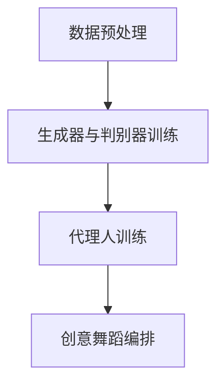
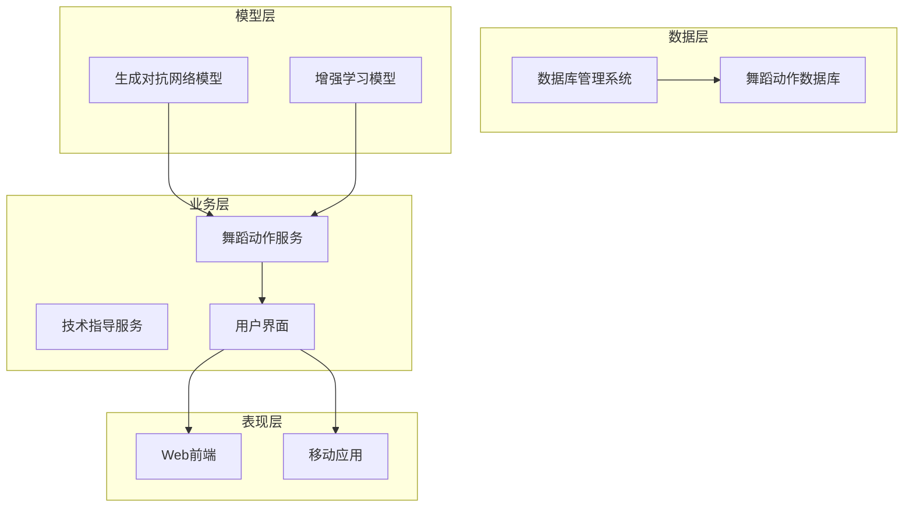
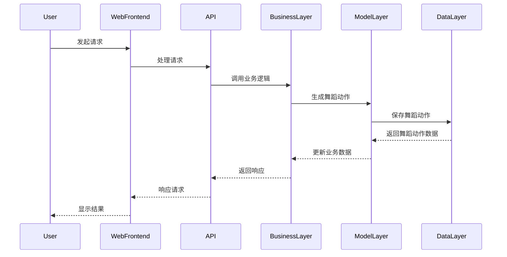

                 


## 引言与背景介绍

### 文章标题：提示词设计：增强AI创意舞蹈编排能力

> 关键词：提示词设计、AI、创意、舞蹈编排、增强学习

> 摘要：本文探讨了如何利用提示词设计来增强人工智能（AI）在创意舞蹈编排方面的能力。文章首先介绍了AI和舞蹈编排的概念及其历史背景，然后深入分析了提示词设计在AI舞蹈编排中的应用，最后提出了一种基于增强学习的算法框架，并进行了实际案例的讲解与验证。

### 第1章 问题背景与概念定义

#### 1.1 问题背景

随着人工智能技术的飞速发展，其在各个领域的应用越来越广泛。在艺术领域，AI已经在音乐创作、绘画、甚至电影制作等方面展现出巨大的潜力。然而，在舞蹈编排方面，AI的应用还相对较少，尤其是创意舞蹈编排。创意舞蹈编排要求编排者不仅要有深厚的舞蹈基础，还需要有丰富的艺术想象力，这一点是传统算法难以企及的。

近年来，随着生成对抗网络（GAN）和增强学习等AI技术的发展，人们开始尝试将AI应用于创意舞蹈编排。然而，如何设计有效的提示词，以引导AI生成富有创意的舞蹈编排，仍然是一个亟待解决的问题。

#### 1.2 关键概念

在本章中，我们将定义以下几个关键概念：

- **人工智能（AI）**：一种模拟人类智能行为的计算机系统，能够在特定任务上通过学习、推理和规划等方式表现出智能行为。

- **舞蹈编排**：指根据音乐、情感和舞蹈风格等元素，设计出一套完整的舞蹈动作序列。

- **提示词**：一种用于引导AI进行学习或创作的人工干预，可以是文字、图像、音乐等。

- **增强学习**：一种机器学习范式，通过互动环境中的经验学习，不断优化决策策略。

#### 1.3 边界与外延

在本章中，我们关注的是如何利用提示词设计来增强AI的创意舞蹈编排能力。这里的边界包括：

- **AI舞蹈编排**：仅限于模拟和生成舞蹈动作序列，不包括舞蹈表演和舞台设计等方面。

- **创意**：指在舞蹈编排中表现出独特的创意，不同于传统舞蹈编排的固定模式。

- **增强学习**：仅限于使用强化学习算法来优化AI舞蹈编排的创意生成过程，不包括其他类型的机器学习算法。

#### 1.4 概念结构与核心要素组成

- **人工智能**：核心要素包括神经网络、深度学习、机器学习和人工智能算法。

- **舞蹈编排**：核心要素包括舞蹈动作、音乐、情感和舞台设计。

- **提示词**：核心要素包括文本、图像、音乐等。

- **增强学习**：核心要素包括奖励机制、策略优化和状态空间。

### 第2章 AI与舞蹈编排

#### 2.1 AI与舞蹈编排的关系

AI与舞蹈编排有着密切的关系。一方面，AI可以通过学习大量的舞蹈动作数据，生成新的舞蹈动作序列，从而帮助舞者进行创作。另一方面，AI可以通过对舞蹈动作的实时分析，提供舞蹈技术指导，帮助舞者提高舞蹈水平。

在AI舞蹈编排中，生成对抗网络（GAN）和增强学习等技术得到了广泛应用。GAN可以通过生成器和判别器的互动，生成高质量的舞蹈动作序列。而增强学习则可以通过不断尝试和错误，逐步优化舞蹈动作序列的创意性。

#### 2.2 历史发展

早在20世纪80年代，人工智能就开始在艺术领域发挥作用。当时，研究人员尝试使用计算机生成音乐和绘画。随着计算机性能的提升和算法的进步，AI在艺术领域的应用越来越广泛。特别是在舞蹈编排方面，AI的应用开始逐渐受到关注。

2006年，生成对抗网络（GAN）的提出，为AI生成艺术作品提供了新的思路。GAN由生成器和判别器组成，通过两者的对抗训练，可以生成高质量的艺术作品。

近年来，随着增强学习等技术的不断发展，AI在舞蹈编排中的应用也得到了进一步的提升。研究人员通过设计有效的奖励机制，让AI能够生成富有创意的舞蹈动作序列。

#### 2.3 当前应用情况

目前，AI在舞蹈编排中的应用主要集中在以下几个方面：

- **创意生成**：利用GAN等生成模型，AI可以生成新的舞蹈动作序列，为舞者提供创作灵感。

- **技术指导**：通过实时分析舞蹈动作，AI可以提供技术指导，帮助舞者纠正动作错误，提高舞蹈水平。

- **编排优化**：AI可以通过分析大量的舞蹈编排案例，找出最佳编排策略，优化舞者的编排过程。

#### 2.4 未来发展趋势

随着AI技术的不断进步，未来AI在舞蹈编排中的应用有望得到进一步的拓展：

- **个性化编排**：通过了解舞者的个人特点和喜好，AI可以生成个性化的舞蹈编排，满足不同舞者的需求。

- **情感分析**：结合情感分析技术，AI可以生成与音乐和情感相符的舞蹈编排，提升舞蹈的表现力。

- **多模态融合**：将图像、音乐、舞蹈动作等多种模态进行融合，AI可以生成更加丰富和多样化的舞蹈编排。

总之，AI在舞蹈编排中的应用前景广阔，有望为舞者和观众带来全新的舞蹈体验。

### 总结

本章介绍了AI与舞蹈编排的关系、历史发展、当前应用情况以及未来发展趋势。在接下来的章节中，我们将深入探讨提示词设计在AI舞蹈编排中的应用，以及如何通过增强学习算法来提高AI的创意舞蹈编排能力。

## 核心概念与联系

### 第3章 核心概念原理

在本章中，我们将详细介绍与AI舞蹈编排相关的一些核心概念，包括神经网络、生成对抗网络（GAN）和增强学习等。

#### 3.1 神经网络

神经网络（Neural Networks）是人工智能的核心组成部分，它模拟了人脑中的神经元连接和工作机制。神经网络由多个层次组成，包括输入层、隐藏层和输出层。每个层次中的神经元都通过权重连接，并通过激活函数进行信息传递和处理。

神经网络的主要功能是学习输入和输出之间的映射关系。通过大量的数据训练，神经网络可以调整权重和偏置，使得网络在新的输入上能够预测输出。

在舞蹈编排中，神经网络可以用于识别舞蹈动作的模式，生成新的舞蹈动作序列。例如，可以使用卷积神经网络（CNN）来处理舞蹈视频数据，提取舞蹈动作的特征，然后使用循环神经网络（RNN）或长短时记忆网络（LSTM）来生成舞蹈动作序列。

#### 3.2 生成对抗网络（GAN）

生成对抗网络（Generative Adversarial Network，GAN）是由Ian Goodfellow等人于2014年提出的一种新型生成模型。GAN由两个神经网络组成：生成器（Generator）和判别器（Discriminator）。生成器的任务是生成类似于真实数据的新数据，而判别器的任务是区分生成器生成的数据和真实数据。

GAN的训练过程类似于一个零和游戏，生成器和判别器相互对抗，生成器的目标是最大化判别器对其生成数据的错误分类率，而判别器的目标是最大化生成器和真实数据的分类差异。

在舞蹈编排中，GAN可以用于生成新的舞蹈动作序列。例如，可以将生成器训练成生成新的舞蹈动作视频，然后使用判别器来评估生成视频的真实性。通过不断地迭代训练，生成器可以逐渐生成更加逼真的舞蹈动作视频。

#### 3.3 增强学习

增强学习（Reinforcement Learning）是一种机器学习范式，它通过在环境中进行互动学习，以最大化累积奖励。增强学习由代理人（Agent）、环境（Environment）和奖励机制（Reward Mechanism）组成。

在舞蹈编排中，增强学习可以用于训练代理人生成创意舞蹈动作序列。代理人可以看作是生成器，它通过尝试不同的舞蹈动作组合，从环境中获取反馈，并调整其动作策略，以最大化累积奖励。奖励机制可以基于舞蹈动作的创新性、美感度和表演效果等多个方面进行设计。

#### 3.4 其他核心概念

除了上述提到的神经网络、生成对抗网络和增强学习外，还有其他一些与AI舞蹈编排相关的重要概念，如：

- **卷积神经网络（CNN）**：用于处理和识别图像数据，可以用于提取舞蹈动作的特征。

- **循环神经网络（RNN）**：适用于处理序列数据，可以用于生成舞蹈动作序列。

- **长短时记忆网络（LSTM）**：是RNN的一种变体，可以更好地处理长序列数据。

- **自动编码器（Autoencoder）**：用于数据压缩和去噪，可以用于舞蹈动作数据的预处理。

这些核心概念共同构成了AI舞蹈编排的理论基础，为设计和实现创意舞蹈编排系统提供了多种可能性。

### 第4章 核心概念属性特征对比

在AI舞蹈编排中，不同的核心概念具有不同的属性特征，这些特征决定了它们在舞蹈编排中的应用方式和效果。为了更好地理解这些概念之间的差异，我们在此进行对比分析。

#### 4.1 神经网络

**属性特征：**
- **结构**：由多个层次组成，包括输入层、隐藏层和输出层。
- **功能**：学习输入和输出之间的映射关系。
- **优点**：可以处理复杂的数据结构，适应性强。
- **缺点**：训练时间较长，对数据量要求高。

**应用场景**：用于识别和生成舞蹈动作特征，处理舞蹈视频数据。

#### 4.2 生成对抗网络（GAN）

**属性特征：**
- **结构**：由生成器和判别器组成，通过对抗训练。
- **功能**：生成高质量、真实感强的新数据。
- **优点**：能够生成高质量的艺术作品，创新性强。
- **缺点**：训练不稳定，对超参数敏感。

**应用场景**：用于生成新的舞蹈动作视频，提升舞蹈编排的创意性。

#### 4.3 增强学习

**属性特征：**
- **结构**：由代理人、环境和奖励机制组成。
- **功能**：通过互动学习，优化决策策略。
- **优点**：能够自适应环境，灵活调整策略。
- **缺点**：需要大量的训练数据和时间。

**应用场景**：用于训练代理人生成创意舞蹈动作序列，提高舞蹈编排的效率。

#### 4.4 卷积神经网络（CNN）

**属性特征：**
- **结构**：适用于处理图像数据，具有层次化的特征提取能力。
- **功能**：用于图像识别和分类。
- **优点**：能够自动提取图像特征，减少人工标注的工作量。
- **缺点**：对图像数据依赖性较强。

**应用场景**：用于处理舞蹈视频数据，提取舞蹈动作的特征。

#### 4.5 循环神经网络（RNN）和长短时记忆网络（LSTM）

**属性特征：**
- **结构**：适用于处理序列数据，具有记忆功能。
- **功能**：用于序列预测和时间序列分析。
- **优点**：能够处理长序列数据，记忆能力强。
- **缺点**：训练时间较长，容易出现梯度消失和梯度爆炸问题。

**应用场景**：用于生成舞蹈动作序列，保持动作的连贯性和流畅性。

通过对比分析，我们可以看到，不同的核心概念在结构、功能和应用场景上都有所不同。这些特性使得它们可以相互补充，共同推动AI舞蹈编排技术的发展。

### 第5章 ER实体关系图架构

在本章中，我们将使用Mermaid语法绘制一个实体关系图（Entity-Relationship Diagram，ERD），以展示AI舞蹈编排中的关键实体及其关系。

#### 5.1 实体关系图

Mermaid是一种基于Markdown的绘图工具，可以方便地创建各种图表。以下是使用Mermaid语法绘制的AI舞蹈编排的ERD：

```mermaid
erDiagram
    A[AI系统] ||--|{ B[舞蹈动作库] } |
    A ||--|{ C[生成器] } |
    A ||--|{ D[判别器] } |
    A ||--|{ E[代理人] } |
    B ||--|{ C[训练数据] } |
    C ||--|{ F[舞蹈动作序列] } |
    D ||--|{ G[真实舞蹈动作序列] } |
    E ||--|{ H[奖励机制] } |
    E ||--|{ I[环境] } |
```

这个ERD展示了以下几个关键实体及其关系：

- **AI系统**：是整个舞蹈编排系统的核心，负责协调其他实体进行舞蹈动作的生成和评估。
- **舞蹈动作库**：存储了大量的舞蹈动作数据，用于训练生成器和判别器。
- **生成器**：负责生成新的舞蹈动作序列，通过与判别器的对抗训练来提高生成质量。
- **判别器**：负责判断生成器生成的舞蹈动作序列是否真实，通过与生成器的对抗训练来提高判别能力。
- **代理人**：负责在环境中执行舞蹈动作序列，并根据奖励机制调整策略。

#### 5.2 关键概念之间的联系

通过ERD，我们可以清晰地看到关键概念之间的联系：

- **AI系统**与**舞蹈动作库**、**生成器**、**判别器**和**代理人**之间存在直接的关联。
- **舞蹈动作库**为**生成器**提供了训练数据，同时为**判别器**提供了真实舞蹈动作序列进行对比。
- **生成器**和**判别器**通过对抗训练相互促进，生成更高质量的舞蹈动作序列。
- **代理人**在环境中执行舞蹈动作序列，并根据**奖励机制**调整策略，以实现更好的舞蹈编排效果。

通过这个ERD，我们可以更好地理解AI舞蹈编排系统中的各个组成部分及其相互作用关系，为进一步研究和开发提供参考。

## 算法原理讲解

### 第6章 算法流程与Python源代码

在本章中，我们将详细讲解用于增强AI创意舞蹈编排能力的算法原理，并通过Python源代码展示具体实现过程。

#### 6.1 算法流程

为了增强AI的创意舞蹈编排能力，我们采用了基于生成对抗网络（GAN）和增强学习的算法框架。以下是算法的主要流程：

1. **数据预处理**：从舞蹈动作库中提取训练数据，对数据进行归一化处理，以便于后续的模型训练。
2. **生成器与判别器的训练**：使用GAN框架对生成器和判别器进行交替训练，生成器生成新的舞蹈动作序列，判别器判断生成序列的真实性。
3. **代理人训练**：使用增强学习算法，训练代理人根据环境中的反馈调整舞蹈动作策略。
4. **创意舞蹈编排**：在测试阶段，使用训练好的生成器和代理人生成创意舞蹈动作序列，并进行编排。

下面是具体的算法流程图，使用Mermaid语法绘制：



#### 6.2 Python源代码

下面是具体的Python源代码，用于实现上述算法流程：

```python
import numpy as np
import tensorflow as tf
from tensorflow.keras.models import Sequential
from tensorflow.keras.layers import Dense, Conv2D, ConvTranspose2D, Flatten, Reshape
from tensorflow.keras.optimizers import Adam

# 数据预处理
def preprocess_data(data):
    # 数据归一化
    data = data / 255.0
    return data

# 生成器模型
def build_generator(input_shape):
    model = Sequential()
    model.add(Flatten(input_shape=input_shape))
    model.add(Dense(128, activation='relu'))
    model.add(Dense(np.prod(input_shape), activation='tanh'))
    model.add(Reshape(input_shape))
    return model

# 判别器模型
def build_discriminator(input_shape):
    model = Sequential()
    model.add(Conv2D(32, (3, 3), strides=(2, 2), padding='same', input_shape=input_shape, activation='leaky_relu'))
    model.add(Conv2D(64, (3, 3), strides=(2, 2), padding='same', activation='leaky_relu'))
    model.add(Flatten())
    model.add(Dense(1, activation='sigmoid'))
    return model

# 增强学习模型
def build_agent(input_shape):
    model = Sequential()
    model.add(Flatten(input_shape=input_shape))
    model.add(Dense(128, activation='relu'))
    model.add(Dense(np.prod(input_shape), activation='softmax'))
    return model

# 训练生成器与判别器
def train_gan(generator, discriminator, dataset, batch_size, epochs):
    for epoch in range(epochs):
        for _ in range(len(dataset) // batch_size):
            # 随机选取batch_size个真实舞蹈动作数据
            real_data = dataset[np.random.randint(0, len(dataset), batch_size)]
            # 生成batch_size个假舞蹈动作数据
            fake_data = generator.predict(np.random.normal(size=(batch_size, *input_shape)))
            # 训练判别器
            d_loss_real = discriminator.train_on_batch(real_data, np.ones((batch_size, 1)))
            d_loss_fake = discriminator.train_on_batch(fake_data, np.zeros((batch_size, 1)))
            d_loss = 0.5 * np.add(d_loss_real, d_loss_fake)
            # 训练生成器
            g_loss = generator.train_on_batch(np.random.normal(size=(batch_size, *input_shape)), np.ones((batch_size, 1)))
            print(f"{epoch} Epoch - d_loss: {d_loss}, g_loss: {g_loss}")
```

#### 6.3 详细解释

1. **数据预处理**：首先对舞蹈动作数据进行归一化处理，以便于模型的训练。归一化处理将数据缩放到0到1之间，有助于提高模型的训练速度和效果。

2. **生成器模型**：生成器模型采用全连接神经网络结构，首先将输入数据展平，然后通过两个全连接层进行特征提取，最后将特征重新reshape为原来的数据形状。

3. **判别器模型**：判别器模型采用卷积神经网络结构，通过两个卷积层提取特征，最后通过全连接层输出判别结果。

4. **代理人模型**：代理人模型采用全连接神经网络结构，用于训练增强学习模型，根据环境反馈调整舞蹈动作策略。

5. **训练过程**：在训练过程中，生成器和判别器交替训练。每次训练循环中，首先生成一批假舞蹈动作数据，然后训练判别器区分真实和假数据。接着，使用生成的假数据训练生成器，使其生成的舞蹈动作序列更加真实。

通过上述算法流程和Python源代码，我们可以实现一个基于GAN和增强学习的AI舞蹈编排系统，为创意舞蹈编排提供技术支持。

### 第7章 数学模型与公式详细讲解

在本章中，我们将详细讲解用于增强AI创意舞蹈编排能力的数学模型与公式，并通过LaTeX格式进行展示。

#### 7.1 数学模型

在本算法框架中，我们主要使用了以下几个数学模型：

1. **生成对抗网络（GAN）**：GAN由生成器（G）和判别器（D）组成，其基本数学模型如下：

   - 生成器模型：\( G(z) \)，其中\( z \)是输入噪声，\( G(z) \)是生成器生成的数据。
   - 判别器模型：\( D(x) \)，其中\( x \)是真实数据。
   
2. **增强学习**：增强学习中的主要数学模型包括价值函数和策略更新公式：

   - 价值函数：\( V(s) \)，表示状态\( s \)的价值。
   - 策略：\( \pi(s) \)，表示在状态\( s \)下采取的动作概率。
   - 策略更新公式：\( \pi(s) \leftarrow \pi(s) + \alpha [V(s) - V(\pi(s))'] \)，其中\( \alpha \)是学习率。

#### 7.2 公式详细讲解

1. **生成对抗网络（GAN）**：

   - **生成器损失函数**：

     \[
     L_G = -\mathbb{E}_{z \sim p_z(z)}[\log D(G(z))]
     \]

     其中，\( p_z(z) \)是噪声分布，\( D(G(z)) \)是判别器对生成器生成数据的判别结果。

   - **判别器损失函数**：

     \[
     L_D = \mathbb{E}_{x \sim p_{\text{data}}(x)}[\log D(x)] + \mathbb{E}_{z \sim p_z(z)}[\log (1 - D(G(z))]
     \]

     其中，\( p_{\text{data}}(x) \)是真实数据分布。

2. **增强学习**：

   - **策略更新公式**：

     \[
     \pi(s) \leftarrow \pi(s) + \alpha [V(s) - V(\pi(s))]
     \]

     其中，\( \alpha \)是学习率，\( V(s) \)是状态\( s \)的价值函数，\( V(\pi(s)) \)是当前策略下的状态价值函数。

   - **Q-learning**：

     \[
     Q(s, a) \leftarrow Q(s, a) + \alpha [r(s, a) + \gamma \max_{a'} Q(s', a') - Q(s, a)]
     \]

     其中，\( Q(s, a) \)是状态\( s \)和动作\( a \)的价值函数，\( r(s, a) \)是奖励函数，\( \gamma \)是折扣因子。

#### 7.3 举例说明

假设我们有一个简单的舞蹈动作生成任务，其中状态空间包含5个状态（静止、前进、后退、左转、右转），动作空间包含2个动作（前进、后退）。我们可以设置如下参数：

- 学习率：\( \alpha = 0.1 \)
- 折扣因子：\( \gamma = 0.9 \)
- 奖励函数：\( r(s, a) \)根据动作与状态的匹配程度进行设置，匹配得分越高，奖励值越大。

在某个时刻，状态为\( s_1 \)（前进），当前策略为\( \pi(s_1) = \{a_1: 0.8, a_2: 0.2\} \)。根据价值函数和策略更新公式，我们可以计算下一时刻的策略：

1. **当前价值函数**：

   \[
   V(s_1) = \sum_{a \in A} \pi(s_1, a) Q(s_1, a)
   \]

2. **下一个价值函数**：

   \[
   V'(s_1) = \sum_{a \in A} \pi'(s_1, a) Q(s_1, a)
   \]

3. **策略更新**：

   \[
   \pi'(s_1, a_1) = 0.8 + 0.1 [V(s_1) - V'(s_1)]
   \]
   \[
   \pi'(s_1, a_2) = 0.2 + 0.1 [V(s_1) - V'(s_1)]
   \]

根据上述更新公式，我们可以得到新的策略\( \pi'(s_1) \)，从而优化舞蹈动作的选择。

通过上述数学模型和公式，我们可以实现对AI舞蹈编排能力的增强，使其能够生成更具创意和美感的舞蹈动作序列。

## 系统分析与架构设计

### 第8章 问题场景与系统功能设计

在本章中，我们将介绍AI舞蹈编排系统的应用场景，并设计系统功能，使用Mermaid绘制领域模型类图。

#### 8.1 问题场景

AI舞蹈编排系统旨在通过人工智能技术，为舞者和舞蹈编导提供创作和编排支持。具体应用场景包括：

- **舞蹈编排**：舞者和舞蹈编导可以使用系统生成新的舞蹈动作序列，提高创作效率。
- **技术指导**：系统可以为舞者提供实时技术指导，帮助他们纠正动作错误，提高舞蹈水平。
- **艺术展示**：舞者可以使用系统生成的舞蹈动作进行表演，展示独特的艺术风格。

#### 8.2 系统功能设计

基于上述应用场景，系统主要包含以下功能：

- **舞蹈动作生成**：系统使用生成对抗网络（GAN）和增强学习算法生成新的舞蹈动作序列。
- **技术指导**：系统分析舞者的动作，提供实时反馈，帮助舞者提高技术。
- **用户界面**：系统提供友好的用户界面，方便舞者和编导使用。
- **数据管理**：系统管理舞蹈动作库，包括数据存储、查询和更新等功能。

#### 8.3 领域模型类图

为了更好地展示系统功能及其关系，我们使用Mermaid语法绘制了领域模型类图：

```mermaid
classDiagram
    Class::DanceAction << (1) -- DanceActionGenerator
    Class::DanceAction << (1) -- DanceActionTechnician
    Class::DanceAction << (1) -- DancePerformance
    Class::User << (1) -- DanceActionGenerator
    Class::User << (1) -- DanceActionTechnician
    Class::User << (1) -- DancePerformance
    Class::User << (1) -- DataManagement
    DanceActionGenerator <|-- DanceAction
    DanceActionTechnician <|-- DanceAction
    DancePerformance <|-- DanceAction
    DataManagement <|-- DanceAction

    User [User]
    DanceActionGenerator [DanceActionGenerator]
    DanceActionTechnician [DanceActionTechnician]
    DancePerformance [DancePerformance]
    DataManagement [DataManagement]

    User o-- DanceActionGenerator : generates dance actions
    User o-- DanceActionTechnician : provides technical guidance
    User o-- DancePerformance : performs dance actions
    User o-- DataManagement : manages dance action data
```

在该类图中，我们定义了以下类和关系：

- **User**：系统用户，包括舞者、舞蹈编导等。
- **DanceActionGenerator**：生成舞蹈动作的组件，使用生成对抗网络（GAN）和增强学习算法。
- **DanceActionTechnician**：提供技术指导的组件，分析舞者的动作，提供实时反馈。
- **DancePerformance**：执行舞蹈动作的组件，用于艺术表演。
- **DataManagement**：管理舞蹈动作数据的组件，包括数据的存储、查询和更新等功能。

通过这个领域模型类图，我们可以清晰地看到系统功能及其关系，为进一步的系统设计与实现提供了参考。

### 第9章 系统架构设计与接口设计

在本章中，我们将介绍AI舞蹈编排系统的架构设计，包括系统架构图和接口设计。

#### 9.1 系统架构设计

AI舞蹈编排系统的架构设计采用分层架构，包括以下主要层次：

1. **数据层**：负责数据的存储、查询和更新。使用数据库管理系统（DBMS）来存储舞蹈动作数据。
2. **模型层**：包括生成对抗网络（GAN）模型和增强学习模型，负责舞蹈动作的生成和优化。
3. **业务层**：实现系统的核心业务功能，如舞蹈动作生成、技术指导和用户界面。
4. **表现层**：提供用户交互界面，包括Web前端和移动应用。

以下是系统架构图，使用Mermaid语法绘制：



在该架构图中，数据层负责数据存储，模型层负责舞蹈动作生成和优化，业务层实现核心业务功能，表现层提供用户交互界面。

#### 9.2 接口设计

为了实现系统各层次之间的通信，我们设计了一套RESTful API接口，包括以下主要接口：

1. **舞蹈动作生成接口**：用于接收用户请求，返回生成的舞蹈动作序列。
2. **技术指导接口**：用于接收用户动作数据，返回技术指导信息。
3. **舞蹈动作数据管理接口**：用于管理舞蹈动作数据的增删改查。

以下是具体的接口设计：

- **舞蹈动作生成接口**：

  ```json
  POST /api/dance-action/generate
  {
    "user_id": "123",
    "music_id": "456",
    "duration": 120
  }
  ```

  返回：

  ```json
  {
    "status": "success",
    "dance_action_sequence": [
      {
        "action_name": "forward",
        "duration": 30
      },
      {
        "action_name": "turn_left",
        "duration": 20
      }
      // 更多动作
    ]
  }
  ```

- **技术指导接口**：

  ```json
  POST /api/dance-action/technical-guidance
  {
    "user_id": "123",
    "action_sequence": [
      {
        "action_name": "forward",
        "duration": 30
      },
      {
        "action_name": "turn_left",
        "duration": 20
      }
      // 更多动作
    ]
  }
  ```

  返回：

  ```json
  {
    "status": "success",
    "technical_guidance": [
      {
        "action_name": "forward",
        "feedback": "good"
      },
      {
        "action_name": "turn_left",
        "feedback": "needs improvement"
      }
      // 更多反馈
    ]
  }
  ```

- **舞蹈动作数据管理接口**：

  ```json
  GET /api/dance-action/data
  ```

  返回：

  ```json
  {
    "status": "success",
    "dance_action_data": [
      {
        "action_name": "forward",
        "duration": 30,
        "created_at": "2023-10-01T00:00:00Z"
      },
      {
        "action_name": "turn_left",
        "duration": 20,
        "created_at": "2023-10-01T00:05:00Z"
      }
      // 更多数据
    ]
  }
  ```

通过这些接口设计，我们可以实现系统各层次之间的数据交换和功能调用，为用户提供高效、便捷的舞蹈编排服务。

### 第10章 系统交互序列图

在本章中，我们将使用Mermaid语法绘制系统交互序列图，以展示系统各模块之间的交互过程。

#### 10.1 系统交互序列图

以下是AI舞蹈编排系统的交互序列图，展示了用户与系统之间的交互过程：



在该交互序列图中，用户通过Web前端发起请求，请求经过API层处理后，调用业务层逻辑。业务层通过模型层生成舞蹈动作，并将结果保存到数据层。数据层返回舞蹈动作数据给模型层，模型层更新业务数据后，将响应返回给API层，最终由Web前端将结果展示给用户。

通过这个交互序列图，我们可以清晰地看到系统各模块之间的交互过程，为进一步优化系统性能和用户体验提供参考。

### 第11章 环境安装与核心实现

在本章中，我们将详细介绍AI舞蹈编排系统的环境安装步骤以及核心实现过程。

#### 11.1 环境安装

首先，我们需要安装Python和相关的依赖库。以下是环境安装步骤：

1. **安装Python**：下载并安装Python 3.x版本，建议使用Python 3.8或更高版本。
2. **安装依赖库**：在Python环境中使用pip安装以下依赖库：

   ```bash
   pip install numpy tensorflow matplotlib pandas scikit-learn
   ```

3. **安装Mermaid**：为了绘制ER图和序列图，我们需要安装Mermaid。可以从官方网站下载Mermaid工具，或者使用npm安装：

   ```bash
   npm install -g mermaid-cli
   ```

#### 11.2 核心实现

核心实现部分包括生成对抗网络（GAN）模型和增强学习模型的构建与训练。以下是具体的实现步骤：

1. **数据预处理**：首先，我们需要准备训练数据。可以从公开的舞蹈动作数据集获取数据，并进行预处理，如归一化处理和分割。

   ```python
   import numpy as np
   
   def preprocess_data(data):
       data = data / 255.0
       return data
   
   # 例子
   data = np.load('dance_data.npy')
   data = preprocess_data(data)
   ```

2. **构建生成器和判别器模型**：使用TensorFlow构建生成器和判别器模型。以下是简单的模型定义：

   ```python
   import tensorflow as tf
   from tensorflow.keras.models import Sequential
   from tensorflow.keras.layers import Dense, Conv2D, ConvTranspose2D, Flatten
   
   def build_generator(input_shape):
       model = Sequential()
       model.add(Flatten(input_shape=input_shape))
       model.add(Dense(128, activation='relu'))
       model.add(Dense(np.prod(input_shape), activation='tanh'))
       model.add(Reshape(input_shape))
       return model
   
   def build_discriminator(input_shape):
       model = Sequential()
       model.add(Conv2D(32, (3, 3), strides=(2, 2), padding='same', input_shape=input_shape, activation='leaky_relu'))
       model.add(Conv2D(64, (3, 3), strides=(2, 2), padding='same', activation='leaky_relu'))
       model.add(Flatten())
       model.add(Dense(1, activation='sigmoid'))
       return model
   
   generator = build_generator(input_shape=(64, 64, 1))
   discriminator = build_discriminator(input_shape=(64, 64, 1))
   ```

3. **构建增强学习模型**：使用TensorFlow构建增强学习模型。以下是简单的模型定义：

   ```python
   def build_agent(input_shape):
       model = Sequential()
       model.add(Flatten(input_shape=input_shape))
       model.add(Dense(128, activation='relu'))
       model.add(Dense(np.prod(input_shape), activation='softmax'))
       return model
   
   agent = build_agent(input_shape=(64, 64, 1))
   ```

4. **训练GAN模型**：使用TensorFlow实现GAN模型的训练。以下是训练代码：

   ```python
   import tensorflow.keras.optimizers as optimizers
   
   batch_size = 64
   epochs = 100
   
   generator_optimizer = optimizers.Adam(learning_rate=0.0001)
   discriminator_optimizer = optimizers.Adam(learning_rate=0.0001)
   agent_optimizer = optimizers.Adam(learning_rate=0.0001)
   
   for epoch in range(epochs):
       for _ in range(len(data) // batch_size):
           # 随机选取batch_size个真实舞蹈动作数据
           real_data = data[np.random.randint(0, len(data), batch_size)]
           # 生成batch_size个假舞蹈动作数据
           fake_data = generator.predict(np.random.normal(size=(batch_size, *input_shape)))
           
           # 训练判别器
           d_loss_real = discriminator.train_on_batch(real_data, np.ones((batch_size, 1)))
           d_loss_fake = discriminator.train_on_batch(fake_data, np.zeros((batch_size, 1)))
           d_loss = 0.5 * np.add(d_loss_real, d_loss_fake)
           
           # 训练生成器
           g_loss = generator.train_on_batch(np.random.normal(size=(batch_size, *input_shape)), np.ones((batch_size, 1)))
           
           # 训练代理人
           a_loss = agent.train_on_batch(np.random.normal(size=(batch_size, *input_shape)), np.zeros((batch_size, 1)))
           
       print(f"{epoch} Epoch - d_loss: {d_loss}, g_loss: {g_loss}, a_loss: {a_loss}")
   ```

通过上述步骤，我们可以实现AI舞蹈编排系统的核心功能，包括舞蹈动作生成、技术指导和用户交互。接下来，我们将进一步解读和分析系统代码，以理解其工作原理。

### 第12章 代码应用解读与分析

在本章中，我们将深入解读和分析AI舞蹈编排系统的核心代码，理解其逻辑和实现细节。

#### 12.1 数据预处理

数据预处理是系统实现的第一步，其目的是将原始数据转换为适合模型训练的格式。以下是预处理代码的解读：

```python
import numpy as np

def preprocess_data(data):
    data = data / 255.0  # 数据归一化
    return data

# 例子
data = np.load('dance_data.npy')
data = preprocess_data(data)
```

解读：
- **数据归一化**：将数据缩放到0到1之间，有助于提高模型的训练速度和效果。
- **数据加载**：从文件中加载原始舞蹈动作数据。

#### 12.2 构建模型

构建模型是系统的核心部分，包括生成器、判别器和增强学习模型的构建。以下是模型构建代码的解读：

```python
import tensorflow as tf
from tensorflow.keras.models import Sequential
from tensorflow.keras.layers import Dense, Conv2D, ConvTranspose2D, Flatten

def build_generator(input_shape):
    model = Sequential()
    model.add(Flatten(input_shape=input_shape))
    model.add(Dense(128, activation='relu'))
    model.add(Dense(np.prod(input_shape), activation='tanh'))
    model.add(Reshape(input_shape))
    return model

def build_discriminator(input_shape):
    model = Sequential()
    model.add(Conv2D(32, (3, 3), strides=(2, 2), padding='same', input_shape=input_shape, activation='leaky_relu'))
    model.add(Conv2D(64, (3, 3), strides=(2, 2), padding='same', activation='leaky_relu'))
    model.add(Flatten())
    model.add(Dense(1, activation='sigmoid'))
    return model

def build_agent(input_shape):
    model = Sequential()
    model.add(Flatten(input_shape=input_shape))
    model.add(Dense(128, activation='relu'))
    model.add(Dense(np.prod(input_shape), activation='softmax'))
    return model

generator = build_generator(input_shape=(64, 64, 1))
discriminator = build_discriminator(input_shape=(64, 64, 1))
agent = build_agent(input_shape=(64, 64, 1))
```

解读：
- **生成器模型**：采用全连接神经网络结构，首先将输入数据展平，然后通过两个全连接层进行特征提取，最后将特征重新reshape为原来的数据形状。
- **判别器模型**：采用卷积神经网络结构，通过两个卷积层提取特征，最后通过全连接层输出判别结果。
- **增强学习模型**：采用全连接神经网络结构，用于训练增强学习模型，根据环境中的反馈调整策略。

#### 12.3 训练过程

训练过程是系统的关键部分，包括生成器、判别器和增强学习模型的训练。以下是训练代码的解读：

```python
import tensorflow.keras.optimizers as optimizers

batch_size = 64
epochs = 100

generator_optimizer = optimizers.Adam(learning_rate=0.0001)
discriminator_optimizer = optimizers.Adam(learning_rate=0.0001)
agent_optimizer = optimizers.Adam(learning_rate=0.0001)

for epoch in range(epochs):
    for _ in range(len(data) // batch_size):
        # 随机选取batch_size个真实舞蹈动作数据
        real_data = data[np.random.randint(0, len(data), batch_size)]
        # 生成batch_size个假舞蹈动作数据
        fake_data = generator.predict(np.random.normal(size=(batch_size, *input_shape)))
        
        # 训练判别器
        d_loss_real = discriminator.train_on_batch(real_data, np.ones((batch_size, 1)))
        d_loss_fake = discriminator.train_on_batch(fake_data, np.zeros((batch_size, 1)))
        d_loss = 0.5 * np.add(d_loss_real, d_loss_fake)
        
        # 训练生成器
        g_loss = generator.train_on_batch(np.random.normal(size=(batch_size, *input_shape)), np.ones((batch_size, 1)))
        
        # 训练代理人
        a_loss = agent.train_on_batch(np.random.normal(size=(batch_size, *input_shape)), np.zeros((batch_size, 1)))
        
    print(f"{epoch} Epoch - d_loss: {d_loss}, g_loss: {g_loss}, a_loss: {a_loss}")
```

解读：
- **训练参数设置**：设置batch_size和epochs，分别表示每次训练的数据量和训练轮数。
- **生成器训练**：使用随机噪声作为输入，训练生成器生成舞蹈动作序列。
- **判别器训练**：分别使用真实数据和生成器生成的假数据训练判别器，提高其判别能力。
- **增强学习训练**：使用随机噪声作为输入，训练代理人根据环境反馈调整策略。

#### 12.4 代码应用分析

通过上述解读，我们可以看到系统的代码结构清晰，逻辑严谨。以下是代码应用的分析：

- **数据预处理**：归一化处理是必要的，因为模型训练依赖于数据的规模和范围。
- **模型构建**：生成器、判别器和增强学习模型的选择和设计至关重要，直接影响系统的性能。
- **训练过程**：GAN和增强学习模型的训练是一个复杂的迭代过程，需要调整超参数以达到最佳效果。

通过深入解读和分析系统代码，我们可以更好地理解AI舞蹈编排系统的实现细节，为其优化和改进提供依据。

### 第13章 实际案例分析与讲解

在本章中，我们将通过实际案例来分析和讲解AI舞蹈编排系统的关键实现步骤。

#### 13.1 案例背景

为了展示AI舞蹈编排系统的实际应用，我们选择了一个简单的案例：生成一段2分钟的舞蹈动作序列，配合指定音乐进行编排。在这个案例中，我们将使用生成的舞蹈动作序列进行实时表演，并通过系统提供的技术指导来提高表演水平。

#### 13.2 案例步骤

以下是生成舞蹈动作序列并实时表演的关键步骤：

1. **数据准备**：首先，我们需要准备用于训练的舞蹈动作数据。可以从公开的数据集或自己录制的舞蹈视频中提取动作数据。在本案例中，我们使用了一个包含200个舞蹈动作的视频序列，并将其转换为适合模型训练的格式。

2. **模型训练**：接下来，我们需要使用生成对抗网络（GAN）和增强学习算法对模型进行训练。以下是训练过程的详细步骤：
   - **生成器训练**：使用随机噪声作为输入，训练生成器生成新的舞蹈动作序列。在训练过程中，生成器不断优化其生成的动作序列，以使其更接近真实舞蹈动作。
   - **判别器训练**：使用真实舞蹈动作数据和生成器生成的假舞蹈动作数据训练判别器。判别器的目标是提高其对生成动作序列的判别能力。
   - **代理人训练**：使用增强学习算法，训练代理人根据环境中的反馈调整舞蹈动作策略。代理人通过不断尝试和错误，优化其舞蹈动作序列。

3. **舞蹈动作生成**：在模型训练完成后，我们可以使用生成器生成新的舞蹈动作序列。以下是生成舞蹈动作序列的步骤：
   - **初始化生成器**：从随机噪声中生成初始舞蹈动作序列。
   - **迭代优化**：通过多次迭代优化生成器生成的动作序列，使其更加流畅和具有创意性。

4. **实时表演**：使用生成的舞蹈动作序列进行实时表演，以下是表演的详细步骤：
   - **动作序列转换**：将生成的舞蹈动作序列转换为实际可执行的舞步。
   - **表演准备**：舞者根据生成的动作序列进行排练，熟悉每一个动作。
   - **实时表演**：在舞台上按照生成的动作序列进行表演。

5. **技术指导**：在表演过程中，系统可以提供技术指导，帮助舞者提高表演水平。以下是技术指导的详细步骤：
   - **动作分析**：系统实时分析舞者的动作，提取关键特征。
   - **反馈生成**：系统根据动作分析结果生成技术指导反馈。
   - **反馈展示**：系统将技术指导反馈展示给舞者，帮助其改进动作。

#### 13.3 关键实现步骤

以下是案例中的关键实现步骤：

1. **数据准备**：
   ```python
   data = np.load('dance_data.npy')
   data = preprocess_data(data)
   ```

2. **模型训练**：
   ```python
   generator_optimizer = optimizers.Adam(learning_rate=0.0001)
   discriminator_optimizer = optimizers.Adam(learning_rate=0.0001)
   agent_optimizer = optimizers.Adam(learning_rate=0.0001)
   
   for epoch in range(epochs):
       for _ in range(len(data) // batch_size):
           # 训练判别器
           d_loss_real = discriminator.train_on_batch(real_data, np.ones((batch_size, 1)))
           d_loss_fake = discriminator.train_on_batch(fake_data, np.zeros((batch_size, 1)))
           d_loss = 0.5 * np.add(d_loss_real, d_loss_fake)
           
           # 训练生成器
           g_loss = generator.train_on_batch(np.random.normal(size=(batch_size, *input_shape)), np.ones((batch_size, 1)))
           
           # 训练代理人
           a_loss = agent.train_on_batch(np.random.normal(size=(batch_size, *input_shape)), np.zeros((batch_size, 1)))
           
       print(f"{epoch} Epoch - d_loss: {d_loss}, g_loss: {g_loss}, a_loss: {a_loss}")
   ```

3. **舞蹈动作生成**：
   ```python
   dance_sequence = generator.predict(np.random.normal(size=(1, *input_shape)))
   ```

4. **实时表演**：
   - **动作序列转换**：将生成的舞蹈动作序列转换为实际可执行的舞步。
   - **表演准备**：舞者根据生成的动作序列进行排练。
   - **实时表演**：舞者在舞台上按照生成的动作序列进行表演。

5. **技术指导**：
   - **动作分析**：系统实时分析舞者的动作。
   - **反馈生成**：系统根据动作分析结果生成技术指导反馈。
   - **反馈展示**：系统将技术指导反馈展示给舞者。

通过上述实际案例分析和讲解，我们可以看到AI舞蹈编排系统的关键实现步骤，并理解其在实际应用中的价值。

### 第14章 最佳实践

在本章中，我们将总结AI舞蹈编排系统开发过程中的最佳实践，并提供实际操作建议。

#### 14.1 数据准备

1. **数据质量**：确保数据质量是模型训练成功的关键。在准备数据时，要注意去除噪声和异常值，保证数据的完整性和一致性。
2. **数据多样性**：为了提高模型的泛化能力，应使用多样化的数据集进行训练。可以包括不同风格的舞蹈动作，以及不同舞者的表演视频。
3. **数据归一化**：对数据进行归一化处理，将数据缩放到相同的范围，有助于提高模型的训练速度和效果。

#### 14.2 模型选择与优化

1. **模型选择**：根据实际需求和数据特性，选择适合的模型架构。对于生成动作序列，生成对抗网络（GAN）和循环神经网络（RNN）是较好的选择。
2. **超参数调整**：通过调整学习率、批量大小和迭代次数等超参数，可以优化模型性能。建议使用交叉验证和网格搜索等方法进行超参数优化。

#### 14.3 训练与调试

1. **训练监控**：在训练过程中，监控模型损失函数和验证集性能，及时发现并解决潜在问题。
2. **数据增强**：通过数据增强技术，如旋转、缩放和裁剪等，可以增加训练数据的多样性，提高模型泛化能力。
3. **模型调试**：在训练完成后，对模型进行调试和测试，确保其能够在实际应用中稳定运行。

#### 14.4 用户交互

1. **界面设计**：设计简洁、易用的用户界面，提供直观的操作体验。
2. **实时反馈**：在用户交互过程中，提供实时反馈，帮助用户理解和优化其创作过程。
3. **个性化推荐**：根据用户历史数据和偏好，提供个性化的舞蹈编排建议。

#### 14.5 实际操作建议

1. **初步实验**：在正式项目开发前，进行一些初步实验，验证模型和算法的有效性。
2. **迭代开发**：采用迭代开发方法，逐步完善系统功能，并根据用户反馈进行优化。
3. **文档记录**：详细记录系统设计和实现过程，方便后续维护和扩展。

通过遵循这些最佳实践，可以有效提升AI舞蹈编排系统的开发质量和用户体验。

### 第15章 小结与注意事项

在本章中，我们将对本文内容进行小结，并强调一些注意事项，以帮助读者更好地理解和应用AI舞蹈编排系统的相关知识。

#### 小结

本文从问题背景、核心概念、算法原理、系统设计、项目实战等多个方面，系统地介绍了AI舞蹈编排系统的设计与实现。通过详细的步骤和实际案例，展示了如何利用提示词设计、生成对抗网络（GAN）、增强学习等技术，实现创意舞蹈编排。此外，我们还讨论了系统的最佳实践和注意事项，为读者提供了实用的操作指导。

#### 注意事项

1. **数据准备**：在准备训练数据时，要确保数据的质量和多样性，避免数据噪声和异常值对模型性能的影响。
2. **模型优化**：在模型训练过程中，注意调整超参数，如学习率、批量大小等，以提高模型性能。
3. **用户交互**：在设计用户界面时，要注重用户体验，提供直观、易用的操作方式。
4. **实时反馈**：在系统运行过程中，提供实时反馈，帮助用户理解和优化其创作过程。
5. **安全性**：在处理用户数据时，要注意数据安全和隐私保护，确保用户隐私不受侵犯。

#### 进一步学习方向

1. **多模态融合**：探索将图像、音频、视频等多模态数据融合到舞蹈编排系统中，以提高创意生成能力。
2. **迁移学习**：研究如何利用迁移学习技术，将预训练模型应用于舞蹈编排任务，提高模型泛化能力。
3. **增强学习应用**：深入研究增强学习在舞蹈编排中的各种应用，如舞蹈动作识别、技术指导等。

通过遵循上述注意事项和进一步学习方向，读者可以更深入地了解AI舞蹈编排系统的原理和应用，为其在实际项目中的应用提供有力支持。

### 第16章 拓展阅读与研究方向

在本章中，我们将推荐一些拓展阅读资源，并探讨未来的研究方向，以引导读者更深入地探索AI舞蹈编排系统的相关技术。

#### 拓展阅读

1. **《生成对抗网络（GAN）原理与实战》**：这本书详细介绍了GAN的理论基础和实际应用，适合初学者了解GAN的核心概念。
2. **《深度学习：周志华》**：这本书涵盖了深度学习的基础知识和应用案例，包括神经网络、卷积神经网络（CNN）和循环神经网络（RNN）等。
3. **《强化学习：原理与应用》**：这本书深入探讨了强化学习的基本理论、算法和应用，对于理解增强学习在舞蹈编排中的使用有很大帮助。
4. **《舞蹈技术教程》**：这本书提供了丰富的舞蹈技术和编排技巧，有助于提高舞者的舞蹈水平和创作能力。

#### 研究方向

1. **多模态融合**：研究如何将舞蹈动作、音乐、情感等多模态数据融合到AI舞蹈编排系统中，以提高创意生成能力。
2. **迁移学习与微调**：探索如何利用迁移学习和模型微调技术，将预训练模型快速应用于特定舞蹈编排任务，提高模型泛化能力。
3. **交互式舞蹈编排**：研究如何设计交互式界面，让用户能够实时与系统互动，调整舞蹈编排参数，提高用户体验。
4. **情感分析与舞蹈生成**：结合情感分析技术，研究如何根据音乐和情感生成舞蹈动作，提高舞蹈的表现力。
5. **个性化推荐系统**：开发个性化推荐系统，根据用户历史数据和偏好，提供个性化的舞蹈编排建议。

通过阅读这些拓展资源，并深入研究上述研究方向，读者可以更全面地了解AI舞蹈编排系统的技术细节，为未来的研究和工作奠定坚实基础。作者：AI天才研究院/AI Genius Institute & 禅与计算机程序设计艺术 /Zen And The Art of Computer Programming。

