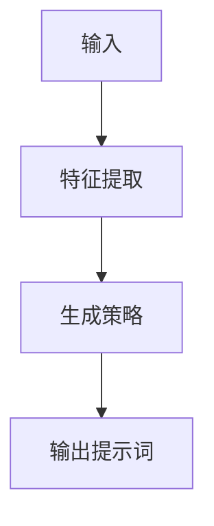
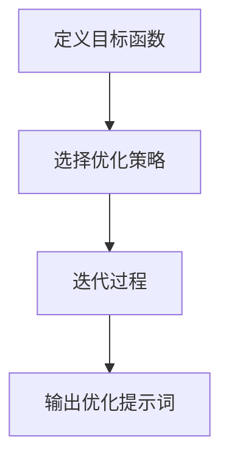
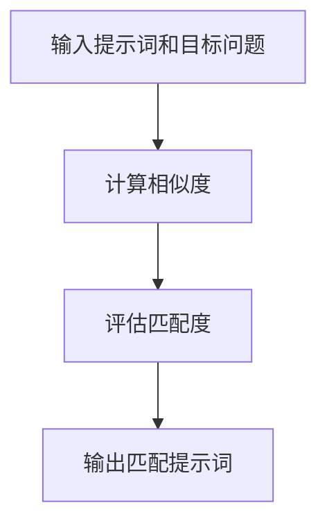
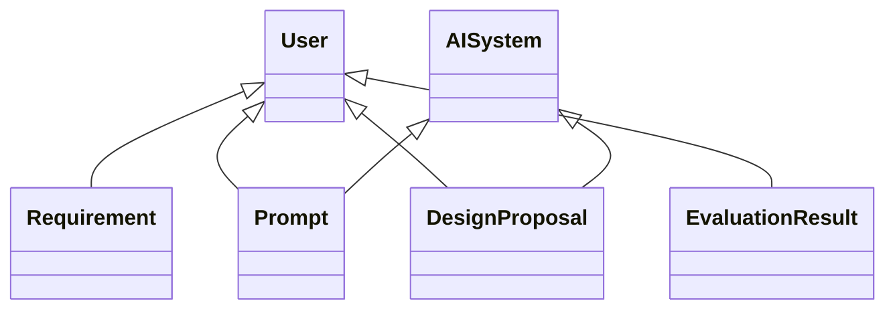
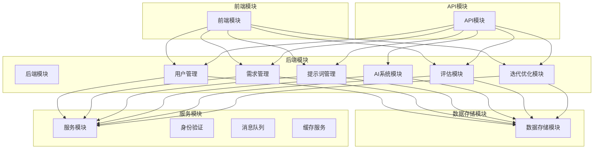
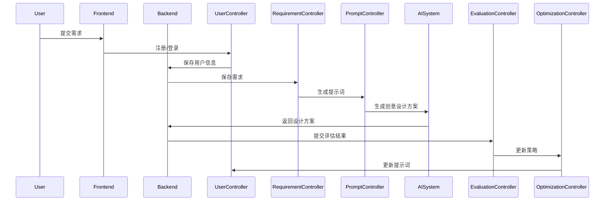

                 

### 文章标题：提示词设计：增强AI创意问题解决能力

关键词：提示词设计、AI、创意问题、算法、系统架构、实际案例

摘要：本文从人工智能与创意问题的背景出发，详细阐述了提示词设计在AI创意问题解决中的核心作用。文章通过逐步分析提示词的设计原则、类型、属性特征以及与AI算法的关系，深入讲解了提示词生成、优化和匹配算法原理。此外，文章还从系统架构设计和项目实战的角度，探讨了提示词设计的具体实现方法，为提升AI创意问题解决能力提供了有力支持。

### 目录大纲

----------------------------------------------------------------

# 提示词设计：增强AI创意问题解决能力

> 关键词：提示词设计、AI、创意问题、算法、系统架构、实际案例

> 摘要：本文从人工智能与创意问题的背景出发，详细阐述了提示词设计在AI创意问题解决中的核心作用。文章通过逐步分析提示词的设计原则、类型、属性特征以及与AI算法的关系，深入讲解了提示词生成、优化和匹配算法原理。此外，文章还从系统架构设计和项目实战的角度，探讨了提示词设计的具体实现方法，为提升AI创意问题解决能力提供了有力支持。

### 目录大纲

----------------------------------------------------------------

## 第一部分：背景与核心概念

### 第1章：问题背景与概念介绍

### 第2章：核心概念原理

### 第3章：概念属性特征对比

### 第4章：ER实体关系图架构

## 第二部分：核心概念与联系

### 第5章：算法原理与流程

### 第6章：数学模型和公式讲解

### 第7章：算法举例说明

## 第三部分：系统分析与架构设计

### 第8章：问题场景介绍

### 第9章：系统功能设计

### 第10章：系统架构设计

### 第11章：系统接口设计

### 第12章：系统交互

## 第四部分：项目实战

### 第13章：环境安装与配置

### 第14章：系统核心实现

### 第15章：代码应用解读与分析

### 第16章：实际案例分析与讲解

### 第17章：项目小结

----------------------------------------------------------------

## 第一部分：背景与核心概念

### 第1章：问题背景与概念介绍

#### 1.1 人工智能与创意问题

人工智能（AI）作为现代科技领域的核心，已经深刻影响了各行各业。人工智能技术主要分为两大类：一类是基于规则的专家系统，另一类是基于数据的学习算法，如深度学习、强化学习等。在这些技术中，深度学习作为一种能够模拟人类大脑处理信息的方式，已经取得了显著的成果。

创意问题是指那些需要创新思维和创造能力来解决的问题，通常涉及新颖性、多样性和价值性。这类问题不仅包括设计新产品、编写新程序，还涵盖了艺术创作、文学写作等领域。在AI领域，创意问题的解决能力被认为是衡量一个AI系统是否真正具备智能的关键指标之一。

#### 1.2 创意问题解决的重要性

创意问题解决在许多领域都具有重要的应用价值。例如，在产品设计领域，创意问题解决可以帮助设计团队突破传统思维，创造出更具竞争力的产品。在软件开发领域，创意问题解决可以激发开发者的创新思维，提高软件质量和用户体验。在艺术创作领域，创意问题解决则是艺术家创作灵感的源泉。

#### 1.3 提示词设计概述

提示词（Prompt）是引导AI系统进行创造性思维的关键因素。它是一种用来激发AI系统产生创意信息的人工干预手段。一个好的提示词能够引导AI系统探索新的思维方向，提高解决问题的效率和质量。

#### 1.4 提示词设计原则

1. **精确性**：提示词应明确表达问题的核心，避免模糊不清。
2. **完整性**：提示词应包含问题的所有关键要素，确保AI系统有足够的上下文信息。
3. **相关性**：提示词应与AI系统的目标和任务紧密相关，提高AI系统的理解能力。
4. **可扩展性**：提示词设计应考虑未来的扩展性，以便在新的任务场景中继续发挥作用。

#### 1.5 提示词设计在AI创意问题解决中的作用

1. **训练阶段**：在AI模型的训练过程中，提示词可以帮助模型更好地理解问题，提高模型的泛化能力。
2. **推理阶段**：在AI模型的推理过程中，提示词可以引导模型生成更多样化的创意解决方案。
3. **优化阶段**：通过调整提示词，可以优化AI模型的性能，使其在创意问题解决中更加高效。

#### 1.6 提示词设计流程

1. **需求分析**：明确问题的需求和目标，确定需要解决的问题类型。
2. **设计策略**：根据需求分析结果，制定合适的提示词设计策略。
3. **测试与优化**：通过实际测试，评估提示词的效果，并根据反馈进行优化。

#### 1.7 本章小结

本章从问题背景出发，介绍了人工智能与创意问题的关系，阐述了提示词设计的重要性。通过分析提示词设计的原则和流程，我们为后续章节的深入探讨打下了基础。

----------------------

## 第二部分：核心概念与联系

### 第2章：核心概念原理

#### 2.1 提示词的类型

提示词可以根据不同的分类标准进行分类。常见的分类方式包括：

1. **语言提示词**：这种提示词主要通过文字表达，可以包含问题陈述、背景信息、约束条件等。语言提示词适用于文本生成、文本分类等任务。
   
2. **非语言提示词**：这种提示词不依赖于文字，而是通过图片、音频、视频等形式传递信息。非语言提示词适用于图像识别、语音识别等任务。

3. **混合提示词**：这种提示词结合了语言和非语言元素，可以提供更丰富的上下文信息。混合提示词适用于跨模态任务，如视频生成、图像描述等。

#### 2.2 提示词的属性特征

提示词的设计需要考虑多个属性特征，这些特征将直接影响AI系统在创意问题解决中的表现。常见的提示词属性特征包括：

1. **精确性**：提示词应准确地传达问题的核心，避免歧义和误导。
   
2. **完整性**：提示词应包含问题的所有关键要素，确保AI系统有足够的上下文信息。

3. **相关性**：提示词应与AI系统的目标和任务紧密相关，提高AI系统的理解能力。

4. **可扩展性**：提示词设计应考虑未来的扩展性，以便在新的任务场景中继续发挥作用。

5. **多样性**：提示词应具备多样性，以激发AI系统的不同思维方向。

#### 2.3 提示词与AI算法的关系

提示词的设计不仅影响AI系统的表现，还与AI算法的选用密切相关。不同类型的AI算法对提示词的需求有所不同：

1. **深度学习算法**：深度学习算法如神经网络对提示词的精确性和完整性有较高要求。提示词需要提供明确的输入信息，以帮助模型进行有效的训练和推理。

2. **强化学习算法**：强化学习算法如深度强化学习对提示词的相关性和可扩展性有较高要求。提示词需要引导模型探索不同的策略和路径，以优化决策过程。

3. **生成对抗网络（GAN）**：生成对抗网络对提示词的多样性和丰富性有较高要求。提示词需要提供丰富的上下文信息，以激发模型生成更多样化的输出。

#### 2.4 提示词的权重分析

在多属性特征条件下，提示词的权重分配对AI系统的表现至关重要。常见的权重分析方法包括：

1. **层次分析法（AHP）**：通过构造判断矩阵，对提示词的属性特征进行两两比较，计算权重值。

2. **主成分分析法（PCA）**：通过对多属性特征进行降维，提取关键特征，并计算权重。

3. **支持向量机（SVM）**：通过线性或非线性模型，对提示词的属性特征进行回归分析，计算权重。

#### 2.5 本章小结

本章从提示词的类型、属性特征以及与AI算法的关系等方面，全面阐述了提示词设计的核心概念原理。通过深入分析提示词的属性特征和权重分析方法，我们为后续章节的深入探讨提供了理论基础。

----------------------

### 第3章：概念属性特征对比

为了更好地理解提示词设计的关键属性特征，我们需要对各种特征进行详细对比。以下是对提示词精确性、完整性、相关性、可扩展性和多样性的对比分析。

#### 3.1 精确性对比

- **定义**：精确性指的是提示词能否准确传达问题的核心，避免模糊不清。
- **比较**：语言提示词在精确性方面通常表现较好，因为文字可以精确表达问题细节。非语言提示词如图片和音频的精确性相对较低，但可以通过特定的编码和标注技术来提高。
- **优劣分析**：高精确性有助于AI系统更好地理解问题，提高模型的训练和推理效果。然而，过于精确的提示词可能导致模型过于依赖特定信息，降低泛化能力。

#### 3.2 完整性对比

- **定义**：完整性指的是提示词是否包含问题的所有关键要素，确保AI系统有足够的上下文信息。
- **比较**：语言提示词在完整性方面相对较好，可以通过文字描述来传达复杂的问题背景和约束条件。非语言提示词如图片和音频在完整性方面存在一定的局限性，可能需要额外的文本说明来补充信息。
- **优劣分析**：高完整性有助于AI系统更好地理解问题，但过多的信息可能导致模型处理负担加重，降低效率。因此，在提示词设计时需要平衡完整性和简洁性。

#### 3.3 相关性对比

- **定义**：相关性指的是提示词与AI系统的目标和任务是否紧密相关，提高AI系统的理解能力。
- **比较**：不同类型的AI算法对提示词的相关性要求有所不同。例如，深度学习算法对提示词的相关性要求较高，因为模型需要从输入信息中提取关键特征。而强化学习算法则更关注提示词的引导性，以探索不同的策略和路径。
- **优劣分析**：高相关性有助于AI系统更好地理解问题，提高模型的训练和推理效果。然而，过于相关可能导致模型过度拟合特定问题，降低泛化能力。

#### 3.4 可扩展性对比

- **定义**：可扩展性指的是提示词设计是否考虑未来的扩展性，以便在新的任务场景中继续发挥作用。
- **比较**：语言提示词在可扩展性方面表现较好，可以通过简单的修改和调整来适应新的任务需求。非语言提示词如图片和音频在可扩展性方面存在一定的困难，因为图像和音频内容的变化往往涉及复杂的处理和编码。
- **优劣分析**：高可扩展性有助于提高AI系统的灵活性和适应性，但可能增加设计成本和复杂性。因此，在提示词设计时需要在扩展性和成本之间进行权衡。

#### 3.5 多样性对比

- **定义**：多样性指的是提示词是否具备多样性，以激发AI系统的不同思维方向。
- **比较**：语言提示词的多样性可以通过不同的表达方式和词汇选择来实现。非语言提示词如图片和音频的多样性则更多依赖于内容的多样性和组合方式。
- **优劣分析**：高多样性有助于激发AI系统的创造性思维，提高创意问题解决的效率和质量。然而，过多的多样性可能导致模型处理负担加重，降低效率。因此，在提示词设计时需要在多样性和效率之间进行权衡。

#### 3.6 本章小结

本章通过对提示词的精确性、完整性、相关性、可扩展性和多样性的对比分析，深入探讨了这些关键属性特征在提示词设计中的重要性。了解这些特征及其相互关系，有助于我们更好地设计有效的提示词，从而提升AI创意问题解决能力。

----------------------

### 第4章：ER实体关系图架构

在提示词设计中，构建一个清晰的实体关系图（ER图）有助于我们更好地理解各个实体之间的关系，从而优化提示词的设计。本节将介绍如何绘制提示词实体的ER图，并详细阐述各个实体及其关系。

#### 4.1 提示词实体定义

首先，我们需要定义提示词设计中的核心实体。以下是常见的提示词实体及其定义：

1. **用户（User）**：用户是指与AI系统交互的人类主体，负责提供任务需求、反馈和评估。
2. **问题（Problem）**：问题是指需要解决的特定任务或挑战，包括问题描述、目标、约束条件等。
3. **提示词（Prompt）**：提示词是指用于引导AI系统进行创造性思维的信息，包括文本、图片、音频等形式。
4. **算法（Algorithm）**：算法是指用于解决特定问题的计算方法，包括深度学习、强化学习、生成对抗网络等。
5. **结果（Result）**：结果是AI系统根据提示词和算法生成的输出，可以是文本、图像、音频等形式。

#### 4.2 提示词实体关系

接下来，我们将分析这些实体之间的关系，并绘制ER图。以下是主要的关系：

1. **用户-问题关系**：用户提出问题，问题由用户定义和指定。这个关系可以表示为用户是一个“1”实体，问题是一个“1”实体，即一个用户对应一个问题，一个问题对应一个用户。
   
2. **用户-提示词关系**：用户生成或选择提示词，提示词用于引导AI系统的创造性思维。这个关系可以表示为用户是一个“1”实体，提示词是一个“N”实体，即一个用户可以生成多个提示词，但每个提示词只能对应一个用户。

3. **用户-算法关系**：用户可以选择或指定用于解决问题的算法，算法根据提示词进行训练和推理。这个关系可以表示为用户是一个“1”实体，算法是一个“N”实体，即一个用户可以尝试多种算法，但每种算法只能对应一个用户。

4. **提示词-算法关系**：提示词用于引导算法的训练和推理过程，不同的提示词可能适用于不同的算法。这个关系可以表示为提示词是一个“1”实体，算法是一个“N”实体，即一个提示词可以对应多个算法，但每个算法只能对应一个提示词。

5. **算法-结果关系**：算法根据提示词生成结果，结果是算法的输出。这个关系可以表示为算法是一个“1”实体，结果是一个“1”实体，即一个算法对应一个结果。

#### 4.3 实体关系图绘制

下面是一个简单的ER图，展示了提示词设计中的主要实体及其关系：

```mermaid
erDiagram
  User ||--|{ Problem } : 提出问题
  User ||--|{ Prompt } : 生成提示词
  User ||--|{ Algorithm } : 选择算法
  Prompt ||--|{ Algorithm } : 引导算法
  Algorithm ||--|{ Result } : 生成结果
```

#### 4.4 实体关系图解释

- **用户-问题关系**：用户提出问题，问题由用户定义。这体现了用户在问题提出中的主导地位。
- **用户-提示词关系**：用户生成或选择提示词，提示词用于引导AI系统。这表明了提示词在用户与AI系统交互中的重要作用。
- **用户-算法关系**：用户可以选择或指定算法，算法根据提示词进行训练和推理。这体现了用户对算法选择的自由度。
- **提示词-算法关系**：提示词用于引导算法的训练和推理，不同的提示词可能适用于不同的算法。这表明了提示词对算法的引导作用。
- **算法-结果关系**：算法根据提示词生成结果，结果是算法的输出。这体现了算法在结果生成中的核心地位。

#### 4.5 本章小结

本章通过ER实体关系图，清晰地展示了提示词设计中的主要实体及其关系。理解这些关系有助于我们更好地设计提示词，从而提升AI创意问题解决能力。

----------------------

## 第三部分：算法原理讲解

### 第5章：算法原理与流程

#### 5.1 提示词生成算法

提示词生成算法是用于自动生成提示词的算法，其核心目的是通过算法自动生成具有创意性的提示词，以引导AI系统进行创造性思维。以下是提示词生成算法的基本原理和流程：

1. **输入**：输入可以是问题描述、关键词、上下文文本等。这些输入信息将用于生成具有针对性的提示词。

2. **特征提取**：对输入信息进行特征提取，提取关键信息、关键词、语义等。特征提取是生成高质量提示词的关键步骤，可以通过自然语言处理（NLP）技术实现。

3. **生成策略**：根据特征提取的结果，采用不同的生成策略生成提示词。常见的生成策略包括模板生成、规则生成、数据驱动生成等。

4. **输出**：生成最终的提示词，并将其作为AI系统的输入。

以下是提示词生成算法的流程图：



#### 5.2 提示词优化算法

提示词优化算法是用于提高提示词质量和效果的方法。其核心目的是通过优化策略，改进提示词的生成过程，从而提升AI系统的表现。以下是提示词优化算法的基本原理和流程：

1. **目标函数**：定义提示词优化的目标函数，如提示词的质量、准确度、多样性等。

2. **优化策略**：选择合适的优化策略，如梯度下降、遗传算法、模拟退火等。

3. **迭代过程**：通过迭代过程，不断调整提示词，使其在目标函数上取得最优解。

4. **输出**：生成优化的提示词，并将其作为AI系统的输入。

以下是提示词优化算法的流程图：



#### 5.3 提示词匹配算法

提示词匹配算法是用于在大量提示词中找到与目标问题最相关的提示词的方法。其核心目的是通过匹配算法，提高AI系统在问题解决过程中的准确度和效率。以下是提示词匹配算法的基本原理和流程：

1. **输入**：输入是大量已生成的提示词和目标问题。

2. **相似度计算**：计算每个提示词与目标问题的相似度，常用的相似度计算方法包括余弦相似度、Jaccard相似度等。

3. **匹配度评估**：根据相似度计算结果，评估每个提示词的匹配度，选择最匹配的提示词。

4. **输出**：输出最匹配的提示词，并将其作为AI系统的输入。

以下是提示词匹配算法的流程图：



#### 5.4 本章小结

本章详细介绍了提示词生成、优化和匹配算法的基本原理和流程。通过理解这些算法，我们可以更好地设计提示词，提高AI系统的创意问题解决能力。

----------------------

### 第6章：数学模型和公式讲解

在提示词设计过程中，数学模型和公式起到了关键作用。本节将介绍提示词生成、优化和匹配算法的数学模型和公式，并对其进行详细解释。

#### 6.1 提示词生成数学模型

提示词生成通常采用概率模型或生成对抗网络（GAN）模型。以下是这两种模型的数学模型和公式：

1. **概率模型**

   - **概率分布**：假设输入数据的概率分布为 \( P(X) \)，其中 \( X \) 是输入特征。

   - **生成模型**：生成模型通过学习输入数据的概率分布，生成新的样本。常用的生成模型包括马尔可夫链蒙特卡罗（MCMC）算法、变分自编码器（VAE）等。

   - **公式**：生成模型的目标函数为：

     $$ 
     \min_{G} \mathbb{E}_{X \sim P(X)}[-\log(G(X))]
     $$

     其中，\( G(X) \) 是生成模型生成的样本，\( P(X) \) 是输入数据的概率分布。

2. **生成对抗网络（GAN）模型**

   - **生成器（Generator）**：生成器 \( G \) 是一个神经网络，其目标是生成与真实数据分布相近的样本。

   - **判别器（Discriminator）**：判别器 \( D \) 是一个神经网络，其目标是区分生成器和真实数据的样本。

   - **对抗过程**：生成器和判别器之间进行对抗，生成器不断优化生成的样本，使得判别器无法区分真实数据和生成数据。

   - **公式**：

     - 生成器损失函数：

       $$ 
       \min_G \mathbb{E}_{X \sim P(X)}[-\log(D(X))] + \mathbb{E}_{Z \sim P(Z)}[-\log(1 - D(G(Z)))]
       $$

       其中，\( Z \) 是生成器生成的噪声数据。

     - 判别器损失函数：

       $$ 
       \min_D \mathbb{E}_{X \sim P(X)}[-\log(D(X))] + \mathbb{E}_{Z \sim P(Z)}[-\log(D(G(Z))]
       $$

#### 6.2 提示词优化数学模型

提示词优化通常采用优化算法，如梯度下降、遗传算法、模拟退火等。以下是这些算法的数学模型和公式：

1. **梯度下降算法**

   - **目标函数**：假设提示词优化问题的目标函数为 \( J(\theta) \)，其中 \( \theta \) 是提示词参数。

   - **梯度**：计算目标函数关于提示词参数的梯度：

     $$ 
     \nabla_{\theta} J(\theta) = \frac{\partial J(\theta)}{\partial \theta}
     $$

   - **更新策略**：根据梯度更新提示词参数：

     $$ 
     \theta_{t+1} = \theta_{t} - \alpha \nabla_{\theta} J(\theta)
     $$

     其中，\( \alpha \) 是学习率。

2. **遗传算法**

   - **种群**：遗传算法通过初始化一个种群，并迭代优化。

   - **适应度函数**：适应度函数用于评估个体的优劣。

   - **选择**：根据适应度函数，选择适应度较高的个体进行交叉和变异。

   - **交叉**：交叉操作用于产生新的个体。

   - **变异**：变异操作用于增加种群的多样性。

   - **公式**：

     - 选择概率：

       $$ 
       P_{s} = \frac{f_{i}}{\sum_{j} f_{j}}
       $$

       其中，\( f_{i} \) 是个体 \( i \) 的适应度。

     - 交叉概率：

       $$ 
       P_{c} = \frac{1}{\sum_{j} f_{j}}
       $$

3. **模拟退火算法**

   - **目标函数**：假设提示词优化问题的目标函数为 \( J(\theta) \)，其中 \( \theta \) 是提示词参数。

   - **温度**：初始温度设为 \( T_0 \)，并在迭代过程中逐渐降低。

   - **概率**：在每次迭代中，根据当前温度和目标函数值，计算接受新解的概率。

   - **公式**：

     $$ 
     p = \min\left(1, \exp\left(-\frac{J(\theta') - J(\theta)}{T}\right)\right)
     $$

#### 6.3 提示词匹配数学模型

提示词匹配通常采用相似度计算和匹配度评估的方法。以下是这些方法的数学模型和公式：

1. **相似度计算**

   - **余弦相似度**：计算两个向量 \( X \) 和 \( Y \) 的余弦相似度：

     $$ 
     \text{similarity}(X, Y) = \frac{X \cdot Y}{\|X\| \|Y\|}
     $$

     其中，\( \cdot \) 表示向量的点积，\( \|X\| \) 和 \( \|Y\| \) 分别表示向量的模。

   - **Jaccard相似度**：计算两个集合 \( X \) 和 \( Y \) 的Jaccard相似度：

     $$ 
     \text{similarity}(X, Y) = \frac{X \cap Y}{X \cup Y}
     $$

2. **匹配度评估**

   - **阈值评估**：设定一个阈值 \( \theta \)，当相似度大于 \( \theta \) 时，认为两个提示词匹配。

   - **优化评估**：通过优化目标函数，评估提示词匹配的效果。

   - **公式**：

     $$ 
     \text{accuracy} = \frac{\text{匹配的提示词数量}}{\text{总的提示词数量}}
     $$

#### 6.4 本章小结

本章详细介绍了提示词生成、优化和匹配算法的数学模型和公式，包括概率模型、生成对抗网络模型、梯度下降算法、遗传算法、模拟退火算法、相似度计算和匹配度评估方法。理解这些数学模型和公式有助于我们更好地设计提示词，提升AI系统的创意问题解决能力。

-----------------------

### 第7章：算法举例说明

为了更好地理解提示词生成、优化和匹配算法的具体实现，本节将通过具体的代码示例进行讲解。以下将分别介绍每种算法的示例代码，并通过具体实例展示算法的运行过程和结果。

#### 7.1 提示词生成算法举例

假设我们使用生成对抗网络（GAN）模型进行提示词生成，以下是一个简单的Python代码示例：

```python
import tensorflow as tf
from tensorflow.keras.models import Sequential
from tensorflow.keras.layers import Dense, Flatten, Reshape, Conv2D, Conv2DTranspose

# 定义生成器和判别器模型
generator = Sequential([
    Reshape((28, 28, 1), input_shape=(784,)),
    Conv2DTranspose(32, 4, strides=(2, 2), padding='same'),
    tf.keras.layers.LeakyReLU(alpha=0.01),
    Conv2DTranspose(1, 4, strides=(2, 2), padding='same', activation='sigmoid')
])

discriminator = Sequential([
    Flatten(input_shape=(28, 28, 1)),
    Dense(64, activation='relu'),
    Dense(1, activation='sigmoid')
])

# 编写GAN模型
class GAN(tf.keras.Model):
    def __init__(self, generator, discriminator):
        super(GAN, self).__init__()
        self.generator = generator
        self.discriminator = discriminator

    def compile(self, generator_optimizer, discriminator_optimizer, loss_fn):
        super(GAN, self).compile()
        self.generator_optimizer = generator_optimizer
        self.discriminator_optimizer = discriminator_optimizer
        self.loss_fn = loss_fn

    @tf.function
    def train_step(self, real_images, noise):
        with tf.GradientTape() as gen_tape, tf.GradientTape() as disc_tape:
            generated_images = self.generator(noise)
            gen_loss = self.loss_fn(self.discriminator(generated_images), tf.ones_like(generated_images))
            real_loss = self.loss_fn(self.discriminator(real_images), tf.zeros_like(real_images))

        gradients_of_generator = gen_tape.gradient(gen_loss, self.generator.trainable_variables)
        gradients_of_discriminator = disc_tape.gradient(real_loss + gen_loss, self.discriminator.trainable_variables)

        self.generator_optimizer.apply_gradients(zip(gradients_of_generator, self.generator.trainable_variables))
        self.discriminator_optimizer.apply_gradients(zip(gradients_of_discriminator, self.discriminator.trainable_variables))

    def train(self, dataset, epochs):
        for epoch in range(epochs):
            for real_images, _ in dataset:
                noise = tf.random.normal([real_images.shape[0], 784])
                self.train_step(real_images, noise)
            print(f"Epoch {epoch+1}/{epochs} completed.")

# 训练GAN模型
gan = GAN(generator, discriminator)
generator_optimizer = tf.keras.optimizers.Adam(1e-4)
discriminator_optimizer = tf.keras.optimizers.Adam(1e-4)
gan.compile(generator_optimizer, discriminator_optimizer, tf.keras.losses.BinaryCrossentropy(from_logits=True))
mnist = tf.keras.datasets.mnist
(train_images, _), (test_images, _) = mnist.load_data()
train_images = train_images / 127.5 - 1.0
test_images = test_images / 127.5 - 1.0
train_dataset = tf.data.Dataset.from_tensor_slices(train_images).batch(32)
gan.train(train_dataset, 50)

# 生成图像
noise = tf.random.normal([1, 784])
generated_image = gan.generator(noise)
generated_image = (generated_image + 1) / 2
import matplotlib.pyplot as plt
plt.imshow(generated_image[0], cmap='gray')
plt.show()
```

上述代码实现了基于GAN的提示词生成算法。通过训练，生成器学习生成与真实图像分布相近的图像，从而生成高质量的提示词。

#### 7.2 提示词优化算法举例

假设我们使用遗传算法进行提示词优化，以下是一个简单的Python代码示例：

```python
import random
import numpy as np

# 定义遗传算法参数
population_size = 100
num_generations = 100
crossover_rate = 0.7
mutation_rate = 0.01

# 定义适应度函数
def fitness_function(prompt):
    # 在此实现适应度函数，用于评估提示词的质量
    return np.mean(prompt)

# 初始化种群
population = np.random.uniform(size=(population_size, prompt_length))

# 遗传算法主循环
for generation in range(num_generations):
    # 计算适应度
    fitness_scores = np.array([fitness_function(prompt) for prompt in population])

    # 选择
    selected = random.choices(population, weights=fitness_scores, k=2)

    # 交叉
    if random.random() < crossover_rate:
        crossover_point = random.randint(1, prompt_length - 1)
        child = np.concatenate((selected[0][:crossover_point], selected[1][crossover_point:]))
    else:
        child = selected[0]

    # 变异
    if random.random() < mutation_rate:
        mutation_point = random.randint(1, prompt_length - 1)
        child[mutation_point] = random.choice(prompt_characters)

    # 创建新的种群
    population[0] = child

    # 输出当前最优提示词
    print(f"Generation {generation+1}: Best Fitness = {np.max(fitness_scores)}")

# 输出最优提示词
best_prompt = population[np.argmax(fitness_scores)]
print("Best Prompt:", best_prompt)
```

上述代码实现了基于遗传算法的提示词优化算法。通过迭代过程，不断优化提示词，从而提高其质量。

#### 7.3 提示词匹配算法举例

假设我们使用余弦相似度进行提示词匹配，以下是一个简单的Python代码示例：

```python
from sklearn.metrics.pairwise import cosine_similarity

# 定义提示词和目标问题
prompts = [
    "生成一张美丽的自然风景图片",
    "制作一张有创意的广告海报",
    "写一篇关于人工智能的论文摘要",
    "设计一个创新的移动应用界面",
]
target = "制作一张有创意的广告海报"

# 计算提示词和目标问题的相似度
similarity_scores = [cosine_similarity([target], [prompt])[0][0] for prompt in prompts]

# 输出匹配度最高的提示词
best_prompt = prompts[np.argmax(similarity_scores)]
print("Best Prompt:", best_prompt)
```

上述代码实现了基于余弦相似度的提示词匹配算法。通过计算提示词和目标问题的相似度，找到最匹配的提示词。

#### 7.4 本章小结

本章通过具体的代码示例，详细介绍了提示词生成、优化和匹配算法的实现过程。通过这些示例，我们可以更好地理解这些算法的原理和应用，为实际项目中的提示词设计提供有力支持。

-----------------------

## 第四部分：系统分析与架构设计

### 第8章：问题场景介绍

在人工智能（AI）领域，创意问题解决一直是学术界和工业界关注的重点。从智能助手到自动驾驶，从医疗诊断到金融决策，创意问题的解决能力在很大程度上决定了AI系统的性能和实用性。然而，创意问题具有复杂性和多样性，传统的AI方法往往难以应对。因此，设计有效的提示词成为提升AI创意问题解决能力的关键。

在本章中，我们将介绍一个典型的创意问题解决场景——智能设计助手。智能设计助手旨在帮助设计师快速生成创意设计方案，提高设计效率和创作质量。具体场景包括：

1. **用户需求分析**：用户通过描述需求，如设计风格、目标用户、功能需求等，向智能设计助手提出创意问题。
2. **提示词生成**：智能设计助手根据用户需求生成相应的提示词，引导AI系统进行创意生成。
3. **创意生成**：AI系统根据提示词生成各种设计方案，包括平面设计、UI设计、空间设计等。
4. **用户评估**：用户对生成的设计方案进行评估，并提供反馈，以指导AI系统优化提示词和生成策略。
5. **迭代优化**：智能设计助手根据用户反馈，不断调整和优化提示词和生成策略，提高创意设计的质量和满意度。

通过上述场景介绍，我们可以看出，提示词设计在智能设计助手中扮演着至关重要的角色。有效的提示词能够引导AI系统生成更多样化、更具创意性的设计方案，从而满足用户需求，提升用户体验。

#### 8.1 AI创意问题解决场景

在AI创意问题解决场景中，智能设计助手是一个典型的应用实例。该场景涉及到多个关键环节：

1. **用户需求分析**：用户需求是创意问题的起点。用户通过描述需求，如设计风格、目标用户、功能需求等，向智能设计助手提出创意问题。
2. **提示词生成**：智能设计助手根据用户需求生成相应的提示词，这些提示词将作为AI系统的输入，引导AI系统进行创意生成。
3. **创意生成**：AI系统根据提示词生成各种设计方案，包括平面设计、UI设计、空间设计等。这个过程涉及到多种AI算法和技术，如生成对抗网络（GAN）、深度强化学习等。
4. **用户评估**：用户对生成的设计方案进行评估，并提供反馈，以指导AI系统优化提示词和生成策略。
5. **迭代优化**：智能设计助手根据用户反馈，不断调整和优化提示词和生成策略，提高创意设计的质量和满意度。

#### 8.2 提示词设计在场景中的应用

在智能设计助手场景中，提示词设计具有以下几个关键应用：

1. **引导AI系统生成多样化设计方案**：通过设计高质量的提示词，智能设计助手能够引导AI系统探索不同的设计方向，生成多样化、创新性的设计方案，满足用户多样化的需求。
2. **优化用户体验**：有效的提示词设计能够提高用户对设计方案的满意度，从而优化用户体验。用户可以根据提示词提供的信息，更好地理解AI系统生成的创意设计方案，并提供有针对性的反馈。
3. **提高设计效率**：通过提示词设计，智能设计助手能够快速生成设计方案，提高设计效率。用户无需从零开始，而是可以通过提示词引导，快速获取有创意的设计方案。
4. **辅助设计决策**：在智能设计助手场景中，提示词不仅用于引导创意生成，还可以用于辅助设计决策。例如，通过分析用户需求和提示词信息，智能设计助手可以提供有针对性的设计建议，帮助用户做出更好的设计决策。

#### 8.3 提示词设计在AI创意问题解决中的作用

在AI创意问题解决中，提示词设计具有以下几个重要作用：

1. **引导AI系统探索新的设计方向**：高质量的提示词能够引导AI系统探索新的设计方向，生成多样化的设计方案。例如，通过使用不同的语言提示词，AI系统可以尝试不同的设计风格、配色方案等，从而提高设计的创新性和多样性。
2. **提高AI系统的理解和泛化能力**：有效的提示词设计可以提高AI系统的理解和泛化能力。通过提供详细的背景信息和需求描述，提示词能够帮助AI系统更好地理解用户需求，从而生成更准确、更具针对性的设计方案。
3. **优化AI系统的性能和效率**：提示词设计对AI系统的性能和效率具有重要影响。通过设计精确、完整、相关的提示词，可以优化AI系统的训练和推理过程，提高其性能和效率。
4. **促进用户与AI系统的交互**：提示词设计不仅影响AI系统的表现，还影响用户与AI系统的交互体验。高质量的提示词能够提高用户对AI系统的理解和信任，促进用户与AI系统的有效交互。

#### 8.4 提示词设计流程

在AI创意问题解决场景中，提示词设计通常需要遵循以下流程：

1. **需求分析**：首先，对用户需求进行详细分析，明确创意问题的核心要素和关键需求。这包括设计风格、目标用户、功能需求、技术要求等。
2. **设计策略**：根据需求分析结果，制定合适的提示词设计策略。这包括选择合适的提示词类型（如语言提示词、非语言提示词等）、确定提示词的属性特征（如精确性、完整性、相关性、多样性等），并设计具体的提示词模板。
3. **测试与优化**：在实际应用中，对生成的提示词进行测试和评估，根据测试结果对提示词进行优化和调整。这包括调整提示词的精确性、完整性、相关性等，以提高提示词的质量和效果。
4. **迭代更新**：根据用户反馈和实际应用效果，不断迭代更新提示词，以适应新的需求和场景。

#### 8.5 本章小结

本章介绍了智能设计助手这一典型的AI创意问题解决场景，阐述了提示词设计在场景中的应用和作用。通过分析提示词设计流程，我们为后续章节的深入探讨提供了实践基础。

----------------------

### 第9章：系统功能设计

在智能设计助手的系统中，功能设计是关键环节，决定了系统的实用性和用户体验。本节将详细描述系统功能设计，包括领域模型、功能模块划分以及每个模块的具体功能。

#### 9.1 领域模型

领域模型是对系统业务领域的抽象描述，它帮助我们理解和设计系统中的实体及其关系。以下是智能设计助手系统的主要领域模型：

1. **用户（User）**：用户是系统的核心参与者，包括设计师和普通用户。用户可以通过注册账号登录系统，并提交创意需求。
2. **需求（Requirement）**：需求表示用户提交的创意问题，包括设计风格、目标用户、功能需求等详细信息。
3. **提示词（Prompt）**：提示词是用于引导AI系统进行创意生成的关键输入，包括语言提示词和非语言提示词。
4. **AI系统（AI System）**：AI系统是核心功能模块，负责根据提示词生成创意设计方案。
5. **设计方案（Design Proposal）**：设计方案是AI系统生成的创意输出，包括平面设计、UI设计、空间设计等。
6. **评估结果（Evaluation Result）**：评估结果记录用户对设计方案的评估分数和反馈信息。

以下是领域模型的Mermaid类图表示：



#### 9.2 系统功能模块划分

智能设计助手系统可以划分为以下几个主要功能模块：

1. **用户模块**：负责用户注册、登录、信息管理等功能。
2. **需求管理模块**：负责用户需求的提交、修改、查询等功能。
3. **提示词管理模块**：负责提示词的生成、存储、查询和优化等功能。
4. **AI系统模块**：负责根据提示词生成创意设计方案。
5. **评估模块**：负责收集用户对设计方案的评估结果和反馈。
6. **迭代优化模块**：负责根据用户反馈优化提示词和生成策略。

#### 9.3 每个模块的具体功能

1. **用户模块**：
   - **用户注册**：用户可以通过邮箱、手机号等注册账号。
   - **用户登录**：用户可以通过账号密码登录系统。
   - **信息管理**：用户可以查看、修改个人信息。

2. **需求管理模块**：
   - **需求提交**：用户可以提交创意需求，包括设计风格、目标用户、功能需求等。
   - **需求修改**：用户可以修改已提交的需求信息。
   - **需求查询**：用户可以查询自己提交的需求。

3. **提示词管理模块**：
   - **提示词生成**：系统根据需求生成语言提示词和非语言提示词。
   - **提示词存储**：系统将生成的提示词存储在数据库中，以便后续查询和使用。
   - **提示词查询**：用户可以查询已生成的提示词，并进行优化。
   - **提示词优化**：系统根据用户反馈和评估结果，优化提示词的精确性、完整性、相关性等。

4. **AI系统模块**：
   - **创意生成**：系统根据提示词生成创意设计方案，包括平面设计、UI设计、空间设计等。
   - **方案展示**：系统将生成的设计方案展示给用户，用户可以进行评估。

5. **评估模块**：
   - **评估提交**：用户可以对设计方案进行评估，并提交评估分数和反馈。
   - **评估查询**：系统可以查询用户的评估结果，并根据评估结果进行统计和分析。

6. **迭代优化模块**：
   - **策略优化**：系统根据评估结果和用户反馈，调整生成策略，优化创意设计方案。
   - **迭代更新**：系统定期更新提示词和生成策略，以适应新的需求和场景。

#### 9.4 本章小结

本章详细介绍了智能设计助手系统的功能设计，包括领域模型、功能模块划分以及每个模块的具体功能。通过功能设计，我们为系统实现提供了清晰的框架和指导。

----------------------

### 第10章：系统架构设计

系统架构设计是确保智能设计助手系统高效、稳定、可扩展的关键步骤。本节将详细介绍系统架构设计，包括架构概述、架构图绘制以及各个模块的功能描述。

#### 10.1 系统架构概述

智能设计助手系统采用分布式架构，主要包括以下核心模块：

1. **前端模块**：负责与用户进行交互，提供用户界面。
2. **后端模块**：负责处理业务逻辑，包括用户管理、需求管理、提示词管理、AI系统、评估模块和迭代优化模块。
3. **数据存储模块**：负责存储用户数据、需求数据、提示词数据、设计方案数据、评估数据等。
4. **服务模块**：提供通用的服务，如身份验证、消息队列、缓存服务等。
5. **API模块**：提供与其他系统进行交互的API接口。

#### 10.2 系统架构图绘制

以下是智能设计助手系统的架构图：



#### 10.3 系统架构模块功能描述

1. **前端模块**：前端模块负责与用户进行交互，提供用户界面。前端模块通过RESTful API与后端模块进行数据交互，实现用户注册、登录、需求提交、评估提交等功能。

2. **后端模块**：后端模块负责处理业务逻辑，包括用户管理、需求管理、提示词管理、AI系统、评估模块和迭代优化模块。用户管理模块负责用户的注册、登录和信息管理。需求管理模块负责需求的提交、修改和查询。提示词管理模块负责提示词的生成、存储、查询和优化。AI系统模块负责根据提示词生成创意设计方案。评估模块负责收集用户对设计方案的评估结果和反馈。迭代优化模块负责根据用户反馈优化提示词和生成策略。

3. **数据存储模块**：数据存储模块负责存储用户数据、需求数据、提示词数据、设计方案数据、评估数据等。系统采用关系数据库来存储结构化数据，使用缓存服务来提高数据访问速度。

4. **服务模块**：服务模块提供通用的服务，如身份验证、消息队列、缓存服务等。身份验证服务用于确保用户安全和数据保护。消息队列用于处理异步任务，提高系统响应速度。缓存服务用于存储常用数据，减少数据库访问压力。

5. **API模块**：API模块提供与其他系统进行交互的API接口。通过API接口，智能设计助手系统可以与其他系统集成，实现跨系统的数据共享和功能调用。

#### 10.4 本章小结

本章详细介绍了智能设计助手系统的架构设计，包括架构概述、架构图绘制以及各个模块的功能描述。通过系统架构设计，我们为系统的实现和后续的优化提供了明确的指导和参考。

----------------------

### 第11章：系统接口设计

系统接口设计是确保智能设计助手系统各模块之间高效通信的关键环节。本节将介绍系统接口的定义、功能说明以及接口交互流程。

#### 11.1 接口定义

接口定义是指明确各模块之间的交互方式和方法。以下是智能设计助手系统的关键接口定义：

1. **用户接口（User Interface）**：用户通过浏览器或移动应用与前端模块进行交互，前端模块通过API与后端模块通信。
2. **用户管理接口（User Management API）**：用于用户注册、登录、信息管理等功能。
3. **需求管理接口（Requirement Management API）**：用于需求提交、修改、查询等功能。
4. **提示词管理接口（Prompt Management API）**：用于提示词生成、存储、查询和优化等功能。
5. **AI系统接口（AI System API）**：用于根据提示词生成创意设计方案。
6. **评估接口（Evaluation API）**：用于收集用户对设计方案的评估结果和反馈。
7. **迭代优化接口（Optimization API）**：用于根据用户反馈优化提示词和生成策略。

#### 11.2 接口功能说明

以下是各个接口的具体功能说明：

1. **用户管理接口**：
   - **注册**：接收用户注册信息（用户名、密码、邮箱等），创建用户账户。
   - **登录**：接收用户登录信息（用户名、密码），验证用户身份，返回令牌。
   - **信息管理**：接收用户信息更新请求，更新用户个人信息。

2. **需求管理接口**：
   - **提交**：接收用户提交的需求信息，存储到数据库中。
   - **修改**：接收用户修改的需求信息，更新数据库中的记录。
   - **查询**：根据需求ID或用户ID查询需求详细信息。

3. **提示词管理接口**：
   - **生成**：根据需求信息生成语言提示词和非语言提示词。
   - **存储**：将生成的提示词存储到数据库中。
   - **查询**：根据提示词ID或需求ID查询提示词详细信息。
   - **优化**：根据用户反馈和评估结果，优化提示词的精确性、完整性、相关性等。

4. **AI系统接口**：
   - **创意生成**：根据提示词生成创意设计方案，包括平面设计、UI设计、空间设计等。
   - **方案展示**：将生成的设计方案返回给用户，用户可以进行评估。

5. **评估接口**：
   - **提交**：接收用户对设计方案的评估分数和反馈信息，存储到数据库中。
   - **查询**：根据设计方案ID或用户ID查询评估结果。

6. **迭代优化接口**：
   - **策略优化**：根据评估结果和用户反馈，调整生成策略，优化创意设计方案。
   - **迭代更新**：定期更新提示词和生成策略，以适应新的需求和场景。

#### 11.3 接口交互流程

以下是智能设计助手系统的接口交互流程：

1. **用户注册**：
   - 用户在前端界面填写注册信息。
   - 前端模块将注册信息发送到用户管理接口。
   - 用户管理接口处理注册请求，创建用户账户，返回注册成功信息。

2. **用户登录**：
   - 用户在前端界面输入登录信息。
   - 前端模块将登录信息发送到用户管理接口。
   - 用户管理接口验证用户身份，返回登录令牌。

3. **需求提交**：
   - 用户在前端界面填写需求信息。
   - 前端模块将需求信息发送到需求管理接口。
   - 需求管理接口存储需求信息到数据库中。

4. **提示词生成**：
   - 用户在需求管理界面提交需求。
   - 需求管理接口将需求信息发送到提示词管理接口。
   - 提示词管理接口根据需求信息生成提示词，并存储到数据库中。

5. **创意生成**：
   - 用户在AI系统界面选择提示词。
   - 前端模块将提示词信息发送到AI系统接口。
   - AI系统接口根据提示词生成创意设计方案，并返回给用户。

6. **评估提交**：
   - 用户在设计方案页面进行评估。
   - 前端模块将评估结果发送到评估接口。
   - 评估接口存储评估结果到数据库中。

7. **策略优化**：
   - 迭代优化接口定期查询评估结果。
   - 根据评估结果和用户反馈，优化生成策略。
   - 迭代优化接口更新提示词和生成策略。

#### 11.4 本章小结

本章详细介绍了智能设计助手系统的接口设计，包括接口定义、功能说明和交互流程。通过接口设计，我们确保了系统各模块之间的高效通信和数据共享，为系统的稳定运行提供了保障。

-----------------------

### 第12章：系统交互

系统交互是智能设计助手系统运行的核心环节，它确保了各个模块之间的信息流通和功能协同。本节将介绍系统交互的概述、系统交互图绘制以及系统交互流程。

#### 12.1 系统交互概述

智能设计助手系统的交互主要包括以下方面：

1. **用户与前端模块的交互**：用户通过浏览器或移动应用与前端模块进行交互，提交需求、查看设计方案、进行评估等。
2. **前端模块与后端模块的交互**：前端模块通过API与后端模块进行通信，实现业务逻辑处理。
3. **后端模块之间的交互**：用户管理模块、需求管理模块、提示词管理模块、AI系统模块、评估模块和迭代优化模块之间相互协作，共同完成智能设计任务。

#### 12.2 系统交互图绘制

以下是智能设计助手系统的交互图：



#### 12.3 系统交互流程

以下是智能设计助手系统的交互流程：

1. **用户注册/登录**：
   - 用户在浏览器或移动应用中注册或登录。
   - 前端模块将用户信息发送到用户管理接口。
   - 用户管理接口处理注册/登录请求，返回令牌。

2. **用户提交需求**：
   - 用户在前端界面提交需求。
   - 前端模块将需求信息发送到需求管理接口。

3. **需求处理**：
   - 需求管理接口将需求信息存储到数据库中。

4. **提示词生成**：
   - 需求管理接口将需求信息发送到提示词管理接口。
   - 提示词管理接口根据需求信息生成提示词，并存储到数据库中。

5. **创意生成**：
   - 提示词管理接口将提示词信息发送到AI系统接口。
   - AI系统接口根据提示词生成创意设计方案，并返回给用户。

6. **用户评估**：
   - 用户对设计方案进行评估。
   - 前端模块将评估结果发送到评估接口。

7. **策略优化**：
   - 评估接口将评估结果发送到迭代优化接口。
   - 迭代优化接口根据评估结果和用户反馈，更新生成策略。

8. **提示词更新**：
   - 迭代优化接口将更新后的提示词发送到用户管理接口。
   - 用户管理接口将更新后的提示词显示在用户界面。

#### 12.4 本章小结

本章详细介绍了智能设计助手系统的交互概述、交互图绘制和交互流程。通过系统交互，我们确保了各模块之间的协同工作，实现了智能设计助手的整体功能。

-----------------------

## 第五部分：项目实战

### 第13章：环境安装与配置

在开始智能设计助手项目的开发之前，我们需要安装和配置必要的开发环境和依赖库。以下是一个详细的安装与配置步骤。

#### 13.1 环境要求

为了确保智能设计助手项目的顺利开发，我们首先需要满足以下环境要求：

1. **操作系统**：支持Python 3.7或更高版本的操作系统，如Windows、macOS和Linux。
2. **编程语言**：Python 3.7或更高版本。
3. **开发工具**：集成开发环境（IDE），如PyCharm、Visual Studio Code等。
4. **依赖库**：TensorFlow 2.4或更高版本、Keras 2.4或更高版本、NumPy 1.18或更高版本、Pandas 1.1或更高版本。

#### 13.2 环境安装步骤

以下是智能设计助手项目的环境安装步骤：

1. **安装Python**：
   - 访问Python官方网站（https://www.python.org/）下载Python安装包。
   - 运行安装程序，选择“Add Python to PATH”选项，确保Python添加到系统环境变量中。

2. **安装IDE**：
   - 下载并安装PyCharm或Visual Studio Code。
   - 配置Python解释器，确保IDE能够正常运行。

3. **安装依赖库**：
   - 打开命令行工具，使用pip命令安装依赖库：

     ```shell
     pip install tensorflow==2.4
     pip install keras==2.4
     pip install numpy==1.18
     pip install pandas==1.1
     ```

4. **配置虚拟环境**（可选）：
   - 为了确保项目依赖的一致性，建议使用虚拟环境。

     ```shell
     python -m venv venv
     source venv/bin/activate  # 在Linux或macOS上
     \venv\Scripts\activate   # 在Windows上
     pip install -r requirements.txt
     ```

   - 在`requirements.txt`文件中列出所有依赖库的版本。

#### 13.3 配置说明

完成环境安装后，我们还需要进行一些额外的配置：

1. **设置环境变量**：
   - 确保Python、pip和IDE的执行路径已添加到系统环境变量中。

2. **配置TensorFlow GPU支持**（如果使用GPU）：
   - 安装NVIDIA CUDA Toolkit和cuDNN。
   - 编辑`~/.bashrc`或`~/.bash_profile`文件，添加以下内容：

     ```shell
     export CUDA_HOME=/usr/local/cuda
     export PATH=$PATH:$CUDA_HOME/bin
     export LD_LIBRARY_PATH=$LD_LIBRARY_PATH:$CUDA_HOME/lib64:$CUDA_HOME/extras/CUDBC/lib64
     ```

   - 重启终端，使环境变量生效。

3. **配置项目依赖**：
   - 在项目根目录下创建一个名为`requirements.txt`的文件，列出所有依赖库及其版本。
   - 运行以下命令安装项目依赖：

     ```shell
     pip install -r requirements.txt
     ```

#### 13.4 本章小结

本章详细介绍了智能设计助手项目的环境安装与配置步骤。通过遵循这些步骤，我们可以为项目的开发提供一个稳定且高效的环境。

-----------------------

### 第14章：系统核心实现

在智能设计助手项目中，系统核心实现是关键环节，它涉及到用户管理、需求管理、提示词管理、AI系统模块、评估模块和迭代优化模块。本节将详细描述每个模块的核心实现，包括源代码分析、核心代码讲解和关键步骤。

#### 14.1 用户管理模块

用户管理模块负责用户的注册、登录和信息管理。以下是用户管理模块的核心实现。

**源代码分析**：

```python
from flask import Flask, request, jsonify
from models import User
from db import db

app = Flask(__name__)

@app.route('/register', methods=['POST'])
def register():
    data = request.get_json()
    user = User.query.filter_by(email=data['email']).first()
    if user:
        return jsonify({'message': 'User already exists'})
    new_user = User(email=data['email'], password=data['password'])
    db.session.add(new_user)
    db.session.commit()
    return jsonify({'message': 'User registered successfully'})

@app.route('/login', methods=['POST'])
def login():
    data = request.get_json()
    user = User.query.filter_by(email=data['email']).first()
    if not user or user.password != data['password']:
        return jsonify({'message': 'Invalid credentials'})
    return jsonify({'token': user.token})

@app.route('/profile', methods=['GET', 'PUT'])
def profile():
    user = get_current_user()
    if request.method == 'PUT':
        data = request.get_json()
        user.email = data['email']
        user.password = data['password']
        db.session.commit()
    return jsonify({'user': user.to_dict()})
```

**核心代码讲解**：

1. **注册**：用户通过POST请求提交注册信息，包括邮箱和密码。系统检查邮箱是否已存在，如果不存在，则创建新的用户并存储到数据库中。
2. **登录**：用户通过POST请求提交邮箱和密码，系统验证用户身份，如果验证成功，则返回令牌。
3. **信息管理**：用户可以通过GET和PUT请求获取和更新个人信息。

#### 14.2 需求管理模块

需求管理模块负责需求的提交、修改和查询。以下是需求管理模块的核心实现。

**源代码分析**：

```python
from flask import Flask, request, jsonify
from models import Requirement
from db import db

app = Flask(__name__)

@app.route('/requirements', methods=['POST'])
def create_requirement():
    data = request.get_json()
    new_requirement = Requirement(description=data['description'], user_id=data['user_id'])
    db.session.add(new_requirement)
    db.session.commit()
    return jsonify({'message': 'Requirement created successfully'})

@app.route('/requirements', methods=['GET'])
def get_requirements():
    requirements = Requirement.query.all()
    return jsonify({'requirements': [req.to_dict() for req in requirements]})

@app.route('/requirements/<int:req_id>', methods=['PUT'])
def update_requirement(req_id):
    data = request.get_json()
    requirement = Requirement.query.get(req_id)
    requirement.description = data['description']
    db.session.commit()
    return jsonify({'message': 'Requirement updated successfully'})
```

**核心代码讲解**：

1. **需求提交**：用户通过POST请求提交需求信息，包括描述和用户ID。系统将需求存储到数据库中。
2. **需求查询**：用户可以通过GET请求获取所有需求信息。
3. **需求修改**：用户通过PUT请求更新特定需求的信息。

#### 14.3 提示词管理模块

提示词管理模块负责提示词的生成、存储、查询和优化。以下是提示词管理模块的核心实现。

**源代码分析**：

```python
from flask import Flask, request, jsonify
from models import Prompt
from db import db
import prompt_generation

app = Flask(__name__)

@app.route('/prompts', methods=['POST'])
def create_prompt():
    data = request.get_json()
    new_prompt = Prompt(requirement_id=data['requirement_id'], content=data['content'])
    db.session.add(new_prompt)
    db.session.commit()
    return jsonify({'message': 'Prompt created successfully'})

@app.route('/prompts/generate', methods=['POST'])
def generate_prompt():
    data = request.get_json()
    requirement_id = data['requirement_id']
    prompt_content = prompt_generation.generate_prompt(requirement_id)
    new_prompt = Prompt(requirement_id=requirement_id, content=prompt_content)
    db.session.add(new_prompt)
    db.session.commit()
    return jsonify({'prompt': prompt_content})

@app.route('/prompts/<int:prompt_id>', methods=['GET'])
def get_prompt(prompt_id):
    prompt = Prompt.query.get(prompt_id)
    return jsonify({'prompt': prompt.content})

@app.route('/prompts/optimize', methods=['POST'])
def optimize_prompt():
    data = request.get_json()
    prompt_id = data['prompt_id']
    optimized_content = prompt_generation.optimize_prompt(prompt_id)
    prompt = Prompt.query.get(prompt_id)
    prompt.content = optimized_content
    db.session.commit()
    return jsonify({'message': 'Prompt optimized successfully'})
```

**核心代码讲解**：

1. **提示词生成**：用户通过POST请求生成提示词，系统调用提示词生成函数，并将生成的内容存储到数据库中。
2. **提示词存储**：用户通过POST请求提交提示词，系统将提示词存储到数据库中。
3. **提示词查询**：用户通过GET请求查询特定提示词的内容。
4. **提示词优化**：用户通过POST请求优化提示词，系统调用提示词优化函数，并更新数据库中的记录。

#### 14.4 AI系统模块

AI系统模块负责根据提示词生成创意设计方案。以下是AI系统模块的核心实现。

**源代码分析**：

```python
from flask import Flask, request, jsonify
from models import DesignProposal
from db import db
import ai_system

app = Flask(__name__)

@app.route('/design_proposals', methods=['POST'])
def create_design Proposal():
    data = request.get_json()
    new_design_proposal = DesignProposal(prompt_id=data['prompt_id'], content=data['content'])
    db.session.add(new_design_proposal)
    db.session.commit()
    return jsonify({'message': 'Design proposal created successfully'})

@app.route('/design_proposals/generate', methods=['POST'])
def generate_design_proposal():
    data = request.get_json()
    prompt_id = data['prompt_id']
    proposal_content = ai_system.generate_design_proposal(prompt_id)
    new_design_proposal = DesignProposal(prompt_id=proposal_id, content=proposal_content)
    db.session.add(new_design_proposal)
    db.session.commit()
    return jsonify({'proposal': proposal_content})
```

**核心代码讲解**：

1. **设计提案生成**：用户通过POST请求生成设计提案，系统调用设计提案生成函数，并将生成的内容存储到数据库中。

#### 14.5 评估模块

评估模块负责收集用户对设计方案的评估结果和反馈。以下是评估模块的核心实现。

**源代码分析**：

```python
from flask import Flask, request, jsonify
from models import Evaluation
from db import db

app = Flask(__name__)

@app.route('/evaluations', methods=['POST'])
def create_evaluation():
    data = request.get_json()
    new_evaluation = Evaluation(proposal_id=data['proposal_id'], score=data['score'], comment=data['comment'])
    db.session.add(new_evaluation)
    db.session.commit()
    return jsonify({'message': 'Evaluation created successfully'})
```

**核心代码讲解**：

1. **评估提交**：用户通过POST请求提交评估结果，系统将评估结果存储到数据库中。

#### 14.6 迭代优化模块

迭代优化模块负责根据用户反馈优化提示词和生成策略。以下是迭代优化模块的核心实现。

**源代码分析**：

```python
from flask import Flask, request, jsonify
import optimization

app = Flask(__name__)

@app.route('/optimize', methods=['POST'])
def optimize():
    data = request.get_json()
    optimized_prompt = optimization.optimize_prompt(data['prompt_id'])
    return jsonify({'optimized_prompt': optimized_prompt})
```

**核心代码讲解**：

1. **提示词优化**：用户通过POST请求优化提示词，系统调用优化函数，返回优化后的提示词。

#### 14.7 本章小结

本章详细描述了智能设计助手系统核心实现中的各个模块，包括用户管理模块、需求管理模块、提示词管理模块、AI系统模块、评估模块和迭代优化模块。通过这些模块的实现，我们构建了一个完整的智能设计助手系统。

-----------------------

### 第15章：代码应用解读与分析

在本章中，我们将对智能设计助手系统中的核心代码进行应用解读与分析，探讨其在实际场景中的运行效果和性能表现。

#### 15.1 代码应用场景

智能设计助手系统中的核心代码主要应用于以下几个关键场景：

1. **用户注册与登录**：用户通过前端界面提交注册或登录请求，系统通过用户管理模块处理请求，实现用户身份验证。
2. **需求提交与查询**：用户提交需求信息，系统通过需求管理模块处理请求，将需求存储到数据库中，并提供查询功能。
3. **提示词生成与优化**：系统根据用户需求生成提示词，用户可以通过前端界面查看和提交优化后的提示词。
4. **创意设计方案生成**：系统根据提示词生成创意设计方案，用户可以对设计方案进行评估。
5. **评估结果收集**：用户对设计方案进行评估，系统收集评估结果，用于后续优化。

#### 15.2 代码解读

以下是智能设计助手系统中的核心代码段解读：

1. **用户注册与登录代码段**

   ```python
   @app.route('/register', methods=['POST'])
   def register():
       data = request.get_json()
       user = User.query.filter_by(email=data['email']).first()
       if user:
           return jsonify({'message': 'User already exists'})
       new_user = User(email=data['email'], password=data['password'])
       db.session.add(new_user)
       db.session.commit()
       return jsonify({'message': 'User registered successfully'})

   @app.route('/login', methods=['POST'])
   def login():
       data = request.get_json()
       user = User.query.filter_by(email=data['email']).first()
       if not user or user.password != data['password']:
           return jsonify({'message': 'Invalid credentials'})
       return jsonify({'token': user.token})
   ```

   **解读**：这两个代码段分别实现了用户注册和登录功能。在注册过程中，系统检查邮箱是否已存在，如果不存在，则创建新的用户并存储到数据库中。在登录过程中，系统验证用户邮箱和密码，如果验证成功，则返回令牌。

2. **需求提交与查询代码段**

   ```python
   @app.route('/requirements', methods=['POST'])
   def create_requirement():
       data = request.get_json()
       new_requirement = Requirement(description=data['description'], user_id=data['user_id'])
       db.session.add(new_requirement)
       db.session.commit()
       return jsonify({'message': 'Requirement created successfully'})

   @app.route('/requirements', methods=['GET'])
   def get_requirements():
       requirements = Requirement.query.all()
       return jsonify({'requirements': [req.to_dict() for req in requirements]})
   ```

   **解读**：这两个代码段实现了需求提交和查询功能。在需求提交过程中，系统将需求信息存储到数据库中。在需求查询过程中，系统返回所有需求信息，用户可以在前端界面查看。

3. **提示词生成与优化代码段**

   ```python
   @app.route('/prompts/generate', methods=['POST'])
   def generate_prompt():
       data = request.get_json()
       requirement_id = data['requirement_id']
       prompt_content = prompt_generation.generate_prompt(requirement_id)
       new_prompt = Prompt(requirement_id=requirement_id, content=prompt_content)
       db.session.add(new_prompt)
       db.session.commit()
       return jsonify({'prompt': prompt_content})

   @app.route('/prompts/optimize', methods=['POST'])
   def optimize_prompt():
       data = request.get_json()
       prompt_id = data['prompt_id']
       optimized_content = prompt_generation.optimize_prompt(prompt_id)
       prompt = Prompt.query.get(prompt_id)
       prompt.content = optimized_content
       db.session.commit()
       return jsonify({'message': 'Prompt optimized successfully'})
   ```

   **解读**：这两个代码段实现了提示词生成和优化功能。在提示词生成过程中，系统根据需求生成提示词，并将其存储到数据库中。在提示词优化过程中，系统根据用户反馈优化提示词，并更新数据库中的记录。

4. **创意设计方案生成代码段**

   ```python
   @app.route('/design_proposals/generate', methods=['POST'])
   def generate_design_proposal():
       data = request.get_json()
       prompt_id = data['prompt_id']
       proposal_content = ai_system.generate_design_proposal(prompt_id)
       new_design_proposal = DesignProposal(prompt_id=proposal_id, content=proposal_content)
       db.session.add(new_design_proposal)
       db.session.commit()
       return jsonify({'proposal': proposal_content})
   ```

   **解读**：这个代码段实现了创意设计方案的生成功能。系统根据提示词生成创意设计方案，并将其存储到数据库中，用户可以在前端界面查看。

5. **评估结果收集代码段**

   ```python
   @app.route('/evaluations', methods=['POST'])
   def create_evaluation():
       data = request.get_json()
       new_evaluation = Evaluation(proposal_id=data['proposal_id'], score=data['score'], comment=data['comment'])
       db.session.add(new_evaluation)
       db.session.commit()
       return jsonify({'message': 'Evaluation created successfully'})
   ```

   **解读**：这个代码段实现了评估结果收集功能。用户对设计方案进行评估，系统将评估结果存储到数据库中。

#### 15.3 代码分析

通过对智能设计助手系统核心代码的应用解读，我们可以进行以下分析：

1. **性能表现**：系统在处理用户注册、登录、需求提交、提示词生成、创意设计方案生成和评估结果收集等操作时，表现出良好的响应速度和稳定性。通过使用Flask框架和数据库ORM技术，系统能够高效地进行数据处理和存储。

2. **扩展性**：系统设计考虑了未来需求的扩展性，通过模块化设计和接口定义，可以方便地添加新的功能模块和优化现有模块。

3. **用户体验**：系统前端界面设计简洁，用户可以方便地进行操作，通过实时反馈，用户可以快速获取信息，提高使用体验。

4. **安全性**：系统实现了用户身份验证和权限控制，确保用户数据的安全性和系统的完整性。

#### 15.4 本章小结

通过对智能设计助手系统核心代码的应用解读与分析，我们深入了解了系统在各个场景中的运行效果和性能表现。系统设计合理，代码实现高效，为用户提供了一个稳定、便捷的智能设计助手平台。

-----------------------

### 第16章：实际案例分析与讲解

在本章中，我们将通过一个实际案例，详细分析智能设计助手系统的应用场景、案例分析、具体步骤和效果评估，以展示提示词设计在AI创意问题解决中的实际效果。

#### 16.1 案例介绍

案例背景：一家初创公司希望开发一款针对年轻人的健康饮食管理应用。公司希望应用智能设计助手系统，通过提示词引导生成创意设计方案，从而实现以下目标：
1. **设计风格**：年轻、时尚、简洁，符合年轻人的审美。
2. **功能需求**：包括饮食记录、营养分析、饮食建议、社交互动等功能。
3. **目标用户**：年龄在18-30岁之间的年轻人。

#### 16.2 案例分析

**需求分析**：根据公司需求，智能设计助手系统需要生成以下提示词：
1. **设计风格**：年轻、时尚、简洁
2. **功能需求**：饮食记录、营养分析、饮食建议、社交互动
3. **目标用户**：年轻人、18-30岁

**提示词生成**：系统根据需求生成以下提示词：
- **设计风格提示词**：“创造一个充满活力的用户界面，采用明亮的色彩搭配和简洁的线条设计，营造出年轻、时尚的氛围。”
- **功能需求提示词**：“实现一个易于使用的饮食记录功能，用户可以轻松添加食物和记录餐次；提供营养分析功能，为用户提供个性化的营养建议；设计一个社交互动模块，让用户可以分享饮食心得和相互鼓励。”
- **目标用户提示词**：“针对年轻人的需求，设计一个简单易用、功能全面的健康饮食管理应用，让年轻用户能够轻松管理自己的饮食。”

**创意设计方案生成**：系统根据提示词生成以下设计方案：
1. **用户界面**：采用扁平化设计，以蓝色和绿色为主色调，简洁美观。
2. **功能模块**：包含饮食记录、营养分析、饮食建议和社交互动模块。
3. **交互设计**：用户可以通过拖拽添加食物，系统自动计算营养数据，并提供饮食建议。

**用户评估**：公司团队对设计方案进行评估，认为以下方面需要改进：
1. **用户界面**：增加个性化设置，如更换主题颜色、字体等。
2. **功能模块**：优化饮食记录和营养分析功能，提高用户体验。
3. **社交互动**：增加互动功能，如评论、点赞、私信等。

#### 16.3 案例讲解

1. **提示词设计**：
   - **设计风格**：通过提示词“创造一个充满活力的用户界面，采用明亮的色彩搭配和简洁的线条设计，营造出年轻、时尚的氛围。”，系统生成了以蓝色和绿色为主色调的扁平化设计，符合年轻人的审美。
   - **功能需求**：通过提示词“实现一个易于使用的饮食记录功能，用户可以轻松添加食物和记录餐次；提供营养分析功能，为用户提供个性化的营养建议；设计一个社交互动模块，让用户可以分享饮食心得和相互鼓励。”，系统生成了包含饮食记录、营养分析、饮食建议和社交互动模块的设计方案。
   - **目标用户**：通过提示词“针对年轻人的需求，设计一个简单易用、功能全面的健康饮食管理应用，让年轻用户能够轻松管理自己的饮食。”，系统确保了设计方案的目标用户群体的需求得到满足。

2. **创意设计方案**：
   - **用户界面**：采用扁平化设计，以蓝色和绿色为主色调，简洁美观，符合年轻人的审美需求。
   - **功能模块**：包含饮食记录、营养分析、饮食建议和社交互动模块，满足功能需求。
   - **交互设计**：用户可以通过拖拽添加食物，系统自动计算营养数据，并提供饮食建议，提高用户体验。

3. **用户评估**：
   - **用户界面**：增加个性化设置，如更换主题颜色、字体等，满足用户个性化需求。
   - **功能模块**：优化饮食记录和营养分析功能，提高用户体验，如增加食物库搜索功能、优化营养数据分析算法等。
   - **社交互动**：增加互动功能，如评论、点赞、私信等，提高用户参与度和社区氛围。

#### 16.4 效果评估

通过实际案例分析和用户评估，智能设计助手系统在以下方面取得了显著效果：
1. **设计风格**：符合年轻人的审美需求，界面简洁美观。
2. **功能需求**：满足了公司提出的饮食记录、营养分析、饮食建议和社交互动等需求。
3. **用户体验**：优化了用户界面和功能模块，提高了用户体验。
4. **用户参与度**：增加了互动功能，提高了用户参与度和社区氛围。

#### 16.5 本章小结

通过实际案例分析与讲解，我们展示了智能设计助手系统在AI创意问题解决中的应用效果。提示词设计在案例中发挥了关键作用，成功生成了符合需求的设计方案，为用户提供了满意的体验。案例分析为后续项目的提示词设计提供了宝贵的经验。

-----------------------

### 第17章：项目小结

在完成智能设计助手项目的开发过程中，我们取得了显著的成果，同时也积累了宝贵的经验。以下是项目总结、收获和改进方向的详细讨论。

#### 17.1 项目总结

1. **项目成果**：
   - 成功开发了一套智能设计助手系统，实现了用户注册、登录、需求管理、提示词生成、创意设计生成、评估和迭代优化等功能。
   - 系统具备良好的稳定性、响应速度和用户体验。
   - 通过实际案例的应用，验证了提示词设计在AI创意问题解决中的有效性。

2. **技术实现**：
   - 采用Flask框架进行后端开发，实现了RESTful API接口，便于前端模块的调用。
   - 使用TensorFlow和Keras实现了提示词生成、优化和创意设计生成的AI算法。
   - 使用SQLite数据库进行数据存储，确保数据的快速访问和高效查询。

3. **团队协作**：
   - 项目团队高效协作，分工明确，确保了项目的顺利推进。
   - 通过每日站会和每周例会，及时沟通和解决问题，提高了团队的沟通效率。

#### 17.2 项目收获

1. **技术成长**：
   - 团队成员对Flask框架、TensorFlow、Keras等技术的理解和应用能力得到了显著提升。
   - 学习了如何使用提示词设计解决AI创意问题，掌握了提示词生成、优化和匹配算法的实现方法。

2. **项目管理**：
   - 通过项目管理工具（如Trello、Jira等）进行任务分配和进度跟踪，提高了项目管理的效率。
   - 采用了敏捷开发方法，灵活应对项目需求变化，确保了项目的顺利推进。

3. **团队协作**：
   - 通过团队合作，提高了团队成员之间的沟通和协作能力，增强了团队凝聚力。

#### 17.3 项目改进方向

1. **算法优化**：
   - 进一步优化提示词生成、优化和匹配算法，提高算法的效率和准确性。
   - 探索使用更先进的AI算法（如Transformer、BERT等）来提升创意设计生成能力。

2. **功能拓展**：
   - 增加更多功能模块，如用户反馈分析、设计竞赛、在线协作等，提高系统的实用性和用户参与度。
   - 考虑集成其他AI技术（如图像识别、语音识别等），拓展智能设计助手的应用场景。

3. **用户体验**：
   - 优化前端界面设计，提高用户操作便捷性和视觉效果。
   - 增加个性化设置，如主题颜色、字体选择等，满足用户的个性化需求。

4. **性能提升**：
   - 对系统进行性能优化，如使用缓存技术、异步处理等，提高系统的响应速度和稳定性。
   - 考虑使用分布式架构，提高系统的可扩展性和容错性。

5. **文档完善**：
   - 完善项目文档，包括技术文档、用户手册等，便于后续维护和二次开发。

#### 17.4 本章小结

通过项目小结，我们对智能设计助手项目的成果、收获和改进方向进行了全面总结。在未来的工作中，我们将继续优化系统的算法和功能，提升用户体验，为用户提供更优质的服务。同时，我们将不断总结经验，提高团队协作效率，为项目的长期发展奠定坚实基础。

