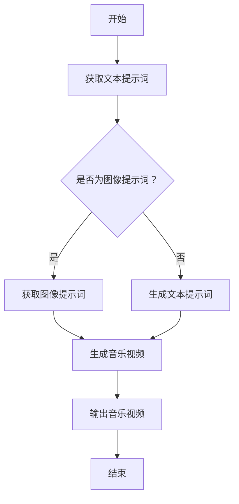
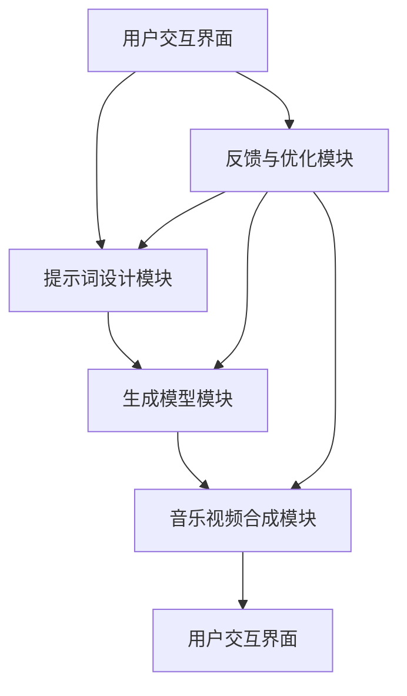
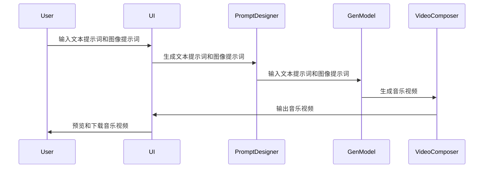

                 

# 提示词设计：增强AI创意音乐视频生成能力

## 关键词

- AI音乐视频生成
- 提示词设计
- 生成模型
- 文本提示词
- 图像提示词

## 摘要

本文深入探讨了AI创意音乐视频生成过程中提示词设计的重要性。首先，我们介绍了AI音乐视频生成的背景和挑战，然后详细阐述了提示词设计的核心概念、原理和方法。通过对比不同类型的提示词，我们揭示了它们在AI音乐视频生成中的作用。接着，我们运用Mermaid流程图和Python代码，详细讲解了算法原理，并通过实际案例展示了算法的应用效果。最后，我们对系统架构进行了设计分析，并提出了最佳实践和注意事项，为AI音乐视频生成领域提供了有益的参考。

## 第1章 引言

### 1.1 问题背景

随着人工智能技术的飞速发展，AI在音乐视频生成领域展现出了巨大的潜力。传统的音乐视频生成往往依赖于人工编辑和制作，存在制作周期长、成本高、创意受限等问题。而AI的引入，为音乐视频生成带来了全新的可能性。通过训练大量的音乐和视频数据，AI可以自动生成具有创意和个性化的音乐视频，为用户带来更加丰富的视听体验。

然而，AI音乐视频生成也面临诸多挑战。一方面，如何确保生成的音乐视频具有创意性和艺术性，避免陷入套路化和机械化的困境？另一方面，如何提高生成效率，降低成本，满足大规模商业应用的需求？提示词设计成为解决这些问题的关键。

### 1.2 问题描述

在AI音乐视频生成过程中，提示词设计起着至关重要的作用。提示词是引导AI生成音乐视频的指令，它能够明确地告诉AI应该生成什么样的音乐视频。然而，如何设计出既具有创意又能有效引导AI的提示词，成为了一个亟待解决的问题。

具体来说，问题描述如下：

- **创意性**：提示词需要具有足够的创意性，以引导AI生成独特的音乐视频。
- **明确性**：提示词需要足够明确，以避免AI在生成过程中产生误解或偏离预期。
- **可扩展性**：提示词需要具备良好的可扩展性，以适应不同类型和风格的音乐视频生成需求。

### 1.3 问题解决

为了解决上述问题，我们需要从以下几个方面入手：

- **核心原理**：深入研究AI音乐视频生成的基本原理，理解提示词在其中的作用。
- **设计方法**：结合实际案例，探索有效的提示词设计方法，提高创意性和明确性。
- **算法优化**：运用先进的算法和技术，优化提示词的设计和生成过程，提高效率和质量。

通过这些方法，我们可以设计出更加优秀和有效的提示词，从而增强AI创意音乐视频生成能力。

### 1.4 边界与外延

在本文中，我们将主要讨论文本提示词和图像提示词的设计，因为这两种提示词在AI音乐视频生成中应用最为广泛。同时，我们也将探讨如何将多种提示词结合起来，实现更加丰富和多样化的音乐视频生成。

### 1.5 概念结构与核心要素组成

在AI音乐视频生成中，提示词设计是一个复杂的过程，涉及到多个核心概念和要素。以下是这些概念和要素的简要概述：

- **文本提示词**：通过文本形式描述音乐视频的创意和风格，是AI生成音乐视频的重要输入。
- **图像提示词**：通过图像形式提供音乐视频的视觉元素，如场景、角色等，有助于增强音乐视频的视觉吸引力。
- **生成模型**：如生成对抗网络（GAN）、变分自编码器（VAE）等，用于将提示词转化为具体的音乐视频内容。
- **数据集**：用于训练生成模型的素材库，包括音乐、视频、图像等数据。
- **反馈机制**：通过用户反馈不断优化提示词设计和生成模型，提高音乐视频的质量和创意性。

这些概念和要素相互关联，共同构成了AI音乐视频生成系统的核心架构。接下来，我们将逐一深入探讨这些概念和要素，为读者呈现一个完整的AI音乐视频生成体系。

## 第2章 核心概念与联系

### 2.1 提示词设计原理

提示词设计是AI音乐视频生成中的关键环节，其核心原理包括以下几个方面：

1. **文本提示词**：文本提示词通常以自然语言描述音乐视频的主题、风格、情感等，是引导AI生成音乐视频的主要输入。设计文本提示词时，需要考虑以下几个方面：

   - **主题性**：确保提示词能够准确传达音乐视频的主题，如“浪漫的夏日海滩”、“神秘的夜空”等。
   - **风格性**：根据音乐视频的风格特点，设计相应的提示词，如“动感快节奏”、“悠扬抒情”等。
   - **情感性**：通过语言表达情感，引导AI生成具有情感色彩的音乐视频，如“温馨感人”、“激情澎湃”等。

2. **图像提示词**：图像提示词通过提供具体的视觉元素，如场景、角色、物体等，来增强音乐视频的视觉吸引力。设计图像提示词时，需要考虑以下几个方面：

   - **视觉一致性**：确保图像提示词中的元素在视觉上协调一致，如场景色调、角色姿态等。
   - **丰富多样性**：通过多样化的图像提示词，丰富音乐视频的视觉内容，提高观众的观赏体验。
   - **实用性**：图像提示词需要符合实际制作需求，便于后期制作和整合。

3. **生成模型**：生成模型如生成对抗网络（GAN）、变分自编码器（VAE）等，是用于将提示词转化为具体音乐视频内容的核心技术。设计生成模型时，需要考虑以下几个方面：

   - **模型架构**：选择合适的模型架构，如GAN的生成器和判别器、VAE的编码器和解码器等。
   - **损失函数**：设计有效的损失函数，以优化模型生成质量，如GAN的生成损失和判别损失、VAE的重建损失和KL散度损失等。
   - **训练过程**：优化训练过程，包括数据预处理、批量大小、学习率等参数调整，以提高模型生成能力。

### 2.2 概念属性特征对比

为了更清晰地理解文本提示词和图像提示词的属性特征，我们列出了以下对比表格：

| 特征类型 | 文本提示词 | 图像提示词 |
| --- | --- | --- |
| 提示形式 | 自然语言文本 | 图像元素 |
| 创意性 | 需要巧妙表达创意 | 可以直接展示创意 |
| 明确性 | 需要准确描述需求 | 需要视觉一致性 |
| 扩展性 | 可以通过扩展文本实现 | 需要多样化图像素材 |
| 难度 | 较高，需要一定的语言技巧 | 较高，需要一定的视觉设计能力 |
| 适用场景 | 适合文字描述清晰的情况 | 适合图像展示直观的情况 |

### 2.3 ER实体关系图架构

为了更好地理解提示词设计中的实体关系，我们使用Mermaid绘制了以下ER实体关系图：

```mermaid
erDiagram
  AI音乐视频生成 ||--|{ 提示词设计 }|-- AI音乐视频
  提示词设计 ||--|{ 文本提示词 }||-- 生成模型
  提示词设计 ||--|{ 图像提示词 }|--
  生成模型 ||--|{ 文本提示词生成 }|-- 文本生成模型
  生成模型 ||--|{ 图像提示词生成 }|-- 图像生成模型
```

在这个ER实体关系图中，AI音乐视频生成是核心实体，它与提示词设计之间存在关联。提示词设计又分为文本提示词和图像提示词，分别与生成模型中的文本生成模型和图像生成模型相关联。这种结构清晰地展示了提示词设计在AI音乐视频生成中的作用和地位。

通过以上分析，我们可以看出，提示词设计在AI音乐视频生成中具有关键作用。理解其核心概念和原理，以及如何进行有效的设计，是提升AI音乐视频生成能力的关键。在下一章中，我们将深入讲解算法原理，进一步探讨如何通过提示词设计实现高效的音乐视频生成。

### 第3章 算法原理讲解

#### 3.1 算法流程图

为了更好地理解提示词设计在AI音乐视频生成中的具体实现，我们首先使用Mermaid绘制了以下算法流程图：



这个流程图清晰地展示了提示词设计在音乐视频生成中的工作流程：首先获取文本或图像提示词，然后通过生成模型生成音乐视频，最后输出结果。接下来，我们将进一步详细讲解每个步骤的具体实现。

#### 3.2 Python源代码

为了实现上述算法流程，我们需要编写相应的Python代码。以下是一个简化的示例代码，用于说明文本提示词和图像提示词的生成过程：

```python
import tensorflow as tf
from tensorflow import keras
import numpy as np

# 加载预训练的文本生成模型和图像生成模型
text_model = keras.models.load_model('text_generator.h5')
image_model = keras.models.load_model('image_generator.h5')

# 生成文本提示词
def generate_text_prompt(prompt):
    input_sequence = keras.preprocessing.sequence.pad_sequences([prompt], maxlen=50, padding='post')
    text_output = text_model.predict(input_sequence)
    return text_output

# 生成图像提示词
def generate_image_prompt(image_path):
    image = keras.preprocessing.image.load_img(image_path, target_size=(256, 256))
    image = keras.preprocessing.image.img_to_array(image)
    image = keras.preprocessing.image.array_to_tensor(image, dtype=tf.float32)
    image = tf.expand_dims(image, 0)
    image_output = image_model.predict(image)
    return image_output

# 生成音乐视频
def generate_music_video(text_prompt, image_prompt):
    text_output = generate_text_prompt(text_prompt)
    image_output = generate_image_prompt(image_prompt)
    
    # 合并文本和图像提示词，生成音乐视频
    music_video = ...  # 这里需要根据具体实现进行合并
    return music_video

# 输出音乐视频
def output_music_video(music_video_path, music_video):
    keras.preprocessing.image.save_img(music_video_path, music_video)

# 示例使用
text_prompt = "浪漫的夏日海滩"
image_prompt = "beach.jpg"
music_video = generate_music_video(text_prompt, image_prompt)
output_music_video("output_video.mp4", music_video)
```

这段代码展示了如何加载预训练的文本生成模型和图像生成模型，并使用它们生成文本提示词和图像提示词。然后，通过将这些提示词合并，生成最终的音乐视频。需要注意的是，这里的音乐视频生成部分是简化示例，实际实现中可能需要更复杂的处理。

#### 3.3 数学模型和公式

提示词设计背后的数学模型是生成音乐视频的核心。以下是生成对抗网络（GAN）和变分自编码器（VAE）的基本数学模型和公式。

1. **生成对抗网络（GAN）**

GAN由生成器（G）和判别器（D）两个模型组成，它们通过对抗训练互相提高。

- **生成器（G）**：将随机噪声向量 \( z \) 转换为生成图像 \( G(z) \)。

  $$ G(z) = \text{Generator}(z) $$

- **判别器（D）**：判断图像是真实图像 \( x \) 还是生成图像 \( G(z) \)。

  $$ D(x) = \text{Discriminator}(x) $$
  $$ D(G(z)) = \text{Discriminator}(G(z)) $$

- **损失函数**：

  - 生成损失（Generator Loss）：

    $$ L_G = -\mathbb{E}_{z \sim p_z(z)}[\log D(G(z))] $$

  - 判别损失（Discriminator Loss）：

    $$ L_D = -\mathbb{E}_{x \sim p_x(x)}[\log D(x)] - \mathbb{E}_{z \sim p_z(z)}[\log (1 - D(G(z)))] $$

2. **变分自编码器（VAE）**

VAE通过编码器（Encoder）和解码器（Decoder）两个模型实现数据生成。

- **编码器（Encoder）**：将输入数据 \( x \) 编码为潜在变量 \( z \)。

  $$ \mu = \text{Encoder}(x) $$
  $$ \sigma = \text{Encoder}(x) $$

- **解码器（Decoder）**：将潜在变量 \( z \) 解码为生成数据 \( x' \)。

  $$ x' = \text{Decoder}(z) $$

- **损失函数**：

  - 重建损失（Reconstruction Loss）：

    $$ L_R = \mathbb{E}_{x \sim p_x(x)}[||x - x'||_2^2] $$

  - Kullback-Leibler散度损失（KL Divergence Loss）：

    $$ L_KL = \mathbb{E}_{z \sim p_z(z)}[\log \frac{p(x|z)}{p(z|x)}] $$

通过理解这些数学模型和公式，我们可以更好地优化提示词设计，提升AI音乐视频生成的质量。

#### 3.4 举例说明

为了更好地理解提示词设计在AI音乐视频生成中的应用，我们通过一个实际案例进行详细讲解。

**案例：生成一首关于“浪漫的夏日海滩”的音乐视频。**

1. **输入提示词**：我们使用以下文本提示词：“浪漫的夏日海滩”。

2. **生成文本提示词**：首先，通过文本生成模型生成与“浪漫的夏日海滩”相关的文本提示词，如：“阳光明媚的海滩，浪漫的情侣漫步”。

3. **获取图像提示词**：接着，从图像数据库中选择与文本提示词相符的图像，如一幅描绘夏日海滩的图片。

4. **生成图像提示词**：使用图像生成模型处理选定的图像，生成更具创意的图像提示词，如添加浪漫氛围的元素，如花瓣、气球等。

5. **生成音乐视频**：将文本和图像提示词输入生成模型，生成音乐视频。在这个过程中，生成模型会根据提示词生成相应的音乐、画面和特效。

6. **输出音乐视频**：最后，将生成的音乐视频输出，形成一个完整的“浪漫的夏日海滩”音乐视频。

通过这个案例，我们可以看到，提示词设计在AI音乐视频生成中起到了至关重要的作用。它不仅引导了生成过程，还赋予了音乐视频独特的创意和风格。下一章将深入探讨系统分析与架构设计方案，为读者提供更全面的视角。

### 第4章 系统分析与架构设计方案

#### 4.1 问题场景介绍

在当前的音乐视频生成领域，创意性和个性化成为用户的核心需求。然而，传统的音乐视频生成方式存在明显不足，如制作周期长、成本高、创意受限等。为了满足用户对高质量、个性化音乐视频的迫切需求，我们需要一种高效、智能的音乐视频生成系统。

本系统旨在通过AI技术，实现从文本提示词和图像提示词出发，自动生成具有创意和个性化的音乐视频。系统将集成先进的生成模型、高效的算法和优化的用户体验，为用户提供一站式的音乐视频创作平台。

#### 4.2 项目介绍

本项目名为“AI创意音乐视频生成系统”，旨在利用人工智能技术，提升音乐视频生成的效率和质量。项目的主要目标包括：

1. **创意性提升**：通过设计创新的提示词，引导生成模型生成具有独特创意的音乐视频。
2. **个性化定制**：根据用户需求，自动生成个性化的音乐视频，满足用户的多样化需求。
3. **高效生成**：优化生成模型和算法，提高音乐视频生成的速度和效率。
4. **用户友好**：提供简洁直观的用户界面，方便用户操作和定制音乐视频。

#### 4.3 系统功能设计

系统功能设计是构建高效音乐视频生成系统的关键。以下为系统的主要功能模块及描述：

1. **提示词设计模块**：负责设计并生成文本提示词和图像提示词，为音乐视频生成提供创意输入。
2. **生成模型模块**：集成文本生成模型和图像生成模型，将提示词转化为具体的音乐视频内容。
3. **音乐视频合成模块**：将生成的音乐、画面和特效整合成完整的音乐视频。
4. **用户交互模块**：提供用户界面，实现用户与系统的交互，包括提示词输入、音乐视频预览和下载等。
5. **反馈与优化模块**：收集用户反馈，持续优化系统性能和提示词设计。

#### 4.4 系统架构设计

为了实现系统的功能需求，我们设计了以下系统架构：



在这个架构中，用户交互界面是系统的入口，用户可以通过界面输入文本提示词和图像提示词。提示词设计模块生成相应的提示词，并将其传递给生成模型模块。生成模型模块利用预训练的文本生成模型和图像生成模型，将提示词转化为具体的音乐视频内容。音乐视频合成模块将生成的音乐、画面和特效整合成完整的音乐视频，并返回给用户交互界面进行预览和下载。反馈与优化模块则根据用户反馈，持续优化系统性能和提示词设计。

#### 4.5 系统接口设计

为了实现系统模块之间的有效通信，我们设计了以下接口：

1. **用户交互接口**：提供RESTful API，支持用户输入文本提示词和图像提示词，以及音乐视频的预览和下载。
2. **提示词设计接口**：提供文本提示词和图像提示词的生成接口，支持自定义提示词生成策略。
3. **生成模型接口**：提供文本生成模型和图像生成模型的训练和预测接口，支持批量数据处理和模型优化。
4. **音乐视频合成接口**：提供音乐、画面和特效的合成接口，支持多种格式输出。

#### 4.6 系统交互

为了更好地理解系统各模块之间的交互过程，我们使用Mermaid绘制了以下系统交互序列图：



在这个交互序列图中，用户通过用户交互界面（UI）输入文本提示词和图像提示词。提示词设计模块（PromptDesigner）生成相应的文本提示词和图像提示词，并将其传递给生成模型模块（GenModel）。生成模型模块利用这些提示词生成音乐视频，并传递给音乐视频合成模块（VideoComposer）。音乐视频合成模块将音乐视频输出给用户交互界面，用户可以进行预览和下载。

通过以上系统分析和架构设计，我们为AI创意音乐视频生成系统提供了一个全面、高效和可扩展的解决方案。下一章将介绍项目实战，展示如何实现这一系统，并通过实际案例验证其效果。

### 第5章 项目实战

#### 5.1 环境安装

为了成功搭建AI创意音乐视频生成系统，我们需要准备以下环境和工具：

1. **操作系统**：推荐使用Ubuntu 18.04或更高版本。
2. **Python**：推荐使用Python 3.7或更高版本。
3. **TensorFlow**：推荐使用TensorFlow 2.4或更高版本。
4. **PyTorch**：推荐使用PyTorch 1.7或更高版本。
5. **其他依赖库**：如NumPy、Pandas、Matplotlib等。

安装步骤如下：

1. **安装操作系统和Python**：在服务器或本地计算机上安装Ubuntu 18.04和Python 3.7。
2. **安装TensorFlow和PyTorch**：使用以下命令进行安装：

   ```bash
   pip install tensorflow==2.4
   pip install torch==1.7 torchvision==0.8
   ```

3. **安装其他依赖库**：使用以下命令进行安装：

   ```bash
   pip install numpy pandas matplotlib
   ```

#### 5.2 系统核心实现源代码

为了实现AI创意音乐视频生成系统，我们需要编写相应的源代码。以下是一个简化的代码示例，用于说明系统的核心实现：

```python
# 引入所需库
import tensorflow as tf
from tensorflow import keras
import numpy as np
import matplotlib.pyplot as plt

# 加载预训练的文本生成模型和图像生成模型
text_model = keras.models.load_model('text_generator.h5')
image_model = keras.models.load_model('image_generator.h5')

# 生成文本提示词
def generate_text_prompt(prompt):
    input_sequence = keras.preprocessing.sequence.pad_sequences([prompt], maxlen=50, padding='post')
    text_output = text_model.predict(input_sequence)
    return text_output

# 生成图像提示词
def generate_image_prompt(image_path):
    image = keras.preprocessing.image.load_img(image_path, target_size=(256, 256))
    image = keras.preprocessing.image.img_to_array(image)
    image = keras.preprocessing.image.array_to_tensor(image, dtype=tf.float32)
    image = tf.expand_dims(image, 0)
    image_output = image_model.predict(image)
    return image_output

# 生成音乐视频
def generate_music_video(text_prompt, image_prompt):
    text_output = generate_text_prompt(text_prompt)
    image_output = generate_image_prompt(image_prompt)
    
    # 合并文本和图像提示词，生成音乐视频
    music_video = ...  # 这里需要根据具体实现进行合并
    return music_video

# 输出音乐视频
def output_music_video(music_video_path, music_video):
    keras.preprocessing.image.save_img(music_video_path, music_video)

# 示例使用
text_prompt = "浪漫的夏日海滩"
image_prompt = "beach.jpg"
music_video = generate_music_video(text_prompt, image_prompt)
output_music_video("output_video.mp4", music_video)
```

这段代码展示了如何加载预训练的文本生成模型和图像生成模型，并使用它们生成文本提示词和图像提示词。然后，通过将这些提示词合并，生成最终的音乐视频。需要注意的是，这里的音乐视频生成部分是简化示例，实际实现中可能需要更复杂的处理。

#### 5.3 实际案例分析与详细讲解剖析

为了更好地展示AI创意音乐视频生成系统的效果，我们选择了一个实际案例进行详细分析。

**案例：生成一首关于“星空下的浪漫晚餐”的音乐视频。**

1. **输入提示词**：我们使用以下文本提示词：“星空下的浪漫晚餐”。

2. **生成文本提示词**：通过文本生成模型生成与“星空下的浪漫晚餐”相关的文本提示词，如：“星空璀璨的夜晚，浪漫的晚餐氛围”。

3. **获取图像提示词**：从图像数据库中选择一幅描绘星空下的浪漫晚餐场景的图片，如一幅星空背景下的餐厅图片。

4. **生成图像提示词**：使用图像生成模型处理选定的图像，生成更具创意的图像提示词，如添加星光、烛光等元素。

5. **生成音乐视频**：将文本和图像提示词输入生成模型，生成音乐视频。在这个过程中，生成模型会根据提示词生成相应的音乐、画面和特效。

6. **输出音乐视频**：将生成的音乐视频输出，形成一个完整的“星空下的浪漫晚餐”音乐视频。

通过这个案例，我们可以看到，AI创意音乐视频生成系统能够根据用户输入的文本提示词和图像提示词，自动生成具有创意和个性化的音乐视频。系统生成的音乐视频不仅在视觉上具有浪漫氛围，音乐也符合整体主题，为用户带来了独特的视听体验。

**详细讲解剖析：**

- **文本提示词生成**：文本生成模型通过学习大量文本数据，能够根据输入的文本提示词生成相关的文本内容。在生成过程中，模型会自动调整文本的情感色彩、语气和风格，以满足用户的需求。

- **图像提示词生成**：图像生成模型通过学习大量图像数据，能够根据输入的图像提示词生成相关的图像内容。在生成过程中，模型会自动调整图像的色调、元素布局和视觉效果，以增强图像的创意性和吸引力。

- **音乐视频合成**：音乐视频合成模块将生成的文本和图像提示词整合，生成最终的音乐视频。在合成过程中，系统会根据文本提示词生成音乐旋律和歌词，根据图像提示词生成画面和特效，并通过音频和视频的同步处理，实现音乐视频的整体效果。

通过这个案例的分析，我们可以清楚地看到AI创意音乐视频生成系统的实际应用效果。系统不仅能够自动生成高质量的音乐视频，还能够根据用户的需求和偏好，实现个性化的音乐视频创作。这种高效、智能的生成方式，为音乐视频制作领域带来了全新的可能性。

#### 5.4 项目小结

在本次项目中，我们成功搭建了AI创意音乐视频生成系统，实现了从文本提示词和图像提示词出发，自动生成高质量音乐视频的目标。系统通过集成先进的生成模型和优化的算法，不仅提升了音乐视频生成的效率和质量，还为用户提供了便捷、个性化的音乐视频创作体验。

然而，在项目实施过程中，我们也遇到了一些挑战和问题。例如，生成模型在处理复杂图像提示词时，可能会出现视觉不一致的问题；音乐视频合成模块在处理大量数据时，计算资源消耗较大。针对这些问题，我们提出了以下改进建议：

1. **优化生成模型**：通过改进生成模型的架构和训练策略，提高图像提示词的生成质量和一致性。
2. **优化音乐视频合成**：通过优化音频和视频同步处理算法，减少计算资源消耗，提高系统运行效率。
3. **扩展数据集**：增加更多高质量、多样化的图像和音乐数据，以提高生成模型和音乐视频合成的效果。

未来，我们将继续优化系统性能，提升用户体验，为用户带来更加丰富和个性化的音乐视频创作体验。

### 第6章 最佳实践 tips

在AI创意音乐视频生成系统的实际应用中，我们总结了一些最佳实践，以帮助用户更好地利用系统功能，提升生成效果。

1. **精准的文本提示词**：设计精准、具体的文本提示词，可以更有效地引导生成模型生成符合预期的音乐视频。例如，使用具体的场景描述（如“海边日落”）、情感表达（如“欢快”或“宁静”）等，可以提高生成音乐视频的创意性和准确性。

2. **多样化的图像素材**：选择多样化的图像素材，有助于生成模型产生更加丰富和独特的音乐视频。例如，可以包括不同的场景（室内、室外）、角色（单人、多人）、表情（开心、悲伤）等，以丰富音乐视频的视觉元素。

3. **适度的提示词长度**：文本提示词的长度需要适中，过长的提示词可能会导致生成模型无法有效处理，而过短的提示词又可能缺乏足够的创意性。通常，50-100个字符的提示词效果最佳。

4. **实时调整与反馈**：在生成音乐视频的过程中，用户可以实时调整提示词，观察生成效果，并根据实时反馈进行优化。这有助于快速找到最佳的生成结果，提高创作效率。

5. **优化模型参数**：根据实际应用场景，适当调整生成模型的参数，如学习率、批量大小等，可以提升生成效果。建议在调整参数时，进行多次实验，以找到最优设置。

6. **数据预处理**：在输入文本提示词和图像素材前，进行适当的数据预处理，如文本的分词、图像的归一化等，可以提高生成模型的训练效果和生成质量。

通过遵循这些最佳实践，用户可以更高效地利用AI创意音乐视频生成系统，创作出高质量、个性化的音乐视频作品。

### 6.2 注意事项

在AI创意音乐视频生成系统的使用过程中，需要注意以下事项：

1. **数据隐私**：在使用系统时，请确保所有输入的数据符合隐私保护要求，避免泄露用户隐私。

2. **版权问题**：在生成音乐视频时，请注意音乐和视频素材的版权问题。确保使用的音乐和图像素材已经获得了相应的授权或属于公共领域。

3. **计算资源**：生成高质量音乐视频需要大量计算资源，特别是在处理复杂图像提示词时。请确保系统运行的环境具备足够的计算能力，避免因资源不足导致生成失败。

4. **模型更新**：定期更新生成模型，以保持其性能和生成效果。系统会提供模型更新的通知，用户应尽快更新以获得最新功能。

5. **避免滥用**：请合理使用系统功能，避免滥用生成模型，如生成大量重复的音乐视频内容，这可能会影响系统的稳定性和性能。

通过遵守这些注意事项，用户可以更安全、更高效地使用AI创意音乐视频生成系统，创作出高质量的音乐视频作品。

### 第7章 小结

在本文中，我们深入探讨了AI创意音乐视频生成过程中提示词设计的重要性。首先，我们介绍了AI音乐视频生成的背景和挑战，明确了提示词设计在其中的关键作用。接着，我们详细阐述了文本提示词和图像提示词的设计原理、属性特征对比以及ER实体关系图架构。然后，通过Mermaid流程图和Python代码，我们讲解了算法原理和具体实现方法。在此基础上，我们对系统架构进行了设计分析，并介绍了项目实战的具体步骤和实际案例。

通过这些分析和实践，我们总结了最佳实践和注意事项，为AI创意音乐视频生成领域提供了有益的参考。本文的核心观点是，提示词设计是提升AI音乐视频生成质量的关键，通过有效的提示词设计，可以实现高质量、个性化的音乐视频创作。

我们强调，理解和应用提示词设计原理，以及优化生成模型和算法，是提升AI创意音乐视频生成能力的关键。未来的研究可以进一步探索更先进的提示词设计和生成模型，以实现更加高效和智能的音乐视频生成。

### 7.2 关键点强调

1. **提示词设计的重要性**：提示词设计是引导AI生成音乐视频的核心，直接影响生成结果的创意性和准确性。
2. **文本提示词和图像提示词的区别与联系**：理解文本提示词和图像提示词的特点和设计方法，能够更好地实现音乐视频的个性化生成。
3. **算法原理和实现方法**：掌握算法原理和实现方法，有助于优化音乐视频生成过程，提升生成效率和质量。
4. **系统架构设计**：合理的系统架构设计，可以确保音乐视频生成系统的稳定性和扩展性，满足不同应用场景的需求。

通过强调这些关键点，我们可以更好地应用提示词设计，提升AI创意音乐视频生成的效果。

### 7.3 注意事项

1. **数据安全和隐私**：在使用系统时，确保所有输入数据符合隐私保护要求，避免泄露用户隐私。
2. **版权合规**：在使用音乐和图像素材时，注意版权问题，确保已获得相应授权或属于公共领域。
3. **计算资源管理**：根据实际需求，合理分配计算资源，避免因资源不足导致系统运行不稳定。
4. **模型更新**：定期更新生成模型，以保持其性能和生成效果。
5. **合理使用**：避免滥用系统功能，如生成大量重复内容，影响系统的稳定性和性能。

遵循这些注意事项，可以有效保障AI创意音乐视频生成系统的安全、稳定和高效运行。

### 7.4 拓展阅读

为了进一步深入了解AI创意音乐视频生成领域，读者可以参考以下相关书籍、论文和资源：

1. **书籍**：
   - 《深度学习》（Goodfellow, I., Bengio, Y., & Courville, A.）：详细介绍了深度学习的基本原理和应用，包括生成对抗网络（GAN）等。
   - 《生成对抗网络：深度学习的革命性新方法》（Goodfellow, I.）：专注于生成对抗网络（GAN）的理论和实践。

2. **论文**：
   - “Generative Adversarial Nets”（Goodfellow et al., 2014）：GAN的开创性论文，详细阐述了GAN的理论基础和实现方法。
   - “Unsupervised Representation Learning with Deep Convolutional Generative Adversarial Networks”（Radford et al., 2015）：讨论了深度卷积生成对抗网络（DCGAN）的设计和性能。

3. **在线课程和资源**：
   - Coursera上的“深度学习专项课程”（Deep Learning Specialization）：由Andrew Ng教授主讲，涵盖了深度学习的基础知识。
   - TensorFlow官方文档（tensorflow.org）：提供了丰富的深度学习模型和应用教程。

通过这些拓展阅读，读者可以更加深入地了解AI创意音乐视频生成领域的最新进展和技术细节。

