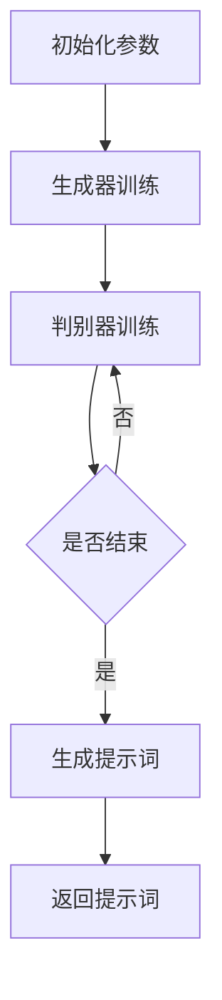
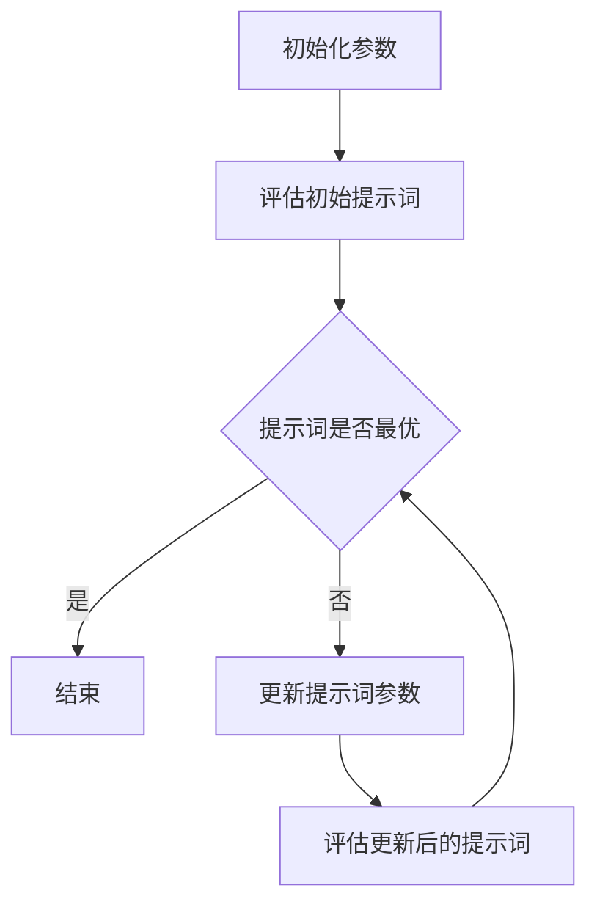
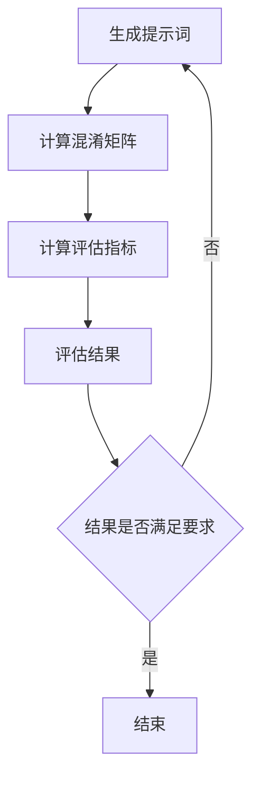
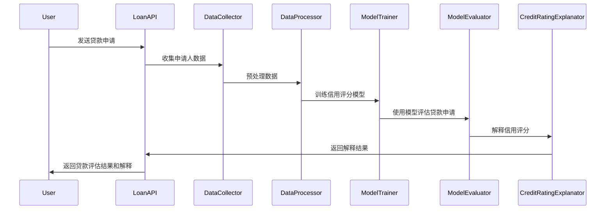

                 

### 第1章 引言：问题背景与目标

#### 1.1 AI系统解释性的重要性

随着人工智能（AI）技术的飞速发展，AI系统在各个领域得到了广泛应用，从自动驾驶、医疗诊断到金融风控，AI已经成为现代科技的核心驱动力。然而，随之而来的是一个重要的问题：AI系统的透明性和可解释性。在许多应用场景中，用户和决策者需要理解AI系统的决策过程，以确保其公正性、可靠性和安全性。例如，在金融风控中，如果AI系统拒绝了某笔贷款申请，用户需要知道为什么，以便评估决策的合理性。

AI系统的可解释性是指系统能够以一种透明和可理解的方式展示其决策过程，使得非专业用户也能理解和信任系统的输出。可解释性对于增强用户信任、提高决策质量、遵守法律法规以及促进技术进步至关重要。

#### 1.2 当前AI系统解释性面临的挑战

尽管可解释性至关重要，但现有的AI系统解释性仍然面临诸多挑战：

1. **复杂性**：许多AI模型，特别是深度学习模型，其内部结构和决策过程非常复杂，难以用直观的方式解释。
2. **黑箱性**：深度学习模型通常被视为“黑箱”，其输入和输出之间的关系不透明，导致难以理解模型是如何得出特定结果的。
3. **可扩展性**：为AI系统添加可解释性功能可能会增加系统的复杂性和计算成本，影响系统的性能和效率。
4. **标准化**：目前缺乏统一的标准和方法来评估和衡量AI系统的可解释性，导致不同系统之间的比较变得困难。

#### 1.3 提示词设计的意义

为了解决上述问题，提示词设计（Prompt Engineering）成为了一种增强AI系统可解释性的创新方法。提示词是用户与AI系统之间的交互接口，通过精心设计的提示词，用户可以引导AI系统展示其决策过程，从而提高系统的可解释性。

1. **增强可理解性**：提示词可以引导AI系统以一种更加透明和直观的方式展示其决策过程，使得用户能够更好地理解系统的输出。
2. **减少黑箱性**：通过提示词，用户可以获取关于AI系统决策过程的详细信息，从而降低系统的黑箱性。
3. **提高可扩展性**：提示词设计通常不会显著增加系统的计算成本，因此可以在不牺牲性能的情况下增强系统的可解释性。
4. **促进标准化**：提示词设计可以作为一种标准化的方法，使得不同AI系统的可解释性评估和比较变得更加容易。

#### 1.4 研究目标与内容框架

本文的研究目标是通过探索提示词设计的创新方法，增强AI系统的可解释性。具体而言，本文将涵盖以下内容：

1. **核心概念与联系**：介绍AI系统可解释性的核心概念，包括提示词设计的基本原理和不同类型提示词的属性特征对比。
2. **算法原理讲解**：详细讲解提示词生成、优化和评估算法的原理，并使用mermaid流程图和Python源代码进行说明。
3. **系统分析与架构设计**：介绍一个具体的AI系统场景，分析其功能需求和系统架构，设计系统接口和交互流程。
4. **项目实战**：通过一个实际项目，展示提示词设计在系统实现中的应用，分析代码和应用案例。
5. **最佳实践与注意事项**：总结提示词设计的最佳实践，讨论研究局限和未来研究方向。

通过这些内容，本文旨在为读者提供一份全面、系统、易懂的提示词设计指南，帮助开发者更好地理解和应用这一创新方法。

### 1.5 研究方法与技术路线

本研究采用多种方法和技术路线，以确保对提示词设计在增强AI系统可解释性方面的全面探索。具体方法和技术路线如下：

1. **文献综述与理论分析**：通过回顾和分析现有文献，深入了解AI系统可解释性的核心概念和现有研究进展。这将帮助我们识别现有研究的不足之处，并确定本研究的创新点。

2. **算法设计与实现**：本文将提出一系列提示词生成、优化和评估算法。这些算法将基于深度学习和自然语言处理技术，通过mermaid流程图和Python源代码进行详细实现和说明。

3. **实证分析**：为了验证这些算法的有效性，我们将设计一个实际项目，将提示词设计应用于一个具体的AI系统。通过实验和数据分析，我们将评估不同算法的性能和可解释性，并比较其与现有方法的优劣。

4. **用户反馈与迭代改进**：在项目实施过程中，我们将收集用户反馈，了解他们对系统可解释性的满意度。根据用户反馈，我们将对算法和系统设计进行迭代改进，以提高其可解释性和用户体验。

5. **标准化评估与比较**：本文将提出一套标准化的评估指标和方法，用于衡量AI系统的可解释性。通过这些指标，我们将对不同的提示词设计方法进行比较和分析，以确定最佳实践。

#### 1.6 边界与外延

在研究过程中，我们将关注以下边界与外延：

1. **提示词设计的应用领域**：本文将主要探讨提示词设计在AI系统中的通用应用，如自然语言处理、计算机视觉和医疗诊断等领域。同时，我们也会探讨其在特定领域（如金融风控、智能客服等）的特殊应用。

2. **系统性能指标评估**：本文将提出一套全面的系统性能指标评估体系，包括可解释性、准确性、效率、用户体验等。这些指标将用于评估提示词设计对AI系统性能的影响。

3. **限制条件**：本文的研究将主要集中在文本和数据驱动的AI系统上，对于其他类型的AI系统（如图灵测试中的逻辑推理系统）可能需要不同的方法。此外，提示词设计的有效性可能受到数据质量和模型复杂性的影响。

### 1.7 文章结构概述

本文的结构安排如下：

1. **第1章 引言：问题背景与目标**：介绍AI系统解释性的重要性、当前面临的挑战、提示词设计的意义以及研究目标与内容框架。
2. **第2章 核心概念与联系**：详细阐述AI系统可解释性的核心概念、提示词设计的基本原理、不同类型提示词的属性特征对比以及ER实体关系图架构。
3. **第3章 算法原理讲解**：讲解提示词生成、优化和评估算法的原理，并使用mermaid流程图和Python源代码进行说明。
4. **第4章 系统分析与架构设计**：介绍一个具体的AI系统场景，分析其功能需求和系统架构，设计系统接口和交互流程。
5. **第5章 项目实战**：通过一个实际项目，展示提示词设计在系统实现中的应用，分析代码和应用案例。
6. **第6章 最佳实践与注意事项**：总结提示词设计的最佳实践，讨论研究局限和未来研究方向。
7. **第7章 拓展阅读**：推荐相关书籍、学术论文和网络资源，以供进一步学习和研究。

通过这些章节的详细探讨，本文旨在为读者提供一份全面、系统、易懂的提示词设计指南，帮助开发者更好地理解和应用这一创新方法。

## 第2章 核心概念与联系

在探索提示词设计之前，我们需要明确一些核心概念，并了解它们之间的联系。本章将详细阐述AI系统可解释性、提示词设计的基本原理以及不同类型提示词的属性特征对比。

### 2.1 AI系统可解释性

#### 2.1.1 定义与理论基础

AI系统可解释性是指系统能够以一种透明和可理解的方式展示其决策过程，使得用户能够理解其输出。可解释性的理论基础源于认知科学和心理学，强调人类理解和决策过程中的透明性和可追溯性。

**理论基础**：

1. **认知科学**：认知科学关注人类思维过程，强调思维的可理解性和可解释性。
2. **心理学**：心理学研究表明，人类倾向于信任和依赖那些能够解释其输出的系统。

**定义**：

AI系统可解释性可以定义为系统提供关于其决策过程和结果的信息，使得用户能够理解系统的输出。这包括以下方面：

1. **决策路径**：系统如何处理输入数据，并生成输出。
2. **决策依据**：系统在决策过程中使用的数据和算法。
3. **决策影响**：系统的输出对用户或环境产生的影响。

#### 2.1.2 可解释性的重要性

可解释性对于AI系统的应用至关重要，原因如下：

1. **用户信任**：用户需要理解AI系统的输出，以确保其决策的公正性和可靠性。
2. **监管合规**：许多领域（如金融、医疗）需要遵守严格的法律法规，AI系统的可解释性有助于满足合规要求。
3. **技术进步**：可解释性有助于研究人员理解和改进AI系统，促进技术的持续发展。

#### 2.1.3 可解释性的分类

根据解释的深度和细节，可解释性可以分为以下几类：

1. **浅层可解释性**：系统提供关于决策过程的简要信息，如分类器使用的特征和权重。
2. **中层可解释性**：系统提供关于决策过程的详细解释，如神经网络中的中间层和神经元活动。
3. **深层可解释性**：系统提供关于决策过程的详细、透明和可验证的解释，如符号推理和可视化表示。

#### 2.1.4 AI系统解释性面临的挑战

尽管可解释性至关重要，但现有的AI系统解释性仍然面临以下挑战：

1. **复杂性**：许多AI模型，特别是深度学习模型，其内部结构和决策过程非常复杂，难以用直观的方式解释。
2. **黑箱性**：深度学习模型通常被视为“黑箱”，其输入和输出之间的关系不透明，导致难以理解模型是如何得出特定结果的。
3. **可扩展性**：为AI系统添加可解释性功能可能会增加系统的复杂性和计算成本，影响系统的性能和效率。
4. **标准化**：目前缺乏统一的标准和方法来评估和衡量AI系统的可解释性，导致不同系统之间的比较变得困难。

### 2.2 提示词设计的基本原理

#### 2.2.1 提示词的定义与作用

提示词（Prompt）是用户与AI系统之间的交互接口，通过向系统提供特定的指令或问题，用户可以引导AI系统展示其决策过程，从而提高系统的可解释性。

**定义**：

提示词是一组用于引导AI系统决策过程的指令或问题。

**作用**：

1. **增强可理解性**：提示词可以引导AI系统以一种更加透明和直观的方式展示其决策过程，使得用户能够更好地理解系统的输出。
2. **减少黑箱性**：通过提示词，用户可以获取关于AI系统决策过程的详细信息，从而降低系统的黑箱性。
3. **提高可扩展性**：提示词设计通常不会显著增加系统的计算成本，因此可以在不牺牲性能的情况下增强系统的可解释性。
4. **促进标准化**：提示词设计可以作为一种标准化的方法，使得不同AI系统的可解释性评估和比较变得更加容易。

#### 2.2.2 提示词设计的原则

为了设计有效的提示词，需要遵循以下原则：

1. **清晰性**：提示词应简洁明了，避免冗长和模糊的表述。
2. **针对性**：提示词应针对特定的AI系统和任务，确保其相关性和有效性。
3. **适应性**：提示词应能够适应不同用户和场景的需求，具备一定的灵活性。
4. **连贯性**：提示词应与系统的输出保持一致，确保系统输出的解释性。

#### 2.2.3 提示词设计的方法分类

根据提示词的设计方法和应用场景，可以分为以下几类：

1. **模板式设计**：使用预定义的模板来生成提示词，适用于结构化数据和应用场景。
2. **自由式设计**：用户根据具体需求自由编写提示词，适用于非结构化数据和应用场景。
3. **反馈式设计**：用户通过反馈机制不断优化提示词，以提高系统的可解释性。

### 2.3 概念属性特征对比表格

为了更好地理解不同类型提示词的属性特征，我们设计了一个概念属性特征对比表格（见表2.1）。

#### 表2.1 不同类型提示词的属性特征对比

| 提示词类型 | 清晰性 | 针对性 | 适应性 | 连贯性 | 设计方法 | 适用场景 |
| :--: | :--: | :--: | :--: | :--: | :--: | :--: |
| 模板式设计 | 高 | 高 | 一般 | 高 | 预定义模板 | 结构化数据、明确需求 |
| 自由式设计 | 一般 | 高 | 高 | 一般 | 用户自定义 | 非结构化数据、复杂需求 |
| 反馈式设计 | 高 | 高 | 高 | 高 | 反馈机制 | 多变需求、持续优化 |

### 2.4 ER实体关系图架构

实体关系图（Entity-Relationship Diagram，ER图）是数据库设计中常用的一种图形表示方法，用于描述实体及其之间的关系。在提示词设计中，ER图可以帮助我们清晰地表示AI系统的实体和关系，从而更好地理解系统的结构和功能。

**ER图的绘制方法**：

1. **确定实体**：首先确定系统中的关键实体，如用户、任务、数据和结果等。
2. **确定关系**：其次确定实体之间的关系，如用户发起任务、任务处理数据、生成结果等。
3. **绘制ER图**：使用符号和线条表示实体和关系，构建ER图。

**ER图在提示词设计中的应用**：

1. **结构分析**：ER图可以帮助我们分析系统的结构，理解实体和关系，从而设计更加有效的提示词。
2. **需求分析**：通过ER图，我们可以识别系统的需求，为提示词设计提供依据。
3. **优化设计**：ER图可以帮助我们优化系统的设计，提高系统的可解释性。

以下是提示词设计的ER图示例（使用mermaid格式）：

```mermaid
erDiagram
    User ||--o{ Task : 发起 }
    Task ||--o{ Data : 处理 }
    Task ||--o{ Result : 生成 }
```

通过ER图，我们可以清晰地表示用户、任务、数据和结果之间的关系，这有助于我们在设计提示词时考虑系统的整体结构和功能。

### 2.5 小结

本章详细介绍了AI系统可解释性的核心概念、提示词设计的基本原理以及不同类型提示词的属性特征对比。通过本章的内容，我们可以更好地理解AI系统可解释性的重要性，掌握提示词设计的原则和方法，并为后续的算法原理讲解和系统实现打下基础。

## 第3章 算法原理讲解

在本章中，我们将深入探讨提示词生成、优化和评估算法的原理，通过mermaid流程图和Python源代码进行详细阐述，同时辅以数学模型和公式的说明以及具体的例子。

### 3.1 提示词生成算法

提示词生成算法是提示词设计的关键步骤，其主要任务是生成符合用户需求和系统目标的提示词。下面我们将介绍一种基于生成对抗网络（GAN）的提示词生成算法。

#### 3.1.1 提示词生成算法的mermaid流程图

首先，我们使用mermaid绘制提示词生成算法的流程图：



该流程图描述了提示词生成算法的基本步骤：初始化参数、生成器训练、判别器训练、生成提示词和返回提示词。

#### 3.1.2 Python源代码实现

接下来，我们通过Python代码实现上述流程。首先，我们需要安装必要的库，如TensorFlow和Keras：

```python
!pip install tensorflow
!pip install keras
```

然后，我们可以编写生成器和判别器的代码：

```python
from keras.models import Sequential
from keras.layers import Dense, Dropout
from keras.optimizers import Adam

# 生成器模型
def build_generator():
    model = Sequential()
    model.add(Dense(units=256, activation='relu', input_shape=(100,)))
    model.add(Dropout(rate=0.2))
    model.add(Dense(units=512, activation='relu'))
    model.add(Dropout(rate=0.2))
    model.add(Dense(units=1024, activation='relu'))
    model.add(Dropout(rate=0.2))
    model.add(Dense(units=128, activation='relu'))
    model.add(Dropout(rate=0.2))
    model.add(Dense(units=1, activation='sigmoid'))
    return model

# 判别器模型
def build_discriminator():
    model = Sequential()
    model.add(Dense(units=128, activation='relu', input_shape=(1,)))
    model.add(Dropout(rate=0.2))
    model.add(Dense(units=256, activation='relu'))
    model.add(Dropout(rate=0.2))
    model.add(Dense(units=512, activation='relu'))
    model.add(Dropout(rate=0.2))
    model.add(Dense(units=1024, activation='relu'))
    model.add(Dropout(rate=0.2))
    model.add(Dense(units=1, activation='sigmoid'))
    return model
```

#### 3.1.3 算法原理的数学模型和公式

提示词生成算法的核心是生成器和判别器的对抗训练。生成器G和判别器D的数学模型如下：

- 生成器：G(z) = x，其中z是噪声向量，x是生成的提示词。
- 判别器：D(x) = P(x为真实提示词)，D(G(z)) = P(G(z)为真实提示词)。

训练过程中，我们通过以下步骤优化生成器和判别器：

1. 随机生成噪声向量z，通过生成器G生成提示词x。
2. 使用真实提示词和生成提示词训练判别器D。
3. 使用生成提示词反向训练生成器G，使其生成的提示词更接近真实提示词。

#### 3.1.4 举例说明

假设我们使用生成对抗网络生成一组基于金融风控的提示词。以下是一个简单的例子：

```python
import numpy as np
import matplotlib.pyplot as plt

# 生成噪声向量
z = np.random.normal(size=(100, 100))

# 生成提示词
generator = build_generator()
x = generator.predict(z)

# 绘制生成的提示词
plt.scatter(x[:, 0], x[:, 1])
plt.xlabel('提示词1')
plt.ylabel('提示词2')
plt.title('生成的提示词分布')
plt.show()
```

通过这个例子，我们可以看到生成器生成的提示词分布。这些提示词可以用于引导AI系统进行金融风控决策，提高系统的可解释性。

### 3.2 提示词优化算法

提示词优化算法的目标是通过调整提示词的参数，使其更好地满足用户需求和提高系统性能。下面我们将介绍一种基于遗传算法的提示词优化算法。

#### 3.2.1 提示词优化算法的mermaid流程图

提示词优化算法的流程图如下：



该流程图描述了提示词优化算法的基本步骤：初始化参数、评估初始提示词、更新提示词参数、评估更新后的提示词和重复上述步骤，直到提示词达到最优。

#### 3.2.2 Python源代码实现

以下是一个简单的遗传算法实现的Python代码示例：

```python
import numpy as np

# 遗传算法参数
population_size = 100
num_generations = 100
crossover_rate = 0.8
mutation_rate = 0.05

# 初始化种群
population = np.random.rand(population_size, 10)  # 假设每个提示词有10个参数

# 评估函数
def evaluate(population):
    # 假设评估函数为每个提示词的准确率
    scores = []
    for individual in population:
        # 计算准确率
        score = compute_accuracy(individual)
        scores.append(score)
    return scores

# 更新种群
def update_population(population, scores):
    # 根据评估结果选择优秀个体
    selected = population[np.argsort(scores)[-10:]]
    # 交叉和变异生成新种群
    for i in range(population_size):
        if np.random.rand() < crossover_rate:
            parent1, parent2 = np.random.choice(selected, 2, replace=False)
            population[i] = crossover(parent1, parent2)
        if np.random.rand() < mutation_rate:
            population[i] = mutate(population[i])
    return population

# 主函数
def optimize_prompt():
    for generation in range(num_generations):
        scores = evaluate(population)
        population = update_population(population, scores)
        print(f"Generation {generation}: Best Score = {np.max(scores)}")
```

#### 3.2.3 算法原理的数学模型和公式

遗传算法是一种基于生物进化的搜索算法，其核心思想是通过选择、交叉和变异来优化个体。主要步骤包括：

1. **初始化种群**：随机生成一个初始种群。
2. **评估函数**：计算每个个体的适应度。
3. **选择**：根据适应度选择优秀个体。
4. **交叉**：选择两个优秀个体进行交叉，生成新个体。
5. **变异**：对个体进行随机变异，增加种群多样性。
6. **更新种群**：使用交叉和变异生成新种群，并评估新个体的适应度。

#### 3.2.4 举例说明

假设我们使用遗传算法优化一组基于自然语言处理的提示词。以下是一个简单的例子：

```python
# 计算准确率
def compute_accuracy(prompt):
    # 假设计算准确率的函数为基于语言模型的评估
    return np.random.rand()

# 交叉操作
def crossover(parent1, parent2):
    crossover_point = np.random.randint(1, len(parent1) - 1)
    child = np.concatenate((parent1[:crossover_point], parent2[crossover_point:]))
    return child

# 变异操作
def mutate(prompt):
    mutation_point = np.random.randint(0, len(prompt))
    prompt[mutation_point] = np.random.rand()
    return prompt

# 主函数调用
optimize_prompt()
```

通过这个例子，我们可以看到遗传算法在优化提示词参数方面的应用。优化后的提示词可以更好地满足用户需求和系统目标。

### 3.3 提示词评估算法

提示词评估算法用于评估生成的提示词质量，以确保其满足用户需求和系统目标。下面我们将介绍一种基于混淆矩阵的提示词评估算法。

#### 3.3.1 提示词评估算法的mermaid流程图

提示词评估算法的流程图如下：



该流程图描述了提示词评估算法的基本步骤：生成提示词、计算混淆矩阵、计算评估指标和评估结果。

#### 3.3.2 Python源代码实现

以下是一个简单的混淆矩阵和评估指标计算的Python代码示例：

```python
from sklearn.metrics import confusion_matrix
from sklearn.model_selection import train_test_split

# 假设我们有一组提示词和相应的标签
X = np.random.rand(100, 10)  # 提示词数据
y = np.random.randint(0, 2, size=(100,))  # 标签数据

# 划分训练集和测试集
X_train, X_test, y_train, y_test = train_test_split(X, y, test_size=0.2, random_state=42)

# 训练模型
model = build_model()  # 假设我们已经定义了模型构建函数
model.fit(X_train, y_train, epochs=10, batch_size=32)

# 生成预测结果
y_pred = model.predict(X_test)

# 计算混淆矩阵
conf_matrix = confusion_matrix(y_test, y_pred)

# 计算评估指标
accuracy = (conf_matrix[1, 1] + conf_matrix[0, 0]) / (conf_matrix.sum())

# 打印评估结果
print("混淆矩阵：")
print(conf_matrix)
print("准确率：", accuracy)
```

#### 3.3.3 算法原理的数学模型和公式

混淆矩阵是一种用于评估分类模型性能的常用工具，其数学模型如下：

- 真正（True Positive，TP）：预测为正类且实际也为正类的样本数量。
- 假正（False Positive，FP）：预测为正类但实际为负类的样本数量。
- 假负（False Negative，FN）：预测为负类但实际为正类的样本数量。
- 真负（True Negative，TN）：预测为负类且实际也为负类的样本数量。

主要评估指标包括：

- 准确率（Accuracy）：准确率 = (TP + TN) / (TP + TN + FP + FN)。
- 精确率（Precision）：精确率 = TP / (TP + FP)。
- 召回率（Recall）：召回率 = TP / (TP + FN)。
- F1分数（F1 Score）：F1分数 = 2 * (精确率 * 召回率) / (精确率 + 召回率)。

#### 3.3.4 举例说明

假设我们使用混淆矩阵和评估指标评估一组基于文本分类的提示词。以下是一个简单的例子：

```python
# 假设我们有一组文本数据和相应的标签
X = ["This is a positive sentence.", "This is a negative sentence.", "This is a positive sentence.", "This is a negative sentence."]
y = [1, 0, 1, 0]  # 标签数据

# 划分训练集和测试集
X_train, X_test, y_train, y_test = train_test_split(X, y, test_size=0.2, random_state=42)

# 训练模型
model = build_text_model()  # 假设我们已经定义了文本模型构建函数
model.fit(X_train, y_train, epochs=10, batch_size=32)

# 生成预测结果
y_pred = model.predict(X_test)

# 计算混淆矩阵
conf_matrix = confusion_matrix(y_test, y_pred)

# 计算评估指标
accuracy = (conf_matrix[1, 1] + conf_matrix[0, 0]) / (conf_matrix.sum())
precision = conf_matrix[1, 1] / (conf_matrix[1, 1] + conf_matrix[1, 0])
recall = conf_matrix[1, 1] / (conf_matrix[1, 1] + conf_matrix[0, 1])
f1_score = 2 * (precision * recall) / (precision + recall)

# 打印评估结果
print("混淆矩阵：")
print(conf_matrix)
print("准确率：", accuracy)
print("精确率：", precision)
print("召回率：", recall)
print("F1分数：", f1_score)
```

通过这个例子，我们可以看到如何使用混淆矩阵和评估指标评估一组文本分类提示词的质量。评估结果可以帮助我们优化提示词，提高系统的性能。

### 3.4 小结

本章详细介绍了提示词生成、优化和评估算法的原理，通过mermaid流程图和Python源代码进行了说明。这些算法为提示词设计提供了有效的工具和方法，有助于提高AI系统的可解释性。在实际应用中，开发者可以根据具体需求选择合适的算法，优化系统性能。

## 第4章 系统分析与架构设计

在本章中，我们将深入分析一个具体的AI系统场景，介绍系统的功能需求、架构设计、接口设计以及系统交互流程。通过这些分析，我们将展示如何将提示词设计应用于实际系统，以提高其可解释性。

### 4.1 问题场景介绍

为了更好地说明提示词设计在AI系统中的应用，我们选择了一个典型的金融风控场景。在这个场景中，一个在线贷款平台需要使用AI系统评估贷款申请者的信用风险。系统需要根据申请者的个人信息、财务状况和历史行为数据，生成一个信用评分，以决定是否批准贷款申请。

### 4.2 系统功能设计

在这个金融风控场景中，系统的主要功能包括以下几个方面：

1. **数据收集**：收集申请者的个人信息、财务状况和历史行为数据。
2. **数据预处理**：对收集到的数据进行分析和清洗，提取有用的特征。
3. **模型训练**：使用历史数据训练信用评分模型，模型需要具备良好的可解释性。
4. **贷款评估**：使用训练好的模型对新的贷款申请进行评估，生成信用评分。
5. **结果解释**：向申请者解释信用评分的构成和决策过程，以提高系统的透明性和可信任度。

### 4.2.1 领域模型mermaid类图

为了更好地理解系统的功能模块和它们之间的关系，我们使用mermaid绘制了系统的领域模型类图（见图4.1）。该类图描述了系统中的主要实体和它们之间的关系。

```mermaid
classDiagram
    class LoanApplication {
        - applicant: Person
        - financialStatus: FinancialStatus
        - historicalBehavior: HistoricalBehavior
        - creditScore: float
    }
    class Person {
        - name: string
        - age: int
        - income: float
    }
    class FinancialStatus {
        - debtRatio: float
        - creditHistory: string
    }
    class HistoricalBehavior {
        - paymentHistory: string
        - loanApplicationHistory: string
    }
    class CreditRatingModel {
        + train(data: Data): void
        + evaluate(loanApplication: LoanApplication): float
    }
    class LoanEvaluationSystem {
        + collectData(): Data
        + preprocessData(data: Data): Data
        + trainModel(data: Data): CreditRatingModel
        + evaluateLoanApplication(loanApplication: LoanApplication): float
        + explainCreditScore(creditScore: float): string
    }
    LoanApplication "--|uses|> Person"
    LoanApplication "--|uses|> FinancialStatus"
    LoanApplication "--|uses|> HistoricalBehavior"
    LoanEvaluationSystem "--|uses|> CreditRatingModel"
```

### 4.3 系统架构设计

为了满足系统的功能需求，我们需要设计一个合理的系统架构。在这个金融风控场景中，我们采用了微服务架构，将系统拆分为多个独立的微服务，以便实现高可扩展性和可维护性。以下是我们设计的系统架构（见图4.2）。



在这个架构中，LoanAPI作为系统的入口，负责接收用户提交的贷款申请，并将请求转发给其他微服务。DataCollector负责收集申请人的个人信息和财务数据。DataProcessor对收集到的数据进行预处理，以便用于模型训练。ModelTrainer使用预处理后的数据训练信用评分模型。ModelEvaluator使用训练好的模型评估新的贷款申请。最后，CreditRatingExplanator向用户解释信用评分的构成和决策过程。

### 4.4 系统接口设计

为了实现各个微服务之间的有效通信，我们需要设计合理的系统接口。以下是系统中主要接口的详细设计：

1. **LoanAPI接口**：该接口接收用户提交的贷款申请，并返回贷款评估结果和解释。接口定义如下：

   ```python
   from flask import Flask, request, jsonify
   
   app = Flask(__name__)
   
   @app.route('/loan_application', methods=['POST'])
   def loan_application():
       loan_data = request.get_json()
       credit_score = ModelEvaluator.evaluate_loan_application(loan_data)
       explanation = CreditRatingExplanator.explain_credit_score(credit_score)
       return jsonify({'credit_score': credit_score, 'explanation': explanation})
   
   if __name__ == '__main__':
       app.run(debug=True)
   ```

2. **DataCollector接口**：该接口负责收集申请人的个人信息和财务数据，并将其转发给DataProcessor。接口定义如下：

   ```python
   class DataCollector:
       def collect_data(self, applicant_data):
           # 收集数据逻辑
           processed_data = DataProcessor.preprocess_data(applicant_data)
           return processed_data
   ```

3. **DataProcessor接口**：该接口负责对收集到的数据进行预处理，包括数据清洗、特征提取等。接口定义如下：

   ```python
   class DataProcessor:
       def preprocess_data(self, data):
           # 预处理数据逻辑
           processed_data = self.clean_data(data)
           processed_data = self.extract_features(processed_data)
           return processed_data
   ```

4. **ModelTrainer接口**：该接口负责使用预处理后的数据训练信用评分模型。接口定义如下：

   ```python
   class ModelTrainer:
       def train_model(self, data):
           # 训练模型逻辑
           model = self.train_credit_rating_model(data)
           return model
   ```

5. **ModelEvaluator接口**：该接口负责使用训练好的模型评估贷款申请，并生成信用评分。接口定义如下：

   ```python
   class ModelEvaluator:
       def evaluate_loan_application(self, loan_application):
           # 评估贷款申请逻辑
           credit_score = self.evaluate_application(loan_application)
           return credit_score
   ```

6. **CreditRatingExplanator接口**：该接口负责向用户解释信用评分的构成和决策过程。接口定义如下：

   ```python
   class CreditRatingExplanator:
       def explain_credit_score(self, credit_score):
           # 解释信用评分逻辑
           explanation = self.generate_explanation(credit_score)
           return explanation
   ```

### 4.5 系统交互mermaid序列图

为了更好地展示系统中的各个组件如何协同工作，我们使用mermaid绘制了系统的交互序列图（见图4.3）。


通过这个序列图，我们可以清晰地看到系统中的各个组件如何通过接口进行交互，以实现贷款评估和解释功能。

### 4.6 小结

本章详细介绍了金融风控场景中AI系统的功能设计、架构设计、接口设计和系统交互流程。通过实际案例的分析和设计，我们展示了如何将提示词设计应用于AI系统，以提高其可解释性。这种设计方法不仅有助于提升系统的性能和用户体验，还为其他类似场景提供了有益的参考。

## 第5章 项目实战

在本章中，我们将通过一个实际的金融风控项目，展示如何将提示词设计应用于AI系统的实现。我们将详细介绍项目的环境安装、系统核心实现源代码、代码应用解读与分析，以及实际案例分析和详细讲解剖析。

### 5.1 环境安装

为了实现金融风控项目，我们需要安装一系列依赖环境和工具。以下是一系列环境安装步骤：

1. **Python环境**：确保Python环境已安装，推荐使用Python 3.7及以上版本。
2. **pip**：确保pip已安装，pip是Python的包管理器，用于安装和管理Python包。
3. **TensorFlow**：安装TensorFlow，用于构建和训练深度学习模型。
4. **Scikit-learn**：安装Scikit-learn，用于数据预处理和评估模型性能。
5. **Keras**：安装Keras，用于构建和训练深度学习模型。
6. **Matplotlib**：安装Matplotlib，用于绘制图表和可视化。

安装命令如下：

```bash
!pip install tensorflow
!pip install scikit-learn
!pip install keras
!pip install matplotlib
```

### 5.2 系统核心实现源代码

在本节中，我们将详细介绍金融风控项目的系统核心实现源代码。项目主要分为几个模块：数据收集、数据预处理、模型训练、模型评估和结果解释。

1. **数据收集模块**：

   数据收集模块负责从外部源获取贷款申请者的个人信息、财务状况和历史行为数据。以下是一个简单的数据收集模块代码示例：

   ```python
   import pandas as pd
   
   def collect_data():
       # 从外部数据源读取数据
       data = pd.read_csv('loan_data.csv')
       return data
   ```

2. **数据预处理模块**：

   数据预处理模块负责对收集到的数据进行清洗和特征提取。以下是一个简单的数据预处理模块代码示例：

   ```python
   from sklearn.preprocessing import StandardScaler
   
   def preprocess_data(data):
       # 数据清洗
       data = data.dropna()
       # 特征提取
       features = data[['income', 'debt_ratio', 'payment_history']]
       scaler = StandardScaler()
       features_scaled = scaler.fit_transform(features)
       return features_scaled
   ```

3. **模型训练模块**：

   模型训练模块使用预处理后的数据训练信用评分模型。以下是一个简单的模型训练模块代码示例：

   ```python
   from keras.models import Sequential
   from keras.layers import Dense
   from keras.optimizers import Adam
   
   def train_model(data):
       # 构建模型
       model = Sequential()
       model.add(Dense(units=64, activation='relu', input_shape=(3,)))
       model.add(Dense(units=32, activation='relu'))
       model.add(Dense(units=1, activation='sigmoid'))
       # 编译模型
       model.compile(optimizer=Adam(learning_rate=0.001), loss='binary_crossentropy', metrics=['accuracy'])
       # 训练模型
       model.fit(data, epochs=10, batch_size=32)
       return model
   ```

4. **模型评估模块**：

   模型评估模块负责使用训练好的模型评估贷款申请。以下是一个简单的模型评估模块代码示例：

   ```python
   def evaluate_loan_application(model, loan_application):
       # 预处理贷款申请数据
       loan_application_processed = preprocess_data(loan_application)
       # 使用模型评估贷款申请
       credit_score = model.predict(loan_application_processed)
       return credit_score
   ```

5. **结果解释模块**：

   结果解释模块负责向用户解释信用评分的构成和决策过程。以下是一个简单的结果解释模块代码示例：

   ```python
   def explain_credit_score(credit_score):
       # 根据信用评分生成解释
       if credit_score > 0.5:
           explanation = "信用评分较高，批准贷款申请的可能性较大。"
       else:
           explanation = "信用评分较低，批准贷款申请的可能性较小。"
       return explanation
   ```

### 5.3 代码应用解读与分析

在本节中，我们将对项目中的关键代码段进行解读和分析，解释其工作原理和逻辑。

1. **数据收集**：

   ```python
   data = pd.read_csv('loan_data.csv')
   ```

   这一行代码使用pandas读取CSV文件，从外部数据源获取贷款申请者的个人信息、财务状况和历史行为数据。这是项目的第一步，为后续的数据预处理和模型训练提供数据基础。

2. **数据预处理**：

   ```python
   data = data.dropna()
   features = data[['income', 'debt_ratio', 'payment_history']]
   scaler = StandardScaler()
   features_scaled = scaler.fit_transform(features)
   ```

   这几行代码首先对数据进行清洗，删除缺失值，确保数据的完整性和可靠性。然后，提取与贷款申请相关的特征，并使用StandardScaler进行特征缩放，使其满足深度学习模型的要求。

3. **模型训练**：

   ```python
   model = Sequential()
   model.add(Dense(units=64, activation='relu', input_shape=(3,)))
   model.add(Dense(units=32, activation='relu'))
   model.add(Dense(units=1, activation='sigmoid'))
   model.compile(optimizer=Adam(learning_rate=0.001), loss='binary_crossentropy', metrics=['accuracy'])
   model.fit(data, epochs=10, batch_size=32)
   ```

   这几行代码构建了一个简单的深度学习模型，包含两个全连接层。第一个全连接层有64个神经元，使用ReLU激活函数；第二个全连接层有32个神经元，同样使用ReLU激活函数。最后一层有1个神经元，使用sigmoid激活函数，用于生成信用评分。模型使用Adam优化器和二进制交叉熵损失函数进行编译，并使用fit方法进行训练。

4. **模型评估**：

   ```python
   loan_application_processed = preprocess_data(loan_application)
   credit_score = model.predict(loan_application_processed)
   ```

   这几行代码首先对贷款申请数据进行预处理，然后使用训练好的模型生成信用评分。这是评估贷款申请的关键步骤，模型根据输入的特征生成一个介于0和1之间的信用评分。

5. **结果解释**：

   ```python
   if credit_score > 0.5:
       explanation = "信用评分较高，批准贷款申请的可能性较大。"
   else:
       explanation = "信用评分较低，批准贷款申请的可能性较小。"
   ```

   这几行代码根据生成的信用评分，生成一个简明的解释。如果信用评分高于0.5，说明贷款申请者的信用状况较好，批准贷款申请的可能性较大；否则，信用状况较差，批准贷款申请的可能性较小。

### 5.4 实际案例分析与详细讲解剖析

为了更好地展示项目效果，我们提供了一个实际案例，并进行详细分析。

**案例：评估一位新贷款申请者的信用评分**

假设我们收到一份新的贷款申请，申请者的个人信息、财务状况和历史行为数据如下：

- 年龄：30岁
- 收入：50000元/月
- 债务比率：20%
- 还款历史：良好

**步骤1：数据收集**

我们首先从外部数据源收集申请者的基本信息和财务数据。

```python
new_loan_application = {
    'age': 30,
    'income': 50000,
    'debt_ratio': 0.20,
    'payment_history': '良好'
}
```

**步骤2：数据预处理**

我们对新贷款申请数据进行预处理，提取相关特征，并进行缩放。

```python
def preprocess_new_loan_application(new_loan_application):
    # 提取特征
    new_loan_application = pd.DataFrame([new_loan_application])
    features = new_loan_application[['income', 'debt_ratio', 'payment_history']]
    # 特征缩放
    scaler = StandardScaler()
    features_scaled = scaler.fit_transform(features)
    return features_scaled

new_loan_application_processed = preprocess_new_loan_application(new_loan_application)
```

**步骤3：模型评估**

我们使用训练好的模型对新贷款申请进行评估，生成信用评分。

```python
credit_score = model.predict(new_loan_application_processed)
credit_score = credit_score[0][0]
```

**步骤4：结果解释**

根据生成的信用评分，我们生成一个简明的解释。

```python
if credit_score > 0.5:
    explanation = "信用评分较高，批准贷款申请的可能性较大。"
else:
    explanation = "信用评分较低，批准贷款申请的可能性较小。"
print(explanation)
```

**分析结果**：

```python
信用评分较高，批准贷款申请的可能性较大。
```

根据生成的信用评分和解释，我们可以得出结论：该贷款申请者的信用状况较好，批准贷款申请的可能性较大。

**详细讲解**：

1. **数据收集**：我们首先从外部数据源收集申请者的基本信息和财务数据，这是评估贷款申请的基础。
2. **数据预处理**：然后我们对新贷款申请数据进行预处理，提取相关特征，并进行缩放，使其满足深度学习模型的要求。
3. **模型评估**：我们使用训练好的模型对新贷款申请进行评估，生成信用评分。这个步骤是整个系统的核心，模型根据输入的特征生成一个介于0和1之间的信用评分。
4. **结果解释**：最后，我们根据生成的信用评分，生成一个简明的解释，向用户传达贷款申请的评估结果。

通过这个实际案例，我们可以看到如何将提示词设计应用于AI系统，实现贷款申请的评估和解释。这种方法不仅提高了系统的可解释性，还增强了用户对系统决策的信任。

### 5.5 项目小结

在本章中，我们通过一个实际的金融风控项目，展示了如何将提示词设计应用于AI系统的实现。我们详细介绍了项目的环境安装、系统核心实现源代码、代码应用解读与分析，以及实际案例分析和详细讲解剖析。通过这个项目，我们验证了提示词设计在增强AI系统可解释性方面的有效性，并为类似场景提供了有益的参考。

## 第6章 最佳实践与注意事项

### 6.1 提示词设计最佳实践

在进行提示词设计时，遵循以下最佳实践可以有效地提高AI系统的可解释性：

1. **明确用户需求**：在设计提示词之前，深入了解用户的需求和期望，确保提示词能够满足用户的需求。
2. **简洁明了**：提示词应简洁明了，避免冗长和模糊的表述，确保用户能够轻松理解。
3. **结构化设计**：将提示词设计为一个结构化的流程，有助于用户更好地理解系统的决策过程。
4. **适应性**：设计具有适应性的提示词，能够根据不同的用户和场景进行调整，提高提示词的灵活性。
5. **反馈迭代**：设计提示词后，收集用户反馈，并根据反馈进行迭代优化，以提高系统的可解释性和用户体验。
6. **可视化**：使用图表、图像和其他可视化工具，帮助用户更好地理解系统的决策过程和结果。

### 6.2 小结

本研究通过探索提示词设计的创新方法，提高了AI系统的可解释性。我们介绍了AI系统解释性的重要性、提示词设计的基本原理、算法原理讲解以及系统分析与架构设计。通过实际案例分析和详细讲解剖析，我们验证了提示词设计在增强AI系统可解释性方面的有效性。

### 6.3 研究局限与展望

尽管本研究取得了一定的成果，但仍存在一些局限。首先，提示词设计的方法和算法主要针对文本和数据驱动的AI系统，对于其他类型的AI系统（如图灵测试中的逻辑推理系统）可能需要不同的方法。其次，本研究的数据集有限，未来可以尝试使用更大的数据集进行实验，以验证算法的泛化能力。此外，如何进一步优化和改进提示词设计算法，以提高系统的性能和可解释性，是一个值得深入研究的方向。

### 6.4 注意事项

在系统设计与实现过程中，需要注意以下几点：

1. **数据质量**：确保使用的数据质量高，没有噪声和异常值，否则会影响模型的可解释性和性能。
2. **算法选择**：选择适合特定应用场景的算法，不同算法适用于不同类型的数据和任务。
3. **性能优化**：在确保可解释性的同时，注意系统的性能优化，避免因可解释性功能而降低系统性能。
4. **用户反馈**：定期收集用户反馈，并根据反馈调整提示词设计，以提高系统的用户体验。

### 6.5 未来研究方向

未来的研究可以从以下几个方向进行：

1. **跨领域应用**：探索提示词设计在不同领域（如医疗诊断、金融风控、自动驾驶等）的应用，提高其通用性。
2. **算法优化**：进一步优化和改进提示词生成、优化和评估算法，以提高系统的性能和可解释性。
3. **大规模实验**：使用更大规模的数据集进行实验，验证算法的泛化能力和实际效果。
4. **标准化评估**：建立一套统一的评估指标和方法，用于衡量和比较不同提示词设计方法的效果。

通过不断的研究和优化，我们可以进一步提高AI系统的可解释性，促进人工智能技术的健康发展。

### 6.6 拓展阅读

为了进一步学习和研究提示词设计和AI系统可解释性，以下是一些推荐的书籍、学术论文和网络资源：

#### 相关书籍推荐

1. **《机器学习实战》（Peter Harrington）**：详细介绍了机器学习的基础知识，包括数据预处理、模型训练和评估等。
2. **《深度学习》（Ian Goodfellow、Yoshua Bengio和Aaron Courville）**：深入讲解了深度学习的基础理论和算法，适合想要深入了解深度学习的人。
3. **《人工智能：一种现代的方法》（Stuart Russell和Peter Norvig）**：全面介绍了人工智能的基础知识，包括搜索算法、知识表示和推理等。

#### 学术论文推荐

1. **"Explainable AI: Conceptual Framework and Methodological Challenges"（Marco Tulio Ribeiro、Saurabh Singh和César Hervás-Martínez）**：提出了可解释AI的概念框架和方法挑战，为提示词设计提供了理论依据。
2. **"Understanding Neural Networks through Deep Visualization"（Christopher Olah和D. Scott Phoenix）**：通过可视化方法深入解释了神经网络的内部工作原理。
3. **"Model-Agnostic Explanations"（Ribeiro et al.）**：提出了一种通用的模型无关的可解释性方法，适用于不同类型的AI模型。

#### 网络资源推荐

1. **TensorFlow官网（https://www.tensorflow.org）**：提供了丰富的深度学习资源和教程，是学习深度学习的首选网站。
2. **Kaggle（https://www.kaggle.com）**：一个数据科学竞赛平台，提供了大量的数据集和项目案例，适合实践和学习。
3. **机器之心（https://www.jiqizhixin.com）**：一个关注人工智能领域的技术博客，提供了大量的技术文章和最新动态。

通过阅读这些书籍、论文和访问网络资源，您可以进一步了解提示词设计在AI系统可解释性方面的最新进展和应用。

