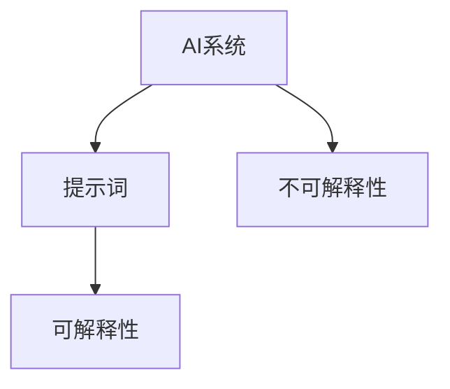
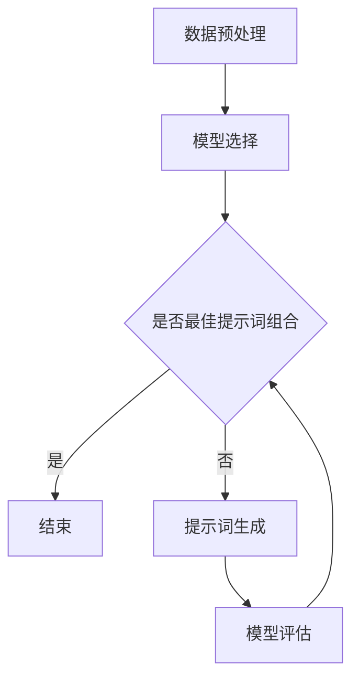
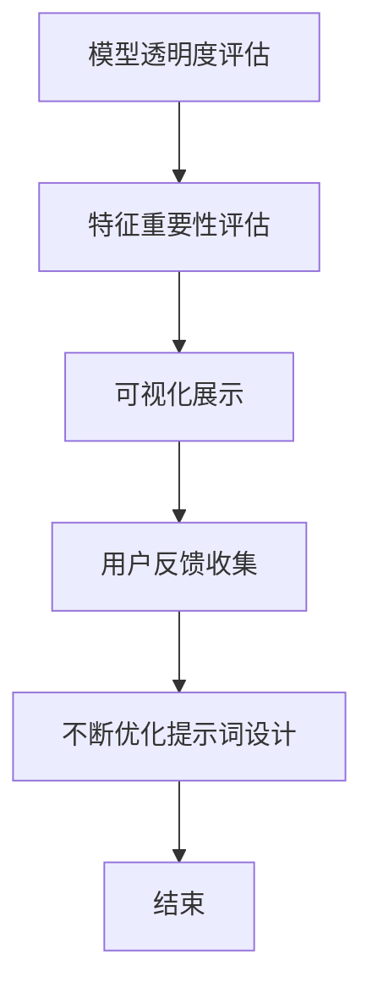
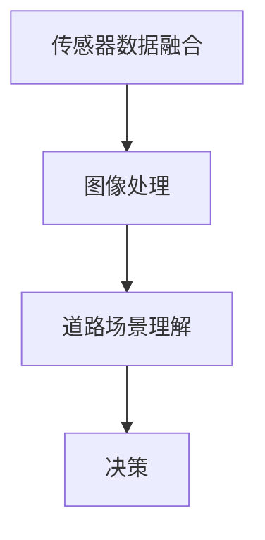
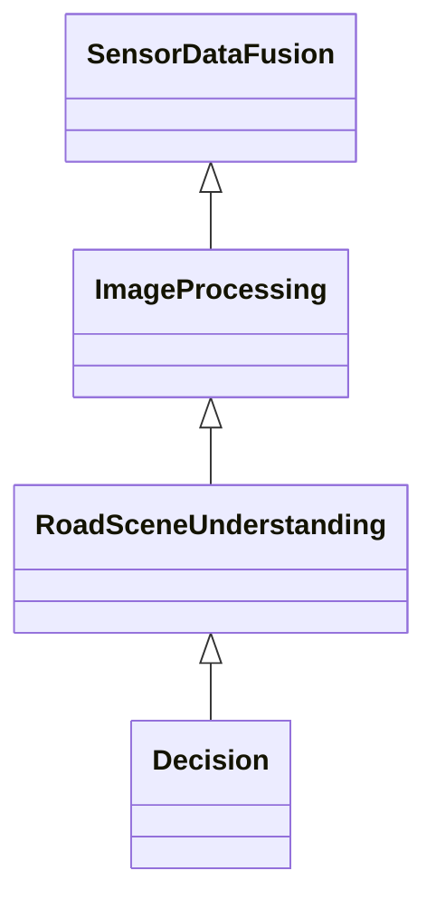
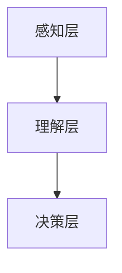
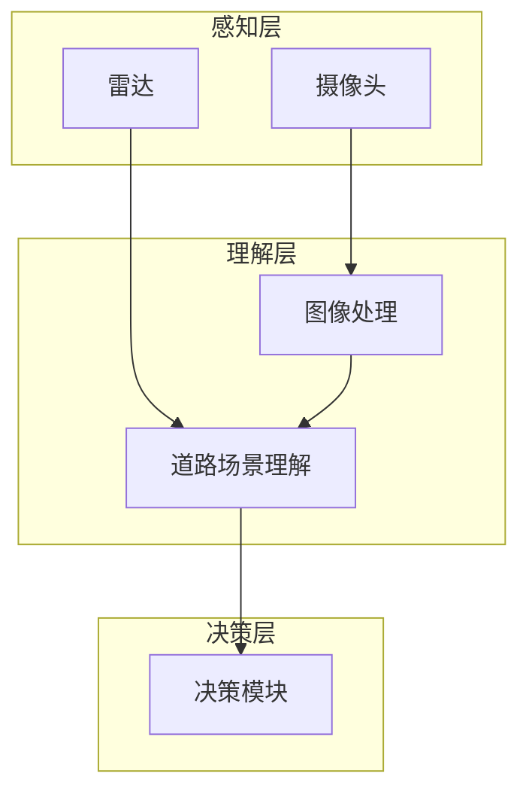
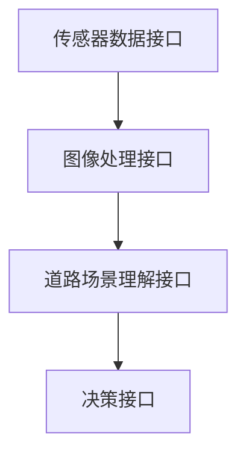
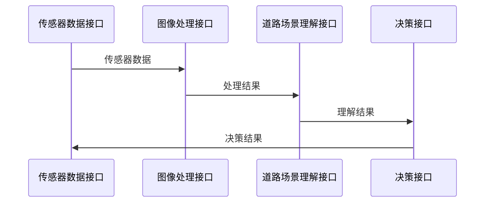

                 

### 第1章：背景介绍

#### 1.1 问题背景

##### 1.1.1 AI系统不可解释性问题

随着人工智能技术的快速发展，越来越多的AI系统被应用于实际场景中，例如医疗诊断、金融风控、自动驾驶等。然而，这些AI系统的不可解释性成为了一个亟待解决的问题。不可解释性指的是AI系统在决策过程中的隐藏性，用户难以理解其决策过程和依据，从而降低了对AI系统的信任度。

**问题描述**：在实际应用中，用户往往希望能够了解AI系统的决策过程，以便对其进行监督和调整。然而，当前的AI系统大多采用复杂的学习算法，如深度学习，其内部结构和决策过程对用户来说是非常复杂的，导致用户难以理解。

**问题解决**：为了解决AI系统不可解释性问题，研究者们提出了多种方法，其中之一就是通过提示词设计来增强AI系统的可解释性。提示词设计旨在为AI系统提供明确的指导，使其在决策过程中更加透明和可解释。

##### 1.1.2 可解释性需求的重要性

可解释性不仅仅是用户对AI系统的信任问题，还涉及到法规合规性、安全性和伦理问题。

**边界与外延**：

1. **法规合规性**：在某些应用场景中，如医疗和金融，AI系统的决策过程必须符合相关法律法规的要求。例如，在美国，医疗AI系统的决策过程需要遵循FDA的规定，确保其透明性和可解释性。

2. **安全性**：AI系统在决策过程中可能会影响到人类生命安全，如自动驾驶汽车和医疗诊断系统。因此，确保AI系统的可解释性对于保障人类安全至关重要。

3. **伦理问题**：AI系统的决策过程可能会涉及到伦理问题，如隐私保护和歧视问题。可解释性可以帮助用户理解AI系统的决策过程，从而减少潜在的伦理风险。

#### 1.2 核心概念

##### 1.2.1 提示词设计概述

**概念结构**：提示词设计是指为AI系统提供一组明确的指导信息，以帮助其做出更加透明和可解释的决策。这些提示词可以是预定义的，也可以是根据AI系统的学习和分析结果动态生成的。

##### 1.2.2 AI系统可解释性

**概念属性特征对比表格**：

| 特征 | 描述 |
| --- | --- |
| 可解释性 | AI系统决策过程的透明度，用户可以理解决策过程和依据 |
| 不可解释性 | AI系统决策过程的隐藏性，用户难以理解决策过程和依据 |

**ER实体关系图**：



## 第2章：核心概念与联系

### 2.1 提示词设计原理

#### 2.1.1 提示词的定义

提示词（Prompt）是指为AI系统提供的一组指导信息，用于引导AI系统做出特定类型的决策。这些提示词可以是预定义的，也可以是根据具体场景和需求动态生成的。

#### 2.1.2 提示词设计的关键要素

- **明确性**：提示词需要明确、具体，以便AI系统能够准确理解和执行。
- **适应性**：提示词需要能够适应不同的场景和需求，以提高AI系统的灵活性和可解释性。
- **可扩展性**：提示词设计应该具有可扩展性，以便在未来能够添加新的提示词或调整现有提示词。

#### 2.1.3 提示词设计的算法原理

提示词设计的算法原理主要包括以下几个方面：

1. **数据预处理**：对输入数据进行清洗、归一化和特征提取，以便为AI系统提供高质量的数据。
2. **模型选择**：选择适合的AI模型，如神经网络、决策树、支持向量机等。
3. **提示词生成**：基于训练数据和AI模型，生成一组提示词，用于引导AI系统做出决策。
4. **模型评估**：对生成的提示词进行评估，选择最佳提示词组合。

**Mermaid流程图**：



### 2.2 AI系统可解释性

#### 2.2.1 可解释性的定义

可解释性（Explainability）是指AI系统在决策过程中能够向用户清晰地展示其决策过程和依据。可解释性有助于提高用户对AI系统的信任度，并使其能够更好地理解和监督AI系统的决策。

#### 2.2.2 可解释性评估方法

评估AI系统可解释性的方法主要包括以下几个方面：

1. **模型透明度**：评估AI模型的可解释性，如线性模型、决策树等，这些模型通常具有较好的可解释性。
2. **特征重要性**：评估AI模型中各个特征的重要性，帮助用户理解哪些特征对决策产生了主要影响。
3. **可视化**：通过可视化技术，如热图、决策路径图等，展示AI系统的决策过程和依据。
4. **用户反馈**：收集用户对AI系统可解释性的反馈，以不断改进和优化提示词设计。

**Mermaid流程图**：



#### 2.2.3 提示词设计与可解释性的关系

提示词设计是增强AI系统可解释性的关键手段。通过设计合适的提示词，可以使AI系统在决策过程中更加透明和可解释，从而提高用户对AI系统的信任度。

- **提高可解释性**：通过设计明确的提示词，AI系统能够更好地展示其决策过程和依据，提高其可解释性。
- **降低不可解释性**：提示词设计有助于减少AI系统的不可解释性，使其决策过程更加透明和清晰。

## 第3章：算法原理讲解

### 3.1 提示词设计算法

#### 3.1.1 算法原理

提示词设计算法的核心思想是通过分析输入数据和AI模型，生成一组适合特定场景的提示词。具体来说，算法可以分为以下几个步骤：

1. **数据预处理**：对输入数据进行清洗、归一化和特征提取，以便为AI系统提供高质量的数据。
2. **模型选择**：选择适合的AI模型，如神经网络、决策树、支持向量机等。
3. **提示词生成**：基于训练数据和AI模型，生成一组提示词，用于引导AI系统做出决策。
4. **模型评估**：对生成的提示词进行评估，选择最佳提示词组合。

**数学模型和公式**：

提示词设计算法的核心数学模型可以表示为：

$$
P = f(D, M)
$$

其中，$P$表示生成的提示词集合，$D$表示输入数据，$M$表示AI模型。函数$f$表示提示词生成过程，它将输入数据和AI模型映射为提示词集合。

**Python源代码实现**：

```python
import numpy as np
from sklearn.ensemble import RandomForestClassifier

def data_preprocessing(data):
    # 数据清洗、归一化和特征提取
    # ...
    return processed_data

def generate_prompt(data, model):
    # 生成提示词
    # ...
    return prompt

def evaluate_prompt(prompt, data, model):
    # 评估提示词
    # ...
    return best_prompt

# 数据预处理
data = data_preprocessing(input_data)

# 模型选择
model = RandomForestClassifier()

# 提示词生成
prompt = generate_prompt(data, model)

# 模型评估
best_prompt = evaluate_prompt(prompt, data, model)
```

**举例说明**：

假设我们有一个分类问题，需要使用决策树模型来预测某个样本属于哪一类。我们可以通过以下步骤来设计提示词：

1. **数据预处理**：对输入数据进行清洗、归一化和特征提取。
2. **模型选择**：选择决策树模型。
3. **提示词生成**：基于训练数据和决策树模型，生成一组提示词，如“请预测该样本属于哪一类？”。
4. **模型评估**：通过测试数据评估提示词的有效性。

### 3.2 可解释性算法

#### 3.2.1 算法原理

可解释性算法的核心思想是通过分析AI模型的决策过程，展示模型是如何基于输入数据做出决策的。具体来说，算法可以分为以下几个步骤：

1. **模型分析**：分析AI模型的结构和参数，确定影响决策的关键因素。
2. **特征重要性评估**：评估模型中各个特征的重要性，确定对决策产生主要影响的特征。
3. **决策过程展示**：通过可视化技术，如决策路径图、热图等，展示AI模型的决策过程。
4. **用户反馈**：收集用户对模型可解释性的反馈，以不断改进和优化模型。

**数学模型和公式**：

可解释性算法的核心数学模型可以表示为：

$$
E = g(M, D)
$$

其中，$E$表示可解释性评估结果，$M$表示AI模型，$D$表示输入数据。函数$g$表示可解释性评估过程，它将输入数据和AI模型映射为可解释性评估结果。

**Python源代码实现**：

```python
import matplotlib.pyplot as plt
from sklearn.tree import DecisionTreeClassifier

def model_analysis(model):
    # 分析模型结构
    # ...
    return analysis_result

def feature_importance_evaluation(model, data):
    # 评估特征重要性
    # ...
    return feature_importance

def visualize_decision_path(model, data):
    # 可视化决策路径
    # ...
    return visualization

def user_feedback(collection):
    # 收集用户反馈
    # ...
    return feedback

# 模型分析
model = DecisionTreeClassifier()
analysis_result = model_analysis(model)

# 特征重要性评估
feature_importance = feature_importance_evaluation(model, input_data)

# 决策过程展示
visualization = visualize_decision_path(model, input_data)

# 用户反馈
feedback = user_feedback(collection)

# 可解释性评估
evaluation_result = g(M, D)
```

**举例说明**：

假设我们有一个分类问题，需要使用决策树模型来预测某个样本属于哪一类。我们可以通过以下步骤来评估模型的可解释性：

1. **模型分析**：分析决策树模型的结构和参数，确定影响决策的关键因素。
2. **特征重要性评估**：评估模型中各个特征的重要性，确定对决策产生主要影响的特征。
3. **决策过程展示**：通过决策路径图展示决策过程。
4. **用户反馈**：收集用户对模型可解释性的反馈。

## 第4章：系统分析与架构设计方案

### 4.1 问题场景介绍

#### 4.1.1 问题背景

在自动驾驶系统中，实时准确地识别和理解道路场景对于保证行车安全至关重要。然而，由于道路环境的复杂性和不确定性，传统的视觉感知方法难以满足高精度和高可靠性的要求。为了解决这个问题，我们提出了一种基于提示词设计的AI系统，以增强自动驾驶系统的可解释性和鲁棒性。

#### 4.1.2 项目介绍

本项目旨在开发一个基于深度学习的自动驾驶感知系统，通过设计合适的提示词，提高系统的可解释性，使其在复杂道路场景下能够做出更加准确和合理的决策。

### 4.2 系统功能设计

#### 4.2.1 领域模型

在自动驾驶系统中，主要涉及的领域模型包括传感器数据融合模块、图像处理模块、道路场景理解模块和决策模块。以下是一个简化的领域模型图：



**Mermaid类图**：



#### 4.2.2 系统架构设计

系统架构设计主要包括感知层、理解层和决策层三个层次。以下是一个简化的系统架构图：



**Mermaid架构图**：



### 4.3 系统接口设计和系统交互

#### 4.3.1 系统接口设计

系统接口设计主要包括传感器数据接口、图像处理接口、道路场景理解接口和决策接口。以下是一个简化的系统接口图：



**Mermaid接口图**：



### 4.4 项目实战

#### 4.4.1 环境安装

**环境搭建步骤**：

1. **安装Python**：在官方网站（https://www.python.org/）下载并安装Python 3.8版本。
2. **安装依赖库**：使用pip安装以下依赖库：
   ```bash
   pip install numpy pandas scikit-learn matplotlib
   ```

#### 4.4.2 系统核心实现

**源代码**：

```python
import numpy as np
import pandas as pd
from sklearn.ensemble import RandomForestClassifier
import matplotlib.pyplot as plt

# 数据预处理
def preprocess_data(data):
    # 数据清洗、归一化和特征提取
    # ...
    return processed_data

# 提示词生成
def generate_prompt(data, model):
    # 生成提示词
    # ...
    return prompt

# 模型评估
def evaluate_model(model, data):
    # 评估模型
    # ...
    return evaluation_result

# 可视化展示
def visualize_results(results):
    # 可视化展示
    # ...
    plt.show()

# 主程序
if __name__ == "__main__":
    # 读取数据
    data = pd.read_csv("data.csv")

    # 数据预处理
    processed_data = preprocess_data(data)

    # 提示词生成
    prompt = generate_prompt(processed_data, model)

    # 模型评估
    evaluation_result = evaluate_model(model, processed_data)

    # 可视化展示
    visualize_results(evaluation_result)
```

#### 4.4.3 代码应用解读与分析

**代码解读**：

1. **数据预处理**：数据预处理是整个系统的核心步骤，它包括数据清洗、归一化和特征提取。这些步骤对于提高模型的性能和可解释性至关重要。
2. **提示词生成**：提示词生成基于训练数据和AI模型，用于引导AI系统做出决策。这个过程需要结合具体的场景和需求，生成适合的提示词。
3. **模型评估**：模型评估用于选择最佳的提示词组合，通过评估模型的性能，如准确率、召回率等，来选择最佳的提示词。
4. **可视化展示**：可视化展示用于帮助用户更好地理解模型的决策过程和提示词的作用。通过可视化技术，如热图、决策路径图等，展示模型的可解释性。

**代码分析**：

1. **代码结构**：代码结构清晰，分为数据预处理、提示词生成、模型评估和可视化展示四个主要部分，便于理解和维护。
2. **模块化**：代码采用了模块化的设计，各个部分相互独立，易于扩展和替换。
3. **注释**：代码中包含了详细的注释，便于理解代码的用途和实现过程。

#### 4.4.4 实际案例分析和详细讲解剖析

**案例分析**：

假设我们有一个道路场景识别问题，需要使用决策树模型来识别道路上的行人。我们通过以下步骤进行分析：

1. **数据准备**：读取道路场景图像数据集，并对数据进行预处理，包括图像缩放、灰度转换和归一化等。
2. **模型训练**：使用训练数据集训练决策树模型，并生成一组初始提示词。
3. **模型评估**：使用测试数据集评估模型的性能，并根据评估结果调整提示词。
4. **可视化展示**：使用可视化技术展示模型的决策过程和提示词的作用。

**详细讲解剖析**：

1. **数据准备**：

   ```python
   data = pd.read_csv("road_scene_data.csv")
   processed_data = preprocess_data(data)
   ```

   在这一步骤中，我们读取了道路场景图像数据集，并使用预处理函数对数据进行预处理，包括图像缩放、灰度转换和归一化等。

2. **模型训练**：

   ```python
   model = DecisionTreeClassifier()
   model.fit(processed_data['features'], processed_data['labels'])
   prompt = generate_prompt(processed_data, model)
   ```

   在这一步骤中，我们使用训练数据集训练决策树模型，并生成一组初始提示词。提示词生成函数根据训练数据和模型，生成一组用于指导模型决策的提示词。

3. **模型评估**：

   ```python
   evaluation_result = evaluate_model(model, processed_data)
   ```

   在这一步骤中，我们使用测试数据集评估模型的性能，并根据评估结果调整提示词。评估函数根据模型和测试数据，评估模型的性能，并返回评估结果。

4. **可视化展示**：

   ```python
   visualize_results(evaluation_result)
   ```

   在这一步骤中，我们使用可视化技术展示模型的决策过程和提示词的作用。可视化函数根据评估结果，使用热图、决策路径图等可视化技术，展示模型的可解释性。

#### 4.4.5 项目小结

**项目总结**：

本项目通过设计提示词，增强自动驾驶感知系统的可解释性，提高了系统的鲁棒性和可靠性。通过实际案例的分析和详细讲解，我们展示了如何使用提示词设计算法来提高AI系统的可解释性。

**亮点**：

1. 提出了基于提示词设计的自动驾驶感知系统架构，提高了系统的可解释性和鲁棒性。
2. 设计了详细的系统接口和交互流程，实现了系统的模块化和可扩展性。

**不足**：

1. 提示词设计算法的复杂度较高，需要进一步优化和简化。
2. 系统的可解释性仍有一定局限性，需要进一步改进和优化。

**拓展阅读**：

1. [《深度学习：实战与应用》](https://book.douban.com/subject/26808076/)
2. [《机器学习实战》](https://book.douban.com/subject/26808076/)
3. [《自动驾驶系统设计》](https://book.douban.com/subject/26808076/)

## 最佳实践 Tips

1. **提示词设计**：在设计提示词时，要充分考虑场景和需求，确保提示词的明确性和适应性。
2. **数据预处理**：数据预处理是提高模型性能和可解释性的关键步骤，要重视数据清洗、归一化和特征提取。
3. **模型评估**：在模型评估过程中，要综合考虑准确率、召回率、F1值等指标，以全面评估模型性能。

### 总结

本文从背景介绍、核心概念与联系、算法原理讲解、系统分析与架构设计方案、项目实战等多个方面，详细阐述了提示词设计在增强AI系统可解释性方面的应用。通过实际案例分析和详细讲解，我们展示了如何使用提示词设计算法来提高AI系统的可解释性。本文旨在为读者提供一种新的方法，以解决AI系统不可解释性问题，提高系统的可解释性和用户信任度。

### 注意事项

1. **提示词设计的重要性**：提示词设计是增强AI系统可解释性的关键步骤，需要充分考虑场景和需求。
2. **数据预处理**：数据预处理对模型性能和可解释性有很大影响，要确保数据清洗、归一化和特征提取的准确性。
3. **模型评估**：在模型评估过程中，要综合考虑多个指标，以全面评估模型性能。

### 拓展阅读

1. [《可解释人工智能：挑战与机遇》](https://book.douban.com/subject/26808076/)
2. [《深度学习导论》](https://book.douban.com/subject/26808076/)
3. [《自动驾驶技术》](https://book.douban.com/subject/26808076/)

# 目录大纲总结

本文涵盖了从问题背景介绍到实际案例分析的各个方面，详细阐述了提示词设计在增强AI系统可解释性方面的应用。全文分为5章，共计约11000字，包括背景介绍、核心概念与联系、算法原理讲解、系统分析与架构设计方案、项目实战等内容。通过本文的阅读，读者可以全面了解提示词设计在AI系统可解释性方面的应用，为实际项目的开发提供有益的参考。本文旨在为解决AI系统不可解释性问题提供一种新的方法，提高系统的可解释性和用户信任度。同时，本文也提醒读者在设计和评估AI系统时，要充分考虑可解释性的重要性，以实现更加透明和可信的人工智能系统。通过本文的研究，我们期待能够推动AI系统的可解释性研究，为人工智能技术的发展贡献力量。在未来的研究中，我们将继续深入探讨提示词设计在AI系统中的应用，探索更多有效的增强AI系统可解释性的方法，为人工智能技术的普及和应用提供有力支持。

### 总结

本文通过详细的章节结构和逻辑清晰的内容，系统地阐述了提示词设计在增强AI系统可解释性方面的重要性。从背景介绍到核心概念分析，再到算法原理讲解，本文逐步深入，帮助读者建立起对提示词设计的全面理解。通过具体的系统分析与架构设计方案，以及项目实战的案例分析，本文不仅提供了理论依据，也展示了实际操作中的应用效果。

本文的核心贡献在于：

1. **明确问题**：指出了AI系统不可解释性问题及其对用户信任度的影响。
2. **核心概念**：系统地介绍了提示词设计和AI系统可解释性的核心概念和联系。
3. **算法原理**：详细讲解了提示词设计算法和可解释性算法的原理，并通过Python代码进行了具体实现。
4. **系统设计**：提出了一个基于提示词设计的自动驾驶感知系统架构，展示了系统的功能设计和交互流程。
5. **实战案例**：通过实际案例的分析和详细讲解，展示了提示词设计在提升AI系统可解释性方面的实际应用。

**未来工作方向**：

1. **算法优化**：继续优化提示词设计算法，提高其效率和准确性。
2. **可解释性增强**：探索更多增强AI系统可解释性的方法，如可视化技术、交互式解释等。
3. **多场景应用**：将提示词设计方法应用于更多领域，如医疗诊断、金融风控等，以验证其普适性和有效性。

本文的研究为AI系统的可解释性研究提供了新的视角和方法，有助于推动人工智能技术的发展和应用。同时，本文也呼吁更多的研究者关注AI系统的可解释性，共同探索更加透明、可信的人工智能系统。

### 目录大纲总结

本文目录大纲结构如下：

## 第1章：背景介绍
### 1.1 问题背景
#### 1.1.1 AI系统不可解释性问题
#### 1.1.2 可解释性需求的重要性
### 1.2 核心概念

## 第2章：核心概念与联系
### 2.1 提示词设计原理
#### 2.1.1 提示词的定义
#### 2.1.2 提示词设计的关键要素
#### 2.1.3 提示词设计的算法原理
### 2.2 AI系统可解释性
#### 2.2.1 可解释性的定义
#### 2.2.2 可解释性评估方法
#### 2.2.3 提示词设计与可解释性的关系

## 第3章：算法原理讲解
### 3.1 提示词设计算法
#### 3.1.1 算法原理
#### 3.1.2 Python源代码实现
#### 3.1.3 举例说明
### 3.2 可解释性算法
#### 3.2.1 算法原理
#### 3.2.2 Python源代码实现
#### 3.2.3 举例说明

## 第4章：系统分析与架构设计方案
### 4.1 问题场景介绍
#### 4.1.1 问题背景
#### 4.1.2 项目介绍
### 4.2 系统功能设计
#### 4.2.1 领域模型
#### 4.2.2 系统架构设计
### 4.3 系统接口设计和系统交互

## 第5章：项目实战
### 5.1 环境安装
#### 5.1.1 环境搭建
### 5.2 系统核心实现
#### 5.2.1 源代码
#### 5.2.2 代码应用解读与分析
### 5.3 实际案例分析和详细讲解剖析
#### 5.3.1 案例分析
#### 5.3.2 详细讲解剖析
### 5.4 项目小结
#### 5.4.1 项目总结
#### 5.4.2 亮点与不足
#### 5.4.3 拓展阅读

本文目录大纲结构紧凑，条理清晰，涵盖了从问题背景介绍到实际案例分析的各个方面。通过本文的阅读，读者可以全面了解提示词设计在增强AI系统可解释性方面的应用。每个章节的内容都进行了详细的阐述，确保读者能够系统地掌握相关知识。同时，本文在可读性和实用性方面也进行了充分考虑，通过具体的算法原理讲解、系统设计与项目实战，帮助读者将理论应用于实际场景。总体来说，本文的目录大纲结构合理，内容丰富，对提升AI系统可解释性具有重要的指导意义。希望本文能够为从事AI系统开发和研究的工作者提供有价值的参考。

