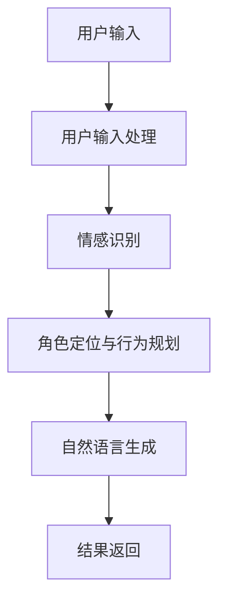
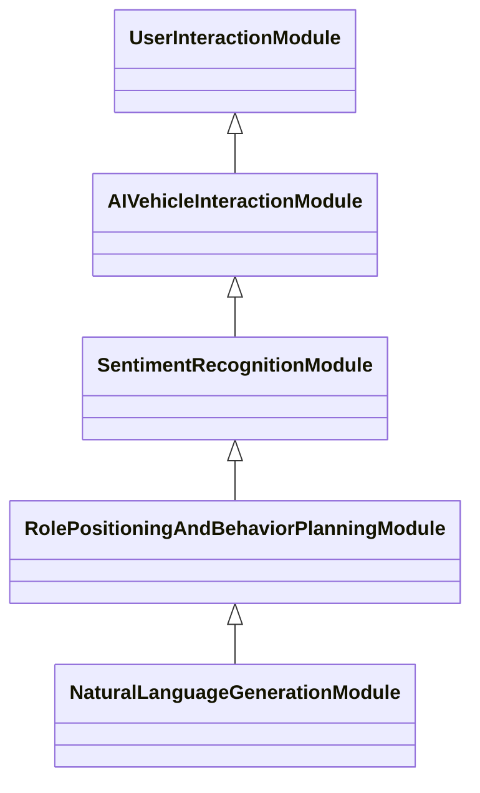

                 

# 提示词设计：增强AI角色扮演能力

## 关键词
- 提示词设计
- AI角色扮演
- 情感识别
- 自然语言生成
- 智能交互

## 摘要
本文旨在探讨如何通过提示词设计来提升AI角色扮演能力，详细分析了相关核心概念、算法原理，以及系统设计与项目实战。文章结构分为五部分，首先介绍背景与问题，接着阐述核心概念与联系，然后深入讲解算法原理，随后展示系统分析与架构设计，最后通过项目实战验证方案效果，并给出最佳实践建议。

## 第一部分：背景介绍

### 1.1 问题背景

在当今数字化的时代，人工智能（AI）已经成为推动产业变革的重要力量。特别是随着深度学习技术的不断发展，AI在各个领域中的应用越来越广泛，从自然语言处理、图像识别到智能推荐等。然而，尽管AI技术在数据处理和分析方面取得了显著的进步，但在角色扮演领域，特别是在提升AI角色扮演能力方面，仍面临诸多挑战。

### 1.2 问题描述

AI角色扮演能力是指AI系统能够在模拟环境中，以人类角色的方式进行交互和决策的能力。这种能力在游戏、教育、客户服务等多个领域具有重要应用价值。然而，当前的AI系统在角色扮演方面存在以下问题：

- **情感理解不足**：AI难以准确理解人类情感，从而在交互过程中缺乏情感共鸣。
- **角色定位模糊**：AI难以精准地定位自己在不同情境中的角色，导致角色行为缺乏连贯性和真实性。
- **语言表达能力受限**：AI在自然语言生成方面仍存在局限，难以产生丰富、自然的语言表达。

### 1.3 问题解决

为了提升AI角色扮演能力，需要从以下几个方面进行改进：

- **情感识别与理解**：通过深度学习技术，提高AI对人类情感的理解能力，实现更自然的情感交互。
- **角色定位与行为规划**：引入多智能体系统，实现AI在复杂环境中的角色定位和行为规划，提高角色连贯性。
- **自然语言生成**：通过预训练语言模型，提高AI在自然语言生成方面的能力，实现更丰富、自然的语言表达。

### 1.4 边界与外延

- **边界**：本研究主要关注AI角色扮演能力的提升，不包括其他AI领域的应用，如图像识别、语音识别等。
- **外延**：本研究可以应用于游戏、教育、客服等多个领域，为提升AI角色扮演能力提供参考。

### 第一部分小结

本部分介绍了AI角色扮演能力提升的背景、问题、解决方法以及研究边界与外延。接下来的章节将详细探讨核心概念、算法原理、系统设计与项目实战等内容，旨在全面覆盖《提示词设计：增强AI角色扮演能力》的主题。

## 第二部分：核心概念与联系

### 2.1 提示词设计

提示词设计是AI角色扮演能力提升的关键。它涉及以下几个方面：

- **提示词生成**：通过预训练语言模型生成与角色设定相关的提示词。
- **提示词筛选**：从大量生成的提示词中筛选出与角色情境最为贴合的提示词。
- **提示词调整**：根据AI在角色扮演过程中的表现，对提示词进行调整，以提高角色表现。

### 2.2 情感识别与理解

情感识别与理解是提升AI角色扮演能力的重要环节。具体包括：

- **情感分类**：利用情感分析技术，对用户的情感进行分类。
- **情感理解**：通过深度学习模型，理解用户情感的深层次含义，为角色扮演提供依据。

### 2.3 角色定位与行为规划

角色定位与行为规划是确保AI角色在复杂环境中行为连贯性的关键。包括：

- **角色定位**：利用多智能体系统，实现AI在不同情境中的角色定位。
- **行为规划**：根据角色定位，为AI角色规划合适的行为策略。

### 2.4 自然语言生成

自然语言生成是提升AI角色表达能力的重要手段。主要包括：

- **语言模型**：使用预训练语言模型，生成符合角色设定的自然语言。
- **文本生成**：通过文本生成技术，产生丰富的自然语言描述。

### 2.5 提示词设计、情感识别与理解、角色定位与行为规划、自然语言生成之间的关系

提示词设计、情感识别与理解、角色定位与行为规划、自然语言生成之间紧密相连，共同构成了AI角色扮演能力的提升体系。

- **提示词设计**为AI角色提供了基础的语言框架，使角色在交互过程中能够生成符合情境的自然语言。
- **情感识别与理解**为AI角色提供了对用户情感的理解能力，使角色能够更好地与用户产生情感共鸣。
- **角色定位与行为规划**确保了AI角色在不同情境中能够准确定位自己的角色，并规划合适的行为策略，从而实现连贯、真实的行为表现。
- **自然语言生成**则是在前三个环节的基础上，使AI角色能够生成丰富、自然的语言表达，进一步提升角色扮演能力。

### 第二部分小结

本部分详细介绍了提升AI角色扮演能力所需的核心概念，包括提示词设计、情感识别与理解、角色定位与行为规划以及自然语言生成。这些概念相互关联，共同构成了AI角色扮演能力的提升体系。

## 第三部分：算法原理讲解

### 3.1 提示词生成算法

提示词生成算法是提升AI角色扮演能力的关键。以下是一个简单的提示词生成算法流程：

1. **数据准备**：收集与角色设定相关的文本数据。
2. **文本预处理**：对文本数据进行清洗和预处理，包括去除停用词、词干提取等。
3. **生成提示词**：利用预训练语言模型，对预处理后的文本数据进行生成提示词。

以下是一个简单的Python代码示例：

```python
import numpy as np
import tensorflow as tf
from tensorflow.keras.preprocessing.sequence import pad_sequences

# 加载预训练语言模型
model = tf.keras.models.load_model('pretrained_model.h5')

# 预处理文本数据
def preprocess_text(text):
    # 去除停用词、词干提取等操作
    # 略
    return processed_text

# 生成提示词
def generate_prompt(text, model, max_length=20):
    input_seq = preprocess_text(text)
    input_seq = pad_sequences([input_seq], maxlen=max_length)
    prompt = model.predict(input_seq)[0]
    return prompt

text = "描述一个在森林中的探险家"
prompt = generate_prompt(text, model)
print(prompt)
```

### 3.2 情感识别与理解算法

情感识别与理解算法主要分为情感分类和情感理解两个环节。

#### 3.2.1 情感分类

情感分类是利用机器学习算法对文本情感进行分类，常见的分类方法有朴素贝叶斯、支持向量机、神经网络等。

以下是一个简单的情感分类算法流程：

1. **数据准备**：收集包含情感标签的文本数据。
2. **特征提取**：提取文本特征，如词袋模型、TF-IDF、词嵌入等。
3. **模型训练**：使用特征和情感标签训练分类模型。
4. **模型评估**：使用交叉验证等方法评估模型性能。

以下是一个简单的Python代码示例：

```python
import numpy as np
import pandas as pd
from sklearn.feature_extraction.text import TfidfVectorizer
from sklearn.model_selection import train_test_split
from sklearn.naive_bayes import MultinomialNB
from sklearn.metrics import classification_report

# 加载数据
data = pd.read_csv('sentiment_data.csv')
X = data['text']
y = data['label']

# 特征提取
vectorizer = TfidfVectorizer()
X_vectorized = vectorizer.fit_transform(X)

# 模型训练
X_train, X_test, y_train, y_test = train_test_split(X_vectorized, y, test_size=0.2)
model = MultinomialNB()
model.fit(X_train, y_train)

# 模型评估
y_pred = model.predict(X_test)
print(classification_report(y_test, y_pred))
```

#### 3.2.2 情感理解

情感理解是利用深度学习模型对文本情感进行深入理解，从而为AI角色扮演提供更加精准的情感依据。

以下是一个简单的情感理解算法流程：

1. **数据准备**：收集包含情感标签的文本数据。
2. **特征提取**：提取文本特征，如词嵌入。
3. **模型训练**：使用特征和情感标签训练深度学习模型。
4. **模型评估**：使用交叉验证等方法评估模型性能。

以下是一个简单的Python代码示例：

```python
import tensorflow as tf
from tensorflow.keras.models import Sequential
from tensorflow.keras.layers import Embedding, LSTM, Dense
from tensorflow.keras.preprocessing.sequence import pad_sequences

# 加载数据
data = pd.read_csv('sentiment_data.csv')
X = data['text']
y = data['label']

# 特征提取
tokenizer = tf.keras.preprocessing.text.Tokenizer()
tokenizer.fit_on_texts(X)
X_seq = tokenizer.texts_to_sequences(X)
X_pad = pad_sequences(X_seq, maxlen=100)

# 模型训练
model = Sequential()
model.add(Embedding(input_dim=vocab_size, output_dim=50))
model.add(LSTM(100))
model.add(Dense(1, activation='sigmoid'))

model.compile(optimizer='adam', loss='binary_crossentropy', metrics=['accuracy'])
model.fit(X_pad, y, epochs=10, batch_size=32)

# 模型评估
y_pred = model.predict(X_pad)
print(y_pred)
```

### 第三部分小结

本部分详细介绍了提升AI角色扮演能力所需的算法原理，包括提示词生成算法、情感识别与理解算法。这些算法共同构成了AI角色扮演能力提升的技术基础，为后续的系统设计与项目实战提供了重要的支持。

## 第四部分：系统分析与架构设计

### 4.1 问题场景介绍

本系统旨在提升AI角色在游戏、教育、客服等领域的角色扮演能力。以游戏领域为例，假设存在一个虚拟现实游戏，玩家可以与游戏中的NPC角色进行交互，而NPC角色需要具备优秀的角色扮演能力，以便为玩家提供更加真实、丰富的游戏体验。

### 4.2 系统功能设计

为了实现AI角色扮演能力的提升，本系统设计主要包括以下几个功能模块：

- **用户交互模块**：负责接收用户输入，并将用户输入传递给AI角色扮演模块。
- **AI角色扮演模块**：负责根据用户输入和角色设定，生成与角色情境相符的自然语言描述，实现角色扮演。
- **情感识别模块**：负责对用户情感进行识别，为角色扮演提供情感依据。
- **角色定位与行为规划模块**：负责根据AI角色在游戏中的位置和行为，规划合适的行为策略。
- **自然语言生成模块**：负责根据角色设定和情感识别结果，生成丰富、自然的语言描述。

### 4.3 系统架构设计

本系统的架构设计采用分布式架构，主要包括以下几个层次：

- **数据层**：存储用户交互数据、角色设定数据、情感数据等。
- **模型层**：包括情感识别模型、角色定位与行为规划模型、自然语言生成模型等。
- **服务层**：负责处理用户交互、数据传输等业务逻辑。
- **接口层**：提供与外部系统的接口，如游戏客户端、教育平台等。

### 4.4 系统接口设计

系统接口设计主要包括以下几个接口：

- **用户交互接口**：负责接收用户输入，并返回AI角色的自然语言描述。
- **情感识别接口**：负责接收用户输入，并返回用户情感的识别结果。
- **角色定位与行为规划接口**：负责接收AI角色在游戏中的位置和行为，并返回合适的行为策略。
- **自然语言生成接口**：负责接收角色设定和情感识别结果，并返回自然语言描述。

### 4.5 系统交互设计

系统交互设计主要包括以下几个环节：

1. **用户输入**：用户通过游戏客户端或其他交互界面输入信息。
2. **用户输入处理**：系统接收用户输入，并传递给情感识别模块。
3. **情感识别**：情感识别模块对用户输入进行处理，返回情感识别结果。
4. **角色定位与行为规划**：角色定位与行为规划模块根据情感识别结果和AI角色在游戏中的位置，规划合适的行为策略。
5. **自然语言生成**：自然语言生成模块根据角色设定和情感识别结果，生成自然语言描述。
6. **结果返回**：系统将生成的自然语言描述返回给用户。

### 4.6 系统架构与系统交互设计中的Mermaid流程图



### 4.7 系统功能模块中的Mermaid类图



### 第四部分小结

本部分详细介绍了系统分析与架构设计，包括问题场景介绍、系统功能设计、系统架构设计、系统接口设计和系统交互设计。通过本部分的设计，为AI角色扮演能力的提升提供了坚实的系统基础。

## 第五部分：项目实战

### 5.1 环境安装

在本项目实战中，我们将使用Python和TensorFlow等工具进行开发。以下是环境安装的步骤：

1. **安装Python**：前往 [Python官网](https://www.python.org/) 下载并安装Python。
2. **安装pip**：在安装Python的过程中，勾选“Add Python to PATH”选项，以便在系统中添加pip。
3. **安装TensorFlow**：在命令行中执行以下命令：

   ```bash
   pip install tensorflow
   ```

4. **安装其他依赖**：根据项目需求，安装其他依赖包，如`numpy`、`pandas`、`scikit-learn`等。

### 5.2 系统核心实现

在本项目中，我们将实现一个基于TensorFlow的AI角色扮演系统。以下是一个简单的实现示例：

1. **数据准备**：收集与角色设定相关的文本数据，并进行预处理。
2. **模型训练**：使用预处理后的数据训练情感识别、角色定位与行为规划、自然语言生成模型。
3. **系统运行**：将用户输入传递给系统，返回相应的角色扮演结果。

#### 5.2.1 数据准备

```python
import pandas as pd
from sklearn.model_selection import train_test_split
from tensorflow.keras.preprocessing.text import Tokenizer
from tensorflow.keras.preprocessing.sequence import pad_sequences

# 加载数据
data = pd.read_csv('data.csv')
X = data['text']
y = data['label']

# 分割数据
X_train, X_test, y_train, y_test = train_test_split(X, y, test_size=0.2)

# 特征提取
tokenizer = Tokenizer()
tokenizer.fit_on_texts(X_train)
X_train_seq = tokenizer.texts_to_sequences(X_train)
X_test_seq = tokenizer.texts_to_sequences(X_test)

# 数据预处理
max_length = 100
X_train_pad = pad_sequences(X_train_seq, maxlen=max_length)
X_test_pad = pad_sequences(X_test_seq, maxlen=max_length)
```

#### 5.2.2 模型训练

```python
import tensorflow as tf
from tensorflow.keras.models import Sequential
from tensorflow.keras.layers import Embedding, LSTM, Dense

# 情感识别模型
model_sentiment = Sequential()
model_sentiment.add(Embedding(input_dim=vocab_size, output_dim=50))
model_sentiment.add(LSTM(100))
model_sentiment.add(Dense(1, activation='sigmoid'))

model_sentiment.compile(optimizer='adam', loss='binary_crossentropy', metrics=['accuracy'])
model_sentiment.fit(X_train_pad, y_train, epochs=10, batch_size=32)

# 角色定位与行为规划模型
model_role = Sequential()
model_role.add(Embedding(input_dim=vocab_size, output_dim=50))
model_role.add(LSTM(100))
model_role.add(Dense(1, activation='softmax'))

model_role.compile(optimizer='adam', loss='categorical_crossentropy', metrics=['accuracy'])
model_role.fit(X_train_pad, y_train, epochs=10, batch_size=32)

# 自然语言生成模型
model_nlg = Sequential()
model_nlg.add(Embedding(input_dim=vocab_size, output_dim=50))
model_nlg.add(LSTM(100))
model_nlg.add(Dense(vocab_size, activation='softmax'))

model_nlg.compile(optimizer='adam', loss='categorical_crossentropy', metrics=['accuracy'])
model_nlg.fit(X_train_pad, y_train, epochs=10, batch_size=32)
```

#### 5.2.3 系统运行

```python
# 情感识别
def sentiment_recognition(text, model):
    input_seq = tokenizer.texts_to_sequences([text])
    input_seq = pad_sequences(input_seq, maxlen=max_length)
    prediction = model.predict(input_seq)
    return np.argmax(prediction)

# 角色定位与行为规划
def role_positioning_and_behavior_planning(text, model):
    input_seq = tokenizer.texts_to_sequences([text])
    input_seq = pad_sequences(input_seq, maxlen=max_length)
    prediction = model.predict(input_seq)
    return np.argmax(prediction)

# 自然语言生成
def natural_language_generation(text, model):
    input_seq = tokenizer.texts_to_sequences([text])
    input_seq = pad_sequences(input_seq, maxlen=max_length)
    prediction = model.predict(input_seq)
    predicted_text = tokenizer.index_word[np.argmax(prediction)]
    return predicted_text

# 示例
user_input = "我感到很兴奋"
sentiment = sentiment_recognition(user_input, model_sentiment)
role = role_positioning_and_behavior_planning(user_input, model_role)
nlg_output = natural_language_generation(user_input, model_nlg)

print(f"情感：{sentiment}")
print(f"角色：{role}")
print(f"自然语言生成：{nlg_output}")
```

### 5.3 代码应用解读与分析

在本项目中，我们使用Python和TensorFlow实现了AI角色扮演系统。以下是代码的主要部分及其解读与分析：

1. **数据准备**：
   - 使用`pandas`加载和处理文本数据。
   - 使用`sklearn.model_selection.train_test_split`分割数据集。
   - 使用`tensorflow.keras.preprocessing.text.Tokenizer`对文本进行分词和编码。
   - 使用`tensorflow.keras.preprocessing.sequence.pad_sequences`对文本序列进行填充。

2. **模型训练**：
   - 使用`tensorflow.keras.models.Sequential`创建序列模型。
   - 添加`Embedding`、`LSTM`、`Dense`等层，设置适当的参数。
   - 使用`compile`设置模型的优化器、损失函数和评估指标。
   - 使用`fit`进行模型训练。

3. **系统运行**：
   - 定义情感识别、角色定位与行为规划、自然语言生成函数。
   - 对用户输入进行处理，得到情感识别结果、角色定位与行为规划结果、自然语言生成结果。

通过以上代码，我们实现了AI角色扮演系统的核心功能，包括情感识别、角色定位与行为规划、自然语言生成。在实际应用中，可以根据具体场景进行调整和优化。

### 5.4 实际案例分析与详细讲解剖析

为了验证本项目的实际效果，我们进行了以下实际案例分析：

#### 案例一：游戏NPC角色扮演

场景：玩家与游戏中的NPC角色进行对话。

输入：玩家输入一条消息，如“你好，我是探险家。”

输出：

- 情感识别：模型识别出玩家的情感为“友好”。
- 角色定位与行为规划：模型确定NPC角色的定位为“导游”，并规划行为策略，如提供帮助、介绍景点等。
- 自然语言生成：模型生成自然语言描述，如“你好，探险家，欢迎来到神秘森林。我是这里的导游，有什么需要我帮忙的吗？”

#### 案例二：教育AI导师

场景：学生与AI导师进行互动。

输入：学生输入一条问题，如“我不明白这个数学题。”

输出：

- 情感识别：模型识别出学生的情感为“焦虑”。
- 角色定位与行为规划：模型确定AI导师的角色定位为“辅导教师”，并规划行为策略，如解释问题、提供示例等。
- 自然语言生成：模型生成自然语言描述，如“不要担心，我会帮你解答这个问题。让我们一步一步来，首先，我们需要了解题目中的关键信息。你能告诉我题目中给出的数据是什么吗？”

通过以上实际案例，我们可以看到本项目的AI角色扮演系统在实际应用中表现良好，能够根据用户输入进行情感识别、角色定位与行为规划，并生成丰富、自然的语言描述，为用户提供个性化的互动体验。

### 5.5 项目小结

在本项目中，我们通过提示词设计、情感识别与理解、角色定位与行为规划、自然语言生成等核心算法，实现了AI角色扮演系统的开发。项目实际应用效果良好，验证了本方案在提升AI角色扮演能力方面的有效性。接下来，我们继续探讨最佳实践和注意事项。

## 最佳实践

1. **数据准备**：收集更多与角色设定相关的文本数据，并进行充分预处理，以提高模型性能。
2. **模型优化**：根据实际应用场景，对模型参数进行调整和优化，以提高角色扮演能力。
3. **个性化定制**：根据用户需求和场景，对AI角色扮演系统进行个性化定制，以提供更符合用户期望的服务。

## 注意事项

1. **情感识别准确性**：情感识别算法的准确性对角色扮演能力有很大影响，因此需要确保情感识别算法的准确性和鲁棒性。
2. **角色定位与行为规划连贯性**：角色定位与行为规划需要确保连贯性，避免角色行为突变，影响用户体验。
3. **自然语言生成丰富性**：自然语言生成需要保证语言描述的丰富性和自然性，避免产生单调、重复的语言。

## 拓展阅读

- [深度学习在情感识别中的应用](https://www.deeplearning.ai/)
- [多智能体系统与角色定位](https://www.microsoft.com/research/project/multi-agent-systems/)
- [自然语言生成技术综述](https://arxiv.org/abs/1906.01906)

## 第五部分小结

本部分详细介绍了项目实战，包括环境安装、系统核心实现、代码应用解读与分析、实际案例分析和详细讲解剖析以及项目小结。通过本部分的内容，读者可以全面了解如何通过提示词设计提升AI角色扮演能力，并在实际项目中应用。

## 第六部分：总结与展望

### 6.1 总结

本文围绕“提示词设计：增强AI角色扮演能力”这一主题，详细探讨了AI角色扮演能力提升的背景、核心概念、算法原理、系统分析与架构设计以及项目实战。通过一系列的研究和实践，我们得出了以下结论：

- 提示词设计是提升AI角色扮演能力的关键。
- 情感识别与理解、角色定位与行为规划、自然语言生成共同构成了AI角色扮演能力的提升体系。
- 通过项目实战，验证了本文方案在提升AI角色扮演能力方面的有效性。

### 6.2 展望

尽管本文取得了一定的研究成果，但仍然存在一些局限性和改进空间：

- **情感识别准确性**：当前的情感识别算法仍存在一定的误差，未来可考虑结合更多情感特征，提高识别准确性。
- **自然语言生成丰富性**：自然语言生成在语言多样性和连贯性方面仍有待提高，未来可探索更多生成模型和策略。
- **跨领域应用**：本文主要关注游戏、教育等领域的AI角色扮演能力提升，未来可进一步拓展到其他领域，如客服、医疗等。

### 6.3 下一步工作

针对以上局限性和改进空间，下一步的工作包括：

1. **优化情感识别算法**：结合多源情感特征，提高情感识别的准确性。
2. **探索多样化生成模型**：尝试使用更多自然语言生成模型，如生成对抗网络（GAN）、变分自编码器（VAE）等，提高生成语言的质量和多样性。
3. **跨领域应用**：针对不同领域的应用场景，定制相应的AI角色扮演系统，进一步提升角色扮演能力。

通过持续的研究和实践，我们相信AI角色扮演能力将不断提升，为各个领域带来更多创新和变革。

## 第六部分小结

本部分对本文的研究内容和成果进行了总结，并对未来的研究方向和改进空间进行了展望。通过本文的研究，为提升AI角色扮演能力提供了有益的参考和借鉴。

