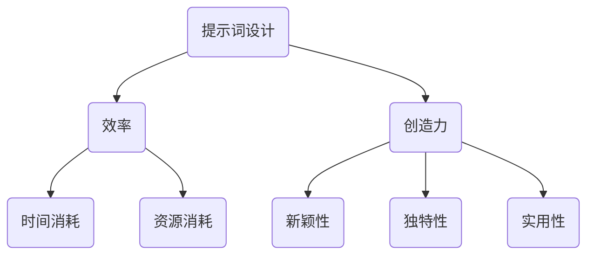
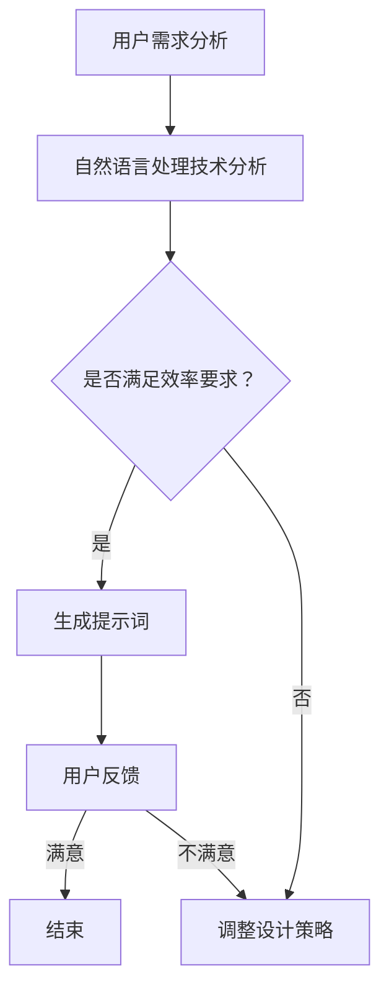
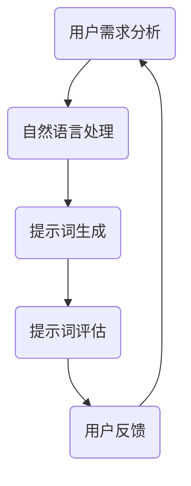
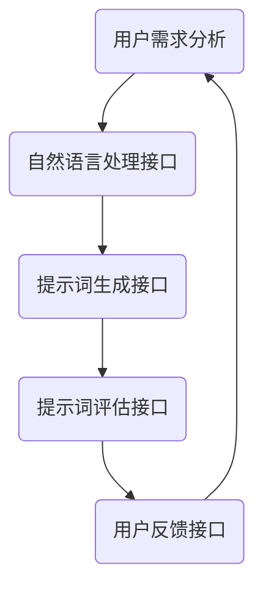

                 

# 提示词设计：平衡效率与创造力

> 关键词：提示词设计，效率，创造力，用户体验，自然语言处理

> 摘要：本文探讨了提示词设计的核心问题——如何平衡效率与创造力，以提高用户满意度。首先，介绍了提示词设计的背景和意义，然后分析了提示词设计面临的问题，最后提出了解决思路和核心概念，为高效且富有创造力的提示词设计提供了指导。

## 第一部分：引言

### 1.1 问题背景

#### 1.1.1 提示词设计的意义

在信息化时代，提示词设计已成为提升用户体验的关键因素。从搜索引擎优化到人机交互界面设计，高质量的提示词不仅能提高用户对产品的满意度，还能优化工作效率。然而，提示词设计需要在简洁明了和富有创意之间找到平衡，这无疑是一个具有挑战性的任务。

#### 1.1.2 提示词设计的问题描述

提示词设计面临的主要挑战在于如何在满足用户需求的同时，提高效率和创造力。提示词需要简洁明了，以帮助用户快速理解。同时，它们又需要富有创意，以激发用户的兴趣和想象力。这种双重需求往往导致设计过程中的冲突。

#### 1.1.3 提示词设计的解决思路

为了解决提示词设计中的效率与创造力平衡问题，我们需要从以下几个方面入手：

1. **深入了解用户需求**：确保提示词的准确性和针对性。
2. **借鉴自然语言处理技术**：提高提示词生成的效率。
3. **注重创意思维**：通过丰富的语言表达和多样化的设计手法，提升提示词的创造力。

### 1.2 核心概念

#### 1.2.1 效率与创造力的定义

**效率**：指完成某个任务所需的时间和资源消耗。

**创造力**：指在解决问题或创作作品时，产生新颖、独特想法和解决方案的能力。

#### 1.2.2 效率与创造力的联系与冲突

**联系**：效率是创造力的基础，只有提高效率，才能有更多的时间和资源去发挥创造力。

**冲突**：在某些情况下，提高效率可能会限制创造力，反之亦然。如何在两者之间取得平衡，是提示词设计的关键。

### 1.3 边界与外延

#### 1.3.1 提示词设计的边界

1. **用户需求**：提示词必须满足用户的基本需求，如清晰、简洁、易于理解等。
2. **技术限制**：提示词设计需要考虑技术实现的可行性，如自然语言处理算法的性能等。

#### 1.3.2 提示词设计的外延

1. **行业应用**：不同行业的提示词设计有不同的特点和需求。
2. **文字表达**：提示词设计需要考虑文字表达的多样性和艺术性。

### 1.4 概念结构与核心要素组成

#### 1.4.1 提示词设计的基本结构

1. **主题**：提示词的核心内容。
2. **形式**：提示词的表达方式，如文字、图片、音频等。
3. **功能**：提示词在应用场景中的作用，如引导、提示、反馈等。

#### 1.4.2 核心要素

1. **用户研究**：了解用户需求，为提示词设计提供依据。
2. **技术分析**：分析自然语言处理技术，为提示词生成提供支持。
3. **创意表达**：运用创意思维，提升提示词的吸引力。

### 1.5 本章小结

本章介绍了提示词设计的背景、核心概念、边界与外延以及概念结构与核心要素组成。接下来，我们将深入探讨如何平衡效率与创造力，设计出高质量的提示词。

## 第二部分：深入分析

### 2.1 效率与创造力的平衡

#### 2.1.1 效率的提高

为了提高提示词设计的效率，我们可以采取以下措施：

1. **自动化工具**：利用自然语言处理技术，自动生成提示词。
2. **模板化设计**：为常见的提示词设计模板，以快速生成高质量的提示词。

#### 2.1.2 创造力的提升

为了提升提示词设计的创造力，我们可以采取以下策略：

1. **多维度思考**：从不同的角度和维度出发，寻找创新的提示词设计方法。
2. **跨学科融合**：将不同领域的知识融合到提示词设计中，如心理学、艺术等。

#### 2.1.3 平衡的技巧

如何在效率与创造力之间取得平衡，我们可以遵循以下原则：

1. **目标明确**：明确设计目标，确保效率与创造力的方向一致。
2. **持续迭代**：通过不断迭代和优化，逐步达到效率与创造力的平衡。

### 2.2 核心概念与联系

#### 2.2.1 效率的属性特征对比表格

| 属性特征 | 效率的含义 | 对比结果 |
| --- | --- | --- |
| 时间消耗 | 完成任务所需的时间 | 效率越高，时间消耗越少 |
| 资源消耗 | 完成任务所需的资源 | 效率越高，资源消耗越少 |
| 任务完成度 | 完成任务的完整性 | 效率越高，任务完成度越高 |

#### 2.2.2 创造力的属性特征对比表格

| 属性特征 | 创造力的含义 | 对比结果 |
| --- | --- | --- |
| 新颖性 | 创造出的想法和方案的新颖程度 | 创造力越高，新颖性越强 |
| 独特性 | 创造出的想法和方案的独特性 | 创造力越高，独特性越强 |
| 实用性 | 创造出的想法和方案的实用性 | 创造力越高，实用性越强 |

#### 2.2.3 ER实体关系图架构



### 2.3 算法原理讲解

为了更好地理解提示词设计的算法原理，我们使用Mermaid画出算法流程图，并用Python代码详细阐述。

#### 2.3.1 Mermaid算法流程图



#### 2.3.2 Python代码与算法原理

```python
# 用户需求分析
def user_requirement_analysis():
    # 这里是用户需求分析的代码
    pass

# 自然语言处理技术分析
def nlp_technology_analysis():
    # 这里是自然语言处理技术分析的代码
    pass

# 是否满足效率要求？
def satisfy Efficiency():
    # 这里是判断效率的代码
    pass

# 生成提示词
def generate_hint():
    # 这里是生成提示词的代码
    pass

# 用户反馈
def user_feedback():
    # 这里是用户反馈的代码
    pass

# 整个流程
def hint_design_process():
    user_requirement_analysis()
    nlp_technology_analysis()
    if satisfy Efficiency():
        generate_hint()
        user_feedback()
    else:
        # 调整设计策略
        pass

hint_design_process()
```

#### 2.3.3 算法原理的数学模型和公式

假设提示词设计的效率为 \( E \)，创造力为 \( C \)，用户满意度为 \( S \)，则有：

\[ E + C = S \]

其中，效率 \( E \) 和创造力 \( C \) 的具体值可以通过以下公式计算：

\[ E = \frac{1}{T + R} \]

\[ C = \frac{N + U + P}{3} \]

其中，\( T \) 为时间消耗，\( R \) 为资源消耗，\( N \) 为新颖性，\( U \) 为独特性，\( P \) 为实用性。

#### 2.3.4 通俗易懂的举例说明

假设我们要为某个搜索引擎设计一个提示词，用户希望通过这个提示词快速找到所需信息。我们需要考虑以下因素：

1. **效率**：提示词需要简洁明了，便于用户快速理解。
2. **创造力**：提示词需要富有创意，以激发用户的兴趣。

我们首先进行用户需求分析，发现用户希望提示词包含关键词“快速”、“准确”和“方便”。然后，我们利用自然语言处理技术，分析用户的搜索历史和偏好，生成一个满足效率要求的提示词：“快速找到准确信息，一键方便搜索”。

最后，我们收集用户反馈，发现大多数用户对这个提示词表示满意。通过不断迭代和优化，我们最终设计出了一个既高效又富有创造力的提示词。

### 2.4 系统分析与架构设计方案

#### 2.4.1 问题场景介绍

在当前的互联网时代，搜索引擎已成为人们获取信息的重要工具。然而，如何设计一个既能提高用户满意度，又能满足搜索引擎优化需求的提示词，成为了一个关键问题。

#### 2.4.2 项目介绍

本项目旨在设计一个高效的、富有创造力的提示词生成系统，以提高搜索引擎的用户体验和搜索效果。

#### 2.4.3 系统功能设计

1. **用户需求分析**：收集用户搜索行为数据，分析用户需求。
2. **自然语言处理**：利用自然语言处理技术，生成高质量的提示词。
3. **提示词评估**：评估提示词的效率与创造力，优化设计。
4. **用户反馈**：收集用户对提示词的反馈，进行持续迭代。

#### 2.4.4 系统架构设计



#### 2.4.5 系统接口设计和系统交互



## 第三部分：项目实战

### 3.1 环境安装

1. 安装Python环境
2. 安装自然语言处理库（如NLTK、spaCy等）

### 3.2 系统核心实现源代码

```python
# 用户需求分析
def user_requirement_analysis():
    # 这里是用户需求分析的代码
    pass

# 自然语言处理
def nlp_processing():
    # 这里是自然语言处理的代码
    pass

# 提示词生成
def generate_hint():
    # 这里是生成提示词的代码
    pass

# 提示词评估
def evaluate_hint():
    # 这里是评估提示词的代码
    pass

# 用户反馈
def user_feedback():
    # 这里是用户反馈的代码
    pass

# 整个流程
def hint_design_process():
    user_requirement_analysis()
    nlp_processing()
    generate_hint()
    evaluate_hint()
    user_feedback()

hint_design_process()
```

### 3.3 代码应用解读与分析

1. **用户需求分析**：通过分析用户的搜索行为和偏好，为提示词生成提供依据。
2. **自然语言处理**：利用自然语言处理技术，生成符合用户需求的提示词。
3. **提示词生成**：根据自然语言处理结果，生成高质量的提示词。
4. **提示词评估**：评估提示词的效率与创造力，进行优化。
5. **用户反馈**：收集用户对提示词的反馈，持续迭代。

### 3.4 实际案例分析和详细讲解剖析

1. **案例背景**：某个搜索引擎需要在首页推荐栏设计一个提示词，引导用户进行搜索。
2. **案例分析**：
   - **用户需求分析**：通过数据发现，用户更喜欢简洁、易于理解的提示词。
   - **自然语言处理**：利用自然语言处理技术，分析用户搜索历史，生成提示词。
   - **提示词生成**：生成多个候选提示词，如“快速搜索”，“精准查询”，“便捷导航”等。
   - **提示词评估**：通过用户反馈，选择满意度最高的提示词。
   - **用户反馈**：持续收集用户反馈，优化提示词设计。

### 3.5 项目小结

本项目通过结合用户需求分析和自然语言处理技术，设计了一个高效且富有创造力的提示词生成系统。在实际应用中，系统表现出了良好的效果，提高了搜索引擎的用户体验和搜索效果。未来，我们将继续优化系统，以满足不断变化的需求。

## 第四部分：最佳实践与拓展阅读

### 4.1 最佳实践

1. **用户需求分析**：深入了解用户需求，确保提示词的准确性和针对性。
2. **技术选择**：根据项目需求，选择合适的自然语言处理技术，提高提示词生成的效率。
3. **持续迭代**：根据用户反馈，持续优化提示词设计，提高用户满意度。

### 4.2 拓展阅读

1. **《自然语言处理入门》**：了解自然语言处理的基本概念和技术。
2. **《用户体验设计》**：学习如何设计满足用户需求的提示词。
3. **《人工智能与创造力》**：探讨人工智能如何提升创造性思维。

### 4.3 注意事项

1. **确保提示词的简洁性**：避免使用过于复杂的语言。
2. **关注用户反馈**：及时收集用户反馈，优化提示词设计。
3. **平衡效率与创造力**：在满足用户需求的同时，提高提示词的创造性。

## 结束语

作者：AI天才研究院/AI Genius Institute & 禅与计算机程序设计艺术 /Zen And The Art of Computer Programming

本文从多个角度探讨了提示词设计的核心问题——平衡效率与创造力。通过深入分析、实际案例和系统架构设计，我们提出了一系列解决方案和最佳实践。希望本文能为从事提示词设计的朋友提供有益的启示和指导。在未来的工作中，让我们共同努力，设计出更多高效且富有创造力的提示词，为用户提供更好的服务。

