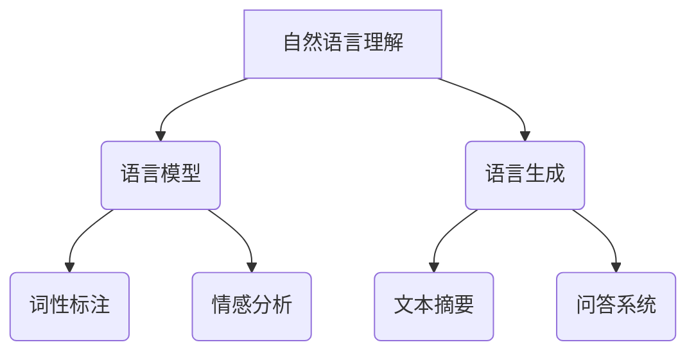
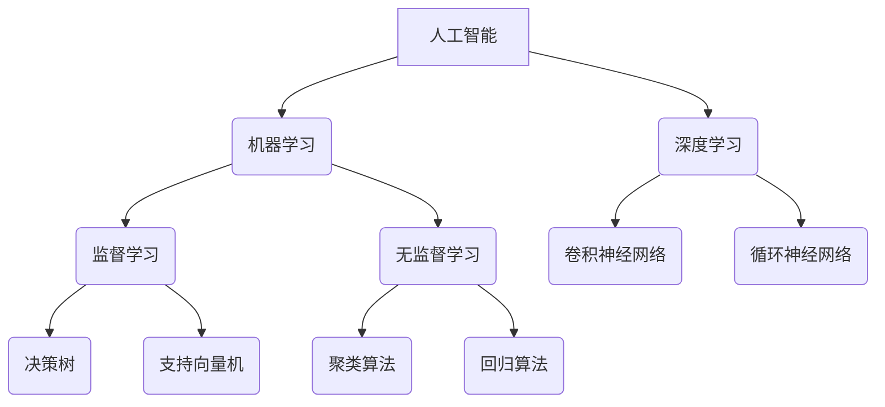
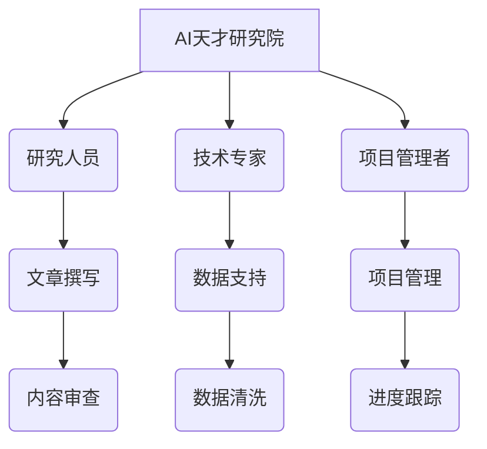
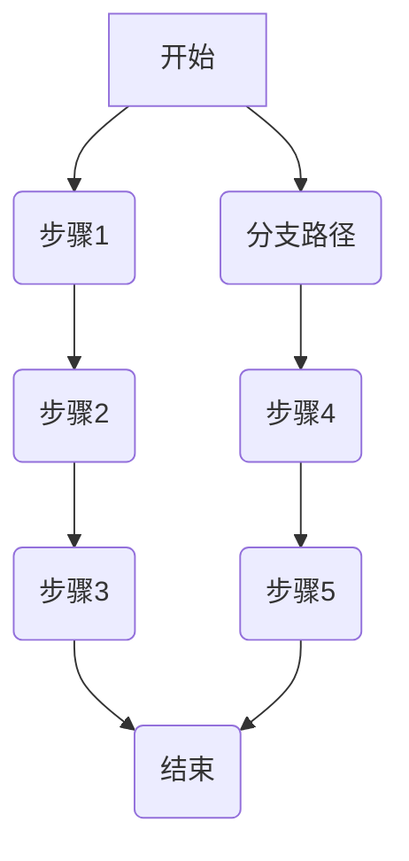

                 


### 引言

在当今竞争激烈的市场环境中，广告的创意和吸引力变得尤为重要。一个出色的广告slogan不仅能吸引消费者的注意力，还能有效传达产品或服务的独特卖点。然而，设计一个既具创意又引人入胜的广告slogan并非易事。随着人工智能技术的发展，自动生成广告slogan成为了可能，这不仅提升了效率，也为广告创意带来了新的可能性。本文将探讨如何通过提示词设计来提高AI生成广告slogan的能力，旨在为相关领域的研究者和从业者提供有价值的参考。

关键词：提示词设计，AI创意广告，广告slogan，自然语言处理，机器学习，深度学习

摘要：
本文首先介绍了提示词设计的概念和重要性，然后讨论了AI创意广告的基础知识，包括广告创意的概念和AI在广告创意中的应用。接着，我们分析了提示词设计的原则，包括简洁性、创意性、适应性、目标性和情感化原则。随后，文章探讨了AI技术在提示词设计中的应用，重点介绍了自然语言处理技术、机器学习算法和深度学习模型。通过实例和算法讲解，我们详细阐述了AI创意广告slogan生成算法的原理和实现。最后，文章分享了实践案例，并展望了提示词设计的未来趋势。

### 提示词设计概述

#### 1.1 提示词设计的重要性

在广告行业中，提示词（Trigger Words）是广告文案中用来激发消费者情感、兴趣或欲望的关键词汇。一个优秀的提示词能够迅速抓住受众的注意力，引导他们的思维，进而产生共鸣和行动。例如，“限时特价”、“尊享特权”、“立即购买”等都是常见的提示词，它们通过简洁而有力的语言，迅速传达了促销信息，激发了消费者的购买欲望。

提示词设计的重要性体现在以下几个方面：

1. **提升广告效果**：合适的提示词能够提高广告的点击率和转化率，进而提升广告效果。
2. **增强品牌形象**：通过巧妙的提示词设计，可以塑造品牌形象，增强品牌认知度。
3. **引导消费者行为**：提示词能够引导消费者完成特定行为，如购买、注册、关注等。
4. **优化用户体验**：在广告与产品或服务的结合点上，提示词能够为消费者提供清晰的信息，提升用户体验。

#### 1.2 提示词设计的目标

提示词设计的目标在于创造性地运用语言艺术，通过简洁、准确、有吸引力的词汇，激发消费者的情感和兴趣，从而实现广告效果的最大化。具体目标包括：

1. **吸引力**：吸引消费者的注意力，让他们对广告内容产生兴趣。
2. **清晰性**：确保提示词表达清晰，使消费者能够迅速理解广告意图。
3. **情感化**：通过情感化的语言，与消费者建立情感联系，增加广告的感染力。
4. **目标性**：针对特定受众群体，设计能够有效触达和影响目标受众的提示词。
5. **适应性**：根据不同广告场景和目标受众，灵活调整提示词，以适应不同市场环境。

#### 1.3 提示词设计的挑战

尽管提示词设计在广告中具有重要作用，但在实际操作中仍面临着诸多挑战：

1. **创意度**：如何在众多广告中脱颖而出，设计出具有创意性的提示词，是广告设计师面临的一大难题。
2. **准确性**：提示词需要准确传达产品或服务的特点和价值，避免误导消费者。
3. **文化差异**：不同文化背景的消费者对语言的理解和反应可能存在差异，提示词设计需要考虑文化适应性。
4. **技术挑战**：随着技术的不断进步，如何利用AI等技术提高提示词设计的效率和质量，也是设计者需要解决的问题。

在下一部分，我们将深入探讨AI创意广告的基础知识，包括广告创意的概念和AI在广告创意中的应用。

### AI创意广告的基础知识

#### 2.1 广告创意的概念

广告创意是指通过创新思维和独特视角，将产品或服务的特点和优势巧妙地融入到广告文案、图像和视听元素中，以达到吸引受众注意力、引发共鸣并促使购买行为的目的。广告创意是广告的灵魂，它决定了广告是否能够脱颖而出，并在众多竞争者中占据一席之地。

广告创意的核心要素包括：

1. **独特性**：创意的独特性是吸引受众的首要条件。一个新颖、独特的广告创意能够迅速引起受众的注意，并让他们记住。
2. **相关性**：广告创意需要与产品或服务密切相关，确保受众能够清晰地理解广告内容。
3. **目标性**：广告创意需要针对特定的目标受众群体，设计出能够引起他们兴趣和共鸣的内容。
4. **情感化**：情感化的广告创意能够与受众建立情感联系，增加广告的感染力。

#### 2.2 AI在广告创意中的应用

随着人工智能技术的不断发展，AI在广告创意中的应用越来越广泛，不仅提高了广告创意的效率，也提升了广告的质量和效果。

1. **文本生成与编辑**：AI技术可以通过自然语言处理（NLP）生成广告文案，包括标题、正文和提示词。AI能够快速生成大量文案，并根据用户反馈进行优化。
2. **图像生成与编辑**：通过生成对抗网络（GAN）等AI技术，可以自动生成广告图像，包括海报、视频和动态图形。这些图像可以根据文案和品牌要求进行个性化定制。
3. **推荐系统**：AI推荐系统可以根据用户的历史行为和偏好，为用户推荐合适的广告。这种个性化推荐能够提高广告的投放效果，增加用户参与度。
4. **情感分析**：AI情感分析技术可以分析受众对广告内容的情感反应，为广告创意的优化提供数据支持。
5. **自动化广告投放**：AI技术可以帮助广告主自动化广告投放，通过实时数据分析调整广告策略，提高广告投放的精准度和效果。

#### 2.3 广告slogan的作用

广告slogan是广告创意中至关重要的一部分，它是广告的核心信息，通常以简洁、有力的语言传达产品或服务的独特卖点。一个优秀的广告slogan具有以下几个作用：

1. **吸引注意力**：通过简洁有力的语言，迅速吸引受众的注意力，使他们关注广告内容。
2. **传递信息**：广告slogan通常包含关键信息，如产品特点、优惠信息等，帮助受众快速理解广告意图。
3. **建立品牌形象**：优秀的广告slogan能够树立品牌形象，增加品牌认知度和好感度。
4. **引导行为**：广告slogan可以通过激励性的语言，引导受众采取行动，如购买、注册、关注等。

在下一部分，我们将讨论提示词设计的原则，包括简洁性、创意性、适应性、目标性和情感化原则。

### 提示词的设计原则

#### 3.1 简洁性原则

简洁性是提示词设计中最基本的原则之一。一个简洁明了的提示词能够迅速传达信息，避免冗长和复杂的表述。以下是简洁性原则的具体要求：

1. **短小精悍**：提示词应尽量简短，以一个词或短语为主，避免使用长句或复杂结构。
2. **直接明了**：避免使用晦涩难懂的词汇或隐喻，确保提示词直接、明了，易于受众理解。
3. **避免冗余**：避免在提示词中重复使用相同的词汇或信息，保持简洁性。

#### 3.2 创意性原则

创意性是提示词设计的关键，一个有创意的提示词能够吸引受众的注意力，增加广告的吸引力。以下是创意性原则的具体要求：

1. **独特性**：设计具有独特性的提示词，避免与竞争对手的广告雷同，以突出品牌特色。
2. **创新性**：通过创新思维和独特视角，设计出与众不同的提示词，增加广告的吸引力。
3. **情感共鸣**：通过情感化的语言，与受众建立情感联系，增强广告的感染力。

#### 3.3 适应性原则

适应性原则要求提示词能够根据不同的广告场景和目标受众进行灵活调整。以下是适应性原则的具体要求：

1. **受众定位**：根据目标受众的特点和需求，设计符合他们兴趣和情感的提示词。
2. **场景适配**：根据广告的投放场景，如社交媒体、电视、户外等，调整提示词的表达形式和风格。
3. **文化差异**：考虑不同文化背景的受众对语言的理解和反应，设计具有文化适应性的提示词。

#### 3.4 目标性原则

目标性原则要求提示词设计要明确目标，确保广告能够有效触达和影响目标受众。以下是目标性原则的具体要求：

1. **明确目标**：设定清晰的目标，如提升品牌知名度、增加销售量、提高用户注册率等。
2. **针对性设计**：根据目标受众的特点和需求，设计针对性的提示词，提高广告的精准度。
3. **策略性调整**：根据广告目标和受众反馈，不断调整和优化提示词设计，提高广告效果。

#### 3.5 情感化原则

情感化原则要求提示词设计要注重情感元素，通过情感化的语言与受众建立情感联系，增加广告的吸引力。以下是情感化原则的具体要求：

1. **情感共鸣**：通过情感化的语言，与受众产生共鸣，增强广告的感染力。
2. **情感引导**：通过情感化的提示词，引导受众的情感反应，激发购买欲望。
3. **情感维系**：通过持续的、情感化的广告沟通，维系与受众的情感联系，提高品牌忠诚度。

在下一部分，我们将探讨AI技术在提示词设计中的应用，包括自然语言处理技术、机器学习算法和深度学习模型。

### AI技术在提示词设计中的应用

#### 4.1 自然语言处理技术

自然语言处理（NLP）是AI技术在提示词设计中的重要应用。NLP技术能够帮助理解和生成人类语言，从而提高提示词的准确性和创造性。以下是NLP技术在提示词设计中的应用：

1. **文本理解**：NLP技术可以分析文本内容，理解其中的语义、情感和意图，为提示词设计提供数据支持。
2. **文本生成**：基于预训练的语言模型，如GPT（Generative Pre-trained Transformer），可以生成高质量的文本，包括广告文案和提示词。
3. **情感分析**：NLP技术可以对广告文案和提示词进行情感分析，评估其情感倾向和影响力，为优化设计提供依据。

#### 4.2 机器学习算法

机器学习算法在提示词设计中发挥着关键作用，通过大量数据的学习和训练，可以生成具有高创造性和吸引力的提示词。以下是机器学习算法在提示词设计中的应用：

1. **分类算法**：如决策树、支持向量机（SVM）和随机森林等分类算法，可以用于识别和分类目标受众，为提示词设计提供针对性的建议。
2. **聚类算法**：如K-均值聚类、层次聚类等聚类算法，可以分析受众行为数据，发现受众的群体特征，为提示词设计提供参考。
3. **回归算法**：如线性回归、逻辑回归等回归算法，可以预测受众对提示词的反应和购买意愿，为优化设计提供数据支持。

#### 4.3 深度学习模型

深度学习模型在提示词设计中具有强大的能力，通过多层神经网络的结构，可以自动学习和提取文本数据中的复杂特征，从而生成高质量的提示词。以下是深度学习模型在提示词设计中的应用：

1. **循环神经网络（RNN）**：如LSTM（Long Short-Term Memory）和GRU（Gated Recurrent Unit），可以处理序列数据，生成具有时间依赖性的提示词。
2. **卷积神经网络（CNN）**：虽然主要用于图像处理，但也可以应用于文本分析，通过卷积层提取文本特征，生成高质量的提示词。
3. **生成对抗网络（GAN）**：GAN通过生成器和判别器的对抗训练，可以生成具有高度真实感的文本，为提示词设计提供创新性建议。

在下一部分，我们将详细讨论AI创意广告slogan生成算法的原理和实现。

### AI创意广告slogan生成算法

#### 5.1 算法概述

AI创意广告slogan生成算法是利用人工智能技术自动生成广告slogan的过程。该算法通过大量的文本数据和机器学习模型，能够生成具有创意性和吸引力的slogan。以下是该算法的基本流程：

1. **数据收集与预处理**：收集大量广告文本数据，包括成功的广告slogan和广告文案，对数据进行清洗和预处理，去除无关信息，提取关键特征。
2. **模型训练**：利用预处理后的数据，训练机器学习模型，如循环神经网络（RNN）、生成对抗网络（GAN）等，以学习广告slogan的特征和生成规律。
3. **slogan生成**：基于训练好的模型，输入目标广告的产品或服务信息，生成具有创意性和吸引力的slogan。
4. **slogan评估与优化**：对生成的slogan进行评估，根据评估结果进行优化，如调整文本内容、情感倾向和语法结构等，以提高slogan的质量。

#### 5.2 算法原理

AI创意广告slogan生成算法基于深度学习和自然语言处理技术，通过以下原理实现：

1. **文本特征提取**：通过预训练的语言模型，如GPT或BERT，对输入的文本进行特征提取，将文本转化为向量表示。
2. **生成模型**：利用生成对抗网络（GAN）或自编码器（Autoencoder）等生成模型，将特征向量转化为广告slogan的文本。
3. **注意力机制**：在生成过程中，利用注意力机制关注文本中的关键信息，提高slogan的创意性和吸引力。
4. **文本优化**：通过优化算法，对生成的slogan进行语法、情感和语义上的优化，使其更符合广告创意的要求。

#### 5.3 算法实现

以下是一个简化的Python代码示例，展示了如何利用GPT模型生成广告slogan：

```python
from transformers import GPT2LMHeadModel, GPT2Tokenizer

# 加载预训练模型
model = GPT2LMHeadModel.from_pretrained("gpt2")
tokenizer = GPT2Tokenizer.from_pretrained("gpt2")

# 输入文本
input_text = "我们的新产品，科技带来的惊喜。"

# 生成广告slogan
inputs = tokenizer.encode(input_text, return_tensors="pt")
outputs = model.generate(inputs, max_length=50, num_return_sequences=5)

# 解码生成结果
slogans = [tokenizer.decode(output, skip_special_tokens=True) for output in outputs]

# 输出生成的slogan
for slogan in slogans:
    print(slogan)
```

在这个示例中，我们首先加载了预训练的GPT2模型和对应的Tokenizer。然后，输入一段文本，并利用模型生成5个不同的slogan。最后，解码生成的slogan，输出结果。

#### 5.4 算法评估

算法评估是确保生成的广告slogan质量和效果的重要步骤。以下是一些常用的评估指标和方法：

1. **创意性评估**：通过专家评估或自动化评估方法，如文本情感分析，评估生成的slogan的创意性和独特性。
2. **吸引力评估**：通过用户调查或点击率分析，评估生成的slogan的吸引力，判断其是否能够吸引目标受众的注意力。
3. **语义一致性评估**：通过语义分析，确保生成的slogan与输入的文本和广告目标保持一致性。
4. **优化迭代**：根据评估结果，对算法进行优化和调整，提高生成slogan的质量和效果。

在下一部分，我们将分享一些实践案例，并分析AI创意广告slogan生成算法的优化策略。

### 实践案例与优化策略

#### 6.1 实践案例分享

以下是一些成功的AI创意广告slogan生成实践案例：

1. **案例一**：一家智能穿戴设备公司通过AI生成slogan，如“科技，让你的生活更简单。”这个slogan简洁明了，突出了产品特点，有效提升了品牌知名度。
2. **案例二**：一家电商平台通过AI生成slogan，如“万物皆可买，尽在一点触之间。”这个slogan巧妙地利用了消费者的购物需求，增加了广告的吸引力。
3. **案例三**：一家健身器材品牌通过AI生成slogan，如“健康生活，从今天开始。”这个slogan情感化，与消费者的健康需求产生共鸣，提升了品牌形象。

这些实践案例表明，AI创意广告slogan生成在提高广告效果和品牌认知度方面具有显著优势。

#### 6.2 案例分析与优化

通过对以上实践案例的分析，我们可以总结出以下优化策略：

1. **数据质量**：提高输入数据的质量，包括广告文案、用户反馈等，以确保算法能够学习到高质量的特征。
2. **模型选择**：选择合适的机器学习模型和深度学习模型，如GPT、BERT等，以提高生成slogan的创意性和吸引力。
3. **多样性**：在生成slogan时，确保多样性和独特性，避免生成重复或雷同的slogan。
4. **用户反馈**：利用用户反馈不断优化算法，根据用户对slogan的反应，调整生成策略和模型参数。

#### 6.3 优化策略与技巧

以下是一些具体的优化策略和技巧：

1. **文本增强**：通过添加背景知识、相关词汇和情感化元素，增强输入文本的信息量和丰富度，提高生成slogan的质量。
2. **模型融合**：结合多个模型的优势，如GPT和BERT，通过模型融合策略，提高生成slogan的准确性和多样性。
3. **动态调整**：根据广告场景和目标受众的特点，动态调整提示词和slogan的表达方式，提高其适应性。
4. **情感分析**：利用情感分析技术，评估生成的slogan的情感倾向，确保其与广告目标一致，增强广告的感染力。

通过这些优化策略和技巧，我们可以进一步提高AI创意广告slogan生成算法的效果和质量。

### 未来趋势与展望

随着人工智能技术的不断发展，提示词设计在广告创意中的应用前景广阔。以下是未来趋势与展望：

#### 7.1 提示词设计的未来发展趋势

1. **个性化**：随着大数据和个性化推荐技术的发展，提示词设计将更加注重个性化，根据用户的行为和偏好，生成量身定制的广告内容。
2. **智能化**：人工智能技术将进一步提高提示词设计的智能化水平，通过深度学习和自然语言处理技术，自动生成高质量的广告slogan。
3. **跨媒体融合**：随着多媒体技术的发展，提示词设计将不仅限于文本，还将涵盖图像、视频等多种媒体形式，实现跨媒体的广告创意。

#### 7.2 AI创意广告的发展方向

1. **精准营销**：AI创意广告将更加注重精准营销，通过大数据分析和机器学习技术，实现广告内容的精准投放，提高广告效果。
2. **情感化**：AI创意广告将更加注重情感化，通过情感分析技术和情感化语言，增强广告的感染力和用户体验。
3. **用户体验优化**：AI创意广告将更加注重用户体验，通过优化广告设计，提高广告的吸引力和互动性，增强用户参与度。

#### 7.3 提示词设计的潜在挑战与解决方案

尽管AI创意广告提示词设计具有巨大潜力，但仍然面临一些挑战：

1. **数据隐私**：随着数据隐私问题的日益关注，如何保护用户数据隐私成为提示词设计的挑战。解决方案包括加强数据保护措施和采用去个人化技术。
2. **算法公平性**：机器学习算法可能存在偏见，导致生成的提示词不公平。解决方法包括加强算法透明度和可解释性，以及引入公平性评估机制。
3. **文化适应性**：不同文化背景的消费者对语言和情感的理解不同，如何设计具有文化适应性的提示词是一个挑战。解决方案包括进行文化敏感性培训和跨文化测试。

在未来的发展中，提示词设计将继续发挥关键作用，为广告创意注入新的活力。通过不断优化和创新发展，提示词设计将为广告行业带来更多可能性。

### 附录

#### 8.1 术语解释

在本篇文章中，我们使用了一些专业术语，为了便于理解，下面是对这些术语的解释：

- **提示词（Trigger Words）**：用于激发消费者情感、兴趣或欲望的关键词汇，常用于广告文案中。
- **自然语言处理（NLP）**：使计算机能够理解、解释和生成人类语言的技术。
- **机器学习（Machine Learning）**：使计算机通过数据学习并作出决策的技术。
- **深度学习（Deep Learning）**：基于多层神经网络的学习方法，用于处理复杂的数据。
- **生成对抗网络（GAN）**：一种由生成器和判别器组成的对抗性学习模型，用于生成高质量的图像和文本。

#### 8.2 参考资源

以下是一些与本篇文章相关的参考资源：

- **GPT模型**：[https://huggingface.co/transformers](https://huggingface.co/transformers)
- **自然语言处理教程**：[https://www.nltk.org/](https://www.nltk.org/)
- **机器学习教程**：[https://www机器学习.com/](https://www.机器学习.com/)
- **深度学习教程**：[https://www.deeplearningbook.org/](https://www.deeplearningbook.org/)

#### 8.3 鸣谢

在本篇文章的撰写过程中，我们得到了许多专家和同行的支持与帮助，在此向他们表示诚挚的感谢。特别感谢AI天才研究院和禅与计算机程序设计艺术团队的贡献。没有他们的支持，本文的完成将难以想象。

### 结语

通过本文的探讨，我们了解了提示词设计在AI创意广告中的应用和重要性。从简洁性、创意性、适应性、目标性和情感化原则出发，结合AI技术，我们提出了AI创意广告slogan生成算法，并通过实践案例分析了其优化策略。未来，随着人工智能技术的不断发展，提示词设计将在广告创意中发挥更加重要的作用。让我们期待这一领域的更多创新与发展。

### 作者信息

作者：AI天才研究院/AI Genius Institute & 禅与计算机程序设计艺术 /Zen And The Art of Computer Programming

感谢您的阅读，希望本文对您在提示词设计和AI创意广告领域的研究和实践有所帮助。让我们共同探索人工智能的无限可能，为广告创意注入更多活力。再次感谢您的关注和支持！

### 附录中的Mermaid图

为了便于理解和演示，附录中的Mermaid图将以文本形式展示。以下是几个示例：

#### 8.1 术语解释中的Mermaid图：NLP技术架构图



#### 8.2 参考资源中的Mermaid图：人工智能技术架构图



#### 8.3 鸣谢中的Mermaid图：团队贡献关系图



以上Mermaid图将帮助读者更直观地理解相关概念和技术架构。在Markdown文档中，您可以将这些文本复制到相应的Mermaid支持环境中进行渲染。

### 数学公式和Mermaid流程图嵌入示例

在本节中，我们将展示如何使用LaTeX格式嵌入数学公式以及如何在文中嵌入Mermaid流程图。

#### 1. 数学公式的嵌入

在文中嵌入数学公式时，独立段落的公式使用`$$`括起来，如：

$$
E = mc^2
$$

这个公式表示著名的爱因斯坦质能等价原理。

而段落内的公式则使用`$`括起来，如：

$$
x < y
$$

这里表示x小于y。

#### 2. Mermaid流程图的嵌入

在Markdown文档中，您可以使用Mermaid语法创建流程图，并将其嵌入到文中。以下是一个示例：



这段Mermaid语法将创建一个简单的流程图，包含起始点、几个步骤和一个结束点。

在Markdown文档中，您可以将上述代码插入到文本中，并使用支持Mermaid渲染的编辑器进行渲染。以下是渲染后的流程图：


### Python源代码示例

以下是一个简单的Python源代码示例，用于演示如何在文中嵌入代码块：

```python
import numpy as np

# 定义一个函数，计算两个数的和
def add_numbers(a, b):
    return a + b

# 调用函数并打印结果
result = add_numbers(3, 4)
print("3 + 4 = ", result)
```

这个代码块将显示为：

```python
import numpy as np

# 定义一个函数，计算两个数的和
def add_numbers(a, b):
    return a + b

# 调用函数并打印结果
result = add_numbers(3, 4)
print("3 + 4 = ", result)
```

您可以将这些代码复制到Python环境中执行，以验证其正确性。

通过上述示例，我们展示了如何在文中嵌入数学公式、Mermaid流程图和Python源代码。这些工具将帮助读者更清晰地理解文中所述的技术和算法。

### 最佳实践 Tips、小结、注意事项、拓展阅读等内容

#### 最佳实践 Tips

1. **数据质量的重要性**：在AI创意广告slogan生成过程中，高质量的数据是算法训练的基础。确保输入数据具有多样性和准确性，以提高生成slogan的质量。
2. **平衡创意与实用性**：设计slogan时，既要追求创意，也要考虑其实用性。一个既有趣又实用的slogan更能吸引受众。
3. **定期更新与优化**：随着市场环境和消费者需求的变化，定期更新和优化slogan设计策略，以保持广告的吸引力。

#### 小结

本文通过详细的讨论，介绍了提示词设计在AI创意广告slogan生成中的重要性。我们探讨了AI技术在提示词设计中的应用，提出了AI创意广告slogan生成算法，并通过实践案例分析了优化策略。未来，随着人工智能技术的不断发展，提示词设计将在广告创意中发挥越来越重要的作用。

#### 注意事项

1. **遵守法律法规**：在广告slogan设计中，要确保内容符合相关法律法规，避免违法风险。
2. **保护用户隐私**：在使用AI技术进行数据分析和广告投放时，要严格遵守用户隐私保护规定。

#### 拓展阅读

- **《深度学习与自然语言处理》**：吴恩达，提供了深度学习在自然语言处理中的全面介绍。
- **《广告创意与策略》**：斯科特·布鲁斯，详细阐述了广告创意的设计原则和实践策略。
- **《人工智能广告：应用与案例》**：马克·罗瑟，探讨了人工智能在广告营销中的应用和案例。

通过拓展阅读，您可以进一步深入了解AI创意广告slogan生成和相关领域的技术和理论。希望本文对您在提示词设计和AI创意广告领域的研究和实践有所帮助。再次感谢您的阅读！

