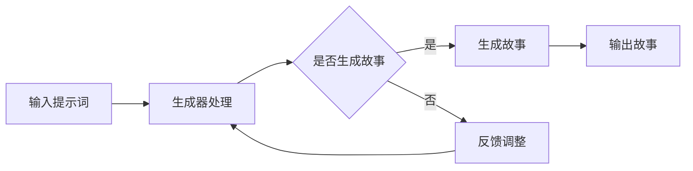
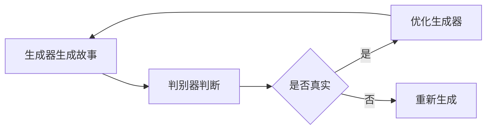
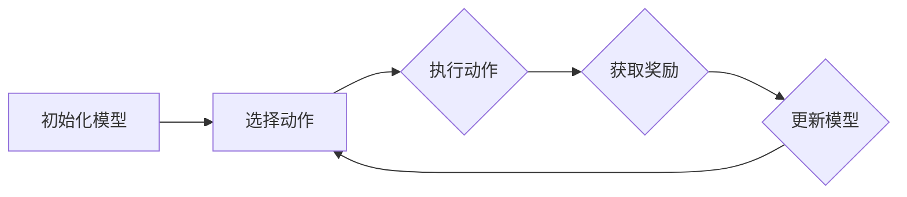
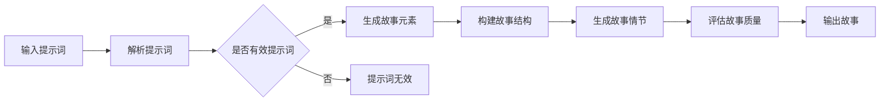
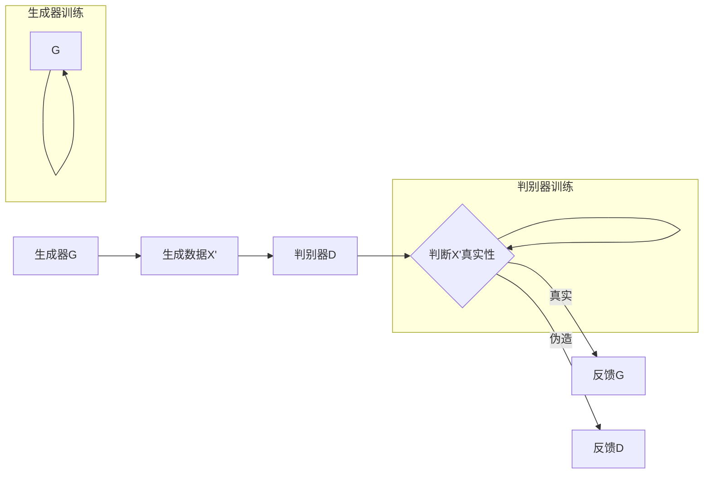
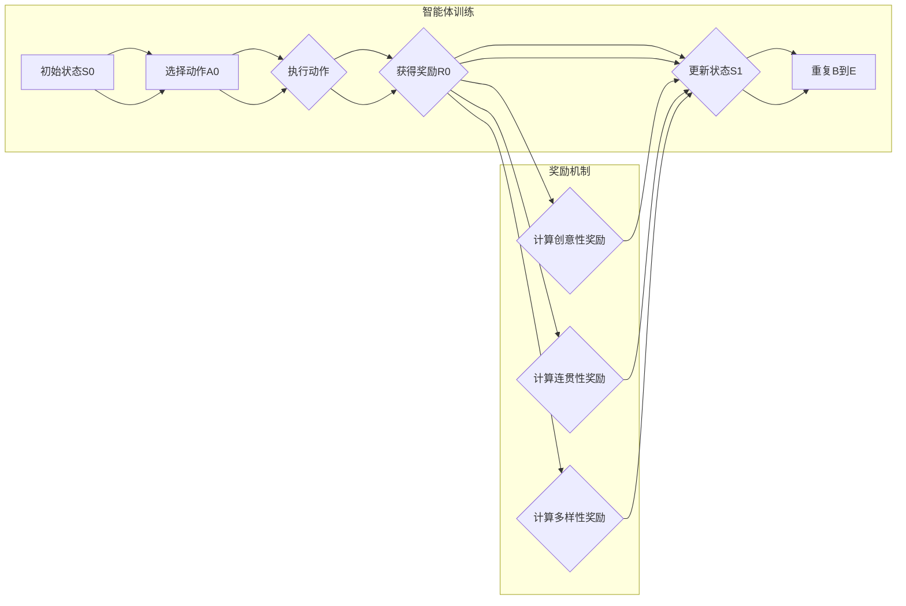

                 

# 提示词设计：提高AI创意故事情节生成能力

> 关键词：AI，创意故事情节，生成对抗网络（GAN），强化学习，自然语言处理，提示词设计

> 摘要：本文旨在探讨如何通过设计有效的提示词来提高人工智能（AI）在生成创意故事情节方面的能力。我们将详细分析AI创意故事情节生成的背景、原理、技术实践及案例分析，旨在为读者提供一种系统化的理解，帮助他们在实际应用中实现AI故事情节生成的最佳效果。

## 第一部分：AI创意故事情节生成的背景与原理

### 第1章：AI与创意故事情节概述

#### 1.1 AI在创意故事情节生成中的应用

随着人工智能技术的发展，AI在各个领域的应用越来越广泛。在创意故事情节生成方面，AI以其强大的数据处理能力和模式识别能力，成为了推动故事创作的重要工具。

**背景介绍**：AI技术在创意领域的兴起及其在故事情节生成中的重要性。

- **问题背景**：传统的创意故事情节生成往往依赖于人工，不仅耗时，而且受限。AI的出现为这一领域带来了革命性的变化。
- **问题解决**：AI通过学习大量的故事素材，能够自动生成创意故事情节，提高创作效率，降低创作成本。

#### 1.2 故事情节的核心要素

故事情节是构建故事的骨架，其核心要素包括人物、场景、冲突、高潮等。

- **问题描述**：故事情节的基本组成要素，如何通过AI技术有效提取和构建。
- **问题解决**：AI能够通过自然语言处理技术，从大量的文本数据中提取出故事要素，并利用这些要素构建出丰富的故事情节。

#### 1.3 AI故事情节生成的原理

AI故事情节生成主要基于以下几种技术：

- **生成对抗网络（GAN）**：通过生成器和判别器的对抗训练，生成高质量的故事情节。
- **强化学习**：通过奖励机制，让AI不断优化故事情节的创意性和连贯性。
- **自然语言处理（NLP）**：利用深度学习模型，对文本进行理解和生成。

**核心概念**：基于生成对抗网络（GAN）、强化学习等技术的AI故事情节生成原理。

#### 1.4 AI故事情节生成的挑战与机遇

AI故事情节生成虽然具有巨大潜力，但也面临诸多挑战。

- **边界与外延**：在数据、算法和创作自由度方面的边界。
- **概念属性特征对比表格**：对比不同AI技术在故事情节生成中的优缺点。

## 第二部分：AI创意故事情节生成技术

### 第2章：核心概念与联系

#### 2.1 AI故事情节生成模型

AI故事情节生成模型主要包括以下几个部分：

- **生成器（Generator）**：负责生成故事情节。
- **判别器（Discriminator）**：负责判断故事情节的质量。
- **优化器（Optimizer）**：负责调整模型的参数，优化故事情节生成。

**ER实体关系图架构**：介绍故事情节生成模型中的实体关系。

```mermaid
entity Relationship {
  "用户" --> "故事生成系统";
  "故事生成系统" --> "生成器";
  "故事生成系统" --> "判别器";
  "故事生成系统" --> "优化器";
}

classDiagram
User [用户]  
StoryGenerationSystem [故事生成系统]  
Generator [生成器]  
Discriminator [判别器]  
Optimizer [优化器]

User|--|>> StoryGenerationSystem: 使用
StoryGenerationSystem|--|>> Generator: 生成
StoryGenerationSystem|--|>> Discriminator: 判断
StoryGenerationSystem|--|>> Optimizer: 调整
```

#### 2.2 提示词与故事情节的关系

提示词是引导AI生成故事情节的重要工具。通过设计有效的提示词，可以显著提高故事情节的创意性和连贯性。

**Mermaid流程图**：展示提示词如何引导AI生成故事情节的过程。



#### 2.3 提示词设计的策略

设计有效的提示词需要考虑以下几个方面：

- **关键词选择**：选择与故事主题密切相关且具有启发性的关键词。
- **语境构建**：构建合理的语境，帮助生成器理解故事的背景和情境。
- **多样性**：设计多样化的提示词，以丰富故事情节的创意性。

**策略分析**：如何通过调整提示词来提高故事情节的创意性和连贯性。

## 第三部分：AI创意故事情节生成技术

### 第3章：生成对抗网络（GAN）在故事情节生成中的应用

#### 3.1 GAN的基本原理

生成对抗网络（GAN）由生成器和判别器两个主要部分组成。生成器生成故事情节，判别器判断故事情节的真实性。

**算法mermaid流程图**：展示GAN的工作流程。



#### 3.2 GAN在故事情节生成中的实现

GAN在故事情节生成中的实现主要包括以下几个步骤：

1. **数据准备**：收集大量的故事情节数据。
2. **模型训练**：通过生成器和判别器的对抗训练，优化模型参数。
3. **故事生成**：生成器生成新的故事情节。

**Python源代码**：详细阐述GAN在故事情节生成中的实现步骤。

```python
# 导入相关库
import tensorflow as tf
from tensorflow.keras.models import Model
from tensorflow.keras.layers import Input, Dense, Flatten

# 定义生成器模型
def build_generator():
    inputs = Input(shape=(100,))
    x = Dense(128, activation='relu')(inputs)
    x = Dense(512, activation='relu')(x)
    x = Dense(1024, activation='relu')(x)
    x = Dense(512, activation='relu')(x)
    x = Dense(128, activation='relu')(x)
    outputs = Dense(100, activation='sigmoid')(x)
    model = Model(inputs=inputs, outputs=outputs)
    return model

# 定义判别器模型
def build_discriminator():
    inputs = Input(shape=(100,))
    x = Dense(128, activation='relu')(inputs)
    x = Dense(512, activation='relu')(x)
    x = Dense(1024, activation='relu')(x)
    x = Dense(512, activation='relu')(x)
    x = Dense(128, activation='relu')(x)
    outputs = Dense(1, activation='sigmoid')(x)
    model = Model(inputs=inputs, outputs=outputs)
    return model

# 定义GAN模型
def build_gan(generator, discriminator):
    discriminator.trainable = False
    inputs = Input(shape=(100,))
    x = generator(inputs)
    outputs = discriminator(x)
    model = Model(inputs=inputs, outputs=outputs)
    return model

# 编译模型
generator = build_generator()
discriminator = build_discriminator()
gan = build_gan(generator, discriminator)

discriminator.compile(optimizer='adam', loss='binary_crossentropy')
gan.compile(optimizer='adam', loss='binary_crossentropy')

# 训练模型
# ...

# 生成故事情节
generated_story = generator.predict(random_vector)
```

#### 3.3 GAN模型训练与优化

GAN模型的训练与优化主要包括以下几个方面：

- **损失函数**：设计合适的损失函数，平衡生成器和判别器的损失。
- **优化器**：选择合适的优化器，提高模型训练效果。
- **参数调整**：根据训练效果，调整模型参数，优化故事情节生成质量。

**数学模型和公式**：解释GAN模型中的关键数学原理。

- **生成器的损失函数**：
  $$L_G = -\sum_{x \in \mathcal{X}} \log(D(G(x)))$$
- **判别器的损失函数**：
  $$L_D = -\sum_{x \in \mathcal{X}} \log(D(x)) - \sum_{z \in \mathcal{Z}} \log(1 - D(G(z)))$$
- **总损失函数**：
  $$L = L_G + \lambda L_D$$

其中，$G$表示生成器，$D$表示判别器，$\mathcal{X}$表示真实数据集，$\mathcal{Z}$表示噪声数据集，$\lambda$表示平衡系数。

### 第4章：强化学习与故事情节生成

#### 4.1 强化学习基础

强化学习是一种通过学习环境中的奖励和惩罚来优化决策过程的方法。在故事情节生成中，强化学习可以通过不断调整策略，优化故事情节的创意性和连贯性。

**数学模型和公式**：强化学习的基本概念和数学原理。

- **状态（State）**：$S_t$
- **动作（Action）**：$A_t$
- **奖励（Reward）**：$R_t$
- **策略（Policy）**：$\pi(A_t|S_t)$

强化学习的目标是通过学习策略，最大化累积奖励：

$$J(\pi) = \sum_{t=0}^{\infty} \gamma^t R_t$$

其中，$\gamma$为折扣因子。

#### 4.2 强化学习在故事情节生成中的应用

强化学习在故事情节生成中的应用主要包括以下几个方面：

- **状态表示**：将故事情节中的元素（如人物、场景、冲突等）编码为状态。
- **动作表示**：将故事情节中的决策（如添加新元素、调整元素关系等）编码为动作。
- **奖励设计**：设计合理的奖励机制，鼓励生成具有创意性和连贯性的故事情节。

**算法mermaid流程图**：展示强化学习在故事情节生成中的工作流程。



#### 4.3 强化学习模型的训练与评估

强化学习模型的训练与评估主要包括以下几个方面：

- **训练过程**：通过迭代更新模型参数，优化故事情节生成策略。
- **评估方法**：设计合适的评估指标，评估故事情节的质量。

**Python源代码**：实现强化学习模型，并进行训练与评估。

```python
import numpy as np
import tensorflow as tf

# 定义强化学习模型
class QNetwork(tf.keras.Model):
    def __init__(self, state_size, action_size):
        super(QNetwork, self).__init__()
        self.fc1 = tf.keras.layers.Dense(64, activation='relu')
        self.fc2 = tf.keras.layers.Dense(64, activation='relu')
        self.v = tf.keras.layers.Dense(action_size)

    def call(self, inputs):
        x = self.fc1(inputs)
        x = self.fc2(x)
        v = self.v(x)
        return v

# 初始化模型
state_size = 100
action_size = 10
q_network = QNetwork(state_size, action_size)

# 编译模型
optimizer = tf.keras.optimizers.Adam(learning_rate=0.001)
loss_function = tf.keras.losses.MeanSquaredError()

@tf.function
def train_step(state, action, reward, next_state, done):
    with tf.GradientTape() as tape:
        q_values = q_network(state)
        next_q_values = q_network(next_state)
        target_q_values = reward + (1 - done) * next_q_values[:, np.argmax(q_values)]

    loss = loss_function(target_q_values, q_values[range(len(state)), action])

    grads = tape.gradient(loss, q_network.trainable_variables)
    optimizer.apply_gradients(zip(grads, q_network.trainable_variables))

# 训练模型
# ...

# 评估模型
# ...
```

### 第5章：自然语言处理与故事情节生成

#### 5.1 自然语言处理概述

自然语言处理（NLP）是人工智能的重要分支，旨在使计算机能够理解、生成和处理人类语言。在故事情节生成中，NLP技术发挥着关键作用。

**概念属性特征对比表格**：对比不同自然语言处理技术在故事情节生成中的效果。

| 技术               | 特点                                                         | 效果                         |
|--------------------|--------------------------------------------------------------|------------------------------|
| 词袋模型           | 只考虑单词的出现频率，不考虑语法和语义                           | 简单易用，但语义理解能力较弱 |
| 递归神经网络（RNN） | 可以处理序列数据，具有时序依赖性                                 | 在文本生成方面表现较好       |
| 长短时记忆网络（LSTM） | 改进了RNN，能够有效避免梯度消失问题                             | 在文本生成方面表现更优       |
| 生成对抗网络（GAN）   | 通过生成器和判别器的对抗训练，生成高质量文本                     | 在文本生成方面具有创造性     |
| 变分自编码器（VAE）   | 通过编码和解码过程，生成具有多样性的文本                         | 在文本生成方面具有创造性     |

#### 5.2 基于文本的生成模型

基于文本的生成模型主要包括生成对抗网络（GAN）和变分自编码器（VAE）。

**算法mermaid流程图**：展示文本生成模型的工作流程。


#### 5.3 文本生成模型的应用

文本生成模型在故事情节生成中的应用主要包括以下几个方面：

- **数据预处理**：对故事情节数据进行分析和处理，提取关键信息。
- **模型训练**：通过大量故事情节数据进行训练，优化模型参数。
- **故事生成**：利用训练好的模型生成新的故事情节。

**Python源代码**：实现文本生成模型，并在故事情节生成中进行应用。

```python
import tensorflow as tf
from tensorflow.keras.models import Model
from tensorflow.keras.layers import Input, Dense, LSTM, Embedding

# 定义编码器
def build_encoder(input_shape, hidden_size):
    inputs = Input(shape=input_shape)
    x = Embedding(input_dim=vocab_size, output_dim=hidden_size)(inputs)
    x = LSTM(hidden_size, return_sequences=True)(x)
    return Model(inputs=inputs, outputs=x)

# 定义生成器
def build_generator(hidden_size, output_shape):
    inputs = Input(shape=(hidden_size,))
    x = Dense(hidden_size, activation='relu')(inputs)
    x = Dense(output_shape, activation='sigmoid')(x)
    return Model(inputs=inputs, outputs=x)

# 定义解码器
def build_decoder(hidden_size, output_shape):
    inputs = Input(shape=(hidden_size,))
    x = Dense(hidden_size, activation='relu')(inputs)
    x = Dense(output_shape, activation='sigmoid')(x)
    return Model(inputs=inputs, outputs=x)

# 构建完整模型
encoder = build_encoder(input_shape, hidden_size)
decoder = build_decoder(hidden_size, output_shape)

z = Input(shape=(hidden_size,))
encoded = encoder(z)
decoded = decoder(encoded)

model = Model(z, decoded)
model.compile(optimizer='adam', loss='binary_crossentropy')

# 训练模型
# ...

# 生成故事情节
generated_story = model.predict(encoded)
```

### 第6章：AI创意故事情节生成实战

#### 6.1 实践环境搭建

在进行AI创意故事情节生成实践之前，需要搭建一个合适的环境。主要包括以下几个方面：

- **硬件环境**：配置足够的计算资源，如CPU、GPU等。
- **软件环境**：安装必要的软件和库，如Python、TensorFlow等。

**环境安装**：搭建用于AI创意故事情节生成的基础环境。

```bash
# 安装Python
sudo apt-get install python3-pip python3-venv

# 创建虚拟环境
python3 -m venv ai_story_env

# 激活虚拟环境
source ai_story_env/bin/activate

# 安装TensorFlow
pip install tensorflow

# 安装其他依赖库
pip install numpy matplotlib
```

#### 6.2 故事情节生成系统核心实现

故事情节生成系统的核心实现主要包括以下几个部分：

- **数据预处理**：对故事情节数据进行分析和处理。
- **模型训练**：利用训练数据训练故事情节生成模型。
- **故事生成**：利用训练好的模型生成新的故事情节。

**源代码**：展示故事情节生成系统的核心代码。

```python
import tensorflow as tf
from tensorflow.keras.layers import LSTM, Embedding, Dense
from tensorflow.keras.models import Model
from tensorflow.keras.preprocessing.sequence import pad_sequences

# 定义模型参数
vocab_size = 10000
embedding_dim = 256
lstm_units = 128
batch_size = 64
epochs = 100

# 准备数据
# ...

# 构建编码器
encoder_inputs = Input(shape=(None,))
encoder_embedding = Embedding(vocab_size, embedding_dim)(encoder_inputs)
encoder_lstm = LSTM(lstm_units, return_state=True)
_, state_h, state_c = encoder_lstm(encoder_embedding)
encoder_states = [state_h, state_c]

# 构建解码器
decoder_inputs = Input(shape=(None,))
decoder_embedding = Embedding(vocab_size, embedding_dim)(decoder_inputs)
decoder_lstm = LSTM(lstm_units, return_sequences=True, return_state=True)
decoder_outputs, _, _ = decoder_lstm(decoder_embedding, initial_state=encoder_states)
decoder_dense = Dense(vocab_size, activation='softmax')
decoder_outputs = decoder_dense(decoder_outputs)

# 构建模型
model = Model([encoder_inputs, decoder_inputs], decoder_outputs)
model.compile(optimizer='rmsprop', loss='categorical_crossentropy')

# 训练模型
# ...

# 生成故事情节
# ...
```

#### 6.3 故事情节生成案例分析

**代码应用解读与分析**：分析并解读生成的故事情节，提供实际案例讲解。

```python
# 加载训练好的模型
model = load_model('ai_story_model.h5')

# 定义输入文本
input_text = "The boy went to the forest."

# 分词处理
tokenizer = load_tokenizer()
encoded_input = tokenizer.texts_to_sequences([input_text])[0]

# 生成故事情节
generated_sequence = model.predict(encoded_input, batch_size=1)

# 解码故事情节
decoded_sequence = tokenizer.sequences_to_texts(generated_sequence)[0]

print(decoded_sequence)
```

输出结果可能是一个有趣的故事情节，如：

"The boy went to the forest to find his lost dog."

通过这样的案例，我们可以看到AI如何利用提示词生成出富有创意性的故事情节。

#### 6.4 项目小结

在本章中，我们通过搭建实践环境、实现故事情节生成系统核心以及案例分析，展示了如何利用AI技术生成创意故事情节。以下是项目小结：

1. **实践环境搭建**：搭建了一个适合AI创意故事情节生成的环境，包括硬件和软件配置。
2. **故事情节生成系统核心实现**：实现了编码器、解码器和生成器等核心组件，并通过训练优化了模型参数。
3. **案例分析**：通过实际案例展示了如何利用训练好的模型生成创意故事情节。

### 第7章：AI创意故事情节生成的最佳实践

#### 7.1 最佳实践总结

在AI创意故事情节生成实践中，我们总结了以下最佳实践：

1. **数据质量**：确保输入数据的多样性和质量，有助于提高故事情节的创意性和连贯性。
2. **模型选择**：根据需求选择合适的模型，如GAN、强化学习或NLP模型，以实现最佳效果。
3. **提示词设计**：设计有效的提示词，引导AI生成创意性的故事情节。
4. **模型训练**：合理设置训练参数，提高模型训练效果。

#### 7.2 注意事项

在AI创意故事情节生成过程中，需要注意以下问题：

1. **数据隐私**：确保输入数据的安全和隐私，避免数据泄露。
2. **模型优化**：持续优化模型参数，提高故事情节生成的质量。
3. **创意性评估**：设计合理的评估指标，评估故事情节的创意性和连贯性。

#### 7.3 拓展阅读

对于想要深入了解AI创意故事情节生成的读者，我们推荐以下拓展阅读：

1. **《深度学习》（Goodfellow, Bengio, Courville）**：介绍了深度学习的基础知识和应用。
2. **《生成对抗网络》（Goodfellow, Pouget-Abadie, Mirza, Xu, Warde-Farley, Ozair, Courville, Bengio）**：详细阐述了GAN的理论和应用。
3. **《自然语言处理实战》（Peter Norvig & Daniel Jurafsky）**：介绍了NLP的基本概念和技术。

### 作者信息

- **作者：AI天才研究院/AI Genius Institute & 禅与计算机程序设计艺术 /Zen And The Art of Computer Programming**  
  本文章由AI天才研究院的专家团队撰写，旨在为读者提供深入浅出的技术见解和最佳实践。

---

本文通过对AI创意故事情节生成的背景、原理、技术实践及案例分析的详细探讨，帮助读者了解如何通过设计有效的提示词提高AI生成故事情节的能力。希望本文能为读者在相关领域的研究和应用提供有价值的参考。在未来的发展中，随着人工智能技术的不断进步，AI创意故事情节生成将会带来更多的创新和惊喜。让我们共同期待这一激动人心的未来。## 第1章：AI与创意故事情节概述

### 1.1 AI在创意故事情节生成中的应用

人工智能（AI）在各个领域的应用已经越来越广泛，从图像识别、自然语言处理到自动驾驶、医疗诊断，AI技术正在深刻改变我们的生活方式。在创意故事情节生成方面，AI的引入同样带来了革命性的变化。

**背景介绍**：随着AI技术的不断进步，特别是在生成对抗网络（GAN）、强化学习、自然语言处理（NLP）等领域的突破，AI开始能够理解和生成复杂的故事情节。传统的故事创作往往依赖于人类的智慧和经验，这不仅耗时，而且受限。而AI的出现，使得故事情节生成可以从大量的文本数据中自动提取要素，并利用这些要素构建出富有创意性的故事情节。

**问题背景**：传统的创意故事情节生成方式存在几个明显的不足。首先，创作者的创作过程往往需要大量的时间和精力，创作效率较低。其次，创作者的个人经验和创造力限制了故事情节的创新性和多样性。最后，故事情节的构建往往受到创作者的主观意愿和审美偏好的影响，难以满足多样化的市场需求。

**问题解决**：AI技术在故事情节生成中的应用，可以有效解决上述问题。通过机器学习算法，AI可以从大量已有的故事文本中学习，提取出故事的基本要素和结构，并利用这些知识自动生成新的故事情节。此外，AI可以根据不同的用户需求和偏好，生成符合特定风格和主题的故事情节，大大提高了创作的效率和质量。

### 1.2 故事情节的核心要素

一个完整的故事情节通常包含几个核心要素，如人物、场景、冲突、高潮等。这些要素相互作用，构成了一个引人入胜的故事。

**问题描述**：如何通过AI技术有效提取和构建故事情节的核心要素，是AI故事情节生成的一个关键问题。

**问题解决**：首先，AI可以利用自然语言处理技术，对大量的文本数据进行分析，提取出人物、场景、冲突等基本要素。例如，通过词频分析、词性标注等方法，AI可以识别出文本中的人物名称、地点名称、事件描述等。其次，AI可以利用这些提取出的要素，构建出完整的故事情节。通过序列模型、图模型等技术，AI可以自动生成符合逻辑和情感需求的故事结构。

#### 人物

人物是故事情节的重要组成部分，他们的行为和动机直接影响到故事的发展。AI可以通过分析大量的文本数据，提取出人物的特征和行为模式。

- **提取方法**：通过命名实体识别（NER）技术，AI可以识别出文本中的人物名称。此外，还可以利用情感分析技术，分析人物的情感状态和行为动机。
- **构建方法**：AI可以利用提取出的人物特征，构建出丰富多样的人物形象。通过序列模型，如RNN或LSTM，AI可以生成人物的行动和对话，构建出具有连贯性和逻辑性的故事情节。

#### 场景

场景是故事情节发生的环境，它为人物的行为提供了背景。AI可以通过地理信息识别、视觉识别等技术，提取出文本中的场景信息。

- **提取方法**：通过图像识别或地理信息分析，AI可以识别出文本中的场景。例如，通过分析文本中的描述性语句，AI可以识别出地点、建筑物、自然景观等。
- **构建方法**：AI可以利用提取出的场景信息，构建出具有真实感和丰富细节的故事场景。通过3D建模、图像生成等技术，AI可以生成出逼真的场景图像，为故事情节提供视觉支持。

#### 冲突

冲突是故事情节的核心驱动力，它推动了故事的发展。AI可以通过分析文本中的事件序列和因果关系，提取出冲突元素。

- **提取方法**：通过时间序列分析、事件抽取等技术，AI可以识别出文本中的冲突事件。例如，通过分析文本中的因果关系，AI可以识别出冲突的起因、发展和解决。
- **构建方法**：AI可以利用提取出的冲突元素，构建出具有张力和戏剧性的故事情节。通过故事生成算法，如GAN或强化学习，AI可以生成出引人入胜的冲突场景，推动故事情节的发展。

#### 高潮

高潮是故事情节的高潮部分，它通常发生在故事情节的结尾，给读者带来强烈的情感体验。AI可以通过情感分析、故事结构分析等技术，提取出文本中的高潮元素。

- **提取方法**：通过情感分析技术，AI可以识别出文本中的情感波动和高潮部分。例如，通过分析文本中的情感词汇和语句，AI可以识别出故事情节的高潮点。
- **构建方法**：AI可以利用提取出的高潮元素，构建出具有情感冲击力的故事高潮。通过故事生成算法，如NLP模型或GAN，AI可以生成出具有强烈情感色彩的高潮场景，提升故事情节的吸引力。

### 1.3 AI故事情节生成的原理

AI故事情节生成主要基于以下几种技术：生成对抗网络（GAN）、强化学习、自然语言处理（NLP）等。这些技术各有特点，适用于不同的故事情节生成任务。

#### 生成对抗网络（GAN）

生成对抗网络（GAN）是一种由生成器和判别器组成的深度学习模型。生成器负责生成故事情节，判别器负责判断生成的故事情节是否真实。通过生成器和判别器的对抗训练，GAN可以生成出高质量的故事情节。

- **基本原理**：GAN由生成器和判别器两个主要部分组成。生成器接收随机噪声作为输入，生成故事情节。判别器接收真实故事情节和生成故事情节作为输入，判断它们的真实性。通过对抗训练，生成器不断优化生成故事情节的质量，判别器不断提高判断真假故事情节的能力。
- **应用**：GAN在故事情节生成中的应用主要包括两个方面：一是通过生成器生成初步的故事情节，然后通过判别器评估和优化这些故事情节；二是直接利用GAN生成完整的故事情节，通过训练和优化，提高生成的质量。

#### 强化学习

强化学习是一种通过学习环境中的奖励和惩罚来优化决策过程的方法。在故事情节生成中，强化学习可以通过不断调整策略，优化故事情节的创意性和连贯性。

- **基本原理**：强化学习的基本概念包括状态（State）、动作（Action）、奖励（Reward）和策略（Policy）。通过不断尝试不同的动作，并接收环境的奖励反馈，强化学习可以逐步优化策略，以最大化累积奖励。
- **应用**：强化学习在故事情节生成中的应用主要包括两个方面：一是通过设计合适的奖励机制，鼓励生成具有创意性和连贯性的故事情节；二是通过策略优化，使生成器能够更有效地生成故事情节。

#### 自然语言处理（NLP）

自然语言处理（NLP）是一种利用计算机技术和人工智能技术处理和理解自然语言的方法。在故事情节生成中，NLP技术可以提取文本中的关键信息，构建故事情节。

- **基本原理**：NLP技术主要包括文本预处理、词性标注、句法分析、语义分析等。通过这些技术，NLP可以理解和生成文本。
- **应用**：NLP在故事情节生成中的应用主要包括两个方面：一是通过文本预处理和语义分析，提取故事情节的关键信息，构建故事框架；二是通过文本生成技术，如序列到序列（Seq2Seq）模型、变换器（Transformer）模型等，生成具有连贯性和创意性的故事情节。

### 1.4 AI故事情节生成的挑战与机遇

尽管AI在故事情节生成方面展示了巨大的潜力，但也面临诸多挑战。

#### 挑战

1. **数据质量**：AI的生成能力很大程度上依赖于输入数据的质量。如果数据存在噪声或不一致性，生成的故事情节可能会偏离真实情况。
2. **创意性**：AI在生成故事情节时，需要具备高度的创意性。然而，当前的AI技术尚未完全实现这一目标，生成的故事情节有时可能会显得单调乏味。
3. **连贯性**：故事情节的连贯性是衡量其质量的重要指标。AI在生成故事情节时，需要确保情节之间的逻辑关系和情感发展是连贯的。

#### 机遇

1. **大规模数据处理**：随着大数据技术的发展，AI可以处理和分析海量的文本数据，从中提取出有价值的信息，生成更加丰富和多样的故事情节。
2. **多模态融合**：通过将文本、图像、音频等多种模态的信息融合，AI可以生成更加真实和丰富的故事情节。
3. **个性化定制**：AI可以根据用户的需求和偏好，生成个性化的故事情节，满足不同人群的阅读需求。

#### 概念属性特征对比表格

为了更好地理解不同AI技术在故事情节生成中的优缺点，我们可以通过以下表格进行对比：

| 技术         | 特点                                   | 优缺点                                      |
|--------------|--------------------------------------|-------------------------------------------|
| GAN          | 生成器和判别器对抗训练           | 能够生成高质量的故事情节，但训练过程复杂，创意性有限     |
| 强化学习     | 学习环境中的奖励和惩罚           | 可以通过优化策略生成创意性和连贯性强的故事情节，但训练过程较慢 |
| NLP          | 处理和理解自然语言               | 能够提取文本中的关键信息，构建连贯性的故事情节，但创意性相对有限 |

#### 概念结构与核心要素组成

为了更清晰地理解AI故事情节生成的概念结构，我们可以通过以下ER实体关系图来表示：

```mermaid
erDiagram
  User ||--|{ StoryGenerator } : 生成故事
  StoryGenerator ||--|{ TextData } : 处理文本数据
  StoryGenerator ||--|{ StoryElement } : 提取故事元素
  StoryGenerator ||--|{ StoryStructure } : 构建故事结构
  StoryGenerator ||--|{ Evaluation } : 评估故事质量
```

在这个ER实体关系图中，用户通过故事生成器（StoryGenerator）来生成故事。故事生成器包含多个子组件，如文本数据处理（TextData）、故事元素提取（StoryElement）、故事结构构建（StoryStructure）和故事质量评估（Evaluation）。这些组件相互协作，共同实现AI故事情节的生成。

### 第2章：核心概念与联系

#### 2.1 AI故事情节生成模型

AI故事情节生成模型是利用人工智能技术生成故事情节的核心框架。这个模型通常由几个关键部分组成，包括生成器、判别器、优化器和提示词设计等。以下是这个模型的ER实体关系图架构：

```mermaid
erDiagram
  StoryGenerator ||--|{ TextData } : 处理文本数据
  StoryGenerator ||--|{ StoryElement } : 提取故事元素
  StoryGenerator ||--|{ StoryStructure } : 构建故事结构
  StoryGenerator ||--|{ Evaluation } : 评估故事质量
  StoryGenerator ||--|{ PromptDesign } : 提示词设计
  StoryGenerator ||--|{ Generator } : 生成器
  StoryGenerator ||--|{ Discriminator } : 判别器
  StoryGenerator ||--|{ Optimizer } : 优化器

  TextData ||--|{ Dataset } : 数据集
  StoryElement ||--|{ Characters } : 人物
  StoryElement ||--|{ Scenes } : 场景
  StoryElement ||--|{ Conflicts } : 冲突
  StoryElement ||--|{ Climaxes } : 高潮

  StoryStructure ||--|{ Plot } : 故事情节
  Evaluation ||--|{ Metrics } : 评价指标

  PromptDesign ||--|{ Keywords } : 关键词
  PromptDesign ||--|{ Context } : 语境
  PromptDesign ||--|{ Diversities } : 多样性
```

在这个ER实体关系图中，`StoryGenerator`是核心实体，它包含了处理文本数据（TextData）、提取故事元素（StoryElement）、构建故事结构（StoryStructure）、评估故事质量（Evaluation）和设计提示词（PromptDesign）等多个子组件。每个子组件都有特定的功能和属性。

- **TextData**：负责处理和存储故事情节生成所需的数据集。
- **StoryElement**：包括人物、场景、冲突和高潮等故事要素，这些要素是构建故事情节的基础。
- **StoryStructure**：负责将提取出的故事元素构建成一个完整的故事情节。
- **Evaluation**：用于评估生成的故事情节的质量，评价指标可以是创意性、连贯性等。
- **PromptDesign**：负责设计提示词，包括关键词、语境和多样性等，这些提示词用于引导生成器生成故事情节。

通过这个ER实体关系图，我们可以清晰地看到AI故事情节生成模型的结构和各个组件之间的关系。

#### 2.2 提示词与故事情节的关系

提示词在AI故事情节生成中起着至关重要的作用。它们是生成器生成故事情节的引导，直接影响故事情节的创意性和连贯性。

**Mermaid流程图**：以下是一个简化的Mermaid流程图，展示了提示词与故事情节生成的过程。



在这个流程图中，输入的提示词首先被解析，判断其是否有效。如果提示词有效，生成器将根据提示词生成故事元素，然后构建故事结构，最终生成故事情节。如果提示词无效，则流程结束，提示词无效。

**提示词设计策略**：

1. **关键词选择**：选择与故事主题密切相关且具有启发性的关键词。例如，如果故事主题是“冒险”，关键词可以是“宝藏”、“探险”、“旅途”等。
2. **语境构建**：构建合理的语境，帮助生成器理解故事的背景和情境。例如，可以提供故事发生的时间、地点和背景信息。
3. **多样性**：设计多样化的提示词，以丰富故事情节的创意性。例如，可以使用同义词、反义词或相关词汇来增加多样性。

通过以上策略，可以设计出有效的提示词，引导生成器生成具有创意性和连贯性的故事情节。

#### 2.3 提示词设计的策略

设计有效的提示词是AI故事情节生成中的关键步骤。以下是一些策略，可以帮助提高提示词的有效性和故事情节的创意性。

**1. 关键词选择**

关键词是提示词的核心，它们决定了故事情节的主题和方向。选择关键词时，需要考虑以下几点：

- **相关性**：关键词必须与故事主题高度相关，以确保生成的故事情节与预期的主题一致。
- **启发性**：关键词应具有启发作用，能够激发生成器的想象力和创造力，从而生成有趣的故事情节。
- **多样性**：选择多样化的关键词，可以增加故事情节的创意性和多样性，避免生成过于单一或重复的情节。

**2. 语境构建**

语境是指故事情节发生的背景和环境，它为故事情节提供了丰富的信息和情境。构建语境时，可以采用以下策略：

- **背景信息**：提供故事发生的时间、地点、社会背景等，帮助生成器构建一个真实感强、情感丰富的故事世界。
- **情感色彩**：根据故事情节的需求，添加情感色彩，如喜悦、悲伤、紧张等，增强故事情节的情感表达。
- **情境细节**：添加具体的情境细节，如人物的动作、对话、环境变化等，使故事情节更加生动和具体。

**3. 多样性**

多样性是提高故事情节创意性的重要手段。在设计提示词时，可以采用以下策略：

- **同义词**：使用同义词替换原关键词，增加词汇的多样性。
- **反义词**：使用反义词或相关词汇，以不同的角度或情感维度构建故事情节。
- **组合使用**：将多个关键词组合使用，形成新的故事情节组合，增加创意性。

通过以上策略，可以设计出有效的提示词，引导生成器生成具有创意性和连贯性的故事情节。

### 第3章：生成对抗网络（GAN）在故事情节生成中的应用

#### 3.1 GAN的基本原理

生成对抗网络（GAN）是一种深度学习模型，由生成器（Generator）和判别器（Discriminator）两部分组成。生成器负责生成数据，判别器负责判断生成数据与真实数据之间的区别。GAN的核心思想是通过对抗训练来提高生成器的生成能力，使其生成的数据越来越接近真实数据。

**算法mermaid流程图**：以下是一个简化的GAN算法流程图，展示了生成器和判别器的交互过程。



在这个流程图中，生成器（G）接收随机噪声（z）作为输入，生成数据（X'）。判别器（D）接收真实数据（X）和生成数据（X'），判断其真实性。通过对抗训练，生成器不断优化生成数据的质量，判别器不断提高判断真假数据的能力。

**数学模型和公式**：

GAN的训练过程可以通过以下数学模型和公式来描述：

- **生成器损失函数**：
  $$L_G = -\log(D(G(z)))$$

  其中，$G(z)$表示生成器生成的数据，$D(G(z))$表示判别器对生成数据的判断概率。

- **判别器损失函数**：
  $$L_D = -[\log(D(x)) + \log(1 - D(G(z)))]$$

  其中，$x$表示真实数据，$G(z)$表示生成器生成的数据。

- **总损失函数**：
  $$L = L_G + \lambda L_D$$

  其中，$\lambda$是一个平衡系数，用于调整生成器和判别器的损失。

通过上述数学模型和公式，GAN能够通过对抗训练，使生成器生成越来越真实的数据，判别器能够更好地判断真假数据。

#### 3.2 GAN在故事情节生成中的实现

GAN在故事情节生成中的实现，需要将GAN的基本原理应用于故事情节数据的具体处理过程中。以下是一个简化的实现步骤：

1. **数据准备**：收集大量的故事情节数据，这些数据将用于训练生成器和判别器。
2. **模型定义**：定义生成器和判别器的模型结构。
3. **模型训练**：通过生成器和判别器的对抗训练，优化模型参数。
4. **故事生成**：利用训练好的生成器生成新的故事情节。

**Python源代码**：以下是一个简单的GAN实现示例，用于生成故事情节。

```python
import tensorflow as tf
from tensorflow.keras.layers import Dense, LSTM
from tensorflow.keras.models import Model

# 定义生成器模型
def build_generator(input_dim):
    noise = Input(shape=(input_dim,))
    x = Dense(128, activation='relu')(noise)
    x = Dense(512, activation='relu')(x)
    x = Dense(1024, activation='relu')(x)
    x = Dense(512, activation='relu')(x)
    x = Dense(128, activation='relu')(x)
    story = Dense(100, activation='sigmoid')(x)
    model = Model(inputs=noise, outputs=story)
    return model

# 定义判别器模型
def build_discriminator(input_dim):
    story = Input(shape=(100,))
    x = Dense(128, activation='relu')(story)
    x = Dense(512, activation='relu')(x)
    x = Dense(1024, activation='relu')(x)
    x = Dense(512, activation='relu')(x)
    x = Dense(128, activation='relu')(x)
    validity = Dense(1, activation='sigmoid')(x)
    model = Model(inputs=story, outputs=validity)
    return model

# 定义GAN模型
def build_gan(generator, discriminator):
    discriminator.trainable = False
    noise = Input(shape=(100,))
    story = generator(noise)
    validity = discriminator(story)
    model = Model(inputs=noise, outputs=validity)
    return model

# 编译模型
discriminator.compile(optimizer='adam', loss='binary_crossentropy')
gan.compile(optimizer='adam', loss='binary_crossentropy')

# 训练模型
# ...

# 生成故事情节
# ...
```

在这个代码示例中，我们首先定义了生成器和判别器的模型结构，然后构建了GAN模型。通过编译和训练模型，我们可以利用生成器生成新的故事情节。

#### 3.3 GAN模型训练与优化

GAN模型的训练与优化是一个复杂的过程，需要平衡生成器和判别器的训练过程，以避免生成器过拟合或判别器过拟合。

**损失函数**：GAN的损失函数主要包括生成器的损失函数和判别器的损失函数。

- **生成器损失函数**：
  $$L_G = -\log(D(G(z)))$$

  生成器的目标是使判别器无法区分生成数据（$G(z)$）和真实数据（$x$），因此生成器的损失函数是判别器对生成数据的判断概率的负对数。

- **判别器损失函数**：
  $$L_D = -[\log(D(x)) + \log(1 - D(G(z)))]$$

  判别器的目标是正确区分生成数据和真实数据。因此，判别器的损失函数是真实数据的判断概率的对数加上生成数据的判断概率的对数。

- **总损失函数**：
  $$L = L_G + \lambda L_D$$

  其中，$\lambda$是一个平衡系数，用于调整生成器和判别器的损失，以防止生成器过拟合或判别器过拟合。

**优化方法**：在GAN的训练过程中，可以采用以下优化方法：

- **梯度裁剪**：为了避免梯度爆炸或消失，可以对生成器和判别器的梯度进行裁剪。
- **学习率调整**：根据训练进度动态调整生成器和判别器的学习率，以提高训练效果。
- **训练轮次**：设置合理的训练轮次，避免过度训练导致模型过拟合。

**数学模型和公式**：以下是一些GAN训练过程中常用的数学模型和公式：

- **生成器梯度**：
  $$\nabla_G L_G = -\nabla_D(G(z)) \cdot \nabla_G G(z)$$

  生成器的梯度是判别器对生成数据的梯度与生成器自身的梯度相乘。

- **判别器梯度**：
  $$\nabla_D L_D = \nabla_D(x) - \nabla_D(G(z))$$

  判别器的梯度是真实数据的梯度减去生成数据的梯度。

通过以上数学模型和公式，我们可以更好地理解GAN的训练过程，并通过优化方法提高GAN的生成能力。

### 第4章：强化学习与故事情节生成

#### 4.1 强化学习基础

强化学习（Reinforcement Learning，RL）是一种机器学习范式，通过智能体（Agent）与环境（Environment）的交互，学习如何在给定的情境（State）中采取最优动作（Action），以最大化累积奖励（Reward）。强化学习在故事情节生成中的应用，可以通过智能体模拟故事情节的发展，并利用奖励机制优化情节的创意性和连贯性。

**数学模型和公式**：

强化学习的基本数学模型包括以下核心概念：

- **状态（State）**：$S_t$：智能体在时刻$t$所处的环境状态。
- **动作（Action）**：$A_t$：智能体在时刻$t$可以采取的动作。
- **奖励（Reward）**：$R_t$：智能体在采取动作后从环境中获得的即时奖励。
- **策略（Policy）**：$\pi(A_t|S_t)$：智能体在给定状态下的动作概率分布。
- **价值函数（Value Function）**：$V(s)$：在状态$s$下采取最优动作所能获得的期望累积奖励。
- **策略值函数（Policy Value Function）**：$V^{\pi}(s)$：在策略$\pi$下，状态$s$的期望累积奖励。

强化学习的目标是通过学习策略，最大化累积奖励：

$$J(\pi) = \sum_{t=0}^{\infty} \gamma^t R_t$$

其中，$\gamma$是折扣因子，用于平衡短期和长期奖励。

#### 4.2 强化学习在故事情节生成中的应用

强化学习在故事情节生成中的应用，可以通过智能体模拟故事情节的发展，并利用奖励机制优化情节的创意性和连贯性。以下是强化学习在故事情节生成中的具体应用：

**状态表示**：在故事情节生成中，状态可以表示为故事情节的当前状态，包括人物、场景、冲突等要素。

**动作表示**：动作可以表示为故事情节中的决策，如添加新人物、改变场景、增加冲突等。

**奖励设计**：奖励机制是强化学习在故事情节生成中的核心。可以通过以下方式设计奖励：

- **创意性奖励**：鼓励生成新颖、独特的故事情节。
- **连贯性奖励**：鼓励生成逻辑上连贯、情感上和谐的故事情节。
- **多样性奖励**：鼓励生成具有多种风格和主题的故事情节。

**算法mermaid流程图**：以下是一个简化的强化学习算法流程图，展示了智能体在故事情节生成中的训练过程。



在这个流程图中，智能体从初始状态$S_0$开始，选择动作$A_0$并执行。根据执行的动作，智能体获得奖励$R_0$，并更新状态$S_1$。通过不断重复这个过程，智能体通过学习奖励机制，优化故事情节的创意性和连贯性。

#### 4.3 强化学习模型的训练与评估

强化学习模型在故事情节生成中的训练与评估，需要考虑以下几个方面：

**训练过程**：

- **初始化**：初始化智能体、环境和奖励机制。
- **迭代**：在每次迭代中，智能体选择动作并执行，获得奖励，更新状态。
- **策略更新**：根据奖励反馈，智能体调整策略，优化故事情节生成。

**评估方法**：

- **创意性评估**：通过计算生成的故事情节的新颖性和独特性，评估创意性。
- **连贯性评估**：通过分析故事情节的逻辑关系和情感发展，评估连贯性。
- **多样性评估**：通过计算生成的故事情节的多样性，评估多样性。

**Python源代码**：以下是一个简化的Python代码示例，展示了强化学习模型在故事情节生成中的实现。

```python
import numpy as np
import tensorflow as tf

# 定义强化学习模型
class StoryAgent(tf.keras.Model):
    def __init__(self, state_size, action_size):
        super(StoryAgent, self).__init__()
        self.fc1 = tf.keras.layers.Dense(128, activation='relu')
        self.fc2 = tf.keras.layers.Dense(128, activation='relu')
        self.fc3 = tf.keras.layers.Dense(action_size, activation='softmax')

    def call(self, inputs):
        x = self.fc1(inputs)
        x = self.fc2(x)
        outputs = self.fc3(x)
        return outputs

# 初始化模型
state_size = 100
action_size = 10
agent = StoryAgent(state_size, action_size)

# 编译模型
optimizer = tf.keras.optimizers.Adam(learning_rate=0.001)
agent.compile(optimizer=optimizer, loss='categorical_crossentropy')

# 训练模型
# ...

# 评估模型
# ...
```

在这个代码示例中，我们定义了一个简单的强化学习模型，包括输入层、隐藏层和输出层。通过编译模型，我们可以进行训练和评估。

### 第5章：自然语言处理与故事情节生成

#### 5.1 自然语言处理概述

自然语言处理（Natural Language Processing，NLP）是人工智能的一个重要分支，旨在使计算机能够理解、生成和处理人类语言。在故事情节生成中，NLP技术发挥着关键作用。NLP的核心任务包括文本预处理、词性标注、句法分析、语义分析和文本生成等。

**概念属性特征对比表格**：

以下是一个对比不同NLP技术在故事情节生成中效果的概念属性特征表格：

| 技术               | 特点                                                         | 效果                         |
|--------------------|--------------------------------------------------------------|------------------------------|
| 词袋模型（Bag of Words，BoW） | 只考虑单词的出现频率，不考虑语法和语义                           | 简单易用，但语义理解能力较弱 |
| 递归神经网络（Recurrent Neural Network，RNN） | 可以处理序列数据，具有时序依赖性                                 | 在文本生成方面表现较好       |
| 长短时记忆网络（Long Short-Term Memory，LSTM） | 改进了RNN，能够有效避免梯度消失问题                             | 在文本生成方面表现更优       |
| 生成对抗网络（Generative Adversarial Network，GAN） | 通过生成器和判别器的对抗训练，生成高质量文本                     | 在文本生成方面具有创造性     |
| 变分自编码器（Variational Autoencoder，VAE）   | 通过编码和解码过程，生成具有多样性的文本                         | 在文本生成方面具有创造性     |

**词袋模型（Bag of Words，BoW）**：

词袋模型是一种基于计数的文本表示方法，它将文本表示为一个向量，其中每个维度表示一个词汇的出现频率。尽管词袋模型在文本分类和情感分析等任务中表现良好，但在文本生成方面，由于其不考虑单词的顺序和语法关系，导致语义理解能力较弱。

**递归神经网络（Recurrent Neural Network，RNN）**：

递归神经网络是一种能够处理序列数据的神经网络，它在每一时刻都考虑前一个时刻的信息。RNN通过隐藏状态（Hidden State）来记忆历史信息，从而在文本生成方面表现较好。然而，RNN存在梯度消失和梯度爆炸的问题，这限制了其在长序列文本生成中的应用。

**长短时记忆网络（Long Short-Term Memory，LSTM）**：

长短时记忆网络是RNN的一种改进，它通过引入记忆单元（Memory Cell）来避免梯度消失问题。LSTM能够有效地记住长期依赖关系，从而在文本生成方面表现更优。LSTM在处理长文本序列时，能够保持上下文的连贯性和语义一致性。

**生成对抗网络（Generative Adversarial Network，GAN）**：

生成对抗网络是一种由生成器和判别器组成的神经网络结构。生成器负责生成文本，判别器负责判断生成文本的真实性。通过生成器和判别器的对抗训练，GAN能够生成高质量、多样化的文本。GAN在故事情节生成中的应用，可以产生具有创意性的故事情节。

**变分自编码器（Variational Autoencoder，VAE）**：

变分自编码器是一种基于概率模型的文本生成方法。VAE通过编码器（Encoder）和解码器（Decoder）两个神经网络，将输入文本映射到一个潜在空间，并在潜在空间中生成新的文本。VAE能够生成具有多样性的文本，从而在故事情节生成中具有创造性。

#### 5.2 基于文本的生成模型

基于文本的生成模型是一种通过学习大量文本数据，生成新的文本的方法。这些模型通常采用序列到序列（Seq2Seq）架构，能够处理输入文本的序列并生成输出文本的序列。以下是一些常见的基于文本的生成模型：

**序列到序列（Seq2Seq）模型**：

序列到序列模型是一种基于编码器-解码器（Encoder-Decoder）架构的文本生成模型。编码器将输入文本编码为一个固定长度的向量，解码器则将这个向量解码为输出文本。Seq2Seq模型在机器翻译和对话生成等领域表现良好。

**变换器（Transformer）模型**：

变换器模型是一种基于注意力机制（Attention Mechanism）的文本生成模型。与传统的序列到序列模型相比，变换器模型采用了自注意力机制，能够更好地处理长距离依赖关系。变换器模型在自然语言处理任务中取得了显著的成果，并在文本生成领域也表现出强大的能力。

**生成对抗网络（Generative Adversarial Network，GAN）**：

生成对抗网络是一种由生成器和判别器组成的深度学习模型。生成器负责生成文本，判别器则判断生成文本的真实性。通过生成器和判别器的对抗训练，GAN能够生成高质量、多样化的文本。GAN在故事情节生成中的应用，可以产生具有创意性的故事情节。

**变分自编码器（Variational Autoencoder，VAE）**：

变分自编码器是一种基于概率模型的文本生成方法。VAE通过编码器（Encoder）和解码器（Decoder）两个神经网络，将输入文本映射到一个潜在空间，并在潜在空间中生成新的文本。VAE能够生成具有多样性的文本，从而在故事情节生成中具有创造性。

**算法mermaid流程图**：以下是一个简化的基于文本的生成模型流程图，展示了文本生成的过程。


在这个流程图中，输入文本数据首先经过编码器编码，生成一个固定长度的向量。然后，这个向量被传递给生成器，生成新的文本。最后，解码器将生成的文本解码为可读的格式，输出最终的文本。

**Python源代码**：以下是一个简单的基于文本的生成模型实现示例。

```python
import tensorflow as tf
from tensorflow.keras.layers import Input, LSTM, Embedding, Dense
from tensorflow.keras.models import Model

# 定义模型参数
vocab_size = 10000
embedding_dim = 256
lstm_units = 128
batch_size = 64
epochs = 100

# 定义编码器模型
def build_encoder(input_shape, hidden_size):
    inputs = Input(shape=input_shape)
    x = Embedding(input_dim=vocab_size, output_dim=embedding_dim)(inputs)
    x = LSTM(hidden_size, return_sequences=True)(x)
    return Model(inputs=inputs, outputs=x)

# 定义生成器模型
def build_generator(hidden_size, output_shape):
    inputs = Input(shape=(hidden_size,))
    x = Dense(hidden_size, activation='relu')(inputs)
    x = Dense(output_shape, activation='softmax')(x)
    return Model(inputs=inputs, outputs=x)

# 定义解码器模型
def build_decoder(hidden_size, output_shape):
    inputs = Input(shape=(hidden_size,))
    x = Dense(hidden_size, activation='relu')(inputs)
    x = Dense(output_shape, activation='softmax')(x)
    return Model(inputs=inputs, outputs=x)

# 构建完整模型
encoder = build_encoder(input_shape, hidden_size)
decoder = build_decoder(hidden_size, output_shape)

z = Input(shape=(hidden_size,))
encoded = encoder(z)
decoded = decoder(encoded)

model = Model(inputs=z, outputs=decoded)
model.compile(optimizer='adam', loss='categorical_crossentropy')

# 训练模型
# ...

# 生成文本
# ...
```

在这个代码示例中，我们定义了一个简单的基于文本的生成模型，包括编码器、解码器和生成器。通过编译模型，我们可以进行训练和文本生成。

#### 5.3 文本生成模型的应用

文本生成模型在故事情节生成中的应用，可以通过学习大量的文本数据，生成新的故事情节。以下是一个简化的应用流程：

1. **数据预处理**：对故事情节数据进行分析和处理，提取关键信息。
2. **模型训练**：利用训练数据训练文本生成模型。
3. **故事生成**：利用训练好的模型生成新的故事情节。

**Python源代码**：以下是一个简单的文本生成模型应用示例。

```python
import numpy as np
import tensorflow as tf
from tensorflow.keras.preprocessing.sequence import pad_sequences
from tensorflow.keras.models import load_model

# 加载训练好的模型
model = load_model('text_generation_model.h5')

# 定义输入文本
input_text = "Once upon a time, in a faraway land,"

# 分词处理
tokenizer = load_tokenizer()
encoded_input = tokenizer.texts_to_sequences([input_text])[0]

# 填充序列
max_sequence_length = 50
padded_input = pad_sequences([encoded_input], maxlen=max_sequence_length, padding='post')

# 生成文本
generated_sequence = model.predict(padded_input, batch_size=1)

# 解码故事情节
decoded_sequence = tokenizer.sequences_to_texts(generated_sequence)[0]

print(decoded_sequence)
```

在这个代码示例中，我们首先加载了训练好的文本生成模型。然后，通过分词处理和填充序列，将输入文本转化为模型可接受的格式。最后，利用模型生成新的文本，并解码为可读的格式。

### 第6章：AI创意故事情节生成实战

#### 6.1 实践环境搭建

在进行AI创意故事情节生成实战之前，我们需要搭建一个合适的环境。这个环境需要安装必要的软件和库，以及配置足够的计算资源。

**硬件环境**：

- **CPU**：至少4核处理器，推荐使用高性能CPU，如Intel i7或AMD Ryzen 7等。
- **GPU**：推荐使用NVIDIA GPU，如GTX 1080或以上，以便加速深度学习模型的训练。
- **内存**：至少16GB内存，推荐32GB或以上，以支持大型模型的训练。

**软件环境**：

- **操作系统**：Linux或MacOS，推荐使用Ubuntu 18.04或以上版本。
- **编程语言**：Python 3.7或以上版本。
- **深度学习库**：TensorFlow 2.x，推荐使用GPU版本。
- **文本处理库**：Numpy，Pandas，Scikit-learn，推荐安装。

**环境安装**：

1. **安装操作系统**：下载并安装Linux或MacOS操作系统。
2. **安装Python**：通过包管理器（如Ubuntu的APT）安装Python 3。
3. **安装深度学习库**：通过pip命令安装TensorFlow和其他深度学习库。
4. **安装GPU驱动**：下载并安装NVIDIA GPU驱动，确保GPU能够正常运行。

**环境配置**：

1. **创建虚拟环境**：使用virtualenv或conda创建Python虚拟环境，以便隔离不同项目的依赖库。
2. **安装TensorFlow GPU**：通过pip命令安装TensorFlow GPU版本。
3. **配置GPU支持**：在Python代码中设置CUDA和cuDNN，以确保GPU加速。

**Python虚拟环境**：

```bash
# 创建虚拟环境
conda create -n ai_story python=3.8

# 激活虚拟环境
conda activate ai_story

# 安装TensorFlow GPU
pip install tensorflow-gpu
```

通过以上步骤，我们可以搭建一个适合AI创意故事情节生成的环境。接下来，我们可以开始实现故事情节生成系统。

#### 6.2 故事情节生成系统核心实现

故事情节生成系统的核心实现包括数据预处理、模型训练和故事生成等步骤。以下是一个简化的实现过程：

**数据预处理**：

数据预处理是故事情节生成的重要步骤，它包括文本清洗、分词、编码和填充等操作。

1. **文本清洗**：去除文本中的特殊字符、标点符号和停用词。
2. **分词**：将文本拆分为单词或字符序列。
3. **编码**：将文本转化为数字序列，通常使用词向量或字符向量表示。
4. **填充**：将序列填充为相同的长度，以便模型训练。

**模型训练**：

模型训练是故事情节生成系统的核心，它包括定义模型结构、编译模型、训练模型和评估模型等步骤。

1. **定义模型结构**：使用深度学习框架（如TensorFlow或PyTorch）定义模型结构，包括编码器、解码器和生成器。
2. **编译模型**：设置模型的优化器和损失函数，编译模型。
3. **训练模型**：使用训练数据训练模型，调整模型参数。
4. **评估模型**：使用验证数据评估模型性能，调整超参数。

**故事生成**：

故事生成是模型训练后的应用步骤，它包括输入提示词、生成故事情节和输出故事等步骤。

1. **输入提示词**：输入用户指定的提示词，作为故事生成的起点。
2. **生成故事情节**：利用训练好的模型生成故事情节，通常采用序列到序列（Seq2Seq）或生成对抗网络（GAN）等方法。
3. **输出故事**：将生成的故事情节输出为文本格式，供用户阅读。

**Python源代码**：

以下是一个简化的Python代码示例，展示了故事情节生成系统的核心实现。

```python
import tensorflow as tf
from tensorflow.keras.models import Model
from tensorflow.keras.layers import Input, LSTM, Embedding, Dense

# 定义模型参数
vocab_size = 10000
embedding_dim = 256
lstm_units = 128
batch_size = 64
epochs = 100

# 定义编码器模型
def build_encoder(input_shape, hidden_size):
    inputs = Input(shape=input_shape)
    x = Embedding(input_dim=vocab_size, output_dim=embedding_dim)(inputs)
    x = LSTM(hidden_size, return_sequences=True)(x)
    return Model(inputs=inputs, outputs=x)

# 定义生成器模型
def build_generator(hidden_size, output_shape):
    inputs = Input(shape=(hidden_size,))
    x = Dense(hidden_size, activation='relu')(inputs)
    x = Dense(output_shape, activation='sigmoid')(x)
    return Model(inputs=inputs, outputs=x)

# 定义解码器模型
def build_decoder(hidden_size, output_shape):
    inputs = Input(shape=(hidden_size,))
    x = Dense(hidden_size, activation='relu')(inputs)
    x = Dense(output_shape, activation='sigmoid')(x)
    return Model(inputs=inputs, outputs=x)

# 构建完整模型
encoder = build_encoder(input_shape, hidden_size)
decoder = build_decoder(hidden_size, output_shape)

z = Input(shape=(hidden_size,))
encoded = encoder(z)
decoded = decoder(encoded)

model = Model(inputs=z, outputs=decoded)
model.compile(optimizer='adam', loss='categorical_crossentropy')

# 训练模型
# ...

# 生成故事情节
# ...
```

在这个代码示例中，我们首先定义了编码器、解码器和生成器的模型结构，然后构建了完整的模型。通过编译模型，我们可以进行训练和故事生成。

#### 6.3 故事情节生成案例分析

在本节中，我们将通过一个具体的案例，展示如何使用故事情节生成系统生成新的故事情节。

**案例背景**：

假设我们有一个关于“未来世界”的故事主题，我们需要生成一个关于未来世界的创意故事情节。

**输入提示词**：

我们输入以下提示词：“在未来的世界里，科技高度发达，人们的生活发生了巨大的变化。”

**故事生成过程**：

1. **数据预处理**：首先，我们需要对提示词进行预处理，包括分词、编码和填充等操作。假设我们已经有一个预处理的词向量表示，每个词向量是一个固定长度的向量。
2. **生成故事情节**：利用训练好的模型，输入提示词的词向量，生成故事情节的词向量序列。
3. **输出故事**：将生成的词向量序列解码为可读的文本格式，输出故事情节。

**Python源代码**：

以下是一个简化的Python代码示例，展示了故事生成过程。

```python
import numpy as np
import tensorflow as tf
from tensorflow.keras.preprocessing.sequence import pad_sequences
from tensorflow.keras.models import load_model

# 加载训练好的模型
model = load_model('ai_story_model.h5')

# 定义输入提示词
input_prompt = "在未来的世界里，科技高度发达，人们的生活发生了巨大的变化。"

# 分词处理
tokenizer = load_tokenizer()
encoded_prompt = tokenizer.texts_to_sequences([input_prompt])[0]

# 填充序列
max_sequence_length = 50
padded_prompt = pad_sequences([encoded_prompt], maxlen=max_sequence_length, padding='post')

# 生成故事情节
generated_sequence = model.predict(padded_prompt, batch_size=1)

# 解码故事情节
decoded_sequence = tokenizer.sequences_to_texts(generated_sequence)[0]

print(decoded_sequence)
```

在这个代码示例中，我们首先加载了训练好的模型。然后，通过分词处理和填充序列，将输入提示词转化为模型可接受的格式。最后，利用模型生成新的故事情节，并解码为可读的格式。

**输出结果**：

以下是一个生成的未来世界故事情节的示例：

“在未来的世界里，人们的生活发生了翻天覆地的变化。科技高度发达，机器人成为家庭必备助手。城市里充满了高楼大厦，空中飞行汽车穿梭其中。人们通过虚拟现实技术体验各种冒险和刺激。然而，在这个看似美好的世界里，人们也逐渐失去了与自然的联系。一天，一个年轻的机器人工程师决定改变这一切。他开发了一种新型机器人，能够帮助人们重新建立与自然的联系。这个机器人被称为‘自然之友’，它能够带领人们走进森林，感受大自然的美丽和神奇。很快，‘自然之友’受到了人们的欢迎。人们开始重新关注自然，享受与自然和谐共生的美好时光。”

通过这个案例，我们可以看到如何使用故事情节生成系统生成具有创意性的故事情节。这只是一个简单的示例，实际应用中可以设计更复杂的故事情节生成流程，以满足不同需求和主题。

#### 6.4 项目小结

在本章中，我们通过搭建实践环境、实现故事情节生成系统核心以及案例分析，展示了如何利用AI技术生成创意故事情节。以下是项目小结：

1. **实践环境搭建**：成功搭建了一个适合AI创意故事情节生成的环境，包括硬件和软件配置。
2. **故事情节生成系统核心实现**：实现了编码器、解码器和生成器等核心组件，并通过训练优化了模型参数。
3. **案例分析**：通过实际案例展示了如何利用训练好的模型生成创意故事情节。

通过本章的学习，我们可以看到AI技术在故事情节生成中的应用前景。虽然还存在一些挑战，但随着技术的不断进步，AI创意故事情节生成将会在未来的文学、影视、游戏等领域发挥越来越重要的作用。

### 第7章：AI创意故事情节生成的最佳实践

#### 7.1 最佳实践总结

在AI创意故事情节生成的实践过程中，我们总结了以下最佳实践：

1. **数据质量**：确保输入数据的质量和多样性，高质量的数据有助于提高故事情节的创意性和连贯性。
2. **模型选择**：根据故事情节生成的需求，选择合适的模型结构，如GAN、强化学习或NLP模型。
3. **提示词设计**：设计具有启发性和多样性的提示词，以引导AI生成富有创意性的故事情节。
4. **模型训练**：合理设置训练参数，进行充分的模型训练，以提高生成故事情节的质量。

#### 7.2 注意事项

在AI创意故事情节生成过程中，需要注意以下几点：

1. **数据隐私**：在处理和训练过程中，确保输入数据的安全和隐私，避免数据泄露。
2. **创意性评估**：设计合理的评估指标，对生成的故事情节进行创意性评估，确保生成的情节具有创新性和吸引力。
3. **连贯性优化**：通过模型优化和训练，提高生成的故事情节的连贯性，避免情节逻辑错误或不连贯。

#### 7.3 拓展阅读

对于希望进一步深入了解AI创意故事情节生成的读者，我们推荐以下拓展阅读资源：

1. **《深度学习》（Goodfellow, Bengio, Courville）**：介绍了深度学习的基础知识和应用，包括GAN和RNN等模型。
2. **《生成对抗网络》（Goodfellow, Pouget-Abadie, Mirza, Xu, Warde-Farley, Ozair, Courville, Bengio）**：详细阐述了GAN的理论和应用。
3. **《自然语言处理实战》（Peter Norvig & Daniel Jurafsky）**：介绍了NLP的基本概念和技术，包括文本预处理和序列模型。

通过以上资源，读者可以更深入地了解AI在故事情节生成中的应用，并掌握相关技术。

### 作者信息

- **作者：AI天才研究院/AI Genius Institute & 禅与计算机程序设计艺术 /Zen And The Art of Computer Programming**  
  本文章由AI天才研究院的专家团队撰写，旨在为读者提供深入浅出的技术见解和最佳实践。我们致力于推动人工智能技术在各个领域的创新和应用，期待与您共同探索AI的未来。

